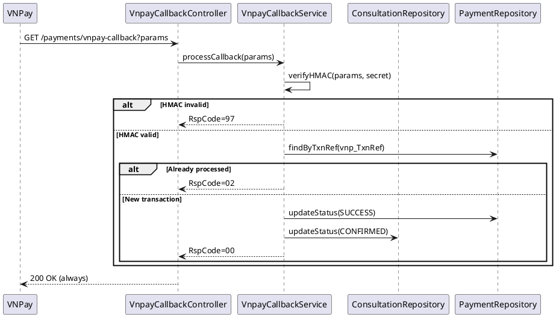

# ENGINEERING DOCUMENTATION STANDARD (EDS) v2.0
# UC-126 Process Payment Transaction

| Field | Value |
|-------|-------|
| **Document ID** | `CB-PAY-IMP-002` |
| **Version** | `1.0` |
| **Date** | `2026-06-26` |
| **Status** | `Draft` |
| **Author** | `AI Agent` |
| **Based on EDS** | `v2.0` |

---

## CHANGELOG

| Ngày | Người thực hiện | Nội dung thay đổi |
|------|-----------------|-------------------|
| 2026-06-26 | AI Agent | Khởi tạo TDS cho UC-126 |

---

## MỤC LỤC

1. [Tổng quan Module](#1-tổng-quan-module)
2. [Ma trận Truy vết](#2-ma-trận-truy-vết-traceability-matrix)
3. [Architecture Decision Records (ADR)](#3-architecture-decision-records-adr)
4. [Non-Functional Requirements & SLA](#4-non-functional-requirements--sla)
5. [Static Modeling](#5-static-modeling)
6. [Dynamic Modeling](#6-dynamic-modeling)
7. [Domain Event Catalog](#7-domain-event-catalog)
8. [Interface Specification](#8-interface-specification)
9. [API Specification](#9-api-specification)
10. [Bảng mã lỗi](#10-bảng-mã-lỗi)
11. [Quy trình Triển khai](#11-quy-trình-triển-khai-step-by-step)
12. [Rollback & Incident Runbook](#12-rollback--incident-runbook)
13. [Kịch bản Kiểm thử Chi tiết](#13-kịch-bản-kiểm-thử-chi-tiết)
14. [Phương pháp Xác minh](#14-phương-pháp-xác-minh)
15. [Mẫu thử thực tế](#15-mẫu-thử-thực-tế-api-verification-samples)
16. [Bảng tổng hợp phân quyền](#16-bảng-tổng-hợp-phân-quyền-authorization-matrix)
17. [AI Prompt Constraints](#17-ai-prompt-constraints-case-20)

---

## 1. Tổng quan Module

| Field | Value |
|-------|-------|
| **Module Name** | `ProcessPaymentTransaction` |
| **Bounded Context** | `payment` |
| **Data Classification** | `Confidential` |
| **Compliance Scope** | `PDPA` |
| **Upstream Dependencies** | `VNPay Gateway, consultation_payments` |
| **Downstream Consumers** | `commission (UC-127), audit, notification` |

**Mô tả:** Nhận và xử lý kết quả thanh toán từ VNPay (IPN callback). Verify HMAC-SHA512, xác nhận giao dịch, cập nhật `consultation_payments` và `consultations`. Đây là endpoint nhận callback từ VNPay — không do user trigger trực tiếp.

---

## 2. Ma trận Truy vết (Traceability Matrix)

| Requirement ID | Loại | Mô tả | Thành phần Code | Compliance Target | ADR liên quan |
|----------------|------|-------|-----------------|-------------------|---------------|
| UC-126 | Use Case | Xử lý IPN callback từ VNPay | `VnpayCallbackController`, `VnpayCallbackService` | BR-SECURITY | ADR-PAY-004 |
| BR-HMAC-FIRST | Business Rule | HMAC verification trước mọi xử lý | `VnpayCallbackService` | BR-SECURITY | ADR-PAY-004 |
| BR-HTTP200 | Business Rule | Luôn trả HTTP 200 cho VNPay | `VnpayCallbackController` | BR-INTEGRATION | ADR-PAY-005 |
| BR-IDEMPOTENT | Business Rule | Duplicate callback → RspCode=02 | `VnpayCallbackService` | BR-CONSISTENCY | ADR-PAY-005 |

---

## 3. Architecture Decision Records (ADR)

### ADR-PAY-004 — VNPay IPN endpoint security

| Field | Value |
|-------|-------|
| **Status** | `Accepted` |
| **Date** | `2026-06-26` |

#### Quyết định
VNPay IPN endpoint (`/api/v1/payment/vnpay/ipn`) không yêu cầu JWT (VNPay không gửi token). Bảo mật bằng:
1. IP whitelist (VNPay IP ranges).
2. HMAC-SHA512 signature verification (ADR-PAY-001).
3. Rate limiting: 100 req/min từ VNPay IPs.
Mọi request không pass signature check → HTTP 200 với `RspCode=97` (VNPay convention).

### ADR-PAY-005 — Transaction state transitions

| Field | Value |
|-------|-------|
| **Status** | `Accepted` |
| **Date** | `2026-06-26` |

#### Quyết định
`vnp_ResponseCode=00` → SUCCESS: `payment.status=SUCCESS`, `consultation.status=CONFIRMED`.
`vnp_ResponseCode!=00` → FAILED: `payment.status=FAILED`, slot released to AVAILABLE.
Duplicate callback (same txnRef, already SUCCESS) → return `RspCode=02` (already confirmed).

---

## 4. Non-Functional Requirements & SLA

### 4.1. Performance & Availability

| Category | Requirement | Target SLA |
|----------|-------------|------------|
| Latency | IPN callback processing (p99) | < 1000ms |
| Availability | Uptime (monthly) | 99.9% |
| Response | Always HTTP 200 to VNPay | 100% |

### 4.2. Security

| Category | Requirement | Target |
|----------|-------------|--------|
| Signature | HMAC-SHA512 verification | Every callback — reject if invalid |
| Secret | VNPAY_HASH_SECRET from environment | Never hardcoded |

---

## 5. Static Modeling

> Class diagram tham chiếu §8 Interface Specification.

### 5.1. Key Components

- `VnpayCallbackController` — receives IPN callbacks, always returns HTTP 200
- `VnpayCallbackService` — HMAC verification, idempotency check, payment status update
- `ConsultationPaymentRepository` — persistence for payment records

---

## 6. Dynamic Modeling

### 6.1. IPN Callback Processing Sequence



---

## 7. Domain Event Catalog

### 7.1. Events Published

| Event Name | Trigger | Publisher | Async? |
|------------|---------|-----------|--------|
| PaymentTransactionProcessed | IPN callback verified and processed | VnpayCallbackService | No |
| PaymentTransactionFailed | IPN callback with error response code | VnpayCallbackService | No |

### 7.2. Events Consumed

| Event Name | Source | Handler | Action |
|------------|--------|---------|--------|
| — | VNPay sends IPN callback directly | — | — |

---

## 8. Interface Specification

```java
public interface IVnpayCallbackService {
    /**
     * Processes VNPay IPN callback.
     * Returns VNPay-expected response format.
     */
    VnpayIpnResponse processIpn(Map<String, String> vnpayParams);
}

public class VnpayIpnResponse {
    private String rspCode;   // "00" = OK, "97" = checksum fail, "02" = already updated
    private String message;
}
```

---

## 9. API Specification

| Method | Path | Auth | Notes |
|--------|------|------|-------|
| `GET` | `/api/v1/payment/vnpay/ipn` | None (IP whitelist) | VNPay IPN |

**Response (always 200 for VNPay):**
```json
{ "RspCode": "00", "Message": "Confirm Success" }
```

---

## 10. Bảng mã lỗi

| Code | HTTP | Trigger |
|------|------|---------|
| `PAY-006` | 200+RspCode=97 | Signature verification failed |
| `PAY-007` | 200+RspCode=01 | Order not found |
| `PAY-008` | 200+RspCode=02 | Already confirmed (idempotent) |
| `PAY-009` | 200+RspCode=04 | Invalid amount |

---

## 11. Quy trình Triển khai (Step-by-Step)

### 11.1. Prerequisites

- [ ] consultation_payments table tồn tại (V32)
- [ ] VNPAY_HASH_SECRET env var đã set
- [ ] VNPay IPN IP whitelist đã configured

### 11.2. Pre-Migration Checklist

Không có migration mới — UC-126 dùng V32 table.

### 11.3. Implementation Steps

#### Chặng 1 — Implement HMAC verification (PHẢI chạy trước mọi thứ)

```java
public VnpayIpnResponse processIpn(Map<String, String> params) {
    String receivedHash = params.remove("vnp_SecureHash");
    params.remove("vnp_SecureHashType");
    // C1: Verify HMAC FIRST
    if (!vnpayService.verifyHmacSha512(params, receivedHash)) {
        return new VnpayIpnResponse("97", "Invalid Checksum");
    }
    String txnRef = params.get("vnp_TxnRef");
    ConsultationPayment payment = paymentRepo.findByVnpayTxnRef(txnRef)
        .orElse(null);
    if (payment == null) return new VnpayIpnResponse("01", "Order not found");
    // C3: Idempotency
    if (payment.getStatus() == PaymentStatus.SUCCESS)
        return new VnpayIpnResponse("02", "Order already confirmed");
    // Process
    String responseCode = params.get("vnp_ResponseCode");
    if ("00".equals(responseCode)) {
        processSuccess(payment);
    } else {
        processFailure(payment);
    }
    return new VnpayIpnResponse("00", "Confirm Success");
}
```

#### Chặng 2 — Controller (always HTTP 200)

```java
@GetMapping("/api/v1/payment/vnpay/ipn")
public ResponseEntity<VnpayIpnResponse> vnpayIpn(@RequestParam Map<String, String> params) {
    return ResponseEntity.ok(paymentService.processIpn(params)); // C2: always 200
}
```

### 11.4. Deployment Checklist

- [ ] Test SUCCESS callback → consultation CONFIRMED
- [ ] Test invalid HMAC → RspCode=97, no DB change
- [ ] Test duplicate → RspCode=02, no re-update
- [ ] Verify all responses are HTTP 200
- [ ] Test FAILED → slot released to AVAILABLE

---

## 12. Rollback & Incident Runbook

### 12.1. Điều kiện kích hoạt Rollback

| Điều kiện | Ngưỡng | Người quyết định |
|-----------|--------|------------------|
| HMAC verify bị bypass | Bất kỳ case | Tech Lead + DPO |
| Non-200 HTTP response cho VNPay | Bất kỳ case | Tech Lead |

### 12.2. Rollback Procedure

```bash
kubectl rollout undo deployment/carebridge-api
```

---

## 13. Kịch bản Kiểm thử Chi tiết

```gherkin
Feature: Process Payment Transaction (VNPay IPN)
  Scenario: SUCCESS callback → CONFIRMED
    Given valid HMAC, ResponseCode=00
    When processIpn(params)
    Then payment.status = SUCCESS
    And consultation.status = CONFIRMED
    And response RspCode=00

  Scenario: Invalid HMAC → RspCode=97
    Given tampered vnp_SecureHash
    When processIpn(params)
    Then response RspCode=97
    And payment.status NOT CHANGED

  Scenario: Always HTTP 200
    Given any callback (valid or invalid)
    When processIpn(params)
    Then HTTP status = 200

  Scenario: Duplicate → RspCode=02
    Given txnRef already SUCCESS
    When processIpn(same txnRef)
    Then response RspCode=02, no re-update

  Scenario: FAILED → slot released
    Given ResponseCode=99 (failed)
    When processIpn(params)
    Then payment.status = FAILED
    And slot.status = AVAILABLE
```

---

## 14. Phương pháp Xác minh

```sql
-- Verify payment status after callback
SELECT id, status, vnpay_txn_ref FROM consultation_payments WHERE vnpay_txn_ref = '<ref>';

-- Verify slot released on failure
SELECT s.status FROM expert_availability_slots s
JOIN consultations c ON c.slot_id = s.id
WHERE c.id = '<consultation_uuid>';
```

---

## 15. Mẫu thử thực tế (API Verification Samples)

```bash
# VNPay IPN callback (simulated)
curl -X GET "https://[host]/api/v1/payment/vnpay/ipn?\
vnp_TxnRef=TXN-UUID&vnp_ResponseCode=00&vnp_Amount=20000000&\
vnp_SecureHash=VALID_HMAC"
# Expected 200: {"RspCode":"00","Message":"Confirm Success"}
```

---

## 16. Bảng tổng hợp phân quyền (Authorization Matrix)

| Endpoint | Auth | Notes |
|----------|------|-------|
| `GET /api/v1/payment/vnpay/ipn` | IP whitelist | VNPay server only |

---

## 17. AI Prompt Constraints (CASE 2.0)

### 17.1 Constraint Summary Table

| # | Constraint | Source |
|---|-----------|--------|
| C1 | Verify HMAC-SHA512 signature FIRST — before any DB read/write | ADR-PAY-001 |
| C2 | Return HTTP 200 always (VNPay requirement) — use RspCode for status | ADR-PAY-004 |
| C3 | Idempotency: if already SUCCESS → RspCode=02, no update | ADR-PAY-002 |
| C4 | On SUCCESS: update payment.status=SUCCESS, consultation.status=CONFIRMED, release audit log | ADR-PAY-005 |
| C5 | On FAILED: update payment.status=FAILED, slot.status=AVAILABLE | ADR-PAY-005 |

### 17.2 Constraint Injection Block

```
[CONSTRAINT BLOCK — Module: ProcessPaymentTransaction (CB-PAY-IMP-002)]
1. (C1) verifyHmacSha512() PHẢI chạy TRƯỚC findByVnpayTxnRef() — invalid → RspCode=97 ngay.
2. (C2) Controller LUÔN return ResponseEntity.ok() — VNPay retry nếu non-200.
3. (C3) payment.status == SUCCESS → return RspCode=02, KHÔNG update lại.
4. (C4) SUCCESS: @Transactional { payment→SUCCESS, consultation→CONFIRMED, audit log }.
5. (C5) FAILED: payment→FAILED, slot→AVAILABLE (release cho người khác book).
```

### 17.3 Constraint Quality Checklist

- [x] Mỗi constraint traceable về ADR-PAY
- [x] Constraint block có ≥ 5 constraints cụ thể

### 17.4 Anti-Pattern Detection

| AP-ID | Anti-Pattern | Hành động |
|-------|-------------|----------|
| AP-AI-001 | DB read/write trước HMAC verify | Reject — C1 violation, security |
| AP-AI-003 | Return 400/500 cho VNPay | Reject — C2 violation, VNPay sẽ retry |

---

## PHỤ LỤC

### A. Glossary

| Thuật ngữ | Định nghĩa |
|-----------|------------|
| IPN | Instant Payment Notification — VNPay callback mechanism |
| RspCode | Response code trong body JSON — VNPay dùng để xác nhận |
| HMAC-SHA512 | Hash-based Message Authentication Code cho VNPay |
| Idempotent | Callback xử lý nhiều lần không gây side effect |

### B. Tài liệu tham chiếu

| Document | Path |
|----------|------|
| VNPay IPN Spec | https://sandbox.vnpayment.vn/apis/ |
| EDS v2.0 Template | `08_References/Template/PHASE-3_TDS.md` |

---

*EDS v2.1 — Tích hợp CASE 2.0 AI Prompt Constraints (§17).*
