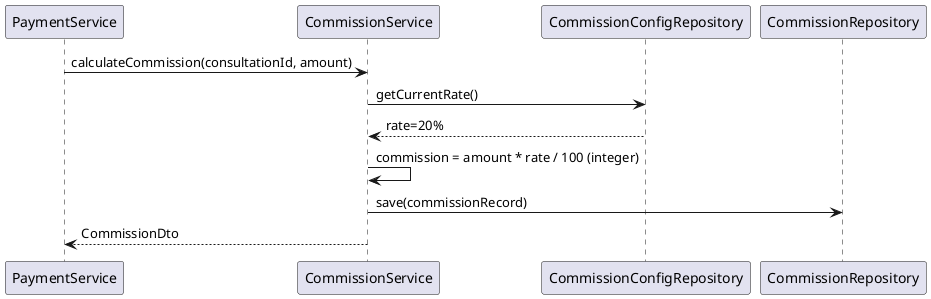

# ENGINEERING DOCUMENTATION STANDARD (EDS) v2.0
# UC-127 Calculate Commission

| Field | Value |
|-------|-------|
| **Document ID** | `CB-PAY-IMP-003` |
| **Version** | `1.0` |
| **Date** | `2026-06-26` |
| **Status** | `Draft` |
| **Author** | `AI Agent` |
| **Based on EDS** | `v2.0` |

---

## CHANGELOG

| Ngày | Người thực hiện | Nội dung thay đổi |
|------|-----------------|-------------------|
| 2026-06-26 | AI Agent | Khởi tạo TDS cho UC-127 |

---

## MỤC LỤC

1. [Tổng quan Module](#1-tổng-quan-module)
2. [Ma trận Truy vết](#2-ma-trận-truy-vết-traceability-matrix)
3. [Architecture Decision Records (ADR)](#3-architecture-decision-records-adr)
4. [Non-Functional Requirements & SLA](#4-non-functional-requirements--sla)
5. [Static Modeling](#5-static-modeling)
6. [Dynamic Modeling](#6-dynamic-modeling)
7. [Domain Event Catalog](#7-domain-event-catalog)
8. [Interface Specification](#8-interface-specification)
9. [API Specification](#9-api-specification)
10. [Bảng mã lỗi](#10-bảng-mã-lỗi)
11. [Quy trình Triển khai](#11-quy-trình-triển-khai-step-by-step)
12. [Rollback & Incident Runbook](#12-rollback--incident-runbook)
13. [Kịch bản Kiểm thử Chi tiết](#13-kịch-bản-kiểm-thử-chi-tiết)
14. [Phương pháp Xác minh](#14-phương-pháp-xác-minh)
15. [Mẫu thử thực tế](#15-mẫu-thử-thực-tế-api-verification-samples)
16. [Bảng tổng hợp phân quyền](#16-bảng-tổng-hợp-phân-quyền-authorization-matrix)
17. [AI Prompt Constraints](#17-ai-prompt-constraints-case-20)

---

## 1. Tổng quan Module

| Field | Value |
|-------|-------|
| **Module Name** | `CalculateCommission` |
| **Bounded Context** | `payment` |
| **Data Classification** | `Confidential` |
| **Upstream Dependencies** | `consultation_payments (status=SUCCESS)` |
| **Downstream Consumers** | `expert revenue report, admin dashboard` |

**Mô tả:** Tính toán phí platform và doanh thu chuyên gia từ mỗi giao dịch thành công. Commission được tính tự động sau khi payment thành công. Platform rate cấu hình được (default 20%).

---

## 2. Ma trận Truy vết (Traceability Matrix)

| Requirement ID | Loại | Mô tả | Thành phần Code | Compliance Target | ADR liên quan |
|----------------|------|-------|-----------------|-------------------|---------------|
| UC-127 | Use Case | Tính hoa hồng cho platform từ consultation fee | `CommissionController`, `CommissionService` | BR-FINANCE | — |
| BR-RATE-DB | Business Rule | Commission rate (20%) lấy từ DB config | `CommissionService` | BR-CONFIG | — |
| BR-INTEGER | Business Rule | Integer arithmetic — không dùng floating point | `CommissionService` | BR-PRECISION | — |
| BR-APPEND-ONLY | Business Rule | Commission records append-only, không UPDATE/DELETE | `CommissionService` | BR-AUDIT | — |

---

## 3. Architecture Decision Records (ADR)

### ADR-PAY-006 — Commission calculation formula

| Field | Value |
|-------|-------|
| **Status** | `Accepted` |
| **Date** | `2026-06-26` |

#### Quyết định
```
platform_fee = gross_amount × platform_rate (default 20%)
expert_revenue = gross_amount - platform_fee
```
`platform_rate` được cấu hình trong `commission_config` table (seed data). Không hardcode rate trong code. Commission record tạo ngay sau payment SUCCESS event.

### ADR-PAY-007 — Immutable commission records

| Field | Value |
|-------|-------|
| **Status** | `Accepted` |
| **Date** | `2026-06-26` |

#### Quyết định
Commission records là append-only. Không UPDATE/DELETE commission records. Nếu cần điều chỉnh (refund, dispute) → tạo `commission_adjustments` record mới với `adjustment_type` (REFUND, DISPUTE_CREDIT).

---

## 4. Non-Functional Requirements & SLA

### 4.1. Performance & Availability

| Category | Requirement | Target SLA |
|----------|-------------|------------|
| Latency | Commission calculation (p99) | < 200ms |
| Availability | Uptime (monthly) | 99.9% |
| Precision | Integer arithmetic (VND) | No floating point |

### 4.2. Security

| Category | Requirement | Target |
|----------|-------------|--------|
| Access control | System-internal / Admin only | Least privilege (§16) |
| Audit | Append-only commission records | BR-AUDIT |

---

## 5. Static Modeling

### 5.2. Flyway SQL Migration

```sql
-- (Included in V32 as part of payment module or as separate V34)
-- V34__create_commission_tables.sql

CREATE TABLE commission_config (
  id              UUID          PRIMARY KEY DEFAULT gen_random_uuid(),
  platform_rate   DECIMAL(5,4)  NOT NULL DEFAULT 0.2000,  -- 20%
  effective_from  TIMESTAMPTZ   NOT NULL DEFAULT NOW(),
  created_by      UUID          NOT NULL REFERENCES accounts(id)
);

-- Seed default rate
INSERT INTO commission_config (platform_rate, effective_from, created_by)
VALUES (0.2000, '2026-01-01T00:00:00Z', (SELECT id FROM accounts WHERE role='ROLE_ADMIN' LIMIT 1));

CREATE TABLE consultation_commissions (
  id                  UUID          PRIMARY KEY DEFAULT gen_random_uuid(),
  payment_id          UUID          NOT NULL UNIQUE REFERENCES consultation_payments(id),
  consultation_id     UUID          NOT NULL REFERENCES consultations(id),
  expert_id           UUID          NOT NULL REFERENCES expert_profiles(id),
  gross_amount_vnd    BIGINT        NOT NULL,
  platform_rate       DECIMAL(5,4)  NOT NULL,
  platform_fee_vnd    BIGINT        NOT NULL,
  expert_revenue_vnd  BIGINT        NOT NULL,
  calculated_at       TIMESTAMPTZ   NOT NULL DEFAULT NOW()
);

CREATE INDEX idx_commission_expert ON consultation_commissions(expert_id);
CREATE INDEX idx_commission_payment ON consultation_commissions(payment_id);
```

---

## 6. Dynamic Modeling

### 6.1. Calculate Commission Sequence



---

## 7. Domain Event Catalog

### 7.1. Events Published

| Event Name | Trigger | Publisher | Async? |
|------------|---------|-----------|--------|
| CommissionCalculated | Commission record created after payment | CommissionService | No |

### 7.2. Events Consumed

| Event Name | Source | Handler | Action |
|------------|--------|---------|--------|
| PaymentConfirmed | PaymentService (UC-76/UC-126) | CommissionService | Trigger commission calculation |

---

## 8. Interface Specification

```java
public interface ICommissionService {
    /**
     * Called after payment SUCCESS. Creates immutable commission record.
     */
    CommissionRecord calculateAndRecord(UUID paymentId, UUID consultationId, Long grossAmountVnd);
}
```

---

## 9. API Specification

| Method | Path | Auth | Required Roles |
|--------|------|------|----------------|
| `GET` | `/api/v1/admin/commissions` | JWT Bearer | `ROLE_ADMIN` |
| `GET` | `/api/v1/expert-profiles/{id}/revenue` | JWT Bearer | `ROLE_EXPERT` (own) |

**GET admin/commissions — 200 OK:**
```json
{
  "content": [
    {
      "commissionId": "uuid",
      "grossAmountVnd": 200000,
      "platformFeeVnd": 40000,
      "expertRevenueVnd": 160000,
      "calculatedAt": "2026-06-26T10:00:00Z"
    }
  ]
}
```

---

## 10. Bảng mã lỗi

| Code | HTTP | Trigger |
|------|------|---------|
| `COM-001` | 404 | Payment not found |
| `COM-002` | 409 | Commission already calculated for payment |
| `COM-003` | 403 | Access denied (non-admin or non-owner expert) |

---

## 11. Quy trình Triển khai (Step-by-Step)

### 11.1. Prerequisites

- [ ] consultation_payments table tồn tại (V32)
- [ ] ADR-PAY-006/007 đã Accepted

### 11.2. Pre-Migration Checklist

- [ ] Backup DB trước V34
- [ ] V34 test trên staging ≥ 24 giờ
- [ ] Seed commission_config với default rate (0.20)

### 11.3. Implementation Steps

#### Chặng 1 — Migration V34

```bash
./mvnw flyway:migrate
# V34__create_commission_tables.sql
# Tables: commission_config, commission_records
```

#### Chặng 2 — Implement calculation (integer arithmetic)

```java
public CommissionRecord calculateAndRecord(UUID paymentId, UUID consultationId, Long grossAmountVnd) {
    if (commissionRepo.existsByPaymentId(paymentId)) throw new ConflictException("COM-002");
    BigDecimal rate = commissionConfigRepo.findCurrentRate()
        .orElseThrow(() -> new ServerException("COM-004"));
    // Integer arithmetic — no floating point (ADR-PAY-006)
    long platformFeeVnd = grossAmountVnd * rate.movePointRight(2).longValue() / 100;
    long expertRevenueVnd = grossAmountVnd - platformFeeVnd;
    CommissionRecord record = new CommissionRecord(paymentId, consultationId,
        grossAmountVnd, platformFeeVnd, expertRevenueVnd, rate);
    return commissionRepo.save(record); // append-only, no UPDATE
}
```

### 11.4. Deployment Checklist

- [ ] V34 migration thành công
- [ ] commission_config seeded với rate=0.20
- [ ] Test 200000 gross → 40000 fee, 160000 revenue
- [ ] Test duplicate payment_id → 409 COM-002
- [ ] Verify no UPDATE/DELETE trên commission_records

---

## 12. Rollback & Incident Runbook

### 12.1. Điều kiện kích hoạt Rollback

| Điều kiện | Ngưỡng | Người quyết định |
|-----------|--------|------------------|
| Commission tính sai | Bất kỳ case | Tech Lead |
| Rate hardcoded | Bất kỳ case | Tech Lead |

### 12.2. Rollback Procedure

```bash
psql -h $DB_HOST -U $DB_USER -d $DB_NAME \
  -c "DROP TABLE IF EXISTS commission_records CASCADE;"
psql -h $DB_HOST -U $DB_USER -d $DB_NAME \
  -c "DROP TABLE IF EXISTS commission_config CASCADE;"
psql -h $DB_HOST -U $DB_USER -d $DB_NAME \
  -c "DELETE FROM flyway_schema_history WHERE version = '34';"
kubectl rollout undo deployment/carebridge-api
```

---

## 13. Kịch bản Kiểm thử Chi tiết

```gherkin
Feature: Calculate Commission
  Scenario: 20% rate → correct split
    Given commission_config.rate = 0.20, grossAmount = 200000
    When calculateAndRecord(paymentId, consultationId, 200000)
    Then platformFeeVnd == 40000
    And expertRevenueVnd == 160000

  Scenario: Rate from DB not hardcoded
    Given commission_config.rate = 0.15
    When calculateAndRecord(..., 200000)
    Then platformFeeVnd == 30000 (15%)

  Scenario: Duplicate → 409 COM-002
    Given commission for paymentId already exists
    When calculateAndRecord(same paymentId, ...)
    Then throws ConflictException COM-002

  Scenario: Append-only verified
    When commission record created
    Then UPDATE commission_records → denied by policy
    And DELETE commission_records → denied by policy

  Scenario: Non-admin → 403 COM-003
    When ROLE_MOTHER calls GET /admin/commissions
    Then 403 COM-003
```

---

## 14. Phương pháp Xác minh

```sql
-- Verify commission calculation
SELECT payment_id, gross_amount_vnd, platform_fee_vnd, expert_revenue_vnd
FROM commission_records WHERE payment_id = '<uuid>';
-- Expected: platform_fee = gross * rate, expert_revenue = gross - fee

-- Verify rate from config
SELECT rate FROM commission_config ORDER BY effective_from DESC LIMIT 1;

-- Verify no UPDATE/DELETE (check audit)
SELECT COUNT(*) FROM commission_records;
```

---

## 15. Mẫu thử thực tế (API Verification Samples)

```bash
# Admin views commissions
curl -X GET "https://[host]/api/v1/admin/commissions?page=0&size=20" \
  -H "Authorization: Bearer <ADMIN_JWT>"
# Expected 200: { "content": [...] }

# Expert views own revenue
curl -X GET "https://[host]/api/v1/expert-profiles/EXP-UUID/revenue" \
  -H "Authorization: Bearer <EXPERT_JWT>"
# Expected 200: { "totalRevenueVnd": 160000, ... }
```

---

## 16. Bảng tổng hợp phân quyền (Authorization Matrix)

| Endpoint | `ROLE_MOTHER` | `ROLE_EXPERT` | `ROLE_ADMIN` |
|----------|---------------|---------------|--------------|
| `GET /admin/commissions` | ❌ | ❌ | ✅ All |
| `GET /expert-profiles/{id}/revenue` | ❌ | ✅ Own | ✅ All |

---

## 17. AI Prompt Constraints (CASE 2.0)

### 17.1 Constraint Summary Table

| # | Constraint | Source |
|---|-----------|--------|
| C1 | platform_rate from commission_config table — NEVER hardcoded | ADR-PAY-006 |
| C2 | expert_revenue = gross - platform_fee (integer VND arithmetic, no floating point) | ADR-PAY-006 |
| C3 | Commission records append-only — no UPDATE or DELETE | ADR-PAY-007 |
| C4 | Called from payment service after SUCCESS callback, not directly by user | ADR-PAY-005 |
| C5 | Check for existing commission (unique on payment_id) before insert | ADR-PAY-007 |

### 17.2 Constraint Injection Block

```
[CONSTRAINT BLOCK — Module: CalculateCommission (CB-PAY-IMP-003)]
1. (C1) rate từ commission_config DB — KHÔNG hardcode 0.20.
2. (C2) Integer arithmetic: platformFee = gross * rate; expertRevenue = gross - platformFee. KHÔNG dùng floating point.
3. (C3) CommissionRecord là append-only — Repository KHÔNG có update() hay delete().
4. (C4) calculateAndRecord() chỉ gọi từ PaymentService.processSuccess() — không expose qua API.
5. (C5) existsByPaymentId() check trước insert → 409 COM-002 nếu duplicate.
```

### 17.3 Constraint Quality Checklist

- [x] Mỗi constraint traceable về ADR-PAY
- [x] Constraint block có ≥ 5 constraints

### 17.4 Anti-Pattern Detection

| AP-ID | Anti-Pattern | Hành động |
|-------|-------------|----------|
| AP-AI-001 | Hardcode rate = 0.20 | Reject — C1 violation |
| AP-AI-003 | Dùng double/float cho tiền VND | Reject — C2, precision loss |
| AP-AI-005 | Expose calculateAndRecord qua REST endpoint | Reject — C4, internal only |

---

## PHỤ LỤC

### A. Glossary

| Thuật ngữ | Định nghĩa |
|-----------|------------|
| Commission | Phí nền tảng: platform_fee = gross * rate |
| Append-only | Chỉ INSERT, không UPDATE hay DELETE — immutable audit trail |
| Integer arithmetic | Tính tiền VND bằng long — tránh floating point rounding |

### B. Tài liệu tham chiếu

| Document | Path |
|----------|------|
| EDS v2.0 Template | `08_References/Template/PHASE-3_TDS.md` |

---

*EDS v2.1 — Tích hợp CASE 2.0 AI Prompt Constraints (§17).*
