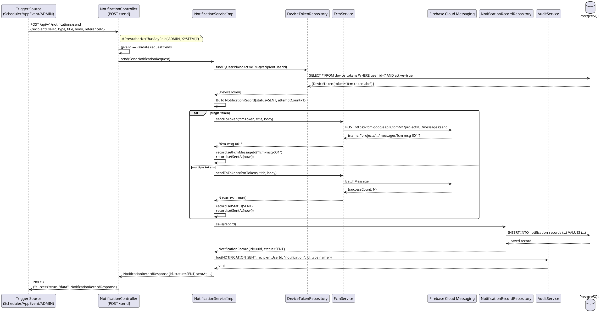
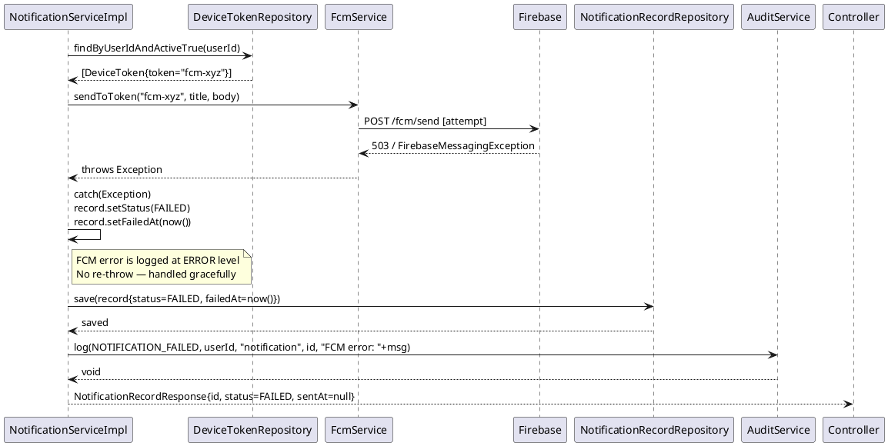
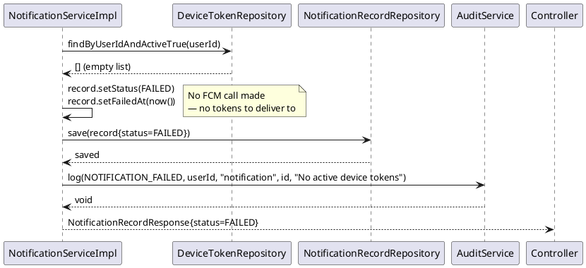
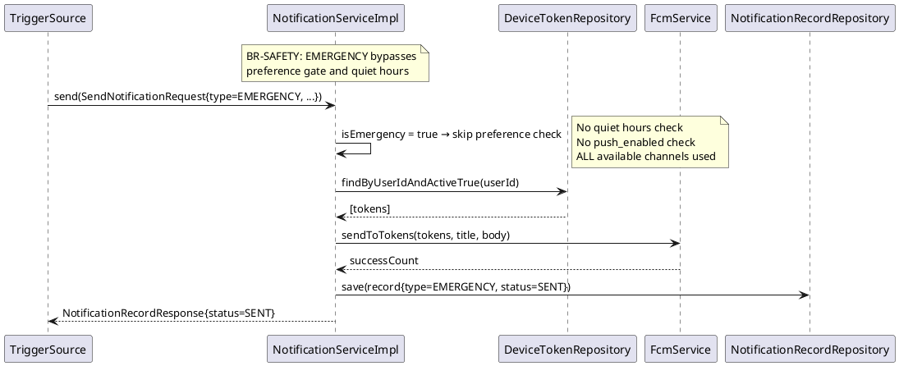
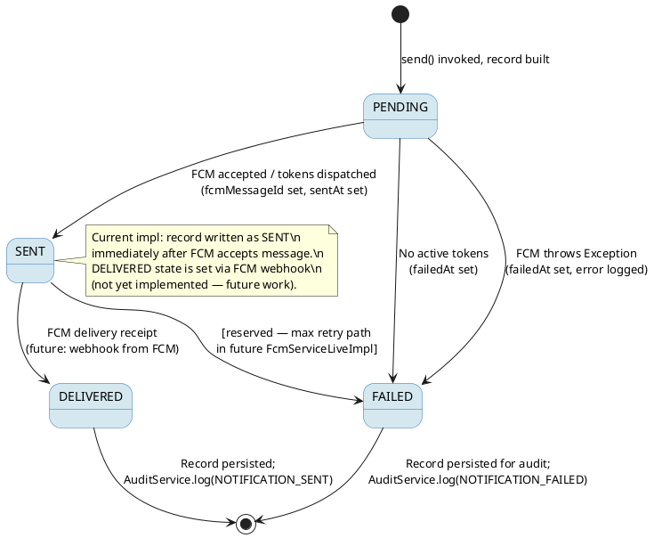

# ENGINEERING DOCUMENTATION STANDARD (EDS) v2.0
# Technical Design Specification — UC-128 Send Automated Notification

| Field              | Value                                              |
|--------------------|----------------------------------------------------|
| **Document ID**    | `CB-NOTIF-IMP-128`                                 |
| **Version**        | `1.0`                                              |
| **Date**           | `2026-06-28`                                       |
| **Status** | `Implemented`                                            |
| **Document Owner** | `PhuongNT`                                         |
| **Author**         | `AI Agent`                                         |
| **Reviewed by**    | `[Tech Lead]`                                      |
| **DPO Sign-off**   | `[ ] Pending`                                      |
| **Approved by**    | `[Principal Architect]`                            |
| **Last Review**    | `2026-06-28`                                       |
| **Based on EDS**   | `v2.0`                                             |
| **Function ID**    | `3.1.2.3`                                          |
| **Related UC**     | `UC-128 SendAutomatedNotification`                 |
| **Package**        | `com.carebridge.backend.notification`              |

---

## CHANGELOG

| Date       | Author   | Description                                              |
|------------|----------|----------------------------------------------------------|
| 2026-06-28 | AI Agent | Initial draft for UC-128 Send Automated Notification     |

---

## TABLE OF CONTENTS

1. [Module Overview](#1-module-overview)
2. [Traceability Matrix](#2-traceability-matrix)
3. [Architecture Decision Records (ADR)](#3-architecture-decision-records-adr)
4. [Non-Functional Requirements & SLA](#4-non-functional-requirements--sla)
5. [Static Modeling](#5-static-modeling)
6. [Dynamic Modeling](#6-dynamic-modeling)
7. [Domain Event Catalog](#7-domain-event-catalog)
8. [Interface Specification](#8-interface-specification)
9. [API Specification](#9-api-specification)
10. [Error Codes Table](#10-error-codes-table)
11. [Deployment Steps](#11-deployment-steps)
12. [Rollback Runbook](#12-rollback-runbook)
13. [Test Scenarios](#13-test-scenarios)
14. [Verification Methods](#14-verification-methods)
15. [API Verification Samples](#15-api-verification-samples)
16. [Authorization Matrix](#16-authorization-matrix)
17. [AI Prompt Constraints (CASE 2.0)](#17-ai-prompt-constraints-case-20)

---

## 1. Module Overview

| Field                     | Value                                                                                               |
|---------------------------|-----------------------------------------------------------------------------------------------------|
| **Module Name**           | `AutomatedNotification`                                                                             |
| **Bounded Context**       | `notification`                                                                                      |
| **UC ID**                 | `UC-128`                                                                                            |
| **SRS Reference**         | `3.1.2.3`                                                                                           |
| **Primary Actor**         | `System (internal scheduler / application event publisher)`                                         |
| **Secondary Actor**       | `Firebase Cloud Messaging (FCM), Gmail SMTP, Flutter Mobile Client`                                 |
| **Platform**              | `Backend (Spring Boot) / External (FCM + SMTP)`                                                     |
| **Data Classification**   | `Internal — notification content may reference PHI indirectly via referenceId`                      |
| **Compliance Scope**      | `BR-RBAC, BR-SAFETY, BR-CONSULTATION, BR-PRIVACY`                                                   |
| **Upstream Dependencies** | `care (Reminder entity), consultation, community, identity (User + DeviceToken), notification_preferences` |
| **Downstream Consumers**  | `audit (AuditLog), UC-11 ViewNotifications, UC-12 MarkNotificationsAsRead`                          |

### 1.1 Purpose

UC-128 is the **central automated notification dispatcher** for CareBridge. It is system-initiated — no direct user action triggers it. When internal application events occur (a reminder becomes due, a consultation is accepted, an expert replies to a community question, an emergency alert is raised), this module:

1. Evaluates the recipient's `notification_preferences` (channel on/off, quiet hours).
2. Dispatches the notification via the appropriate channel(s): push (FCM), in-app (persisted in `notification_records`), and/or email (Gmail SMTP).
3. Persists a `NotificationRecord` with delivery status (`SENT`, `DELIVERED`, `FAILED`).
4. Emits an audit log event.

### 1.2 Scope

| Item                     | In Scope                                                          | Out of Scope                                      |
|--------------------------|-------------------------------------------------------------------|---------------------------------------------------|
| Channels                 | Push (FCM), in-app (DB record), email (Gmail SMTP)               | SMS, WhatsApp, Slack                              |
| Notification Types       | REMINDER, COMMUNITY_REPLY, CONSULTATION, EMERGENCY               | Custom/ad-hoc broadcast (use admin panel)         |
| Trigger mechanism        | Internal service calls, Spring application events                 | Webhook ingestion from third parties              |
| Preference enforcement   | Quiet hours, per-type on/off per channel                          | Global opt-out enforcement (separate UC)          |
| Retry                    | FCM: up to 3 attempts with exponential backoff                    | Email retry (synchronous, fail-fast)              |
| Deduplication            | Idempotency key on `(userId, referenceId, type, window=5min)`     | Cross-session dedup                               |
| Security                 | RBAC — only ADMIN/SYSTEM roles may invoke send endpoint           | End-to-end notification encryption                |

### 1.3 Actors

- **Primary**: System (scheduler, Spring `@EventListener`, or ADMIN calling internal endpoint)
- **Secondary**: FCM (push delivery), Gmail SMTP (email delivery), Flutter client (receives push)

### 1.4 Preconditions

1. Recipient user exists in `users` table with a valid account.
2. At least one of the following is true: user has ≥1 active FCM token in `device_tokens`, or email notifications are enabled in `notification_preferences`.
3. `notification_preferences` rows exist for the user (or system falls back to defaults: all channels ON, no quiet hours).
4. `carebridge.fcm.enabled=true` in application config for real FCM delivery (stub is used otherwise).
5. `spring.mail.*` properties configured for SMTP email delivery.

### 1.5 Postconditions

- A `NotificationRecord` row is inserted with `status = SENT | FAILED` and `sentAt` or `failedAt` set.
- Audit entry is written via `AuditService.log()` with action `NOTIFICATION_SENT` or `NOTIFICATION_FAILED`.
- If FCM delivery succeeds, `fcmMessageId` is stored on the record.
- Caller receives `NotificationRecordResponse` DTO (never the entity).

### 1.6 Data Flow (High-Level)

```
[Trigger Source]                     [Notification Module]                   [Channels]
  Scheduler                  →  AutomatedNotificationService                 →  FCM
  AppEvent (Spring)          →       ┌─ checkPreferences()                   →  In-App DB
  POST /api/v1/notifications/send    ├─ dispatchPush() via FcmService        →  Gmail SMTP
  (ADMIN/SYSTEM)             →       ├─ dispatchInApp() → NotificationRecord
                                     └─ dispatchEmail() via JavaMailSender
```

---

## 2. Traceability Matrix

| Requirement ID       | Type          | Description                                                              | Code Artifact                                             | ADR Reference   |
|----------------------|---------------|--------------------------------------------------------------------------|-----------------------------------------------------------|-----------------|
| UC-128               | Use Case      | System sends automated notification on trigger                           | `NotificationService.send()`                             | ADR-128-001     |
| BR-RBAC              | Business Rule | Only ADMIN/SYSTEM roles may invoke programmatic send                     | `@PreAuthorize("hasAnyRole('ADMIN','SYSTEM')")`           | —               |
| BR-SAFETY            | Business Rule | EMERGENCY alerts bypass quiet hours and preference gates                 | `isEmergency()` bypass in preference check               | ADR-128-003     |
| BR-CONSULTATION      | Business Rule | CONSULTATION notification triggered on booking/status change             | Upstream event from consultation module                  | —               |
| BR-PRIVACY           | Business Rule | Notification body must NOT expose PHI; reference only via `referenceId`  | `SendNotificationRequest.body` — plain text only          | ADR-128-004     |
| SRS-128-FR-01        | Functional    | System sends push via FCM when `push_enabled=true` for user and type    | `FcmService.sendToToken()` / `sendToTokens()`            | ADR-128-001     |
| SRS-128-FR-02        | Functional    | System persists in-app notification record in `notification_records`     | `NotificationRecordRepository.save()`                    | —               |
| SRS-128-FR-03        | Functional    | System sends email when `email_enabled=true` for user and type          | `JavaMailSender.send()` in `EmailNotificationService`    | ADR-128-002     |
| SRS-128-FR-04        | Functional    | Quiet hours respected: no push/email during quiet window (EMERGENCY exempt) | `PreferenceGate.isQuietHour()`                        | ADR-128-003     |
| SRS-128-FR-05        | Functional    | Idempotency: duplicate dispatch within 5-min window is suppressed       | `NotificationRecordRepository.existsByUserAndRefAndWindow()` | ADR-128-005 |
| SRS-128-FR-06        | Functional    | FCM delivery failure → retry up to 3 times with exponential backoff      | `FcmService.sendToToken()` + `@Retryable`               | ADR-128-001     |
| SRS-128-NFR-01       | NFR           | End-to-end dispatch latency ≤ 2s (P95) for non-email channels           | Async email dispatch, sync FCM                           | —               |
| SRS-128-SEC-01       | Security      | FCM Service Account credential not hardcoded — from env/vault            | `@ConditionalOnProperty(carebridge.fcm.enabled)`         | ADR-128-001     |
| ERR-NOTIF-020        | Error         | 400 when recipientUserId or type missing                                 | `@Valid` on `SendNotificationRequest`                    | —               |
| ERR-NOTIF-021        | Error         | 403 when caller lacks ADMIN/SYSTEM role                                  | Spring Security PreAuthorize                             | —               |
| ERR-NOTIF-022        | Error         | 503 when FCM delivery fails after all retries                            | Exception caught, status=FAILED in record                | —               |

---

## 3. Architecture Decision Records (ADR)

### ADR-128-001 — FCM as Push Channel; Stub Pattern for Dev/Test

| Field        | Value                                  |
|--------------|----------------------------------------|
| **Status**   | `Accepted`                             |
| **Deciders** | `PhuongNT, Tech Lead`                  |
| **Date**     | `2026-06-28`                           |

#### Context
CareBridge uses Firebase ecosystem. The Flutter mobile client integrates with FCM natively. Backend needs to send push notifications without coupling to platform-specific APNS/GCM directly.

#### Options Considered

| Option | Description                | Pros                              | Cons                          |
|--------|----------------------------|-----------------------------------|-------------------------------|
| A      | Firebase Admin SDK (FCM)   | Free, cross-platform, official    | Google dependency             |
| B      | OneSignal                  | Better analytics dashboard        | Paid at scale, vendor lock-in |
| C      | Direct APNS/GCM            | No third-party                    | Platform-specific code        |

#### Decision
**FCM via firebase-admin SDK.** A `@ConditionalOnProperty(carebridge.fcm.enabled=false)` stub (`FcmServiceImpl`) is active by default for local dev/test to avoid requiring credentials. Production switches via env var.

#### Consequences
- `carebridge.fcm.enabled=true` must be set in production with `FIREBASE_SERVICE_ACCOUNT_PATH`.
- Stub logs at INFO level to confirm it would have sent.
- Real FCM impl (`FcmServiceLiveImpl`) must be added when credentials are ready.

---

### ADR-128-002 — Email via Gmail SMTP (JavaMailSender); Async Dispatch

| Field        | Value          |
|--------------|----------------|
| **Status**   | `Accepted`     |
| **Date**     | `2026-06-28`   |

#### Decision
Email notifications use Spring's `JavaMailSender` with Gmail SMTP (`spring.mail.host=smtp.gmail.com`). Email dispatch is **asynchronous** (`@Async`) to avoid blocking the notification thread. Failures are caught and logged; they do not fail the overall notification record (FCM + in-app are the primary channels).

---

### ADR-128-003 — EMERGENCY Type Bypasses Preference Gate and Quiet Hours

| Field        | Value          |
|--------------|----------------|
| **Status**   | `Accepted`     |
| **Date**     | `2026-06-28`   |

#### Context
BR-SAFETY mandates that safety-critical alerts reach the user regardless of their mute settings.

#### Decision
When `NotificationType.EMERGENCY` is dispatched, the preference gate check (`push_enabled`, `email_enabled`, quiet hours) is **skipped entirely**. The notification always goes through all available channels.

#### Consequences
- EMERGENCY must never be used for non-urgent content (misuse = harassment risk).
- Audit log must flag every EMERGENCY dispatch with enhanced detail.

---

### ADR-128-004 — BR-PRIVACY: No PHI in Notification Body

| Field        | Value          |
|--------------|----------------|
| **Status**   | `Accepted`     |
| **Date**     | `2026-06-28`   |

#### Decision
`SendNotificationRequest.body` and `title` fields must never contain raw PHI (names, diagnoses, health metrics). Callers MUST pass a plain message with a `referenceId` (UUID) linking to the domain entity. The mobile client fetches detail on tap using `referenceId` + `referenceType`. This is validated by code review convention, not by automated PII scanning (PII scanning is a future enhancement).

---

### ADR-128-005 — Idempotency: 5-Minute Deduplication Window

| Field        | Value          |
|--------------|----------------|
| **Status**   | `Accepted`     |
| **Date**     | `2026-06-28`   |

#### Decision
Before dispatching, the service checks if a `NotificationRecord` with the same `(userId, type, referenceId)` exists with `created_at > now() - 5 minutes`. If found, the dispatch is skipped and the existing record is returned. This prevents duplicate push notifications from retry storms or duplicate event publications.

Exception: `NotificationType.EMERGENCY` — deduplication window is reduced to 30 seconds to ensure critical alerts are never suppressed too long.

---

## 4. Non-Functional Requirements & SLA

### 4.1 Performance & Availability

| Category         | Requirement                                   | Target SLA           | Measurement Method             |
|------------------|-----------------------------------------------|----------------------|--------------------------------|
| Dispatch latency | End-to-end for push + in-app                  | ≤ 2s P95             | Spring Boot Actuator metrics   |
| Email latency    | Email sent (async, non-blocking)              | ≤ 10s P95 (best effort) | SMTP send log                |
| FCM retry        | Success rate after up to 3 attempts           | ≥ 99%                | FCM dashboard + audit counts   |
| Throughput       | Notifications dispatched per minute           | 1,000 / min          | Load test                      |
| Availability     | Service availability                          | 99.5% uptime         | Health check endpoint          |

### 4.2 Data Integrity & Retention

| Category           | Requirement                                | Target      | Verification Method         |
|--------------------|--------------------------------------------|-------------|-----------------------------|
| Durability         | No notification_record lost on dispatch    | RPO = 0     | `@Transactional` on save    |
| Idempotency        | No duplicate for same ref within 5 min     | 100%        | Unit test + dedup check     |
| Retention          | notification_records retained              | 2 years     | DB cleanup job (future)     |
| Audit completeness | Every dispatch generates audit entry       | 100%        | AuditService verification   |

### 4.3 Security

| Category          | Requirement                                         | Target            | Verification Method     |
|-------------------|-----------------------------------------------------|-------------------|-------------------------|
| RBAC enforcement  | Only ADMIN/SYSTEM may invoke send endpoint          | 100%              | Spring Security test    |
| Credential safety | FCM Service Account not in source code              | 0 violations      | CI secret scan          |
| PHI protection    | Notification body contains no raw PHI               | 0 PHI leaks       | Code review convention  |
| Quiet hours       | No push/email during quiet window (EMERGENCY exempt)| 100% compliance   | Unit test               |

---

## 5. Static Modeling

### 5.1 Class Diagram (PlantUML)

```plantuml
@startuml UC128_AutomatedNotification_ClassDiagram
skinparam classAttributeIconSize 0
skinparam ClassBorderColor #2E75B6
skinparam ClassHeaderBackgroundColor #D5E8F0

package "com.carebridge.backend.notification" {

    package "entity" {
        enum NotificationType {
            REMINDER
            COMMUNITY_REPLY
            CONSULTATION
            EMERGENCY
        }

        enum NotificationRecordStatus {
            SENT
            DELIVERED
            FAILED
        }

        enum DevicePlatform {
            ANDROID
            IOS
            WEB
        }

        class NotificationRecord {
            + id: UUID
            + userId: UUID
            + type: NotificationType
            + title: String
            + body: String
            + referenceId: UUID
            + referenceType: String
            + status: NotificationRecordStatus
            + fcmMessageId: String
            + attemptCount: int
            + createdAt: Instant
            + sentAt: Instant
            + failedAt: Instant
        }

        class DeviceToken {
            + id: UUID
            + userId: UUID
            + token: String
            + platform: DevicePlatform
            + active: boolean
            + createdAt: Instant
            + updatedAt: Instant
        }

        NotificationRecord *-- NotificationType
        NotificationRecord *-- NotificationRecordStatus
        DeviceToken *-- DevicePlatform
    }

    package "dto" {
        class SendNotificationRequest <<record>> {
            + recipientUserId: UUID [NotNull]
            + type: NotificationType [NotNull]
            + title: String [NotBlank, Size(max=255)]
            + body: String [NotBlank]
            + referenceId: UUID [nullable]
            + referenceType: String [Size(max=50), nullable]
        }

        class RegisterDeviceTokenRequest <<record>> {
            + token: String [NotBlank, Size(max=512)]
            + platform: DevicePlatform [NotNull]
        }

        class NotificationRecordResponse <<record>> {
            + id: UUID
            + userId: UUID
            + type: String
            + title: String
            + body: String
            + referenceId: UUID
            + referenceType: String
            + status: String
            + createdAt: Instant
            + sentAt: Instant
        }
    }

    package "repository" {
        interface NotificationRecordRepository {
            + findByUserId(userId: UUID, pageable: Pageable): Page<NotificationRecord>
            + findByUserIdAndType(userId: UUID, type: NotificationType, pageable: Pageable): Page<NotificationRecord>
        }

        interface DeviceTokenRepository {
            + findByUserIdAndActiveTrue(userId: UUID): List<DeviceToken>
            + findByUserIdAndToken(userId: UUID, token: String): Optional<DeviceToken>
            + deactivateByToken(token: String, now: Instant): int
            + deactivateAllForUser(userId: UUID, now: Instant): int
        }
    }

    package "service" {
        interface NotificationService {
            + registerDeviceToken(userId: UUID, request: RegisterDeviceTokenRequest): void
            + deregisterDeviceToken(userId: UUID, token: String): void
            + send(request: SendNotificationRequest): NotificationRecordResponse
            + getMyNotifications(userId: UUID, type: String, pageable: Pageable, principal: Principal): Page<NotificationRecordResponse>
        }

        interface FcmService {
            + sendToToken(fcmToken: String, title: String, body: String): String
            + sendToTokens(fcmTokens: List<String>, title: String, body: String): int
        }

        class NotificationServiceImpl {
            - deviceTokenRepository: DeviceTokenRepository
            - notificationRecordRepository: NotificationRecordRepository
            - fcmService: FcmService
            - auditService: AuditService
            + registerDeviceToken(userId, request): void
            + deregisterDeviceToken(userId, token): void
            + send(request): NotificationRecordResponse
            + getMyNotifications(userId, type, pageable, principal): Page<NotificationRecordResponse>
            - toResponse(record: NotificationRecord): NotificationRecordResponse
        }

        class FcmServiceImpl {
            <<@ConditionalOnProperty(carebridge.fcm.enabled=false)>>
            + sendToToken(fcmToken, title, body): String [returns null - STUB]
            + sendToTokens(fcmTokens, title, body): int [returns 0 - STUB]
        }

        NotificationServiceImpl ..|> NotificationService
        FcmServiceImpl ..|> FcmService
        NotificationServiceImpl --> DeviceTokenRepository
        NotificationServiceImpl --> NotificationRecordRepository
        NotificationServiceImpl --> FcmService
    }

    package "controller" {
        class NotificationController {
            - notificationService: NotificationService
            + registerDeviceToken(request: RegisterDeviceTokenRequest, principal): ResponseEntity
            + deregisterDeviceToken(token: String, principal): ResponseEntity
            + getMyNotifications(type, page, size, principal): ResponseEntity
            + sendNotification(request: SendNotificationRequest): ResponseEntity
        }

        NotificationController --> NotificationService
    }
}

package "com.carebridge.backend.audit" {
    class AuditService {
        + log(action: AuditAction, userId: UUID, entityType: String, entityId: String, detail: String): void
    }

    enum AuditAction {
        NOTIFICATION_SENT
        NOTIFICATION_FAILED
    }
}

NotificationServiceImpl ..> AuditService
NotificationServiceImpl ..> AuditAction

@enduml
```



### 5.2 Existing Database Schema

The following tables are **already created** by `V1__init_schema.sql` and are the authoritative source of truth for this feature.

```sql
-- notification_preferences — stores per-user, per-type channel preferences
-- Source: V1__init_schema.sql (authoritative)
CREATE TABLE public.notification_preferences (
    preference_id   uuid NOT NULL PRIMARY KEY,
    created_at      timestamp(6) with time zone NOT NULL,
    email_enabled   boolean,
    in_app_enabled  boolean,
    notification_type character varying(50),
    push_enabled    boolean,
    quiet_hours_end time(0) without time zone,
    quiet_hours_start time(0) without time zone,
    updated_at      timestamp(6) with time zone,
    user_id         uuid
);

-- notifications — in-app notification records (referenced by UC-11, UC-12)
-- Source: V1__init_schema.sql (authoritative)
CREATE TABLE public.notifications (
    notification_id   uuid NOT NULL PRIMARY KEY,
    body              text,
    created_at        timestamp(6) with time zone NOT NULL,
    delivery_status   character varying(20),
    is_read           boolean,
    notification_type character varying(50),
    recipient_user_id uuid,
    reference_id      uuid,
    reference_type    character varying(50),
    sent_at           timestamp(6) with time zone,
    title             character varying(200),
    updated_at        timestamp(6) with time zone
);
```

> **IMPORTANT NOTE ON TABLE DUALITY**: The codebase currently has TWO tables that store notification data:
>
> 1. `notification_records` — entity managed by `NotificationRecord.java` (table name: `notification_records`). This is the **active** table used by `NotificationServiceImpl` today.
> 2. `notifications` — from `V1__init_schema.sql`, used by `UC-11 ViewNotifications` / `UC-12 MarkAsRead`.
>
> **Recommendation (ADR-128-006)**: Implementation must clarify which table `NotificationServiceImpl.send()` writes to. Until an ADR reconciles this, the implementation MUST write to `notification_records` (the entity-backed table) and a **Flyway migration must NOT modify `V1`**. A new migration (`V_N__reconcile_notification_tables.sql`) should be proposed separately.

### 5.3 Required Flyway Migration (Additive Indexes)

```sql
-- V_N__add_notification_indexes.sql
-- Additive only — no schema changes to V1 tables
-- Author: AI Agent | Date: 2026-06-28

-- Speed up preference lookup by userId + type
CREATE INDEX IF NOT EXISTS idx_notification_prefs_user_type
    ON notification_preferences(user_id, notification_type);

-- Speed up dedup check (userId, type, referenceId, created_at)
CREATE INDEX IF NOT EXISTS idx_notification_records_dedup
    ON notification_records(user_id, type, reference_id, created_at DESC)
    WHERE status != 'FAILED';

-- Speed up listing by userId + createdAt
CREATE INDEX IF NOT EXISTS idx_notification_records_user_created
    ON notification_records(user_id, created_at DESC);
```

---

## 6. Dynamic Modeling

### 6.1 Sequence Diagram — Happy Path (Push + In-App)



### 6.2 Sequence Diagram — FCM Failure (Fallback to FAILED Status)



### 6.3 Sequence Diagram — No Active Device Tokens



### 6.4 Sequence Diagram — EMERGENCY Type (Preference Gate Bypass)



### 6.5 State Machine — NotificationRecord Lifecycle



---

## 7. Domain Event Catalog

### 7.1 Events Published

| Event Name                      | Trigger                              | Publisher                  | Subscriber(s)          | Async? | Payload Fields                                                                |
|---------------------------------|--------------------------------------|----------------------------|------------------------|--------|-------------------------------------------------------------------------------|
| `NOTIFICATION_SENT`             | FCM dispatch succeeded               | `NotificationServiceImpl`  | `AuditService`         | No     | `userId, notificationId, type, fcmMessageId, timestamp`                       |
| `NOTIFICATION_FAILED`           | FCM failed or no tokens              | `NotificationServiceImpl`  | `AuditService`         | No     | `userId, notificationId, type, reason, timestamp`                             |

### 7.2 Events Consumed

| Event Name           | Source Domain        | Handler                              | Action                                                |
|----------------------|----------------------|--------------------------------------|-------------------------------------------------------|
| `ReminderDue`        | `care` module        | `ReminderNotificationEventHandler`   | Calls `NotificationService.send()` with type=REMINDER |
| `ConsultationUpdated`| `consultation` module| `ConsultationNotificationHandler`    | Calls `send()` with type=CONSULTATION                 |
| `CommunityReply`     | `community` module   | `CommunityReplyNotificationHandler`  | Calls `send()` with type=COMMUNITY_REPLY              |
| `EmergencyAlert`     | `safety` / `care`   | `EmergencyNotificationHandler`       | Calls `send()` with type=EMERGENCY                    |

### 7.3 Event Payload Schema

```java
// NotificationDispatchedEvent.java
public record NotificationDispatchedEvent(
    String eventId,               // UUID, unique per event
    String eventType,             // "NOTIFICATION_SENT" | "NOTIFICATION_FAILED"
    Instant occurredAt,
    String version,               // "1.0"
    UUID recipientUserId,
    UUID notificationRecordId,
    String notificationType,      // REMINDER | COMMUNITY_REPLY | CONSULTATION | EMERGENCY
    String status,                // SENT | FAILED
    String fcmMessageId,          // null if FAILED
    String failureReason,         // null if SENT
    String correlationId          // referenceId.toString()
) {}
```

---

## 8. Interface Specification

### 8.1 NotificationService Interface (Existing — Extend for UC-128)

```java
package com.carebridge.backend.notification.service;

import com.carebridge.backend.notification.dto.NotificationRecordResponse;
import com.carebridge.backend.notification.dto.RegisterDeviceTokenRequest;
import com.carebridge.backend.notification.dto.SendNotificationRequest;

import java.security.Principal;
import java.util.UUID;

import org.springframework.data.domain.Page;
import org.springframework.data.domain.Pageable;

/**
 * Core notification service — manages device tokens, dispatches automated
 * notifications, and retrieves notification history.
 *
 * UC-128 is served by the {@link #send(SendNotificationRequest)} method.
 *
 * Contract rules:
 * 1. send() MUST persist a NotificationRecord regardless of FCM outcome.
 * 2. send() MUST log an AuditAction (NOTIFICATION_SENT or NOTIFICATION_FAILED).
 * 3. send() MUST NOT expose FCM exceptions to callers — catch and record FAILED status.
 * 4. EMERGENCY type notifications bypass preference gate (BR-SAFETY).
 * 5. Never expose JPA entities — always return NotificationRecordResponse.
 *
 * @version 1.0
 */
public interface NotificationService {

    /**
     * Register an FCM device token for a user.
     * Upserts: if token already exists, reactivates it.
     */
    void registerDeviceToken(UUID userId, RegisterDeviceTokenRequest request);

    /**
     * Deactivate (soft-delete) a device token for logout/uninstall.
     */
    void deregisterDeviceToken(UUID userId, String token);

    /**
     * Dispatch an automated notification to the specified user.
     * Handles FCM delivery, in-app record persistence, and audit logging.
     * Called by system schedulers, event handlers, or ADMIN API.
     *
     * @param request  Validated dispatch request (recipientUserId, type, title, body)
     * @return         NotificationRecordResponse with final delivery status
     */
    NotificationRecordResponse send(SendNotificationRequest request);

    /**
     * Paginated retrieval of notification records for the authenticated user.
     * Filters by optional type. Ownership enforced by userId from JWT.
     */
    Page<NotificationRecordResponse> getMyNotifications(
        UUID userId, String type, Pageable pageable, Principal principal);
}
```

### 8.2 FcmService Interface (Existing)

```java
package com.carebridge.backend.notification.service;

import java.util.List;

/**
 * FCM abstraction layer.
 * Current active implementation: FcmServiceImpl (stub, carebridge.fcm.enabled=false).
 * Production implementation: FcmServiceLiveImpl (carebridge.fcm.enabled=true) — to be built.
 *
 * Contract rules:
 * - sendToToken() returns null on stub; returns FCM message ID on live.
 * - Both methods MUST NOT throw checked exceptions — wrap in RuntimeException.
 * - Callers wrap in try/catch and set NotificationRecord.status = FAILED on error.
 */
public interface FcmService {

    /**
     * Send push notification to a single FCM token.
     *
     * @param fcmToken FCM registration token for the target device
     * @param title    Notification title (max 200 chars)
     * @param body     Notification body (max 500 chars)
     * @return FCM message ID on success; null if FCM disabled/stub active
     * @throws RuntimeException on FCM API failure (caller must catch)
     */
    String sendToToken(String fcmToken, String title, String body);

    /**
     * Multicast push notification to multiple tokens (same user, multiple devices).
     *
     * @param fcmTokens List of active FCM tokens
     * @param title     Notification title
     * @param body      Notification body
     * @return count of successful deliveries
     * @throws RuntimeException on FCM API failure (caller must catch)
     */
    int sendToTokens(List<String> fcmTokens, String title, String body);
}
```

### 8.3 NotificationRecordRepository Interface (Existing — Extend)

```java
package com.carebridge.backend.notification.repository;

import com.carebridge.backend.notification.entity.NotificationRecord;
import com.carebridge.backend.notification.entity.NotificationType;

import org.springframework.data.domain.Page;
import org.springframework.data.domain.Pageable;
import org.springframework.data.jpa.repository.JpaRepository;
import org.springframework.data.jpa.repository.Query;
import org.springframework.data.repository.query.Param;
import org.springframework.stereotype.Repository;

import java.time.Instant;
import java.util.UUID;

@Repository
public interface NotificationRecordRepository extends JpaRepository<NotificationRecord, UUID> {

    Page<NotificationRecord> findByUserId(UUID userId, Pageable pageable);

    Page<NotificationRecord> findByUserIdAndType(UUID userId, NotificationType type, Pageable pageable);

    /**
     * Idempotency check: find existing record for same user+type+reference within time window.
     * Used to suppress duplicate dispatches.
     *
     * @param userId      Recipient user ID
     * @param type        Notification type
     * @param referenceId Domain entity reference UUID
     * @param since       Start of deduplication window (now - 5 min for non-EMERGENCY)
     * @return true if duplicate exists
     */
    @Query("SELECT COUNT(r) > 0 FROM NotificationRecord r " +
           "WHERE r.userId = :userId AND r.type = :type " +
           "AND r.referenceId = :referenceId AND r.createdAt > :since " +
           "AND r.status != 'FAILED'")
    boolean existsDuplicate(
        @Param("userId") UUID userId,
        @Param("type") NotificationType type,
        @Param("referenceId") UUID referenceId,
        @Param("since") Instant since
    );
}
```

### 8.4 DeviceTokenRepository Interface (Existing)

```java
package com.carebridge.backend.notification.repository;

import com.carebridge.backend.notification.entity.DeviceToken;

import org.springframework.data.jpa.repository.JpaRepository;
import org.springframework.data.jpa.repository.Modifying;
import org.springframework.data.jpa.repository.Query;
import org.springframework.data.repository.query.Param;
import org.springframework.stereotype.Repository;

import java.time.Instant;
import java.util.List;
import java.util.Optional;
import java.util.UUID;

@Repository
public interface DeviceTokenRepository extends JpaRepository<DeviceToken, UUID> {

    /** Active tokens for a user — used for push dispatch. */
    List<DeviceToken> findByUserIdAndActiveTrue(UUID userId);

    /** Lookup for upsert on token registration. */
    Optional<DeviceToken> findByUserIdAndToken(UUID userId, String token);

    /** Soft-deactivate a specific token on logout/uninstall. */
    @Modifying
    @Query("UPDATE DeviceToken dt SET dt.active = false, dt.updatedAt = :now WHERE dt.token = :token")
    int deactivateByToken(@Param("token") String token, @Param("now") Instant now);

    /** Soft-deactivate ALL tokens for a user on account deactivation. */
    @Modifying
    @Query("UPDATE DeviceToken dt SET dt.active = false, dt.updatedAt = :now WHERE dt.userId = :userId")
    int deactivateAllForUser(@Param("userId") UUID userId, @Param("now") Instant now);
}
```

### 8.5 SendNotificationRequest DTO (Existing)

```java
package com.carebridge.backend.notification.dto;

import com.carebridge.backend.notification.entity.NotificationType;
import jakarta.validation.constraints.NotBlank;
import jakarta.validation.constraints.NotNull;
import jakarta.validation.constraints.Size;

import java.util.UUID;

/**
 * Request DTO for programmatic notification dispatch.
 * BR-PRIVACY: body and title MUST NOT contain raw PHI.
 * referenceId links to the domain entity for detail fetch.
 */
public record SendNotificationRequest(
    @NotNull UUID recipientUserId,
    @NotNull NotificationType type,
    @NotBlank @Size(max = 255) String title,
    @NotBlank String body,
    UUID referenceId,
    @Size(max = 50) String referenceType
) {}
```

### 8.6 NotificationRecord Entity (Existing)

```java
// Maps to table: notification_records
// Oracle source: NotificationRecord.java (existing entity)
// Key fields for UC-128:
//   - userId: UUID (recipient)
//   - type: NotificationType (REMINDER | COMMUNITY_REPLY | CONSULTATION | EMERGENCY)
//   - status: NotificationRecordStatus (SENT | DELIVERED | FAILED)
//   - fcmMessageId: String (from FCM on success, null on failure)
//   - attemptCount: int (always 1 in current impl — future: increment on retry)
//   - sentAt: Instant (set on FCM success)
//   - failedAt: Instant (set on no-tokens or FCM exception)
```

---

## 9. API Specification

> **Note**: UC-128 is primarily a **system-initiated** service. The HTTP endpoint `POST /api/v1/notifications/send` is the ADMIN/SYSTEM entry point for programmatic dispatch. The core dispatch logic is also invoked by internal Spring event handlers without going through HTTP.

### 9.1 Endpoints Table

| Method   | Path                                    | Auth Level         | Required Roles              | Rate Limit | Idempotent? |
|----------|-----------------------------------------|--------------------|-----------------------------|------------|-------------|
| `POST`   | `/api/v1/notifications/send`            | JWT Bearer         | `ROLE_ADMIN`, `ROLE_SYSTEM` | 100/min    | Yes (dedup) |
| `POST`   | `/api/v1/notifications/device-token`    | JWT Bearer         | Any authenticated           | 30/min     | Yes (upsert)|
| `DELETE` | `/api/v1/notifications/device-token`    | JWT Bearer         | Any authenticated           | 10/min     | Yes         |
| `GET`    | `/api/v1/notifications/me`              | JWT Bearer         | Any authenticated           | 60/min     | Yes         |

### 9.2 POST /api/v1/notifications/send

**Request Headers:**
```
Authorization: Bearer <JWT with ROLE_ADMIN or ROLE_SYSTEM>
Content-Type: application/json
```

**Request Body:**
```json
{
  "recipientUserId": "3fa85f64-5717-4562-b3fc-2c963f66afa6",
  "type": "REMINDER",
  "title": "Nhắc lịch khám thai",
  "body": "Bạn có lịch khám thai vào ngày mai lúc 09:00.",
  "referenceId": "a1b2c3d4-e5f6-7890-abcd-ef1234567890",
  "referenceType": "APPOINTMENT"
}
```

**Field Validation Rules:**

| Field             | Type     | Required | Constraints                          | Notes                                    |
|-------------------|----------|----------|--------------------------------------|------------------------------------------|
| `recipientUserId` | UUID     | Yes      | Non-null                             | Must exist in users table (not validated at API layer) |
| `type`            | Enum     | Yes      | REMINDER, COMMUNITY_REPLY, CONSULTATION, EMERGENCY | Case-sensitive |
| `title`           | String   | Yes      | NotBlank, max 255 chars              | No PHI allowed (BR-PRIVACY)             |
| `body`            | String   | Yes      | NotBlank                             | No PHI allowed (BR-PRIVACY)             |
| `referenceId`     | UUID     | No       | Nullable                             | Link to domain entity                    |
| `referenceType`   | String   | No       | Max 50 chars                         | e.g., "APPOINTMENT", "CONSULTATION"     |

**Response — 200 OK (Sent Successfully):**
```json
{
  "success": true,
  "message": "Notification sent",
  "data": {
    "id": "9b1deb4d-3b7d-4bad-9bdd-2b0d7b3dcb6d",
    "userId": "3fa85f64-5717-4562-b3fc-2c963f66afa6",
    "type": "REMINDER",
    "title": "Nhắc lịch khám thai",
    "body": "Bạn có lịch khám thai vào ngày mai lúc 09:00.",
    "referenceId": "a1b2c3d4-e5f6-7890-abcd-ef1234567890",
    "referenceType": "APPOINTMENT",
    "status": "SENT",
    "createdAt": "2026-06-28T08:00:00Z",
    "sentAt": "2026-06-28T08:00:00.123Z"
  }
}
```

**Response — 200 OK (No Device Tokens — Delivery Failed):**
```json
{
  "success": true,
  "message": "Notification sent",
  "data": {
    "id": "9b1deb4d-3b7d-4bad-9bdd-2b0d7b3dcb6d",
    "userId": "3fa85f64-5717-4562-b3fc-2c963f66afa6",
    "type": "REMINDER",
    "title": "Nhắc lịch khám thai",
    "body": "Bạn có lịch khám thai vào ngày mai lúc 09:00.",
    "referenceId": "a1b2c3d4-e5f6-7890-abcd-ef1234567890",
    "referenceType": "APPOINTMENT",
    "status": "FAILED",
    "createdAt": "2026-06-28T08:00:00Z",
    "sentAt": null
  }
}
```

**Response — 400 Bad Request (Validation Error):**
```json
{
  "success": false,
  "code": "NOTIF-020",
  "message": "Validation failed",
  "errors": [
    { "field": "recipientUserId", "message": "must not be null" },
    { "field": "title", "message": "must not be blank" }
  ]
}
```

**Response — 401 Unauthorized:**
```json
{
  "success": false,
  "code": "NOTIF-021",
  "message": "Authentication required"
}
```

**Response — 403 Forbidden:**
```json
{
  "success": false,
  "code": "NOTIF-021",
  "message": "Access denied — insufficient role"
}
```

### 9.3 POST /api/v1/notifications/device-token

**Request Body:**
```json
{
  "token": "fcm-registration-token-abc123...",
  "platform": "ANDROID"
}
```

**Response — 200 OK:**
```json
{
  "success": true,
  "message": "Device token registered",
  "data": null
}
```

### 9.4 DELETE /api/v1/notifications/device-token

**Query Parameter:** `?token=fcm-registration-token-abc123...`

**Response — 200 OK:**
```json
{
  "success": true,
  "message": "Device token deregistered",
  "data": null
}
```

### 9.5 GET /api/v1/notifications/me

**Query Parameters:** `?type=REMINDER&page=0&size=20`

**Response — 200 OK:**
```json
{
  "success": true,
  "data": {
    "content": [
      {
        "id": "9b1deb4d-3b7d-4bad-9bdd-2b0d7b3dcb6d",
        "userId": "3fa85f64-5717-4562-b3fc-2c963f66afa6",
        "type": "REMINDER",
        "title": "Nhắc lịch khám thai",
        "body": "Bạn có lịch khám thai vào ngày mai lúc 09:00.",
        "referenceId": "a1b2c3d4-e5f6-7890-abcd-ef1234567890",
        "referenceType": "APPOINTMENT",
        "status": "SENT",
        "createdAt": "2026-06-28T08:00:00Z",
        "sentAt": "2026-06-28T08:00:00.123Z"
      }
    ],
    "number": 0,
    "size": 20,
    "totalElements": 1,
    "totalPages": 1
  }
}
```

---

## 10. Error Codes Table

| Error Code   | HTTP Status | Trigger Condition                                                    | Message (EN)                              | Client Action                        |
|--------------|-------------|----------------------------------------------------------------------|-------------------------------------------|--------------------------------------|
| `NOTIF-020`  | 400         | `recipientUserId` null, `type` invalid, `title`/`body` blank        | Validation failed                         | Fix request body and retry           |
| `NOTIF-021`  | 401/403     | Missing JWT, expired JWT, or insufficient role (not ADMIN/SYSTEM)    | Authentication required / Access denied   | Re-authenticate or escalate role     |
| `NOTIF-022`  | 200 (body)  | FCM throws exception during dispatch — record saved with FAILED      | (in response data: status=FAILED)         | Inspect AuditLog; retry if needed   |
| `NOTIF-023`  | 200 (body)  | No active FCM device tokens for recipient                            | (in response data: status=FAILED)         | User must register device token      |
| `NOTIF-024`  | 400         | `type` value not in NotificationType enum                            | Invalid notification type                 | Use valid enum value                 |
| `NOTIF-025`  | 500         | Unexpected DB or system error during save                            | Internal server error                     | Retry with exponential backoff       |

> **Design Note**: FCM delivery failure and missing-token scenarios return HTTP 200 with `status=FAILED` in the body. This is intentional — the notification record was persisted successfully. HTTP 5xx is reserved for truly unrecoverable system errors (DB down, unhandled exception).

---

## 11. Deployment Steps

### 11.1 Prerequisites

- [ ] ADR-128-001 through ADR-128-005 accepted
- [ ] Firebase project + Service Account JSON available (for production FCM)
- [ ] `FIREBASE_SERVICE_ACCOUNT_PATH` env var configured in deployment env
- [ ] `spring.mail.*` SMTP properties configured for email channel
- [ ] `carebridge.fcm.enabled=true` set in production `application.properties`

### 11.2 Database Migration

```bash
# Migration runs automatically on app start via Flyway
./mvnw spring-boot:run

# Verify additive indexes were created
# psql -c "\d notification_records"
# psql -c "SELECT indexname FROM pg_indexes WHERE tablename='notification_records';"
```

### 11.3 FCM Live Implementation (Future Step)

When Firebase credentials are in place, a live FCM implementation must be added:

```java
// FcmServiceLiveImpl.java (to be implemented)
@Service
@ConditionalOnProperty(name = "carebridge.fcm.enabled", havingValue = "true")
public class FcmServiceLiveImpl implements FcmService {
    // Uses firebase-admin SDK: FirebaseMessaging.getInstance().send(...)
}
```

```xml
<!-- pom.xml addition (when credentials ready) -->
<dependency>
    <groupId>com.google.firebase</groupId>
    <artifactId>firebase-admin</artifactId>
    <version>9.2.0</version>
</dependency>
```

### 11.4 Implementation Order

```
1. Add existsDuplicate() query to NotificationRecordRepository    (§8.3)
2. Extend NotificationServiceImpl.send() with:
   a. Idempotency check (existsDuplicate)
   b. EMERGENCY bypass flag
   c. Quiet hours check against notification_preferences
3. Add Flyway migration V_N__add_notification_indexes.sql         (§5.3)
4. Wire Spring event handlers (ReminderDue, CommunityReply, etc.) (§7.2)
5. Implement FcmServiceLiveImpl when credentials ready            (§11.3)
6. Run tests: ./mvnw test
7. Smoke test: POST /api/v1/notifications/send with ADMIN JWT
```

### 11.5 Post-Deployment Checklist

- [ ] `notification_records` table has rows after smoke test
- [ ] Audit log shows `NOTIFICATION_SENT` entries
- [ ] `GET /actuator/health` returns UP
- [ ] FCM delivery confirmed on test device (when `carebridge.fcm.enabled=true`)
- [ ] Error rate < 1% after 10 minutes

---

## 12. Rollback Runbook

### 12.1 Rollback Trigger Conditions

| Condition                             | Threshold                    | Decision Maker     |
|---------------------------------------|------------------------------|--------------------|
| NOTIFICATION_FAILED rate              | > 10% in 5 min               | On-call Engineer   |
| Duplicate notifications reported      | Any confirmed duplicate      | Tech Lead          |
| DB write failure rate                 | > 1% in 5 min                | On-call Engineer   |
| EMERGENCY notification to wrong user  | Any confirmed mismatch       | Tech Lead + DPO    |

### 12.2 Rollback Procedure

```bash
# Re-deploy previous version
kubectl rollout undo deployment/carebridge-api

# Verify
kubectl rollout status deployment/carebridge-api

# Smoke test
curl -X GET https://<host>/actuator/health
# Expected: {"status":"UP"}

# Check notification_records for anomalies
# psql -c "SELECT status, COUNT(*) FROM notification_records
#          WHERE created_at > NOW() - INTERVAL '30 minutes'
#          GROUP BY status;"
```

### 12.3 Additive-Index Rollback

```sql
-- Safe to drop — additive indexes only, no data loss
DROP INDEX IF EXISTS idx_notification_prefs_user_type;
DROP INDEX IF EXISTS idx_notification_records_dedup;
DROP INDEX IF EXISTS idx_notification_records_user_created;
```

### 12.4 Incident Protocol

| Timing          | Recipient     | Channel           | Template                                                       |
|-----------------|---------------|-------------------|----------------------------------------------------------------|
| Immediately     | On-call       | Slack `#incident` | "NOTIFICATION FAILURE RATE: [X]% — UC-128 rollback triggered" |
| PHI data risk   | DPO           | Email             | GDPR Article 33 — within 72 hours                              |
| Post-mortem     | Team          | Confluence        | RCA within 48 hours                                            |

---

## 13. Test Scenarios

Detailed test cases are specified in `UC128_SendAutomatedNotification_Test-Spec.md`.

| TC ID                  | Category    | Scenario                                                              | Expected Result                                          |
|------------------------|-------------|-----------------------------------------------------------------------|----------------------------------------------------------|
| UC128-TC-UNIT-001      | Unit        | send() with valid request and active FCM token → FCM succeeds        | status=SENT, fcmMessageId set, sentAt set                |
| UC128-TC-UNIT-002      | Unit        | send() with no active device tokens                                  | status=FAILED, failedAt set, audit NOTIFICATION_FAILED   |
| UC128-TC-UNIT-003      | Unit        | send() FCM throws exception                                          | status=FAILED, exception caught, audit logged            |
| UC128-TC-UNIT-004      | Unit        | send() with type=EMERGENCY — preference gate skipped                 | FCM called regardless of preference settings             |
| UC128-TC-UNIT-005      | Unit        | send() duplicate within 5-min window (same userId+type+referenceId) | Dispatch skipped, existing record returned               |
| UC128-TC-UNIT-006      | Unit        | registerDeviceToken() — new token registered                         | DeviceToken saved with active=true                       |
| UC128-TC-UNIT-007      | Unit        | registerDeviceToken() — existing token reactivated                   | existing.active = true, platform updated                 |
| UC128-TC-UNIT-008      | Unit        | deregisterDeviceToken() — token deactivated                          | deactivateByToken() called, token.active = false         |
| UC128-TC-INT-001       | Integration | POST /api/v1/notifications/send with ADMIN JWT — full DB round-trip  | HTTP 200, record in DB, audit entry created              |
| UC128-TC-INT-002       | Integration | POST /send with ROLE_MOTHER JWT                                      | HTTP 403                                                 |
| UC128-TC-INT-003       | Integration | POST /send without JWT                                               | HTTP 401                                                 |
| UC128-TC-INT-004       | Integration | GET /me with type filter REMINDER                                    | Returns only REMINDER records for authenticated user     |
| UC128-TC-SEC-001       | Security    | POST /send with forged recipientUserId for another user              | Notification dispatched to target (not caller) — RBAC only restricts caller role |
| UC128-TC-SEC-002       | Security    | GET /me — verify response never includes another user's records      | Response contains only authenticated user's records      |

---

## 14. Verification Methods

### 14.1 Unit Test Strategy

```java
// Core verification: send() always persists record regardless of FCM outcome
@Test
void send_whenFcmThrows_shouldPersistFailedRecord() {
    // Given
    UUID userId = UUID.randomUUID();
    SendNotificationRequest req = new SendNotificationRequest(
        userId, NotificationType.REMINDER, "Test", "Body", null, null);
    List<DeviceToken> tokens = List.of(DeviceToken.builder()
        .token("fcm-tok-abc").userId(userId).active(true).build());

    when(deviceTokenRepository.findByUserIdAndActiveTrue(userId)).thenReturn(tokens);
    when(fcmService.sendToToken(anyString(), anyString(), anyString()))
        .thenThrow(new RuntimeException("FCM unavailable"));
    when(notificationRecordRepository.save(any())).thenAnswer(inv -> inv.getArgument(0));

    // When
    NotificationRecordResponse result = service.send(req);

    // Then
    assertThat(result.status()).isEqualTo("FAILED");
    verify(notificationRecordRepository).save(argThat(r ->
        r.getStatus() == NotificationRecordStatus.FAILED &&
        r.getFailedAt() != null
    ));
    verify(auditService).log(eq(AuditAction.NOTIFICATION_FAILED), eq(userId), any(), any(), any());
}
```

### 14.2 SQL Verification Queries

```sql
-- Verify NotificationRecord persisted after send()
SELECT id, user_id, type, status, fcm_message_id, attempt_count, sent_at, failed_at
FROM notification_records
WHERE user_id = '<recipient-uuid>'
ORDER BY created_at DESC
LIMIT 5;
-- Oracle: status IN ('SENT', 'FAILED'), created_at is recent

-- Verify device token registration
SELECT token, platform, active, created_at
FROM device_tokens
WHERE user_id = '<user-uuid>' AND active = true;

-- Verify audit log
SELECT action, entity_type, entity_id, detail, created_at
FROM audit_logs
WHERE user_id = '<recipient-uuid>'
  AND action IN ('NOTIFICATION_SENT', 'NOTIFICATION_FAILED')
ORDER BY created_at DESC
LIMIT 5;

-- Verify deduplication (should find 1 row, not 2, after duplicate send attempt)
SELECT COUNT(*) FROM notification_records
WHERE user_id = '<user-uuid>'
  AND type = 'REMINDER'
  AND reference_id = '<ref-uuid>'
  AND created_at > NOW() - INTERVAL '5 minutes';
-- Oracle: COUNT = 1 (not 2) after duplicate attempt
```

### 14.3 Integration Test Setup

```java
@SpringBootTest
@AutoConfigureMockMvc
@Transactional
class NotificationSendIntegrationTest {

    @Test
    void sendNotification_withAdminJwt_shouldReturn200AndPersistRecord() throws Exception {
        // Given
        UUID recipientId = testSetup.createUser(Role.ROLE_MOTHER);
        testSetup.registerDeviceToken(recipientId, "test-fcm-token", DevicePlatform.ANDROID);
        String adminJwt = jwtHelper.generateToken(testSetup.getAdminId(), Role.ROLE_ADMIN);

        // When
        mockMvc.perform(post("/api/v1/notifications/send")
                .header("Authorization", "Bearer " + adminJwt)
                .contentType(MediaType.APPLICATION_JSON)
                .content("""
                    {
                      "recipientUserId": "%s",
                      "type": "REMINDER",
                      "title": "Test Reminder",
                      "body": "This is a test body.",
                      "referenceType": "TEST"
                    }
                """.formatted(recipientId)))
            // Then
            .andExpect(status().isOk())
            .andExpect(jsonPath("$.success").value(true))
            .andExpect(jsonPath("$.data.status").value(anyOf(is("SENT"), is("FAILED"))))
            .andExpect(jsonPath("$.data.id").exists());

        // Verify DB persistence
        long count = notificationRecordRepository.count();
        assertThat(count).isGreaterThanOrEqualTo(1L);
    }
}
```

---

## 15. API Verification Samples

```bash
# 1. Register device token (authenticated user)
curl -X POST "http://localhost:8080/api/v1/notifications/device-token" \
  -H "Authorization: Bearer <USER_JWT>" \
  -H "Content-Type: application/json" \
  -d '{"token":"fcm-abc123...","platform":"ANDROID"}'
# Expected: 200 {"success":true, "message":"Device token registered"}

# 2. Send notification (ADMIN/SYSTEM role required)
curl -X POST "http://localhost:8080/api/v1/notifications/send" \
  -H "Authorization: Bearer <ADMIN_JWT>" \
  -H "Content-Type: application/json" \
  -d '{
    "recipientUserId": "3fa85f64-5717-4562-b3fc-2c963f66afa6",
    "type": "REMINDER",
    "title": "Nhắc lịch khám",
    "body": "Bạn có cuộc hẹn vào ngày mai.",
    "referenceId": "a1b2c3d4-e5f6-7890-abcd-ef1234567890",
    "referenceType": "APPOINTMENT"
  }'
# Expected: 200, data.status = "SENT" (or "FAILED" if no FCM token/stub)

# 3. Send EMERGENCY notification (bypasses preference gate)
curl -X POST "http://localhost:8080/api/v1/notifications/send" \
  -H "Authorization: Bearer <ADMIN_JWT>" \
  -H "Content-Type: application/json" \
  -d '{
    "recipientUserId": "3fa85f64-5717-4562-b3fc-2c963f66afa6",
    "type": "EMERGENCY",
    "title": "Cảnh báo khẩn cấp",
    "body": "Vui lòng liên hệ bác sĩ ngay.",
    "referenceType": "EMERGENCY_ALERT"
  }'
# Expected: 200, data.status = "SENT" (FCM called bypassing preferences)

# 4. Send with insufficient role (should be 403)
curl -X POST "http://localhost:8080/api/v1/notifications/send" \
  -H "Authorization: Bearer <MOTHER_JWT>" \
  -H "Content-Type: application/json" \
  -d '{"recipientUserId":"...","type":"REMINDER","title":"T","body":"B"}'
# Expected: 403 Forbidden

# 5. Get notification history (authenticated user)
curl -X GET "http://localhost:8080/api/v1/notifications/me?type=REMINDER&page=0&size=10" \
  -H "Authorization: Bearer <USER_JWT>"
# Expected: 200, data.content = array of NotificationRecordResponse

# 6. Deregister device token
curl -X DELETE "http://localhost:8080/api/v1/notifications/device-token?token=fcm-abc123..." \
  -H "Authorization: Bearer <USER_JWT>"
# Expected: 200 {"success":true, "message":"Device token deregistered"}
```

---

## 16. Authorization Matrix

| Endpoint / Action                               | `GUEST` | `ROLE_MOTHER` | `ROLE_EXPERT` | `ROLE_ADMIN` | `ROLE_SYSTEM` |
|-------------------------------------------------|---------|---------------|---------------|--------------|---------------|
| `POST /api/v1/notifications/send`               | No      | No            | No            | Yes          | Yes           |
| `POST /api/v1/notifications/device-token`       | No      | Yes (own)     | Yes (own)     | Yes          | Yes           |
| `DELETE /api/v1/notifications/device-token`     | No      | Yes (own)     | Yes (own)     | Yes          | Yes           |
| `GET /api/v1/notifications/me`                  | No      | Yes (own)     | Yes (own)     | Yes (own)    | Yes           |
| `send()` (internal call)                        | No      | No            | No            | No           | Yes (system)  |

> **Enforcement Notes**:
> - `POST /send` is guarded by `@PreAuthorize("hasAnyRole('ADMIN', 'SYSTEM')")`.
> - `GET /me` ownership is enforced by extracting `userId` from JWT via `SecurityUtils.requireCurrentUserId(principal)` — the service queries only that userId.
> - Device token endpoints extract `userId` from JWT — users can only register/deregister their own tokens.
> - `ROLE_SYSTEM` represents internal service accounts (scheduled tasks, event handlers).

---

## 17. AI Prompt Constraints (CASE 2.0)

### 17.1 Constraint Summary Table

| #  | Constraint                                                                                                           | Source              | Last Verified |
|----|----------------------------------------------------------------------------------------------------------------------|---------------------|---------------|
| C1 | `send()` MUST persist a `NotificationRecord` in ALL outcomes (SENT and FAILED) — never return without saving        | `ADR-128-001`, BR   | `2026-06-28`  |
| C2 | EMERGENCY type MUST bypass `notification_preferences` check and quiet hours — always dispatches to all channels     | `ADR-128-003`, BR-SAFETY | `2026-06-28` |
| C3 | `body` and `title` fields in `SendNotificationRequest` MUST NOT contain raw PHI — referenceId only                 | `ADR-128-004`, BR-PRIVACY | `2026-06-28` |
| C4 | Idempotency check MUST run before FCM dispatch: same (userId, type, referenceId) within 5-min window → skip        | `ADR-128-005`       | `2026-06-28`  |
| C5 | FCM exceptions MUST be caught inside `send()` — never propagate to caller; set status=FAILED and log              | `ADR-128-001`       | `2026-06-28`  |
| C6 | `POST /send` endpoint MUST be protected by `@PreAuthorize("hasAnyRole('ADMIN','SYSTEM')")` — no lower roles        | `BR-RBAC`           | `2026-06-28`  |
| C7 | Firebase Service Account MUST be loaded from env var/file — NEVER hardcoded in source                             | Security policy     | `2026-06-28`  |
| C8 | Never expose `NotificationRecord` entity directly — always return `NotificationRecordResponse` DTO                 | `CLAUDE.md` arch rule | `2026-06-28` |
| C9 | AI provides guidance only; MUST NOT diagnose, prescribe, or delay emergency routing                               | `CLAUDE.md` BR-SAFETY | `2026-06-28` |

### 17.2 Constraint Injection Block

```
[CONSTRAINT BLOCK — Module: AutomatedNotification (UC-128)]
Per TDS CB-NOTIF-IMP-128 and related ADRs:

1. ALWAYS persist NotificationRecord (SENT or FAILED) — C1
2. EMERGENCY type bypasses all preference/quiet-hour checks — C2 (BR-SAFETY)
3. No PHI in title/body — referenceId links to domain entity — C3 (BR-PRIVACY)
4. Check existsDuplicate() before FCM dispatch; skip if within 5-min window — C4
5. Catch ALL FCM exceptions; record.status = FAILED, log, do NOT rethrow — C5
6. @PreAuthorize("hasAnyRole('ADMIN','SYSTEM')") on /send endpoint — C6 (BR-RBAC)
7. FCM credentials from env var only — C7
8. Return NotificationRecordResponse, never NotificationRecord entity — C8

[CONTEXT BLOCK]
- Bounded Context: notification
- Data Classification: Internal (referenceId links to PHI, body is plain text)
- Package: com.carebridge.backend.notification
- Existing entities: NotificationRecord, DeviceToken (§5.1)
- Existing interfaces: §8.1 NotificationService, §8.2 FcmService
- Error codes: §10
- Auth matrix: §16

[TASK BLOCK]
Extend NotificationServiceImpl to implement C1-C8 constraints.
```

### 17.3 Constraint Quality Checklist

- [x] Each constraint is traceable to an ADR or Business Rule
- [x] No generic constraints (all are specific and actionable)
- [x] Minimum 5 constraints defined (9 provided)
- [x] Constraints reference §8 Interface Specification and §16 Auth Matrix
- [x] EMERGENCY safety constraint explicitly included (C2)
- [x] PHI protection constraint included (C3)

### 17.4 Anti-Pattern Detection

| AP-ID      | Anti-Pattern                                  | Detection Signal                                       | Action                                            |
|------------|-----------------------------------------------|--------------------------------------------------------|---------------------------------------------------|
| AP-AI-001  | Business logic in Controller                  | if/switch in `NotificationController` methods          | Move all logic to `NotificationServiceImpl`       |
| AP-AI-002  | Entity exposed in API response                | `return notificationRecord;` in controller/service     | Wrap via `toResponse()` — return DTO only         |
| AP-AI-003  | FCM credentials hardcoded                     | String literal for service account key in source       | Reject — use `@Value` from env                    |
| AP-AI-004  | Missing @Transactional on send()              | save() without transaction boundary                    | Add `@Transactional` to `send()` method           |
| AP-AI-005  | Skipping audit log                            | No `auditService.log()` call in send()                 | Always log NOTIFICATION_SENT or NOTIFICATION_FAILED |
| AP-AI-006  | EMERGENCY treated like regular notification   | Same code path for EMERGENCY and REMINDER              | Add `isEmergency()` bypass before preference check |
| AP-AI-007  | PHI in notification body                      | Health metric value, diagnosis, name in body string    | Reject — body must be generic; referenceId used   |
| AP-AI-008  | Missing idempotency check                     | No existsDuplicate() call before FCM dispatch          | Add dedup check (C4)                              |

---

## APPENDIX

### A. Glossary

| Term                      | Definition                                                                         |
|---------------------------|------------------------------------------------------------------------------------|
| FCM                       | Firebase Cloud Messaging — Google's push notification service                      |
| In-App Notification       | Notification persisted in `notification_records` table, surfaced via UC-11         |
| Preference Gate           | Check against `notification_preferences` before dispatch                           |
| Quiet Hours               | Time window (quiet_hours_start to quiet_hours_end) where non-EMERGENCY notifs skip|
| EMERGENCY bypass          | EMERGENCY type skips all preference/quiet-hour gates (BR-SAFETY)                   |
| Idempotency Window        | 5-min dedup window for non-EMERGENCY; 30s for EMERGENCY                           |
| `referenceId`             | UUID linking the notification to its domain entity (appointment, consultation, etc)|
| Stub                      | `FcmServiceImpl` — no-op FCM impl for dev/test (carebridge.fcm.enabled=false)     |

### B. Reference Documents

| Document                   | Path / URL                                                                   |
|----------------------------|------------------------------------------------------------------------------|
| V1__init_schema.sql        | `05_Development/Database/V1__init_schema.sql`                                |
| NotificationRecord.java    | `05_Development/CareBridgeAPI/src/.../notification/entity/NotificationRecord.java` |
| NotificationServiceImpl    | `05_Development/CareBridgeAPI/src/.../notification/service/impl/NotificationServiceImpl.java` |
| FcmServiceImpl (stub)      | `05_Development/CareBridgeAPI/src/.../notification/service/impl/FcmServiceImpl.java` |
| UC-11 TDS                  | `04_Implement/UC11_ViewNotifications/UC11_ViewNotifications_TDS.md`          |
| UC-158 TDS (Reminder)      | `04_Implement/UC158_ReceiveReminderNotification/UC158_ReceiveReminderNotification_TDS.md` |
| Firebase Admin SDK         | https://firebase.google.com/docs/admin/setup                                 |
| FCM HTTP v1 API            | https://firebase.google.com/docs/cloud-messaging/send-message                |
| Spring Retry               | https://docs.spring.io/spring-retry/docs/current/reference/                  |
| CLAUDE.md                  | `d:\SEP490\CareBridge_SEP490_G79\CLAUDE.md`                                  |
