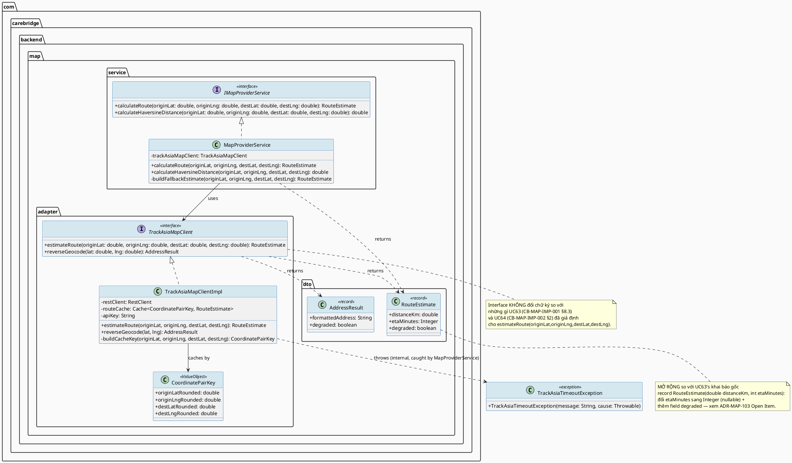
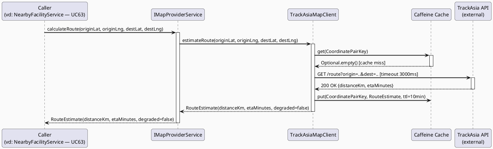
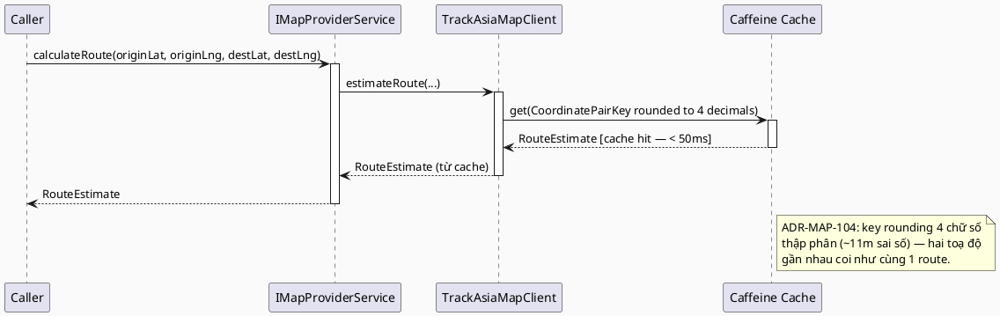
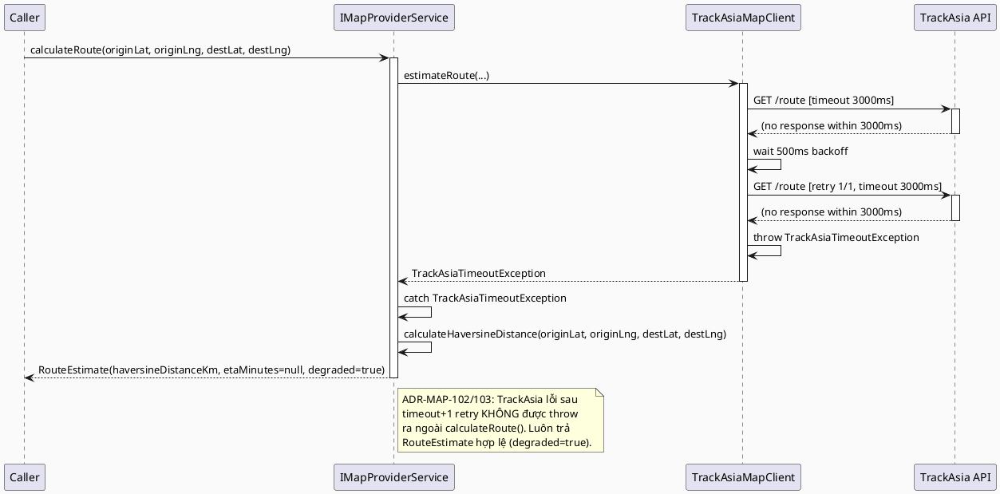

# ENGINEERING DOCUMENTATION STANDARD (EDS) v2.0
# UC129 — Calculate Distance, Route and ETA

| Field | Value |
|-------|-------|
| **Document ID** | `CB-MAP-IMP-000` |
| **Version** | `1.0` |
| **Date** | `2026-07-02` |
| **Status** | `Draft` |
| **Document Owner** | `TV4 - Lâm` |
| **Author** | `AI Agent — Tech Lead` |
| **Reviewed by** | `[ ] Pending` |
| **DPO Sign-off** | `[ ] Pending` *(module xử lý location PII gián tiếp qua consumer — xem §16)* |
| **Approved by** | `[ ] Pending` |
| **Last Review** | `2026-07-02` |
| **Based on EDS** | `v2.0` |

---

## CHANGELOG

| Ngày | Người thực hiện | Nội dung thay đổi |
|------|-----------------|-------------------|
| 2026-07-02 | AI Agent — Tech Lead | Tạo tài liệu lần đầu — TDS chính thức hoá shared capability `TrackAsiaMapClient` đã được UC63/UC64 giả định trước |

---

## MỤC LỤC

1. [Tổng quan Module](#1-tổng-quan-module)
2. [Ma trận Truy vết (Traceability Matrix)](#2-ma-trận-truy-vết-traceability-matrix)
3. [Architecture Decision Records (ADR)](#3-architecture-decision-records-adr)
4. [Non-Functional Requirements & SLA](#4-non-functional-requirements--sla)
5. [Static Modeling (Mô hình Tĩnh)](#5-static-modeling-mô-hình-tĩnh)
6. [Dynamic Modeling (Mô hình Động)](#6-dynamic-modeling-mô-hình-động)
7. [Domain Event Catalog](#7-domain-event-catalog)
8. [Interface Specification (Đặc tả Giao diện)](#8-interface-specification-đặc-tả-giao-diện)
9. [API Specification](#9-api-specification)
10. [Bảng mã lỗi (Error Codes)](#10-bảng-mã-lỗi-error-codes)
11. [Quy trình Triển khai (Step-by-Step)](#11-quy-trình-triển-khai-step-by-step)
12. [Rollback & Incident Runbook](#12-rollback--incident-runbook)
13. [Kịch bản Kiểm thử Chi tiết](#13-kịch-bản-kiểm-thử-chi-tiết)
14. [Phương pháp Xác minh](#14-phương-pháp-xác-minh)
15. [Mẫu thử thực tế (API Verification Samples)](#15-mẫu-thử-thực-tế-api-verification-samples)
16. [Bảng tổng hợp phân quyền (Authorization Matrix)](#16-bảng-tổng-hợp-phân-quyền-authorization-matrix)
17. [AI Prompt Constraints (CASE 2.0)](#17-ai-prompt-constraints-case-20)

---

## 1. Tổng quan Module

> **RG-1 (Function identity & platform scope):** UC129 KHÔNG phải một user-facing use case với screen riêng. Theo SRS §3.1.3.1, Primary Actor được liệt kê là **"TrackAsia Map Service"** — đây là cách SRS mô tả một **shared backend capability / supporting service** (nhóm MF-19 Map & Location), được các UC khác (UC63, UC64, và tương lai UC154-adjacent expert-location, UC161-adjacent nearby support) **tiêu thụ nội bộ (in-process)**, KHÔNG phải một actor con người thao tác qua UI. UC129 formal hoá và làm chủ (own) interface `TrackAsiaMapClient` mà UC63 và UC64 đã **giả định trước** trong TDS của họ (`CB-MAP-IMP-001`, `CB-MAP-IMP-002`) khi TDS này chưa tồn tại.
>
> **Bản chất "API" của UC129:** Đây là **Java service interface được inject qua Spring DI**, tiêu thụ **in-process** bởi các service khác trong cùng backend monolith (`NearbyFacilityService` ở UC63, `QuickActionService`/Mobile client ở UC64) — **KHÔNG phải một public REST endpoint** riêng cho actor bên ngoài gọi trực tiếp. Xác nhận này dựa trên cách UC63 §5.1/§8.3 và UC64 §2 đã dùng `TrackAsiaMapClient` như một Spring bean interface (`NearbyFacilityService --> TrackAsiaMapClient : uses`), không phải một HTTP client gọi tới `carebridge-api` của chính mình.

| Field | Value |
|-------|-------|
| **Module Name** | `Calculate Distance, Route and ETA` |
| **Bounded Context** | `map` (cùng bounded context với UC63/UC64 — theo phân công TV4-Lâm, "map route/ETA" trong `function-spec-task-allocation.md` §Ownership Summary) |
| **Data Classification** | `Internal` cho bản thân module (chỉ nhận toạ độ lat/lng làm tham số tính toán, không sở hữu/lưu trữ dữ liệu người dùng) — dữ liệu **PII gián tiếp** thuộc về consumer (UC63/UC64 xử lý location PII của Mother/Expert khi gọi module này) |
| **Compliance Scope** | `PDPA / Luật 91/2025` (gián tiếp — qua trách nhiệm không log toạ độ nhạy cảm ở mức TrackAsia client) |
| **Upstream Dependencies** | `TrackAsia Map Service (external HTTP API)` |
| **Downstream Consumers** | `UC63 Find Nearby Care Facility` (đã tiêu thụ `estimateRoute()` cho ETA bổ sung, xem `CB-MAP-IMP-001 §5.1, §8.3`), `UC64 Quick Call or Navigate` (đã tham chiếu tái sử dụng client này, xem `CB-MAP-IMP-002 §2` dòng traceability `SRS-3.1.3.1 (UC-129)`), tương lai: expert location sharing (`expert_location_shares`), nearby support request flows |

---

## 2. Ma trận Truy vết (Traceability Matrix)

| Requirement ID | Loại (BR/ADR/US) | Mô tả yêu cầu | Thành phần Code | Compliance Target | ADR liên quan |
|----------------|------------------|---------------|-----------------|-------------------|---------------|
| SRS-3.1.3.1 (UC-129) | User Story | Cung cấp khả năng tính khoảng cách/route/ETA dùng chung cho facility, expert location sharing, nearby support request | `TrackAsiaMapClient`, `IMapProviderService` | — | ADR-MAP-101 |
| SRS-3.1.3.1 §Business Rules | Business Rule | BR-RBAC: chỉ actor có quyền hợp lệ mới truy cập chức năng | `IMapProviderService` (chỉ inject nội bộ, không expose public endpoint không xác thực) | BR-RBAC | ADR-MAP-105 |
| SRS-3.1.3.1 §Exceptions E3 | Exception | External service/network/server failure xử lý bằng retry guidance, không có duplicate/unsafe action | `TrackAsiaMapClient`, `TrackAsiaMapClientImpl` | BR-SAFETY | ADR-MAP-102, ADR-MAP-103 |
| `CB-MAP-IMP-001` §8.3 (UC63 giả định trước) | Interface Consumption | UC63 đã khai báo `TrackAsiaMapClient.estimateRoute(originLat, originLng, destLat, destLng): RouteEstimate`, timeout 3000ms + 1 retry | `TrackAsiaMapClient` (formal owner tại đây) | — | ADR-MAP-101, ADR-MAP-102 |
| `CB-MAP-IMP-002` §2 (UC64 giả định trước) | Interface Consumption | UC64 traceability row tham chiếu trực tiếp `TrackAsiaMapClient.estimateRoute()` "tái sử dụng từ UC63" cho quick-navigate ETA | `TrackAsiaMapClient` | — | ADR-MAP-101 |
| ADR-MAP-101 | Decision | Formal service interface `IMapProviderService` bao bọc `TrackAsiaMapClient`, cung cấp `calculateRoute()`, tách biệt provider-specific concerns khỏi domain services | `IMapProviderService`, `TrackAsiaMapClient` | — | — |
| ADR-MAP-102 | Decision | Timeout 3000ms + 1 retry (exponential backoff 500ms) cho mọi lời gọi TrackAsia — kế thừa nguyên văn giá trị đã "Proposed" trong UC63 ADR-MAP-003, KHÔNG đổi giá trị | `TrackAsiaMapClientImpl` | BR-SAFETY | — |
| ADR-MAP-103 | Decision | Fallback: nếu TrackAsia lỗi/timeout, service trả `RouteEstimate` tính bằng Haversine formula (distance) + hệ số tốc độ trung bình ước lượng (ETA xấp xỉ), kèm cờ `degraded=true` — KHÔNG throw exception chặn caller | `IMapProviderService` (Haversine fallback logic) | BR-SAFETY | — |
| ADR-MAP-104 | Decision | Rate-limiting/cost-control: cache kết quả `estimateRoute()` theo cặp toạ độ đã làm tròn (rounding 4 chữ số thập phân, ~11m) trong bộ nhớ (Caffeine) với TTL ngắn hạn, giảm số lượt gọi TrackAsia trùng lặp | `TrackAsiaMapClientImpl` (cache layer) | — | — |
| ADR-MAP-105 | Decision | Không có RBAC endpoint riêng vì UC129 không phải public REST resource — RBAC được thực thi ở **caller** (UC63 `ROLE_MOTHER`, UC64 `ROLE_MOTHER`); `IMapProviderService` không tự inject `SecurityContext` | `IMapProviderService` | BR-RBAC (delegated to caller) | — |

> **Open (RG-2):** SRS §3.1.3.1 không có Normal Flow / Business Rule cụ thể riêng cho UC129 (dùng template chung giống các UC khác — "Step 1-5 generic"). Các giá trị NFR/threshold trong TDS này (timeout, cache TTL, rounding precision) đến từ 2 nguồn: (a) **kế thừa nguyên văn** giá trị đã "Proposed" trong UC63 TDS (timeout 3000ms/1 retry — không phải giá trị mới bịa ra), và (b) **đề xuất kỹ thuật mới** cho các phần UC63/UC64 chưa đề cập (cache TTL, rounding precision). Đánh dấu **Open** — cần Product Owner/TV4-Lâm xác nhận trước khi Approve.

---

## 3. Architecture Decision Records (ADR)

### ADR-MAP-101 — Provider Abstraction: `IMapProviderService` bao bọc `TrackAsiaMapClient`

| Field | Value |
|-------|-------|
| **Status** | `Proposed` |
| **Deciders** | `AI Agent — Tech Lead` (chờ TV4-Lâm confirm) |
| **Date** | `2026-07-02` |
| **Supersedes** | `—` |

#### Bối cảnh (Context)
UC63 (`CB-MAP-IMP-001` §8.3) và UC64 (`CB-MAP-IMP-002` §2) đều đã tham chiếu trực tiếp một interface tên `TrackAsiaMapClient` với method `estimateRoute(originLat, originLng, destLat, destLng): RouteEstimate` — đây là **hợp đồng đã tồn tại** (dù chưa formal hoá) mà UC129 phải tôn trọng, không được đổi tên hay đổi chữ ký method. Tuy nhiên, tên `TrackAsiaMapClient` gắn cứng với 1 provider cụ thể (TrackAsia). SRS Description của UC129 nói "Provides shared map and location capability" — ngụ ý một khả năng miền (domain capability), không chỉ 1 provider adapter.

#### Các phương án đã xem xét (Options Considered)

| Phương án | Mô tả | Ưu điểm | Nhược điểm |
|-----------|-------|----------|------------|
| A | Giữ nguyên `TrackAsiaMapClient` làm interface duy nhất mà domain service (UC63/UC64) gọi trực tiếp — không thêm lớp abstraction nào khác | Đơn giản nhất, khớp 100% với những gì UC63/UC64 đã viết, không có rủi ro breaking change | Tên interface gắn cứng vendor (TrackAsia) vào tầng domain — nếu đổi provider sau này phải sửa tên/import ở cả UC63 và UC64 |
| B | Thêm 1 interface domain-level `IMapProviderService` (KHÔNG gắn tên vendor) làm facade phía trên `TrackAsiaMapClient` (vendor adapter); domain service gọi `IMapProviderService`, còn `TrackAsiaMapClient` chỉ là implementation detail bên trong `IMapProviderService` | Tách biệt domain khỏi vendor cụ thể (Dependency Inversion), dễ thêm provider dự phòng sau này (ADR-MAP-103 fallback) | Thêm 1 lớp gián tiếp — cần điều chỉnh nhẹ ở UC63/UC64 khi implement thực tế (đổi từ gọi `TrackAsiaMapClient` sang gọi `IMapProviderService`) |

#### Quyết định (Decision)
Chọn **Phương án B có điều chỉnh** — giữ nguyên `TrackAsiaMapClient` **y hệt chữ ký đã có trong UC63/UC64** (không đổi tên, không đổi tham số) làm **vendor adapter interface** (package `map.adapter`), đồng thời thêm `IMapProviderService` (package `map.service`) làm **domain-facing facade** bao bọc `TrackAsiaMapClient` + Haversine fallback logic (ADR-MAP-103). `IMapProviderService.calculateRoute()` là entrypoint MỚI được khuyến nghị cho code viết sau UC129; `TrackAsiaMapClient` tiếp tục tồn tại nguyên trạng để UC63/UC64 implement đúng như đã spec, không cần sửa TDS của họ.

**Lý do không chọn thuần Phương án A:** UC63 ADR-MAP-003 đã mô tả hành vi fallback (Haversine khi TrackAsia lỗi) nhưng đặt fallback logic **trong `NearbyFacilityService`**, không phải trong client. UC129 là nơi đúng đắn để tập trung fallback logic dùng chung (tránh trùng lặp code Haversine ở nhiều service), nên cần 1 lớp facade chứa logic đó — đây chính là `IMapProviderService`.

#### Hệ quả (Consequences)

**Tích cực:**
- Không phá vỡ hợp đồng đã "Proposed" trong UC63/UC64 — `TrackAsiaMapClient` giữ nguyên chữ ký.
- Fallback/Haversine logic tập trung 1 chỗ (`IMapProviderService`), tránh trùng lặp nếu UC63 cũng tự implement Haversine riêng (UC63 §5.1 đã có Haversine trong `NearbyFacilityService` cho phần "search chính" — đây là dùng riêng biệt, KHÔNG xung đột, vì UC63's Haversine dùng để **sort danh sách facility trong DB**, còn `IMapProviderService`'s Haversine dùng để **fallback ETA cho 1 cặp điểm cụ thể** khi TrackAsia lỗi).

**Tiêu cực / Trade-offs:**
- Thêm 1 interface/lớp gián tiếp so với việc domain service gọi thẳng `TrackAsiaMapClient`.

**Compliance Impact:** Không có.

> **Open Item (báo cáo lại người dùng):** UC63/UC64 KHÔNG đề cập `IMapProviderService` trong TDS của họ — họ chỉ biết `TrackAsiaMapClient`. TDS UC129 này **thêm mới** `IMapProviderService` như một facade khuyến nghị, KHÔNG bắt buộc UC63/UC64 phải đổi code đã spec. Đây không phải một "mismatch" cần sửa UC63/UC64, mà là một lớp bổ sung nằm phía trên — ghi nhận rõ để tránh nhầm lẫn khi implement song song.

---

### ADR-MAP-102 — Timeout/Retry: kế thừa nguyên văn giá trị đã "Proposed" ở UC63

| Field | Value |
|-------|-------|
| **Status** | `Proposed` |
| **Deciders** | `AI Agent — Tech Lead` |
| **Date** | `2026-07-02` |
| **Supersedes** | `—` |

#### Bối cảnh (Context)
UC63 ADR-MAP-003 đã "Proposed" giá trị: timeout 3000ms, tối đa 1 retry, exponential backoff 500ms cho `TrackAsiaMapClient`. UC129 là nơi implement thực tế `TrackAsiaMapClientImpl` — TDS này PHẢI dùng đúng giá trị đó để tránh 2 TDS "Proposed" các con số khác nhau cho cùng 1 class.

#### Quyết định (Decision)
`TrackAsiaMapClientImpl.estimateRoute()`: timeout kết nối + đọc **3000ms**, tối đa **1 retry** sau timeout đầu tiên, backoff **500ms** trước khi retry. Nếu retry cũng lỗi/timeout → throw `TrackAsiaTimeoutException` (checked exception nội bộ, KHÔNG lộ ra ngoài `IMapProviderService.calculateRoute()` — bị bắt và chuyển sang fallback theo ADR-MAP-103).

#### Hệ quả (Consequences)

**Tích cực:** Nhất quán tuyệt đối với những gì UC63 (`CB-MAP-IMP-001` §3 ADR-MAP-003, §4.1, §8.3) đã "Proposed" — không tạo ra 2 nguồn sự thật khác nhau về cùng một giá trị kỹ thuật.

**Tiêu cực / Trade-offs:** Nếu sau này Product Owner đổi giá trị timeout, phải đồng bộ sửa cả UC129 và ghi chú tham chiếu trong UC63 (không sửa trực tiếp UC63, chỉ update UC129 làm nguồn chủ — xem Open Items trong báo cáo cuối).

**Compliance Impact:** Không có.

---

### ADR-MAP-103 — Fallback/Degradation: Haversine formula khi TrackAsia không khả dụng

| Field | Value |
|-------|-------|
| **Status** | `Proposed` |
| **Deciders** | `AI Agent — Tech Lead` |
| **Date** | `2026-07-02` |
| **Supersedes** | `—` |

#### Bối cảnh (Context)
SRS Exception E3 (UC129): "External service, network, or server failure is handled with retry guidance and no duplicate unsafe action." UC63 §6.2 (Sequence Diagram TrackAsia Timeout/Fallback) đã mô tả rõ hành vi: khi TrackAsia lỗi, Mother vẫn nhận facility list đầy đủ, dùng `distanceKm` từ Haversine đã tính sẵn, `estimatedTravelTimeMinutes = null`, `mapServiceDegraded = true`. UC129 formal hoá logic Haversine fallback này thành phần dùng chung, thay vì mỗi consumer tự viết lại.

#### Các phương án đã xem xét (Options Considered)

| Phương án | Mô tả | Ưu điểm | Nhược điểm |
|-----------|-------|----------|------------|
| A | Khi TrackAsia lỗi, trả `RouteEstimate` với `etaMinutes = null` (không đoán), chỉ có `distanceKm` từ Haversine | Không "bịa" ETA — minh bạch với người dùng | UC63's `estimatedTravelTimeMinutes` schema đã là `Integer` nullable — khớp; nhưng nếu consumer khác cần ETA luôn có giá trị thì phải tự xử lý null |
| B | Khi TrackAsia lỗi, trả `RouteEstimate` với `etaMinutes` ước lượng bằng `distanceKm / averageUrbanSpeedKmh` (giả định tốc độ trung bình đô thị, ví dụ 25 km/h) | Luôn có giá trị ETA hiển thị (UX tốt hơn) | Số liệu ước lượng có thể sai lệch nhiều so với thực tế giao thông — cần gắn cờ rõ ràng `degraded=true` để UI không hiển thị như số liệu chính xác |

#### Quyết định (Decision)
Chọn **Phương án A** cho `IMapProviderService.calculateRoute()` mức domain-level mặc định — trả `etaMinutes = null` khi degraded, nhất quán với UC63's `estimatedTravelTimeMinutes: null` khi `mapServiceDegraded: true` (xem `CB-MAP-IMP-001` §9.2 "Response — 200 OK (TrackAsia degraded)"). **KHÔNG** tự ý thêm ước lượng tốc độ trung bình (Phương án B) vì UC63 đã minh thị chọn `null` thay vì ước lượng — UC129 tôn trọng quyết định đó của consumer đầu tiên thay vì áp đặt hành vi khác.

`RouteEstimate` trả về trong trường hợp degraded:
```java
new RouteEstimate(
    haversineDistanceKm,  // luôn có — tính bằng công thức Haversine chuẩn
    null,                  // etaMinutes = null khi degraded — khớp UC63 §9.2
    true                   // degraded = true
);
```

> **Lưu ý điều chỉnh chữ ký:** UC63 §8.3 khai báo `record RouteEstimate(double distanceKm, int etaMinutes)` — kiểu `int` (primitive, không nullable). Để hỗ trợ `etaMinutes = null` khi degraded, UC129 **mở rộng** record thành `RouteEstimate(double distanceKm, Integer etaMinutes, boolean degraded)` — dùng `Integer` (wrapper, nullable) thay vì `int` (primitive). Đây là **thay đổi cần thiết so với chữ ký gốc UC63 đã viết** — ghi nhận là **Open Item cần xác nhận với TV4-Lâm/UC63 owner** vì UC63's class diagram hiện tại chưa có field `degraded` trong `RouteEstimate` (UC63 dùng field `mapServiceDegraded` ở cấp `NearbyFacilityListResponse`, không phải ở `RouteEstimate`). TDS này giữ đề xuất mở rộng vì nó tổng quát hoá tốt hơn cho các consumer tương lai không có field `mapServiceDegraded` riêng ở DTO cấp cao — nhưng KHÔNG tự sửa UC63 TDS.

#### Hệ quả (Consequences)

**Tích cực:** Nhất quán hành vi "never delay/block emergency-adjacent flow" theo CLAUDE.md; logic Haversine chỉ viết 1 lần, dùng chung cho mọi consumer tương lai.

**Tiêu cực / Trade-offs:** Thay đổi kiểu `etaMinutes` từ `int` sang `Integer` là breaking change nhỏ so với những gì UC63 TDS đã viết — cần đồng bộ khi cả 2 TDS chuyển sang Approved/implementation.

**Compliance Impact:** Không phát sinh rủi ro PII mới — toạ độ dùng để tính Haversine không được lưu trữ bởi UC129 (stateless computation).

---

### ADR-MAP-104 — Cost Control: Cache ngắn hạn theo cặp toạ độ đã làm tròn

| Field | Value |
|-------|-------|
| **Status** | `Proposed` |
| **Deciders** | `AI Agent — Tech Lead` |
| **Date** | `2026-07-02` |
| **Supersedes** | `—` |

#### Bối cảnh (Context)
TrackAsia là external paid API (giả định theo thông lệ map service provider — không có SRS/BR nào xác nhận cấu trúc giá cụ thể). UC63 gọi `estimateRoute()` "per top-N" facility (§6.1 sequence diagram) — nghĩa là 1 lượt tìm kiếm của Mother có thể phát sinh N lượt gọi TrackAsia cùng lúc. Không có rate-limiting/caching nào được đề cập trong UC63/UC64 TDS — đây là khoảng trống kiến trúc mà UC129 (chủ sở hữu chính thức của client) cần lấp đầy.

#### Các phương án đã xem xét (Options Considered)

| Phương án | Mô tả | Ưu điểm | Nhược điểm |
|-----------|-------|----------|------------|
| A | Không cache — mỗi lời gọi `estimateRoute()` đều gọi TrackAsia trực tiếp | Đơn giản nhất, luôn dữ liệu mới nhất | Chi phí API tăng tuyến tính theo traffic; latency cao hơn cho các cặp toạ độ lặp lại (ví dụ nhiều Mother cùng khu vực tìm cùng 1 bệnh viện phổ biến) |
| B | Cache in-memory (Caffeine, đã là dependency phổ biến trong hệ Spring Boot, KHÔNG cần thêm infra mới như Redis) theo key = `(originLat, originLng, destLat, destLng)` làm tròn 4 chữ số thập phân (~11m sai số), TTL ngắn (đề xuất 10 phút) | Giảm số lượt gọi TrackAsia trùng lặp trong thời gian ngắn mà không cần thêm infrastructure (Redis) — tuân thủ CLAUDE.md "Do not introduce ... new infrastructure ... without approval" | Route/ETA có thể "cũ" tối đa 10 phút — chấp nhận được vì route đường bộ giữa 2 điểm cố định hiếm khi đổi trong vài phút (khác với traffic-aware ETA thời gian thực, vốn ngoài phạm vi UC129) |

#### Quyết định (Decision)
Chọn **Phương án B** — cache Caffeine in-process, TTL **10 phút** *(Open — đề xuất kỹ thuật, chưa có BR/cost budget nguồn)*, key rounding 4 chữ số thập phân. Cache nằm hoàn toàn trong `TrackAsiaMapClientImpl`, không lộ ra `IMapProviderService`/`TrackAsiaMapClient` interface (implementation detail). Không dùng Redis — tuân thủ nguyên tắc "không thêm infrastructure mới không được duyệt" (CLAUDE.md).

#### Hệ quả (Consequences)

**Tích cực:** Giảm chi phí gọi TrackAsia cho các truy vấn lặp lại phổ biến (ví dụ nhiều Mother cùng khu vực tra cùng 1 bệnh viện); không cần thêm Redis/infra.

**Tiêu cực / Trade-offs:** Cache in-memory không share giữa các instance backend nếu scale horizontal (mỗi pod có cache riêng) — chấp nhận được cho MVP vì tải dự kiến thấp/trung bình (theo UC63 §4.4).

**Compliance Impact:** Cache chỉ lưu toạ độ + kết quả route (không phải PII định danh cá nhân trực tiếp — lat/lng không gắn userId trong cache key) — rủi ro PII thấp, nhưng ghi nhận **Open**: cần xác nhận với DPO liệu cache toạ độ có bị xem là "gián tiếp định danh vị trí" cần TTL ngắn hơn hay không.

---

### ADR-MAP-105 — Authorization: Delegated to Caller, không có endpoint public riêng

| Field | Value |
|-------|-------|
| **Status** | `Proposed` |
| **Deciders** | `AI Agent — Tech Lead` |
| **Date** | `2026-07-02` |
| **Supersedes** | `—` |

#### Bối cảnh (Context)
UC63 ADR-MAP-004 và UC64 ADR-MAP-008 đều đã tự thực thi `@PreAuthorize("hasRole('MOTHER')")` ở **Controller layer của chính họ** trước khi gọi vào `NearbyFacilityService`/`QuickActionService`, vốn mới là nơi gọi `TrackAsiaMapClient`. UC129 không có Controller/endpoint HTTP riêng (xác nhận RG-1).

#### Quyết định (Decision)
`IMapProviderService`/`TrackAsiaMapClient` KHÔNG tự kiểm tra `SecurityContext` hay role — đây là service nội bộ (in-process), được Spring DI inject vào các domain service đã tự chịu trách nhiệm RBAC ở Controller của họ. BR-RBAC được thực thi **tại điểm gọi (caller)**, không tại UC129.

#### Hệ quả (Consequences)

**Tích cực:** Tránh trùng lặp logic authorization ở nhiều lớp; nhất quán với single-responsibility (UC129 chỉ lo tính toán route/ETA, không lo ai được phép gọi).

**Tiêu cực / Trade-offs:** Nếu một service tương lai quên đặt `@PreAuthorize` trước khi gọi `IMapProviderService`, sẽ không có safety net ở tầng UC129 — cần code review khi thêm consumer mới.

**Compliance Impact:** Không có — không có endpoint public để bị lạm dụng trực tiếp.

---

## 4. Non-Functional Requirements & SLA

### 4.1. Performance & Availability

| Category | Requirement | Target SLA | Measurement Method | Compliance Basis |
|----------|-------------|------------|---------------------|------------------|
| Latency | `IMapProviderService.calculateRoute()` khi TrackAsia thành công (cache miss) | `< 1500ms` *(kế thừa nguyên văn từ UC63 §4.1 "API response khi TrackAsia bổ sung ETA thành công")* | k6 / JUnit timing assertion | `CB-MAP-IMP-001` §4.1 |
| Latency | `IMapProviderService.calculateRoute()` khi cache hit | `< 50ms` *(Open — đề xuất mới, chưa có nguồn UC63/UC64)* | JUnit timing assertion | ADR-MAP-104 |
| Latency | `IMapProviderService.calculateRoute()` khi fallback (TrackAsia lỗi, sau timeout+retry) | `< 3600ms` (= 3000ms timeout + 500ms backoff + 1 retry 3000ms tối đa, làm tròn) *(tính toán từ ADR-MAP-102, không phải giá trị mới bịa)* | k6 load test với WireMock simulate timeout | ADR-MAP-102, ADR-MAP-103 |
| Availability | Uptime nội bộ (module luôn "available" vì fallback không phụ thuộc external) | `100%` (module luôn trả kết quả — fallback đảm bảo không có single point of failure) | Integration test | ADR-MAP-103 |
| Throughput | Concurrent `calculateRoute()` calls | `50 req/s` *(kế thừa nguyên văn từ UC63 §4.1)* | Load test | `CB-MAP-IMP-001` §4.1 |

### 4.2. Data Integrity & Retention

| Category | Requirement | Target | Verification Method | Compliance Basis |
|----------|-------------|--------|---------------------|------------------|
| Statelessness | UC129 KHÔNG lưu trữ toạ độ vào DB (không entity/table riêng) | 0 bảng DB mới cho UC129 | Migration review — xác nhận không có `V{n}` mới cho bounded context `map.provider` | §5.2 |
| Cache TTL | In-memory Caffeine cache cho route calculation | `TTL = 10 phút` *(Open)* | Unit test kiểm tra cache expiry | ADR-MAP-104 |
| No PII persistence | Cache key (toạ độ) KHÔNG gắn kèm `userId` | Code review — verify cache key chỉ gồm 4 số double | Code review | PDPA (minimum necessary) |

### 4.3. Security

| Category | Requirement | Target | Verification Method | Compliance Basis |
|----------|-------------|--------|---------------------|------------------|
| Encryption in transit | TrackAsia API call | TLS 1.3+ | SSL Labs scan / WireMock TLS config test | PDPA |
| Secret management | TrackAsia API key | Env var `TRACKASIA_API_KEY` (tên biến đề xuất — kế thừa từ UC63 §11.1 "Open"), không hardcode | Code review, `.env.example` audit | — |
| No PII in logs | Log lời gọi `TrackAsiaMapClientImpl` KHÔNG log toạ độ chính xác đầy đủ ở mức INFO (chỉ log ở DEBUG nếu cần, che bớt độ chính xác) | Log audit | PDPA |

### 4.4. Scalability & Capacity Planning

> Tải phụ thuộc hoàn toàn vào consumer (UC63/UC64) — không có tải độc lập. Cache Caffeine giúp giảm tải TrackAsia khi nhiều consumer gọi cùng cặp toạ độ trong cửa sổ TTL. Horizontal scale theo cấu hình chung Spring Boot hiện có; cache không share giữa pod (chấp nhận được, xem ADR-MAP-104).

---

## 5. Static Modeling (Mô hình Tĩnh)

### 5.1. Class Diagram (PlantUML)



### 5.2. Data Structure (Flyway SQL Migration)

> **Không cần migration mới.** UC129 là **stateless computation service** — không có entity/bảng riêng. Xác nhận đã kiểm tra toàn bộ `05_Development/CareBridgeAPI/src/main/resources/db/migration/` (từ `V1__init_schema.sql` đến `V20260629000002__create_community_answer_likes.sql`, cộng các migration timestamp `V202606*`) — không có bảng nào tên `map_route_cache`, `route_calculations`, hay tương tự.
>
> Cache route calculation (ADR-MAP-104) dùng **Caffeine in-memory cache**, KHÔNG persist xuống DB — không cần bảng `route_calculation_cache`. Quyết định này tránh việc phải quản lý TTL/cleanup job cho 1 bảng cache mà giá trị nghiệp vụ thấp (route giữa 2 điểm cố định không đổi thường xuyên, không cần audit trail lâu dài như `location_snapshots`).
>
> **Bảng liên quan đã tồn tại (tham chiếu, KHÔNG sở hữu bởi UC129):**
>
> ```sql
> -- Đã tồn tại trong V1__init_schema.sql (dòng 828-840) — module `expert` sở hữu, UC129 KHÔNG modify
> -- expert_location_shares: location_share_id (PK), expert_profile_id (FK), latitude, longitude,
> --                          accuracy_meters, availability_status, shared_at, expires_at,
> --                          consent_reference, created_at, updated_at
> --
> -- Đã tồn tại trong V1__init_schema.sql (dòng 1097+) — module `map` (UC63) sở hữu, UC129 KHÔNG modify
> -- location_snapshots: location_snapshot_id (PK), user_id (FK), context_type, context_id,
> --                      latitude, longitude, accuracy_meters, captured_at, expires_at, consent_status
> --
> -- Đã tồn tại trong V1__init_schema.sql (dòng 1065+) — module `map` (UC63) sở hữu, UC129 KHÔNG modify
> -- care_facilities: facility_id (PK), partner_id (FK), name, facility_type, address,
> --                   latitude, longitude, phone, opening_hours_json, source_type,
> --                   verification_status, created_at, updated_at
> ```
>
> UC129 chỉ **đọc** toạ độ (`latitude`, `longitude`) do caller truyền vào làm tham số phương thức Java (`double`/`BigDecimal` primitive), KHÔNG tự query các bảng trên. Việc đọc `expert_location_shares`/`location_snapshots`/`care_facilities` thuộc trách nhiệm của caller (ví dụ `NearbyFacilityService` ở UC63).
>
> **Nếu tương lai cần cache route xuống DB (persist across restarts):** migration version tiếp theo khả dụng bắt đầu tại `V20260704120000` (theo phân bổ namespace tránh trùng với các batch song song khác) — **chưa tạo trong Draft này**, chỉ ghi nhận **Open**.

---

## 6. Dynamic Modeling (Mô hình Động)

### 6.1. Sequence Diagram — Happy Path: Cache Miss, TrackAsia thành công (PlantUML)



### 6.2. Sequence Diagram — Cache Hit (PlantUML)



### 6.3. Sequence Diagram — TrackAsia Timeout → Haversine Fallback (PlantUML)



### 6.4. State Machine

> UC129 không có entity trạng thái — `RouteEstimate`/`AddressResult` là value object bất biến (record), không có vòng đời trạng thái. Bỏ qua state machine theo template.

---

## 7. Domain Event Catalog

> UC129 là **stateless computation service** — **không phát ra domain event nào**. Không có entity persistent nào để phát sinh lifecycle event.

### 7.1. Events Published (Phát ra)

_Không có._

### 7.2. Events Consumed (Tiêu thụ)

_Không có._

---

## 8. Interface Specification (Đặc tả Giao diện)

> **Policy:** Interface dưới đây là **formal owner** của hợp đồng mà UC63 (`CB-MAP-IMP-001` §8.3) và UC64 (`CB-MAP-IMP-002` §2) đã giả định trước. `TrackAsiaMapClient.estimateRoute()` giữ nguyên chữ ký gốc; `RouteEstimate` được mở rộng có ghi chú Open Item (xem ADR-MAP-103).

### 8.1. Domain Service Interface (MỚI — formal hoá bởi UC129)

```java
// IMapProviderService.java — Domain-facing Facade
// @version 1.0
// Package: com.carebridge.backend.map.service
public interface IMapProviderService {
    /**
     * Tính khoảng cách + ETA giữa 2 toạ độ. KHÔNG BAO GIỜ throw exception ra ngoài —
     * nếu TrackAsia lỗi/timeout, tự động fallback sang Haversine (ADR-MAP-103).
     * Kết quả có thể lấy từ cache (ADR-MAP-104, TTL 10 phút).
     *
     * @param originLat vĩ độ điểm xuất phát (-90..90)
     * @param originLng kinh độ điểm xuất phát (-180..180)
     * @param destLat   vĩ độ điểm đích (-90..90)
     * @param destLng   kinh độ điểm đích (-180..180)
     * @return RouteEstimate — luôn có distanceKm hợp lệ; etaMinutes null nếu degraded=true
     */
    RouteEstimate calculateRoute(double originLat, double originLng, double destLat, double destLng);

    /**
     * Tính khoảng cách đường chim bay (Haversine) — dùng độc lập khi caller
     * chỉ cần khoảng cách, không cần ETA/route thực (vd: UC63 bounding-box sort).
     */
    double calculateHaversineDistance(double originLat, double originLng, double destLat, double destLng);
}
```

### 8.2. External Client Interface (Formal hoá — giữ nguyên chữ ký UC63/UC64 đã giả định)

```java
// TrackAsiaMapClient.java — External Service Adapter
// @version 1.0
// Package: com.carebridge.backend.map.adapter
// KHÔNG đổi chữ ký so với CB-MAP-IMP-001 §8.3 / CB-MAP-IMP-002 §2 đã tham chiếu.
public interface TrackAsiaMapClient {
    /**
     * @throws TrackAsiaTimeoutException sau timeout 3000ms + 1 retry (ADR-MAP-102)
     *         — exception này bị bắt bởi IMapProviderService, KHÔNG lộ ra caller cấp cao hơn.
     */
    RouteEstimate estimateRoute(double originLat, double originLng, double destLat, double destLng);

    /**
     * Reverse geocode — dùng bởi UC63 để hiển thị địa chỉ dạng text (tham chiếu
     * CB-MAP-IMP-001 §8.3 "reverseGeocode(lat, lng): AddressResult").
     * @throws TrackAsiaTimeoutException sau timeout 3000ms + 1 retry
     */
    AddressResult reverseGeocode(double lat, double lng);
}

// RouteEstimate.java — MỞ RỘNG so với UC63's "record RouteEstimate(double distanceKm, int etaMinutes)"
// @version 1.0
// @breaking-change so với chữ ký gốc UC63 đã "Proposed": etaMinutes int -> Integer (nullable),
//                  thêm field degraded. Xem ADR-MAP-103 Open Item — cần xác nhận với UC63 owner.
public record RouteEstimate(
    double  distanceKm,   // luôn có giá trị — Haversine hoặc TrackAsia
    Integer etaMinutes,   // null nếu degraded=true (TrackAsia không khả dụng)
    boolean degraded      // true nếu TrackAsia lỗi/timeout, distanceKm là Haversine fallback
) {}

// AddressResult.java — Output DTO cho reverseGeocode()
// @version 1.0
public record AddressResult(
    String  formattedAddress,  // null nếu degraded=true
    boolean degraded
) {}

// TrackAsiaTimeoutException.java — Internal checked exception
// @version 1.0
public class TrackAsiaTimeoutException extends RuntimeException {
    public TrackAsiaTimeoutException(String message, Throwable cause) {
        super(message, cause);
    }
}
```

### 8.3. Implementation Notes (không phải interface, ghi chú triển khai)

```java
// TrackAsiaMapClientImpl.java — package com.carebridge.backend.map.adapter
// - Dùng Spring Boot 3.5 RestClient với Duration.ofMillis(3000) connect+read timeout
//   (theo pattern UC63 §11.3 Chặng 3: "nếu chưa có, dùng RestClient timeout Spring Boot 3.5 mặc định")
// - Retry: 1 lần, backoff cố định 500ms (không dùng thư viện Resilience4j nếu project
//   chưa có dependency đó — kiểm tra pom.xml trước khi thêm mới, theo CLAUDE.md "no new
//   dependencies without approval")
// - Cache: Caffeine (kiểm tra pom.xml xem đã có `com.github.ben-manes.caffeine:caffeine`
//   chưa trước khi thêm — nếu Spring Boot Cache Starter đã include Caffeine transitively
//   qua spring-boot-starter-cache thì không cần thêm dependency mới)
```

---

## 9. API Specification

> **RG-4 xác nhận:** UC129 KHÔNG có public REST endpoint. Đây là Java service interface tiêu thụ in-process qua Spring DI bởi các domain service khác (UC63 `NearbyFacilityService`, UC64 `QuickActionService`/Mobile client thông qua backend). Bảng dưới đây ghi nhận **N/A** cho endpoint table theo đúng nghĩa REST API, thay vào đó liệt kê **Injection Contract**.

### 9.1. Endpoints Table

| Method | Path | Auth Level | Required Roles | Rate Limit | Idempotent? |
|--------|------|------------|----------------|------------|-------------|
| N/A | *(không có public REST endpoint — xem §9.3 Injection Contract)* | N/A | N/A | N/A | N/A |

### 9.2. Request / Response Schemas

> N/A — không áp dụng vì không có HTTP endpoint. Xem §8 cho Java method contract.

### 9.3. Injection Contract (thay thế API Spec cho service nội bộ)

| Bean | Injection Point | Consumer | Method Called |
|------|-----------------|----------|----------------|
| `IMapProviderService` (impl: `MapProviderService`) | `@Autowired`/constructor injection | `NearbyFacilityService` (UC63), `QuickActionService` (UC64, nếu cần ETA cho log context) | `calculateRoute()`, `calculateHaversineDistance()` |
| `TrackAsiaMapClient` (impl: `TrackAsiaMapClientImpl`) | `@Autowired`/constructor injection vào `MapProviderService` | `MapProviderService` (internal — UC63/UC64 KHÔNG inject trực tiếp `TrackAsiaMapClient` sau khi UC129 hoàn thành; nếu UC63/UC64 đã implement trực tiếp trước UC129, đó là hợp lệ vì chữ ký `TrackAsiaMapClient` không đổi — xem ADR-MAP-101) | `estimateRoute()`, `reverseGeocode()` |

---

## 10. Bảng mã lỗi (Error Codes)

> UC129 không trả lỗi HTTP (không có endpoint). Bảng dưới đây là **internal exception mapping** — dùng để caller (UC63/UC64 Controller) map sang HTTP error code của chính họ nếu cần.

| Code | Loại | Message (EN) | Message (VI) | Trigger Condition | Xử lý bởi Caller |
|------|------|--------------|--------------|-------------------|-------------------|
| `MAP-101-TIMEOUT` | Internal exception (bị bắt nội bộ) | TrackAsia service timeout | Dịch vụ bản đồ TrackAsia hết thời gian chờ | TrackAsia không phản hồi trong 3000ms sau 1 retry | KHÔNG lộ ra caller — `IMapProviderService.calculateRoute()` tự fallback (ADR-MAP-103), trả `RouteEstimate(degraded=true)` bình thường |
| `MAP-102-INVALID-COORD` | `IllegalArgumentException` | Invalid coordinate values | Toạ độ không hợp lệ | `latitude` ngoài [-90,90] hoặc `longitude` ngoài [-180,180] truyền vào `calculateRoute()` | Caller (UC63 `NearbyFacilityController` §10 `MAP-001`, UC64 tương tự) PHẢI validate `@DecimalMin/@DecimalMax` ở DTO TRƯỚC khi gọi `IMapProviderService` — UC129 chỉ defensive-check lại (fail-fast) |
| `MAP-103-PROVIDER-UNCONFIGURED` | `IllegalStateException` | TrackAsia API key not configured | Thiếu cấu hình `TRACKASIA_API_KEY` | Env var rỗng/null khi khởi động `TrackAsiaMapClientImpl` bean | Application context KHÔNG start — fail-fast ở deployment time, không phải runtime |

---

## 11. Quy trình Triển khai (Step-by-Step)

### 11.1. Prerequisites

- [ ] ADR-MAP-101 → 105 được Accepted (hiện tại `Proposed` — cần TV4-Lâm + Tech Lead review, đặc biệt ADR-MAP-103 Open Item về `RouteEstimate` signature)
- [ ] Xác nhận với UC63/UC64 owner: `RouteEstimate.etaMinutes` đổi từ `int` sang `Integer` có chấp nhận được không (breaking change nhỏ so với chữ ký họ đã "Proposed")
- [ ] TrackAsia API key/credentials có sẵn trong env (`TRACKASIA_API_KEY`)
- [ ] Xác nhận `pom.xml` hiện tại đã có Caffeine (qua `spring-boot-starter-cache`) hay cần thêm — nếu cần thêm mới, xin approval theo CLAUDE.md trước khi thêm dependency

### 11.2. Pre-Migration Checklist

- [ ] Không cần migration mới (§5.2) — N/A cho UC129
- [ ] Nếu sau này cần persist cache xuống DB, dùng version `V20260704120000` trở đi (đã pre-assign, tránh trùng với batch song song UC114-117/UC103-104-112/UC107/UC130)

### 11.3. Implementation Steps

#### Chặng 1 — Tạo package `map.service` + `map.adapter` (mở rộng bounded context `map` đã có từ UC63/UC64)

```
com.carebridge.backend.map/
├── service/
│   ├── IMapProviderService.java
│   └── impl/MapProviderService.java
├── adapter/
│   ├── TrackAsiaMapClient.java              (interface — CHIA SẺ với UC63/UC64, KHÔNG tạo trùng nếu đã tồn tại)
│   ├── TrackAsiaMapClientImpl.java
│   └── CoordinatePairKey.java
├── dto/
│   ├── RouteEstimate.java                    (record — CHIA SẺ, kiểm tra trùng lặp với UC63 nếu implement song song)
│   └── AddressResult.java
└── exception/
    └── TrackAsiaTimeoutException.java
```

> **Lưu ý quan trọng khi implement song song với UC63/UC64:** Nếu UC63 hoặc UC64 được implement TRƯỚC UC129 và đã tự tạo `TrackAsiaMapClient`/`RouteEstimate` trong package `com.carebridge.backend.map.adapter`, UC129 implementation PHẢI **tái sử dụng** file đã tồn tại (chỉnh sửa nếu cần mở rộng theo ADR-MAP-103), KHÔNG tạo file trùng tên gây conflict compile. Kiểm tra `git log`/thư mục thực tế trước khi tạo file mới.

#### Chặng 2 — Implement `TrackAsiaMapClientImpl` với timeout/retry/cache

```java
// RestClient timeout config (Spring Boot 3.5) + Caffeine cache theo ADR-MAP-102/104
// Chi tiết code thực tế viết ở implementation phase, không thuộc phạm vi TDS.
```

#### Chặng 3 — Implement `MapProviderService` với Haversine fallback

```java
// Haversine formula chuẩn (Earth radius = 6371 km) — dùng chung, KHÔNG trùng lặp
// với Haversine riêng trong NearbyFacilityService (UC63) nếu họ đã tự viết —
// cân nhắc refactor UC63 gọi calculateHaversineDistance() này thay vì tự tính
// (ngoài phạm vi UC129, ghi nhận Open cho lần refactor sau).
```

#### Chặng 4 — Đăng ký Spring Bean + cấu hình `application.yml`

```yaml
# application.yml (thêm mới, không sửa section khác)
trackasia:
  api-key: ${TRACKASIA_API_KEY}
  timeout-ms: 3000
  retry-max-attempts: 1
  retry-backoff-ms: 500
  cache-ttl-minutes: 10
```

### 11.4. Deployment Checklist

- [ ] `calculateRoute()` trả kết quả đúng cho cặp toạ độ hợp lệ (WireMock giả lập TrackAsia thành công)
- [ ] Timeout test xác nhận fallback Haversine hoạt động, không throw exception ra ngoài
- [ ] Cache hit test xác nhận không gọi lại TrackAsia trong TTL
- [ ] UC63/UC64 (nếu đã implement) vẫn compile thành công sau khi UC129 formal hoá interface

---

## 12. Rollback & Incident Runbook

### 12.1. Điều kiện kích hoạt Rollback

| Điều kiện | Ngưỡng | Người quyết định |
|-----------|--------|------------------|
| `calculateRoute()` throw exception ra ngoài (vi phạm ADR-MAP-103 "never throw") | Bất kỳ case nào phát hiện trong production | Tech Lead |
| TrackAsia degraded kéo dài gây toàn bộ route calculation dùng Haversine (mất chính xác kéo dài) | > 30 phút liên tục | Tech Lead |
| Cache trả dữ liệu stale gây sai lệch nghiêm trọng (hiếm, TTL chỉ 10 phút) | Bất kỳ case nào | On-call Engineer |

### 12.2. Rollback Procedure

```bash
# Không có migration mới để rollback (§5.2) — chỉ cần revert code deploy
kubectl rollout undo deployment/carebridge-api
kubectl rollout status deployment/carebridge-api
```

### 12.3. Notification Protocol

| Thời điểm | Người nhận | Kênh | Template |
|-----------|------------|------|----------|
| Ngay khi phát hiện | On-call team | Slack `#incident` | "Map Provider (UC129) degraded/down: [mô tả]. UC63/UC64 vẫn hoạt động ở chế độ fallback." |

### 12.4. Post-Incident Review (PIR)

- **Timeline, Root Cause (5 Whys), Impact, Remediation, Prevention** — theo template chung.

---

## 13. Kịch bản Kiểm thử Chi tiết

> Chi tiết đầy đủ nằm trong `UC129_CalculateDistanceRouteAndETA_Test-Spec.md`.

| TDS Concern | Test-Spec Condition Ref |
|-------------|--------------------------|
| ADR-MAP-101 (facade `IMapProviderService` bao bọc `TrackAsiaMapClient`) | `TC-COND-001` |
| ADR-MAP-102 (timeout 3000ms + 1 retry) | `TC-COND-002, 003` |
| ADR-MAP-103 (Haversine fallback, never throw) | `TC-COND-004, 005` |
| ADR-MAP-104 (cache hit/miss/TTL expiry) | `TC-COND-006, 007, 008` |
| ADR-MAP-105 (không tự check RBAC — delegated) | `TC-COND-009` |
| Reconciliation với UC63/UC64 assumed contract | `TC-COND-010` |
| SRS E3 (external service failure resilience) | `TC-COND-011` |

---

## 14. Phương pháp Xác minh

### 14.1. Database Inspection

```sql
-- UC129 không sở hữu bảng nào — verify KHÔNG có bảng mới phát sinh ngoài kế hoạch
SELECT table_name FROM information_schema.tables
WHERE table_schema = 'public' AND table_name ILIKE '%route%';
-- Expected: no unexpected new table
```

### 14.2. Log / Audit Verification

```bash
kubectl logs -l app=carebridge-api | grep -i "trackasia" | grep -i "timeout\|fallback\|cache hit"
# Verify KHÔNG log toạ độ đầy đủ ở mức INFO
kubectl logs -l app=carebridge-api | grep -i "trackasia" | grep -E "[0-9]{2}\.[0-9]{6,}"
# Expected: No high-precision coordinate leak at INFO level
```

### 14.3. Tool-based Verification

```bash
# Unit test trực tiếp qua JUnit — không có curl endpoint vì không có HTTP API riêng
./mvnw test -Dtest=MapProviderServiceTest
./mvnw test -Dtest=TrackAsiaMapClientImplTest
```

---

## 15. Mẫu thử thực tế (API Verification Samples)

> N/A theo nghĩa HTTP curl — UC129 không có public endpoint. Xác minh thực hiện qua unit/integration test (xem §14.3) và gián tiếp qua UC63/UC64's curl samples (đã có trong `CB-MAP-IMP-001` §15, `CB-MAP-IMP-002` §15) khi các consumer đó gọi vào `IMapProviderService`/`TrackAsiaMapClient`.

### 15.1. WireMock Simulation (thay thế Happy Path curl)

```java
// WireMock stub giả lập TrackAsia response thành công
stubFor(get(urlPathEqualTo("/route"))
    .willReturn(okJson("{\"distanceKm\": 1.8, \"etaMinutes\": 7}")));

RouteEstimate result = mapProviderService.calculateRoute(10.7769, 106.7009, 10.7580, 106.6822);
// Expected: result.distanceKm() == 1.8, result.etaMinutes() == 7, result.degraded() == false
```

### 15.2. WireMock Timeout Simulation (thay thế Error Path curl)

```java
// WireMock stub giả lập TrackAsia timeout
stubFor(get(urlPathEqualTo("/route"))
    .willReturn(aResponse().withFixedDelay(5000))); // > 3000ms timeout

RouteEstimate result = mapProviderService.calculateRoute(10.7769, 106.7009, 10.7580, 106.6822);
// Expected: result.degraded() == true, result.etaMinutes() == null,
//           result.distanceKm() == Haversine(10.7769,106.7009,10.7580,106.6822) (~2.4km xấp xỉ)
// Expected: KHÔNG throw exception
```

---

## 16. Bảng tổng hợp phân quyền (Authorization Matrix)

> **N/A — Internal Service.** UC129 KHÔNG có endpoint public/user-facing, do đó không có Authorization Matrix theo nghĩa Role × Endpoint truyền thống. Xác nhận theo RG-1/ADR-MAP-105: RBAC được thực thi hoàn toàn ở **caller** (UC63 `ROLE_MOTHER` cho `GET /api/v1/map/facilities/nearby`, UC64 `ROLE_MOTHER` cho `POST /api/v1/map/quick-actions/log`). Bảng dưới đây liệt kê cho đầy đủ template, đánh dấu N/A với lý do.

| Endpoint | `GUEST` | `ROLE_MOTHER` | `ROLE_PARTNER` | `ROLE_EXPERT` | `ROLE_ADMIN` |
|----------|---------|---------------|----------------|---------------|--------------|
| *(không có — service nội bộ)* | N/A | N/A | N/A | N/A | N/A |

**Lý do N/A:** `IMapProviderService`/`TrackAsiaMapClient` là Spring bean tiêu thụ in-process, không expose qua HTTP layer nào của chính UC129. Bất kỳ authorization nào áp dụng ở nơi caller (Controller của UC63/UC64) expose HTTP endpoint của chính họ — xem `CB-MAP-IMP-001` §16, `CB-MAP-IMP-002` §16 cho ma trận phân quyền thực tế của các endpoint tiêu thụ UC129.

---

## 17. AI Prompt Constraints (CASE 2.0)

### 17.1 Constraint Summary Table

| # | Constraint | Source (ADR/BR) | Last Verified |
|---|-----------|-----------------|---------------|
| C1 | `TrackAsiaMapClient.estimateRoute()` PHẢI giữ nguyên chữ ký `(double originLat, double originLng, double destLat, double destLng): RouteEstimate` — KHÔNG đổi tên method/tham số so với những gì UC63/UC64 đã giả định | `ADR-MAP-101`, `CB-MAP-IMP-001 §8.3`, `CB-MAP-IMP-002 §2` | `2026-07-02` |
| C2 | Timeout PHẢI là 3000ms + tối đa 1 retry (backoff 500ms) — KHÔNG tự ý đổi giá trị khác với UC63 đã "Proposed" | `ADR-MAP-102` | `2026-07-02` |
| C3 | `calculateRoute()` KHÔNG BAO GIỜ được throw exception ra ngoài `IMapProviderService` — mọi lỗi TrackAsia PHẢI fallback sang Haversine với `degraded=true` | `ADR-MAP-103` | `2026-07-02` |
| C4 | `IMapProviderService`/`TrackAsiaMapClient` KHÔNG tự kiểm tra `SecurityContext`/role — RBAC là trách nhiệm của caller | `ADR-MAP-105` | `2026-07-02` |
| C5 | Cache route calculation dùng Caffeine in-memory (KHÔNG Redis, KHÔNG DB persist) với key làm tròn 4 chữ số thập phân, TTL 10 phút | `ADR-MAP-104` | `2026-07-02` |

### 17.2 Constraint Injection Block (Copy-Paste vào AI Prompt)

```
[CONSTRAINT BLOCK — Module: Calculate Distance, Route and ETA — CB-MAP-IMP-000]
Theo TDS CB-MAP-IMP-000 và các ADR liên quan:

1. TrackAsiaMapClient.estimateRoute() PHẢI giữ nguyên chữ ký (originLat, originLng, destLat, destLng): RouteEstimate — đã được UC63/UC64 giả định trước, KHÔNG đổi (ADR-MAP-101)
2. Timeout 3000ms + tối đa 1 retry, backoff 500ms — KHÔNG đổi giá trị (ADR-MAP-102)
3. calculateRoute() KHÔNG BAO GIỜ throw ra ngoài — lỗi TrackAsia PHẢI fallback Haversine, set degraded=true (ADR-MAP-103)
4. KHÔNG tự check SecurityContext/role trong module này — RBAC là trách nhiệm của caller (ADR-MAP-105)
5. Cache Caffeine in-memory, key rounding 4 chữ số thập phân, TTL 10 phút — KHÔNG dùng Redis (ADR-MAP-104)

[CONTEXT BLOCK]
- Bounded Context: map (mở rộng từ UC63/UC64 — package map.service, map.adapter)
- Data Classification: Internal (module) / PII gián tiếp (qua caller)
- Compliance: PDPA / Luật 91/2025
- Existing interfaces: §8 Service/Client Interface — TÁI SỬ DỤNG TrackAsiaMapClient nếu đã tồn tại từ UC63/UC64 implementation, KHÔNG tạo file trùng
- Error codes: §10 Internal Exception Mapping
- Auth matrix: §16 N/A — RBAC delegated to caller

[TASK BLOCK]
Implement MapProviderService.calculateRoute() và TrackAsiaMapClientImpl thỏa mãn constraints trên.
Output phải tuân thủ §8 Interface Specification.
Tests phải cover §13 Test Scenarios (xem Test-Spec).
```

### 17.3 Constraint Quality Checklist

- [x] Mỗi constraint traceable về ADR hoặc BR cụ thể
- [x] Không có constraint generic
- [x] Mỗi constraint có `Last Verified` date ≤ 2 sprints
- [x] Constraint block có ≥ 3 constraints cụ thể (có 5)
- [x] Constraint block reference §8 Interface
- [x] Constraint block reference §16 Auth Matrix (ghi rõ N/A + lý do)

### 17.4 Anti-Pattern Detection

| AP-ID | Anti-Pattern | Dấu hiệu | Hành động |
|-------|-------------|-----------|----------|
| AP-AI-001 | Unconstrained Gen | Code đổi chữ ký `estimateRoute()` khác với UC63/UC64 đã giả định, gây compile break ở consumer | Reject — enforce C1 |
| AP-AI-002 | Green-from-Birth | Test PASS ngay cả khi `TrackAsiaMapClientImpl` chỉ throw `UnsupportedOperationException` | Reject — rewrite theo Red Gate Protocol (xem Test-Spec §5.1) |
| AP-AI-003 | Implicit Decision | Code implement `calculateRoute()` throw exception ra ngoài khi TrackAsia lỗi (vi phạm "never throw") | Reject — enforce C3 |
| AP-AI-005 | Hallucinated Contract | Code import `SecurityContextHolder`/`@PreAuthorize` bên trong `MapProviderService`/`TrackAsiaMapClientImpl` (vi phạm C4 — RBAC delegated) | Reject — enforce C4 |
| AP-AI-006 | Duplicate Contract | Code tạo file `TrackAsiaMapClient.java`/`RouteEstimate.java` mới trùng với file UC63/UC64 đã tạo trước, gây conflict compile | Reject — kiểm tra file tồn tại trước khi tạo (xem §11.3 Chặng 1 lưu ý) |

---

## PHỤ LỤC

### A. Glossary

| Thuật ngữ | Định nghĩa |
|-----------|------------|
| Haversine | Công thức tính khoảng cách đường chim bay giữa 2 điểm trên mặt cầu (Trái Đất) từ lat/lng |
| Degraded | Trạng thái kết quả route/ETA được tính bằng fallback (Haversine) thay vì TrackAsia thực tế, do external service lỗi/timeout |
| Coordinate Pair Key | Cache key tổng hợp từ 4 giá trị toạ độ (origin + dest) đã làm tròn, dùng để nhận diện các truy vấn route trùng lặp |
| In-process Service | Service Java được gọi trực tiếp qua method call trong cùng JVM (Spring DI), KHÔNG qua network/HTTP |
| Facade | Design pattern: 1 interface đơn giản hoá bao bọc phía trên các subsystem phức tạp hơn (ở đây: `IMapProviderService` bao bọc `TrackAsiaMapClient` + Haversine logic) |

### B. Tài liệu tham chiếu

| Document | Link / Path |
|----------|-------------|
| SRS UC-129 | `02_Requirements/SRS/3_Functional_Specification.md §3.1.3.1` (dòng 620-639) |
| Task Allocation (TV4-Lâm ownership, "map route/ETA") | `04_Implement/implement_artifacts/function-spec-task-allocation.md` (dòng 24, §Ownership Summary) |
| UC63 Find Nearby Care Facility TDS (consumer #1 — nguồn gốc `TrackAsiaMapClient` giả định) | `04_Implement/UC63_FindNearbyCareFacility/UC63_FindNearbyCareFacility_TDS.md` §3, §5.1, §8.3 |
| UC64 Quick Call or Navigate TDS (consumer #2 — tham chiếu tái sử dụng) | `04_Implement/UC64_QuickCallOrNavigate/UC64_QuickCallOrNavigate_TDS.md` §2 |
| DB Schema Source of Truth | `05_Development/CareBridgeAPI/src/main/resources/db/migration/V1__init_schema.sql` (dòng 828-840 `expert_location_shares`, 1065+ `care_facilities`, 1097+ `location_snapshots`) |
| EDS v2.0 Template | `08_References/Template/PHASE-3_TDS.md` |
| CLAUDE.md — kiến trúc & delivery rules | `CLAUDE.md` (root) |

---

*EDS v2.0 — Draft. Chưa Approved. Xem §3 ADR-MAP-101/103 (Open Items về `RouteEstimate` signature mở rộng), §4.1 (giá trị NFR mới đề xuất chưa có nguồn), §11.1 (xác nhận dependency Caffeine) trước khi chuyển Status sang `Approved`.*
