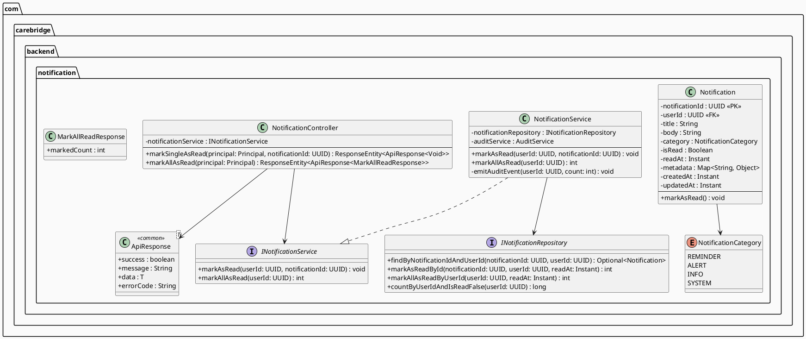
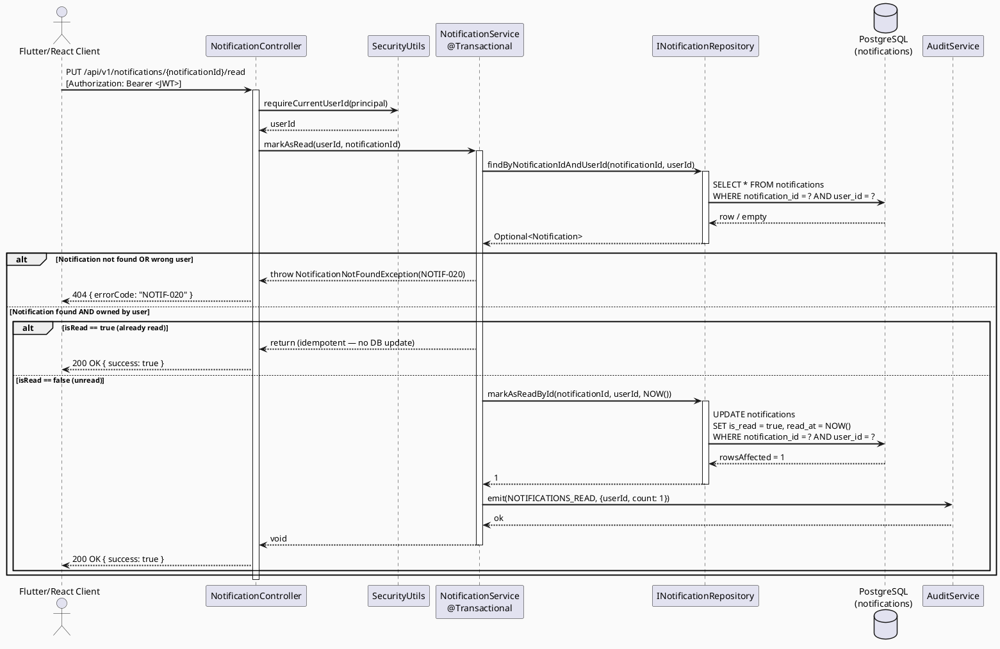
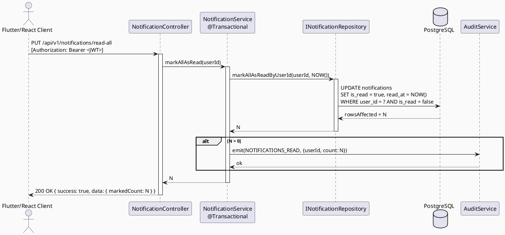

# Technical Design Specification (TDS)
## UC-12: Mark Notifications As Read

| Field            | Value                                      |
|------------------|--------------------------------------------|
| Document ID      | CB-NOTIF-IMP-012                           |
| Version          | 1.0                                        |
| Date             | 2026-06-26                                 |
| Status           | Approved                                      |
| Document Owner   | PhuongNT                                   |
| Author           | AI Agent                                   |
| Based on EDS     | v2.0                                       |
| Related UC       | UC-12 MarkNotificationsAsRead              |
| Depends On       | UC-10 (SendNotification), UC-11 (ListNotifications) |

---

## 1. Tổng quan Module

### 1.1 Mục đích

Module UC-12 cung cấp chức năng đánh dấu thông báo là đã đọc cho người dùng đã xác thực trong hệ thống CareBridge. Module hỗ trợ hai thao tác:

1. **Đánh dấu một thông báo đã đọc**: `PUT /api/v1/notifications/{notificationId}/read`
2. **Đánh dấu tất cả thông báo đã đọc**: `PUT /api/v1/notifications/read-all`

### 1.2 Phạm vi

- **Actor**: Người dùng đã xác thực (`ROLE_MOTHER`, `ROLE_EXPERT`, `ROLE_ADMIN`)
- **Platform**: Mobile (Flutter) + Web (React)
- **Backend**: Java 21, Spring Boot 3.5.x, PostgreSQL, Flyway
- **Package**: `com.carebridge.backend.notification`

### 1.3 Các ràng buộc chính

- Người dùng chỉ được đánh dấu thông báo thuộc sở hữu của chính mình.
- Thao tác là **idempotent**: thông báo đã đọc rồi vẫn trả về `200 OK` khi đánh dấu lại.
- `is_read` và `read_at` phải được cập nhật **nguyên tử** trong một lệnh `UPDATE` duy nhất.
- Mỗi thao tác thành công phải phát sự kiện audit `NOTIFICATIONS_READ`.

### 1.4 Bối cảnh hệ thống

```
Flutter App / React Web
        │
        │  PUT /api/v1/notifications/{id}/read
        │  PUT /api/v1/notifications/read-all
        ▼
NotificationController (Spring MVC)
        │
        ▼
NotificationService (@Transactional)
        │  ┌──────────────────────┐
        ├──► INotificationRepository (JPA)
        │  └──────────────────────┘
        │  ┌──────────────────────┐
        └──► AuditService.emit()
           └──────────────────────┘
```

---

## 2. Ma trận Truy vết (Traceability Matrix)

### 2.1 Business Rules

| Rule ID              | Mô tả                                                                                     | Liên kết Section |
|----------------------|-------------------------------------------------------------------------------------------|------------------|
| BR-NOTIF-OWN-012     | Người dùng chỉ được thao tác trên thông báo của chính mình. Thông báo của người khác hoặc không tồn tại → 404 NOTIF-020. | §8, §9, §10      |
| BR-NOTIF-IDEMP-012   | Đánh dấu thông báo đã đọc là thao tác idempotent. Thông báo đã đọc rồi → trả về `200 OK`, không phát sinh lỗi. | §3 (ADR-012-002), §9 |
| BR-NOTIF-AUDIT-012   | Mỗi lần đánh dấu thành công phải phát sự kiện audit `NOTIFICATIONS_READ` kèm `userId` và `count`. | §7, §8           |

### 2.2 Functional Requirements

| Requirement ID | Mô tả                                                                 | Test Cases                              |
|----------------|-----------------------------------------------------------------------|-----------------------------------------|
| FR-012-001     | Đánh dấu một thông báo cụ thể là đã đọc theo `notificationId`       | NOTIF-TC-012-001, NOTIF-TC-012-INT-001  |
| FR-012-002     | Đánh dấu toàn bộ thông báo chưa đọc của user là đã đọc              | NOTIF-TC-012-005, NOTIF-TC-012-INT-002  |
| FR-012-003     | Kiểm tra quyền sở hữu trước khi cập nhật                            | NOTIF-TC-012-003                        |
| FR-012-004     | Hành vi idempotent khi thông báo đã đọc                              | NOTIF-TC-012-002                        |
| FR-012-005     | Từ chối JWT không hợp lệ hoặc thiếu                                  | NOTIF-TC-012-006                        |
| FR-012-006     | Từ chối UUID sai định dạng                                           | NOTIF-TC-012-004                        |

### 2.3 Non-Functional Requirements

| NFR ID       | Loại        | Chỉ tiêu                                                     |
|--------------|-------------|--------------------------------------------------------------|
| NFR-012-001  | Performance | p95 latency ≤ 200ms cho mark-single; ≤ 500ms cho mark-all   |
| NFR-012-002  | Atomicity   | `is_read` và `read_at` cập nhật trong một `UPDATE` duy nhất |
| NFR-012-003  | Security    | Mọi request phải có JWT hợp lệ; ownership được kiểm tra     |
| NFR-012-004  | Audit       | 100% thao tác thành công phải được ghi audit                 |

---

## 3. Architecture Decision Records (ADRs)

### ADR-012-001: Hai Endpoint Riêng Biệt cho Mark-One và Mark-All

**Ngày**: 2026-06-26
**Trạng thái**: Accepted

**Bối cảnh**:
Cần thiết kế API cho phép đánh dấu một hoặc tất cả thông báo là đã đọc. Có thể thiết kế theo hai hướng:
- **Phương án A**: Một endpoint duy nhất nhận payload `{ "ids": ["id1", "id2"] | "all" }`
- **Phương án B**: Hai endpoint riêng biệt: `PUT /{id}/read` và `PUT /read-all`

**Quyết định**: Chọn Phương án B — hai endpoint riêng biệt.

**Lý do**:
1. Semantic rõ ràng hơn; mỗi endpoint có một mục đích duy nhất (Single Responsibility).
2. Dễ phân quyền độc lập nếu cần trong tương lai.
3. Tránh phải parse và validate payload phức tạp cho thao tác "mark-all".
4. Phù hợp với RESTful conventions được sử dụng trong UC-10 và UC-11.
5. Client-side code đơn giản hơn: không cần quyết định giá trị của field `ids`.

**Hệ quả**:
- Controller cần hai method handler riêng biệt.
- Service interface có hai method: `markAsRead(UUID, UUID)` và `markAllAsRead(UUID)`.

---

### ADR-012-002: Idempotent PUT — Thông Báo Đã Đọc Trả Về 200, Không Phải 400

**Ngày**: 2026-06-26
**Trạng thái**: Accepted

**Bối cảnh**:
Khi client gọi `PUT /notifications/{id}/read` nhưng thông báo đó đã có `is_read = true`, cần quyết định hành vi của hệ thống.

**Quyết định**: Trả về `200 OK` với trạng thái hiện tại, không phát sinh lỗi.

**Lý do**:
1. PUT theo RFC 7231 là **idempotent** — cùng một request gọi nhiều lần phải cho kết quả giống nhau.
2. Tránh race condition: trên mobile, network retry có thể gửi lại request đã thực hiện; không nên gây lỗi.
3. Client (Flutter/React) không cần xử lý case đặc biệt "đã đọc rồi".
4. Nhất quán với behavior của UC-11 và các notification system phổ biến (Firebase, OneSignal).

**Hệ quả**:
- Service phải kiểm tra `is_read` trước khi quyết định thực hiện UPDATE hay skip.
- Audit event chỉ được emit khi thực sự có thay đổi (count > 0) để tránh noise.
- Response body giống nhau bất kể thông báo đã đọc hay chưa.

---

### ADR-012-003: Cập Nhật Nguyên Tử is_read và read_at Trong Một Lệnh UPDATE

**Ngày**: 2026-06-26
**Trạng thái**: Accepted

**Bối cảnh**:
Khi đánh dấu đã đọc, cần cập nhật cả `is_read = true` và `read_at = NOW()`. Có thể thực hiện theo:
- **Phương án A**: Hai lệnh UPDATE riêng biệt.
- **Phương án B**: Một lệnh UPDATE duy nhất với cả hai field.

**Quyết định**: Chọn Phương án B — một lệnh UPDATE nguyên tử.

**Lý do**:
1. **Tính nhất quán dữ liệu**: Không bao giờ tồn tại trạng thái `is_read = true` mà `read_at IS NULL`, hoặc ngược lại.
2. **Hiệu năng**: Giảm số round-trip database từ 2 xuống còn 1.
3. **Atomicity trong transaction**: Dù `@Transactional` bảo vệ, việc gom vào một UPDATE loại bỏ hoàn toàn window của inconsistency.
4. **Đơn giản hóa rollback**: Chỉ cần rollback một statement.

**Hệ quả**:
- Repository method sử dụng `@Query` JPQL hoặc native SQL với `SET is_read = true, read_at = NOW()`.
- `read_at` luôn là server time (`NOW()` ở database layer), không phải client-provided time.

---

## 4. Non-Functional Requirements & SLA

| NFR ID       | Loại           | Chỉ tiêu / Ràng buộc                                                      | Cách đo                                      |
|--------------|----------------|---------------------------------------------------------------------------|----------------------------------------------|
| NFR-012-001  | Performance    | p50 ≤ 50ms, p95 ≤ 200ms cho mark-single; p95 ≤ 500ms cho mark-all       | Spring Actuator metrics / Prometheus          |
| NFR-012-002  | Throughput     | ≥ 500 RPS cho mark-single trên 2 vCPU                                    | Load test (JMeter/k6)                        |
| NFR-012-003  | Atomicity      | Zero trường hợp `is_read=true` với `read_at IS NULL` trong production    | Monitoring query định kỳ                     |
| NFR-012-004  | Security       | 100% request phải có JWT hợp lệ; ownership kiểm tra tại service layer   | Security scan + unit test                    |
| NFR-012-005  | Audit Coverage | 100% thao tác mark thành công phải có audit record                       | Audit log query                              |
| NFR-012-006  | Idempotency    | Gọi N lần cho cùng notificationId → trạng thái DB giống nhau            | Integration test                             |
| NFR-012-007  | Availability   | 99.9% uptime trong giờ cao điểm                                          | Uptime monitoring                            |

---

## 5. Static Modeling

### 5.1 Class Diagram



### 5.2 Package Structure

```
com.carebridge.backend.notification/
├── controller/
│   └── NotificationController.java          (UC-10, UC-11, UC-12)
├── service/
│   ├── INotificationService.java            (interface — add markAsRead, markAllAsRead)
│   └── NotificationService.java             (implementation)
├── repository/
│   └── INotificationRepository.java         (add 3 new query methods)
├── entity/
│   └── Notification.java
├── dto/
│   ├── request/
│   │   └── (no new request DTO — path variable only)
│   └── response/
│       └── MarkAllReadResponse.java         (NEW)
└── mapper/
    └── NotificationMapper.java
```

---

## 6. Dynamic Modeling

### 6.1 Sequence Diagram — Mark Single Notification As Read (Happy Path)



### 6.2 Sequence Diagram — Mark All As Read (Happy Path)



---

## 7. Domain Event Catalog

### 7.1 NotificationsRead Event

| Field          | Value                                                                 |
|----------------|-----------------------------------------------------------------------|
| Event Name     | `NOTIFICATIONS_READ`                                                  |
| Trigger        | Thành công đánh dấu ≥ 1 thông báo là đã đọc                         |
| Producer       | `NotificationService`                                                 |
| Consumer       | `AuditService` (ghi log), Analytics Pipeline (tùy chọn)             |
| Payload        | `{ userId, notificationIds: [UUID] or "all", count, timestamp }`     |
| Idempotency    | Chỉ emit khi `rowsAffected > 0`                                      |
| Retention      | 90 ngày trong audit log                                              |

**Payload Schema**:
```json
{
  "eventType": "NOTIFICATIONS_READ",
  "userId": "uuid",
  "scope": "single | all",
  "notificationId": "uuid | null",
  "count": 1,
  "timestamp": "2026-06-26T10:30:00Z"
}
```

---

## 8. Interface Specification

### 8.1 INotificationService

```java
package com.carebridge.backend.notification.service;

import java.util.UUID;

public interface INotificationService {

    /**
     * Đánh dấu một thông báo cụ thể là đã đọc.
     *
     * <p>Idempotent: nếu thông báo đã là is_read=true, không thực hiện UPDATE và
     * không phát sinh lỗi.
     *
     * @param userId         ID của người dùng hiện tại (từ JWT)
     * @param notificationId ID của thông báo cần đánh dấu
     * @throws NotificationNotFoundException nếu không tìm thấy hoặc không thuộc userId
     */
    void markAsRead(UUID userId, UUID notificationId);

    /**
     * Đánh dấu toàn bộ thông báo chưa đọc của user là đã đọc.
     *
     * <p>Idempotent: nếu tất cả đã đọc rồi, trả về 0 và không phát sinh lỗi.
     *
     * @param userId ID của người dùng hiện tại (từ JWT)
     * @return số lượng thông báo được đánh dấu
     */
    int markAllAsRead(UUID userId);
}
```

### 8.2 INotificationRepository (methods mới)

```java
package com.carebridge.backend.notification.repository;

import com.carebridge.backend.notification.entity.Notification;
import org.springframework.data.jpa.repository.JpaRepository;
import org.springframework.data.jpa.repository.Modifying;
import org.springframework.data.jpa.repository.Query;
import org.springframework.data.repository.query.Param;

import java.time.Instant;
import java.util.Optional;
import java.util.UUID;

public interface INotificationRepository extends JpaRepository<Notification, UUID> {

    /** Tìm thông báo theo notificationId VÀ userId — đảm bảo ownership. */
    Optional<Notification> findByNotificationIdAndUserId(
            @Param("notificationId") UUID notificationId,
            @Param("userId") UUID userId);

    /**
     * Đánh dấu một thông báo là đã đọc (nguyên tử, kiểm tra ownership trong WHERE).
     *
     * @return số hàng bị ảnh hưởng (0 hoặc 1)
     */
    @Modifying
    @Query("""
        UPDATE Notification n
        SET n.isRead = true, n.readAt = :readAt, n.updatedAt = :readAt
        WHERE n.notificationId = :notificationId
          AND n.userId = :userId
          AND n.isRead = false
        """)
    int markAsReadById(
            @Param("notificationId") UUID notificationId,
            @Param("userId") UUID userId,
            @Param("readAt") Instant readAt);

    /**
     * Đánh dấu toàn bộ thông báo chưa đọc của user là đã đọc.
     *
     * @return số hàng bị ảnh hưởng
     */
    @Modifying
    @Query("""
        UPDATE Notification n
        SET n.isRead = true, n.readAt = :readAt, n.updatedAt = :readAt
        WHERE n.userId = :userId
          AND n.isRead = false
        """)
    int markAllAsReadByUserId(
            @Param("userId") UUID userId,
            @Param("readAt") Instant readAt);
}
```

### 8.3 NotificationService Implementation

```java
@Service
@RequiredArgsConstructor
@Slf4j
public class NotificationService implements INotificationService {

    private final INotificationRepository notificationRepository;
    private final AuditService auditService;

    @Override
    @Transactional
    public void markAsRead(UUID userId, UUID notificationId) {
        // C1: Verify ownership before any mutation
        notificationRepository.findByNotificationIdAndUserId(notificationId, userId)
                .orElseThrow(() -> new NotificationNotFoundException(
                        "NOTIF-020", "Notification not found or not owned by user"));

        // C2 + ADR-012-003: Atomic update of is_read AND read_at
        // C3: Condition AND n.isRead = false makes this idempotent (0 rows = already read)
        int affected = notificationRepository.markAsReadById(notificationId, userId, Instant.now());

        // C4: Emit audit only when state actually changed
        if (affected > 0) {
            auditService.emit("NOTIFICATIONS_READ", userId, Map.of("count", 1, "scope", "single"));
        }
    }

    @Override
    @Transactional
    public int markAllAsRead(UUID userId) {
        // C2 + ADR-012-003: Atomic update
        int affected = notificationRepository.markAllAsReadByUserId(userId, Instant.now());

        // C4: Emit audit only when at least one notification was marked
        if (affected > 0) {
            auditService.emit("NOTIFICATIONS_READ", userId, Map.of("count", affected, "scope", "all"));
        }
        return affected;
    }
}
```

### 8.4 NotificationController

```java
@RestController
@RequestMapping("/api/v1/notifications")
@RequiredArgsConstructor
@Validated
public class NotificationController {

    private final INotificationService notificationService;

    /** UC-12: Mark single notification as read */
    @PutMapping("/{notificationId}/read")
    public ResponseEntity<ApiResponse<Void>> markSingleAsRead(
            Principal principal,
            @PathVariable @NotNull UUID notificationId) {

        UUID userId = SecurityUtils.requireCurrentUserId(principal);
        notificationService.markAsRead(userId, notificationId);
        return ResponseEntity.ok(ApiResponse.success(null));
    }

    /** UC-12: Mark all notifications as read */
    @PutMapping("/read-all")
    public ResponseEntity<ApiResponse<MarkAllReadResponse>> markAllAsRead(Principal principal) {
        UUID userId = SecurityUtils.requireCurrentUserId(principal);
        int count = notificationService.markAllAsRead(userId);
        return ResponseEntity.ok(ApiResponse.success(new MarkAllReadResponse(count)));
    }
}
```

---

## 9. API Specification

### 9.1 Endpoint 1: Mark Single Notification As Read

```
PUT /api/v1/notifications/{notificationId}/read
```

**Headers**:
```
Authorization: Bearer <JWT>
Content-Type: application/json
```

**Path Parameters**:

| Parameter        | Type   | Required | Description                              |
|------------------|--------|----------|------------------------------------------|
| `notificationId` | UUID   | Yes      | ID của thông báo cần đánh dấu đã đọc    |

**Request Body**: Không có (không cần body)

**Response 200 OK** (thành công, kể cả đã đọc trước đó):
```json
{
  "success": true,
  "message": "Notification marked as read",
  "data": null,
  "errorCode": null
}
```

**Response 404 Not Found** (NOTIF-020):
```json
{
  "success": false,
  "message": "Notification not found or not owned by user",
  "data": null,
  "errorCode": "NOTIF-020"
}
```

**Response 400 Bad Request** (NOTIF-021):
```json
{
  "success": false,
  "message": "Invalid notification ID format",
  "data": null,
  "errorCode": "NOTIF-021"
}
```

**Response 401 Unauthorized**:
```json
{
  "success": false,
  "message": "Authentication required",
  "data": null,
  "errorCode": "AUTH-001"
}
```

---

### 9.2 Endpoint 2: Mark All Notifications As Read

```
PUT /api/v1/notifications/read-all
```

**Headers**:
```
Authorization: Bearer <JWT>
```

**Request Body**: Không có

**Response 200 OK**:
```json
{
  "success": true,
  "message": "All notifications marked as read",
  "data": {
    "markedCount": 5
  },
  "errorCode": null
}
```

> Khi không có thông báo chưa đọc: `markedCount: 0`, vẫn trả về `200 OK`.

**Response 401 Unauthorized**: (giống trên)

---

## 10. Bảng Mã Lỗi

| Mã lỗi     | HTTP Status | Mô tả                                                              | Trigger                                                       |
|------------|-------------|--------------------------------------------------------------------|---------------------------------------------------------------|
| NOTIF-020  | 404         | Notification not found or not owned by user                       | `notificationId` không tồn tại HOẶC thuộc về user khác       |
| NOTIF-021  | 400         | Invalid notification ID format                                    | `notificationId` không phải UUID hợp lệ (vd: "abc123")       |

**Lưu ý bảo mật**: Cả hai trường hợp (không tồn tại + không phải của mình) đều trả về `NOTIF-020` để tránh information disclosure (không tiết lộ sự tồn tại của thông báo cho user khác).

---

## 11. Quy trình Triển khai

### 11.1 Không cần migration mới

UC-12 **không yêu cầu thêm migration Flyway**. Tất cả các column cần thiết (`is_read`, `read_at`) đã được tạo trong migration `V2__create_notifications_table.sql` của UC-11.

### 11.2 Checklist triển khai

```
[ ] 1. Thêm methods vào INotificationRepository
        - findByNotificationIdAndUserId
        - markAsReadById (@Modifying + @Query)
        - markAllAsReadByUserId (@Modifying + @Query)

[ ] 2. Tạo MarkAllReadResponse DTO

[ ] 3. Implement INotificationService.markAsRead()
        - Ownership check trước UPDATE
        - Atomic UPDATE với is_read + read_at
        - Emit audit nếu affected > 0

[ ] 4. Implement INotificationService.markAllAsRead()
        - Atomic UPDATE với is_read + read_at
        - Emit audit nếu affected > 0
        - Return count

[ ] 5. Thêm 2 endpoint vào NotificationController

[ ] 6. Đăng ký exception handler cho NotificationNotFoundException → 404 NOTIF-020

[ ] 7. Đăng ký exception handler cho MethodArgumentTypeMismatchException → 400 NOTIF-021

[ ] 8. Viết và chạy unit tests

[ ] 9. Viết và chạy integration tests

[ ] 10. Kiểm tra audit log có record sau mỗi thao tác
```

### 11.3 Thứ tự triển khai

```
Repository → DTO → Service → Controller → Exception Handlers → Tests
```

---

## 12. Rollback & Incident Runbook

### 12.1 Rollback Plan

Vì UC-12 chỉ thêm code (không thêm migration), rollback được thực hiện bằng cách revert commit:

```bash
git revert <commit-hash>
git push github PhuongNT
```

### 12.2 Incident Runbook

**Sự cố**: Thông báo được đánh dấu nhưng `read_at IS NULL`

```sql
-- Phát hiện
SELECT COUNT(*) FROM notifications WHERE is_read = true AND read_at IS NULL;

-- Khắc phục tạm thời (nếu xảy ra)
UPDATE notifications
SET read_at = updated_at
WHERE is_read = true AND read_at IS NULL;
```

**Sự cố**: Mark-all chạy chậm (> 1s) khi user có nhiều thông báo

```sql
-- Kiểm tra index
EXPLAIN ANALYZE
UPDATE notifications SET is_read = true, read_at = NOW()
WHERE user_id = '<uuid>' AND is_read = false;

-- Thêm index nếu cần (tham khảo UC-11 indexing strategy)
CREATE INDEX CONCURRENTLY IF NOT EXISTS idx_notifications_user_unread
ON notifications(user_id) WHERE is_read = false;
```

**Sự cố**: Audit event không được ghi

```
1. Kiểm tra AuditService logs
2. Kiểm tra @Transactional boundary — AuditService.emit() phải được gọi trong transaction
3. Kiểm tra exception handler không swallow exceptions trước audit call
```

---

## 13. Kịch bản Kiểm thử Chi tiết

| TC ID                    | Mô tả                                             | Input                                    | Expected                                       |
|--------------------------|---------------------------------------------------|------------------------------------------|------------------------------------------------|
| NOTIF-TC-012-001         | Mark single — happy path                         | Valid JWT, owned unread notification     | 200 OK, is_read=true, read_at set              |
| NOTIF-TC-012-002         | Mark single — idempotent (đã đọc)                | Valid JWT, owned read notification       | 200 OK, no DB change                           |
| NOTIF-TC-012-003         | Mark single — wrong owner                        | Valid JWT, another user's notification   | 404 NOTIF-020                                  |
| NOTIF-TC-012-004         | Mark single — invalid UUID                       | notificationId = "not-a-uuid"            | 400 NOTIF-021                                  |
| NOTIF-TC-012-005         | Mark all — happy path                            | Valid JWT, 3 unread notifications        | 200 OK, markedCount=3, all is_read=true        |
| NOTIF-TC-012-006         | No JWT                                           | No Authorization header                  | 401 Unauthorized                               |
| NOTIF-TC-012-INT-001     | Integration — DB state sau mark-single           | Unread notification in DB                | is_read=true AND read_at IS NOT NULL in DB     |
| NOTIF-TC-012-INT-002     | Integration — mark-all row count                 | 5 unread notifications for user in DB    | rowsAffected = 5, markedCount = 5              |

---

## 14. Phương pháp Xác minh

### 14.1 SQL Assertions sau Mark-Single

```sql
-- Sau khi gọi PUT /notifications/{id}/read thành công:

-- Assert 1: is_read phải là true
SELECT is_read FROM notifications WHERE notification_id = '<uuid>';
-- Expected: true

-- Assert 2: read_at phải có giá trị (không NULL)
SELECT read_at FROM notifications WHERE notification_id = '<uuid>';
-- Expected: NOT NULL, timestamp gần với thời điểm gọi API

-- Assert 3: Không có inconsistent state
SELECT COUNT(*) FROM notifications
WHERE is_read = true AND read_at IS NULL;
-- Expected: 0
```

### 14.2 SQL Assertions sau Mark-All

```sql
-- Sau khi gọi PUT /notifications/read-all:

-- Assert 1: Không còn thông báo chưa đọc cho user
SELECT COUNT(*) FROM notifications
WHERE user_id = '<uuid>' AND is_read = false;
-- Expected: 0

-- Assert 2: Tất cả đều có read_at
SELECT COUNT(*) FROM notifications
WHERE user_id = '<uuid>' AND is_read = true AND read_at IS NULL;
-- Expected: 0
```

### 14.3 Audit Log Assertion

```sql
-- Kiểm tra audit event được ghi
SELECT * FROM audit_log
WHERE event_type = 'NOTIFICATIONS_READ'
  AND user_id = '<uuid>'
ORDER BY created_at DESC
LIMIT 1;
-- Expected: record tồn tại với timestamp gần đây
```

---

## 15. Mẫu Thử Thực Tế

### 15.1 cURL — Mark Single

```bash
# Mark single notification as read
curl -X PUT \
  http://localhost:8080/api/v1/notifications/aaaaaaaa-0000-0000-0000-000000000012/read \
  -H "Authorization: Bearer <JWT_TOKEN>" \
  -H "Content-Type: application/json"

# Expected response:
# HTTP/1.1 200 OK
# {"success":true,"message":"Notification marked as read","data":null,"errorCode":null}
```

### 15.2 cURL — Mark All

```bash
# Mark all notifications as read
curl -X PUT \
  http://localhost:8080/api/v1/notifications/read-all \
  -H "Authorization: Bearer <JWT_TOKEN>"

# Expected response:
# HTTP/1.1 200 OK
# {"success":true,"message":"All notifications marked as read","data":{"markedCount":3},"errorCode":null}
```

### 15.3 Flutter HTTP Call

```dart
// Mark single
final response = await http.put(
  Uri.parse('$baseUrl/api/v1/notifications/$notificationId/read'),
  headers: {'Authorization': 'Bearer $token'},
);

// Mark all
final response = await http.put(
  Uri.parse('$baseUrl/api/v1/notifications/read-all'),
  headers: {'Authorization': 'Bearer $token'},
);
```

### 15.4 React/TypeScript

```typescript
// Mark single
await axios.put(`/api/v1/notifications/${notificationId}/read`, null, {
  headers: { Authorization: `Bearer ${token}` }
});

// Mark all
const { data } = await axios.put('/api/v1/notifications/read-all', null, {
  headers: { Authorization: `Bearer ${token}` }
});
console.log(`Marked ${data.data.markedCount} notifications as read`);
```

---

## 16. Bảng Tổng Hợp Phân Quyền

| Endpoint                                      | Method | ROLE_MOTHER | ROLE_EXPERT | ROLE_ADMIN | Ghi chú                              |
|-----------------------------------------------|--------|-------------|-------------|------------|--------------------------------------|
| `/api/v1/notifications/{id}/read`             | PUT    | Allowed     | Allowed     | Allowed    | Chỉ được đánh dấu thông báo của mình |
| `/api/v1/notifications/read-all`              | PUT    | Allowed     | Allowed     | Allowed    | Chỉ ảnh hưởng đến thông báo của mình |

**Nguyên tắc**:
- Không có role nào được đánh dấu thông báo của user khác.
- `ROLE_ADMIN` không có quyền đặc biệt hơn trong UC-12 — ownership rule vẫn áp dụng.
- Phân quyền được thực thi tại Service layer (ownership check), không chỉ tại Security config.

---

## 17. AI Prompt Constraints

Các ràng buộc bắt buộc khi AI Agent tạo code cho UC-12:

| Constraint ID | Mô tả                                                                                       | Vi phạm dẫn đến          |
|---------------|---------------------------------------------------------------------------------------------|--------------------------|
| C1            | **Ownership trước Update**: Luôn gọi `findByNotificationIdAndUserId()` TRƯỚC khi thực hiện bất kỳ `UPDATE` nào. Không được bỏ qua bước này dù thấy "tối ưu hơn". | TOCTOU race condition, data leak |
| C2            | **Cập nhật cả hai field**: Mỗi `UPDATE` phải set đồng thời `is_read = true` VÀ `read_at = NOW()`. Không được tách thành 2 lệnh. | Data inconsistency       |
| C3            | **Idempotent**: Thông báo đã `is_read = true` khi gọi mark-read phải trả về `200 OK`, không phải `400` hay `409`. | Broken retry logic       |
| C4            | **Emit Audit**: Sau mỗi thao tác mark thành công (affected > 0), phải gọi `auditService.emit("NOTIFICATIONS_READ", ...)`. Không được bỏ qua hoặc đặt ngoài transaction. | Audit gap, compliance failure |
| C5            | **Server Time Only**: `read_at` phải là `Instant.now()` ở server side. Không được nhận timestamp từ request body/header của client. | Timestamp manipulation   |
| C6            | **No Business Logic in Controller**: Controller chỉ extract userId từ principal và delegate sang Service. | Architecture violation   |

---

*Document ID: CB-NOTIF-IMP-012 | Version 1.0 | Status: Draft | EDS v2.0*
