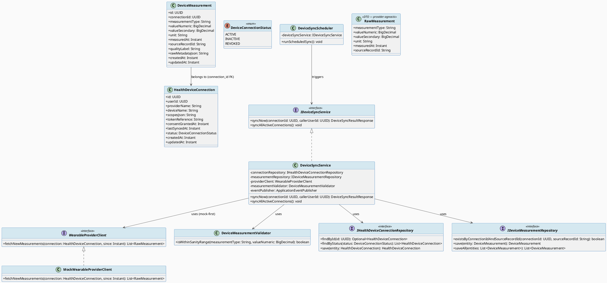
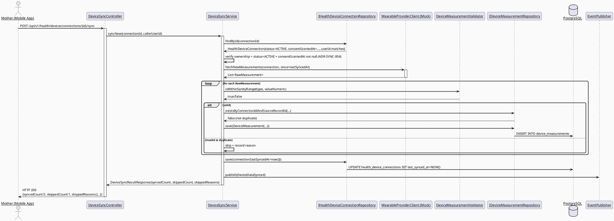
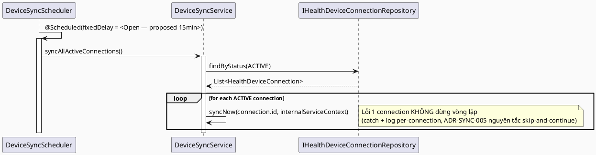
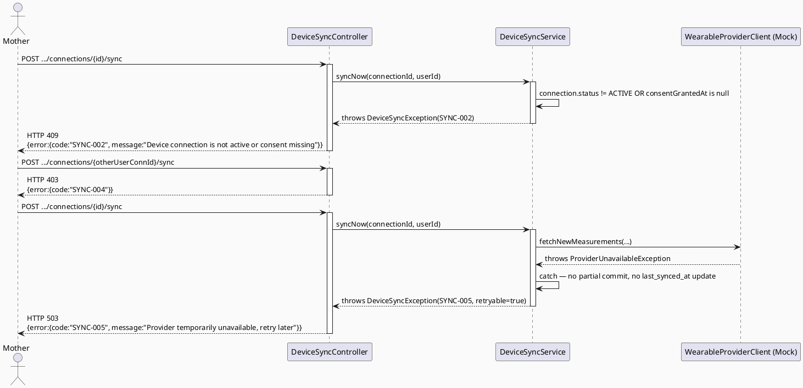

# ENGINEERING DOCUMENTATION STANDARD (EDS) v2.0
# UC130 — Sync Health Device Data

| Field | Value |
|-------|-------|
| **Document ID** | `CB-DEVICE-SYNC-001` |
| **Version** | `1.0` |
| **Date** | `2026-07-02` |
| **Status** | `Draft` |
| **Document Owner** | `TV2-Bách` |
| **Author** | `AI Agent — Technical Architect` |
| **Reviewed by** | `[ ] Pending` |
| **DPO Sign-off** | `[ ] Pending` *(bắt buộc — module đồng bộ health/wearable data tự động)* |
| **Approved by** | `[ ] Pending` |
| **Last Review** | `2026-07-02` |
| **Based on EDS** | `v2.0` |

---

## CHANGELOG

> **Policy 4.4 — Immutable History:** Không bao giờ xóa thông tin cũ. Mọi thay đổi phải ghi vào bảng này.

| Ngày | Người thực hiện | Nội dung thay đổi |
|------|-----------------|-------------------|
| 2026-07-02 | AI Agent — Technical Architect | Tạo tài liệu lần đầu — TDS cho UC130 Sync Health Device Data (Draft) |

---

## MỤC LỤC

1. [Tổng quan Module](#1-tổng-quan-module)
2. [Ma trận Truy vết (Traceability Matrix)](#2-ma-trận-truy-vết-traceability-matrix)
3. [Architecture Decision Records (ADR)](#3-architecture-decision-records-adr)
4. [Non-Functional Requirements & SLA](#4-non-functional-requirements--sla)
5. [Static Modeling (Mô hình Tĩnh)](#5-static-modeling-mô-hình-tĩnh)
6. [Dynamic Modeling (Mô hình Động)](#6-dynamic-modeling-mô-hình-động)
7. [Domain Event Catalog](#7-domain-event-catalog)
8. [Interface Specification (Đặc tả Giao diện)](#8-interface-specification-đặc-tả-giao-diện)
9. [API Specification](#9-api-specification)
10. [Bảng mã lỗi (Error Codes)](#10-bảng-mã-lỗi-error-codes)
11. [Quy trình Triển khai (Step-by-Step)](#11-quy-trình-triển-khai-step-by-step)
12. [Rollback & Incident Runbook](#12-rollback--incident-runbook)
13. [Kịch bản Kiểm thử Chi tiết](#13-kịch-bản-kiểm-thử-chi-tiết)
14. [Phương pháp Xác minh](#14-phương-pháp-xác-minh)
15. [Mẫu thử thực tế (API Verification Samples)](#15-mẫu-thử-thực-tế-api-verification-samples)
16. [Bảng tổng hợp phân quyền (Authorization Matrix)](#16-bảng-tổng-hợp-phân-quyền-authorization-matrix)
17. [AI Prompt Constraints (CASE 2.0)](#17-ai-prompt-constraints-case-20)

---

## 1. Tổng quan Module

> UC130 là phiên bản **tự động/nền (background/automatic sync)** của việc đưa dữ liệu thiết bị đeo (wearable) vào CareBridge — đối lập với UC67 (`Import Device Data Manually`), nơi Mother **tự tay nhập** từng chỉ số. UC130 mô phỏng việc hệ thống (background job hoặc "Sync now" trigger) **kéo (pull)** dữ liệu từ một kết nối thiết bị đã tồn tại (thiết lập bởi UC66-tương-đương) và ghi các phép đo mới vào kho dữ liệu sức khỏe, không cần Mother nhập tay từng giá trị.
>
> **⚠️ Phát hiện xung đột schema quan trọng (RG-5 / xem §OPEN ITEMS O1):** UC66/67/68/69 (đã spec trước, Status=Draft, CHƯA implement) tự đề xuất một bảng mới `device_connections` (migration `V20260701140000`) và mở rộng `maternal_health_metrics`. Tuy nhiên, khi verify trực tiếp `V1__init_schema.sql` (nguồn sự thật chính theo CLAUDE.md), schema **ĐÃ CÓ SẴN** 2 bảng greenfield-nhưng-thực-tồn-tại dành riêng cho device sync: `health_device_connections` (dòng 1115-1127) và `device_measurements` (dòng 1129-1142) — với các cột đặc thù cho auto-sync (`last_synced_at`, `token_reference`, `scopes_json`, `quality_label`, `raw_metadata_json`) mà bảng tự-đề-xuất `device_connections` của UC66 KHÔNG có. Không có entity Java nào cho 2 bảng này tồn tại — package `integration/wearable` hiện chỉ có `.gitkeep` (100% greenfield ở tầng code).
>
> **Quyết định của TDS này:** Vì UC66-69 **chưa Approved và chưa implement** (Status=Draft), và vì CLAUDE.md quy định `V1__init_schema.sql` + migrations đã duyệt là nguồn sự thật DB chính (ưu tiên cao hơn TDS nháp khác), TDS UC130 này thiết kế trực tiếp trên **schema thực tế đã có** (`health_device_connections` + `device_measurements`), **KHÔNG** trên bảng tự-đề-xuất `device_connections` của UC66. Đây là quyết định kiến trúc quan trọng cần Tech Lead xác nhận — xem ADR-SYNC-001 và Open Item O1. Việc này đồng thời ngụ ý: nếu UC66-69 được implement sau này theo đúng TDS nháp của chúng, sẽ có 2 bảng song song (`device_connections` do UC66 tạo và `health_device_connections` có sẵn) — xung đột cần giải quyết ở cấp Tech Lead trước khi bất kỳ TDS nào trong nhóm 66/67/68/69/130 được Approved.

| Field | Value |
|-------|-------|
| **Module Name** | `Sync Health Device Data` |
| **Bounded Context** | `health.device` (mới — sử dụng bảng thực `health_device_connections`/`device_measurements`, KHÔNG phải bảng tự-đề-xuất của UC66) |
| **Data Classification** | `Sensitive-PII` *(dữ liệu sinh hiệu tự động đồng bộ từ thiết bị đeo)* |
| **Compliance Scope** | `PDPA / Luật 91/2025` |
| **Upstream Dependencies** | `IAM (JWT)`, `consent` module (`ConsentGrant`), `integration.wearable` (SDK/provider client — hiện là placeholder `.gitkeep`) |
| **Downstream Consumers** | Health metric read views (tương lai — UC69 hoặc phiên bản tương đương đọc từ `device_measurements`), Audit log sink |

**Nguồn gốc & phạm vi:**
- Function spec: `02_Requirements/SRS/3_Functional_Specification.md §3.1.2.4` (dòng 534-553), UC-130 "Sync Health Device Data".
- Task allocation: `04_Implement/implement_artifacts/function-spec-task-allocation.md` dòng 670-699 — owner TV2-Bách, sprint "Device Sync And Care Edge Cases", cùng nhóm với UC66/67/68/69. Ghi chú "Expected output": *"Device sync works through real provider if available, otherwise manual import plus stable mock remains."*
- Primary Actor (SRS): **Smartwatch / Wearable Device**. Secondary Actors: None (SRS ghi rõ). Platform (SRS "Other Information"): **Backend/External**; Source group: Supporting Services.
- **Diễn giải actor (RG-1):** SRS liệt kê "Smartwatch / Wearable Device" là Primary Actor theo mẫu chung của nhóm UC Backend/External (giống UC-128 Send Automated Notification có Primary Actor = Firebase Cloud Messaging, UC-131 có Primary Actor = Gemini AI Service). Đây là quy ước SRS dùng để chỉ **hệ thống bên ngoài khởi tạo luồng dữ liệu**, không phải một actor con người thao tác trực tiếp trên UI. Diễn giải hợp lý nhất (nhất quán với ADR-DEVICE-003 của UC66 — "auto-sync thật từ SDK thiết bị" được xác định rõ là ngoài phạm vi UC66-69 và **thuộc `3.1.2.4` riêng**): UC130 là tiến trình **backend-initiated** (scheduled job hoặc SDK callback) đại diện cho việc thiết bị "đẩy" hoặc hệ thống "kéo" dữ liệu, khác với UC67 nơi Mother là actor UI trực tiếp gõ số liệu.
- **In-scope:** Đồng bộ (kéo) các phép đo (measurements) mới từ một `health_device_connections` đang `ACTIVE` (đã có consent + token) về `device_measurements`; cập nhật `last_synced_at`; áp dụng cùng validation heuristic (sanity range) như UC67 để chặn giá trị vô lý trước khi lưu; phát domain event khi đồng bộ thành công/thất bại; hỗ trợ retry khi provider lỗi tạm thời.
- **Out-of-scope:** Nhập tay dữ liệu (UC67 — actor Mother, entity khác); kết nối/ngắt kết nối thiết bị (thuộc phạm vi tương đương UC66/UC68 nhưng trên bảng `health_device_connections` thực — KHÔNG thuộc TDS này, xem Open Item O2); xem xu hướng/trend (đọc dữ liệu, tương đương UC69); chẩn đoán/diễn giải y khoa giá trị đồng bộ (BR-SAFETY, CLAUDE.md).
- **Preconditions/Postconditions:** Theo bảng UC-130 gốc (PRE-1..4, POST-1..3) — xem §2 Traceability.

---

## 2. Ma trận Truy vết (Traceability Matrix)

| Requirement ID | Loại (BR/ADR/US) | Mô tả yêu cầu | Thành phần Code | Compliance Target | ADR liên quan |
|----------------|------------------|---------------|-----------------|-------------------|---------------|
| UC-130 (SRS §3.1.2.4) | User Story | Đồng bộ/import dữ liệu thiết bị đã được user ủy quyền | `DeviceSyncController.POST /api/v1/health/devices/connections/{id}/sync` + scheduled job | — | ADR-SYNC-001, ADR-SYNC-002 |
| PRE-3 / BR-RBAC | Business Rule | Chỉ actor đã xác thực với role phù hợp mới trigger sync thủ công; scheduled job chạy dưới service identity nội bộ | `DeviceSyncService.syncNow()` + `@PreAuthorize` | — | — |
| PRE-1 | Precondition | Hệ thống và external service (wearable provider) phải khả dụng | `DeviceSyncService` xử lý `ProviderUnavailableException` | — | ADR-SYNC-003 |
| BR-PRIVACY | Business Rule | Chỉ đồng bộ khi `health_device_connections.status=ACTIVE` và có `consent_granted_at` hợp lệ (không null, chưa revoke) | `DeviceSyncService.syncNow()` — kiểm tra consent trước khi gọi provider | PDPA / Luật 91/2025 | ADR-SYNC-004 |
| POST-2/POST-3 | Postcondition | Kết quả đồng bộ cập nhật `last_synced_at`; sensitive actions ghi audit | `DeviceMeasurement` rows + `DeviceDataSynced` event | PDPA | — |
| E1 (Exceptions) | Exception Flow | Access denied khi actor không sở hữu connection | `DeviceSyncController` (403) | — | — |
| E2 (Exceptions) | Exception Flow | Giá trị đồng bộ về nằm ngoài sanity range bị reject theo record (không fail cả batch) | `DeviceMeasurementValidator` (tái sử dụng logic ADR-DEVICE-006 của UC67) | BR-SAFETY | ADR-SYNC-005 |
| E3 (Exceptions) | Exception Flow | Lỗi external service/network được xử lý với retry, không tạo duplicate | `DeviceSyncService` — idempotency theo `source_record_id` | — | ADR-SYNC-003 |
| ADR-SYNC-001 | Decision | UC130 dùng schema THỰC (`health_device_connections`/`device_measurements`), không dùng bảng tự-đề-xuất `device_connections` của UC66 | Toàn bộ entity/repository UC130 | — | — |
| ADR-SYNC-002 | Decision | Sync trigger hỗ trợ CẢ 2: (a) manual "Sync now" endpoint (giống UC67 nhưng nguồn=DEVICE, không phải Mother tự nhập giá trị), (b) scheduled job nền định kỳ | `DeviceSyncController` + `DeviceSyncScheduler` | — | — |
| ADR-SYNC-003 | Decision | SDK/provider integration là **mock-first** (nhất quán ADR-DEVICE-003 của UC66) — `WearableProviderClient` interface với `MockWearableProviderClient` implementation duy nhất ở giai đoạn này | `integration.wearable.WearableProviderClient` | — | — |
| ADR-SYNC-004 | Decision | Consent bắt buộc active trước mỗi lần sync (không chỉ tại thời điểm connect) — tái xác minh mỗi lần | `DeviceSyncService.syncNow()` | PDPA Art. (Luật 91/2025 Đ.13) | — |
| ADR-SYNC-005 | Decision | Sanity validation tái sử dụng cùng phạm vi/range như UC67 ADR-DEVICE-006 (heuristic, không chẩn đoán); mỗi record lỗi được skip + log, không fail toàn bộ batch | `DeviceMeasurementValidator` | BR-SAFETY | — |

---

## 3. Architecture Decision Records (ADR)

### ADR-SYNC-001 — Use Real Schema (`health_device_connections`/`device_measurements`), Not UC66's Proposed `device_connections`

| Field | Value |
|-------|-------|
| **Status** | `Proposed` *(cần Tech Lead xác nhận — xung đột trực tiếp với hướng đi của UC66-69 TDS)* |
| **Deciders** | `[ ] Pending — Tech Lead` |
| **Date** | `2026-07-02` |
| **Supersedes** | `—` |

#### Bối cảnh (Context)
UC66's TDS (`04_Implement/UC66_ConnectHealthDevice/UC66_ConnectHealthDevice_TDS.md §5.2`) tuyên bố: *"Không có bảng `device_connections`, `wearable`, hoặc `device` nào tồn tại trong schema hiện tại (đã xác minh — greenfield)."* Khi TDS này verify trực tiếp `V1__init_schema.sql` (dòng 1115-1142), phát hiện tuyên bố đó **KHÔNG chính xác**: bảng `health_device_connections` và `device_measurements` đã tồn tại từ trước (baseline schema), với các cột dành riêng cho auto-sync provider integration (`provider_name`, `token_reference`, `scopes_json`, `last_synced_at`, `quality_label`, `raw_metadata_json`) — rõ ràng được thiết kế cho chính use case "Sync Health Device Data" (UC130) chứ không phải cho model "manual connect" đơn giản mà UC66 mô tả.

#### Các phương án đã xem xét (Options Considered)

| Phương án | Mô tả | Ưu điểm | Nhược điểm |
|-----------|-------|----------|------------|
| A | UC130 dùng bảng thực `health_device_connections`/`device_measurements`; đề xuất UC66-69 (còn Draft, chưa Approved) được sửa lại để dùng cùng bảng thực thay vì tạo `device_connections` mới | Nhất quán với schema baseline đã tồn tại, không tạo 2 bảng trùng chức năng, tận dụng đúng cột đã thiết kế sẵn cho sync (`token_reference`, `scopes_json`, `last_synced_at`) | Yêu cầu sửa lại UC66-69 TDS (ngoài phạm vi công việc này) — TDS UC130 chỉ có thể ghi nhận Open Item, không tự sửa TDS của agent khác |
| B | UC130 tiếp tục dùng bảng tự-đề-xuất `device_connections` của UC66 để "nhất quán" theo yêu cầu ban đầu của nhiệm vụ | Nhất quán bề mặt với 4 TDS anh em | Trực tiếp vi phạm CLAUDE.md ("current code and tests as evidence of existing state" + "V1__init_schema.sql... là nguồn sự thật chính") — dùng bảng KHÔNG tồn tại trong baseline thực, lặp lại đúng lỗi mà UC66 đã mắc phải; nếu implement, sẽ tạo ra bảng `device_connections` DƯ THỪA cạnh bảng `health_device_connections` đã có sẵn cùng chức năng — nợ kỹ thuật nghiêm trọng |

#### Quyết định (Decision)
Chọn **Phương án A**. UC130 thiết kế trên schema thực. Đây là phát hiện xung đột nguồn (RG-5) được báo cáo rõ ràng — KHÔNG tự động sửa TDS UC66-69 (ngoài phạm vi nhiệm vụ này), nhưng ghi nhận đây là **blocker liên-TDS** cần Tech Lead giải quyết trước khi bất kỳ TDS nào trong nhóm (66/67/68/69/130) được chuyển sang Approved. Xem Open Item O1.

#### Hệ quả (Consequences)

**Tích cực:** UC130 không tạo nợ kỹ thuật bổ sung; tận dụng đúng schema đã thiết kế sẵn cho sync.

**Tiêu cực / Trade-offs:** Nếu UC66-69 vẫn được Approved & implement theo bản draft hiện tại (dùng `device_connections`), UC130 sẽ **không tương thích trực tiếp** với chúng — sẽ có 2 hệ thống connection song song (`device_connections` từ UC66 và `health_device_connections` có sẵn). Đây LÀ MỘT RỦI RO KIẾN TRÚC THỰC SỰ cần được escalate, không phải chi tiết nhỏ.

**Compliance Impact:** Không ảnh hưởng thêm — cả 2 phương án đều xử lý dữ liệu Sensitive-PII với yêu cầu consent tương đương.

> **🚨 OPEN ITEM ƯU TIÊN CAO (RG-5):** Xung đột schema giữa UC66-69 (tự đề xuất `device_connections`) và schema thực (`health_device_connections`/`device_measurements`) PHẢI được Tech Lead giải quyết. Đề xuất: yêu cầu re-review UC66-69 TDS để sửa lại dùng bảng thực trước khi bất kỳ migration nào trong nhóm được chạy.

---

### ADR-SYNC-002 — Sync Trigger: Both Manual "Sync Now" and Scheduled Background Job

| Field | Value |
|-------|-------|
| **Status** | `Proposed` *(cơ chế lịch trình cụ thể cần xác nhận thêm)* |
| **Deciders** | `[ ] Pending — Tech Lead / TV2-Bách` |
| **Date** | `2026-07-02` |
| **Supersedes** | `—` |

#### Bối cảnh (Context)
SRS UC-130 Normal Flow dùng template chung ("actor mở, hệ thống validate, actor xác nhận, hệ thống xử lý, hệ thống hiển thị kết quả") — **không có nguồn nào trong SRS chỉ rõ** sync là polling định kỳ, webhook-driven, hay nút "Sync Now" do Mother bấm. Do Primary Actor = "Smartwatch / Wearable Device" (không phải Mother), suy luận hợp lý nhất là tiến trình backend-initiated, nhưng cơ chế chính xác (interval bao lâu, webhook từ provider, hay cả hai) không có nguồn.

#### Các phương án đã xem xét (Options Considered)

| Phương án | Mô tả | Ưu điểm | Nhược điểm |
|-----------|-------|----------|------------|
| A | Chỉ scheduled job (Spring `@Scheduled`, polling định kỳ mọi connection ACTIVE) | Đơn giản, không phụ thuộc webhook infra chưa có | Độ trễ theo interval, không "real-time" |
| B | Chỉ manual "Sync Now" endpoint do Mother/Mobile app gọi | Đơn giản nhất, không cần scheduler | Không thực sự "tự động" theo đúng tinh thần UC-130 (Primary Actor = Device, không phải Mother) |
| C | Cả 2: manual endpoint (`POST .../sync`) CHO PHÉP Mother ép buộc đồng bộ ngay, VÀ scheduled job chạy nền định kỳ cho mọi connection ACTIVE | Phủ đầy đủ cả 2 khả năng dùng, không loại trừ lẫn nhau, tái sử dụng cùng `DeviceSyncService.syncNow()` logic core cho cả 2 caller | Cần cấu hình interval hợp lý — chưa có SLA cụ thể từ SRS |

#### Quyết định (Decision)
Đề xuất **Phương án C**. Core logic đặt trong `DeviceSyncService.syncNow(connectionId, callerContext)` dùng chung cho cả API endpoint và scheduler. Interval cụ thể của scheduled job (`fixedDelay`) là **Open** — đề xuất tạm thời 15 phút/connection ACTIVE (giả định hợp lý cho "regular" frequency theo SRS "Frequency of Use: Regular"), cần Tech Lead xác nhận.

#### Hệ quả (Consequences)

**Tích cực:** Linh hoạt, đáp ứng cả nhu cầu UX ("Sync Now" nút bấm) và tinh thần tự động của UC-130.

**Tiêu cực / Trade-offs:** Cần thêm cấu hình scheduler (`@EnableScheduling`), giám sát job health — chưa có trong codebase hiện tại (cần xác nhận `@EnableScheduling` chưa bật ở đâu khác gây xung đột).

> **Open Item (RG-6):** Polling interval cụ thể, và việc có cần cơ chế webhook-driven sync (nếu provider hỗ trợ) hay không, là **Open** — không có nguồn SRS. Đề xuất 15 phút là **Proposed**, cần Product/Tech Lead duyệt trước khi Accepted.

---

### ADR-SYNC-003 — Wearable Provider Integration: Mock-First (Consistent with UC66 ADR-DEVICE-003)

| Field | Value |
|-------|-------|
| **Status** | `Proposed` *(kế thừa trạng thái Proposed của ADR-DEVICE-003 — chưa Accepted)* |
| **Deciders** | `[ ] Pending — Tech Lead / TV2-Bách` |
| **Date** | `2026-07-02` |
| **Supersedes** | `—` |

#### Bối cảnh (Context)
UC66 TDS ADR-DEVICE-003 đã xác lập: không có vendor SDK nào được SRS chỉ định (Apple HealthKit / Google Health Connect / Fitbit...), và quyết định "mock-first" cho phạm vi UC66-69, đồng thời ghi rõ: *"Việc tích hợp SDK thật... thuộc phạm vi `3.1.2.4 Sync Health Device Data`... cần ADR riêng khi được giao."* UC130 CHÍNH LÀ task đó. Task allocation xác nhận: *"Device sync works through real provider if available, otherwise manual import plus stable mock remains."* — nghĩa là real-provider là tùy chọn ("if available"), không bắt buộc.

#### Các phương án đã xem xét (Options Considered)

| Phương án | Mô tả | Ưu điểm | Nhược điểm |
|-----------|-------|----------|------------|
| A | Định nghĩa interface `WearableProviderClient` (package `integration.wearable`, hiện đã có placeholder `.gitkeep`) với method `fetchNewMeasurements(connection): List<RawMeasurement>`; implement duy nhất `MockWearableProviderClient` trả dữ liệu giả lập có kiểm soát (seed-based hoặc fixture) cho mục đích test/demo | Không block bởi quyết định vendor, khớp "stable mock remains" trong task allocation, cho phép thêm real client sau qua Strategy pattern không đổi contract | Sync "thật" chưa khả dụng tới khi vendor được chọn |
| B | Chọn ngay 1 vendor thật (vd Google Health Connect Flutter plugin) và implement thẳng | Trải nghiệm thật | Không có cơ sở nguồn (SRS không chỉ định), rủi ro invent architecture decision không approval, vi phạm CG-6 |

#### Quyết định (Decision)
Chọn **Phương án A** — mock-first, nhất quán tuyệt đối với ADR-DEVICE-003 (UC66). `WearableProviderClient` là interface ổn định; `MockWearableProviderClient` là implementation duy nhất trong phạm vi TDS này. Vendor SDK thật là **Open**, cùng trạng thái Open với ADR-DEVICE-003 gốc.

#### Hệ quả (Consequences)

**Tích cực:** UC130 có thể implement và test đầy đủ ngay mà không chờ quyết định vendor; tương thích Strategy pattern cho phép cắm real client sau này không đổi `DeviceSyncService`.

**Tiêu cực / Trade-offs:** Dữ liệu đồng bộ trong giai đoạn này là mô phỏng (không phải dữ liệu sinh hiệu thật từ phần cứng) — cần communicate rõ với QA/Product để tránh hiểu nhầm là tính năng "thật" hoàn chỉnh.

> **Open Item (RG-4 — kế thừa từ UC66's O2):** Wearable SDK vendor choice vẫn là Open — quyết định này (nếu có) sẽ ảnh hưởng cả UC66 (connect) lẫn UC130 (sync) đồng thời vì chúng chia sẻ cùng 1 quyết định vendor.

---

### ADR-SYNC-004 — Consent Re-Verified at Every Sync (Not Just at Connect Time)

| Field | Value |
|-------|-------|
| **Status** | `Accepted` |
| **Deciders** | `AI Agent — Technical Architect` |
| **Date** | `2026-07-02` |
| **Supersedes** | `—` |

#### Bối cảnh (Context)
BR-PRIVACY yêu cầu "consent, purpose, and minimum-necessary access rules". Vì UC130 là tiến trình lặp lại (mỗi lần sync là một lần truy cập dữ liệu sức khỏe mới), không thể chỉ kiểm tra consent một lần tại thời điểm connect (như UC66 làm) — nếu consent bị revoke sau đó (qua thao tác tương đương UC68) mà scheduled job vẫn tiếp tục sync, đây là vi phạm PDPA nghiêm trọng.

#### Quyết định (Decision)
`DeviceSyncService.syncNow()` PHẢI kiểm tra `health_device_connections.status = 'ACTIVE'` VÀ `consent_granted_at IS NOT NULL` (và, nếu module consent có bảng `consent_grants` liên kết, kiểm tra `revoked_at IS NULL`) **mỗi lần** trước khi gọi provider — không cache kết quả kiểm tra consent giữa các lần sync.

#### Hệ quả (Consequences)

**Tích cực:** Đảm bảo không có sync nào xảy ra sau khi user rút lại consent, dù qua UI hay qua job nền.

**Tiêu cực / Trade-offs:** Thêm 1 query kiểm tra mỗi lần sync — chi phí không đáng kể so với rủi ro compliance.

**Compliance Impact:** Đáp ứng PDPA/Luật 91/2025 về quyền rút lại sự đồng ý có hiệu lực ngay lập tức, không trễ tới chu kỳ sync tiếp theo.

---

### ADR-SYNC-005 — Sanity Validation Reused from UC67 (ADR-DEVICE-006), Skip-and-Continue on Batch Errors

| Field | Value |
|-------|-------|
| **Status** | `Accepted` (kế thừa nguyên tắc, phạm vi range vẫn Proposed giống UC67) |
| **Deciders** | `AI Agent — Technical Architect` |
| **Date** | `2026-07-02` |
| **Supersedes** | `—` |

#### Bối cảnh (Context)
CLAUDE.md: "AI provides guidance only; never diagnose, prescribe, or delay emergency routing." Một lần sync có thể trả về NHIỀU bản ghi đo cùng lúc (batch từ provider). Nếu 1 record lỗi (giá trị vô lý) làm toàn bộ batch fail, các record hợp lệ khác cũng bị mất — trải nghiệm kém và không cần thiết.

#### Quyết định (Decision)
Áp dụng cùng nguyên tắc sanity-check heuristic (không chẩn đoán) như UC67 ADR-DEVICE-006 cho từng `RawMeasurement` nhận từ provider. Record không hợp lệ bị **skip** (không lưu, log warning với lý do), các record hợp lệ khác trong cùng batch vẫn được lưu. Response trả về summary: `syncedCount`, `skippedCount`, `skippedReasons[]`.

#### Hệ quả (Consequences)

**Tích cực:** Tối đa hóa dữ liệu hợp lệ được lưu; không mất toàn bộ batch vì 1 lỗi.

**Tiêu cực / Trade-offs:** Cần đảm bảo `skippedReasons` dùng ngôn ngữ trung tính, không "chẩn đoán" (nhất quán ADR-DEVICE-006).

> **Open Item (kế thừa từ UC67 O1):** Bảng sanity range cụ thể cho từng loại đo vẫn là Proposed, chưa được Tech Lead/chuyên gia y tế xác nhận chính thức — TDS này TÁI SỬ DỤNG bảng đề xuất của UC67 §8.1 làm baseline cho `measurement_type`, ánh xạ 1-1 với `MetricType` liên quan.

---

## 4. Non-Functional Requirements & SLA

### 4.1. Performance & Availability

| Category | Requirement | Target SLA | Measurement Method | Compliance Basis |
|----------|-------------|------------|---------------------|------------------|
| Latency | Manual "Sync Now" API response (p99) | `< 800ms` (bao gồm gọi mock provider) | k6 load test | — |
| Scheduled job duration | Toàn bộ batch sync 1 connection | `< 5s`/connection | Job execution log | — |
| Availability | Uptime (monthly) | `99.9%` | Uptime monitor | — |

### 4.2. Data Integrity & Retention

| Category | Requirement | Target | Verification Method | Compliance Basis |
|----------|-------------|--------|---------------------|------------------|
| Idempotency | Sync lặp lại không tạo duplicate `device_measurements` cho cùng `source_record_id` | 100% | Unique constraint/service check + integration test | — |
| Durability | Không mất measurement đã fetch thành công từ provider | RPO = 0 | Transaction log | PDPA |
| Retention | `device_measurements` + `health_device_connections` | Theo vòng đời tài khoản user | DB policy | PDPA / Luật 91/2025 |
| Consistency | `last_synced_at` chỉ cập nhật sau khi transaction lưu measurement thành công (không cập nhật nếu toàn bộ batch lỗi) | 100% | Transactional service method | — |

### 4.3. Security

| Category | Requirement | Target | Verification Method | Compliance Basis |
|----------|-------------|--------|---------------------|------------------|
| Encryption in transit | TLS 1.3+ tới provider (mock hiện tại — áp dụng khi có real client) | Tất cả endpoints | SSL Labs scan | PDPA |
| Token handling | `token_reference` KHÔNG log ra plaintext trong log/audit event | 100% | Log scan / code review | PDPA |
| Access control | Role-based, ownership-scoped (chỉ Mother sở hữu connection mới trigger manual sync; scheduled job chạy dưới internal service identity, không gắn JWT user) | Least privilege | Auth Matrix (§16) | BR-RBAC |
| Audit | Mọi lần sync (thành công/thất bại) phát domain event | 100% | Log/event assertion | BR-CONSULTATION (audit trail nguyên tắc chung) |
| Consent re-check | Consent verify lại mỗi lần sync, không cache | 100% | ADR-SYNC-004 test | PDPA |

### 4.4. Scalability & Capacity Planning

> Chưa có số liệu tải cụ thể từ nguồn — **Open**. Giả định tải thấp-trung bình (mock-first, số lượng connection ACTIVE giới hạn ở giai đoạn pilot). Scheduled job cần xem xét lại nếu số connection tăng lớn (batch theo trang, tránh quét toàn bộ bảng mỗi 15 phút).

---

## 5. Static Modeling (Mô hình Tĩnh)

### 5.1. Class Diagram (PlantUML)



### 5.2. Data Structure (Flyway SQL Migration)

> **CareBridge rule:** `V1__init_schema.sql` là nguồn sự thật chính. Bảng `health_device_connections` (dòng 1115-1127) và `device_measurements` (dòng 1129-1142) **ĐÃ TỒN TẠI SẴN** trong baseline schema — xác nhận qua đọc trực tiếp. Cả 2 bảng đã có PK, FK (`device_measurements.connection_id → health_device_connections.connection_id`, dòng 1931), và index (`idx_health_device_connections_user_id`, dòng 1660). **KHÔNG cần migration tạo bảng mới cho UC130.**
>
> Rà soát gap sau khi so khớp entity cần thiết với schema thực:
> - `health_device_connections.status` là `varchar(20) NOT NULL DEFAULT 'ACTIVE'` — KHÔNG có CHECK constraint giới hạn giá trị hợp lệ trong `V1__init_schema.sql` (đã xác minh — không tìm thấy `CHECK` nào áp cho cột này). Đề xuất enum Java `ACTIVE / INACTIVE / REVOKED` — giá trị ngoài SRS, dùng theo quy ước "connection còn hiệu lực hay không", cần Tech Lead xác nhận từ vựng chính xác (ví dụ có cần `EXPIRED` riêng biệt với `REVOKED` không).
> - `device_measurements.source_record_id` là `uuid` (không phải `varchar`) — TDS này ban đầu mô tả kiểu String cho tương thích provider ID dạng chuỗi (vd Fitbit trả ID dạng string, không phải UUID); đây là **xung đột kiểu dữ liệu tiềm ẩn** cần xử lý ở tầng mapping (hash provider ID về UUID xác định-được, hoặc yêu cầu ALTER kiểu cột). TDS này chọn: **map `sourceRecordId` là UUID** (dùng `UUID.nameUUIDFromBytes()` để derive UUID ổn định từ provider ID gốc nếu provider trả string) — KHÔNG cần ALTER TABLE. Ghi vào Open Item O3 vì đây là giả định kỹ thuật, không phải nguồn xác nhận.
> - Không cần thêm index mới — `idx_health_device_connections_user_id` đã đủ cho truy vấn theo user; scheduler quét theo `status='ACTIVE'` nên cân nhắc thêm index phụ trợ (xem dưới).

**Không cần migration DDL bắt buộc.** Đề xuất 1 migration TÙY CHỌN (non-blocking) chỉ để bổ sung index hỗ trợ hiệu năng scheduler — có thể hoãn tới khi có số liệu tải thực tế (§4.4 Open):

Tạo file (tùy chọn, KHÔNG bắt buộc để bắt đầu implement): `05_Development/CareBridgeAPI/src/main/resources/db/migration/V20260704130000__add_device_connection_status_index.sql`

```sql
-- === HEALTH DEVICE SYNC (UC130): OPTIONAL PERFORMANCE INDEX ===
-- Bảng health_device_connections / device_measurements đã tồn tại từ V1__init_schema.sql.
-- Migration này CHỈ thêm index hỗ trợ scheduler quét theo status — không đổi cấu trúc bảng.

CREATE INDEX IF NOT EXISTS idx_health_device_connections_status
  ON public.health_device_connections (status);

CREATE INDEX IF NOT EXISTS idx_device_measurements_connection_source
  ON public.device_measurements (connection_id, source_record_id);
```

**Quy tắc đặt tên:** snake_case. Version: `V20260704130000` (trong dải được cấp phát riêng cho UC130, bắt đầu từ `130000`, KHÔNG trùng `090000/100000/110000/120000` dành cho các agent song song khác). Xác nhận không trùng với highest migration hiện có (`V20260629000002`).

**V1__init_schema.sql sync action:** KHÔNG chỉnh sửa `V1__init_schema.sql` (theo pattern dự án hiện tại — V1 là baseline import, không rebuild). Migration mới (nếu được duyệt triển khai) là incremental, độc lập.

---

## 6. Dynamic Modeling (Mô hình Động)

### 6.1. Sequence Diagram — Happy Path: Manual "Sync Now" (PlantUML)



### 6.2. Sequence Diagram — Scheduled Background Sync (PlantUML)



### 6.3. Sequence Diagram — Error / Retry Path (PlantUML)



### 6.4. State / Flow Notes

> UC130 KHÔNG định nghĩa state machine mới cho `health_device_connections.status` — vòng đời `ACTIVE/INACTIVE/REVOKED` thuộc phạm vi connect/disconnect (tương đương UC66/UC68 trên schema thực, ngoài phạm vi TDS này — xem Open Item O2). UC130 chỉ **đọc** `status` để quyết định có sync hay không, và **ghi** `last_synced_at` — không đổi `status`.
>
> **Invariant bất biến:**
> 1. Sync chỉ chạy khi `status = 'ACTIVE'` AND `consent_granted_at IS NOT NULL` (re-checked mỗi lần — ADR-SYNC-004).
> 2. Idempotency: `device_measurements` không được có 2 row trùng `(connection_id, source_record_id)` — kiểm tra ở service layer trước insert (không có UNIQUE constraint composite trong schema hiện tại — Open Item O4).
> 3. `last_synced_at` chỉ cập nhật SAU KHI transaction lưu measurement (nếu có) thành công — lỗi provider giữa chừng KHÔNG cập nhật `last_synced_at` (đảm bảo lần sync kế tiếp không bỏ sót khoảng thời gian bị lỗi).
> 4. Lỗi 1 record trong batch KHÔNG làm rollback toàn bộ batch (skip-and-continue, ADR-SYNC-005); lỗi provider (network/service) trước khi nhận được bất kỳ dữ liệu nào THÌ rollback toàn bộ lần sync đó (không có gì để lưu).

---

## 7. Domain Event Catalog

### 7.1. Events Published (Phát ra)

| Event Name | Trigger | Publisher | Subscriber(s) | Payload Schema | Async? |
|------------|---------|-----------|---------------|----------------|--------|
| `DeviceDataSynced` | Đồng bộ (thủ công hoặc scheduled) hoàn tất — kể cả khi `syncedCount=0` (không có dữ liệu mới) | `DeviceSyncService` | Trend/read views tương lai (đọc `device_measurements`), Audit log sink | `DeviceDataSynced.java` | Yes |
| `DeviceSyncFailed` | Sync thất bại do provider lỗi (không phải do 0 dữ liệu mới) | `DeviceSyncService` | Audit log sink, alerting (tương lai) | `DeviceSyncFailed.java` | Yes |

**Quyết định đặt tên (RG-3 — quan trọng):** TDS này đặt tên event là `DeviceDataSynced` (MỚI, không trùng `DeviceDataImported` của UC67), vì đây là 2 hành động ngữ nghĩa khác nhau: `DeviceDataImported` (UC67) = một entry được User nhập/tag thủ công 1 lần; `DeviceDataSynced` (UC130) = một batch operation tự động, có `syncedCount`/`skippedCount`, khởi tạo bởi hệ thống hoặc job nền, ghi vào bảng khác (`device_measurements` thay vì `maternal_health_metrics`). Dùng chung tên event cho 2 ngữ nghĩa khác nhau sẽ gây nhầm lẫn cho subscriber (không phân biệt được single-write vs batch-sync). Do đó **KHÔNG tái sử dụng `DeviceDataImported`**.

### 7.2. Events Consumed (Tiêu thụ)

> UC130 không consume events từ module khác trong phạm vi TDS này. (Không tự động trigger sync khi có `DeviceConnected` — event đó thuộc mô hình `device_connections` tự-đề-xuất của UC66, hiện KHÔNG dùng theo ADR-SYNC-001. Nếu Open Item O1 được giải quyết theo hướng schema thống nhất, cần bổ sung liên kết này sau.)

### 7.3. Payload Schema

```java
// DeviceDataSynced.java
package com.carebridge.backend.health.device.event;

public record DeviceDataSynced(
    UUID    eventId,
    String  eventType,        // "DeviceDataSynced"
    Instant occurredAt,
    String  version,          // "1.0"
    Payload payload,
    Metadata metadata
) implements ApplicationEvent {

    public record Payload(
        UUID    connectionId,
        UUID    userId,
        Integer syncedCount,
        Integer skippedCount,
        Instant syncedAt,
        String  triggerType       // "MANUAL" | "SCHEDULED"
    ) {}

    public record Metadata(UUID correlationId, String causedBy) {}
}

// DeviceSyncFailed.java
package com.carebridge.backend.health.device.event;

public record DeviceSyncFailed(
    UUID    eventId,
    String  eventType,        // "DeviceSyncFailed"
    Instant occurredAt,
    String  version,          // "1.0"
    Payload payload,
    Metadata metadata
) implements ApplicationEvent {

    public record Payload(
        UUID    connectionId,
        UUID    userId,
        String  failureReason,   // neutral, non-diagnostic text
        Boolean retryable,
        String  triggerType       // "MANUAL" | "SCHEDULED"
    ) {}

    public record Metadata(UUID correlationId, String causedBy) {}
}
```

---

## 8. Interface Specification (Đặc tả Giao diện)

### 8.1. Service Interface

```java
// DeviceSyncResultResponse.java — Output DTO
// @version 1.0
package com.carebridge.backend.health.device.dto;

public class DeviceSyncResultResponse {
    private UUID    connectionId;
    private Integer syncedCount;
    private Integer skippedCount;
    private List<String> skippedReasons;   // neutral language, non-diagnostic (ADR-SYNC-005)
    private Instant lastSyncedAt;
    // getters / setters
}

// Sanity Range Table — REUSED from UC67 §8.1 (ADR-DEVICE-006), PROPOSED pending clinical/product review
// | measurementType          | min   | max   | unit  |
// |---------------------------|-------|-------|-------|
// | HEART_RATE                | 30    | 250   | bpm   |
// | SPO2                      | 50    | 100   | %     |
// | BLOOD_PRESSURE_SYSTOLIC   | 60    | 250   | mmHg  |
// | BLOOD_PRESSURE_DIASTOLIC  | 30    | 150   | mmHg  |
// | SLEEP_DURATION            | 0     | 24    | hours |
// | STEPS_COUNT               | 0     | 100000| steps |

// IDeviceSyncService.java — Service Contract
// @version 1.0
package com.carebridge.backend.health.device.service;

public interface IDeviceSyncService {
    /**
     * Triggers an on-demand sync for a single device connection owned by the caller.
     * Re-verifies status=ACTIVE and consent before calling the provider (ADR-SYNC-004).
     * Skips individual out-of-range or duplicate measurements without failing the whole batch (ADR-SYNC-005).
     * @throws DeviceSyncException (SYNC-002) if connection is not ACTIVE or consent missing
     * @throws AccessDeniedException (SYNC-004) if caller does not own the connection
     * @throws DeviceSyncException (SYNC-005) if the provider is unavailable (retryable)
     */
    DeviceSyncResultResponse syncNow(UUID connectionId, UUID callerUserId);

    /**
     * Scheduled entry point — iterates all ACTIVE connections and syncs each.
     * Per-connection failures are caught and logged; do not abort the remaining batch.
     * Runs under internal service identity (no end-user JWT context).
     */
    void syncAllActiveConnections();
}
```

### 8.2. Repository Interface

```java
// IHealthDeviceConnectionRepository.java — NEW (maps to existing table health_device_connections)
// @version 1.0
package com.carebridge.backend.health.device.repository;

public interface IHealthDeviceConnectionRepository extends JpaRepository<HealthDeviceConnection, UUID> {
    List<HealthDeviceConnection> findByStatus(DeviceConnectionStatus status);
    Optional<HealthDeviceConnection> findByIdAndUserId(UUID id, UUID userId);
}

// IDeviceMeasurementRepository.java — NEW (maps to existing table device_measurements)
// @version 1.0
package com.carebridge.backend.health.device.repository;

public interface IDeviceMeasurementRepository extends JpaRepository<DeviceMeasurement, UUID> {
    boolean existsByConnectionIdAndSourceRecordId(UUID connectionId, UUID sourceRecordId);
    List<DeviceMeasurement> findByConnectionIdOrderByMeasuredAtDesc(UUID connectionId);
}
```

---

## 9. API Specification

### 9.1. Endpoints Table

| Method | Path | Auth Level | Required Roles | Rate Limit | Idempotent? |
|--------|------|------------|----------------|------------|-------------|
| `POST` | `/api/v1/health/devices/connections/{id}/sync` | JWT Bearer | `ROLE_MOTHER` (own connection) | 10/min | Yes (safe to retry — idempotency via `source_record_id`) |

> **Ghi chú:** Scheduled job (`syncAllActiveConnections()`) không phải là 1 API endpoint — chạy nội bộ dưới `@Scheduled`, không expose qua HTTP, không cần entry trong Auth Matrix theo role người dùng (xem §16 ghi chú riêng).

### 9.2. Request / Response Schemas

#### `POST /api/v1/health/devices/connections/{id}/sync` — Trigger manual sync

**Request Body:** *(empty — action endpoint)*

**Response — 200 OK (Happy Path):**
```json
{
  "connectionId": "550e8400-e29b-41d4-a716-446655440000",
  "syncedCount": 5,
  "skippedCount": 1,
  "skippedReasons": ["HEART_RATE value out of allowed range"],
  "lastSyncedAt": "2026-07-02T08:00:00.000Z"
}
```

**Response — 409 Conflict (Not Active / No Consent):**
```json
{
  "error": {
    "code": "SYNC-002",
    "message": "Device connection is not active or consent missing"
  }
}
```

**Response — 403 Forbidden:**
```json
{
  "error": {
    "code": "SYNC-004",
    "message": "You do not have permission to sync this device connection"
  }
}
```

**Response — 503 Service Unavailable (Provider Error, Retryable):**
```json
{
  "error": {
    "code": "SYNC-005",
    "message": "Wearable provider is temporarily unavailable, please retry"
  }
}
```

---

## 10. Bảng mã lỗi (Error Codes)

| Code | HTTP Status | Message (EN) | Message (VI) | Trigger Condition |
|------|-------------|--------------|--------------|-------------------|
| `SYNC-001` | 400 | Validation failed | Dữ liệu không hợp lệ | Malformed `id` path param (not a valid UUID) |
| `SYNC-002` | 409 | Device connection is not active or consent missing | Kết nối không còn hoạt động hoặc thiếu sự đồng ý | `status != ACTIVE`, or `consent_granted_at IS NULL` |
| `SYNC-003` | 404 | Device connection not found | Không tìm thấy kết nối | `id` does not exist |
| `SYNC-004` | 403 | Insufficient permissions | Không đủ quyền | Caller does not own the connection, or not `ROLE_MOTHER` |
| `SYNC-005` | 503 | Provider temporarily unavailable | Nhà cung cấp tạm thời không khả dụng | `WearableProviderClient` throws `ProviderUnavailableException` — retryable |
| `SYNC-006` | 500 | Internal error | Lỗi hệ thống | Unexpected failure (DB, unhandled exception) |

---

## 11. Quy trình Triển khai (Step-by-Step)

### 11.1. Prerequisites

- [ ] ADR-SYNC-001 (schema thực vs `device_connections` tự-đề-xuất) đã được Tech Lead xác nhận — **BLOCKER cao nhất**
- [ ] ADR-SYNC-002 (trigger mechanism + interval), ADR-SYNC-003 (mock-first) đã Accepted
- [ ] DPO sign-off (module xử lý health/wearable sync data tự động)
- [ ] Sanity range table (§8.1, tái sử dụng từ UC67) đã được Tech Lead/chuyên gia y tế xác nhận (Open Item kế thừa)
- [ ] Nếu UC66/68 (connect/disconnect trên schema thực) chưa tồn tại, cần ít nhất seed thủ công 1 `health_device_connections` row (status=ACTIVE, consent_granted_at not null) để test UC130 độc lập (xem Open Item O2)

### 11.2. Pre-Migration Checklist

- [ ] Xác nhận **không cần** migration bắt buộc (bảng đã tồn tại từ V1) — chỉ migration index tùy chọn §5.2 nếu cần
- [ ] Nếu migration index được áp dụng: backup DB, test trên staging ≥ 24 giờ, rollback script đã test

### 11.3. Implementation Steps

#### Chặng 1 — (Tùy chọn) Migration index hỗ trợ hiệu năng
```bash
./mvnw flyway:migrate
```

#### Chặng 2 — Implement entity + repository ánh xạ schema thực
```java
// package com.carebridge.backend.health.device.entity.HealthDeviceConnection
// package com.carebridge.backend.health.device.entity.DeviceConnectionStatus
// package com.carebridge.backend.health.device.entity.DeviceMeasurement
// package com.carebridge.backend.health.device.repository.IHealthDeviceConnectionRepository
// package com.carebridge.backend.health.device.repository.IDeviceMeasurementRepository
```

#### Chặng 3 — Implement WearableProviderClient (mock-first)
```java
// package com.carebridge.backend.integration.wearable.WearableProviderClient (interface)
// package com.carebridge.backend.integration.wearable.MockWearableProviderClient
// package com.carebridge.backend.integration.wearable.RawMeasurement (DTO)
```

#### Chặng 4 — Implement DeviceSyncService + Validator + Controller + Scheduler
```java
// package com.carebridge.backend.health.device.service.DeviceSyncService
// package com.carebridge.backend.health.device.service.DeviceMeasurementValidator
// package com.carebridge.backend.health.device.controller.DeviceSyncController
// package com.carebridge.backend.health.device.scheduler.DeviceSyncScheduler
```

**Bảng tổng hợp version migration (dải cấp phát riêng cho UC130 — không trùng UC66-69 hoặc các batch song song khác):**

| UC | Migration file | Mục đích |
|----|----------------|----------|
| UC130 | `V20260704130000__add_device_connection_status_index.sql` *(tùy chọn)* | Thêm index hỗ trợ scheduler; KHÔNG tạo bảng mới (bảng đã có sẵn) |

### 11.4. Deployment Checklist

- [ ] `POST /api/v1/health/devices/connections/{id}/sync` trả 200 với summary đúng
- [ ] `DeviceDataSynced` (hoặc `DeviceSyncFailed`) event được publish và log đúng format
- [ ] Sync lặp lại với cùng `source_record_id` không tạo duplicate `device_measurements`
- [ ] Consent bị revoke giữa 2 lần sync → lần sync sau trả `SYNC-002`, không silent-skip
- [ ] Scheduled job không làm dừng toàn bộ tiến trình khi 1 connection lỗi

---

## 12. Rollback & Incident Runbook

### 12.1. Điều kiện kích hoạt Rollback (Trigger Conditions)

| Điều kiện | Ngưỡng | Người quyết định |
|-----------|--------|------------------|
| Error rate tăng đột biến | > 5% trong 5 phút | On-call Engineer |
| Sync tiếp tục chạy sau khi consent bị revoke | Bất kỳ case nào | Tech Lead + DPO (nghiêm trọng) |
| Duplicate `device_measurements` phát hiện hàng loạt | > 1% tổng số record | Tech Lead |
| Scheduled job treo (không hoàn thành trong 2x SLA) | Bất kỳ lần nào | On-call Engineer |

### 12.2. Rollback Procedure

```bash
# Bước 1 (nếu migration index đã áp dụng): revert migration
psql -h $DB_HOST -U $DB_USER -d carebridge \
  -c "DROP INDEX IF EXISTS idx_health_device_connections_status;"
psql -h $DB_HOST -U $DB_USER -d carebridge \
  -c "DROP INDEX IF EXISTS idx_device_measurements_connection_source;"
psql -h $DB_HOST -U $DB_USER -d carebridge \
  -c "DELETE FROM flyway_schema_history WHERE version = '20260704130000';"

# Bước 2: Tắt scheduler ngay lập tức (feature flag hoặc config)
# application.yml: carebridge.device-sync.scheduler.enabled=false

# Bước 3: Re-deploy phiên bản cũ
kubectl rollout undo deployment/carebridge-api
kubectl rollout status deployment/carebridge-api
curl -X GET https://$HOST/api/v1/health
```

### 12.3. Notification Protocol

| Thời điểm | Người nhận | Kênh | Template |
|-----------|------------|------|----------|
| Ngay khi phát hiện | On-call team | Slack `#incident` | "🚨 DEVICE-SYNC incident: [mô tả]" |
| Trong 30 phút | DPO | Email | *(bắt buộc nếu sync tiếp tục sau revoke consent hoặc data leak)* |

### 12.4. Post-Incident Review (PIR)

- **Timeline / Root Cause / Impact / Remediation / Prevention** — theo template chuẩn EDS §12.4.

---

## 13. Kịch bản Kiểm thử Chi tiết

> Chi tiết đầy đủ nằm trong `UC130_SyncHealthDeviceData_Test-Spec.md`. Section này tóm tắt chiến lược xác minh — tham chiếu Test Condition IDs.

### 13.1. Unit Tests
- `SYNC-TC-001`..`008`: happy path manual sync, scheduled sync single/multi connection, consent revoked mid-cycle, connection not ACTIVE, out-of-range value skip, duplicate source_record_id skip, provider unavailable retryable error, wrong-owner rejection.

### 13.2. Integration Tests
- `SYNC-TC-INT-001`: full sync flow qua Testcontainers PostgreSQL — verify persisted `device_measurements` rows + `last_synced_at` update.
- `SYNC-TC-INT-002`: idempotency — sync 2 lần liên tiếp với cùng mock dataset không tạo duplicate rows.

### 13.3. E2E / Security Tests
- `SYNC-TC-E2E-001`: ROLE_PARTNER attempts manual sync trigger → 403.
- `SYNC-TC-SEC-001`: `token_reference` không xuất hiện trong response body hoặc log.

---

## 14. Phương pháp Xác minh

### 14.1. Database Inspection

```sql
SELECT connection_id, user_id, status, consent_granted_at, last_synced_at
FROM health_device_connections
WHERE user_id = '[uuid]'
ORDER BY last_synced_at DESC;

SELECT device_measurement_id, connection_id, measurement_type, value_numeric, measured_at, source_record_id
FROM device_measurements
WHERE connection_id = '[uuid]'
ORDER BY measured_at DESC;

-- Verify no duplicate source_record_id per connection
SELECT connection_id, source_record_id, count(*) FROM device_measurements
WHERE source_record_id IS NOT NULL
GROUP BY connection_id, source_record_id
HAVING count(*) > 1;
-- Expected: 0 rows
```

### 14.2. Log / Audit Verification

```bash
kubectl logs -l app=carebridge-api | grep '"eventType":"DeviceDataSynced"' | head -5
kubectl logs -l app=carebridge-api | grep '"eventType":"DeviceSyncFailed"' | head -5
```

---

## 15. Mẫu thử thực tế (API Verification Samples)

### 15.1. Happy Path

```bash
curl -X POST https://$HOST/api/v1/health/devices/connections/$CONN_ID/sync \
  -H "Authorization: Bearer $MOTHER_JWT"
```

### 15.2. Error Paths

```bash
# Connection not active / consent missing
curl -X POST https://$HOST/api/v1/health/devices/connections/$INACTIVE_CONN_ID/sync \
  -H "Authorization: Bearer $MOTHER_JWT"
```
**Expected Response (409):**
```json
{"error":{"code":"SYNC-002","message":"Device connection is not active or consent missing"}}
```

---

## 16. Bảng tổng hợp phân quyền (Authorization Matrix)

| Endpoint / Trigger | `GUEST` | `ROLE_MOTHER` | `ROLE_PARTNER` | `ROLE_FAMILY` | `ROLE_EXPERT` | `ROLE_SYSTEM_ADMIN` |
|----------|---------|---------------|----------------|---------------|---------------|---------------------|
| `POST /api/v1/health/devices/connections/{id}/sync` | ❌ | ✅ Own connection | ❌ | ❌ | ❌ | ✅ All (admin support) |
| Scheduled job (`syncAllActiveConnections`) | — internal service identity, không gắn end-user role — | — | — | — | — | — |

**Chú thích:** `Own connection` = chỉ thao tác trên `health_device_connections` mà `user_id` khớp với JWT `sub` (strict ownership per BR-RBAC). Scheduled job chạy dưới danh nghĩa hệ thống nội bộ, KHÔNG có JWT người dùng — không nằm trong ma trận phân quyền theo role.

---

## 17. AI Prompt Constraints (CASE 2.0)

### 17.1 Constraint Summary Table

| # | Constraint | Source (ADR/BR) | Last Verified |
|---|-----------|-----------------|---------------|
| C1 | Dùng bảng THỰC `health_device_connections`/`device_measurements` — KHÔNG dùng/tạo bảng `device_connections` tự-đề-xuất của UC66 | `ADR-SYNC-001` | `2026-07-02` |
| C2 | Consent (`consent_granted_at IS NOT NULL`) VÀ `status=ACTIVE` PHẢI được verify lại mỗi lần sync, không cache | `ADR-SYNC-004 / BR-PRIVACY` | `2026-07-02` |
| C3 | Provider integration PHẢI qua interface `WearableProviderClient`; implementation duy nhất trong phạm vi này là `MockWearableProviderClient` — KHÔNG assume vendor SDK thật | `ADR-SYNC-003` | `2026-07-02` |
| C4 | Lỗi 1 record trong batch KHÔNG được làm rollback toàn bộ batch — skip + log, dùng ngôn ngữ trung tính (không "bất thường/nguy hiểm") | `ADR-SYNC-005 / CLAUDE.md BR-SAFETY` | `2026-07-02` |
| C5 | Idempotency bắt buộc theo `(connection_id, source_record_id)` — sync lặp lại KHÔNG tạo duplicate | `§6.4 Invariant #2` | `2026-07-02` |
| C6 | `token_reference` KHÔNG bao giờ xuất hiện trong response DTO hoặc log/event payload | `§4.3 Security` | `2026-07-02` |
| C7 | `DeviceDataSynced`/`DeviceSyncFailed` event PHẢI publish sau mỗi lần sync (kể cả khi `syncedCount=0`) | `§7.1 Domain Event Catalog` | `2026-07-02` |

### 17.2 Constraint Injection Block (Copy-Paste vào AI Prompt)

```
[CONSTRAINT BLOCK — Module: Sync Health Device Data — CB-DEVICE-SYNC-001]
Theo TDS CB-DEVICE-SYNC-001 và các ADR liên quan:

1. Dùng bảng THỰC health_device_connections/device_measurements — KHÔNG tạo/dùng bảng device_connections của UC66 (ADR-SYNC-001)
2. Verify status=ACTIVE VÀ consent_granted_at IS NOT NULL mỗi lần sync, không cache (ADR-SYNC-004)
3. Provider access CHỈ qua WearableProviderClient interface; dùng MockWearableProviderClient — KHÔNG assume SDK vendor thật (ADR-SYNC-003)
4. Lỗi 1 record trong batch => skip + log, KHÔNG rollback toàn batch; ngôn ngữ trung tính (ADR-SYNC-005)
5. Idempotency theo (connection_id, source_record_id) — không tạo duplicate device_measurements
6. token_reference KHÔNG lộ ra response/log
7. Publish DeviceDataSynced hoặc DeviceSyncFailed sau mỗi lần sync

[CONTEXT BLOCK]
- Bounded Context: health.device (schema thực — KHÁC với bảng tự-đề-xuất của UC66)
- Data Classification: Sensitive-PII
- Compliance: PDPA / Luật 91/2025
- Existing interfaces: §8 Service Interface + §8.2 Repository Interface
- Error codes: §10 Error Codes Table
- Auth matrix: §16 Authorization Matrix

[TASK BLOCK]
Implement DeviceSyncService.syncNow() và syncAllActiveConnections() thỏa mãn constraints trên.
Output phải tuân thủ §8 Interface Specification. Tests phải cover §13 Test Scenarios.
```

### 17.3 Constraint Quality Checklist

- [x] Mỗi constraint traceable về ADR hoặc BR cụ thể
- [x] Không có constraint generic
- [x] Mỗi constraint có `Last Verified` ≤ 2 sprints
- [x] Constraint block có ≥ 3 constraints (có 7)
- [x] Constraint block reference §8 và §16

### 17.4 Anti-Pattern Detection (cho AI-Generated Code từ Block này)

| AP-ID | Anti-Pattern | Dấu hiệu | Hành động |
|-------|-------------|-----------|----------|
| AP-AI-001 | Unconstrained Gen | Code không match bất kỳ constraint C1-C7 nào | Reject — inject lại constraints |
| AP-AI-002 | Schema Drift | Code tạo bảng `device_connections` mới (theo UC66's draft) thay vì dùng `health_device_connections` đã có | Reject nghiêm ngặt — vi phạm ADR-SYNC-001, tạo nợ kỹ thuật (bảng trùng chức năng) |
| AP-AI-003 | Implicit Decision | Code assume có SDK vendor cụ thể không có trong ADR-SYNC-003 | Reject — ADR-SYNC-003 còn Proposed, không được assume |
| AP-AI-004 | Silent Consent Bypass | Code sync mà không kiểm tra `consent_granted_at`/`status` mỗi lần gọi | Reject — vi phạm C2/PDPA nghiêm trọng |
| AP-AI-005 | Hallucinated Contract | Code import service/type không có trong §8 | Reject — verify contract existence |

**Kết quả review CASE 2.0 (đặc thù UC130):** ADR-SYNC-001 là **Proposed**, không phải Accepted — đây là xung đột kiến trúc liên-TDS nghiêm trọng nhất trong toàn bộ nhóm UC66/67/68/69/130. Bất kỳ AI-generated code nào cho UC130 PHẢI được review kỹ để đảm bảo KHÔNG vô tình implement song song cả 2 bộ bảng (`device_connections` VÀ `health_device_connections`).

---

## PHỤ LỤC

### A. Glossary (Thuật ngữ)

| Thuật ngữ | Định nghĩa |
|-----------|------------|
| HealthDeviceConnection | Entity ánh xạ bảng THỰC `health_device_connections` — đại diện 1 kết nối provider của user |
| DeviceMeasurement | Entity ánh xạ bảng THỰC `device_measurements` — 1 phép đo thô nhận từ provider qua sync |
| Sync (đồng bộ) | Hành động hệ thống chủ động kéo dữ liệu mới từ provider, khác với "import" (Mother tự nhập, UC67) |
| Mock-first | Chiến lược triển khai dùng implementation giả lập trước khi có quyết định vendor SDK thật |
| Skip-and-continue | Nguyên tắc xử lý lỗi: bỏ qua record lỗi, tiếp tục xử lý phần còn lại của batch |

### B. Tài liệu tham chiếu

| Document | Link / Path |
|----------|-------------|
| SRS UC-130 | `02_Requirements/SRS/3_Functional_Specification.md §3.1.2.4` (dòng 534-553) |
| Task Allocation | `04_Implement/implement_artifacts/function-spec-task-allocation.md` (dòng 670-699) |
| EDS v2.0 Template | `08_References/Template/PHASE-3_TDS.md` |
| Schema nguồn thực | `05_Development/CareBridgeAPI/src/main/resources/db/migration/V1__init_schema.sql` (dòng 1115-1142, 1927-1931) |
| Sibling TDS (Draft, có xung đột schema đã ghi nhận) | `04_Implement/UC66_ConnectHealthDevice/`, `UC67_ImportDeviceDataManually/`, `UC68_DisconnectHealthDevice/`, `UC69_ViewDeviceDataTrend/` |
| Existing placeholder | `05_Development/CareBridgeAPI/src/main/java/com/carebridge/backend/integration/wearable/.gitkeep` |

---

## OPEN ITEMS (chưa resolve — cần quyết định của user/Tech Lead/DPO)

| # | Open Item | Impact nếu không resolve | Đề xuất tạm thời |
|---|-----------|---------------------------|-------------------|
| O1 | **[ƯU TIÊN CAO NHẤT]** Xung đột schema: UC66-69 (Draft) tự đề xuất bảng `device_connections` mới; schema thực đã có `health_device_connections`/`device_measurements` với cột thiết kế sẵn cho sync. TDS UC130 này chọn dùng schema thực (ADR-SYNC-001) | Nếu UC66-69 được Approved & implement theo bản draft hiện tại, sẽ có 2 hệ thống song song không tương thích với UC130 | Escalate ngay cho Tech Lead: yêu cầu re-review UC66-69 để chuyển sang dùng `health_device_connections`/`device_measurements` TRƯỚC khi bất kỳ TDS nào trong nhóm được Approved |
| O2 | UC130 giả định có sẵn 1 `health_device_connections` row ACTIVE để sync (được tạo bởi 1 luồng connect tương đương UC66 nhưng trên bảng thực) — luồng "connect" trên bảng thực CHƯA có TDS riêng nào (UC66's TDS nhắm bảng khác) | Không thể test UC130 end-to-end nếu không có cách tạo connection hợp lệ trước | Trong Test-Spec, dùng test factory seed trực tiếp `HealthDeviceConnection` (bỏ qua luồng UI connect) cho mục đích test UC130 độc lập; ghi rõ đây là gap cần 1 TDS "Connect" tương đương trên schema thực (ngoài phạm vi UC130) |
| O3 | `device_measurements.source_record_id` là kiểu `uuid` trong schema thực — không phải mọi provider ID là UUID gốc; TDS đề xuất `UUID.nameUUIDFromBytes()` để derive UUID ổn định | Nếu provider ID thật không unique sau khi hash, có thể gây false-duplicate-detection | Đề xuất tạm thời ghi trong ADR-SYNC-001/§5.2; cần xác nhận khi vendor thật được chọn (liên quan Open Item O4 của UC66 gốc) |
| O4 | Không có UNIQUE constraint composite `(connection_id, source_record_id)` ở tầng DB cho `device_measurements` — idempotency hiện chỉ enforce ở service layer (race condition lý thuyết có thể xảy ra dưới concurrent sync) | Rủi ro thấp (đơn connection thường không sync đồng thời 2 tiến trình) nhưng lý thuyết có thể duplicate | Đề xuất thêm UNIQUE constraint qua migration bổ sung nếu Tech Lech duyệt; hiện tại dựa vào application-level check + có thể thêm optimistic locking nếu cần |
| O5 | Polling interval cụ thể cho scheduled job (đề xuất tạm 15 phút) chưa có nguồn SRS chính thức | Có thể sync quá thường xuyên (lãng phí) hoặc quá thưa (trải nghiệm kém) | Giữ 15 phút làm default cấu hình được (`application.yml`), dễ điều chỉnh không cần deploy lại code |
| O6 | SRS flows (Normal/Alt/Exception) của UC-130 là template chung, không có business logic cụ thể theo field — như các UC66-69 khác | Một số hành vi field-level không có nguồn rõ ràng | Áp dụng cùng phương pháp suy luận nhất quán với UC66-69 (ghi rõ giả định, đánh dấu Proposed khi cần) |

---

*TDS Draft — chờ review và approval. KHÔNG tự set Status = Approved.*
