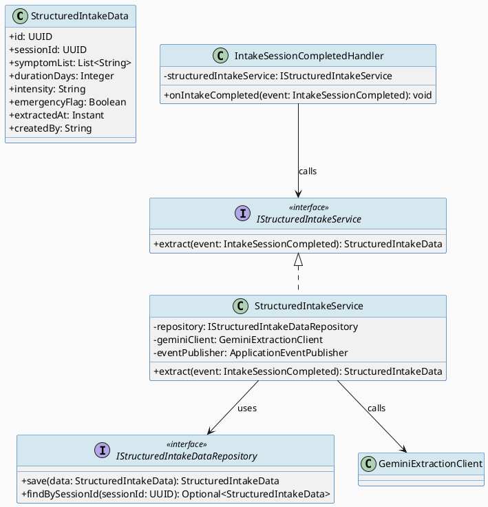
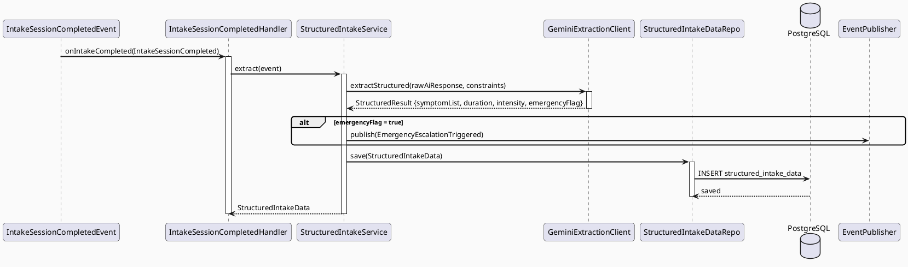
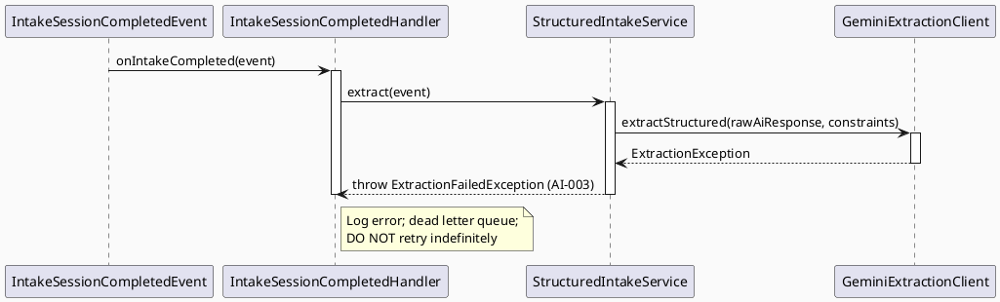

# ENGINEERING DOCUMENTATION STANDARD (EDS) v2.0
# UC131 — Extract Structured Intake Data

| Field | Value |
|-------|-------|
| **Document ID** | `CB-AI-IMP-001` |
| **Version** | `1.0` |
| **Date** | `2026-06-26` |
| **Status** | `Implemented` |
| **Document Owner** | `AI Agent` |
| **Author** | `AI Agent — Tech Lead` |
| **Reviewed by** | `[ ] Pending` |
| **DPO Sign-off** | `[ ] Pending` *(bắt buộc — module PII: extracted health data)* |
| **Approved by** | `[ ] Pending` |
| **Last Review** | `2026-06-26` |
| **Based on EDS** | `v2.0` |

---

## CHANGELOG

| Ngày | Người thực hiện | Nội dung thay đổi |
|------|-----------------|-------------------|
| 2026-06-26 | AI Agent — Tech Lead | Tạo tài liệu lần đầu — TDS cho UC131 Extract Structured Intake Data |

---

## MỤC LỤC

1. [Tổng quan Module](#1-tổng-quan-module)
2. [Ma trận Truy vết (Traceability Matrix)](#2-ma-trận-truy-vết-traceability-matrix)
3. [Architecture Decision Records (ADR)](#3-architecture-decision-records-adr)
4. [Non-Functional Requirements & SLA](#4-non-functional-requirements--sla)
5. [Static Modeling (Mô hình Tĩnh)](#5-static-modeling-mô-hình-tĩnh)
6. [Dynamic Modeling (Mô hình Động)](#6-dynamic-modeling-mô-hình-động)
7. [Domain Event Catalog](#7-domain-event-catalog)
8. [Interface Specification (Đặc tả Giao diện)](#8-interface-specification-đặc-tả-giao-diện)
9. [API Specification](#9-api-specification)
10. [Bảng mã lỗi (Error Codes)](#10-bảng-mã-lỗi-error-codes)
11. [Quy trình Triển khai (Step-by-Step)](#11-quy-trình-triển-khai-step-by-step)
12. [Rollback & Incident Runbook](#12-rollback--incident-runbook)
13. [Kịch bản Kiểm thử Chi tiết](#13-kịch-bản-kiểm-thử-chi-tiết)
14. [Phương pháp Xác minh](#14-phương-pháp-xác-minh)
15. [Mẫu thử thực tế (API Verification Samples)](#15-mẫu-thử-thực-tế-api-verification-samples)
16. [Bảng tổng hợp phân quyền (Authorization Matrix)](#16-bảng-tổng-hợp-phân-quyền-authorization-matrix)
17. [AI Prompt Constraints (CASE 2.0)](#17-ai-prompt-constraints-case-20)

---

## 1. Tổng quan Module

> UC131 là **internal service** — được trigger tự động bởi event `IntakeSessionCompleted` từ UC60. Dùng Gemini AI để phân tích raw AI response và trích xuất dữ liệu có cấu trúc (structured_intake_data): triệu chứng, thời gian, cường độ, flags khẩn cấp. **Không có user-facing API.** Kết quả lưu vào `structured_intake_data` (V36).

| Field | Value |
|-------|-------|
| **Module Name** | `Extract Structured Intake Data` |
| **Bounded Context** | `ai` |
| **Data Classification** | `Sensitive-PII` *(structured health extracted data)* |
| **Compliance Scope** | `PDPA / Luật 91/2025` |
| **Upstream Dependencies** | `UC60 IntakeSessionCompleted event, Gemini AI Service` |
| **Downstream Consumers** | `Expert consultation flow, Analytics, Emergency triage escalation` |

---

## 2. Ma trận Truy vết (Traceability Matrix)

| Requirement ID | Loại (BR/ADR/US) | Mô tả yêu cầu | Thành phần Code | Compliance Target | ADR liên quan |
|----------------|------------------|---------------|-----------------|-------------------|---------------|
| SRS-3.1.2.5 | User Story | Gemini AI trích xuất dữ liệu có cấu trúc từ intake session | `StructuredIntakeService.extract()` | — | ADR-AI-001 |
| BR-AI-005 | Business Rule | Trích xuất phải bao gồm: symptomList, duration, intensity, emergencyFlag | `StructuredIntakeData` entity | PDPA | ADR-AI-001 |
| BR-AI-006 | Business Rule | emergencyFlag = true → publish EmergencyEscalationTriggered event | `StructuredIntakeService` | BR-SAFETY | ADR-AI-002 |
| BR-PRIVACY-002 | Business Rule | structured_intake_data KHÔNG được chứa raw symptom text — chỉ structured fields | `StructuredIntakeData` | PDPA | ADR-AI-001 |
| ADR-AI-001 | Decision | Event-driven: triggered by IntakeSessionCompleted; không expose HTTP endpoint | `IntakeSessionCompletedHandler` | — | — |
| ADR-AI-002 | Decision | emergencyFlag = true → route ngay tới emergency flow, không delay | `StructuredIntakeService` | BR-SAFETY | — |

---

## 3. Architecture Decision Records (ADR)

### ADR-AI-001 — Event-driven extraction: không expose HTTP endpoint

| Field | Value |
|-------|-------|
| **Status** | `Accepted` |
| **Deciders** | `AI Agent — Tech Lead` |
| **Date** | `2026-06-26` |
| **Supersedes** | `—` |

#### Bối cảnh (Context)
UC131 là internal processing — không nên có user-facing API. Nên trigger tự động sau khi UC60 hoàn thành.

#### Các phương án đã xem xét (Options Considered)

| Phương án | Mô tả | Ưu điểm | Nhược điểm |
|-----------|-------|----------|------------|
| A | REST endpoint POST /ai/extract | Simple | Tạo security surface không cần thiết |
| B | Event listener trên IntakeSessionCompleted | Decoupled, không expose API | Cần event infrastructure |

#### Quyết định (Decision)
Chọn **Phương án B** — Spring `@EventListener` trên `IntakeSessionCompleted`. Hoàn toàn internal, không expose HTTP.

#### Hệ quả (Consequences)

**Tích cực:**
- Không có thêm attack surface
- Decoupled từ UC60 flow

**Tiêu cực / Trade-offs:**
- Debugging khó hơn — cần event tracing

**Compliance Impact:**
- Giảm PII exposure: không có thêm HTTP endpoint truyền health data

---

### ADR-AI-002 — Emergency flag routing ngay lập tức

| Field | Value |
|-------|-------|
| **Status** | `Accepted` |
| **Deciders** | `AI Agent — Tech Lead` |
| **Date** | `2026-06-26` |
| **Supersedes** | `—` |

#### Bối cảnh (Context)
BR-SAFETY yêu cầu: nếu AI phát hiện dấu hiệu nguy hiểm, KHÔNG được delay emergency routing.

#### Quyết định (Decision)
`emergencyFlag = true` → ngay lập tức publish `EmergencyEscalationTriggered` event trước khi complete extraction.

---

## 4. Non-Functional Requirements & SLA

### 4.1. Performance & Availability

| Category | Requirement | Target SLA | Measurement Method | Compliance Basis |
|----------|-------------|------------|---------------------|------------------|
| Processing time | Extraction từ raw AI response | `< 3000ms` | APM trace | — |
| Reliability | Event handler không bỏ sót event | 99.9% | Dead letter queue monitoring | — |
| Emergency routing | emergencyFlag=true → event published | `< 500ms` | APM trace | BR-SAFETY |

### 4.2. Data Integrity & Retention

| Category | Requirement | Target | Verification Method | Compliance Basis |
|----------|-------------|--------|---------------------|------------------|
| Consistency | structured_intake_data linked to intake_sessions | 100% | FK constraint | PDPA |
| Retention | Structured data | 5 năm | DB backup policy | Luật 91/2025 |

### 4.3. Security

| Category | Requirement | Target | Verification Method | Compliance Basis |
|----------|-------------|--------|---------------------|------------------|
| No raw PII in structured table | symptomList dạng structured — không phải free text | 100% | DB inspection | PDPA |
| Encryption at rest | Structured health fields | AES-256 | `openssl` check | PDPA |

### 4.4. Scalability & Capacity Planning

> Mỗi intake session tạo 1 extraction job. 500 sessions/day → 500 extractions/day. Scale: async event queue.

---

## 5. Static Modeling (Mô hình Tĩnh)

### 5.1. Class Diagram (PlantUML)



### 5.2. Data Structure (Flyway SQL Migration)

Tạo file: `src/main/resources/db/migration/V36__create_structured_intake_data.sql`

```sql
-- === AI: STRUCTURED INTAKE DATA SCHEMA ===

CREATE TABLE structured_intake_data (
  id              UUID          PRIMARY KEY DEFAULT gen_random_uuid(),
  session_id      UUID          NOT NULL UNIQUE,             -- FK to intake_sessions(id)
  symptom_list    JSONB         NOT NULL,                    -- structured symptom list
  duration_days   INTEGER,                                   -- duration in days
  intensity       VARCHAR(20),                               -- LOW / MEDIUM / HIGH
  emergency_flag  BOOLEAN       NOT NULL DEFAULT FALSE,      -- TRUE = route to emergency
  extracted_at    TIMESTAMPTZ   NOT NULL DEFAULT NOW(),
  created_by      VARCHAR(50)   NOT NULL DEFAULT 'SYSTEM',   -- always SYSTEM (internal)

  CONSTRAINT fk_structured_session FOREIGN KEY (session_id) REFERENCES intake_sessions(id),
  CONSTRAINT chk_intensity CHECK (intensity IN ('LOW','MEDIUM','HIGH') OR intensity IS NULL)
);

CREATE INDEX idx_structured_intake_session_id ON structured_intake_data(session_id);
CREATE INDEX idx_structured_intake_emergency ON structured_intake_data(emergency_flag) WHERE emergency_flag = TRUE;
```

---

## 6. Dynamic Modeling (Mô hình Động)

### 6.1. Sequence Diagram — Happy Path (PlantUML)



### 6.2. Sequence Diagram — Error Path (PlantUML)



### 6.3. State Machine

> UC131 là single-pass extraction — không có trạng thái phức tạp. Xử lý xong → lưu DB → done.

---

## 7. Domain Event Catalog

### 7.1. Events Published (Phát ra)

| Event Name | Trigger | Publisher | Subscriber(s) | Payload Schema | Async? |
|------------|---------|-----------|---------------|----------------|--------|
| `EmergencyEscalationTriggered` | `emergencyFlag = true` | `StructuredIntakeService` | `UC62 OpenEmergencyFlow` | `EmergencyEscalationTriggered.java` | Yes |
| `StructuredIntakeExtracted` | Extraction complete | `StructuredIntakeService` | `Analytics, Expert consultation` | `StructuredIntakeExtracted.java` | Yes |

### 7.2. Events Consumed (Tiêu thụ)

| Event Name | Source | Handler | Action thực hiện |
|------------|--------|---------|------------------|
| `IntakeSessionCompleted` | `UC60 TriageService` | `IntakeSessionCompletedHandler` | Trigger extraction |

### 7.3. Payload Schema

```java
// EmergencyEscalationTriggered.java
public record EmergencyEscalationTriggered(
    UUID    eventId,
    String  eventType,       // "EmergencyEscalationTriggered"
    Instant occurredAt,
    String  version,         // "1.0"
    Payload payload,
    Metadata metadata
) implements ApplicationEvent {

    public record Payload(
        UUID   sessionId,
        UUID   userId,
        String emergencyReason   // Short description — no raw PII
    ) {}

    public record Metadata(UUID correlationId, String causedBy) {}
}
```

---

## 8. Interface Specification (Đặc tả Giao diện)

### 8.1. Service Interface

```java
// IStructuredIntakeService.java
// @version 1.0
public interface IStructuredIntakeService {
    /**
     * Extract structured data from a completed intake session.
     * Triggered by IntakeSessionCompleted event — NOT HTTP.
     * @throws ExtractionFailedException (AI-003) khi Gemini extraction thất bại
     * @throws DuplicateExtractionException (AI-002) nếu sessionId đã được extract
     */
    StructuredIntakeData extract(IntakeSessionCompleted event);
}
```

### 8.2. Repository Interface

```java
// IStructuredIntakeDataRepository.java
// @version 1.0
public interface IStructuredIntakeDataRepository extends JpaRepository<StructuredIntakeData, UUID> {
    Optional<StructuredIntakeData> findBySessionId(UUID sessionId);
    boolean existsBySessionId(UUID sessionId);
    // Không có delete() — Append-only
}
```

---

## 9. API Specification

### 9.1. Endpoints Table

> **UC131 không có user-facing HTTP endpoints.** (ADR-AI-001)
> Internal trigger only via Spring ApplicationEvent.

| Method | Path | Auth Level | Required Roles | Rate Limit | Idempotent? |
|--------|------|------------|----------------|------------|-------------|
| — | — | — | — | — | — |

### 9.2. Internal Event Trigger

> Trigger: `@EventListener` on `IntakeSessionCompleted`
> No HTTP endpoint exposed.

---

## 10. Bảng mã lỗi (Error Codes)

| Code | HTTP Status | Message (EN) | Message (VI) | Trigger Condition |
|------|-------------|--------------|--------------|-------------------|
| `AI-001` | — | Extraction input invalid | Input không hợp lệ | rawAiResponse null hoặc rỗng |
| `AI-002` | — | Duplicate extraction | Đã extract session này rồi | sessionId đã có trong structured_intake_data |
| `AI-003` | — | Extraction failed | Trích xuất thất bại | Gemini extraction API lỗi |

> Các error codes này là internal — không expose qua HTTP response.

---

## 11. Quy trình Triển khai (Step-by-Step)

### 11.1. Prerequisites

- [ ] UC60 đã deploy (intake_sessions table tồn tại)
- [ ] ADR-AI-001 và ADR-AI-002 đã được Accepted
- [ ] DPO đã sign-off (module xử lý structured PII)
- [ ] Spring Application Event infrastructure đã hoạt động

### 11.2. Pre-Migration Checklist

- [ ] Đã backup DB trước khi chạy V36
- [ ] Migration V36 đã chạy thành công trên staging ≥ 24 giờ
- [ ] Verify FK: `intake_sessions` table tồn tại (V35 đã apply)

### 11.3. Implementation Steps

#### Chặng 1 — Tạo Flyway migration V36

```bash
touch src/main/resources/db/migration/V36__create_structured_intake_data.sql
# Nội dung xem §5.2
./mvnw flyway:migrate
```

#### Chặng 2 — Implement StructuredIntakeData entity + Repository

```java
// StructuredIntakeData.java trong package com.carebridge.ai.entity
// IStructuredIntakeDataRepository.java trong package com.carebridge.ai.repository
```

#### Chặng 3 — Implement GeminiExtractionClient

```java
// GeminiExtractionClient.java trong package com.carebridge.ai.service
// Inject constraint block từ §17.2 vào Gemini call
```

#### Chặng 4 — Implement StructuredIntakeService + Event Handler

```java
// StructuredIntakeService.java trong package com.carebridge.ai.service
// IntakeSessionCompletedHandler.java trong package com.carebridge.ai.service
// @EventListener trên IntakeSessionCompleted
```

#### Chặng 5 — Verification

```bash
# Kiểm tra event được handle
kubectl logs -l app=carebridge-api | grep "IntakeSessionCompleted handler"
```

### 11.4. Deployment Checklist

- [ ] Migration V36 chạy thành công
- [ ] Event handler đăng ký thành công (log: "Registered IntakeSessionCompletedHandler")
- [ ] structured_intake_data được populate sau khi test intake session
- [ ] emergencyFlag = true → EmergencyEscalationTriggered event được publish

---

## 12. Rollback & Incident Runbook

### 12.1. Điều kiện kích hoạt Rollback

| Điều kiện | Ngưỡng | Người quyết định |
|-----------|--------|------------------|
| Event handler crash loop | > 3 lần/phút | On-call Engineer |
| structured_intake_data không được populate | > 5 phút sau intake | On-call Engineer |
| emergencyFlag bị bỏ qua | Bất kỳ case nào | Tech Lead + DPO |

### 12.2. Rollback Procedure

```bash
# Bước 1: Revert migration V36
psql -h $DB_HOST -U $DB_USER -d carebridge \
  -c "DROP TABLE IF EXISTS structured_intake_data CASCADE;"
psql -h $DB_HOST -U $DB_USER -d carebridge \
  -c "DELETE FROM flyway_schema_history WHERE version = '36';"

# Bước 2: Re-deploy phiên bản cũ
kubectl rollout undo deployment/carebridge-api
kubectl rollout status deployment/carebridge-api
```

### 12.3. Notification Protocol

| Thời điểm | Người nhận | Kênh | Template |
|-----------|------------|------|----------|
| Ngay khi phát hiện | On-call team | Slack `#incident` | "🚨 AI-EXTRACTION incident: [mô tả]" |
| Ngay khi emergencyFlag bị bỏ qua | DPO + Tech Lead | Email | CRITICAL — SAFETY INCIDENT |

### 12.4. Post-Incident Review (PIR)

- **Timeline:** Diễn biến từng bước
- **Root Cause:** 5 Whys
- **Impact:** Số sessions chưa được extract, emergencyFlag bị missed?
- **Remediation:** Các bước khắc phục
- **Prevention:** Action items

---

## 13. Kịch bản Kiểm thử Chi tiết

### 13.1. Unit Tests

#### TC-UNIT-001 — Extract thành công từ raw AI response

```gherkin
Feature: Extract Structured Intake Data
  Background:
    Given test data classification: SYNTHETIC

  Scenario: Happy path — raw AI response có đủ fields
    Given rawAiResponse = "{symptomList: ['headache'], duration: 2, intensity: 'LOW'}"
    And emergencyFlag = false
    When StructuredIntakeService.extract(event) được gọi
    Then StructuredIntakeData được lưu vào DB
    And symptomList không rỗng
    And emergencyFlag = false
    And KHÔNG publish EmergencyEscalationTriggered

  Scenario: emergencyFlag = true → publish EmergencyEscalationTriggered NGAY
    Given rawAiResponse chứa dấu hiệu nguy hiểm
    And emergencyFlag = true trong kết quả Gemini
    When StructuredIntakeService.extract(event) được gọi
    Then EmergencyEscalationTriggered được publish TRƯỚC KHI lưu DB
    And StructuredIntakeData.emergencyFlag = true

  Scenario: sessionId đã được extract — duplicate
    Given structured_intake_data đã có record với sessionId này
    When extract() được gọi lại với cùng sessionId
    Then DuplicateExtractionException (AI-002) được throw
    And KHÔNG insert record mới
```

**Hàm được test:** `StructuredIntakeService.extract()`
**Invariant kiểm tra:** emergencyFlag=true → event published TRƯỚC khi return; no raw PII in structured fields

### 13.2. Integration Tests

#### TC-INT-001 — Event listener kích hoạt extraction

```gherkin
  Scenario: IntakeSessionCompleted event → extraction triggered
    Given test data classification: SYNTHETIC
    And intake_sessions có record COMPLETED (session-001)
    When IntakeSessionCompleted event được publish
    Then structured_intake_data có record mới với session_id = session-001
    And symptom_list JSONB không null
```

### 13.3. E2E / Security Tests

#### TC-E2E-001 — No HTTP endpoint exposed

```gherkin
  Scenario: UC131 không có HTTP endpoint
    When POST /api/v1/ai/extract được gọi
    Then response status là 404
    And UC131 extraction KHÔNG được trigger qua HTTP
```

---

## 14. Phương pháp Xác minh

### 14.1. Database Inspection

```sql
-- Verify structured data populated sau intake
SELECT id, session_id, symptom_list, emergency_flag, extracted_at
FROM structured_intake_data
WHERE session_id = '[uuid]';

-- Verify emergency cases được lưu đúng
SELECT count(*) FROM structured_intake_data
WHERE emergency_flag = TRUE;
```

### 14.2. Log / Audit Verification

```bash
# Verify event handler đang hoạt động
kubectl logs -l app=carebridge-api | grep "IntakeSessionCompleted\|StructuredIntake" | head -10

# Verify EmergencyEscalationTriggered được publish
kubectl logs -l app=carebridge-api | grep '"eventType":"EmergencyEscalationTriggered"' | head -5
```

### 14.3. Tool-based Verification

```bash
# Verify không có HTTP endpoint
curl -X POST https://$HOST/api/v1/ai/extract \
  -H "Authorization: Bearer $ADMIN_JWT"
# Expected: 404
```

---

## 15. Mẫu thử thực tế (API Verification Samples)

> UC131 không có HTTP endpoint. Verification qua DB và logs.

### 15.1. Verify extraction via DB

```bash
# Sau khi intake session COMPLETED, verify structured data tồn tại
psql -h $DB_HOST -U $DB_USER -d carebridge \
  -c "SELECT symptom_list, emergency_flag FROM structured_intake_data WHERE session_id = '$SESSION_ID';"
```

### 15.2. Verify emergency event

```bash
# Check event log
kubectl logs -l app=carebridge-api | grep "EmergencyEscalationTriggered" | tail -5
```

---

## 16. Bảng tổng hợp phân quyền (Authorization Matrix)

> UC131 là internal-only — không có HTTP endpoints, không có user authorization matrix.

| Component | Access | Description |
|-----------|--------|-------------|
| `IntakeSessionCompletedHandler` | SYSTEM only | Spring event listener — không expose HTTP |
| `StructuredIntakeData` DB table | SYSTEM write / ADMIN read | Không expose qua API |
| `EmergencyEscalationTriggered` event | SYSTEM publish | Downstream: UC62 |

---

## 17. AI Prompt Constraints (CASE 2.0)

### 17.1 Constraint Summary Table

| # | Constraint | Source (ADR/BR) | Last Verified |
|---|-----------|-----------------|---------------|
| C1 | emergencyFlag = true → publish EmergencyEscalationTriggered TRƯỚC khi return | `ADR-AI-002 / BR-SAFETY` | `2026-06-26` |
| C2 | Không extract raw symptom text vào structured_intake_data — chỉ structured fields | `BR-PRIVACY-002` | `2026-06-26` |
| C3 | Trigger CHỈ qua Spring @EventListener — KHÔNG có HTTP endpoint | `ADR-AI-001` | `2026-06-26` |
| C4 | Kiểm tra duplicate sessionId trước khi insert — throw AI-002 nếu đã tồn tại | `IStructuredIntakeDataRepository.existsBySessionId()` | `2026-06-26` |
| C5 | createdBy luôn = "SYSTEM" — không có userId cho internal extraction | `ADR-AI-001` | `2026-06-26` |

### 17.2 Constraint Injection Block (Copy-Paste vào AI Prompt)

```
[CONSTRAINT BLOCK — Module: Extract Structured Intake Data — CB-AI-IMP-001]
Theo TDS CB-AI-IMP-001 và các ADR liên quan:

1. emergencyFlag=true → publish EmergencyEscalationTriggered TRƯỚC khi lưu DB (ADR-AI-002/BR-SAFETY)
2. KHÔNG extract raw symptom text — chỉ structured fields: symptomList, duration, intensity (BR-PRIVACY-002)
3. Trigger CHỈ qua @EventListener(IntakeSessionCompleted) — KHÔNG có HTTP endpoint (ADR-AI-001)
4. Check existsBySessionId() trước insert — throw DuplicateExtractionException(AI-002) nếu duplicate (ADR-AI-001)
5. createdBy = "SYSTEM" — không có userId (ADR-AI-001)

[CONTEXT BLOCK]
- Bounded Context: ai (internal)
- Data Classification: Sensitive-PII (structured health data)
- Compliance: PDPA / Luật 91/2025
- Existing interfaces: §8 Service Interface + §8.2 Repository Interface
- Error codes: §10 Error Codes Table
- Auth matrix: §16 (SYSTEM-only)

[TASK BLOCK]
Implement StructuredIntakeService.extract() thỏa mãn constraints trên.
Output phải tuân thủ §8 Interface Specification.
Tests phải cover §13 Test Scenarios.
```

### 17.3 Constraint Quality Checklist

- [x] Mỗi constraint traceable về ADR hoặc BR cụ thể
- [x] Không có constraint generic
- [x] Mỗi constraint có `Last Verified` date ≤ 2 sprints
- [x] Constraint block có ≥ 3 constraints cụ thể (có 5)
- [x] Constraint block reference §8 Interface
- [x] Constraint block reference §16 Auth Matrix

### 17.4 Anti-Pattern Detection

| AP-ID | Anti-Pattern | Dấu hiệu | Hành động |
|-------|-------------|-----------|----------|
| AP-AI-001 | Unconstrained Gen | Code không check emergencyFlag | Reject — enforce C1 |
| AP-AI-003 | Implicit Decision | Code thêm HTTP endpoint không có trong ADR | Reject — enforce C3 |
| AP-AI-005 | Hallucinated Contract | Code import ExtractionRepository không có trong §8 | Reject — verify contract |

---

## PHỤ LỤC

### A. Glossary

| Thuật ngữ | Định nghĩa |
|-----------|------------|
| Structured Intake Data | Dữ liệu sức khỏe có cấu trúc sau khi Gemini phân tích raw AI response |
| emergencyFlag | Boolean = true khi AI phát hiện dấu hiệu nguy hiểm cần cấp cứu |
| Event-driven | Trigger qua Spring ApplicationEvent — không phải HTTP request |
| Internal Service | Service không expose HTTP API — chỉ hoạt động nội bộ |

### B. Tài liệu tham chiếu

| Document | Link / Path |
|----------|-------------|
| SRS UC-131 | `02_Requirements/SRS/Functional_Specifications.md §3.1.2.5` |
| UC60 TDS | `04_Implement/UC60_RunAISymptomIntake/UC60_RunAISymptomIntake_TDS.md` |
| EDS v2.0 Template | `08_References/Template/PHASE-3_TDS.md` |
