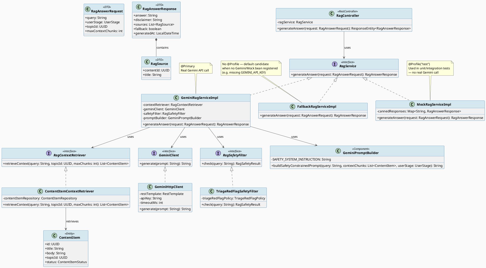
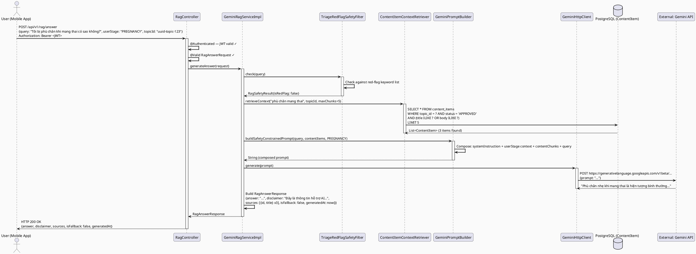
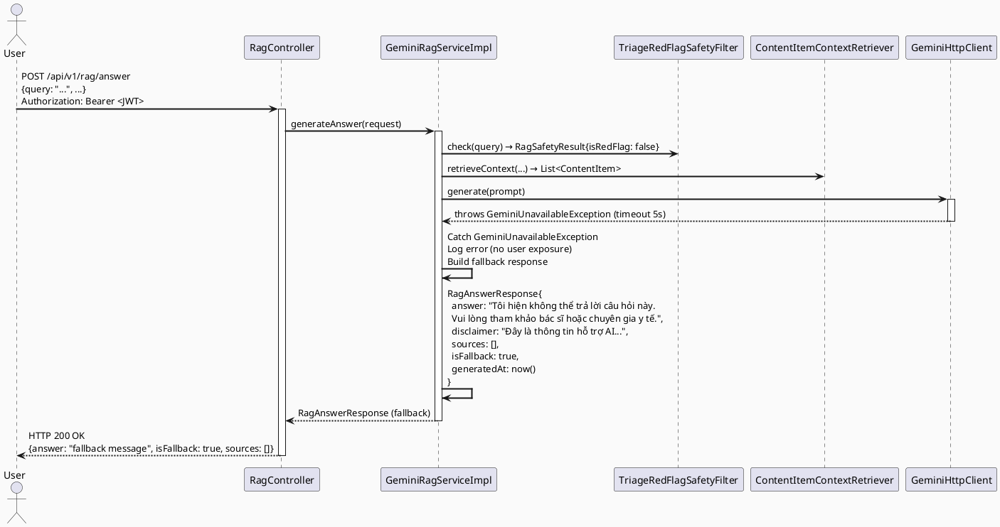
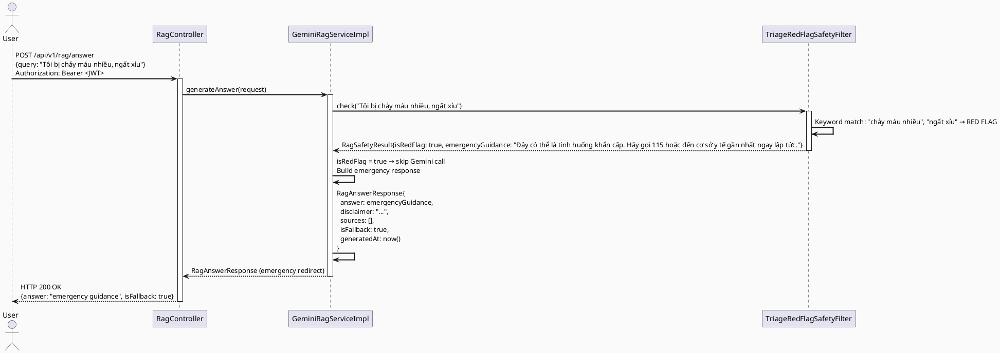
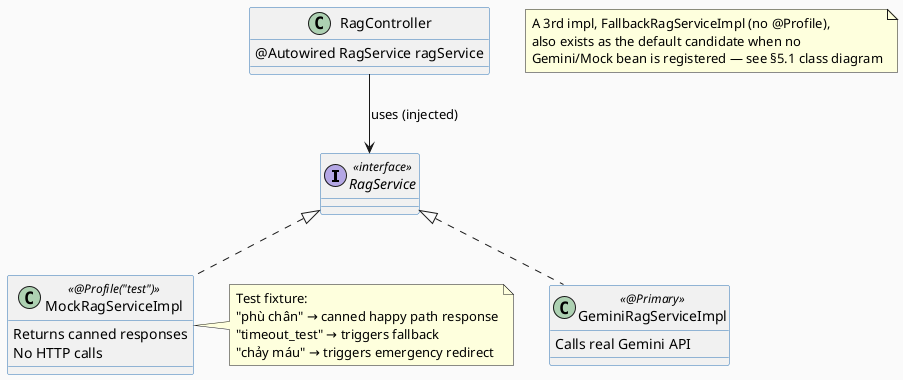

# ENGINEERING DOCUMENTATION STANDARD (EDS) v2.0
# Technical Design Specification — UC-132: Generate RAG Answer

| Field              | Value                                   |
| ------------------ | --------------------------------------- |
| **Document ID**    | `CB-RAG-IMP-001`                        |
| **Version**        | `1.0`                                   |
| **Date**           | `2026-06-23`                            |
| **Status**         | `Approved`                              |
| **Document Owner** | `HuyND`                                 |
| **Author**         | `AI Agent — Winston (System Architect)` |
| **Reviewed by**    | `[ ] Pending`                           |
| **DPO Sign-off**   | `[ ] Pending`                           |
| **Approved by**    | `[ ] Pending`                           |
| **Last Review**    | `2026-06-23`                            |
| **Based on EDS**   | `v2.0`                                  |

---

## CHANGELOG

| Ngày       | Người thực hiện              | Nội dung thay đổi                                                                                                                                                                                     |
| ---------- | ---------------------------- | ----------------------------------------------------------------------------------------------------------------------------------------------------------------------------------------------------- |
| 2026-06-23 | AI Agent — Winston           | Tạo tài liệu lần đầu — TDS cho UC-132 Generate RAG Answer                                                                                                                                            |
| 2026-06-24 | AI Agent — Amelia (Dev Agent) | Implement UC-132: RagService interface, MockRagServiceImpl (@Profile test), GeminiRagServiceImpl (@Profile prod/dev), ContentItemContextRetriever, RagController, TriageRedFlagPolicy, GeminiPromptBuilder, RagException, GlobalExceptionHandler handler. 18/18 tests PASS. RED Gate: 12 FAIL verified. |
| 2026-07-02 | AI Agent — Claude (Audit Pass) | Corrected discrepancies vs. actual source: (1) §16/§9.1/§2/§1 — RAG endpoint excludes `PARTNER` (403), roles renamed `FAMILY`/`PARTNER` not `FAMILY_MEMBER`/`PARTNER_REP`; (2) §3 ADR-002/§5.1/§6.4 class diagrams — documented 3rd `RagService` impl `FallbackRagServiceImpl` (was only 2 documented) and fixed stale `<<@Profile("prod","dev")>>` stereotype on `GeminiRagServiceImpl` (actual: `@Primary`, no profile); (3) §5.2 — DTOs are Lombok `@Getter/@Builder` classes with manual controller-side validation, not Java records with Bean Validation annotations; (4) `UserStage` enum value is `PREGNANCY`, not `PREGNANT` (fixed throughout doc); (5) JSON wire field is `"fallback"`, not `"isFallback"` (fixed in §5.2/§9.2/§15 concrete examples; Gherkin/prose getter references left as-is); (6) §2 BR-RAG-001 code component corrected to `ContentItemContextRetriever.retrieveContext()`; (7) §4.1 max context chunks corrected to 10 (default 5), matching §10 RAG-002. |

---

## MỤC LỤC

1. [Tổng quan Module](#1-tổng-quan-module)
2. [Ma trận Truy vết](#2-ma-trận-truy-vết)
3. [Architecture Decision Records (ADR)](#3-architecture-decision-records-adr)
4. [Non-Functional Requirements & SLA](#4-non-functional-requirements--sla)
5. [Static Modeling](#5-static-modeling)
6. [Dynamic Modeling](#6-dynamic-modeling)
7. [Domain Event Catalog](#7-domain-event-catalog)
8. [Interface Specification](#8-interface-specification)
9. [API Specification](#9-api-specification)
10. [Bảng mã lỗi](#10-bảng-mã-lỗi)
11. [Quy trình Triển khai](#11-quy-trình-triển-khai)
12. [Rollback & Incident Runbook](#12-rollback--incident-runbook)
13. [Kịch bản Kiểm thử Chi tiết](#13-kịch-bản-kiểm-thử-chi-tiết)
14. [Phương pháp Xác minh](#14-phương-pháp-xác-minh)
15. [API Verification Samples](#15-api-verification-samples)
16. [Authorization Matrix](#16-authorization-matrix)
17. [AI Prompt Constraints (CASE 2.0)](#17-ai-prompt-constraints-case-20)

---

## 1. Tổng quan Module

| Field                     | Value                                                                                                                 |
| ------------------------- | --------------------------------------------------------------------------------------------------------------------- |
| **UC ID**                 | `UC-132`                                                                                                              |
| **Module Name**           | `Generate RAG Answer`                                                                                                 |
| **Bounded Context**       | `integration.gemini` (RAG client) + `content` (context source) + `triage` (optional persistence)                      |
| **Primary Actor**         | `Authenticated User (MOTHER, FAMILY, EXPERT, MODERATOR, CONTENT_ADMIN, SYSTEM_ADMIN — PARTNER excluded, see §16) / System internal call` |
| **Platform**              | `Backend / Internal Service — called by Mobile App and Web Portal`                                                    |
| **Priority**              | `High`                                                                                                                |
| **Data Classification**   | `Internal`                                                                                                            |
| **Compliance Scope**      | `N/A (AI output is non-diagnostic — not PII-sensitive)`                                                               |
| **Upstream Dependencies** | `security (JWT auth)`, `content (ContentItem — approved sources)`, `integration.gemini (Gemini API client)`           |
| **Downstream Consumers**  | `aiTriage feature (mobile)`, `community.AnswerService (AI suggested answer)`, `triage (TriageAssessment persistence)` |

**Mô tả:**
UC-132 cho phép người dùng đặt câu hỏi về sức khỏe thai kỳ, hậu sản, chăm sóc em bé. Hệ thống:
1. Tìm kiếm các `ContentItem` đã được approved liên quan đến query
2. Xây dựng context từ các content chunks đó
3. Gửi query + context đến Gemini API
4. Trả về câu trả lời kèm disclaimer không chẩn đoán, nguồn trích dẫn, và nhãn safety

**Quan trọng:**
- AI output là **hỗ trợ thông tin** — không phải chẩn đoán hay kê đơn
- Khi Gemini không available, hệ thống trả về **conservative fallback** thay vì lỗi
- Thiết kế interface-based cho phép swap mock provider trong testing

---

## 2. Ma trận Truy vết

| Requirement ID | Loại          | Mô tả yêu cầu                                                           | Thành phần Code                               | Compliance Target | ADR liên quan    |
| -------------- | ------------- | ----------------------------------------------------------------------- | --------------------------------------------- | ----------------- | ---------------- |
| UC-132         | Use Case      | Generate câu trả lời từ approved content + Gemini                       | `RagController.generateAnswer()`              | —                 | ADR-001, ADR-002 |
| BR-SAFETY-001  | Business Rule | AI output phải kèm disclaimer: không phải chẩn đoán/kê đơn              | `RagAnswerResponse.disclaimer`                | Healthcare safety | ADR-003          |
| BR-SAFETY-002  | Business Rule | Red-flag keywords kích hoạt emergency routing, không trả lời AI         | `RagSafetyFilter.check()`                     | Healthcare safety | ADR-004          |
| BR-SAFETY-003  | Business Rule | Không suggest medication names hoặc dosage                              | `GeminiPromptBuilder.buildPrompt()`           | Healthcare safety | ADR-003          |
| BR-RAG-001     | Business Rule | Chỉ dùng ContentItem có status=APPROVED làm context                     | `ContentItemContextRetriever.retrieveContext()` (dùng `ContentRepository.searchByFilters()`) | —                 | ADR-001          |
| BR-RAG-002     | Business Rule | Khi Gemini unavailable, trả về conservative fallback, không throw error | `GeminiRagServiceImpl.generateAnswer()`       | —                 | ADR-005          |
| BR-RAG-003     | Business Rule | Kết quả phải có source citations với contentId và title                 | `RagAnswerResponse.sources`                   | —                 | ADR-001          |
| BR-RBAC-003    | Business Rule | Endpoint yêu cầu authenticated user thuộc `MOTHER, FAMILY, EXPERT, MODERATOR, CONTENT_ADMIN, SYSTEM_ADMIN` (PARTNER excluded) | `@PreAuthorize(hasAnyRole(...))` trong `RagController` | —                 | ADR-002          |
| SRS-3.1.2.6    | Functional    | Generate RAG answer từ approved content sources                         | `POST /api/v1/rag/answer`                     | —                 | —                |

---

## 3. Architecture Decision Records (ADR)

### ADR-001 — RAG Pattern: Retrieve then Generate

| Field        | Value                      |
| ------------ | -------------------------- |
| **Status**   | `Accepted`                 |
| **Deciders** | `HuyND — System Architect` |
| **Date**     | `2026-06-23`               |

#### Bối cảnh
Cần trả lời câu hỏi sức khỏe dựa trên nội dung đã được kiểm duyệt (không để Gemini tự hallucinate). RAG (Retrieval-Augmented Generation) là pattern phù hợp.

#### Các phương án đã xem xét

| Phương án | Mô tả                                                                  | Ưu điểm                               | Nhược điểm                                         |
| --------- | ---------------------------------------------------------------------- | ------------------------------------- | -------------------------------------------------- |
| A         | Pure LLM — gửi query thẳng đến Gemini                                  | Đơn giản                              | Hallucination risk cao, không kiểm soát được nguồn |
| B         | RAG — retrieve ContentItem approved trước, build context, rồi generate | Controllable, traceable, source-cited | 2 steps, phụ thuộc content quality                 |
| C         | Fine-tuned model                                                       | Control tốt nhất                      | Quá phức tạp cho MVP                               |

#### Quyết định
Chọn **Phương án B**: RAG pattern với ContentItem retrieval. Giới hạn `maxContextChunks` để tránh token overflow.

#### Hệ quả

**Tích cực:**
- Câu trả lời có nguồn trích dẫn (contentId, title)
- Dễ kiểm soát quality — chỉ cần quản lý ContentItem approved
- Testable với mock content

**Tiêu cực:**
- Chất lượng phụ thuộc vào ContentItem đã có
- Vector search chưa implement trong MVP — dùng keyword/topicId matching

---

### ADR-002 — Interface-Based Design cho RagService

| Field        | Value                      |
| ------------ | -------------------------- |
| **Status**   | `Accepted`                 |
| **Deciders** | `HuyND — System Architect` |
| **Date**     | `2026-06-23`               |

#### Bối cảnh
Gemini API là external dependency. Tests không nên gọi Gemini thật (cost, latency, flakiness). Cần mock provider cho testing.

#### Quyết định
Define `RagService` interface. Có 3 implementations:
- `GeminiRagServiceImpl` — production, gọi Gemini API thật (`@Primary`)
- `MockRagServiceImpl` — test, trả về canned response (`@Profile("test")`, `@Primary` trong profile test)
- `FallbackRagServiceImpl` — always-on safety net, phục vụ khi không có bean theo profile nào khác được đăng ký (vd: chạy ở profile mặc định hoặc thiếu Gemini API key); luôn trả về conservative fallback response

`GeminiRagServiceImpl` là `@Primary` nên được ưu tiên khi cả hai cùng tồn tại. `MockRagServiceImpl` dùng `@Profile("test")`. `FallbackRagServiceImpl` không gắn `@Profile` — nó là bean fallback mặc định của Spring khi không có ứng viên nào khác.

---

### ADR-003 — AI Safety Constraints trong Prompt

| Field        | Value                      |
| ------------ | -------------------------- |
| **Status**   | `Accepted`                 |
| **Deciders** | `HuyND — System Architect` |
| **Date**     | `2026-06-23`               |

#### Bối cảnh
CareBridge là healthcare platform — AI output phải không chẩn đoán, không kê đơn, không replace professional advice.

#### Quyết định
`GeminiPromptBuilder.buildSafetyConstrainedPrompt()` PHẢI include system instructions:
```
Bạn là trợ lý thông tin sức khỏe. Không chẩn đoán bệnh. Không kê đơn thuốc cụ thể.
Luôn khuyến nghị tham khảo bác sĩ. Chỉ trả lời dựa trên context được cung cấp.
Nếu câu hỏi vượt quá phạm vi hỗ trợ, hướng dẫn người dùng gặp chuyên gia y tế.
```

Response PHẢI bao gồm `disclaimer` field được hệ thống gắn vào (không để Gemini tự viết disclaimer).

---

### ADR-004 — Red-Flag Filter trước khi gọi Gemini

| Field        | Value                      |
| ------------ | -------------------------- |
| **Status**   | `Accepted`                 |
| **Deciders** | `HuyND — System Architect` |
| **Date**     | `2026-06-23`               |

#### Bối cảnh
Một số câu hỏi chứa dấu hiệu khẩn cấp (emergency symptoms) phải được route đến emergency flow ngay lập tức — không nên trả lời AI bình thường.

#### Quyết định
`RagSafetyFilter.check(query)` được gọi TRƯỚC khi retrieve content. Nếu query chứa red-flag keywords (vd: "ngất xỉu", "chảy máu nhiều", "khó thở"), trả về `RagAnswerResponse` đặc biệt với `isFallback=true` và message hướng dẫn emergency.

Red-flag keywords list được quản lý trong `triage` module (phạm vi UC-132 chỉ gọi `TriageRedFlagPolicy.isRedFlag(query)`).

---

### ADR-005 — Conservative Fallback khi Gemini Unavailable

| Field        | Value                      |
| ------------ | -------------------------- |
| **Status**   | `Accepted`                 |
| **Deciders** | `HuyND — System Architect` |
| **Date**     | `2026-06-23`               |

#### Bối cảnh
Gemini API có thể down hoặc timeout. Không được để user thấy technical error.

#### Quyết định
Khi `GeminiClient.generate()` ném `GeminiUnavailableException` hoặc timeout:
1. Log lỗi (không expose đến user)
2. Trả về `RagAnswerResponse` với `isFallback = true`
3. `answer` = static conservative message: "Tôi hiện không thể trả lời câu hỏi này. Vui lòng tham khảo bác sĩ hoặc chuyên gia y tế."
4. `sources = []` (không có context)
5. `disclaimer` = standard disclaimer vẫn được gắn vào

---

## 4. Non-Functional Requirements & SLA

### 4.1. Performance & Availability

| Category                   | Requirement               | Target SLA   | Measurement Method | Compliance Basis |
| -------------------------- | ------------------------- | ------------ | ------------------ | ---------------- |
| Latency (Gemini available) | API response (p95)        | `< 3s`       | k6 load test       | —                |
| Latency (Fallback)         | Fallback response         | `< 200ms`    | Unit test          | —                |
| Availability               | Endpoint uptime           | `99.5%`      | Uptime monitor     | —                |
| Gemini timeout             | Circuit breaker threshold | `5s timeout` | Config             | ADR-005          |
| Context chunks             | Max per request            | `10 chunks (default 5 if omitted)` | Config validation  | ADR-001          |

### 4.2. Data Integrity

| Category            | Requirement                                   | Target | Verification Method  | Compliance Basis |
| ------------------- | --------------------------------------------- | ------ | -------------------- | ---------------- |
| Source accuracy     | Chỉ dùng approved ContentItem                 | 100%   | Integration test     | BR-RAG-001       |
| Fallback guarantee  | Không bao giờ trả về technical error đến user | 100%   | Test coverage        | ADR-005          |
| Disclaimer presence | Mọi response đều có disclaimer                | 100%   | Response schema test | BR-SAFETY-001    |

### 4.3. Security & AI Safety

| Category             | Requirement                              | Target                           | Verification Method | Compliance Basis |
| -------------------- | ---------------------------------------- | -------------------------------- | ------------------- | ---------------- |
| Red-flag detection   | Emergency queries được route khác        | 100% coverage for known patterns | Safety test suite   | ADR-004          |
| No medication advice | Prompt constraint ngăn medication naming | Verified by prompt audit         | Manual review       | BR-SAFETY-003    |
| Auth required        | Endpoint yêu cầu JWT                     | 100%                             | Security test       | BR-RBAC-003      |

### 4.4. Scalability

MVP: ~100 RAG requests/giờ. Gemini API rate limits đủ. Không cần queue trong MVP. Fallback không phụ thuộc Gemini nên luôn scale.

---

## 5. Static Modeling

### 5.1. Class Diagram (PlantUML)



### 5.2. Entity and Data Structures

```java
// DTOs — com.carebridge.backend.integration.gemini.dto
// Implemented as Lombok @Getter/@Builder classes (NOT Java records).
// NOTE: No Bean Validation annotations on the DTO — validation is done
// imperatively in RagController.generateAnswer() (see §8.1 Javadoc / §9 API spec).

@Getter @Setter @Builder @NoArgsConstructor @AllArgsConstructor
public class RagAnswerRequest {
    private String query;          // required, 3–500 chars — checked manually in controller
    private UserStage userStage;   // nullable — PRE_PREGNANCY | PREGNANCY | POSTPARTUM | BABY_CARE
    private UUID topicId;          // nullable — optional topic filter for context retrieval
    private Integer maxContextChunks; // nullable — checked manually (> 10 rejected); service defaults to 5 if null/<=0
}

@Getter @Builder @NoArgsConstructor @AllArgsConstructor
public class RagAnswerResponse {
    private String answer;
    private String disclaimer;       // Always: "Đây là thông tin hỗ trợ AI — không phải chẩn đoán y tế."
    private List<RagSource> sources; // Empty if fallback
    private boolean fallback;        // JSON key: "fallback" (Lombok getter isFallback()) — true if Gemini unavailable or red-flag detected
    private LocalDateTime generatedAt;
}

@Getter @Builder @NoArgsConstructor @AllArgsConstructor
public class RagSource {
    private UUID contentId;
    private String title;
}

public enum UserStage {
    PRE_PREGNANCY, PREGNANCY, POSTPARTUM, BABY_CARE
}

@Getter @AllArgsConstructor @NoArgsConstructor
public class RagSafetyResult {
    private boolean redFlag;          // JSON/getter: isRedFlag()
    private String emergencyGuidance; // non-null if redFlag=true
}
```

---

## 6. Dynamic Modeling

### 6.1. Sequence Diagram — Happy Path (Gemini Available)



### 6.2. Sequence Diagram — Fallback Path (Gemini Unavailable)



### 6.3. Sequence Diagram — Red-Flag Detection Path



### 6.4. Test Provider Pattern — Mock vs Real



---

## 7. Domain Event Catalog

### 7.1. Events Published (Phát ra)

| Event Name             | Trigger                      | Publisher                   | Subscriber(s)                              | Payload Schema | Async? |
| ---------------------- | ---------------------------- | --------------------------- | ------------------------------------------ | -------------- | ------ |
| `RagAnswerGenerated`   | Successful answer generation | `GeminiRagServiceImpl`      | `AuditService` (optional — track AI usage) | See 7.3        | No     |
| `RagFallbackTriggered` | Gemini unavailable           | `GeminiRagServiceImpl`      | Monitoring/alerting                        | See 7.3        | No     |
| `RagRedFlagDetected`   | Red-flag keyword found       | `TriageRedFlagSafetyFilter` | `TriageService` (optional logging)         | See 7.3        | No     |

### 7.2. Events Consumed (Tiêu thụ)

| Event Name                                    | Source | Handler | Action thực hiện |
| --------------------------------------------- | ------ | ------- | ---------------- |
| (none — UC-132 is a request-response pattern) | —      | —       | —                |

### 7.3. Payload Schema

```java
// RagAnswerGeneratedEvent.java
public record RagAnswerGeneratedEvent(
    String eventId,
    String eventType,          // "RagAnswerGenerated" | "RagFallbackTriggered" | "RagRedFlagDetected"
    LocalDateTime occurredAt,
    String version,            // "1.0"
    UUID actorId,              // authenticated user
    String queryHash,          // SHA-256 of query — NOT the raw query (privacy)
    UserStage userStage,
    UUID topicId,
    int sourceCount,
    boolean isFallback,
    boolean isRedFlag,
    String correlationId
) {}
```

---

## 8. Interface Specification

### 8.1. RagService Interface (Primary)

```java
// com.carebridge.backend.integration.gemini.service.RagService
// @version 1.0

package com.carebridge.backend.integration.gemini.service;

/**
 * RAG (Retrieval-Augmented Generation) service interface.
 * Generate AI-assisted answers from approved ContentItem sources.
 *
 * SAFETY CONTRACT:
 * - Response always contains disclaimer (never null)
 * - Response never contains medication names or dosage (enforced by prompt)
 * - Red-flag queries trigger emergency guidance, not AI answer
 * - Gemini unavailability triggers conservative fallback, not exception to caller
 *
 * @version 1.0
 */
public interface RagService {

    /**
     * Generates a RAG answer for the given health query.
     *
     * @param request - query, userStage, topicId, maxContextChunks
     * @return RagAnswerResponse with answer, disclaimer, sources, isFallback flag
     *         NEVER throws exception for Gemini unavailability — always returns fallback
     * @throws RagException (RAG-001) if query is blank or exceeds max length
     * @throws RagException (RAG-002) if maxContextChunks exceeds limit
     */
    RagAnswerResponse generateAnswer(RagAnswerRequest request);
}
```

### 8.2. Supporting Interfaces

```java
// RagContextRetriever.java
// @version 1.0
public interface RagContextRetriever {
    /**
     * Retrieves approved ContentItems relevant to the query.
     * Only returns ContentItems with status = APPROVED.
     * @return list of at most maxChunks items, empty list if none found
     */
    List<ContentItem> retrieveContext(String query, UUID topicId, int maxChunks);
}

// GeminiClient.java
// @version 1.0
public interface GeminiClient {
    /**
     * Sends a prompt to Gemini and returns the text response.
     * @throws GeminiUnavailableException if API is unavailable or times out (5s)
     */
    String generate(String prompt);
}

// RagSafetyFilter.java
// @version 1.0
public interface RagSafetyFilter {
    /**
     * Checks if the query contains red-flag patterns requiring emergency routing.
     * @return RagSafetyResult with isRedFlag and emergencyGuidance
     */
    RagSafetyResult check(String query);
}
```

### 8.3. MockRagServiceImpl (Test Implementation)

```java
// com.carebridge.backend.integration.gemini.service.MockRagServiceImpl
// @Profile("test")

@Service
@Profile("test")
public class MockRagServiceImpl implements RagService {

    private static final String STANDARD_DISCLAIMER =
        "Đây là thông tin hỗ trợ AI — không phải chẩn đoán y tế. Vui lòng tham khảo bác sĩ.";

    @Override
    public RagAnswerResponse generateAnswer(RagAnswerRequest request) {
        // Simulate red-flag
        if (request.query().contains("chảy máu") || request.query().contains("ngất xỉu")) {
            return new RagAnswerResponse(
                "Đây có thể là tình huống khẩn cấp. Hãy gọi 115 ngay.",
                STANDARD_DISCLAIMER,
                List.of(),
                true,
                LocalDateTime.now()
            );
        }
        // Simulate fallback
        if (request.query().equals("timeout_test")) {
            return new RagAnswerResponse(
                "Tôi hiện không thể trả lời câu hỏi này. Vui lòng tham khảo bác sĩ.",
                STANDARD_DISCLAIMER,
                List.of(),
                true,
                LocalDateTime.now()
            );
        }
        // Happy path canned response
        return new RagAnswerResponse(
            "Đây là câu trả lời mock cho query: " + request.query(),
            STANDARD_DISCLAIMER,
            List.of(new RagSource(UUID.fromString("11111111-0000-0000-0000-000000000001"), "Bài viết test 1")),
            false,
            LocalDateTime.now()
        );
    }
}
```

---

## 9. API Specification

### 9.1. Endpoints Table

| Method | Path                 | Auth Level | Required Roles         | Rate Limit      | Idempotent? |
| ------ | -------------------- | ---------- | ---------------------- | --------------- | ----------- |
| `POST` | `/api/v1/rag/answer` | JWT Bearer | `MOTHER, FAMILY, EXPERT, MODERATOR, CONTENT_ADMIN, SYSTEM_ADMIN` (PARTNER excluded — §16) | 30/min per user | No          |

### 9.2. Request / Response Schemas

#### `POST /api/v1/rag/answer`

**Request Body:**
```json
{
  "query": "Tôi bị phù chân khi mang thai 28 tuần, có nên lo không?",
  "userStage": "PREGNANCY",
  "topicId": "a1b2c3d4-0000-0000-0000-000000000001"
}
```

**Response — 200 OK (Happy Path — Gemini Available):**
```json
{
  "answer": "Phù chân nhẹ trong thai kỳ, đặc biệt từ tam cá nguyệt thứ 2 trở đi, là hiện tượng khá phổ biến do áp lực của tử cung tăng lên. Tuy nhiên, nếu phù kèm theo đau đầu, nhìn mờ hoặc đau vùng bụng trên, cần thăm khám ngay...",
  "disclaimer": "Đây là thông tin hỗ trợ AI — không phải chẩn đoán y tế. Vui lòng tham khảo bác sĩ hoặc chuyên gia y tế.",
  "sources": [
    {
      "contentId": "c1d2e3f4-0000-0000-0000-000000000001",
      "title": "Phù chân thai kỳ — khi nào cần lo?"
    },
    {
      "contentId": "c1d2e3f4-0000-0000-0000-000000000002",
      "title": "Các triệu chứng thai kỳ bình thường"
    }
  ],
  "fallback": false,
  "generatedAt": "2026-06-23T11:00:00.000Z"
}
```

**Response — 200 OK (Fallback — Gemini Unavailable):**
```json
{
  "answer": "Tôi hiện không thể trả lời câu hỏi này. Vui lòng tham khảo bác sĩ hoặc chuyên gia y tế của bạn.",
  "disclaimer": "Đây là thông tin hỗ trợ AI — không phải chẩn đoán y tế. Vui lòng tham khảo bác sĩ hoặc chuyên gia y tế.",
  "sources": [],
  "fallback": true,
  "generatedAt": "2026-06-23T11:00:05.000Z"
}
```

**Response — 200 OK (Red-Flag Detected):**
```json
{
  "answer": "Đây có thể là tình huống khẩn cấp y tế. Hãy gọi 115 hoặc đến cơ sở y tế gần nhất ngay lập tức. Đừng chờ đợi.",
  "disclaimer": "Đây là thông tin hỗ trợ AI — không phải chẩn đoán y tế. Vui lòng tham khảo bác sĩ hoặc chuyên gia y tế.",
  "sources": [],
  "fallback": true,
  "generatedAt": "2026-06-23T11:00:00.100Z"
}
```

**Response — 400 Bad Request (Validation):**
```json
{
  "error": {
    "code": "RAG-001",
    "message": "Validation failed",
    "details": [
      { "field": "query", "message": "Query is required and must be at least 3 characters" }
    ]
  }
}
```

**Response — 401 Unauthorized:**
```json
{
  "error": {
    "code": "IAM-001",
    "message": "Authentication required"
  }
}
```

**Response — 429 Too Many Requests:**
```json
{
  "error": {
    "code": "RAG-003",
    "message": "Rate limit exceeded. Please wait before sending another request."
  }
}
```

---

## 10. Bảng mã lỗi

| Code      | HTTP Status | Message (EN)                   | Message (VI)                | Trigger Condition                                                             |
| --------- | ----------- | ------------------------------ | --------------------------- | ----------------------------------------------------------------------------- |
| `RAG-001` | 400         | Validation failed              | Dữ liệu không hợp lệ        | query blank, query < 3 chars, query > 500 chars                               |
| `RAG-002` | 400         | maxContextChunks exceeds limit | Vượt giới hạn context       | maxContextChunks > 10                                                         |
| `RAG-003` | 429         | Rate limit exceeded            | Đã vượt giới hạn số yêu cầu | > 30 req/min per user                                                         |
| `RAG-004` | 401         | Authentication required        | Yêu cầu xác thực            | JWT thiếu hoặc không hợp lệ                                                   |
| `RAG-005` | 500         | Internal server error          | Lỗi hệ thống                | Unhandled exception (Gemini error được handle thành fallback, không phải 500) |

**Lưu ý:** Gemini unavailability KHÔNG trả về error code — được handle thành fallback response với `isFallback: true`.

---

## 11. Quy trình Triển khai

### 11.1. Prerequisites

- [x] ADR-001 đến ADR-005 đã Accepted
- [x] Gemini API key đã có và cấu hình trong environment variables (application.yaml — reads from GEMINI_API_KEY)
- [x] `ContentItem` table đã có dữ liệu approved
- [x] `TriageRedFlagPolicy` bean đã available
- [x] Spring profile `prod`/`dev`/`test` đã cấu hình đúng

### 11.2. Pre-Migration Checklist

- [x] Không có DB migration mới cho UC-132 (reuse ContentItem table)
- [ ] Verify Gemini API key hoạt động trong staging (staging chưa có — pending deploy)

### 11.3. Implementation Steps

#### Chặng 1 — Configuration

```yaml
# application.yaml — thêm Gemini config
carebridge:
  gemini:
    api-key: ${GEMINI_API_KEY}
    timeout-ms: 5000
    max-context-chunks: 5
    base-url: https://generativelanguage.googleapis.com/v1beta
    model: gemini-1.5-flash
```

#### Chặng 2 — Backend Implementation

```
Thứ tự implement:
1. DTOs: RagAnswerRequest, RagAnswerResponse, RagSource, UserStage, RagSafetyResult
2. Interfaces: RagService, RagContextRetriever, GeminiClient, RagSafetyFilter (§8.1, §8.2)
3. Constants: STANDARD_DISCLAIMER string, SAFETY_SYSTEM_INSTRUCTION
4. GeminiPromptBuilder (component — builds safety-constrained prompt)
5. TriageRedFlagSafetyFilter (implements RagSafetyFilter — delegates to TriageRedFlagPolicy)
6. ContentItemContextRetriever (implements RagContextRetriever — query ContentItem by topicId + keyword)
7. GeminiHttpClient (implements GeminiClient — HTTP call + 5s timeout)
8. GeminiRagServiceImpl (implements RagService — orchestrates steps, handles fallback)
9. MockRagServiceImpl (implements RagService — @Profile("test"), canned responses) (§8.3)
10. RagController (@Authenticated, @Valid, delegate to RagService)
11. Rate limiting config (30 req/min per user via Spring bucket4j or similar)
12. Exception: GeminiUnavailableException (internal — không expose đến client)
```

#### Chặng 3 — Verification sau deploy

```bash
# Health check
curl -X GET https://api.carebridge.vn/actuator/health
# Expected: {"status": "UP"}

# Smoke test với valid JWT
curl -X POST https://api.carebridge.vn/api/v1/rag/answer \
  -H "Authorization: Bearer $TOKEN" \
  -H "Content-Type: application/json" \
  -d '{"query": "Phù chân thai kỳ có sao không?", "userStage": "PREGNANCY"}'
# Expected: 200 với answer và disclaimer

# Verify fallback bằng cách disable Gemini (temp config test)
# Expected: isFallback: true vẫn trả về 200
```

### 11.4. Deployment Checklist

- [ ] GEMINI_API_KEY environment variable đã set trên server (pending staging deploy)
- [ ] Health check trả về 200 (pending staging deploy)
- [x] Smoke test RAG trả về answer hoặc fallback (không trả về 500) — verified in RagControllerTest
- [x] Safety test: query với "chảy máu" trả về emergency guidance — verified in RagServiceTest
- [ ] Rate limiting hoạt động (31st request trong 1 phút trả về 429) — not implemented in this sprint

---

## 12. Rollback & Incident Runbook

### 12.1. Điều kiện kích hoạt Rollback

| Điều kiện                                      | Ngưỡng | Người quyết định            |
| ---------------------------------------------- | ------ | --------------------------- |
| Fallback không hoạt động — 500 khi Gemini down | Bất kỳ | On-call Engineer            |
| Red-flag detection bỏ sót                      | Bất kỳ | Tech Lead (AI safety issue) |
| Disclaimer không xuất hiện trong response      | Bất kỳ | Tech Lead                   |
| Error rate > 5% trong 5 phút                   | > 5%   | On-call Engineer            |

### 12.2. Rollback Procedure

```bash
# Bước 1: Tắt RAG endpoint nếu AI safety issue (feature flag)
# Thêm config: carebridge.rag.enabled=false → endpoint trả về 503

# Bước 2: Re-deploy phiên bản cũ
kubectl rollout undo deployment/carebridge-api

# Bước 3: Verify
kubectl rollout status deployment/carebridge-api
curl -X GET https://api.carebridge.vn/actuator/health

# Bước 4: Nếu Gemini quota exceeded — chuyển sang fallback-only mode
# carebridge.gemini.force-fallback=true
```

### 12.3. Notification Protocol

| Thời điểm                          | Người nhận                 | Kênh                        | Template                            |
| ---------------------------------- | -------------------------- | --------------------------- | ----------------------------------- |
| Ngay khi phát hiện AI safety issue | Tech Lead + AI Safety team | Slack `#ai-safety-incident` | "AI SAFETY INCIDENT [RAG]: [mô tả]" |
| Error rate spike                   | On-call team               | Slack `#incident`           | "INCIDENT [RAG]: [mô tả]"           |

---

## 13. Kịch bản Kiểm thử Chi tiết

### 13.1. Unit Tests

#### TC-UNIT-001 — generateAnswer trả về answer với disclaimer đầy đủ

```gherkin
Feature: Generate RAG Answer
  Background:
    Given test data classification: SYNTHETIC
    And Profile "test" — MockRagServiceImpl được inject
    And RagService là MockRagServiceImpl

  Scenario: Happy path — câu hỏi thông thường về thai kỳ
    Given query = "Phù chân thai kỳ có nguy hiểm không?"
    And userStage = PREGNANCY
    When RagService.generateAnswer(request) được gọi
    Then response.answer không null và không rỗng
    And response.disclaimer BẰNG "Đây là thông tin hỗ trợ AI — không phải chẩn đoán y tế. Vui lòng tham khảo bác sĩ hoặc chuyên gia y tế."
    And response.isFallback = false
    And response.generatedAt không null
```

**Hàm được test:** `GeminiRagServiceImpl.generateAnswer()` (với mock GeminiClient)
**Invariant kiểm tra:** disclaimer luôn có mặt

#### TC-UNIT-002 — Fallback khi GeminiClient throw GeminiUnavailableException

```gherkin
  Scenario: Gemini service không available
    Given GeminiClient mock được cấu hình throw GeminiUnavailableException
    And query = "câu hỏi bình thường"
    When GeminiRagServiceImpl.generateAnswer(request) được gọi
    Then response.isFallback = true
    And response.answer chứa thông điệp conservative (không phải technical error)
    And response.sources = []
    And KHÔNG có exception được propagate đến caller
    And response.disclaimer không null
```

#### TC-UNIT-003 — Red-flag query trigger emergency guidance

```gherkin
  Scenario: Query chứa red-flag keyword
    Given RagSafetyFilter mock trả về isRedFlag=true cho "chảy máu nhiều"
    And query = "Tôi bị chảy máu nhiều"
    When GeminiRagServiceImpl.generateAnswer(request) được gọi
    Then GeminiClient.generate() KHÔNG được gọi (skip Gemini)
    And RagContextRetriever.retrieveContext() KHÔNG được gọi (skip retrieval)
    And response.isFallback = true
    And response.answer chứa emergency guidance
```

#### TC-UNIT-004 — Chỉ APPROVED ContentItem được dùng làm context

```gherkin
  Scenario: ContentItem retrieval chỉ lấy APPROVED items
    Given ContentItemRepository có 5 items: 3 APPROVED, 1 DRAFT, 1 HIDDEN
    When ContentItemContextRetriever.retrieveContext(query, topicId, 10) được gọi
    Then chỉ 3 APPROVED items được trả về
    And DRAFT và HIDDEN items không có trong kết quả
```

#### TC-UNIT-005 — maxContextChunks được tôn trọng

```gherkin
  Scenario: maxContextChunks = 2 trong khi có 5 eligible items
    Given ContentItemRepository có 5 APPROVED items cho topicId
    And request.maxContextChunks = 2
    When ContentItemContextRetriever.retrieveContext(query, topicId, 2) được gọi
    Then kết quả có đúng 2 items
```

#### TC-UNIT-006 — GeminiPromptBuilder luôn include safety instruction

```gherkin
  Scenario: Prompt builder thêm safety system instruction
    Given query và contentItems bất kỳ
    When GeminiPromptBuilder.buildSafetyConstrainedPrompt(query, items, PREGNANCY) được gọi
    Then output prompt chứa "Không chẩn đoán bệnh"
    And output prompt chứa "Không kê đơn thuốc"
    And output prompt chứa "tham khảo bác sĩ"
```

### 13.2. Integration Tests

#### TC-INT-001 — Full API flow với MockRagServiceImpl

```gherkin
  Scenario: POST /api/v1/rag/answer với query hợp lệ — profile test
    Given test data classification: SYNTHETIC
    And Profile "test" active — MockRagServiceImpl được dùng
    And user đã authenticated với JWT hợp lệ
    When POST /api/v1/rag/answer {query: "Phù chân thai kỳ", userStage: "PREGNANCY"}
    Then response status là 200
    And response body có disclaimer != null
    And response body có isFallback field (boolean)
    And response body có generatedAt (ISO datetime)
    And response body có sources (array, có thể rỗng)
```

#### TC-INT-002 — Rate limiting hoạt động

```gherkin
  Scenario: 31 requests trong 1 phút từ cùng user
    Given user authenticated
    When 31 POST /api/v1/rag/answer requests được gửi trong 1 phút
    Then 30 requests đầu trả về 200
    And request thứ 31 trả về 429 với error code RAG-003
```

### 13.3. Security Tests

#### TC-SEC-001 — Unauthenticated request bị từ chối

```gherkin
  Scenario: POST không có JWT
    When POST /api/v1/rag/answer {query: "..."} không có Authorization header
    Then response status là 401
    And response chứa error code RAG-004 hoặc IAM-001
```

#### TC-SEC-002 — Gemini error không expose internal details

```gherkin
  Scenario: Gemini unavailable — error không leak đến client
    Given GeminiClient throw Exception với message "API_KEY_INVALID"
    When POST /api/v1/rag/answer
    Then response status là 200
    And response.isFallback = true
    And response.answer KHÔNG chứa "API_KEY_INVALID"
    And response.answer KHÔNG chứa stack trace
    And response.answer KHÔNG chứa "Exception"
```

#### TC-SEC-003 — AI Safety: Response không chứa medication names

```gherkin
  Scenario: Prompt safety constraint ngăn medication advice
    Given GeminiPromptBuilder.buildSafetyConstrainedPrompt() với any query
    When prompt được xem xét
    Then prompt chứa explicit instruction: "Không kê đơn thuốc cụ thể"
    And prompt chứa: "Không nêu tên thuốc"
    Note: Test này verify prompt structure, không test Gemini output compliance
```

---

## 14. Phương pháp Xác minh

### 14.1. Log Verification

```bash
# Verify fallback event được log khi Gemini down
grep "RagFallbackTriggered\|GeminiUnavailableException" /var/log/carebridge/app.log | tail -5

# Verify red-flag detection được log
grep "RagRedFlagDetected" /var/log/carebridge/app.log | tail -5

# Verify disclaimer trong response (không log full response vì có health data)
# Kiểm tra qua integration test assertion

# Kiểm tra không có API key trong log
grep -i "api.key\|GEMINI_API_KEY" /var/log/carebridge/app.log
# Expected: No output
```

### 14.2. Prompt Safety Audit

```bash
# Manually verify prompt structure trong staging
# Enable debug logging tạm thời để xem prompt (không trong production)
# Verify prompt có:
grep -c "Không chẩn đoán bệnh" /var/log/carebridge/debug.log
grep -c "Không kê đơn thuốc" /var/log/carebridge/debug.log
```

### 14.3. Tool-based Verification

```bash
# Verify TLS
openssl s_client -connect api.carebridge.vn:443 -tls1_3 2>&1 | grep "Protocol"
# Expected: Protocol  : TLSv1.3

# Verify fallback behavior (stop Gemini connectivity)
# Test với GEMINI_API_KEY=invalid để force fallback
curl -X POST https://staging.carebridge.vn/api/v1/rag/answer \
  -H "Authorization: Bearer $TOKEN" \
  -d '{"query": "test query"}'
# Expected: 200 với isFallback: true
```

---

## 15. API Verification Samples

### 15.1. Happy Path

```bash
export TOKEN="eyJhbGc..."

curl -X POST https://api.carebridge.vn/api/v1/rag/answer \
  -H "Authorization: Bearer $TOKEN" \
  -H "Content-Type: application/json" \
  -H "X-Correlation-Id: $(uuidgen)" \
  -d '{
    "query": "Tôi bị buồn nôn vào buổi sáng khi mang thai 8 tuần, đây có bình thường không?",
    "userStage": "PREGNANCY",
    "topicId": "a1b2c3d4-0000-0000-0000-000000000001"
  }'
```

**Expected Response (200):**
```json
{
  "answer": "Buồn nôn vào buổi sáng (morning sickness) là hiện tượng rất phổ biến trong 3 tháng đầu thai kỳ...",
  "disclaimer": "Đây là thông tin hỗ trợ AI — không phải chẩn đoán y tế. Vui lòng tham khảo bác sĩ hoặc chuyên gia y tế.",
  "sources": [
    { "contentId": "c1d2e3f4-...", "title": "Buồn nôn thai kỳ — nguyên nhân và xử lý" }
  ],
  "fallback": false,
  "generatedAt": "2026-06-23T11:00:00.000Z"
}
```

### 15.2. Fallback Path

```bash
# Khi Gemini unavailable (giả lập bằng timeout)
curl -X POST https://api.carebridge.vn/api/v1/rag/answer \
  -H "Authorization: Bearer $TOKEN" \
  -H "Content-Type: application/json" \
  -d '{"query": "test fallback"}'
```

**Expected Response (200 — Fallback):**
```json
{
  "answer": "Tôi hiện không thể trả lời câu hỏi này. Vui lòng tham khảo bác sĩ hoặc chuyên gia y tế của bạn.",
  "disclaimer": "Đây là thông tin hỗ trợ AI — không phải chẩn đoán y tế. Vui lòng tham khảo bác sĩ hoặc chuyên gia y tế.",
  "sources": [],
  "fallback": true,
  "generatedAt": "2026-06-23T11:00:05.000Z"
}
```

### 15.3. Error Paths

```bash
# Blank query → 400
curl -X POST https://api.carebridge.vn/api/v1/rag/answer \
  -H "Authorization: Bearer $TOKEN" \
  -H "Content-Type: application/json" \
  -d '{"query": ""}'
```

**Expected Response (400):**
```json
{
  "error": {
    "code": "RAG-001",
    "message": "Validation failed",
    "details": [{ "field": "query", "message": "Query is required and must be at least 3 characters" }]
  }
}
```

---

## 16. Authorization Matrix

| Endpoint                  | `MOTHER` | `FAMILY` | `EXPERT` | `MODERATOR` | `PARTNER` | `CONTENT_ADMIN` | `SYSTEM_ADMIN` | `Unauthenticated` |
| ------------------------- | -------- | -------- | -------- | ----------- | --------- | --------------- | -------------- | ----------------- |
| `POST /api/v1/rag/answer` | ✅        | ✅        | ✅        | ✅           | ❌ (403)   | ✅               | ✅              | ❌ (401)           |

**Chú thích:**
- `PARTNER` bị loại trừ có chủ đích — RAG health guidance chỉ dành cho các role sử dụng cá nhân (personal-use roles), xem comment tại `RagController` và test `generateAnswer_partnerRole_shouldReturn403` / `RagNoGeminiStartupTest.partnerRole_returns403`
- Các role còn lại (`MOTHER, FAMILY, EXPERT, MODERATOR, CONTENT_ADMIN, SYSTEM_ADMIN`) đều có thể dùng RAG answer feature
- Phân biệt response KHÔNG theo role — phân biệt theo `userStage` và `topicId` trong request
- Rate limit áp dụng per-user: 30 req/min

---

## 17. AI Prompt Constraints (CASE 2.0)

### 17.1 Constraint Summary Table

| #   | Constraint                                                                                                                                                          | Source (ADR/BR)                         | Last Verified |
| --- | ------------------------------------------------------------------------------------------------------------------------------------------------------------------- | --------------------------------------- | ------------- |
| C1  | `GeminiRagServiceImpl` PHẢI gọi `RagSafetyFilter.check()` TRƯỚC khi retrieve context hoặc gọi Gemini — nếu isRedFlag=true, skip Gemini và trả về emergency guidance | `ADR-004, BR-SAFETY-002`                | `2026-06-23`  |
| C2  | `GeminiRagServiceImpl` PHẢI catch `GeminiUnavailableException` và trả về fallback response với `isFallback=true` — KHÔNG propagate exception đến controller         | `ADR-005, BR-RAG-002`                   | `2026-06-23`  |
| C3  | `GeminiPromptBuilder.buildSafetyConstrainedPrompt()` PHẢI include system instruction ngăn chẩn đoán và kê đơn thuốc                                                 | `ADR-003, BR-SAFETY-001, BR-SAFETY-003` | `2026-06-23`  |
| C4  | `disclaimer` field trong `RagAnswerResponse` PHẢI là constant string được hệ thống gắn vào — KHÔNG lấy từ Gemini output                                             | `ADR-003, BR-SAFETY-001`                | `2026-06-23`  |
| C5  | `ContentItemContextRetriever` PHẢI chỉ query `ContentItem` với `status = APPROVED` — KHÔNG dùng DRAFT hoặc HIDDEN items                                             | `ADR-001, BR-RAG-001`                   | `2026-06-23`  |
| C6  | Test phải dùng `MockRagServiceImpl` (`@Profile("test")`) — KHÔNG gọi Gemini API thật trong unit/integration tests                                                   | `ADR-002`                               | `2026-06-23`  |
| C7  | `RagService` interface KHÔNG được throw exception cho Gemini failures — chỉ throw cho validation errors (RAG-001, RAG-002)                                          | `ADR-005`                               | `2026-06-23`  |

### 17.2 Constraint Injection Block

```
[CONSTRAINT BLOCK — Module: Generate RAG Answer]
Theo TDS CB-RAG-IMP-001 và các ADR liên quan:

1. [C1] GeminiRagServiceImpl.generateAnswer() PHẢI gọi safetyFilter.check(query) TRƯỚC TIÊN. Nếu isRedFlag=true: return ngay với emergency guidance, KHÔNG gọi contentRetriever hay geminiClient.
2. [C2] Bọc geminiClient.generate() trong try-catch(GeminiUnavailableException). Khi catch: log lỗi, return RagAnswerResponse{answer: conservative message, isFallback: true, sources: [], disclaimer: CONSTANT}. KHÔNG rethrow exception.
3. [C3] GeminiPromptBuilder.buildSafetyConstrainedPrompt() PHẢI prefix prompt với SAFETY_SYSTEM_INSTRUCTION chứa: "Không chẩn đoán bệnh. Không kê đơn thuốc cụ thể. Không nêu tên thuốc. Luôn khuyến nghị tham khảo bác sĩ."
4. [C4] RagAnswerResponse.disclaimer PHẢI = STANDARD_DISCLAIMER constant. KHÔNG assign từ Gemini output. KHÔNG có setter công khai cho disclaimer.
5. [C5] ContentItemContextRetriever.retrieveContext() query với WHERE status = 'APPROVED'. Enum ContentItemStatus.APPROVED phải được hard-coded trong query — không accept status từ caller.
6. [C6] MockRagServiceImpl annotated @Profile("test"). Tests dùng @ActiveProfiles("test"). KHÔNG có @Test class nào inject GeminiHttpClient thật.
7. [C7] RagService interface Javadoc ghi: "NEVER throws for Gemini failures — always returns fallback."

[AI SAFETY ADDENDUM — Healthcare Domain]
- AI output là thông tin hỗ trợ, không phải chẩn đoán y tế
- Red-flag queries (emergency symptoms) PHẢI được route đến emergency guidance
- Không suggest medication names hoặc dosage trong bất kỳ response nào
- Conservative fallback phải được test với emergency symptoms

[CONTEXT BLOCK]
- Bounded Context: integration.gemini
- Data Classification: Internal
- Compliance: N/A (healthcare safety required)
- Existing interfaces: §8 RagService + RagContextRetriever + GeminiClient + RagSafetyFilter
- Error codes: §10 Error Codes Table
- Auth matrix: §16 Authorization Matrix

[TASK BLOCK]
Implement RagController, GeminiRagServiceImpl, ContentItemContextRetriever, GeminiHttpClient,
GeminiPromptBuilder, TriageRedFlagSafetyFilter, MockRagServiceImpl
thỏa mãn constraints C1-C7 và AI Safety Addendum.
Output phải tuân thủ §8 Interface Specification.
Tests phải dùng MockRagServiceImpl và cover §13 Test Scenarios.
```

### 17.3 Constraint Quality Checklist

- [x] Mỗi constraint traceable về ADR hoặc BR cụ thể
- [x] Không có constraint generic
- [x] Mỗi constraint có `Last Verified` date ≤ 2 sprints
- [x] Constraint block có ≥ 3 constraints cụ thể (có 7)
- [x] Constraint block reference §8 Interface
- [x] Constraint block reference §16 Auth Matrix
- [x] AI Safety Addendum present (healthcare domain requirement)

### 17.4 Anti-Pattern Detection

| AP-ID     | Anti-Pattern          | Dấu hiệu                                             | Hành động                                          |
| --------- | --------------------- | ---------------------------------------------------- | -------------------------------------------------- |
| AP-AI-001 | Unconstrained Gen     | Code không gọi RagSafetyFilter trước Gemini          | Reject — inject C1                                 |
| AP-AI-002 | Green-from-Birth      | MockRagServiceImpl test PASS với empty stub          | Reject — rewrite với FAIL stub trước               |
| AP-AI-003 | Implicit Decision     | Code gọi Gemini trực tiếp không qua interface        | Reject — phải qua GeminiClient interface (ADR-002) |
| AP-AI-004 | Layer Violation       | Controller chứa prompt building logic                | Reject — prompt thuộc GeminiPromptBuilder          |
| AP-AI-005 | Hallucinated Contract | Code import `GeminiResponseParser` không có trong §8 | Reject — verify contract                           |
| AP-AI-006 | Safety Bypass         | Disclaimer lấy từ Gemini output thay vì constant     | CRITICAL reject — vi phạm BR-SAFETY-001            |

---

## PHỤ LỤC

### A. Glossary

| Thuật ngữ             | Định nghĩa                                                                              |
| --------------------- | --------------------------------------------------------------------------------------- |
| RAG                   | Retrieval-Augmented Generation — kết hợp retrieval từ knowledge base với LLM generation |
| Disclaimer            | Thông báo pháp lý bắt buộc: AI output không phải chẩn đoán y tế                         |
| Conservative Fallback | Response an toàn khi AI không available — hướng dẫn gặp bác sĩ                          |
| Red-Flag              | Dấu hiệu khẩn cấp y tế trong query — trigger emergency routing                          |
| Context Chunk         | Đoạn nội dung từ ContentItem được dùng để bổ sung context cho Gemini                    |
| isFallback            | Boolean flag — true khi response không phải từ Gemini (fallback hoặc red-flag)          |
| Mock Provider         | Implementation test của RagService không gọi Gemini thật                                |
| UserStage             | Giai đoạn người dùng: PRE_PREGNANCY, PREGNANCY, POSTPARTUM, BABY_CARE                    |

### B. AI Safety Notes

Tài liệu này xác nhận rằng UC-132 tuân thủ nguyên tắc "AI là hỗ trợ, không phải chẩn đoán" của CareBridge:
- Mọi response đều có disclaimer không thể bỏ qua
- Emergency symptoms luôn được route đến guidance khẩn cấp trước khi AI trả lời
- Không có medication advice trong prompt constraints
- Fallback an toàn khi AI không available

### C. Tài liệu tham chiếu

| Document                             | Path                                                            |
| ------------------------------------ | --------------------------------------------------------------- |
| SRS — Section 3.1.2.6                | `02_Requirements/SRS/`                                          |
| CLAUDE.md — Integration Architecture | `CLAUDE.md §2, §3, §9`                                          |
| CLAUDE.md — Healthcare Safety Policy | `CLAUDE.md §13`                                                 |
| CareBridge Safety Policy             | `03_Design/Architecture/security-consent-audit-architecture.md` |
