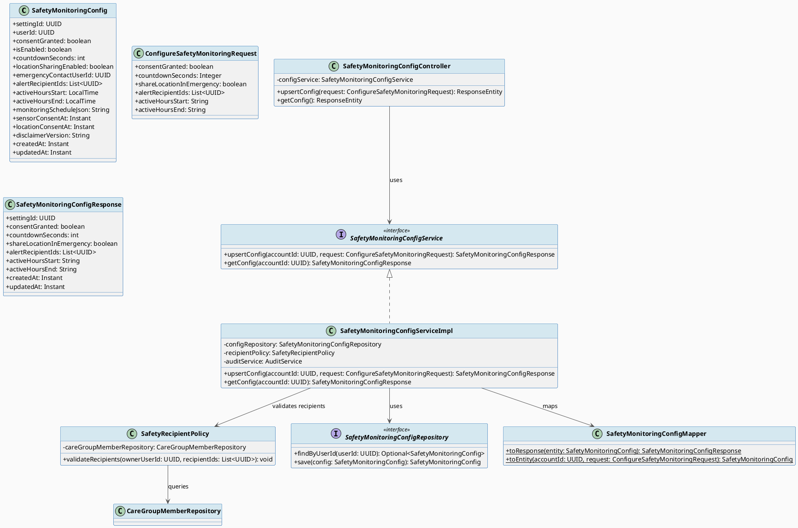
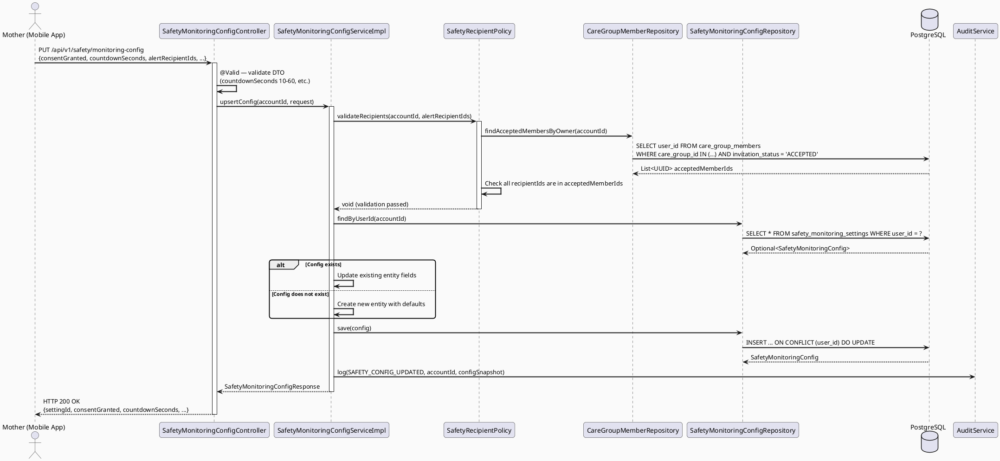
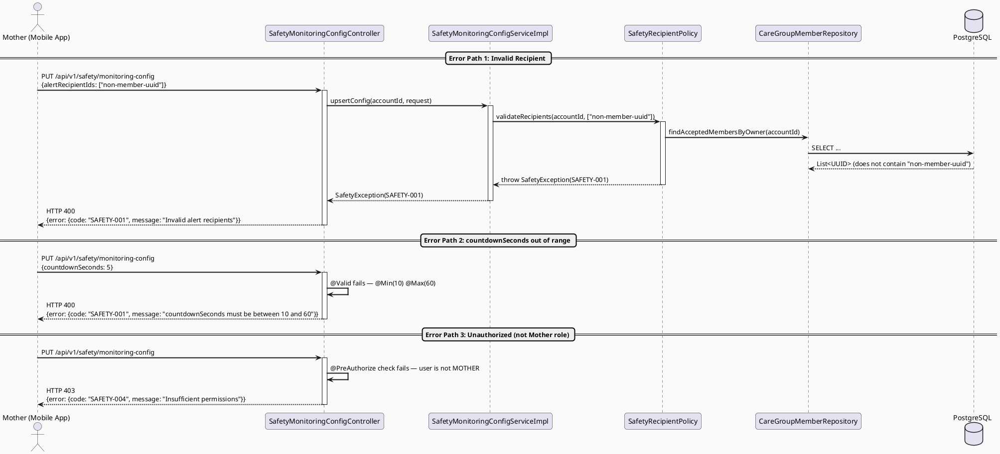
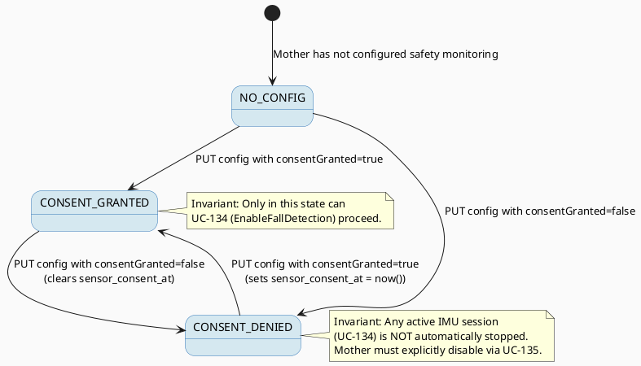

# ENGINEERING DOCUMENTATION STANDARD (EDS) v2.0
# Technical Design Specification — UC-133: Configure Safety Monitoring

| Field | Value |
|-------|-------|
| **Document ID** | `CB-SAFETY-IMP-001` |
| **Version** | `1.0` |
| **Date** | `2026-06-26` |
| **Status** | `Draft` |
| **Document Owner** | `PhuongNT` |
| **Author** | `AI Agent — System Architect` |
| **Reviewed by** | `[ ] Pending` |
| **DPO Sign-off** | `[ ] Pending` *(bắt buộc — module PII)* |
| **Approved by** | `[ ] Pending` |
| **Last Review** | `2026-06-26` |
| **Based on EDS** | `v2.0` |

---

## CHANGELOG

> **Policy 4.4 — Immutable History:** Không bao giờ xóa thông tin cũ. Mọi thay đổi phải ghi vào bảng này.

| Ngày | Người thực hiện | Nội dung thay đổi |
|------|-----------------|-------------------|
| 2026-06-26 | AI Agent — System Architect | Tạo tài liệu lần đầu — TDS cho UC-133 Configure Safety Monitoring |

---

## MỤC LỤC

1. [Tổng quan Module](#1-tổng-quan-module)
2. [Ma trận Truy vết (Traceability Matrix)](#2-ma-trận-truy-vết-traceability-matrix)
3. [Architecture Decision Records (ADR)](#3-architecture-decision-records-adr)
4. [Non-Functional Requirements & SLA](#4-non-functional-requirements--sla)
5. [Static Modeling (Mô hình Tĩnh)](#5-static-modeling-mô-hình-tĩnh)
6. [Dynamic Modeling (Mô hình Động)](#6-dynamic-modeling-mô-hình-động)
7. [Domain Event Catalog](#7-domain-event-catalog)
8. [Interface Specification (Đặc tả Giao diện)](#8-interface-specification-đặc-tả-giao-diện)
9. [API Specification](#9-api-specification)
10. [Bảng mã lỗi (Error Codes)](#10-bảng-mã-lỗi-error-codes)
11. [Quy trình Triển khai (Step-by-Step)](#11-quy-trình-triển-khai-step-by-step)
12. [Rollback & Incident Runbook](#12-rollback--incident-runbook)
13. [Kịch bản Kiểm thử Chi tiết](#13-kịch-bản-kiểm-thử-chi-tiết)
14. [Phương pháp Xác minh](#14-phương-pháp-xác-minh)
15. [Mẫu thử thực tế (API Verification Samples)](#15-mẫu-thử-thực-tế-api-verification-samples)
16. [Bảng tổng hợp phân quyền (Authorization Matrix)](#16-bảng-tổng-hợp-phân-quyền-authorization-matrix)
17. [AI Prompt Constraints (CASE 2.0)](#17-ai-prompt-constraints-case-20)

---

## 1. Tổng quan Module

| Field | Value |
|-------|-------|
| **UC ID** | `UC-133` |
| **Module Name** | `Configure Safety Monitoring` |
| **Bounded Context** | `safety` |
| **Primary Actor** | `Mother` |
| **Secondary Actors** | `Firebase Cloud Messaging` |
| **Platform** | `Backend API — called by Mobile App` |
| **Priority** | `Critical` |
| **Data Classification** | `PII` |
| **Compliance Scope** | `GDPR Art. 7 (Consent), GDPR Art. 32 (Security of processing)` |
| **SRS Reference** | `3.3.4.1` |
| **Upstream Dependencies** | `identity (JWT auth)`, `caregroup (care group membership validation)`, `audit (audit logging)` |
| **Downstream Consumers** | `UC-134 EnableFallDetection (reads consentGranted)`, `UC-136 DetectSuspectedFallOrImpact (reads countdownSeconds, alertRecipientIds)`, `UC-65 SendFamilyEmergencyAlert (reads alertRecipientIds, shareLocationInEmergency)` |

**Mô tả:**
UC-133 cho phép Mother cấu hình các thiết lập giám sát an toàn bao gồm:
1. Đồng ý cho phép hệ thống sử dụng cảm biến (consent)
2. Danh sách người nhận thông báo khẩn cấp (alert recipients) — chỉ từ care group members đã ACCEPTED
3. Thời gian đếm ngược trước khi gửi cảnh báo (countdown timer: 10-60 giây)
4. Tùy chọn chia sẻ vị trí khi khẩn cấp
5. Khung giờ giám sát chủ động (optional)

Config là upsert — mỗi Mother chỉ có 1 bản ghi cấu hình. Mọi thay đổi đều được ghi audit log.

---

## 2. Ma trận Truy vết (Traceability Matrix)

| Requirement ID | Loại (BR/ADR/US) | Mô tả yêu cầu | Thành phần Code | Compliance Target | ADR liên quan |
|----------------|------------------|---------------|-----------------|-------------------|---------------|
| BR-SAFETY-001 | Business Rule | Consent MUST be true trước khi fall detection có thể được kích hoạt | `SafetyMonitoringConfigService.upsertConfig()` | GDPR Art. 7.1 | ADR-001 |
| BR-SAFETY-002 | Business Rule | alertRecipientIds chỉ chấp nhận care group members có status ACCEPTED | `SafetyRecipientPolicy.validateRecipients()` | Healthcare safety | ADR-002 |
| BR-SAFETY-003 | Business Rule | countdownSeconds phải trong khoảng 10-60, default 30 | `ConfigureSafetyMonitoringRequest` validation | — | — |
| BR-SAFETY-004 | Business Rule | Config là upsert (INSERT ON CONFLICT UPDATE) — 1 config per mother | `SafetyMonitoringConfigRepository.upsert()` | — | ADR-003 |
| BR-SAFETY-005 | Business Rule | Audit log mọi config change | `AuditService.log()` | GDPR Art. 5.1(e) | ADR-001 |
| SRS-3.3.4.1 | Functional | Configure consent, recipients, countdown, location sharing, active hours | `SafetyMonitoringConfigController.upsertConfig()` | — | — |
| US-SAFETY-001 | User Story | As a Mother, I want to configure my safety monitoring settings | `PUT /api/v1/safety/monitoring-config` | — | — |
| US-SAFETY-002 | User Story | As a Mother, I want to view my current safety monitoring config | `GET /api/v1/safety/monitoring-config` | — | — |

---

## 3. Architecture Decision Records (ADR)

### ADR-001 — Upsert Pattern for Safety Monitoring Config

| Field | Value |
|-------|-------|
| **Status** | `Accepted` |
| **Deciders** | `PhuongNT — Tech Lead` |
| **Date** | `2026-06-26` |

#### Bối cảnh (Context)
Mỗi Mother chỉ có duy nhất 1 bản ghi cấu hình safety monitoring. Khi Mother thay đổi cài đặt, hệ thống cần quyết định giữa create-or-update pattern.

#### Các phương án đã xem xét (Options Considered)

| Phương án | Mô tả | Ưu điểm | Nhược điểm |
|-----------|-------|----------|------------|
| A | Tách riêng POST (create) và PUT (update) | + Rõ ràng REST semantics | - Client phải check trạng thái trước khi gọi; race condition |
| B | Dùng PUT upsert (INSERT ON CONFLICT UPDATE) | + Client gọi 1 endpoint duy nhất; idempotent | - Phức tạp hơn ở DB layer |

#### Quyết định (Decision)
Chọn **Phương án B** — PUT upsert. Client chỉ cần gọi 1 endpoint duy nhất. Backend dùng `INSERT ... ON CONFLICT (account_id) DO UPDATE` để đảm bảo atomicity và idempotency.

#### Hệ quả (Consequences)

**Tích cực:**
- Client logic đơn giản — không cần check trạng thái
- Idempotent — gọi nhiều lần cùng payload cho kết quả giống nhau
- Tránh race condition giữa check-then-create

**Tiêu cực / Trade-offs:**
- Cần UNIQUE constraint trên account_id — đã có trong V1 schema (`safety_monitoring_settings_user_id_key`)
- Audit log cần phân biệt create vs update — giải quyết bằng checking `created_at == updated_at`

**Compliance Impact:**
- GDPR Art. 7.1: Consent timestamp được ghi lại mỗi khi consentGranted thay đổi
- Audit trail đầy đủ cho mọi config change

### ADR-002 — Alert Recipients Must Be ACCEPTED Care Group Members

| Field | Value |
|-------|-------|
| **Status** | `Accepted` |
| **Deciders** | `PhuongNT — Tech Lead` |
| **Date** | `2026-06-26` |

#### Bối cảnh (Context)
Alert recipients nhận thông báo khẩn cấp khi phát hiện té ngã. Cần đảm bảo chỉ những người đã đồng ý tham gia care group (ACCEPTED) mới có thể nhận alert.

#### Các phương án đã xem xét (Options Considered)

| Phương án | Mô tả | Ưu điểm | Nhược điểm |
|-----------|-------|----------|------------|
| A | Cho phép bất kỳ user nào làm recipient | + Đơn giản | - Vi phạm consent — người dùng chưa đồng ý nhận alert |
| B | Chỉ ACCEPTED care group members | + Tuân thủ consent; người nhận đã đồng ý | - Cần validate cross-module |

#### Quyết định (Decision)
Chọn **Phương án B** — chỉ ACCEPTED care group members. Validate bằng query `care_group_members` với `invitation_status = 'ACCEPTED'` và `care_groups.owner_user_id = requesterId`.

#### Hệ quả (Consequences)

**Tích cực:**
- Tuân thủ consent — chỉ người đã đồng ý tham gia mới nhận alert
- Giảm risk gửi alert đến người không liên quan

**Tiêu cực / Trade-offs:**
- Cross-module dependency vào caregroup — giải quyết bằng service call, không join trực tiếp

### ADR-003 — Evolve V1 safety_monitoring_settings via Flyway Migration

| Field | Value |
|-------|-------|
| **Status** | `Accepted` |
| **Deciders** | `PhuongNT — Tech Lead` |
| **Date** | `2026-06-26` |

#### Bối cảnh (Context)
V1 schema đã có bảng `safety_monitoring_settings` nhưng thiếu một số cột cần cho UC-133: `consent_granted`, `alert_recipient_ids`, `active_hours_start`, `active_hours_end`. Cần migrate mà không mất dữ liệu hiện có.

#### Các phương án đã xem xét (Options Considered)

| Phương án | Mô tả | Ưu điểm | Nhược điểm |
|-----------|-------|----------|------------|
| A | DROP và CREATE lại bảng | + Clean schema | - Mất dữ liệu; nguy hiểm |
| B | ALTER TABLE thêm cột mới | + An toàn; backward compatible | - Schema phức tạp hơn |

#### Quyết định (Decision)
Chọn **Phương án B** — ALTER TABLE. Thêm các cột `consent_granted`, `alert_recipient_ids` (UUID[]), `active_hours_start`, `active_hours_end` vào bảng hiện có. Map `sensor_consent_at IS NOT NULL` sang `consent_granted = true` cho dữ liệu cũ.

#### Hệ quả (Consequences)

**Tích cực:**
- Không mất dữ liệu hiện có
- Backward compatible — các module khác vẫn hoạt động

**Tiêu cực / Trade-offs:**
- Cần data migration cho records cũ

---

## 4. Non-Functional Requirements & SLA

### 4.1. Performance & Availability

| Category | Requirement | Target SLA | Measurement Method | Compliance Basis |
|----------|-------------|------------|---------------------|------------------|
| Latency | PUT config response (p99) | `< 200ms` | k6 load test | — |
| Latency | GET config response (p99) | `< 100ms` | k6 load test | — |
| Availability | Uptime (monthly) | `99.9%` | Uptime monitor | — |
| Throughput | Concurrent config updates | `100 req/s` | Load test | — |

### 4.2. Data Integrity & Retention

| Category | Requirement | Target | Verification Method | Compliance Basis |
|----------|-------------|--------|---------------------|------------------|
| Durability | Zero config loss | RPO = 0 | Transaction log | GDPR Art. 5.1(f) |
| Retention | Audit log retention | 7 years | DB backup policy | GDPR Art. 5.1(e) |
| Consistency | Config <-> Audit sync | 100% | Reconciliation check | GDPR Art. 7.1 |
| Uniqueness | One config per account | 100% | UNIQUE constraint | — |

### 4.3. Security

| Category | Requirement | Target | Verification Method | Compliance Basis |
|----------|-------------|--------|---------------------|------------------|
| Encryption at rest | PII fields (user_id, recipient IDs) | AES-256 (DB-level) | DB encryption check | GDPR Art. 32 |
| Encryption in transit | All endpoints | TLS 1.3+ | SSL Labs scan | GDPR Art. 32 |
| Access control | Role-based — Mother only | Least privilege | Auth Matrix (section 16) | GDPR Art. 25 |
| Ownership | Mother can only modify own config | row-level security | JWT sub == account_id | GDPR Art. 25 |

### 4.4. Scalability & Capacity Planning

Projected load: 10,000 mothers, each updating config ~2 times/month = ~650 upserts/day. Table size remains small (1 row per mother). No partitioning or caching needed. Horizontal scaling via stateless API instances behind load balancer.

---

## 5. Static Modeling (Mô hình Tĩnh)

### 5.1. Class Diagram (PlantUML)



### 5.2. Data Structure (Flyway SQL Migration)

File: `src/main/resources/db/migration/V38__add_safety_monitoring_config_columns.sql`

```sql
-- === UC-133: CONFIGURE SAFETY MONITORING — SCHEMA EVOLUTION ===
-- Evolves safety_monitoring_settings to support UC-133 requirements:
--   consent_granted, alert_recipient_ids, active_hours_start/end

-- Add consent_granted boolean (derives from sensor_consent_at for existing data)
ALTER TABLE public.safety_monitoring_settings
    ADD COLUMN IF NOT EXISTS consent_granted BOOLEAN NOT NULL DEFAULT false;

-- Add alert_recipient_ids as UUID array (care group member account IDs)
ALTER TABLE public.safety_monitoring_settings
    ADD COLUMN IF NOT EXISTS alert_recipient_ids UUID[] DEFAULT '{}';

-- Add active monitoring hours (optional time window)
ALTER TABLE public.safety_monitoring_settings
    ADD COLUMN IF NOT EXISTS active_hours_start TIME;

ALTER TABLE public.safety_monitoring_settings
    ADD COLUMN IF NOT EXISTS active_hours_end TIME;

-- Backfill consent_granted from sensor_consent_at for existing records
UPDATE public.safety_monitoring_settings
SET consent_granted = true
WHERE sensor_consent_at IS NOT NULL
  AND consent_granted = false;

-- Index for quick lookup by user_id (already exists in V1 as UNIQUE constraint)
-- No additional index needed

-- Audit comment
COMMENT ON COLUMN public.safety_monitoring_settings.consent_granted IS 'Whether the mother has granted consent for sensor-based fall detection. Must be true before UC-134 can activate.';
COMMENT ON COLUMN public.safety_monitoring_settings.alert_recipient_ids IS 'Array of user_ids from ACCEPTED care group members who receive emergency alerts.';
COMMENT ON COLUMN public.safety_monitoring_settings.active_hours_start IS 'Optional start of active monitoring window (HH:MM). NULL means 24/7.';
COMMENT ON COLUMN public.safety_monitoring_settings.active_hours_end IS 'Optional end of active monitoring window (HH:MM). NULL means 24/7.';
```

---

## 6. Dynamic Modeling (Mô hình Động)

### 6.1. Sequence Diagram — Happy Path (PlantUML)



### 6.2. Sequence Diagram — Error Path (PlantUML)



### 6.3. State Machine

The safety monitoring config itself is not a state machine entity. It is a mutable configuration record. However, the `consent_granted` field acts as a gate:



---

## 7. Domain Event Catalog

### 7.1. Events Published (Phát ra)

| Event Name | Trigger | Publisher | Subscriber(s) | Payload Schema | Async? |
|------------|---------|-----------|---------------|----------------|--------|
| `SafetyConfigUpdated` | Mother creates or updates safety monitoring config | `SafetyMonitoringConfigServiceImpl` | `AuditService` | `SafetyConfigUpdatedEvent.java` | No |
| `SafetyConsentGranted` | consentGranted changes from false to true | `SafetyMonitoringConfigServiceImpl` | `AuditService` | `SafetyConsentGrantedEvent.java` | No |
| `SafetyConsentRevoked` | consentGranted changes from true to false | `SafetyMonitoringConfigServiceImpl` | `AuditService` | `SafetyConsentRevokedEvent.java` | No |

### 7.2. Events Consumed (Tiêu thụ)

| Event Name | Source | Handler | Action thực hiện |
|------------|--------|---------|------------------|
| N/A | — | — | UC-133 does not consume external events |

### 7.3. Payload Schema

```java
// SafetyConfigUpdatedEvent.java
public record SafetyConfigUpdatedEvent(
    UUID    eventId,
    String  eventType,        // "SafetyConfigUpdated"
    Instant occurredAt,
    String  version,          // "1.0"
    Payload payload,
    Metadata metadata
) {

    public record Payload(
        UUID    settingId,
        UUID    userId,
        boolean consentGranted,
        int     countdownSeconds,
        boolean locationSharingEnabled,
        List<UUID> alertRecipientIds,
        String  activeHoursStart,     // nullable, "HH:mm"
        String  activeHoursEnd,       // nullable, "HH:mm"
        boolean isNewRecord           // true if INSERT, false if UPDATE
    ) {}

    public record Metadata(
        UUID   correlationId,
        String causedBy               // userId of the mother
    ) {}
}
```

---

## 8. Interface Specification (Đặc tả Giao diện)

### 8.1. Service Interface

```java
// ConfigureSafetyMonitoringRequest.java — Input DTO
// @version 1.0
public class ConfigureSafetyMonitoringRequest {

    @NotNull(message = "consentGranted is required")
    private Boolean consentGranted;

    @Min(value = 10, message = "countdownSeconds must be >= 10")
    @Max(value = 60, message = "countdownSeconds must be <= 60")
    private Integer countdownSeconds;  // Optional — defaults to 30

    private Boolean shareLocationInEmergency;  // Optional — defaults to false

    @Size(max = 20, message = "Maximum 20 alert recipients allowed")
    private List<UUID> alertRecipientIds;  // Optional — defaults to empty

    @Pattern(regexp = "^([01]\\d|2[0-3]):[0-5]\\d$", message = "activeHoursStart must be HH:mm format")
    private String activeHoursStart;  // Optional — null means 24/7

    @Pattern(regexp = "^([01]\\d|2[0-3]):[0-5]\\d$", message = "activeHoursEnd must be HH:mm format")
    private String activeHoursEnd;    // Optional — null means 24/7
}

// SafetyMonitoringConfigResponse.java — Output DTO
// @version 1.0
public class SafetyMonitoringConfigResponse {
    private UUID settingId;
    private boolean consentGranted;
    private int countdownSeconds;
    private boolean shareLocationInEmergency;
    private List<UUID> alertRecipientIds;
    private String activeHoursStart;
    private String activeHoursEnd;
    private Instant createdAt;
    private Instant updatedAt;
}

// SafetyMonitoringConfigService.java — Service Contract
// @version 1.0
public interface SafetyMonitoringConfigService {

    /**
     * Creates or updates the safety monitoring configuration for the given account.
     * Upsert semantics: INSERT if not exists, UPDATE if exists.
     * @param accountId UUID of the authenticated mother
     * @param request configuration parameters
     * @return the saved configuration
     * @throws SafetyException (SAFETY-001) when alertRecipientIds contain non-ACCEPTED care group members
     */
    SafetyMonitoringConfigResponse upsertConfig(UUID accountId, ConfigureSafetyMonitoringRequest request);

    /**
     * Retrieves the current safety monitoring configuration for the given account.
     * @param accountId UUID of the authenticated mother
     * @return the current configuration
     * @throws SafetyException (SAFETY-003) when no config exists for this account
     */
    SafetyMonitoringConfigResponse getConfig(UUID accountId);
}
```

### 8.2. Repository Interface

```java
// SafetyMonitoringConfigRepository.java
// @version 1.0
public interface SafetyMonitoringConfigRepository extends JpaRepository<SafetyMonitoringConfig, UUID> {

    Optional<SafetyMonitoringConfig> findByUserId(UUID userId);

    // Note: No delete method — config is retained, can be disabled via consentGranted=false
}
```

### 8.3. Policy Interface

```java
// SafetyRecipientPolicy.java
// @version 1.0
@Component
public class SafetyRecipientPolicy {

    private final CareGroupMemberRepository careGroupMemberRepository;
    private final CareGroupRepository careGroupRepository;

    /**
     * Validates that all recipientIds are ACCEPTED members of care groups owned by ownerUserId.
     * @param ownerUserId the mother who owns the care groups
     * @param recipientIds list of user IDs to validate
     * @throws SafetyException (SAFETY-001) if any recipientId is not an ACCEPTED care group member
     */
    public void validateRecipients(UUID ownerUserId, List<UUID> recipientIds) {
        if (recipientIds == null || recipientIds.isEmpty()) {
            return; // empty is valid — no recipients configured
        }
        List<UUID> ownedGroupIds = careGroupRepository.findByOwnerUserId(ownerUserId)
            .stream().map(CareGroup::getCareGroupId).toList();
        List<UUID> acceptedMemberIds = careGroupMemberRepository
            .findAcceptedMemberUserIdsByCareGroupIds(ownedGroupIds);
        List<UUID> invalidIds = recipientIds.stream()
            .filter(id -> !acceptedMemberIds.contains(id))
            .toList();
        if (!invalidIds.isEmpty()) {
            throw new SafetyException("SAFETY-001",
                "Invalid alert recipients: " + invalidIds + " are not ACCEPTED care group members");
        }
    }
}
```

---

## 9. API Specification

### 9.1. Endpoints Table

| Method | Path | Auth Level | Required Roles | Rate Limit | Idempotent? |
|--------|------|------------|----------------|------------|-------------|
| `PUT` | `/api/v1/safety/monitoring-config` | JWT Bearer | `MOTHER` | 60/min | Yes |
| `GET` | `/api/v1/safety/monitoring-config` | JWT Bearer | `MOTHER` | 300/min | Yes |

### 9.2. Request / Response Schemas

#### `PUT /api/v1/safety/monitoring-config` — Upsert Config

**Request Body:**
```json
{
  "consentGranted": true,
  "countdownSeconds": 30,
  "shareLocationInEmergency": true,
  "alertRecipientIds": [
    "a1b2c3d4-e5f6-7890-abcd-ef1234567890",
    "b2c3d4e5-f6a7-8901-bcde-f12345678901"
  ],
  "activeHoursStart": "06:00",
  "activeHoursEnd": "22:00"
}
```

**Response — 200 OK (Happy Path):**
```json
{
  "settingId": "550e8400-e29b-41d4-a716-446655440000",
  "consentGranted": true,
  "countdownSeconds": 30,
  "shareLocationInEmergency": true,
  "alertRecipientIds": [
    "a1b2c3d4-e5f6-7890-abcd-ef1234567890",
    "b2c3d4e5-f6a7-8901-bcde-f12345678901"
  ],
  "activeHoursStart": "06:00",
  "activeHoursEnd": "22:00",
  "createdAt": "2026-06-26T10:00:00.000Z",
  "updatedAt": "2026-06-26T10:00:00.000Z"
}
```

**Response — 400 Bad Request (Invalid Recipients):**
```json
{
  "error": {
    "code": "SAFETY-001",
    "message": "Invalid alert recipients: [uuid] are not ACCEPTED care group members",
    "details": [
      { "field": "alertRecipientIds", "message": "Contains non-ACCEPTED care group members" }
    ]
  }
}
```

#### `GET /api/v1/safety/monitoring-config` — Get Current Config

**Response — 200 OK:**
```json
{
  "settingId": "550e8400-e29b-41d4-a716-446655440000",
  "consentGranted": true,
  "countdownSeconds": 30,
  "shareLocationInEmergency": true,
  "alertRecipientIds": [
    "a1b2c3d4-e5f6-7890-abcd-ef1234567890"
  ],
  "activeHoursStart": "06:00",
  "activeHoursEnd": "22:00",
  "createdAt": "2026-06-26T10:00:00.000Z",
  "updatedAt": "2026-06-26T10:00:00.000Z"
}
```

**Response — 404 Not Found:**
```json
{
  "error": {
    "code": "SAFETY-003",
    "message": "Safety monitoring config not found for this account"
  }
}
```

---

## 10. Bảng mã lỗi (Error Codes)

| Code | HTTP Status | Message (EN) | Message (VI) | Trigger Condition |
|------|-------------|--------------|--------------|-------------------|
| `SAFETY-001` | 400 | Invalid alert recipients | Người nhận cảnh báo không hợp lệ | alertRecipientIds contain user IDs not in ACCEPTED care group members |
| `SAFETY-003` | 404 | Config not found | Không tìm thấy cấu hình | GET config when no config exists for this account |
| `SAFETY-004` | 403 | Insufficient permissions | Không đủ quyền | Non-MOTHER role attempts to access safety config endpoints |
| `SAFETY-005` | 500 | Internal error | Lỗi hệ thống | Unexpected database error during upsert |
| `SAFETY-006` | 400 | Validation failed | Dữ liệu không hợp lệ | countdownSeconds out of range, invalid time format, etc. |

---

## 11. Quy trình Triển khai (Step-by-Step)

### 11.1. Prerequisites

- [x] ADR-001, ADR-002, ADR-003 đã được Accepted (xem section 3)
- [ ] DPO đã sign-off (module xử lý PII)
- [ ] Blueprint đã được Principal Architect approve
- [ ] Môi trường staging đã sẵn sàng

### 11.2. Pre-Migration Checklist

- [ ] Đã backup DB production: `pg_dump -h [host] -U [user] carebridge > backup_20260626.sql`
- [ ] Migration đã chạy thành công trên staging >= 24 giờ
- [ ] Rollback script đã được test trên staging (xem section 12)
- [ ] DPO đã sign-off vì migration thay đổi cấu trúc lưu PII

### 11.3. Implementation Steps

#### Chặng 1 — Chạy Flyway migration V38

File: `src/main/resources/db/migration/V38__add_safety_monitoring_config_columns.sql`

```sql
-- See section 5.2 for full SQL
ALTER TABLE public.safety_monitoring_settings
    ADD COLUMN IF NOT EXISTS consent_granted BOOLEAN NOT NULL DEFAULT false;
ALTER TABLE public.safety_monitoring_settings
    ADD COLUMN IF NOT EXISTS alert_recipient_ids UUID[] DEFAULT '{}';
ALTER TABLE public.safety_monitoring_settings
    ADD COLUMN IF NOT EXISTS active_hours_start TIME;
ALTER TABLE public.safety_monitoring_settings
    ADD COLUMN IF NOT EXISTS active_hours_end TIME;
```

Chạy migration:
```bash
./mvnw flyway:migrate
```

#### Chặng 2 — Tạo Entity, DTO, Repository

```java
// SafetyMonitoringConfig.java — JPA Entity
@Entity
@Table(name = "safety_monitoring_settings")
public class SafetyMonitoringConfig {
    @Id
    @Column(name = "setting_id")
    private UUID settingId;

    @Column(name = "user_id", nullable = false, unique = true)
    private UUID userId;

    @Column(name = "consent_granted", nullable = false)
    private boolean consentGranted;

    @Column(name = "is_enabled", nullable = false)
    private boolean isEnabled;

    @Column(name = "countdown_seconds", nullable = false)
    private int countdownSeconds = 30;

    @Column(name = "location_sharing_enabled", nullable = false)
    private boolean locationSharingEnabled;

    @Column(name = "alert_recipient_ids", columnDefinition = "uuid[]")
    private List<UUID> alertRecipientIds = new ArrayList<>();

    @Column(name = "active_hours_start")
    private LocalTime activeHoursStart;

    @Column(name = "active_hours_end")
    private LocalTime activeHoursEnd;

    @Column(name = "sensor_consent_at")
    private Instant sensorConsentAt;

    @Column(name = "created_at", nullable = false)
    private Instant createdAt;

    @Column(name = "updated_at", nullable = false)
    private Instant updatedAt;

    // ... getters, setters, @PrePersist, @PreUpdate
}
```

#### Chặng 3 — Tạo Service, Policy, Controller

Implement theo section 8 interfaces.

#### Chặng 4 — Verification sau deploy

```bash
curl -X GET https://[host]/api/v1/health
# Expected: {"status": "ok"}

curl -X PUT https://[host]/api/v1/safety/monitoring-config \
  -H "Authorization: Bearer [JWT_TOKEN]" \
  -H "Content-Type: application/json" \
  -d '{"consentGranted": true, "countdownSeconds": 30}'
# Expected: 200 OK
```

### 11.4. Deployment Checklist

- [ ] Migration chạy thành công
- [ ] Health check endpoint trả về 200
- [ ] Error rate < 1% trong 10 phút đầu
- [ ] Audit log đang sinh ra đúng format
- [ ] PUT upsert hoạt động đúng (create + update)
- [ ] GET config trả về kết quả chính xác
- [ ] Thông báo DPO vì deploy ảnh hưởng đến PII processing

---

## 12. Rollback & Incident Runbook

### 12.1. Điều kiện kích hoạt Rollback (Trigger Conditions)

| Điều kiện | Ngưỡng | Người quyết định |
|-----------|--------|------------------|
| Error rate tăng đột biến | > 5% trong 5 phút | On-call Engineer |
| Latency p99 vượt ngưỡng | > 2x baseline (> 400ms) | On-call Engineer |
| Dữ liệu không nhất quán (config vs audit) | Bất kỳ case nào | Tech Lead + DPO |
| Audit log ngừng hoạt động | > 1 phút | On-call Engineer |
| Consent state corruption | Bất kỳ case nào | Tech Lead + DPO |

### 12.2. Rollback Procedure

```bash
# Buoc 1: Revert migration V38 (remove added columns)
psql -h $DB_HOST -U $DB_USER -d $DB_NAME <<'SQL'
ALTER TABLE public.safety_monitoring_settings DROP COLUMN IF EXISTS consent_granted;
ALTER TABLE public.safety_monitoring_settings DROP COLUMN IF EXISTS alert_recipient_ids;
ALTER TABLE public.safety_monitoring_settings DROP COLUMN IF EXISTS active_hours_start;
ALTER TABLE public.safety_monitoring_settings DROP COLUMN IF EXISTS active_hours_end;
DELETE FROM flyway_schema_history WHERE version = '38';
SQL

# Buoc 2: Re-deploy phien ban cu
kubectl rollout undo deployment/carebridge-api

# Buoc 3: Verify rollback thanh cong
kubectl rollout status deployment/carebridge-api
curl -X GET https://[host]/api/v1/health

# Buoc 4: Smoke test
curl -X GET https://[host]/api/v1/safety/monitoring-config \
  -H "Authorization: Bearer [JWT_TOKEN]"
# Expected: 404 or previous behavior
```

### 12.3. Notification Protocol

| Thời điểm | Người nhận | Kênh | Template |
|-----------|------------|------|----------|
| Ngay khi phát hiện | On-call team | Slack `#incident` | "CAREBRIDGE safety-config incident detected: [description]" |
| Trong 30 phút | DPO | Email | Bắt buộc vì PII bị ảnh hưởng — GDPR Art. 33 |
| Trong 72 giờ | DPA | Email | Bắt buộc nếu có data breach — GDPR Art. 33 |

### 12.4. Post-Incident Review (PIR)

Bắt buộc hoàn thành PIR document trong vòng 48 giờ sau khi incident được resolve.

**PIR Template:**
- **Timeline:** Diễn biến từng bước theo thứ tự thời gian
- **Root Cause:** Nguyên nhân gốc rễ (5 Whys)
- **Impact:** Số users ảnh hưởng, thời gian downtime, PII exposure?
- **Remediation:** Các bước đã thực hiện để khắc phục
- **Prevention:** Action items để tránh tái diễn

---

## 13. Kịch bản Kiểm thử Chi tiết

### 13.1. Unit Tests

#### TC-UNIT-001 — Upsert Config Happy Path (Create)

```gherkin
Feature: Configure Safety Monitoring
  Background:
    Given test data classification: SYNTHETIC
    And mother account "mother-001" exists with role MOTHER
    And care group owned by "mother-001" has ACCEPTED member "member-001"

  Scenario: Mother creates safety monitoring config for the first time
    Given no safety_monitoring_settings record exists for "mother-001"
    When PUT /api/v1/safety/monitoring-config is called with:
      | consentGranted | true |
      | countdownSeconds | 25 |
      | shareLocationInEmergency | true |
      | alertRecipientIds | ["member-001"] |
    Then a new record is created in safety_monitoring_settings
    And response status is 200
    And response body contains consentGranted = true
    And response body contains countdownSeconds = 25
    And audit log contains event "SafetyConfigUpdated"
```

**Hàm được test:** `SafetyMonitoringConfigServiceImpl.upsertConfig()`
**Invariant kiểm tra:** Exactly one config record per mother after upsert

#### TC-UNIT-002 — Upsert Config Happy Path (Update)

```gherkin
  Scenario: Mother updates existing safety monitoring config
    Given safety_monitoring_settings record exists for "mother-001" with countdownSeconds=30
    When PUT /api/v1/safety/monitoring-config is called with countdownSeconds=45
    Then the existing record is updated (not duplicated)
    And response body contains countdownSeconds = 45
    And updated_at is changed
    And audit log contains event "SafetyConfigUpdated"
```

#### TC-UNIT-003 — Invalid Alert Recipients

```gherkin
  Scenario: Mother specifies non-ACCEPTED care group member as recipient
    Given care group owned by "mother-001" has NO member "stranger-001"
    When PUT /api/v1/safety/monitoring-config is called with alertRecipientIds=["stranger-001"]
    Then response status is 400
    And error code is "SAFETY-001"
    And no config record is created or modified
```

#### TC-UNIT-004 — countdownSeconds Out of Range

```gherkin
  Scenario: countdownSeconds below minimum
    When PUT /api/v1/safety/monitoring-config is called with countdownSeconds=5
    Then response status is 400
    And error code is "SAFETY-006"

  Scenario: countdownSeconds above maximum
    When PUT /api/v1/safety/monitoring-config is called with countdownSeconds=120
    Then response status is 400
    And error code is "SAFETY-006"
```

### 13.2. Integration Tests

#### TC-INT-001 — Full Upsert Flow with DB Verification

```gherkin
  Scenario: Complete upsert creates record in DB and audit log
    Given test data classification: SYNTHETIC
    And PostgreSQL container running with Flyway V1+V38 applied
    And mother "mother-001" exists in users table
    And care group with ACCEPTED member "member-001" exists
    When SafetyMonitoringConfigServiceImpl.upsertConfig("mother-001", request) is called
    Then safety_monitoring_settings contains exactly 1 record for user_id="mother-001"
    And consent_granted = true
    And alert_recipient_ids contains "member-001"
    And countdown_seconds = 30
```

**External dependencies:** PostgreSQL (Testcontainers)
**Mock strategy:** Testcontainers PostgreSQL, real JPA repositories

### 13.3. E2E / Security Tests

#### TC-E2E-001 — Unauthorized Access by Non-Mother

```gherkin
  Scenario: Expert role cannot access safety monitoring config
    Given test data classification: SYNTHETIC
    And user "expert-001" has role EXPERT and valid JWT
    When PUT /api/v1/safety/monitoring-config is called with Authorization: Bearer [expert-jwt]
    Then response status is 403
    And error code is "SAFETY-004"

  Scenario: Unauthenticated request
    When PUT /api/v1/safety/monitoring-config is called without Authorization header
    Then response status is 401
```

#### TC-E2E-002 — SQL Injection Attempt

```gherkin
  Scenario: SQL injection in activeHoursStart
    Given malicious payload activeHoursStart = "'; DROP TABLE safety_monitoring_settings; --"
    When PUT /api/v1/safety/monitoring-config is called with that payload
    Then response status is 400
    And safety_monitoring_settings table still exists
    And no injection executed
```

---

## 14. Phương pháp Xác minh

### 14.1. Database Inspection

```sql
-- Verify config record after upsert
SELECT setting_id, user_id, consent_granted, countdown_seconds,
       location_sharing_enabled, alert_recipient_ids,
       active_hours_start, active_hours_end, created_at, updated_at
FROM safety_monitoring_settings
WHERE user_id = 'mother-001-uuid';

-- Verify UNIQUE constraint (1 config per mother)
SELECT user_id, COUNT(*) as config_count
FROM safety_monitoring_settings
GROUP BY user_id
HAVING COUNT(*) > 1;
-- Expected: no rows (0 duplicates)

-- Verify V38 migration applied
SELECT version, description, installed_on
FROM flyway_schema_history
WHERE version = '38';
```

### 14.2. Log / Audit Verification

```bash
# Check audit log for config update events
kubectl logs -l app=carebridge-api | grep '"eventType":"SafetyConfigUpdated"' | head -5

# Verify no PII in logs
kubectl logs -l app=carebridge-api | grep -i "password\|secret\|ssn\|creditCard"
# Expected: No output

# Verify audit log contains required fields
kubectl logs -l app=carebridge-api | jq 'select(.eventType == "SafetyConfigUpdated") | {eventId, occurredAt, userId}'
```

---

## 15. Mẫu thử thực tế (API Verification Samples)

### 15.1. Happy Path

```bash
# [PUT] Create/Update safety monitoring config
curl -X PUT https://localhost:8080/api/v1/safety/monitoring-config \
  -H "Authorization: Bearer [MOTHER_JWT_TOKEN]" \
  -H "Content-Type: application/json" \
  -H "X-Correlation-Id: $(uuidgen)" \
  -d '{
    "consentGranted": true,
    "countdownSeconds": 30,
    "shareLocationInEmergency": true,
    "alertRecipientIds": ["a1b2c3d4-e5f6-7890-abcd-ef1234567890"],
    "activeHoursStart": "06:00",
    "activeHoursEnd": "22:00"
  }'
```

**Expected Response (200):**
```json
{
  "settingId": "550e8400-e29b-41d4-a716-446655440000",
  "consentGranted": true,
  "countdownSeconds": 30,
  "shareLocationInEmergency": true,
  "alertRecipientIds": ["a1b2c3d4-e5f6-7890-abcd-ef1234567890"],
  "activeHoursStart": "06:00",
  "activeHoursEnd": "22:00",
  "createdAt": "2026-06-26T10:00:00.000Z",
  "updatedAt": "2026-06-26T10:00:00.000Z"
}
```

```bash
# [GET] Retrieve current config
curl -X GET https://localhost:8080/api/v1/safety/monitoring-config \
  -H "Authorization: Bearer [MOTHER_JWT_TOKEN]"
```

### 15.2. Error Paths

```bash
# [PUT] Invalid recipients -> 400
curl -X PUT https://localhost:8080/api/v1/safety/monitoring-config \
  -H "Authorization: Bearer [MOTHER_JWT_TOKEN]" \
  -H "Content-Type: application/json" \
  -d '{
    "consentGranted": true,
    "alertRecipientIds": ["00000000-0000-0000-0000-nonexistent01"]
  }'
```

**Expected Response (400):**
```json
{
  "error": {
    "code": "SAFETY-001",
    "message": "Invalid alert recipients: [00000000-0000-0000-0000-nonexistent01] are not ACCEPTED care group members"
  }
}
```

```bash
# [GET] No config exists -> 404
curl -X GET https://localhost:8080/api/v1/safety/monitoring-config \
  -H "Authorization: Bearer [NEW_MOTHER_JWT_TOKEN]"
```

**Expected Response (404):**
```json
{
  "error": {
    "code": "SAFETY-003",
    "message": "Safety monitoring config not found for this account"
  }
}
```

```bash
# [PUT] No JWT -> 401
curl -X PUT https://localhost:8080/api/v1/safety/monitoring-config \
  -H "Content-Type: application/json" \
  -d '{"consentGranted": true}'
```

**Expected Response (401):**
```json
{
  "error": {
    "code": "IAM-001",
    "message": "Authentication required"
  }
}
```

---

## 16. Bảng tổng hợp phân quyền (Authorization Matrix)

| Endpoint | `GUEST` | `MOTHER` | `EXPERT` | `ADMIN` | `DPO` | `SYSTEM` |
|----------|---------|----------|----------|---------|-------|----------|
| `PUT /api/v1/safety/monitoring-config` | -- | Own only | -- | -- | -- | -- |
| `GET /api/v1/safety/monitoring-config` | -- | Own only | -- | All (read-only) | All (read-only) | All |

**Chú thích:**
- Own only = Chỉ được phép với config của chính mình (JWT sub == user_id)
- -- = Bị từ chối (403)
- All = Được phép truy cập tất cả configs

---

## 17. AI Prompt Constraints (CASE 2.0)

### 17.1 Constraint Summary Table

| # | Constraint | Source (ADR/BR) | Last Verified |
|---|-----------|-----------------|---------------|
| C1 | Safety monitoring config MUST use upsert (INSERT ON CONFLICT UPDATE) with UNIQUE on user_id — never create duplicate configs | `ADR-001` | `2026-06-26` |
| C2 | alertRecipientIds MUST be validated against care_group_members with invitation_status='ACCEPTED' owned by the requesting mother | `ADR-002, BR-SAFETY-002` | `2026-06-26` |
| C3 | countdownSeconds MUST be validated: @Min(10) @Max(60), default 30 if not provided | `BR-SAFETY-003` | `2026-06-26` |
| C4 | Identity comes from JWT Bearer token. Controller extracts accountId from SecurityContext. No userId in request body | `ADR-001` | `2026-06-26` |
| C5 | Controller handles validation and mapping only. Business logic (recipient validation, upsert logic) belongs in Service layer. Domain rules (recipient eligibility) belong in Policy class | `ADR-001, CLAUDE.md` | `2026-06-26` |
| C6 | Every config change MUST emit audit event via AuditService. Audit log is append-only | `BR-SAFETY-005` | `2026-06-26` |
| C7 | consentGranted MUST be true before UC-134 EnableFallDetection can proceed — this is enforced in UC-134, but config must store the field reliably | `BR-SAFETY-001` | `2026-06-26` |

### 17.2 Constraint Injection Block (Copy-Paste vào AI Prompt)

```
[CONSTRAINT BLOCK — Module: Configure Safety Monitoring]
Theo TDS CB-SAFETY-IMP-001 và các ADR liên quan:

1. Upsert pattern: INSERT ON CONFLICT (user_id) DO UPDATE. Never create duplicate configs. Use SafetyMonitoringConfigRepository.save() with entity that has existing settingId if found.
2. alertRecipientIds validation: Query care_group_members via SafetyRecipientPolicy. Only ACCEPTED members of care groups owned by the mother are valid. Throw SAFETY-001 if invalid.
3. countdownSeconds: @Min(10) @Max(60), default 30. Validate in DTO with Bean Validation annotations.
4. Identity: Extract accountId from JWT SecurityContext in controller. Pass as method parameter to service. Never accept userId from request body.
5. Layer separation: Controller = validation + mapping. Service = upsert logic + audit. Policy = recipient eligibility. Repository = persistence only.
6. Audit: Call AuditService.log() after every successful config change. Include before/after snapshot.
7. consent_granted field: Store reliably. When changed to true, set sensor_consent_at = Instant.now(). When changed to false, clear sensor_consent_at.

[CONTEXT BLOCK]
- Bounded Context: safety
- Data Classification: PII
- Compliance: GDPR Art. 7 (Consent), Art. 32 (Security)
- Existing interfaces: section 8 Service Interface + section 8.2 Repository Interface
- Error codes: section 10 Error Codes Table
- Auth matrix: section 16 Authorization Matrix
- Existing DB table: safety_monitoring_settings (V1) + V38 migration adds new columns

[TASK BLOCK]
Implement SafetyMonitoringConfigController, SafetyMonitoringConfigServiceImpl, SafetyRecipientPolicy.
Output phải tuân thủ section 8 Interface Specification.
Tests phải cover section 13 Test Scenarios.
```

### 17.3 Constraint Quality Checklist

- [x] Mỗi constraint traceable về ADR hoặc BR cụ thể
- [x] Không có constraint generic (no "use best practices")
- [x] Mỗi constraint có `Last Verified` date <= 2 sprints
- [x] Constraint block có >= 3 constraints cụ thể (7 constraints)
- [x] Constraint block reference section 8 Interface
- [x] Constraint block reference section 16 Auth Matrix

### 17.4 Anti-Pattern Detection (cho AI-Generated Code từ Block này)

| AP-ID | Anti-Pattern | Dấu hiệu | Hành động |
|-------|-------------|-----------|----------|
| AP-AI-001 | Unconstrained Gen | Code không validate alertRecipientIds against care group members | Reject — inject C2 constraint |
| AP-AI-002 | Green-from-Birth | Tests pass without implementation (missing assertion) | Reject — rewrite with Props Isolation |
| AP-AI-003 | Implicit Decision | Code creates separate POST/PUT endpoints instead of upsert | Reject — reference ADR-001 |
| AP-AI-004 | Layer Violation | Business logic (recipient validation) in Controller | Reject — move to SafetyRecipientPolicy |
| AP-AI-005 | Hallucinated Contract | Code imports CareGroupService that does not exist | Reject — verify contract existence, use Repository directly |
| AP-AI-006 | Missing Audit | Config change without AuditService.log() call | Reject — inject C6 constraint |

---

## PHỤ LỤC

### A. Glossary (Thuật ngữ)

| Thuật ngữ | Định nghĩa |
|-----------|------------|
| Safety Monitoring Config | Bản ghi cấu hình cho tính năng giám sát an toàn của Mother, bao gồm consent, recipients, countdown timer |
| Consent | Sự đồng ý của Mother cho phép hệ thống sử dụng cảm biến IMU để phát hiện té ngã |
| Alert Recipient | Thành viên care group đã ACCEPTED sẽ nhận thông báo khẩn cấp khi phát hiện té ngã |
| Countdown Timer | Thời gian đếm ngược (10-60 giây) trước khi hệ thống tự động gửi cảnh báo khẩn cấp |
| Upsert | Pattern INSERT nếu chưa tồn tại, UPDATE nếu đã tồn tại — đảm bảo 1 record per mother |
| PII | Personally Identifiable Information — dữ liệu cá nhân cần bảo vệ theo GDPR |
| IMU | Inertial Measurement Unit — cảm biến đo gia tốc và con quay hồi chuyển |
| DPO | Data Protection Officer — người chịu trách nhiệm bảo vệ dữ liệu |
| Care Group | Nhóm chăm sóc do Mother tạo, bao gồm gia đình và người thân |

### B. Tài liệu tham chiếu

| Document | Link / Path |
|----------|-------------|
| GDPR Art. 7 (Consent conditions) | https://gdpr-info.eu/art-7-gdpr/ |
| GDPR Art. 32 (Security of processing) | https://gdpr-info.eu/art-32-gdpr/ |
| V1 Init Schema (safety_monitoring_settings) | `05_Development/CareBridgeAPI/src/main/resources/db/migration/V1__init_schema.sql` |
| SRS 3.3.4.1 — Configure Safety Monitoring | `02_Requirements/SRS/` |
| CASE 2.0 Methodology | `08_References/Template/PHASE-3_TDS.md` |
| UC-134 Enable Fall Detection TDS | `04_Implement/UC134_EnableFallDetection/UC134_EnableFallDetection_TDS.md` |
| UC-136 Detect Suspected Fall TDS | `04_Implement/UC136_DetectSuspectedFallOrImpact/UC136_DetectSuspectedFallOrImpact_TDS.md` |
| Care Group Schema | `V1__init_schema.sql` — care_groups, care_group_members tables |

---

*EDS v2.1 — Tích hợp CASE 2.0 AI Prompt Constraints (section 17).*
