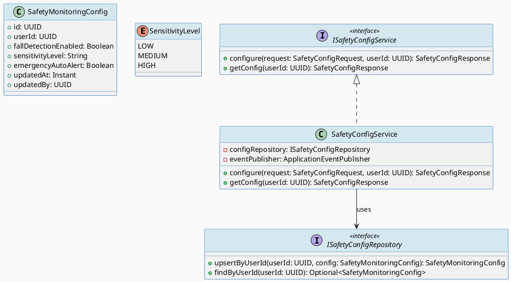
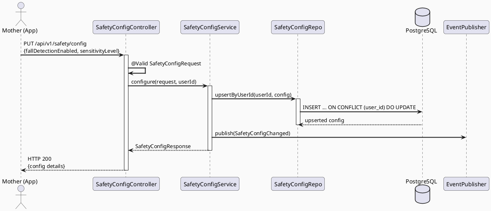
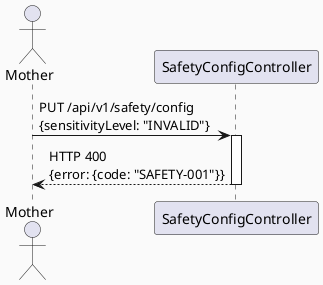

# ENGINEERING DOCUMENTATION STANDARD (EDS) v2.0
# UC133 — Configure Safety Monitoring

| Field | Value |
|-------|-------|
| **Document ID** | `CB-SAFETY-IMP-001` |
| **Version** | `1.0` |
| **Date** | `2026-06-26` |
| **Status** | `Draft` |
| **Document Owner** | `AI Agent` |
| **Author** | `AI Agent — Tech Lead` |
| **Reviewed by** | `[ ] Pending` |
| **DPO Sign-off** | `[ ] Pending` *(bắt buộc — module PII: safety config với location/wearable data)* |
| **Approved by** | `[ ] Pending` |
| **Last Review** | `2026-06-26` |
| **Based on EDS** | `v2.0` |

---

## CHANGELOG

| Ngày | Người thực hiện | Nội dung thay đổi |
|------|-----------------|-------------------|
| 2026-06-26 | AI Agent — Tech Lead | Tạo tài liệu lần đầu — TDS cho UC133 Configure Safety Monitoring |

---

## MỤC LỤC

1. [Tổng quan Module](#1-tổng-quan-module)
2. [Ma trận Truy vết (Traceability Matrix)](#2-ma-trận-truy-vết-traceability-matrix)
3. [Architecture Decision Records (ADR)](#3-architecture-decision-records-adr)
4. [Non-Functional Requirements & SLA](#4-non-functional-requirements--sla)
5. [Static Modeling (Mô hình Tĩnh)](#5-static-modeling-mô-hình-tĩnh)
6. [Dynamic Modeling (Mô hình Động)](#6-dynamic-modeling-mô-hình-động)
7. [Domain Event Catalog](#7-domain-event-catalog)
8. [Interface Specification (Đặc tả Giao diện)](#8-interface-specification-đặc-tả-giao-diện)
9. [API Specification](#9-api-specification)
10. [Bảng mã lỗi (Error Codes)](#10-bảng-mã-lỗi-error-codes)
11. [Quy trình Triển khai (Step-by-Step)](#11-quy-trình-triển-khai-step-by-step)
12. [Rollback & Incident Runbook](#12-rollback--incident-runbook)
13. [Kịch bản Kiểm thử Chi tiết](#13-kịch-bản-kiểm-thử-chi-tiết)
14. [Phương pháp Xác minh](#14-phương-pháp-xác-minh)
15. [Mẫu thử thực tế (API Verification Samples)](#15-mẫu-thử-thực-tế-api-verification-samples)
16. [Bảng tổng hợp phân quyền (Authorization Matrix)](#16-bảng-tổng-hợp-phân-quyền-authorization-matrix)
17. [AI Prompt Constraints (CASE 2.0)](#17-ai-prompt-constraints-case-20)

---

## 1. Tổng quan Module

> UC133 cho phép người dùng (Mother) cấu hình các tuỳ chọn giám sát an toàn: bật/tắt fall detection, chọn sensitivity, thiết lập emergency contacts. Config được lưu vào `safety_monitoring_config` (V38). Là tiền đề để UC134/UC135 hoạt động.

| Field | Value |
|-------|-------|
| **Module Name** | `Configure Safety Monitoring` |
| **Bounded Context** | `safety` |
| **Data Classification** | `PII` *(safety preferences, emergency contact info)* |
| **Compliance Scope** | `PDPA / Luật 91/2025` |
| **Upstream Dependencies** | `IAM (JWT), User Profile` |
| **Downstream Consumers** | `UC134 EnableFallDetection, UC135 DisableFallDetection, UC136 DetectFallOrImpact` |

---

## 2. Ma trận Truy vết (Traceability Matrix)

| Requirement ID | Loại (BR/ADR/US) | Mô tả yêu cầu | Thành phần Code | Compliance Target | ADR liên quan |
|----------------|------------------|---------------|-----------------|-------------------|---------------|
| SRS-3.3.4.1 | User Story | Mother cấu hình tuỳ chọn giám sát an toàn | `SafetyConfigController.PUT /safety/config` | — | ADR-SAFETY-001 |
| BR-SAFETY-002 | Business Rule | Mỗi user chỉ có 1 safety_monitoring_config — upsert | `SafetyConfigService.configure()` | — | ADR-SAFETY-001 |
| BR-SAFETY-003 | Business Rule | fallDetectionEnabled = true → trigger UC134 | `SafetyConfigService` | — | ADR-SAFETY-002 |
| BR-SAFETY-004 | Business Rule | fallDetectionEnabled = false → trigger UC135 | `SafetyConfigService` | — | ADR-SAFETY-002 |
| ADR-SAFETY-001 | Decision | Upsert pattern — không tạo nhiều config records per user | `SafetyConfigRepository.upsert()` | — | — |
| ADR-SAFETY-002 | Decision | Config change publish event để UC134/UC135 respond | `SafetyConfigService` | — | — |

---

## 3. Architecture Decision Records (ADR)

### ADR-SAFETY-001 — Upsert pattern cho safety config

| Field | Value |
|-------|-------|
| **Status** | `Accepted` |
| **Deciders** | `AI Agent — Tech Lead` |
| **Date** | `2026-06-26` |
| **Supersedes** | `—` |

#### Bối cảnh (Context)
Mỗi user chỉ cần 1 safety config. Tạo nhiều config record sẽ phức tạp query.

#### Quyết định (Decision)
Upsert: `INSERT ... ON CONFLICT (user_id) DO UPDATE`. Nếu config chưa tồn tại → INSERT; nếu đã có → UPDATE.

---

### ADR-SAFETY-002 — Publish SafetyConfigChanged event

| Field | Value |
|-------|-------|
| **Status** | `Accepted` |
| **Deciders** | `AI Agent — Tech Lead` |
| **Date** | `2026-06-26` |
| **Supersedes** | `—` |

#### Quyết định (Decision)
Sau khi config update, publish `SafetyConfigChanged` event. UC134 và UC135 lắng nghe event này để enable/disable IMU monitoring.

---

## 4. Non-Functional Requirements & SLA

### 4.1. Performance & Availability

| Category | Requirement | Target SLA | Measurement Method | Compliance Basis |
|----------|-------------|------------|---------------------|------------------|
| Latency | API response (p99) | `< 300ms` | k6 load test | — |
| Availability | Uptime (monthly) | `99.9%` | Uptime monitor | — |

### 4.2. Data Integrity & Retention

| Category | Requirement | Target | Verification Method | Compliance Basis |
|----------|-------------|--------|---------------------|------------------|
| Consistency | 1 config per user at all times | 100% | UNIQUE constraint | — |
| Retention | Safety config | Per user account lifetime | DB policy | PDPA |

### 4.3. Security

| Category | Requirement | Target | Verification Method | Compliance Basis |
|----------|-------------|--------|---------------------|------------------|
| Encryption in transit | TLS 1.3+ | All endpoints | SSL Labs | PDPA |
| Access control | ROLE_MOTHER only | Least privilege | Auth Matrix (§16) | — |

---

## 5. Static Modeling (Mô hình Tĩnh)

### 5.1. Class Diagram (PlantUML)



### 5.2. Data Structure (Flyway SQL Migration)

Tạo file: `src/main/resources/db/migration/V38__create_safety_monitoring_config.sql`

```sql
-- === SAFETY: MONITORING CONFIG SCHEMA ===

CREATE TABLE safety_monitoring_config (
  id                      UUID          PRIMARY KEY DEFAULT gen_random_uuid(),
  user_id                 UUID          NOT NULL UNIQUE,  -- one config per user
  fall_detection_enabled  BOOLEAN       NOT NULL DEFAULT FALSE,
  sensitivity_level       VARCHAR(10)   NOT NULL DEFAULT 'MEDIUM',
  emergency_auto_alert    BOOLEAN       NOT NULL DEFAULT TRUE,
  updated_at              TIMESTAMPTZ   NOT NULL DEFAULT NOW(),
  updated_by              UUID          NOT NULL,

  CONSTRAINT fk_safety_config_user FOREIGN KEY (user_id) REFERENCES users(id),
  CONSTRAINT chk_sensitivity CHECK (sensitivity_level IN ('LOW','MEDIUM','HIGH'))
);

CREATE INDEX idx_safety_config_user_id ON safety_monitoring_config(user_id);
```

---

## 6. Dynamic Modeling (Mô hình Động)

### 6.1. Sequence Diagram — Happy Path (PlantUML)



### 6.2. Sequence Diagram — Error Path



### 6.3. State Machine

> No complex state machine — safety config is always upserted to latest value.

---

## 7. Domain Event Catalog

### 7.1. Events Published (Phát ra)

| Event Name | Trigger | Publisher | Subscriber(s) | Payload Schema | Async? |
|------------|---------|-----------|---------------|----------------|--------|
| `SafetyConfigChanged` | Config upserted | `SafetyConfigService` | `UC134 EnableFallDetection, UC135 DisableFallDetection` | `SafetyConfigChanged.java` | Yes |

### 7.2. Events Consumed (Tiêu thụ)

> UC133 không consume events.

### 7.3. Payload Schema

```java
// SafetyConfigChanged.java
public record SafetyConfigChanged(
    UUID    eventId,
    String  eventType,               // "SafetyConfigChanged"
    Instant occurredAt,
    String  version,                 // "1.0"
    Payload payload,
    Metadata metadata
) implements ApplicationEvent {

    public record Payload(
        UUID    userId,
        boolean fallDetectionEnabled,
        String  sensitivityLevel
    ) {}

    public record Metadata(UUID correlationId, String causedBy) {}
}
```

---

## 8. Interface Specification (Đặc tả Giao diện)

### 8.1. Service Interface

```java
// SafetyConfigRequest.java
// @version 1.0
public class SafetyConfigRequest {
    private Boolean fallDetectionEnabled;
    @Pattern(regexp = "LOW|MEDIUM|HIGH")
    private String sensitivityLevel;
    private Boolean emergencyAutoAlert;
    // getters / setters
}

// SafetyConfigResponse.java
public class SafetyConfigResponse {
    private UUID    userId;
    private boolean fallDetectionEnabled;
    private String  sensitivityLevel;
    private boolean emergencyAutoAlert;
    private Instant updatedAt;
    // getters / setters
}

// ISafetyConfigService.java
// @version 1.0
public interface ISafetyConfigService {
    /**
     * Upsert safety monitoring configuration for a user.
     * @throws AccessDeniedException (SAFETY-004) if not ROLE_MOTHER
     */
    SafetyConfigResponse configure(SafetyConfigRequest request, UUID userId);

    /**
     * Get current safety config for user (returns defaults if not set).
     */
    SafetyConfigResponse getConfig(UUID userId);
}
```

### 8.2. Repository Interface

```java
// ISafetyConfigRepository.java
// @version 1.0
public interface ISafetyConfigRepository extends JpaRepository<SafetyMonitoringConfig, UUID> {
    Optional<SafetyMonitoringConfig> findByUserId(UUID userId);
    // Upsert via native query or merge
}
```

---

## 9. API Specification

### 9.1. Endpoints Table

| Method | Path | Auth Level | Required Roles | Rate Limit | Idempotent? |
|--------|------|------------|----------------|------------|-------------|
| `PUT` | `/api/v1/safety/config` | JWT Bearer | `ROLE_MOTHER` | 30/min | Yes |
| `GET` | `/api/v1/safety/config` | JWT Bearer | `ROLE_MOTHER` | 60/min | Yes |

### 9.2. Request / Response Schemas

#### `PUT /api/v1/safety/config`

**Request Body:**
```json
{
  "fallDetectionEnabled": true,
  "sensitivityLevel": "MEDIUM",
  "emergencyAutoAlert": true
}
```

**Response — 200 OK:**
```json
{
  "userId": "uuid-v4",
  "fallDetectionEnabled": true,
  "sensitivityLevel": "MEDIUM",
  "emergencyAutoAlert": true,
  "updatedAt": "2026-06-26T08:00:00.000Z"
}
```

---

## 10. Bảng mã lỗi (Error Codes)

| Code | HTTP Status | Message (EN) | Message (VI) | Trigger Condition |
|------|-------------|--------------|--------------|-------------------|
| `SAFETY-001` | 400 | Validation failed | Dữ liệu không hợp lệ | sensitivityLevel invalid |
| `SAFETY-003` | 404 | Config not found | Không tìm thấy cấu hình | User chưa có config (GET only) |
| `SAFETY-004` | 403 | Insufficient permissions | Không đủ quyền | Not ROLE_MOTHER |

---

## 11. Quy trình Triển khai (Step-by-Step)

### 11.1. Prerequisites

- [ ] ADR-SAFETY-001 và ADR-SAFETY-002 đã Accepted
- [ ] DPO sign-off (safety config với emergency contact info)

### 11.2. Pre-Migration Checklist

- [ ] Đã backup DB
- [ ] Migration V38 chạy thành công trên staging ≥ 24 giờ

### 11.3. Implementation Steps

#### Chặng 1 — Migration V38
```bash
./mvnw flyway:migrate
```

#### Chặng 2 — Implement SafetyMonitoringConfig entity + Repository
```java
// SafetyMonitoringConfig.java trong package com.carebridge.safety.entity
```

#### Chặng 3 — Implement SafetyConfigService + Controller
```java
// SafetyConfigService.java trong package com.carebridge.safety.service
// SafetyConfigController.java trong package com.carebridge.safety.controller
```

### 11.4. Deployment Checklist

- [ ] V38 migration chạy thành công
- [ ] GET /api/v1/safety/config trả default config khi chưa có
- [ ] SafetyConfigChanged event published sau PUT

---

## 12. Rollback & Incident Runbook

### 12.1. Điều kiện kích hoạt Rollback

| Điều kiện | Ngưỡng | Người quyết định |
|-----------|--------|------------------|
| Config update không được persist | Bất kỳ case nào | On-call Engineer |
| Event không được publish | Bất kỳ case nào | On-call Engineer |

### 12.2. Rollback Procedure

```bash
psql -h $DB_HOST -U $DB_USER -d carebridge \
  -c "DROP TABLE IF EXISTS safety_monitoring_config CASCADE;"
psql -h $DB_HOST -U $DB_USER -d carebridge \
  -c "DELETE FROM flyway_schema_history WHERE version = '38';"
kubectl rollout undo deployment/carebridge-api
```

### 12.3. Notification Protocol

| Thời điểm | Người nhận | Kênh | Template |
|-----------|------------|------|----------|
| Ngay khi phát hiện | On-call team | Slack `#incident` | "🚨 SAFETY-CONFIG incident: [mô tả]" |

### 12.4. Post-Incident Review (PIR)

- **Timeline / Root Cause / Impact / Remediation / Prevention**

---

## 13. Kịch bản Kiểm thử Chi tiết

### 13.1. Unit Tests

```gherkin
Feature: Configure Safety Monitoring
  Background:
    Given test data classification: SYNTHETIC
    And user với ROLE_MOTHER đã xác thực

  Scenario: Upsert config lần đầu
    Given user chưa có safety config
    When PUT /api/v1/safety/config với fallDetectionEnabled=true
    Then response 200 với fallDetectionEnabled=true
    And safety_monitoring_config có record mới
    And SafetyConfigChanged event published

  Scenario: Update config lần 2 — không tạo duplicate
    Given user đã có safety config với fallDetectionEnabled=false
    When PUT /api/v1/safety/config với fallDetectionEnabled=true
    Then response 200 với fallDetectionEnabled=true
    And vẫn chỉ có 1 record trong safety_monitoring_config

  Scenario: sensitivityLevel invalid → 400
    When PUT /api/v1/safety/config với sensitivityLevel="INVALID"
    Then response 400 + SAFETY-001
```

### 13.2. Integration Tests

```gherkin
  Scenario: Upsert với Testcontainers PostgreSQL
    Given V38 migration applied
    When PUT /api/v1/safety/config 2 lần
    Then count(*) FROM safety_monitoring_config WHERE user_id=? = 1
```

### 13.3. E2E / Security Tests

```gherkin
  Scenario: ROLE_PARTNER không được configure
    Given JWT với ROLE_PARTNER
    When PUT /api/v1/safety/config
    Then response 403 SAFETY-004
```

---

## 14. Phương pháp Xác minh

### 14.1. Database Inspection

```sql
SELECT user_id, fall_detection_enabled, sensitivity_level, updated_at
FROM safety_monitoring_config
WHERE user_id = '[uuid]';

-- Verify 1 record per user
SELECT count(*) FROM safety_monitoring_config WHERE user_id = '[uuid]';
-- Expected: 1
```

### 14.2. Log / Audit Verification

```bash
kubectl logs -l app=carebridge-api | grep '"eventType":"SafetyConfigChanged"' | head -5
```

---

## 15. Mẫu thử thực tế (API Verification Samples)

### 15.1. Happy Path

```bash
curl -X PUT https://$HOST/api/v1/safety/config \
  -H "Authorization: Bearer $MOTHER_JWT" \
  -H "Content-Type: application/json" \
  -d '{"fallDetectionEnabled": true, "sensitivityLevel": "MEDIUM"}'
```

---

## 16. Bảng tổng hợp phân quyền (Authorization Matrix)

| Endpoint | `GUEST` | `ROLE_MOTHER` | `ROLE_PARTNER` | `ROLE_EXPERT` | `ROLE_ADMIN` |
|----------|---------|---------------|----------------|---------------|--------------|
| `PUT /api/v1/safety/config` | ❌ | ✅ Own | ❌ | ❌ | ✅ All |
| `GET /api/v1/safety/config` | ❌ | ✅ Own | ❌ | ❌ | ✅ All |

---

## 17. AI Prompt Constraints (CASE 2.0)

### 17.1 Constraint Summary Table

| # | Constraint | Source (ADR/BR) | Last Verified |
|---|-----------|-----------------|---------------|
| C1 | Upsert pattern — 1 config per user; INSERT ON CONFLICT UPDATE | `ADR-SAFETY-001 / BR-SAFETY-002` | `2026-06-26` |
| C2 | SafetyConfigChanged event PHẢI publish sau mỗi config update | `ADR-SAFETY-002` | `2026-06-26` |
| C3 | userId từ JWT SecurityContext — KHÔNG từ request body | `ADR-SAFETY-001` | `2026-06-26` |
| C4 | GET trả default config nếu user chưa có record (không throw 404) | `ISafetyConfigService.getConfig()` | `2026-06-26` |
| C5 | sensitivityLevel phải là LOW/MEDIUM/HIGH — validation ở Controller | `CB-SAFETY-IMP-001 §10 SAFETY-001` | `2026-06-26` |

### 17.2 Constraint Injection Block (Copy-Paste vào AI Prompt)

```
[CONSTRAINT BLOCK — Module: Configure Safety Monitoring — CB-SAFETY-IMP-001]
Theo TDS CB-SAFETY-IMP-001 và các ADR liên quan:

1. Upsert: INSERT ON CONFLICT (user_id) DO UPDATE — 1 config per user (ADR-SAFETY-001/BR-SAFETY-002)
2. SafetyConfigChanged event PHẢI publish sau mỗi configure() call (ADR-SAFETY-002)
3. userId từ JWT SecurityContext (ADR-SAFETY-001)
4. GET trả default config nếu chưa có record — KHÔNG 404 (ISafetyConfigService spec)
5. sensitivityLevel: phải là LOW/MEDIUM/HIGH (CB-SAFETY-IMP-001 §10 SAFETY-001)

[CONTEXT BLOCK]
- Bounded Context: safety
- Data Classification: PII
- Compliance: PDPA / Luật 91/2025
- Existing interfaces: §8 Service Interface + §8.2 Repository Interface
- Error codes: §10 Error Codes Table
- Auth matrix: §16 Authorization Matrix

[TASK BLOCK]
Implement SafetyConfigService.configure() và getConfig() thỏa mãn constraints trên.
```

### 17.3 Constraint Quality Checklist

- [x] Mỗi constraint traceable về ADR hoặc BR cụ thể
- [x] Không có constraint generic
- [x] Mỗi constraint có `Last Verified` ≤ 2 sprints
- [x] Constraint block có ≥ 3 constraints (có 5)
- [x] Constraint block reference §8 và §16

### 17.4 Anti-Pattern Detection

| AP-ID | Anti-Pattern | Dấu hiệu | Hành động |
|-------|-------------|-----------|----------|
| AP-AI-001 | Unconstrained Gen | Code INSERT multiple records per user | Reject — enforce C1 |
| AP-AI-003 | Implicit Decision | Code throw 404 when no config | Reject — enforce C4 |
| AP-AI-005 | Hallucinated Contract | Code import SafetyConfigDAO không có trong §8 | Reject |

---

## PHỤ LỤC

### A. Glossary

| Thuật ngữ | Định nghĩa |
|-----------|------------|
| Upsert | INSERT if not exists, UPDATE if exists |
| Fall Detection | Tính năng phát hiện ngã dựa trên cảm biến IMU |
| Sensitivity Level | Độ nhạy của cảm biến fall detection: LOW/MEDIUM/HIGH |

### B. Tài liệu tham chiếu

| Document | Link / Path |
|----------|-------------|
| SRS UC-133 | `02_Requirements/SRS/Functional_Specifications.md §3.3.4.1` |
| EDS v2.0 Template | `08_References/Template/PHASE-3_TDS.md` |
