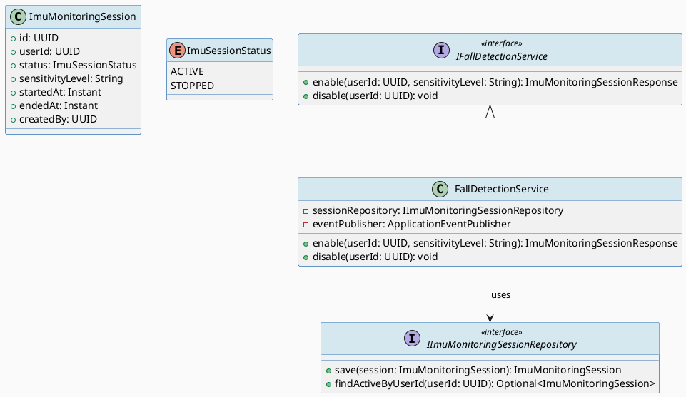
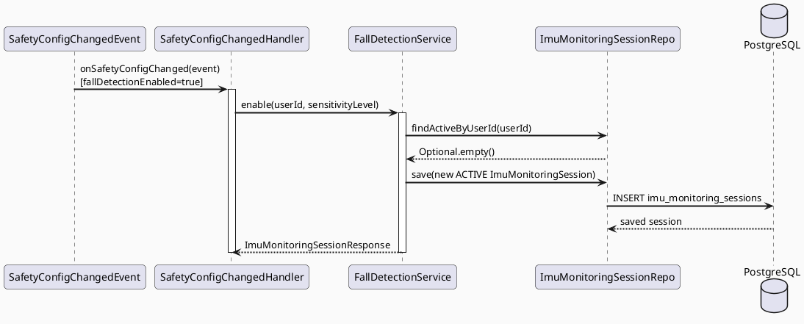
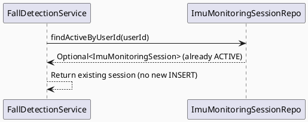
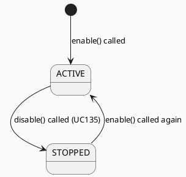

# ENGINEERING DOCUMENTATION STANDARD (EDS) v2.0
# UC134 — Enable Fall Detection

| Field | Value |
|-------|-------|
| **Document ID** | `CB-SAFETY-IMP-002` |
| **Version** | `1.0` |
| **Date** | `2026-06-26` |
| **Status** | `Implemented` |
| **Document Owner** | `AI Agent` |
| **Author** | `AI Agent — Tech Lead` |
| **Reviewed by** | `[ ] Pending` |
| **DPO Sign-off** | `[ ] Pending` *(bắt buộc — module PII: wearable IMU session data)* |
| **Approved by** | `[ ] Pending` |
| **Last Review** | `2026-06-26` |
| **Based on EDS** | `v2.0` |

---

## CHANGELOG

| Ngày | Người thực hiện | Nội dung thay đổi |
|------|-----------------|-------------------|
| 2026-06-26 | AI Agent — Tech Lead | Tạo tài liệu lần đầu — TDS cho UC134 Enable Fall Detection |

---

## MỤC LỤC

1. [Tổng quan Module](#1-tổng-quan-module)
2. [Ma trận Truy vết (Traceability Matrix)](#2-ma-trận-truy-vết-traceability-matrix)
3. [Architecture Decision Records (ADR)](#3-architecture-decision-records-adr)
4. [Non-Functional Requirements & SLA](#4-non-functional-requirements--sla)
5. [Static Modeling (Mô hình Tĩnh)](#5-static-modeling-mô-hình-tĩnh)
6. [Dynamic Modeling (Mô hình Động)](#6-dynamic-modeling-mô-hình-động)
7. [Domain Event Catalog](#7-domain-event-catalog)
8. [Interface Specification (Đặc tả Giao diện)](#8-interface-specification-đặc-tả-giao-diện)
9. [API Specification](#9-api-specification)
10. [Bảng mã lỗi (Error Codes)](#10-bảng-mã-lỗi-error-codes)
11. [Quy trình Triển khai (Step-by-Step)](#11-quy-trình-triển-khai-step-by-step)
12. [Rollback & Incident Runbook](#12-rollback--incident-runbook)
13. [Kịch bản Kiểm thử Chi tiết](#13-kịch-bản-kiểm-thử-chi-tiết)
14. [Phương pháp Xác minh](#14-phương-pháp-xác-minh)
15. [Mẫu thử thực tế (API Verification Samples)](#15-mẫu-thử-thực-tế-api-verification-samples)
16. [Bảng tổng hợp phân quyền (Authorization Matrix)](#16-bảng-tổng-hợp-phân-quyền-authorization-matrix)
17. [AI Prompt Constraints (CASE 2.0)](#17-ai-prompt-constraints-case-20)

---

## 1. Tổng quan Module

> UC134 bật tính năng Fall Detection bằng cách tạo `imu_monitoring_sessions` (V39) với status ACTIVE. Được trigger bởi: (1) user bật thủ công qua UC133 (fallDetectionEnabled=true), hoặc (2) `SafetyConfigChanged` event. Khi ACTIVE, device sẽ gửi IMU data để UC136 phân tích.

| Field | Value |
|-------|-------|
| **Module Name** | `Enable Fall Detection` |
| **Bounded Context** | `safety` |
| **Data Classification** | `PII` *(IMU monitoring session metadata)* |
| **Compliance Scope** | `PDPA / Luật 91/2025` |
| **Upstream Dependencies** | `UC133 SafetyConfigChanged event, IAM (JWT), Wearable device` |
| **Downstream Consumers** | `UC136 DetectSuspectedFallOrImpact, UC135 DisableFallDetection` |

---

## 2. Ma trận Truy vết (Traceability Matrix)

| Requirement ID | Loại (BR/ADR/US) | Mô tả yêu cầu | Thành phần Code | Compliance Target | ADR liên quan |
|----------------|------------------|---------------|-----------------|-------------------|---------------|
| SRS-3.3.4.2 | User Story | Mother bật fall detection; hệ thống tạo IMU monitoring session | `FallDetectionService.enable()` | — | ADR-SAFETY-003 |
| BR-SAFETY-005 | Business Rule | Chỉ 1 ACTIVE IMU session per user tại 1 thời điểm | `FallDetectionService` | — | ADR-SAFETY-003 |
| BR-SAFETY-006 | Business Rule | Trigger bởi SafetyConfigChanged(fallDetectionEnabled=true) | `SafetyConfigChangedHandler` | — | ADR-SAFETY-003 |
| ADR-SAFETY-003 | Decision | Trigger từ SafetyConfigChanged event (fallDetectionEnabled=true) | `SafetyConfigChangedHandler` | — | — |

---

## 3. Architecture Decision Records (ADR)

### ADR-SAFETY-003 — Enable Fall Detection triggered by SafetyConfigChanged event

| Field | Value |
|-------|-------|
| **Status** | `Accepted` |
| **Deciders** | `AI Agent — Tech Lead` |
| **Date** | `2026-06-26` |
| **Supersedes** | `—` |

#### Bối cảnh (Context)
UC134 nên trigger tự động khi UC133 config được bật, không cần user action thêm.

#### Quyết định (Decision)
`@EventListener(SafetyConfigChanged)` → nếu `fallDetectionEnabled=true` → `FallDetectionService.enable()`.

#### Hệ quả (Consequences)

**Tích cực:**
- Decoupled từ UC133; user không cần bấm nút "enable" riêng

**Tiêu cực / Trade-offs:**
- Phải handle race condition nếu multiple events arrive

**Compliance Impact:**
- IMU session là PII — cần DPO sign-off

---

## 4. Non-Functional Requirements & SLA

### 4.1. Performance & Availability

| Category | Requirement | Target SLA | Measurement Method | Compliance Basis |
|----------|-------------|------------|---------------------|------------------|
| Latency | Enable IMU session | `< 500ms` | APM trace | — |
| Availability | Fall detection uptime | `99.9%` | Uptime monitor | — |

### 4.2. Data Integrity & Retention

| Category | Requirement | Target | Verification Method | Compliance Basis |
|----------|-------------|--------|---------------------|------------------|
| Consistency | 1 ACTIVE session per user | 100% | Unique index | — |
| Retention | IMU session logs | 5 năm | DB backup | PDPA |

---

## 5. Static Modeling (Mô hình Tĩnh)

### 5.1. Class Diagram (PlantUML)



### 5.2. Data Structure (Flyway SQL Migration)

Tạo file: `src/main/resources/db/migration/V39__create_imu_monitoring_sessions.sql`

```sql
-- === SAFETY: IMU MONITORING SESSIONS SCHEMA ===

CREATE TABLE imu_monitoring_sessions (
  id                UUID          PRIMARY KEY DEFAULT gen_random_uuid(),
  user_id           UUID          NOT NULL,
  status            VARCHAR(10)   NOT NULL DEFAULT 'ACTIVE',
  sensitivity_level VARCHAR(10)   NOT NULL DEFAULT 'MEDIUM',
  started_at        TIMESTAMPTZ   NOT NULL DEFAULT NOW(),
  ended_at          TIMESTAMPTZ,                              -- NULL when ACTIVE
  created_by        UUID          NOT NULL,

  CONSTRAINT fk_imu_user FOREIGN KEY (user_id) REFERENCES users(id),
  CONSTRAINT chk_imu_status CHECK (status IN ('ACTIVE','STOPPED')),
  CONSTRAINT chk_imu_sensitivity CHECK (sensitivity_level IN ('LOW','MEDIUM','HIGH'))
);

CREATE INDEX idx_imu_sessions_user_id ON imu_monitoring_sessions(user_id);
CREATE INDEX idx_imu_sessions_active ON imu_monitoring_sessions(user_id, status) WHERE status = 'ACTIVE';
```

---

## 6. Dynamic Modeling (Mô hình Động)

### 6.1. Sequence Diagram — Happy Path (PlantUML)



### 6.2. Sequence Diagram — Already ACTIVE



### 6.3. State Machine



---

## 7. Domain Event Catalog

### 7.1. Events Published (Phát ra)

| Event Name | Trigger | Publisher | Subscriber(s) | Payload Schema | Async? |
|------------|---------|-----------|---------------|----------------|--------|
| `FallDetectionEnabled` | ACTIVE session created | `FallDetectionService` | `Mobile device (start IMU)` | `FallDetectionEnabled.java` | Yes |

### 7.2. Events Consumed (Tiêu thụ)

| Event Name | Source | Handler | Action thực hiện |
|------------|--------|---------|------------------|
| `SafetyConfigChanged` | `UC133` | `SafetyConfigChangedHandler` | Call enable() if fallDetectionEnabled=true |

---

## 8. Interface Specification (Đặc tả Giao diện)

### 8.1. Service Interface

```java
// IFallDetectionService.java
// @version 1.0
public interface IFallDetectionService {
    /**
     * Enable fall detection for a user — creates ACTIVE IMU monitoring session.
     * Idempotent: returns existing ACTIVE session if one exists.
     * @throws AccessDeniedException (SAFETY-004) if not ROLE_MOTHER
     */
    ImuMonitoringSessionResponse enable(UUID userId, String sensitivityLevel);

    /**
     * Disable fall detection — sets ACTIVE session to STOPPED.
     */
    void disable(UUID userId);
}
```

### 8.2. Repository Interface

```java
// IImuMonitoringSessionRepository.java
// @version 1.0
public interface IImuMonitoringSessionRepository extends JpaRepository<ImuMonitoringSession, UUID> {
    Optional<ImuMonitoringSession> findActiveByUserId(UUID userId);
    // Custom query: WHERE user_id=? AND status='ACTIVE'
    @Query("SELECT s FROM ImuMonitoringSession s WHERE s.userId = :userId AND s.status = 'ACTIVE'")
    Optional<ImuMonitoringSession> findActiveByUserId(@Param("userId") UUID userId);
}
```

---

## 9. API Specification

### 9.1. Endpoints Table

| Method | Path | Auth Level | Required Roles | Rate Limit | Idempotent? |
|--------|------|------------|----------------|------------|-------------|
| `POST` | `/api/v1/safety/fall-detection/enable` | JWT Bearer | `ROLE_MOTHER` | 10/min | Yes |
| `GET` | `/api/v1/safety/fall-detection/status` | JWT Bearer | `ROLE_MOTHER` | 60/min | Yes |

### 9.2. Request / Response Schemas

**Response — 201 Created (new session):**
```json
{
  "sessionId": "uuid-v4",
  "status": "ACTIVE",
  "sensitivityLevel": "MEDIUM",
  "startedAt": "2026-06-26T08:00:00.000Z"
}
```

---

## 10. Bảng mã lỗi (Error Codes)

| Code | HTTP Status | Message (EN) | Message (VI) | Trigger Condition |
|------|-------------|--------------|--------------|-------------------|
| `SAFETY-004` | 403 | Insufficient permissions | Không đủ quyền | Not ROLE_MOTHER |
| `SAFETY-005` | 503 | Service unavailable | Dịch vụ không khả dụng | DB temporarily unavailable |

---

## 11. Quy trình Triển khai (Step-by-Step)

### 11.1. Prerequisites

- [ ] UC133 safety_monitoring_config tồn tại (V38 applied)
- [ ] ADR-SAFETY-003 Accepted
- [ ] DPO sign-off (IMU session PII)

### 11.2. Pre-Migration Checklist

- [ ] Đã backup DB
- [ ] Migration V39 chạy thành công trên staging

### 11.3. Implementation Steps

#### Chặng 1 — Migration V39
```bash
./mvnw flyway:migrate
```

#### Chặng 2 — Implement ImuMonitoringSession entity + Repository
```java
// ImuMonitoringSession.java trong com.carebridge.safety.entity
```

#### Chặng 3 — Implement FallDetectionService
```java
// FallDetectionService.java trong com.carebridge.safety.service
// Idempotent: check findActiveByUserId() trước khi INSERT
```

#### Chặng 4 — Implement SafetyConfigChangedHandler
```java
// SafetyConfigChangedHandler.java
// @EventListener(SafetyConfigChanged.class)
// if event.payload.fallDetectionEnabled → enable(); else → disable()
```

### 11.4. Deployment Checklist

- [ ] V39 migration thành công
- [ ] IMU session được tạo sau khi UC133 sets fallDetectionEnabled=true
- [ ] FallDetectionEnabled event published

---

## 12. Rollback & Incident Runbook

### 12.1. Điều kiện kích hoạt Rollback

| Điều kiện | Ngưỡng | Người quyết định |
|-----------|--------|------------------|
| IMU session không được tạo | Bất kỳ case nào | On-call Engineer |
| Multiple ACTIVE sessions per user | Bất kỳ case nào | On-call Engineer |

### 12.2. Rollback Procedure

```bash
psql -h $DB_HOST -U $DB_USER -d carebridge \
  -c "DROP TABLE IF EXISTS imu_monitoring_sessions CASCADE;"
psql -h $DB_HOST -U $DB_USER -d carebridge \
  -c "DELETE FROM flyway_schema_history WHERE version = '39';"
kubectl rollout undo deployment/carebridge-api
```

### 12.3. Notification Protocol

| Thời điểm | Người nhận | Kênh | Template |
|-----------|------------|------|----------|
| IMU failure | On-call | Slack `#incident` | "🚨 FALL-DETECTION DOWN: [mô tả]" |

### 12.4. Post-Incident Review (PIR)

- **Timeline / Root Cause / Impact / Remediation / Prevention**

---

## 13. Kịch bản Kiểm thử Chi tiết

### 13.1. Unit Tests

```gherkin
Feature: Enable Fall Detection
  Background:
    Given test data classification: SYNTHETIC

  Scenario: Enable — no existing ACTIVE session
    Given user không có ACTIVE IMU session
    When FallDetectionService.enable() được gọi
    Then imu_monitoring_sessions có 1 record ACTIVE
    And FallDetectionEnabled event published

  Scenario: Enable — already ACTIVE → return existing (idempotent)
    Given user đã có ACTIVE IMU session
    When FallDetectionService.enable() được gọi lần 2
    Then KHÔNG INSERT session mới
    And trả session hiện tại

  Scenario: SafetyConfigChanged (enabled=true) → enable() triggered
    Given SafetyConfigChanged event với fallDetectionEnabled=true
    When event được published
    Then FallDetectionService.enable() được gọi
```

### 13.2. Integration Tests

```gherkin
  Scenario: Full flow — UC133 PUT → SafetyConfigChanged → IMU session created
    Given Testcontainers PostgreSQL, V38 + V39 applied
    When PUT /api/v1/safety/config với fallDetectionEnabled=true
    Then imu_monitoring_sessions có record ACTIVE cho user
```

---

## 14. Phương pháp Xác minh

```sql
-- Verify ACTIVE session
SELECT id, status, sensitivity_level, started_at
FROM imu_monitoring_sessions
WHERE user_id = '[uuid]' AND status = 'ACTIVE';

-- Verify only 1 ACTIVE per user
SELECT count(*) FROM imu_monitoring_sessions
WHERE user_id = '[uuid]' AND status = 'ACTIVE';
-- Expected: 1
```

---

## 15. Mẫu thử thực tế (API Verification Samples)

```bash
# Enable fall detection manually
curl -X POST https://$HOST/api/v1/safety/fall-detection/enable \
  -H "Authorization: Bearer $MOTHER_JWT"
```

---

## 16. Bảng tổng hợp phân quyền (Authorization Matrix)

| Endpoint | `GUEST` | `ROLE_MOTHER` | `ROLE_PARTNER` | `ROLE_EXPERT` | `ROLE_ADMIN` |
|----------|---------|---------------|----------------|---------------|--------------|
| `POST /api/v1/safety/fall-detection/enable` | ❌ | ✅ Own | ❌ | ❌ | ✅ All |
| `GET /api/v1/safety/fall-detection/status` | ❌ | ✅ Own | ❌ | ❌ | ✅ All |

---

## 17. AI Prompt Constraints (CASE 2.0)

### 17.1 Constraint Summary Table

| # | Constraint | Source (ADR/BR) | Last Verified |
|---|-----------|-----------------|---------------|
| C1 | Idempotent: check findActiveByUserId() — nếu ACTIVE tồn tại → return it, no INSERT | `ADR-SAFETY-003 / BR-SAFETY-005` | `2026-06-26` |
| C2 | Trigger từ SafetyConfigChanged (fallDetectionEnabled=true) — KHÔNG phải từ trực tiếp POST | `ADR-SAFETY-003 / BR-SAFETY-006` | `2026-06-26` |
| C3 | FallDetectionEnabled event PHẢI publish sau khi session ACTIVE created | `UC136 upstream requirement` | `2026-06-26` |
| C4 | sensitivityLevel từ SafetyConfig — KHÔNG từ hardcode | `ADR-SAFETY-003` | `2026-06-26` |
| C5 | disable() = set status=STOPPED; KHÔNG DELETE record | `Append-only audit` | `2026-06-26` |

### 17.2 Constraint Injection Block

```
[CONSTRAINT BLOCK — Module: Enable Fall Detection — CB-SAFETY-IMP-002]

1. Idempotent: findActiveByUserId() — return existing ACTIVE if exists (ADR-SAFETY-003/BR-SAFETY-005)
2. Trigger từ @EventListener(SafetyConfigChanged) khi fallDetectionEnabled=true (ADR-SAFETY-003)
3. Publish FallDetectionEnabled event sau khi ACTIVE session created (UC136 req)
4. sensitivityLevel từ SafetyConfig — không hardcode (ADR-SAFETY-003)
5. disable() = SET status=STOPPED; KHÔNG DELETE (append-only)

[CONTEXT BLOCK] Bounded Context: safety | PII | PDPA
[TASK BLOCK] Implement FallDetectionService.enable() + disable() + SafetyConfigChangedHandler
```

### 17.3 Constraint Quality Checklist

- [x] Mỗi constraint traceable
- [x] Không generic
- [x] Last Verified ≤ 2 sprints
- [x] ≥ 3 constraints (có 5)
- [x] Reference §8 và §16

### 17.4 Anti-Pattern Detection

| AP-ID | Anti-Pattern | Dấu hiệu | Hành động |
|-------|-------------|-----------|----------|
| AP-AI-001 | Unconstrained Gen | Code không check idempotency | Reject — enforce C1 |
| AP-AI-003 | Implicit Decision | Code add HTTP trigger not in ADR | Reject — enforce C2 |

---

## PHỤ LỤC

### A. Glossary

| Thuật ngữ | Định nghĩa |
|-----------|------------|
| IMU | Inertial Measurement Unit — cảm biến gia tốc/con quay hồi chuyển trên điện thoại/wearable |
| Fall Detection | Phát hiện ngã dựa trên IMU data |
| ACTIVE Session | Phiên giám sát đang hoạt động — IMU data đang được thu thập |

### B. Tài liệu tham chiếu

| Document | Link / Path |
|----------|-------------|
| SRS UC-134 | `02_Requirements/SRS/Functional_Specifications.md §3.3.4.2` |
| UC133 TDS | `04_Implement/UC133_ConfigureSafetyMonitoring/UC133_ConfigureSafetyMonitoring_TDS.md` |
| EDS v2.0 Template | `08_References/Template/PHASE-3_TDS.md` |
