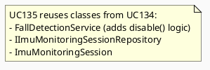
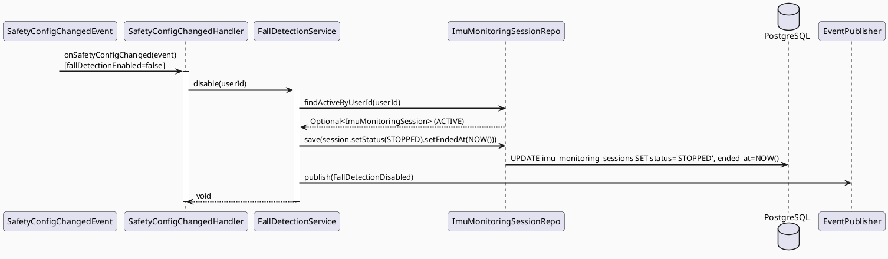
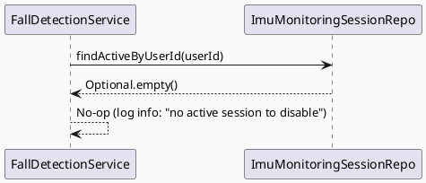
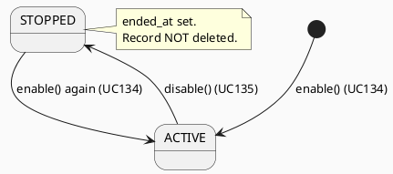

# ENGINEERING DOCUMENTATION STANDARD (EDS) v2.0
# UC135 — Disable Fall Detection

| Field | Value |
|-------|-------|
| **Document ID** | `CB-SAFETY-IMP-003` |
| **Version** | `1.0` |
| **Date** | `2026-06-26` |
| **Status** | `Implemented` |
| **Document Owner** | `AI Agent` |
| **Author** | `AI Agent — Tech Lead` |
| **Reviewed by** | `[ ] Pending` |
| **DPO Sign-off** | `[ ] Pending` |
| **Approved by** | `[ ] Pending` |
| **Last Review** | `2026-06-26` |
| **Based on EDS** | `v2.0` |

---

## CHANGELOG

| Ngày | Người thực hiện | Nội dung thay đổi |
|------|-----------------|-------------------|
| 2026-06-26 | AI Agent — Tech Lead | Tạo tài liệu lần đầu — TDS cho UC135 Disable Fall Detection |

---

## MỤC LỤC

1. [Tổng quan Module](#1-tổng-quan-module)
2. [Ma trận Truy vết (Traceability Matrix)](#2-ma-trận-truy-vết-traceability-matrix)
3. [Architecture Decision Records (ADR)](#3-architecture-decision-records-adr)
4. [Non-Functional Requirements & SLA](#4-non-functional-requirements--sla)
5. [Static Modeling (Mô hình Tĩnh)](#5-static-modeling-mô-hình-tĩnh)
6. [Dynamic Modeling (Mô hình Động)](#6-dynamic-modeling-mô-hình-động)
7. [Domain Event Catalog](#7-domain-event-catalog)
8. [Interface Specification (Đặc tả Giao diện)](#8-interface-specification-đặc-tả-giao-diện)
9. [API Specification](#9-api-specification)
10. [Bảng mã lỗi (Error Codes)](#10-bảng-mã-lỗi-error-codes)
11. [Quy trình Triển khai (Step-by-Step)](#11-quy-trình-triển-khai-step-by-step)
12. [Rollback & Incident Runbook](#12-rollback--incident-runbook)
13. [Kịch bản Kiểm thử Chi tiết](#13-kịch-bản-kiểm-thử-chi-tiết)
14. [Phương pháp Xác minh](#14-phương-pháp-xác-minh)
15. [Mẫu thử thực tế (API Verification Samples)](#15-mẫu-thử-thực-tế-api-verification-samples)
16. [Bảng tổng hợp phân quyền (Authorization Matrix)](#16-bảng-tổng-hợp-phân-quyền-authorization-matrix)
17. [AI Prompt Constraints (CASE 2.0)](#17-ai-prompt-constraints-case-20)

---

## 1. Tổng quan Module

> UC135 tắt tính năng Fall Detection bằng cách set `imu_monitoring_sessions.status = STOPPED`. **Không có migration mới** — sử dụng table V39 từ UC134. Được trigger bởi `SafetyConfigChanged(fallDetectionEnabled=false)` hoặc user action thủ công.

| Field | Value |
|-------|-------|
| **Module Name** | `Disable Fall Detection` |
| **Bounded Context** | `safety` |
| **Data Classification** | `PII` |
| **Compliance Scope** | `PDPA / Luật 91/2025` |
| **Upstream Dependencies** | `UC133 SafetyConfigChanged event (fallDetectionEnabled=false), UC134 (imu_monitoring_sessions table)` |
| **Downstream Consumers** | `UC136 DetectSuspectedFallOrImpact (stops receiving data)` |

---

## 2. Ma trận Truy vết (Traceability Matrix)

| Requirement ID | Loại (BR/ADR/US) | Mô tả yêu cầu | Thành phần Code | Compliance Target | ADR liên quan |
|----------------|------------------|---------------|-----------------|-------------------|---------------|
| SRS-3.3.4.3 | User Story | Mother tắt fall detection | `FallDetectionService.disable()` | — | ADR-SAFETY-004 |
| BR-SAFETY-007 | Business Rule | disable() set status=STOPPED; KHÔNG xóa record | `ImuMonitoringSessionRepository` | PDPA (audit) | ADR-SAFETY-004 |
| BR-SAFETY-008 | Business Rule | Nếu không có ACTIVE session, disable() là no-op | `FallDetectionService.disable()` | — | ADR-SAFETY-004 |
| BR-SAFETY-009 | Business Rule | Trigger từ SafetyConfigChanged(fallDetectionEnabled=false) | `SafetyConfigChangedHandler` | — | ADR-SAFETY-004 |
| ADR-SAFETY-004 | Decision | Append-only: disable() = STOPPED (no DELETE) | `FallDetectionService` | PDPA | — |

---

## 3. Architecture Decision Records (ADR)

### ADR-SAFETY-004 — Append-only: disable() = STOPPED, no DELETE

| Field | Value |
|-------|-------|
| **Status** | `Accepted` |
| **Deciders** | `AI Agent — Tech Lead` |
| **Date** | `2026-06-26` |
| **Supersedes** | `—` |

#### Bối cảnh (Context)
IMU session records là audit trail. Xóa record sẽ mất lịch sử giám sát.

#### Quyết định (Decision)
`disable()` = `UPDATE imu_monitoring_sessions SET status='STOPPED', ended_at=NOW()`. Không DELETE.

#### Hệ quả (Consequences)

**Tích cực:**
- Audit trail đầy đủ — biết khi nào fall detection bắt đầu và kết thúc

**Tiêu cực / Trade-offs:**
- DB tăng dần — giảm thiểu bằng archiving policy

**Compliance Impact:**
- PDPA: audit trail bắt buộc cho safety monitoring data

---

## 4. Non-Functional Requirements & SLA

### 4.1. Performance & Availability

| Category | Requirement | Target SLA | Measurement Method | Compliance Basis |
|----------|-------------|------------|---------------------|------------------|
| Latency | disable() response | `< 300ms` | APM trace | — |
| Reliability | No missed disable | 99.9% | Event delivery monitoring | — |

### 4.2. Data Integrity & Retention

| Category | Requirement | Target | Verification Method | Compliance Basis |
|----------|-------------|--------|---------------------|------------------|
| Audit trail | imu_monitoring_sessions never deleted | 100% | DB inspection | PDPA |
| ended_at | Set on STOPPED | 100% | Query | — |

---

## 5. Static Modeling (Mô hình Tĩnh)

### 5.1. Class Diagram (PlantUML)



> UC135 không tạo class mới — chỉ implement `disable()` method trong `FallDetectionService` (đã khai báo trong UC134 §8.1).

### 5.2. Data Structure (Flyway SQL Migration)

> **Không có migration mới.** UC135 sử dụng `imu_monitoring_sessions` table từ V39 (UC134).

---

## 6. Dynamic Modeling (Mô hình Động)

### 6.1. Sequence Diagram — Happy Path (PlantUML)



### 6.2. Sequence Diagram — No ACTIVE session (no-op)



### 6.3. State Machine



---

## 7. Domain Event Catalog

### 7.1. Events Published (Phát ra)

| Event Name | Trigger | Publisher | Subscriber(s) | Payload Schema | Async? |
|------------|---------|-----------|---------------|----------------|--------|
| `FallDetectionDisabled` | Session set to STOPPED | `FallDetectionService` | `Mobile device (stop IMU)` | `FallDetectionDisabled.java` | Yes |

### 7.2. Events Consumed (Tiêu thụ)

| Event Name | Source | Handler | Action thực hiện |
|------------|--------|---------|------------------|
| `SafetyConfigChanged` | `UC133` | `SafetyConfigChangedHandler` | Call disable() if fallDetectionEnabled=false |

---

## 8. Interface Specification (Đặc tả Giao diện)

### 8.1. Service Interface

> `disable()` đã được khai báo trong `IFallDetectionService` (UC134 §8.1).

```java
// IFallDetectionService.java (từ UC134)
// @version 1.0
public interface IFallDetectionService {
    ImuMonitoringSessionResponse enable(UUID userId, String sensitivityLevel);

    /**
     * Disable fall detection — set ACTIVE session to STOPPED.
     * No-op if no ACTIVE session exists.
     * @throws AccessDeniedException (SAFETY-004) if not ROLE_MOTHER
     */
    void disable(UUID userId);
}
```

### 8.2. Repository Interface

> Không thay đổi từ UC134 — `IImuMonitoringSessionRepository` đã có `findActiveByUserId()`.

---

## 9. API Specification

### 9.1. Endpoints Table

| Method | Path | Auth Level | Required Roles | Rate Limit | Idempotent? |
|--------|------|------------|----------------|------------|-------------|
| `POST` | `/api/v1/safety/fall-detection/disable` | JWT Bearer | `ROLE_MOTHER` | 10/min | Yes |

### 9.2. Request / Response Schemas

**Response — 200 OK (session stopped):**
```json
{
  "message": "Fall detection disabled",
  "sessionId": "uuid-v4",
  "status": "STOPPED",
  "endedAt": "2026-06-26T09:00:00.000Z"
}
```

**Response — 200 OK (no active session — no-op):**
```json
{
  "message": "No active fall detection session",
  "status": "NOT_ACTIVE"
}
```

---

## 10. Bảng mã lỗi (Error Codes)

| Code | HTTP Status | Message (EN) | Message (VI) | Trigger Condition |
|------|-------------|--------------|--------------|-------------------|
| `SAFETY-004` | 403 | Insufficient permissions | Không đủ quyền | Not ROLE_MOTHER |

---

## 11. Quy trình Triển khai (Step-by-Step)

### 11.1. Prerequisites

- [ ] UC134 deployed (imu_monitoring_sessions table, FallDetectionService.enable() implemented)
- [ ] ADR-SAFETY-004 Accepted

### 11.2. Pre-Migration Checklist

> **Không có migration.** UC135 chỉ implement `disable()` trong FallDetectionService.

### 11.3. Implementation Steps

#### Chặng 1 — Implement disable() trong FallDetectionService

```java
// FallDetectionService.java
// @Override
// public void disable(UUID userId) {
//   Optional<ImuMonitoringSession> active = repo.findActiveByUserId(userId);
//   if (active.isEmpty()) { log.info("no active session"); return; }
//   ImuMonitoringSession session = active.get();
//   session.setStatus(ImuSessionStatus.STOPPED);
//   session.setEndedAt(Instant.now());
//   repo.save(session);
//   publisher.publishEvent(new FallDetectionDisabled(...));
// }
```

#### Chặng 2 — Wire SafetyConfigChangedHandler cho disable()

```java
// SafetyConfigChangedHandler.java — add else branch
// if (event.payload.fallDetectionEnabled) → enable()
// else → disable()
```

### 11.4. Deployment Checklist

- [ ] disable() sets status=STOPPED (not delete)
- [ ] FallDetectionDisabled event published
- [ ] No-op case handled (no active session)

---

## 12. Rollback & Incident Runbook

### 12.1. Điều kiện kích hoạt Rollback

| Điều kiện | Ngưỡng | Người quyết định |
|-----------|--------|------------------|
| disable() xóa record thay vì STOPPED | Bất kỳ case nào | Tech Lead + DPO |

### 12.2. Rollback Procedure

```bash
# Không có migration để rollback
# Chỉ revert code
kubectl rollout undo deployment/carebridge-api
kubectl rollout status deployment/carebridge-api
```

### 12.3. Notification Protocol

| Thời điểm | Người nhận | Kênh |
|-----------|------------|------|
| Record bị xóa (PDPA violation) | DPO ngay lập tức | Email CRITICAL |

---

## 13. Kịch bản Kiểm thử Chi tiết

### 13.1. Unit Tests

```gherkin
Feature: Disable Fall Detection
  Background:
    Given test data classification: SYNTHETIC

  Scenario: disable() khi có ACTIVE session
    Given user có ACTIVE IMU session
    When FallDetectionService.disable(userId) được gọi
    Then session.status = STOPPED
    And session.endedAt != null
    And record KHÔNG bị xóa
    And FallDetectionDisabled event published

  Scenario: disable() khi KHÔNG có ACTIVE session — no-op
    Given user KHÔNG có ACTIVE IMU session
    When FallDetectionService.disable(userId) được gọi
    Then NO exception thrown
    And repo.save() NOT called

  Scenario: SafetyConfigChanged (enabled=false) → disable() triggered
    Given SafetyConfigChanged event với fallDetectionEnabled=false
    When event published
    Then FallDetectionService.disable() được gọi
```

### 13.2. Integration Tests

```gherkin
  Scenario: disable() với Testcontainers PostgreSQL
    Given V39 applied; ACTIVE session exists in DB
    When POST /api/v1/safety/fall-detection/disable
    Then imu_monitoring_sessions record status = 'STOPPED'
    And ended_at != null
    And record count = 1 (no new insert)
```

### 13.3. E2E / Security Tests

```gherkin
  Scenario: ROLE_PARTNER không được disable
    Given JWT với ROLE_PARTNER
    When POST /api/v1/safety/fall-detection/disable
    Then response 403 SAFETY-004
```

---

## 14. Phương pháp Xác minh

### 14.1. Database Inspection

```sql
-- Verify record STOPPED (không bị xóa)
SELECT id, status, ended_at FROM imu_monitoring_sessions
WHERE user_id = '[uuid]' AND status = 'STOPPED';

-- Verify record NOT deleted
SELECT count(*) FROM imu_monitoring_sessions
WHERE user_id = '[uuid]';
-- Expected: ≥ 1 (record still exists)
```

---

## 15. Mẫu thử thực tế (API Verification Samples)

```bash
# Disable fall detection
curl -X POST https://$HOST/api/v1/safety/fall-detection/disable \
  -H "Authorization: Bearer $MOTHER_JWT"
```

**Expected (200):**
```json
{
  "message": "Fall detection disabled",
  "status": "STOPPED",
  "endedAt": "2026-06-26T09:00:00.000Z"
}
```

---

## 16. Bảng tổng hợp phân quyền (Authorization Matrix)

| Endpoint | `GUEST` | `ROLE_MOTHER` | `ROLE_PARTNER` | `ROLE_EXPERT` | `ROLE_ADMIN` |
|----------|---------|---------------|----------------|---------------|--------------|
| `POST /api/v1/safety/fall-detection/disable` | ❌ | ✅ Own | ❌ | ❌ | ✅ All |

---

## 17. AI Prompt Constraints (CASE 2.0)

### 17.1 Constraint Summary Table

| # | Constraint | Source (ADR/BR) | Last Verified |
|---|-----------|-----------------|---------------|
| C1 | disable() = SET status=STOPPED + endedAt=NOW(); KHÔNG DELETE | `ADR-SAFETY-004 / BR-SAFETY-007` | `2026-06-26` |
| C2 | Nếu không có ACTIVE session → no-op (không throw exception) | `BR-SAFETY-008` | `2026-06-26` |
| C3 | FallDetectionDisabled event PHẢI publish sau khi STOPPED | `UC136 stop requirement` | `2026-06-26` |
| C4 | Trigger từ SafetyConfigChanged(false) qua handler | `ADR-SAFETY-004 / BR-SAFETY-009` | `2026-06-26` |

### 17.2 Constraint Injection Block

```
[CONSTRAINT BLOCK — Module: Disable Fall Detection — CB-SAFETY-IMP-003]

1. disable() = SET status=STOPPED, endedAt=NOW() — KHÔNG DELETE record (ADR-SAFETY-004/BR-SAFETY-007)
2. No ACTIVE session → no-op; log info; KHÔNG throw exception (BR-SAFETY-008)
3. FallDetectionDisabled event published sau khi STOPPED (UC136 req)
4. Trigger từ @EventListener SafetyConfigChanged khi fallDetectionEnabled=false (BR-SAFETY-009)

[CONTEXT BLOCK] Bounded Context: safety | PII | PDPA
[TASK BLOCK] Implement FallDetectionService.disable() + SafetyConfigChangedHandler disable branch
```

### 17.3 Constraint Quality Checklist

- [x] Constraints traceable
- [x] Không generic
- [x] ≥ 3 constraints (có 4)
- [x] Reference §8 và §16

### 17.4 Anti-Pattern Detection

| AP-ID | Anti-Pattern | Dấu hiệu | Hành động |
|-------|-------------|-----------|----------|
| AP-AI-001 | Unconstrained Gen | Code DELETE record | Reject — enforce C1 |
| AP-AI-003 | Implicit Decision | No-op throws exception | Reject — enforce C2 |

---

## PHỤ LỤC

### A. Glossary

| Thuật ngữ | Định nghĩa |
|-----------|------------|
| STOPPED | Trạng thái IMU session đã kết thúc — không nhận data nữa |
| No-op | Không thực hiện hành động — return bình thường mà không throw exception |
| Append-only | Không xóa record — chỉ cập nhật trạng thái |

### B. Tài liệu tham chiếu

| Document | Link / Path |
|----------|-------------|
| SRS UC-135 | `02_Requirements/SRS/Functional_Specifications.md §3.3.4.3` |
| UC134 TDS | `04_Implement/UC134_EnableFallDetection/UC134_EnableFallDetection_TDS.md` |
| EDS v2.0 Template | `08_References/Template/PHASE-3_TDS.md` |
