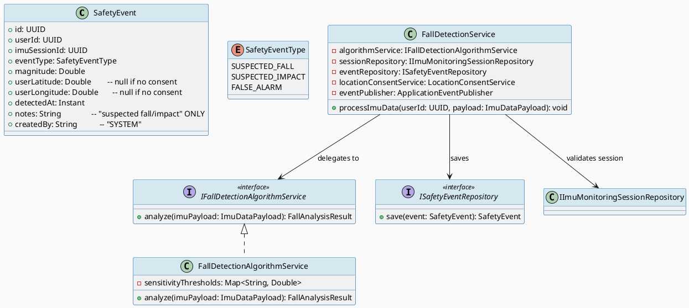
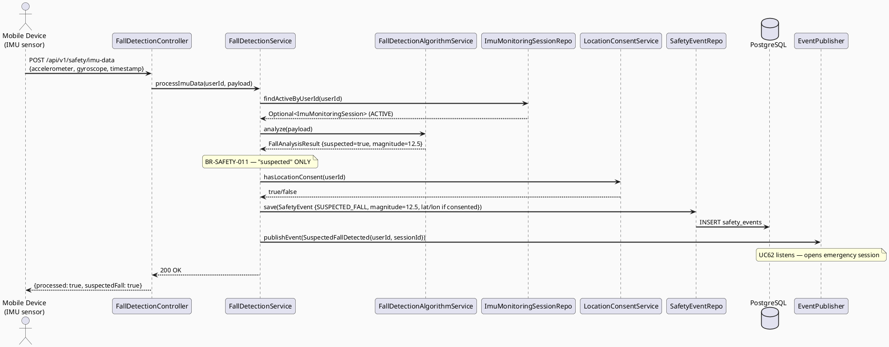
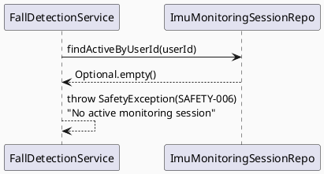
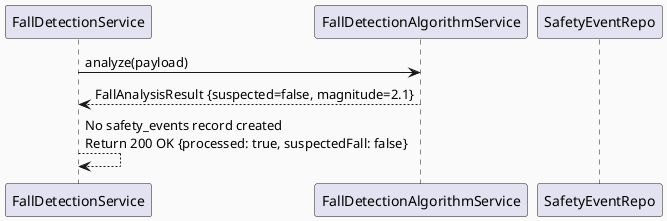

# ENGINEERING DOCUMENTATION STANDARD (EDS) v2.0
# UC136 — Detect Suspected Fall or Impact

| Field | Value |
|-------|-------|
| **Document ID** | `CB-SAFETY-IMP-004` |
| **Version** | `1.0` |
| **Date** | `2026-06-26` |
| **Status** | `Implemented` |
| **Document Owner** | `AI Agent` |
| **Author** | `AI Agent — Tech Lead` |
| **Reviewed by** | `[ ] Pending` |
| **DPO Sign-off** | `[ ] Pending` *(bắt buộc — module PII: IMU data, location)* |
| **Approved by** | `[ ] Pending` |
| **Last Review** | `2026-06-26` |
| **Based on EDS** | `v2.0` |

---

## CHANGELOG

| Ngày | Người thực hiện | Nội dung thay đổi |
|------|-----------------|-------------------|
| 2026-06-26 | AI Agent — Tech Lead | Tạo tài liệu lần đầu — TDS cho UC136 Detect Suspected Fall or Impact |

---

## MỤC LỤC

1. [Tổng quan Module](#1-tổng-quan-module)
2. [Ma trận Truy vết (Traceability Matrix)](#2-ma-trận-truy-vết-traceability-matrix)
3. [Architecture Decision Records (ADR)](#3-architecture-decision-records-adr)
4. [Non-Functional Requirements & SLA](#4-non-functional-requirements--sla)
5. [Static Modeling (Mô hình Tĩnh)](#5-static-modeling-mô-hình-tĩnh)
6. [Dynamic Modeling (Mô hình Động)](#6-dynamic-modeling-mô-hình-động)
7. [Domain Event Catalog](#7-domain-event-catalog)
8. [Interface Specification (Đặc tả Giao diện)](#8-interface-specification-đặc-tả-giao-diện)
9. [API Specification](#9-api-specification)
10. [Bảng mã lỗi (Error Codes)](#10-bảng-mã-lỗi-error-codes)
11. [Quy trình Triển khai (Step-by-Step)](#11-quy-trình-triển-khai-step-by-step)
12. [Rollback & Incident Runbook](#12-rollback--incident-runbook)
13. [Kịch bản Kiểm thử Chi tiết](#13-kịch-bản-kiểm-thử-chi-tiết)
14. [Phương pháp Xác minh](#14-phương-pháp-xác-minh)
15. [Mẫu thử thực tế (API Verification Samples)](#15-mẫu-thử-thực-tế-api-verification-samples)
16. [Bảng tổng hợp phân quyền (Authorization Matrix)](#16-bảng-tổng-hợp-phân-quyền-authorization-matrix)
17. [AI Prompt Constraints (CASE 2.0)](#17-ai-prompt-constraints-case-20)

---

## 1. Tổng quan Module

> UC136 nhận IMU sensor data từ mobile device, xử lý qua `FallDetectionAlgorithmService` để phát hiện ngã/va chạm, tạo `safety_events` record (V40), và nếu phát hiện → kích hoạt UC62 emergency flow. **BR-SAFETY**: AI NEVER diagnoses — chỉ phát hiện "suspected fall/impact", không kết luận về tình trạng sức khỏe.

| Field | Value |
|-------|-------|
| **Module Name** | `Detect Suspected Fall or Impact` |
| **Bounded Context** | `safety` |
| **Data Classification** | `Sensitive-PII` *(IMU data, location)* |
| **Compliance Scope** | `PDPA / Luật 91/2025` |
| **Upstream Dependencies** | `UC134 (active IMU session), Mobile IMU sensor, IAM (JWT)` |
| **Downstream Consumers** | `UC62 OpenEmergencyFlow, Family alert (via UC62→UC65)` |

---

## 2. Ma trận Truy vết (Traceability Matrix)

| Requirement ID | Loại (BR/ADR/US) | Mô tả yêu cầu | Thành phần Code | Compliance Target | ADR liên quan |
|----------------|------------------|---------------|-----------------|-------------------|---------------|
| SRS-3.3.4.4 | User Story | Hệ thống phát hiện ngã/va chạm từ IMU data; kích hoạt emergency nếu cần | `FallDetectionAlgorithmService` | — | ADR-SAFETY-005 |
| BR-SAFETY-010 | Business Rule | Chỉ xử lý khi có ACTIVE IMU session cho user | `FallDetectionService` | — | ADR-SAFETY-005 |
| BR-SAFETY-011 | **CRITICAL** | AI NEVER diagnoses — chỉ "suspected fall" không phải "diagnosed fall" | `FallDetectionAlgorithmService` | BR-SAFETY | ADR-SAFETY-005 |
| BR-SAFETY-012 | Business Rule | Location optional — chỉ đưa vào payload nếu consent=true | `FallDetectionService` | PDPA | ADR-SAFETY-005 |
| BR-SAFETY-013 | Business Rule | safety_events là append-only; không chỉnh sửa sau khi lưu | `SafetyEventRepository` | PDPA audit | ADR-SAFETY-005 |
| BR-SAFETY-014 | Business Rule | Phát hiện ngã → trigger UC62 EmergencyEscalationTriggered event | `FallDetectionService` | — | ADR-SAFETY-005 |

---

## 3. Architecture Decision Records (ADR)

### ADR-SAFETY-005 — Fall detection là "suspected" only; triggers UC62 without AI diagnosis

| Field | Value |
|-------|-------|
| **Status** | `Accepted` |
| **Deciders** | `AI Agent — Tech Lead, DPO` |
| **Date** | `2026-06-26` |
| **Supersedes** | `—` |

#### Bối cảnh (Context)
IMU sensor đọc accelerometer/gyroscope data. Hệ thống phải phân biệt "suspected fall" (threshold breach) với "diagnosis" (clinical). Healthcare safety rule: AI không được kết luận clinical outcome.

#### Quyết định (Decision)
- `FallDetectionAlgorithmService` chỉ apply **threshold algorithm** (không AI model) dựa trên accelerometer magnitude.
- Output: `eventType = SUSPECTED_FALL` (không phải CONFIRMED_FALL / DIAGNOSED_FALL).
- Nếu vượt threshold: lưu `safety_events` record → publish `SuspectedFallDetected` event → UC62 picks up.

#### Hệ quả (Consequences)

**Tích cực:**
- Tuân thủ BR-SAFETY-011 (không chẩn đoán)
- Threshold algorithm deterministic và testable

**Tiêu cực / Trade-offs:**
- False positives (bình thường bước nhanh có thể trigger) — cần sensitivity tuning

**Compliance Impact:**
- BR-SAFETY-011: "suspected" language bắt buộc trong mọi response/event payload
- PDPA: IMU data + location cần DPO sign-off

---

### ADR-SAFETY-006 — V40 safety_events: append-only, no update/delete

| Field | Value |
|-------|-------|
| **Status** | `Accepted` |
| **Deciders** | `AI Agent — Tech Lead` |
| **Date** | `2026-06-26` |
| **Supersedes** | `—` |

#### Quyết định (Decision)
`safety_events` table là immutable audit log. Không có UPDATE/DELETE endpoints.

---

## 4. Non-Functional Requirements & SLA

### 4.1. Performance & Availability

| Category | Requirement | Target SLA | Measurement Method | Compliance Basis |
|----------|-------------|------------|---------------------|------------------|
| Latency | IMU event processing | `< 1000ms` | APM trace | — |
| Latency (detection to alert) | Fall detected → UC62 triggered | `< 2000ms` | End-to-end trace | — |
| Availability | Fall detection uptime | `99.9%` | Uptime monitor | — |

### 4.2. Data Integrity & Retention

| Category | Requirement | Target | Verification Method | Compliance Basis |
|----------|-------------|--------|---------------------|------------------|
| Immutability | safety_events không bị sửa/xóa | 100% | DB constraint | PDPA |
| Retention | safety_events logs | 7 năm | DB backup | PDPA Healthcare |

---

## 5. Static Modeling (Mô hình Tĩnh)

### 5.1. Class Diagram (PlantUML)



### 5.2. Data Structure (Flyway SQL Migration)

Tạo file: `src/main/resources/db/migration/V40__create_safety_events.sql`

```sql
-- === SAFETY: SAFETY EVENTS SCHEMA (append-only) ===

CREATE TABLE safety_events (
  id              UUID          PRIMARY KEY DEFAULT gen_random_uuid(),
  user_id         UUID          NOT NULL,
  imu_session_id  UUID          NOT NULL,
  event_type      VARCHAR(20)   NOT NULL,
  magnitude       NUMERIC(10,4) NOT NULL,
  user_latitude   NUMERIC(10,7),                          -- NULL if no consent
  user_longitude  NUMERIC(10,7),                          -- NULL if no consent
  detected_at     TIMESTAMPTZ   NOT NULL DEFAULT NOW(),
  notes           TEXT,                                   -- "suspected fall/impact" language only
  created_by      VARCHAR(50)   NOT NULL DEFAULT 'SYSTEM',

  CONSTRAINT fk_safety_event_user    FOREIGN KEY (user_id) REFERENCES users(id),
  CONSTRAINT fk_safety_event_session FOREIGN KEY (imu_session_id) REFERENCES imu_monitoring_sessions(id),
  CONSTRAINT chk_safety_event_type   CHECK (event_type IN ('SUSPECTED_FALL','SUSPECTED_IMPACT','FALSE_ALARM'))
);

CREATE INDEX idx_safety_events_user_id ON safety_events(user_id);
CREATE INDEX idx_safety_events_detected_at ON safety_events(detected_at DESC);

-- Append-only: revoke UPDATE/DELETE from app user
REVOKE UPDATE, DELETE ON safety_events FROM carebridge_app;
```

---

## 6. Dynamic Modeling (Mô hình Động)

### 6.1. Sequence Diagram — Happy Path: Suspected Fall Detected (PlantUML)



### 6.2. Sequence Diagram — No ACTIVE Session (Reject)



### 6.3. Sequence Diagram — Below Threshold (Not a Fall)



---

## 7. Domain Event Catalog

### 7.1. Events Published (Phát ra)

| Event Name | Trigger | Publisher | Subscriber(s) | Payload Schema | Async? |
|------------|---------|-----------|---------------|----------------|--------|
| `SuspectedFallDetected` | magnitude > threshold | `FallDetectionService` | `UC62 EmergencySessionService` | `SuspectedFallDetected.java` | Yes |

### 7.2. Events Consumed (Tiêu thụ)

| Event Name | Source | Handler | Action thực hiện |
|------------|--------|---------|------------------|
| `FallDetectionEnabled` | `UC134` | `FallDetectionService` | Allow IMU data processing |
| `FallDetectionDisabled` | `UC135` | `FallDetectionService` | Reject IMU data (SAFETY-006) |

---

## 8. Interface Specification (Đặc tả Giao diện)

### 8.1. Service Interface

```java
// IFallDetectionAlgorithmService.java
// @version 1.0
// CRITICAL: "suspected" language only — BR-SAFETY-011
public interface IFallDetectionAlgorithmService {
    /**
     * Analyze IMU data for suspected fall/impact.
     * Returns FallAnalysisResult with suspected=true/false.
     * NEVER returns diagnosis, NEVER returns health status.
     * Language must use "suspected fall/impact" only.
     */
    FallAnalysisResult analyze(ImuDataPayload payload);
}

// FallAnalysisResult.java
record FallAnalysisResult(
    boolean suspected,           // true = suspected fall/impact
    SafetyEventType eventType,   // SUSPECTED_FALL | SUSPECTED_IMPACT
    double magnitude             // accelerometer magnitude
) {}

// ImuDataPayload.java (from mobile device)
record ImuDataPayload(
    double accelerometerX,
    double accelerometerY,
    double accelerometerZ,
    double gyroscopeX,
    double gyroscopeY,
    double gyroscopeZ,
    Instant timestamp,
    Double latitude,             // null if no consent
    Double longitude             // null if no consent
) {}
```

### 8.2. Repository Interface

```java
// ISafetyEventRepository.java
// @version 1.0
public interface ISafetyEventRepository extends JpaRepository<SafetyEvent, UUID> {
    // Append-only: no update/delete methods exposed
    List<SafetyEvent> findByUserIdOrderByDetectedAtDesc(UUID userId, Pageable pageable);
}
```

---

## 9. API Specification

### 9.1. Endpoints Table

| Method | Path | Auth Level | Required Roles | Rate Limit | Idempotent? |
|--------|------|------------|----------------|------------|-------------|
| `POST` | `/api/v1/safety/imu-data` | JWT Bearer | `ROLE_MOTHER` | 60/min (IMU stream) | No |
| `GET` | `/api/v1/safety/events` | JWT Bearer | `ROLE_MOTHER, ROLE_ADMIN` | 30/min | Yes |

### 9.2. Request / Response Schemas

**POST /api/v1/safety/imu-data — Request:**
```json
{
  "accelerometerX": 9.8,
  "accelerometerY": -1.2,
  "accelerometerZ": 0.5,
  "gyroscopeX": 0.01,
  "gyroscopeY": 0.02,
  "gyroscopeZ": -0.01,
  "timestamp": "2026-06-26T08:00:00.000Z",
  "latitude": 10.762622,
  "longitude": 106.660172
}
```

**POST /api/v1/safety/imu-data — Response (fall detected):**
```json
{
  "processed": true,
  "suspectedFall": true,
  "magnitude": 12.5,
  "eventId": "uuid-v4",
  "message": "Suspected fall detected. Emergency alert initiated."
}
```

**POST /api/v1/safety/imu-data — Response (no fall):**
```json
{
  "processed": true,
  "suspectedFall": false,
  "magnitude": 2.1
}
```

---

## 10. Bảng mã lỗi (Error Codes)

| Code | HTTP Status | Message (EN) | Message (VI) | Trigger Condition |
|------|-------------|--------------|--------------|-------------------|
| `SAFETY-006` | 409 | No active monitoring session | Không có phiên giám sát đang hoạt động | No ACTIVE IMU session for user |
| `SAFETY-007` | 422 | Invalid IMU payload | Dữ liệu IMU không hợp lệ | Missing required sensor fields |
| `SAFETY-004` | 403 | Insufficient permissions | Không đủ quyền | Not ROLE_MOTHER |
| `SAFETY-008` | 503 | Fall detection service unavailable | Dịch vụ phát hiện ngã không khả dụng | Algorithm service failure |

---

## 11. Quy trình Triển khai (Step-by-Step)

### 11.1. Prerequisites

- [ ] UC134 deployed (imu_monitoring_sessions table, ACTIVE session management)
- [ ] UC135 deployed (disable logic)
- [ ] UC62 deployed (emergency session — SuspectedFallDetected consumer)
- [ ] ADR-SAFETY-005 và ADR-SAFETY-006 Accepted
- [ ] DPO sign-off (IMU data + location is Sensitive-PII)

### 11.2. Pre-Migration Checklist

- [ ] Đã backup DB
- [ ] V40 migration reviewed (REVOKE UPDATE/DELETE)
- [ ] DBA xác nhận REVOKE được thực thi đúng

### 11.3. Implementation Steps

#### Chặng 1 — Migration V40

```bash
./mvnw flyway:migrate
# Verify REVOKE applied:
# \dp safety_events -- PostgreSQL
```

#### Chặng 2 — Implement SafetyEvent entity + ISafetyEventRepository

#### Chặng 3 — Implement FallDetectionAlgorithmService (threshold-based)

```java
// Threshold: accelerometer magnitude > sensitivityThreshold
// magnitude = sqrt(x² + y² + z²) - 9.81 (gravity)
// LOW:     threshold = 15.0 m/s²
// MEDIUM:  threshold = 12.0 m/s²
// HIGH:    threshold =  9.0 m/s²
```

#### Chặng 4 — Implement FallDetectionService.processImuData()

```java
// 1. Validate ACTIVE session exists
// 2. Analyze via algorithmService
// 3. If suspected: check location consent, create SafetyEvent, publish SuspectedFallDetected
// 4. Return result
```

#### Chặng 5 — Implement FallDetectionController POST /api/v1/safety/imu-data

### 11.4. Deployment Checklist

- [ ] V40 migration thành công
- [ ] REVOKE UPDATE/DELETE verified
- [ ] FallDetectionAlgorithmService returns "suspected" language only
- [ ] SuspectedFallDetected event triggers UC62

---

## 12. Rollback & Incident Runbook

### 12.1. Điều kiện kích hoạt Rollback

| Điều kiện | Ngưỡng | Người quyết định |
|-----------|--------|------------------|
| False positive rate > 10% | > 10% alerts/hour | Tech Lead |
| Location included without consent | Bất kỳ case nào | DPO ngay lập tức |
| Emergency triggered without ACTIVE session | Bất kỳ case nào | On-call Engineer |

### 12.2. Rollback Procedure

```bash
psql -h $DB_HOST -U $DB_USER -d carebridge \
  -c "DROP TABLE IF EXISTS safety_events CASCADE;"
psql -h $DB_HOST -U $DB_USER -d carebridge \
  -c "DELETE FROM flyway_schema_history WHERE version = '40';"
kubectl rollout undo deployment/carebridge-api
```

### 12.3. PDPA Incident: Location leakage

```
IMMEDIATE ACTIONS (within 1 hour):
1. DPO notification
2. Block POST /api/v1/safety/imu-data via feature flag
3. Audit safety_events for consent=false + location not null
4. Report per PDPA §37 within 72h
```

### 12.4. Post-Incident Review (PIR)

- **Timeline / Root Cause / Impact / Remediation / Prevention**

---

## 13. Kịch bản Kiểm thử Chi tiết

### 13.1. Unit Tests

```gherkin
Feature: Detect Suspected Fall or Impact
  Background:
    Given test data classification: SYNTHETIC

  Scenario: IMU magnitude > threshold → SUSPECTED_FALL
    Given ACTIVE IMU session; accelerometer magnitude = 14.0 (> MEDIUM threshold 12.0)
    When FallDetectionService.processImuData() được gọi
    Then safety_events record created với eventType=SUSPECTED_FALL
    And SuspectedFallDetected event published

  Scenario: IMU magnitude < threshold → not a fall
    Given ACTIVE IMU session; magnitude = 3.0
    When FallDetectionService.processImuData() được gọi
    Then NO safety_events record created
    And NO event published
    And response suspectedFall=false

  Scenario: No ACTIVE session → SAFETY-006
    Given user KHÔNG có ACTIVE IMU session
    When POST /api/v1/safety/imu-data
    Then HTTP 409 SAFETY-006

  Scenario: PDPA — location null when consent=false
    Given consent=false; magnitude > threshold
    When processImuData() được gọi
    Then safety_events record: userLatitude=NULL, userLongitude=NULL

  Scenario: PDPA — location set when consent=true
    Given consent=true; latitude=10.76, longitude=106.66; magnitude > threshold
    When processImuData() được gọi
    Then safety_events record: userLatitude=10.76, userLongitude=106.66
```

### 13.2. Integration Tests

```gherkin
  Scenario: Full flow với Testcontainers (V39 + V40)
    Given Testcontainers PostgreSQL; ACTIVE IMU session
    When POST /api/v1/safety/imu-data với magnitude=14.0
    Then safety_events record inserted
    And SuspectedFallDetected event captured
    And UC62 EmergencySession created (if wired)
```

---

## 14. Phương pháp Xác minh

```sql
-- Verify safety_events append-only
SELECT table_name, privilege_type
FROM information_schema.role_table_grants
WHERE table_name = 'safety_events'
  AND grantee = 'carebridge_app';
-- Expected: SELECT, INSERT only (no UPDATE, DELETE)

-- Verify suspected fall record
SELECT id, event_type, magnitude, user_latitude, user_longitude, notes
FROM safety_events
WHERE user_id = '[uuid]'
ORDER BY detected_at DESC LIMIT 1;
-- Expected: event_type='SUSPECTED_FALL', notes contains "suspected" language
```

---

## 15. Mẫu thử thực tế (API Verification Samples)

```bash
# Submit IMU data
curl -X POST https://$HOST/api/v1/safety/imu-data \
  -H "Authorization: Bearer $MOTHER_JWT" \
  -H "Content-Type: application/json" \
  -d '{
    "accelerometerX": 12.5, "accelerometerY": 5.2, "accelerometerZ": -8.1,
    "gyroscopeX": 0.5, "gyroscopeY": 0.3, "gyroscopeZ": -0.2,
    "timestamp": "2026-06-26T08:00:00Z"
  }'
```

---

## 16. Bảng tổng hợp phân quyền (Authorization Matrix)

| Endpoint | `GUEST` | `ROLE_MOTHER` | `ROLE_PARTNER` | `ROLE_EXPERT` | `ROLE_ADMIN` |
|----------|---------|---------------|----------------|---------------|--------------|
| `POST /api/v1/safety/imu-data` | ❌ | ✅ Own | ❌ | ❌ | ❌ |
| `GET /api/v1/safety/events` | ❌ | ✅ Own | ❌ | ❌ | ✅ All |

---

## 17. AI Prompt Constraints (CASE 2.0)

### 17.1 Constraint Summary Table

| # | Constraint | Source (ADR/BR) | Last Verified |
|---|-----------|-----------------|---------------|
| C1 | **CRITICAL** "suspected fall/impact" ONLY — KHÔNG CHẨN ĐOÁN lâm sàng | `BR-SAFETY-011 / ADR-SAFETY-005` | `2026-06-26` |
| C2 | Chỉ xử lý khi có ACTIVE IMU session — không có → SAFETY-006 (409) | `BR-SAFETY-010` | `2026-06-26` |
| C3 | Location: chỉ lưu vào safety_events khi consent=true — NULL nếu consent=false | `BR-SAFETY-012 / PDPA` | `2026-06-26` |
| C4 | safety_events là append-only — không UPDATE/DELETE sau khi INSERT | `ADR-SAFETY-006 / BR-SAFETY-013` | `2026-06-26` |
| C5 | SuspectedFallDetected event → UC62 (KHÔNG gọi UC62 trực tiếp) | `BR-SAFETY-014 / ADR-SAFETY-005` | `2026-06-26` |
| C6 | Threshold-based algorithm KHÔNG dùng AI model — deterministic | `ADR-SAFETY-005` | `2026-06-26` |

### 17.2 Constraint Injection Block

```
[CONSTRAINT BLOCK — Module: Detect Suspected Fall or Impact — CB-SAFETY-IMP-004]

1. CRITICAL: "suspected fall/impact" language ONLY — không diagnose, không "confirmed fall" (BR-SAFETY-011)
2. Validate ACTIVE IMU session trước khi process — không có → 409 SAFETY-006 (BR-SAFETY-010)
3. Location: null if consent=false; only set if consent=true (BR-SAFETY-012/PDPA)
4. safety_events: append-only — INSERT only, no UPDATE/DELETE (ADR-SAFETY-006/BR-SAFETY-013)
5. On suspected fall: publish SuspectedFallDetected event → UC62 picks up (BR-SAFETY-014)
6. Algorithm: threshold-based (magnitude > threshold) — không dùng ML model (ADR-SAFETY-005)

[CONTEXT BLOCK] Bounded Context: safety | Sensitive-PII | PDPA | BR-SAFETY
[TASK BLOCK] Implement FallDetectionAlgorithmService + processImuData() + V40 migration
```

### 17.3 Constraint Quality Checklist

- [x] Constraints traceable
- [x] Không generic — đặc thù UC136
- [x] Last Verified ≤ 2 sprints
- [x] ≥ 3 constraints (có 6)
- [x] Reference §8 và §16

### 17.4 Anti-Pattern Detection

| AP-ID | Anti-Pattern | Dấu hiệu | Hành động |
|-------|-------------|-----------|----------|
| AP-AI-001 | Healthcare Overreach | notes = "User has fallen" thay vì "suspected fall" | **BLOCK** — BR-SAFETY-011 |
| AP-AI-002 | ML model dùng Gemini | AI call trong FallDetectionAlgorithmService | Reject — ADR-SAFETY-005 (threshold only) |
| AP-AI-003 | Location leakage | latitude saved khi consent=false | **BLOCK** — PDPA C3 |
| AP-AI-004 | Direct UC62 call | Service calls UC62 không qua event | Reject — enforce C5 |

---

## PHỤ LỤC

### A. Glossary

| Thuật ngữ | Định nghĩa |
|-----------|------------|
| IMU | Inertial Measurement Unit — cảm biến gia tốc kế + con quay hồi chuyển |
| Magnitude | sqrt(ax² + ay² + az²) - 9.81 m/s² (gravity subtracted) |
| Suspected Fall | Fall event được phát hiện bởi threshold algorithm — KHÔNG phải clinical diagnosis |
| PDPA | Personal Data Protection Act — Luật Bảo vệ Dữ liệu Cá nhân (Luật 91/2025) |

### B. Algorithm Detail

| Sensitivity | Threshold (m/s²) | Notes |
|-------------|-----------------|-------|
| LOW | 15.0 | Ít nhạy — chỉ trigger khi ngã mạnh |
| MEDIUM | 12.0 | Default |
| HIGH | 9.0 | Nhạy nhất — trigger cả va chạm nhẹ |

### C. Tài liệu tham chiếu

| Document | Link / Path |
|----------|-------------|
| SRS UC-136 | `02_Requirements/SRS/Functional_Specifications.md §3.3.4.4` |
| UC134 TDS | `04_Implement/UC134_EnableFallDetection/UC134_EnableFallDetection_TDS.md` |
| UC62 TDS | `04_Implement/UC62_OpenEmergencyFlow/UC62_OpenEmergencyFlow_TDS.md` |
| EDS v2.0 Template | `08_References/Template/PHASE-3_TDS.md` |
