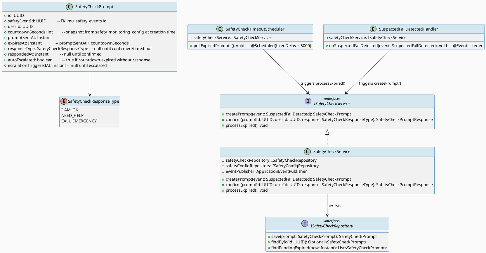
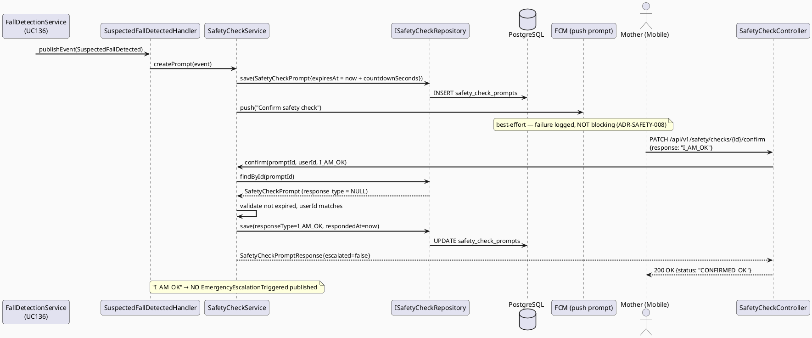
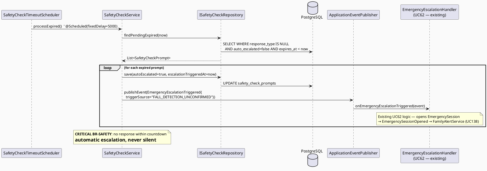
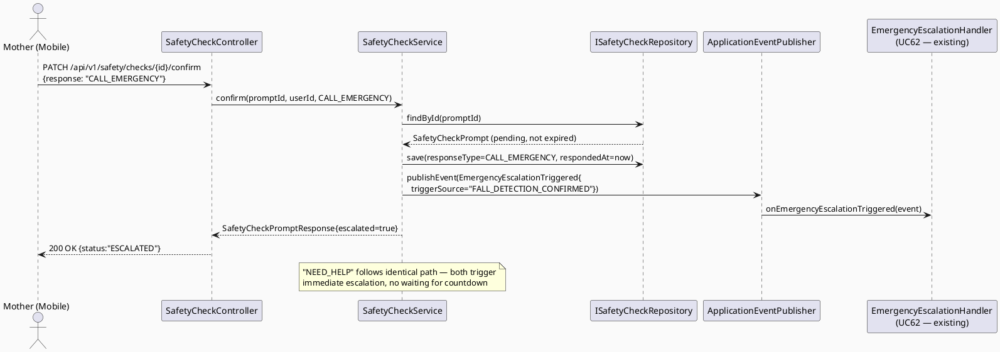
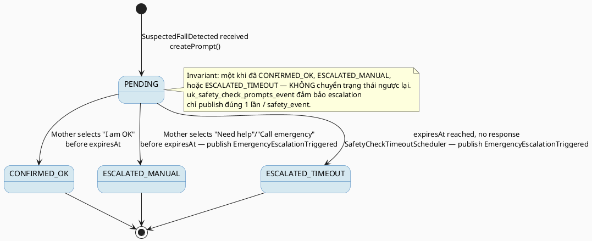

# ENGINEERING DOCUMENTATION STANDARD (EDS) v2.0
# UC137 — Confirm Safety Check

| Field | Value |
|-------|-------|
| **Document ID** | `CB-SAFETY-IMP-005` |
| **Version** | `1.0` |
| **Date** | `2026-07-02` |
| **Status** | `Draft` |
| **Document Owner** | `AI Agent` |
| **Author** | `AI Agent — Technical Architect` |
| **Reviewed by** | `[ ] Pending` |
| **DPO Sign-off** | `[ ] Pending` *(bắt buộc — module xử lý location + emergency contact PII)* |
| **Approved by** | `[ ] Pending` |
| **Last Review** | `2026-07-02` |
| **Based on EDS** | `v2.0` |

---

## CHANGELOG

| Ngày | Người thực hiện | Nội dung thay đổi |
|------|-----------------|-------------------|
| 2026-07-02 | AI Agent — Technical Architect | Tạo tài liệu lần đầu — TDS cho UC137 Confirm Safety Check |
| 2026-07-02 | AI Agent — Technical Architect (reconciliation pass) | Cross-batch schema reconciliation (UC137/138/139/140/141): added explicit reconciliation note in ADR-SAFETY-007 and constraint C5 explaining why UC140's column-level mutation of `imu_safety_events` does NOT contradict UC137's separate-table (`safety_check_prompts`) design — both apply "never silently mutate detection facts" to two different kinds of new state (ephemeral workflow vs. permanent label). Confirmed migration version `V20260705090000` does not collide with UC140's `V20260705100000` or any applied migration. No table/column names changed in this pass — UC137 was already internally consistent with the real schema (`imu_safety_events`, `safety_monitoring_config`). Status remains Draft. |
| 2026-07-03 | AI Agent | **Đóng RG-4:** Product Owner xác nhận `countdown_seconds` mặc định = 30 giây. Cơ chế "retry FCM" xác định là không cần thiết — ADR-SAFETY-008 (Accepted) đã thiết kế countdown chạy server-side, độc lập FCM delivery. Cập nhật §2 traceability, ADR-SAFETY-009, §11.1 Prerequisites, Glossary, và bảng Research Gates (Phụ lục B) từ Open → Resolved. Không thay đổi thiết kế kỹ thuật nào. |

---

## MỤC LỤC

1. [Tổng quan Module](#1-tổng-quan-module)
2. [Ma trận Truy vết (Traceability Matrix)](#2-ma-trận-truy-vết-traceability-matrix)
3. [Architecture Decision Records (ADR)](#3-architecture-decision-records-adr)
4. [Non-Functional Requirements & SLA](#4-non-functional-requirements--sla)
5. [Static Modeling (Mô hình Tĩnh)](#5-static-modeling-mô-hình-tĩnh)
6. [Dynamic Modeling (Mô hình Động)](#6-dynamic-modeling-mô-hình-động)
7. [Domain Event Catalog](#7-domain-event-catalog)
8. [Interface Specification (Đặc tả Giao diện)](#8-interface-specification-đặc-tả-giao-diện)
9. [API Specification](#9-api-specification)
10. [Bảng mã lỗi (Error Codes)](#10-bảng-mã-lỗi-error-codes)
11. [Quy trình Triển khai (Step-by-Step)](#11-quy-trình-triển-khai-step-by-step)
12. [Rollback & Incident Runbook](#12-rollback--incident-runbook)
13. [Kịch bản Kiểm thử Chi tiết](#13-kịch-bản-kiểm-thử-chi-tiết)
14. [Phương pháp Xác minh](#14-phương-pháp-xác-minh)
15. [Mẫu thử thực tế (API Verification Samples)](#15-mẫu-thử-thực-tế-api-verification-samples)
16. [Bảng tổng hợp phân quyền (Authorization Matrix)](#16-bảng-tổng-hợp-phân-quyền-authorization-matrix)
17. [AI Prompt Constraints (CASE 2.0)](#17-ai-prompt-constraints-case-20)

---

## 1. Tổng quan Module

> UC137 là mắt xích còn thiếu giữa UC136 (Detect Suspected Fall or Impact) và luồng emergency đã tồn tại (UC62 `EmergencyService.openFlow()` → UC65 `FamilyAlertService.sendAlert()`, đã implement đầy đủ trong `emergency` bounded context). Khi `SuspectedFallDetected` được publish, KHÔNG có listener nào tiêu thụ event này ở hiện trạng — đây chính là gap UC137 phải lấp. UC137 phải: hiển thị màn hình xác nhận "I am OK / Need help / Call emergency" cho Mother, chạy countdown, và nếu hết hạn hoặc actor chọn "Call emergency"/"Need help" → kích hoạt `EmergencyEscalationTriggered` để `EmergencyEscalationHandler` mở `EmergencySession` (cơ chế đã có, không tạo mới). **BR-SAFETY**: countdown timeout PHẢI auto-send — không được âm thầm im lặng chờ vô thời hạn.

| Field | Value |
|-------|-------|
| **Module Name** | `Confirm Safety Check` |
| **Bounded Context** | `safety` (extends existing package `com.carebridge.backend.safety`) |
| **Data Classification** | `Sensitive-PII` *(liên kết tới safety event + có thể kèm location khi escalate)* |
| **Compliance Scope** | `PDPA / Luật 91/2025` |
| **Upstream Dependencies** | `UC136 DetectSuspectedFallOrImpact (SuspectedFallDetected event, imu_safety_events)`, `safety_monitoring_config`, `IAM (JWT)` |
| **Downstream Consumers** | `com.carebridge.backend.ai.event.EmergencyEscalationTriggered` → `EmergencyEscalationHandler` (UC62, đã tồn tại) → `EmergencySessionOpened` → `FamilyAlertService` (UC138/UC65, đã tồn tại) |

---

## 2. Ma trận Truy vết (Traceability Matrix)

| Requirement ID | Loại (BR/ADR/US) | Mô tả yêu cầu | Thành phần Code | Compliance Target | ADR liên quan |
|----------------|------------------|---------------|-----------------|-------------------|---------------|
| SRS-3.3.4.5 | User Story | Hỏi Mother xác nhận "I am OK / Need help / Call emergency" trước khi auto-alert gửi | `SafetyCheckController`, `SafetyCheckService` | — | ADR-SAFETY-007 |
| BR-RBAC | Business Rule | Chỉ Mother sở hữu `safety_event` mới được confirm; không actor khác | `SafetyCheckService.confirm()` | — | ADR-SAFETY-007 |
| BR-SAFETY (critical) | **CRITICAL** | Nếu Mother KHÔNG phản hồi trong countdown → hệ thống PHẢI tự động escalate — không được delay/im lặng | `SafetyCheckTimeoutScheduler` | BR-SAFETY | ADR-SAFETY-007 |
| BR-SAFETY | Business Rule | AI/hệ thống KHÔNG được tự chẩn đoán tình trạng Mother — chỉ ghi nhận lựa chọn actor | `SafetyCheckService` | BR-SAFETY | ADR-SAFETY-005 (kế thừa UC136) |
| RG-4 (Resolved 2026-07-03) | Research Gap | Cơ chế retry khi FCM gửi confirm-prompt thất bại: đã giải quyết qua ADR-SAFETY-008 (countdown chạy server-side, độc lập FCM, nên không cần retry riêng); giá trị `countdown_seconds=30` mặc định: CONFIRMED bởi Product Owner | `SafetyCheckService` | — | ADR-SAFETY-008, ADR-SAFETY-009 |

---

## 3. Architecture Decision Records (ADR)

### ADR-SAFETY-007 — SuspectedFallDetected triggers a confirm-countdown gate before emergency escalation

| Field | Value |
|-------|-------|
| **Status** | `Accepted` |
| **Deciders** | `AI Agent — Technical Architect` |
| **Date** | `2026-07-02` |
| **Supersedes** | `—` |

#### Bối cảnh (Context)
UC136 publishes `SuspectedFallDetected` nhưng hiện KHÔNG có consumer nào lắng nghe event này trong codebase (`EmergencyEscalationHandler` chỉ lắng nghe `com.carebridge.backend.ai.event.EmergencyEscalationTriggered`, phát ra từ domain `ai`/triage). Nếu escalate ngay lập tức mỗi khi có suspected fall (false positive rate cao theo ADR-SAFETY-005 mục Trade-offs), Mother sẽ nhận cảnh báo/gọi gia đình không cần thiết, gây "alert fatigue" — vi phạm nguyên tắc UX an toàn. SRS §3.3.4.5 mô tả rõ: hệ thống phải hỏi xác nhận TRƯỚC khi auto-alert.

#### Các phương án đã xem xét (Options Considered)

| Phương án | Mô tả | Ưu điểm | Nhược điểm |
|-----------|-------|----------|------------|
| A | Escalate ngay khi `SuspectedFallDetected`, bỏ qua confirm | Đơn giản, latency thấp | Alert fatigue cao, không đúng SRS §3.3.4.5 |
| B | Confirm-gate: tạo `SafetyCheckPrompt` (countdown), nếu actor xác nhận hoặc hết giờ → publish `EmergencyEscalationTriggered` | Đúng SRS, tái sử dụng UC62/UC65 sẵn có, giảm false positive impact | Cần thêm state (countdown) và scheduler |
| C | Confirm đồng bộ (blocking call chờ actor) | Không cần scheduler | Không khả thi — mobile có thể mất kết nối, vi phạm "never delay emergency routing" |

#### Quyết định (Decision)
Chọn **Phương án B**. `SafetyCheckService` lắng nghe `SuspectedFallDetected` (UC136), tạo bản ghi countdown gắn với `imu_safety_events.id` hiện có (không tạo entity trùng lặp), expose API confirm cho Mother, và dùng scheduled task để phát hiện countdown hết hạn → publish `com.carebridge.backend.ai.event.EmergencyEscalationTriggered` với `triggerSource = "FALL_DETECTION_UNCONFIRMED"` (nếu timeout) hoặc `"FALL_DETECTION_CONFIRMED"` (nếu Mother chọn "Need help"/"Call emergency"). Điều này tái sử dụng nguyên vẹn `EmergencyEscalationHandler` → `EmergencyService.openFlow()` → `EmergencySessionOpened` → `FamilyAlertService.sendAlert()` đã có, không viết lại logic alert (đó là phạm vi UC138).

**Reconciliation with UC140's column-level mutation of `imu_safety_events` (cross-batch consistency check — added during architecture reconciliation, 2026-07-02):** UC140 (`ReportFalsePositiveDetection`) mutates `imu_safety_events` directly (via a narrowly `GRANT`-ed column-level UPDATE on exactly `status`/`false_positive_reason`/`false_positive_reported_at`), which at first glance looks like it contradicts this ADR's decision to keep `imu_safety_events` append-only and put UC137's own workflow state in a separate table (`safety_check_prompts`). **This is not a contradiction.** The append-only invariant this ADR (and UC136's ADR-SAFETY-006) protects is that **the detection facts themselves — `event_type`, `magnitude`, `detected_at`, `user_latitude`, `user_longitude`, `notes`, `created_by` — are immutable**, so the original record of what the IMU sensors detected can always be trusted forensically. It does not mean "no additional column may ever be added to this row by a later, governed migration." UC137 chose a separate table because its state (countdown/confirm workflow) is genuinely a different *kind* of thing — an ephemeral process with its own lifecycle and timestamps spawned BY a detection event, not a property OF the detection event. UC140's false-positive label, by contrast, IS a property of the original detection record (a correction/annotation on it), which is why a scoped, column-level mutation is the more natural design for UC140 specifically — see UC140's TDS §3 ADR-SAFETY-009 reconciliation note for the full symmetric explanation. Both UC137's and UC140's designs enforce "never silently mutate detection facts" — they simply apply that same principle to two different kinds of new state.

#### Hệ quả (Consequences)

**Tích cực:**
- Tuân thủ SRS §3.3.4.5 nguyên văn — hỏi xác nhận trước auto-alert
- Không trùng lặp logic với UC62/UC65 đã implement
- Countdown timeout là fail-safe: mất kết nối / Mother bất tỉnh vẫn escalate
- Coexists cleanly with UC140's column-level mutation of `imu_safety_events` — both are independently justified applications of "never silently mutate detection facts" (see reconciliation note above), not a schema-architecture conflict

**Tiêu cực / Trade-offs:**
- Thêm 1 scheduled job (`@Scheduled` poll hoặc delayed queue) — cần giám sát latency
- Countdown giá trị lấy từ `safety_monitoring_config` hiện KHÔNG có cột — cần migration nhỏ (xem ADR-SAFETY-009)

**Compliance Impact:**
- BR-SAFETY: timeout auto-send là bắt buộc, không tùy chọn tắt được bởi actor (chỉ có thể rút ngắn, không thể vô hiệu hóa) — RG-4 đã Resolved 2026-07-03 (xem §RG-4)

---

### ADR-SAFETY-008 — FCM prompt-delivery failure does not block countdown fail-safe

| Field | Value |
|-------|-------|
| **Status** | `Accepted` |
| **Deciders** | `AI Agent — Technical Architect` |
| **Date** | `2026-07-02` |

#### Bối cảnh (Context)
UC137 secondary actor gồm Firebase Cloud Messaging (đẩy prompt xuống mobile) và ZegoCloud Realtime Service (được liệt kê trong SRS nhưng không có chi tiết kỹ thuật nào khác — không tìm thấy tích hợp ZegoCloud nào liên quan đến safety-check trong codebase hiện tại). Nếu FCM gửi prompt thất bại, Mother có thể không bao giờ thấy màn hình xác nhận.

#### Quyết định (Decision)
- Countdown BẮT ĐẦU tại thời điểm `SuspectedFallDetected` được xử lý (server-side timestamp), KHÔNG phụ thuộc vào việc FCM prompt đã tới thiết bị hay chưa. Điều này đảm bảo fail-safe timeout hoạt động độc lập với tình trạng mạng của Mother — nhất quán với ADR-SAFETY-005/BR-SAFETY "never delay emergency routing".
- FCM gửi thất bại được log nhưng KHÔNG throw/block (theo pattern đã có trong `FamilyAlertService.sendAlert()` — try/catch quanh `fcmNotificationPort.sendBatch()`).
- ZegoCloud Realtime Service: liệt kê trong SRS nhưng không có endpoint/contract nào trong codebase — đánh dấu **Open** (không dùng trong TDS này; nếu cần realtime voice/video call trong lúc countdown, phải là ADR/TDS riêng).

#### Hệ quả (Consequences)

**Tích cực:** Countdown fail-safe hoạt động bất kể trạng thái mạng — an toàn tính mạng ưu tiên trên cùng.

**Tiêu cực / Trade-offs:** Mother có thể bị escalate dù thực ra chỉ mất kết nối tạm thời (false timeout) — chấp nhận được vì đây là an toàn tính mạng, không phải false alert tới family (UC138 vẫn gửi alert đúng, chỉ là Mother có thể chưa kịp confirm).

---

### ADR-SAFETY-009 — countdown_seconds sourced from safety_monitoring_config via new column (schema gap)

| Field | Value |
|-------|-------|
| **Status** | `Accepted` |
| **Deciders** | `AI Agent — Technical Architect` |
| **Date** | `2026-07-02` |

#### Bối cảnh (Context)
Task instructions tham chiếu `safety_monitoring_settings.countdown_seconds` (theo mô tả UC136 TDS trước đó), nhưng khi đối chiếu với schema THỰC TẾ (`V20260627000005__create_safety_monitoring_config.sql`, entity `SafetyMonitoringConfig.java`), bảng thực có tên `safety_monitoring_config` (KHÔNG PHẢI `safety_monitoring_settings`) với các cột: `id, user_id, fall_detection_enabled, sensitivity_level, emergency_auto_alert, updated_at, updated_by`. **KHÔNG có cột `countdown_seconds`** — đây là gap thật sự, không phải giả định.

#### Quyết định (Decision)
Thêm cột `countdown_seconds SMALLINT NOT NULL DEFAULT 30` vào bảng `safety_monitoring_config` hiện có (KHÔNG tạo bảng mới), gộp chung trong CÙNG 1 migration file với việc tạo bảng `safety_check_prompts` — `V20260705090000__create_safety_check_prompts.sql` (xem §5.2 cho SQL đầy đủ; cả 2 thay đổi thuộc cùng 1 file, không phải 2 file riêng, để giữ đúng 1 version number cho toàn bộ scope UC137). Giá trị mặc định `30` giây **CONFIRMED bởi Product Owner (2026-07-03)** — đủ thời gian thao tác chạm màn hình nhưng không quá dài để trì hoãn cấp cứu. Đóng §RG-4 (phần giá trị mặc định).

#### Hệ quả (Consequences)

**Tích cực:** Tận dụng bảng cấu hình đã có, không phá vỡ `SafetyConfigService`/`SafetyConfigController` hiện hành.

**Tiêu cực / Trade-offs:** `SafetyConfigRequest`/`SafetyConfigResponse`/`SafetyConfigMapper` cần mở rộng thêm field `countdownSeconds` — phạm vi nhỏ, không breaking (field mới optional với default).

**Compliance Impact:** Không ảnh hưởng PII scope hiện có.

---

## 4. Non-Functional Requirements & SLA

### 4.1. Performance & Availability

| Category | Requirement | Target SLA | Measurement Method | Compliance Basis |
|----------|-------------|------------|---------------------|------------------|
| Latency | `SuspectedFallDetected` → confirm-prompt persisted | `< 500ms` | APM trace | BR-SAFETY |
| Latency | Countdown-expiry detection → `EmergencyEscalationTriggered` published | `< 2000ms` sau thời điểm hết hạn thực tế | Scheduler poll interval trace | **CRITICAL — BR-SAFETY** |
| Availability | Confirm endpoint uptime | `99.9%` | Uptime monitor | — |
| Scheduler poll interval | `SafetyCheckTimeoutScheduler` | `every 5s` (`fixedDelay`) | Cấu hình `@Scheduled` | BR-SAFETY |

### 4.2. Data Integrity & Retention

| Category | Requirement | Target | Verification Method | Compliance Basis |
|----------|-------------|--------|---------------------|------------------|
| Idempotency | Escalation event chỉ publish đúng 1 lần / safety_event | 100% | DB unique constraint / application check | BR-SAFETY |
| Immutability | `imu_safety_events` không bị sửa fields khác ngoài `notes`/response tracking mới thêm | 100% | DB constraint (REVOKE giữ nguyên, cột mới cho phép UPDATE có kiểm soát) | PDPA |
| Retention | Confirm response log | 7 năm (kế thừa policy `imu_safety_events`) | DB backup | PDPA Healthcare |

---

## 5. Static Modeling (Mô hình Tĩnh)

### 5.1. Class Diagram (PlantUML)



### 5.2. Data Structure (Flyway SQL Migration)

**Logic Issue resolved:** original task brief referenced `safety_monitoring_settings.countdown_seconds` and a `safety_events` table with `user_response`/`response_at` columns. Neither exists in the real codebase. Actual tables are `safety_monitoring_config` (no countdown column) and `imu_safety_events` (append-only, `REVOKE UPDATE, DELETE`, no response-tracking columns). This TDS creates a NEW table `safety_check_prompts` rather than adding response columns to the immutable `imu_safety_events` table, to avoid violating UC136's `REVOKE UPDATE` invariant (ADR-SAFETY-006 equivalent).

Tạo file: `src/main/resources/db/migration/V20260705090000__create_safety_check_prompts.sql`

```sql
-- === SAFETY: CONFIRM SAFETY CHECK (UC137) ===

-- Extend existing config table with countdown (genuine schema gap — ADR-SAFETY-009)
ALTER TABLE safety_monitoring_config
  ADD COLUMN countdown_seconds SMALLINT NOT NULL DEFAULT 30;

-- New table: countdown/confirm state — kept separate from append-only imu_safety_events
CREATE TABLE safety_check_prompts (
  id                     UUID          PRIMARY KEY DEFAULT gen_random_uuid(),
  safety_event_id        UUID          NOT NULL REFERENCES imu_safety_events(id),
  user_id                UUID          NOT NULL,
  countdown_seconds      SMALLINT      NOT NULL,
  prompt_sent_at         TIMESTAMPTZ   NOT NULL DEFAULT NOW(),
  expires_at             TIMESTAMPTZ   NOT NULL,
  response_type          VARCHAR(20),                          -- NULL until responded
  responded_at           TIMESTAMPTZ,
  auto_escalated         BOOLEAN       NOT NULL DEFAULT FALSE,
  escalation_triggered_at TIMESTAMPTZ,
  created_by             VARCHAR(50)   NOT NULL DEFAULT 'SYSTEM',

  CONSTRAINT uk_safety_check_prompts_event UNIQUE (safety_event_id),
  CONSTRAINT chk_safety_check_response CHECK (response_type IS NULL OR response_type IN ('I_AM_OK','NEED_HELP','CALL_EMERGENCY'))
);

CREATE INDEX idx_safety_check_prompts_user_id ON safety_check_prompts(user_id);
CREATE INDEX idx_safety_check_prompts_expires_pending
  ON safety_check_prompts(expires_at)
  WHERE response_type IS NULL AND auto_escalated = FALSE;
```

> **Idempotency note:** `uk_safety_check_prompts_event` guarantees at most one prompt per `safety_event_id` — prevents duplicate escalation if `SuspectedFallDetected` is somehow redelivered.

---

## 6. Dynamic Modeling (Mô hình Động)

### 6.1. Sequence Diagram — Happy Path: Mother confirms "I am OK" (PlantUML)



### 6.2. Sequence Diagram — Countdown Expiry: Auto-Send (CRITICAL fail-safe)



### 6.3. Sequence Diagram — Mother selects "Need help" / "Call emergency" (immediate escalate)



### 6.4. State Machine — SafetyCheckPrompt



> **⚠️ Invariant bất biến:** Countdown timeout LUÔN escalate — không có trạng thái "silently expired without action". Đây là fail-safe cốt lõi (RG-4).

---

## 7. Domain Event Catalog

### 7.1. Events Published (Phát ra)

| Event Name | Trigger | Publisher | Subscriber(s) | Payload Schema | Async? |
|------------|---------|-----------|---------------|----------------|--------|
| `SafetyCheckConfirmed` | Mother chọn "I am OK" trong countdown | `SafetyCheckService` | `SafetyEventHistory` (UC139, future) | `SafetyCheckConfirmed.java` | Yes |
| `com.carebridge.backend.ai.event.EmergencyEscalationTriggered` | Mother chọn "Need help"/"Call emergency" HOẶC countdown hết hạn | `SafetyCheckService` | `EmergencyEscalationHandler` (UC62, đã tồn tại) | đã định nghĩa sẵn trong `ai.event` package | Yes |

### 7.2. Events Consumed (Tiêu thụ)

| Event Name | Source | Handler | Action thực hiện |
|------------|--------|---------|------------------|
| `SuspectedFallDetected` | `UC136 FallDetectionService` | `SuspectedFallDetectedHandler` | Tạo `SafetyCheckPrompt` mới, snapshot `countdown_seconds` từ `safety_monitoring_config`, gửi FCM prompt |

### 7.3. Payload Schema

```java
// SafetyCheckConfirmed.java
public record SafetyCheckConfirmed(
    UUID    eventId,
    UUID    safetyEventId,
    UUID    userId,
    String  responseType,      // "I_AM_OK" | "NEED_HELP" | "CALL_EMERGENCY"
    boolean autoEscalated,     // false when a human responded, true if produced by timeout path
    Instant respondedAt
) {}
```

> **Reused, not reinvented:** escalation payload reuses `com.carebridge.backend.ai.event.EmergencyEscalationTriggered(eventId, sessionId, userId, triggerSource, triggeredAt)`. `sessionId` field is populated with `UUID.randomUUID()` placeholder — `EmergencyEscalationHandler.onEmergencyEscalationTriggered()` does NOT read `event.sessionId()` from the incoming event (verified in `EmergencyEscalationHandler.java` — it opens a NEW `EmergencySession` via `emergencyService.openFlow()` and ignores the field), so no contract change needed there.

---

## 8. Interface Specification (Đặc tả Giao diện)

### 8.1. Service Interface

```java
// ConfirmSafetyCheckRequest.java — Input DTO
// @version 1.0
public class ConfirmSafetyCheckRequest {
    @NotNull
    private SafetyCheckResponseType response; // I_AM_OK | NEED_HELP | CALL_EMERGENCY
}

// SafetyCheckPromptResponse.java — Output DTO
public class SafetyCheckPromptResponse {
    private UUID id;
    private UUID safetyEventId;
    private String responseType;   // nullable if still PENDING (GET only)
    private boolean escalated;
    private Instant expiresAt;
    private Instant respondedAt;   // nullable
}

// ISafetyCheckService.java — Service Contract
// @version 1.0
public interface ISafetyCheckService {
    /**
     * UC136 event handler entrypoint — creates a countdown prompt.
     * Countdown value snapshotted from safety_monitoring_config.countdown_seconds
     * at creation time (config changes mid-countdown do not retroactively apply).
     */
    SafetyCheckPromptResponse createPrompt(SuspectedFallDetected event);

    /**
     * Mother confirms her status. MUST be called by the owning user only (BR-RBAC).
     * @throws SafetyException (SAFETY-010) if prompt already responded/escalated
     * @throws SafetyException (SAFETY-011) if prompt expired (caller should poll GET instead)
     * @throws SafetyException (SAFETY-004) if userId does not own the prompt
     */
    SafetyCheckPromptResponse confirm(UUID promptId, UUID userId, SafetyCheckResponseType response);

    /**
     * CRITICAL fail-safe — invoked by SafetyCheckTimeoutScheduler every 5s.
     * MUST publish EmergencyEscalationTriggered for every prompt found expired
     * with no response. NEVER silently skip.
     */
    void processExpired();
}
```

### 8.2. Repository Interface

```java
// ISafetyCheckRepository.java
// @version 1.0
public interface ISafetyCheckRepository extends JpaRepository<SafetyCheckPrompt, UUID> {

    Optional<SafetyCheckPrompt> findBySafetyEventId(UUID safetyEventId);

    @Query("SELECT p FROM SafetyCheckPrompt p WHERE p.responseType IS NULL " +
           "AND p.autoEscalated = false AND p.expiresAt < :now")
    List<SafetyCheckPrompt> findPendingExpired(@Param("now") Instant now);
}
```

---

## 9. API Specification

### 9.1. Endpoints Table

| Method | Path | Auth Level | Required Roles | Rate Limit | Idempotent? |
|--------|------|------------|----------------|------------|-------------|
| `GET` | `/api/v1/safety/checks/{id}` | JWT Bearer | `ROLE_MOTHER` | 60/min | Yes |
| `PATCH` | `/api/v1/safety/checks/{id}/confirm` | JWT Bearer | `ROLE_MOTHER` | 30/min | Yes (2nd call → SAFETY-010) |

### 9.2. Request / Response Schemas

**GET /api/v1/safety/checks/{id} — Response:**
```json
{
  "id": "uuid-v4",
  "safetyEventId": "uuid-v4",
  "responseType": null,
  "escalated": false,
  "expiresAt": "2026-07-02T08:00:30.000Z",
  "respondedAt": null
}
```

**PATCH /api/v1/safety/checks/{id}/confirm — Request:**
```json
{
  "response": "I_AM_OK"
}
```

**PATCH /api/v1/safety/checks/{id}/confirm — Response (200):**
```json
{
  "id": "uuid-v4",
  "safetyEventId": "uuid-v4",
  "responseType": "I_AM_OK",
  "escalated": false,
  "expiresAt": "2026-07-02T08:00:30.000Z",
  "respondedAt": "2026-07-02T08:00:12.000Z"
}
```

**PATCH .../confirm — Response (409 already responded):**
```json
{
  "error": {
    "code": "SAFETY-010",
    "message": "Safety check already responded or escalated"
  }
}
```

---

## 10. Bảng mã lỗi (Error Codes)

| Code | HTTP Status | Message (EN) | Message (VI) | Trigger Condition |
|------|-------------|--------------|--------------|-------------------|
| `SAFETY-004` | 403 | Insufficient permissions | Không đủ quyền | userId không sở hữu prompt |
| `SAFETY-009` | 404 | Safety check prompt not found | Không tìm thấy phiên xác nhận an toàn | promptId không tồn tại |
| `SAFETY-010` | 409 | Safety check already responded or escalated | Phiên xác nhận đã được xử lý | Gọi confirm() lần 2 trên prompt đã CONFIRMED/ESCALATED |
| `SAFETY-011` | 410 | Safety check window expired | Đã hết thời gian xác nhận | confirm() gọi sau `expiresAt` nhưng scheduler chưa kịp auto-escalate (race window) |

---

## 11. Quy trình Triển khai (Step-by-Step)

### 11.1. Prerequisites

- [ ] UC136 deployed (`SuspectedFallDetected` event publishing verified)
- [ ] UC62 (`EmergencyEscalationHandler`) và UC65 (`FamilyAlertService`) đã deployed — xác nhận qua code, đã tồn tại
- [ ] ADR-SAFETY-007/008/009 Accepted
- [x] Product Owner xác nhận giá trị `countdown_seconds` mặc định = 30s (RG-4, 2026-07-03)
- [ ] DPO sign-off (bảng mới liên kết safety_event, sensitive-adjacent)

### 11.2. Pre-Migration Checklist

- [ ] Đã backup DB
- [ ] `V20260705090000` migration reviewed — ALTER TABLE trên `safety_monitoring_config` (thêm cột, không phá vỡ dữ liệu hiện có nhờ DEFAULT)
- [ ] Migration KHÔNG đụng tới `imu_safety_events` (giữ nguyên REVOKE UPDATE/DELETE)

### 11.3. Implementation Steps

#### Chặng 1 — Migration V20260705090000
```bash
./mvnw flyway:migrate
```

#### Chặng 2 — Entity `SafetyCheckPrompt` + `ISafetyCheckRepository` (package `com.carebridge.backend.safety`)

#### Chặng 3 — Mở rộng `SafetyConfigRequest`/`Response`/`SafetyConfigMapper` với field `countdownSeconds` (default 30 nếu null)

#### Chặng 4 — `SuspectedFallDetectedHandler` (`@EventListener`) → `SafetyCheckService.createPrompt()`

#### Chặng 5 — `SafetyCheckService.confirm()` + `processExpired()`
```java
// confirm(): validate ownership (SAFETY-004), validate state PENDING (SAFETY-010),
// validate not expired (SAFETY-011) — nếu NEED_HELP/CALL_EMERGENCY → publish EmergencyEscalationTriggered
// processExpired(): tìm findPendingExpired(now), mark autoEscalated=true, publish EmergencyEscalationTriggered
```

#### Chặng 6 — `SafetyCheckTimeoutScheduler` (`@Scheduled(fixedDelay = 5000)`)

#### Chặng 7 — `SafetyCheckController` GET + PATCH confirm

### 11.4. Deployment Checklist

- [ ] Migration V20260705090000 thành công
- [ ] `SuspectedFallDetected` → prompt created trong < 500ms (staging trace)
- [ ] Scheduler chạy mỗi 5s, verified qua log
- [ ] Timeout auto-escalate verified end-to-end trên staging (giả lập expiresAt trong quá khứ)

---

## 12. Rollback & Incident Runbook

### 12.1. Điều kiện kích hoạt Rollback

| Điều kiện | Ngưỡng | Người quyết định |
|-----------|--------|------------------|
| Countdown timeout KHÔNG escalate (silent failure) | Bất kỳ case nào | **On-call Engineer ngay lập tức — P0** |
| Scheduler downtime | > 30s liên tục | On-call Engineer |
| Escalation publish trùng lặp (> 1 lần / safety_event) | Bất kỳ case nào | Tech Lead |

### 12.2. Rollback Procedure

```bash
psql -h $DB_HOST -U $DB_USER -d carebridge \
  -c "DROP TABLE IF EXISTS safety_check_prompts CASCADE;"
psql -h $DB_HOST -U $DB_USER -d carebridge \
  -c "ALTER TABLE safety_monitoring_config DROP COLUMN IF EXISTS countdown_seconds;"
psql -h $DB_HOST -U $DB_USER -d carebridge \
  -c "DELETE FROM flyway_schema_history WHERE version = '20260705090000';"
kubectl rollout undo deployment/carebridge-api
```

### 12.3. PDPA / Safety Incident: Silent timeout failure

```
IMMEDIATE ACTIONS (within 1 hour):
1. On-call + Tech Lead notification (life-safety P0)
2. Verify SafetyCheckTimeoutScheduler is running (check @Scheduled logs)
3. Manually query: SELECT * FROM safety_check_prompts WHERE response_type IS NULL AND auto_escalated=false AND expires_at < NOW();
4. Manually trigger EmergencyEscalationTriggered for any stuck prompts found
5. Report per PDPA §37 within 72h if any affected user was left without alert
```

### 12.4. Post-Incident Review (PIR)

- **Timeline / Root Cause / Impact / Remediation / Prevention**

---

## 13. Kịch bản Kiểm thử Chi tiết

### 13.1. Unit Tests

```gherkin
Feature: Confirm Safety Check
  Background:
    Given test data classification: SYNTHETIC

  Scenario: Mother confirms "I am OK" within countdown
    Given a PENDING SafetyCheckPrompt with expiresAt in the future
    When SafetyCheckService.confirm(promptId, ownerId, I_AM_OK) is called
    Then responseType = I_AM_OK, respondedAt is set
    And NO EmergencyEscalationTriggered event is published

  Scenario: Mother selects "Need help" — immediate escalation
    Given a PENDING SafetyCheckPrompt with expiresAt in the future
    When confirm(promptId, ownerId, NEED_HELP) is called
    Then responseType = NEED_HELP
    And EmergencyEscalationTriggered published with triggerSource="FALL_DETECTION_CONFIRMED"

  Scenario: Mother selects "Call emergency" — immediate escalation
    Given a PENDING SafetyCheckPrompt
    When confirm(promptId, ownerId, CALL_EMERGENCY) is called
    Then EmergencyEscalationTriggered published with triggerSource="FALL_DETECTION_CONFIRMED"

  Scenario: CRITICAL — countdown expires with no response → auto-escalate
    Given a PENDING SafetyCheckPrompt with expiresAt = now - 1 second
    When SafetyCheckTimeoutScheduler.pollExpiredPrompts() runs
    Then SafetyCheckService.processExpired() marks autoEscalated=true
    And EmergencyEscalationTriggered published with triggerSource="FALL_DETECTION_UNCONFIRMED"
    And this happens WITHOUT any Mother action — silent timeout is NEVER acceptable

  Scenario: Second confirm attempt on already-responded prompt → SAFETY-010
    Given a SafetyCheckPrompt already responseType=I_AM_OK
    When confirm(promptId, ownerId, NEED_HELP) is called again
    Then SafetyException SAFETY-010 (409) is thrown
    And responseType remains I_AM_OK (not overwritten)

  Scenario: Non-owner attempts confirm → SAFETY-004
    Given a SafetyCheckPrompt owned by userId=A
    When confirm(promptId, userId=B, I_AM_OK) is called
    Then SafetyException SAFETY-004 (403) is thrown

  Scenario: FCM prompt-push failure does not block prompt creation
    Given SuspectedFallDetected event received; FCM adapter throws
    When SuspectedFallDetectedHandler processes the event
    Then SafetyCheckPrompt is still persisted with correct expiresAt
    And no exception propagates to the event publisher (ADR-SAFETY-008)

  Scenario: Countdown snapshot uses config at creation time, not live value
    Given safety_monitoring_config.countdown_seconds = 45 for userId
    When createPrompt() is called
    Then SafetyCheckPrompt.countdownSeconds = 45
    And a later change to safety_monitoring_config does NOT alter expiresAt of this prompt
```

### 13.2. Integration Tests

```gherkin
  Scenario: Full flow via Testcontainers — timeout auto-escalates and reaches FamilyAlertService
    Given Testcontainers PostgreSQL; SuspectedFallDetected published; countdown=1s
    When 2 seconds elapse and SafetyCheckTimeoutScheduler runs
    Then safety_check_prompts row has auto_escalated=true
    And EmergencySession created (via existing EmergencyEscalationHandler)
    And family_alert_log row created (via existing FamilyAlertService) — proves UC137→UC62→UC65 wiring end-to-end
```

---

## 14. Phương pháp Xác minh

```sql
-- Verify countdown column added correctly
SELECT column_name, data_type, column_default
FROM information_schema.columns
WHERE table_name = 'safety_monitoring_config' AND column_name = 'countdown_seconds';

-- Verify no stuck pending prompts past expiry (should always be empty in healthy system)
SELECT id, user_id, expires_at
FROM safety_check_prompts
WHERE response_type IS NULL AND auto_escalated = FALSE AND expires_at < NOW() - INTERVAL '10 seconds';
-- Expected: 0 rows (scheduler runs every 5s)
```

---

## 15. Mẫu thử thực tế (API Verification Samples)

```bash
# Confirm "I am OK"
curl -X PATCH https://$HOST/api/v1/safety/checks/$PROMPT_ID/confirm \
  -H "Authorization: Bearer $MOTHER_JWT" \
  -H "Content-Type: application/json" \
  -d '{"response": "I_AM_OK"}'

# Confirm "Call emergency"
curl -X PATCH https://$HOST/api/v1/safety/checks/$PROMPT_ID/confirm \
  -H "Authorization: Bearer $MOTHER_JWT" \
  -H "Content-Type: application/json" \
  -d '{"response": "CALL_EMERGENCY"}'
```

---

## 16. Bảng tổng hợp phân quyền (Authorization Matrix)

| Endpoint | `GUEST` | `ROLE_MOTHER` | `ROLE_PARTNER` | `ROLE_EXPERT` | `ROLE_ADMIN` |
|----------|---------|---------------|----------------|---------------|--------------|
| `GET /api/v1/safety/checks/{id}` | ❌ | ✅ Own | ❌ | ❌ | ❌ |
| `PATCH /api/v1/safety/checks/{id}/confirm` | ❌ | ✅ Own | ❌ | ❌ | ❌ |

---

## 17. AI Prompt Constraints (CASE 2.0)

### 17.1 Constraint Summary Table

| # | Constraint | Source (ADR/BR) | Last Verified |
|---|-----------|-----------------|---------------|
| C1 | **CRITICAL** Countdown expiry with no response MUST auto-publish `EmergencyEscalationTriggered` — never silent | `BR-SAFETY / ADR-SAFETY-007` | `2026-07-02` |
| C2 | Only the owning Mother (userId match) may call confirm() — else SAFETY-004 | `BR-RBAC` | `2026-07-02` |
| C3 | Countdown start time is server-side, independent of FCM prompt delivery success | `ADR-SAFETY-008` | `2026-07-02` |
| C4 | Reuse existing `EmergencyEscalationHandler`/`EmergencyService`/`FamilyAlertService` — do NOT reimplement alert-sending logic here | `ADR-SAFETY-007` | `2026-07-02` |
| C5 | `imu_safety_events` detection facts (`event_type`/`magnitude`/`detected_at`/location/`notes`/`created_by`) remain immutable — UC137's own confirm/countdown workflow state lives in the new `safety_check_prompts` table, never as new columns on `imu_safety_events`. (Note: UC140 separately adds a scoped, column-level-GRANT mutation for a false-positive *label* — a different kind of state; see ADR-SAFETY-007 reconciliation note. This does not relax C5 for UC137's own scope.) | `ADR-SAFETY-006 (inherited from UC136)`, reconciled with UC140 `ADR-SAFETY-009` | `2026-07-02` |
| C6 | Once responded or auto-escalated, prompt state is terminal — second confirm() → SAFETY-010, never overwritten | `ADR-SAFETY-007` | `2026-07-02` |

### 17.2 Constraint Injection Block

```
[CONSTRAINT BLOCK — Module: Confirm Safety Check — CB-SAFETY-IMP-005]

1. CRITICAL: countdown expiry with NO response → MUST auto-publish EmergencyEscalationTriggered (BR-SAFETY) — never silently drop
2. Only owning Mother may confirm() — validate userId match, else 403 SAFETY-004 (BR-RBAC)
3. Countdown starts server-side at prompt creation — independent of FCM push success (ADR-SAFETY-008)
4. Do NOT reimplement alert-sending — publish EmergencyEscalationTriggered and let existing EmergencyEscalationHandler/FamilyAlertService (UC62/UC65) handle it (ADR-SAFETY-007)
5. imu_safety_events stays append-only — new state lives in safety_check_prompts table (ADR-SAFETY-006)
6. Terminal state enforcement — second confirm() on already-responded prompt → 409 SAFETY-010

[CONTEXT BLOCK] Bounded Context: safety | Sensitive-PII | PDPA | BR-SAFETY | BR-RBAC
[TASK BLOCK] Implement SafetyCheckService.createPrompt()/confirm()/processExpired() + SafetyCheckTimeoutScheduler + V20260705090000 migration
```

### 17.3 Constraint Quality Checklist

- [x] Constraints traceable
- [x] Không generic — đặc thù UC137
- [x] Last Verified ≤ 2 sprints
- [x] ≥ 3 constraints (có 6)
- [x] Reference §8 và §16

### 17.4 Anti-Pattern Detection

| AP-ID | Anti-Pattern | Dấu hiệu | Hành động |
|-------|-------------|-----------|----------|
| AP-AI-001 | Silent Timeout | `processExpired()` skips a prompt without publishing escalation | **BLOCK** — C1 violation, life-safety critical |
| AP-AI-002 | Reimplemented Alert Logic | New code duplicates `FamilyAlertService.sendAlert()` inside `safety` package | Reject — C4, use existing UC62/UC65 wiring |
| AP-AI-003 | Mutable imu_safety_events | Migration adds UPDATE-able columns to `imu_safety_events` | **BLOCK** — C5 / ADR-SAFETY-006 |
| AP-AI-004 | RBAC bypass | confirm() does not check `userId` ownership | **BLOCK** — C2 |

---

## PHỤ LỤC

### A. Glossary

| Thuật ngữ | Định nghĩa |
|-----------|------------|
| Countdown | Khoảng thời gian (mặc định 30s, CONFIRMED bởi Product Owner 2026-07-03 — xem RG-4) Mother có để phản hồi trước khi hệ thống tự escalate |
| Fail-safe | Cơ chế đảm bảo an toàn mặc định khi không có phản hồi — ở đây là auto-escalate |
| RG-4 | Research Gap #4 — countdown timing/retry, đã Resolved 2026-07-03, xem bên dưới |

### B. Research Gates (Open Items)

| ID | Câu hỏi mở | Trạng thái | Ghi chú |
|----|-----------|-----------|---------|
| RG-4 | Giá trị `countdown_seconds` mặc định chính xác là bao nhiêu? Có cần retry riêng cho FCM prompt push (khác với alert FCM ở UC138)? | **Resolved (2026-07-03)** | Giá trị mặc định: **CONFIRMED = 30 giây** bởi Product Owner. Cơ chế retry: **không cần** — ADR-SAFETY-008 đã thiết kế countdown chạy hoàn toàn server-side, độc lập với việc FCM prompt có tới thiết bị hay không, nên không có "retry" nào cần thêm — fail-safe timeout tự hoạt động bất kể FCM. |
| RG-6 | Có cần realtime kênh ZegoCloud trong lúc countdown (video call gia đình ngay khi vào màn hình confirm)? | **Open** | SRS liệt kê ZegoCloud Realtime Service là secondary actor của UC137 nhưng không mô tả hành vi cụ thể nào; không tìm thấy tích hợp ZegoCloud liên quan trong codebase. Không đưa vào scope TDS này — cần TDS riêng nếu được xác nhận. |

### C. Tài liệu tham chiếu

| Document | Link / Path |
|----------|-------------|
| SRS UC-137 | `02_Requirements/SRS/3_Functional_Specification.md §3.3.4.5` (dòng 3403-3421) |
| UC136 TDS | `04_Implement/UC136_DetectSuspectedFallOrImpact/UC136_DetectSuspectedFallOrImpact_TDS.md` |
| UC138 TDS | `04_Implement/UC138_SendEmergencyAlert/UC138_SendEmergencyAlert_TDS.md` |
| Existing emergency package | `05_Development/CareBridgeAPI/src/main/java/com/carebridge/backend/emergency/` |
| Existing safety package | `05_Development/CareBridgeAPI/src/main/java/com/carebridge/backend/safety/` |
| Actual DB schema | `05_Development/CareBridgeAPI/src/main/resources/db/migration/V1__init_schema.sql`, `V20260627000005__create_safety_monitoring_config.sql`, `V20260627000007__create_safety_events.sql` |
| EDS v2.0 Template | `08_References/Template/PHASE-3_TDS.md` |
