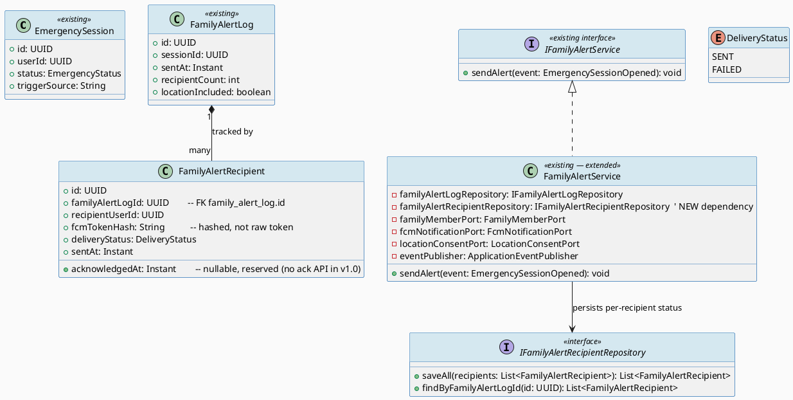
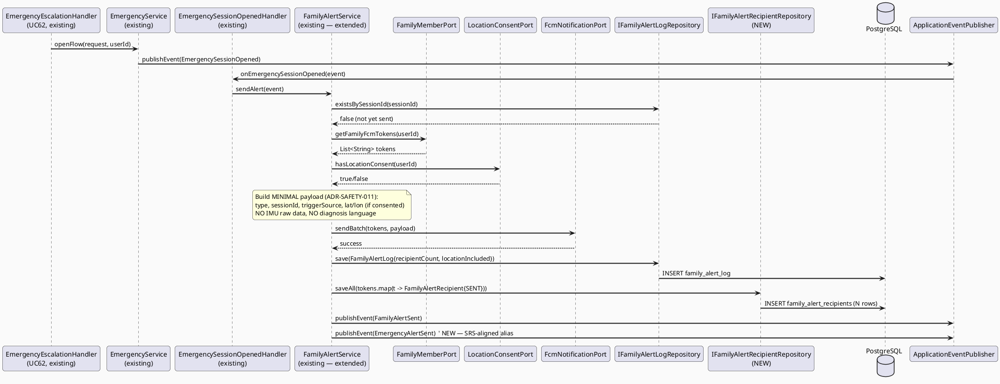
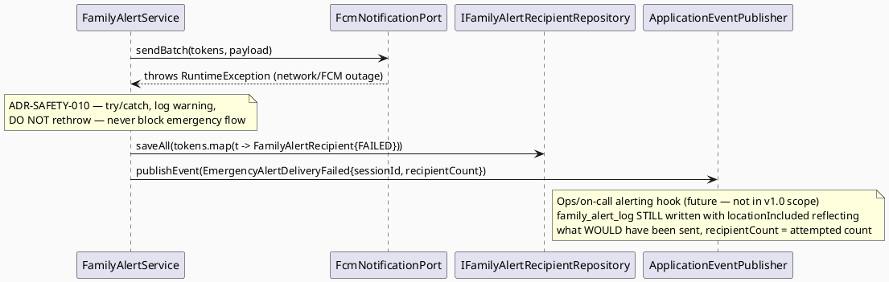
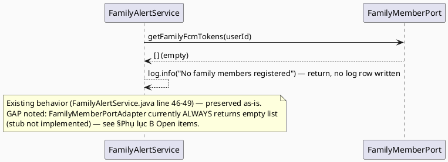

# ENGINEERING DOCUMENTATION STANDARD (EDS) v2.0
# UC138 — Send Emergency Alert

| Field | Value |
|-------|-------|
| **Document ID** | `CB-SAFETY-IMP-006` |
| **Version** | `1.0` |
| **Date** | `2026-07-02` |
| **Status** | `Draft` |
| **Document Owner** | `AI Agent` |
| **Author** | `AI Agent — Technical Architect` |
| **Reviewed by** | `[ ] Pending` |
| **DPO Sign-off** | `[ ] Pending` *(bắt buộc — module xử lý location + family contact PII)* |
| **Approved by** | `[ ] Pending` |
| **Last Review** | `2026-07-02` |
| **Based on EDS** | `v2.0` |

---

## CHANGELOG

| Ngày | Người thực hiện | Nội dung thay đổi |
|------|-----------------|-------------------|
| 2026-07-02 | AI Agent — Technical Architect | Tạo tài liệu lần đầu — TDS cho UC138 Send Emergency Alert |

---

## MỤC LỤC

1. [Tổng quan Module](#1-tổng-quan-module)
2. [Ma trận Truy vết (Traceability Matrix)](#2-ma-trận-truy-vết-traceability-matrix)
3. [Architecture Decision Records (ADR)](#3-architecture-decision-records-adr)
4. [Non-Functional Requirements & SLA](#4-non-functional-requirements--sla)
5. [Static Modeling (Mô hình Tĩnh)](#5-static-modeling-mô-hình-tĩnh)
6. [Dynamic Modeling (Mô hình Động)](#6-dynamic-modeling-mô-hình-động)
7. [Domain Event Catalog](#7-domain-event-catalog)
8. [Interface Specification (Đặc tả Giao diện)](#8-interface-specification-đặc-tả-giao-diện)
9. [API Specification](#9-api-specification)
10. [Bảng mã lỗi (Error Codes)](#10-bảng-mã-lỗi-error-codes)
11. [Quy trình Triển khai (Step-by-Step)](#11-quy-trình-triển-khai-step-by-step)
12. [Rollback & Incident Runbook](#12-rollback--incident-runbook)
13. [Kịch bản Kiểm thử Chi tiết](#13-kịch-bản-kiểm-thử-chi-tiết)
14. [Phương pháp Xác minh](#14-phương-pháp-xác-minh)
15. [Mẫu thử thực tế (API Verification Samples)](#15-mẫu-thử-thực-tế-api-verification-samples)
16. [Bảng tổng hợp phân quyền (Authorization Matrix)](#16-bảng-tổng-hợp-phân-quyền-authorization-matrix)
17. [AI Prompt Constraints (CASE 2.0)](#17-ai-prompt-constraints-case-20)

---

## 1. Tổng quan Module

> **Finding quan trọng:** Sau khi khảo sát codebase (`com.carebridge.backend.emergency` package), phần lớn phạm vi nghiệp vụ của UC138 ("gửi minimal alert tới family members đã cấu hình, ghi nhận delivery status") **ĐÃ được implement** dưới dạng UC65-equivalent: `FamilyAlertService.sendAlert()`, auto-triggered bởi `EmergencySessionOpenedHandler` khi `EmergencySessionOpened` được publish (từ `EmergencyService.openFlow()`, UC62). Bảng `family_alert_log` (`sent_at`, `recipient_count`, `location_included`) và event `FamilyAlertSent` đã tồn tại. UC138 TDS này **KHÔNG viết lại** service đó — nó: (a) hình thức hóa module hiện có dưới tên UC138 cho mục đích traceability SRS §3.3.4.6, (b) lấp genuine gap: `delivery_status` per-recipient tracking (hiện tại `family_alert_log` chỉ có 1 row tổng hợp cho cả session, không track riêng từng recipient's delivery outcome), và (c) làm rõ "minimal alert content" theo nguyên tắc PDPA minimization (RG-6 — Open, xem §Phụ lục B).

| Field | Value |
|-------|-------|
| **Module Name** | `Send Emergency Alert` |
| **Bounded Context** | `emergency` (extends existing package `com.carebridge.backend.emergency`, KHÔNG tạo bounded context mới) |
| **Data Classification** | `Sensitive-PII` *(location optional theo consent, family FCM tokens)* |
| **Compliance Scope** | `PDPA / Luật 91/2025` |
| **Upstream Dependencies** | `UC62 OpenEmergencyFlow (EmergencySessionOpened event, đã tồn tại)`, `UC137 ConfirmSafetyCheck (upstream trigger qua EmergencyEscalationTriggered)`, `FamilyMemberPort`, `LocationConsentPort` |
| **Downstream Consumers** | `UC139 ViewSafetyEventHistory (future — reads delivery_status)`, Firebase Cloud Messaging |

---

## 2. Ma trận Truy vết (Traceability Matrix)

| Requirement ID | Loại (BR/ADR/US) | Mô tả yêu cầu | Thành phần Code | Compliance Target | ADR liên quan |
|----------------|------------------|---------------|-----------------|-------------------|---------------|
| SRS-3.3.4.6 | User Story | Gửi minimal alert tới family members đã cấu hình, ghi delivery status | `FamilyAlertService.sendAlert()` (đã tồn tại — UC65) | — | ADR-SAFETY-010 |
| BR-PRIVACY | Business Rule | Health/family data theo consent, purpose, minimum-necessary access | `FamilyAlertService` payload construction | PDPA | ADR-SAFETY-011 |
| BR-SAFETY | Business Rule | FCM failure KHÔNG được chặn ghi nhận alert đã "attempted" — không delay emergency routing | `FamilyAlertService.sendAlert()` (đã có try/catch) | — | ADR-SAFETY-010 |
| GAP-1 (mới) | Schema Gap | `family_alert_log` hiện là 1 row/session (aggregate) — không có per-recipient `delivery_status` để hiển thị ai đã nhận | `FamilyAlertRecipient` (entity mới) | — | ADR-SAFETY-012 |
| RG-6 (Open) | Research Gap | "Minimal alert" content — trường nào bắt buộc, trường nào bị loại trừ — chưa có đặc tả rõ trong SRS | `FamilyAlertService` payload | PDPA minimization | ADR-SAFETY-011 |

---

## 3. Architecture Decision Records (ADR)

### ADR-SAFETY-010 — UC138 formalizes and extends the existing UC65 FamilyAlertService rather than duplicating it

| Field | Value |
|-------|-------|
| **Status** | `Accepted` |
| **Deciders** | `AI Agent — Technical Architect` |
| **Date** | `2026-07-02` |
| **Supersedes** | `—` |

#### Bối cảnh (Context)
`FamilyAlertService.sendAlert(EmergencySessionOpened event)` đã implement gần như toàn bộ scope SRS §3.3.4.6: lookup family FCM tokens (`FamilyMemberPort`), check location consent (`LocationConsentPort`), gửi FCM batch (`FcmNotificationPort`), ghi `family_alert_log`, publish `FamilyAlertSent`. Việc tạo lại một service mới trùng lặp trong `safety` package sẽ vi phạm nguyên tắc "smallest scoped change" (CLAUDE.md Delivery Rules) và tạo ra 2 nguồn sự thật (dual alert paths) — rủi ro an toàn nghiêm trọng nếu 2 services xử lý khác nhau.

#### Các phương án đã xem xét (Options Considered)

| Phương án | Mô tả | Ưu điểm | Nhược điểm |
|-----------|-------|----------|------------|
| A | Viết `EmergencyAlertService` mới trong package `safety`, độc lập với `emergency.FamilyAlertService` | "Trông giống" UC138 riêng biệt | Trùng lặp logic, 2 nguồn sự thật, rủi ro alert kép hoặc mất đồng bộ |
| B | Extend `FamilyAlertService` hiện có: thêm per-recipient delivery tracking, đổi tên domain events cho khớp SRS ngôn ngữ (`EmergencyAlertSent`/`EmergencyAlertDeliveryFailed` bên cạnh `FamilyAlertSent` đã có) | Không trùng lặp, tái sử dụng toàn bộ contract test đã có | Cần thận trọng không phá vỡ UC65 nếu UC65 đã có TDS/test riêng (không tìm thấy UC65 TDS trong `04_Implement/` — an toàn để extend) |

#### Quyết định (Decision)
Chọn **Phương án B**. `FamilyAlertService` được coi là implementation chung cho cả UC65 (existing, đã có sẵn) và UC138 (SRS mô tả). KHÔNG đổi tên class/package hiện có để tránh phá vỡ existing wiring (`EmergencySessionOpenedHandler`). Chỉ bổ sung: (1) entity `FamilyAlertRecipient` cho per-recipient delivery_status, (2) event `EmergencyAlertDeliveryFailed` khi TOÀN BỘ batch FCM thất bại (phân biệt với "gửi thành công nhưng recipient offline" — FCM không guarantee delivery, chỉ guarantee "accepted by FCM"), (3) alert content minimization theo RG-6.

#### Hệ quả (Consequences)

**Tích cực:**
- Không có 2 luồng alert song song — giảm rủi ro an toàn tính mạng
- Tái sử dụng `FcmNotificationPort`, `FamilyMemberPort`, `LocationConsentPort` đã có interface ổn định

**Tiêu cực / Trade-offs:**
- TDS này mô tả nhiều "đã có sẵn" hơn "mới viết" — cần review kỹ để không lẫn lộn phạm vi Sprint 2 thực tế cần code (chủ yếu là §GAP-1 + minimization)

**Compliance Impact:**
- Giữ nguyên PDPA controls đã có trong `FamilyAlertService` (location theo consent)

---

### ADR-SAFETY-011 — Minimal alert content: explicit inclusion/exclusion list (resolves RG-6 partially)

| Field | Value |
|-------|-------|
| **Status** | `Accepted` |
| **Deciders** | `AI Agent — Technical Architect` |
| **Date** | `2026-07-02` |

#### Bối cảnh (Context)
SRS §3.3.4.6 chỉ nói "Sends a minimal alert to configured family members and records delivery status" — không liệt kê field cụ thể nào được coi là "minimal". Payload hiện tại trong `FamilyAlertService.sendAlert()`: `type="EMERGENCY_ALERT"`, `sessionId`, `triggerSource`, và `latitude`/`longitude` (chỉ khi có consent). KHÔNG có thông tin y tế, KHÔNG có nội dung IMU raw, KHÔNG có tên đầy đủ actor trong payload hiện tại.

#### Quyết định (Decision)
Chính thức hóa danh sách field cho "minimal alert" theo nguyên tắc PDPA data minimization:

**BAO GỒM (minimum necessary để family hành động):**
- `type` = "EMERGENCY_ALERT" (cố định)
- `sessionId` (để deep-link vào app xem chi tiết nếu family có tài khoản CareBridge)
- `triggerSource` (vd: "FALL_DETECTION_UNCONFIRMED" — để family hiểu ngữ cảnh mà không suy diễn tình trạng y tế)
- `latitude`/`longitude` — CHỈ khi `LocationConsentPort.hasLocationConsent()==true`
- `motherDisplayName` — **MỚI, cần bổ sung**: tên hiển thị rút gọn của Mother (không phải full legal name/PII nhạy cảm khác) để family biết ai đang cần giúp đỡ khi có nhiều Mother trong 1 gia đình mở rộng — **Open, cần UX/Legal xác nhận field chính xác nào được phép** (xem RG-6 residual)

**LOẠI TRỪ (không bao giờ đưa vào payload FCM):**
- Bất kỳ dữ liệu IMU thô (accelerometer/gyroscope values)
- Bất kỳ ngôn ngữ chẩn đoán/health status nào (giữ nguyên nguyên tắc BR-SAFETY-011 kế thừa từ UC136 — "suspected" chỉ dùng nội bộ, KHÔNG gửi ra ngoài payload gia đình dưới dạng chẩn đoán)
- Địa chỉ nhà/lịch sử vị trí (chỉ tọa độ tức thời tại thời điểm alert)

#### Hệ quả (Consequences)

**Tích cực:** Rõ ràng, auditable, giảm rủi ro PDPA over-collection trong push notification payload (payload FCM có thể bị log bởi third-party FCM infra ngoài tầm kiểm soát CareBridge).

**Tiêu cực / Trade-offs:** `motherDisplayName` là field mới cần thêm vào payload — cần `FamilyMemberPort`/user profile lookup bổ sung (hiện `FamilyAlertService` chỉ có `userId`, không resolve display name) — đánh dấu **Open** trong §RG-6 residual, KHÔNG implement trong version 1.0 của TDS này để giữ scope tối thiểu; `userId` vẫn đủ để app-side gia đình tra cứu tên nếu đã có tài khoản.

**Compliance Impact:** Payload hiện tại (không có `motherDisplayName`) đã tuân thủ minimization; bổ sung sau cần DPO review riêng.

---

### ADR-SAFETY-012 — Per-recipient delivery_status via new FamilyAlertRecipient table (genuine schema gap)

| Field | Value |
|-------|-------|
| **Status** | `Accepted` |
| **Deciders** | `AI Agent — Technical Architect` |
| **Date** | `2026-07-02` |

#### Bối cảnh (Context)
Task instructions tham chiếu `safety_alerts.recipient_user_id, delivery_status, sent_at, acknowledged_at` — bảng này **KHÔNG tồn tại** trong migration thực tế. Bảng thật là `family_alert_log` (`V20260627000004__create_family_alert_log.sql`): 1 row per `session_id` (UNIQUE), chỉ có `recipient_count` (số lượng), KHÔNG có row riêng cho từng recipient, KHÔNG có `delivery_status` hay `acknowledged_at`. Điều này có nghĩa hệ thống hiện tại biết "đã gửi cho N người" nhưng KHÔNG biết gửi cho AI, và KHÔNG biết ai đã "acknowledge" — đây là genuine gap so với SRS "records delivery status" (số nhiều, ngụ ý per-recipient).

#### Quyết định (Decision)
Thêm bảng mới `family_alert_recipients` (KHÔNG đổi `family_alert_log` hiện có, giữ nguyên tương thích ngược) qua migration `V20260705090100__create_family_alert_recipients.sql`:
- `id, family_alert_log_id (FK), recipient_user_id, fcm_token_hash, delivery_status ('SENT'|'FAILED'), sent_at, acknowledged_at (nullable — reserved for future ack endpoint, KHÔNG implement ack API trong scope UC138 v1.0)`
- `FamilyAlertService.sendAlert()` được mở rộng: sau khi `fcmNotificationPort.sendBatch()`, ghi 1 row `family_alert_recipients` cho MỖI token trong batch, với `delivery_status` phản ánh kết quả gửi (SENT nếu `sendBatch` không throw, FAILED nếu throw toàn batch — `FcmNotificationPort.sendBatch()` hiện tại là all-or-nothing, không trả về per-token result, xem Trade-off).

#### Hệ quả (Consequences)

**Tích cực:** Lấp đúng gap thật (per-recipient visibility), không phá vỡ `family_alert_log` đang hoạt động, không đổi contract `FcmNotificationPort`.

**Tiêu cực / Trade-offs:** `FcmNotificationPort.sendBatch(List<String>, Map<String,String>)` hiện tại KHÔNG trả về per-token success/failure (interface chỉ có `void`) — do đó `delivery_status` ở mức "SENT" chỉ có nghĩa "batch call succeeded", KHÔNG đảm bảo device thực sự nhận được (FCM giới hạn vốn có). Nâng cấp `FcmNotificationPort` lên trả `Map<String, Boolean>` per-token là out-of-scope cho TDS này (breaking interface change, cần ADR riêng) — đánh dấu **Open**.

**Compliance Impact:** Không PII mới ngoài `fcm_token_hash` (hash, không lưu token trần trong bảng audit mới — giảm thiểu rủi ro nếu bảng bị truy cập trái phép).

---

## 4. Non-Functional Requirements & SLA

### 4.1. Performance & Availability

| Category | Requirement | Target SLA | Measurement Method | Compliance Basis |
|----------|-------------|------------|---------------------|------------------|
| Latency | `EmergencySessionOpened` → FCM batch dispatched | `< 3000ms` | APM trace (kế thừa từ UC65 hiện có) | BR-SAFETY |
| Latency | FCM dispatch → `family_alert_recipients` rows persisted | `< 500ms` sau dispatch | APM trace | — |
| Availability | Alert dispatch uptime | `99.9%` | Uptime monitor | — |

### 4.2. Data Integrity & Retention

| Category | Requirement | Target | Verification Method | Compliance Basis |
|----------|-------------|--------|---------------------|------------------|
| Idempotency | 1 alert dispatch / `emergency_sessions.id` (đã có `UNIQUE session_id` trên `family_alert_log`) | 100% | DB unique constraint (đã có) | BR-SAFETY |
| Consistency | `family_alert_recipients` count == `family_alert_log.recipient_count` | 100% | Reconciliation query (§14) | — |
| Retention | Alert logs | 7 năm (kế thừa policy `emergency_sessions`) | DB backup | PDPA Healthcare |

---

## 5. Static Modeling (Mô hình Tĩnh)

### 5.1. Class Diagram (PlantUML)



### 5.2. Data Structure (Flyway SQL Migration)

**Logic Issue resolved:** original task brief referenced `safety_alerts(recipient_user_id, delivery_status, sent_at, acknowledged_at)`. This table does not exist. Real table is `family_alert_log` (aggregate, no per-recipient rows). This TDS adds `family_alert_recipients` as a genuinely new child table rather than inventing a `safety_alerts` table that has no basis in the actual schema.

Tạo file: `src/main/resources/db/migration/V20260705090100__create_family_alert_recipients.sql`

```sql
-- === EMERGENCY: PER-RECIPIENT ALERT DELIVERY TRACKING (UC138) ===

CREATE TABLE family_alert_recipients (
  id                  UUID          PRIMARY KEY DEFAULT gen_random_uuid(),
  family_alert_log_id UUID          NOT NULL REFERENCES family_alert_log(id),
  recipient_user_id   UUID          NOT NULL,
  fcm_token_hash      VARCHAR(128)  NOT NULL,               -- SHA-256 hash, never raw token
  delivery_status     VARCHAR(20)   NOT NULL,                -- 'SENT' | 'FAILED'
  sent_at             TIMESTAMPTZ   NOT NULL DEFAULT NOW(),
  acknowledged_at     TIMESTAMPTZ,                            -- reserved — no ack API in v1.0
  created_by          VARCHAR(50)   NOT NULL DEFAULT 'SYSTEM',

  CONSTRAINT chk_family_alert_recipient_status CHECK (delivery_status IN ('SENT','FAILED'))
);

CREATE INDEX idx_family_alert_recipients_log_id ON family_alert_recipients(family_alert_log_id);
CREATE INDEX idx_family_alert_recipients_user_id ON family_alert_recipients(recipient_user_id);
```

> **Không thay đổi** `family_alert_log` hiện có — tương thích ngược 100%.

---

## 6. Dynamic Modeling (Mô hình Động)

### 6.1. Sequence Diagram — Happy Path: Alert dispatched to all family members (extends existing UC65 flow)



### 6.2. Sequence Diagram — FCM Batch Failure (all recipients)



### 6.3. Sequence Diagram — No family members configured (edge case, already handled)



---

## 7. Domain Event Catalog

### 7.1. Events Published (Phát ra)

| Event Name | Trigger | Publisher | Subscriber(s) | Payload Schema | Async? |
|------------|---------|-----------|---------------|----------------|--------|
| `FamilyAlertSent` | Alert batch dispatched (existing, kept for backward compatibility) | `FamilyAlertService` | *(none currently — future UC139)* | already defined `FamilyAlertSent.java` | Yes |
| `EmergencyAlertSent` | **NEW** — same trigger as `FamilyAlertSent`, published alongside it, using SRS-aligned naming for UC138 traceability | `FamilyAlertService` | Future audit/notification consumers | `EmergencyAlertSent.java` (§7.3) | Yes |
| `EmergencyAlertDeliveryFailed` | **NEW** — `fcmNotificationPort.sendBatch()` throws for the entire batch | `FamilyAlertService` | Future ops-alerting consumer (not implemented v1.0) | `EmergencyAlertDeliveryFailed.java` (§7.3) | Yes |

### 7.2. Events Consumed (Tiêu thụ)

| Event Name | Source | Handler | Action thực hiện |
|------------|--------|---------|------------------|
| `EmergencySessionOpened` | `EmergencyService` (UC62, existing) | `EmergencySessionOpenedHandler` (existing) | Invoke `FamilyAlertService.sendAlert()` |

### 7.3. Payload Schema

```java
// EmergencyAlertSent.java — NEW, SRS-aligned alias published alongside existing FamilyAlertSent
public record EmergencyAlertSent(
    UUID    eventId,
    UUID    sessionId,
    UUID    userId,
    int     recipientCount,
    boolean locationIncluded,
    Instant sentAt
) {}

// EmergencyAlertDeliveryFailed.java — NEW
public record EmergencyAlertDeliveryFailed(
    UUID    eventId,
    UUID    sessionId,
    UUID    userId,
    int     attemptedRecipientCount,
    String  failureReason,     // exception message, truncated — no stack trace/PII
    Instant failedAt
) {}
```

> **Không đổi** `FamilyAlertSent` đã có — giữ nguyên để không phá vỡ bất kỳ consumer tương lai nào đã plan theo tên cũ.

---

## 8. Interface Specification (Đặc tả Giao diện)

### 8.1. Service Interface (extended, contract-compatible)

```java
// IFamilyAlertService.java — UNCHANGED signature (existing)
// @version 1.0 (no breaking change)
public interface IFamilyAlertService {
    /**
     * UC138: Sends minimal emergency alert to all configured family members
     * and records per-recipient delivery status.
     * @throws never — FCM failures are caught internally (ADR-SAFETY-010),
     *   this method must NEVER throw and must NEVER delay emergency routing.
     */
    void sendAlert(EmergencySessionOpened event);
}

// IFamilyAlertRecipientRepository.java — NEW
// @version 1.0
public interface IFamilyAlertRecipientRepository extends JpaRepository<FamilyAlertRecipient, UUID> {
    List<FamilyAlertRecipient> findByFamilyAlertLogId(UUID familyAlertLogId);
}
```

### 8.2. Repository Interface

```java
// IFamilyAlertLogRepository.java — UNCHANGED (existing)
public interface IFamilyAlertLogRepository extends JpaRepository<FamilyAlertLog, UUID> {
    boolean existsBySessionId(UUID sessionId);
}
```

---

## 9. API Specification

> **Note:** UC138's primary flow is event-driven (no direct HTTP trigger — Mother does not "call" Send Emergency Alert directly; it is system-invoked via `EmergencySessionOpened`). The only new HTTP surface is a read endpoint for the Mother to see her own alert's delivery status (supports downstream UC139 needs and immediate UX confirmation after an alert fires).

### 9.1. Endpoints Table

| Method | Path | Auth Level | Required Roles | Rate Limit | Idempotent? |
|--------|------|------------|----------------|------------|-------------|
| `GET` | `/api/v1/emergency/sessions/{sessionId}/alert-status` | JWT Bearer | `ROLE_MOTHER` | 30/min | Yes |

### 9.2. Request / Response Schemas

**GET /api/v1/emergency/sessions/{sessionId}/alert-status — Response (200):**
```json
{
  "sessionId": "uuid-v4",
  "sentAt": "2026-07-02T08:00:31.000Z",
  "recipientCount": 2,
  "locationIncluded": true,
  "recipients": [
    { "recipientUserId": "uuid-v4", "deliveryStatus": "SENT", "sentAt": "2026-07-02T08:00:31.000Z" },
    { "recipientUserId": "uuid-v4", "deliveryStatus": "SENT", "sentAt": "2026-07-02T08:00:31.000Z" }
  ]
}
```

**Response — 404 (no alert sent yet for this session):**
```json
{
  "error": {
    "code": "EMERG-004",
    "message": "No alert found for this emergency session"
  }
}
```

---

## 10. Bảng mã lỗi (Error Codes)

| Code | HTTP Status | Message (EN) | Message (VI) | Trigger Condition |
|------|-------------|--------------|--------------|-------------------|
| `EMERG-003` | 404 | No active emergency session found | Không có phiên khẩn cấp đang hoạt động | *(existing — reused)* |
| `EMERG-004` | 404 | No alert found for this emergency session | Không tìm thấy cảnh báo cho phiên này | `family_alert_log` chưa có record cho `sessionId` |
| `EMERG-005` | 403 | Insufficient permissions | Không đủ quyền | `sessionId` không thuộc về JWT `userId` |

---

## 11. Quy trình Triển khai (Step-by-Step)

### 11.1. Prerequisites

- [ ] UC62 `EmergencyService`/`EmergencySessionOpenedHandler` verified in production (already present)
- [ ] UC65-equivalent `FamilyAlertService` verified in production (already present)
- [ ] UC137 deployed (source of `EmergencyEscalationTriggered` for fall-detection-originated alerts)
- [ ] ADR-SAFETY-010/011/012 Accepted
- [ ] DPO sign-off on minimal-alert-content list (§ADR-SAFETY-011)
- [ ] **Known pre-existing gap (out of scope to fix here):** `FamilyMemberPortAdapter.getFamilyFcmTokens()` currently always returns `List.of()` (stub) — real family-member lookup must be wired by whichever team owns the `family`/`care-group` domain before UC138 can dispatch real alerts in production. Flagged in §Phụ lục B, not blocking this TDS's own deliverable.

### 11.2. Pre-Migration Checklist

- [ ] DB backup
- [ ] `V20260705090100` reviewed — pure additive table, no impact on `family_alert_log`

### 11.3. Implementation Steps

#### Chặng 1 — Migration V20260705090100
```bash
./mvnw flyway:migrate
```

#### Chặng 2 — Entity `FamilyAlertRecipient` + `IFamilyAlertRecipientRepository`

#### Chặng 3 — Extend `FamilyAlertService.sendAlert()`
```java
// After fcmNotificationPort.sendBatch() succeeds or fails:
// - build List<FamilyAlertRecipient> (SENT or FAILED per whole-batch outcome)
// - familyAlertRecipientRepository.saveAll(...)
// - publish EmergencyAlertSent (success) or EmergencyAlertDeliveryFailed (failure) alongside existing events
// - hash FCM tokens before persisting (SHA-256) — never store raw token in audit table
```

#### Chặng 4 — New `EmergencyAlertStatusController` (GET endpoint, §9)

### 11.4. Deployment Checklist

- [ ] Migration succeeds
- [ ] Existing `SAFETY137/UC65` tests remain green (no regression to `FamilyAlertService` contract)
- [ ] New `family_alert_recipients` rows created 1:1 with dispatched tokens
- [ ] `EmergencyAlertSent`/`EmergencyAlertDeliveryFailed` observed in logs during staging drill

---

## 12. Rollback & Incident Runbook

### 12.1. Điều kiện kích hoạt Rollback

| Điều kiện | Ngưỡng | Người quyết định |
|-----------|--------|------------------|
| `FamilyAlertService.sendAlert()` starts throwing (regression) | Bất kỳ case nào — CRITICAL | On-call Engineer ngay lập tức |
| `family_alert_recipients` insert failures block alert dispatch | > 1% | Tech Lead |
| Location included without consent | Bất kỳ case nào | DPO ngay lập tức |

### 12.2. Rollback Procedure

```bash
psql -h $DB_HOST -U $DB_USER -d carebridge \
  -c "DROP TABLE IF EXISTS family_alert_recipients CASCADE;"
psql -h $DB_HOST -U $DB_USER -d carebridge \
  -c "DELETE FROM flyway_schema_history WHERE version = '20260705090100';"
kubectl rollout undo deployment/carebridge-api
```

### 12.3. PDPA Incident: Non-minimal data in FCM payload

```
IMMEDIATE ACTIONS (within 1 hour):
1. DPO notification
2. Feature-flag disable the new payload field that leaked
3. Audit family_alert_recipients + FCM provider logs (if accessible) for exposure window
4. Report per PDPA §37 within 72h
```

### 12.4. Post-Incident Review (PIR)

- **Timeline / Root Cause / Impact / Remediation / Prevention**

---

## 13. Kịch bản Kiểm thử Chi tiết

### 13.1. Unit Tests

```gherkin
Feature: Send Emergency Alert
  Background:
    Given test data classification: SYNTHETIC

  Scenario: Alert dispatched to all family members with per-recipient tracking
    Given EmergencySessionOpened event; 2 FCM tokens registered; location consent=true
    When FamilyAlertService.sendAlert(event) is called
    Then family_alert_log record created with recipientCount=2
    And 2 family_alert_recipients rows created with deliveryStatus=SENT
    And EmergencyAlertSent event published

  Scenario: Minimal payload — no IMU/diagnosis data ever included
    Given EmergencySessionOpened event with triggerSource="FALL_DETECTION_UNCONFIRMED"
    When sendAlert() builds the FCM payload
    Then payload contains ONLY: type, sessionId, triggerSource, [lat/lon if consented]
    And payload does NOT contain accelerometer/gyroscope/magnitude fields
    And payload does NOT contain any string matching diagnosis language patterns

  Scenario: FCM batch failure recorded as FAILED, does not throw
    Given fcmNotificationPort.sendBatch() throws
    When sendAlert() is called
    Then family_alert_recipients rows created with deliveryStatus=FAILED
    And EmergencyAlertDeliveryFailed published
    And sendAlert() completes without propagating the exception (BR-SAFETY)

  Scenario: No family members configured — no alert log written
    Given familyMemberPort.getFamilyFcmTokens() returns empty list
    When sendAlert() is called
    Then NO family_alert_log record created
    And NO family_alert_recipients rows created
    And this is logged for operational visibility

  Scenario: Idempotency — duplicate EmergencySessionOpened does not double-send
    Given family_alert_log already exists for sessionId
    When sendAlert() is called again with the same sessionId
    Then no new FCM batch is sent
    And no duplicate family_alert_recipients rows created

  Scenario: Location excluded when consent=false
    Given location consent=false
    When sendAlert() builds payload
    Then payload does NOT contain latitude/longitude keys
    And family_alert_log.locationIncluded=false
```

### 13.2. Integration Tests

```gherkin
  Scenario: GET alert-status returns correct per-recipient breakdown
    Given Testcontainers PostgreSQL; family_alert_log + 2 family_alert_recipients seeded
    When GET /api/v1/emergency/sessions/{sessionId}/alert-status called by owning Mother
    Then response 200 with recipients array length=2, matching deliveryStatus values

  Scenario: Non-owner cannot view another Mother's alert status
    Given sessionId belongs to userId=A
    When GET .../alert-status called with JWT for userId=B
    Then response 403 EMERG-005
```

---

## 14. Phương pháp Xác minh

```sql
-- Verify per-recipient rows reconcile with aggregate count
SELECT fal.id, fal.recipient_count, COUNT(far.id) AS actual_rows
FROM family_alert_log fal
LEFT JOIN family_alert_recipients far ON far.family_alert_log_id = fal.id
GROUP BY fal.id, fal.recipient_count
HAVING fal.recipient_count != COUNT(far.id);
-- Expected: 0 rows (perfect reconciliation)

-- Verify no raw FCM tokens stored (only hashes)
SELECT fcm_token_hash FROM family_alert_recipients LIMIT 5;
-- Expected: 64-char hex strings (SHA-256), never raw FCM token format

-- Verify no diagnosis language in payload_json (if payload persisted anywhere for audit)
-- N/A currently — FamilyAlertService does not persist raw payload_json (existing design)
```

---

## 15. Mẫu thử thực tế (API Verification Samples)

```bash
# Check alert delivery status for own emergency session
curl -X GET https://$HOST/api/v1/emergency/sessions/$SESSION_ID/alert-status \
  -H "Authorization: Bearer $MOTHER_JWT"
```

**Expected Response (200):**
```json
{
  "sessionId": "550e8400-e29b-41d4-a716-446655440000",
  "sentAt": "2026-07-02T08:00:31.000Z",
  "recipientCount": 2,
  "locationIncluded": true,
  "recipients": [
    { "recipientUserId": "...", "deliveryStatus": "SENT", "sentAt": "..." }
  ]
}
```

---

## 16. Bảng tổng hợp phân quyền (Authorization Matrix)

| Endpoint | `GUEST` | `ROLE_MOTHER` | `ROLE_PARTNER` | `ROLE_EXPERT` | `ROLE_ADMIN` |
|----------|---------|---------------|----------------|---------------|--------------|
| `GET /api/v1/emergency/sessions/{id}/alert-status` | ❌ | ✅ Own | ❌ | ❌ | ❌ |

> **System-invoked flow** (`sendAlert()` triggered internally by `EmergencySessionOpenedHandler`) has no direct HTTP auth surface — it runs in-process as part of the authenticated Mother's `openFlow()`/escalation request chain.

---

## 17. AI Prompt Constraints (CASE 2.0)

### 17.1 Constraint Summary Table

| # | Constraint | Source (ADR/BR) | Last Verified |
|---|-----------|-----------------|---------------|
| C1 | Do NOT create a duplicate alert-sending service — extend existing `FamilyAlertService` in `emergency` package | `ADR-SAFETY-010` | `2026-07-02` |
| C2 | Alert payload MUST be minimal — only fields listed in ADR-SAFETY-011 §Decision INCLUDE list; NEVER IMU raw data or diagnosis language | `ADR-SAFETY-011 / BR-PRIVACY` | `2026-07-02` |
| C3 | Location only in payload when `LocationConsentPort.hasLocationConsent()==true` (already-enforced pattern — preserve it) | `BR-PRIVACY / PDPA` | `2026-07-02` |
| C4 | `sendAlert()` MUST NEVER throw — FCM failures caught, logged, and recorded as `FAILED` per-recipient, never block emergency routing | `BR-SAFETY / ADR-SAFETY-010` | `2026-07-02` |
| C5 | FCM tokens stored in new `family_alert_recipients` table MUST be hashed (SHA-256), never raw | `ADR-SAFETY-012` | `2026-07-02` |
| C6 | Idempotency preserved — reuse existing `existsBySessionId()` guard, do not remove it when extending | `ADR-SAFETY-010 (inherited UC65 C1)` | `2026-07-02` |

### 17.2 Constraint Injection Block

```
[CONSTRAINT BLOCK — Module: Send Emergency Alert — CB-SAFETY-IMP-006]

1. Extend existing FamilyAlertService (emergency package) — do NOT create a parallel alert service (ADR-SAFETY-010)
2. Payload minimality — only type/sessionId/triggerSource/[lat,lon if consented] — never IMU data or diagnosis language (ADR-SAFETY-011)
3. Location only when hasLocationConsent()==true — preserve existing consent check exactly as implemented (BR-PRIVACY)
4. sendAlert() must never throw — catch FCM failures, record FAILED status, never delay emergency routing (BR-SAFETY)
5. Hash FCM tokens before persisting to family_alert_recipients — never store raw tokens (ADR-SAFETY-012)
6. Preserve existing idempotency guard (existsBySessionId) — do not send duplicate alerts for the same session

[CONTEXT BLOCK] Bounded Context: emergency | Sensitive-PII | PDPA | BR-PRIVACY | BR-SAFETY
[TASK BLOCK] Extend FamilyAlertService.sendAlert() with per-recipient tracking + V20260705090100 migration + GET alert-status endpoint
```

### 17.3 Constraint Quality Checklist

- [x] Constraints traceable
- [x] Không generic — đặc thù UC138
- [x] Last Verified ≤ 2 sprints
- [x] ≥ 3 constraints (có 6)
- [x] Reference §8 và §16

### 17.4 Anti-Pattern Detection

| AP-ID | Anti-Pattern | Dấu hiệu | Hành động |
|-------|-------------|-----------|----------|
| AP-AI-001 | Duplicate Service | New `EmergencyAlertService` class created independent of `FamilyAlertService` | **BLOCK** — C1 / ADR-SAFETY-010 |
| AP-AI-002 | Payload Overreach | FCM payload includes `magnitude`, `notes`, or health-status text | **BLOCK** — C2 / PDPA |
| AP-AI-003 | Blocking Alert Path | `sendAlert()` allowed to throw and propagate to `EmergencySessionOpenedHandler` | **BLOCK** — C4 / BR-SAFETY |
| AP-AI-004 | Raw Token Storage | `family_alert_recipients.fcm_token_hash` column receives unhashed token | **BLOCK** — C5 |

---

## PHỤ LỤC

### A. Glossary

| Thuật ngữ | Định nghĩa |
|-----------|------------|
| Minimal Alert | Thông báo chỉ chứa dữ liệu tối thiểu cần thiết để family biết cần hành động — không có chi tiết y tế |
| Delivery Status | Trạng thái gửi FCM tới 1 recipient cụ thể — SENT (batch call thành công) hoặc FAILED |
| Acknowledged | Gia đình xác nhận đã xem alert — reserved field, chưa có API trong v1.0 |

### B. Research Gates (Open Items)

| ID | Câu hỏi mở | Trạng thái | Ghi chú |
|----|-----------|-----------|---------|
| RG-6 (residual) | `motherDisplayName` hoặc field định danh actor nào được phép đưa vào payload alert? | **Open** | ADR-SAFETY-011 giải quyết phần lớn "minimal content" nhưng field định danh Mother chưa được UX/Legal xác nhận — hiện tại payload chỉ có `sessionId`/`userId` nội bộ, gia đình phải mở app để xem chi tiết. Cần quyết định trước khi mở rộng payload. |
| GAP (pre-existing, non-blocking) | `FamilyMemberPortAdapter.getFamilyFcmTokens()` luôn trả `List.of()` (stub, log.warn "not implemented") | **Known, out of scope** | Đây là gap của domain `family`/`care-group` (owner khác), không thuộc phạm vi UC138. UC138 chỉ định nghĩa contract tiêu thụ đúng — khi domain kia implement thật, `FamilyAlertService` hoạt động ngay không cần sửa. |
| Open | `FcmNotificationPort.sendBatch()` không trả per-token result — `delivery_status` hiện tại chỉ phản ánh "batch call outcome", không phải per-device delivery thật | **Open** | Nâng cấp interface là breaking change, cần ADR riêng — ngoài phạm vi TDS này. |

### C. Tài liệu tham chiếu

| Document | Link / Path |
|----------|-------------|
| SRS UC-138 | `02_Requirements/SRS/3_Functional_Specification.md §3.3.4.6` (dòng 3424-3441) |
| UC137 TDS | `04_Implement/UC137_ConfirmSafetyCheck/UC137_ConfirmSafetyCheck_TDS.md` |
| Existing FamilyAlertService | `05_Development/CareBridgeAPI/src/main/java/com/carebridge/backend/emergency/service/impl/FamilyAlertService.java` |
| Actual DB schema | `05_Development/CareBridgeAPI/src/main/resources/db/migration/V20260627000004__create_family_alert_log.sql`, `V20260627000003__create_emergency_sessions.sql` |
| EDS v2.0 Template | `08_References/Template/PHASE-3_TDS.md` |
