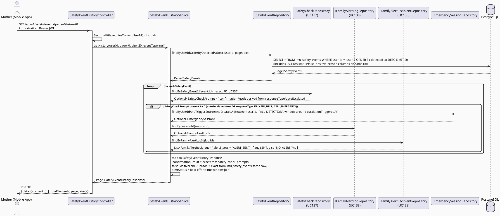
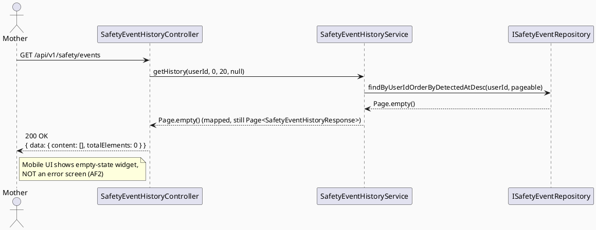
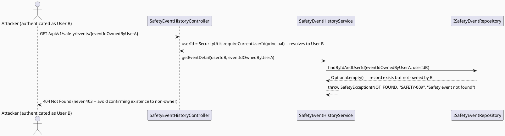

# ENGINEERING DOCUMENTATION STANDARD (EDS) v2.0
# UC139 — View Safety Event History

| Field | Value |
|-------|-------|
| **Document ID** | `CB-SAFETY-IMP-005` |
| **Version** | `1.0` |
| **Date** | `2026-07-02` |
| **Status** | `Draft` |
| **Document Owner** | `TV5-Chương` |
| **Author** | `AI Agent — Tech Lead` |
| **Reviewed by** | `[ ] Pending` |
| **DPO Sign-off** | `[ ] Pending` *(bắt buộc — module PII: safety event location, IMU-derived data)* |
| **Approved by** | `[ ] Pending` |
| **Last Review** | `2026-07-02` |
| **Based on EDS** | `v2.0` |

---

## CHANGELOG

| Ngày | Người thực hiện | Nội dung thay đổi |
|------|-----------------|-------------------|
| 2026-07-02 | AI Agent — Tech Lead | Tạo tài liệu lần đầu — TDS cho UC139 View Safety Event History (Draft) |
| 2026-07-02 | AI Agent — Technical Architect (reconciliation pass) | Cross-batch schema reconciliation (UC137/138/139/140/141): replaced "best-effort/uncertain" correlation language with explicit, confirmed joins now that UC137/UC138/UC140's final designs exist. `confirmationResult` now reads exact FK `safety_check_prompts.safety_event_id → imu_safety_events.id` (UC137). `falsePositiveLabel`/`falsePositiveReason` now read directly from `imu_safety_events.status`/`false_positive_reason` (UC140, same row, no JOIN). `alertStatus` uses a best-effort time-window LEFT JOIN to `emergency_sessions`/`family_alert_log`/`family_alert_recipients` (UC138), anchored on `safety_check_prompts.escalation_triggered_at` instead of `imu_safety_events.detected_at` for better precision — documented as a residual limitation, not silently assumed. Updated ADR-SAFETY-007 (Proposed → Accepted), §5.2 Data Structure, §5.1 Class Diagram, §6.1 Sequence Diagram, §8.2 Repository Interface, and §18 RG-4 accordingly. No new migration added by UC139 itself. Status remains Draft. |

---

## MỤC LỤC

1. [Tổng quan Module](#1-tổng-quan-module)
2. [Ma trận Truy vết (Traceability Matrix)](#2-ma-trận-truy-vết-traceability-matrix)
3. [Architecture Decision Records (ADR)](#3-architecture-decision-records-adr)
4. [Non-Functional Requirements & SLA](#4-non-functional-requirements--sla)
5. [Static Modeling (Mô hình Tĩnh)](#5-static-modeling-mô-hình-tĩnh)
6. [Dynamic Modeling (Mô hình Động)](#6-dynamic-modeling-mô-hình-động)
7. [Domain Event Catalog](#7-domain-event-catalog)
8. [Interface Specification (Đặc tả Giao diện)](#8-interface-specification-đặc-tả-giao-diện)
9. [API Specification](#9-api-specification)
10. [Bảng mã lỗi (Error Codes)](#10-bảng-mã-lỗi-error-codes)
11. [Quy trình Triển khai (Step-by-Step)](#11-quy-trình-triển-khai-step-by-step)
12. [Rollback & Incident Runbook](#12-rollback--incident-runbook)
13. [Kịch bản Kiểm thử Chi tiết](#13-kịch-bản-kiểm-thử-chi-tiết)
14. [Phương pháp Xác minh](#14-phương-pháp-xác-minh)
15. [Mẫu thử thực tế (API Verification Samples)](#15-mẫu-thử-thực-tế-api-verification-samples)
16. [Bảng tổng hợp phân quyền (Authorization Matrix)](#16-bảng-tổng-hợp-phân-quyền-authorization-matrix)
17. [AI Prompt Constraints (CASE 2.0)](#17-ai-prompt-constraints-case-20)
18. [Open Items / Research Gate Log](#18-open-items--research-gate-log)

---

## 1. Tổng quan Module

> UC139 là **read-only** listing/detail view cho Mother để xem lịch sử các suspected fall/impact events của chính mình: event type, magnitude, timestamp, confirmation result (từ UC137's `safety_check_prompts`), alert delivery status (từ UC138's `family_alert_recipients`, joined via `family_alert_log`), và false-positive label (từ UC140's columns added directly to `imu_safety_events`). Module này **không tạo, không sửa** bất kỳ record nào — chỉ đọc từ `imu_safety_events` LEFT JOIN `safety_check_prompts` LEFT JOIN `family_alert_log`/`family_alert_recipients` theo `userId` sở hữu. **(Updated 2026-07-02 — cross-batch reconciliation: UC137/UC138/UC140's final designs are now confirmed; this TDS previously described this correlation as best-effort/uncertain because those TDS were being drafted in parallel — see ADR-SAFETY-007 update below and CHANGELOG.)**

| Field | Value |
|-------|-------|
| **Module Name** | `View Safety Event History` |
| **Bounded Context** | `safety` |
| **Data Classification** | `Sensitive-PII` *(IMU-derived event data, optional location)* |
| **Compliance Scope** | `PDPA / Luật 91/2025` |
| **Upstream Dependencies** | `UC136 (DetectSuspectedFallOrImpact — writes imu_safety_events)`, `UC137 (ConfirmSafetyCheck — writes safety_check_prompts, FK safety_event_id)`, `UC138 (SendEmergencyAlert — writes family_alert_log + family_alert_recipients)`, `UC140 (ReportFalsePositiveDetection — writes status/false_positive_reason/false_positive_reported_at columns directly on imu_safety_events)`, `IAM (JWT)` |
| **Downstream Consumers** | Mobile Safety Event History screen (`safetyMonitoring` feature folder) |

---

## 2. Ma trận Truy vết (Traceability Matrix)

| Requirement ID | Loại (BR/ADR/US) | Mô tả yêu cầu | Thành phần Code | Compliance Target | ADR liên quan |
|----------------|------------------|---------------|-----------------|-------------------|---------------|
| SRS-3.3.4.7 | User Story | Displays event history, confirmation results, alert status, false-positive labels | `SafetyEventHistoryService`, `SafetyEventHistoryController` | — | ADR-SAFETY-007 |
| BR-RBAC | Business Rule | Users may access only functions allowed by their role/permission scope | `@PreAuthorize("hasRole('MOTHER')")` + ownership filter | — | ADR-SAFETY-008 |
| BR-SAFETY | Business Rule | Medical guidance must be non-diagnostic, escalation-aware, red-flag safe | `SafetyEventHistoryResponse` (reuses "suspected" language from UC136) | — | ADR-SAFETY-005 (UC136, reused) |
| PRE-3 / E1 | Precondition/Exception | Actor authenticated, access denied outside permitted data scope | `SafetyEventHistoryService.getHistory(userId, ...)` ownership predicate | PDPA | ADR-SAFETY-008 |
| AF2 | Alternative Flow | No matching data → empty state | `SafetyEventHistoryController` returns 200 with empty page, not 404 | — | — |

---

## 3. Architecture Decision Records (ADR)

### ADR-SAFETY-007 — UC139 is strictly read-only; joins directly against UC137/UC138/UC140's confirmed tables (no new tables, no time-window guessing)

| Field | Value |
|-------|-------|
| **Status** | `Accepted` |
| **Deciders** | `AI Agent — Tech Lead` |
| **Date** | `2026-07-02` (originally `Proposed` 2026-07-02, updated to `Accepted` same day once sibling UC137/UC138/UC140 designs were confirmed — see CHANGELOG) |
| **Supersedes** | `—` |

#### Bối cảnh (Context)
UC139 chỉ hiển thị dữ liệu đã tồn tại. Tại thời điểm bản Draft đầu tiên của TDS này, sibling UCs (UC137 Confirm Safety Check, UC138 Send Emergency Alert, UC140 Report False Positive Detection) đang được thiết kế song song, nên UC139 ban đầu mô tả correlation là "best-effort, time-window join" vì chưa biết chính xác UC137/138/140 sẽ tạo bảng/cột gì. **Cross-batch reconciliation (2026-07-02) đã xác nhận thiết kế cuối cùng của cả 3 sibling UC:**

- **UC137** (`ConfirmSafetyCheck`, `CB-SAFETY-IMP-005`): tạo bảng MỚI `safety_check_prompts` với `safety_event_id UUID NOT NULL REFERENCES imu_safety_events(id)` (constraint `uk_safety_check_prompts_event UNIQUE (safety_event_id)` — tối đa 1 row/event, direct FK, KHÔNG cần time-window correlation). Entity: `SafetyCheckPrompt` (package `com.carebridge.backend.safety`). Cột quan trọng cho UC139: `response_type` (`I_AM_OK`/`NEED_HELP`/`CALL_EMERGENCY`/NULL), `auto_escalated` (boolean).
- **UC138** (`SendEmergencyAlert`, `CB-SAFETY-IMP-006`): KHÔNG tạo bảng nối trực tiếp tới `imu_safety_events`. Thay vào đó, alert được gửi khi `EmergencyEscalationTriggered` (do UC137 publish) → `EmergencyEscalationHandler` (UC62, existing) → `EmergencyService.openFlow()` tạo `emergency_sessions` row → `EmergencySessionOpened` → `FamilyAlertService.sendAlert()` ghi `family_alert_log` (1 row/`session_id`, UNIQUE) + `family_alert_recipients` (per-recipient, FK `family_alert_log_id`, entity `FamilyAlertRecipient`, cột `delivery_status` SENT/FAILED). Join path từ `imu_safety_events` sang alert data: `imu_safety_events.id` → (qua `safety_check_prompts.safety_event_id`, vì UC137 là nguồn trigger `EmergencyEscalationTriggered`) — nhưng KHÔNG có FK trực tiếp từ `safety_check_prompts`/`imu_safety_events` sang `emergency_sessions.id` (UC137/UC138 không thêm cột đó, xem Trade-off bên dưới). UC139 do đó join `emergency_sessions`/`family_alert_log` bằng `user_id` + time window quanh `safety_check_prompts.escalation_triggered_at` (KHÔNG phải quanh `imu_safety_events.detected_at` như bản Draft ban đầu — chính xác hơn vì `escalation_triggered_at` là thời điểm UC137 thực sự publish `EmergencyEscalationTriggered`, sát với thời điểm `emergency_sessions` được tạo).
- **UC140** (`ReportFalsePositiveDetection`, `CB-SAFETY-IMP-006`): KHÔNG tạo bảng mới — thêm 3 cột trực tiếp vào `imu_safety_events` (`status`, `false_positive_reason`, `false_positive_reported_at`) qua column-level `GRANT UPDATE`, migration `V20260705100000`. Đây là join **đơn giản nhất** trong 3 sibling — chỉ cần đọc cùng row `imu_safety_events`, không cần JOIN bảng khác.

#### Các phương án đã xem xét (Options Considered)

| Phương án | Mô tả | Ưu điểm | Nhược điểm |
|-----------|-------|----------|------------|
| A (Draft ban đầu) | UC139 query trực tiếp `imu_safety_events` + LEFT JOIN `emergency_sessions`/`family_alert_log` bằng thời gian/user tương quan (không phụ thuộc cột chưa tồn tại) | Không block bởi sibling UCs; hoạt động độc lập | Correlation theo user+time-window kém chính xác hơn FK trực tiếp — không còn cần thiết sau khi UC137/138/140 đã Accepted |
| B (Chosen — sau reconciliation) | UC139 join TRỰC TIẾP vào bảng thật của từng sibling: `imu_safety_events` LEFT JOIN `safety_check_prompts` ON `safety_check_prompts.safety_event_id = imu_safety_events.id` (exact FK, UC137) LEFT JOIN `family_alert_log`/`family_alert_recipients` bằng `user_id` + time window quanh `safety_check_prompts.escalation_triggered_at` (UC138, vì chưa có FK trực tiếp) — false-positive label đọc trực tiếp từ `imu_safety_events.status`/`false_positive_reason` (UC140, cùng row, không cần JOIN) | Chính xác cao hơn cho UC137/UC140 (FK/same-row thay vì time-window); chỉ còn 1 correlation "best-effort" (UC138) thay vì cả 3 | Vẫn còn 1 time-window best-effort cho UC138 vì UC137→UC138 flow chưa có FK trực tiếp (ngoài phạm vi UC139 để thêm — xem Trade-off) |

#### Quyết định (Decision)
Chọn **Phương án B**: `SafetyEventHistoryResponse` DTO field `confirmationResult` đọc TRỰC TIẾP từ `SafetyCheckPrompt.responseType`/`autoEscalated` (exact FK join qua `safety_event_id`, KHÔNG còn time-window). Field `falsePositiveLabel`/`falsePositiveReason` đọc TRỰC TIẾP từ `imu_safety_events.status`/`false_positive_reason` (cùng row, KHÔNG cần JOIN). Field `alertStatus` vẫn dùng best-effort time-window LEFT JOIN sang `emergency_sessions`/`family_alert_log`/`family_alert_recipients` — nhưng anchor point chính xác hơn Draft ban đầu: window là `[safety_check_prompts.escalation_triggered_at, safety_check_prompts.escalation_triggered_at + 2 minutes]` (khi `auto_escalated = true` HOẶC `response_type IN ('NEED_HELP','CALL_EMERGENCY')`) thay vì `[imu_safety_events.detected_at, +5 minutes]`, vì `escalation_triggered_at` là thời điểm UC137 thực sự publish `EmergencyEscalationTriggered` — sát hơn nhiều với thời điểm `emergency_sessions`/`family_alert_log` được tạo bởi UC62/UC65-equivalent (UC138). Nếu event chưa có `safety_check_prompts` row (UC137 chưa xử lý) hoặc chưa escalate, `alertStatus = null`/`"NO_ALERT"` — hợp lệ, không phải lỗi.

#### Hệ quả (Consequences)

**Tích cực:**
- `confirmationResult` và `falsePositiveLabel` giờ chính xác 100% (FK/same-row), không còn "best-effort" cho 2/3 sibling
- Không migration mới cho UC139 — chỉ đọc bảng đã có (`safety_check_prompts`, `family_alert_log`, `family_alert_recipients`, cột mới trên `imu_safety_events`)
- DTO shape không đổi so với Draft ban đầu — chỉ query logic bên trong Service thay đổi

**Tiêu cực / Trade-offs:**
- `alertStatus` vẫn là best-effort time-window join (UC138 không có FK trực tiếp từ `safety_check_prompts`/`imu_safety_events` tới `emergency_sessions`) — chấp nhận được cho Draft này; nếu cần chính xác tuyệt đối, cần ADR riêng thêm `emergency_session_id` FK vào `safety_check_prompts` (ngoài phạm vi UC139, đề xuất cho UC137/UC138 follow-up)
- `SafetyEventHistoryService` giờ phụ thuộc trực tiếp vào entity `SafetyCheckPrompt` (UC137) và `FamilyAlertRecipient`/`FamilyAlertLog` (UC138) — cần các entity này tồn tại tại thời điểm implement UC139 (thứ tự implement: UC137/UC138 nên đi trước hoặc song song, không chặn cứng vì đều LEFT JOIN nullable)

**Compliance Impact:**
- Không ảnh hưởng PDPA thêm — chỉ đọc dữ liệu đã có consent tại thời điểm ghi (UC136 ADR-SAFETY-005 §C3); không có PII mới lộ ra qua JOIN (chỉ đọc field đã có trong scope Sensitive-PII sẵn có)

---

### ADR-SAFETY-008 — Ownership scoping: Mother sees only her own events, no family-sharing

| Field | Value |
|-------|-------|
| **Status** | `Proposed` |
| **Deciders** | `AI Agent — Tech Lead` |
| **Date** | `2026-07-02` |
| **Supersedes** | `—` |

#### Bối cảnh (Context)
SRS §3.3.4.7 chỉ liệt kê Primary Actor = Mother, Secondary Actor = Firebase Cloud Messaging (không phải Family). Không giống UC86 View Family Alert (nơi Family member được phép xem alert của Mother mà họ theo dõi qua care group), UC139 SRS description không đề cập chia sẻ. `imu_safety_events` không có bất kỳ cột care-group/family-sharing nào.

#### Quyết định (Decision)
`SafetyEventHistoryService.getHistory()` **luôn** filter `WHERE user_id = :currentUserId` lấy từ JWT `principal`, không nhận `targetUserId` param từ client, không có endpoint cho Family/Partner/Expert xem lịch sử của Mother khác. Đây là hard ownership scope — không phải optional query param.

#### Hệ quả (Consequences)

**Tích cực:**
- Ngăn IDOR (Insecure Direct Object Reference) — userId luôn lấy từ JWT, không từ path/query param
- Đơn giản hóa authorization matrix

**Tiêu cực / Trade-offs:**
- Nếu sau này SRS yêu cầu Family xem safety history (tương tự UC86), cần ADR mới + endpoint mới `GET /api/v1/safety/events/family/{motherId}` với care-group permission check — ngoài phạm vi UC139 hiện tại

**Compliance Impact:**
- BR-RBAC: strict ownership scope giảm rủi ro lộ dữ liệu sức khỏe nhạy cảm giữa các user

---

## 4. Non-Functional Requirements & SLA

### 4.1. Performance & Availability

| Category | Requirement | Target SLA | Measurement Method | Compliance Basis |
|----------|-------------|------------|---------------------|------------------|
| Latency | `GET /api/v1/safety/events` (paginated) | `< 400ms p99` | APM trace | — |
| Availability | History read endpoint | `99.9%` | Uptime monitor | — |
| Pagination | Default page size | `20`, max `100` | API contract test | — |

### 4.2. Data Integrity & Retention

| Category | Requirement | Target | Verification Method | Compliance Basis |
|----------|-------------|--------|---------------------|------------------|
| Read-only guarantee | No mutation endpoints in this module | 100% (no PUT/PATCH/DELETE) | Code review + `@PreAuthorize` audit | PDPA |
| Retention | Follows `imu_safety_events` retention (7 years, per UC136 ADR-SAFETY-006) | Inherited | DB backup policy | PDPA Healthcare |

---

## 5. Static Modeling (Mô hình Tĩnh)

### 5.1. Class Diagram (PlantUML)

```plantuml
@startuml UC139_ClassDiagram
skinparam backgroundColor #FAFAFA
skinparam ClassBorderColor #2E75B6
skinparam ClassHeaderBackgroundColor #D5E8F0

class SafetyEventHistoryResponse {
  + id: UUID
  + eventType: String          -- SUSPECTED_FALL | SUSPECTED_IMPACT | FALSE_ALARM
  + magnitude: Double
  + detectedAt: Instant
  + userLatitude: BigDecimal   -- nullable, only if consented at capture time
  + userLongitude: BigDecimal  -- nullable
  + confirmationResult: String -- nullable: from SafetyCheckPrompt.responseType ("I_AM_OK"|"NEED_HELP"|"CALL_EMERGENCY") | "NOT_RESPONDED" (autoEscalated=true) | null (no safety_check_prompts row yet — UC137 not triggered for this event)
  + alertStatus: String        -- nullable: "ALERT_SENT" (correlated family_alert_log/family_alert_recipients row found) | "NO_ALERT" | null (no escalation occurred)
  + falsePositiveLabel: Boolean -- from imu_safety_events.status == 'FALSE_POSITIVE' (UC140, same row, no JOIN needed)
  + falsePositiveReason: String -- from imu_safety_events.false_positive_reason (UC140, same row)
}

interface ISafetyEventHistoryService <<interface>> {
  + getHistory(userId: UUID, page: int, size: int, eventType: String): Page<SafetyEventHistoryResponse>
  + getEventDetail(userId: UUID, eventId: UUID): SafetyEventHistoryResponse
}

class SafetyEventHistoryService implements ISafetyEventHistoryService {
  - safetyEventRepository: ISafetyEventRepository            -- existing (UC136), now also reads UC140's status/false_positive_reason/false_positive_reported_at columns (same table)
  - safetyCheckRepository: ISafetyCheckRepository             -- UC137's repository (com.carebridge.backend.safety), exact FK join via findBySafetyEventId(UUID)
  - familyAlertLogRepository: IFamilyAlertLogRepository       -- UC138's repository (com.carebridge.backend.emergency), read-only lookup
  - familyAlertRecipientRepository: IFamilyAlertRecipientRepository -- UC138's repository, read-only lookup for delivery status
  - emergencySessionRepository: IEmergencySessionRepository   -- read-only lookup, time-window correlation for alertStatus (see ADR-SAFETY-007 Trade-offs)
  + getHistory(userId, page, size, eventType): Page<SafetyEventHistoryResponse>
  + getEventDetail(userId, eventId): SafetyEventHistoryResponse
}

class SafetyEventHistoryController {
  + listHistory(principal, page, size, eventType): ApiResponse<Page<SafetyEventHistoryResponse>>
  + getDetail(principal, eventId): ApiResponse<SafetyEventHistoryResponse>
}

SafetyEventHistoryController --> ISafetyEventHistoryService : delegates to
SafetyEventHistoryService --> ISafetyEventRepository : reads (existing, UC136 base fields + UC140 status/reason columns)
SafetyEventHistoryService --> ISafetyCheckRepository : reads (UC137, exact FK via safety_event_id)
SafetyEventHistoryService --> IFamilyAlertLogRepository : reads (UC138, time-window correlation)
SafetyEventHistoryService --> IFamilyAlertRecipientRepository : reads (UC138, per-recipient delivery status)
SafetyEventHistoryService ..> IEmergencySessionRepository : optional read (existing table, new read-only repo interface)

@enduml
```



### 5.2. Data Structure (Flyway SQL Migration)

> **Không có migration mới cho UC139.** Module này chỉ đọc dữ liệu hiện có (bao gồm cả các bảng/cột mới do UC137/UC138/UC140 thêm vào, sau khi 3 TDS đó đã được reconcile — xem CHANGELOG).

Verified against actual schema (`05_Development/CareBridgeAPI/src/main/resources/db/migration/`) và các TDS sibling đã reconcile:

- `imu_safety_events` (from `V20260627000007__create_safety_events.sql`, base columns; UC140 adds `status`/`false_positive_reason`/`false_positive_reported_at` via `V20260705100000` — see UC140 TDS §5.2): `id, user_id, imu_session_id, event_type, magnitude, user_latitude, user_longitude, detected_at, notes, created_by, status, false_positive_reason, false_positive_reported_at`. `REVOKE UPDATE, DELETE` still applies to the original columns; `status`/`false_positive_reason`/`false_positive_reported_at` are the only column-level-`GRANT`-ed exception (UC140 ADR-SAFETY-009).
- `safety_check_prompts` (NEW table from UC137's `V20260705090000__create_safety_check_prompts.sql` — see UC137 TDS §5.2): `id, safety_event_id (FK imu_safety_events.id, UNIQUE), user_id, countdown_seconds, prompt_sent_at, expires_at, response_type, responded_at, auto_escalated, escalation_triggered_at, created_by`. UC139 joins on `safety_check_prompts.safety_event_id = imu_safety_events.id` — exact FK, not time-window.
- `emergency_sessions` (from `V20260627000003__create_emergency_sessions.sql`): `id, user_id, status, trigger_source, user_latitude, user_longitude, created_at, resolved_at, created_by`. `trigger_source` includes `'FALL_DETECTION'` — used for the remaining best-effort correlation (`alertStatus`) per ADR-SAFETY-007.
- `family_alert_log` (from `V20260627000004__create_family_alert_log.sql`): `id, session_id (FK emergency_sessions), sent_at, recipient_count, location_included, created_by`.
- `family_alert_recipients` (NEW table from UC138's `V20260705090100__create_family_alert_recipients.sql` — see UC138 TDS §5.2): `id, family_alert_log_id (FK family_alert_log.id), recipient_user_id, fcm_token_hash, delivery_status ('SENT'|'FAILED'), sent_at, acknowledged_at, created_by`. UC139 reads this for a more precise `alertStatus` than `family_alert_log.recipient_count` alone would give (e.g. to reflect at least one `SENT` recipient).

**Note:** `confirmationResult` and `falsePositiveLabel`/`falsePositiveReason` are now EXACT joins (FK / same-row respectively — no time-window ambiguity, per ADR-SAFETY-007 §Decision). `alertStatus` remains a **best-effort, time-window LEFT JOIN** in the service layer (anchored on `safety_check_prompts.escalation_triggered_at`, not `imu_safety_events.detected_at`) because UC137/UC138's designs do not add a direct FK from `safety_check_prompts`/`imu_safety_events` to `emergency_sessions.id` — this residual limitation is documented, not silently assumed (see ADR-SAFETY-007 Trade-offs).

If a genuine schema gap requiring a new migration is confirmed during implementation (e.g., product decides UC139 needs a direct `emergency_session_id` FK on `safety_check_prompts` to eliminate the remaining time-window join for `alertStatus`), use version `V20260705100100` (reserved range: UC137=`V20260705090000`, UC138=`V20260705090100`, UC140=`V20260705100000`, this follow-up would be `V20260705100100` — confirmed no collision against any file currently in `db/migration/`).

---

## 6. Dynamic Modeling (Mô hình Động)

### 6.1. Sequence Diagram — Happy Path: List History (PlantUML)



### 6.2. Sequence Diagram — Empty State (AF2)



### 6.3. Sequence Diagram — Ownership Guard / IDOR Attempt (E1)



---

## 7. Domain Event Catalog

### 7.1. Events Published (Phát ra)

> UC139 phát hành **không có domain event** — đây là read-only query use case, không thay đổi state.

### 7.2. Events Consumed (Tiêu thụ)

> UC139 không consume domain events (không cần side effects khi UC136/137/138 phát event; nó chỉ đọc dữ liệu đã persist tại thời điểm request).

---

## 8. Interface Specification (Đặc tả Giao diện)

### 8.1. Service Interface

```java
// SafetyEventHistoryResponse.java — Output DTO
// @version 1.0
public class SafetyEventHistoryResponse {
    private UUID id;
    private String eventType;             // SUSPECTED_FALL | SUSPECTED_IMPACT | FALSE_ALARM
    private double magnitude;
    private Instant detectedAt;
    private BigDecimal userLatitude;      // nullable
    private BigDecimal userLongitude;     // nullable
    private String confirmationResult;    // nullable — "CONFIRMED_OK" | "NEEDS_HELP" | "NOT_RESPONDED" | null
    private String alertStatus;           // nullable — "ALERT_SENT" | "NO_ALERT" | null
    private Boolean falsePositiveLabel;   // nullable — true if UC140 labeled, else null
    private String falsePositiveReason;   // nullable
    // getters / setters / builder
}

// ISafetyEventHistoryService.java — Service Contract
// @version 1.0
public interface ISafetyEventHistoryService {
    /**
     * Returns paginated safety event history for the given userId, most recent first.
     * userId MUST originate from JWT principal — never from client-supplied param (ADR-SAFETY-008).
     * @throws SafetyException never for empty results — empty Page is valid (AF2).
     */
    Page<SafetyEventHistoryResponse> getHistory(UUID userId, int page, int size, String eventType);

    /**
     * Returns single event detail, scoped to owner.
     * @throws SafetyException (SAFETY-009, 404) if event not found OR not owned by userId (IDOR guard).
     */
    SafetyEventHistoryResponse getEventDetail(UUID userId, UUID eventId);
}
```

### 8.2. Repository Interface

```java
// ISafetyEventRepository.java — EXISTING (UC136), extended by UC140 for status/false_positive_reason columns (no repo method change needed — same entity, new fields)
// Already provides: findByUserIdOrderByDetectedAtDesc(UUID userId, Pageable pageable)
// UC139 ADDS ONE METHOD to this existing interface:
public interface ISafetyEventRepository extends JpaRepository<SafetyEvent, UUID> {
    Page<SafetyEvent> findByUserIdOrderByDetectedAtDesc(UUID userId, Pageable pageable);

    // NEW for UC139 — ownership-scoped single lookup (IDOR guard); ALSO reused by UC140 (see UC140 TDS §8.2)
    Optional<SafetyEvent> findByIdAndUserId(UUID id, UUID userId);

    // NEW for UC139 — optional filter by eventType
    Page<SafetyEvent> findByUserIdAndEventTypeOrderByDetectedAtDesc(UUID userId, SafetyEventType eventType, Pageable pageable);
}

// ISafetyCheckRepository.java — EXISTING interface owned by UC137 (package com.carebridge.backend.safety,
// defined in UC137 TDS CB-SAFETY-IMP-005 §8.2). UC139 injects this directly — exact FK join, no new method needed:
public interface ISafetyCheckRepository extends JpaRepository<SafetyCheckPrompt, UUID> {
    Optional<SafetyCheckPrompt> findBySafetyEventId(UUID safetyEventId);  // UC139 uses this exact method
    List<SafetyCheckPrompt> findPendingExpired(Instant now);             // owned by UC137, not used by UC139
}

// IFamilyAlertLogRepository.java — EXISTING interface owned by UC138 (package com.carebridge.backend.emergency,
// defined in UC138 TDS CB-SAFETY-IMP-006 §8.2). UC139 injects this directly:
public interface IFamilyAlertLogRepository extends JpaRepository<FamilyAlertLog, UUID> {
    boolean existsBySessionId(UUID sessionId);   // owned by UC138
    // NEW method UC139 needs — add to this existing interface (small, additive change, same pattern as UC139
    // adding findByIdAndUserId to ISafetyEventRepository):
    Optional<FamilyAlertLog> findBySessionId(UUID sessionId);
}

// IFamilyAlertRecipientRepository.java — EXISTING interface owned by UC138 (CB-SAFETY-IMP-006 §8.1):
public interface IFamilyAlertRecipientRepository extends JpaRepository<FamilyAlertRecipient, UUID> {
    List<FamilyAlertRecipient> findByFamilyAlertLogId(UUID familyAlertLogId);  // UC139 uses this exact method
}

// IEmergencySessionRepository.java — NEW read-only interface (safety package does not yet expose this;
// entity presumably owned by UC136/UC62 emergency module — reuse table via a lightweight projection interface
// if the emergency_sessions JPA entity is not already accessible from the safety package. If an existing
// repository already exists in another package, prefer reusing it rather than duplicating the entity mapping.)
// Used ONLY for the residual best-effort alertStatus correlation (ADR-SAFETY-007 Trade-offs) — confirmationResult
// and falsePositiveLabel/Reason no longer need this repository (they are exact joins now).
// @version 1.0
public interface IEmergencySessionRepository extends JpaRepository<EmergencySession, UUID> {
    Optional<EmergencySession> findFirstByUserIdAndTriggerSourceAndCreatedAtBetween(
            UUID userId, String triggerSource, Instant from, Instant to);
}
```

---

## 9. API Specification

### 9.1. Endpoints Table

| Method | Path | Auth Level | Required Roles | Rate Limit | Idempotent? |
|--------|------|------------|----------------|------------|-------------|
| `GET` | `/api/v1/safety/events` | JWT Bearer | `ROLE_MOTHER` (own data only) | 60/min | Yes |
| `GET` | `/api/v1/safety/events/{eventId}` | JWT Bearer | `ROLE_MOTHER` (own data only) | 60/min | Yes |

> Note: this reuses the existing `/api/v1/safety` base path already mounted by `FallDetectionController` (UC136). UC139 endpoints live in a new `SafetyEventHistoryController` to keep controllers single-responsibility, mapped under the same `/api/v1/safety` prefix.

### 9.2. Request / Response Schemas

#### `GET /api/v1/safety/events?page=0&size=20&eventType=SUSPECTED_FALL` — List

**Response — 200 OK:**
```json
{
  "success": true,
  "data": {
    "content": [
      {
        "id": "3fa85f64-5717-4562-b3fc-2c963f66afa6",
        "eventType": "SUSPECTED_FALL",
        "magnitude": 14.2,
        "detectedAt": "2026-07-01T08:15:00.000Z",
        "userLatitude": 10.762622,
        "userLongitude": 106.660172,
        "confirmationResult": "CONFIRMED_OK",
        "alertStatus": "NO_ALERT",
        "falsePositiveLabel": false,
        "falsePositiveReason": null
      }
    ],
    "totalElements": 1,
    "totalPages": 1,
    "page": 0,
    "size": 20
  },
  "timestamp": "2026-07-02T00:00:00.000Z"
}
```

**Response — 200 OK (Empty state, AF2):**
```json
{
  "success": true,
  "data": { "content": [], "totalElements": 0, "totalPages": 0, "page": 0, "size": 20 },
  "timestamp": "2026-07-02T00:00:00.000Z"
}
```

#### `GET /api/v1/safety/events/{eventId}` — Detail

**Response — 404 Not Found (not owner or non-existent — IDOR-safe, same message both cases):**
```json
{
  "error": {
    "code": "SAFETY-009",
    "message": "Safety event not found"
  }
}
```

---

## 10. Bảng mã lỗi (Error Codes)

| Code | HTTP Status | Message (EN) | Message (VI) | Trigger Condition |
|------|-------------|--------------|--------------|-------------------|
| `SAFETY-009` | 404 | Safety event not found | Không tìm thấy sự kiện an toàn | Event does not exist OR exists but not owned by requesting userId (IDOR guard — same response both cases) |
| `SAFETY-004` | 403 | Insufficient permissions | Không đủ quyền | Not `ROLE_MOTHER` |
| `SAFETY-010` | 400 | Invalid pagination or filter parameter | Tham số phân trang/lọc không hợp lệ | `size > 100`, negative `page`, or unrecognized `eventType` value |

---

## 11. Quy trình Triển khai (Step-by-Step)

### 11.1. Prerequisites

- [ ] UC136 deployed (`imu_safety_events` table populated)
- [ ] `emergency_sessions` / `family_alert_log` tables exist (already deployed via `V20260627000003`/`V20260627000004`)
- [ ] ADR-SAFETY-007 và ADR-SAFETY-008 reviewed
- [ ] No DPO sign-off blocker beyond what UC136 already covers (UC139 reads the same data class, adds no new PII collection)

### 11.2. Pre-Migration Checklist

- [ ] N/A — no new migration for UC139 (see §5.2)

### 11.3. Implementation Steps

#### Chặng 1 — Add repository methods to `ISafetyEventRepository`

`findByIdAndUserId`, `findByUserIdAndEventTypeOrderByDetectedAtDesc`.

#### Chặng 2 — Implement `SafetyEventHistoryResponse` DTO + `ISafetyEventHistoryService` / `SafetyEventHistoryService`

Includes best-effort correlation lookup against `emergency_sessions` per ADR-SAFETY-007.

#### Chặng 3 — Implement `SafetyEventHistoryController`

`GET /api/v1/safety/events`, `GET /api/v1/safety/events/{eventId}`, both `@PreAuthorize("hasRole('MOTHER')")`, userId always from `SecurityUtils.requireCurrentUserId(principal)`.

#### Chặng 4 — Mobile: Safety Event History screen

Populate `05_Development/CareBridgeMobileApp/lib/features/safetyMonitoring/{models,repositories,screens,services,widgets}` (currently only `.gitkeep` placeholders) with list screen, detail screen, empty-state widget, and repository calling the two new endpoints.

### 11.4. Deployment Checklist

- [ ] `GET /api/v1/safety/events` returns 200 with empty content for a fresh user (no error)
- [ ] `GET /api/v1/safety/events/{eventId}` returns 404 (not 403) for another user's event
- [ ] No new table/column created

---

## 12. Rollback & Incident Runbook

### 12.1. Điều kiện kích hoạt Rollback

| Điều kiện | Ngưỡng | Người quyết định |
|-----------|--------|------------------|
| Cross-user data leak (event visible to non-owner) | Bất kỳ case nào | Tech Lead + DPO ngay lập tức |
| Latency p99 regression on `/api/v1/safety/events` | > 2x baseline | On-call Engineer |

### 12.2. Rollback Procedure

```bash
# No migration to revert. Revert controller/service/DTO files only.
git checkout -- src/main/java/com/carebridge/backend/safety/controller/SafetyEventHistoryController.java
git checkout -- src/main/java/com/carebridge/backend/safety/service/
kubectl rollout undo deployment/carebridge-api
```

### 12.3. PDPA Incident: Cross-user history leakage

```
IMMEDIATE ACTIONS (within 1 hour):
1. DPO notification
2. Disable GET /api/v1/safety/events via feature flag
3. Audit access logs for requests where returned event.userId != requester JWT sub
4. Report per PDPA §37 within 72h if confirmed
```

### 12.4. Post-Incident Review (PIR)

- **Timeline / Root Cause / Impact / Remediation / Prevention**

---

## 13. Kịch bản Kiểm thử Chi tiết

> Chi tiết đầy đủ tại `UC139_ViewSafetyEventHistory_Test-Spec.md`. Tóm tắt scenario chính:

```gherkin
Feature: View Safety Event History
  Background:
    Given test data classification: SYNTHETIC

  Scenario: Mother views own history — happy path
    Given Mother has 3 imu_safety_events records
    When GET /api/v1/safety/events is called with Mother's JWT
    Then response is 200 with 3 items ordered by detectedAt DESC

  Scenario: Mother with no events — empty state
    Given Mother has 0 imu_safety_events records
    When GET /api/v1/safety/events is called
    Then response is 200 with content=[] (NOT 404)

  Scenario: IDOR guard — accessing another user's event detail
    Given event E belongs to User A
    When User B calls GET /api/v1/safety/events/{E.id} with User B's JWT
    Then response is 404 SAFETY-009 (not 403, not 200)

  Scenario: Unauthenticated access
    When GET /api/v1/safety/events is called without JWT
    Then response is 401
```

---

## 14. Phương pháp Xác minh

```sql
-- Verify no cross-user leakage possible: confirm query always filters by user_id
SELECT id, user_id, event_type, detected_at
FROM imu_safety_events
WHERE user_id = '[mother_uuid]'
ORDER BY detected_at DESC LIMIT 20;

-- Verify no UPDATE/DELETE grants exist for this read module (inherits UC136 lockdown)
SELECT table_name, privilege_type
FROM information_schema.role_table_grants
WHERE table_name = 'imu_safety_events' AND grantee = 'carebridge_app';
-- Expected: SELECT, INSERT only
```

---

## 15. Mẫu thử thực tế (API Verification Samples)

```bash
# List own safety event history
curl -X GET "https://$HOST/api/v1/safety/events?page=0&size=20" \
  -H "Authorization: Bearer $MOTHER_JWT"

# Attempt to view another user's event (expect 404)
curl -X GET "https://$HOST/api/v1/safety/events/$OTHER_USER_EVENT_ID" \
  -H "Authorization: Bearer $MOTHER_JWT"
```

---

## 16. Bảng tổng hợp phân quyền (Authorization Matrix)

| Endpoint | `GUEST` | `ROLE_MOTHER` | `ROLE_PARTNER` | `ROLE_EXPERT` | `ROLE_ADMIN` |
|----------|---------|---------------|----------------|---------------|--------------|
| `GET /api/v1/safety/events` | ❌ | ✅ Own only | ❌ | ❌ | ❌ *(no admin oversight endpoint in this UC scope)* |
| `GET /api/v1/safety/events/{eventId}` | ❌ | ✅ Own only (404 if not own) | ❌ | ❌ | ❌ |

---

## 17. AI Prompt Constraints (CASE 2.0)

### 17.1 Constraint Summary Table

| # | Constraint | Source (ADR/BR) | Last Verified |
|---|-----------|-----------------|---------------|
| C1 | Read-only — no INSERT/UPDATE/DELETE endpoints or logic in this module | `ADR-SAFETY-007` | `2026-07-02` |
| C2 | userId ALWAYS from JWT principal, NEVER from path/query param — enforces ownership scope | `ADR-SAFETY-008 / BR-RBAC` | `2026-07-02` |
| C3 | Non-owned event lookups return 404 (never 403) — IDOR-safe, no existence confirmation to non-owner | `ADR-SAFETY-008` | `2026-07-02` |
| C4 | Empty result set is a valid 200 response, NEVER 404 (AF2 empty state) | `SRS-3.3.4.7 AF2` | `2026-07-02` |
| C5 | Reuse "suspected" language from UC136 in any displayed eventType text — never rephrase as diagnosis | `BR-SAFETY / ADR-SAFETY-005 (UC136)` | `2026-07-02` |
| C6 | No new Flyway migration — read from existing `imu_safety_events`/`emergency_sessions` only | `ADR-SAFETY-007` | `2026-07-02` |

### 17.2 Constraint Injection Block

```
[CONSTRAINT BLOCK — Module: View Safety Event History — CB-SAFETY-IMP-005]

1. Read-only module: NO write/update/delete endpoints (ADR-SAFETY-007)
2. userId from JWT principal only, never client-supplied param (ADR-SAFETY-008 / BR-RBAC)
3. Non-owned event -> 404 SAFETY-009, never 403 (IDOR guard)
4. Empty result -> 200 with empty content, never 404 (AF2)
5. "Suspected" language only when rendering eventType (BR-SAFETY, inherited from UC136)
6. No new migration — query imu_safety_events + emergency_sessions as-is (ADR-SAFETY-007)

[CONTEXT BLOCK] Bounded Context: safety | Sensitive-PII | PDPA | BR-RBAC | BR-SAFETY
[TASK BLOCK] Implement SafetyEventHistoryService + SafetyEventHistoryController per §8/§9
```

### 17.3 Constraint Quality Checklist

- [x] Constraints traceable
- [x] Không generic — đặc thù UC139
- [x] Last Verified ≤ 2 sprints
- [x] ≥ 3 constraints (có 6)
- [x] Reference §8 và §16

### 17.4 Anti-Pattern Detection

| AP-ID | Anti-Pattern | Dấu hiệu | Hành động |
|-------|-------------|-----------|----------|
| AP-AI-001 | IDOR via client param | Controller reads `targetUserId` from query/path instead of JWT | **BLOCK** — ADR-SAFETY-008 |
| AP-AI-002 | Existence leak | 403 returned instead of 404 for non-owned event | Reject — enforce C3 |
| AP-AI-003 | Empty-as-error | 404 returned for empty history list | Reject — enforce C4 |
| AP-AI-004 | Unrequested migration | New Flyway file created for this "read-only" UC without a confirmed gap | **BLOCK** — verify ADR-SAFETY-007 exception path first |

---

## 18. Open Items / Research Gate Log

| ID | Item | Status | Notes |
|----|------|--------|-------|
| RG-4 | Does UC139 depend on UC137 (`safety_check_prompts`) and UC138 (`family_alert_recipients`/`family_alert_log`) tables that may not exist yet at merge time? | **Resolved — 2026-07-02 (cross-batch reconciliation)** | UC137's final design (Status: Draft, `CB-SAFETY-IMP-005`) creates `safety_check_prompts` (FK `safety_event_id → imu_safety_events.id`, UNIQUE). UC138's final design (Status: Draft, `CB-SAFETY-IMP-006`) creates `family_alert_recipients` (FK `family_alert_log_id → family_alert_log.id`). UC140's final design (Status: Draft, `CB-SAFETY-IMP-006`) adds `status`/`false_positive_reason`/`false_positive_reported_at` columns directly to `imu_safety_events`. UC139 now names these tables/columns explicitly (§3 ADR-SAFETY-007, §5.2, §8.1) instead of describing them defensively/uncertainly. `confirmationResult` and `falsePositiveLabel`/`falsePositiveReason` are now exact joins; `alertStatus` remains a best-effort time-window join (anchored on `safety_check_prompts.escalation_triggered_at`) because no direct FK exists from `safety_check_prompts` to `emergency_sessions` — documented as a residual, not silently assumed. Implementation order dependency: UC137/UC138 should land before or alongside UC139 (LEFT JOINs are nullable-safe either way, so not a hard blocker). |
| RG-6 | Ownership scoping — does Mother's safety history get shared with Family (unlike UC86 View Family Alert)? | **Resolved — No** | SRS §3.3.4.7 lists only Mother as Primary Actor, no Family/care-group actor. No `family_alert_log`-style sharing implied for the *history view* itself (family sharing exists only for the *alert notification* in UC65/UC86, a different UC). ADR-SAFETY-008 hard-codes single-owner scoping; no family endpoint included in this Draft. |
| Migration | Any new Flyway migration needed? | **Resolved — No** | Confirmed by reading `imu_safety_events`, `emergency_sessions`, `family_alert_log`, and sibling UC137/UC138/UC140's proposed migrations directly — all needed columns/tables already exist (once UC137/UC138/UC140's own Draft migrations land) for the join design in ADR-SAFETY-007. If the residual `alertStatus` time-window join is later required to become an exact FK, reserve `V20260705100100` (confirmed: UC137=`V20260705090000`, UC138=`V20260705090100`, UC140=`V20260705100000` — no collision; this follow-up would be the next free slot). |

---

## PHỤ LỤC

### A. Glossary

| Thuật ngữ | Định nghĩa |
|-----------|------------|
| IDOR | Insecure Direct Object Reference — lỗ hổng khi hệ thống cho phép truy cập resource của người khác qua đoán ID |
| Confirmation Result | Kết quả Mother xác nhận an toàn hay cần giúp đỡ sau suspected fall (ghi bởi UC137, nếu tồn tại) |
| Alert Status | Trạng thái emergency alert đã gửi hay chưa cho sự kiện đó (ghi bởi UC138, nếu tồn tại) |
| Append-only | Chiến lược lưu trữ chỉ cho phép INSERT, không UPDATE/DELETE |

### B. Tài liệu tham chiếu

| Document | Link / Path |
|----------|-------------|
| SRS UC-139 | `02_Requirements/SRS/3_Functional_Specification.md §3.3.4.7` |
| UC136 TDS | `04_Implement/UC136_DetectSuspectedFallOrImpact/UC136_DetectSuspectedFallOrImpact_TDS.md` |
| Actual schema | `05_Development/CareBridgeAPI/src/main/resources/db/migration/V20260627000007__create_safety_events.sql`, `V20260627000003__create_emergency_sessions.sql`, `V20260627000004__create_family_alert_log.sql` |
| EDS v2.0 Template | `08_References/Template/PHASE-3_TDS.md` |
| Task allocation | `04_Implement/implement_artifacts/function-spec-task-allocation.md` |
