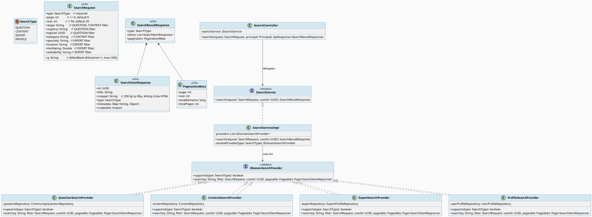
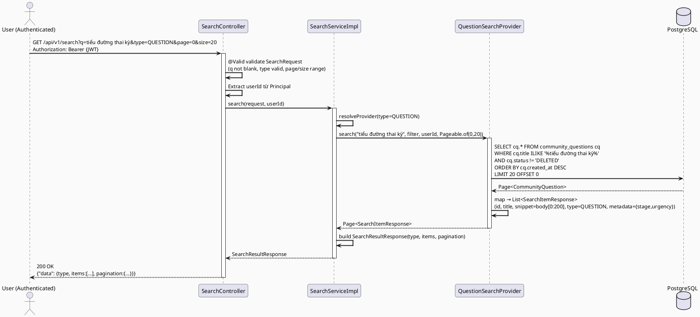
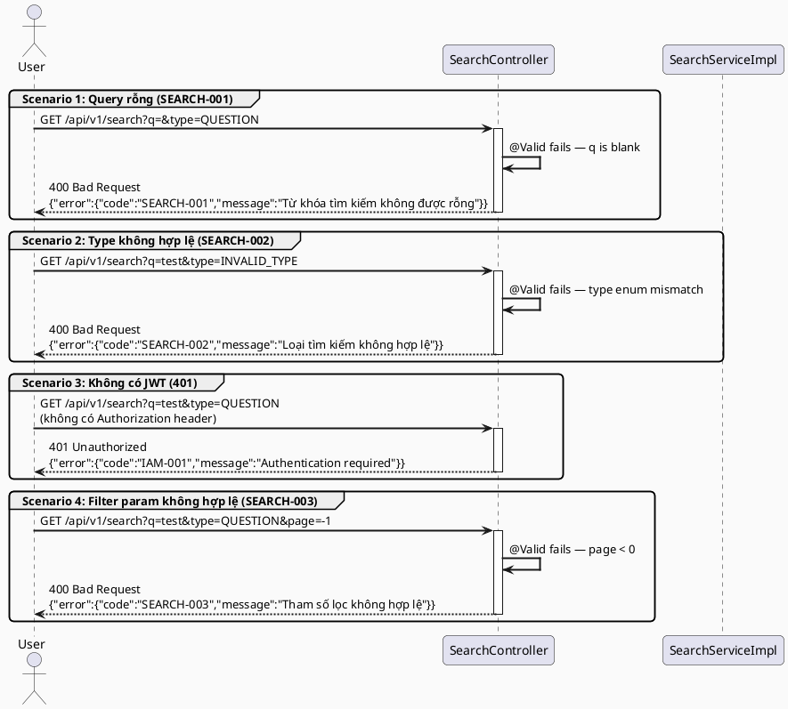

# ENGINEERING DOCUMENTATION STANDARD (EDS) v2.0
# Technical Design Specification — UC-13 Search and Filter

| Field              | Value                             |
| ------------------ | --------------------------------- |
| **Document ID**    | `CB-SEARCH-IMP-013`               |
| **Version**        | `1.0`                             |
| **Date**           | `2026-06-26`                      |
| **Status**         | `Implemented`                     |
| **Document Owner** | `PhuongNT`                        |
| **Author**         | `AI Agent`                        |
| **Reviewed by**    | `[Tech Lead]`                     |
| **DPO Sign-off**   | `[ ] Pending`                     |
| **Approved by**    | `[Principal Architect]`           |
| **Last Review**    | `2026-06-26`                      |
| **Based on EDS**   | `v2.0`                            |

---

## CHANGELOG

> **Policy 4.4 — Immutable History:** Không bao giờ xóa thông tin cũ. Mọi thay đổi phải ghi vào bảng này.

| Ngày       | Người thực hiện | Nội dung thay đổi                                          |
| ---------- | --------------- | ---------------------------------------------------------- |
| 2026-06-26 | AI Agent        | Tạo tài liệu lần đầu cho UC-13 Search and Filter          |
| 2026-07-04 | AI Agent        | Implemented — search service/controller/provider tests all green (verified independently) |
| 2026-07-04 | AI Agent        | Approved by user — proceeding to implementation           |

---

## MỤC LỤC

1. [Tổng quan Module](#1-tổng-quan-module)
2. [Ma trận Truy vết (Traceability Matrix)](#2-ma-trận-truy-vết-traceability-matrix)
3. [Architecture Decision Records (ADR)](#3-architecture-decision-records-adr)
4. [Non-Functional Requirements & SLA](#4-non-functional-requirements--sla)
5. [Static Modeling (Mô hình Tĩnh)](#5-static-modeling-mô-hình-tĩnh)
6. [Dynamic Modeling (Mô hình Động)](#6-dynamic-modeling-mô-hình-động)
7. [Domain Event Catalog](#7-domain-event-catalog)
8. [Interface Specification (Đặc tả Giao diện)](#8-interface-specification-đặc-tả-giao-diện)
9. [API Specification](#9-api-specification)
10. [Bảng mã lỗi (Error Codes)](#10-bảng-mã-lỗi-error-codes)
11. [Quy trình Triển khai (Step-by-Step)](#11-quy-trình-triển-khai-step-by-step)
12. [Rollback & Incident Runbook](#12-rollback--incident-runbook)
13. [Kịch bản Kiểm thử Chi tiết](#13-kịch-bản-kiểm-thử-chi-tiết)
14. [Phương pháp Xác minh](#14-phương-pháp-xác-minh)
15. [Mẫu thử thực tế (API Verification Samples)](#15-mẫu-thử-thực-tế-api-verification-samples)
16. [Bảng tổng hợp phân quyền (Authorization Matrix)](#16-bảng-tổng-hợp-phân-quyền-authorization-matrix)
17. [AI Prompt Constraints (CASE 2.0)](#17-ai-prompt-constraints-case-20)

---

## 1. Tổng quan Module

> UC-13 cho phép người dùng đã xác thực tìm kiếm nội dung trên nền tảng CareBridge theo nhiều loại: câu hỏi cộng đồng, bài viết/nội dung đã kiểm duyệt, chuyên gia, và hồ sơ cộng đồng. Tìm kiếm sử dụng PostgreSQL `ILIKE` để tránh phụ thuộc vào Elasticsearch. Kết quả phân trang và có thể lọc theo từng domain. Không hỗ trợ full-text search nâng cao ở milestone M3 Alpha.

| Field                     | Value                                                                           |
| ------------------------- | ------------------------------------------------------------------------------- |
| **Module Name**           | `Search and Filter`                                                             |
| **Bounded Context**       | `search` (cross-cutting module mới)                                             |
| **UC ID**                 | `UC-13`                                                                         |
| **SRS Reference**         | `3.1.1.13`                                                                      |
| **Platform**              | `Mobile App (Flutter) + Web App (React)`                                        |
| **Data Classification**   | `Internal`                                                                      |
| **Compliance Scope**      | `N/A` *(kết quả tìm kiếm không chứa PII trực tiếp; RBAC áp dụng per result)*  |
| **Upstream Dependencies** | `security (JWT Auth)`, `community (questions)`, `content (articles)`, `expert-profile`, `profile` |
| **Downstream Consumers**  | `UI/UX layer (Mobile + Web)` — hiển thị kết quả tìm kiếm                      |

---

## 2. Ma trận Truy vết (Traceability Matrix)

> Ánh xạ trực tiếp: [Mã yêu cầu] → [Thành phần Code] → [Mục tiêu Tuân thủ].

| Requirement ID    | Loại          | Mô tả yêu cầu                                                              | Thành phần Code                                                              | Compliance Target | ADR liên quan |
| ----------------- | ------------- | --------------------------------------------------------------------------- | ---------------------------------------------------------------------------- | ----------------- | ------------- |
| UC-13             | User Story    | Người dùng tìm kiếm câu hỏi, bài viết, chuyên gia, hồ sơ                  | `SearchController.search()`                                                  | —                 | ADR-001       |
| BR-SEARCH-AUTH    | Business Rule | Chỉ người dùng đã xác thực mới được tìm kiếm                               | `SearchController` — `@PreAuthorize("isAuthenticated()")`                   | —                 | ADR-001       |
| BR-SEARCH-QUERY   | Business Rule | Query không được rỗng; tối thiểu 1 ký tự, tối đa 200 ký tự               | `SearchRequest.query` — `@NotBlank @Size(min=1, max=200)`                   | —                 | —             |
| BR-SEARCH-TYPE    | Business Rule | `type` phải thuộc: QUESTION, CONTENT, EXPERT, PROFILE                      | `SearchType` enum trong `search` package                                     | —                 | ADR-001       |
| BR-SEARCH-PAGE    | Business Rule | Phân trang: page >= 0, size 1–50 (default 20)                               | `SearchRequest.page`, `SearchRequest.size`                                   | —                 | —             |
| BR-SEARCH-RBAC    | Business Rule | Kết quả mỗi loại phải tuân thủ RBAC của domain tương ứng                   | `SearchServiceImpl` — kiểm tra quyền trước khi include result               | —                 | ADR-002       |
| BR-SEARCH-FILTER  | Business Rule | Mỗi loại có filter riêng (stage, urgency, specialty, v.v.)                  | `QuestionSearchFilter`, `ContentSearchFilter`, `ExpertSearchFilter`          | —                 | ADR-001       |
| SRS-3.1.1.13      | Functional    | Hỗ trợ tìm theo text và filter theo domain-specific params                  | `SearchServiceImpl.search()`                                                 | —                 | —             |

---

## 3. Architecture Decision Records (ADR)

### ADR-001 — Tạo module `search` cross-cutting với PostgreSQL ILIKE

| Field        | Value                          |
| ------------ | ------------------------------ |
| **Status**   | `Accepted`                     |
| **Deciders** | `PhuongNT — Tech Lead`         |
| **Date**     | `2026-06-26`                   |
| **Supersedes** | `—`                          |

#### Bối cảnh (Context)
UC-13 yêu cầu tìm kiếm thống nhất qua nhiều domain (community, content, expert, profile). Hệ thống CareBridge là modular monolith dùng PostgreSQL — không có Elasticsearch hay Redis. Cần một endpoint thống nhất nhưng không phá vỡ bounded context của từng domain.

#### Các phương án đã xem xét (Options Considered)

| Phương án | Mô tả                                                            | Ưu điểm                                              | Nhược điểm                                        |
| --------- | ---------------------------------------------------------------- | ---------------------------------------------------- | ------------------------------------------------- |
| A         | Module `search` riêng, gọi sang service của từng domain         | Tách biệt rõ; dễ extend; single entry point cho UI   | Cần interface trong từng domain để expose search  |
| B         | Mỗi domain có endpoint `/search` riêng — không có unified entry | Đơn giản hơn per domain                              | UI phải gọi nhiều API; khó ranking unified        |
| C         | Elasticsearch riêng                                              | Full-text search tốt nhất                            | Ngoài scope; không có trong stack được approve    |

#### Quyết định (Decision)
Chọn **Phương án A**: tạo package `com.carebridge.backend.search` với `SearchController`, `SearchService`. Service này gọi interface search của từng domain qua Spring beans (không gọi HTTP). Dùng `ILIKE '%query%'` trong PostgreSQL. Out of scope: relevance ranking nâng cao, full-text index.

#### Hệ quả (Consequences)

**Tích cực:**
- Single endpoint cho UI — dễ dùng.
- Mỗi domain vẫn kiểm soát query logic của mình.
- Không cần infrastructure mới.

**Tiêu cực / Trade-offs:**
- `ILIKE` trên large table chậm hơn GIN index — cần index `pg_trgm` nếu dữ liệu lớn (planned for M4).
- Cần interface search trong mỗi domain — tạo coupling nhẹ.

**Compliance Impact:**
- N/A — tìm kiếm không lưu PII, chỉ trả về dữ liệu đã public hoặc theo quyền.

---

### ADR-002 — RBAC Per Result Type trong Search

| Field        | Value                          |
| ------------ | ------------------------------ |
| **Status**   | `Accepted`                     |
| **Deciders** | `PhuongNT — Tech Lead`         |
| **Date**     | `2026-06-26`                   |

#### Bối cảnh (Context)
Kết quả tìm kiếm có thể chứa nội dung chỉ dành cho user có quyền cụ thể (vd: expert chỉ visible khi ACTIVE, content chỉ visible khi PUBLISHED). Search service cần enforce những rule này.

#### Các phương án đã xem xét (Options Considered)

| Phương án | Mô tả                                                   | Ưu điểm                      | Nhược điểm                                   |
| --------- | ------------------------------------------------------- | ---------------------------- | -------------------------------------------- |
| A         | Filter at query level trong domain search service       | Đơn giản; domain owns logic  | Mỗi domain phải implement filter             |
| B         | Post-process filter ở `SearchService` sau khi lấy data | Centralized                  | Search service biết quá nhiều về domain logic|

#### Quyết định (Decision)
Chọn **Phương án A**: mỗi domain search method tự áp dụng filter visibility. `SearchService` chỉ aggregate kết quả.

#### Hệ quả (Consequences)

**Tích cực:**
- Domain logic không rò rỉ ra `search` module.

**Tiêu cực / Trade-offs:**
- Mỗi domain phải duy trì visibility filter trong search query của mình.

---

## 4. Non-Functional Requirements & SLA

### 4.1. Performance & Availability

| Category     | Requirement                   | Target SLA  | Measurement Method  | Compliance Basis |
| ------------ | ----------------------------- | ----------- | ------------------- | ---------------- |
| Latency      | API response (p99)            | `< 500ms`   | k6 load test        | —                |
| Availability | Uptime (monthly)              | `99.9%`     | Uptime monitor      | —                |
| Throughput   | Concurrent search req/s       | `200 req/s` | Load test           | —                |

### 4.2. Data Integrity & Retention

| Category    | Requirement                            | Target  | Verification Method    | Compliance Basis |
| ----------- | -------------------------------------- | ------- | ---------------------- | ---------------- |
| Consistency | Kết quả search phản ánh dữ liệu hiện tại | Near real-time | Integration test | —            |
| No PII leak | Search result không chứa PII nhạy cảm | 100%    | Manual + automated review | N/A          |

### 4.3. Security

| Category              | Requirement            | Target     | Verification Method    | Compliance Basis |
| --------------------- | ---------------------- | ---------- | ---------------------- | ---------------- |
| SQL Injection         | ILIKE dùng bind params | 100%       | SAST / code review     | OWASP A03:2021   |
| Encryption in transit | Tất cả endpoint        | TLS 1.3+   | SSL Labs scan          | —                |
| Access control        | Authenticated only     | Reject 401 | Auth Matrix (§16)      | —                |

### 4.4. Scalability & Capacity Planning

> Dự kiến: 10,000 users active, 1,000 search req/day. Giai đoạn M3 Alpha dùng ILIKE. Nếu dataset > 100,000 records, cần thêm `pg_trgm` GIN index hoặc PostgreSQL full-text search (tsvector) trong M4.

---

## 5. Static Modeling (Mô hình Tĩnh)

### 5.1. Class Diagram (PlantUML)



### 5.2. Data Structure (Flyway SQL Migration)

> UC-13 không tạo bảng mới. Tìm kiếm được thực hiện trực tiếp trên các bảng hiện có của từng domain (`community_questions`, `contents`, `expert_profiles`, `user_profiles`) bằng `ILIKE`. Thêm index hỗ trợ tìm kiếm nếu chưa có:

```sql
-- === UC-13 SEARCH PERFORMANCE INDEXES ===
-- File: V{n}__add_search_indexes.sql

-- Index cho community_questions.title (nếu chưa có)
CREATE INDEX IF NOT EXISTS idx_community_questions_title
    ON community_questions USING btree (title text_pattern_ops);

-- Index cho contents.title (nếu chưa có)
CREATE INDEX IF NOT EXISTS idx_contents_title
    ON contents USING btree (title text_pattern_ops);

-- Index cho expert_profiles.display_name (nếu chưa có)
CREATE INDEX IF NOT EXISTS idx_expert_profiles_display_name
    ON expert_profiles USING btree (display_name text_pattern_ops);

-- Index cho user_profiles.display_name (nếu chưa có)
CREATE INDEX IF NOT EXISTS idx_user_profiles_display_name_search
    ON user_profiles USING btree (display_name text_pattern_ops);
```

> **Ghi chú:** `text_pattern_ops` hỗ trợ `LIKE '%query%'` hiệu quả hơn btree thông thường. Nếu dataset lớn (>100k rows), plan cho M4: nâng cấp lên `tsvector` full-text index hoặc GIN với `pg_trgm`.

---

## 6. Dynamic Modeling (Mô hình Động)

### 6.1. Sequence Diagram — Happy Path (PlantUML)



### 6.2. Sequence Diagram — Error Path (PlantUML)



### 6.3. State Machine

> UC-13 là stateless read-only operation — không có state machine.

---

## 7. Domain Event Catalog

### 7.1. Events Published (Phát ra)

| Event Name | Trigger | Publisher | Subscriber(s) | Payload Schema | Async? |
|------------|---------|-----------|---------------|----------------|--------|
| _(Không có)_ | — | — | — | — | — |

> UC-13 là read-only. Không phát ra domain event.

### 7.2. Events Consumed (Tiêu thụ)

| Event Name | Source | Handler | Action thực hiện |
|------------|--------|---------|------------------|
| _(Không có)_ | — | — | — |

### 7.3. Payload Schema

> Không áp dụng cho UC-13.

---

## 8. Interface Specification (Đặc tả Giao diện)

### 8.1. Service Interface

```java
// SearchRequest.java — Input DTO
// Package: com.carebridge.backend.search.dto.request
// @version 1.0
public class SearchRequest {
    @NotBlank(message = "Từ khóa tìm kiếm không được rỗng")
    @Size(min = 1, max = 200, message = "Từ khóa tìm kiếm phải từ 1-200 ký tự")
    private String q;

    @NotNull(message = "Loại tìm kiếm không được rỗng")
    private SearchType type;

    @Min(0)
    private int page = 0;

    @Min(1) @Max(50)
    private int size = 20;

    // Domain-specific filter fields (tất cả optional)
    private String stage;          // QUESTION, CONTENT
    private String urgency;        // QUESTION
    private UUID topicId;          // QUESTION
    private String category;       // CONTENT
    private String specialty;      // EXPERT
    private String location;       // EXPERT
    private Double minRating;      // EXPERT
    private String availability;   // EXPERT
}

// SearchItemResponse.java — Output DTO
// @version 1.0
public class SearchItemResponse {
    private UUID id;
    private String title;
    private String snippet;        // max 200 ký tự, không chứa HTML
    private SearchType type;
    private Map<String, Object> metadata;
    private Instant createdAt;
}

// SearchResultResponse.java — Output DTO
// @version 1.0
public class SearchResultResponse {
    private SearchType type;
    private List<SearchItemResponse> items;
    private PaginationMeta pagination;
}

// ISearchService.java — Service Contract
// @version 1.0
public interface ISearchService {
    /**
     * Tìm kiếm nội dung theo từ khóa và loại.
     * @param request  Tham số tìm kiếm đã validated
     * @param userId   ID người dùng hiện tại từ JWT
     * @return SearchResultResponse  Kết quả phân trang
     * @throws ValidationException [SEARCH-001] Khi query rỗng
     * @throws ValidationException [SEARCH-002] Khi type không hợp lệ
     * @throws ValidationException [SEARCH-003] Khi filter param không hợp lệ
     */
    SearchResultResponse search(SearchRequest request, UUID userId);
}

// IDomainSearchProvider.java — Provider Contract (strategy pattern)
// @version 1.0
public interface IDomainSearchProvider {
    boolean supports(SearchType type);
    Page<SearchItemResponse> search(String q, SearchRequest filter, UUID userId, Pageable pageable);
}
```

### 8.2. Repository Interface

> UC-13 không tạo repository mới. Tận dụng repository hiện có của từng domain qua `IDomainSearchProvider`. Mỗi provider inject repository của domain mình.

```java
// Ví dụ: QuestionSearchProvider sử dụng CommunityQuestionRepository hiện có
// với custom query method:

// Trong CommunityQuestionRepository (thêm method mới):
// @version 1.0 — method mới thêm cho UC-13
Page<CommunityQuestion> findByTitleContainingIgnoreCaseAndStatusNot(
    String title, QuestionStatus excludedStatus, Pageable pageable);

// Hoặc dùng @Query với JPQL ILIKE:
@Query("SELECT cq FROM CommunityQuestion cq WHERE LOWER(cq.title) LIKE LOWER(CONCAT('%', :q, '%')) AND cq.status <> 'DELETED'")
Page<CommunityQuestion> searchByTitle(@Param("q") String q, Pageable pageable);
```

---

## 9. API Specification

### 9.1. Endpoints Table

| Method | Path               | Auth Level  | Required Roles                                       | Rate Limit | Idempotent? |
|--------|--------------------|-------------|------------------------------------------------------|------------|-------------|
| `GET`  | `/api/v1/search`   | JWT Bearer  | `ROLE_MOTHER`, `ROLE_EXPERT`, `ROLE_ADMIN`           | 300/min    | Yes         |

### 9.2. Request / Response Schemas

#### `GET /api/v1/search` — Tìm kiếm thống nhất

**Request Headers:**
```
Authorization: Bearer {JWT_TOKEN}
Content-Type: application/json
X-Correlation-Id: {uuid}
```

**Query Parameters:**

| Param        | Type    | Required | Default | Mô tả                                                        |
|--------------|---------|----------|---------|--------------------------------------------------------------|
| `q`          | string  | Yes      | —       | Từ khóa tìm kiếm, 1–200 ký tự                               |
| `type`       | enum    | Yes      | —       | `QUESTION` \| `CONTENT` \| `EXPERT` \| `PROFILE`             |
| `page`       | int     | No       | 0       | Số trang (bắt đầu từ 0)                                     |
| `size`       | int     | No       | 20      | Kích thước trang, 1–50                                       |
| `stage`      | string  | No       | —       | Giai đoạn thai kỳ (QUESTION, CONTENT)                       |
| `urgency`    | string  | No       | —       | Mức độ cấp bách (QUESTION)                                  |
| `topicId`    | UUID    | No       | —       | ID chủ đề (QUESTION)                                         |
| `category`   | string  | No       | —       | Danh mục nội dung (CONTENT)                                  |
| `specialty`  | string  | No       | —       | Chuyên khoa (EXPERT)                                         |
| `location`   | string  | No       | —       | Địa điểm (EXPERT)                                            |
| `minRating`  | double  | No       | —       | Đánh giá tối thiểu (EXPERT)                                  |
| `availability` | string | No     | —       | Trạng thái khả dụng (EXPERT)                                |

**Response — 200 OK (Happy Path) — type=QUESTION:**
```json
{
  "data": {
    "type": "QUESTION",
    "items": [
      {
        "id": "550e8400-e29b-41d4-a716-446655440001",
        "title": "Tiểu đường thai kỳ có ảnh hưởng đến em bé không?",
        "snippet": "Mình vừa được bác sĩ chẩn đoán tiểu đường thai kỳ ở tuần 28. Mình lo lắng không biết...",
        "type": "QUESTION",
        "metadata": {
          "stage": "THIRD_TRIMESTER",
          "urgency": "NORMAL",
          "answerCount": 3
        },
        "createdAt": "2026-06-20T08:00:00.000Z"
      }
    ],
    "pagination": {
      "page": 0,
      "size": 20,
      "totalElements": 42,
      "totalPages": 3
    }
  },
  "message": "Search completed successfully",
  "timestamp": "2026-06-26T10:00:00.000Z"
}
```

**Response — 400 Bad Request (Query rỗng):**
```json
{
  "error": {
    "code": "SEARCH-001",
    "message": "Từ khóa tìm kiếm không được rỗng",
    "details": [
      { "field": "q", "message": "q must not be blank" }
    ]
  }
}
```

**Response — 400 Bad Request (Type không hợp lệ):**
```json
{
  "error": {
    "code": "SEARCH-002",
    "message": "Loại tìm kiếm không hợp lệ. Giá trị hợp lệ: QUESTION, CONTENT, EXPERT, PROFILE"
  }
}
```

---

## 10. Bảng mã lỗi (Error Codes)

> Tiền tố mã lỗi: `SEARCH-` cho Search module.

| Code         | HTTP Status | Message (EN)                        | Message (VI)                                            | Trigger Condition                                    |
| ------------ | ----------- | ----------------------------------- | ------------------------------------------------------- | ---------------------------------------------------- |
| `SEARCH-001` | 400         | Search query must not be empty      | Từ khóa tìm kiếm không được rỗng                       | `q` là null, rỗng, hoặc chỉ có whitespace           |
| `SEARCH-002` | 400         | Invalid search type                 | Loại tìm kiếm không hợp lệ                             | `type` không thuộc enum SearchType                   |
| `SEARCH-003` | 400         | Invalid filter parameter            | Tham số lọc không hợp lệ                               | `page < 0`, `size < 1`, `size > 50`, filter sai kiểu|
| `SEARCH-004` | 401         | Authentication required             | Yêu cầu đăng nhập                                      | Không có JWT hoặc JWT hết hạn                        |
| `SEARCH-005` | 500         | Search service error                | Lỗi hệ thống khi tìm kiếm                              | DB error, provider exception                         |

---

## 11. Quy trình Triển khai (Step-by-Step)

### 11.1. Prerequisites

- [ ] ADR-001 và ADR-002 đã được Accepted (xem §3)
- [ ] Blueprint đã được Principal Architect approve
- [ ] Các bảng domain hiện có đã tồn tại (community_questions, contents, expert_profiles, user_profiles)
- [ ] Môi trường staging đã sẵn sàng

### 11.2. Pre-Migration Checklist

- [ ] Đã backup DB: `pg_dump -h [host] -U [user] carebridge > backup_20260626.sql`
- [ ] Migration index đã chạy thành công trên staging ≥ 24 giờ
- [ ] Rollback script (DROP INDEX) đã được test trên staging

### 11.3. Implementation Steps

#### Chặng 1 — Flyway Migration (Search Indexes)

```sql
-- File: src/main/resources/db/migration/V{n}__add_search_indexes.sql
-- Xem DDL đầy đủ tại §5.2
CREATE INDEX IF NOT EXISTS idx_community_questions_title ON community_questions USING btree (title text_pattern_ops);
CREATE INDEX IF NOT EXISTS idx_contents_title ON contents USING btree (title text_pattern_ops);
```

#### Chặng 2 — Tạo package `search`

```java
// Cấu trúc package:
// com.carebridge.backend.search/
//   ├── controller/SearchController.java
//   ├── service/ISearchService.java
//   ├── service/impl/SearchServiceImpl.java
//   ├── provider/IDomainSearchProvider.java
//   ├── provider/impl/QuestionSearchProvider.java
//   ├── provider/impl/ContentSearchProvider.java
//   ├── provider/impl/ExpertSearchProvider.java
//   ├── provider/impl/ProfileSearchProvider.java
//   ├── dto/request/SearchRequest.java
//   └── dto/response/SearchItemResponse.java
//   └── dto/response/SearchResultResponse.java
//   └── dto/response/PaginationMeta.java
//   └── enums/SearchType.java
```

#### Chặng 3 — Implement SearchServiceImpl

```java
@Service
public class SearchServiceImpl implements ISearchService {

    private final List<IDomainSearchProvider> providers;

    public SearchServiceImpl(List<IDomainSearchProvider> providers) {
        this.providers = providers;
    }

    @Override
    public SearchResultResponse search(SearchRequest request, UUID userId) {
        IDomainSearchProvider provider = providers.stream()
            .filter(p -> p.supports(request.getType()))
            .findFirst()
            .orElseThrow(() -> new ValidationException("SEARCH-002", "Invalid search type"));

        Pageable pageable = PageRequest.of(request.getPage(), request.getSize());
        Page<SearchItemResponse> page = provider.search(request.getQ(), request, userId, pageable);

        return SearchResultResponse.builder()
            .type(request.getType())
            .items(page.getContent())
            .pagination(PaginationMeta.from(page))
            .build();
    }
}
```

#### Chặng 4 — Verification sau deploy

```bash
# Kiểm tra health
curl -X GET https://[host]/api/v1/health
# Expected: {"status": "ok"}

# Test search
curl -X GET "https://[host]/api/v1/search?q=thai%20ky&type=QUESTION&page=0&size=5" \
  -H "Authorization: Bearer [JWT]"
# Expected: 200 OK với danh sách questions
```

### 11.4. Deployment Checklist

- [ ] Migration index chạy thành công
- [ ] Health check endpoint trả về 200
- [ ] GET `/api/v1/search?q=test&type=QUESTION` với JWT hợp lệ → 200 OK
- [ ] GET `/api/v1/search` không có JWT → 401
- [ ] GET `/api/v1/search?q=&type=QUESTION` → 400 + `SEARCH-001`
- [ ] GET `/api/v1/search?q=test&type=INVALID` → 400 + `SEARCH-002`

---

## 12. Rollback & Incident Runbook

### 12.1. Điều kiện kích hoạt Rollback

| Điều kiện                            | Ngưỡng                  | Người quyết định  |
| ------------------------------------ | ----------------------- | ----------------- |
| Error rate tăng đột biến             | > 5% trong 5 phút       | On-call Engineer  |
| Latency p99 vượt ngưỡng              | > 2000ms (4x baseline)  | On-call Engineer  |
| DB lock / slow query do index        | > 1 phút                | Tech Lead         |
| Kết quả search sai / lộ data        | Bất kỳ case nào         | Tech Lead         |

### 12.2. Rollback Procedure

```bash
# Bước 1: Drop search indexes
psql -h $DB_HOST -U $DB_USER -d $DB_NAME \
  -c "DROP INDEX IF EXISTS idx_community_questions_title;"
psql -h $DB_HOST -U $DB_USER -d $DB_NAME \
  -c "DROP INDEX IF EXISTS idx_contents_title;"
psql -h $DB_HOST -U $DB_USER -d $DB_NAME \
  -c "DELETE FROM flyway_schema_history WHERE version = '{n}';"

# Bước 2: Re-deploy phiên bản cũ
kubectl rollout undo deployment/carebridge-api

# Bước 3: Verify
kubectl rollout status deployment/carebridge-api
curl -X GET https://[host]/api/v1/health
```

### 12.3. Notification Protocol

| Thời điểm          | Người nhận    | Kênh              | Template                                                   |
| ------------------ | ------------- | ----------------- | ---------------------------------------------------------- |
| Ngay khi phát hiện | On-call team  | Slack `#incident` | "SEARCH UC-13 incident detected: [mô tả]"                 |
| Trong 30 phút      | Tech Lead     | Email/Slack       | Báo cáo tình trạng và action plan                          |

### 12.4. Post-Incident Review (PIR)

> Bắt buộc hoàn thành PIR document trong vòng **48 giờ** sau khi incident được resolve.

**PIR Template:**
- **Timeline:** Diễn biến từng bước theo thứ tự thời gian
- **Root Cause:** Nguyên nhân gốc rễ (5 Whys)
- **Impact:** Số users ảnh hưởng, chức năng bị gián đoạn
- **Remediation:** Các bước đã thực hiện để khắc phục
- **Prevention:** Action items để tránh tái diễn

---

## 13. Kịch bản Kiểm thử Chi tiết

> **Policy (EDS v2.0 — Test Data):** Mọi test dùng dữ liệu `SYNTHETIC`. Tuyệt đối không dùng PII thật.

### 13.1. Unit Tests

#### TC-UNIT-001 — Tìm kiếm câu hỏi hợp lệ (Happy Path)

```gherkin
Feature: Search and Filter
  Background:
    Given test data classification: SYNTHETIC
    And user "user-test-001" đã xác thực với JWT hợp lệ
    And DB có 5 community_questions với title chứa "thai kỳ"

  Scenario: Tìm kiếm câu hỏi theo từ khóa
    Given request: q="thai kỳ", type=QUESTION, page=0, size=20
    When SearchServiceImpl.search(request, userId) được gọi
    Then response.type = QUESTION
    And response.items.size() = 5
    And response.pagination.totalElements = 5
    And mỗi item có snippet không rỗng và không chứa HTML tags
```

**Hàm được test:** `SearchServiceImpl.search()`
**Invariant kiểm tra:** Provider đúng được chọn; pagination đúng; snippet được truncate.

#### TC-UNIT-002 — Query rỗng → lỗi SEARCH-001

```gherkin
  Scenario: Tìm kiếm với query rỗng
    Given request: q="", type=QUESTION
    When PATCH /api/v1/search được gọi
    Then response status là 400
    And response.error.code = "SEARCH-001"
```

#### TC-UNIT-003 — Type không hợp lệ → lỗi SEARCH-002

```gherkin
  Scenario: Type không hợp lệ
    Given request: q="test", type=INVALID
    When GET /api/v1/search được gọi
    Then response status là 400
    And response.error.code = "SEARCH-002"
```

#### TC-UNIT-004 — Filter EXPERT với specialty

```gherkin
  Scenario: Tìm chuyên gia theo chuyên khoa
    Given request: q="sản khoa", type=EXPERT, specialty="OBSTETRICS"
    And DB có 3 expert_profiles với specialty=OBSTETRICS và display_name chứa "sản"
    When SearchServiceImpl.search(request, userId) được gọi
    Then response.items.size() <= 3
    And mỗi item.metadata.specialty = "OBSTETRICS"
```

### 13.2. Integration Tests

#### TC-INT-001 — SearchService + QuestionSearchProvider phối hợp đúng

```gherkin
  Scenario: Tìm kiếm câu hỏi qua real DB
    Given test data classification: SYNTHETIC
    And PostgreSQL container running
    And Flyway migration applied
    And seed: 10 community_questions, 3 có title chứa "sốt"
    When SearchServiceImpl.search({q:"sốt", type:QUESTION}, userId) được gọi
    Then QuestionSearchProvider.search() được gọi 1 lần
    And kết quả chứa đúng 3 items
    And không có item nào có status=DELETED
```

**External dependencies:** `PostgreSQL (Testcontainers)`
**Mock strategy:** Test container real DB; không mock repository.

### 13.3. E2E / Security Tests

#### TC-E2E-001 — Luồng hoàn chỉnh qua API

```gherkin
  Scenario: GET /api/v1/search thành công
    Given user đã đăng nhập với JWT hợp lệ
    When GET /api/v1/search?q=thai+ky&type=QUESTION&page=0&size=5 được gọi với:
      | Header          | Value              |
      | Authorization   | Bearer {token}     |
      | X-Correlation-Id| {uuid}             |
    Then response status là 200
    And response.data.type = "QUESTION"
    And response.data.items là array
    And response.data.pagination tồn tại

  Scenario: Không có JWT → 401
    When GET /api/v1/search?q=test&type=QUESTION được gọi không có Authorization
    Then response status là 401

  Scenario: SQL Injection attempt
    Given q = "'; DROP TABLE community_questions; --"
    When GET /api/v1/search?q=...&type=QUESTION được gọi
    Then response status là 200 (query được xử lý an toàn bằng bind params)
    And bảng community_questions vẫn tồn tại trong DB
```

---

## 14. Phương pháp Xác minh

### 14.1. Database Inspection

```sql
-- Verify index được tạo
SELECT indexname, tablename FROM pg_indexes
WHERE indexname IN ('idx_community_questions_title', 'idx_contents_title');

-- Verify ILIKE query dùng index (EXPLAIN ANALYZE)
EXPLAIN ANALYZE
SELECT * FROM community_questions
WHERE title ILIKE '%thai kỳ%'
LIMIT 20;

-- Verify không có slow query leak
SELECT query, mean_exec_time, calls
FROM pg_stat_statements
WHERE query ILIKE '%community_questions%'
ORDER BY mean_exec_time DESC;
```

### 14.2. Log / Audit Verification

```bash
# Verify search không log PII
kubectl logs -l app=carebridge-api | grep "SearchController" | tail -20

# Verify không có SQL injection trong logs
kubectl logs -l app=carebridge-api | grep -i "DROP\|DELETE\|TRUNCATE" | head -5
# Expected: No suspicious queries in application logs
```

### 14.3. Tool-based Verification

```bash
# Verify TLS 1.3
openssl s_client -connect [host]:443 -tls1_3 2>&1 | grep "Protocol"

# OWASP ZAP scan cho search endpoint
zap-cli quick-scan "https://[host]/api/v1/search?q=test&type=QUESTION"
```

---

## 15. Mẫu thử thực tế (API Verification Samples)

### 15.1. Happy Path

```bash
# Lấy JWT
TOKEN=$(curl -s -X POST https://[host]/api/v1/auth/login \
  -H "Content-Type: application/json" \
  -d '{"email":"test@example.com","password":"TestPass123!"}' | jq -r '.data.accessToken')

# Tìm kiếm câu hỏi
curl -X GET "https://[host]/api/v1/search?q=thai+ky&type=QUESTION&page=0&size=5" \
  -H "Authorization: Bearer $TOKEN" \
  -H "X-Correlation-Id: $(uuidgen)"
```

**Expected Response (200):**
```json
{
  "data": {
    "type": "QUESTION",
    "items": [
      {
        "id": "550e8400-...",
        "title": "Tiểu đường thai kỳ có nguy hiểm không?",
        "snippet": "Mình đang mang thai tuần 28 và vừa được chẩn đoán...",
        "type": "QUESTION",
        "metadata": {"stage": "THIRD_TRIMESTER", "urgency": "NORMAL"},
        "createdAt": "2026-06-20T08:00:00.000Z"
      }
    ],
    "pagination": {"page": 0, "size": 5, "totalElements": 12, "totalPages": 3}
  }
}
```

### 15.2. Error Paths

```bash
# Query rỗng → 400
curl -X GET "https://[host]/api/v1/search?q=&type=QUESTION" \
  -H "Authorization: Bearer $TOKEN"
```

**Expected Response (400):**
```json
{
  "error": {
    "code": "SEARCH-001",
    "message": "Từ khóa tìm kiếm không được rỗng",
    "details": [{"field": "q", "message": "q must not be blank"}]
  }
}
```

```bash
# Không có JWT → 401
curl -X GET "https://[host]/api/v1/search?q=test&type=QUESTION"
```

**Expected Response (401):**
```json
{ "error": { "code": "IAM-001", "message": "Authentication required" } }
```

---

## 16. Bảng tổng hợp phân quyền (Authorization Matrix)

> Nguyên tắc **Least Privilege**: Chỉ người dùng đã xác thực mới được tìm kiếm.

| Endpoint                 | `GUEST` | `ROLE_MOTHER` | `ROLE_EXPERT` | `ROLE_ADMIN` | `ROLE_SYSTEM` |
| ------------------------ | ------- | ------------- | ------------- | ------------ | ------------- |
| `GET /api/v1/search`     | ❌      | ✅            | ✅            | ✅           | ✅            |

**Chú thích:**
- ✅ = Được phép; kết quả được filter theo RBAC của từng domain
- ❌ = 401 Unauthorized (GUEST không có JWT)
- Kết quả EXPERT chỉ trả về expert có trạng thái ACTIVE/VISIBLE
- Kết quả CONTENT chỉ trả về content có trạng thái PUBLISHED

---

## 17. AI Prompt Constraints (CASE 2.0)

### 17.1 Constraint Summary Table

| # | Constraint | Source (ADR/BR) | Last Verified |
| - | ---------- | --------------- | ------------- |
| C1 | `userId` phải lấy từ JWT Principal, KHÔNG từ request param | `BR-SEARCH-AUTH` | `2026-06-26` |
| C2 | Query `q` PHẢI dùng bind params (parameterized query) — KHÔNG nối string trực tiếp vào SQL | `ADR-001; OWASP A03:2021` | `2026-06-26` |
| C3 | `snippet` phải được strip HTML và truncate về tối đa 200 ký tự trước khi trả về client | `BR-SEARCH-QUERY` | `2026-06-26` |
| C4 | Mỗi `IDomainSearchProvider` phải áp dụng visibility filter của domain (vd: không trả về deleted/banned content) | `ADR-002; BR-SEARCH-RBAC` | `2026-06-26` |
| C5 | Controller chỉ validate DTO và delegate sang `ISearchService` — không có query logic | `CLAUDE.md §Architecture` | `2026-06-26` |
| C6 | Không dùng Redis/Elasticsearch — chỉ dùng PostgreSQL ILIKE với bind params | `ADR-001; CLAUDE.md §Stack` | `2026-06-26` |
| C7 | Response PHẢI dùng `SearchResultResponse` DTO — không expose entity trực tiếp | `CLAUDE.md §Architecture` | `2026-06-26` |

### 17.2 Constraint Injection Block (Copy-Paste vào AI Prompt)

```
[CONSTRAINT BLOCK — Module: Search — UC-13 Search and Filter]
Theo TDS CB-SEARCH-IMP-013 và các ADR liên quan:

1. (C1) userId PHẢI lấy từ JWT Principal. KHÔNG nhận userId từ request param hay body.
2. (C2) Mọi query ILIKE PHẢI dùng bind params (Spring Data @Param hoặc JPA Criteria). KHÔNG nối string vào SQL.
3. (C3) snippet PHẢI được strip HTML (loại bỏ tags) và truncate tối đa 200 ký tự trước khi serialize.
4. (C4) Mỗi IDomainSearchProvider PHẢI filter theo visibility: QUESTION (status != DELETED), CONTENT (status = PUBLISHED), EXPERT (status = ACTIVE), PROFILE (accountStatus = ACTIVE).
5. (C5) Controller layer: chỉ @Valid DTO, extract principal, delegate sang ISearchService. Không có query logic.
6. (C6) KHÔNG dùng Redis hay Elasticsearch. Chỉ PostgreSQL ILIKE.
7. (C7) API response PHẢI dùng SearchResultResponse DTO. Không return entity trực tiếp.

[CONTEXT BLOCK]
- Bounded Context: search (cross-cutting)
- Data Classification: Internal
- Compliance: N/A
- Existing interfaces: §8 Service Interface + §8.2 Repository Interface
- Error codes: §10 Error Codes Table (prefix SEARCH-)
- Auth matrix: §16 Authorization Matrix

[TASK BLOCK]
Implement UC-13 Search and Filter thỏa mãn constraints C1–C7.
Output phải tuân thủ §8 Interface Specification.
Tests phải cover §13 Test Scenarios.
```

### 17.3 Constraint Quality Checklist

- [x] Mỗi constraint traceable về ADR hoặc BR cụ thể
- [x] Không có constraint generic
- [x] Mỗi constraint có `Last Verified` date ≤ 2 sprints
- [x] Constraint block có ≥ 3 constraints cụ thể (có 7)
- [x] Constraint block reference §8 Interface
- [x] Constraint block reference §16 Auth Matrix

### 17.4 Anti-Pattern Detection

| AP-ID     | Anti-Pattern           | Dấu hiệu                                               | Hành động                                |
| --------- | ---------------------- | ------------------------------------------------------ | ---------------------------------------- |
| AP-AI-001 | Unconstrained Gen      | Code không match constraint C1-C7 nào                  | Reject — inject lại constraints          |
| AP-AI-003 | Implicit Decision      | Code dùng Redis/Elasticsearch không có trong ADR       | Reject — ADR-001 đã quyết định ILIKE     |
| AP-AI-005 | Hallucinated Contract  | Code import service/type không có trong §8             | Reject — verify contract existence       |

---

## PHỤ LỤC

### A. Glossary

| Thuật ngữ              | Định nghĩa                                                                         |
| ---------------------- | ---------------------------------------------------------------------------------- |
| ILIKE                  | Case-insensitive LIKE trong PostgreSQL                                              |
| Snippet                | Đoạn văn bản rút gọn (max 200 ký tự) từ nội dung để hiển thị trong kết quả search |
| Provider (Strategy)    | Pattern: mỗi IDomainSearchProvider xử lý 1 loại search type                       |
| text_pattern_ops       | Operator class cho index hỗ trợ LIKE/ILIKE prefix query                            |
| Cross-cutting module   | Module không thuộc domain cụ thể nào, phục vụ nhiều domain                        |

### B. Tài liệu tham chiếu

| Document | Link / Path |
| -------- | ----------- |
| SRS UC-13 | `01_Requirements/SRS.md §3.1.1.13` |
| OWASP A03:2021 (SQL Injection) | https://owasp.org/Top10/A03_2021-Injection/ |
| PostgreSQL ILIKE | https://www.postgresql.org/docs/current/functions-matching.html |
| CASE 2.0 Methodology | `08_References/Template/PHASE-3_TDS.md` |
