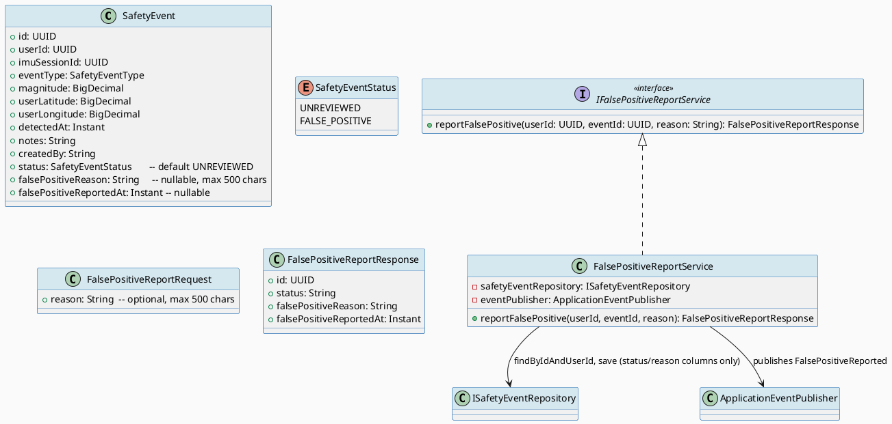
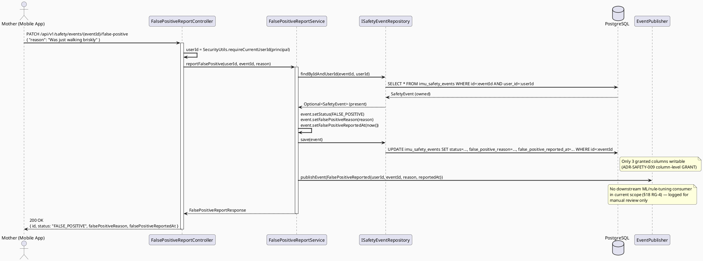
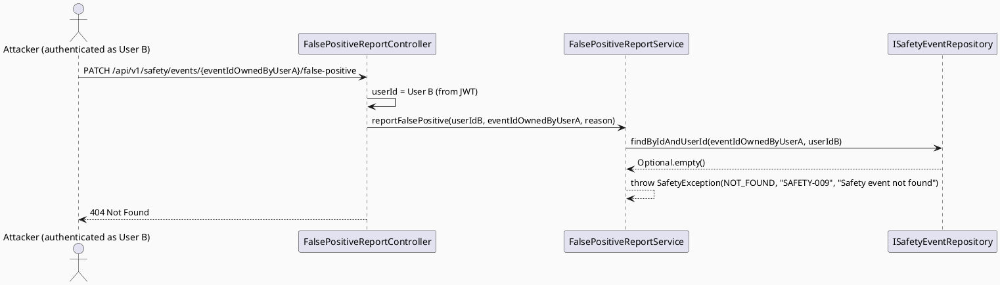
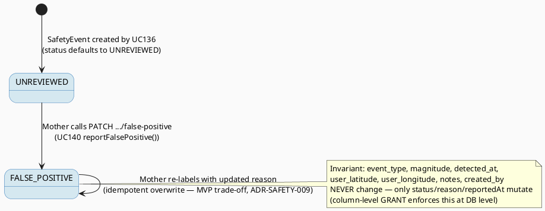

# ENGINEERING DOCUMENTATION STANDARD (EDS) v2.0
# UC140 — Report False Positive Detection

| Field | Value |
|-------|-------|
| **Document ID** | `CB-SAFETY-IMP-006` |
| **Version** | `1.0` |
| **Date** | `2026-07-02` |
| **Status** | `Draft` |
| **Document Owner** | `TV5-Chương` |
| **Author** | `AI Agent — Tech Lead` |
| **Reviewed by** | `[ ] Pending` |
| **DPO Sign-off** | `[ ] Pending` *(bắt buộc — module PII: safety event mutation)* |
| **Approved by** | `[ ] Pending` |
| **Last Review** | `2026-07-02` |
| **Based on EDS** | `v2.0` |

---

## CHANGELOG

| Ngày | Người thực hiện | Nội dung thay đổi |
|------|-----------------|-------------------|
| 2026-07-02 | AI Agent — Tech Lead | Tạo tài liệu lần đầu — TDS cho UC140 Report False Positive Detection (Draft) |
| 2026-07-02 | AI Agent — Technical Architect (reconciliation pass) | Cross-batch schema reconciliation (UC137/138/139/140/141): added explicit ADR-SAFETY-009 reconciliation note evaluating separate-table (`imu_safety_event_labels`) vs. kept direct-mutation (column-level GRANT) approach — decided to KEEP direct mutation, with reasoning documented (ephemeral-workflow vs. permanent-label distinction; no additional forensic protection gained from a child table; simpler UC139 read path). Confirmed migration version `V20260705100000` does not collide with UC137's `V20260705090000` or any applied migration in `05_Development/CareBridgeAPI/src/main/resources/db/migration/`. No table/column names changed — UC140 was already internally consistent with the real schema (`imu_safety_events`). Status remains Draft. |

---

## MỤC LỤC

1. [Tổng quan Module](#1-tổng-quan-module)
2. [Ma trận Truy vết (Traceability Matrix)](#2-ma-trận-truy-vết-traceability-matrix)
3. [Architecture Decision Records (ADR)](#3-architecture-decision-records-adr)
4. [Non-Functional Requirements & SLA](#4-non-functional-requirements--sla)
5. [Static Modeling (Mô hình Tĩnh)](#5-static-modeling-mô-hình-tĩnh)
6. [Dynamic Modeling (Mô hình Động)](#6-dynamic-modeling-mô-hình-động)
7. [Domain Event Catalog](#7-domain-event-catalog)
8. [Interface Specification (Đặc tả Giao diện)](#8-interface-specification-đặc-tả-giao-diện)
9. [API Specification](#9-api-specification)
10. [Bảng mã lỗi (Error Codes)](#10-bảng-mã-lỗi-error-codes)
11. [Quy trình Triển khai (Step-by-Step)](#11-quy-trình-triển-khai-step-by-step)
12. [Rollback & Incident Runbook](#12-rollback--incident-runbook)
13. [Kịch bản Kiểm thử Chi tiết](#13-kịch-bản-kiểm-thử-chi-tiết)
14. [Phương pháp Xác minh](#14-phương-pháp-xác-minh)
15. [Mẫu thử thực tế (API Verification Samples)](#15-mẫu-thử-thực-tế-api-verification-samples)
16. [Bảng tổng hợp phân quyền (Authorization Matrix)](#16-bảng-tổng-hợp-phân-quyền-authorization-matrix)
17. [AI Prompt Constraints (CASE 2.0)](#17-ai-prompt-constraints-case-20)
18. [Open Items / Research Gate Log](#18-open-items--research-gate-log)

---

## 1. Tổng quan Module

> UC140 cho phép Mother gắn nhãn "false positive" (kèm lý do tùy chọn) lên một `imu_safety_events` record thuộc sở hữu của chính mình. Đây là **exception** duy nhất cho append-only rule của UC136 (ADR-SAFETY-006): thay vì INSERT mới, UC140 **UPDATE** 2 cột mới (`status`, `false_positive_reason`) trên record hiện có — một quyết định kiến trúc cần ADR riêng (§3 ADR-SAFETY-009) vì nó phá vỡ giả định "append-only" ban đầu của UC136. Label này **chỉ dùng cho manual review** — không có pipeline ML/rule-tuning tự động nào tiêu thụ nó trong phạm vi hệ thống hiện tại (xác nhận tại §18 RG-4).

| Field | Value |
|-------|-------|
| **Module Name** | `Report False Positive Detection` |
| **Bounded Context** | `safety` |
| **Data Classification** | `Sensitive-PII` *(mutates a Sensitive-PII record)* |
| **Compliance Scope** | `PDPA / Luật 91/2025` |
| **Upstream Dependencies** | `UC136 (DetectSuspectedFallOrImpact — owns imu_safety_events)`, `IAM (JWT)` |
| **Downstream Consumers** | `UC139 View Safety Event History (reads falsePositiveLabel/falsePositiveReason)`. No ML/rule-tuning pipeline consumer exists in current scope (§18 RG-4). |

---

## 2. Ma trận Truy vết (Traceability Matrix)

| Requirement ID | Loại (BR/ADR/US) | Mô tả yêu cầu | Thành phần Code | Compliance Target | ADR liên quan |
|----------------|------------------|---------------|-----------------|-------------------|---------------|
| SRS-3.3.4.8 | User Story | Labels a false positive and optional reason to improve rules | `FalsePositiveReportService` | — | ADR-SAFETY-009 |
| BR-RBAC | Business Rule | Users may access only functions allowed by their role/permission scope | `@PreAuthorize("hasRole('MOTHER')")` + ownership filter | — | ADR-SAFETY-010 |
| BR-SAFETY | Business Rule | Medical guidance must be non-diagnostic, escalation-aware, red-flag safe | Label reuses "suspected"/"false positive" language only, never asserts a clinical fact | — | ADR-SAFETY-005 (UC136, reused) |
| ADR-SAFETY-006 (UC136) | Constraint (superseded scope) | `imu_safety_events` originally documented append-only, `REVOKE UPDATE, DELETE` in migration | `FalsePositiveReportService` uses a scoped, column-limited UPDATE via a dedicated grant/migration, not a blanket re-grant | PDPA audit | ADR-SAFETY-009 |
| PRE-4 | Precondition | Required reference data exists (the target event must exist and belong to the actor) | `ISafetyEventRepository.findByIdAndUserId` | — | ADR-SAFETY-010 |
| E1 | Exception | Access denied outside permitted data scope | `FalsePositiveReportService.reportFalsePositive()` ownership check → 404 | PDPA | ADR-SAFETY-010 |

---

## 3. Architecture Decision Records (ADR)

### ADR-SAFETY-009 — False-positive labeling requires a narrow, auditable exception to the append-only rule

| Field | Value |
|-------|-------|
| **Status** | `Proposed` |
| **Deciders** | `AI Agent — Tech Lead, DPO` |
| **Date** | `2026-07-02` |
| **Supersedes** | `—` (extends, does not replace, ADR-SAFETY-006 from UC136) |

#### Bối cảnh (Context)
UC136's `imu_safety_events` table was created with `REVOKE UPDATE, DELETE ON imu_safety_events FROM PUBLIC` (migration `V20260627000007__create_safety_events.sql`), documented in UC136 TDS as an immutable audit log (ADR-SAFETY-006). UC140 requires Mother to attach a false-positive label to an existing record — this is inherently a mutation. The columns needed (`status`, `false_positive_reason`, and label metadata) **do not exist** in the current schema (verified by direct read of the migration file and `SafetyEvent.java` entity — only `id, user_id, imu_session_id, event_type, magnitude, user_latitude, user_longitude, detected_at, notes, created_by` exist).

#### Các phương án đã xem xét (Options Considered)

| Phương án | Mô tả | Ưu điểm | Nhược điểm |
|-----------|-------|----------|------------|
| A | Add nullable columns `status`, `false_positive_reason`, `false_positive_reported_at` to `imu_safety_events`; grant `UPDATE` on ONLY those 3 columns to `carebridge_app` via `GRANT UPDATE (status, false_positive_reason, false_positive_reported_at) ON imu_safety_events TO carebridge_app` | Minimal blast radius; core forensic fields (`event_type`, `magnitude`, `detected_at`, location) remain immutable; auditable via column-level grant | Slightly more complex migration (column-level GRANT instead of table-level) |
| B | Insert a new append-only `safety_event_labels` table with FK to `imu_safety_events(id)`, no UPDATE on `imu_safety_events` at all | Preserves 100% append-only guarantee on original table | Extra JOIN complexity for UC139; label "supersede" semantics (can a label be corrected?) become multi-row and harder to reason about for an MVP |
| C | Full table-level `GRANT UPDATE ON imu_safety_events TO carebridge_app` (undo the REVOKE) | Simplest migration | **Rejected** — reopens the entire table to arbitrary mutation, breaking the forensic-integrity guarantee UC136 established for `event_type`/`magnitude`/`detected_at`/location fields; unacceptable regression of ADR-SAFETY-006 |

#### Quyết định (Decision)
Chọn **Phương án A**: column-level `GRANT UPDATE` restricted to exactly 3 new columns (`status`, `false_positive_reason`, `false_positive_reported_at`). All other columns remain protected by the original `REVOKE`. New migration `V20260705100000__add_false_positive_columns_to_imu_safety_events.sql` (see §5.2). This is the smallest possible relaxation of ADR-SAFETY-006 that satisfies SRS-3.3.4.8, and it is scoped, named, and reviewable independently.

**Reconciliation with UC137's `safety_check_prompts` (cross-batch consistency check — added during architecture reconciliation, 2026-07-02):** UC137 (`ConfirmSafetyCheck`) deliberately avoided ANY mutation of `imu_safety_events` by introducing a wholly separate table (`safety_check_prompts`) for its confirm/countdown workflow state. This raises the question of whether UC140 should do the same (e.g. a new `imu_safety_event_labels` table) instead of column-level mutation, for full architectural consistency. **We evaluated this explicitly and decided to KEEP Option A (direct, column-scoped mutation)** rather than switch to a separate-table model, for the following reasons:
- **Different nature of state.** UC137's `safety_check_prompts` rows model *ephemeral workflow state* (a countdown that starts, ticks, and terminates within minutes, tied 1:1 to a single detection event via a `UNIQUE` FK). UC140's false-positive label models a *permanent forensic annotation* on the detection record itself — conceptually closer to "this detection record, once reviewed, is corrected/labeled" than to "a new process was spawned by this detection." A single-row, single-table label is the more natural fit for a fact that describes the original record, not a fact about a new process.
- **A separate `imu_safety_event_labels` table would not actually preserve more forensic integrity than Option A.** Option A already keeps `event_type`, `magnitude`, `detected_at`, `user_latitude`, `user_longitude`, `notes`, `created_by` fully immutable via `REVOKE`; only 3 explicitly new, explicitly granted columns are writable. A child-table design would not add any additional protection to those forensic fields — it would only avoid touching the *same row*, which is a weaker, more cosmetic form of "append-only" than what UC137 needed (UC137 needed a genuinely separate lifecycle with its own timestamps/state machine; UC140 does not).
- **Simplicity for UC139's read model.** UC139 already needs to LEFT JOIN `safety_check_prompts` (UC137) and a delivery-status source (UC138). Requiring a THIRD join for a single boolean-ish label field would add read-path complexity for no corresponding safety or compliance benefit — the label is most naturally a column read alongside the base row.
- **This is not a contradiction of ADR-SAFETY-006's append-only philosophy — it is a narrower reading of what "append-only" protects.** ADR-SAFETY-006 (UC136) establishes that the **detection facts are immutable**: the system's own record of magnitude/timing/location for a suspected fall must never be altered after the fact, to preserve forensic trust in the original detection. It does **not** establish that the row can never carry any additional field added later via a governed, reviewed migration. UC140's migration is additive (`ADD COLUMN`), scoped (`GRANT UPDATE` on exactly 3 named columns, verified via `information_schema.column_privileges`), and auditable — the original detection facts remain byte-identical before and after any UC140 mutation (enforced at the DB permission layer, not just application code, and regression-tested by `FP-TC-003`/`FP-TC-SEC-001` in the Test-Spec). UC137's `safety_check_prompts` and UC140's column-level GRANT are therefore two different, independently justified applications of the same underlying principle ("never silently mutate detection facts"), not two competing philosophies that need to be unified into one mechanism.

#### Hệ quả (Consequences)

**Tích cực:**
- Forensic core (`event_type`, `magnitude`, `detected_at`, `user_latitude`, `user_longitude`, `notes`, `created_by`) stays immutable — original audit guarantee intact
- Single-row model keeps UC139 read logic simple (no extra JOIN)
- Column-level GRANT is independently auditable (`information_schema.column_privileges`)
- Coexists cleanly with UC137's separate-table approach — both are valid, independently justified applications of "never silently mutate detection facts" (see reconciliation note above), not a schema-architecture conflict

**Tiêu cực / Trade-offs:**
- If a Mother mislabels then wants to correct it, current MVP design allows **overwrite** of the label (idempotent PATCH), not an append-only label history — flagged as accepted trade-off for MVP, revisit if audit trail of label changes becomes a requirement (§18 Open Item)

**Compliance Impact:**
- PDPA: mutation is user-initiated, on the user's own record, scoped and logged via standard audit — no new DPO concern beyond what UC136 already covers, but DPO sign-off still required per header policy since this changes a Sensitive-PII table's mutability contract

---

### ADR-SAFETY-010 — Ownership scoping and status state machine for false-positive label

| Field | Value |
|-------|-------|
| **Status** | `Proposed` |
| **Deciders** | `AI Agent — Tech Lead` |
| **Date** | `2026-07-02` |
| **Supersedes** | `—` |

#### Bối cảnh (Context)
Same ownership requirement as UC139 (ADR-SAFETY-008): SRS §3.3.4.8 lists only Mother as Primary Actor, `Secondary Actors: None`. No family-sharing or admin override is implied by the SRS description. The new `status` column needs a small, explicit state machine so "false positive" is a well-defined value, not a free-text flag.

#### Quyết định (Decision)
- `status` column: `VARCHAR(20)`, default `'UNREVIEWED'`, `CHECK (status IN ('UNREVIEWED', 'FALSE_POSITIVE'))`. UC140 only ever transitions `UNREVIEWED → FALSE_POSITIVE` (or re-PATCHes `FALSE_POSITIVE → FALSE_POSITIVE` idempotently with an updated reason). No other UC writes `status` in this Draft's scope; if UC137/UC138 later need e.g. `CONFIRMED`/`ESCALATED` values, that requires a follow-up ADR since it changes the CHECK constraint.
- `userId` for the mutation ALWAYS comes from JWT principal; `FalsePositiveReportService.reportFalsePositive()` uses `ISafetyEventRepository.findByIdAndUserId(eventId, userId)` (same ownership-guard pattern as UC139 ADR-SAFETY-008) — non-owned event lookups return 404, never 403 or silent success.

#### Hệ quả (Consequences)

**Tích cực:**
- Explicit CHECK constraint prevents arbitrary status values
- Reuses the exact IDOR-safe ownership pattern already established for UC139, keeping the `safety` package consistent

**Tiêu cực / Trade-offs:**
- `status` only has 2 values today; if broader event lifecycle (confirmed/escalated/resolved) needs modeling later, this CHECK constraint must be widened in a new migration (documented as expected evolution, not a blocker now)

**Compliance Impact:**
- BR-RBAC: ownership scope prevents one Mother from mislabeling another Mother's safety event

---

## 4. Non-Functional Requirements & SLA

### 4.1. Performance & Availability

| Category | Requirement | Target SLA | Measurement Method | Compliance Basis |
|----------|-------------|------------|---------------------|------------------|
| Latency | `PATCH /api/v1/safety/events/{id}/false-positive` | `< 300ms p99` | APM trace | — |
| Availability | False-positive report endpoint | `99.9%` | Uptime monitor | — |

### 4.2. Data Integrity & Retention

| Category | Requirement | Target | Verification Method | Compliance Basis |
|----------|-------------|--------|---------------------|------------------|
| Column-level mutation scope | Only `status`, `false_positive_reason`, `false_positive_reported_at` are updatable | 100% (verified by GRANT) | `information_schema.column_privileges` query | PDPA |
| Idempotency | Re-labeling the same event with a new reason overwrites cleanly, no duplicate rows | 100% | Integration test | — |
| Reason length | `false_positive_reason` optional, max 500 chars | Enforced at DTO + DB (`VARCHAR(500)`) | Validation test | — |

---

## 5. Static Modeling (Mô hình Tĩnh)

### 5.1. Class Diagram (PlantUML)



### 5.2. Data Structure (Flyway SQL Migration)

**Genuine schema gap confirmed** by direct read of `imu_safety_events` (migration `V20260627000007__create_safety_events.sql`) and `SafetyEvent.java` entity: no `status`, `false_positive_reason`, or `false_positive_reported_at` columns exist today, and the table currently has `REVOKE UPDATE, DELETE ON imu_safety_events FROM PUBLIC` with no exceptions.

Per task instructions, this module is assigned the base version `V20260705100000` (no other sibling UC in this batch claims that exact timestamp).

Tạo file: `src/main/resources/db/migration/V20260705100000__add_false_positive_columns_to_imu_safety_events.sql`

```sql
-- === UC140: Add false-positive labeling columns to imu_safety_events ===
-- Extends UC136's append-only table with a narrowly-scoped, column-level
-- mutable label. Core forensic columns remain immutable (ADR-SAFETY-009).

ALTER TABLE imu_safety_events
  ADD COLUMN status VARCHAR(20) NOT NULL DEFAULT 'UNREVIEWED',
  ADD COLUMN false_positive_reason VARCHAR(500),
  ADD COLUMN false_positive_reported_at TIMESTAMPTZ;

ALTER TABLE imu_safety_events
  ADD CONSTRAINT chk_safety_event_status
  CHECK (status IN ('UNREVIEWED', 'FALSE_POSITIVE'));

CREATE INDEX idx_imu_safety_events_status ON imu_safety_events(status);

-- Narrow, auditable exception to the append-only REVOKE from V20260627000007:
-- grant UPDATE on ONLY the 3 new columns. event_type/magnitude/detected_at/
-- location/notes/created_by/user_id/imu_session_id remain immutable.
GRANT UPDATE (status, false_positive_reason, false_positive_reported_at)
  ON imu_safety_events TO carebridge_app;
```

> **CareBridge rule reminder:** this migration is additive-only (`ALTER TABLE ... ADD COLUMN`, no data rewrite of existing columns), consistent with "never modify an applied migration" — `V20260627000007` itself is left untouched; this is a new, separate file.

---

## 6. Dynamic Modeling (Mô hình Động)

### 6.1. Sequence Diagram — Happy Path: Report False Positive (PlantUML)



### 6.2. Sequence Diagram — Non-owned event (IDOR guard, E1)



### 6.3. State Machine — SafetyEvent.status



> **Invariant bất biến:** `status` chỉ có 2 giá trị (`UNREVIEWED`, `FALSE_POSITIVE`) trong scope UC140. Không có transition nào xóa hoặc thay đổi `event_type`/`magnitude`/`detected_at`/location — những cột này vẫn immutable theo ADR-SAFETY-006 gốc.

---

## 7. Domain Event Catalog

### 7.1. Events Published (Phát ra)

| Event Name | Trigger | Publisher | Subscriber(s) | Payload Schema | Async? |
|------------|---------|-----------|---------------|----------------|--------|
| `FalsePositiveReported` | Mother successfully labels an event as false positive | `FalsePositiveReportService` | None in current scope (logged for future manual-review tooling / potential future ML pipeline — see §18 RG-4) | `FalsePositiveReported.java` | Yes |

### 7.2. Events Consumed (Tiêu thụ)

> UC140 không consume domain events từ UC khác — nó chỉ đọc/ghi trực tiếp record `imu_safety_events` đã tồn tại (từ UC136).

### 7.3. Payload Schema

```java
// FalsePositiveReported.java
public record FalsePositiveReported(
    UUID    eventId,          // UUID.randomUUID() — dùng để deduplicate
    String  eventType,        // "FalsePositiveReported"
    Instant occurredAt,       // Instant.now()
    String  version,          // "1.0"
    Payload payload,
    Metadata metadata
) {

    public record Payload(
        UUID safetyEventId,     // the imu_safety_events.id being labeled
        UUID userId,            // owner who reported
        String reason           // nullable, max 500 chars — "suspected"/false-positive language only
    ) {}

    public record Metadata(
        UUID   correlationId,
        String causedBy         // userId
    ) {}
}
```

---

## 8. Interface Specification (Đặc tả Giao diện)

### 8.1. Service Interface

```java
// FalsePositiveReportRequest.java — Input DTO
// @version 1.0
public class FalsePositiveReportRequest {
    @Size(max = 500, message = "reason must be at most 500 characters")
    private String reason; // optional
    // getters / setters
}

// FalsePositiveReportResponse.java — Output DTO
public class FalsePositiveReportResponse {
    private UUID id;
    private String status;                  // "FALSE_POSITIVE"
    private String falsePositiveReason;      // nullable
    private Instant falsePositiveReportedAt;
    // getters / setters / builder
}

// IFalsePositiveReportService.java — Service Contract
// @version 1.0
public interface IFalsePositiveReportService {
    /**
     * Labels the given safety event (owned by userId) as a false positive.
     * Idempotent: re-calling with a new reason overwrites the previous label (ADR-SAFETY-009 MVP trade-off).
     * @throws SafetyException (SAFETY-009, 404) if event not found OR not owned by userId.
     * @throws SafetyException (SAFETY-011, 400) if reason exceeds 500 characters (defense-in-depth; also enforced by @Valid).
     */
    FalsePositiveReportResponse reportFalsePositive(UUID userId, UUID eventId, String reason);
}
```

### 8.2. Repository Interface

```java
// ISafetyEventRepository.java — reuses UC139's findByIdAndUserId (no duplicate method needed)
public interface ISafetyEventRepository extends JpaRepository<SafetyEvent, UUID> {
    Page<SafetyEvent> findByUserIdOrderByDetectedAtDesc(UUID userId, Pageable pageable);
    Optional<SafetyEvent> findByIdAndUserId(UUID id, UUID userId); // shared with UC139
    // save() from JpaRepository is used for the status/reason mutation —
    // DB enforces column-level restriction via GRANT (§5.2), not application code.
}
```

---

## 9. API Specification

### 9.1. Endpoints Table

| Method | Path | Auth Level | Required Roles | Rate Limit | Idempotent? |
|--------|------|------------|----------------|------------|-------------|
| `PATCH` | `/api/v1/safety/events/{eventId}/false-positive` | JWT Bearer | `ROLE_MOTHER` (own event only) | 30/min | Yes (re-labeling overwrites cleanly) |

### 9.2. Request / Response Schemas

#### `PATCH /api/v1/safety/events/{eventId}/false-positive`

**Request Body:**
```json
{
  "reason": "I was just walking briskly, not a fall."
}
```

**Request Body (reason omitted — valid, optional field):**
```json
{}
```

**Response — 200 OK (Happy Path):**
```json
{
  "success": true,
  "data": {
    "id": "3fa85f64-5717-4562-b3fc-2c963f66afa6",
    "status": "FALSE_POSITIVE",
    "falsePositiveReason": "I was just walking briskly, not a fall.",
    "falsePositiveReportedAt": "2026-07-02T00:10:00.000Z"
  },
  "timestamp": "2026-07-02T00:10:00.000Z"
}
```

**Response — 400 Bad Request (reason too long):**
```json
{
  "error": {
    "code": "SAFETY-011",
    "message": "reason must be at most 500 characters",
    "details": [{ "field": "reason", "message": "size must be between 0 and 500" }]
  }
}
```

**Response — 404 Not Found (non-owned or non-existent event):**
```json
{
  "error": {
    "code": "SAFETY-009",
    "message": "Safety event not found"
  }
}
```

---

## 10. Bảng mã lỗi (Error Codes)

| Code | HTTP Status | Message (EN) | Message (VI) | Trigger Condition |
|------|-------------|--------------|--------------|-------------------|
| `SAFETY-009` | 404 | Safety event not found | Không tìm thấy sự kiện an toàn | Event does not exist OR exists but not owned by requesting userId (shared with UC139) |
| `SAFETY-011` | 400 | Invalid false-positive reason | Lý do không hợp lệ | `reason` exceeds 500 characters |
| `SAFETY-004` | 403 | Insufficient permissions | Không đủ quyền | Not `ROLE_MOTHER` |

---

## 11. Quy trình Triển khai (Step-by-Step)

### 11.1. Prerequisites

- [ ] UC136 deployed (`imu_safety_events` table populated)
- [ ] UC139 read model available (recommended but not strictly blocking — UC140 can ship independently)
- [ ] ADR-SAFETY-009 và ADR-SAFETY-010 Accepted
- [ ] DPO sign-off (mutation exception to append-only Sensitive-PII table)

### 11.2. Pre-Migration Checklist

- [ ] Đã backup DB
- [ ] `V20260705100000` migration reviewed (column-level GRANT scope verified — no blanket table GRANT)
- [ ] DBA xác nhận GRANT chỉ áp dụng 3 cột mới, không phải toàn bảng

### 11.3. Implementation Steps

#### Chặng 1 — Migration `V20260705100000`

```bash
./mvnw flyway:migrate
# Verify column-level grant applied:
# SELECT column_name, privilege_type FROM information_schema.column_privileges
# WHERE table_name = 'imu_safety_events' AND grantee = 'carebridge_app';
# Expected: only status, false_positive_reason, false_positive_reported_at have UPDATE
```

#### Chặng 2 — Update `SafetyEvent` entity with 3 new fields + `SafetyEventStatus` enum

#### Chặng 3 — Implement `FalsePositiveReportService.reportFalsePositive()`

```java
// 1. findByIdAndUserId(eventId, userId) -> 404 SAFETY-009 if absent
// 2. Set status=FALSE_POSITIVE, falsePositiveReason=reason, falsePositiveReportedAt=now()
// 3. save(event)
// 4. publish FalsePositiveReported event
// 5. Return FalsePositiveReportResponse
```

#### Chặng 4 — Implement `FalsePositiveReportController` `PATCH /api/v1/safety/events/{eventId}/false-positive`

#### Chặng 5 — Mobile: wire "Report false positive" action from Safety Event History detail screen (UC139) into a confirmation dialog + optional reason text field

### 11.4. Deployment Checklist

- [ ] `V20260705100000` migration thành công
- [ ] Column-level GRANT verified (not table-level)
- [ ] `status` defaults to `UNREVIEWED` for all pre-existing rows (verified — `NOT NULL DEFAULT` on `ALTER TABLE ADD COLUMN` backfills existing rows automatically)
- [ ] `FalsePositiveReported` event publishes without error (even with 0 subscribers)

---

## 12. Rollback & Incident Runbook

### 12.1. Điều kiện kích hoạt Rollback

| Điều kiện | Ngưỡng | Người quyết định |
|-----------|--------|------------------|
| GRANT accidentally applied at table level (broader than 3 columns) | Bất kỳ case nào | DPO + Tech Lead ngay lập tức |
| Cross-user mutation (event mutated by non-owner) | Bất kỳ case nào | DPO ngay lập tức |
| Error rate on PATCH endpoint | > 5% trong 5 phút | On-call Engineer |

### 12.2. Rollback Procedure

```bash
psql -h $DB_HOST -U $DB_USER -d carebridge \
  -c "REVOKE UPDATE (status, false_positive_reason, false_positive_reported_at) ON imu_safety_events FROM carebridge_app;"
psql -h $DB_HOST -U $DB_USER -d carebridge \
  -c "ALTER TABLE imu_safety_events DROP COLUMN IF EXISTS status, DROP COLUMN IF EXISTS false_positive_reason, DROP COLUMN IF EXISTS false_positive_reported_at;"
psql -h $DB_HOST -U $DB_USER -d carebridge \
  -c "DELETE FROM flyway_schema_history WHERE version = '20260705100000';"
kubectl rollout undo deployment/carebridge-api
```

### 12.3. PDPA Incident: Unauthorized mutation of Sensitive-PII safety record

```
IMMEDIATE ACTIONS (within 1 hour):
1. DPO notification
2. Disable PATCH /api/v1/safety/events/{id}/false-positive via feature flag
3. Audit imu_safety_events for status changes where created_by/updated actor != record's own user_id
4. Report per PDPA §37 within 72h if confirmed
```

### 12.4. Post-Incident Review (PIR)

- **Timeline / Root Cause / Impact / Remediation / Prevention**

---

## 13. Kịch bản Kiểm thử Chi tiết

> Chi tiết đầy đủ tại `UC140_ReportFalsePositiveDetection_Test-Spec.md`. Tóm tắt scenario chính:

```gherkin
Feature: Report False Positive Detection
  Background:
    Given test data classification: SYNTHETIC

  Scenario: Mother labels own event as false positive — happy path
    Given imu_safety_events record owned by Mother, status=UNREVIEWED
    When PATCH /api/v1/safety/events/{id}/false-positive with reason="walking briskly"
    Then response is 200, status=FALSE_POSITIVE, falsePositiveReason set
    And event_type/magnitude/detected_at remain unchanged (immutable core)

  Scenario: Mother labels without a reason (optional field)
    Given imu_safety_events record owned by Mother
    When PATCH .../false-positive with empty body {}
    Then response is 200, status=FALSE_POSITIVE, falsePositiveReason=null

  Scenario: IDOR guard — labeling another user's event
    Given event E belongs to User A
    When User B calls PATCH /api/v1/safety/events/{E.id}/false-positive
    Then response is 404 SAFETY-009, User A's record is NOT mutated

  Scenario: reason exceeds 500 characters
    When PATCH .../false-positive with reason of 501 characters
    Then response is 400 SAFETY-011

  Scenario: Re-labeling an already-labeled event (idempotent overwrite)
    Given event already has status=FALSE_POSITIVE, reason="old reason"
    When PATCH .../false-positive with reason="new reason"
    Then response is 200, falsePositiveReason="new reason" (overwritten, not duplicated)
```

---

## 14. Phương pháp Xác minh

```sql
-- Verify column-level GRANT scope (not table-level)
SELECT column_name, privilege_type
FROM information_schema.column_privileges
WHERE table_name = 'imu_safety_events' AND grantee = 'carebridge_app';
-- Expected: UPDATE only on status, false_positive_reason, false_positive_reported_at

-- Verify core forensic columns remain immutable
SELECT table_name, privilege_type
FROM information_schema.role_table_grants
WHERE table_name = 'imu_safety_events' AND grantee = 'carebridge_app';
-- Expected table-level grants: SELECT, INSERT only (no blanket UPDATE/DELETE)

-- Verify false-positive label persisted correctly
SELECT id, status, false_positive_reason, false_positive_reported_at,
       event_type, magnitude, detected_at  -- confirm these are unchanged
FROM imu_safety_events
WHERE id = '[uuid]';
```

---

## 15. Mẫu thử thực tế (API Verification Samples)

```bash
# Label an event as false positive
curl -X PATCH "https://$HOST/api/v1/safety/events/$EVENT_ID/false-positive" \
  -H "Authorization: Bearer $MOTHER_JWT" \
  -H "Content-Type: application/json" \
  -d '{"reason": "I was just walking briskly, not a fall."}'

# Attempt to label another user's event (expect 404)
curl -X PATCH "https://$HOST/api/v1/safety/events/$OTHER_USER_EVENT_ID/false-positive" \
  -H "Authorization: Bearer $MOTHER_JWT" \
  -H "Content-Type: application/json" \
  -d '{}'
```

---

## 16. Bảng tổng hợp phân quyền (Authorization Matrix)

| Endpoint | `GUEST` | `ROLE_MOTHER` | `ROLE_PARTNER` | `ROLE_EXPERT` | `ROLE_ADMIN` |
|----------|---------|---------------|----------------|---------------|--------------|
| `PATCH /api/v1/safety/events/{eventId}/false-positive` | ❌ | ✅ Own only (404 if not own) | ❌ | ❌ | ❌ *(no admin override endpoint in this UC scope)* |

---

## 17. AI Prompt Constraints (CASE 2.0)

### 17.1 Constraint Summary Table

| # | Constraint | Source (ADR/BR) | Last Verified |
|---|-----------|-----------------|---------------|
| C1 | Mutation is scoped to EXACTLY 3 columns (`status`, `false_positive_reason`, `false_positive_reported_at`) via column-level GRANT — core forensic fields stay immutable | `ADR-SAFETY-009` | `2026-07-02` |
| C2 | userId ALWAYS from JWT principal; non-owned event → 404 `SAFETY-009`, never 403 | `ADR-SAFETY-010 / BR-RBAC` | `2026-07-02` |
| C3 | `status` CHECK constraint limited to `UNREVIEWED`/`FALSE_POSITIVE` — no free-text status values | `ADR-SAFETY-010` | `2026-07-02` |
| C4 | `FalsePositiveReported` event has NO required downstream subscriber in current scope — do not hard-code a call to a non-existent ML/rule-tuning service | `§18 RG-4` | `2026-07-02` |
| C5 | `reason` is optional, max 500 chars, validated via `@Size` — never required | `SRS-3.3.4.8 ("optional reason")` | `2026-07-02` |
| C6 | Re-labeling overwrites cleanly (idempotent PATCH) — never creates duplicate rows | `ADR-SAFETY-009 (MVP trade-off)` | `2026-07-02` |

### 17.2 Constraint Injection Block

```
[CONSTRAINT BLOCK — Module: Report False Positive Detection — CB-SAFETY-IMP-006]

1. Only 3 columns mutable via column-level GRANT — never widen to table-level UPDATE (ADR-SAFETY-009)
2. userId from JWT only; non-owned event -> 404 SAFETY-009, never 403 (ADR-SAFETY-010)
3. status CHECK constraint: UNREVIEWED | FALSE_POSITIVE only (ADR-SAFETY-010)
4. FalsePositiveReported event has no required subscriber yet — do not invent an ML pipeline call (RG-4, Open)
5. reason is optional, max 500 chars (SRS-3.3.4.8)
6. PATCH is idempotent overwrite, not append (ADR-SAFETY-009)

[CONTEXT BLOCK] Bounded Context: safety | Sensitive-PII | PDPA | BR-RBAC | BR-SAFETY
[TASK BLOCK] Implement FalsePositiveReportService + Controller + migration V20260705100000 per §5.2/§8/§9
```

### 17.3 Constraint Quality Checklist

- [x] Constraints traceable
- [x] Không generic — đặc thù UC140
- [x] Last Verified ≤ 2 sprints
- [x] ≥ 3 constraints (có 6)
- [x] Reference §8 và §16

### 17.4 Anti-Pattern Detection

| AP-ID | Anti-Pattern | Dấu hiệu | Hành động |
|-------|-------------|-----------|----------|
| AP-AI-001 | Blanket re-grant | Migration does `GRANT UPDATE ON imu_safety_events` (table-level) instead of column-level | **BLOCK** — ADR-SAFETY-009 violated |
| AP-AI-002 | IDOR via client param | Controller reads `targetUserId`/`ownerId` from body instead of JWT | **BLOCK** — ADR-SAFETY-010 |
| AP-AI-003 | Hallucinated ML pipeline | Code calls a non-existent `RuleTuningService`/`MLFeedbackService` | **BLOCK** — verify RG-4 before adding any such call |
| AP-AI-004 | Mutating forensic fields | Code allows `event_type`/`magnitude`/`detected_at`/location to change via this endpoint | **BLOCK** — DB GRANT should already prevent this; app code must not attempt it either |
| AP-AI-005 | Diagnosis language leak | `reason` or response text implies a clinical conclusion instead of user-reported false positive | Reject — BR-SAFETY |

---

## 18. Open Items / Research Gate Log

| ID | Item | Status | Notes |
|----|------|--------|-------|
| RG-4 | Does UC140's false-positive labeling mutate `imu_safety_events.status`, and does it feed an ML/rule-tuning pipeline (out of scope) or is it purely a label for manual review? | **Resolved (for this Draft) — Purely manual review** | Confirmed via codebase search: no `ai`/`triage`/`ml` package in `safety` bounded context consumes `SafetyEventType`/status changes; no rule-tuning service exists in the current backend. SRS §3.3.4.8 description says "to improve rules" but no automated consumer exists yet. Decision: UC140 publishes `FalsePositiveReported` (§7.1) so a future rule-tuning consumer CAN subscribe without a schema change, but this Draft does NOT implement or assume any such consumer. Mutates `status` column (new, added by this UC's migration) — confirmed as YES, it mutates status, but only to `FALSE_POSITIVE`, a manual-review label. |
| RG-6 | Ownership scoping — does Mother's false-positive report apply only to her own events (no family-sharing, unlike UC86)? | **Resolved — Yes, own events only** | Same reasoning as UC139 ADR-SAFETY-008: SRS §3.3.4.8 lists only Mother as Primary Actor, `Secondary Actors: None`. ADR-SAFETY-010 hard-codes single-owner scoping. |
| Migration | Genuine schema gap requiring new migration? | **Resolved — Yes** | Confirmed: `status`, `false_positive_reason`, `false_positive_reported_at` do not exist in `imu_safety_events`. Assigned version `V20260705100000` (base of the reserved range per task instructions — no other sibling UC in this batch claims this exact version). |
| Future | Label correction audit trail | **Open — deferred** | Current MVP allows idempotent overwrite of `false_positive_reason` with no history of prior reasons. If auditability of label *changes* (not just current state) becomes a requirement, needs a follow-up ADR (append-only `safety_event_label_history` table) — out of scope for this Draft. |

---

## PHỤ LỤC

### A. Glossary

| Thuật ngữ | Định nghĩa |
|-----------|------------|
| False Positive | Sự kiện được hệ thống phát hiện là "suspected fall/impact" nhưng Mother xác nhận đó không phải là ngã/va chạm thực sự |
| Column-level GRANT | Cấp quyền UPDATE chỉ trên các cột cụ thể, không phải toàn bảng — biện pháp giảm thiểu rủi ro khi phải nới lỏng append-only rule |
| IDOR | Insecure Direct Object Reference |
| PDPA | Personal Data Protection Act — Luật 91/2025 |

### B. Tài liệu tham chiếu

| Document | Link / Path |
|----------|-------------|
| SRS UC-140 | `02_Requirements/SRS/3_Functional_Specification.md §3.3.4.8` |
| UC136 TDS | `04_Implement/UC136_DetectSuspectedFallOrImpact/UC136_DetectSuspectedFallOrImpact_TDS.md` |
| UC139 TDS | `04_Implement/UC139_ViewSafetyEventHistory/UC139_ViewSafetyEventHistory_TDS.md` |
| Actual schema | `05_Development/CareBridgeAPI/src/main/resources/db/migration/V20260627000007__create_safety_events.sql` |
| EDS v2.0 Template | `08_References/Template/PHASE-3_TDS.md` |
| Task allocation | `04_Implement/implement_artifacts/function-spec-task-allocation.md` |
