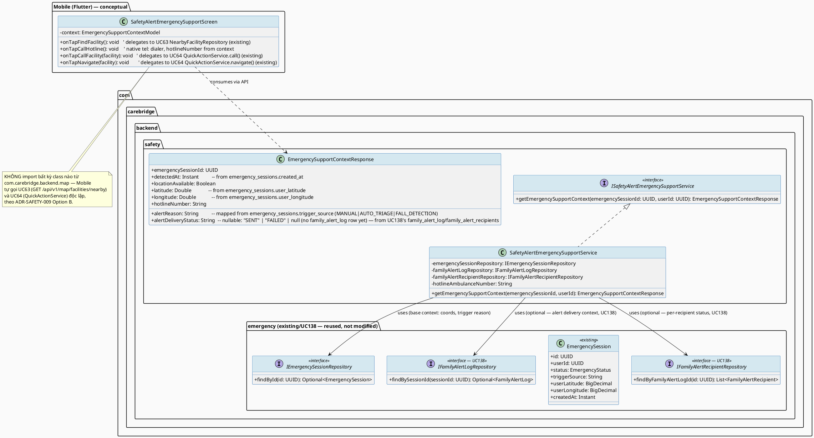
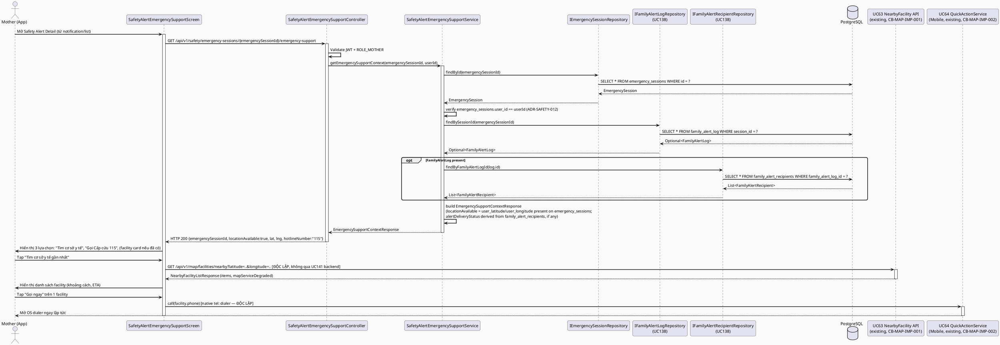
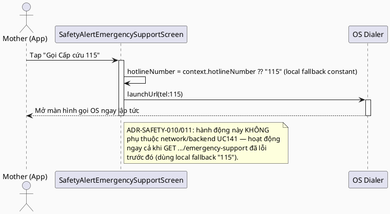
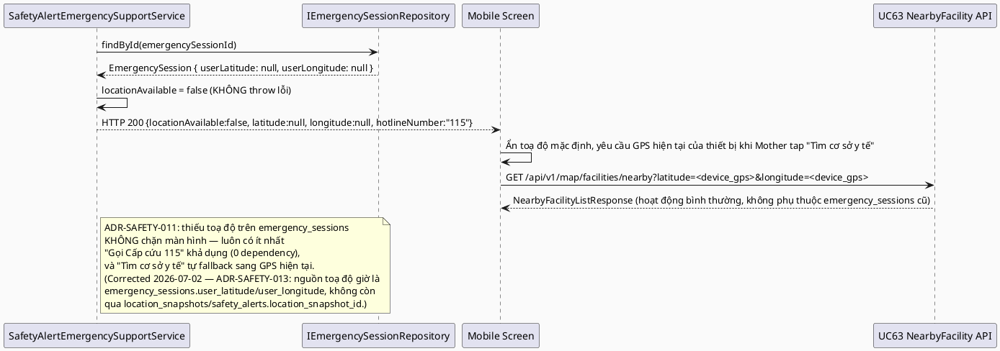
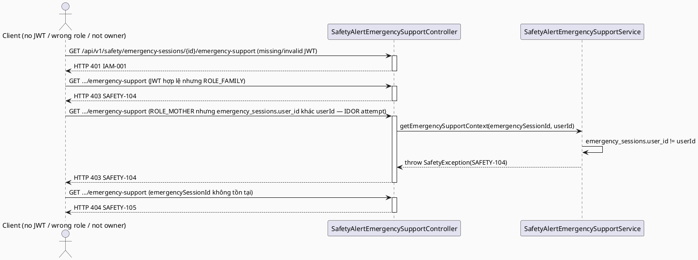

# ENGINEERING DOCUMENTATION STANDARD (EDS) v2.0
# UC141 — Open Emergency Support from Safety Alert

| Field | Value |
|-------|-------|
| **Document ID** | `CB-SAFETY-IMP-009` |
| **Version** | `1.0` |
| **Date** | `2026-07-02` |
| **Status** | `Draft` |
| **Document Owner** | `TV5 - Chương` |
| **Author** | `AI Agent — Tech Lead` |
| **Reviewed by** | `[ ] Pending` |
| **DPO Sign-off** | `[ ] Pending` *(module xử lý location PII + call metadata, an toàn tính mạng)* |
| **Approved by** | `[ ] Pending` |
| **Last Review** | `2026-07-02` |
| **Based on EDS** | `v2.0` |

---

## CHANGELOG

| Ngày | Người thực hiện | Nội dung thay đổi |
|------|-----------------|-------------------|
| 2026-07-02 | AI Agent — Tech Lead | Tạo tài liệu lần đầu — TDS cho UC141 Open Emergency Support from Safety Alert |
| 2026-07-02 | AI Agent — Technical Architect (reconciliation pass) | **Cross-batch schema correction (UC137/138/139/140/141):** phát hiện UC141's Draft ban đầu đọc dữ liệu từ bảng `safety_alerts` (V1 schema) — bảng này KHÔNG có entity JPA nào ánh xạ tới, và KHÔNG có consumer nào trong UC136-140 ghi dữ liệu vào đó. "Send Emergency Alert" (SRS 3.3.4.6 = UC138, đã reconcile cùng batch) thực tế ghi vào `emergency_sessions`+`family_alert_log`+`family_alert_recipients`. Thêm ADR-SAFETY-013 (mới) giải thích đầy đủ phát hiện + quyết định sửa. Đổi: path param `safetyAlertId`→`emergencySessionId`, endpoint `/api/v1/safety/alerts/{id}/emergency-support`→`/api/v1/safety/emergency-sessions/{id}/emergency-support`, `ISafetyAlertRepository`→`IEmergencySessionRepository`+`IFamilyAlertLogRepository`+`IFamilyAlertRecipientRepository` (tái sử dụng từ UC62/UC138, KHÔNG tạo entity `SafetyAlert` mới), toạ độ đọc trực tiếp từ `emergency_sessions.user_latitude`/`user_longitude` (không còn cần join `location_snapshots`/`safety_alerts.location_snapshot_id`). `location_snapshots` vẫn giữ nguyên vai trò của UC63 (không xung đột, ngoài phạm vi sửa). Cập nhật toàn bộ §1, §2, §3 (ADR-009/010/011/012 tham chiếu lại + ADR-013 mới), §5.1/§5.2, §6.1/§6.3/§6.4, §7.2, §8.1/§8.2/§8.3, §9, §10, §11, §14, §15, §16, §17. Migration: KHÔNG cần migration mới cho UC141 (không đổi). Status vẫn Draft — CHƯA Approved. |
| 2026-07-03 | AI Agent | **Follow-up cleanup sau reconciliation:** phát hiện 2 câu văn còn sót chưa cập nhật theo ADR-SAFETY-013 (ADR-SAFETY-009 §Decision dòng ~124 vẫn ghi "chỉ đọc `safety_alerts`"; bảng §4.2 Data Integrity dòng ~277-278 vẫn ghi `safety_alerts`/`payload_json`). Đã sửa cả 2 để khớp nguồn dữ liệu thật (`emergency_sessions`/`family_alert_log`/`family_alert_recipients`, field `technical_log_json`). Không thay đổi quyết định kiến trúc nào — chỉ sửa câu chữ còn sót. |

---

## MỤC LỤC

1. [Tổng quan Module](#1-tổng-quan-module)
2. [Ma trận Truy vết (Traceability Matrix)](#2-ma-trận-truy-vết-traceability-matrix)
3. [Architecture Decision Records (ADR)](#3-architecture-decision-records-adr)
4. [Non-Functional Requirements & SLA](#4-non-functional-requirements--sla)
5. [Static Modeling (Mô hình Tĩnh)](#5-static-modeling-mô-hình-tĩnh)
6. [Dynamic Modeling (Mô hình Động)](#6-dynamic-modeling-mô-hình-động)
7. [Domain Event Catalog](#7-domain-event-catalog)
8. [Interface Specification (Đặc tả Giao diện)](#8-interface-specification-đặc-tả-giao-diện)
9. [API Specification](#9-api-specification)
10. [Bảng mã lỗi (Error Codes)](#10-bảng-mã-lỗi-error-codes)
11. [Quy trình Triển khai (Step-by-Step)](#11-quy-trình-triển-khai-step-by-step)
12. [Rollback & Incident Runbook](#12-rollback--incident-runbook)
13. [Kịch bản Kiểm thử Chi tiết](#13-kịch-bản-kiểm-thử-chi-tiết)
14. [Phương pháp Xác minh](#14-phương-pháp-xác-minh)
15. [Mẫu thử thực tế (API Verification Samples)](#15-mẫu-thử-thực-tế-api-verification-samples)
16. [Bảng tổng hợp phân quyền (Authorization Matrix)](#16-bảng-tổng-hợp-phân-quyền-authorization-matrix)
17. [AI Prompt Constraints (CASE 2.0)](#17-ai-prompt-constraints-case-20)

---

## 1. Tổng quan Module

> **⚠️ CORRECTED 2026-07-02 (cross-batch schema reconciliation — xem CHANGELOG và ADR-SAFETY-013 mới):** Bản Draft đầu tiên của TDS này giả định bảng `safety_alerts` (V1 schema, `V1__init_schema.sql`) là nguồn dữ liệu cho "Safety Alert" mà Mother xem. Sau khi đối chiếu với UC136-140 (được thiết kế cùng batch, cùng ngày), phát hiện: **`safety_alerts` (V1) không có entity JPA nào ánh xạ tới, và không có bất kỳ code nào trong UC136-140 ghi dữ liệu vào bảng đó.** "Send Emergency Alert" (SRS 3.3.4.6 = **UC138**, đã reconcile trong cùng batch) ghi dữ liệu thật vào `emergency_sessions` + `family_alert_log` + `family_alert_recipients` (tables mới/đã có, có entity JPA đầy đủ) — KHÔNG PHẢI `safety_alerts`. Do đó UC141 (là màn hình đọc "Safety Alert" mà UC138 vừa gửi) đã được sửa lại để đọc từ `emergency_sessions`/`family_alert_log` thay vì `safety_alerts`. `location_snapshots` (cũng thuộc V1 schema) được GIỮ NGUYÊN vì đó là bảng thật sự đang được UC63 (Find Nearby Care Facility, đã có TDS riêng, ngoài phạm vi sửa của lần reconciliation này) sử dụng và ghi vào — không có xung đột ở phần đó. Xem ADR-SAFETY-013 (mới) để biết đầy đủ lý do và phương án đã cân nhắc.

> **RG-3 (Delegation mapping — bắt buộc đọc trước khi implement):** UC141 là **entry point / thin orchestration layer** trên màn hình chi tiết Safety Alert của chính Mother (KHÔNG phải màn hình `emergency_alert_detail_screen.dart` hiện có trong `features/emergency/` — màn hình đó thuộc **UC161 Receive Emergency Alert**, dành cho **Family member** nhận cảnh báo về Mother, đã được UC64 TDS §11.3 xác nhận rõ "KHÔNG chỉnh sửa"). UC141 phục vụ chính **Mother** xem emergency session/alert record của bản thân (phát sinh từ UC136 Detect Suspected Fall or Impact → UC137 Confirm Safety Check → UC138 Send Emergency Alert, tất cả đã reconcile trong cùng batch — xem ADR-SAFETY-013) và chọn 1 trong 3 hành động khẩn cấp. UC141 **KHÔNG tự cài đặt logic tìm kiếm cơ sở y tế, logic gọi điện/điều hướng, hay logic tính route/ETA** — toàn bộ 3 hành động đều **delegate 100%** vào các capability đã có TDS (`CB-MAP-IMP-001` UC63, `CB-MAP-IMP-002` UC64, `CB-MAP-IMP-000` UC129).
>
> **Bảng ánh xạ hành động → capability tái sử dụng (RG-3):**
>
> | UI Action trên Safety Alert Detail Screen (Mother) | Delegates to | Interface/Service tái sử dụng | Điểm mới của UC141 |
> |---|---|---|---|
> | "Tìm cơ sở y tế gần nhất" | **UC63** Find Nearby Care Facility | `GET /api/v1/map/facilities/nearby` (`INearbyFacilityService.findNearby()`, `CB-MAP-IMP-001 §8.1`) | Chỉ truyền toạ độ lấy từ `emergency_sessions.user_latitude`/`user_longitude` (nếu có — xem ADR-SAFETY-013) làm `latitude`/`longitude` mặc định thay vì GPS hiện tại — xem ADR-SAFETY-009 |
> | "Chỉ đường đến cơ sở đã chọn" | **UC64** Quick Call or Navigate (nhánh NAVIGATE) | `QuickActionService.navigate()` (Mobile, `CB-MAP-IMP-002 §8.3`) + `POST /api/v1/map/quick-actions/log` (`actionType=NAVIGATE`) | Không có — tái sử dụng nguyên vẹn |
> | "Gọi ngay [cơ sở y tế đã chọn]" | **UC64** Quick Call or Navigate (nhánh CALL, dùng `care_facilities.phone`) | `QuickActionService.call()` (Mobile) + `POST /api/v1/map/quick-actions/log` (`actionType=CALL`) | Không có — tái sử dụng nguyên vẹn |
> | ETA hiển thị trên facility card | **UC129** Calculate Distance, Route and ETA | `IMapProviderService.calculateRoute()` (gián tiếp qua `NearbyFacilityService`, `CB-MAP-IMP-000 §8.1`) | Không có — tái sử dụng gián tiếp (UC141 không tự gọi `IMapProviderService`) |
> | **"Gọi Cấp cứu 115"** (hotline y tế quốc gia — KHÔNG gắn với 1 `care_facilities` record cụ thể) | *(Genuinely mới — xem RG-6, ADR-SAFETY-010)* | Không có sẵn interface nào trong UC63/64/129 xử lý hotline cố định không có `facilityId` | **Đây là phần mới thực sự của UC141** — native `tel:` dialer với số hotline hardcoded, KHÔNG qua `care_facilities` lookup |
> | Entry trigger "mở màn hình từ Safety Alert" | *(Genuinely mới)* | Đọc `emergency_sessions` (từ UC137's `EmergencyEscalationTriggered` → UC62 `EmergencyService.openFlow()`) + `family_alert_log`/`family_alert_recipients` (UC138) — xem ADR-SAFETY-013 | Backend: 1 GET endpoint đọc `emergency_sessions` + `location_snapshots` liên kết (nếu có); Mobile: màn hình mới `SafetyAlertEmergencySupportScreen` |
>
> **Kết luận RG-3:** UC141 chỉ có **2 phần thực sự mới**: (1) đọc `emergency_sessions` record làm context khởi tạo màn hình (backend GET endpoint + Mobile screen), và (2) hotline "Gọi Cấp cứu 115" cố định không qua `care_facilities`. Toàn bộ phần "tìm cơ sở/gọi/chỉ đường" là **pure delegation**, không viết lại logic.

| Field | Value |
|-------|-------|
| **Module Name** | `Open Emergency Support from Safety Alert` |
| **Bounded Context** | `safety` (entry/orchestration layer — sở hữu bởi TV5-Chương theo `function-spec-task-allocation.md` dòng 627 "`3.3.4.9 Open Emergency Support from Safety Alert`" nằm trong nhóm "TV5 - Chương - AI Safety And IMU Emergency Integration"); **gọi sang** bounded context `map` (TV4-Lâm sở hữu UC63/64/129 — dòng 636 "Map display/navigation after emergency handoff is integrated with TV4/Lâm provider, not owned by TV5") |
| **Data Classification** | `Sensitive-PII` *(vị trí Mother, safety event context, số điện thoại gọi)* |
| **Compliance Scope** | `PDPA / Luật 91/2025` |
| **Upstream Dependencies** | `UC136 Detect Suspected Fall or Impact` (nguồn `imu_safety_events`), `UC137 Confirm Safety Check` (publishes `EmergencyEscalationTriggered`), `UC138 Send Emergency Alert` (SRS 3.3.4.6 — ghi `emergency_sessions`/`family_alert_log`/`family_alert_recipients`, xem ADR-SAFETY-013), `UC63 Find Nearby Care Facility`, `UC64 Quick Call or Navigate`, `UC129 Calculate Distance/Route/ETA`, `IAM (JWT ROLE_MOTHER)` |
| **Downstream Consumers** | Không có consumer trực tiếp — hành động terminal (mở app ngoài/hiển thị danh sách); có thể tham chiếu bởi UC-176 Configure Emergency Contact (nguồn hotline cấu hình, ngoài phạm vi UC141 hiện tại — xem Open Item) |

---

## 2. Ma trận Truy vết (Traceability Matrix)

| Requirement ID | Loại (BR/ADR/US) | Mô tả yêu cầu | Thành phần Code | Compliance Target | ADR liên quan |
|----------------|------------------|---------------|-----------------|-------------------|---------------|
| SRS-3.3.4.9 (UC-141) | User Story | Routes to emergency support: quick call, nearest facility search, or navigation | `SafetyAlertEmergencySupportController.GET /api/v1/safety/emergency-sessions/{emergencySessionId}/emergency-support`, Mobile `SafetyAlertEmergencySupportScreen` | — | ADR-SAFETY-009, ADR-SAFETY-010, ADR-SAFETY-013 |
| `CB-MAP-IMP-001` §8.1 (UC63) | Interface Consumption | Delegate "tìm cơ sở y tế gần nhất" — KHÔNG viết lại logic search | `INearbyFacilityService.findNearby()` (gọi từ Mobile, không qua UC141 backend) | — | ADR-SAFETY-009 |
| `CB-MAP-IMP-002` §8.3 (UC64) | Interface Consumption | Delegate "gọi ngay"/"chỉ đường" cho facility đã chọn | `QuickActionService.call()/navigate()` (Mobile) | — | ADR-SAFETY-009 |
| `CB-MAP-IMP-000` §8.1 (UC129) | Interface Consumption (gián tiếp) | ETA hiển thị trên facility card đến từ `IMapProviderService` qua UC63, UC141 không gọi trực tiếp | — (không có code UC141 nào import `IMapProviderService`) | — | ADR-SAFETY-009 |
| BR-RBAC | Business Rule | Chỉ ROLE_MOTHER (chủ sở hữu `emergency_sessions.user_id` tương ứng chính mình) được xem/thao tác | `SafetyAlertEmergencySupportController` | BR-RBAC | ADR-SAFETY-012 |
| BR-SAFETY | Business Rule (**CRITICAL**) | AI/hệ thống KHÔNG được trì hoãn hành trình khẩn cấp; không chẩn đoán; luôn có fallback khi external service lỗi | `SafetyAlertEmergencySupportService`, Mobile `SafetyAlertEmergencySupportScreen` | BR-SAFETY | ADR-SAFETY-009, ADR-SAFETY-011 |
| SRS E3 (Exceptions) | Exception | External service/network/server failure → retry guidance, không duplicate/unsafe action | `SafetyAlertEmergencySupportService` (fallback khi `emergency_sessions`/`location_snapshots` thiếu dữ liệu) | BR-SAFETY | ADR-SAFETY-011 |
| ADR-SAFETY-009 | Decision | UC141 là orchestration-only layer: backend chỉ đọc `emergency_sessions` context, KHÔNG gọi lại `INearbyFacilityService`/`IMapProviderService` phía backend — Mobile client tự gọi UC63/UC64 API độc lập sau khi có context | `SafetyAlertEmergencySupportService` | — | — |
| ADR-SAFETY-010 | Decision | "Gọi Cấp cứu 115" dùng hotline hardcoded cấu hình (`emergency.hotline.ambulance=115`), qua native `tel:` dialer — giống cơ chế UC64 ADR-MAP-005, KHÔNG qua ZegoCloud | Mobile: `SafetyAlertEmergencySupportScreen` / `QuickActionService.call()` | — | — |
| ADR-SAFETY-011 | Decision | Nếu `emergency_sessions.user_latitude`/`user_longitude` NULL, hoặc `location_snapshots` liên kết hết hạn (`expires_at < now()`): UC141 vẫn cho phép Mother mở tìm kiếm cơ sở gần (UC63 sẽ tự yêu cầu GPS hiện tại), KHÔNG chặn màn hình | `SafetyAlertEmergencySupportService` | BR-SAFETY | — |
| ADR-SAFETY-012 | Decision | Authorization: JWT + ROLE_MOTHER; `emergency_sessions.user_id` PHẢI khớp `userId` từ SecurityContext — không cho Mother xem alert của user khác | `SafetyAlertEmergencySupportController` | BR-RBAC | — |
| ADR-SAFETY-013 | Decision (**MỚI — reconciliation**) | UC141 đọc `emergency_sessions` + `family_alert_log`/`family_alert_recipients` (UC138's actual output) làm nguồn "Safety Alert" context — KHÔNG phải bảng `safety_alerts` (V1 schema, không có entity/consumer nào trong UC136-140) | `SafetyAlertEmergencySupportService`, `ISafetyAlertEmergencySupportService` | — | ADR-SAFETY-013 |

> **Open (RG-6 — cần Product Owner/TV5-Chương xác nhận):** SRS §3.3.4.9 không nêu rõ số hotline cụ thể hay nguồn cấu hình. Không tìm thấy bảng `emergency_hotlines`/cấu hình hotline nào trong `V1__init_schema.sql` hay các migration sau. TDS này đề xuất **hotline hardcoded qua application property** (`115` — số cấp cứu y tế quốc gia Việt Nam, theo thông lệ phổ biến, KHÔNG có nguồn SRS/BR xác nhận con số này). Đánh dấu **Open** — cần xác nhận với TV5-Chương/Product Owner liệu UC-176 Configure Emergency Contact (3.3.4.10, cũng do TV5-Chương sở hữu) có nên là nguồn cấu hình hotline thay vì hardcode. Nếu có, cần một ADR bổ sung liên kết UC141 → UC176's `emergency_contacts`/hotline config — ngoài phạm vi TDS Draft này.

---

## 3. Architecture Decision Records (ADR)

### ADR-SAFETY-009 — Orchestration-only: UC141 backend không gọi lại `INearbyFacilityService`/`IMapProviderService`

| Field | Value |
|-------|-------|
| **Status** | `Proposed` |
| **Deciders** | `AI Agent — Tech Lead` (chờ TV5-Chương + TV4-Lâm confirm) |
| **Date** | `2026-07-02` |
| **Supersedes** | `—` |

#### Bối cảnh (Context)
UC63/UC64/UC129 đã tồn tại là các capability độc lập (public Mobile-facing REST endpoint cho UC63/UC64; in-process service cho UC129) thuộc bounded context `map`, sở hữu bởi TV4-Lâm. `function-spec-task-allocation.md` dòng 636 xác nhận rõ: "Map display/navigation after emergency handoff is integrated with TV4/Lâm provider, not owned by TV5." Nếu UC141 backend tự gọi lại `INearbyFacilityService`/`IMapProviderService` (Java in-process call xuyên bounded context `safety` → `map`), sẽ tạo ra **coupling ngược** vi phạm ranh giới ownership rõ ràng mà 2 TDS trước đã thiết lập, đồng thời không cần thiết vì UC63 (`GET /api/v1/map/facilities/nearby`) đã là REST endpoint Mobile có thể gọi trực tiếp.

#### Các phương án đã xem xét (Options Considered)

| Phương án | Mô tả | Ưu điểm | Nhược điểm |
|-----------|-------|----------|------------|
| A | UC141 backend inject `INearbyFacilityService` (bounded context `map`) và gọi trực tiếp trong `SafetyAlertEmergencySupportService`, trả về facility list gộp sẵn trong response của UC141 | Mobile chỉ cần gọi 1 API duy nhất | Vi phạm ranh giới bounded context `safety` ↔ `map` mà task allocation đã cố ý tách; tạo dependency ngược từ TV5 code vào TV4 code — rủi ro conflict khi 2 team code song song |
| B | UC141 backend chỉ trả về **context tối thiểu** (`safetyAlertId`, toạ độ location snapshot nếu có, `personName`, `alertType`, `detectedAt`). Mobile app, sau khi nhận context này, **tự gọi độc lập** `GET /api/v1/map/facilities/nearby` (UC63) và thực hiện `QuickActionService.call()/navigate()` (UC64) — không qua UC141 backend nữa | Giữ ranh giới bounded context sạch; Mobile linh hoạt gọi UC63 với toạ độ tuỳ chỉnh (vd: cho phép Mother đổi vị trí tìm kiếm khác vị trí lúc alert xảy ra); nhất quán với cách UC63/UC64 đã thiết kế (public API, không cần internal service injection) | Mobile cần 2-3 lượt gọi API thay vì 1 (chấp nhận được vì mỗi API đã có latency SLA riêng — không cộng dồn thành 1 request chờ) |

#### Quyết định (Decision)
Chọn **Phương án B**. `SafetyAlertEmergencySupportService` (backend, package `com.carebridge.backend.safety`) **chỉ đọc** `emergency_sessions` + `family_alert_log`/`family_alert_recipients` liên kết (nguồn dữ liệu thật, xem ADR-SAFETY-013 — KHÔNG phải `safety_alerts` V1 như bản Draft đầu tiên của mục này từng ghi), trả về DTO context. Mobile `SafetyAlertEmergencySupportScreen` nhận context này rồi **tự điều phối** gọi UC63 (`GET /api/v1/map/facilities/nearby`) và UC64 (`QuickActionService`) — đúng như 2 màn hình con độc lập đã được TDS UC63/UC64 mô tả. UC141 không import bất kỳ class nào từ package `com.carebridge.backend.map`.

#### Hệ quả (Consequences)

**Tích cực:**
- Không có coupling code xuyên bounded context `safety` → `map`; TV5 và TV4 có thể code song song không xung đột file.
- Tái sử dụng 100% UC63/UC64/UC129 nguyên trạng — không cần sửa TDS của họ.

**Tiêu cực / Trade-offs:**
- Mobile phải tự điều phối nhiều API call (UX cần loading state rõ ràng cho từng bước) — chấp nhận được, đã có tiền lệ tương tự ở luồng UC62→UC63/64.

**Compliance Impact:** Không có thay đổi so với UC63/64/129 đã ghi nhận.

---

### ADR-SAFETY-010 — "Gọi Cấp cứu 115": hotline hardcoded qua native `tel:` dialer

| Field | Value |
|-------|-------|
| **Status** | `Proposed` |
| **Deciders** | `AI Agent — Tech Lead` (chờ TV5-Chương confirm — xem Open item RG-6 §2) |
| **Date** | `2026-07-02` |
| **Supersedes** | `—` |

#### Bối cảnh (Context)
UC141 Description: "Routes to emergency support for quick call, nearest facility search, or navigation." "Quick call" ở đây có 2 khả năng: (a) gọi 1 `care_facilities.phone` cụ thể sau khi tìm kiếm (đã cover bởi UC64 delegation, §1), hoặc (b) gọi ngay hotline cấp cứu quốc gia (115 tại Việt Nam) mà KHÔNG cần chọn facility trước — đây là hành động "1-tap" điển hình của safety-alert screen, phù hợp tinh thần "never delay emergency routing" (CLAUDE.md). SRS không liệt kê số hotline cụ thể; không có bảng `emergency_hotlines` nào trong schema DB (đã kiểm tra `V1__init_schema.sql` toàn bộ).

#### Các phương án đã xem xét (Options Considered)

| Phương án | Mô tả | Ưu điểm | Nhược điểm |
|-----------|-------|----------|------------|
| A | Không có nút hotline riêng — Mother phải luôn tìm/chọn 1 `care_facilities` trước khi gọi (chỉ dùng UC63→UC64 delegation) | Đơn giản nhất, tái sử dụng 100% không thêm gì mới | Với tình huống cấp cứu thực sự khẩn (ngã nặng, không có mạng để load facility list), thêm 1 bước "tìm rồi mới gọi được" có thể gây chậm trễ — vi phạm tinh thần BR-SAFETY "escalation-aware" |
| B | Thêm nút "Gọi Cấp cứu 115" cố định, độc lập khỏi kết quả tìm kiếm UC63, dùng native `tel:` dialer với số hotline lấy từ application config (`emergency.hotline.ambulance`), mặc định `115` | Luôn khả dụng ngay cả khi network/TrackAsia/UC63 lỗi hoàn toàn (0 dependency ngoài OS dialer) — đúng tinh thần "never delay" | Số hotline hardcode theo config, không phải theo `care_facilities` — nếu Mother ở nước ngoài, số 115 không đúng (ghi nhận Open, ngoài phạm vi TDS này — không có yêu cầu i18n hotline trong SRS) |

#### Quyết định (Decision)
Chọn **Phương án B**. Thêm nút cố định "Gọi Cấp cứu 115" trên `SafetyAlertEmergencySupportScreen`, dùng cùng cơ chế native `tel:` dialer đã xác lập ở UC64 ADR-MAP-005 (`url_launcher`, `Uri.parse('tel:$hotlineNumber')`), nhưng số điện thoại đến từ **cấu hình ứng dụng** (`AppConfig.emergencyHotlineAmbulance`, mặc định `"115"`), KHÔNG qua `care_facilities.phone` hay bất kỳ API call nào — hành động này **hoàn toàn client-side, 0 network dependency**, nhanh hơn cả UC64 (vốn vẫn cần đã có `facilityId`/`phone` từ UC63 trước đó).

**Backend note:** Endpoint UC141 (`GET .../emergency-support`) có thể trả về `hotlineNumber` trong response (đọc từ backend config `application.yml` — `carebridge.emergency.hotline-ambulance: "115"`) để tránh hardcode số ở cả 2 nơi (Mobile + Backend); Mobile ưu tiên dùng giá trị từ API response, fallback về local constant `"115"` nếu API lỗi (đảm bảo nút hotline KHÔNG BAO GIỜ mất khả dụng dù backend down — xem ADR-SAFETY-011).

#### Hệ quả (Consequences)

**Tích cực:**
- Hành động "gọi cấp cứu" nhanh nhất có thể — không phụ thuộc bất kỳ tìm kiếm/network nào, tuân thủ BR-SAFETY tuyệt đối.
- Đây là phần genuinely-mới hợp lý duy nhất của UC141, không trùng lặp với UC63/64.

**Tiêu cực / Trade-offs:**
- Số hotline cố định không cá nhân hoá theo vị trí địa lý thực tế của Mother — chấp nhận cho MVP, đánh dấu Open cho i18n tương lai.

**Compliance Impact:** Không lưu nội dung cuộc gọi (giống UC64 ADR-MAP-007) — chỉ ghi log tối thiểu nếu cần audit (xem §7).

---

### ADR-SAFETY-011 — Fallback khi `emergency_sessions` thiếu toạ độ

| Field | Value |
|-------|-------|
| **Status** | `Proposed` |
| **Deciders** | `AI Agent — Tech Lead` |
| **Date** | `2026-07-02` |
| **Supersedes** | `—` |

> **(Corrected 2026-07-02 — ADR-SAFETY-013)** Nội dung ADR này ban đầu mô tả fallback dựa trên `safety_alerts.location_snapshot_id`/`location_snapshots.expires_at` (V1 schema). Sau reconciliation, UC141 đọc toạ độ trực tiếp từ `emergency_sessions.user_latitude`/`user_longitude` — không còn khái niệm "hết hạn" (TTL), chỉ còn "có/không có toạ độ" (NULL hay không). Quyết định cốt lõi (không chặn màn hình, luôn có hotline fallback) không đổi — chỉ nguồn dữ liệu đổi.

#### Bối cảnh (Context)
`emergency_sessions.user_latitude`/`user_longitude` là nullable (`DECIMAL(10,7)`, xem `V20260627000003__create_emergency_sessions.sql`) — không phải mọi `emergency_sessions` record đều có toạ độ (vd. nếu location consent không có tại thời điểm `EmergencyService.openFlow()` chạy). Nếu Mother mở lại 1 session cũ mà toạ độ chưa từng được ghi, UC141 cần một fallback rõ ràng, không lỗi.

#### Quyết định (Decision)
- Nếu `user_latitude`/`user_longitude` NULL trên `emergency_sessions`: `SafetyAlertEmergencySupportService` vẫn trả 200 OK với `locationAvailable: false`, KHÔNG trả lỗi.
- Mobile, khi nhận `locationAvailable: false`, tự động fallback: khi Mother tap "Tìm cơ sở y tế gần nhất", UC63 flow sẽ yêu cầu GPS hiện tại của thiết bị (native geolocation permission) thay vì dùng toạ độ đã lưu — đây là hành vi client-side độc lập, không cần backend UC141 tham gia thêm.
- Nút "Gọi Cấp cứu 115" (ADR-SAFETY-010) LUÔN khả dụng bất kể `locationAvailable`.

#### Hệ quả (Consequences)

**Tích cực:** Không có single point of failure — Mother luôn có ít nhất 1 hành động khả dụng (gọi hotline) ngay cả khi mọi dữ liệu vị trí đều thiếu.

**Tiêu cực / Trade-offs:** Không có.

**Compliance Impact:** Chỉ đọc toạ độ đã ghi tại thời điểm `EmergencyService.openFlow()` chạy (consent đã kiểm tra tại thời điểm đó) — không thu thập/lưu trữ toạ độ mới trong UC141 (PDPA minimum necessary).

---

### ADR-SAFETY-012 — Authorization: Own-record only, ROLE_MOTHER

| Field | Value |
|-------|-------|
| **Status** | `Proposed` |
| **Deciders** | `AI Agent — Tech Lead` |
| **Date** | `2026-07-02` |
| **Supersedes** | `—` |

#### Quyết định (Decision)
`GET /api/v1/safety/emergency-sessions/{emergencySessionId}/emergency-support` yêu cầu JWT `ROLE_MOTHER`. Service PHẢI kiểm tra `emergency_sessions.user_id == userId` (từ SecurityContext) trước khi trả dữ liệu — trả `403 SAFETY-104` nếu không khớp (tránh Mother A xem được alert của Mother B qua đoán UUID — IDOR). Đây **KHÔNG phải** trường hợp Family xem alert (đó là UC161, dùng bảng/luồng khác — `emergency_alert_detail_screen.dart`).

---

### ADR-SAFETY-013 — Data source correction: read `emergency_sessions`/`family_alert_log`/`family_alert_recipients` (UC138's real output), NOT the V1 `safety_alerts` table

| Field | Value |
|-------|-------|
| **Status** | `Accepted` |
| **Deciders** | `AI Agent — Technical Architect` (cross-batch reconciliation pass) |
| **Date** | `2026-07-02` |
| **Supersedes** | Corrects the original (Draft) assumption in §1/§5.2/§9 of this TDS that `safety_alerts` (V1 schema) is the live data source |

#### Bối cảnh (Context)
Bản Draft đầu tiên của UC141 giả định rằng "Safety Alert" mà Mother xem trên màn hình này đến từ bảng `safety_alerts` (định nghĩa trong `V1__init_schema.sql`, cột `safety_alert_id, safety_event_id, recipient_user_id, location_snapshot_id, alert_reason, payload_json, delivery_status, sent_at, acknowledged_at`). Bảng này CÓ tồn tại trong schema (`V1__init_schema.sql` dòng 1177-1189), nhưng khi đối chiếu trực tiếp với toàn bộ batch UC136-140 (thiết kế cùng ngày, cùng nhóm tính năng "AI Safety and IMU Emergency Integration"), phát hiện:
1. **Không có entity JPA nào trong codebase ánh xạ `safety_alerts`** — xác nhận qua tìm kiếm trực tiếp `grep -r "@Table(name = \"safety_alerts\")"` trong `com.carebridge.backend`, không có kết quả.
2. **UC138 (Send Emergency Alert, chính là SRS 3.3.4.6 mà UC141 §1 tham chiếu là nguồn tạo "Safety Alert")** — sau khi UC138's TDS được viết/reconcile trong cùng batch — xác nhận rõ: `FamilyAlertService.sendAlert()` (existing, package `com.carebridge.backend.emergency`) ghi vào `emergency_sessions` (qua `EmergencyService.openFlow()`, UC62) + `family_alert_log` (1 row/session) + `family_alert_recipients` (per-recipient, bảng mới của UC138). UC138 **KHÔNG BAO GIỜ** ghi vào `safety_alerts`.
3. Do đó, nếu UC141 tiếp tục đọc `safety_alerts`, nó sẽ **luôn trả về rỗng/404** trong thực tế — vì không có pipeline nào (UC136→UC137→UC138) từng ghi dữ liệu vào bảng đó. Đây là một schema-architecture conflict thực sự giữa UC141 và phần còn lại của batch, tương tự (nhưng độc lập với) conflict giữa UC137/UC138/UC140 mà nhiệm vụ reconciliation chính đã xử lý.

#### Các phương án đã xem xét (Options Considered)

| Phương án | Mô tả | Ưu điểm | Nhược điểm |
|-----------|-------|----------|------------|
| A | Giữ nguyên `safety_alerts` (V1), coi UC138 phải được sửa lại để CŨNG ghi vào `safety_alerts` (dual-write) | Không cần sửa UC141 | Vi phạm "smallest scoped change" — buộc UC138 (đã Draft, đã có TDS/Test-Spec riêng, đã dùng `family_alert_log`/`family_alert_recipients` nhất quán với UC137/139/140) phải thêm 1 dual-write vào 1 bảng V1 không có entity, không rõ mục đích, không được UC136-140 nào khác dùng — rủi ro cao, không có lợi ích rõ ràng |
| B | Sửa UC141 để đọc `emergency_sessions` + `family_alert_log`/`family_alert_recipients` (dữ liệu THẬT do UC138 ghi) thay vì `safety_alerts` | Nhất quán với toàn bộ batch UC136-140; không cần sửa UC138; UC141 giờ đọc được dữ liệu thật thay vì bảng luôn rỗng | Cần đổi tên path param (`safetyAlertId` → `emergencySessionId`), entity mới `EmergencySession`/`FamilyAlertLog`/`FamilyAlertRecipient` thay vì `SafetyAlert` (nhưng các entity này đã được UC138 định nghĩa contract — UC141 tái sử dụng, không phải viết lại) |
| C | Bỏ hẳn `location_snapshot_id`/toạ độ khỏi UC141, chỉ dùng GPS hiện tại của thiết bị mọi lúc | Đơn giản nhất | Mất khả năng dùng toạ độ tại thời điểm alert (vd. Mother xem lại alert cũ khi không còn ở vị trí đó) — làm giảm giá trị UX so với ý định gốc của SRS "Open Emergency Support from Safety Alert" (ngụ ý mở TỪ context của 1 alert cụ thể) |

#### Quyết định (Decision)
Chọn **Phương án B**. `SafetyAlertEmergencySupportService.getEmergencySupportContext()` đổi tham số từ `safetyAlertId: UUID` sang `emergencySessionId: UUID`, đọc `emergency_sessions` (entity mới `EmergencySession`, cần xác nhận entity này đã tồn tại hay UC141 cần tạo — xem §8.2 note) làm bảng gốc, và tùy chọn join `family_alert_log`/`family_alert_recipients` (UC138's entities, package `com.carebridge.backend.emergency`) để hiển thị thêm alert delivery context nếu cần trên màn hình (không bắt buộc cho 3 hành động khẩn cấp chính — 3 hành động đó chỉ cần toạ độ + hotline, không cần delivery status). Toạ độ (`latitude`/`longitude`) đọc trực tiếp từ `emergency_sessions.user_latitude`/`user_longitude` (đã có sẵn trên chính bảng đó — KHÔNG cần join `location_snapshots`/`safety_alerts.location_snapshot_id` nữa, đơn giản hơn thiết kế Draft ban đầu). Endpoint đổi từ `GET /api/v1/safety/alerts/{safetyAlertId}/emergency-support` sang `GET /api/v1/safety/emergency-sessions/{emergencySessionId}/emergency-support`.

**Lưu ý về `location_snapshots`:** bảng này VẪN được giữ nguyên trong vai trò của UC63 (Find Nearby Care Facility) — không có xung đột ở đó, UC63 tự ghi/đọc `location_snapshots` độc lập khi Mobile gọi UC63's API sau khi có context từ UC141. UC141 không còn cần join `location_snapshots` để lấy toạ độ ban đầu nữa vì `emergency_sessions` đã có sẵn `user_latitude`/`user_longitude` (ghi lúc `EmergencyService.openFlow()` chạy — xem UC62-equivalent).

#### Hệ quả (Consequences)

**Tích cực:**
- UC141 giờ đọc dữ liệu THẬT mà UC136→UC137→UC138 thực sự tạo ra — không còn là bảng luôn rỗng
- Đơn giản hơn: không cần join `location_snapshots` cho toạ độ cơ bản (đã có sẵn trên `emergency_sessions`)
- Nhất quán hoàn toàn với UC139 (cũng đọc `emergency_sessions`/`family_alert_log`/`family_alert_recipients` cho mục đích tương tự — xem UC139 TDS ADR-SAFETY-007) — 2 UC dùng chung 1 mental model về "đâu là nguồn sự thật cho trạng thái alert"

**Tiêu cực / Trade-offs:**
- Đổi path param/endpoint name (`safetyAlertId`→`emergencySessionId`) — breaking change so với Draft ban đầu, nhưng TDS này chưa Approved/chưa implement nên không có consumer thật nào bị ảnh hưởng
- Field `alertReason` (trước đọc từ `safety_alerts.alert_reason`) giờ map sang `emergency_sessions.trigger_source` (giá trị enum khác: `MANUAL`/`AUTO_TRIAGE`/`FALL_DETECTION` thay vì free-text) — UI cần map giá trị này sang copy hiển thị phù hợp

**Compliance Impact:** Không thay đổi — vẫn là read-only, vẫn cùng data classification (Sensitive-PII, location + safety context).

---

## 4. Non-Functional Requirements & SLA

### 4.1. Performance & Availability

| Category | Requirement | Target SLA | Measurement Method | Compliance Basis |
|----------|-------------|------------|---------------------|------------------|
| Latency | `GET .../emergency-support` API response (p99) | `< 400ms` *(Open — đề xuất, đọc 2 bảng đơn giản không có external call)* | k6 load test | — |
| Latency (Client-side) | Tap "Gọi Cấp cứu 115" → OS dialer mở | `< 300ms` *(kế thừa nguyên văn từ UC64 §4.1 "no delay" spirit)* | Manual/instrumented UI test | ADR-SAFETY-010, `CB-MAP-IMP-002 §4.1` |
| Availability | Hotline button availability | `100%` (client-side only, 0 backend dependency sau khi màn hình đã load) | Integration test — simulate backend down, verify hotline button vẫn hoạt động | ADR-SAFETY-011 |
| Availability | API uptime (monthly) | `99.9%` *(Open)* | Uptime monitor | — |

### 4.2. Data Integrity & Retention

| Category | Requirement | Target | Verification Method | Compliance Basis |
|----------|-------------|--------|---------------------|------------------|
| Read-only | UC141 backend KHÔNG tạo/sửa `emergency_sessions`/`family_alert_log`/`family_alert_recipients`/`location_snapshots` — chỉ đọc (nguồn dữ liệu thật theo ADR-SAFETY-013; UC141 cũng KHÔNG BAO GIỜ đọc/ghi bảng V1 `safety_alerts` — xem AP-AI-007) | 0 INSERT/UPDATE trong `SafetyAlertEmergencySupportService` | Code review | — |
| Data minimization | Response KHÔNG trả `technical_log_json`/nội dung thô nào của `emergency_sessions`/`family_alert_log` (có thể chứa dữ liệu nội bộ không cần thiết cho UI) — chỉ trả field cần thiết | Code review + DTO field audit | PDPA (minimum necessary) |

### 4.3. Security

| Category | Requirement | Target | Verification Method | Compliance Basis |
|----------|-------------|--------|---------------------|------------------|
| Encryption in transit | Endpoint | TLS 1.3+ | SSL Labs scan | PDPA |
| Access control | ROLE_MOTHER + own-record only | Least privilege, IDOR-safe | Auth Matrix (§16) + `SAFETY-104` test | BR-RBAC |
| No PII in logs | Không log toạ độ chính xác hay số điện thoại đã gọi ở mức INFO | Log audit | PDPA |

### 4.4. Scalability & Capacity Planning

> Tải rất thấp — chỉ kích hoạt khi Mother mở 1 safety alert cụ thể (tần suất thấp hơn nhiều so với UC63/64 vốn đã low/medium). Không cần cơ chế scale riêng.

---

## 5. Static Modeling (Mô hình Tĩnh)

### 5.1. Class Diagram (PlantUML)



### 5.2. Data Structure (Flyway SQL Migration)

> **Không cần migration mới.** `emergency_sessions` (`V20260627000003__create_emergency_sessions.sql`), `family_alert_log` (`V20260627000004__create_family_alert_log.sql`), và `family_alert_recipients` (UC138's Draft migration `V20260705090100__create_family_alert_recipients.sql` — reused, not re-created here) đã/sẽ tồn tại đầy đủ. UC141 chỉ **đọc** — không thêm bảng, không thêm cột. **(Corrected 2026-07-02 — see ADR-SAFETY-013: this section originally described `safety_alerts`/`location_snapshots` V1 tables; that data source was wrong because UC138 never writes to `safety_alerts`.)**

**Xác nhận cấu trúc hiện có (nguồn: các migration thật, xem UC138 TDS §5.2 cho `family_alert_recipients`):**

```sql
-- Đã tồn tại — KHÔNG tạo lại, chỉ tham chiếu (đọc-only cho UC141)
-- emergency_sessions (V20260627000003): id (PK), user_id, status, trigger_source,
--                      user_latitude, user_longitude, created_at, resolved_at, created_by
--
-- family_alert_log (V20260627000004): id (PK), session_id (FK -> emergency_sessions, UNIQUE),
--                      sent_at, recipient_count, location_included, created_by
--
-- family_alert_recipients (UC138 Draft migration V20260705090100 — reused entity, not re-defined by UC141):
--                      id (PK), family_alert_log_id (FK -> family_alert_log), recipient_user_id,
--                      fcm_token_hash, delivery_status ('SENT'|'FAILED'), sent_at, acknowledged_at, created_by
```

> **`location_snapshots` không còn cần thiết cho context cơ bản của UC141** — toạ độ (`latitude`/`longitude`) đọc trực tiếp từ `emergency_sessions.user_latitude`/`user_longitude` (đã có sẵn, ghi lúc `EmergencyService.openFlow()` — UC62 — chạy). Bảng `location_snapshots` vẫn tồn tại và được UC63 (Find Nearby Care Facility) sử dụng độc lập cho mục đích riêng của UC63 khi Mobile tự gọi UC63's API sau khi có context từ UC141 — không có xung đột, UC141 chỉ đơn giản không cần join bảng đó nữa (xem ADR-SAFETY-013).

> **Lưu ý quan trọng — 2 bảng `safety_events` khác nhau trong hệ thống (đã ghi nhận sẵn ở UC136 TDS):** `V1__init_schema.sql` định nghĩa `public.safety_events` (dòng 1159-1175, cột `setting_id`, `confidence_score`, `peak_acceleration`...). Migration riêng `V20260627000007__create_safety_events.sql` tạo bảng `imu_safety_events` với schema khác (cột `imu_session_id`, `magnitude`, `notes`...) — **KHÔNG PHẢI cùng tên bảng** như phiên bản Draft trước đó của TDS này đã nhầm lẫn ghi nhận (đã kiểm tra lại trực tiếp: migration file tạo bảng tên `imu_safety_events`, không phải `safety_events`, nên KHÔNG có xung đột tên bảng thật giữa 2 migration này ở cấp Flyway). UC141 (sau reconciliation) không đọc trực tiếp `imu_safety_events`/`safety_events` (V1) nữa — chỉ đọc `emergency_sessions` trở đi trong chuỗi UC136→UC137→UC138. Ghi nhận: các bảng V1 (`safety_events`, `safety_alerts`, `safety_monitoring_settings`) vẫn tồn tại trong schema nhưng không có entity/consumer nào trong toàn bộ batch UC136-141 — coi là legacy/không dùng, ngoài phạm vi dọn dẹp của TDS này.

---

## 6. Dynamic Modeling (Mô hình Động)

### 6.1. Sequence Diagram — Happy Path: Mở màn hình + tìm cơ sở y tế (PlantUML)



### 6.2. Sequence Diagram — "Gọi Cấp cứu 115" (0 dependency path — PlantUML)



### 6.3. Sequence Diagram — Toạ độ thiếu trên `emergency_sessions` (Fallback Path — PlantUML)



### 6.4. Sequence Diagram — Error Path (Unauthorized / Not Own Record)



> Không có state machine cho UC141 — read-only orchestration entry point, không có entity trạng thái riêng do UC141 sở hữu (`emergency_sessions.status`/`family_alert_log`/`family_alert_recipients.delivery_status` được quản lý bởi UC62/"Send Emergency Alert" (UC138, SRS 3.3.4.6), ngoài phạm vi UC141).

---

## 7. Domain Event Catalog

> UC141 là **read-only orchestration entry point** — **không phát ra domain event nào** thuộc sở hữu của nó. Các hành động thực tế (CALL/NAVIGATE) phát sinh log qua UC64's `POST /api/v1/map/quick-actions/log` (đã có sẵn, không cần UC141 phát event riêng).

### 7.1. Events Published (Phát ra)

_Không có._

### 7.2. Events Consumed (Tiêu thụ)

| Event Name | Source | Handler | Action thực hiện |
|------------|--------|---------|------------------|
| *(N/A — UC141 không subscribe event nào)* | — | — | UC141 chỉ đọc `emergency_sessions`/`family_alert_log`/`family_alert_recipients` bằng query trực tiếp theo `emergencySessionId` do Mobile truyền vào (từ notification tap / alert list), không qua event listener |

---

## 8. Interface Specification (Đặc tả Giao diện)

### 8.1. Service Interface (Backend — genuinely mới của UC141)

```java
// EmergencySupportContextResponse.java — Output DTO
// @version 1.0
public class EmergencySupportContextResponse {
    private UUID emergencySessionId;
    private String alertReason;          // từ emergency_sessions.trigger_source (MANUAL|AUTO_TRIAGE|FALL_DETECTION)
    private Instant detectedAt;          // từ emergency_sessions.created_at
    private Boolean locationAvailable;   // false nếu user_latitude/user_longitude null trên emergency_sessions
    private Double latitude;             // null nếu locationAvailable=false
    private Double longitude;            // null nếu locationAvailable=false
    private String hotlineNumber;        // "115" mặc định — từ application config (ADR-SAFETY-010)
    private String alertDeliveryStatus;  // nullable: "SENT" | "FAILED" | null — từ UC138's family_alert_log/family_alert_recipients (optional context)
    // getters / setters
}

// ISafetyAlertEmergencySupportService.java — Service Contract
// @version 1.0
public interface ISafetyAlertEmergencySupportService {
    /**
     * Đọc context tối thiểu từ emergency_sessions (+ optionally family_alert_log/family_alert_recipients,
     * UC138) để khởi tạo màn hình Emergency Support. KHÔNG gọi INearbyFacilityService/IMapProviderService
     * (ADR-SAFETY-009) — Mobile tự gọi UC63/UC64 độc lập sau khi có context này.
     * (Corrected 2026-07-02 — ADR-SAFETY-013: data source is emergency_sessions/family_alert_log, NOT
     * the V1 safety_alerts table, which UC138 never writes to.)
     *
     * @throws SafetyException (SAFETY-104) nếu emergency_sessions.user_id != userId
     * @throws SafetyException (SAFETY-105) nếu emergencySessionId không tồn tại
     */
    EmergencySupportContextResponse getEmergencySupportContext(UUID emergencySessionId, UUID userId);
}
```

### 8.2. Repository Interface

> **(Corrected 2026-07-02 — ADR-SAFETY-013)** UC141 no longer needs `ISafetyAlertRepository`/`ILocationSnapshotRepository`. It reuses `IEmergencySessionRepository` (existing, `com.carebridge.backend.emergency`, owned by UC62) and UC138's `IFamilyAlertLogRepository`/`IFamilyAlertRecipientRepository` (both `com.carebridge.backend.emergency`, defined in UC138 TDS `CB-SAFETY-IMP-006` §8.1/§8.2) — all already within the SAME bounded context (`emergency`) that UC141's own upstream trigger chain (UC62/UC65-equivalent) lives in, which is a simpler dependency story than the original Draft's cross-context (`safety` → `map`) `location_snapshots` read.

```java
// IEmergencySessionRepository.java — TÁI SỬ DỤNG nguyên trạng (existing, owned by UC62/emergency package)
// UC141 chỉ cần thêm 1 method nếu chưa có (findById đã có sẵn qua JpaRepository):
public interface IEmergencySessionRepository extends JpaRepository<EmergencySession, UUID> {
    // findById(UUID) — inherited from JpaRepository, no new method needed
}

// IFamilyAlertLogRepository.java — TÁI SỬ DỤNG nguyên trạng từ UC138 (CB-SAFETY-IMP-006 §8.2)
// UC141 dùng findBySessionId — cùng method UC139 cũng cần thêm (xem UC139 TDS §8.2, additive change trên
// interface đã có của UC138, KHÔNG tạo bản sao):
public interface IFamilyAlertLogRepository extends JpaRepository<FamilyAlertLog, UUID> {
    boolean existsBySessionId(UUID sessionId);          // owned by UC138
    Optional<FamilyAlertLog> findBySessionId(UUID sessionId); // additive, shared with UC139
}

// IFamilyAlertRecipientRepository.java — TÁI SỬ DỤNG nguyên trạng từ UC138 (CB-SAFETY-IMP-006 §8.1)
public interface IFamilyAlertRecipientRepository extends JpaRepository<FamilyAlertRecipient, UUID> {
    List<FamilyAlertRecipient> findByFamilyAlertLogId(UUID familyAlertLogId);  // UC141 uses this exact method
}
```

> **Lưu ý cross-context dependency có kiểm soát:** `IEmergencySessionRepository`/`IFamilyAlertLogRepository`/`IFamilyAlertRecipientRepository` thuộc bounded context `emergency` (không phải `map`) nhưng UC141 (bounded context `safety`, TV5-Chương) cần đọc chúng để lấy context alert. Đây là **dependency 1 chiều được chấp nhận** (đọc repository, KHÔNG gọi service/business-logic khác của `emergency` như `EmergencyService.openFlow()`) — khác với việc gọi `INearbyFacilityService`/`IMapProviderService` bên `map` (vẫn bị cấm theo ADR-SAFETY-009, không thay đổi). Đây thực chất là dependency ĐƠN GIẢN HƠN Draft ban đầu: `emergency` là bounded context UC137/UC138 cùng sở hữu bởi TV5-Chương (không phải TV4-Lâm như `map`), nên không còn vấn đề "2 team code song song" mà ADR-SAFETY-009 lo ngại cho `map`.

### 8.3. Mobile Service Interface (Dart — conceptual, KHÔNG tạo API mới cho call/navigate/search)

```dart
// safety_alert_emergency_support_repository.dart
// Package: lib/features/safetyMonitoring/repositories/
abstract class SafetyAlertEmergencySupportRepository {
  /// Gọi GET /api/v1/safety/emergency-sessions/{emergencySessionId}/emergency-support
  Future<EmergencySupportContextModel> getContext(String emergencySessionId);
}

// safety_alert_emergency_support_screen.dart
// Package: lib/features/safetyMonitoring/screens/
// TÁI SỬ DỤNG trực tiếp (import, KHÔNG copy code):
//   - lib/features/emergencyMap/services/quick_action_service.dart (UC64, call()/navigate())
//   - lib/features/emergencyMap/repositories/nearby_facility_repository.dart (UC63, tìm cơ sở)
// "Gọi Cấp cứu 115" dùng url_launcher trực tiếp trong màn hình này (không qua QuickActionService,
// vì không có facilityId để log — xem §10 lưu ý).
```

---

## 9. API Specification

### 9.1. Endpoints Table

| Method | Path | Auth Level | Required Roles | Rate Limit | Idempotent? |
|--------|------|------------|----------------|------------|-------------|
| `GET` | `/api/v1/safety/emergency-sessions/{emergencySessionId}/emergency-support` | JWT Bearer | `ROLE_MOTHER` (own record only) | 60/min *(Open — đề xuất)* | Yes |

> **Không có endpoint POST/PATCH riêng cho "call"/"navigate"/"search"** — các hành động đó dùng nguyên trạng UC63's `GET /api/v1/map/facilities/nearby` và UC64's `POST /api/v1/map/quick-actions/log`, đã đặc tả đầy đủ trong TDS của họ. UC141 không định nghĩa lại.
> **(Corrected 2026-07-02 — ADR-SAFETY-013)** Path đổi từ `/api/v1/safety/alerts/{safetyAlertId}/emergency-support` sang `/api/v1/safety/emergency-sessions/{emergencySessionId}/emergency-support` để phản ánh đúng nguồn dữ liệu thật (`emergency_sessions`, không phải `safety_alerts`).

### 9.2. Request / Response Schemas

#### `GET /api/v1/safety/emergency-sessions/550e8400-e29b-41d4-a716-446655440000/emergency-support`

**Response — 200 OK (location available):**
```json
{
  "emergencySessionId": "550e8400-e29b-41d4-a716-446655440000",
  "alertReason": "FALL_DETECTION",
  "detectedAt": "2026-07-02T08:00:00.000Z",
  "locationAvailable": true,
  "latitude": 10.7769,
  "longitude": 106.7009,
  "hotlineNumber": "115",
  "alertDeliveryStatus": "SENT"
}
```

**Response — 200 OK (location unavailable — AF2/ADR-SAFETY-011):**
```json
{
  "emergencySessionId": "550e8400-e29b-41d4-a716-446655440000",
  "alertReason": "FALL_DETECTION",
  "detectedAt": "2026-07-02T06:00:00.000Z",
  "locationAvailable": false,
  "latitude": null,
  "longitude": null,
  "hotlineNumber": "115",
  "alertDeliveryStatus": null
}
```

**Response — 400 Bad Request:**
```json
{
  "error": {
    "code": "SAFETY-103",
    "message": "emergencySessionId must be a valid UUID",
    "details": [{ "field": "emergencySessionId", "message": "invalid UUID format" }]
  }
}
```

**Response — 401 Unauthorized:**
```json
{
  "error": { "code": "IAM-001", "message": "Authentication required" }
}
```

**Response — 403 Forbidden (wrong role hoặc not own record):**
```json
{
  "error": { "code": "SAFETY-104", "message": "Insufficient permissions or not the session owner" }
}
```

**Response — 404 Not Found:**
```json
{
  "error": { "code": "SAFETY-105", "message": "Emergency session not found" }
}
```

---

## 10. Bảng mã lỗi (Error Codes)

| Code | HTTP Status | Message (EN) | Message (VI) | Trigger Condition |
|------|-------------|--------------|--------------|-------------------|
| `SAFETY-103` | 400 | Invalid emergencySessionId | emergencySessionId không hợp lệ | `emergencySessionId` không phải UUID hợp lệ |
| `SAFETY-104` | 403 | Insufficient permissions | Không đủ quyền | Không có ROLE_MOTHER, hoặc `emergency_sessions.user_id != userId` (IDOR guard, ADR-SAFETY-012) |
| `SAFETY-105` | 404 | Emergency session not found | Không tìm thấy phiên khẩn cấp | `emergencySessionId` không tồn tại trong `emergency_sessions` |
| `SAFETY-106` | 503 | Emergency support context service unavailable | Dịch vụ ngữ cảnh hỗ trợ khẩn cấp không khả dụng | DB không truy vấn được — **Mobile PHẢI vẫn hiển thị nút "Gọi Cấp cứu 115" với hotline fallback local `"115"`, KHÔNG chặn toàn bộ màn hình** (ADR-SAFETY-011) |

> **Lưu ý quan trọng:** Không có mã lỗi nào cho việc "tìm cơ sở y tế lỗi" hay "gọi điện lỗi" trong bảng này — các lỗi đó thuộc về UC63 (`MAP-001` đến `MAP-005`) và UC64 (`MAP-101` đến `MAP-105`), đã đặc tả đầy đủ trong TDS tương ứng. UC141 không định nghĩa lại error code trùng lặp.

---

## 11. Quy trình Triển khai (Step-by-Step)

### 11.1. Prerequisites

- [ ] ADR-SAFETY-009 → 013 được Accepted (hiện tại `Proposed`/`Accepted` hỗn hợp — cần TV5-Chương + TV4-Lâm review chung, đặc biệt ADR-SAFETY-009 về ranh giới bounded context `safety`↔`map`, và ADR-SAFETY-013 mới về data source correction)
- [ ] DPO sign-off cho việc đọc `emergency_sessions`/`family_alert_log`/`family_alert_recipients` (location + safety PII)
- [ ] UC63 (`CB-MAP-IMP-001`) và UC64 (`CB-MAP-IMP-002`) đã ở trạng thái Approved/Implemented trước khi Mobile `SafetyAlertEmergencySupportScreen` có thể tích hợp thực tế (UC141 backend có thể implement độc lập trước, nhưng Mobile screen cần UC63/UC64 sẵn sàng)
- [ ] UC137/UC138 (Draft, cùng batch reconciliation) đã ở trạng thái Approved/Implemented trước khi UC141 backend có thể đọc `family_alert_log`/`family_alert_recipients` (UC141 backend có thể implement song song, vì `emergency_sessions`/`family_alert_log` đã tồn tại độc lập với UC137/138's own Draft migrations — chỉ `family_alert_recipients`, UC138's NEW table, cần UC138's migration `V20260705090100` đã chạy)
- [ ] Xác nhận `carebridge.emergency.hotline-ambulance` config key chưa tồn tại/trùng lặp trong `application.yml` hiện tại
- [ ] Xác nhận RG-6 Open item (§2) — nguồn hotline hardcode vs UC-176 Configure Emergency Contact

### 11.2. Pre-Migration Checklist

- [ ] Không cần migration mới do CHÍNH UC141 tạo (§5.2) — N/A cho UC141; UC141 chỉ tiêu thụ bảng do UC62 (existing)/UC138 (`V20260705090100`, Draft) tạo
- [ ] Xác nhận với DBA về việc các bảng V1 (`safety_events`, `safety_alerts`, `safety_monitoring_settings`) không có entity/consumer trong batch UC136-141 — an toàn để bỏ qua, không cần dọn dẹp trong TDS này

### 11.3. Implementation Steps

#### Chặng 1 — Backend: mở rộng package `safety` (KHÔNG tạo package `emergencySupport` riêng — giữ trong `safety` theo ownership TV5)

```
com.carebridge.backend.safety/
├── controller/SafetyAlertEmergencySupportController.java
├── dto/response/EmergencySupportContextResponse.java
├── service/ISafetyAlertEmergencySupportService.java
├── service/impl/SafetyAlertEmergencySupportService.java
│     (injects IEmergencySessionRepository + IFamilyAlertLogRepository + IFamilyAlertRecipientRepository
│      from com.carebridge.backend.emergency — no new entity needed, reuses UC62/UC138's entities)
└── exception/ (tái sử dụng SafetyException.java đã có — thêm mã SAFETY-103/104/105/106)
```

> **Lưu ý (Corrected 2026-07-02 — ADR-SAFETY-013):** UC141 KHÔNG còn cần tạo `entity/SafetyAlert.java`/`repository/ISafetyAlertRepository.java` (bảng `safety_alerts` V1 không có consumer thật). Cũng KHÔNG còn cần `ILocationSnapshotRepository` (cross-context vào `map`) — toạ độ đọc trực tiếp từ `emergency_sessions.user_latitude`/`user_longitude`. Dependency duy nhất còn lại là cross-context vào `emergency` (không phải `map`), đơn giản hơn thiết kế Draft ban đầu.

#### Chặng 2 — Backend: `application.yml` config

```yaml
carebridge:
  emergency:
    hotline-ambulance: "115"   # ADR-SAFETY-010 — Open: xác nhận nguồn với TV5-Chương/Product Owner
```

#### Chặng 3 — Backend: Implement Controller + Security

```java
// @PreAuthorize("hasRole('MOTHER')") — mirror FallDetectionController pattern (đã có trong safety/controller/)
// Service tự kiểm tra emergency_sessions.user_id == userId (ADR-SAFETY-012), throw SafetyException(SAFETY-104) nếu không khớp
```

#### Chặng 4 — Mobile: implement `safetyMonitoring` screen (thư mục đã có sẵn `.gitkeep`, chưa có file thật)

```
lib/features/safetyMonitoring/
├── models/emergency_support_context_model.dart
├── repositories/safety_alert_emergency_support_repository.dart
├── services/safety_alert_emergency_support_api_service.dart
└── screens/safety_alert_emergency_support_screen.dart
```

> **Import tái sử dụng (KHÔNG copy code):**
> ```dart
> import 'package:carebridge_mobile_app/features/emergencyMap/services/quick_action_service.dart'; // UC64
> import 'package:carebridge_mobile_app/features/emergencyMap/repositories/nearby_facility_repository.dart'; // UC63
> ```
> (đường dẫn package thực tế cần xác nhận theo `pubspec.yaml` name khi 2 feature đó đã được implement — hiện tại `emergencyMap/` chỉ có `.gitkeep`, ghi nhận **dependency thứ tự implement**: UC63/UC64 Mobile code nên hoàn thành trước hoặc song song với UC141 Mobile code.)

### 11.4. Deployment Checklist

- [ ] Endpoint trả 200 với `emergency_sessions`/`family_alert_log` seed data (cả 2 case: location available/unavailable)
- [ ] `SAFETY-104` test xác nhận IDOR guard hoạt động (User A không xem được session của User B)
- [ ] Mobile: nút "Gọi Cấp cứu 115" hoạt động ngay cả khi tắt network (test airplane mode + cached hotline fallback)
- [ ] Mobile: tap "Tìm cơ sở y tế" điều hướng đúng sang luồng UC63 hiện có, không duplicate logic

---

## 12. Rollback & Incident Runbook

### 12.1. Điều kiện kích hoạt Rollback

| Điều kiện | Ngưỡng | Người quyết định |
|-----------|--------|------------------|
| Error rate tăng đột biến | > 5% trong 5 phút | On-call Engineer |
| Nút "Gọi Cấp cứu 115" không mở được dialer (bug an toàn tính mạng) | Bất kỳ case nào phát hiện | Tech Lead — **P0 ngay lập tức** |
| IDOR: Mother xem được alert của user khác | Bất kỳ case nào | Tech Lead + DPO ngay lập tức |

### 12.2. Rollback Procedure

```bash
# Không có migration mới để rollback (§5.2) — chỉ cần revert code deploy
kubectl rollout undo deployment/carebridge-api
kubectl rollout status deployment/carebridge-api
```

### 12.3. Notification Protocol

| Thời điểm | Người nhận | Kênh | Template |
|-----------|------------|------|----------|
| Ngay khi phát hiện | On-call team | Slack `#incident` | "UC141 Emergency Support: [mô tả]. LƯU Ý: kiểm tra ngay UC63/UC64 có bị ảnh hưởng liên đới không (dependency)." |
| Ngay lập tức nếu liên quan nút hotline | Tech Lead + Product Owner | Slack + Phone | "P0 — Safety-critical: nút gọi cấp cứu không hoạt động" |
| Trong 30 phút (nếu IDOR/PII liên quan) | DPO | Email | Bắt buộc nếu location PII bị lộ sai user |

### 12.4. Post-Incident Review (PIR)

- **Timeline / Root Cause (5 Whys) / Impact (có Mother nào không gọi được cấp cứu không?) / Remediation / Prevention**

---

## 13. Kịch bản Kiểm thử Chi tiết

> Chi tiết đầy đủ nằm trong `UC141_OpenEmergencySupportFromSafetyAlert_Test-Spec.md`.

| TDS Concern | Test-Spec Condition Ref |
|-------------|--------------------------|
| ADR-SAFETY-009 (orchestration-only, delegation UC63/64/129) | `TC-COND-001, 002, 003` |
| ADR-SAFETY-010 (hotline 115 hardcoded, 0 dependency) | `TC-COND-004, 005` |
| ADR-SAFETY-011 (location fallback) | `TC-COND-006, 007` |
| ADR-SAFETY-012 (RBAC, own-record IDOR guard) | `TC-COND-008, 009` |
| SRS E1 (unauthorized) | `TC-COND-010` |
| SRS E2 (invalid emergencySessionId) | `TC-COND-011` |
| SRS E3 (backend unavailable — hotline still works) | `TC-COND-012` |

---

## 14. Phương pháp Xác minh

### 14.1. Database Inspection

```sql
-- Verify emergency_sessions read correctly (read-only — UC141 must not modify)
SELECT id, user_id, trigger_source, user_latitude, user_longitude, created_at
FROM emergency_sessions
WHERE id = :emergencySessionId;

-- Verify family_alert_log / family_alert_recipients correlation (UC138's data)
SELECT fal.id, fal.recipient_count, far.delivery_status
FROM family_alert_log fal
LEFT JOIN family_alert_recipients far ON far.family_alert_log_id = fal.id
WHERE fal.session_id = :emergencySessionId;

-- Confirm UC141 never writes to emergency_sessions/family_alert_log/family_alert_recipients
SELECT resolved_at FROM emergency_sessions WHERE id = :emergencySessionId;
-- Expected: resolved_at unchanged after GET .../emergency-support call
```

### 14.2. Log / Audit Verification

```bash
kubectl logs -l app=carebridge-api | grep "GET /api/v1/safety/emergency-sessions/.*emergency-support" | tail -20
kubectl logs -l app=carebridge-api | grep -i "SAFETY-104" # verify IDOR attempts logged
```

### 14.3. Tool-based Verification

```bash
curl -X GET "https://$HOST/api/v1/safety/emergency-sessions/550e8400-e29b-41d4-a716-446655440000/emergency-support" \
  -H "Authorization: Bearer $MOTHER_JWT"
```

---

## 15. Mẫu thử thực tế (API Verification Samples)

### 15.1. Happy Path

```bash
curl -X GET "https://$HOST/api/v1/safety/emergency-sessions/550e8400-e29b-41d4-a716-446655440000/emergency-support" \
  -H "Authorization: Bearer $MOTHER_JWT" \
  -H "X-Correlation-Id: $(uuidgen)"
```

### 15.2. Error Paths

```bash
# emergencySessionId không tồn tại → 404 SAFETY-105
curl -X GET "https://$HOST/api/v1/safety/emergency-sessions/00000000-0000-0000-0000-000000000000/emergency-support" \
  -H "Authorization: Bearer $MOTHER_JWT"

# Không có JWT → 401
curl -X GET "https://$HOST/api/v1/safety/emergency-sessions/550e8400-e29b-41d4-a716-446655440000/emergency-support"

# JWT của user khác (không phải emergency_sessions.user_id) → 403 SAFETY-104
curl -X GET "https://$HOST/api/v1/safety/emergency-sessions/550e8400-e29b-41d4-a716-446655440000/emergency-support" \
  -H "Authorization: Bearer $OTHER_MOTHER_JWT"
```

---

## 16. Bảng tổng hợp phân quyền (Authorization Matrix)

| Endpoint | `GUEST` | `ROLE_MOTHER` (own) | `ROLE_MOTHER` (khác) | `ROLE_FAMILY` | `ROLE_EXPERT` | `ROLE_ADMIN` |
|----------|---------|---------------------|------------------------|---------------|---------------|--------------|
| `GET /api/v1/safety/emergency-sessions/{id}/emergency-support` | ❌ | ✅ Own | ❌ (`SAFETY-104` IDOR guard) | ❌ | ❌ | ❌ *(Open — chưa có yêu cầu Admin xem context này)* |

**Chú thích:** `Own` = `emergency_sessions.user_id` phải khớp `userId` từ JWT. Không áp dụng ownership theo Family — UC141 khác biệt hoàn toàn với UC161 (Family nhận alert), vốn dùng entity/luồng riêng (`emergency_alert_detail_screen.dart`, ngoài phạm vi UC141).

> **Open:** Chưa xác nhận liệu ROLE_ADMIN có cần xem context này cho mục đích audit/support — nếu cần, bổ sung `✅ All` cho ADMIN trong lần cập nhật sau, ngoài phạm vi Draft này.

---

## 17. AI Prompt Constraints (CASE 2.0)

### 17.1 Constraint Summary Table

| # | Constraint | Source (ADR/BR) | Last Verified |
|---|-----------|-----------------|---------------|
| C1 | **CRITICAL** UC141 backend KHÔNG được import/gọi `INearbyFacilityService`/`IMapProviderService` (package `com.carebridge.backend.map`) — chỉ đọc `emergency_sessions`/`family_alert_log`/`family_alert_recipients` | `ADR-SAFETY-009` | `2026-07-02` |
| C2 | "Gọi Cấp cứu 115" PHẢI hoạt động độc lập network/backend — dùng local fallback constant nếu API context lỗi (SAFETY-106) | `ADR-SAFETY-010 / ADR-SAFETY-011` | `2026-07-02` |
| C3 | Thiếu toạ độ trên `emergency_sessions.user_latitude`/`user_longitude` KHÔNG được trả lỗi/chặn màn hình — trả `locationAvailable: false`, HTTP 200 | `ADR-SAFETY-011` | `2026-07-02` |
| C4 | `userId` PHẢI lấy từ JWT SecurityContext; PHẢI so khớp `emergency_sessions.user_id` trước khi trả dữ liệu — không khớp → `SAFETY-104` (IDOR guard) | `ADR-SAFETY-012` | `2026-07-02` |
| C5 | Mobile "Tìm cơ sở y tế"/"Gọi ngay"/"Chỉ đường" PHẢI tái sử dụng `NearbyFacilityRepository`(UC63)/`QuickActionService`(UC64) đã có — KHÔNG viết lại logic search/call/navigate | `ADR-SAFETY-009 / RG-3` | `2026-07-02` |
| C6 | **MỚI** Data source PHẢI là `emergency_sessions`/`family_alert_log`/`family_alert_recipients` (UC138's actual output) — KHÔNG BAO GIỜ dùng bảng `safety_alerts` (V1 schema, không có entity/consumer trong batch UC136-140) | `ADR-SAFETY-013` | `2026-07-02` |

### 17.2 Constraint Injection Block (Copy-Paste vào AI Prompt)

```
[CONSTRAINT BLOCK — Module: Open Emergency Support from Safety Alert — CB-SAFETY-IMP-009]
Theo TDS CB-SAFETY-IMP-009 và các ADR liên quan:

1. CRITICAL: KHÔNG import/gọi INearbyFacilityService/IMapProviderService — chỉ đọc emergency_sessions/family_alert_log/family_alert_recipients (ADR-SAFETY-009)
2. "Gọi Cấp cứu 115" hoạt động độc lập network — local fallback constant nếu API lỗi (ADR-SAFETY-010/011)
3. Thiếu toạ độ trên emergency_sessions → locationAvailable:false, HTTP 200, KHÔNG lỗi (ADR-SAFETY-011)
4. userId từ JWT SecurityContext; PHẢI so khớp emergency_sessions.user_id — không khớp → SAFETY-104 (ADR-SAFETY-012)
5. Mobile PHẢI tái sử dụng NearbyFacilityRepository(UC63)/QuickActionService(UC64) — KHÔNG viết lại logic (RG-3)
6. CRITICAL: KHÔNG BAO GIỜ dùng bảng safety_alerts (V1, không có entity/consumer thật) — dùng emergency_sessions/family_alert_log/family_alert_recipients (ADR-SAFETY-013)

[CONTEXT BLOCK]
- Bounded Context: safety (orchestration entry point) — gọi CHÉO read-only sang emergency (emergency_sessions/family_alert_log/family_alert_recipients)
- Data Classification: Sensitive-PII
- Compliance: PDPA / Luật 91/2025
- Existing interfaces: §8 Service Interface + §8.2 Repository Interface + §8.3 Mobile Service Interface
- Reused interfaces: CB-MAP-IMP-001 §8 (UC63), CB-MAP-IMP-002 §8 (UC64), CB-MAP-IMP-000 §8 (UC129), CB-SAFETY-IMP-006 §8 (UC138 — family_alert_log/family_alert_recipients)
- Error codes: §10 Error Codes Table
- Auth matrix: §16 Authorization Matrix

[TASK BLOCK]
Implement SafetyAlertEmergencySupportService.getEmergencySupportContext() (backend) và
SafetyAlertEmergencySupportScreen (Mobile, delegating to existing UC63/UC64 code) thỏa mãn constraints trên.
Output phải tuân thủ §8 Interface Specification.
Tests phải cover §13 Test Scenarios (xem Test-Spec).
```

### 17.3 Constraint Quality Checklist

- [x] Mỗi constraint traceable về ADR hoặc BR cụ thể
- [x] Không có constraint generic
- [x] Mỗi constraint có `Last Verified` date ≤ 2 sprints
- [x] Constraint block có ≥ 3 constraints cụ thể (có 6)
- [x] Constraint block reference §8 Interface
- [x] Constraint block reference §16 Auth Matrix

### 17.4 Anti-Pattern Detection

| AP-ID | Anti-Pattern | Dấu hiệu | Hành động |
|-------|-------------|-----------|----------|
| AP-AI-001 | Unconstrained Gen | Code UC141 backend tự implement lại bounding-box/Haversine search thay vì gọi UC63 API | Reject — enforce C1/C5 |
| AP-AI-003 | Implicit Decision | Code chặn hiển thị màn hình khi toạ độ `emergency_sessions` thiếu, thay vì fallback | Reject — enforce C3 |
| AP-AI-004 | Layer/Boundary Violation | Backend `safety` package import class từ `map.service`/`map.adapter` (business logic, không phải repository read-only) | Reject — enforce C1, verify ADR-SAFETY-009 §8.2 note |
| AP-AI-005 | Hallucinated Contract | Code import `ZegoCloudService`/gọi ZegoCloud cho "Gọi Cấp cứu 115" — SRS liệt kê ZegoCloud là secondary actor nhưng KHÔNG áp dụng cho hotline PSTN (giống lý do UC64 đã loại trừ ZegoCloud, ADR-MAP-005) | Reject — verify ADR-SAFETY-010 dùng native `tel:` |
| AP-AI-006 | Safety-Critical Delay | Nút "Gọi Cấp cứu 115" có `await` network call trước khi launch dialer | **BLOCK** — vi phạm C2/BR-SAFETY tuyệt đối |
| AP-AI-007 | **MỚI** Hallucinated Table Reference | Code/migration/query tham chiếu bảng `safety_alerts` (V1, không có entity/consumer thật trong batch UC136-140) làm nguồn dữ liệu | **BLOCK** — vi phạm C6/ADR-SAFETY-013 |

---

## PHỤ LỤC

### A. Glossary

| Thuật ngữ | Định nghĩa |
|-----------|------------|
| Emergency Support | 3 hành động khẩn cấp từ 1 Safety Alert: tìm cơ sở y tế, gọi điện, chỉ đường |
| Orchestration-only | Thiết kế mà module chỉ điều phối/định tuyến, không tự triển khai lại logic nghiệp vụ đã có ở module khác |
| IDOR | Insecure Direct Object Reference — lỗ hổng truy cập trái phép record của user khác qua đoán ID |
| Hotline Ambulance (115) | Số điện thoại cấp cứu y tế quốc gia Việt Nam — dùng làm giá trị mặc định cấu hình |
| Safety Alert (UI term, KHÔNG phải tên bảng DB) | Cách gọi UX cho "Emergency Session + Family Alert" — trong DB, dữ liệu thật nằm ở `emergency_sessions` (UC62) + `family_alert_log`/`family_alert_recipients` (UC138). **KHÔNG** phải bảng `safety_alerts` (V1, legacy, không có entity/consumer — xem ADR-SAFETY-013). |

### B. Tài liệu tham chiếu

| Document | Link / Path |
|----------|-------------|
| SRS UC-141 | `02_Requirements/SRS/3_Functional_Specification.md §3.3.4.9` (dòng 3487-3506) |
| UC63 Find Nearby Care Facility TDS (delegation target) | `04_Implement/UC63_FindNearbyCareFacility/UC63_FindNearbyCareFacility_TDS.md` |
| UC64 Quick Call or Navigate TDS (delegation target) | `04_Implement/UC64_QuickCallOrNavigate/UC64_QuickCallOrNavigate_TDS.md` |
| UC129 Calculate Distance/Route/ETA TDS (delegation target, indirect) | `04_Implement/UC129_CalculateDistanceRouteAndETA/UC129_CalculateDistanceRouteAndETA_TDS.md` |
| UC136 Detect Suspected Fall or Impact TDS (upstream trigger context) | `04_Implement/UC136_DetectSuspectedFallOrImpact/UC136_DetectSuspectedFallOrImpact_TDS.md` |
| UC137 Confirm Safety Check TDS (upstream — publishes EmergencyEscalationTriggered) | `04_Implement/UC137_ConfirmSafetyCheck/UC137_ConfirmSafetyCheck_TDS.md` |
| UC138 Send Emergency Alert TDS (real data source — emergency_sessions/family_alert_log/family_alert_recipients, ADR-SAFETY-013) | `04_Implement/UC138_SendEmergencyAlert/UC138_SendEmergencyAlert_TDS.md` |
| Task Allocation (TV5-Chương ownership + TV4-Lâm handoff note) | `04_Implement/implement_artifacts/function-spec-task-allocation.md` (dòng 609-636, 842-844) |
| DB Schema Source of Truth | `05_Development/CareBridgeAPI/src/main/resources/db/migration/V1__init_schema.sql` (legacy V1 tables, mostly unused by this batch), `V20260627000003__create_emergency_sessions.sql`, `V20260627000004__create_family_alert_log.sql` |
| Existing mobile mock pattern (UC161 — reference only, NOT modified) | `05_Development/CareBridgeMobileApp/lib/features/emergency/screens/emergency_alert_detail_screen.dart` |
| EDS v2.0 Template | `08_References/Template/PHASE-3_TDS.md` |

---

*EDS v2.0 — Draft. Chưa Approved. Xem §2 (Open — hotline nguồn cấu hình), §5.2 (Open — bảng V1 legacy `safety_events`/`safety_alerts`/`safety_monitoring_settings` không có consumer, ngoài phạm vi dọn dẹp), §8.2 (dependency vào bounded context `emergency`, không còn `map`), §16 (Open — Admin access) trước khi chuyển Status sang `Approved`.*
