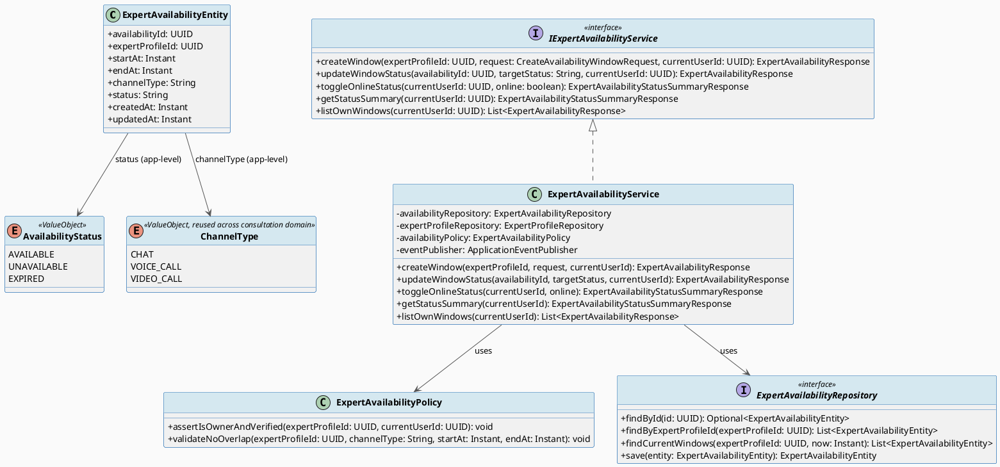
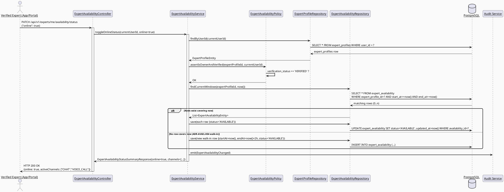
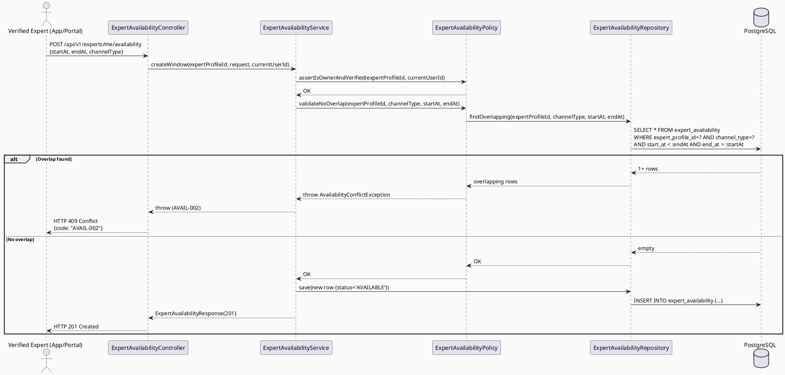
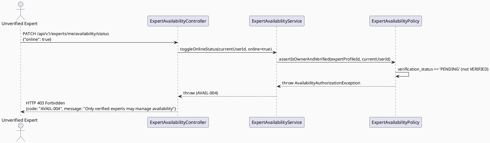
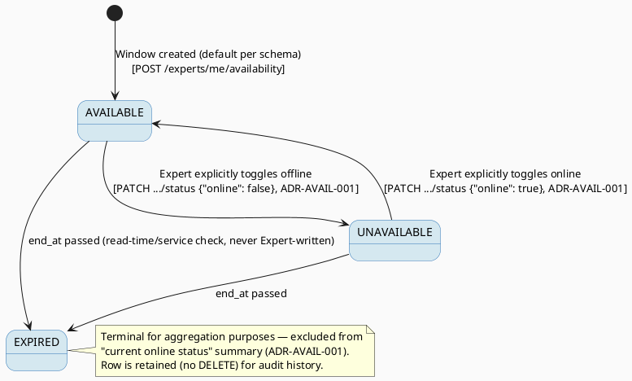

# ENGINEERING DOCUMENTATION STANDARD (EDS) v2.0
# UC142 — Update Consultation Availability Status — Technical Design Specification

| Field | Value |
|-------|-------|
| **Document ID** | `CB-CONSULTATION-IMP-142` |
| **Version** | `1.0` |
| **Date** | `2026-07-02` |
| **Status** | `Draft` |
| **Document Owner** | `TV4-Lâm` |
| **Author** | `AI Agent (Technical Architect)` |
| **Reviewed by** | `[Tech Lead — Pending]` |
| **DPO Sign-off** | `[ ] Pending` *(availability schedule is Expert-operational data, not health-context PII — low DPO priority, see §1)* |
| **Approved by** | `[Principal Architect — Pending]` |
| **Last Review** | `2026-07-02` |
| **Based on EDS** | `v2.0` |

---

## CHANGELOG

| Ngày | Người thực hiện | Nội dung thay đổi |
|------|-----------------|-------------------|
| 2026-07-02 | AI Agent — Technical Architect | Tạo tài liệu lần đầu (Draft) cho UC142 |

---

## MỤC LỤC

1. [Tổng quan Module](#1-tổng-quan-module)
2. [Ma trận Truy vết (Traceability Matrix)](#2-ma-trận-truy-vết-traceability-matrix)
3. [Architecture Decision Records (ADR)](#3-architecture-decision-records-adr)
4. [Non-Functional Requirements & SLA](#4-non-functional-requirements--sla)
5. [Static Modeling (Mô hình Tĩnh)](#5-static-modeling-mô-hình-tĩnh)
6. [Dynamic Modeling (Mô hình Động)](#6-dynamic-modeling-mô-hình-động)
7. [Domain Event Catalog](#7-domain-event-catalog)
8. [Interface Specification (Đặc tả Giao diện)](#8-interface-specification-đặc-tả-giao-diện)
9. [API Specification](#9-api-specification)
10. [Bảng mã lỗi (Error Codes)](#10-bảng-mã-lỗi-error-codes)
11. [Quy trình Triển khai (Step-by-Step)](#11-quy-trình-triển-khai-step-by-step)
12. [Rollback & Incident Runbook](#12-rollback--incident-runbook)
13. [Kịch bản Kiểm thử Chi tiết](#13-kịch-bản-kiểm-thử-chi-tiết)
14. [Phương pháp Xác minh](#14-phương-pháp-xác-minh)
15. [Mẫu thử thực tế (API Verification Samples)](#15-mẫu-thử-thực-tế-api-verification-samples)
16. [Bảng tổng hợp phân quyền (Authorization Matrix)](#16-bảng-tổng-hợp-phân-quyền-authorization-matrix)
17. [AI Prompt Constraints (CASE 2.0)](#17-ai-prompt-constraints-case-20)

---

## 1. Tổng quan Module

| Field | Value |
|-------|-------|
| **Module Name** | `Consultation — Expert Availability` |
| **Bounded Context** | `Consultation` (package `com.carebridge.backend.consultation`) |
| **Function ID / UC** | `3.3.5.1 Update Consultation Availability Status` / `UC-142` (SRS L3531-3548) |
| **Primary Actor** | Verified Expert |
| **Secondary Actors** | None |
| **Platform** | **Web (Expert Portal) AND Mobile (Expert App)** — SRS "Other Information" row states `Platform: Expert App / Expert Portal`; no single-platform restriction found in SRS text, so both are in scope (see §1.2). |
| **Priority** | Medium |
| **Sprint / Owner** | Sprint 3 "Cross-Domain Integration" — TV4-Lâm (function spec `3.3.5.1`, `04_Implement/implement_artifacts/function-spec-task-allocation.md` L582) |
| **Data Classification** | `Internal` (Expert's own operational schedule; no third-party PII; `Confidential` in the sense that only the owning Expert may write it) |
| **Compliance Scope** | Internal `BR-RBAC`, `BR-CONSULTATION` |
| **Upstream Dependencies** | `Create Expert Profile (3.2.1.1)`, `Verify Expert Profile (3.2.2.5)` — `expert_profiles.verification_status = 'VERIFIED'` is a precondition; `Configure Availability (3.2.1.4)` is the sibling "initial setup" flow this UC142 extends/updates (both map to the same `expert_availability` table — see §1.3) |
| **Downstream Consumers** | `Book Private Consultation (3.3.1.52)` — reads `expert_availability` rows with `status='AVAILABLE'` to offer bookable slots; `Respond to Consultation Request (UC-143)` — reads availability/channel context when Expert responds; `View Expert Directory / Profile (3.3.1.57/.58)` — may surface an aggregate "currently available" indicator |

### 1.1 Scope Statement — Greenfield within an existing schema contract

Same greenfield posture as sibling consultation-domain TDS (UC78, UC95,
UC96): backend `com.carebridge.backend.consultation` package holds only
`.gitkeep` placeholders in every layer folder
(`controller/dto/entity/mapper/policy/repository/service`). Mobile
`lib/features/consultation/` (`models/repositories/screens/services/widgets`)
and Web `src/features/consultationManagement/`
(`components/models/pages/services`) are likewise placeholder-only. The
schema table `expert_availability` (`V1__init_schema.sql` L817-826) already
models the domain. This TDS designs UC142 against that schema contract.

### 1.2 Platform Determination — Both Web and Mobile in scope

SRS UC-142 "Other Information" row (L3547): `Platform: Expert App / Expert
Portal; Source group: Expert App - Mobile Consultation & Location.` This
phrasing is **identical** across UC142/UC143/UC144/UC145/UC146 in this SRS
subsection — it does not restrict any one of them to a single platform. Read
literally, "Expert App" (Mobile) and "Expert Portal" (Web) are both named as
valid entry surfaces. Sibling TDS UC95 (`3.2.1.9 Manage Consultation
Session`) scoped itself to **Web only** because its function spec ID
(`3.2.1.9`) belongs to the `3.2.1.x "Expert Web Portal"` SRS cluster.
UC142/UC143/UC144 instead belong to function spec cluster `3.3.5.x
"Mobile Consultation & Location"` (SRS heading L3529 explicitly says
**"Mobile Consultation & Location"**), which is Mobile-primary by section
naming, while the "Other Information" row still names the Portal as an
alternate surface. **Decision (non-blocking, not a hard Open item):** Mobile
is the **primary** platform (SRS section header), Web (Expert Portal) is a
**secondary/parity** surface reusing the same backend API — both are
in-scope for this TDS's backend contract; UI-layer commitment differs by
platform priority (see ADR-AVAIL-004).

### 1.3 Relationship to `Configure Availability` (3.2.1.4) — Same table, different UC boundary

`3.2.1.4 Configure Availability` (owned by TV4-Lâm, Sprint 1, function-spec
allocation L267) is the **initial bulk-setup** flow (Expert defines their
recurring/one-off available windows for the first time). `UC-142 Update
Consultation Availability Status` (this TDS) is the **ongoing status
management** flow — toggling existing slots online/offline and adjusting
channel availability day-to-day. Both operate on the same
`expert_availability` table. This TDS does **not** redefine the initial
bulk-creation flow (out of scope — assumed to exist via 3.2.1.4, tracked as
an Entry-Criteria dependency, §11.1) and focuses on **status
transitions on existing rows** plus **quick-toggle current-window
create/update**.

---

## 2. Ma trận Truy vết (Traceability Matrix)

| Requirement ID | Loại (BR/ADR/US) | Mô tả yêu cầu | Thành phần Code | Compliance Target | ADR liên quan |
|----------------|------------------|---------------|-----------------|-------------------|---------------|
| UC-142 (SRS §3.3.5.1, L3531-3548) | Use Case | Expert manages online status and available consultation channels | `ExpertAvailabilityController`, `ExpertAvailabilityService` | BR-CONSULTATION | ADR-AVAIL-001 |
| BR-RBAC | Business Rule | Users may access only functions allowed by role/permission scope | `ExpertAvailabilityPolicy.assertIsOwner()` | Authorization | ADR-AVAIL-002 |
| BR-CONSULTATION | Business Rule | Booking/session/availability actions keep auditable lifecycle state | `ExpertAvailabilityEntity.status`, audit log emission | PDPA / BR-AUDIT | ADR-AVAIL-001, ADR-AVAIL-003 |
| SRS E1 (access denied when unauthenticated/unauthorized/out of scope) | Exception Flow | Only the owning, verified Expert may update their own availability | `ExpertAvailabilityPolicy.assertIsOwner()` + `assertVerified()` | BR-RBAC | ADR-AVAIL-002 |
| SRS E2 (invalid/missing/expired/conflicting data rejected) | Exception Flow | Overlapping or invalid time windows rejected | `ExpertAvailabilityService.validateNoOverlap()` | BR-CONSULTATION | ADR-AVAIL-003 |
| SRS E3 (external/network/server failure — retry guidance, no duplicate unsafe action) | Exception Flow | Availability writes are idempotent per `availability_id`; no duplicate slot created on retry | `ExpertAvailabilityService.updateStatus()` | BR-CONSULTATION | ADR-AVAIL-003 |
| Schema: `expert_availability` (`V1__init_schema.sql` L817-826) | Schema Contract | Availability slot persistence (time window, channel, status) | `ExpertAvailabilityEntity` | — | — |
| Open — "online/offline toggle" vs. discrete time-slot rows (§3 ADR-AVAIL-001) | Open Item | SRS says "manage online status"; schema has no single boolean `is_online` column | `ExpertAvailabilityService` | BR-CONSULTATION | ADR-AVAIL-001 |

---

## 3. Architecture Decision Records (ADR)

### ADR-AVAIL-001 — "Online status" is represented as a bulk status transition over the Expert's currently-active `expert_availability` rows, not a single boolean flag

| Field | Value |
|-------|-------|
| **Status** | `Proposed` *(requires Product/Tech Lead sign-off — SRS text and schema disagree on data shape)* |
| **Deciders** | `AI Agent (proposal only) — pending TV4-Lâm / Tech Lead confirmation` |
| **Date** | `2026-07-02` |
| **Supersedes** | — |

#### Bối cảnh (Context)
SRS UC-142 description: "Lets the expert manage online status and available
consultation channels." This phrasing suggests a single toggle (e.g., "I am
online now"). However, `V1__init_schema.sql` L817-826 models
`expert_availability` as **discrete time-window rows**:
`availability_id, expert_profile_id, start_at, end_at, channel_type,
status varchar(20) DEFAULT 'AVAILABLE'` — **no `is_online` boolean or
single-row-per-expert "current status" column exists anywhere in the
schema** (verified: no such column on `expert_profiles` either, confirmed by
full-table grep of `V1__init_schema.sql`). The schema shape matches a
**calendar/slot-booking model** (used by `Configure Availability` 3.2.1.4 to
publish bookable windows), not a **live presence toggle** model.

#025 Các phương án đã xem xét (Options Considered)

| Phương án | Mô tả | Ưu điểm | Nhược điểm |
|-----------|-------|----------|------------|
| A | Add a new `expert_profiles.is_online boolean` column via migration | Matches SRS wording literally; simplest UI | New migration for a field whose meaning duplicates/conflicts with the existing `expert_availability.status` semantics; two sources of truth for "is the expert available now" |
| B | **No migration. "Online status" = bulk PATCH over the Expert's `expert_availability` rows whose `[start_at, end_at]` window contains "now"**: setting status to `AVAILABLE` marks all such current-window rows (and, if none exist, creates a short-lived "walk-in" row per ADR-AVAIL-004) as `AVAILABLE`; setting to `UNAVAILABLE` marks them `UNAVAILABLE`. Channel availability = the `channel_type` value(s) on those rows. | Zero schema change; single source of truth (`expert_availability` already owned by 3.2.1.4); consistent with UC95's "no migration unless genuine gap" default; `Book Private Consultation` already must read this table to offer slots, so booking-eligibility and online-status share one query | UX must clearly explain "current status reflects your active availability windows," a slightly more complex mental model than a single toggle |
| C | Derive "online" purely from `expert_availability.status='AVAILABLE'` rows overlapping now, **read-only** — no explicit "toggle" endpoint, Expert can only edit rows via 3.2.1.4's slot editor | Simplest backend | Does not satisfy SRS's explicit "manage online status" verb (implies an explicit action-taking endpoint) — rejected |

#### Quyết định (Decision)
Chọn **Phương án B**. No migration. `expert_availability.status` values used
by this TDS (reusing the existing free-text `varchar(20) DEFAULT
'AVAILABLE'` column, no CHECK constraint — consistent with UC95
ADR-SESSION-001's "app-level enum enforcement" precedent):

```
AVAILABLE    — Expert is reachable via this window/channel (schema default)
UNAVAILABLE  — Expert explicitly marked this window/channel as not reachable
               (was previously AVAILABLE; Expert manually paused it)
EXPIRED      — end_at has passed; set by a read-time/service-level check,
               never written by the Expert directly (excluded from "current
               online status" aggregation)
```

`GET /api/v1/experts/me/availability/status` aggregates: "online" = **true**
if ≥ 1 row has `status='AVAILABLE'` AND `start_at <= now() <= end_at`.
`PATCH /api/v1/experts/me/availability/status` with `{"online": false}`
bulk-sets all such current-window rows to `UNAVAILABLE`.
`{"online": true}` bulk-sets all `UNAVAILABLE` current-window rows back to
`AVAILABLE`; if **no** row currently covers "now", see ADR-AVAIL-004
(walk-in slot creation). **This decision is `Proposed`, not `Accepted`** —
flagged for Product/Tech Lead confirmation because the SRS wording ("online
status") vs. schema shape (time-slot rows) gap is a genuine design choice,
not a trivial schema-lookup fact.

#### Hệ quả (Consequences)

**Tích cực:** No migration required; single source of truth shared with booking eligibility; consistent with existing schema conventions (app-level status enum, no CHECK constraint, per UC95 precedent).
**Tiêu cực / Trade-offs:** "Online toggle" UX is slightly more complex than a boolean; if the Expert has zero availability rows at all, toggling "online" has no row to act on unless ADR-AVAIL-004's walk-in slot applies — must be clearly communicated in UI empty-state.
**Compliance Impact:** Supports BR-CONSULTATION auditable-lifecycle requirement — every status change is a row-level `updated_at` change, auditable.

---

### ADR-AVAIL-002 — Ownership: only the profile-owning, verified Expert may read/write their own availability

| Field | Value |
|-------|-------|
| **Status** | `Accepted` |
| **Deciders** | `AI Agent — derived directly from schema + BR-RBAC` |
| **Date** | `2026-07-02` |

#### Bối cảnh (Context)
`expert_availability.expert_profile_id` FKs to `expert_profiles
(expert_profile_id)`, which FKs to `users` via `expert_profiles.user_id`.
SRS actor is "Verified Expert." SRS Exception E1: "Access is denied when the
actor is unauthenticated, unauthorized, or outside the permitted data
scope."

#### Các phương án đã xem xét (Options Considered)

| Phương án | Mô tả | Ưu điểm | Nhược điểm |
|-----------|-------|----------|------------|
| A | Any authenticated Expert can edit any `expert_profile_id`'s availability | Simple | Violates BR-RBAC; allows cross-account tampering (IDOR) |
| B | **Only `expert_profiles.user_id == currentUserId` may write; additionally require `verification_status == 'VERIFIED'`** (SRS actor = Verified Expert) | Matches schema FK semantics; matches UC95 ADR-SESSION-002 precedent exactly | Requires a policy check per request (negligible cost) |

#### Quyết định (Decision)
Chọn **Phương án B**. `ExpertAvailabilityPolicy.assertIsOwnerAndVerified(
expertProfileId, currentUserId)` verifies `expert_profiles.user_id ==
currentUserId` AND `expert_profiles.verification_status == 'VERIFIED'`.
Unverified or non-owning callers receive `403 Forbidden` (`AVAIL-004`). Read
access (`GET /availability/status`) is likewise owner-only for the
management endpoints in this TDS (public/booking-facing read of
`AVAILABLE` slots is a separate, already-existing concern of `Book Private
Consultation` 3.3.1.52 — out of scope here).

#### Hệ quả (Consequences)

**Tích cực:** Prevents IDOR / cross-tenant tampering; enforces "Verified Expert" precondition from SRS actor definition; identical pattern to UC95 ADR-SESSION-002, easing implementer cognitive load across the consultation domain.
**Tiêu cực / Trade-offs:** None material — mandatory RBAC control.
**Compliance Impact:** Satisfies BR-RBAC.

---

### ADR-AVAIL-003 — Overlap validation and idempotent status writes

| Field | Value |
|-------|-------|
| **Status** | `Accepted` |
| **Deciders** | `AI Agent — derived from SRS E2/E3` |
| **Date** | `2026-07-02` |

#### Bối cảnh (Context)
SRS E2: "Invalid, missing, expired, or conflicting data is rejected with a
field-level or action-level message." SRS E3: "External service, network, or
server failure is handled with retry guidance and no duplicate unsafe
action." An Expert creating/editing a new `expert_availability` window for a
given `channel_type` must not silently create overlapping windows with
contradictory status, and retrying a status PATCH must not create duplicate
rows.

#### Các phương án đã xem xét (Options Considered)

| Phương án | Mô tả | Ưu điểm | Nhược điểm |
|-----------|-------|----------|------------|
| A | No overlap validation — allow arbitrary overlapping rows per channel | Simple | Ambiguous booking-eligibility queries downstream (which row wins?); violates SRS E2 |
| B | **Reject creation of a new row whose `[start_at, end_at]` overlaps an existing row with the same `expert_profile_id` + `channel_type` (409 `AVAIL-002`); status PATCH on an existing `availability_id` is idempotent (repeat PATCH with same target status is a no-op 200, not an error)** | Matches SRS E2 (reject conflicting data) and E3 (idempotent retry, no duplicate) | Requires a range-overlap query per write (negligible cost, indexed on `expert_profile_id`/`start_at`) |

#### Quyết định (Decision)
Chọn **Phương án B**. `ExpertAvailabilityService.validateNoOverlap()` runs
before any `POST` (new window) — reject with `409 AVAIL-002` on overlap.
`PATCH .../{availabilityId}/status` is idempotent: re-issuing the same
target status returns `200 OK` with unchanged `updated_at` semantics (safe
retry, no duplicate row, satisfies SRS E3).

#### Hệ quả (Consequences)

**Tích cực:** No ambiguous overlapping availability; safe client retry semantics.
**Tiêu cực / Trade-offs:** Slightly more complex validation query — acceptable, indexed.
**Compliance Impact:** Supports BR-CONSULTATION auditable-lifecycle requirement; no duplicate unsafe action per SRS E3.

---

### ADR-AVAIL-004 — "Walk-in" quick-toggle when no row currently covers "now"

| Field | Value |
|-------|-------|
| **Status** | `Proposed` *(UX/Product decision — Open pending confirmation)* |
| **Deciders** | `AI Agent (proposal only) — pending Product confirmation` |
| **Date** | `2026-07-02` |

#### Bối cảnh (Context)
If the Expert has no `expert_availability` row covering the current instant
(e.g., they only pre-scheduled future windows via 3.2.1.4), a "go online
now" action (ADR-AVAIL-001 Option B) has no row to flip. SRS is silent on
this edge case.

#### Các phương án đã xem xét (Options Considered)

| Phương án | Mô tả | Ưu điểm | Nhược điểm |
|-----------|-------|----------|------------|
| A | Reject "go online" with an error instructing the Expert to configure availability first (3.2.1.4) | Simple, no new row-creation semantics | Poor UX for a "quick toggle" mental model implied by SRS wording |
| B | **Auto-create a short-lived "walk-in" `expert_availability` row: `start_at = now()`, `end_at = now() + 2 hours` (Open — exact duration is a Product default, proposed here, not sourced from SRS/BR), `channel_type` = Expert's default/last-used channel, `status = 'AVAILABLE'`** | Matches "quick online toggle" UX intent | Introduces an un-sourced 2-hour default — flagged Open, must be confirmed by Product before Sprint implementation |

#### Quyết định (Decision)
Chọn **Phương án B** as the proposed default, **explicitly flagged Open**:
the exact walk-in window duration (`2 hours` proposed) and default
`channel_type` selection rule are not sourced from SRS/BR and must be
confirmed by Product/Tech Lead before implementation. If Product prefers
Option A (no walk-in auto-create), this ADR must be revised before Sprint
work starts — implementers must not silently pick either option.

#### Hệ quả (Consequences)

**Tích cực:** Satisfies the "quick online toggle" UX implied by SRS wording without requiring the Expert to pre-schedule every session.
**Tiêu cực / Trade-offs:** Un-sourced 2-hour default is an assumption, not a confirmed business rule — explicitly Open.
**Compliance Impact:** None beyond BR-CONSULTATION auditable-lifecycle (the walk-in row is auditable like any other).

---

## 4. Non-Functional Requirements & SLA

> No SRS/BR source specifies numeric SLA targets for UC142. Values below are
> **Open — proposed defaults**, consistent with UC95/UC78 sibling TDS
> defaults, must be confirmed by Tech Lead.

### 4.1. Performance & Availability

| Category | Requirement | Target SLA | Measurement Method | Compliance Basis |
|----------|-------------|------------|---------------------|------------------|
| Latency | `PATCH /experts/me/availability/status` p99 | `< 300ms` *(Open — proposed, matches template default)* | Manual/API test timing | — |
| Latency | `GET /experts/me/availability/status` p99 | `< 200ms` *(Open — proposed)* | Manual/API test timing | — |
| Availability | Backend service uptime | `99.9%` monthly *(Open — proposed)* | Uptime monitor | — |

### 4.2. Data Integrity & Retention

| Category | Requirement | Target | Verification Method | Compliance Basis |
|----------|-------------|--------|---------------------|------------------|
| Durability | No availability record loss | RPO = 0 | Transaction log | BR-CONSULTATION |
| Retention | Availability history (append lifecycle, status-only updates) | Indefinite | DB inspection — no hard DELETE exposed to Expert (soft `EXPIRED` only) | BR-CONSULTATION |
| Consistency | No overlapping `AVAILABLE`/`UNAVAILABLE` rows per Expert+channel (ADR-AVAIL-003) | 100% (service-level enforcement) | Overlap-check query | ADR-AVAIL-003 |

### 4.3. Security

| Category | Requirement | Target | Verification Method | Compliance Basis |
|----------|-------------|--------|---------------------|------------------|
| Access control | Role-based, ownership-scoped | Least privilege (Expert = own profile only) | Auth Matrix (§16) | BR-RBAC |
| Verification gate | Only `VERIFIED` experts may write | Enforced in policy | Auth Matrix (§16) | BR-RBAC |

### 4.4. Scalability & Capacity Planning

SRS marks UC142 "Frequency of Use: Regular." Availability writes track
Expert population size (low volume relative to booking/message traffic); no
special scaling design required beyond standard Spring Boot request handling
at current expected scale.

---

## 5. Static Modeling (Mô hình Tĩnh)

### 5.1. Component Responsibilities & Planned File Paths

| Layer | File Path | Responsibility |
|-------|-----------|----------------|
| Controller | `src/main/java/com/carebridge/backend/consultation/controller/ExpertAvailabilityController.java` | HTTP mapping, DTO validation only |
| Service | `src/main/java/com/carebridge/backend/consultation/service/ExpertAvailabilityService.java` | Availability CRUD + bulk status-toggle workflow (ADR-AVAIL-001), overlap validation (ADR-AVAIL-003), event emission |
| Repository | `src/main/java/com/carebridge/backend/consultation/repository/ExpertAvailabilityRepository.java` | Persistence for `expert_availability` (canonical owner — shared read-only interface for `Book Private Consultation` 3.3.1.52 and UC143) |
| Repository | `src/main/java/com/carebridge/backend/consultation/repository/ExpertProfileRepository.java` | Read-only lookups for ownership/verification checks (interface only — shared with sibling consultation TDS) |
| Entity | `src/main/java/com/carebridge/backend/consultation/entity/ExpertAvailabilityEntity.java` | JPA mapping for `expert_availability` |
| DTO | `src/main/java/com/carebridge/backend/consultation/dto/request/CreateAvailabilityWindowRequest.java` | Inbound payload for new slot creation |
| DTO | `src/main/java/com/carebridge/backend/consultation/dto/request/UpdateAvailabilityStatusRequest.java` | Inbound payload for bulk online/offline toggle (`{"online": boolean}`) or single-row status PATCH |
| DTO | `src/main/java/com/carebridge/backend/consultation/dto/response/ExpertAvailabilityResponse.java` | Outbound payload — single availability row |
| DTO | `src/main/java/com/carebridge/backend/consultation/dto/response/ExpertAvailabilityStatusSummaryResponse.java` | Outbound payload — aggregate online/offline + active channels |
| Mapper | `src/main/java/com/carebridge/backend/consultation/mapper/ExpertAvailabilityMapper.java` | Entity ↔ DTO, never expose entity |
| Policy | `src/main/java/com/carebridge/backend/consultation/policy/ExpertAvailabilityPolicy.java` | Ownership + verification check (ADR-AVAIL-002), overlap guard (ADR-AVAIL-003) |
| Web Model | `05_Development/CareBridgeWebApp/src/features/consultationManagement/models/expertAvailability.ts` | Availability DTO mirror (Zod schema) |
| Web Service | `05_Development/CareBridgeWebApp/src/features/consultationManagement/services/expertAvailabilityApi.ts` | API client (TanStack Query hooks) |
| Web Page/Component | `05_Development/CareBridgeWebApp/src/features/consultationManagement/components/AvailabilityStatusToggle.tsx` | Online/offline toggle + channel selector UI (Expert Portal, secondary surface per §1.2) |
| Mobile Model | `05_Development/CareBridgeMobileApp/lib/features/consultation/models/expert_availability.dart` | Availability DTO mirror |
| Mobile Service | `05_Development/CareBridgeMobileApp/lib/features/consultation/services/expert_availability_service.dart` | API client wrapper |
| Mobile Screen/Widget | `05_Development/CareBridgeMobileApp/lib/features/consultation/widgets/availability_status_toggle.dart` | Online/offline toggle + channel selector UI (Expert App, primary surface per §1.2) |

### 5.2. Class Diagram (PlantUML)



### 5.3. Data Structure — Schema/Migration Details

> **CareBridge rule:** `V1__init_schema.sql` and approved Flyway migrations
> are primary source of truth. ERD is supporting context only.

**No new migration is required.** The following table already exists
(`V1__init_schema.sql`, verified):

```sql
-- expert_availability (V1__init_schema.sql L817-826)
CREATE TABLE public.expert_availability (
    availability_id   uuid        NOT NULL DEFAULT gen_random_uuid(),
    expert_profile_id uuid        NOT NULL,
    start_at          timestamptz NOT NULL,
    end_at            timestamptz NOT NULL,
    channel_type      varchar(30) NOT NULL,
    status            varchar(20) NOT NULL DEFAULT 'AVAILABLE',
    created_at        timestamptz NOT NULL DEFAULT now(),
    updated_at        timestamptz NOT NULL DEFAULT now()
);
-- PK: availability_id (V1__init_schema.sql L1410-1411)
-- FK: expert_profile_id -> expert_profiles (L1808-1809)
-- Index: idx_expert_availability_expert_profile_id (L1633)
-- Index: idx_expert_availability_status (L1634)
-- Index: idx_expert_availability_start_at (L1635)
```

**Genuine gap identified (Open — flag for confirmation, non-blocking, see
ADR-AVAIL-001/004):**
1. No single "online now" boolean column exists on `expert_profiles` or
   `expert_availability` — this TDS represents "online status" as a derived
   aggregate over current-window rows (ADR-AVAIL-001 Option B), **not** via a
   new migration. Product/Tech Lead sign-off pending on this interpretation.
2. `expert_availability.status` has **no CHECK constraint** (free-text
   `varchar(20)`) — application-level enum enforcement in
   `ExpertAvailabilityPolicy`, consistent with UC95 ADR-SESSION-001
   precedent. No migration needed.
3. `channel_type` has no CHECK constraint either — values `CHAT` /
   `VOICE_CALL` / `VIDEO_CALL` are an application-level convention
   inferred from sibling SRS entries 3.3.5.3/.4/.5 (Chat/Voice/Video),
   consistent with `consultation_bookings.channel_type` (same column
   shape, no constraint) and `consultation_price_bands.channel_type`.

No sync action needed for `V1__init_schema.sql`.

---

## 6. Dynamic Modeling (Mô hình Động)

### 6.1. Sequence Diagram — Happy Path: Expert Toggles Online Status (PlantUML)



### 6.2. Sequence Diagram — Alternative: Expert Creates a New Availability Window (PlantUML)



### 6.3. Sequence Diagram — Error Path: Unverified Expert Attempts Update (PlantUML)



### 6.4. State Machine — Availability Window Status (bắt buộc)



**⚠️ Invariant bất biến:**
1. `status` may only be `AVAILABLE`, `UNAVAILABLE`, or `EXPIRED`
   (application-level enum, ADR-AVAIL-001/§5.3 gap note 2).
2. Only the owning, `VERIFIED` Expert may write `status` on their own
   `expert_profile_id` rows (ADR-AVAIL-002).
3. No two rows for the same `expert_profile_id` + `channel_type` may have
   overlapping `[start_at, end_at]` windows (ADR-AVAIL-003).
4. `EXPIRED` is never set directly by the Expert — it is a read-time/service
   derived state once `end_at < now()`.

---

## 7. Domain Event Catalog

### 7.1. Events Published (Phát ra)

| Event Name | Trigger | Publisher | Subscriber(s) | Payload Schema | Async? |
|------------|---------|-----------|---------------|----------------|--------|
| `ExpertAvailabilityChanged` | Any `expert_availability.status` transition or new window creation (§6.4) | `ExpertAvailabilityService` | `Book Private Consultation` (booking-eligibility cache, out of scope consumer), `View Expert Directory` (currently-available indicator, out of scope consumer), Audit log | `ExpertAvailabilityChanged.java` | Yes |

### 7.2. Events Consumed (Tiêu thụ)

| Event Name | Source | Handler | Action thực hiện |
|------------|--------|---------|------------------|
| *(None)* | — | — | UC142's availability-management flow does not consume any external event; it reads `expert_profiles` synchronously at request time to check ownership/verification. |

### 7.3. Payload Schema

```java
// ExpertAvailabilityChanged.java
public record ExpertAvailabilityChanged(
    UUID    eventId,
    String  eventType,       // "ExpertAvailabilityChanged"
    Instant occurredAt,
    String  version,         // "1.0"
    Payload payload,
    Metadata metadata
) implements ApplicationEvent {

    public record Payload(
        UUID    availabilityId,
        UUID    expertProfileId,
        String  channelType,     // CHAT | VOICE_CALL | VIDEO_CALL
        String  previousStatus,  // AVAILABLE | UNAVAILABLE | EXPIRED | null (on create)
        String  newStatus,       // AVAILABLE | UNAVAILABLE | EXPIRED
        Instant startAt,
        Instant endAt
    ) {}

    public record Metadata(
        UUID   correlationId,
        String causedBy          // userId
    ) {}
}
```

---

## 8. Interface Specification (Đặc tả Giao diện)

### 8.1. Service Interface

```java
// CreateAvailabilityWindowRequest.java — Input DTO
// @version 1.0
public class CreateAvailabilityWindowRequest {
    @NotNull
    @Future
    private Instant startAt;
    @NotNull
    @Future
    private Instant endAt;      // must be > startAt
    @NotBlank
    @Pattern(regexp = "CHAT|VOICE_CALL|VIDEO_CALL")
    private String channelType;
    // getters / setters / @Valid annotations
}

// UpdateAvailabilityStatusRequest.java — Input DTO
// @version 1.0
public class UpdateAvailabilityStatusRequest {
    @NotNull
    private Boolean online;   // true = go online (bulk AVAILABLE), false = go offline (bulk UNAVAILABLE)
    // getters / setters
}

// ExpertAvailabilityResponse.java — Output DTO
public class ExpertAvailabilityResponse {
    private UUID availabilityId;
    private UUID expertProfileId;
    private Instant startAt;
    private Instant endAt;
    private String channelType;    // CHAT | VOICE_CALL | VIDEO_CALL
    private String status;         // AVAILABLE | UNAVAILABLE | EXPIRED
    // getters / setters
}

// ExpertAvailabilityStatusSummaryResponse.java — Output DTO
public class ExpertAvailabilityStatusSummaryResponse {
    private boolean online;
    private List<String> activeChannels;  // distinct channelType of current AVAILABLE rows
    // getters / setters
}

// IExpertAvailabilityService.java — Service Contract
// @version 1.0
public interface IExpertAvailabilityService {
    /**
     * Creates a new availability window for the current Expert.
     * @throws AvailabilityAuthorizationException (AVAIL-004) if unverified/not owner
     * @throws AvailabilityConflictException (AVAIL-002) if window overlaps an existing one for the same channel
     */
    ExpertAvailabilityResponse createWindow(CreateAvailabilityWindowRequest request, UUID currentUserId);

    /**
     * Bulk toggles online/offline over all current-window rows (ADR-AVAIL-001).
     * Idempotent — repeat calls with the same target state are a no-op 200.
     * @throws AvailabilityAuthorizationException (AVAIL-004) if unverified/not owner
     */
    ExpertAvailabilityStatusSummaryResponse toggleOnlineStatus(UUID currentUserId, boolean online);

    /**
     * Updates a single window's explicit status.
     * @throws AvailabilityNotFoundException (AVAIL-003) if availabilityId does not exist
     * @throws AvailabilityAuthorizationException (AVAIL-004) if unverified/not owner
     */
    ExpertAvailabilityResponse updateWindowStatus(UUID availabilityId, String targetStatus, UUID currentUserId);

    /**
     * Retrieves the current aggregate online/offline + active channel summary.
     */
    ExpertAvailabilityStatusSummaryResponse getStatusSummary(UUID currentUserId);

    /**
     * Lists all availability windows owned by the current Expert.
     */
    List<ExpertAvailabilityResponse> listOwnWindows(UUID currentUserId);
}
```

### 8.2. Repository Interface

```java
// ExpertAvailabilityRepository.java
// @version 1.0
public interface ExpertAvailabilityRepository extends JpaRepository<ExpertAvailabilityEntity, UUID> {

    Optional<ExpertAvailabilityEntity> findById(UUID availabilityId);

    List<ExpertAvailabilityEntity> findByExpertProfileId(UUID expertProfileId);

    @Query("SELECT a FROM ExpertAvailabilityEntity a WHERE a.expertProfileId = :expertProfileId AND a.startAt <= :now AND a.endAt >= :now")
    List<ExpertAvailabilityEntity> findCurrentWindows(UUID expertProfileId, Instant now);

    @Query("SELECT a FROM ExpertAvailabilityEntity a WHERE a.expertProfileId = :expertProfileId AND a.channelType = :channelType AND a.startAt < :endAt AND a.endAt > :startAt")
    List<ExpertAvailabilityEntity> findOverlapping(UUID expertProfileId, String channelType, Instant startAt, Instant endAt);

    // Append-only for lifecycle: no delete() exposed. Status transitions via @Modifying UPDATE only,
    // always guarded by ExpertAvailabilityPolicy.
}
```

---

## 9. API Specification

### 9.1. Endpoints Table

| Method | Path | Auth Level | Required Roles | Rate Limit | Idempotent? |
|--------|------|------------|----------------|------------|-------------|
| `POST` | `/api/v1/experts/me/availability` | JWT Bearer | `EXPERT` (verified only) | 30/min | No |
| `PATCH` | `/api/v1/experts/me/availability/status` | JWT Bearer | `EXPERT` (verified only) | 30/min | Yes (bulk toggle, idempotent per ADR-AVAIL-003) |
| `PATCH` | `/api/v1/experts/me/availability/{availabilityId}/status` | JWT Bearer | `EXPERT` (verified, owner only) | 30/min | Yes |
| `GET` | `/api/v1/experts/me/availability/status` | JWT Bearer | `EXPERT` | 300/min | Yes |
| `GET` | `/api/v1/experts/me/availability` | JWT Bearer | `EXPERT` | 300/min | Yes |

### 9.2. Request / Response Schemas

#### `PATCH /api/v1/experts/me/availability/status` — Toggle online status

**Request Body:**
```json
{
  "online": true
}
```

**Response — 200 OK (Happy Path):**
```json
{
  "online": true,
  "activeChannels": ["CHAT", "VOICE_CALL"]
}
```

**Response — 403 Forbidden (Unverified Expert):**
```json
{
  "error": {
    "code": "AVAIL-004",
    "message": "Only verified experts may manage availability"
  }
}
```

#### `POST /api/v1/experts/me/availability` — Create availability window

**Request Body:**
```json
{
  "startAt": "2026-07-03T09:00:00.000Z",
  "endAt": "2026-07-03T12:00:00.000Z",
  "channelType": "CHAT"
}
```

**Response — 201 Created (Happy Path):**
```json
{
  "availabilityId": "9f8e7d6c-1234-4a5b-8c9d-0e1f2a3b4c5d",
  "expertProfileId": "3fa85f64-5717-4562-b3fc-2c963f66afa6",
  "startAt": "2026-07-03T09:00:00.000Z",
  "endAt": "2026-07-03T12:00:00.000Z",
  "channelType": "CHAT",
  "status": "AVAILABLE"
}
```

**Response — 409 Conflict (Overlapping window):**
```json
{
  "error": {
    "code": "AVAIL-002",
    "message": "Availability window overlaps an existing window for this channel"
  }
}
```

---

## 10. Bảng mã lỗi (Error Codes)

| Code | HTTP Status | Message (EN) | Message (VI) | Trigger Condition |
|------|-------------|--------------|--------------|-------------------|
| `AVAIL-001` | 400 | Validation failed | Dữ liệu không hợp lệ | `startAt`/`endAt`/`channelType` invalid or `endAt <= startAt` |
| `AVAIL-002` | 409 | Availability window overlaps an existing window | Khung thời gian trùng lặp | New/edited window overlaps existing row for same channel (ADR-AVAIL-003) |
| `AVAIL-003` | 404 | Availability window not found | Không tìm thấy khung thời gian | `availabilityId` does not exist |
| `AVAIL-004` | 403 | Insufficient permissions | Không đủ quyền | Current user is not the owning, verified Expert |
| `AVAIL-500` | 500 | Internal error | Lỗi hệ thống | Unexpected failure |

---

## 11. Quy trình Triển khai (Step-by-Step)

### 11.1. Prerequisites

- [ ] **BLOCKING:** `expert_profiles.verification_status` is reachable and populated (UC `3.2.2.5 Verify Expert Profile`, out of scope here)
- [ ] `3.2.1.4 Configure Availability` (initial bulk-setup) should exist for a complete UX, but UC142 can function standalone against an empty `expert_availability` table (ADR-AVAIL-004 walk-in path)
- [ ] ADR-AVAIL-001 and ADR-AVAIL-004 confirmed by Product/Tech Lead (currently `Proposed`)
- [ ] Principal Architect approves this TDS

### 11.2. Pre-Migration Checklist

- [ ] **N/A** — no new migration required (see §5.3)

### 11.3. Implementation Steps

#### Chặng 1 — Entity + Repository
Create `ExpertAvailabilityEntity` mapped 1:1 to existing schema (§5.3). No
migration needed.

#### Chặng 2 — Policy + Service
Implement `ExpertAvailabilityPolicy` (ownership + verification
ADR-AVAIL-002, overlap guard ADR-AVAIL-003), `ExpertAvailabilityService`
(create/toggle/list workflow, ADR-AVAIL-001 bulk-toggle + ADR-AVAIL-004
walk-in logic).

#### Chặng 3 — Controller + Web + Mobile
Wire `ExpertAvailabilityController`, then Web
`AvailabilityStatusToggle.tsx` (Expert Portal, secondary surface) and
Mobile `availability_status_toggle.dart` (Expert App, primary surface per
§1.2).

### 11.4. Deployment Checklist

- [ ] Endpoints return expected status codes for happy/error paths (§15)
- [ ] Error rate < 1% in first 10 minutes
- [ ] Audit log emits `ExpertAvailabilityChanged` correctly
- [ ] No PII/secret leakage in logs

---

## 12. Rollback & Incident Runbook

### 12.1. Điều kiện kích hoạt Rollback (Trigger Conditions)

| Điều kiện | Ngưỡng | Người quyết định |
|-----------|--------|------------------|
| Error rate tăng đột biến | > 5% trong 5 phút | On-call Engineer |
| Latency p99 vượt ngưỡng | > 2x baseline | On-call Engineer |
| Overlap validation bypassed (data inconsistency) | Bất kỳ case nào | Tech Lead |

### 12.2. Rollback Procedure

```bash
# No new migration to revert (§5.3 — no schema change).
# Revert implementation files only:
git checkout -- src/main/java/com/carebridge/backend/consultation/controller/ExpertAvailabilityController.java
git checkout -- src/main/java/com/carebridge/backend/consultation/service/ExpertAvailabilityService.java
git checkout -- src/main/java/com/carebridge/backend/consultation/policy/ExpertAvailabilityPolicy.java
git checkout -- src/main/java/com/carebridge/backend/consultation/repository/ExpertAvailabilityRepository.java
git checkout -- src/main/java/com/carebridge/backend/consultation/entity/ExpertAvailabilityEntity.java

# Re-deploy previous version
kubectl rollout undo deployment/carebridge-api
kubectl rollout status deployment/carebridge-api
```

### 12.3. Notification Protocol

| Thời điểm | Người nhận | Kênh | Template |
|-----------|------------|------|----------|
| Ngay khi phát hiện | On-call team | Slack `#incident` | "🚨 Expert Availability incident detected: [mô tả]" |

### 12.4. Post-Incident Review (PIR)

Bắt buộc hoàn thành PIR document trong vòng 48 giờ sau khi incident được
resolve, theo template chuẩn EDS §12.4.

---

## 13. Kịch bản Kiểm thử Chi tiết

> Chi tiết đầy đủ nằm ở `UC142_UpdateConsultationAvailabilityStatus_Test-Spec.md`.
> Section này chỉ liệt kê ánh xạ tham chiếu.

| Test Layer | Coverage | Reference |
|------------|----------|-----------|
| Unit — Policy | ADR-AVAIL-002 (ownership/verification), ADR-AVAIL-003 (overlap) | Test-Spec §4 `AVAIL-TC-00x` |
| Unit — Service | ADR-AVAIL-001 (bulk toggle), ADR-AVAIL-004 (walk-in) | Test-Spec §4 `AVAIL-TC-01x` |
| Integration | Full create/toggle/list flow against Testcontainers Postgres | Test-Spec §4 `AVAIL-TC-INT-00x` |
| Security | IDOR attempt on another Expert's `availabilityId` | Test-Spec §4 `AVAIL-TC-SEC-00x` |

---

## 14. Phương pháp Xác minh

### 14.1. Database Inspection

```sql
-- Verify availability window created
SELECT availability_id, expert_profile_id, channel_type, status, start_at, end_at
FROM expert_availability
WHERE expert_profile_id = '[uuid]'
ORDER BY created_at DESC;

-- Verify no overlapping AVAILABLE windows per channel
SELECT expert_profile_id, channel_type, COUNT(*)
FROM expert_availability
WHERE status = 'AVAILABLE'
GROUP BY expert_profile_id, channel_type
HAVING COUNT(*) > 1;
```

### 14.2. Log / Audit Verification

```bash
kubectl logs -l app=carebridge-api | grep '"eventType":"ExpertAvailabilityChanged"' | head -5
```

### 14.3. Tool-based Verification

```bash
# Verify JWT role claim includes EXPERT
echo "[JWT_TOKEN]" | cut -d'.' -f2 | base64 -d | jq .
```

---

## 15. Mẫu thử thực tế (API Verification Samples)

### 15.1. Happy Path

```bash
curl -X PATCH https://[host]/api/v1/experts/me/availability/status \
  -H "Authorization: Bearer [JWT_TOKEN]" \
  -H "Content-Type: application/json" \
  -d '{"online": true}'
```

**Expected Response (200):**
```json
{ "online": true, "activeChannels": ["CHAT"] }
```

### 15.2. Error Paths

```bash
# Unverified expert → 403
curl -X PATCH https://[host]/api/v1/experts/me/availability/status \
  -H "Authorization: Bearer [UNVERIFIED_EXPERT_JWT_TOKEN]" \
  -H "Content-Type: application/json" \
  -d '{"online": true}'
```

**Expected Response (403):**
```json
{ "error": { "code": "AVAIL-004", "message": "Only verified experts may manage availability" } }
```

```bash
# No JWT → 401
curl -X GET https://[host]/api/v1/experts/me/availability/status
```

**Expected Response (401):**
```json
{ "error": { "code": "IAM-001", "message": "Authentication required" } }
```

---

## 16. Bảng tổng hợp phân quyền (Authorization Matrix)

| Endpoint | `GUEST` | `MOTHER`/`FAMILY` | `EXPERT` (unverified) | `EXPERT` (verified, owner) | `SYSTEM_ADMIN` |
|----------|---------|--------------------|------------------------|------------------------------|-----------------|
| `POST /experts/me/availability` | ❌ | ❌ | ❌ (403 AVAIL-004) | ✅ | ❌ (not owner) |
| `PATCH /experts/me/availability/status` | ❌ | ❌ | ❌ (403 AVAIL-004) | ✅ | ❌ (not owner) |
| `PATCH /experts/me/availability/{id}/status` | ❌ | ❌ | ❌ | ✅ Own | ❌ |
| `GET /experts/me/availability/status` | ❌ | ❌ | ✅ Own (read own summary) | ✅ Own | ❌ |
| `GET /experts/me/availability` | ❌ | ❌ | ✅ Own | ✅ Own | ❌ |

**Chú thích:**
- ✅ = Được phép
- ❌ = Bị từ chối (403 hoặc 401)
- `Own` = Chỉ được phép với `expert_profile_id` gắn với `currentUserId`
- `SYSTEM_ADMIN` không có endpoint quản trị availability trong scope UC142 (out of scope — flagged, not invented)

---

## 17. AI Prompt Constraints (CASE 2.0)

### 17.1 Constraint Summary Table

| # | Constraint | Source (ADR/BR) | Last Verified |
|---|-----------|-----------------|---------------|
| C1 | "Online status" MUST be implemented as a bulk status transition over `expert_availability` rows covering "now" — do NOT add a new `is_online` boolean column via migration | `ADR-AVAIL-001` | `2026-07-02` |
| C2 | Every write MUST verify `expert_profiles.user_id == currentUserId` AND `verification_status == 'VERIFIED'` before mutating any row | `ADR-AVAIL-002` | `2026-07-02` |
| C3 | New/edited windows MUST be rejected with `409 AVAIL-002` if they overlap an existing row for the same `expert_profile_id` + `channel_type` | `ADR-AVAIL-003` | `2026-07-02` |
| C4 | Identity comes from the authenticated JWT `sub` claim resolved to `currentUserId` — never trust a client-supplied `expertProfileId`/`userId` in the request body | `BR-RBAC`, `ADR-AVAIL-002` | `2026-07-02` |
| C5 | Controller layer does ONLY validation + DTO mapping; all business logic (overlap check, bulk toggle, walk-in creation) lives in `ExpertAvailabilityService`/`ExpertAvailabilityPolicy` | `CLAUDE.md` Architecture rules | `2026-07-02` |

### 17.2 Constraint Injection Block (Copy-Paste vào AI Prompt)

```
[CONSTRAINT BLOCK — Module: Consultation - Expert Availability]
Theo TDS CB-CONSULTATION-IMP-142 và các ADR liên quan:

1. C1 — "Online status" is a derived aggregate over expert_availability rows covering "now"; NEVER add a new is_online column.
2. C2 — Every write requires expert_profiles.user_id == currentUserId AND verification_status == 'VERIFIED'.
3. C3 — Reject overlapping windows (same expert_profile_id + channel_type) with 409 AVAIL-002.
4. C4 — currentUserId comes only from JWT; never trust client-supplied user/profile IDs.
5. C5 — Controller = validation/mapping only; business logic in Service/Policy.

[CONTEXT BLOCK]
- Bounded Context: Consultation (com.carebridge.backend.consultation)
- Data Classification: Internal
- Compliance: BR-RBAC, BR-CONSULTATION
- Existing interfaces: §8 Service Interface + §8.2 Repository Interface
- Error codes: §10 Error Codes Table
- Auth matrix: §16 Authorization Matrix

[TASK BLOCK]
Implement {feature/method} thỏa mãn constraints trên.
Output phải tuân thủ §8 Interface Specification.
Tests phải cover §13 Test Scenarios (see Test-Spec).
```

### 17.3 Constraint Quality Checklist

- [x] Mỗi constraint traceable về ADR hoặc BR cụ thể
- [x] Không có constraint generic
- [x] Mỗi constraint có `Last Verified` date ≤ 2 sprints
- [x] Constraint block có ≥ 3 constraints cụ thể
- [x] Constraint block reference §8 Interface
- [x] Constraint block reference §16 Auth Matrix

### 17.4 Anti-Pattern Detection (cho AI-Generated Code từ Block này)

| AP-ID | Anti-Pattern | Dấu hiệu | Hành động |
|-------|-------------|-----------|----------|
| AP-AI-001 | Unconstrained Gen | Code không match bất kỳ constraint C1-C5 nào | Reject — inject lại constraints |
| AP-AI-003 | Implicit Decision | Code adds an `is_online` migration/column despite C1 | Reject — viết ADR mới nếu muốn đổi hướng ADR-AVAIL-001 |
| AP-AI-005 | Hallucinated Contract | Code import service/type không có trong §8 | Reject — verify contract existence |
| AP-CB-101 | Duplicated ZegoCloud/session logic | UC142 code reaching into `ConsultationSessionService`/`IZegoCloudService` (out of scope — availability is not session-lifecycle) | Reject — keep `ExpertAvailabilityService` scope strictly to `expert_availability` table |

---

*EDS v2.1 — Tích hợp CASE 2.0 AI Prompt Constraints (§17).*
