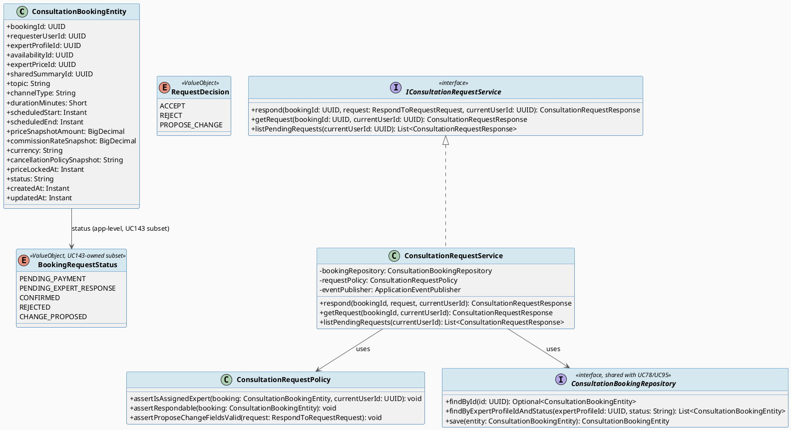
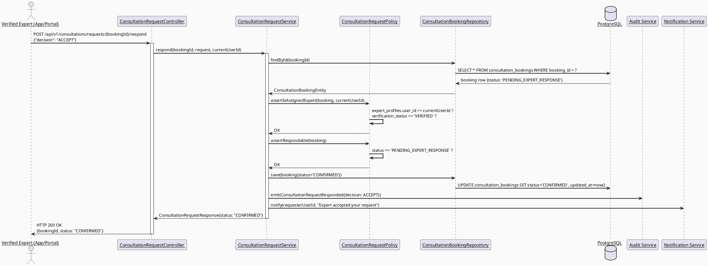
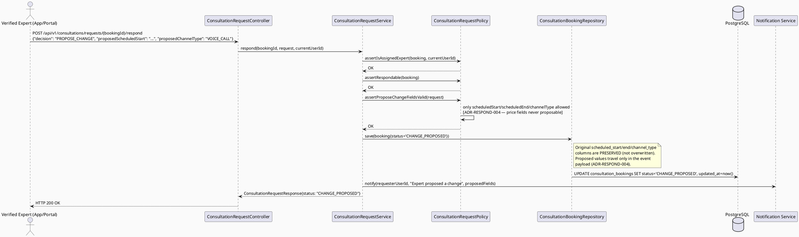
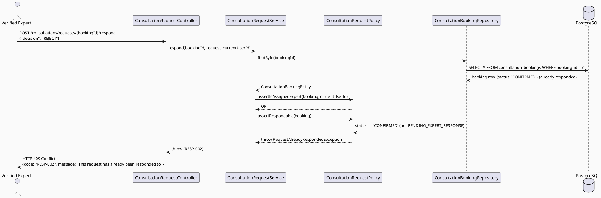
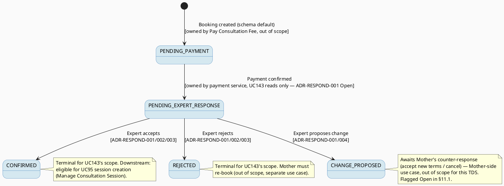

# ENGINEERING DOCUMENTATION STANDARD (EDS) v2.0
# UC143 — Respond to Consultation Request — Technical Design Specification

| Field | Value |
|-------|-------|
| **Document ID** | `CB-CONSULTATION-IMP-143` |
| **Version** | `1.0` |
| **Date** | `2026-07-02` |
| **Status** | `Draft` |
| **Document Owner** | `TV4-Lâm` |
| **Author** | `AI Agent (Technical Architect)` |
| **Reviewed by** | `[Tech Lead — Pending]` |
| **DPO Sign-off** | `[ ] Pending` *(booking `topic` field may carry health-context text — see §1)* |
| **Approved by** | `[Principal Architect — Pending]` |
| **Last Review** | `2026-07-02` |
| **Based on EDS** | `v2.0` |

---

## CHANGELOG

| Ngày | Người thực hiện | Nội dung thay đổi |
|------|-----------------|-------------------|
| 2026-07-02 | AI Agent — Technical Architect | Tạo tài liệu lần đầu (Draft) cho UC143 |

---

## MỤC LỤC

1. [Tổng quan Module](#1-tổng-quan-module)
2. [Ma trận Truy vết (Traceability Matrix)](#2-ma-trận-truy-vết-traceability-matrix)
3. [Architecture Decision Records (ADR)](#3-architecture-decision-records-adr)
4. [Non-Functional Requirements & SLA](#4-non-functional-requirements--sla)
5. [Static Modeling (Mô hình Tĩnh)](#5-static-modeling-mô-hình-tĩnh)
6. [Dynamic Modeling (Mô hình Động)](#6-dynamic-modeling-mô-hình-động)
7. [Domain Event Catalog](#7-domain-event-catalog)
8. [Interface Specification (Đặc tả Giao diện)](#8-interface-specification-đặc-tả-giao-diện)
9. [API Specification](#9-api-specification)
10. [Bảng mã lỗi (Error Codes)](#10-bảng-mã-lỗi-error-codes)
11. [Quy trình Triển khai (Step-by-Step)](#11-quy-trình-triển-khai-step-by-step)
12. [Rollback & Incident Runbook](#12-rollback--incident-runbook)
13. [Kịch bản Kiểm thử Chi tiết](#13-kịch-bản-kiểm-thử-chi-tiết)
14. [Phương pháp Xác minh](#14-phương-pháp-xác-minh)
15. [Mẫu thử thực tế (API Verification Samples)](#15-mẫu-thử-thực-tế-api-verification-samples)
16. [Bảng tổng hợp phân quyền (Authorization Matrix)](#16-bảng-tổng-hợp-phân-quyền-authorization-matrix)
17. [AI Prompt Constraints (CASE 2.0)](#17-ai-prompt-constraints-case-20)

---

## 1. Tổng quan Module

| Field | Value |
|-------|-------|
| **Module Name** | `Consultation — Booking Request Response` |
| **Bounded Context** | `Consultation` (package `com.carebridge.backend.consultation`) |
| **Function ID / UC** | `3.3.5.2 Respond to Consultation Request` / `UC-143` (SRS L3552-3569) |
| **Primary Actor** | Verified Expert |
| **Secondary Actors** | None |
| **Platform** | **Mobile (Expert App) primary, Web (Expert Portal) secondary/parity** — same determination rationale as UC142 (§1.2 of `UC142_TDS`); SRS §3.3.5 section header is "Mobile Consultation & Location" and "Other Information" names both Expert App and Expert Portal. |
| **Priority** | Medium |
| **Sprint / Owner** | Sprint 3 "Cross-Domain Integration" — TV4-Lâm (function spec `3.3.5.2`, `04_Implement/implement_artifacts/function-spec-task-allocation.md` L581) |
| **Data Classification** | `Confidential` (`consultation_bookings.topic` is a free-text field that may carry Mother-authored health-context description — `Sensitive-PII`-adjacent, same classification posture as UC95's `consultation_messages.message_body`) |
| **Compliance Scope** | `PDPA (Luật 91/2025)`, internal `BR-RBAC`, `BR-CONSULTATION` |
| **Upstream Dependencies** | `Book Private Consultation (3.3.1.52)` — creates the `consultation_bookings` row this UC reads/mutates; `Configure Availability (3.2.1.4)` / `UC-142 Update Consultation Availability Status` — the availability window a booking references via `availability_id` |
| **Downstream Consumers** | `Join Consultation Session (3.3.1.54)` / `UC-95 Manage Consultation Session` — session creation is gated on the booking reaching an Expert-confirmed state; Notification service (Mother is notified of Expert's response); `Pay Consultation Fee (3.3.1.53)` — payment flow interaction is Open (see §1.2) |

### 1.1 Scope Statement — Greenfield within an existing schema contract

Same greenfield posture as sibling consultation-domain TDS (UC78, UC95,
UC96, UC142): backend `com.carebridge.backend.consultation` package holds
only `.gitkeep` placeholders in every layer folder. Mobile
`lib/features/consultation/` and Web
`src/features/consultationManagement/` are likewise placeholder-only. The
schema table `consultation_bookings` (`V1__init_schema.sql` L876-896)
already models the domain. This TDS designs UC143 against that schema
contract.

### 1.2 Entry-Criteria Blocker (Open — MUST be resolved before implementation)

> ⚠️ **UC143 CANNOT be implemented standalone.** It requires:
> - `Book Private Consultation (3.3.1.52)` to create `consultation_bookings`
>   rows with a real `requester_user_id`/`expert_profile_id`/`status` —
>   out of scope for this TDS, same blocker documented by sibling UC78 §1.2
> - Clarity on whether **payment** (`3.3.1.53 Pay Consultation Fee`) occurs
>   **before** or **after** the Expert's accept/reject/propose response.
>   Schema default `consultation_bookings.status = 'PENDING_PAYMENT'`
>   strongly implies **payment-first, then Expert response** (the booking
>   is not even payment-confirmed until VNPay succeeds), which this TDS
>   adopts as its working assumption (ADR-RESPOND-001). **Marked `Open`** —
>   Product/Tech Lead must confirm this ordering before Sprint work starts;
>   if response-before-payment is the intended flow instead, ADR-RESPOND-001
>   requires revision.

### 1.3 Relationship to `consultation_bookings.status` — This TDS proposes the Expert-response subset of the lifecycle, not the full booking lifecycle

Sibling TDS UC78 (§Error code `DISP-006`) explicitly flagged the full
`consultation_bookings.status` enum as **Open**, deferring ownership to
"whichever TDS actually owns the booking/session lifecycle transition" —
mirroring how UC95 became the definitive owner of `session_status`
(ADR-SESSION-001). **UC143 is the natural owner of the request-response
transitions** (`PENDING_PAYMENT`-adjacent → `CONFIRMED`/`REJECTED`/
`CHANGE_PROPOSED`), since it is the only UC whose actor (the Expert)
actually writes those specific status values. This TDS does **not** claim
ownership of `PENDING_PAYMENT` itself (owned by `Pay Consultation Fee`,
out of scope) or later session/completion states (`IN_SESSION`,
`COMPLETED`, `NO_SHOW` — owned by UC95, already `Accepted` in
`ADR-SESSION-001` and reused verbatim, see §3 ADR-RESPOND-001 for the
explicit boundary).

---

## 2. Ma trận Truy vết (Traceability Matrix)

| Requirement ID | Loại (BR/ADR/US) | Mô tả yêu cầu | Thành phần Code | Compliance Target | ADR liên quan |
|----------------|------------------|---------------|-----------------|-------------------|---------------|
| UC-143 (SRS §3.3.5.2, L3552-3569) | Use Case | Expert accepts, rejects, or proposes changes to a consultation request | `ConsultationRequestController`, `ConsultationRequestService` | BR-CONSULTATION | ADR-RESPOND-001 |
| BR-RBAC | Business Rule | Users may access only functions allowed by role/permission scope | `ConsultationRequestPolicy.assertIsAssignedExpert()` | Authorization | ADR-RESPOND-002 |
| BR-CONSULTATION | Business Rule | Booking, payment, dispute, refund, pricing actions keep auditable lifecycle state | `ConsultationBookingEntity.status`, audit log emission | PDPA / BR-AUDIT | ADR-RESPOND-001, ADR-RESPOND-003 |
| SRS E1 (access denied when unauthenticated/unauthorized/out of scope) | Exception Flow | Only the assigned, verified Expert may respond to a booking request | `ConsultationRequestPolicy.assertIsAssignedExpert()` | BR-RBAC | ADR-RESPOND-002 |
| SRS E2 (invalid/missing/expired/conflicting data rejected) | Exception Flow | Response rejected if booking already responded to or expired | `ConsultationRequestPolicy.assertRespondable()` | BR-CONSULTATION | ADR-RESPOND-003 |
| SRS E3 (external/network/server failure — retry guidance, no duplicate unsafe action) | Exception Flow | Response write is idempotent per `booking_id`; no double-accept/double-reject on retry | `ConsultationRequestService.respond()` | BR-CONSULTATION | ADR-RESPOND-003 |
| Schema: `consultation_bookings` (`V1__init_schema.sql` L876-896) | Schema Contract | Booking request/response lifecycle persistence | `ConsultationBookingEntity` | — | — |
| UC-95 `ADR-SESSION-001` (reused boundary, §1.3) | Cross-Document | Confirms this TDS does not re-define session-level (`IN_SESSION`/`COMPLETED`/`NO_SHOW`) states | `ConsultationBookingEntity.status` (booking-level only) | BR-CONSULTATION | ADR-RESPOND-001 |
| UC-78 `DISP-006` (reused Open flag, §1.3) | Cross-Document | UC143 proposes the request-response subset of the booking status enum that UC78 left Open | `ConsultationBookingEntity.status` | BR-CONSULTATION | ADR-RESPOND-001 |
| Entry-Criteria Blocker (§1.2) | Open Item | Booking creation service + payment-ordering confirmation must exist first | N/A — blocking dependency | — | — |

---

## 3. Architecture Decision Records (ADR)

### ADR-RESPOND-001 — Booking status subset for Expert request-response, and its relationship to payment ordering

| Field | Value |
|-------|-------|
| **Status** | `Proposed` *(requires Product/Tech Lead sign-off — SRS text is silent on exact status values and payment-vs-response ordering; §1.2 Entry-Criteria Blocker)* |
| **Deciders** | `AI Agent (proposal only) — pending TV4-Lâm / Tech Lead confirmation` |
| **Date** | `2026-07-02` |
| **Supersedes** | — |

#### Bối cảnh (Context)
`consultation_bookings.status varchar(30) NOT NULL DEFAULT
'PENDING_PAYMENT'` (schema L893) has **no CHECK constraint**. SRS UC-143
description: "Lets the expert accept, reject, or propose changes to a
consultation request." The schema default value `'PENDING_PAYMENT'`
indicates the booking is created in an unpaid state — implying the Mother
pays **before or independently of** the Expert's accept/reject decision, OR
that `PENDING_PAYMENT` is immediately followed by a `PENDING_EXPERT_RESPONSE`
transition once payment succeeds. Neither the SRS nor the schema states this
explicitly. UC78 (sibling, §Error code `DISP-006`) already flagged the full
enum as Open. UC95's `ADR-SESSION-001` already confirmed `session_status`
(a **separate** column on `consultation_sessions`, not `consultation_
bookings.status`) — this ADR must not collide with that value space.

#### Các phương án đã xem xét (Options Considered)

| Phương án | Mô tả | Ưu điểm | Nhược điểm |
|-----------|-------|----------|------------|
| A | Expert responds while `status` is still `PENDING_PAYMENT` (response-before-payment) | Faster Mother-facing UX (knows if Expert will take the case before paying) | Contradicts the schema default name's plain meaning; risks the Expert accepting a booking the Mother never pays for, wasting Expert capacity |
| B | **Payment must succeed first (`PENDING_PAYMENT` → some Open payment-confirmed value, out of scope for this TDS), THEN Expert responds. This TDS introduces `PENDING_EXPERT_RESPONSE` as the status value a paid booking transitions into, which the Expert then moves to `CONFIRMED` / `REJECTED` / `CHANGE_PROPOSED`.** | Matches schema default's plain meaning (`PENDING_PAYMENT` implies payment gates progress); prevents Expert capacity waste on unpaid requests; consistent with "financial safety first" default already established by UC78 ADR-DISPUTE-001 | Requires the (out-of-scope) payment service to explicitly write `PENDING_EXPERT_RESPONSE` — a coordination point this TDS cannot fully specify (flagged Open in §1.2) |
| C | Introduce a DB CHECK constraint enumerating the full booking status lifecycle now | Strong DB-level guarantee | Requires a new migration touching a table already referenced by 2+ sibling TDS docs (UC78, future booking/payment TDS); out of scope per "no migration unless genuine gap" default; no existing CHECK constraint precedent on any consultation-domain status column (UC95 ADR-SESSION-001 Option C rejected this for the same reason) |

#### Quyết định (Decision)
Chọn **Phương án B**. The **request-response subset** of the booking
lifecycle (application-level, enforced in `ConsultationRequestPolicy`, no DB
migration required), explicitly scoped to what UC143 owns:

```
PENDING_PAYMENT        — schema default (L893), owned by Pay Consultation
                          Fee (out of scope) — NOT writable by UC143
PENDING_EXPERT_RESPONSE — payment confirmed; booking awaits Expert action.
                          THIS TDS ASSUMES the payment service transitions
                          into this value (Open — §1.2 Entry-Criteria
                          Blocker; UC143 only READS this value as its entry
                          precondition, never writes it)
CONFIRMED               — Expert accepted, unchanged schedule. Set by
                          UC143. Downstream: eligible for UC95 session
                          creation at consultation_bookings.scheduled_start
REJECTED                — Expert declined. Terminal for this booking. Set
                          by UC143
CHANGE_PROPOSED         — Expert proposed a different time/channel (see
                          ADR-RESPOND-004). Set by UC143. Awaits Mother's
                          counter-response (accept new terms / cancel —
                          out of scope, Mother-side use case not covered
                          here, flagged Open in §11.1)
```

**This is a proposal** — the exact value names and the
`PENDING_PAYMENT → PENDING_EXPERT_RESPONSE` handoff point must be confirmed
by Product/Tech Lead together with whichever TDS owns `Pay Consultation Fee`
(3.3.1.53, not yet specced) before Sprint implementation. UC143's own code
only ever reads `PENDING_EXPERT_RESPONSE` as a precondition and writes
`CONFIRMED`/`REJECTED`/`CHANGE_PROPOSED` — it never writes
`PENDING_PAYMENT` or `PENDING_EXPERT_RESPONSE`, avoiding ownership overlap
with the payment TDS.

#### Hệ quả (Consequences)

**Tích cực:** Establishes a concrete, auditable request-response subset without redefining the full booking lifecycle or colliding with UC95's `session_status`/UC78's dispute status column; unblocks UC143 implementation once the payment-service handoff is confirmed.
**Tiêu cực / Trade-offs:** Depends on an out-of-scope payment service writing `PENDING_EXPERT_RESPONSE` — explicitly flagged Open, non-blocking for TDS authoring but blocking for Sprint implementation start.
**Compliance Impact:** Supports BR-CONSULTATION auditable-lifecycle requirement; avoids Expert capacity waste on unpaid requests (financial-safety-first posture, consistent with UC78 ADR-DISPUTE-001).

---

### ADR-RESPOND-002 — Ownership: only the booking's assigned, verified Expert may respond

| Field | Value |
|-------|-------|
| **Status** | `Accepted` |
| **Deciders** | `AI Agent — derived directly from schema + BR-RBAC` |
| **Date** | `2026-07-02` |

#### Bối cảnh (Context)
`consultation_bookings.expert_profile_id` identifies the assigned Expert (FK
→ `expert_profiles.expert_profile_id`). Identical ownership shape to UC95
ADR-SESSION-002 and UC78 ADR-DISPUTE-002 (requester-side equivalent).

#### Các phương án đã xem xét (Options Considered)

| Phương án | Mô tả | Ưu điểm | Nhược điểm |
|-----------|-------|----------|------------|
| A | Any authenticated Expert can respond to any booking | Simple | Violates ownership/BR-RBAC; allows cross-account tampering |
| B | **Only the Expert whose `user_id` matches `expert_profiles.user_id` for the booking's `expert_profile_id` may respond; additionally require `verification_status == 'VERIFIED'`** | Matches schema FK semantics; identical pattern to UC95 ADR-SESSION-002 and UC142 ADR-AVAIL-002 | Requires a policy check per request (negligible cost) |

#### Quyết định (Decision)
Chọn **Phương án B**. `ConsultationRequestPolicy.assertIsAssignedExpert(
booking, currentUserId)` verifies `expert_profiles.user_id == currentUserId`
AND `expert_profiles.verification_status == 'VERIFIED'`. Non-assigned or
unverified Experts receive `403 Forbidden` (`RESP-004`).

#### Hệ quả (Consequences)

**Tích cực:** Prevents IDOR / cross-tenant response tampering; enforces "Verified Expert" precondition from SRS actor definition; identical pattern across the consultation domain (UC95, UC142) reduces implementer cognitive load.
**Tiêu cực / Trade-offs:** None material — mandatory RBAC control.
**Compliance Impact:** Satisfies BR-RBAC.

---

### ADR-RESPOND-003 — Response is a one-time, idempotent-on-retry action; no double-response

| Field | Value |
|-------|-------|
| **Status** | `Accepted` |
| **Deciders** | `AI Agent — derived from SRS E2/E3` |
| **Date** | `2026-07-02` |

#### Bối cảnh (Context)
SRS E2: "Invalid, missing, expired, or conflicting data is rejected." SRS
E3: "External service, network, or server failure is handled with retry
guidance and no duplicate unsafe action." An Expert must not be able to
accept AND reject the same booking, nor should a network retry create a
duplicate/contradictory state transition.

#### Các phương án đã xem xét (Options Considered)

| Phương án | Mô tả | Ưu điểm | Nhược điểm |
|-----------|-------|----------|------------|
| A | Allow the Expert to change their response any number of times | Flexible | No terminal guarantee; the Mother could be notified of contradictory decisions in sequence; violates SRS E2's "conflicting data rejected" intent |
| B | **Response is allowed only while `status == 'PENDING_EXPERT_RESPONSE'`; once set to `CONFIRMED`/`REJECTED`/`CHANGE_PROPOSED`, further response attempts are rejected `409 RESP-002`; the exact same repeated request (same target decision) on a `PENDING_EXPERT_RESPONSE` booking prior to the first successful write is safe to retry (standard idempotent-write-on-not-yet-committed-state)** | Matches SRS E2 (reject conflicting data) and E3 (no duplicate unsafe action); one clean auditable decision per booking | Expert cannot "undo" a decision through this endpoint — acceptable, matches booking finality expectation |

#### Quyết định (Decision)
Chọn **Phương án B**. `ConsultationRequestPolicy.assertRespondable(booking)`
verifies `booking.status == 'PENDING_EXPERT_RESPONSE'` before allowing any
write; any subsequent response attempt on an already-decided booking returns
`409 Conflict` (`RESP-002`).

#### Hệ quả (Consequences)

**Tích cực:** One clean, auditable decision per booking; no duplicate/unsafe state transitions on retry.
**Tiêu cực / Trade-offs:** No "undo" path via this endpoint — an Expert who misclicks must contact support (out of scope, acceptable for Sprint 3 scope).
**Compliance Impact:** Supports BR-CONSULTATION auditable-lifecycle requirement; no duplicate unsafe action per SRS E3.

---

### ADR-RESPOND-004 — "Propose changes" scope: only `scheduled_start`/`scheduled_end`/`channel_type` are proposable; price is never Expert-editable via this endpoint

| Field | Value |
|-------|-------|
| **Status** | `Proposed` *(requires Product/Tech Lead sign-off — SRS text does not enumerate which fields are proposable; RG-6 Open item)* |
| **Deciders** | `AI Agent (proposal only) — pending TV4-Lâm / Tech Lead confirmation` |
| **Date** | `2026-07-02` |

#### Bối cảnh (Context)
SRS UC-143 description: "accept, reject, or **propose changes** to a
consultation request" — no field-level detail on what "changes" means. The
schema's `consultation_bookings` row carries `scheduled_start`,
`scheduled_end`, `channel_type`, `duration_minutes`,
`price_snapshot_amount`, `commission_rate_snapshot`, `price_locked_at`. The
price fields are explicitly named `*_snapshot*`/`price_locked_at`, strongly
suggesting they are a **frozen quote captured at booking time**, not
Expert-editable post-hoc (re-pricing mid-request would need a re-quote
workflow, which is `Set/Update Consultation Price` (3.2.7.1/.2) territory —
out of scope here, owned by pricing, not response).

#### Các phương án đã xem xét (Options Considered)

| Phương án | Mô tả | Ưu điểm | Nhược điểm |
|-----------|-------|----------|------------|
| A | Expert can propose ANY field change including price | Maximally flexible | Bypasses the pricing/commission snapshot integrity that `price_locked_at` implies exists for a reason; conflates two distinct concerns (scheduling vs. pricing) |
| B | **Expert may only propose `scheduledStart`/`scheduledEnd`/`channelType` changes. Price/commission fields (`price_snapshot_amount`, `commission_rate_snapshot`) are immutable via this endpoint — a genuinely different price requires a new booking or a separate re-quote flow (out of scope)** | Matches the `*_snapshot`/`price_locked_at` schema naming's plain implication; keeps UC143's scope tightly bound to scheduling, matching SRS's "consultation **request**" framing (time/channel, not commercial terms) | Does not support "Expert wants to offer a discount" scenarios — explicitly out of scope, no SRS/BR basis to invent this |

#### Quyết định (Decision)
Chọn **Phương án B**, **explicitly flagged Open** for Product confirmation
(RG-6). `ProposeChangeRequest` DTO exposes only `proposedScheduledStart`,
`proposedScheduledEnd`, `proposedChannelType` — no price field. On
`CHANGE_PROPOSED`, the original `scheduled_start`/`scheduled_end`/
`channel_type` values are **preserved** on the booking row (not overwritten)
until the Mother accepts the proposal (out-of-scope Mother-side
counter-response use case — see §11.1); the proposed values are carried in
the `ConsultationRequestChangeProposed` domain event payload (§7) for the
notification/Mother-facing UI to render, not persisted as new booking
columns (no migration — avoids adding `proposed_*` columns for a
provisional, not-yet-accepted value).

#### Hệ quả (Consequences)

**Tích cực:** No migration required; price integrity preserved; scope stays tightly bound to SRS's "request" framing.
**Tiêu cực / Trade-offs:** Proposed values are not queryable via a persisted column (only via the event/notification payload) — if a "view pending proposal" read endpoint is needed later, this may require a follow-up migration; flagged as a forward-looking Open item, non-blocking for this TDS's scope.
**Compliance Impact:** None beyond BR-CONSULTATION auditable-lifecycle (the event itself is the audit trail for the proposal).

---

## 4. Non-Functional Requirements & SLA

> No SRS/BR source specifies numeric SLA targets for UC143. Values below are
> **Open — proposed defaults**, consistent with sibling TDS defaults.

### 4.1. Performance & Availability

| Category | Requirement | Target SLA | Measurement Method | Compliance Basis |
|----------|-------------|------------|---------------------|------------------|
| Latency | `POST /consultations/requests/{bookingId}/respond` p99 | `< 300ms` *(Open — proposed)* | Manual/API test timing | — |
| Availability | Backend service uptime | `99.9%` monthly *(Open — proposed)* | Uptime monitor | — |

### 4.2. Data Integrity & Retention

| Category | Requirement | Target | Verification Method | Compliance Basis |
|----------|-------------|--------|---------------------|------------------|
| Durability | No booking record loss | RPO = 0 | Transaction log | BR-CONSULTATION |
| Retention | Booking response audit trail | Indefinite | DB inspection — no DELETE path exposed to Expert | PDPA |
| Consistency | `status` transitions only via defined state machine (§6.4) | 100% (service-level enforcement) | Reconciliation query | ADR-RESPOND-001, ADR-RESPOND-003 |

### 4.3. Security

| Category | Requirement | Target | Verification Method | Compliance Basis |
|----------|-------------|--------|---------------------|------------------|
| Access control | Role-based, ownership-scoped | Least privilege (Expert = own assigned booking only) | Auth Matrix (§16) | BR-RBAC |
| Content safety | `consultation_bookings.topic` may carry health-context content | Not exposed beyond booking participants + audit | Auth Matrix (§16) | BR-PRIVACY |

### 4.4. Scalability & Capacity Planning

SRS marks UC143 "Frequency of Use: Regular." Response volume tracks booking
volume; no special scaling design required beyond standard Spring Boot
request handling at current expected scale.

---

## 5. Static Modeling (Mô hình Tĩnh)

### 5.1. Component Responsibilities & Planned File Paths

| Layer | File Path | Responsibility |
|-------|-----------|----------------|
| Controller | `src/main/java/com/carebridge/backend/consultation/controller/ConsultationRequestController.java` | HTTP mapping, DTO validation only |
| Service | `src/main/java/com/carebridge/backend/consultation/service/ConsultationRequestService.java` | Request-response workflow (accept/reject/propose), event emission |
| Repository | `src/main/java/com/carebridge/backend/consultation/repository/ConsultationBookingRepository.java` | Persistence for `consultation_bookings` (shared read/write interface with UC78/UC95, this TDS is the request-response subset writer only) |
| Entity | `src/main/java/com/carebridge/backend/consultation/entity/ConsultationBookingEntity.java` | JPA mapping for `consultation_bookings` (shared entity, canonical definition owned collectively by booking/payment/response/session TDS docs) |
| DTO | `src/main/java/com/carebridge/backend/consultation/dto/request/RespondToRequestRequest.java` | Inbound payload — `decision` (ACCEPT/REJECT/PROPOSE_CHANGE) + optional propose-change fields |
| DTO | `src/main/java/com/carebridge/backend/consultation/dto/response/ConsultationRequestResponse.java` | Outbound payload |
| Mapper | `src/main/java/com/carebridge/backend/consultation/mapper/ConsultationRequestMapper.java` | Entity ↔ DTO, never expose entity |
| Policy | `src/main/java/com/carebridge/backend/consultation/policy/ConsultationRequestPolicy.java` | Ownership check (ADR-RESPOND-002), respondable-state guard (ADR-RESPOND-003), propose-change field scoping (ADR-RESPOND-004) |
| Web Model | `05_Development/CareBridgeWebApp/src/features/consultationManagement/models/consultationRequest.ts` | Booking-response DTO mirror (Zod schema) |
| Web Service | `05_Development/CareBridgeWebApp/src/features/consultationManagement/services/consultationRequestApi.ts` | API client (TanStack Query mutation hooks) |
| Web Component | `05_Development/CareBridgeWebApp/src/features/consultationManagement/components/RequestResponseActions.tsx` | Accept/Reject/Propose UI (Expert Portal, secondary surface) |
| Mobile Model | `05_Development/CareBridgeMobileApp/lib/features/consultation/models/consultation_request.dart` | Booking-response DTO mirror |
| Mobile Service | `05_Development/CareBridgeMobileApp/lib/features/consultation/services/consultation_request_service.dart` | API client wrapper |
| Mobile Screen | `05_Development/CareBridgeMobileApp/lib/features/consultation/screens/consultation_request_screen.dart` | Accept/Reject/Propose UI (Expert App, primary surface) |

### 5.2. Class Diagram (PlantUML)



### 5.3. Data Structure — Schema/Migration Details

> **CareBridge rule:** `V1__init_schema.sql` and approved Flyway migrations
> are primary source of truth. ERD is supporting context only.

**No new migration is required.** The following table already exists
(`V1__init_schema.sql`, verified):

```sql
-- consultation_bookings (V1__init_schema.sql L876-896)
CREATE TABLE public.consultation_bookings (
    booking_id                   uuid         NOT NULL DEFAULT gen_random_uuid(),
    requester_user_id            uuid         NOT NULL,
    expert_profile_id            uuid         NOT NULL,
    availability_id              uuid,
    expert_price_id              uuid         NOT NULL,
    shared_summary_id            uuid,
    topic                        varchar(500),
    channel_type                 varchar(30)  NOT NULL,
    duration_minutes             smallint     NOT NULL,
    scheduled_start              timestamptz  NOT NULL,
    scheduled_end                timestamptz  NOT NULL,
    price_snapshot_amount        numeric      NOT NULL,
    commission_rate_snapshot     numeric      NOT NULL,
    currency                     varchar(10)  NOT NULL DEFAULT 'VND',
    cancellation_policy_snapshot text,
    price_locked_at              timestamptz,
    status                       varchar(30)  NOT NULL DEFAULT 'PENDING_PAYMENT',
    created_at                   timestamptz  NOT NULL DEFAULT now(),
    updated_at                   timestamptz  NOT NULL DEFAULT now()
);
-- PK: booking_id (V1__init_schema.sql L1422-1423)
-- FK: requester_user_id -> users (L1823-1824)
-- FK: expert_profile_id -> expert_profiles (L1826-1827)
-- FK: availability_id -> expert_availability (L1829-1830)
-- FK: expert_price_id -> expert_consultation_prices (L1832-1833)
-- FK: shared_summary_id -> health_summaries (L1835-1836)
-- Index: idx_consultation_bookings_requester_user_id (L1636)
-- Index: idx_consultation_bookings_expert_profile_id (L1637)
-- Index: idx_consultation_bookings_status (L1638)
-- Index: idx_consultation_bookings_scheduled_start (L1639)
```

**Genuine gap identified (Open — flag for confirmation, non-blocking, see
ADR-RESPOND-001/004):**
1. No `CHECK` constraint on `status` — application-level enum enforcement
   required (`ConsultationRequestPolicy`), consistent with UC95
   ADR-SESSION-001 and UC142 ADR-AVAIL-001 precedent. No migration.
2. No dedicated columns exist for a "proposed" alternate time/channel
   (`proposed_scheduled_start` etc.) — per ADR-RESPOND-004, proposed values
   travel only via the domain event payload, not persisted columns. No
   migration needed for this TDS's scope; flagged as a possible future gap
   if a "view pending proposal" read endpoint is later required.

No sync action needed for `V1__init_schema.sql`.

---

## 6. Dynamic Modeling (Mô hình Động)

### 6.1. Sequence Diagram — Happy Path: Expert Accepts Consultation Request (PlantUML)



### 6.2. Sequence Diagram — Alternative: Expert Proposes a Change (PlantUML)



### 6.3. Sequence Diagram — Error Path: Duplicate Response Attempt (PlantUML)



### 6.4. State Machine — Consultation Request Response Status (bắt buộc)



**⚠️ Invariant bất biến:**
1. `status` may only transition along the edges shown in §6.4 — UC143 never
   writes `PENDING_PAYMENT` or `PENDING_EXPERT_RESPONSE` (owned by the
   payment service, out of scope); it only reads `PENDING_EXPERT_RESPONSE`
   as its entry precondition.
2. Once `CONFIRMED`, `REJECTED`, or `CHANGE_PROPOSED` is set, no further
   response via this endpoint is allowed (ADR-RESPOND-003) — terminal for
   UC143's scope.
3. Only the assigned, verified Expert
   (`expert_profiles.user_id == currentUserId`,
   `verification_status == 'VERIFIED'`) may call the respond endpoint
   (ADR-RESPOND-002).
4. `CHANGE_PROPOSED` never overwrites the original
   `scheduled_start`/`scheduled_end`/`channel_type` columns — proposed
   values travel only via the domain event payload (ADR-RESPOND-004).

---

## 7. Domain Event Catalog

### 7.1. Events Published (Phát ra)

| Event Name | Trigger | Publisher | Subscriber(s) | Payload Schema | Async? |
|------------|---------|-----------|---------------|----------------|--------|
| `ConsultationRequestResponded` | Expert accepts or rejects a request (§6.4) | `ConsultationRequestService` | Notification service (Mother notified), Audit log, `Book Private Consultation` (booking-state cache, out of scope consumer) | `ConsultationRequestResponded.java` | Yes |
| `ConsultationRequestChangeProposed` | Expert proposes a schedule/channel change (§6.4) | `ConsultationRequestService` | Notification service (Mother notified with proposed terms), Audit log | `ConsultationRequestChangeProposed.java` | Yes |

### 7.2. Events Consumed (Tiêu thụ)

| Event Name | Source | Handler | Action thực hiện |
|------------|--------|---------|------------------|
| *(None)* | — | — | UC143's response flow does not consume any external event; it reads `consultation_bookings` state synchronously at request time. |

### 7.3. Payload Schema

```java
// ConsultationRequestResponded.java
public record ConsultationRequestResponded(
    UUID    eventId,
    String  eventType,       // "ConsultationRequestResponded"
    Instant occurredAt,
    String  version,         // "1.0"
    Payload payload,
    Metadata metadata
) implements ApplicationEvent {

    public record Payload(
        UUID   bookingId,
        UUID   expertProfileId,
        UUID   requesterUserId,
        String decision,        // ACCEPT | REJECT
        String previousStatus,  // PENDING_EXPERT_RESPONSE
        String newStatus        // CONFIRMED | REJECTED
    ) {}

    public record Metadata(
        UUID   correlationId,
        String causedBy          // userId (Expert)
    ) {}
}

// ConsultationRequestChangeProposed.java
public record ConsultationRequestChangeProposed(
    UUID    eventId,
    String  eventType,       // "ConsultationRequestChangeProposed"
    Instant occurredAt,
    String  version,         // "1.0"
    Payload payload,
    Metadata metadata
) implements ApplicationEvent {

    public record Payload(
        UUID    bookingId,
        UUID    expertProfileId,
        UUID    requesterUserId,
        Instant originalScheduledStart,
        Instant originalScheduledEnd,
        String  originalChannelType,
        Instant proposedScheduledStart,  // nullable — only if time change proposed
        Instant proposedScheduledEnd,    // nullable
        String  proposedChannelType      // nullable — only if channel change proposed
    ) {}

    public record Metadata(
        UUID   correlationId,
        String causedBy          // userId (Expert)
    ) {}
}
```

---

## 8. Interface Specification (Đặc tả Giao diện)

### 8.1. Service Interface

```java
// RespondToRequestRequest.java — Input DTO
// @version 1.0
public class RespondToRequestRequest {
    @NotBlank
    @Pattern(regexp = "ACCEPT|REJECT|PROPOSE_CHANGE")
    private String decision;

    // Only populated/validated when decision == PROPOSE_CHANGE (ADR-RESPOND-004)
    private Instant proposedScheduledStart;   // nullable
    private Instant proposedScheduledEnd;     // nullable
    private String  proposedChannelType;      // nullable — CHAT | VOICE_CALL | VIDEO_CALL

    // getters / setters / @Valid annotations
}

// ConsultationRequestResponse.java — Output DTO
public class ConsultationRequestResponse {
    private UUID bookingId;
    private UUID expertProfileId;
    private UUID requesterUserId;
    private String topic;
    private String channelType;
    private Instant scheduledStart;
    private Instant scheduledEnd;
    private String status;   // PENDING_EXPERT_RESPONSE | CONFIRMED | REJECTED | CHANGE_PROPOSED
    // getters / setters — NEVER expose price/commission internals beyond what Mother already saw at booking time
}

// IConsultationRequestService.java — Service Contract
// @version 1.0
public interface IConsultationRequestService {
    /**
     * Assigned Expert responds to a pending consultation request.
     * @throws RequestAuthorizationException (RESP-004) if currentUserId is not the assigned, verified Expert
     * @throws RequestNotFoundException (RESP-003) if bookingId does not exist
     * @throws RequestAlreadyRespondedException (RESP-002) if booking is not in PENDING_EXPERT_RESPONSE
     * @throws InvalidProposeChangeException (RESP-001) if PROPOSE_CHANGE fields are invalid/missing
     */
    ConsultationRequestResponse respond(UUID bookingId, RespondToRequestRequest request, UUID currentUserId);

    /**
     * Retrieves a single request — only the assigned Expert or an admin may view it.
     * @throws RequestAuthorizationException (RESP-004) if unauthorized
     * @throws RequestNotFoundException (RESP-003) if not found
     */
    ConsultationRequestResponse getRequest(UUID bookingId, UUID currentUserId);

    /**
     * Lists all bookings currently awaiting this Expert's response
     * (status == PENDING_EXPERT_RESPONSE).
     */
    List<ConsultationRequestResponse> listPendingRequests(UUID currentUserId);
}
```

### 8.2. Repository Interface

```java
// ConsultationBookingRepository.java — shared interface, this TDS uses a subset of methods
// @version 1.0
public interface ConsultationBookingRepository extends JpaRepository<ConsultationBookingEntity, UUID> {

    Optional<ConsultationBookingEntity> findById(UUID bookingId);

    @Query("SELECT b FROM ConsultationBookingEntity b WHERE b.expertProfileId = :expertProfileId AND b.status = :status")
    List<ConsultationBookingEntity> findByExpertProfileIdAndStatus(UUID expertProfileId, String status);

    // Append-only for lifecycle: no delete() exposed. Status transitions via @Modifying UPDATE only,
    // always guarded by ConsultationRequestPolicy.assertRespondable().
}
```

---

## 9. API Specification

### 9.1. Endpoints Table

| Method | Path | Auth Level | Required Roles | Rate Limit | Idempotent? |
|--------|------|------------|----------------|------------|-------------|
| `POST` | `/api/v1/consultations/requests/{bookingId}/respond` | JWT Bearer | `EXPERT` (assigned, verified only) | 30/min | No (terminal-state write, retry-safe only pre-commit per ADR-RESPOND-003) |
| `GET` | `/api/v1/consultations/requests/{bookingId}` | JWT Bearer | `EXPERT` (assigned), `SYSTEM_ADMIN` | 300/min | Yes |
| `GET` | `/api/v1/consultations/requests` | JWT Bearer | `EXPERT` (own assigned, `status=PENDING_EXPERT_RESPONSE` only) | 300/min | Yes |

### 9.2. Request / Response Schemas

#### `POST /api/v1/consultations/requests/{bookingId}/respond` — Expert accepts

**Request Body:**
```json
{
  "decision": "ACCEPT"
}
```

**Response — 200 OK (Happy Path):**
```json
{
  "bookingId": "9f8e7d6c-1234-4a5b-8c9d-0e1f2a3b4c5d",
  "expertProfileId": "3fa85f64-5717-4562-b3fc-2c963f66afa6",
  "requesterUserId": "5c9e2f1a-8888-4a5b-8c9d-0e1f2a3b4c5d",
  "topic": "First trimester nutrition consultation",
  "channelType": "CHAT",
  "scheduledStart": "2026-07-03T09:00:00.000Z",
  "scheduledEnd": "2026-07-03T09:30:00.000Z",
  "status": "CONFIRMED"
}
```

**Response — 409 Conflict (Already responded):**
```json
{
  "error": {
    "code": "RESP-002",
    "message": "This request has already been responded to"
  }
}
```

#### `POST /api/v1/consultations/requests/{bookingId}/respond` — Expert proposes change

**Request Body:**
```json
{
  "decision": "PROPOSE_CHANGE",
  "proposedScheduledStart": "2026-07-03T14:00:00.000Z",
  "proposedScheduledEnd": "2026-07-03T14:30:00.000Z",
  "proposedChannelType": "VOICE_CALL"
}
```

**Response — 200 OK (Happy Path):**
```json
{
  "bookingId": "9f8e7d6c-1234-4a5b-8c9d-0e1f2a3b4c5d",
  "status": "CHANGE_PROPOSED"
}
```

**Response — 400 Bad Request (Attempted price change — rejected per ADR-RESPOND-004):**
```json
{
  "error": {
    "code": "RESP-001",
    "message": "Validation failed",
    "details": [{ "field": "proposedPriceAmount", "message": "Price cannot be modified through this endpoint" }]
  }
}
```

---

## 10. Bảng mã lỗi (Error Codes)

| Code | HTTP Status | Message (EN) | Message (VI) | Trigger Condition |
|------|-------------|--------------|--------------|-------------------|
| `RESP-001` | 400 | Validation failed | Dữ liệu không hợp lệ | `decision` not a valid enum value, or `PROPOSE_CHANGE` fields invalid/out-of-scope (e.g., price field present) |
| `RESP-002` | 409 | Request already responded to | Yêu cầu đã được phản hồi | `status` is not `PENDING_EXPERT_RESPONSE` at time of write (ADR-RESPOND-003) |
| `RESP-003` | 404 | Request not found | Không tìm thấy yêu cầu | `bookingId` does not exist |
| `RESP-004` | 403 | Insufficient permissions | Không đủ quyền | Current user is not the assigned, verified Expert for this booking |
| `RESP-500` | 500 | Internal error | Lỗi hệ thống | Unexpected failure |

---

## 11. Quy trình Triển khai (Step-by-Step)

### 11.1. Prerequisites

- [ ] **BLOCKING:** `Book Private Consultation` (3.3.1.52) implemented; `consultation_bookings` rows exist with real `requester_user_id`/`expert_profile_id`
- [ ] **BLOCKING:** `Pay Consultation Fee` (3.3.1.53) implemented and confirmed to write `PENDING_EXPERT_RESPONSE` on payment success (ADR-RESPOND-001, Open — §1.2)
- [ ] `ADR-RESPOND-001` and `ADR-RESPOND-004` confirmed by Product/Tech Lead (currently `Proposed`)
- [ ] Mother-side counter-response to `CHANGE_PROPOSED` (accept new terms / cancel) tracked as a follow-up use case, explicitly out of scope here (Open, non-blocking for this TDS's own scope)
- [ ] DPO review for `consultation_bookings.topic` (may carry health-context content) — sign-off pending
- [ ] Principal Architect approves this TDS

### 11.2. Pre-Migration Checklist

- [ ] **N/A** — no new migration required (see §5.3)

### 11.3. Implementation Steps

#### Chặng 1 — Entity + Repository
Create/extend `ConsultationBookingEntity` mapped 1:1 to existing schema
(§5.3) if not already created by the booking/payment TDS. No migration
needed.

#### Chặng 2 — Policy + Service
Implement `ConsultationRequestPolicy` (ownership ADR-RESPOND-002,
respondable-state guard ADR-RESPOND-003, propose-change field scoping
ADR-RESPOND-004), `ConsultationRequestService` (respond/get/list workflow).

#### Chặng 3 — Controller + Web + Mobile
Wire `ConsultationRequestController`, then Mobile
`consultation_request_screen.dart` (Expert App, primary surface) and Web
`RequestResponseActions.tsx` (Expert Portal, secondary surface).

### 11.4. Deployment Checklist

- [ ] Endpoints return expected status codes for happy/error paths (§15)
- [ ] Error rate < 1% in first 10 minutes
- [ ] Audit log emits `ConsultationRequestResponded`/`ConsultationRequestChangeProposed` correctly
- [ ] No PII/secret leakage in logs

---

## 12. Rollback & Incident Runbook

### 12.1. Điều kiện kích hoạt Rollback (Trigger Conditions)

| Điều kiện | Ngưỡng | Người quyết định |
|-----------|--------|------------------|
| Error rate tăng đột biến | > 5% trong 5 phút | On-call Engineer |
| Latency p99 vượt ngưỡng | > 2x baseline | On-call Engineer |
| Dữ liệu không nhất quán (double-response bypass) | Bất kỳ case nào | Tech Lead |

### 12.2. Rollback Procedure

```bash
# No new migration to revert (§5.3 — no schema change).
git checkout -- src/main/java/com/carebridge/backend/consultation/controller/ConsultationRequestController.java
git checkout -- src/main/java/com/carebridge/backend/consultation/service/ConsultationRequestService.java
git checkout -- src/main/java/com/carebridge/backend/consultation/policy/ConsultationRequestPolicy.java

kubectl rollout undo deployment/carebridge-api
kubectl rollout status deployment/carebridge-api
```

### 12.3. Notification Protocol

| Thời điểm | Người nhận | Kênh | Template |
|-----------|------------|------|----------|
| Ngay khi phát hiện | On-call team | Slack `#incident` | "🚨 Consultation Request Response incident detected: [mô tả]" |

### 12.4. Post-Incident Review (PIR)

Bắt buộc hoàn thành PIR document trong vòng 48 giờ, theo template chuẩn EDS
§12.4.

---

## 13. Kịch bản Kiểm thử Chi tiết

> Chi tiết đầy đủ nằm ở `UC143_RespondToConsultationRequest_Test-Spec.md`.

| Test Layer | Coverage | Reference |
|------------|----------|-----------|
| Unit — Policy | ADR-RESPOND-002 (ownership), ADR-RESPOND-003 (respondable guard), ADR-RESPOND-004 (propose-change scoping) | Test-Spec §4 `RESP-TC-00x` |
| Unit — Service | ADR-RESPOND-001 (state transitions: accept/reject/propose) | Test-Spec §4 `RESP-TC-01x` |
| Integration | Full respond flow against Testcontainers Postgres | Test-Spec §4 `RESP-TC-INT-00x` |
| Security | IDOR attempt on another Expert's booking | Test-Spec §4 `RESP-TC-SEC-00x` |

---

## 14. Phương pháp Xác minh

### 14.1. Database Inspection

```sql
SELECT booking_id, expert_profile_id, status, updated_at
FROM consultation_bookings
WHERE booking_id = '[uuid]';

-- Verify no double-response: status must not be re-writable once terminal
SELECT booking_id, status, COUNT(*)
FROM consultation_bookings
WHERE status IN ('CONFIRMED','REJECTED','CHANGE_PROPOSED')
GROUP BY booking_id, status
HAVING COUNT(*) > 1;
```

### 14.2. Log / Audit Verification

```bash
kubectl logs -l app=carebridge-api | grep '"eventType":"ConsultationRequestResponded"' | head -5
```

### 14.3. Tool-based Verification

```bash
echo "[JWT_TOKEN]" | cut -d'.' -f2 | base64 -d | jq .
```

---

## 15. Mẫu thử thực tế (API Verification Samples)

### 15.1. Happy Path

```bash
curl -X POST https://[host]/api/v1/consultations/requests/[bookingId]/respond \
  -H "Authorization: Bearer [JWT_TOKEN]" \
  -H "Content-Type: application/json" \
  -d '{"decision": "ACCEPT"}'
```

**Expected Response (200):**
```json
{ "bookingId": "9f8e7d6c-1234-4a5b-8c9d-0e1f2a3b4c5d", "status": "CONFIRMED" }
```

### 15.2. Error Paths

```bash
# Non-assigned expert → 403
curl -X POST https://[host]/api/v1/consultations/requests/[bookingId]/respond \
  -H "Authorization: Bearer [OTHER_EXPERT_JWT_TOKEN]" \
  -H "Content-Type: application/json" \
  -d '{"decision": "ACCEPT"}'
```

**Expected Response (403):**
```json
{ "error": { "code": "RESP-004", "message": "Insufficient permissions" } }
```

```bash
# No JWT → 401
curl -X GET https://[host]/api/v1/consultations/requests/[bookingId]
```

**Expected Response (401):**
```json
{ "error": { "code": "IAM-001", "message": "Authentication required" } }
```

---

## 16. Bảng tổng hợp phân quyền (Authorization Matrix)

| Endpoint | `GUEST` | `MOTHER`/`FAMILY` | `EXPERT` (unverified) | `EXPERT` (verified, assigned) | `EXPERT` (verified, not assigned) | `SYSTEM_ADMIN` |
|----------|---------|--------------------|------------------------|-------------------------------|-------------------------------------|-----------------|
| `POST /consultations/requests/{id}/respond` | ❌ | ❌ | ❌ (403 RESP-004) | ✅ | ❌ (403 RESP-004) | ❌ |
| `GET /consultations/requests/{id}` | ❌ | ❌ | ❌ | ✅ Own | ❌ | ✅ All |
| `GET /consultations/requests` | ❌ | ❌ | ✅ Own (empty if unverified — no rows assigned) | ✅ Own | ✅ Own (empty) | ❌ (out of scope, no admin listing endpoint here) |

**Chú thích:**
- ✅ = Được phép
- ❌ = Bị từ chối (403 hoặc 401)
- `Own` = Chỉ được phép với booking mà `expert_profile_id` gắn với `currentUserId`

---

## 17. AI Prompt Constraints (CASE 2.0)

### 17.1 Constraint Summary Table

| # | Constraint | Source (ADR/BR) | Last Verified |
|---|-----------|-----------------|---------------|
| C1 | UC143 code MUST NOT write `PENDING_PAYMENT` or `PENDING_EXPERT_RESPONSE` — it only reads the latter as an entry precondition; it only writes `CONFIRMED`/`REJECTED`/`CHANGE_PROPOSED` | `ADR-RESPOND-001` | `2026-07-02` |
| C2 | Every write MUST verify `expert_profiles.user_id == currentUserId` AND `verification_status == 'VERIFIED'` for the booking's `expert_profile_id` | `ADR-RESPOND-002` | `2026-07-02` |
| C3 | Response is allowed ONLY when `booking.status == 'PENDING_EXPERT_RESPONSE'`; otherwise reject `409 RESP-002` | `ADR-RESPOND-003` | `2026-07-02` |
| C4 | `PROPOSE_CHANGE` MUST accept only `proposedScheduledStart`/`proposedScheduledEnd`/`proposedChannelType` — price/commission fields are NEVER Expert-editable via this endpoint | `ADR-RESPOND-004` | `2026-07-02` |
| C5 | Controller layer does ONLY validation + DTO mapping; all business logic lives in `ConsultationRequestService`/`ConsultationRequestPolicy` | `CLAUDE.md` Architecture rules | `2026-07-02` |

### 17.2 Constraint Injection Block (Copy-Paste vào AI Prompt)

```
[CONSTRAINT BLOCK — Module: Consultation - Request Response]
Theo TDS CB-CONSULTATION-IMP-143 và các ADR liên quan:

1. C1 — Never write PENDING_PAYMENT/PENDING_EXPERT_RESPONSE; only write CONFIRMED/REJECTED/CHANGE_PROPOSED.
2. C2 — Every write requires expert_profiles.user_id == currentUserId AND verification_status == 'VERIFIED'.
3. C3 — Response only allowed while booking.status == 'PENDING_EXPERT_RESPONSE'; else 409 RESP-002.
4. C4 — PROPOSE_CHANGE fields limited to scheduledStart/scheduledEnd/channelType; price is NEVER editable here.
5. C5 — Controller = validation/mapping only; business logic in Service/Policy.

[CONTEXT BLOCK]
- Bounded Context: Consultation (com.carebridge.backend.consultation)
- Data Classification: Confidential
- Compliance: PDPA, BR-RBAC, BR-CONSULTATION
- Existing interfaces: §8 Service Interface + §8.2 Repository Interface
- Error codes: §10 Error Codes Table
- Auth matrix: §16 Authorization Matrix

[TASK BLOCK]
Implement {feature/method} thỏa mãn constraints trên.
Output phải tuân thủ §8 Interface Specification.
Tests phải cover §13 Test Scenarios (see Test-Spec).
```

### 17.3 Constraint Quality Checklist

- [x] Mỗi constraint traceable về ADR hoặc BR cụ thể
- [x] Không có constraint generic
- [x] Mỗi constraint có `Last Verified` date ≤ 2 sprints
- [x] Constraint block có ≥ 3 constraints cụ thể
- [x] Constraint block reference §8 Interface
- [x] Constraint block reference §16 Auth Matrix

### 17.4 Anti-Pattern Detection (cho AI-Generated Code từ Block này)

| AP-ID | Anti-Pattern | Dấu hiệu | Hành động |
|-------|-------------|-----------|----------|
| AP-AI-001 | Unconstrained Gen | Code không match bất kỳ constraint C1-C5 nào | Reject — inject lại constraints |
| AP-AI-003 | Implicit Decision | Code writes `PENDING_PAYMENT`/`PENDING_EXPERT_RESPONSE` despite C1 | Reject — that value space belongs to the payment service |
| AP-AI-005 | Hallucinated Contract | Code import service/type không có trong §8 | Reject — verify contract existence |
| AP-CB-201 | Price tampering via propose-change | `PROPOSE_CHANGE` handler accepts/persists a price/commission field | Reject — violates ADR-RESPOND-004 explicitly |

---

*EDS v2.1 — Tích hợp CASE 2.0 AI Prompt Constraints (§17).*
