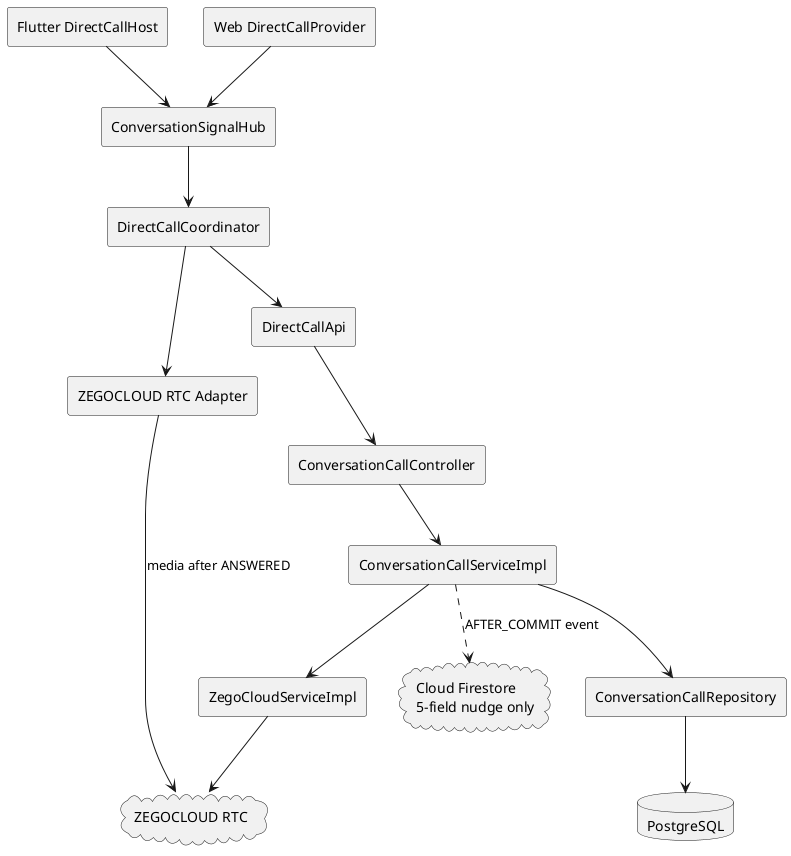
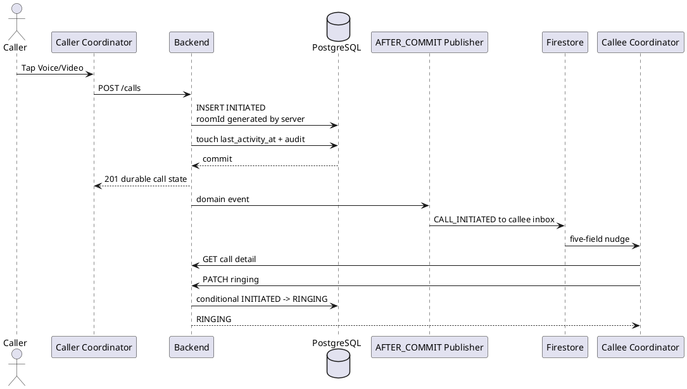
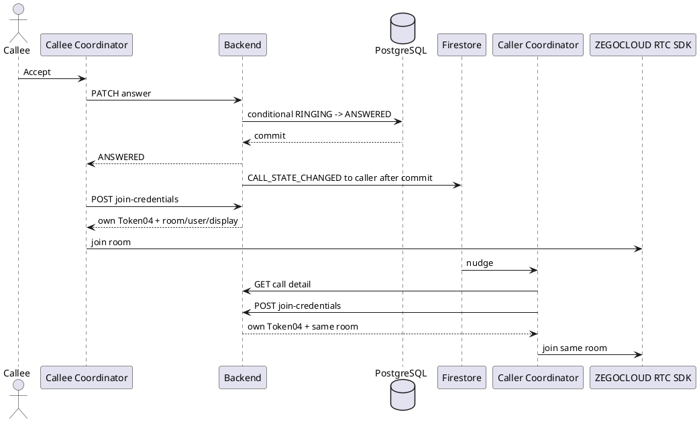
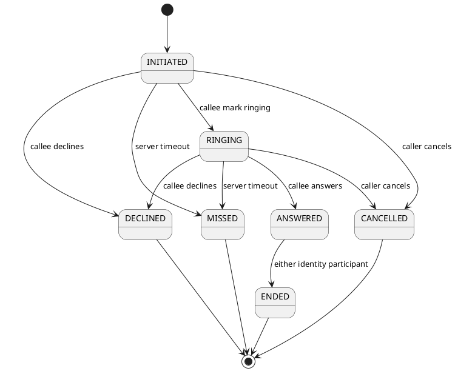

# ENGINEERING DOCUMENTATION STANDARD (EDS) v2.0
# UC-144D RTC Extension — Direct Consult 1:1 Voice and Video

| Field | Value |
|---|---|
| **Document ID** | `CB-CHAT-RTC-IMP-144D-EXT` |
| **Version** | `0.3` |
| **Date** | `2026-07-16` |
| **Status** | `Implemented — Automated GREEN; Manual RTC Pending` |
| **Document Owner** | `Huy` |
| **Author** | `Codex — Technical Architect` |
| **Reviewed by** | `[x] User` |
| **DPO Sign-off** | `[ ] Pending` |
| **Approved by** | `[x] User — 2026-07-16` |
| **Last Review** | `2026-07-16` |
| **Based on EDS** | `v2.0` |

---

## CHANGELOG

| Date | Author | Change |
|---|---|---|
| 2026-07-16 | Codex — Technical Architect | Initial Draft for real ZEGOCLOUD RTC on Flutter Android/iOS and React Web. This is an additive RTC extension; it does not rewrite the approved signaling-only scope of `CB-CHAT-IMP-144D`. |
| 2026-07-16 | User + Codex | Approved for implementation. JWT-user-bound backend Token04 is the required production gate for this pass; room-ID privilege authentication is optional follow-up hardening when the current generator does not already support it. |
| 2026-07-16 | Codex — Implementation | Implemented backend credentials/lifecycle hardening, global Firestore/REST coordinators, Web Prebuilt UIKit, and Flutter Express SDK fallback. Automated suites, Firestore Emulator Rules, Android build, Web scoped lint, and Web bundle are GREEN. Real-device/browser media matrix remains pending. |

---

## TABLE OF CONTENTS

1. Module Overview
2. Traceability Matrix
3. Architecture Decision Records
4. Non-Functional Requirements
5. Static Modeling
6. Dynamic Modeling
7. Domain Event Catalog
8. Interface Specification
9. API Specification
10. Error Codes
11. Implementation Plan
12. Rollback and Incident Runbook
13. Detailed Test Scenarios
14. Verification Methods
15. API Verification Samples
16. Authorization Matrix
17. AI Prompt Constraints

---

## 1. Module Overview

| Field | Value |
|---|---|
| **Module Name** | `Direct Consult RTC` |
| **Bounded Context** | `directchat` plus Flutter/Web RTC adapters |
| **Data Classification** | `Sensitive-PII metadata`; media is transient and is not stored by CareBridge |
| **Compliance Scope** | `PDPA`, CareBridge healthcare safety and audit rules |
| **Upstream Dependencies** | Approved UC-144D lifecycle/signaling, `users`, `expert_profiles`, ZEGOCLOUD Token04, Firebase custom-token bridge |
| **Downstream Consumers** | Flutter Mother/Expert, React Web Mother/Expert, PostgreSQL call timeline |

### 1.1 Purpose

Implement real one-to-one voice and video media between a Mother and the Verified Expert of an existing direct conversation. PostgreSQL remains authoritative for call lifecycle and history. Firestore remains a five-field, recipient-scoped reconciliation nudge. ZEGOCLOUD transports media only after the backend has persisted `ANSWERED`.

### 1.2 Relationship to UC-144D

`04_Implement/UC144_DirectConsultChat/UC144_DirectConsultChat_TDS.md` v1.2 remains historically correct: that delivery intentionally implemented call records and Firestore signaling without real RTC. This document is a separate extension and must not change the old document to imply RTC had already been delivered.

### 1.3 In Scope

- Backend call detail, active-call reconciliation, and participant-scoped join credentials.
- Secure Token04 generation bound to JWT-derived ZEGOCLOUD user identity and backend-created room.
- Existing lifecycle hardening where this Draft identifies a mismatch with the current requirement.
- Flutter Android/iOS voice/video UI and lifecycle.
- React Web Mother/Expert voice/video UI and lifecycle.
- Minimal React Web Mother journey to browse approved Experts, view a profile, create/open a direct conversation, and then chat/call without booking or payment.
- Global incoming/outgoing call coordinator and deduplicated overlay.
- PostgreSQL timeline rendering and Firestore signaling regression protection.
- Automated tests and a clearly separated manual device/browser matrix.

### 1.4 Out of Scope

- Booking, payment, commission, refund, or consultation-session scheduling.
- ZEGOCLOUD ZIM or ZEGOCLOUD invitation for chat/call signaling.
- Group calls, recording, media storage, transcription, screen sharing, whiteboard, gifts, or in-room text chat.
- FCM/APNs/VoIP push, native killed-process CallKit incoming UI, or a claim that calls ring while the app is terminated.
- Health diagnosis, prescription, or emergency routing through the call feature.

### 1.5 Current Baseline and Gaps

| Area | Existing capability | Gap |
|---|---|---|
| PostgreSQL | Required `conversation_calls` columns and timeline are present | None; no migration required |
| Lifecycle | Conditional updates and timeout job exist | Decline must accept `INITIATED` or `RINGING`; revoked Expert cleanup must use identity-only participation |
| Token | Server Token04 exists | Issued too early; generic response mixes durable state and credentials; token payload is not room-bound |
| Firestore | `AFTER_COMMIT`, five fields, recipient inbox, owner-only Rules | Listener is screen-scoped; RTC needs an authenticated-session signal hub |
| Flutter | REST wrappers and fake call dialog | No media SDK, permissions, coordinator, or call UI |
| Web | REST wrappers and fake alert | No media SDK/tests/coordinator; Mother is denied Web access |

### 1.6 Research Gate

| Gate | Result | Evidence / Action |
|---|---|---|
| RG-1: Current repository mapped before file reads | **Pass** | GitNexus index refreshed to 56,857 symbols; query/context/impact used before narrowed reads |
| RG-2: Worktree protected | **Pass** | Initial worktree clean; no production file changed by this Draft |
| RG-3: Official current ZEGOCLOUD sources only | **Pass** | ZEGOCLOUD docs, pub.dev package docs, npm package, official server assistant |
| RG-4: Official SDK supports server token authentication | **Pass** | Flutter Express logs in with backend Token04 in `ZegoRoomConfig`; Web uses `generateKitTokenForProduction` |
| RG-5: Official SDK supports 1:1 voice/video and required controls | **Pass — implemented** | Flutter Express adapter implements publish/play and controls; Web Prebuilt UIKit provides 1:1 controls |
| RG-6: Room privilege validation enabled for CareBridge ZEGOCLOUD project | **Optional hardening** | Use a room privilege payload if the current generator supports it without broad changes; otherwise rely on strict join-credentials authorization and record cross-room privilege enforcement as follow-up |
| RG-7: Token renewal | **Pass — implemented with platform strategy** | Flutter calls Express `renewToken`; Web destroys/recreates the UIKit room with newly issued credentials |
| RG-8: Real-device interoperability | **Manual pending** | Must not be called complete until device/browser matrix is executed |

### 1.7 Blast Radius

Pre-implementation graph analysis:

| Symbol / Area | Risk | Impact |
|---|---|---|
| `IZegoCloudService` | **HIGH** | 25 Spring test/application-context dependents; avoid signature break where possible |
| Flutter `DirectChatService` | **CRITICAL** | 73 impacted symbols, 46 direct dependents; add an isolated `DirectCallApi` instead of expanding mutable singleton behavior |
| `ConversationCallRepository` | **MEDIUM** | 9 dependents |
| `ConversationCallServiceImpl` | **LOW** | 1 direct test dependent reported by graph |
| Mobile signaling port | **LOW** | 17 dependents |
| Web `ChatPanel` | **LOW** | No upstream graph dependents |
| Web `getDefaultRouteForRole` | **LOW** | 3 direct auth-page callers |

No production symbol will be edited until this Draft and its Test-Spec are approved.

---

## 2. Traceability Matrix

| Requirement ID | Type | Requirement | Planned Components | Compliance / Integrity | ADR |
|---|---|---|---|---|---|
| BR-RTC-001 | BR | PostgreSQL is the sole durable call lifecycle/history store | `ConversationCall`, repository, timeline | Data integrity | ADR-RTC-002 |
| BR-RTC-002 | BR | Duration is computed from server timestamps only | `ConversationCallServiceImpl.end` | Integrity | ADR-RTC-002 |
| BR-RTC-003 | BR | State transitions use conditional updates so one race winner exists | `ConversationCallRepository` | Concurrency safety | ADR-RTC-002 |
| BR-RTC-004 | BR | Only the correct caller/callee/participant may transition | service/policy | RBAC | ADR-RTC-002 |
| BR-RTC-005 | BR | New call activity is blocked when the Expert is no longer `APPROVED`; history remains available to Mother; answered cleanup remains possible | policy/service | Trust boundary | ADR-RTC-002 |
| BR-RTC-006 | BR | ServerSecret and AppSign never reach Flutter, Web, logs, Firestore, or Git | ZEGOCLOUD integration/API DTO | Secret management | ADR-RTC-003 |
| BR-RTC-007 | BR | Join credentials are bound to the current JWT user and stored room | join-credentials service | Broken access control prevention | ADR-RTC-003 |
| BR-RTC-008 | BR | Firestore payload remains exactly five non-PII fields | existing publisher/rules | Data minimization | ADR-RTC-004 |
| BR-RTC-009 | BR | Firestore is lossy; all client state is REST-reconciled and idempotent | active/detail APIs, coordinators | Consistency | ADR-RTC-004 |
| BR-RTC-010 | BR | Neither client joins ZEGOCLOUD before backend `ANSWERED` | coordinators/RTC adapters | Lifecycle consistency | ADR-RTC-001 |
| BR-RTC-011 | BR | Voice starts with camera off; video starts with front camera per accepted permission | Flutter/Web RTC config | Privacy | ADR-RTC-001 |
| BR-RTC-012 | BR | SDK room/tracks/listeners are disposed on terminal state, logout, or unmount | RTC adapters/hosts | Resource safety | ADR-RTC-006 |
| BR-RTC-013 | BR | Long calls renew credentials or safely rejoin | join credentials and RTC adapters | Availability/security | ADR-RTC-003 |
| BR-RTC-014 | BR | Web Mother receives only minimal Direct Consult Web access | router/layout | Least privilege | ADR-RTC-005 |
| BR-RTC-015 | BR | No ZIM chat, invitation, recording, or media persistence | package config/adapters | Scope/privacy | ADR-RTC-001 |
| BR-RTC-016 | BR | Killed-app incoming calls are not claimed without dedicated push/CallKit work | product copy/docs | Accuracy/safety | ADR-RTC-006 |

---

## 3. Architecture Decision Records

### ADR-RTC-001 — Use official ZEGOCLOUD RTC adapters after `ANSWERED`

| Field | Value |
|---|---|
| **Status** | `Accepted — implementation fallback exercised` |
| **Deciders** | `User + Technical Architect` |
| **Date** | `2026-07-16` |
| **Supersedes** | None; extends UC-144D |

#### Context

CareBridge already has authoritative call invitation and status transitions. ZEGOCLOUD invitation would introduce a second signaling lifecycle and ZIM dependency.

#### Options Considered

| Option | Advantages | Disadvantages |
|---|---|---|
| Basic Prebuilt Call UIKit | Fast, standard controls, token login, customizable | Must wrap lifecycle and cleanup |
| UIKit invitation/ZIM | Built-in invitation UI | Conflicts with PostgreSQL/Firestore authority; violates no-ZIM chat direction |
| Low-level Express SDK | Maximum control | Much larger media/device/reconnect surface |

#### Decision

Use:

- Flutter `zego_express_engine` pinned to `3.24.1`.
- Web `@zegocloud/zego-uikit-prebuilt` pinned to `2.17.3`.
- No invitation service, no ZIM initialization, and no in-room chat/screen sharing/recording.
- The RTC adapter is instantiated only for an `ANSWERED` call after current-user credentials are fetched.

Flutter exercised the approved Express fallback because Prebuilt UIKit `4.24.2` transitively required ZIM `2.29.x`, whose Android artifact path depends on removed `jcenter()` behavior under this project's AGP 9 toolchain. Forcing ZIM 3.x then failed because the UIKit signaling plugin calls removed ZIM 2.x APIs. The low-level official Express SDK avoids ZIM entirely and passed Android native build.

### ADR-RTC-002 — PostgreSQL call state remains authoritative

| Field | Value |
|---|---|
| **Status** | `Accepted` |
| **Date** | `2026-07-16` |

#### Decision

The valid state machine is:

```text
INITIATED -> RINGING
INITIATED | RINGING -> DECLINED
RINGING -> ANSWERED
INITIATED | RINGING -> CANCELLED   (caller only)
INITIATED | RINGING -> MISSED      (server timeout only)
ANSWERED -> ENDED                  (either identity participant)
```

Every successful transition:

1. uses a conditional update or appropriate row lock;
2. sets timestamps in backend time;
3. updates `direct_conversations.last_activity_at`;
4. writes audit evidence;
5. publishes the counterpart event through the existing after-commit mechanism.

`FAILED` remains reserved for future server-controlled failure handling and has no client endpoint in this scope.

Expert policy:

- `initiate`, `ringing`, `answer`, `decline`, and join-credentials require the conversation Expert to be currently eligible.
- Mother may continue reading the durable history after revocation.
- `ANSWERED -> ENDED` uses identity-only participant validation so either participant, including a newly revoked Expert, can cleanly end the call.
- Revocation denies new or renewed join credentials.

### ADR-RTC-003 — Separate durable call DTO from short-lived join credentials

| Field | Value |
|---|---|
| **Status** | `Accepted` |
| **Date** | `2026-07-16` |

#### Decision

- Initiate and answer no longer generate ZEGOCLOUD tokens.
- `ConversationCallResponse` contains durable state only.
- `POST .../{callId}/join-credentials` issues a token for the current JWT user only.
- New room IDs use `cb_<call UUID without hyphens>`.
- ZEGOCLOUD user IDs use `u_<current user UUID without hyphens>`.
- Token04 is always bound to the JWT-derived current-user identity. If the current generator already supports a room privilege payload without a broad compatibility change, include the stored room ID and login/publish privileges; otherwise keep the existing user-identity Token04 payload and record room binding as follow-up hardening.
- Token TTL remains configurable, default `3600` seconds.
- Credential issuance is audited without token content.
- Flutter renews through Express `renewToken`. Web performs controlled destroy/recreate/rejoin with a fresh production Kit Token.

No ZEGOCLOUD Token Tools or console-side room privilege action is required for this implementation pass. Strict backend authorization at the join-credentials endpoint is mandatory.

### ADR-RTC-004 — One authenticated-session signal hub and call coordinator

| Field | Value |
|---|---|
| **Status** | `Accepted` |
| **Date** | `2026-07-16` |

#### Decision

Each client has one authenticated-session `ConversationSignalHub` and one `DirectCallCoordinator`.

The hub:

- authenticates to Firebase with the backend custom token;
- listens to `userConversationEvents/{uid}/events`;
- parses only the five approved fields;
- broadcasts nudges to chat refresh and call coordination;
- reconnects and performs REST reconciliation;
- disposes on logout.

The call coordinator:

- fetches call detail using `resourceId = callId`;
- deduplicates by `callId`;
- ignores stale async results using a generation/session token;
- reconciles active calls on login, launch, resume, visibility change, and listener reconnect;
- owns exactly one visible call overlay/screen per selected call.

### ADR-RTC-005 — Add minimal Mother Web Direct Consult access

| Field | Value |
|---|---|
| **Status** | `Accepted` |
| **Date** | `2026-07-16` |

#### Decision

Change the Mother default Web route to `/mother/experts` and add a Mother-only route group containing only:

- approved Expert directory;
- Expert public profile with the existing “Chat” find-or-create action;
- conversation list;
- conversation room;
- global incoming/outgoing/in-call host;
- logout/profile summary required by the layout.

The Web journey reuses current backend directory/profile and `POST /direct-conversations/expert/{expertProfileId}` contracts. It does not add booking or payment. Do not grant Mother access to Expert/Admin/Content/Partner routes. Existing backend participant authorization remains authoritative.

### ADR-RTC-006 — Disconnect is not a database terminal event

| Field | Value |
|---|---|
| **Status** | `Accepted` |
| **Date** | `2026-07-16` |

#### Decision

- Short media disconnect: show `RECONNECTING`; retain PostgreSQL `ANSWERED`.
- Explicit hang-up: leave/destroy local media and call backend `end` best-effort; retry/reconcile on failure.
- App/tab closure before answer: best-effort cancel; timeout remains fallback.
- Refresh/process loss during `ANSWERED`: REST active-call reconciliation offers resume or end.
- No client-reported duration and no automatic server duration based solely on connectivity.
- No killed-app incoming-call promise.

### ADR-RTC-007 — No database migration

| Field | Value |
|---|---|
| **Status** | `Accepted` |
| **Date** | `2026-07-16` |

The applied migration `V20260715120000__create_direct_conversation_schema.sql` already contains every required call field and constraint. Existing migrations must not be edited. New calls receive ZEGOCLOUD-safe room IDs through application logic.

---

## 4. Non-Functional Requirements

### 4.1 Performance and Availability

| Requirement | Target | Verification |
|---|---|---|
| Ring timeout | Existing configurable default `45s` | scheduler/repository tests |
| Token lifetime | Existing configurable default `3600s` | service tests and staged renewal |
| Signal delivery | Best effort; no correctness dependency | lost/duplicate/delayed signal tests |
| UI duplication | At most one overlay/screen per `callId` | reducer/coordinator tests |
| Reconnect | UIKit reconnect state plus REST reconciliation | client tests and manual short-network-loss matrix |

No media quality, latency, or uptime SLA is invented in this Draft.

### 4.2 Data Integrity and Retention

- PostgreSQL call rows are durable and timeline-readable independent of Firestore retention.
- Firestore retains no room ID, token, display name, health data, message content, or media.
- Tokens are not persisted by CareBridge clients or backend.
- `duration_seconds` is set only when the backend wins `ANSWERED -> ENDED`.

### 4.3 Security

- `ZEGO_SERVER_SECRET` remains backend-only.
- No `VITE_ZEGO_SERVER_SECRET`, AppSign, or Flutter compile-time secret.
- Join credentials accept no `userId` or `roomId` request input.
- Call detail and credentials use conversation/call pair validation to prevent cross-conversation existence leakage.
- Tokens and Firebase custom tokens are redacted from logs and exception messages.
- Room privilege Token04 may block cross-room token reuse after project-side feature enablement; until then, the backend prevents arbitrary room and target-user selection and issues credentials only for the stored `ANSWERED` call.

### 4.4 Capacity

This is a one-to-one call only. No group participant list, invitation expansion, recording, or media relay is enabled. ZEGOCLOUD media capacity and billing remain external operational concerns and are not inferred here.

---

## 5. Static Modeling

### 5.1 Planned Component Diagram



### 5.2 Existing Database Structure

No migration:

```sql
conversation_calls (
  call_id uuid primary key,
  conversation_id uuid not null,
  initiated_by_user_id uuid not null,
  call_type varchar(10) not null,       -- VOICE | VIDEO
  call_status varchar(20) not null,
  zego_room_id varchar(255) not null,
  initiated_at timestamptz not null,
  answered_at timestamptz null,
  ended_at timestamptz null,
  duration_seconds integer null,
  created_at timestamptz not null
)
```

### 5.3 Planned DTOs

```java
public record ConversationCallResponse(
    UUID callId,
    UUID conversationId,
    UUID initiatedByUserId,
    String callType,
    String callStatus,
    Instant initiatedAt,
    Instant answeredAt,
    Instant endedAt,
    Integer durationSeconds
) {}

public record ZegoJoinCredentialsResponse(
    long appId,
    String roomId,
    String userId,
    String displayName,
    String token,
    Instant expiresAt
) {}
```

`ConversationCallResponse` must not contain `zegoToken`, `zegoAppId`, `tokenExpiresAt`, or `zegoRoomId`.

### 5.4 Planned Client State

```text
IDLE
OUTGOING_INITIATED
OUTGOING_RINGING
INCOMING
ANSWERING
READY_TO_JOIN
JOINING
IN_CALL
RECONNECTING
TERMINAL
FAILED
```

Client state is a projection; PostgreSQL `callStatus` remains authoritative.

---

## 6. Dynamic Modeling

### 6.1 Initiate and Incoming Call



### 6.2 Answer and Join



### 6.3 Terminal Transitions



### 6.4 Signal Loss/Reconnect

1. Coordinator starts or resumes.
2. It establishes the Firebase listener.
3. Whether listener setup succeeds or fails, it calls `GET /direct-conversations/calls/active`.
4. Each returned call is reduced idempotently by `callId`.
5. `INITIATED/RINGING` projects to incoming/outgoing UI according to `initiatedByUserId`.
6. `ANSWERED` projects to resume/join UI; credentials are fetched only after user action.
7. Terminal detail closes the UI and refreshes the PostgreSQL timeline.

### 6.5 Connection Loss During Call

- SDK connection callback sets client `RECONNECTING`.
- No lifecycle PATCH is sent merely because media disconnected.
- On reconnected, client returns to `IN_CALL`.
- On explicit End, local RTC cleanup and backend `end` are both attempted; coordinator reconciles final REST state.
- If the app is later reopened with an `ANSWERED` call, it offers Resume or End.

---

## 7. Domain Event Catalog

### 7.1 Published

No new Firestore payload shape is introduced.

| Event Type | Trigger | Recipient | Payload |
|---|---|---|---|
| `CALL_INITIATED` | successful call insert | callee | existing five fields |
| `CALL_STATE_CHANGED` | ringing/answer/decline/cancel/end/missed | counterpart | existing five fields |

### 7.2 Wire Payload

```json
{
  "eventId": "uuid",
  "eventType": "CALL_INITIATED",
  "conversationId": "uuid",
  "resourceId": "callId",
  "occurredAt": 1784188800000
}
```

Forbidden Firestore fields include `roomId`, `token`, `displayName`, participant names, health data, and media metadata.

### 7.3 Consumed

Flutter and Web consume only the nudge and then fetch call detail through REST. Sender never receives the event caused by the sender's own successful action.

---

## 8. Interface Specification

### 8.1 Backend Service

```java
public interface IConversationCallService {
    ConversationCallResponse initiateCall(UUID conversationId, UUID currentUserId, CallType type);
    ConversationCallResponse getCall(UUID conversationId, UUID callId, UUID currentUserId);
    List<ConversationCallResponse> listActiveCalls(UUID currentUserId);
    ConversationCallResponse markRinging(UUID conversationId, UUID callId, UUID currentUserId);
    ConversationCallResponse answer(UUID conversationId, UUID callId, UUID currentUserId);
    ConversationCallResponse decline(UUID conversationId, UUID callId, UUID currentUserId);
    ConversationCallResponse end(UUID conversationId, UUID callId, UUID currentUserId);
    ZegoJoinCredentialsResponse issueJoinCredentials(
        UUID conversationId, UUID callId, UUID currentUserId);
}
```

To reduce the HIGH blast radius, retain the public `IZegoCloudService.generateToken(roomId, userId, userName)` signature if practical. Add payload support inside `ZegoToken04Generator`/implementation rather than forcing unrelated Spring tests to adopt a new interface.

### 8.2 Repository Additions

```java
int conditionallyDeclineFromInitiatedOrRinging(UUID callId, Instant endedAt);

List<ConversationCall> findActiveForParticipant(
    UUID userId,
    Set<CallStatus> statuses);
```

Queries must verify the participant through `direct_conversations` or service-side loaded conversation IDs. No caller-provided target user is accepted.

### 8.3 Client Ports

```text
DirectCallApi
  initiate(conversationId, callType)
  getCall(conversationId, callId)
  listActiveCalls()
  markRinging(...)
  answer(...)
  decline(...)
  end(...)
  issueJoinCredentials(...)

RtcRoomAdapter
  join(credentials, callType)
  renew(credentials)
  leave()
  dispose()
  connectionEvents

ConversationSignalHub
  startAuthenticatedSession()
  events
  dispose()
```

---

## 9. API Specification

### 9.1 Endpoints

| Method | Path | Roles | Idempotency / Rule |
|---|---|---|---|
| `POST` | `/api/v1/direct-conversations/{conversationId}/calls` | Mother, Expert | New call; Expert must be approved |
| `GET` | `/api/v1/direct-conversations/{conversationId}/calls/{callId}` | Participant | Durable state only |
| `GET` | `/api/v1/direct-conversations/calls/active` | Mother, Expert | REST reconciliation |
| `PATCH` | `.../{callId}/ringing` | Callee | `INITIATED -> RINGING` |
| `PATCH` | `.../{callId}/answer` | Callee | `RINGING -> ANSWERED` |
| `PATCH` | `.../{callId}/decline` | Callee | `INITIATED/RINGING -> DECLINED` |
| `PATCH` | `.../{callId}/end` | Caller before answer; either participant after answer | Cancel or end |
| `POST` | `.../{callId}/join-credentials` | Participant | `ANSWERED` only; own JWT identity |

### 9.2 Call Detail Response

```json
{
  "success": true,
  "data": {
    "callId": "91c5...",
    "conversationId": "4708...",
    "initiatedByUserId": "31dd...",
    "callType": "VIDEO",
    "callStatus": "ANSWERED",
    "initiatedAt": "2026-07-16T09:00:00Z",
    "answeredAt": "2026-07-16T09:00:05Z",
    "endedAt": null,
    "durationSeconds": null
  },
  "timestamp": "2026-07-16T09:00:06Z"
}
```

### 9.3 Join Credentials Response

```json
{
  "success": true,
  "data": {
    "appId": 123456789,
    "roomId": "cb_91c5c221a25c4de293aa934a834da9ac",
    "userId": "u_31ddbb9f849f41a1a54ee9d69653f572",
    "displayName": "Mother Test",
    "token": "04...",
    "expiresAt": "2026-07-16T10:00:06Z"
  },
  "timestamp": "2026-07-16T09:00:06Z"
}
```

The request has no body and no target-user/room parameter.

### 9.4 Active Calls Response

Returns the current user's non-terminal calls ordered newest first. A revoked Expert may receive only an already `ANSWERED` call required for cleanup; no credentials can be issued.

---

## 10. Error Codes

Reuse current `DCC-*` codes where semantics already match.

| Code | HTTP | Meaning |
|---|---:|---|
| `DCC-002` | 403/422 | Expert verification policy failure |
| `DCC-003` | 403 | Current user is not a participant |
| `DCC-006` | 404 | Conversation/call pair not found |
| `DCC-007` | 409 | Invalid or lost state transition |
| `DCC-008` | 503 | ZEGOCLOUD token generation unavailable |
| `DCC-009` | 403 | Wrong caller/callee actor |
| `DCC-010` | 409 | Expert unavailable for new activity |

No new error code is required unless implementation needs to distinguish “call answered but RTC credentials temporarily unavailable” from existing `DCC-008`. If added, it must be documented before code.

---

## 11. Implementation Plan

### 11.1 Entry Gate

- [x] User replied `Approved` for this TDS and Test-Spec.
- [x] User accepted JWT-user-bound Token04 plus strict backend room authorization for this pass; room privilege remains optional hardening.
- [x] Worktree status rechecked and user changes preserved.
- [x] Impact analysis run before production symbol edits; final graph verification is recorded in the handoff.

### 11.2 Red → Green → Refactor Stages

1. **Backend RED**
   - Add failing tests for detail/active/credentials, actor/state/revoke matrix, room-bound token, logging, publish ordering, and races.
2. **Backend GREEN**
   - Separate DTOs, shift token issuance, add APIs, harden transitions/policy, preserve Firestore publisher.
3. **Client reducer RED**
   - Add Flutter coordinator tests and Web Vitest reducer/coordinator tests.
4. **Flutter GREEN**
   - Add pinned Express package, permissions, signal hub, host, screens, adapter, lifecycle cleanup.
5. **Web GREEN**
   - Add pinned UIKit/Vitest, Mother route group, provider/overlay, adapter, browser failure handling.
6. **Refactor**
   - Consolidate duplicated signal ownership without changing five-field payload or chat behavior.
7. **Verification**
   - Narrow tests first, then full relevant builds, Firebase emulator, Android/iOS/Web manual matrix.

### 11.3 Planned File Areas

Backend:

- `directchat/controller/ConversationCallController.java`
- `directchat/service/IConversationCallService.java`
- `directchat/service/impl/ConversationCallServiceImpl.java`
- `directchat/repository/ConversationCallRepository.java`
- `directchat/dto/response/*Call*`
- `integration/zegocloud/ZegoCloudServiceImpl.java`
- `integration/zegocloud/ZegoToken04Generator.java`
- focused tests under `src/test/.../directchat` and `integration/zegocloud`

Flutter:

- new `features/directChat/calls/` coordinator/API/adapter/widgets
- app-level host in `main.dart` builder or equivalent
- signaling hub integration
- `pubspec.yaml`, Android manifest, iOS Info.plist

Web:

- new `features/directCall/` coordinator/provider/adapter/components
- router and minimal Mother Expert-directory/profile/Direct Consult layout
- `package.json`, lockfile, Vitest configuration/tests

Implementation stayed within these areas. No Flyway migration was created or modified.

---

## 12. Rollback and Incident Runbook

### 12.1 Rollback Triggers

- Secret or token appears in client bundle, Firestore, logs, or error response.
- Non-participant can obtain credentials or join another call room.
- Duplicate/incorrect state transition corrupts call history.
- Camera/microphone remains active after leaving.
- Chat Firestore regression prevents normal message reconciliation.

### 12.2 Rollback Procedure

No database rollback is needed because there is no migration.

1. Disable RTC call buttons through the deployed client version/feature release rollback.
2. Redeploy the previous backend artifact; existing call rows remain readable.
3. Ensure timeout reconciliation closes pre-answer calls.
4. For answered calls, participants retain the existing `end` cleanup endpoint.
5. Rotate `ZEGO_SERVER_SECRET` if exposure is suspected.
6. Verify Firestore Rules remain unchanged and client writes remain denied.

### 12.3 Deployment Drain

Because new room IDs are ZEGOCLOUD-safe while old active rows may contain UUID hyphens, deploy only when no existing `INITIATED`, `RINGING`, or `ANSWERED` call from the signaling-only version is active, or explicitly close those test calls first. Historical terminal rows are untouched.

---

## 13. Detailed Test Scenarios

The authoritative case list is in `UC144D_DirectConsultRTC_Test-Spec.md`. Mandatory groups:

- Backend authorization, token ownership, room privilege, race, duration, publish-after-commit, Firebase failure, revoke matrix.
- Flutter state reducer, signal/load races, duplicate/replay, permission denial, disposal, background/resume, token renewal.
- Web stale conversation protection, duplicate signal, unmount cleanup, permission/no-device/autoplay, refresh/rejoin, listener failure.
- Firebase Emulator owner/cross-user/unauthenticated/write-denied regression.
- Real-device/browser manual matrix with automated/emulator/manual statuses separated.

---

## 14. Verification Methods

### 14.1 Backend

```bash
cd 05_Development/CareBridgeAPI
./mvnw -Dtest='ConversationCall*Test,ZegoCloudServiceImplTest,CallTimeoutReconciliationJobTest' test
./mvnw test
```

Run Testcontainers PostgreSQL integration tests only if Docker is available; report them separately.

### 14.2 Flutter

```bash
cd 05_Development/CareBridgeMobileApp
flutter pub get
flutter test
flutter analyze
flutter build apk
```

iOS build/pod verification requires macOS/Xcode and must be reported separately.

### 14.3 Web

```bash
cd 05_Development/CareBridgeWebApp
npm test
npm run build
npm run lint
```

### 14.4 Firebase

```bash
cd 05_Development/firebase
firebase emulators:exec --only firestore,auth \
  "cd rules-test && npm test" --project demo-carebridge
```

Rules must not be loosened for RTC.

### 14.5 Secret Scans

Search built client outputs and tracked files for `ZEGO_SERVER_SECRET`, real ServerSecret values, `appSign`, and token prefixes. Test logs must use sentinel tokens and assert absence.

### 14.6 Implementation Verification Snapshot

| Layer | Result | Evidence |
|---|---|---|
| Backend focused/contract/PostgreSQL integration | **AUTOMATED GREEN** | 33 tests, 0 failures; Testcontainers PostgreSQL and 80 existing Flyway migrations |
| Flutter tests | **AUTOMATED GREEN** | 102 tests, 0 failures |
| Flutter Android native build | **AUTOMATED GREEN** | `flutter build apk --debug` produced `app-debug.apk` |
| Flutter analyzer | **BLOCKED — tooling** | Flutter 3.44.1 analysis server exits 255 while parsing its LSP JSON stream, before source diagnostics |
| Flutter iOS simulator build | **AUTOMATED GREEN** | `flutter build ios --simulator` produced `Runner.app`; Podfile quotes the Zego download phase for workspace paths containing spaces |
| Web unit tests | **AUTOMATED GREEN** | Vitest 11 tests, 0 failures |
| Web scoped lint | **AUTOMATED GREEN** | RTC/direct-chat/auth route scope has no ESLint errors |
| Web production bundle | **AUTOMATED GREEN** | Vite bundle generated; official ZEGOCLOUD chunk warns about upstream direct `eval` and size |
| Full Web TypeScript build/lint | **BLOCKED — pre-existing unrelated files** | Existing Expert pages contain unused symbols and a nullable type error outside RTC scope |
| Firebase Rules Emulator | **EMULATOR GREEN** | owner read allowed; cross-user/unauthenticated reads and all client writes denied |
| Secret scan | **AUTOMATED GREEN** | no ServerSecret/AppSign/test-token generator/ZIM dependency in Flutter or Web source |
| Post-implementation graph | **AUTOMATED GREEN** | `detect_changes`: 34 tracked files, 67 symbols, 2 expected initiate-call flows, overall MEDIUM; no HIGH/CRITICAL symbol impact |
| Real media/device/browser matrix | **MANUAL PENDING** | no real two-device ZEGOCLOUD call claimed |

---

## 15. API Verification Samples

```bash
curl -X GET \
  "http://localhost:8080/api/v1/direct-conversations/$CONVERSATION_ID/calls/$CALL_ID" \
  -H "Authorization: Bearer $JWT"
```

```bash
curl -X POST \
  "http://localhost:8080/api/v1/direct-conversations/$CONVERSATION_ID/calls/$CALL_ID/join-credentials" \
  -H "Authorization: Bearer $JWT"
```

Expected security checks:

- non-participant: `403 DCC-003`;
- wrong conversation/call pair: `404 DCC-006`;
- not `ANSWERED`: `409 DCC-007`;
- Expert revoked: no new token; answered call can still be ended.

---

## 16. Authorization Matrix

| Operation | Mother participant | Approved Expert participant | Revoked Expert participant | Non-participant |
|---|---:|---:|---:|---:|
| Read durable call/timeline | Yes | Yes | Existing policy; no new access expansion | No |
| Initiate new call | Yes, if Expert approved | Yes | No | No |
| Mark ringing/answer/decline as callee | Yes | Yes | No | No |
| Cancel before answer as caller | Yes, if Expert approved | Yes | No | No |
| End answered call | Yes | Yes | **Yes, cleanup exception** | No |
| Get join credentials | Yes, if Expert approved and `ANSWERED` | Yes | No | No |
| List active calls | Yes | Yes | Answered cleanup only | No |
| Access Mother Web Expert directory/profile and Direct Consult routes | Yes | N/A | N/A | No |
| Access Expert portal routes | No | Yes | Existing auth/trust policy | No |

---

## 17. AI Prompt Constraints

### 17.1 Constraint Summary

| # | Constraint | Source | Last Verified |
|---|---|---|---|
| C1 | Do not write production code until both Draft documents are approved | User workflow | 2026-07-16 |
| C2 | PostgreSQL owns lifecycle/history; Firestore is five-field nudge only | BR-RTC-001/008 | 2026-07-16 |
| C3 | Do not initialize ZIM or ZEGOCLOUD invitation | ADR-RTC-001 | 2026-07-16 |
| C4 | Join credentials derive identity from JWT and room from DB; no target input | ADR-RTC-003 | 2026-07-16 |
| C5 | Do not join media before `ANSWERED` | BR-RTC-010 | 2026-07-16 |
| C6 | Use conditional transitions; one answer/timeout winner | ADR-RTC-002 | 2026-07-16 |
| C7 | Preserve revoked-Expert history/cleanup behavior and block new activity | BR-RTC-005 | 2026-07-16 |
| C8 | Use isolated call services/coordinators to avoid the CRITICAL `DirectChatService` blast radius | Graph impact | 2026-07-16 |
| C9 | No migration unless implementation proves current schema insufficient | ADR-RTC-007 | 2026-07-16 |
| C10 | Report automated GREEN, emulator GREEN, and manual pending separately | Definition of Done | 2026-07-16 |

### 17.2 Constraint Injection Block

```text
[CONSTRAINT BLOCK — Direct Consult RTC]
Implement only after CB-CHAT-RTC-IMP-144D-EXT and its Test-Spec are Approved.
PostgreSQL is authoritative; Firestore remains exactly five fields and client-write=false.
Use official ZEGOCLOUD RTC SDKs without invitation/ZIM: Flutter Express fallback and Web Prebuilt UIKit.
Issue room-bound Token04 credentials only for the current JWT participant and only for ANSWERED calls.
Never expose/log/persist ServerSecret, AppSign, ZEGOCLOUD token, or Firebase custom token.
Use conditional call transitions and preserve the answered-call cleanup exception after Expert revocation.
Do not claim killed-app incoming calls.
Follow Red -> Green -> Refactor and run graph impact/detect_changes before handoff.
```

---

## APPENDIX A — Consistency Gate

| Check | Result |
|---|---|
| TDS and Test-Spec share scope, API paths, states, and security model | Pass at Draft creation |
| UC-144D signaling-only history preserved | Pass |
| Current Flyway schema used as persistence oracle | Pass |
| No booking/payment/session dependency introduced | Pass |
| No Firestore Rule expansion | Pass |
| Production implementation follows the separate approved extension | Pass |
| Open production blockers explicitly recorded | Pass |

## APPENDIX B — References

- `04_Implement/UC144_DirectConsultChat/UC144_DirectConsultChat_TDS.md`
- `05_Development/CareBridgeAPI/src/main/resources/db/migration/V20260715120000__create_direct_conversation_schema.sql`
- `_bmad-output/planning-artifacts/research/technical-zegocloud-direct-consult-rtc-flutter-web-research-2026-07-16.md`
- [ZEGOCLOUD Web Call Kit overview](https://www.zegocloud.com/docs/uikit/callkit-web/overview)
- [ZEGOCLOUD Web production authentication](https://www.zegocloud.com/docs/uikit/callkit-web/authentication-and-kit-token)
- [ZEGOCLOUD Flutter Express package/API](https://pub.dev/packages/zego_express_engine)
- [ZEGOCLOUD Express token renewal](https://pub.dev/documentation/zego_express_engine/latest/zego_express_engine/ZegoExpressEngine/renewToken.html)
- [ZEGOCLOUD Token04 room privileges](https://www.zegocloud.com/docs/video-call/token?language=javascript%5C&platform=web)
