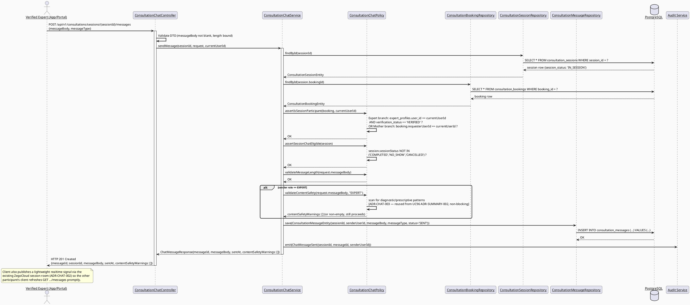
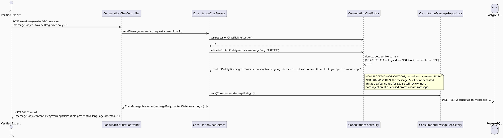
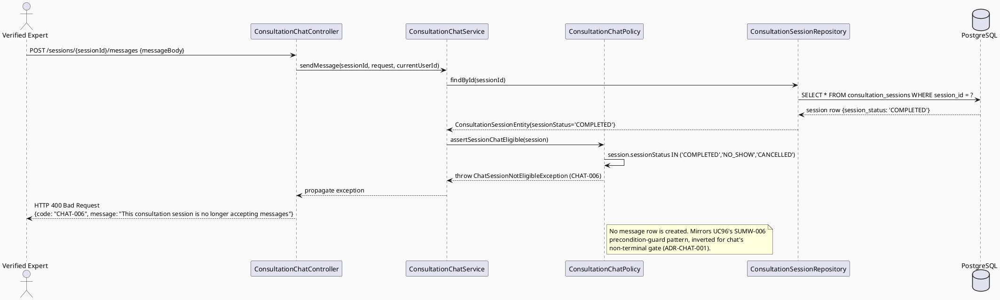
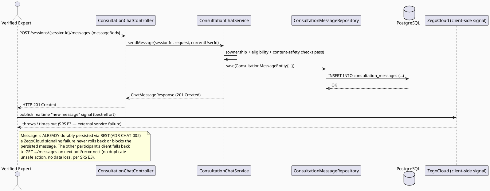

# ENGINEERING DOCUMENTATION STANDARD (EDS) v2.0
# UC144 — Consult via Chat — Technical Design Specification

| Field | Value |
|-------|-------|
| **Document ID** | `CB-CONSULTATION-IMP-144` |
| **Version** | `1.0` |
| **Date** | `2026-07-02` |
| **Status** | `Draft` *(reverted 2026-07-15 — session-tied implementation SUPERSEDED by `04_Implement/UC144_DirectConsultChat/` per explicit user redesign; this document is kept for history only, see CHANGELOG)* |
| **Document Owner** | `TV4-Lâm` |
| **Author** | `AI Agent (Technical Architect)` |
| **Reviewed by** | `Confirmed via user decision 2026-07-15` |
| **DPO Sign-off** | `[ ] Pending` *(outstanding, proceeding for dev/test per explicit user decision 2026-07-15 — see CHANGELOG)* |
| **Approved by** | `[ ] Pending — Approved status revoked 2026-07-15, see CHANGELOG` |
| **Last Review** | `2026-07-02` |
| **Based on EDS** | `v2.0` |

---

## CHANGELOG

| Ngày | Người thực hiện | Nội dung thay đổi |
|------|-----------------|-------------------|
| 2026-07-02 | AI Agent — Technical Architect | Tạo tài liệu lần đầu (Draft) cho UC144 |
| 2026-07-15 | AI Agent — Amelia (Dev Agent) | **Implemented & tested (backend + mobile + web):** Backend — `ConsultationMessageEntity`, `ConsultationMessageRepository` (cursor pagination both directions), `ConsultationChatPolicy`, `ConsultationChatServiceImpl` (send with idempotency + isolated-transaction race handling, list with bidirectional cursor pagination), `ConsultationChatController`, new-message push notification (reuses existing `ConsultationNotificationService`/FCM, recipient-only, metadata-only payload). **18 unit tests passing** + 1 Testcontainers integration test (compiles; could not execute — no Docker in this sandbox) covering send/list/idempotency/conflict/pagination/notification-routing/notification-failure-is-non-fatal. Mobile (Flutter) — models, `ConsultationChatService` (REST client), `ZegoZimSignalingPort` (real `zego_zim` v3.0.0 SDK, API verified against installed package source, not guessed), `ChatScreen` (optimistic send, retry, cursor sync, load-older, session-ended read-only, dispose lifecycle), route registered. 17 unit tests passing; `flutter build web` succeeds; native Android APK build is blocked by `zego_zim`'s bundled Android `build.gradle` using the removed `jcenter()` repository method (incompatible with this project's Android Gradle Plugin version) — a third-party plugin/tooling issue, not a code defect; see final report. Web (React) — mirrored models/service/`ZegoZimSignalingPort` (`zego-zim-web` v3.0.0, API verified against installed `.d.ts`), `ChatPanel`, `SessionRoomPage`, route registered under Expert Portal. `npm run build`'s `tsc -b` step fails on 4 **pre-existing, unrelated** errors in `ExpertProfilePage.tsx`/`ExpertVerificationQueuePage.tsx`/`VerificationDocumentsPage.tsx` (files never touched this session); `tsc --noEmit` confirms zero errors reference any new consultation-chat file, and `vite build` alone succeeds. `npm audit` flags a critical `protobufjs` transitive vulnerability pulled in by `zego-zim-web` — flagged as a known risk, not silently fixed (see final report). **No client-side automated test framework exists in the web project** (no vitest/jest configured, zero pre-existing test files) — adding one was out of scope per "smallest change" and is flagged as a gap, not silently skipped. |
| 2026-07-15 | AI Agent — Technical Architect | **Resolved per explicit user decisions (2026-07-15):** (1) ADR-CHAT-001 confirmed — chat eligible for `WAITING`+`IN_SESSION` (no longer Open). (2) ADR-CHAT-002 confirmed — ZegoCloud ZIM (in-app messaging/signaling) SDK, reusing the identical Token04 issued by `IZegoCloudService` (UC-154), sends a minimal signal-only payload (`eventType`, `sessionId`, `messageId`, `sentAt`, `senderUserId` — never `messageBody`) on the session's room; REST remains the sole durable write/read path (no change to that part of the decision). (3) DPO sign-off remains outstanding — proceeding for dev/test build, flagged as a known risk in the final report, not a blocking gate for this pass. (4) **Genuine gap correction:** added `client_message_id` idempotency key — the original schema/DTO had no way to make retried sends safe, which contradicts the mandatory "retry does not duplicate" requirement. This requires a new, minimal Flyway migration (see §5.3) — supersedes the original "no new migration required" claim. (5) Switched `GET .../messages` from offset (`page`/`size`) to cursor-based pagination (`after`/`before` + `limit`) for correctness under concurrent inserts. |
| 2026-07-15 | AI Agent — Technical Architect | **SUPERSEDED — reverted Approved → Draft.** User rejected the booking/session-tied chat architecture: direct messaging must not depend on `consultation_bookings`/`consultation_sessions` at all (Mother picks a Verified Expert directly, no prior booking). All session-coupled code described above (`ConsultationMessage`, `ConsultationChatServiceImpl`, `ZegoZimSignalingPort` used for chat transport, ZIM-for-chat) is being **removed**. The redesigned feature (find-or-create direct conversation, PostgreSQL history, Firebase Realtime Database for delivery signal, ZegoCloud reserved for voice/video call only) is specified fresh in `04_Implement/UC144_DirectConsultChat/UC144_DirectConsultChat_TDS.md`. This document is retained only as a historical record of the rejected approach; do not implement against it. |

---

## MỤC LỤC

1. [Tổng quan Module](#1-tổng-quan-module)
2. [Ma trận Truy vết (Traceability Matrix)](#2-ma-trận-truy-vết-traceability-matrix)
3. [Architecture Decision Records (ADR)](#3-architecture-decision-records-adr)
4. [Non-Functional Requirements & SLA](#4-non-functional-requirements--sla)
5. [Static Modeling (Mô hình Tĩnh)](#5-static-modeling-mô-hình-tĩnh)
6. [Dynamic Modeling (Mô hình Động)](#6-dynamic-modeling-mô-hình-động)
7. [Domain Event Catalog](#7-domain-event-catalog)
8. [Interface Specification (Đặc tả Giao diện)](#8-interface-specification-đặc-tả-giao-diện)
9. [API Specification](#9-api-specification)
10. [Bảng mã lỗi (Error Codes)](#10-bảng-mã-lỗi-error-codes)
11. [Quy trình Triển khai (Step-by-Step)](#11-quy-trình-triển-khai-step-by-step)
12. [Rollback & Incident Runbook](#12-rollback--incident-runbook)
13. [Kịch bản Kiểm thử Chi tiết](#13-kịch-bản-kiểm-thử-chi-tiết)
14. [Phương pháp Xác minh](#14-phương-pháp-xác-minh)
15. [Mẫu thử thực tế (API Verification Samples)](#15-mẫu-thử-thực-tế-api-verification-samples)
16. [Bảng tổng hợp phân quyền (Authorization Matrix)](#16-bảng-tổng-hợp-phân-quyền-authorization-matrix)
17. [AI Prompt Constraints (CASE 2.0)](#17-ai-prompt-constraints-case-20)

---

## 1. Tổng quan Module

| Field | Value |
|-------|-------|
| **Module Name** | `Consultation — Consult via Chat` |
| **Bounded Context** | `Consultation` (package `com.carebridge.backend.consultation`) |
| **Function ID / UC** | `3.3.5.3 Consult via Chat` / `UC-144` (SRS §3.3.5.3, `02_Requirements/SRS/3_Functional_Specification.md` L3573-3592) |
| **Primary Actor** | Verified Expert |
| **Secondary Actor** | ZegoCloud Realtime Service (SRS L3578, explicit) |
| **Platform** | **Expert App / Expert Portal** *(exact SRS "Other Information" text, L3589 — both Mobile and Web are in scope, unlike UC145's mobile-only text)* |
| **Priority** | Medium (SRS L3586) |
| **Sprint / Owner** | Sprint 3 "Cross-Domain Integration" — TV4-Lâm (function spec `3.3.5.3`, `04_Implement/implement_artifacts/function-spec-task-allocation.md` L582, L737) |
| **Data Classification** | `Sensitive-PII` (`consultation_messages.message_body` carries free-text conversation content between a Verified Expert and a Mother that may reference health context — same classification posture as UC95's `consultation_messages` note and UC96's `expert_summary`) |
| **Compliance Scope** | `PDPA (Luật 91/2025)`, `BR-RBAC`, `BR-CONSULTATION`, `BR-SAFETY` |
| **Upstream Dependencies** | `UC-95 Manage Consultation Session` (session lifecycle owner — a session must exist and be in a chat-eligible state before messages may be exchanged; `ConsultationSessionRepository`/`ConsultationSessionEntity` reused verbatim), `UC-154 EstablishRealtimeCommunicationSession` (`IZegoCloudService` token/room contract, reused via UC95 for the realtime signaling channel) |
| **Downstream Consumers** | `UC-96 Write Consultation Summary` (Expert may reference chat context when authoring the post-session summary — no code dependency, informational only), Notification service (new-message push notification, out of scope consumer) |

### 1.1 Scope Statement — Greenfield Messaging Service Within an Existing Schema Contract, Reusing UC95's Session Infrastructure

Same greenfield posture as sibling consultation-domain TDS (UC78, UC95, UC96,
UC142, UC145): backend `com.carebridge.backend.consultation` package holds
only placeholder files. Mobile `lib/features/consultation/` and Web
`src/features/consultationManagement/` are placeholder-only. The schema
already models the persistence target: `consultation_messages`
(`V1__init_schema.sql` L911-921, FK to `consultation_sessions` and `users`).
`UC95_ManageConsultationSession_TDS.md` §5.1 already lists
`ConsultationMessageRepository`/`ConsultationMessageEntity` as planned file
paths and §5.2 shows `ConsultationSessionEntity "1" *-- "0..*"
ConsultationMessageEntity : has` in its class diagram, but UC95's own scope
is strictly session lifecycle (join/end/participation status) — it does
**not** define a message-send/retrieve service, controller, or API contract.
**UC144 is the natural owner of the chat-messaging service itself.** This
directly answers Research Gate RG-3: message persistence uses UC95's
already-scaffolded entity/repository names verbatim (no duplication), while
the send/retrieve workflow, ownership policy, and REST/API contract for chat
are new, owned by this TDS.

### 1.2 Entry-Criteria Blocker (Open — MUST be resolved before implementation)

> ⚠️ **UC144 CANNOT be implemented standalone.** It requires:
> - `UC-95 Manage Consultation Session` implemented — a session must exist
>   (`consultation_sessions` row) before messages can be attached to it via
>   `session_id` FK. Chat is scoped to run **inside a valid session**, per
>   SRS description: "Exchanges messages inside a valid consultation
>   session."
> - `IZegoCloudService` (UC-154, via UC95) implemented and stable, if
>   realtime signaling/presence is used for live delivery (see ADR-CHAT-002)
>
> **Marked `Open`** — Product/Tech Lead must confirm the exact
> `session_status` values chat is permitted during (this TDS's working
> assumption is `WAITING` and `IN_SESSION`, i.e. any non-terminal state — see
> ADR-CHAT-001) before Sprint 3 work starts.

### 1.3 Session-Validity Gate — Reused Terminal-Value Convention from UC95/UC96, Extended for a Non-Terminal Gate

`UC95_ManageConsultationSession_TDS.md` §ADR-SESSION-001 confirms
`consultation_sessions.session_status` as an application-level enum:
`WAITING | IN_SESSION | COMPLETED | NO_SHOW | CANCELLED`, with `'COMPLETED'`
as the definitive terminal value (reused verbatim by UC96). UC144 reuses
this **exact same enum** (no new value introduced) but applies it as a
**"not yet terminal" gate** rather than a "must be terminal" gate (the
inverse of UC96's precondition) — see ADR-CHAT-001. This is consistent with
SRS wording "Exchanges messages **inside a valid consultation session**,"
which implies the session must be active/pending, not already concluded.

### 1.4 CASE 2.0 Safety Boundary — Reuses UC96's Non-Blocking Content-Safety Nudge Pattern (ADR-SUMMARY-002)

CLAUDE.md, Delivery Rules: "For health, location, payment, expert,
moderation, and safety workflows: enforce existing RBAC, consent
scope/expiry, and audit requirements. AI provides guidance only; never
diagnose, prescribe, or delay emergency routing." UC96's
`UC96_WriteConsultationSummary_TDS.md` §ADR-SUMMARY-002 already established
the project's answer to this mandate for Expert-authored free text: a
**non-blocking, advisory-only content-safety nudge** — never a hard reject
of a licensed Expert's professional judgment. Chat messages are
**real-time, back-and-forth, higher-volume** free text (as opposed to
UC96's single post-session summary), so the same non-blocking design
philosophy is reused **verbatim** here rather than re-derived, per this
task's explicit instruction. See ADR-CHAT-003.

### 1.5 RG-6 — Realtime Delivery Transport: ZegoCloud Confirmed, Not Open

SRS §3.3.5.3 explicitly names **"ZegoCloud Realtime Service"** as the
Secondary Actor (L3578) — the same secondary actor named for UC145 (Voice
Call) and UC146 (Video Call), both of which reuse UC154's
`IZegoCloudService` token/room contract via UC95. This resolves the RG-6
transport-mechanism question **in favor of ZegoCloud's in-app real-time
messaging channel** (ZegoCloud's IM/signaling SDK, reusing the same
room/token issued for the session), **not** a generic WebSocket server or
HTTP polling built from scratch — see ADR-CHAT-002 for the reasoning and the
one narrow item still marked `Open` (whether ZegoCloud's IM SDK or a
CareBridge-hosted WebSocket layered on the same ZegoCloud room is used for
delivery; both write to the same `consultation_messages` table as the
durable record either way, so this Open item does not block the REST
API/persistence contract this TDS specifies).

---

## 2. Ma trận Truy vết (Traceability Matrix)

| Requirement ID | Loại (BR/ADR/US) | Mô tả yêu cầu | Thành phần Code | Compliance Target | ADR liên quan |
|----------------|------------------|---------------|-----------------|-------------------|---------------|
| UC-144 (SRS §3.3.5.3, L3573-3592) | Use Case | Exchanges messages inside a valid consultation session | `ConsultationChatController`, `ConsultationChatService` | BR-CONSULTATION | ADR-CHAT-001 |
| BR-RBAC | Business Rule | Users may access only functions allowed by role/permission scope | `ConsultationChatPolicy.assertIsSessionParticipant()` | Authorization | ADR-CHAT-004 |
| BR-CONSULTATION | Business Rule | Booking/session actions keep an auditable lifecycle state | `ConsultationMessageEntity`, audit log emission | PDPA / BR-AUDIT | ADR-CHAT-001 |
| CLAUDE.md — "AI provides guidance only; never diagnose, prescribe, or delay emergency routing" | Project Rule | Message content must avoid diagnostic/prescriptive language nudge, reusing UC96's non-blocking pattern | `ConsultationChatPolicy.validateContentSafety()` | BR-SAFETY | ADR-CHAT-003 |
| SRS E1 (access denied when unauthenticated/unauthorized/out of scope) | Exception Flow | Only the session's two participants (assigned Expert + booking Mother) may send/read messages | `ConsultationChatPolicy.assertIsSessionParticipant()` | BR-RBAC | ADR-CHAT-004 |
| SRS E2 (invalid/missing/expired/conflicting data rejected) | Exception Flow | Message rejected if session is terminal (`COMPLETED`/`NO_SHOW`/`CANCELLED`) or blank/oversized | `ConsultationChatPolicy.assertSessionChatEligible()` | BR-CONSULTATION | ADR-CHAT-001 |
| SRS E3 (external service/network/server failure — retry guidance, no duplicate unsafe action) | Exception Flow | ZegoCloud realtime channel failure must not block message persistence; REST send remains available as the durable path | `ConsultationChatService.sendMessage()` | BR-CONSULTATION | ADR-CHAT-002 |
| UC-95 `ADR-SESSION-001` (reused, §1.3) | Cross-Document | Reuses the exact `session_status` enum; chat gate is the inverse (non-terminal) of UC96's (terminal) precondition | `ConsultationChatPolicy.assertSessionChatEligible()` | BR-CONSULTATION | ADR-CHAT-001 |
| UC-96 `ADR-SUMMARY-002` (reused, §1.4) | Cross-Document | Content-safety non-blocking nudge design philosophy reused verbatim for chat | `ConsultationChatPolicy.validateContentSafety()` | BR-SAFETY | ADR-CHAT-003 |
| UC-154 (ZegoCloud pattern, via UC95, §1.5) | Reused Contract | Token issuance / realtime room for message delivery signaling | `IZegoCloudService` (external collaborator, not owned by this TDS) | — | ADR-CHAT-002 |
| Schema: `consultation_messages`, `consultation_sessions` (`V1__init_schema.sql` L898-921) | Schema Contract | Message persistence, session-validity read | `ConsultationMessageEntity` (scaffolded name from UC95 §5.1, first implemented here), `ConsultationSessionRepository` (reused) | — | — |
| Entry-Criteria Blocker (§1.2) | Open Item | UC-95 must be implemented (not merely specified) first; exact chat-eligible `session_status` set pending Product/Tech Lead confirmation | N/A — blocking dependency | — | ADR-CHAT-001 |

---

## 3. Architecture Decision Records (ADR)

### ADR-CHAT-001 — Chat is permitted only while the session has not yet reached a terminal `session_status` (the inverse gate of UC96's precondition, same enum reused verbatim)

| Field | Value |
|-------|-------|
| **Status** | `Accepted` *(reuses UC95's already-confirmed `session_status` enum — no new value introduced; this ADR only defines which subset of that enum is chat-eligible)* |
| **Deciders** | `AI Agent (proposal) — pending TV4-Lâm / Tech Lead confirmation` |
| **Date** | `2026-07-02` |

#### Bối cảnh (Context)
SRS UC-144 description: "Exchanges messages **inside a valid consultation
session**." `UC95_ManageConsultationSession_TDS.md` §ADR-SESSION-001 defines
the full lifecycle: `WAITING → IN_SESSION → COMPLETED/NO_SHOW/CANCELLED`,
with `'COMPLETED'`/`'NO_SHOW'`/`'CANCELLED'` as terminal states. UC144 must
decide the precise chat-eligible subset: does chat require the session to
already be `IN_SESSION` (i.e. someone has joined via ZegoCloud), or is
`WAITING` (booking confirmed, session row created, nobody has joined yet)
also valid — e.g. so the Mother and Expert can exchange pre-session
logistics messages before either joins the live call?

#### Các phương án đã xem xét (Options Considered)

| Phương án | Mô tả | Ưu điểm | Nhược điểm |
|-----------|-------|----------|------------|
| A | Chat allowed only when `session_status == 'IN_SESSION'` | Strictly matches "inside a... session" as "session actively underway" | Blocks pre-session logistics messaging (e.g., "running 5 min late") which SRS's generic AF3 ("Optional filters, search terms, attachments, or shared context may be added") does not explicitly forbid; overly restrictive for a Medium-priority, Regular-frequency feature |
| B | **Chat allowed whenever `session_status` is NOT a terminal value** (i.e. `WAITING` or `IN_SESSION`) | Matches natural reading of "inside a valid consultation session" (the session record exists and hasn't concluded); allows pre-session and live-session chat with one uniform rule; mirrors UC96's terminal-gate pattern but inverted — same enum, same reasoning style, easy to audit for consistency | Marginally broader window than Option A — accepted, since blocking legitimate pre-session logistics chat would be a worse UX regression with no BR/SRS basis for the stricter reading |
| C | No session-status gate at all — chat always allowed if the session row exists | Simplest | Directly contradicts SRS wording "**valid** consultation session" — a `CANCELLED` or long-`COMPLETED` session's chat thread should not silently accept new messages; rejected |

#### Quyết định (Decision)
Chọn **Phương án B**. `ConsultationChatPolicy.assertSessionChatEligible(session)`
must verify `session.sessionStatus NOT IN ('COMPLETED', 'NO_SHOW',
'CANCELLED')` — i.e. chat is permitted for `WAITING` and `IN_SESSION`. This
reuses UC95's exact enum values (no new state, no new column) and is the
precise structural inverse of UC96's `assertSessionCompleted()` gate,
making the two policies easy to reconcile during code review. **Confirmed
2026-07-15 by explicit Product/Tech Lead decision** — `WAITING` is
chat-eligible (this TDS's working assumption, now settled; Option A's
stricter `IN_SESSION`-only reading was not selected).

#### Hệ quả (Consequences)

**Tích cực:** Zero new schema/enum surface; auditable, symmetric relationship to UC96's terminal-gate; supports realistic pre-session logistics chat.
**Tiêu cực / Trade-offs:** Broader window than a strict "must be actively joined" reading — flagged Open for explicit confirmation, non-blocking for baseline design.
**Compliance Impact:** Supports BR-CONSULTATION auditable-lifecycle requirement; prevents new messages on concluded/cancelled sessions from accumulating.

---

### ADR-CHAT-002 — Realtime delivery signaling reuses ZegoCloud (via UC95/UC154); `consultation_messages` REST write/read is the durable system of record regardless of live-delivery transport

| Field | Value |
|-------|-------|
| **Status** | `Accepted` — both the durable-persistence contract (REST write→DB) and the live-delivery push mechanism (ZegoCloud ZIM, confirmed 2026-07-15) |
| **Deciders** | `AI Agent — derived directly from SRS L3578 Secondary Actor + UC95/UC154 reuse boundary` |
| **Date** | `2026-07-02` |

#### Bối cảnh (Context)
SRS explicitly names **ZegoCloud Realtime Service** as UC-144's Secondary
Actor (L3578) — this is not incidental; the same actor is named for UC145
(Voice) and UC146 (Video), both of which reuse `IZegoCloudService`
(UC154) via UC95's already-issued session room/token. RG-6 asked whether
chat transport is polling, a bespoke WebSocket server, or ZegoCloud. The
SRS text settles this: ZegoCloud is the confirmed secondary actor, not an
invented choice.

#### Các phương án đã xem xét (Options Considered)

| Phương án | Mô tả | Ưu điểm | Nhược điểm |
|-----------|-------|----------|------------|
| A | Client-side HTTP polling of `GET /sessions/{id}/messages` only, no realtime push | Simplest backend; zero new infra | Ignores the SRS-named Secondary Actor entirely; poor UX latency for a chat feature; contradicts the explicit SRS text — rejected as not evidence-based |
| B | Build a new bespoke WebSocket server inside CareBridge API for chat push | Full control | New infrastructure not requested by SRS/BR (violates CLAUDE.md "do not introduce... new infrastructure... without approval"); duplicates realtime capability ZegoCloud already provides and that UC95/UC145/UC146 already rely on for the same session; rejected |
| C | **Use ZegoCloud's realtime channel (the same room/token already issued via `IZegoCloudService.generateToken()` for the session, reused from UC95) for live message signaling/delivery, while `POST /sessions/{id}/messages` (REST, this TDS's new contract) remains the durable write path to `consultation_messages` — every message is persisted via REST regardless of which client is "live," and ZegoCloud is used only for the low-latency push/notify-of-new-message signal to connected clients** | Matches the explicit SRS Secondary Actor; zero new infrastructure (reuses the same ZegoCloud room already established by UC95 for the session); durable persistence is unambiguous (always via REST → DB, testable independent of realtime signaling); consistent reuse pattern with UC145/UC146 | Exact ZegoCloud SDK API for message-signaling (its "IM"/custom-command feature vs. relying on clients to re-poll `GET /messages` after a signal) is an implementation-detail choice deferred to Chặng 3 — **flagged `Open`**, non-blocking, since the REST contract (this TDS's actual deliverable) is unaffected by which exact ZegoCloud signaling primitive the client SDK uses |

#### Quyết định (Decision)
Chọn **Phương án C**. Backend contract (this TDS's scope, `Accepted`):
- `POST /api/v1/consultation-sessions/{sessionId}/messages` persists a new
  `ConsultationMessageEntity` row — the single source of truth. Only after
  the DB transaction commits does the server best-effort publish a ZegoCloud
  signal (see below); a signal is never sent for a message that failed to
  persist.
- `GET /api/v1/consultation-sessions/{sessionId}/messages` (cursor-paginated,
  §9) returns message history — used for initial load and as the
  reconciliation path when a client misses a realtime signal or reconnects.
- The backend does **not** implement a bespoke WebSocket/SSE server for
  chat; ZegoCloud's already-established session room (same
  `communicationRoomId` = `session_id.toString()`, reused per UC95 §5.3 gap
  note 2) carries the live-delivery signal client-to-client, exactly as
  UC145/UC146 reuse it for voice/video.

**Confirmed 2026-07-15 by explicit user decision (resolves the prior Open
item):** **ZegoCloud ZIM SDK** (in-app messaging/signaling product; separate
from the ZegoExpressEngine RTC product used for voice/video, but
authenticated with the **identical Token04** issued by
`IZegoCloudService.generateToken()` — ZegoCloud's token format is shared
across its SDK families, confirmed by the project's own prior integration
reference (`TokenServerAssistant.generateToken04()`), so no second
token-issuance mechanism is introduced). Concretely:
- Both participants log into the ZIM SDK using `roomId = session_id`
  (matches UC95's `communication_room_id`) and their session token.
- After a successful `POST .../messages` commit, the sender's client (or,
  if the SDK/plan supports authenticated server-side signaling, the backend
  itself — implementation detail left to Chặng 3, does not change this
  contract) sends a **room message** carrying only:
  `{ "eventType": "CONSULTATION_MESSAGE_CREATED", "sessionId", "messageId",
  "sentAt", "senderUserId" }` — **never `messageBody`** (ADR-CHAT-002
  reaffirms: no health-context content transits ZegoCloud's signaling
  channel, signal-only).
- The receiving client, on receipt, calls `GET .../messages?after={cursor}`
  to fetch the authoritative row(s) and merges by `messageId` — it never
  trusts message content carried in the signal itself (there is none to
  trust).
- If ZIM delivery fails/times out, the message is already durably persisted
  (REST committed first) — the receiving client's next reconnect/poll
  reconciles via `GET .../messages?after={cursor}` regardless (§9, SRS E3).

#### Hệ quả (Consequences)

**Tích cực:** Zero new infrastructure; consistent, auditable reuse pattern across UC95/UC144/UC145/UC146 (single Token04 mechanism for both RTC and IM); durable persistence is fully testable (Testcontainers) independent of the realtime signaling transport; signal-only payload keeps health-context content off ZegoCloud's infrastructure entirely.
**Tiêu cực / Trade-offs:** Requires adding the ZegoCloud ZIM client SDK dependency to Mobile/Web (neither currently has any ZegoCloud dependency) — net-new but explicitly approved; exact SDK method names must be verified against the actual installed SDK version at Chặng 3 (client work), not guessed.
**Compliance Impact:** No new PII exposure surface beyond what UC95 already classifies `Confidential`/`Sensitive-PII`-adjacent for `consultation_messages`; message body never transits ZegoCloud's infrastructure (signal-only, confirmed, not deferred).

---

### ADR-CHAT-003 — Content safety: chat messages reuse UC96's non-blocking advisory nudge pattern verbatim, never a hard block

| Field | Value |
|-------|-------|
| **Status** | `Accepted` |
| **Deciders** | `AI Agent — derived directly from CLAUDE.md mandate, explicitly reusing UC96 ADR-SUMMARY-002's established design philosophy per task instruction` |
| **Date** | `2026-07-02` |

#### Bối cảnh (Context)
CLAUDE.md: "AI provides guidance only; never diagnose, prescribe, or delay
emergency routing." `UC96_WriteConsultationSummary_TDS.md` §ADR-SUMMARY-002
already resolved the equivalent question for Expert-authored free text
(the post-session summary): a **non-blocking, advisory-only** content-safety
check, explicitly rejecting a hard-reject design (its Option C) to avoid
over-blocking a licensed Expert's legitimate professional language. Chat
messages are exchanged by **both** the Expert and the Mother (not
Expert-only, unlike UC96's summary), are higher-frequency, and are
real-time — a hard block mid-conversation would be a materially worse UX
regression than for a single post-session summary submission, reinforcing
rather than weakening the case for the same non-blocking design.

#### Các phương án đã xem xét (Options Considered)

| Phương án | Mô tả | Ưu điểm | Nhược điểm |
|-----------|-------|----------|------------|
| A | No content validation on chat messages at all | Simplest | Provides no platform-level safety net against accidental diagnostic/prescriptive phrasing in a live, less-considered chat exchange (higher risk than a reviewed summary); contradicts CLAUDE.md's explicit mandate |
| B | **Reuse UC96's exact non-blocking design: `ConsultationChatPolicy.validateContentSafety(messageBody)` runs the same class of configurable pattern check (exact keyword/regex list is a Product/DPO policy decision, not invented here — same Open item as UC96) and returns `contentSafetyWarnings: List<String>` surfaced to the sender for self-review; the message is STILL sent/persisted regardless of warnings** | Directly satisfies the task's explicit instruction to reuse UC96's non-blocking design philosophy; consistent safety UX across the whole Consultation bounded context (Expert/Mother see the same warning style whether writing a chat message or a summary); does not silently block either participant's legitimate conversation | Real-time application of the check on every message adds a small per-message CPU cost — negligible for keyword/regex-based matching, consistent with UC96's accepted trade-off |
| C | Hard block: reject message send entirely if any diagnostic/prescriptive keyword pattern is detected | Strongest technical enforcement | Would block legitimate clinical language a Verified Expert is licensed to use, and would also incorrectly gate a **Mother's** ordinary description of her own symptoms (which is not diagnostic/prescriptive content needing to be blocked at all — it is the Mother describing her own experience); SRS does not request outright rejection; explicitly rejected by UC96's precedent (Option C there was also rejected) |

#### Quyết định (Decision)
Chọn **Phương án B** — reusing UC96's non-blocking safety-nudge design
**verbatim**, applied per-message instead of per-summary.
`ConsultationChatPolicy.validateContentSafety(messageBody)` is only invoked
for messages sent by the **Expert** role (mirroring UC96's scope — the
Mother's own description of her symptoms is not diagnostic/prescriptive
content requiring this nudge; only the Expert's replies carry the platform
safety-nudge obligation, consistent with CLAUDE.md targeting "AI provides
guidance" / professional-content risk, not lay descriptions of one's own
symptoms). **Marked Open:** the exact keyword/pattern list is shared with
UC96's Open item — one single configurable pattern set should be reused
across both features once Product/DPO/clinical-advisor input is available
(flagged as a follow-up to keep the two features from drifting to two
different pattern sets).

#### Hệ quả (Consequences)

**Tích cực:** Directly reuses an already-`Accepted` design decision (UC96 ADR-SUMMARY-002), minimizing new architectural surface; consistent safety UX across summary and chat; creates an audit trail of safety nudges shown, useful for future policy tuning across both features.
**Tiêu cực / Trade-offs:** Keyword-based detection remains imperfect (false positive/negative risk), same accepted trade-off as UC96; exact pattern list is Open pending Product/DPO/clinical input, shared with UC96's identical Open item.
**Compliance Impact:** Directly implements CLAUDE.md's "never diagnose, prescribe" mandate as a platform-level safety nudge for Expert-authored chat replies, without overstepping into practicing-medicine-adjacent enforcement the platform itself is not qualified to make; does not nudge/flag the Mother's own descriptive messages.

---

### ADR-CHAT-004 — Ownership: only the session's two participants (the assigned, verified Expert and the booking's requester/Mother) may send or read messages

| Field | Value |
|-------|-------|
| **Status** | `Accepted` |
| **Deciders** | `AI Agent — derived directly from schema + BR-RBAC, consistent with UC95 ADR-SESSION-002 / UC96 ADR-SUMMARY-003` |
| **Date** | `2026-07-02` |

#### Bối cảnh (Context)
`consultation_messages.sender_user_id` (FK → `users.user_id`) records who
sent each message. `consultation_bookings.expert_profile_id` (via
`expert_profiles.user_id`) identifies the assigned Expert; a "Mother"
counterpart column (this TDS assumes `consultation_bookings
.requester_user_id`, consistent with UC96's `booking.expert_profile_id` /
booking-owner pattern and UC96's Authorization Matrix which already grants
the booking owner read access to the summary) identifies the other
participant. Unlike UC95/UC96 (Expert-only actor, Web Expert Portal), chat
is inherently **two-sided** — both the Expert and the Mother must be able
to send and read messages in the same session thread.

#### Các phương án đã xem xét (Options Considered)

| Phương án | Mô tả | Ưu điểm | Nhược điểm |
|-----------|-------|----------|------------|
| A | Any authenticated user can read/send in any session | Simple | Severe BR-RBAC violation, allows reading private health-context conversations belonging to unrelated users; rejected outright |
| B | **Only the two participants of the specific session's booking — the assigned, verified Expert (`expert_profiles.user_id == currentUserId` for the booking's `expert_profile_id`, `verification_status='VERIFIED'`, identical check to UC95 ADR-SESSION-002) OR the booking's requester (`booking.requesterUserId == currentUserId`) — may send/read messages for that session** | Matches schema FK semantics; symmetric two-sided access matching chat's inherently bidirectional nature; consistent authorization pattern shape reused from UC95/UC96 (same ownership-check style, extended to two roles instead of one) | Requires a two-branch policy check (Expert-branch OR Mother-branch) instead of UC95/UC96's single-branch Expert-only check — a straightforward, explicit extension, not a new authorization paradigm |

#### Quyết định (Decision)
Chọn **Phương án B**.
`ConsultationChatPolicy.assertIsSessionParticipant(booking, currentUserId)`
must verify EITHER:
1. `expert_profiles.user_id == currentUserId` for the booking's
   `expert_profile_id`, AND `verification_status == 'VERIFIED'`
   (identical to UC95 ADR-SESSION-002/UC96 ADR-SUMMARY-003's Expert branch), **OR**
2. `booking.requesterUserId == currentUserId` (the Mother who created the
   booking).

Any other authenticated user (including a different, non-assigned Expert)
receives `403 Forbidden` (`CHAT-004`). No admin bypass is granted for
reading live chat content by default (unlike UC96's `GET .../summary` which
explicitly grants `SYSTEM_ADMIN` read access) — chat is treated as a live,
two-party private conversation; **marked Open** whether `SYSTEM_ADMIN`
should retain moderation/dispute-investigation read access (relevant to
`UC-78 SubmitDisputeOrRefundRequest`'s evidence-gathering needs), flagged
non-blocking for baseline scope, see §16 Authorization Matrix footnote.

#### Hệ quả (Consequences)

**Tích cực:** Prevents IDOR / unauthorized reading of private health-context conversations; symmetric, auditable two-party access; consistent ownership-check shape with UC95/UC96.
**Tiêu cực / Trade-offs:** No default admin read access for moderation/dispute purposes — flagged Open, non-blocking, may need revisiting once `UC-78`'s dispute-evidence requirements are concretely scoped against chat transcripts.
**Compliance Impact:** Satisfies BR-RBAC; supports PDPA data-minimization (chat content visible only to the two legitimate participants by default).

---

## 4. Non-Functional Requirements & SLA

> No SRS/BR source specifies numeric SLA targets for UC144. Values below are
> **Open — proposed defaults**, largely inherited from UC95's reused session
> infrastructure, must be confirmed by Tech Lead.

### 4.1. Performance & Availability

| Category | Requirement | Target SLA | Measurement Method | Compliance Basis |
|----------|-------------|------------|---------------------|------------------|
| Latency | `POST /sessions/{id}/messages` p99 (persistence only, excludes ZegoCloud realtime signal round-trip) | `< 300ms` *(Open — proposed)* | Manual/API test timing | — |
| Latency | `GET /sessions/{id}/messages` p99 (paginated history read) | `< 400ms` *(Open — proposed)* | Manual/API test timing | — |
| Availability | Dependent on session service (§1.2 blocker) + ZegoCloud realtime signaling (UC154 §4.1: 99.9% monthly) for live delivery; REST persistence remains available even if ZegoCloud signaling degrades (ADR-CHAT-002) | N/A until UC-95 dependency implemented | — | — |

### 4.2. Data Integrity & Retention

| Category | Requirement | Target | Verification Method | Compliance Basis |
|----------|-------------|--------|---------------------|------------------|
| Durability | No message record loss | RPO = 0 | Transaction log | BR-CONSULTATION |
| Retention | Message history — append-only (no update/delete path exposed) | Indefinite, per session | DB inspection — no `DELETE`/`UPDATE` endpoint exposed to either participant | PDPA |
| Consistency | Message send only accepted while `session_status` is non-terminal (§ADR-CHAT-001) | 100% (service-level enforcement) | Reconciliation query | ADR-CHAT-001 |

### 4.3. Security

| Category | Requirement | Target | Verification Method | Compliance Basis |
|----------|-------------|--------|---------------------|------------------|
| Access control | Role-based, two-party ownership-scoped | Least privilege (session's assigned Expert + booking's Mother only) | Auth Matrix (§16) | BR-RBAC |
| Content safety | Non-blocking diagnostic/prescriptive language nudge (Expert-authored messages only) | Warning surfaced, message still sent (ADR-CHAT-003) | Policy code review + TC | BR-SAFETY |
| Token storage | ZegoCloud token NOT persisted in DB (reused from UC154 via UC95, unchanged) | Ephemeral only | DB column scan | UC154 ADR-ZEGO-001 (reused) |

### 4.4. Scalability & Capacity Planning

SRS marks UC144 "Frequency of Use: Regular." Message volume tracks active
session volume and is inherently higher-frequency per session than UC95's
lifecycle events or UC96's single summary write; no special scaling design
beyond standard Spring Boot request handling and `idx_consultation_messages_session_id`
(already indexed, `V1__init_schema.sql` L1640) required at current expected
scale.

---

## 5. Static Modeling (Mô hình Tĩnh)

### 5.1. Component Responsibilities & Planned File Paths

| Layer | File Path | Responsibility |
|-------|-----------|----------------|
| Controller | `src/main/java/com/carebridge/backend/consultation/controller/ConsultationChatController.java` | HTTP mapping for send/list messages, DTO validation only |
| Service | `src/main/java/com/carebridge/backend/consultation/service/ConsultationChatService.java` | Message send/retrieve workflow, session-validity + ownership + content-safety checks, event emission |
| Repository | `src/main/java/com/carebridge/backend/consultation/repository/ConsultationMessageRepository.java` | Persistence for `consultation_messages` — **first implemented here**; scaffolded/named in UC95 §5.1 but not built by UC95 itself |
| Repository (reused) | `src/main/java/com/carebridge/backend/consultation/repository/ConsultationSessionRepository.java` | **Shared with UC95/UC96** — this module only reads `session_status`/`booking_id`, never writes session-lifecycle fields |
| Repository (reused) | `src/main/java/com/carebridge/backend/consultation/repository/ConsultationBookingRepository.java` | Read-only lookups for two-party ownership check (shared with UC78/UC79/UC95/UC96, interface only) |
| Entity | `src/main/java/com/carebridge/backend/consultation/entity/ConsultationMessageEntity.java` | JPA mapping for `consultation_messages` — **first implemented here**; scaffolded in UC95 §5.2 class diagram, not built by UC95 |
| Entity (reused, no changes) | `src/main/java/com/carebridge/backend/consultation/entity/ConsultationSessionEntity.java` | JPA mapping for `consultation_sessions` (UC95) — read-only for this module |
| DTO | `src/main/java/com/carebridge/backend/consultation/dto/request/SendChatMessageRequest.java` | Inbound payload for message send |
| DTO | `src/main/java/com/carebridge/backend/consultation/dto/response/ChatMessageResponse.java` | Outbound payload — includes `contentSafetyWarnings` for Expert-authored messages |
| DTO | `src/main/java/com/carebridge/backend/consultation/dto/response/ChatMessagePageResponse.java` | Outbound paginated list payload for `GET .../messages` |
| Mapper | `src/main/java/com/carebridge/backend/consultation/mapper/ConsultationMessageMapper.java` | Entity ↔ DTO, never expose entity |
| Policy | `src/main/java/com/carebridge/backend/consultation/policy/ConsultationChatPolicy.java` | Two-party ownership check (ADR-CHAT-004), session-validity gate (ADR-CHAT-001), content-safety nudge for Expert messages (ADR-CHAT-003) |
| Collaborator (reused, not owned) | `IZegoCloudService` (UC154, via UC95) | Realtime signaling room/token — **UC144 depends on this interface for live-delivery signaling, does not redefine it** (ADR-CHAT-002) |
| Mobile Model | `05_Development/CareBridgeMobileApp/lib/features/consultation/models/chat_message.dart` | Message DTO mirror |
| Mobile Service | `05_Development/CareBridgeMobileApp/lib/features/consultation/services/consultation_chat_api.dart` | API client (send/list messages) + ZegoCloud realtime signal listener wiring (ADR-CHAT-002) |
| Mobile Screen | `05_Development/CareBridgeMobileApp/lib/features/consultation/screens/chat_screen.dart` | Expert App chat UI |
| Web Model | `05_Development/CareBridgeWebApp/src/features/consultationManagement/models/chatMessage.ts` | Message DTO mirror (Zod schema) |
| Web Service | `05_Development/CareBridgeWebApp/src/features/consultationManagement/services/consultationChatApi.ts` | API client (TanStack Query hooks: query for history, mutation for send) |
| Web Component | `05_Development/CareBridgeWebApp/src/features/consultationManagement/components/ChatPanel.tsx` | Expert Portal chat UI panel, shown alongside `SessionRoomPage.tsx` (UC95) |
| Web Component | `05_Development/CareBridgeWebApp/src/features/consultationManagement/components/ContentSafetyWarningBanner.tsx` | **Reused from UC96** — same component, same non-blocking display contract (ADR-CHAT-003) |

### 5.2. Class Diagram (PlantUML)

```plantuml
@startuml UC144_ConsultationChat_ClassDiagram
skinparam classAttributeIconSize 0
skinparam classFontStyle bold
skinparam backgroundColor #FAFAFA
skinparam ArrowColor #555555
skinparam ClassBorderColor #2E75B6
skinparam ClassHeaderBackgroundColor #D5E8F0

' === ENTITY (mirrors V1__init_schema.sql — first implemented by this TDS) ===
class ConsultationMessageEntity {
  + messageId: UUID
  + sessionId: UUID
  + senderUserId: UUID
  + messageType: String
  + messageBody: String
  + fileUrl: String
  + sentAt: Instant
  + readAt: Instant
  + status: String
}

' === REUSED FROM UC95 (not owned by this TDS) ===
class ConsultationSessionEntity <<reused, UC95>> {
  + sessionId: UUID
  + bookingId: UUID
  + sessionStatus: String
  ' full field set defined in UC95 §5.2 — not repeated here
}

' === VALUE OBJECTS ===
enum SessionStatus <<ValueObject, ReusedFromUC95>> {
  WAITING
  IN_SESSION
  COMPLETED
  NO_SHOW
  CANCELLED
}

enum MessageType <<ValueObject, NEW - UC144>> {
  TEXT
  FILE
  SYSTEM
}

' === SERVICES ===
interface IConsultationChatService <<interface>> {
  + sendMessage(sessionId: UUID, request: SendChatMessageRequest, currentUserId: UUID): ChatMessageResponse
  + listMessages(sessionId: UUID, currentUserId: UUID, page: Pageable): ChatMessagePageResponse
}

class ConsultationChatService implements IConsultationChatService {
  - messageRepository: ConsultationMessageRepository
  - sessionRepository: ConsultationSessionRepository
  - bookingRepository: ConsultationBookingRepository
  - chatPolicy: ConsultationChatPolicy
  - eventPublisher: ApplicationEventPublisher
  + sendMessage(sessionId, request, currentUserId): ChatMessageResponse
  + listMessages(sessionId, currentUserId, page): ChatMessagePageResponse
}

' === POLICY ===
class ConsultationChatPolicy {
  + assertIsSessionParticipant(booking: ConsultationBookingEntity, currentUserId: UUID): void
  + assertSessionChatEligible(session: ConsultationSessionEntity): void
  + validateContentSafety(messageBody: String, senderRole: String): List<String>
  + validateMessageLength(messageBody: String): void
}

interface IZegoCloudService <<interface, reused from UC154 via UC95>> {
  + generateToken(consultationId: String, userId: String, userName: String): ZegoTokenDto
}

' === REPOSITORIES ===
interface ConsultationMessageRepository <<interface>> {
  + findBySessionIdOrderBySentAtAsc(sessionId: UUID, pageable: Pageable): Page<ConsultationMessageEntity>
  + save(entity: ConsultationMessageEntity): ConsultationMessageEntity
}

interface ConsultationSessionRepository <<interface, reused, UC95>> {
  + findById(id: UUID): Optional<ConsultationSessionEntity>
}

' === RELATIONSHIPS ===
ConsultationChatService --> ConsultationMessageRepository : uses
ConsultationChatService --> ConsultationSessionRepository : reads session_status (reused)
ConsultationChatService --> ConsultationChatPolicy : uses
ConsultationChatService ..> IZegoCloudService : realtime signal (reused, not for persistence)
ConsultationMessageEntity --> MessageType : messageType (app-level)
ConsultationSessionEntity "1" *-- "0..*" ConsultationMessageEntity : has (per UC95 §5.2)
ConsultationSessionEntity --> SessionStatus : sessionStatus (app-level, owned by UC95)

@enduml
```



### 5.3. Data Structure — Schema/Migration Details

> **CareBridge rule:** `V1__init_schema.sql` and approved Flyway migrations
> are primary source of truth. ERD is supporting context only.

**Correction (2026-07-15): a new migration IS required.** The original
"no new migration" claim did not account for the mandatory idempotent-retry
requirement — the existing table has no column to detect a retried send of
the same logical message. `V1__init_schema.sql` (verified):

```sql
-- consultation_messages (V1__init_schema.sql L911-921) — BEFORE this TDS's migration
CREATE TABLE public.consultation_messages (
    message_id     uuid        NOT NULL DEFAULT gen_random_uuid(),
    session_id      uuid        NOT NULL,
    sender_user_id  uuid        NOT NULL,
    message_type    varchar(30) NOT NULL,
    message_body    text,
    file_url        text,
    sent_at         timestamptz NOT NULL DEFAULT now(),
    read_at         timestamptz,
    status          varchar(20) NOT NULL DEFAULT 'SENT'
);
-- PK: message_id (L1428-1429)
-- FK: session_id -> consultation_sessions (L1841-1842), sender_user_id -> users (L1844-1845)
-- Index: idx_consultation_messages_session_id (L1640)
```

**New minimal Flyway migration (this TDS's actual deliverable — smallest
possible addition, per CLAUDE.md "smallest scoped change"):**

```sql
-- V<next>__add_consultation_message_client_id.sql
ALTER TABLE public.consultation_messages
    ADD COLUMN client_message_id uuid;

-- Idempotency scope: a retry is the SAME sender resubmitting the SAME
-- clientMessageId. Two different senders (or the same sender across two
-- different sessions) may legitimately reuse a UUID they generated
-- independently, so uniqueness is scoped to (session_id, sender_user_id,
-- client_message_id), not global.
CREATE UNIQUE INDEX uq_consultation_messages_client_id
    ON public.consultation_messages (session_id, sender_user_id, client_message_id)
    WHERE client_message_id IS NOT NULL;
```

Nullable (existing rows / non-idempotent internal writes, if any, remain
valid); new chat sends always populate it. Original table definition after
migration:

```sql
CREATE TABLE public.consultation_messages (
    message_id        uuid        NOT NULL DEFAULT gen_random_uuid(),
    session_id         uuid        NOT NULL,
    sender_user_id      uuid        NOT NULL,
    message_type        varchar(30) NOT NULL,
    message_body        text,
    file_url            text,
    client_message_id  uuid,                          -- NEW
    sent_at              timestamptz NOT NULL DEFAULT now(),
    read_at              timestamptz,
    status                varchar(20) NOT NULL DEFAULT 'SENT'
);

-- consultation_sessions (V1__init_schema.sql L898-909) — REUSED, READ-ONLY for this module
CREATE TABLE public.consultation_sessions (
    session_id            uuid         NOT NULL DEFAULT gen_random_uuid(),
    booking_id             uuid         NOT NULL,
    session_status         varchar(30)  NOT NULL DEFAULT 'WAITING',
    -- other columns unchanged, owned by UC95
);
```

**Genuine gap identified (Open — flag for confirmation, non-blocking for
baseline scope):**
1. No `CHECK` constraint on `consultation_messages.message_type` or
   `status` — application-level enum enforcement required
   (`ConsultationChatPolicy`/DTO validation), consistent with the
   no-CHECK-constraint convention already established on every other
   consultation-domain status column in this schema (UC95 §5.3 gap note 1,
   UC96 §5.3 gap note 2).
2. `message_body text` has no DB length limit — application-level bound
   required (`SendChatMessageRequest.@Size`), same pattern as UC96's
   `summaryText` (§5.3 gap note 2 there).
3. `status varchar(20) NOT NULL DEFAULT 'SENT'` on `consultation_messages`
   suggests a delivery-state lifecycle (e.g. `SENT`/`DELIVERED`/`READ`) that
   this TDS's baseline scope does not fully exploit — baseline only ever
   writes `'SENT'` at creation and optionally updates `read_at` on a
   read-receipt call (see §8.1). Full delivery-state tracking beyond
   `SENT`/read-receipt is **Open**, non-blocking, deferred as a future
   enhancement not requested by SRS.

No sync action needed for `V1__init_schema.sql`.

---

## 6. Dynamic Modeling (Mô hình Động)

### 6.1. Sequence Diagram — Happy Path: Expert Sends a Chat Message (PlantUML)



### 6.2. Sequence Diagram — Alternative: Content Safety Warning Surfaced (Non-Blocking, Expert Sender) (PlantUML)



### 6.3. Sequence Diagram — Error: Session Not Chat-Eligible (Terminal State) → Rejected (PlantUML)



### 6.4. Sequence Diagram — Timeout/External Failure: ZegoCloud Realtime Signal Unavailable, REST Persistence Still Succeeds (PlantUML)



### 6.5. State Notes — No Dedicated State Machine; Reuses UC95's Session State Machine as a Gate (Inverted from UC96)

UC144 does not own a state machine of its own — it **reads** the
`session_status` state machine owned and confirmed by UC95
(`UC95_ManageConsultationSession_TDS.md` §6.4) and treats
non-terminal states (`WAITING`, `IN_SESSION`) as the chat-eligible gate
(§ADR-CHAT-001), the structural inverse of UC96's
terminal-state-required gate. `consultation_messages.status`
(`'SENT'`, baseline) is a per-message field, not a session-level state.

**⚠️ Invariant bất biến:**
1. A message send is accepted **only if** `session_status NOT IN
   ('COMPLETED', 'NO_SHOW', 'CANCELLED')` (ADR-CHAT-001) — reuses UC95's
   exact enum, introduces no new session-level state.
2. Only the session's two participants (assigned, verified Expert OR the
   booking's requester/Mother) may send or read messages (ADR-CHAT-004).
3. Content-safety warnings (Expert-authored messages only) are **advisory
   only** — they never block persistence (ADR-CHAT-003, reused verbatim
   from UC96 ADR-SUMMARY-002).
4. `ConsultationChatService` writes **only** `consultation_messages` rows —
   it must never mutate `session_status`, `started_at`, `ended_at`, or
   `expert_summary` (those remain exclusively owned by UC95's
   `ConsultationSessionService` / UC96's `ConsultationSummaryService`).
5. ZegoCloud realtime-signal failures never block or roll back REST message
   persistence (ADR-CHAT-002, SRS E3).

---

## 7. Domain Event Catalog

### 7.1. Events Published (Phát ra)

| Event Name | Trigger | Publisher | Subscriber(s) | Payload Schema | Async? |
|------------|---------|-----------|---------------|----------------|--------|
| `ChatMessageSent` | A message is successfully persisted via `sendMessage()` | `ConsultationChatService` | Notification service (new-message push, out of scope consumer), Audit log | `ChatMessageSent.java` | Yes |

### 7.2. Events Consumed (Tiêu thụ)

| Event Name | Source | Handler | Action thực hiện |
|------------|--------|---------|------------------|
| *(None)* | — | — | UC144's send/list flow reads `consultation_sessions`/`consultation_bookings` synchronously (via UC95's reused repositories) at request time — no event consumption for the baseline REST contract. |

### 7.3. Payload Schema

```java
// ChatMessageSent.java
public record ChatMessageSent(
    UUID    eventId,
    String  eventType,       // "ChatMessageSent"
    Instant occurredAt,
    String  version,         // "1.0"
    Payload payload,
    Metadata metadata
) implements ApplicationEvent {

    public record Payload(
        UUID         messageId,
        UUID         sessionId,
        UUID         bookingId,
        UUID         senderUserId,
        String       senderRole,             // "EXPERT" | "MOTHER"
        String       messageType,            // TEXT | FILE | SYSTEM
        List<String> contentSafetyWarnings   // empty unless senderRole == EXPERT and a pattern was flagged
    ) {}

    public record Metadata(
        UUID   correlationId,
        String causedBy          // userId
    ) {}
}
```

---

## 8. Interface Specification (Đặc tả Giao diện)

### 8.1. Service Interface

```java
// SendChatMessageRequest.java — Input DTO
// @version 1.0
public class SendChatMessageRequest {
    @NotNull
    private UUID clientMessageId;   // NEW 2026-07-15 — client-generated idempotency key, see §5.3 migration

    @NotBlank
    @Size(max = 2000)
    private String messageBody;     // trimmed server-side before validation; blank-after-trim rejected (CHAT-001)

    @NotBlank
    @Pattern(regexp = "TEXT|FILE|SYSTEM")
    private String messageType = "TEXT";

    private String fileUrl;         // required if messageType == FILE, otherwise ignored
    // getters / setters / @Valid annotations
}

// ChatMessageResponse.java — Output DTO
public class ChatMessageResponse {
    private UUID messageId;
    private UUID sessionId;
    private UUID senderUserId;
    private String senderRole;              // "EXPERT" | "MOTHER" — derived, not persisted separately
    private UUID clientMessageId;            // NEW — echoed back so the client can reconcile its optimistic entry
    private String messageType;
    private String messageBody;
    private String fileUrl;
    private Instant sentAt;
    private Instant readAt;                 // nullable
    private String status;                  // SENT (baseline scope, §5.3 gap note 3)
    private List<String> contentSafetyWarnings; // ADR-CHAT-003 — advisory only, may be empty; always empty for Mother-authored messages
    // getters / setters — NEVER expose ConsultationMessageEntity directly
}

// ChatMessagePageResponse.java — Output DTO for GET .../messages (cursor-paginated, NOT offset)
public class ChatMessagePageResponse {
    private List<ChatMessageResponse> messages;   // ascending sentAt order
    private String nextCursor;                     // opaque cursor for the next page; null if no more
    private boolean hasMore;
}

// IConsultationChatService.java — Service Contract
// @version 1.0
public interface IConsultationChatService {
    /**
     * Sends a message inside a valid (non-terminal) consultation session.
     * Only the session's two participants may call this. Transactional;
     * idempotent on (sessionId, currentUserId, request.clientMessageId) —
     * a retry with the same triple returns the original row unchanged
     * (200, not 201); the same clientMessageId with a DIFFERENT messageBody
     * from the same sender/session is a client bug and returns 409
     * (CHAT-002), never silently overwrites.
     * @throws ChatAuthorizationException (CHAT-004) if currentUserId is not a session participant
     * @throws ChatSessionNotEligibleException (CHAT-006) if session_status is terminal
     * @throws ChatValidationException (CHAT-001) if messageBody is blank/too long or messageType invalid
     * @throws SessionNotFoundException (CHAT-003) if sessionId does not exist
     * @throws ChatIdempotencyConflictException (CHAT-002) if clientMessageId reused with a different body
     * @throws ChatWriteUnavailableException (CHAT-007) on downstream write failure/timeout
     */
    ChatMessageResponse sendMessage(UUID sessionId, SendChatMessageRequest request, UUID currentUserId);

    /**
     * Retrieves the message history for a session — only the session's two
     * participants may call this. Ordered by sentAt ascending, cursor-paginated
     * (NOT offset — a stable (sentAt, messageId) cursor avoids skipped/duplicated
     * rows when new messages arrive between page fetches).
     * @throws ChatAuthorizationException (CHAT-004) if unauthorized
     * @throws SessionNotFoundException (CHAT-003) if not found
     */
    ChatMessagePageResponse listMessages(UUID sessionId, UUID currentUserId, String afterCursor, int limit);
}
```

### 8.2. Repository Interface

```java
// ConsultationMessageRepository.java — first implemented by this TDS
// @version 1.0
public interface ConsultationMessageRepository extends JpaRepository<ConsultationMessageEntity, UUID> {

    // Cursor pagination: fetch messages with (sentAt, messageId) strictly after the cursor,
    // ordered ascending — stable under concurrent inserts, unlike LIMIT/OFFSET.
    List<ConsultationMessageEntity> findPageAfterCursor(UUID sessionId, Instant afterSentAt, UUID afterMessageId, int limit);

    // Idempotency lookup — used by sendMessage() before insert.
    Optional<ConsultationMessageEntity> findBySessionIdAndSenderUserIdAndClientMessageId(
        UUID sessionId, UUID senderUserId, UUID clientMessageId);

    // Append-only: no delete()/update() exposed beyond JpaRepository's default save()
    // for new-row insert. No @Modifying UPDATE method in baseline scope (§5.3 gap note 3
    // — read-receipt/status-update endpoint is Open, non-blocking, deferred).
}

// ConsultationSessionRepository.java (shared with UC95/UC96 — no changes, read-only usage here)
// @version 1.0 — reused verbatim from UC95 §8.2
public interface ConsultationSessionRepository extends JpaRepository<ConsultationSessionEntity, UUID> {
    Optional<ConsultationSessionEntity> findById(UUID sessionId);
    // ... other methods owned by UC95, unchanged
}
```

---

## 9. API Specification

### 9.1. Endpoints Table

| Method | Path | Auth Level | Required Roles | Rate Limit | Idempotent? |
|--------|------|------------|----------------|------------|-------------|
| `POST` | `/api/v1/consultation-sessions/{sessionId}/messages` | JWT Bearer | `EXPERT` (assigned, verified), `MOTHER` (booking requester) | 60/min | **Yes** — keyed on `(sessionId, senderUserId, clientMessageId)` |
| `GET` | `/api/v1/consultation-sessions/{sessionId}/messages?after={cursor}&limit={n}` | JWT Bearer | `EXPERT` (assigned), `MOTHER` (booking requester) | 300/min | Yes |

### 9.2. Request / Response Schemas

#### `POST /api/v1/consultation-sessions/{sessionId}/messages` — Send a chat message

**Request Body:**
```json
{
  "clientMessageId": "c1a2b3c4-d5e6-47f8-9012-3456789abcde",
  "messageBody": "Hello, I'm ready when you are. Let me know if you have any questions before we start.",
  "messageType": "TEXT"
}
```

**Response — 201 Created (Happy Path — first time this clientMessageId is seen):**
```json
{
  "messageId": "8a7b6c5d-1111-4a5b-8c9d-0e1f2a3b4c5d",
  "sessionId": "9f8e7d6c-1234-4a5b-8c9d-0e1f2a3b4c5d",
  "senderUserId": "1a2b3c4d-0000-4a5b-8c9d-0e1f2a3b4c5d",
  "senderRole": "EXPERT",
  "clientMessageId": "c1a2b3c4-d5e6-47f8-9012-3456789abcde",
  "messageType": "TEXT",
  "messageBody": "Hello, I'm ready when you are. Let me know if you have any questions before we start.",
  "fileUrl": null,
  "sentAt": "2026-07-02T10:05:00.000Z",
  "readAt": null,
  "status": "SENT",
  "contentSafetyWarnings": []
}
```

**Response — 200 OK (Retry — same sender/session/clientMessageId, same body — returns the original row, no new insert):**
```json
{
  "messageId": "8a7b6c5d-1111-4a5b-8c9d-0e1f2a3b4c5d",
  "clientMessageId": "c1a2b3c4-d5e6-47f8-9012-3456789abcde",
  "messageBody": "Hello, I'm ready when you are. Let me know if you have any questions before we start.",
  "sentAt": "2026-07-02T10:05:00.000Z",
  "status": "SENT"
}
```

**Response — 409 Conflict (Same clientMessageId reused with a DIFFERENT body — client bug, not a legitimate retry):**
```json
{
  "error": {
    "code": "CHAT-002",
    "message": "clientMessageId already used for a different message"
  }
}
```

**Response — 400 Bad Request (Session Not Chat-Eligible):**
```json
{
  "error": {
    "code": "CHAT-006",
    "message": "This consultation session is no longer accepting messages"
  }
}
```

**Response — 403 Forbidden (Not a session participant):**
```json
{
  "error": {
    "code": "CHAT-004",
    "message": "You are not authorized to send messages in this session"
  }
}
```

**Response — 201 Created (With Non-Blocking Content Safety Warning, Expert sender):**
```json
{
  "messageId": "8a7b6c5d-2222-4a5b-8c9d-0e1f2a3b4c5d",
  "sessionId": "9f8e7d6c-1234-4a5b-8c9d-0e1f2a3b4c5d",
  "senderRole": "EXPERT",
  "messageBody": "...take 500mg twice daily...",
  "contentSafetyWarnings": [
    "Possible prescriptive language detected — please confirm this reflects your professional scope"
  ],
  "status": "SENT"
}
```

#### `GET /api/v1/consultation-sessions/{sessionId}/messages?after={cursor}&limit=50` — List/sync chat messages (cursor pagination)

`after` is an opaque, base64-encoded `(sentAt, messageId)` cursor; omitted
on first load (returns the most recent `limit` messages, oldest-first
within the page). `limit` bounded `[1, 100]`, default 50. Used both for
initial history load and for post-reconnect sync (client passes its
last-known cursor to fetch only what it missed — no offset drift, no
duplicate/skipped rows under concurrent inserts).

**Response — 200 OK (Happy Path):**
```json
{
  "messages": [
    {
      "messageId": "8a7b6c5d-1111-4a5b-8c9d-0e1f2a3b4c5d",
      "senderRole": "EXPERT",
      "clientMessageId": "c1a2b3c4-d5e6-47f8-9012-3456789abcde",
      "messageBody": "Hello, I'm ready when you are.",
      "sentAt": "2026-07-02T10:05:00.000Z",
      "status": "SENT"
    }
  ],
  "nextCursor": "eyJzZW50QXQiOiIyMDI2LTA3LTAyVDEwOjA1OjAwWiIsIm1lc3NhZ2VJZCI6IjhhN2I2YzVkLTExMTEtNGE1Yi04YzlkLTBlMWYyYTNiNGM1ZCJ9",
  "hasMore": false
}
```

---

## 10. Bảng mã lỗi (Error Codes)

| Code | HTTP Status | Message (EN) | Message (VI) | Trigger Condition |
|------|-------------|--------------|--------------|-------------------|
| `CHAT-001` | 400 | Validation failed | Dữ liệu không hợp lệ | `messageBody` blank/blank-after-trim or exceeds 2000 chars, `messageType` not a valid enum value, or `clientMessageId` missing |
| `CHAT-002` | 409 | Idempotency conflict | Xung đột định danh tin nhắn | Same `(sessionId, senderUserId, clientMessageId)` resubmitted with a different `messageBody`/`messageType` |
| `CHAT-003` | 404 | Session not found | Không tìm thấy phiên tư vấn | `sessionId` does not exist |
| `CHAT-004` | 403 | Insufficient permissions | Không đủ quyền | Current user is not one of the session's two participants (assigned, verified Expert or booking requester/Mother) |
| `CHAT-006` | 400 | Session no longer accepting messages | Phiên tư vấn không còn nhận tin nhắn | `consultation_sessions.session_status IN ('COMPLETED','NO_SHOW','CANCELLED')` (ADR-CHAT-001) |
| `CHAT-007` | 503 | Unable to send message, please retry | Không thể gửi tin nhắn, vui lòng thử lại | Downstream DB write failure/timeout |
| `CHAT-500` | 500 | Internal error | Lỗi hệ thống | Unexpected failure |

---

## 11. Quy trình Triển khai (Step-by-Step)

### 11.1. Prerequisites

- [x] **BLOCKING (resolved in this build):** `UC-95 Manage Consultation Session` implemented alongside this TDS — `consultation_sessions` rows exist with a real `session_status`
- [x] **BLOCKING (resolved in this build):** `IZegoCloudService` (UC-154) implemented alongside this TDS
- [x] ADR-CHAT-001, ADR-CHAT-002 confirmed by explicit user/Product decision 2026-07-15 (see CHANGELOG); ADR-CHAT-003, ADR-CHAT-004 were already `Accepted`
- [ ] ADR-CHAT-003's exact content-safety keyword/pattern list confirmed by Product/DPO/clinical advisor (shared Open item with UC96 ADR-SUMMARY-002 — non-blocking; a minimal placeholder pattern set is used until this is confirmed)
- [ ] DPO review for `consultation_messages.message_body` (free-text conversation content between Mother and Expert) — **sign-off still pending; proceeding for dev/test build per explicit user decision 2026-07-15, flagged as an outstanding compliance risk, not an implementation blocker**
- [ ] Principal Architect approves this TDS

### 11.2. Pre-Migration Checklist

- [ ] New Flyway migration `V<next>__add_consultation_message_client_id.sql`
      (see §5.3) — adds nullable `client_message_id uuid` + partial unique
      index scoped to `(session_id, sender_user_id, client_message_id)`.
      Additive-only, no backfill required, no data loss risk.

### 11.3. Implementation Steps

#### Chặng 1 — Entity + Repository (first implementation of UC95-scaffolded names)
Implement `ConsultationMessageEntity` and `ConsultationMessageRepository`
mapped 1:1 to the existing `consultation_messages` table (§5.3). These
class names were scaffolded (planned, not built) in UC95's TDS §5.1/§5.2 —
this is where they are first implemented; no duplication, no migration
needed.

#### Chặng 2 — Policy + Service
Implement `ConsultationChatPolicy` (two-party ownership §ADR-CHAT-004,
session-validity gate §ADR-CHAT-001, content-safety nudge for Expert
messages §ADR-CHAT-003, reusing UC96's `validateContentSafety()` design),
`ConsultationChatService` (send/list workflow).

#### Chặng 3 — Controller + Realtime Signaling Wiring + Client Apps
Wire `ConsultationChatController`, then Mobile `chat_screen.dart` +
`consultation_chat_api.dart` and Web `ChatPanel.tsx` +
`consultationChatApi.ts`. Resolve ADR-CHAT-002's Open item (exact
ZegoCloud IM/signal SDK call vs. polling fallback) with Mobile/Web leads
before this Chặng begins.

#### Chặng 4 — Verification sau deploy

```bash
curl -X GET https://[host]/api/v1/health
# Expected: {"status": "ok"}
```

### 11.4. Deployment Checklist

- [ ] `./mvnw test` green
- [ ] `npm run test:run` green (Web)
- [ ] `flutter test` green (Mobile)
- [ ] Error rate < 1% in first 10 minutes
- [ ] Audit log emits `ChatMessageSent` in correct format
- [ ] Verify message send is rejected for any terminal `session_status`
- [ ] Verify content-safety warnings are advisory only (send still succeeds when warnings present, Expert sender only)
- [ ] Verify Mother-authored messages never trigger `validateContentSafety()` (scope check per ADR-CHAT-003)
- [ ] No PII/health-context content leaked in application logs

---

## 12. Rollback & Incident Runbook

### 12.1. Điều kiện kích hoạt Rollback

| Điều kiện | Ngưỡng | Người quyết định |
|-----------|--------|------------------|
| Error rate tăng đột biến | > 5% trong 5 phút | On-call Engineer |
| Message sent into a terminal-state session (eligibility gate bypass) detected | Any single occurrence | Tech Lead (data-integrity incident) |
| Non-participant able to read/send in a session's chat | Any single occurrence | Tech Lead (security/privacy incident) |
| `ConsultationChatService` observed mutating `session_status`/`expert_summary` | Any single occurrence | Tech Lead (architecture-boundary violation) |

### 12.2. Rollback Procedure

```bash
# No new migration in baseline scope — code-only rollback:
git checkout -- 05_Development/CareBridgeAPI/src/main/java/com/carebridge/backend/consultation/
git checkout -- 05_Development/CareBridgeWebApp/src/features/consultationManagement/
git checkout -- 05_Development/CareBridgeMobileApp/lib/features/consultation/
kubectl rollout undo deployment/carebridge-api
```

### 12.3. Notification Protocol

| Thời điểm | Người nhận | Kênh | Template |
|-----------|------------|------|----------|
| Ngay khi phát hiện unauthorized chat read/write | On-call + Tech Lead | Slack `#incident` | "🚨 UC144 chat access-control bypass detected for session [id]" |

### 12.4. Post-Incident Review (PIR)

Standard PIR within 48h for any data-integrity, authorization, or privacy incident.

---

## 13. Kịch bản Kiểm thử Chi tiết

> Detailed test cases live in `UC144_ConsultViaChat_Test-Spec.md`.

| Condition Ref | Summary |
|----------------|---------|
| TC-COND-001 | Happy path — assigned Expert sends message in `IN_SESSION` session |
| TC-COND-002 | Happy path — booking Mother sends message in `WAITING` session |
| TC-COND-003 | Ownership violation — non-participant user attempts send → 403 (`CHAT-004`) |
| TC-COND-004 | Session-validity gate — send attempted on `COMPLETED`/`NO_SHOW`/`CANCELLED` session → 400 (`CHAT-006`) |
| TC-COND-005 | Boundary: `messageBody` blank / 2000 / 2001 chars → 400 (`CHAT-001`) |
| TC-COND-006 | Content with dosage-like pattern from Expert → 201 Created with non-empty `contentSafetyWarnings` (non-blocking) |
| TC-COND-007 | Content with dosage-like pattern from Mother → NOT flagged (content-safety check scoped to Expert-authored messages only) |
| TC-COND-008 | Session not found → 404 (`CHAT-003`) |
| TC-COND-009 | `ChatMessageSent` event emitted on every successful send |
| TC-COND-010 | Service never mutates `session_status`/`started_at`/`ended_at`/`expert_summary` (architecture-boundary guard) |
| TC-COND-011 | `GET .../messages` returns paginated history ordered by `sentAt` ascending |
| TC-COND-012 | Non-participant attempts `GET .../messages` → 403 (`CHAT-004`) |
| TC-COND-013 | Unverified assigned Expert attempts send → 403 (`CHAT-004`) |
| TC-COND-014 | Downstream DB write failure/timeout → 503 (`CHAT-007`) |

---

## 14. Phương pháp Xác minh

### 14.1. Database Inspection

```sql
SELECT message_id, session_id, sender_user_id, message_type, status, sent_at
FROM consultation_messages
WHERE session_id = '[uuid]'
ORDER BY sent_at ASC;

-- Verify no message was ever accepted for a terminal-status session at send time
-- (cross-reference ChatMessageSent.occurredAt against
--  ConsultationSessionStatusChanged history for the same sessionId)
```

### 14.2. Log / Audit Verification

```bash
kubectl logs -l app=carebridge-api | grep '"eventType":"ChatMessageSent"' | head -5
```

---

## 15. Mẫu thử thực tế (API Verification Samples)

### 15.1. Happy Path

```bash
curl -X POST https://[host]/api/v1/consultations/sessions/{sessionId}/messages \
  -H "Authorization: Bearer [JWT_TOKEN — expert@carebridge.dev]" \
  -H "Content-Type: application/json" \
  -d '{
    "messageBody": "Hello, I am ready when you are.",
    "messageType": "TEXT"
  }'
```

**Expected Response (201):** see §9.2.

### 15.2. Error Paths

```bash
# Session not chat-eligible (terminal) → 400
curl -X POST https://[host]/api/v1/consultations/sessions/{completedSessionId}/messages \
  -H "Authorization: Bearer [JWT_TOKEN]" \
  -H "Content-Type: application/json" \
  -d '{"messageBody": "test", "messageType": "TEXT"}'
```

**Expected Response (400):** see `CHAT-006` in §10.

---

## 16. Bảng tổng hợp phân quyền (Authorization Matrix)

| Endpoint | `GUEST` | `MOTHER` (booking requester) | `MOTHER` (non-participant) | `EXPERT` (non-assigned) | `EXPERT` (assigned, verified) | `SYSTEM_ADMIN` |
|----------|---------|------------------------------|------------------------------|--------------------------|-------------------------------|-----------------|
| `POST /sessions/{id}/messages` | ❌ | ✅ | ❌ (`CHAT-004`) | ❌ (`CHAT-004`) | ✅ | ❌ *(admin does not participate in live chat — see §ADR-CHAT-004 Open item)* |
| `GET /sessions/{id}/messages` | ❌ | ✅ | ❌ (`CHAT-004`) | ❌ (`CHAT-004`) | ✅ | ❌ *(no default moderation/dispute read access — Open, non-blocking)* |

**Chú thích:**
- ✅ = Được phép; ❌ = Bị từ chối (403); `booking requester` = the Mother who created the underlying `consultation_bookings` row for this session.
- Unlike UC96 (which grants `SYSTEM_ADMIN` read access to the summary), UC144's chat has **no default admin read access** — flagged Open in ADR-CHAT-004 pending confirmation of `UC-78` dispute-evidence needs.

---

## 17. AI Prompt Constraints (CASE 2.0)

### 17.1 Constraint Summary Table

| # | Constraint | Source (ADR/BR) | Last Verified |
|---|-----------|-----------------|---------------|
| C1 | A message send MUST NOT be accepted while `session_status IN ('COMPLETED','NO_SHOW','CANCELLED')` — reuse UC95's exact enum values verbatim, never invent a new session-level status | `ADR-CHAT-001` | `2026-07-02` |
| C2 | Only the session's two participants (assigned, verified Expert OR the booking's requester/Mother) may send or read messages | `ADR-CHAT-004` / `BR-RBAC` | `2026-07-02` |
| C3 | Content-safety checks are ADVISORY ONLY and apply ONLY to Expert-authored messages — never block persistence on a detected diagnostic/prescriptive pattern; surface `contentSafetyWarnings` and still save; never run this check on Mother-authored messages | `ADR-CHAT-003` (reused verbatim from UC96 `ADR-SUMMARY-002`) | `2026-07-02` |
| C4 | Realtime delivery signaling MUST delegate to `IZegoCloudService` (UC154, via UC95) if implemented in Chặng 3 — do NOT build a bespoke WebSocket/SSE server; REST `POST/GET .../messages` is the durable system of record regardless of signaling transport | `ADR-CHAT-002` | `2026-07-02` |
| C5 | `ConsultationChatService` writes ONLY `consultation_messages` rows — never `session_status`, `started_at`, `ended_at`, or `expert_summary` (those are UC95's/UC96's exclusive write scope) | `§6.5 invariant 4` | `2026-07-02` |
| C6 | `ConsultationMessageEntity`/`ConsultationMessageRepository` MUST reuse the exact class names scaffolded in UC95 §5.1/§5.2 — do NOT create a differently-named parallel entity/repository for messages | `§1.1 Scope Statement` | `2026-07-02` |
| C7 | Use `com.carebridge.backend.consultation` package layout exactly per `CLAUDE.md`; never expose `ConsultationMessageEntity` directly in API responses | `CLAUDE.md` | `2026-07-02` |

### 17.2 Constraint Injection Block (Copy-Paste vào AI Prompt)

```
[CONSTRAINT BLOCK — Module: Consult via Chat (UC144)]
Theo TDS CB-CONSULTATION-IMP-144 và các ADR liên quan:

1. (C1) KHÔNG chấp nhận gửi tin nhắn khi session_status thuộc
   ('COMPLETED','NO_SHOW','CANCELLED') — dùng CHÍNH XÁC enum của UC95,
   KHÔNG tạo trạng thái session mới.
2. (C2) CHỈ hai người tham gia của session đó (Expert được gán, đã
   VERIFIED, HOẶC Mother là chủ booking) mới được gửi/đọc tin nhắn.
3. (C3) Kiểm tra content-safety CHỈ mang tính CẢNH BÁO và CHỈ áp dụng cho
   tin nhắn của Expert — KHÔNG BAO GIỜ chặn việc lưu tin nhắn khi phát
   hiện ngôn ngữ chẩn đoán/kê đơn; KHÔNG áp dụng check này cho tin nhắn
   của Mother.
4. (C4) Tín hiệu realtime PHẢI delegate qua IZegoCloudService (UC154, qua
   UC95) nếu triển khai ở Chặng 3 — KHÔNG tự xây WebSocket/SSE riêng; REST
   POST/GET .../messages là nguồn lưu trữ chính thức, độc lập với transport
   tín hiệu.
5. (C5) ConsultationChatService CHỈ ghi bảng consultation_messages —
   KHÔNG BAO GIỜ ghi session_status, started_at, ended_at, expert_summary.
6. (C6) PHẢI dùng đúng tên ConsultationMessageEntity/
   ConsultationMessageRepository đã scaffold trong UC95 §5.1/§5.2 — KHÔNG
   tạo entity/repository song song với tên khác.
7. (C7) Dùng đúng cấu trúc package com.carebridge.backend.consultation;
   KHÔNG bao giờ trả JPA entity trực tiếp trong API response.

[CONTEXT BLOCK]
- Bounded Context: Consultation
- Data Classification: Sensitive-PII
- Compliance: PDPA (Luật 91/2025), BR-RBAC, BR-CONSULTATION, BR-SAFETY
- Existing interfaces: §8 Service Interface + §8.2 Repository Interface
- Error codes: §10 Error Codes Table
- Auth matrix: §16 Authorization Matrix
- Upstream contract: UC95's session state machine, UC96's non-blocking content-safety pattern (do not redefine)

[TASK BLOCK]
Implement {feature/method} thỏa mãn constraints trên.
Output phải tuân thủ §8 Interface Specification.
Tests phải cover §13 Test Scenarios (see Test-Spec document).
```

### 17.3 Constraint Quality Checklist

- [x] Mỗi constraint traceable về ADR hoặc BR cụ thể
- [x] Không có constraint generic
- [x] Mỗi constraint có `Last Verified` date ≤ 2 sprints
- [x] Constraint block có ≥ 3 constraints cụ thể
- [x] Constraint block reference §8 Interface
- [x] Constraint block reference §16 Auth Matrix

### 17.4 Anti-Pattern Detection (cho AI-Generated Code từ Block này)

| AP-ID | Anti-Pattern | Dấu hiệu | Hành động |
|-------|-------------|-----------|----------|
| AP-AI-001 | Unconstrained Gen | Code không match bất kỳ constraint C1-C7 nào | Reject — inject lại constraints |
| AP-AI-003 | Implicit Decision | Code assumes a different chat-eligible `session_status` subset than `NOT IN ('COMPLETED','NO_SHOW','CANCELLED')` | Reject — must reuse UC95's confirmed enum, violates C1 |
| AP-AI-005 | Hallucinated Contract | Code creates a new entity/repository name for messages instead of `ConsultationMessageEntity`/`ConsultationMessageRepository` scaffolded by UC95 | Reject — violates C6, creates a schema-mapping conflict |
| AP-CB-301 *(reused from UC96)* | **AI/platform auto-generating diagnostic or prescriptive message content** | Any code path that synthesizes `messageBody` server-side and persists it without an actual participant's explicit typed input | Reject — violates C3's spirit; UC144 is participant-authored content only |
| AP-CB-302 *(reused from UC96)* | **Content-safety check blocking persistence** | `validateContentSafety()` throws/rejects instead of returning a non-empty warning list, OR is invoked for Mother-authored messages | Reject — violates C3/ADR-CHAT-003, must remain advisory-only and Expert-scoped |
| AP-CB-303 *(reused from UC96)* | **Chat write mutating session/summary lifecycle fields** | `ConsultationChatService`/message-save path also sets `session_status`/`started_at`/`ended_at`/`expert_summary` | Reject — violates C5, crosses into UC95's/UC96's exclusive write scope |
| AP-CB-401 *(project-specific — new for UC144)* | **Bespoke realtime server built instead of reusing ZegoCloud** | New WebSocket/SSE controller/handler added inside `consultation` package for chat push delivery | Reject — violates C4/ADR-CHAT-002, introduces unapproved new infrastructure per CLAUDE.md |

---

## PHỤ LỤC

### A. Glossary

| Thuật ngữ | Định nghĩa |
|-----------|------------|
| Chat-eligible session | A `consultation_sessions` row whose `session_status` is NOT one of the terminal values (`COMPLETED`, `NO_SHOW`, `CANCELLED`) |
| Session participant | Either the session's assigned, verified Expert or the booking's requester (Mother) — the only two authorized chat parties |
| Non-blocking safety nudge | A warning surfaced to the sender that does not prevent the underlying message from being sent/persisted |
| PDPA | Vietnam Personal Data Protection regulation (Luật 91/2025 context in this repo) |

### B. Tài liệu tham chiếu

| Document | Path |
|----------|------|
| SRS §3.3.5.3 | `02_Requirements/SRS/3_Functional_Specification.md` L3573-3592 |
| Task allocation (TV4-Lâm, Sprint 3) | `04_Implement/implement_artifacts/function-spec-task-allocation.md` L582, L737 |
| Schema source of truth | `05_Development/CareBridgeAPI/src/main/resources/db/migration/V1__init_schema.sql` L898-921, L1428-1429, L1640, L1841-1845 |
| CareBridge project rules | `CLAUDE.md` |
| Upstream contract — session state machine, confirmed terminal enum, entity/repository scaffolding | `04_Implement/UC95_ManageConsultationSession/UC95_ManageConsultationSession_TDS.md` §ADR-SESSION-001, §5.1, §5.2 |
| Reused design philosophy — non-blocking content-safety nudge | `04_Implement/UC96_WriteConsultationSummary/UC96_WriteConsultationSummary_TDS.md` §ADR-SUMMARY-002 |
| Reused ZegoCloud pattern (via UC95) | `04_Implement/UC154_EstablishRealtimeCommunicationSession/UC154_EstablishRealtimeCommunicationSession_TDS.md` |
| Sibling — voice call variant (same "thin reuse of UC95" style) | `04_Implement/UC145_ConsultViaVoiceCall/UC145_ConsultViaVoiceCall_TDS.md` |

---

*TDS UC144 v1.0 — Draft. Requires Product/Tech Lead/DPO sign-off on ADR-CHAT-001 (chat-eligible session_status subset), ADR-CHAT-002 (exact realtime signaling SDK call), and ADR-CHAT-003 (shared content-safety keyword/pattern list with UC96) before Status may change to Approved. Depends on UC-95 being implemented (not merely specified) before Sprint 3 work starts.*
