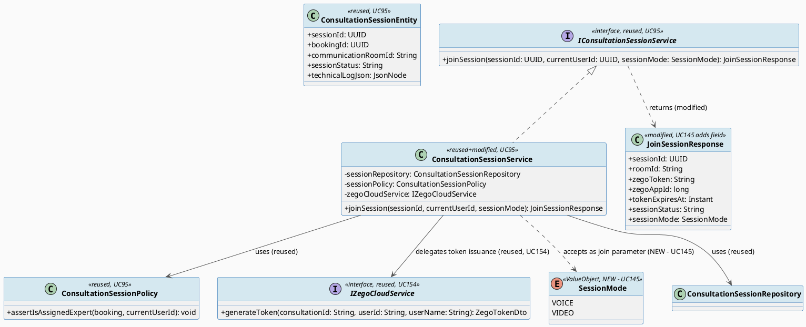
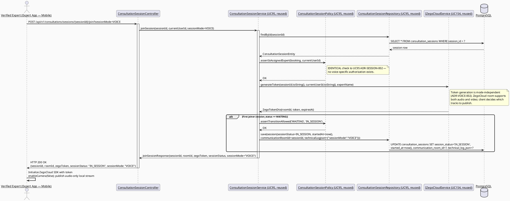
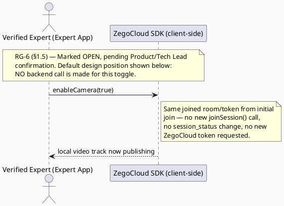
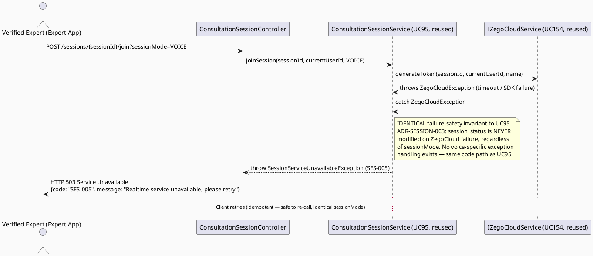

# ENGINEERING DOCUMENTATION STANDARD (EDS) v2.0
# UC145 — Consult via Voice Call — Technical Design Specification

| Field | Value |
|-------|-------|
| **Document ID** | `CB-CONSULTATION-IMP-145` |
| **Version** | `1.0` |
| **Date** | `2026-07-02` |
| **Status** | `Draft` |
| **Document Owner** | `TV4-Lâm` |
| **Author** | `AI Agent (Technical Architect)` |
| **Reviewed by** | `[Tech Lead — Pending]` |
| **DPO Sign-off** | `[ ] Pending` *(session touches health-context conversation content — inherited from UC95 scope, see §1)* |
| **Approved by** | `[Principal Architect — Pending]` |
| **Last Review** | `2026-07-02` |
| **Based on EDS** | `v2.0` |

---

## CHANGELOG

| Ngày | Người thực hiện | Nội dung thay đổi |
|------|-----------------|-------------------|
| 2026-07-02 | AI Agent — Technical Architect | Tạo tài liệu lần đầu (Draft) cho UC145 |

---

## MỤC LỤC

1. [Tổng quan Module](#1-tổng-quan-module)
2. [Ma trận Truy vết (Traceability Matrix)](#2-ma-trận-truy-vết-traceability-matrix)
3. [Architecture Decision Records (ADR)](#3-architecture-decision-records-adr)
4. [Non-Functional Requirements & SLA](#4-non-functional-requirements--sla)
5. [Static Modeling (Mô hình Tĩnh)](#5-static-modeling-mô-hình-tĩnh)
6. [Dynamic Modeling (Mô hình Động)](#6-dynamic-modeling-mô-hình-động)
7. [Domain Event Catalog](#7-domain-event-catalog)
8. [Interface Specification (Đặc tả Giao diện)](#8-interface-specification-đặc-tả-giao-diện)
9. [API Specification](#9-api-specification)
10. [Bảng mã lỗi (Error Codes)](#10-bảng-mã-lỗi-error-codes)
11. [Quy trình Triển khai (Step-by-Step)](#11-quy-trình-triển-khai-step-by-step)
12. [Rollback & Incident Runbook](#12-rollback--incident-runbook)
13. [Kịch bản Kiểm thử Chi tiết](#13-kịch-bản-kiểm-thử-chi-tiết)
14. [Phương pháp Xác minh](#14-phương-pháp-xác-minh)
15. [Mẫu thử thực tế (API Verification Samples)](#15-mẫu-thử-thực-tế-api-verification-samples)
16. [Bảng tổng hợp phân quyền (Authorization Matrix)](#16-bảng-tổng-hợp-phân-quyền-authorization-matrix)
17. [AI Prompt Constraints (CASE 2.0)](#17-ai-prompt-constraints-case-20)

---

## 1. Tổng quan Module

| Field | Value |
|-------|-------|
| **Module Name** | `Consultation — Consult via Voice Call` |
| **Bounded Context** | `Consultation` (package `com.carebridge.backend.consultation`) |
| **Function ID / UC** | `3.3.5.4 Consult via Voice Call` / `UC-145` (SRS §3.3.5.4, `02_Requirements/SRS/3_Functional_Specification.md` L3594-3613) |
| **Primary Actor** | Verified Expert |
| **Secondary Actor** | ZegoCloud Realtime Service |
| **Platform** | **Expert App** *(exact SRS "Other Information" text, L3610 — narrower than UC146's "Expert App / Expert Portal"; see §1.4 Platform Discrepancy note)* |
| **Priority** | Medium (SRS L3607) |
| **Sprint / Owner** | Sprint 2 — TV4-Lâm |
| **Data Classification** | `Confidential` (session metadata, participation timestamps; audio stream itself is not persisted — see ADR-VOICE-002) |
| **Compliance Scope** | `PDPA (Luật 91/2025)`, `BR-RBAC`, `BR-CONSULTATION` |
| **Upstream Dependencies** | `UC-95 ManageConsultationSession` (session lifecycle owner — `ConsultationSessionService.joinSession()`, `ConsultationSessionEntity`, `ConsultationSessionRepository` reused verbatim), `UC-154 EstablishRealtimeCommunicationSession` (`IZegoCloudService` token/room contract, reused via UC95) |
| **Downstream Consumers** | None new — UC145 does not introduce a new consumer; it is a client-side media-mode variant of UC95's already-designed `joinSession()` flow |

### 1.1 Scope Statement — Thin Variant of UC95's `joinSession()`, Not a New Session-Join Flow

Per Research Gate RG-3 (this document's controlling research question): **UC145 does NOT
introduce a new consultation-session-join flow.** `UC95_ManageConsultationSession_TDS.md`
(Draft, unimplemented at time of writing) already fully specifies:
- The session lifecycle state machine (`WAITING → IN_SESSION → COMPLETED/NO_SHOW/CANCELLED`,
  ADR-SESSION-001).
- Ownership/authorization (`ConsultationSessionPolicy.assertIsAssignedExpert()`,
  ADR-SESSION-002).
- ZegoCloud join/reconnect/failure safety (ADR-SESSION-003), delegating token issuance to
  `IZegoCloudService` (UC154).
- The `POST /api/v1/consultations/sessions/{sessionId}/join` endpoint and
  `JoinSessionResponse` DTO (UC95 §8, §9).

**What UC145 adds beyond UC95's `joinSession()` (the precise, narrow delta):** a
**voice-only ZegoCloud SDK media-track configuration parameter** requested by the client at
join time. UC145 does not add a new backend endpoint, a new entity, or a new session-state
transition. It is a **client-requested media mode** (`sessionMode=VOICE`) carried on the
existing `POST /sessions/{id}/join` call, which the backend accepts, validates, and echoes
back in `JoinSessionResponse` so the Expert App client configures the ZegoCloud SDK's
`ZegoRoomConfig`/local-stream-publish parameters to **audio-track only** (camera disabled,
microphone enabled). See ADR-VOICE-001.

### 1.2 Reuse Boundary — Explicit, to Prevent Duplication

**This TDS does NOT re-invent `ConsultationSessionService`, `ConsultationSessionEntity`,
`ConsultationSessionRepository`, or `IZegoCloudService`.** UC145's only new production code
is:
1. A `sessionMode` field on the existing join request/response DTOs (extension, not a new
   DTO family).
2. `ConsultationSessionPolicy` gains no new method — the existing
   `assertIsAssignedExpert()` check from UC95 (ADR-SESSION-002) is reused verbatim for
   voice-call join, since UC145's primary actor (Verified Expert) and ownership rule are
   identical to UC95's.
3. Web/Mobile client-side ZegoCloud SDK initialization uses `enableCamera(false)` /
   audio-only track publishing — a client-side SDK call, not a new backend contract.

This boundary exists to prevent an AI implementation from creating a parallel
`VoiceCallService`/`VoiceCallController` duplicating UC95's session-join logic (see §17.4
AP-CB-201).

### 1.3 Traceability to UC95 / UC154 — Reused Interfaces

| Reused From | Interface / Contract | How UC145 Uses It |
|---|---|---|
| UC95 | `IConsultationSessionService.joinSession(UUID sessionId, UUID currentUserId)` | Called as-is; `sessionMode` travels as an additive query parameter, not a method signature change (see ADR-VOICE-001 Option analysis) |
| UC95 | `ConsultationSessionEntity` / `ConsultationSessionRepository` | Read/write path unchanged — UC145 introduces no new column |
| UC95 | `ConsultationSessionPolicy.assertIsAssignedExpert()` | Reused verbatim — same ownership rule (assigned + `VERIFIED` Expert only) |
| UC95 | `session_status` state machine, `'COMPLETED'` terminal value (ADR-SESSION-001) | Unchanged — UC145 does not add or rename any status value |
| UC154 (via UC95) | `IZegoCloudService.generateToken()` | Same token contract; `sessionMode` informs which ZegoCloud room-config flags the **client** applies after receiving the token — the token itself carries no media-mode information (ADR-VOICE-001) |

### 1.4 Platform Discrepancy — Preserved, Not Silently Resolved

SRS §3.3.5.4 "Other Information" (L3610) states **`Platform: Expert App`** for UC145
(Voice Call), while §3.3.5.5 (L3631) states **`Platform: Expert App / Expert Portal`** for
UC146 (Video Call) — an explicit, verbatim difference in the source text. This TDS does
**not** assume this is a typo; it is recorded as-is. Practical reading: voice-only
consultation is scoped to the Expert **mobile** app only in the current SRS text, whereas
video call is scoped to both mobile Expert App and the Web Expert Portal. **Marked `Open`**
for Product/Tech Lead confirmation — no backend contract difference results from this
(the API is platform-agnostic), but it constrains **client scope**: this TDS's Mobile
(Flutter) file paths are in-scope; a Web `VoiceCallPanel` component is **out of scope**
unless Product confirms the SRS platform field is a drafting inconsistency.

### 1.5 RG-6 — Voice→Video Mid-Session Switch (Open)

SRS text for both UC145 and UC146 uses the identical generic use-case template ("actor
selects/initiates... system validates... applies business rules...") and does not state
whether switching from a voice call to a video call **mid-session** requires a new API call
or is a pure client-side ZegoCloud SDK toggle (e.g., `turnCameraOn()`/`turnCameraOff()`
within the same joined room). **Marked `Open`** — no SRS/BR source resolves this. This TDS's
default design position (consistent with §1.1's "thin variant" finding): switching media
mode within an already-`IN_SESSION` session is a **client-side ZegoCloud SDK call only**
(enable/disable local video track) and does **not** call `joinSession()` again or mutate
`session_status` — because ZegoCloud's SDK supports toggling local audio/video tracks
without leaving the room. This is the same room/token already issued at initial join; no new
token or room is needed. Flagged Open for Product/Tech Lead sign-off before implementation;
non-blocking for baseline UC145 scope (initial voice-only join).

---

## 2. Ma trận Truy vết (Traceability Matrix)

| Requirement ID | Loại (BR/ADR/US) | Mô tả yêu cầu | Thành phần Code | Compliance Target | ADR liên quan |
|----------------|------------------|---------------|-----------------|-------------------|---------------|
| UC-145 (SRS §3.3.5.4, L3594-3613) | Use Case | Verified Expert joins a voice call inside a confirmed consultation session | `ConsultationSessionController` (reused from UC95), voice-mode client config | BR-CONSULTATION | ADR-VOICE-001 |
| BR-RBAC | Business Rule | Users may access only functions allowed by role/permission scope | `ConsultationSessionPolicy.assertIsAssignedExpert()` (reused, UC95 ADR-SESSION-002) | Authorization | ADR-SESSION-002 (UC95, reused) |
| BR-CONSULTATION | Business Rule | Booking/session actions keep auditable lifecycle state | `ConsultationSessionEntity.sessionStatus` (reused, UC95) | PDPA / BR-AUDIT | ADR-SESSION-001 (UC95, reused) |
| SRS E3 (external service/network/server failure — retry guidance, no duplicate unsafe action) | Exception Flow | ZegoCloud join/reconnect failure must not corrupt session state | `ConsultationSessionService.joinSession()` guard (reused, UC95 ADR-SESSION-003) | BR-CONSULTATION | ADR-SESSION-003 (UC95, reused) |
| Schema: `consultation_sessions` (`V1__init_schema.sql` L898-909) | Schema Contract | Session lifecycle persistence — no new column | `ConsultationSessionEntity` (reused, UC95) | — | — |
| UC-95 (session lifecycle owner) | Reused Contract | `joinSession()`, `ConsultationSessionRepository`, `ConsultationSessionPolicy` | `IConsultationSessionService` (external collaborator, not owned by this TDS) | — | — |
| UC-154 (ZegoCloud pattern, via UC95) | Reused Contract | Token issuance | `IZegoCloudService` (external collaborator, not owned by this TDS) | — | — |
| §1.4 Platform Discrepancy | Open Item | SRS states Platform=`Expert App` (mobile only) for UC145 vs `Expert App / Expert Portal` for UC146 | N/A — client scope decision | — | — |
| §1.5 RG-6 | Open Item | Voice→video mid-session switch mechanism not stated in SRS | N/A — client-side SDK toggle assumed, Open for sign-off | — | ADR-VOICE-001 |

---

## 3. Architecture Decision Records (ADR)

### ADR-VOICE-001 — Voice-call join is a media-mode parameter on UC95's existing `joinSession()`, not a new endpoint

| Field | Value |
|-------|-------|
| **Status** | `Accepted` *(this TDS owns the media-mode delta; session-lifecycle authority remains UC95, unchanged)* |
| **Deciders** | `AI Agent (proposal) — pending TV4-Lâm / Tech Lead confirmation` |
| **Date** | `2026-07-02` |
| **Supersedes** | None — additive to UC95, does not modify ADR-SESSION-001/002/003 |

#### Bối cảnh (Context)
SRS UC-145 description: "Joins a voice call inside a confirmed consultation session."
UC95's `joinSession()` already establishes the ZegoCloud room/token for the session as a
whole (audio+video capable by default, since ZegoCloud rooms are media-mode-agnostic at the
room level — media tracks are a client-side publish decision). UC145 must decide: (a) does
"voice call" require a distinct backend session-join contract, or (b) is it purely a
client-side track-publishing decision layered on the existing join flow?

#### Các phương án đã xem xét (Options Considered)

| Phương án | Mô tả | Ưu điểm | Nhược điểm |
|-----------|-------|----------|------------|
| A | New `POST /sessions/{id}/join-voice` endpoint, parallel to UC95's `join` | Explicit intent in the URL | Duplicates UC95's ownership/state-machine/ZegoCloud-failure logic (violates §1.2 reuse boundary); two endpoints to keep in sync forever |
| B | **Reuse `POST /sessions/{id}/join` verbatim; add optional `sessionMode` query parameter (`VOICE` \| `VIDEO`, default `VIDEO`) that is echoed in `JoinSessionResponse` for the client to configure the ZegoCloud SDK's local track publishing** | Zero duplication of UC95's join logic; single source of truth for session-join authorization/state; matches "thin variant" nature of UC145 confirmed in RG-3 | Requires UC95's `JoinSessionResponse` DTO to gain one additive field (`sessionMode`) — a backward-compatible extension, not a breaking change |
| C | No backend change at all — voice/video is 100% client-side, ZegoCloud token/room identical regardless of mode | Simplest | Loses server-side audit visibility into whether a session was conducted as voice or video (useful for `expert_summary`/analytics, and for UC146's downstream reconciliation); SRS Postcondition POST-2 implies "related records... updated when applicable" |

#### Quyết định (Decision)
Chọn **Phương án B**. `POST /api/v1/consultations/sessions/{sessionId}/join` (UC95, reused
verbatim) accepts an optional query parameter `sessionMode=VOICE|VIDEO` (default `VIDEO` to
preserve UC95's existing behavior for callers that don't specify it — non-breaking). The
server does **not** reject/validate ZegoCloud room-level media config for either mode (rooms
are mode-agnostic); it only:
1. Echoes `sessionMode` back in `JoinSessionResponse` (new additive field).
2. Optionally records `sessionMode` on `ConsultationSessionEntity.technicalLogJson`
   (existing `jsonb` column, UC95 schema — see §5.3, no migration needed) for audit/analytics
   purposes, **not** as a new first-class column.

The Expert App client (Flutter, mobile — per §1.4 Platform Discrepancy) uses the returned
`sessionMode` to call ZegoCloud SDK's local-stream publish with camera disabled
(`enableCamera(false)`, audio-only) when `sessionMode == VOICE`.

#### Hệ quả (Consequences)

**Tích cực:** No duplication of UC95's session-join/ownership/ZegoCloud-failure logic; single endpoint remains the definitive session-join contract; `technicalLogJson` gives auditable visibility into voice-vs-video mode without a schema migration.
**Tiêu cực / Trade-offs:** `JoinSessionResponse` DTO must be extended (additive field) — requires UC95's implementation to accommodate this field when UC95 is built; sequencing dependency flagged in §11.1.
**Compliance Impact:** No new PII exposure — `sessionMode` is a non-sensitive enum value; supports BR-CONSULTATION auditable-lifecycle requirement via `technicalLogJson`.

---

### ADR-VOICE-002 — Voice audio stream is never persisted; only the ZegoCloud room/token pattern (UC154) applies unchanged

| Field | Value |
|-------|-------|
| **Status** | `Accepted` |
| **Deciders** | `AI Agent — derived directly from UC154 ADR-ZEGO-001 (reused verbatim)` |
| **Date** | `2026-07-02` |

#### Bối cảnh (Context)
UC154's `IZegoCloudService.generateToken()` issues an ephemeral, never-persisted token
(TTL 3600s) regardless of media mode. ZegoCloud handles audio/video transport entirely
outside CareBridge's backend — no raw audio/video stream ever transits or is stored by the
CareBridge API.

#### Các phương án đã xem xét (Options Considered)

| Phương án | Mô tả | Ưu điểm | Nhược điểm |
|-----------|-------|----------|------------|
| A | Record/store voice call audio for compliance | Enables playback/audit | Major new PII/health-data storage surface, out of scope, no BR/SRS basis, requires new DPO review and infrastructure not currently approved |
| B | **No audio recording/storage of any kind — ZegoCloud transports the call directly between clients (or via ZegoCloud's infra); CareBridge backend only ever sees the ephemeral token exchange, identical to UC95/UC154's existing invariant** | Zero new compliance surface; consistent with existing UC95/UC154 token-not-persisted invariant; matches CareBridge's "modular monolith, no new infrastructure without approval" rule (CLAUDE.md) | None material for baseline scope |

#### Quyết định (Decision)
Chọn **Phương án B**. UC145 introduces **no new data at rest** beyond what UC95 already
persists (`session_status`, timestamps, optional `sessionMode` in `technicalLogJson`). The
voice audio stream itself is never touched by the CareBridge backend.

#### Hệ quả (Consequences)

**Tích cực:** No new DPO review scope beyond UC95's existing `Confidential` classification; no new infrastructure (satisfies CLAUDE.md's "do not introduce ... new infrastructure ... without approval").
**Tiêu cực / Trade-offs:** No server-side audio audit trail exists if a dispute arises — accepted risk, consistent with UC95/UC154's existing posture (no recording infrastructure anywhere in the reused pattern).
**Compliance Impact:** Supports PDPA data-minimization principle — no unnecessary audio data collected.

---

## 4. Non-Functional Requirements & SLA

> No SRS/BR source specifies numeric SLA targets for UC145 beyond those already defined in
> UC95 §4.1 (reused verbatim, since UC145 shares the same `joinSession()` call path). Values
> below are **Open — proposed defaults inherited from UC95**, must be confirmed by Tech Lead.

### 4.1. Performance & Availability

| Category | Requirement | Target SLA | Measurement Method | Compliance Basis |
|----------|-------------|------------|---------------------|------------------|
| Latency | `POST /sessions/{id}/join` p99 (voice mode, identical call path to UC95) | `< 400ms` total *(Open — inherited from UC95 §4.1)* | Manual/API test timing | UC95 §4.1 (reused) |
| Availability | Dependent on UC95 session service + ZegoCloud (UC154 §4.1: 99.9% monthly) | N/A until UC95 dependency implemented | — | — |
| Token TTL | ZegoCloud token (reused from UC154, mode-independent) | 3600 seconds (1 hour) | UC154 §4.1 | ADR-ZEGO-001 (UC154, reused) |

### 4.2. Data Integrity & Retention

| Category | Requirement | Target | Verification Method | Compliance Basis |
|----------|-------------|--------|---------------------|------------------|
| Durability | No session record loss (reused UC95 scope) | RPO = 0 | Transaction log | BR-CONSULTATION |
| Retention | `sessionMode` value in `technicalLogJson`, if recorded, follows UC95's session audit retention | Indefinite | DB inspection | PDPA |
| Consistency | `sessionMode` is advisory metadata only — never gates `session_status` transitions (§6.4 of UC95, unchanged) | 100% | Reconciliation query | ADR-SESSION-001 (UC95, reused) |

### 4.3. Security

| Category | Requirement | Target | Verification Method | Compliance Basis |
|----------|-------------|--------|---------------------|------------------|
| Access control | Role-based, ownership-scoped — identical to UC95 | Least privilege (assigned, verified Expert only) | Auth Matrix (§16) | BR-RBAC |
| Token storage | ZegoCloud token NOT persisted in DB (reused from UC154 via UC95) | Ephemeral only | DB column scan | UC154 ADR-ZEGO-001 (reused) |
| Media stream | No audio stream transits or is stored by CareBridge backend | Not applicable — ZegoCloud handles transport | Architecture review | ADR-VOICE-002 |

### 4.4. Scalability & Capacity Planning

SRS marks UC145 "Frequency of Use: Regular" (L3608). No special scaling design beyond UC95's
existing session-join request handling. ZegoCloud capacity is externally managed (UC154
scope, unchanged).

---

## 5. Static Modeling (Mô hình Tĩnh)

### 5.1. Component Responsibilities & Planned File Paths

> Backend/entity/repository/policy files below are **owned by UC95** and reused verbatim —
> listed here only for traceability, not re-created. UC145's own new/modified files are
> marked **[NEW/MODIFIED — UC145]**.

| Layer | File Path | Responsibility |
|-------|-----------|----------------|
| Controller (reused) | `src/main/java/com/carebridge/backend/consultation/controller/ConsultationSessionController.java` | HTTP mapping for `join` (UC95) — **[MODIFIED — UC145]** accepts optional `sessionMode` query param, no new endpoint |
| Service (reused) | `src/main/java/com/carebridge/backend/consultation/service/ConsultationSessionService.java` | Session lifecycle workflow (UC95) — **[MODIFIED — UC145]** passes `sessionMode` through to `JoinSessionResponse` and optionally into `technicalLogJson` |
| DTO (reused, extended) | `src/main/java/com/carebridge/backend/consultation/dto/response/JoinSessionResponse.java` | **[MODIFIED — UC145]** add `sessionMode: String` field (additive, backward-compatible) |
| DTO (new) | `src/main/java/com/carebridge/backend/consultation/dto/request/JoinSessionModeParam.java` *(or inline `@RequestParam`, implementation detail — no new request body DTO required since it is a query param)* | **[NEW — UC145]** enum-validated `sessionMode` parameter, values `VOICE`/`VIDEO` |
| Entity (reused, no changes) | `src/main/java/com/carebridge/backend/consultation/entity/ConsultationSessionEntity.java` | JPA mapping for `consultation_sessions` (UC95) — unchanged, `technicalLogJson` already exists |
| Repository (reused, no changes) | `src/main/java/com/carebridge/backend/consultation/repository/ConsultationSessionRepository.java` | Persistence (UC95) — unchanged |
| Policy (reused, no changes) | `src/main/java/com/carebridge/backend/consultation/policy/ConsultationSessionPolicy.java` | Ownership check (UC95 ADR-SESSION-002) — unchanged, applies identically to voice-call join |
| Collaborator (reused, not owned) | `IZegoCloudService` (UC154, via UC95) | Token issuance — unchanged, mode-independent |
| Mobile Model | `05_Development/CareBridgeMobileApp/lib/features/consultation/models/consultation_session.dart` | **[NEW/EXTENDED — UC145]** mirrors `JoinSessionResponse` including `sessionMode` |
| Mobile Service | `05_Development/CareBridgeMobileApp/lib/features/consultation/services/consultation_session_api.dart` | **[NEW/EXTENDED — UC145]** API client calling `join?sessionMode=VOICE` |
| Mobile Screen | `05_Development/CareBridgeMobileApp/lib/features/consultation/screens/voice_call_screen.dart` | **[NEW — UC145]** Expert App voice-call UI; initializes ZegoCloud SDK with `enableCamera(false)` |
| Mobile Widget | `05_Development/CareBridgeMobileApp/lib/features/consultation/widgets/voice_call_controls.dart` | **[NEW — UC145]** mute/unmute, end-call controls (audio-only) |

> **§1.4 Platform Discrepancy applies here:** Web `src/features/consultationManagement/`
> paths from UC95 are **not extended** for UC145 per the exact SRS "Platform: Expert App"
> text — Web voice-call UI is out of scope unless Product/Tech Lead overrides the platform
> field. If overridden, the Web-equivalent path would be
> `05_Development/CareBridgeWebApp/src/features/consultationManagement/components/VoiceCallPanel.tsx` (not created in this Draft).

### 5.2. Class Diagram (PlantUML)



### 5.3. Data Structure — Schema/Migration Details

> **CareBridge rule:** `V1__init_schema.sql` and approved Flyway migrations are primary
> source of truth. ERD is supporting context only.

**No new migration is required.** UC145 reuses `consultation_sessions`
(`V1__init_schema.sql` L898-909, verified) exactly as designed in UC95:

```sql
-- consultation_sessions (V1__init_schema.sql L898-909) — REUSED, NO CHANGE
CREATE TABLE public.consultation_sessions (
    session_id            uuid         NOT NULL DEFAULT gen_random_uuid(),
    booking_id             uuid         NOT NULL,
    communication_room_id  varchar(255),
    started_at             timestamptz,
    ended_at                timestamptz,
    session_status         varchar(30)  NOT NULL DEFAULT 'WAITING',
    expert_summary         text,
    technical_log_json     jsonb,        -- UC145 optionally writes {"sessionMode": "VOICE"} here
    created_at              timestamptz  NOT NULL DEFAULT now(),
    updated_at              timestamptz  NOT NULL DEFAULT now()
);
```

`technical_log_json jsonb` (nullable, already exists) is the only column UC145 touches, and
only as an **optional** audit annotation — never a required write, never a new column. No
`CHECK` constraint or index change needed. **No sync action needed for
`V1__init_schema.sql`.**

**Migration version reservation (unused, recorded per instructions):** If a future gap
requires a dedicated column (e.g., a first-class `session_mode varchar(10)` column instead
of `technicalLogJson`), the next available version for this workstream would be
`V20260705130000__[name].sql` (verified: latest existing migration is
`V20260629000002__create_community_answer_likes.sql`; no collision). **Not used in this
Draft** — Option B in ADR-VOICE-001 explicitly avoids a new column.

---

## 6. Dynamic Modeling (Mô hình Động)

### 6.1. Sequence Diagram — Happy Path: Expert Joins Voice Call (PlantUML)



### 6.2. Sequence Diagram — Alternative: Voice→Video Mid-Session Toggle (Open, Client-Side Only) (PlantUML)



### 6.3. Sequence Diagram — Error/Timeout: ZegoCloud Join Failure (Reused from UC95 ADR-SESSION-003) (PlantUML)



### 6.4. State Machine — Reused Verbatim from UC95 (No New States)

> **UC145 introduces NO new `session_status` value and NO new state-transition edge.** The
> full state machine (`WAITING → IN_SESSION → COMPLETED/NO_SHOW/CANCELLED`) is owned and
> defined by `UC95_ManageConsultationSession_TDS.md §6.4` (ADR-SESSION-001). `sessionMode`
> (`VOICE`/`VIDEO`) is orthogonal metadata carried alongside the state machine, never a state
> itself.

**⚠️ Invariant bất biến (inherited from UC95, apply identically to UC145):**
1. `session_status` transitions only along UC95 §6.4's edges — UC145 does not add, remove, or
   reinterpret any edge.
2. `sessionMode` never gates or is gated by `session_status` — a `VOICE` session completes via
   the exact same `POST /sessions/{id}/end` path as a `VIDEO` session (UC95 ADR-SESSION-003).
3. ZegoCloud SDK failures during voice-call join/reconnect never mutate `session_status`
   (UC95 ADR-SESSION-003, unchanged).
4. Only the assigned, verified Expert may join a voice call (UC95 ADR-SESSION-002, unchanged
   — no voice-specific relaxation of this rule).

---

## 7. Domain Event Catalog

### 7.1. Events Published (Phát ra)

> UC145 publishes no new event. `ConsultationSessionStatusChanged` (owned by UC95 §7.1) is
> reused verbatim — its payload is unchanged by UC145 (media mode is not part of the event
> payload; it is advisory `technicalLogJson` metadata only, per ADR-VOICE-001).

| Event Name | Trigger | Publisher | Subscriber(s) | Payload Schema | Async? |
|------------|---------|-----------|---------------|----------------|--------|
| `ConsultationSessionStatusChanged` *(reused, UC95)* | Any `session_status` transition (unchanged trigger) | `ConsultationSessionService` (UC95, reused) | Notification service, Audit log | `ConsultationSessionStatusChanged.java` (UC95 §7.3, unchanged) | Yes |

### 7.2. Events Consumed (Tiêu thụ)

| Event Name | Source | Handler | Action thực hiện |
|------------|--------|---------|------------------|
| *(None)* | — | — | UC145's join flow reads `consultation_sessions`/`consultation_bookings` synchronously (via UC95's reused repositories) and calls `IZegoCloudService` synchronously at request time — no event consumption. |

### 7.3. Payload Schema

> No new payload schema — see UC95 §7.3 (`ConsultationSessionStatusChanged`), reused
> verbatim, unchanged by this TDS.

---

## 8. Interface Specification (Đặc tả Giao diện)

### 8.1. Service Interface — Extension of UC95's `IConsultationSessionService`

```java
// SessionMode.java — Value Object (NEW — UC145)
// @version 1.0
public enum SessionMode {
    VOICE,
    VIDEO
}

// JoinSessionResponse.java — Output DTO (MODIFIED — UC145 adds one field)
// @version 1.1 (breaking-change: NO — additive field only, backward-compatible with UC95 v1.0 callers)
public class JoinSessionResponse {
    private UUID sessionId;
    private String roomId;          // = sessionId.toString(), per UC95 §5.3
    private String zegoToken;       // NEVER persisted — ephemeral, from IZegoCloudService (UC154)
    private long zegoAppId;
    private Instant tokenExpiresAt; // now + 3600s (UC154 ADR-ZEGO-001, reused)
    private String sessionStatus;
    private SessionMode sessionMode; // NEW field — echoes the requested join media mode; defaults to VIDEO if unspecified (ADR-VOICE-001)
    // getters / setters
}

// IConsultationSessionService.java — Service Contract (MODIFIED — UC95's interface gains an overload parameter)
// @version 1.1
// @breaking-change NO — sessionMode has a default value (VIDEO) preserving UC95's original call signature via overload
public interface IConsultationSessionService {
    /**
     * Assigned, verified Expert joins the session in the given media mode.
     * Reuses UC95's ownership/state-machine/ZegoCloud-failure guarantees verbatim;
     * sessionMode is advisory metadata only (ADR-VOICE-001) — never gates session_status.
     * @throws SessionAuthorizationException (SES-004) if currentUserId is not the assigned, verified Expert
     * @throws SessionNotFoundException (SES-003) if sessionId does not exist
     * @throws SessionConflictException (SES-002) if session is already in a terminal state
     * @throws SessionServiceUnavailableException (SES-005) if ZegoCloud token generation fails
     */
    JoinSessionResponse joinSession(UUID sessionId, UUID currentUserId, SessionMode sessionMode);

    /**
     * Overload preserving UC95's original signature — defaults to VIDEO mode.
     * Existing UC95 callers (and UC146) are unaffected by this addition.
     */
    default JoinSessionResponse joinSession(UUID sessionId, UUID currentUserId) {
        return joinSession(sessionId, currentUserId, SessionMode.VIDEO);
    }
}
```

### 8.2. Repository Interface

> No repository changes. `ConsultationSessionRepository` (UC95 §8.2) is reused verbatim —
> UC145 does not add any query method.

---

## 9. API Specification

### 9.1. Endpoints Table

> The endpoint itself is **owned by UC95**; UC145 extends its accepted query parameters
> only. No new endpoint is introduced.

| Method | Path | Auth Level | Required Roles | Rate Limit | Idempotent? | Change from UC95 |
|--------|------|------------|----------------|------------|-------------|-------------------|
| `POST` | `/api/v1/consultations/sessions/{sessionId}/join?sessionMode=VOICE\|VIDEO` | JWT Bearer | `EXPERT` (assigned, verified only) | 60/min *(reused from UC95)* | Yes (re-issues token, mode-independent) | **[MODIFIED]** optional `sessionMode` query param added, default `VIDEO` |

### 9.2. Request / Response Schemas

#### `POST /api/v1/consultations/sessions/{sessionId}/join?sessionMode=VOICE` — Expert joins voice call

**Response — 200 OK (Happy Path):**
```json
{
  "sessionId": "9f8e7d6c-1234-4a5b-8c9d-0e1f2a3b4c5d",
  "roomId": "9f8e7d6c-1234-4a5b-8c9d-0e1f2a3b4c5d",
  "zegoToken": "04AAAAAGxxxxxxxx...",
  "zegoAppId": 12345678,
  "tokenExpiresAt": "2026-07-02T11:00:00.000Z",
  "sessionStatus": "IN_SESSION",
  "sessionMode": "VOICE"
}
```

**Response — 400 Bad Request (Invalid sessionMode value):**
```json
{
  "error": {
    "code": "SES-001",
    "message": "sessionMode must be VOICE or VIDEO"
  }
}
```

**Response — 403 Forbidden (Not assigned Expert — identical to UC95):**
```json
{
  "error": {
    "code": "SES-004",
    "message": "You are not authorized to join this session"
  }
}
```

**Response — 503 Service Unavailable (ZegoCloud failure — identical to UC95):**
```json
{
  "error": {
    "code": "SES-005",
    "message": "Realtime service unavailable, please retry"
  }
}
```

---

## 10. Bảng mã lỗi (Error Codes)

> All error codes are **reused verbatim from UC95 §10** — no new error code is introduced by
> UC145. `SES-001` (validation failed) now additionally covers an invalid `sessionMode`
> value.

| Code | HTTP Status | Message (EN) | Message (VI) | Trigger Condition |
|------|-------------|--------------|--------------|-------------------|
| `SES-001` | 400 | Validation failed | Dữ liệu không hợp lệ | `sessionMode` not `VOICE`/`VIDEO`, or (reused) `targetStatus` not a valid enum value |
| `SES-002` | 409 | Session already in a terminal state | Phiên tư vấn đã ở trạng thái kết thúc | join attempted on `COMPLETED`/`NO_SHOW`/`CANCELLED` session *(reused, UC95)* |
| `SES-003` | 404 | Session not found | Không tìm thấy phiên tư vấn | `sessionId` does not exist *(reused, UC95)* |
| `SES-004` | 403 | Insufficient permissions | Không đủ quyền | Current user is not the assigned, verified Expert *(reused, UC95)* |
| `SES-005` | 503 | Realtime service unavailable | Dịch vụ realtime không khả dụng | ZegoCloud SDK call failed/timed out — `session_status` unchanged *(reused, UC95 ADR-SESSION-003)* |
| `SES-500` | 500 | Internal error | Lỗi hệ thống | Unexpected failure *(reused, UC95)* |

---

## 11. Quy trình Triển khai (Step-by-Step)

### 11.1. Prerequisites

- [ ] **BLOCKING:** `UC-95 ManageConsultationSession` implemented and stable — UC145 extends
      its `joinSession()` contract; cannot be implemented standalone
- [ ] **BLOCKING:** `IZegoCloudService` (UC-154, via UC95) implemented and stable
- [ ] ADR-VOICE-001 confirmed by Product/Tech Lead (currently `Accepted` by this TDS —
      pending sign-off, since it extends UC95's DTO)
- [ ] §1.4 Platform Discrepancy resolved by Product (confirm Mobile-only vs Mobile+Web scope)
- [ ] §1.5 RG-6 (voice→video mid-session toggle mechanism) confirmed by Product/Tech Lead —
      non-blocking for baseline voice-only join scope
- [ ] Principal Architect approves this TDS

### 11.2. Pre-Migration Checklist

- [ ] **N/A** — no new migration required (see §5.3)

### 11.3. Implementation Steps

#### Chặng 1 — Extend UC95's `JoinSessionResponse` DTO + Service Overload
Add `sessionMode: SessionMode` field to `JoinSessionResponse` (additive). Add the
`joinSession(sessionId, currentUserId, sessionMode)` overload to
`IConsultationSessionService`/`ConsultationSessionService`, defaulting the existing
2-argument signature to `VIDEO` — **do not modify UC95's existing ownership/state-machine
logic**, only pass `sessionMode` through to the response and optional
`technicalLogJson` write.

#### Chặng 2 — Controller Query Parameter
Add optional `@RequestParam(defaultValue = "VIDEO") SessionMode sessionMode` to the existing
`ConsultationSessionController.join()` handler (UC95). Validate via enum binding (invalid
values automatically produce `SES-001` via existing `@ExceptionHandler`).

#### Chặng 3 — Mobile (Expert App) Voice-Call Screen
Implement `voice_call_screen.dart` calling `join?sessionMode=VOICE`, initializing ZegoCloud
Flutter SDK with `enableCamera(false)`, audio-only local stream publish. Mute/unmute and
end-call controls only (no camera toggle in baseline voice screen — camera toggle belongs to
§1.5's Open mid-session-switch item, not built in this Draft's baseline scope).

#### Chặng 4 — Verification sau deploy

```bash
curl -X GET https://[host]/api/v1/health
# Expected: {"status": "ok"}
```

### 11.4. Deployment Checklist

- [ ] `./mvnw test` green
- [ ] `flutter test` green (Mobile)
- [ ] Error rate < 1% in first 10 minutes
- [ ] Verify ZegoCloud token NEVER appears in any DB column (reused UC95/UC154 verification
      query)
- [ ] Verify `sessionMode=VOICE` join results in `enableCamera(false)` client-side (manual QA
      — no automated backend assertion possible for client SDK behavior)

---

## 12. Rollback & Incident Runbook

### 12.1. Điều kiện kích hoạt Rollback

| Điều kiện | Ngưỡng | Người quyết định |
|-----------|--------|------------------|
| Error rate tăng đột biến | > 5% trong 5 phút | On-call Engineer |
| `sessionMode` param bypasses UC95's ownership check | Any single occurrence | Tech Lead (security incident) |
| ZegoCloud token persisted to DB | Any occurrence | Tech Lead + DPO |

### 12.2. Rollback Procedure

```bash
# No new migration — code-only rollback:
git checkout -- 05_Development/CareBridgeAPI/src/main/java/com/carebridge/backend/consultation/
git checkout -- 05_Development/CareBridgeMobileApp/lib/features/consultation/
kubectl rollout undo deployment/carebridge-api
```

### 12.3. Notification Protocol

| Thời điểm | Người nhận | Kênh | Template |
|-----------|------------|------|----------|
| Ngay khi phát hiện ownership bypass via sessionMode param | On-call + Tech Lead | Slack `#incident` | "🚨 UC145 sessionMode parameter bypassed session ownership check" |

### 12.4. Post-Incident Review (PIR)

Standard PIR within 48h for any authorization incident, per UC95's established process.

---

## 13. Kịch bản Kiểm thử Chi tiết

> Detailed test cases live in `UC145_ConsultViaVoiceCall_Test-Spec.md`.

| Condition Ref | Summary |
|----------------|---------|
| TC-COND-001 | Happy path — assigned Expert joins with `sessionMode=VOICE` → `IN_SESSION`, response echoes `sessionMode="VOICE"` |
| TC-COND-002 | Default mode when `sessionMode` omitted → defaults to `VIDEO` (backward compatibility with UC95) |
| TC-COND-003 | Invalid `sessionMode` value (e.g., `AUDIO`) → 400 (`SES-001`) |
| TC-COND-004 | Ownership violation — non-assigned Expert joins voice call → 403 (`SES-004`), identical to UC95 |
| TC-COND-005 | ZegoCloud SDK failure on voice join → 503 (`SES-005`), `session_status` unchanged |
| TC-COND-006 | `sessionMode` does not affect `session_status` state machine — voice session reaches `COMPLETED` via identical `end` call |
| TC-COND-007 | `technicalLogJson` optionally records `{"sessionMode":"VOICE"}` on first join |

---

## 14. Phương pháp Xác minh

### 14.1. Database Inspection

```sql
SELECT session_id, booking_id, session_status, technical_log_json
FROM consultation_sessions
WHERE session_id = '[uuid]';

-- Verify no dedicated session_mode column was added (per ADR-VOICE-001 Option B)
SELECT column_name FROM information_schema.columns
WHERE table_name = 'consultation_sessions' AND column_name = 'session_mode';
-- Expected: 0 rows (mode lives in technical_log_json, not a first-class column)

-- Verify no token column exists (reused UC95/UC154 invariant)
SELECT column_name FROM information_schema.columns
WHERE table_name = 'consultation_sessions' AND column_name LIKE '%token%';
-- Expected: 0 rows
```

### 14.2. Log / Audit Verification

```bash
kubectl logs -l app=carebridge-api | grep '"sessionMode":"VOICE"' | head -5
```

---

## 15. Mẫu thử thực tế (API Verification Samples)

### 15.1. Happy Path

```bash
curl -X POST "https://[host]/api/v1/consultations/sessions/{sessionId}/join?sessionMode=VOICE" \
  -H "Authorization: Bearer [JWT_TOKEN — expert@carebridge.dev]"
```

**Expected Response (200):** see §9.2.

### 15.2. Error Paths

```bash
# Invalid sessionMode → 400
curl -X POST "https://[host]/api/v1/consultations/sessions/{sessionId}/join?sessionMode=AUDIO" \
  -H "Authorization: Bearer [JWT_TOKEN]"
```

**Expected Response (400):** see `SES-001` in §10.

---

## 16. Bảng tổng hợp phân quyền (Authorization Matrix)

> Identical to UC95 §16 — UC145 introduces no new role or permission scope; `sessionMode` is
> orthogonal to authorization.

| Endpoint | `GUEST` | `MOTHER` | `EXPERT` (non-assigned) | `EXPERT` (assigned, unverified) | `EXPERT` (assigned, verified) | `SYSTEM_ADMIN` |
|----------|---------|----------|--------------------------|----------------------------------|-------------------------------|-----------------|
| `POST /sessions/{id}/join?sessionMode=VOICE` | ❌ | ❌ *(Mother-side join is a separate mobile UC, out of scope — same as UC95)* | ❌ (`SES-004`) | ❌ (`SES-004`) | ✅ | ✅ |

**Chú thích:**
- ✅ = Được phép; ❌ = Bị từ chối (403); identical semantics to UC95 §16.

---

## 17. AI Prompt Constraints (CASE 2.0)

### 17.1 Constraint Summary Table

| # | Constraint | Source (ADR/BR) | Last Verified |
|---|-----------|-----------------|---------------|
| C1 | UC145 MUST reuse UC95's `joinSession()`/`ConsultationSessionPolicy`/`ConsultationSessionRepository` — do NOT create a parallel `VoiceCallService`/`VoiceCallController` | `§1.2 Reuse Boundary` | `2026-07-02` |
| C2 | `sessionMode` is an ADDITIVE parameter/field only — MUST NOT change UC95's existing 2-argument `joinSession()` signature (use overload) or existing DTO fields | `ADR-VOICE-001` | `2026-07-02` |
| C3 | `sessionMode` MUST NOT gate or be gated by `session_status` — the state machine (UC95 §6.4) is unchanged | `ADR-VOICE-001`, `ADR-SESSION-001` (UC95, reused) | `2026-07-02` |
| C4 | Only the assigned, `verification_status='VERIFIED'` Expert may join a voice call — IDENTICAL check to UC95 ADR-SESSION-002, no relaxation | `ADR-SESSION-002` (UC95, reused) | `2026-07-02` |
| C5 | ZegoCloud token generation MUST delegate to `IZegoCloudService` (UC154, via UC95) — do NOT re-implement token generation for "voice mode" | `§1.3`, UC154 (reused) | `2026-07-02` |
| C6 | No audio stream is ever persisted or transits the CareBridge backend | `ADR-VOICE-002` | `2026-07-02` |
| C7 | ZegoCloud SDK failure during voice join MUST NOT change `session_status` — return `SES-005` (503), identical to UC95 | `ADR-SESSION-003` (UC95, reused) | `2026-07-02` |

### 17.2 Constraint Injection Block (Copy-Paste vào AI Prompt)

```
[CONSTRAINT BLOCK — Module: Consultation Voice Call (UC145)]
Theo TDS CB-CONSULTATION-IMP-145 và các ADR liên quan:

1. (C1) PHẢI tái sử dụng joinSession()/ConsultationSessionPolicy/
   ConsultationSessionRepository từ UC95 — KHÔNG tạo VoiceCallService/
   VoiceCallController song song.
2. (C2) sessionMode CHỈ là tham số/field bổ sung (additive) — KHÔNG thay đổi
   signature 2-argument joinSession() hiện có của UC95 (dùng overload).
3. (C3) sessionMode KHÔNG được gate hoặc bị gate bởi session_status —
   state machine UC95 §6.4 giữ nguyên.
4. (C4) CHỈ Expert được gán và đã VERIFIED mới được join voice call —
   giống hệt UC95 ADR-SESSION-002, không nới lỏng.
5. (C5) Token ZegoCloud PHẢI delegate qua IZegoCloudService (UC154, qua UC95) —
   KHÔNG tự implement lại logic generate token cho "voice mode".
6. (C6) KHÔNG BAO GIỜ lưu trữ hoặc cho audio stream đi qua CareBridge backend.
7. (C7) Lỗi ZegoCloud SDK khi join voice KHÔNG được thay đổi session_status —
   trả về SES-005 (503), giống hệt UC95.

[CONTEXT BLOCK]
- Bounded Context: Consultation
- Data Classification: Confidential
- Compliance: PDPA (Luật 91/2025), BR-RBAC, BR-CONSULTATION
- Existing interfaces: §8 Service Interface (extends UC95's IConsultationSessionService)
- Error codes: §10 Error Codes Table (reused from UC95)
- Auth matrix: §16 Authorization Matrix (identical to UC95)
- Reused collaborators: ConsultationSessionService/Repository/Policy (UC95),
  IZegoCloudService (UC154, via UC95) — do NOT redefine

[TASK BLOCK]
Implement {feature/method} thỏa mãn constraints trên.
Output phải tuân thủ §8 Interface Specification.
Tests phải cover §13 Test Scenarios (see Test-Spec document).
```

### 17.3 Constraint Quality Checklist

- [x] Mỗi constraint traceable về ADR hoặc BR cụ thể
- [x] Không có constraint generic
- [x] Mỗi constraint có `Last Verified` date ≤ 2 sprints
- [x] Constraint block có ≥ 3 constraints cụ thể
- [x] Constraint block reference §8 Interface
- [x] Constraint block reference §16 Auth Matrix

### 17.4 Anti-Pattern Detection (cho AI-Generated Code từ Block này)

| AP-ID | Anti-Pattern | Dấu hiệu | Hành động |
|-------|-------------|-----------|----------|
| AP-AI-001 | Unconstrained Gen | Code không match bất kỳ constraint C1-C7 nào | Reject — inject lại constraints |
| AP-AI-003 | Implicit Decision | Code assumes `sessionMode` is a new first-class DB column instead of `technicalLogJson` | Reject — violates ADR-VOICE-001 Option B |
| AP-AI-005 | Hallucinated Contract | Code re-implements ZegoCloud token generation instead of calling `IZegoCloudService` | Reject — violates C5, duplicates UC154 logic |
| AP-CB-201 *(project-specific)* | **Re-inventing UC95's session-join flow** | New `VoiceCallService`/`VoiceCallController`/parallel entity created inside `consultation` package duplicating UC95's `ConsultationSessionService` | Reject — must extend UC95's existing interface (§1.2) |
| AP-CB-202 *(project-specific)* | **Persisting audio/media stream data** | New table/column/blob-storage call added to persist voice call audio | Reject — violates ADR-VOICE-002, no BR/SRS basis |

---

## PHỤ LỤC

### A. Glossary

| Thuật ngữ | Định nghĩa |
|-----------|------------|
| Session mode | Advisory metadata (`VOICE`/`VIDEO`) describing which ZegoCloud media tracks the client publishes — never a `session_status` value |
| Thin variant | A use case that reuses an existing service's core contract with only an additive parameter, introducing no new endpoint/entity/state |
| Track-only toggle | A ZegoCloud SDK client-side call (e.g., `enableCamera()`) that changes published media without re-joining the room |

### B. Tài liệu tham chiếu

| Document | Path |
|----------|------|
| SRS §3.3.5.4 | `02_Requirements/SRS/3_Functional_Specification.md` L3594-3613 |
| Schema source of truth | `05_Development/CareBridgeAPI/src/main/resources/db/migration/V1__init_schema.sql` L898-909 |
| CareBridge project rules | `CLAUDE.md` |
| Session lifecycle owner (reused) | `04_Implement/UC95_ManageConsultationSession/UC95_ManageConsultationSession_TDS.md` |
| ZegoCloud pattern (reused, via UC95) | `04_Implement/UC154_EstablishRealtimeCommunicationSession/UC154_EstablishRealtimeCommunicationSession_TDS.md` |
| Sibling — video call variant | `04_Implement/UC146_ConsultViaVideoCall/UC146_ConsultViaVideoCall_TDS.md` |
| Related sibling (join flow, mobile) | `04_Implement/UC77_JoinConsultationSession/UC77_JoinConsultationSession_TDS.md` |

---

*TDS UC145 v1.0 — Draft. Requires Product/Tech Lead sign-off on ADR-VOICE-001 (sessionMode as additive UC95 extension), §1.4 Platform Discrepancy, and §1.5 RG-6 (voice→video mid-session toggle) before Status may change to Approved. Blocked on UC95/UC154 implementation per §11.1.*
