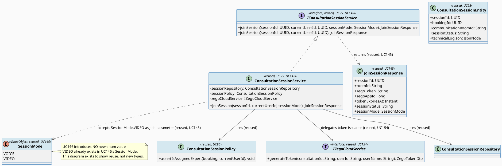
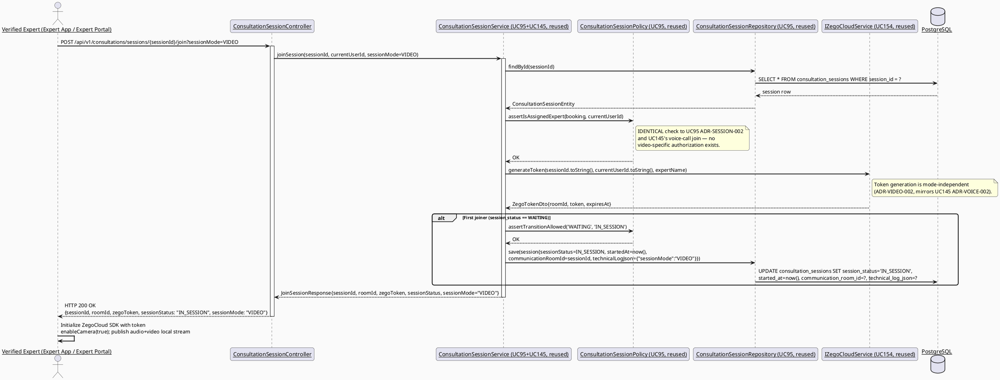
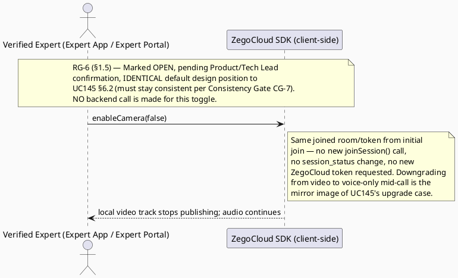
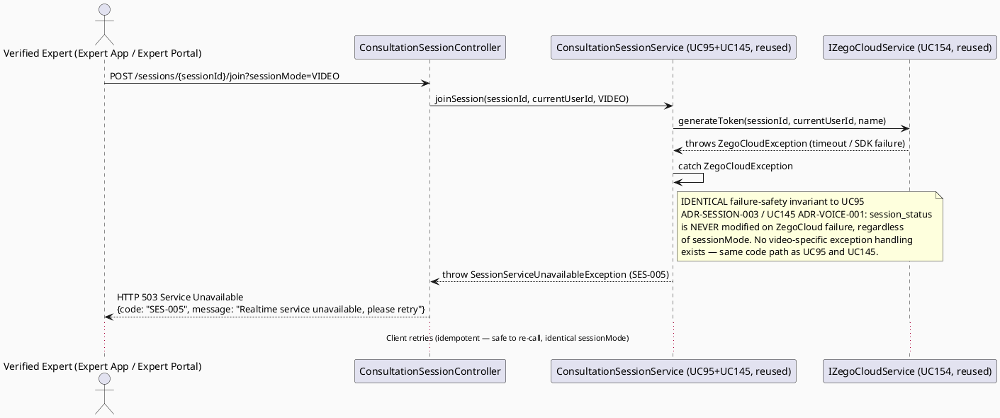

# ENGINEERING DOCUMENTATION STANDARD (EDS) v2.0
# UC146 — Consult via Video Call — Technical Design Specification

| Field | Value |
|-------|-------|
| **Document ID** | `CB-CONSULTATION-IMP-146` |
| **Version** | `1.0` |
| **Date** | `2026-07-02` |
| **Status** | `Draft` |
| **Document Owner** | `TV4-Lâm` |
| **Author** | `AI Agent (Technical Architect)` |
| **Reviewed by** | `[Tech Lead — Pending]` |
| **DPO Sign-off** | `[ ] Pending` *(session touches health-context conversation content — inherited from UC95 scope, see §1)* |
| **Approved by** | `[Principal Architect — Pending]` |
| **Last Review** | `2026-07-02` |
| **Based on EDS** | `v2.0` |

---

## CHANGELOG

| Ngày | Người thực hiện | Nội dung thay đổi |
|------|-----------------|-------------------|
| 2026-07-02 | AI Agent — Technical Architect | Tạo tài liệu lần đầu (Draft) cho UC146 |

---

## MỤC LỤC

1. [Tổng quan Module](#1-tổng-quan-module)
2. [Ma trận Truy vết (Traceability Matrix)](#2-ma-trận-truy-vết-traceability-matrix)
3. [Architecture Decision Records (ADR)](#3-architecture-decision-records-adr)
4. [Non-Functional Requirements & SLA](#4-non-functional-requirements--sla)
5. [Static Modeling (Mô hình Tĩnh)](#5-static-modeling-mô-hình-tĩnh)
6. [Dynamic Modeling (Mô hình Động)](#6-dynamic-modeling-mô-hình-động)
7. [Domain Event Catalog](#7-domain-event-catalog)
8. [Interface Specification (Đặc tả Giao diện)](#8-interface-specification-đặc-tả-giao-diện)
9. [API Specification](#9-api-specification)
10. [Bảng mã lỗi (Error Codes)](#10-bảng-mã-lỗi-error-codes)
11. [Quy trình Triển khai (Step-by-Step)](#11-quy-trình-triển-khai-step-by-step)
12. [Rollback & Incident Runbook](#12-rollback--incident-runbook)
13. [Kịch bản Kiểm thử Chi tiết](#13-kịch-bản-kiểm-thử-chi-tiết)
14. [Phương pháp Xác minh](#14-phương-pháp-xác-minh)
15. [Mẫu thử thực tế (API Verification Samples)](#15-mẫu-thử-thực-tế-api-verification-samples)
16. [Bảng tổng hợp phân quyền (Authorization Matrix)](#16-bảng-tổng-hợp-phân-quyền-authorization-matrix)
17. [AI Prompt Constraints (CASE 2.0)](#17-ai-prompt-constraints-case-20)

---

## 1. Tổng quan Module

| Field | Value |
|-------|-------|
| **Module Name** | `Consultation — Consult via Video Call` |
| **Bounded Context** | `Consultation` (package `com.carebridge.backend.consultation`) |
| **Function ID / UC** | `3.3.5.5 Consult via Video Call` / `UC-146` (SRS §3.3.5.5, `02_Requirements/SRS/3_Functional_Specification.md` L3615-3634) |
| **Primary Actor** | Verified Expert |
| **Secondary Actor** | ZegoCloud Realtime Service |
| **Platform** | **Expert App / Expert Portal** *(exact SRS "Other Information" text, L3631 — wider than UC145's "Expert App" only; see §1.4 Platform Discrepancy note)* |
| **Priority** | Medium (SRS L3628) |
| **Sprint / Owner** | Sprint 2 — TV4-Lâm |
| **Data Classification** | `Confidential` (session metadata, participation timestamps; video/audio stream itself is not persisted — see ADR-VIDEO-002) |
| **Compliance Scope** | `PDPA (Luật 91/2025)`, `BR-RBAC`, `BR-CONSULTATION` |
| **Upstream Dependencies** | `UC-95 ManageConsultationSession` (session lifecycle owner — `ConsultationSessionService.joinSession()`, `ConsultationSessionEntity`, `ConsultationSessionRepository` reused verbatim), `UC-154 EstablishRealtimeCommunicationSession` (`IZegoCloudService` token/room contract, reused via UC95), `UC-145 ConsultViaVoiceCall` (sibling — introduces the shared `SessionMode` value object and `JoinSessionResponse.sessionMode` field this TDS also relies on) |
| **Downstream Consumers** | None new — UC146 is a client-side media-mode variant of UC95's already-designed `joinSession()` flow, sharing the extension introduced by UC145 |

### 1.1 Scope Statement — Thin Variant of UC95's `joinSession()`, Shares UC145's `SessionMode` Extension

Per Research Gate RG-3 (this document's controlling research question): **UC146 does NOT
introduce a new consultation-session-join flow, and does NOT introduce a second, separate
`SessionMode` mechanism.** `UC95_ManageConsultationSession_TDS.md` (Draft, unimplemented at
time of writing) fully specifies the session lifecycle, ownership, and ZegoCloud
join/reconnect/failure safety (§ADR-SESSION-001/002/003). `UC145_ConsultViaVoiceCall_TDS.md`
(sibling, drafted alongside this TDS) introduces the **single shared** `sessionMode` query
parameter and `SessionMode` enum (`VOICE`/`VIDEO`) on UC95's `joinSession()` call (ADR-VOICE-001
in that document). **UC146 reuses that exact same extension — it does not define a second,
competing mechanism.**

**What UC146 adds beyond UC95's `joinSession()` + UC145's `sessionMode` extension (the
precise, narrow delta):** UC146 is functionally the **default** case of the shared
`sessionMode` parameter (`sessionMode=VIDEO`, which is also UC95's original default per
ADR-VOICE-001 in UC145's TDS, preserving full backward compatibility). The only genuinely
new production concern introduced by UC146 is the **client-side camera-enabled ZegoCloud SDK
track configuration** (`enableCamera(true)`, both audio and video tracks published) and, per
the wider Platform field (§1.4), a **Web Expert Portal** UI surface that UC145 explicitly
does not require.

### 1.2 Reuse Boundary — Explicit, to Prevent Duplication

**This TDS does NOT re-invent `ConsultationSessionService`, `ConsultationSessionEntity`,
`ConsultationSessionRepository`, `IZegoCloudService`, or the `SessionMode`/`sessionMode`
query-parameter mechanism (owned by UC145's ADR-VOICE-001).** UC146's only new production
code is:
1. Web (`consultationManagement`) and Mobile (Expert App) video-call UI components that call
   the existing `join?sessionMode=VIDEO` (or omit the parameter, since `VIDEO` is the
   default).
2. Client-side ZegoCloud SDK initialization with camera enabled — a client-side SDK call, not
   a new backend contract.

`ConsultationSessionPolicy` gains no new method for UC146 — the existing
`assertIsAssignedExpert()` check (UC95 ADR-SESSION-002) applies identically, since UC146's
primary actor and ownership rule are unchanged from UC95/UC145.

This boundary exists to prevent an AI implementation from creating a parallel
`VideoCallService`/`VideoCallController`, or a second/duplicate `SessionMode` enum,
diverging from UC145's already-established extension (see §17.4 AP-CB-301/AP-CB-302).

### 1.3 Traceability to UC95 / UC154 / UC145 — Reused Interfaces

| Reused From | Interface / Contract | How UC146 Uses It |
|---|---|---|
| UC95 | `IConsultationSessionService.joinSession(UUID sessionId, UUID currentUserId)` (2-arg overload) | Reused as-is for the implicit-`VIDEO`-default case |
| UC145 | `IConsultationSessionService.joinSession(UUID sessionId, UUID currentUserId, SessionMode sessionMode)` (3-arg, ADR-VOICE-001) | Called explicitly with `SessionMode.VIDEO` when a client wants to be explicit; functionally identical to omitting the parameter |
| UC145 | `SessionMode` enum (`VOICE`/`VIDEO`) | Reused verbatim — **UC146 does not define its own enum** |
| UC145 | `JoinSessionResponse.sessionMode` field | Reused verbatim — same additive field UC145 introduced |
| UC95 | `ConsultationSessionEntity` / `ConsultationSessionRepository` | Read/write path unchanged — UC146 introduces no new column |
| UC95 | `ConsultationSessionPolicy.assertIsAssignedExpert()` | Reused verbatim — same ownership rule (assigned + `VERIFIED` Expert only) |
| UC95 | `session_status` state machine, `'COMPLETED'` terminal value (ADR-SESSION-001) | Unchanged — UC146 does not add or rename any status value |
| UC154 (via UC95) | `IZegoCloudService.generateToken()` | Same token contract; mode-independent, unchanged by UC146 |

### 1.4 Platform Discrepancy — Preserved, Not Silently Resolved

SRS §3.3.5.5 "Other Information" (L3631) states **`Platform: Expert App / Expert Portal`**
for UC146 (Video Call), while §3.3.5.4 (L3610) states **`Platform: Expert App`** only for
UC145 (Voice Call) — an explicit, verbatim difference in the source text (mirrored from
UC145's TDS §1.4, cited here for consistency). This TDS does **not** assume this is a typo.
Practical reading: video consultation is scoped to **both** the Expert mobile app and the Web
Expert Portal in the current SRS text, whereas voice-only consultation is mobile-only.
**Marked `Open`** for Product/Tech Lead confirmation, but this TDS proceeds with **both** Web
and Mobile client file paths in scope (§5.1), consistent with the wider SRS platform field —
this is the opposite default from UC145, which scoped Web out.

### 1.5 RG-6 — Voice→Video Mid-Session Switch (Open, Shared with UC145)

Identical Open item to UC145 §1.5 — repeated here for this document's independent
completeness (both TDS docs must carry the same resolution once decided, per Consistency
Gate CG-7). SRS text for both UC145/UC146 uses the identical generic use-case template and
does not state whether toggling from voice to video **mid-session** requires a new API call
or is a client-side ZegoCloud SDK toggle. **Marked `Open`.** This TDS's default design
position (identical to UC145, for consistency): a mid-session mode change is a **client-side
ZegoCloud SDK call only** (`enableCamera(true)`/`enableCamera(false)` within the same joined
room) — no new `joinSession()` call, no `session_status` mutation, no new token. Flagged Open
for Product/Tech Lead sign-off; non-blocking for baseline UC146 scope (initial video join).

---

## 2. Ma trận Truy vết (Traceability Matrix)

| Requirement ID | Loại (BR/ADR/US) | Mô tả yêu cầu | Thành phần Code | Compliance Target | ADR liên quan |
|----------------|------------------|---------------|-----------------|-------------------|---------------|
| UC-146 (SRS §3.3.5.5, L3615-3634) | Use Case | Verified Expert joins a video call inside a confirmed consultation session | `ConsultationSessionController` (reused from UC95), video-mode client config | BR-CONSULTATION | ADR-VIDEO-001 |
| BR-RBAC | Business Rule | Users may access only functions allowed by role/permission scope | `ConsultationSessionPolicy.assertIsAssignedExpert()` (reused, UC95 ADR-SESSION-002) | Authorization | ADR-SESSION-002 (UC95, reused) |
| BR-CONSULTATION | Business Rule | Booking/session actions keep auditable lifecycle state | `ConsultationSessionEntity.sessionStatus` (reused, UC95) | PDPA / BR-AUDIT | ADR-SESSION-001 (UC95, reused) |
| SRS E3 (external service/network/server failure — retry guidance, no duplicate unsafe action) | Exception Flow | ZegoCloud join/reconnect failure must not corrupt session state | `ConsultationSessionService.joinSession()` guard (reused, UC95 ADR-SESSION-003) | BR-CONSULTATION | ADR-SESSION-003 (UC95, reused) |
| Schema: `consultation_sessions` (`V1__init_schema.sql` L898-909) | Schema Contract | Session lifecycle persistence — no new column | `ConsultationSessionEntity` (reused, UC95) | — | — |
| UC-95 (session lifecycle owner) | Reused Contract | `joinSession()`, `ConsultationSessionRepository`, `ConsultationSessionPolicy` | `IConsultationSessionService` (external collaborator, not owned by this TDS) | — | — |
| UC-154 (ZegoCloud pattern, via UC95) | Reused Contract | Token issuance | `IZegoCloudService` (external collaborator, not owned by this TDS) | — | — |
| UC-145 (`SessionMode`/`sessionMode` mechanism) | Reused Contract | Shared media-mode parameter/enum introduced by the voice-call sibling | `SessionMode` enum, `JoinSessionResponse.sessionMode` (external collaborator, owned by UC145) | — | ADR-VOICE-001 (UC145) |
| §1.4 Platform Discrepancy | Open Item | SRS states Platform=`Expert App / Expert Portal` (mobile+web) for UC146 vs `Expert App` (mobile only) for UC145 | N/A — client scope decision | — | — |
| §1.5 RG-6 | Open Item | Voice→video mid-session switch mechanism not stated in SRS | N/A — client-side SDK toggle assumed, Open for sign-off (shared with UC145) | — | ADR-VOICE-001 (UC145) |

---

## 3. Architecture Decision Records (ADR)

### ADR-VIDEO-001 — Video-call join reuses UC145's `sessionMode` extension as the default case; no second mechanism

| Field | Value |
|-------|-------|
| **Status** | `Accepted` *(this TDS owns the video-specific client-config delta; the `sessionMode` mechanism itself remains owned by UC145's ADR-VOICE-001)* |
| **Deciders** | `AI Agent (proposal) — pending TV4-Lâm / Tech Lead confirmation` |
| **Date** | `2026-07-02` |
| **Supersedes** | None — additive to UC95/UC145, does not modify ADR-SESSION-001/002/003 or ADR-VOICE-001 |

#### Bối cảnh (Context)
UC146 was drafted alongside its sibling UC145 (both target the same
`POST /sessions/{id}/join` endpoint owned by UC95). Since UC145 already introduces the
`sessionMode` query parameter and `SessionMode` enum needed to distinguish voice-only from
video-enabled joins (see UC145 §ADR-VOICE-001), UC146 must decide whether to reuse that exact
mechanism or define its own — the two documents are siblings, not independent designs, and
must not diverge on a shared contract.

#### Các phương án đã xem xét (Options Considered)

| Phương án | Mô tả | Ưu điểm | Nhược điểm |
|-----------|-------|----------|------------|
| A | UC146 defines its own `videoMode`/`VideoJoinRequest` mechanism, independent of UC145's `sessionMode` | Document independence | Duplicates UC145's DTO/enum; risks two competing "which media mode" signals on the same endpoint — a genuine implementation hazard (which one wins?); violates §1.2 reuse boundary |
| B | **UC146 reuses UC145's `sessionMode`/`SessionMode` enum verbatim; a video call is simply `sessionMode=VIDEO` (or the parameter omitted, since `VIDEO` is UC95's preserved default per ADR-VOICE-001)** | Single source of truth for media mode across both sibling use cases; zero duplication; matches "thin variant" nature confirmed in RG-3 for both UC145 and UC146 | Creates a hard sequencing dependency: UC146 cannot be implemented before UC145's `sessionMode` extension exists (already true of UC145's dependency on UC95, so this is one additional link in the same chain, not a new class of dependency) |

#### Quyết định (Decision)
Chọn **Phương án B**. `POST /api/v1/consultations/sessions/{sessionId}/join` (UC95, reused
verbatim; parameter contract owned by UC145) accepts `sessionMode=VIDEO` explicitly, or the
parameter may be omitted entirely (UC95's original default, preserved by UC145's
ADR-VOICE-001, is `VIDEO`). The server-side behavior for `sessionMode=VIDEO` is **identical**
to UC95's pre-UC145 behavior — no server-side branching logic is specific to "video" beyond
what UC145 already introduced for the enum's existence. The Expert App (Mobile) and Expert
Portal (Web) clients (per §1.4 Platform Discrepancy) use the returned `sessionMode` (or their
own request intent) to call ZegoCloud SDK's local-stream publish with camera **enabled**
(`enableCamera(true)`, both audio and video tracks) when joining for video.

#### Hệ quả (Consequences)

**Tích cực:** No duplication of UC145's `sessionMode` mechanism; UC146 remains a true "thin variant" with zero new backend contract surface; consistent single enum across both sibling use cases prevents divergence.
**Tiêu cực / Trade-offs:** UC146 has a hard implementation-order dependency on UC145 (or at minimum, on UC145's `ADR-VOICE-001` DTO/enum decision being implemented first, or simultaneously) — flagged in §11.1.
**Compliance Impact:** No new PII exposure — identical to UC145's ADR-VOICE-001 analysis, `sessionMode=VIDEO` is a non-sensitive enum value already covered by that ADR's compliance review.

---

### ADR-VIDEO-002 — Video stream is never persisted; only the ZegoCloud room/token pattern (UC154) applies unchanged

| Field | Value |
|-------|-------|
| **Status** | `Accepted` |
| **Deciders** | `AI Agent — derived directly from UC154 ADR-ZEGO-001 and UC145 ADR-VOICE-002 (both reused verbatim)` |
| **Date** | `2026-07-02` |

#### Bối cảnh (Context)
Identical reasoning to UC145's ADR-VOICE-002 (repeated here for this document's independent
completeness, per Consistency Gate CG-7 — both sibling TDS docs must state the same
invariant). UC154's `IZegoCloudService.generateToken()` issues an ephemeral,
never-persisted token regardless of media mode; ZegoCloud transports the call outside
CareBridge's backend.

#### Các phương án đã xem xét (Options Considered)

| Phương án | Mô tả | Ưu điểm | Nhược điểm |
|-----------|-------|----------|------------|
| A | Record/store video call footage for compliance | Enables playback/audit | Major new PII/health-data storage surface (video is a higher-sensitivity data class than audio alone), out of scope, no BR/SRS basis, requires new DPO review and infrastructure not currently approved |
| B | **No video/audio recording/storage of any kind — ZegoCloud transports the call directly; CareBridge backend only ever sees the ephemeral token exchange, identical to UC95/UC145/UC154's existing invariant** | Zero new compliance surface; consistent with existing token-not-persisted invariant; matches CareBridge's "modular monolith, no new infrastructure without approval" rule (CLAUDE.md) | None material for baseline scope |

#### Quyết định (Decision)
Chọn **Phương án B**. UC146 introduces **no new data at rest** beyond what UC95/UC145
already persist. The video/audio stream itself is never touched by the CareBridge backend.

#### Hệ quả (Consequences)

**Tích cực:** No new DPO review scope beyond UC95's existing `Confidential` classification; no new infrastructure.
**Tiêu cực / Trade-offs:** No server-side video audit trail exists if a dispute arises — accepted risk, consistent with UC95/UC145/UC154's existing posture.
**Compliance Impact:** Supports PDPA data-minimization principle — no unnecessary video data collected; video is a higher-sensitivity data class than voice-only, making this decision more consequential than UC145's equivalent, but the analysis and conclusion are identical.

---

## 4. Non-Functional Requirements & SLA

> No SRS/BR source specifies numeric SLA targets for UC146 beyond those already defined in
> UC95 §4.1 (reused verbatim, since UC146 shares the same `joinSession()` call path). Values
> below are **Open — proposed defaults inherited from UC95**, must be confirmed by Tech Lead.

### 4.1. Performance & Availability

| Category | Requirement | Target SLA | Measurement Method | Compliance Basis |
|----------|-------------|------------|---------------------|------------------|
| Latency | `POST /sessions/{id}/join` p99 (video mode, identical call path to UC95/UC145) | `< 400ms` total *(Open — inherited from UC95 §4.1)* | Manual/API test timing | UC95 §4.1 (reused) |
| Availability | Dependent on UC95 session service + ZegoCloud (UC154 §4.1: 99.9% monthly) | N/A until UC95/UC145 dependency implemented | — | — |
| Token TTL | ZegoCloud token (reused from UC154, mode-independent) | 3600 seconds (1 hour) | UC154 §4.1 | ADR-ZEGO-001 (UC154, reused) |
| Bandwidth | Video call requires materially higher client bandwidth than voice-only (camera track) — no numeric SRS/BR target exists | *(Open — not specified by any source; ZegoCloud SDK handles adaptive bitrate externally)* | — | — |

### 4.2. Data Integrity & Retention

| Category | Requirement | Target | Verification Method | Compliance Basis |
|----------|-------------|--------|---------------------|------------------|
| Durability | No session record loss (reused UC95 scope) | RPO = 0 | Transaction log | BR-CONSULTATION |
| Retention | `sessionMode` value in `technicalLogJson`, if recorded, follows UC95's session audit retention | Indefinite | DB inspection | PDPA |
| Consistency | `sessionMode` is advisory metadata only — never gates `session_status` transitions (§6.4 of UC95, unchanged) | 100% | Reconciliation query | ADR-SESSION-001 (UC95, reused) |

### 4.3. Security

| Category | Requirement | Target | Verification Method | Compliance Basis |
|----------|-------------|--------|---------------------|------------------|
| Access control | Role-based, ownership-scoped — identical to UC95/UC145 | Least privilege (assigned, verified Expert only) | Auth Matrix (§16) | BR-RBAC |
| Token storage | ZegoCloud token NOT persisted in DB (reused from UC154 via UC95) | Ephemeral only | DB column scan | UC154 ADR-ZEGO-001 (reused) |
| Media stream | No video/audio stream transits or is stored by CareBridge backend | Not applicable — ZegoCloud handles transport | Architecture review | ADR-VIDEO-002 |

### 4.4. Scalability & Capacity Planning

SRS marks UC146 "Frequency of Use: Regular" (L3629). No special scaling design beyond UC95's
existing session-join request handling. ZegoCloud capacity (including video transcoding/relay
load) is externally managed (UC154 scope, unchanged).

---

## 5. Static Modeling (Mô hình Tĩnh)

### 5.1. Component Responsibilities & Planned File Paths

> Backend/entity/repository/policy files below are **owned by UC95** (and the shared
> `sessionMode` mechanism by **UC145**) and reused verbatim — listed here only for
> traceability, not re-created. UC146's own new files are marked **[NEW — UC146]**.

| Layer | File Path | Responsibility |
|-------|-----------|----------------|
| Controller (reused) | `src/main/java/com/carebridge/backend/consultation/controller/ConsultationSessionController.java` | HTTP mapping for `join` (UC95, `sessionMode` param owned by UC145) — no further change needed for UC146 |
| Service (reused) | `src/main/java/com/carebridge/backend/consultation/service/ConsultationSessionService.java` | Session lifecycle workflow (UC95, `sessionMode` pass-through owned by UC145) — no further change needed for UC146 |
| DTO (reused) | `src/main/java/com/carebridge/backend/consultation/dto/response/JoinSessionResponse.java` | `sessionMode` field already added by UC145 — reused verbatim |
| Entity (reused, no changes) | `src/main/java/com/carebridge/backend/consultation/entity/ConsultationSessionEntity.java` | JPA mapping for `consultation_sessions` (UC95) — unchanged |
| Repository (reused, no changes) | `src/main/java/com/carebridge/backend/consultation/repository/ConsultationSessionRepository.java` | Persistence (UC95) — unchanged |
| Policy (reused, no changes) | `src/main/java/com/carebridge/backend/consultation/policy/ConsultationSessionPolicy.java` | Ownership check (UC95 ADR-SESSION-002) — unchanged, applies identically to video-call join |
| Collaborator (reused, not owned) | `IZegoCloudService` (UC154, via UC95) | Token issuance — unchanged, mode-independent |
| Mobile Model | `05_Development/CareBridgeMobileApp/lib/features/consultation/models/consultation_session.dart` | **[REUSED — UC145]** `sessionMode` field already modeled |
| Mobile Service | `05_Development/CareBridgeMobileApp/lib/features/consultation/services/consultation_session_api.dart` | **[REUSED — UC145]** API client already supports `sessionMode` param |
| Mobile Screen | `05_Development/CareBridgeMobileApp/lib/features/consultation/screens/video_call_screen.dart` | **[NEW — UC146]** Expert App video-call UI; initializes ZegoCloud SDK with `enableCamera(true)`, both tracks published |
| Mobile Widget | `05_Development/CareBridgeMobileApp/lib/features/consultation/widgets/video_call_controls.dart` | **[NEW — UC146]** mute/unmute, camera toggle, end-call controls (audio+video) |
| Web Model | `05_Development/CareBridgeWebApp/src/features/consultationManagement/models/consultationSession.ts` | **[EXTENDED — UC146]** mirrors `JoinSessionResponse` including `sessionMode` (Zod schema); the Web model does not yet exist independently — created here since UC95's own Web scope was itself Draft-only placeholder |
| Web Service | `05_Development/CareBridgeWebApp/src/features/consultationManagement/services/consultationSessionApi.ts` | **[EXTENDED — UC146]** API client (TanStack Query hooks) calling `join?sessionMode=VIDEO` |
| Web Component | `05_Development/CareBridgeWebApp/src/features/consultationManagement/components/VideoCallPanel.tsx` | **[NEW — UC146]** Expert Portal video-call UI; ZegoCloud Web SDK, camera-enabled |

> **§1.4 Platform Discrepancy applies here in the opposite direction from UC145:** per the
> exact SRS "Platform: Expert App / Expert Portal" text, **both** Mobile and Web file paths
> are in-scope for UC146, unlike UC145 which scoped Web out. This is recorded as-is per the
> source text, not silently normalized to match UC145.

### 5.2. Class Diagram (PlantUML)



### 5.3. Data Structure — Schema/Migration Details

> **CareBridge rule:** `V1__init_schema.sql` and approved Flyway migrations are primary
> source of truth. ERD is supporting context only.

**No new migration is required.** UC146 reuses `consultation_sessions`
(`V1__init_schema.sql` L898-909, verified) exactly as designed in UC95 and extended
(non-structurally) by UC145:

```sql
-- consultation_sessions (V1__init_schema.sql L898-909) — REUSED, NO CHANGE
CREATE TABLE public.consultation_sessions (
    session_id            uuid         NOT NULL DEFAULT gen_random_uuid(),
    booking_id             uuid         NOT NULL,
    communication_room_id  varchar(255),
    started_at             timestamptz,
    ended_at                timestamptz,
    session_status         varchar(30)  NOT NULL DEFAULT 'WAITING',
    expert_summary         text,
    technical_log_json     jsonb,        -- UC146 optionally writes {"sessionMode": "VIDEO"} here (same mechanism as UC145)
    created_at              timestamptz  NOT NULL DEFAULT now(),
    updated_at              timestamptz  NOT NULL DEFAULT now()
);
```

`technical_log_json jsonb` (nullable, already exists) is the only column UC146 touches, via
the exact same optional-write mechanism UC145 introduced — **no second write path, no new
column.** No `CHECK` constraint or index change needed. **No sync action needed for
`V1__init_schema.sql`.**

**Migration version reservation (unused, recorded per instructions):** Same reservation
window as UC145 — `V20260705130000`+ remains available and unused by this Draft (verified:
latest existing migration is `V20260629000002__create_community_answer_likes.sql`; no
collision with the `090000`/`100000`/`110000`/`120000`/`140000`/`150000`/`160000` ranges
reserved for sibling agents). **Not used in this Draft.**

---

## 6. Dynamic Modeling (Mô hình Động)

### 6.1. Sequence Diagram — Happy Path: Expert Joins Video Call (PlantUML)



### 6.2. Sequence Diagram — Alternative: Video→Voice Mid-Session Toggle (Open, Client-Side Only) (PlantUML)



### 6.3. Sequence Diagram — Error/Timeout: ZegoCloud Join Failure (Reused from UC95 ADR-SESSION-003) (PlantUML)



### 6.4. State Machine — Reused Verbatim from UC95 (No New States)

> **UC146 introduces NO new `session_status` value and NO new state-transition edge.** The
> full state machine is owned and defined by `UC95_ManageConsultationSession_TDS.md §6.4`
> (ADR-SESSION-001), identical to UC145. `sessionMode=VIDEO` (owned by UC145's
> `SessionMode` enum) is orthogonal metadata, never a state itself.

**⚠️ Invariant bất biến (inherited from UC95/UC145, apply identically to UC146):**
1. `session_status` transitions only along UC95 §6.4's edges — UC146 does not add, remove, or
   reinterpret any edge.
2. `sessionMode` never gates or is gated by `session_status` — a `VIDEO` session completes via
   the exact same `POST /sessions/{id}/end` path as a `VOICE` session (UC95 ADR-SESSION-003).
3. ZegoCloud SDK failures during video-call join/reconnect never mutate `session_status`
   (UC95 ADR-SESSION-003, unchanged).
4. Only the assigned, verified Expert may join a video call (UC95 ADR-SESSION-002, unchanged
   — no video-specific relaxation of this rule).

---

## 7. Domain Event Catalog

### 7.1. Events Published (Phát ra)

> UC146 publishes no new event. `ConsultationSessionStatusChanged` (owned by UC95 §7.1) is
> reused verbatim — its payload is unchanged by UC146 (media mode is not part of the event
> payload; it is advisory `technicalLogJson` metadata only, per UC145's ADR-VOICE-001,
> reused here).

| Event Name | Trigger | Publisher | Subscriber(s) | Payload Schema | Async? |
|------------|---------|-----------|---------------|----------------|--------|
| `ConsultationSessionStatusChanged` *(reused, UC95)* | Any `session_status` transition (unchanged trigger) | `ConsultationSessionService` (UC95, reused) | Notification service, Audit log | `ConsultationSessionStatusChanged.java` (UC95 §7.3, unchanged) | Yes |

### 7.2. Events Consumed (Tiêu thụ)

| Event Name | Source | Handler | Action thực hiện |
|------------|--------|---------|------------------|
| *(None)* | — | — | UC146's join flow reads `consultation_sessions`/`consultation_bookings` synchronously (via UC95's reused repositories) and calls `IZegoCloudService` synchronously at request time — no event consumption. |

### 7.3. Payload Schema

> No new payload schema — see UC95 §7.3 (`ConsultationSessionStatusChanged`), reused
> verbatim, unchanged by this TDS.

---

## 8. Interface Specification (Đặc tả Giao diện)

### 8.1. Service Interface — Reuses UC145's Extension of UC95's `IConsultationSessionService`

```java
// SessionMode.java — Value Object (REUSED VERBATIM FROM UC145 — not redefined here)
// @version 1.0
// See UC145_ConsultViaVoiceCall_TDS.md §8.1 for the canonical definition:
// public enum SessionMode { VOICE, VIDEO }

// JoinSessionResponse.java — Output DTO (REUSED VERBATIM FROM UC145 — not redefined here)
// @version 1.1
// UC146 uses the exact same DTO shape UC145 introduced; sessionMode=VIDEO is simply
// the other enum value. See UC145_ConsultViaVoiceCall_TDS.md §8.1 for the canonical definition.

// IConsultationSessionService.java — Service Contract (REUSED VERBATIM FROM UC95+UC145)
// @version 1.1
// UC146 introduces NO new method or overload. It calls the exact 3-argument
// joinSession(sessionId, currentUserId, SessionMode.VIDEO) signature UC145 already defined,
// or the 2-argument overload (which already defaults to VIDEO per UC145's ADR-VOICE-001).
public interface IConsultationSessionService {
    JoinSessionResponse joinSession(UUID sessionId, UUID currentUserId, SessionMode sessionMode);

    default JoinSessionResponse joinSession(UUID sessionId, UUID currentUserId) {
        return joinSession(sessionId, currentUserId, SessionMode.VIDEO);
    }
}
```

**⚠️ Contract discipline note (traceable to §17.1 C1):** This TDS deliberately does NOT
re-declare a modified/parallel interface. Any implementation MUST import the exact
`SessionMode`/`IConsultationSessionService`/`JoinSessionResponse` types created for UC145 —
creating a second `VideoSessionMode` or `VideoJoinResponse` type is a contract-duplication
defect (AP-CB-301, §17.4).

### 8.2. Repository Interface

> No repository changes. `ConsultationSessionRepository` (UC95 §8.2) is reused verbatim —
> UC146 does not add any query method.

---

## 9. API Specification

### 9.1. Endpoints Table

> The endpoint and its `sessionMode` parameter are **owned by UC95 (endpoint) and UC145
> (parameter)**; UC146 introduces no new endpoint and no new parameter.

| Method | Path | Auth Level | Required Roles | Rate Limit | Idempotent? | Change from UC95/UC145 |
|--------|------|------------|----------------|------------|-------------|--------------------------|
| `POST` | `/api/v1/consultations/sessions/{sessionId}/join?sessionMode=VIDEO` *(or parameter omitted — defaults to VIDEO)* | JWT Bearer | `EXPERT` (assigned, verified only) | 60/min *(reused from UC95)* | Yes (re-issues token, mode-independent) | **[NONE]** — UC146 uses the existing `sessionMode` contract from UC145 with no modification |

### 9.2. Request / Response Schemas

#### `POST /api/v1/consultations/sessions/{sessionId}/join?sessionMode=VIDEO` — Expert joins video call

**Response — 200 OK (Happy Path):**
```json
{
  "sessionId": "9f8e7d6c-1234-4a5b-8c9d-0e1f2a3b4c5d",
  "roomId": "9f8e7d6c-1234-4a5b-8c9d-0e1f2a3b4c5d",
  "zegoToken": "04AAAAAGxxxxxxxx...",
  "zegoAppId": 12345678,
  "tokenExpiresAt": "2026-07-02T11:00:00.000Z",
  "sessionStatus": "IN_SESSION",
  "sessionMode": "VIDEO"
}
```

**Response — 403 Forbidden (Not assigned Expert — identical to UC95/UC145):**
```json
{
  "error": {
    "code": "SES-004",
    "message": "You are not authorized to join this session"
  }
}
```

**Response — 503 Service Unavailable (ZegoCloud failure — identical to UC95/UC145):**
```json
{
  "error": {
    "code": "SES-005",
    "message": "Realtime service unavailable, please retry"
  }
}
```

---

## 10. Bảng mã lỗi (Error Codes)

> All error codes are **reused verbatim from UC95 §10 / UC145 §10** — no new error code is
> introduced by UC146.

| Code | HTTP Status | Message (EN) | Message (VI) | Trigger Condition |
|------|-------------|--------------|--------------|-------------------|
| `SES-001` | 400 | Validation failed | Dữ liệu không hợp lệ | `sessionMode` not `VOICE`/`VIDEO` *(reused, UC145)* |
| `SES-002` | 409 | Session already in a terminal state | Phiên tư vấn đã ở trạng thái kết thúc | join attempted on `COMPLETED`/`NO_SHOW`/`CANCELLED` session *(reused, UC95)* |
| `SES-003` | 404 | Session not found | Không tìm thấy phiên tư vấn | `sessionId` does not exist *(reused, UC95)* |
| `SES-004` | 403 | Insufficient permissions | Không đủ quyền | Current user is not the assigned, verified Expert *(reused, UC95)* |
| `SES-005` | 503 | Realtime service unavailable | Dịch vụ realtime không khả dụng | ZegoCloud SDK call failed/timed out — `session_status` unchanged *(reused, UC95 ADR-SESSION-003)* |
| `SES-500` | 500 | Internal error | Lỗi hệ thống | Unexpected failure *(reused, UC95)* |

---

## 11. Quy trình Triển khai (Step-by-Step)

### 11.1. Prerequisites

- [ ] **BLOCKING:** `UC-95 ManageConsultationSession` implemented and stable
- [ ] **BLOCKING:** `UC-145 ConsultViaVoiceCall`'s `sessionMode`/`SessionMode` DTO extension
      (ADR-VOICE-001) implemented — UC146 reuses this exact mechanism and must not be built
      before or in divergence from it
- [ ] **BLOCKING:** `IZegoCloudService` (UC-154, via UC95) implemented and stable
- [ ] ADR-VIDEO-001 confirmed by Product/Tech Lead (currently `Accepted` by this TDS —
      pending sign-off)
- [ ] §1.4 Platform Discrepancy resolved by Product (confirm Mobile+Web scope, opposite
      default from UC145)
- [ ] §1.5 RG-6 (voice→video mid-session toggle mechanism) confirmed by Product/Tech Lead —
      shared Open item with UC145, non-blocking for baseline video-only join scope
- [ ] Principal Architect approves this TDS

### 11.2. Pre-Migration Checklist

- [ ] **N/A** — no new migration required (see §5.3)

### 11.3. Implementation Steps

#### Chặng 1 — Verify UC145's `sessionMode` Extension Is Available
No new backend code required for the join contract itself — confirm
`IConsultationSessionService.joinSession(sessionId, currentUserId, SessionMode.VIDEO)`
(introduced by UC145) is implemented and passing UC145's test suite before proceeding.

#### Chặng 2 — Mobile (Expert App) Video-Call Screen
Implement `video_call_screen.dart` calling `join?sessionMode=VIDEO` (or omitting the
parameter), initializing ZegoCloud Flutter SDK with `enableCamera(true)`, audio+video local
stream publish. Mute/unmute, camera on/off toggle, and end-call controls.

#### Chặng 3 — Web (Expert Portal) Video-Call Panel
Implement `VideoCallPanel.tsx` (`consultationManagement` feature) calling the same endpoint
via `consultationSessionApi.ts` (TanStack Query mutation hook), initializing ZegoCloud Web
SDK with camera enabled. This is the Web surface UC145 explicitly did not require (§1.4).

#### Chặng 4 — Verification sau deploy

```bash
curl -X GET https://[host]/api/v1/health
# Expected: {"status": "ok"}
```

### 11.4. Deployment Checklist

- [ ] `./mvnw test` green (no backend changes expected beyond UC145's, but full suite run to
      confirm no regression)
- [ ] `flutter test` green (Mobile)
- [ ] `npm run test:run` green (Web)
- [ ] Error rate < 1% in first 10 minutes
- [ ] Verify ZegoCloud token NEVER appears in any DB column (reused UC95/UC145/UC154
      verification query)
- [ ] Verify `sessionMode=VIDEO` join results in `enableCamera(true)` client-side (manual QA
      — no automated backend assertion possible for client SDK behavior)

---

## 12. Rollback & Incident Runbook

### 12.1. Điều kiện kích hoạt Rollback

| Điều kiện | Ngưỡng | Người quyết định |
|-----------|--------|------------------|
| Error rate tăng đột biến | > 5% trong 5 phút | On-call Engineer |
| `sessionMode` param bypasses UC95's ownership check | Any single occurrence | Tech Lead (security incident) |
| ZegoCloud token persisted to DB | Any occurrence | Tech Lead + DPO |
| A second, divergent `SessionMode`/DTO type is deployed | Any occurrence | Tech Lead (architecture-integrity incident, AP-CB-301) |

### 12.2. Rollback Procedure

```bash
# No new migration — code-only rollback:
git checkout -- 05_Development/CareBridgeWebApp/src/features/consultationManagement/components/VideoCallPanel.tsx
git checkout -- 05_Development/CareBridgeMobileApp/lib/features/consultation/screens/video_call_screen.dart
git checkout -- 05_Development/CareBridgeMobileApp/lib/features/consultation/widgets/video_call_controls.dart
kubectl rollout undo deployment/carebridge-api
```

### 12.3. Notification Protocol

| Thời điểm | Người nhận | Kênh | Template |
|-----------|------------|------|----------|
| Ngay khi phát hiện ownership bypass via sessionMode param | On-call + Tech Lead | Slack `#incident` | "🚨 UC146 sessionMode parameter bypassed session ownership check" |

### 12.4. Post-Incident Review (PIR)

Standard PIR within 48h for any authorization incident, per UC95's established process.

---

## 13. Kịch bản Kiểm thử Chi tiết

> Detailed test cases live in `UC146_ConsultViaVideoCall_Test-Spec.md`.

| Condition Ref | Summary |
|----------------|---------|
| TC-COND-001 | Happy path — assigned Expert joins with `sessionMode=VIDEO` → `IN_SESSION`, response echoes `sessionMode="VIDEO"` |
| TC-COND-002 | Default mode when `sessionMode` omitted → defaults to `VIDEO` (same as UC95's original default, reused from UC145) |
| TC-COND-003 | Ownership violation — non-assigned Expert joins video call → 403 (`SES-004`), identical to UC95/UC145 |
| TC-COND-004 | ZegoCloud SDK failure on video join → 503 (`SES-005`), `session_status` unchanged |
| TC-COND-005 | `sessionMode` does not affect `session_status` state machine — video session reaches `COMPLETED` via identical `end` call |
| TC-COND-006 | `technicalLogJson` optionally records `{"sessionMode":"VIDEO"}` on first join |
| TC-COND-007 | UC146 does not introduce a second/divergent `SessionMode` enum or DTO — contract-identity check against UC145's types |

---

## 14. Phương pháp Xác minh

### 14.1. Database Inspection

```sql
SELECT session_id, booking_id, session_status, technical_log_json
FROM consultation_sessions
WHERE session_id = '[uuid]';

-- Verify no dedicated session_mode column was added (per ADR-VIDEO-001/ADR-VOICE-001 Option B)
SELECT column_name FROM information_schema.columns
WHERE table_name = 'consultation_sessions' AND column_name = 'session_mode';
-- Expected: 0 rows (mode lives in technical_log_json, not a first-class column)

-- Verify no token column exists (reused UC95/UC145/UC154 invariant)
SELECT column_name FROM information_schema.columns
WHERE table_name = 'consultation_sessions' AND column_name LIKE '%token%';
-- Expected: 0 rows
```

### 14.2. Log / Audit Verification

```bash
kubectl logs -l app=carebridge-api | grep '"sessionMode":"VIDEO"' | head -5
```

---

## 15. Mẫu thử thực tế (API Verification Samples)

### 15.1. Happy Path

```bash
curl -X POST "https://[host]/api/v1/consultations/sessions/{sessionId}/join?sessionMode=VIDEO" \
  -H "Authorization: Bearer [JWT_TOKEN — expert@carebridge.dev]"
```

**Expected Response (200):** see §9.2.

### 15.2. Error Paths

```bash
# Non-assigned Expert → 403
curl -X POST "https://[host]/api/v1/consultations/sessions/{sessionId}/join?sessionMode=VIDEO" \
  -H "Authorization: Bearer [JWT_TOKEN — non-assigned expert]"
```

**Expected Response (403):** see `SES-004` in §10.

---

## 16. Bảng tổng hợp phân quyền (Authorization Matrix)

> Identical to UC95 §16 / UC145 §16 — UC146 introduces no new role or permission scope;
> `sessionMode=VIDEO` is orthogonal to authorization.

| Endpoint | `GUEST` | `MOTHER` | `EXPERT` (non-assigned) | `EXPERT` (assigned, unverified) | `EXPERT` (assigned, verified) | `SYSTEM_ADMIN` |
|----------|---------|----------|--------------------------|----------------------------------|-------------------------------|-----------------|
| `POST /sessions/{id}/join?sessionMode=VIDEO` | ❌ | ❌ *(Mother-side join is a separate mobile UC, out of scope — same as UC95/UC145)* | ❌ (`SES-004`) | ❌ (`SES-004`) | ✅ | ✅ |

**Chú thích:**
- ✅ = Được phép; ❌ = Bị từ chối (403); identical semantics to UC95/UC145 §16.

---

## 17. AI Prompt Constraints (CASE 2.0)

### 17.1 Constraint Summary Table

| # | Constraint | Source (ADR/BR) | Last Verified |
|---|-----------|-----------------|---------------|
| C1 | UC146 MUST reuse UC145's exact `SessionMode` enum / `JoinSessionResponse.sessionMode` field / `joinSession(sessionId, currentUserId, sessionMode)` overload — do NOT declare a second, divergent type or method | `§1.2`, `ADR-VIDEO-001` | `2026-07-02` |
| C2 | UC146 MUST reuse UC95's `joinSession()`/`ConsultationSessionPolicy`/`ConsultationSessionRepository` — do NOT create a parallel `VideoCallService`/`VideoCallController` | `§1.2 Reuse Boundary` | `2026-07-02` |
| C3 | `sessionMode=VIDEO` MUST NOT gate or be gated by `session_status` — the state machine (UC95 §6.4) is unchanged | `ADR-VIDEO-001`, `ADR-SESSION-001` (UC95, reused) | `2026-07-02` |
| C4 | Only the assigned, `verification_status='VERIFIED'` Expert may join a video call — IDENTICAL check to UC95 ADR-SESSION-002, no relaxation | `ADR-SESSION-002` (UC95, reused) | `2026-07-02` |
| C5 | ZegoCloud token generation MUST delegate to `IZegoCloudService` (UC154, via UC95) — do NOT re-implement token generation for "video mode" | `§1.3`, UC154 (reused) | `2026-07-02` |
| C6 | No video/audio stream is ever persisted or transits the CareBridge backend | `ADR-VIDEO-002` | `2026-07-02` |
| C7 | ZegoCloud SDK failure during video join MUST NOT change `session_status` — return `SES-005` (503), identical to UC95/UC145 | `ADR-SESSION-003` (UC95, reused) | `2026-07-02` |

### 17.2 Constraint Injection Block (Copy-Paste vào AI Prompt)

```
[CONSTRAINT BLOCK — Module: Consultation Video Call (UC146)]
Theo TDS CB-CONSULTATION-IMP-146 và các ADR liên quan:

1. (C1) PHẢI tái sử dụng SessionMode enum / JoinSessionResponse.sessionMode /
   joinSession(sessionId, currentUserId, sessionMode) overload TỪ UC145 —
   KHÔNG khai báo type hoặc method thứ hai/khác biệt.
2. (C2) PHẢI tái sử dụng joinSession()/ConsultationSessionPolicy/
   ConsultationSessionRepository từ UC95 — KHÔNG tạo VideoCallService/
   VideoCallController song song.
3. (C3) sessionMode=VIDEO KHÔNG được gate hoặc bị gate bởi session_status —
   state machine UC95 §6.4 giữ nguyên.
4. (C4) CHỈ Expert được gán và đã VERIFIED mới được join video call —
   giống hệt UC95 ADR-SESSION-002, không nới lỏng.
5. (C5) Token ZegoCloud PHẢI delegate qua IZegoCloudService (UC154, qua UC95) —
   KHÔNG tự implement lại logic generate token cho "video mode".
6. (C6) KHÔNG BAO GIỜ lưu trữ hoặc cho video/audio stream đi qua CareBridge backend.
7. (C7) Lỗi ZegoCloud SDK khi join video KHÔNG được thay đổi session_status —
   trả về SES-005 (503), giống hệt UC95/UC145.

[CONTEXT BLOCK]
- Bounded Context: Consultation
- Data Classification: Confidential
- Compliance: PDPA (Luật 91/2025), BR-RBAC, BR-CONSULTATION
- Existing interfaces: §8 Service Interface (reuses UC145's extension of UC95's
  IConsultationSessionService — do not redeclare)
- Error codes: §10 Error Codes Table (reused from UC95/UC145)
- Auth matrix: §16 Authorization Matrix (identical to UC95/UC145)
- Reused collaborators: ConsultationSessionService/Repository/Policy (UC95),
  SessionMode/JoinSessionResponse (UC145), IZegoCloudService (UC154, via UC95) —
  do NOT redefine any of these

[TASK BLOCK]
Implement {feature/method} thỏa mãn constraints trên.
Output phải tuân thủ §8 Interface Specification.
Tests phải cover §13 Test Scenarios (see Test-Spec document).
```

### 17.3 Constraint Quality Checklist

- [x] Mỗi constraint traceable về ADR hoặc BR cụ thể
- [x] Không có constraint generic
- [x] Mỗi constraint có `Last Verified` date ≤ 2 sprints
- [x] Constraint block có ≥ 3 constraints cụ thể
- [x] Constraint block reference §8 Interface
- [x] Constraint block reference §16 Auth Matrix

### 17.4 Anti-Pattern Detection (cho AI-Generated Code từ Block này)

| AP-ID | Anti-Pattern | Dấu hiệu | Hành động |
|-------|-------------|-----------|----------|
| AP-AI-001 | Unconstrained Gen | Code không match bất kỳ constraint C1-C7 nào | Reject — inject lại constraints |
| AP-AI-003 | Implicit Decision | Code assumes `sessionMode` is a new first-class DB column instead of `technicalLogJson` | Reject — violates ADR-VIDEO-001/ADR-VOICE-001 Option B |
| AP-AI-005 | Hallucinated Contract | Code re-implements ZegoCloud token generation instead of calling `IZegoCloudService` | Reject — violates C5, duplicates UC154 logic |
| AP-CB-301 *(project-specific)* | **Declaring a second/divergent `SessionMode` mechanism** | A new `VideoMode` enum, `VideoJoinRequest`, or separate `sessionMode`-like parameter is created instead of reusing UC145's exact types | Reject — violates C1/ADR-VIDEO-001, creates two competing "which mode" signals on the same endpoint |
| AP-CB-302 *(project-specific)* | **Re-inventing UC95's session-join flow** | New `VideoCallService`/`VideoCallController`/parallel entity created inside `consultation` package duplicating UC95's `ConsultationSessionService` | Reject — must extend UC95's existing interface (§1.2) |
| AP-CB-303 *(project-specific)* | **Persisting video/audio stream data** | New table/column/blob-storage call added to persist video call footage | Reject — violates ADR-VIDEO-002, no BR/SRS basis |

---

## PHỤ LỤC

### A. Glossary

| Thuật ngữ | Định nghĩa |
|-----------|------------|
| Session mode | Advisory metadata (`VOICE`/`VIDEO`) describing which ZegoCloud media tracks the client publishes — never a `session_status` value (owned by UC145, reused by UC146) |
| Thin variant | A use case that reuses an existing service's core contract with only an additive parameter, introducing no new endpoint/entity/state |
| Track-only toggle | A ZegoCloud SDK client-side call (e.g., `enableCamera()`) that changes published media without re-joining the room |

### B. Tài liệu tham chiếu

| Document | Path |
|----------|------|
| SRS §3.3.5.5 | `02_Requirements/SRS/3_Functional_Specification.md` L3615-3634 |
| Schema source of truth | `05_Development/CareBridgeAPI/src/main/resources/db/migration/V1__init_schema.sql` L898-909 |
| CareBridge project rules | `CLAUDE.md` |
| Session lifecycle owner (reused) | `04_Implement/UC95_ManageConsultationSession/UC95_ManageConsultationSession_TDS.md` |
| ZegoCloud pattern (reused, via UC95) | `04_Implement/UC154_EstablishRealtimeCommunicationSession/UC154_EstablishRealtimeCommunicationSession_TDS.md` |
| Sibling — voice call variant, owner of `SessionMode` mechanism | `04_Implement/UC145_ConsultViaVoiceCall/UC145_ConsultViaVoiceCall_TDS.md` |
| Related sibling (join flow, mobile) | `04_Implement/UC77_JoinConsultationSession/UC77_JoinConsultationSession_TDS.md` |

---

*TDS UC146 v1.0 — Draft. Requires Product/Tech Lead sign-off on ADR-VIDEO-001 (reuse of UC145's sessionMode mechanism), §1.4 Platform Discrepancy, and §1.5 RG-6 (voice↔video mid-session toggle, shared with UC145) before Status may change to Approved. Blocked on UC95/UC145/UC154 implementation per §11.1.*
