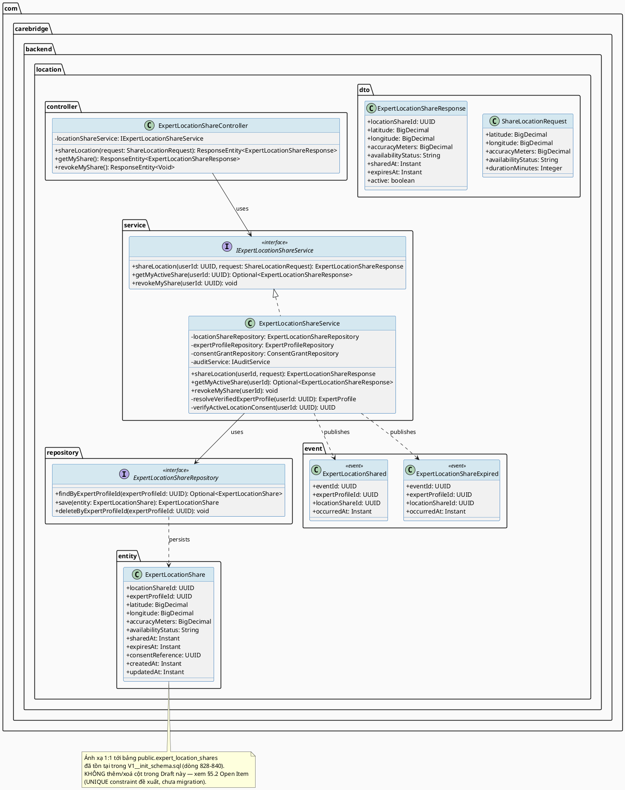
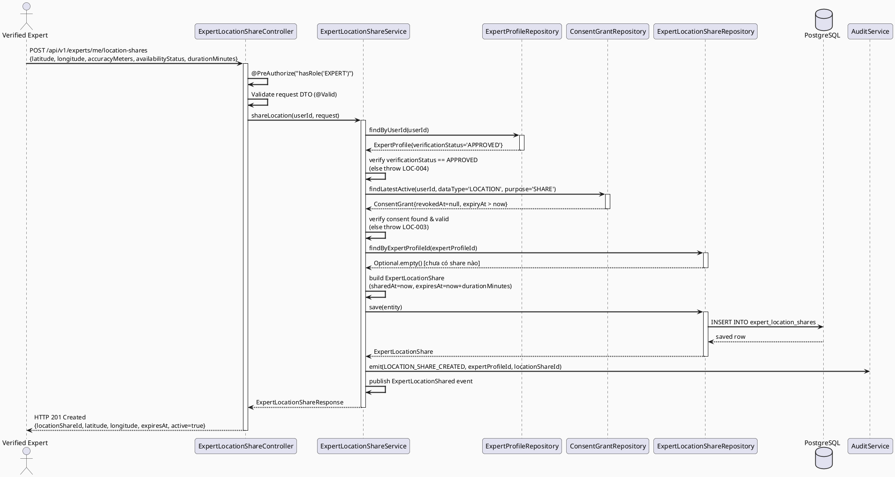
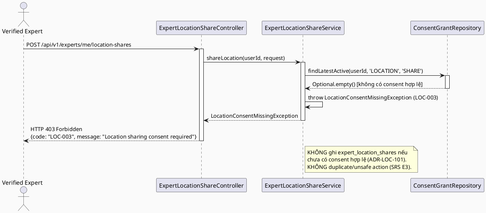
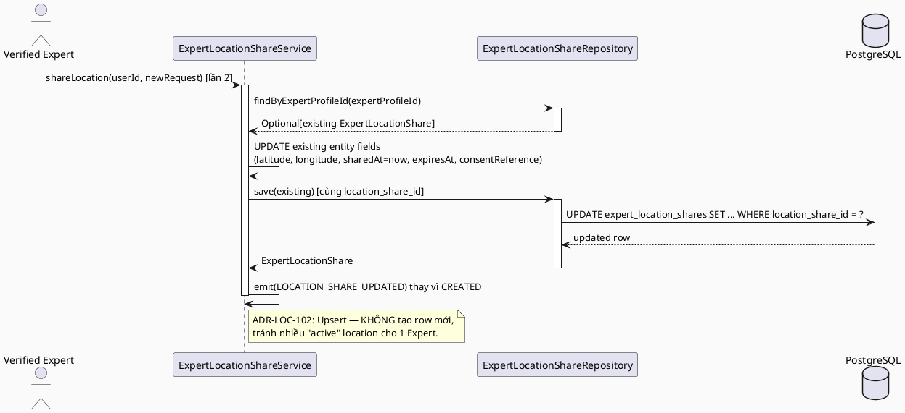
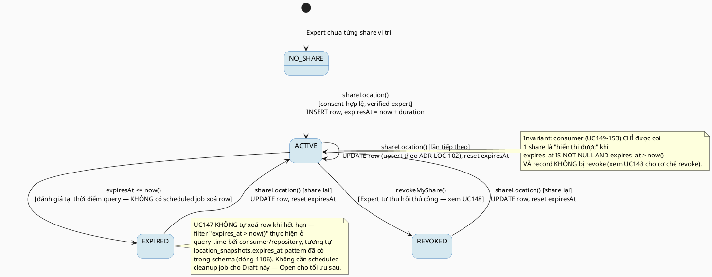

# ENGINEERING DOCUMENTATION STANDARD (EDS) v2.0
# UC147 — Share Expert Location

| Field | Value |
|-------|-------|
| **Document ID** | `CB-LOC-IMP-147` |
| **Version** | `1.0` |
| **Date** | `2026-07-02` |
| **Status** | `Draft` |
| **Document Owner** | `TV4 - Lâm` |
| **Author** | `AI Agent — Tech Lead` |
| **Reviewed by** | `[ ] Pending` |
| **DPO Sign-off** | `[ ] Pending` *(module lưu trữ toạ độ chính xác của Expert — Location PII, xem §16)* |
| **Approved by** | `[ ] Pending` |
| **Last Review** | `2026-07-02` |
| **Based on EDS** | `v2.0` |

---

## CHANGELOG

| Ngày | Người thực hiện | Nội dung thay đổi |
|------|-----------------|-------------------|
| 2026-07-02 | AI Agent — Tech Lead | Tạo tài liệu lần đầu — TDS cho write-side owner của `expert_location_shares` |

---

## MỤC LỤC

1. [Tổng quan Module](#1-tổng-quan-module)
2. [Ma trận Truy vết (Traceability Matrix)](#2-ma-trận-truy-vết-traceability-matrix)
3. [Architecture Decision Records (ADR)](#3-architecture-decision-records-adr)
4. [Non-Functional Requirements & SLA](#4-non-functional-requirements--sla)
5. [Static Modeling (Mô hình Tĩnh)](#5-static-modeling-mô-hình-tĩnh)
6. [Dynamic Modeling (Mô hình Động)](#6-dynamic-modeling-mô-hình-động)
7. [Domain Event Catalog](#7-domain-event-catalog)
8. [Interface Specification (Đặc tả Giao diện)](#8-interface-specification-đặc-tả-giao-diện)
9. [API Specification](#9-api-specification)
10. [Bảng mã lỗi (Error Codes)](#10-bảng-mã-lỗi-error-codes)
11. [Quy trình Triển khai (Step-by-Step)](#11-quy-trình-triển-khai-step-by-step)
12. [Rollback & Incident Runbook](#12-rollback--incident-runbook)
13. [Kịch bản Kiểm thử Chi tiết](#13-kịch-bản-kiểm-thử-chi-tiết)
14. [Phương pháp Xác minh](#14-phương-pháp-xác-minh)
15. [Mẫu thử thực tế (API Verification Samples)](#15-mẫu-thử-thực-tế-api-verification-samples)
16. [Bảng tổng hợp phân quyền (Authorization Matrix)](#16-bảng-tổng-hợp-phân-quyền-authorization-matrix)
17. [AI Prompt Constraints (CASE 2.0)](#17-ai-prompt-constraints-case-20)

---

## 1. Tổng quan Module

> **RG-1:** UC147 (SRS §3.3.6.1, dòng 3659-3676) — Primary Actor **Verified Expert**, Secondary Actor **TrackAsia Map Service**. Platform: **Expert App**. Priority: **Medium**. Mô tả gốc: *"Lets the expert voluntarily share current or approximate location in the TrackAsia map layer for a selected time period."* SRS dùng Normal Flow/Alternative/Exception **template chung** (giống mọi UC khác trong MF-19), không có business logic cụ thể riêng — TDS này phải suy luận behavior cụ thể từ (a) mô tả UC, (b) schema `expert_location_shares` đã tồn tại (chủ sở hữu chính thức bởi UC147 kể từ đây), và (c) generic BR-RBAC + safety/consent mandate của `CLAUDE.md`.

| Field | Value |
|-------|-------|
| **Module Name** | `Share Expert Location` |
| **Bounded Context** | `location` (package mới `com.carebridge.backend.location`, dưới ownership TV4-Lâm — "expert location visibility", theo `function-spec-task-allocation.md` dòng 24, 586-587, 740-741) |
| **Data Classification** | `Sensitive-PII` — toạ độ (`latitude`/`longitude`) là Location PII trực tiếp của một cá nhân định danh (Verified Expert) |
| **Compliance Scope** | `PDPA / Luật 91/2025` — location là 1 trong các `data_type` liệt kê tường minh trong `consent_grants.data_type` CHECK constraint (`'LOCATION'`, xem §3 ADR-LOC-101) |
| **Upstream Dependencies** | `UC129 IMapProviderService` (TrackAsia integration convention, KHÔNG bắt buộc gọi trực tiếp cho use case này — xem ADR-LOC-104 Open), `consent_grants` (bảng consent chung, sở hữu bởi TV1 — module `privacy`), `expert_profiles` (ownership resolution, sở hữu bởi TV4 — module `expert`) |
| **Downstream Consumers** | UC148 (Manage Location Visibility — cùng cặp, sửa đổi cùng record), UC149/UC153 (Find Nearby Available Experts / Nearby Discovery — đọc `expert_location_shares` để hiển thị expert gần đây), UC150-152 (View Nearby Support Requests / Navigate to Support Location — đọc gián tiếp qua expert vị trí hiện tại khi expert nhận support request) — **các UC này KHÔNG được TDS này chỉnh sửa, chỉ ghi nhận là contract consumer** |

---

## 2. Ma trận Truy vết (Traceability Matrix)

| Requirement ID | Loại (BR/ADR/US) | Mô tả yêu cầu | Thành phần Code | Compliance Target | ADR liên quan |
|----------------|------------------|---------------|-----------------|-------------------|---------------|
| SRS-3.3.6.1 (UC-147) | User Story | Verified Expert voluntarily shares current/approximate location trên TrackAsia map layer cho 1 khoảng thời gian được chọn | `ExpertLocationShareController.POST /api/v1/experts/me/location-shares`, `ExpertLocationShareService.shareLocation()` | — | ADR-LOC-101, ADR-LOC-102 |
| SRS-3.3.6.1 §Business Rules | Business Rule | BR-RBAC: chỉ actor có quyền hợp lệ (Verified Expert) mới truy cập chức năng | `@PreAuthorize("hasRole('EXPERT')")` + ownership check trong Service | BR-RBAC | ADR-LOC-105 |
| CLAUDE.md §Delivery Rules | Project Rule | "For health, location, ... workflows: enforce existing RBAC, consent scope/expiry, and audit requirements" | `ExpertLocationShareService` (consent + audit enforcement) | PDPA | ADR-LOC-101, ADR-LOC-103 |
| SRS-3.3.6.1 §Preconditions PRE-3 | Precondition | Actor phải là verified/authenticated Expert | `ExpertProfileRepository.findByUserId()` + `verification_status = 'APPROVED'` check | BR-RBAC | ADR-LOC-105 |
| SRS-3.3.6.1 §Exceptions E3 | Exception | External service/network/server failure xử lý bằng retry guidance, không có duplicate/unsafe action | `ExpertLocationShareService` (idempotent upsert semantics, xem ADR-LOC-102) | BR-SAFETY | ADR-LOC-102 |
| `expert_location_shares` schema (V1, dòng 828-840) | Data Contract | Bảng đã tồn tại — PK `location_share_id`, FK `expert_profile_id`, cột `latitude/longitude/accuracy_meters/availability_status/shared_at/expires_at/consent_reference/created_at/updated_at` | `ExpertLocationShare` entity | — | ADR-LOC-101 |
| `consent_grants.data_type` CHECK (dòng 178) | Data Contract | Enum đã có literal `'LOCATION'` — xác nhận consent mechanism tái sử dụng, KHÔNG tạo bảng consent mới | `ConsentGrant` entity (existing, module `privacy` — TV1 owner), `ExpertLocationShareService` (đọc, không ghi bảng này trực tiếp trừ khi chưa có active grant) | PDPA | ADR-LOC-101 |
| ADR-LOC-101 | Decision | `expert_location_shares.consent_reference` PHẢI trỏ đến 1 `consent_grants.id` có `data_type='LOCATION'`, `purpose='SHARE'`, chưa `revoked_at`, chưa hết hạn | `ExpertLocationShareService.shareLocation()` | PDPA | — |
| ADR-LOC-102 | Decision | Một Expert chỉ có tối đa 1 "active" location share tại một thời điểm — share mới **thay thế** (upsert) share cũ thay vì cộng dồn nhiều row active | `ExpertLocationShareService.shareLocation()`, `ExpertLocationShareRepository` | BR-SAFETY (idempotent) | — |
| ADR-LOC-103 | Decision | Mọi lần share/update/expire location đều ghi `audit_logs` — cần migration mở rộng `audit_logs_action_check` CHECK constraint (hiện KHÔNG có literal nào cho location sharing) | `AuditService`, migration mới | PDPA, CLAUDE.md audit mandate | — |
| ADR-LOC-104 | Decision | UC147 KHÔNG tự gọi `IMapProviderService`/TrackAsia trực tiếp — chỉ lưu toạ độ do client (Expert App, dùng device GPS) gửi lên; TrackAsia chỉ là **map layer hiển thị** ở phía consumer (UC149-153), KHÔNG phải geocoding provider cho hành động share này | `ExpertLocationShareService` (không inject `IMapProviderService`) | — | — |
| ADR-LOC-105 | Decision | Authorization: `@PreAuthorize("hasRole('EXPERT')")` + service-layer ownership check qua `expertProfileRepository.findByUserId(currentUserId)`, verification_status phải `APPROVED` | `ExpertLocationShareController`, `ExpertLocationShareService` | BR-RBAC | — |

> **Open (RG-2):** SRS §3.3.6.1 không có Business Rule cụ thể nào khác ngoài BR-RBAC generic (không liệt kê BR-PRIVACY tường minh như UC152 có). TDS này áp dụng PDPA/consent theo mandate của `CLAUDE.md` ("For health, location, payment, expert, moderation, and safety workflows: enforce existing RBAC, consent scope/expiry, and audit requirements") — đây là suy luận có căn cứ từ project rule, KHÔNG phải bịa thêm business rule không có nguồn. Đánh dấu **Open** để Product Owner/TV4-Lâm xác nhận scope chính xác của "consent" cho use case tự nguyện chia sẻ vị trí của chính Expert (self-consent vs. yêu cầu consent từ actor khác — ở đây Expert là data subject của chính họ, tự thực hiện hành động, nên "consent_reference" đóng vai trò ghi nhận **self-declared consent**, không phải consent xin từ actor thứ 3).

---

## 3. Architecture Decision Records (ADR)

### ADR-LOC-101 — Consent Mechanism: tái sử dụng `consent_grants` (data_type = 'LOCATION')

| Field | Value |
|-------|-------|
| **Status** | `Proposed` |
| **Deciders** | `AI Agent — Tech Lead` (chờ TV4-Lâm confirm) |
| **Date** | `2026-07-02` |
| **Supersedes** | `—` |

#### Bối cảnh (Context)
RG-4 yêu cầu xác minh: `expert_location_shares.consent_reference` (uuid, nullable, không có FK constraint tường minh trong V1 — xem §5.2) có nên trỏ đến bảng `consent_grants` chung hay không. Kiểm tra `consent_grants` CHECK constraint (`consent_grants_data_type_check`, dòng 178 `V1__init_schema.sql`) xác nhận enum đã có sẵn: `'HEALTH_RECORD', 'LOCATION', 'FAMILY_DATA', 'COMMUNITY_POST', 'SENSITIVE_DATA', 'RAG_CONTEXT', 'EXPERT_SHARED_DATA'`. Literal `'LOCATION'` đã tồn tại — không cần tạo consent mechanism mới.

#### Các phương án đã xem xét (Options Considered)

| Phương án | Mô tả | Ưu điểm | Nhược điểm |
|-----------|-------|----------|------------|
| A | Tạo bảng consent riêng cho `expert_location_shares` (vd: `expert_location_consents`) | Tách biệt hoàn toàn, không phụ thuộc bảng chung | Vi phạm CLAUDE.md ("Do not introduce ... new infrastructure ... without approval"); trùng lặp với `consent_grants` đã có `'LOCATION'` type sẵn |
| B | Tái sử dụng `consent_grants` hiện có — `consent_reference` = `consent_grants.id` (bigint, không phải uuid — xem lưu ý type mismatch bên dưới) | Nhất quán với consent mechanism toàn hệ thống, không cần bảng mới, đã có `data_type='LOCATION'` sẵn | Cần xử lý type mismatch: `expert_location_shares.consent_reference` là `uuid`, còn `consent_grants.id` là `bigint` — không thể FK trực tiếp |

#### Quyết định (Decision)
Chọn **Phương án B có điều chỉnh**. `ExpertLocationShareService.shareLocation()` **PHẢI** xác minh tồn tại 1 `consent_grants` record hợp lệ (`data_type='LOCATION'`, `purpose='SHARE'`, `user_id = <expert's user_id>`, `revoked_at IS NULL`, `expiry_at > now()`) **TRƯỚC KHI** ghi/update `expert_location_shares`. Vì `expert_location_shares.consent_reference` là kiểu `uuid` còn `consent_grants.id` là `bigint` (identity sequence) — **type mismatch xác nhận qua schema thực tế**, KHÔNG thể lưu trực tiếp `consent_grants.id` vào cột `consent_reference` hiện có.

**Xử lý type mismatch (Open Item — cần xác nhận):** Đề xuất `consent_reference` lưu một **UUID định danh nghiệp vụ ổn định** sinh ra tại thời điểm consent được xác nhận trong request (không phải PK của `consent_grants`) — cụ thể là **`gen_random_uuid()` do service tự sinh và lưu cùng lúc**, đóng vai trò "audit correlation id", trong khi liên kết THỰC SỰ tới `consent_grants` được truy vấn tại runtime bằng cặp `(user_id, data_type='LOCATION', purpose='SHARE')` chứ không qua FK cứng. **Đây là giải pháp tạm thời do giới hạn kiểu dữ liệu đã tồn tại trong V1 — ghi nhận Open, cần Product Owner/DPO xác nhận có chấp nhận được không, hoặc có cần migration đổi `consent_grants.id` sang `uuid`/thêm cột `consent_uuid` cho tương thích (NGOÀI PHẠM VI UC147, ảnh hưởng bảng chung do TV1 sở hữu — không tự sửa ở đây).**

#### Hệ quả (Consequences)

**Tích cực:** Không tạo consent mechanism trùng lặp; tận dụng `consent_grants` đã được TV1 thiết kế cho toàn hệ thống.

**Tiêu cực / Trade-offs:** `consent_reference` không phải FK cứng tới `consent_grants.id` do type mismatch (uuid vs bigint) — verification phải thực hiện bằng query theo `(user_id, data_type, purpose)` thay vì JOIN trực tiếp. Rủi ro: nếu Expert có nhiều `consent_grants` LOCATION/SHARE records (vd: sau khi revoke rồi consent lại), cần lấy **bản ghi mới nhất chưa revoked, chưa hết hạn** (`ORDER BY consent_given_at DESC LIMIT 1`).

**Compliance Impact:** Đảm bảo tuân thủ PDPA — không lưu toạ độ nếu không có consent LOCATION/SHARE hợp lệ.

---

### ADR-LOC-102 — Upsert Semantics: một Expert chỉ có 1 active location share

| Field | Value |
|-------|-------|
| **Status** | `Proposed` |
| **Deciders** | `AI Agent — Tech Lead` |
| **Date** | `2026-07-02` |
| **Supersedes** | `—` |

#### Bối cảnh (Context)
SRS Exception E3 yêu cầu: "External service, network, or server failure is handled with retry guidance and **no duplicate unsafe action**." Nếu Expert gọi share location nhiều lần (retry sau timeout, hoặc mở lại app), hệ thống không nên tạo nhiều row `expert_location_shares` "active" cùng lúc — dễ gây nhầm lẫn cho consumer (UC149-153) khi query "vị trí hiện tại của Expert X" trả về nhiều kết quả mâu thuẫn.

#### Các phương án đã xem xét (Options Considered)

| Phương án | Mô tả | Ưu điểm | Nhược điểm |
|-----------|-------|----------|------------|
| A | Append-only — mỗi lần share tạo 1 row mới, consumer tự query "row mới nhất chưa expired" | Giữ lịch sử đầy đủ (audit trail vị trí theo thời gian) | Không có unique constraint hỗ trợ — bảng V1 không có index nào ngoài PK; query "mới nhất" cần `ORDER BY shared_at DESC LIMIT 1`, hiệu năng kém nếu Expert share nhiều lần; rủi ro data bloat vì vị trí Expert được cập nhật thường xuyên |
| B | Upsert — 1 Expert có tối đa 1 row `expert_location_shares` "active" (chưa `expires_at` hoặc `expires_at > now()`); share mới **UPDATE** row cũ thay vì INSERT row mới | Đơn giản hoá query cho consumer ("SELECT ... WHERE expert_profile_id = X" luôn trả 0-1 row đại diện vị trí hiện tại), tránh trùng lặp/mâu thuẫn dữ liệu, khớp mô tả SRS "current or approximate location" (số ít, không phải lịch sử) | Mất lịch sử vị trí cũ (không cần thiết cho use case này — SRS không yêu cầu lịch sử) |

#### Quyết định (Decision)
Chọn **Phương án B**. `ExpertLocationShareService.shareLocation()`: tìm row `expert_location_shares` hiện có theo `expert_profile_id` (không phân biệt còn hạn hay không); nếu tồn tại → **UPDATE** (`latitude, longitude, accuracy_meters, availability_status, shared_at=now(), expires_at, consent_reference, updated_at=now()`); nếu chưa tồn tại → **INSERT** row mới. Vì V1 schema không có UNIQUE constraint trên `expert_profile_id`, upsert được thực hiện ở **application layer** (`findByExpertProfileId()` rồi quyết định insert/update trong cùng transaction), KHÔNG dùng `ON CONFLICT` SQL-level (không có unique index để conflict vào).

> **Open Item:** Đề xuất thêm `UNIQUE (expert_profile_id)` constraint qua migration mới để bảo đảm invariant "1 active share/expert" ở tầng DB (tránh race condition giữa 2 request đồng thời). Đây là **migration bổ sung tối thiểu** (không đổi cấu trúc cột hiện có) — xem §5.2, §11.2. Cần Product Owner/TV4-Lâm xác nhận trước khi Approve, vì đây là thay đổi schema (dù nhỏ) so với V1 baseline.

#### Hệ quả (Consequences)

**Tích cực:** Consumer luôn nhận được đúng 1 vị trí hiện tại/gần nhất cho mỗi Expert; tránh duplicate/unsafe action theo SRS E3.

**Tiêu cực / Trade-offs:** Mất lịch sử vị trí (không phải yêu cầu của use case này). Cần thêm UNIQUE constraint (migration nhỏ) để tránh race condition — Open Item.

**Compliance Impact:** Giảm thiểu lưu trữ dữ liệu không cần thiết (PDPA minimum necessary/storage limitation) — chỉ giữ vị trí hiện tại, không tích luỹ lịch sử vị trí nhạy cảm.

---

### ADR-LOC-103 — Audit: mở rộng `audit_logs.action` CHECK constraint

| Field | Value |
|-------|-------|
| **Status** | `Proposed` |
| **Deciders** | `AI Agent — Tech Lead` |
| **Date** | `2026-07-02` |
| **Supersedes** | `—` |

#### Bối cảnh (Context)
`CLAUDE.md` yêu cầu: "For health, location, payment, expert, moderation, and safety workflows: enforce existing RBAC, consent scope/expiry, and **audit requirements**." Kiểm tra `audit_logs` (V1, dòng 31-42): cột `action` có CHECK constraint đóng (closed enum) với các literal: `'LOGIN', 'LOGOUT', 'OTP_SENT', 'OTP_VERIFIED', 'CONSENT_GRANTED', 'CONSENT_REVOKED', 'CREATE_HEALTH_RECORD', 'VIEW_HEALTH_RECORD', 'EXPERT_VERIFICATION', 'MODERATION_ACTION', 'AI_TRIAGE', 'PAYMENT', 'SECURITY_EVENT', 'VIEW_AUDIT_LOG'`. **KHÔNG có literal nào cho location-sharing action** — đây là gap thực sự (genuine gap), không phải giả định.

#### Các phương án đã xem xét (Options Considered)

| Phương án | Mô tả | Ưu điểm | Nhược điểm |
|-----------|-------|----------|------------|
| A | Tái sử dụng literal `'SECURITY_EVENT'` chung chung cho mọi audit event của UC147/148 | Không cần migration | `SECURITY_EVENT` mất ý nghĩa domain-specific — reviewer/DPO không phân biệt được đây là audit gì khi xem log |
| B | Thêm migration mới `ALTER TABLE audit_logs DROP CONSTRAINT audit_logs_action_check; ALTER TABLE audit_logs ADD CONSTRAINT ... CHECK (... thêm 'LOCATION_SHARE_CREATED', 'LOCATION_SHARE_UPDATED', 'LOCATION_SHARE_EXPIRED', 'LOCATION_VISIBILITY_UPDATED' ...)` | Audit log có domain-specific action rõ ràng, hỗ trợ DPO review chính xác | Cần migration ALTER constraint trên bảng chung `audit_logs` (sở hữu bởi TV1) — theo `function-spec-task-allocation.md`, thay đổi shared schema "should be a small PR reviewed by TV1" |

#### Quyết định (Decision)
Chọn **Phương án B**. Migration mới `V20260705140000__extend_audit_logs_action_for_location.sql` thêm 4 literal vào CHECK constraint: `'LOCATION_SHARE_CREATED'`, `'LOCATION_SHARE_UPDATED'`, `'LOCATION_SHARE_EXPIRED'`, `'LOCATION_VISIBILITY_UPDATED'`. Migration này **CHỈ** DROP + ADD lại constraint (không đổi dữ liệu hiện có, không đổi cột) — an toàn, không cần backfill. Theo quy tắc "small PR reviewed by TV1" (rebalance rules), migration này cần TV1 review trước khi merge dù về mặt kỹ thuật do TV4 tạo.

#### Hệ quả (Consequences)

**Tích cực:** Audit log domain-specific, dễ trace cho DPO/security review; không phá vỡ dữ liệu audit hiện có.

**Tiêu cực / Trade-offs:** Cần review chéo với TV1 (chủ sở hữu `audit_logs`) trước khi merge — có thể làm chậm timeline nếu TV1 không sẵn sàng review kịp.

**Compliance Impact:** Cải thiện khả năng audit cho Location PII — đáp ứng PDPA yêu cầu truy vết xử lý dữ liệu nhạy cảm.

> **Open Item:** Nếu TV1 không chấp nhận Phương án B, fallback là Phương án A (`SECURITY_EVENT` chung) — ghi nhận rõ trong `new_value_json`/`entity_type` để phân biệt. TDS này chọn B làm đề xuất chính nhưng đánh dấu **Open** vì migration đụng vào bảng ngoài package `location`.

---

### ADR-LOC-104 — Không gọi `IMapProviderService`/TrackAsia trực tiếp trong write-path

| Field | Value |
|-------|-------|
| **Status** | `Proposed` |
| **Deciders** | `AI Agent — Tech Lead` |
| **Date** | `2026-07-02` |
| **Supersedes** | `—` |

#### Bối cảnh (Context)
SRS liệt kê "TrackAsia Map Service" là Secondary Actor cho UC147. UC129 (`IMapProviderService`/`TrackAsiaMapClient`) đã formal hoá khả năng tính route/ETA/reverse-geocode dùng chung. Câu hỏi kiến trúc: UC147 (hành động Expert **share** vị trí — write action) có cần gọi TrackAsia API tại thời điểm share hay không?

#### Các phương án đã xem xét (Options Considered)

| Phương án | Mô tả | Ưu điểm | Nhược điểm |
|-----------|-------|----------|------------|
| A | UC147 gọi `IMapProviderService.reverseGeocode()` (từ UC129 §8.1/§8.2) ngay khi share để lưu kèm `formattedAddress` | UX tốt hơn (hiển thị địa chỉ text ngay) | Thêm external dependency + latency vào write path vốn cần nhanh/idempotent (ADR-MAP-102 timeout 3000ms); `expert_location_shares` schema KHÔNG có cột lưu formatted address — cần thêm cột mới (ngoài phạm vi Open) |
| B | UC147 CHỈ lưu toạ độ thô (`latitude`, `longitude`) do Expert App gửi lên (device GPS/map picker) — KHÔNG gọi TrackAsia ở write path; TrackAsia chỉ là **map rendering layer** phía consumer (UC149-153 hiển thị marker trên bản đồ) | Write path nhanh, không phụ thuộc external service (đúng tinh thần SRS E3 "no duplicate unsafe action" — action ghi vị trí không nên fail vì TrackAsia down), khớp với cách `expert_location_shares` schema hiện có (không có cột address) | Không có formatted address lưu sẵn — nếu consumer cần hiển thị text address, phải tự gọi `reverseGeocode()` (UC129, đã có sẵn contract) |

#### Quyết định (Decision)
Chọn **Phương án B**. `ExpertLocationShareService.shareLocation()` **KHÔNG** inject `IMapProviderService`. Toạ độ nhận trực tiếp từ request body (Expert App tự lấy từ device GPS hoặc bản đồ chọn thủ công cho "approximate location"). "TrackAsia Map Service" trong SRS đóng vai trò secondary actor ở tầng **hiển thị** (map layer trên UI của UC149-153), không phải dependency ghi dữ liệu của UC147.

#### Hệ quả (Consequences)

**Tích cực:** Write path đơn giản, nhanh, không phụ thuộc external service — nhất quán với ADR-MAP-105 (UC129 không tự enforce RBAC/side-effect, chỉ là facade tính toán khi CẦN).

**Tiêu cực / Trade-offs:** Không có formatted address lưu kèm — nếu tương lai cần, phải thêm cột + gọi `reverseGeocode()` riêng (Open, ngoài phạm vi hiện tại).

**Compliance Impact:** Giảm thiểu số lượng hệ thống xử lý toạ độ nhạy cảm (chỉ CareBridge backend lưu trực tiếp từ client, không qua TrackAsia ở bước ghi).

---

### ADR-LOC-105 — Authorization: `hasRole('EXPERT')` + ownership qua `findByUserId`

| Field | Value |
|-------|-------|
| **Status** | `Proposed` |
| **Deciders** | `AI Agent — Tech Lead` |
| **Date** | `2026-07-02` |
| **Supersedes** | `—` |

#### Bối cảnh (Context)
UC88 (`UpdateExpertProfile`, cùng domain TV4-Lâm) đã thiết lập pattern: `@PreAuthorize("hasRole('EXPERT')")` ở Controller + ownership re-check ở Service qua `expertProfileRepository.findByUserId(currentUserId)`. UC147 là "Expert quản lý resource của chính mình" — cùng bản chất pattern.

#### Quyết định (Decision)
`ExpertLocationShareController` áp dụng `@PreAuthorize("hasRole('EXPERT')")` trên mọi endpoint. `ExpertLocationShareService` **PHẢI** tự resolve `expert_profile_id` từ `SecurityContext` (`userId` trong JWT) qua `expertProfileRepository.findByUserId(userId)` — **KHÔNG** nhận `expertProfileId` như một field ghi được từ request body (client không được tự chọn share hộ Expert khác). Thêm điều kiện: `expertProfile.verificationStatus == 'APPROVED'` — chỉ Verified Expert (đúng SRS Primary Actor "Verified Expert", không phải mọi Expert) mới được share location.

#### Hệ quả (Consequences)

**Tích cực:** Nhất quán với pattern UC88 đã thiết lập; ngăn Expert chưa verified spam vị trí lên bản đồ nearby-expert (bảo vệ chất lượng dữ liệu cho UC149-153).

**Tiêu cực / Trade-offs:** Cần thêm 1 query `expertProfileRepository.findByUserId()` mỗi request — chi phí thấp, chấp nhận được.

**Compliance Impact:** Không có rủi ro mới — RBAC giảm surface area cho việc lạm dụng ghi vị trí giả mạo.

---

## 4. Non-Functional Requirements & SLA

### 4.1. Performance & Availability

| Category | Requirement | Target SLA | Measurement Method | Compliance Basis |
|----------|-------------|------------|---------------------|------------------|
| Latency | `POST /api/v1/experts/me/location-shares` (p99) | `< 500ms` *(Open — đề xuất mới, không có nguồn SRS cụ thể; write path không gọi external service theo ADR-LOC-104 nên latency thấp)* | k6 / JUnit timing assertion | ADR-LOC-104 |
| Availability | Uptime | `99.9%` *(kế thừa baseline chung dự án — Open, chưa có SLA riêng cho module location)* | Uptime monitor | — |
| Throughput | Concurrent share requests | `50 req/s` *(Open — đề xuất mới, ước lượng theo quy mô Expert pool nhỏ hơn Mother pool)* | Load test | — |

### 4.2. Data Integrity & Retention

| Category | Requirement | Target | Verification Method | Compliance Basis |
|----------|-------------|--------|---------------------|------------------|
| Auto-expiry | `expires_at` PHẢI được set khi share (không cho phép share vô thời hạn — "for a selected time period" theo SRS) | Scheduled job/query filter loại bỏ share đã `expires_at < now()` khỏi kết quả trả về consumer (xem §6.4 State Machine) | Integration test + scheduled job log | SRS-3.3.6.1 "selected time period" |
| Consent linkage | `consent_reference` PHẢI ứng với consent LOCATION/SHARE hợp lệ tại thời điểm ghi | 100% write có consent hợp lệ | Code review + integration test | PDPA, ADR-LOC-101 |
| Audit trail | Mọi share/update/expire ghi `audit_logs` | 100% coverage | DB query + log audit | ADR-LOC-103, CLAUDE.md |
| Storage minimization | 1 Expert = tối đa 1 row active (ADR-LOC-102) | 0 duplicate active rows/expert | Integration test | PDPA minimum necessary |

### 4.3. Security

| Category | Requirement | Target | Verification Method | Compliance Basis |
|----------|-------------|--------|---------------------|------------------|
| Encryption in transit | API endpoint | TLS 1.3+ | SSL Labs scan | PDPA |
| No PII in logs | KHÔNG log toạ độ đầy đủ ở mức INFO | Log audit | PDPA |
| Authorization | Chỉ Verified Expert được ghi/sửa vị trí của chính mình | 403 cho mọi request không đủ điều kiện | E2E role matrix test | BR-RBAC, ADR-LOC-105 |

### 4.4. Scalability & Capacity Planning

> Tải phụ thuộc số lượng Verified Expert đang active (quy mô nhỏ hơn nhiều so với Mother user base — theo UC129 §4.4 baseline chung). Upsert semantics (ADR-LOC-102) giữ kích thước bảng `expert_location_shares` ổn định theo số Expert, không tăng theo số lần share.

---

## 5. Static Modeling (Mô hình Tĩnh)

### 5.1. Class Diagram (PlantUML)



### 5.2. Data Structure (Flyway SQL Migration)

> **Bảng chính đã tồn tại — KHÔNG cần migration tạo bảng mới.** Xác nhận đọc đầy đủ `V1__init_schema.sql` dòng 828-840 (CREATE TABLE), dòng 1413-1414 (PK), dòng 1811-1812 (FK). Không có migration nào sau V1 chỉnh sửa `expert_location_shares` (xác nhận qua tìm kiếm toàn bộ `05_Development/CareBridgeAPI/src/main/resources/db/migration/`).

**Cột hiện có của `expert_location_shares` (nguồn chính thức — dùng cho mọi UC downstream consumer UC148-153):**

```sql
-- Đã tồn tại trong V1__init_schema.sql (dòng 828-840)
CREATE TABLE public.expert_location_shares (
    location_share_id   uuid    NOT NULL DEFAULT gen_random_uuid(),  -- PK
    expert_profile_id   uuid    NOT NULL,                            -- FK -> expert_profiles.expert_profile_id
    latitude             numeric NOT NULL,
    longitude            numeric NOT NULL,
    accuracy_meters      numeric,                                    -- nullable — độ chính xác GPS (mét)
    availability_status  varchar(20),                                -- nullable — free-text status do Expert đặt (vd: 'AVAILABLE', 'BUSY')
    shared_at            timestamptz NOT NULL DEFAULT now(),
    expires_at           timestamptz,                                -- nullable trong schema, NHƯNG UC147 luôn set giá trị (xem ADR bên dưới)
    consent_reference    uuid,                                       -- nullable — xem ADR-LOC-101 (type mismatch với consent_grants.id bigint)
    created_at           timestamptz NOT NULL DEFAULT now(),
    updated_at           timestamptz NOT NULL DEFAULT now()
);
-- PK: expert_location_shares_pkey (location_share_id)
-- FK: expert_location_shares_expert_profile_id_fkey (expert_profile_id) REFERENCES expert_profiles(expert_profile_id)
-- KHÔNG có UNIQUE constraint, KHÔNG có index ngoài PK (xác nhận qua tìm kiếm toàn bộ V1 cho "expert_location_shares")
```

> **Migration mới #1 — Audit action enum (ADR-LOC-103, Open — cần TV1 review):**

```sql
-- File: V20260705140000__extend_audit_logs_action_for_location.sql
-- Mở rộng audit_logs.action CHECK constraint để hỗ trợ location-sharing audit events.
-- KHÔNG đổi dữ liệu hiện có, KHÔNG đổi cột — chỉ DROP + ADD lại CHECK constraint.

ALTER TABLE public.audit_logs DROP CONSTRAINT audit_logs_action_check;

ALTER TABLE public.audit_logs ADD CONSTRAINT audit_logs_action_check
    CHECK (((action)::text = ANY ((ARRAY[
        'LOGIN', 'LOGOUT', 'OTP_SENT', 'OTP_VERIFIED',
        'CONSENT_GRANTED', 'CONSENT_REVOKED',
        'CREATE_HEALTH_RECORD', 'VIEW_HEALTH_RECORD',
        'EXPERT_VERIFICATION', 'MODERATION_ACTION', 'AI_TRIAGE',
        'PAYMENT', 'SECURITY_EVENT', 'VIEW_AUDIT_LOG',
        'LOCATION_SHARE_CREATED', 'LOCATION_SHARE_UPDATED',
        'LOCATION_SHARE_EXPIRED', 'LOCATION_VISIBILITY_UPDATED'
    ]::character varying[])::text[])));
```

> **Migration mới #2 — UNIQUE constraint đề xuất (ADR-LOC-102, Open — cần Product Owner xác nhận):**

```sql
-- File: V20260705140100__add_unique_expert_location_shares_expert_profile.sql
-- Đề xuất — CHƯA áp dụng trong Draft này, chỉ ghi nhận Open Item.
-- Mục đích: enforce invariant "1 active location share / expert" ở tầng DB,
-- tránh race condition khi 2 request share đồng thời.

-- ALTER TABLE public.expert_location_shares
--     ADD CONSTRAINT uq_expert_location_shares_expert_profile_id UNIQUE (expert_profile_id);
```

> **Version tiếp theo khả dụng (theo hướng dẫn):** `V20260705140000` đã dùng cho migration #1; `V20260705140100` dự phòng cho migration #2 nếu được duyệt. Namespace tránh trùng các batch song song khác (090000/100000/110000/120000/130000/150000/160000 reserved).

---

## 6. Dynamic Modeling (Mô hình Động)

### 6.1. Sequence Diagram — Happy Path: Share Location (PlantUML)



### 6.2. Sequence Diagram — Error Path: No Valid Consent (PlantUML)



### 6.3. Sequence Diagram — Upsert khi đã có active share (PlantUML)



### 6.4. State Machine



> **⚠️ Invariant bất biến:** (1) KHÔNG ghi `expert_location_shares` nếu chưa xác minh consent LOCATION/SHARE hợp lệ. (2) KHÔNG bao giờ có > 1 row `expert_location_shares` active cho cùng `expert_profile_id` (ADR-LOC-102, application-layer enforced; DB-layer UNIQUE constraint là Open Item). (3) `expires_at` PHẢI luôn được set khi tạo/update qua UC147 (không cho phép "share vô thời hạn", dù cột schema cho phép NULL — validation ở tầng ứng dụng).

---

## 7. Domain Event Catalog

### 7.1. Events Published (Phát ra)

| Event Name | Trigger | Publisher | Subscriber(s) | Payload Schema | Async? |
|------------|---------|-----------|---------------|----------------|--------|
| `ExpertLocationShared` | Expert share vị trí lần đầu (INSERT) hoặc cập nhật (UPDATE) qua `shareLocation()` | `ExpertLocationShareService` | UC149/UC153 (Nearby Discovery — cache invalidation/refresh), UC150 (View Nearby Support Requests, nếu áp dụng) *(Open — sibling UC chưa xác nhận subscriber thực tế)* | `ExpertLocationShared.java` (§7.3) | Yes (Spring `ApplicationEventPublisher`, in-process — KHÔNG dùng message queue mới, theo CLAUDE.md "no new infrastructure") |
| `ExpertLocationShareExpired` | Consumer/scheduled check phát hiện `expires_at <= now()` cho 1 share trước đó active *(Open — hiện tại UC147 KHÔNG có scheduled job, event này được publish tại **read-time** khi `getMyActiveShare()`/consumer query phát hiện hết hạn, KHÔNG phải background job — xem §6.4)* | `ExpertLocationShareService` | UC149/UC153 (loại bỏ khỏi map hiển thị) | `ExpertLocationShareExpired.java` (§7.3) | Yes |

### 7.2. Events Consumed (Tiêu thụ)

_Không có — UC147 là write-side owner, không tiêu thụ event từ module khác trong phạm vi Draft này._

### 7.3. Payload Schema

```java
// ExpertLocationShared.java
// Package: com.carebridge.backend.location.event
public record ExpertLocationShared(
    UUID    eventId,          // UUID.randomUUID()
    String  eventType,        // "ExpertLocationShared"
    Instant occurredAt,       // Instant.now()
    String  version,          // "1.0"
    Payload payload,
    Metadata metadata
) {
    public record Payload(
        UUID       locationShareId,
        UUID       expertProfileId,
        BigDecimal latitude,
        BigDecimal longitude,
        Instant    expiresAt
    ) {}

    public record Metadata(
        UUID   correlationId,
        String causedBy   // userId của Expert
    ) {}
}

// ExpertLocationShareExpired.java
// Package: com.carebridge.backend.location.event
public record ExpertLocationShareExpired(
    UUID    eventId,
    String  eventType,        // "ExpertLocationShareExpired"
    Instant occurredAt,
    String  version,          // "1.0"
    Payload payload
) {
    public record Payload(
        UUID    locationShareId,
        UUID    expertProfileId,
        Instant expiredAt
    ) {}
}
```

---

## 8. Interface Specification (Đặc tả Giao diện)

### 8.1. Service Interface

```java
// ShareLocationRequest.java — Input DTO
// @version 1.0
public class ShareLocationRequest {
    @NotNull @DecimalMin("-90.0") @DecimalMax("90.0")
    private BigDecimal latitude;

    @NotNull @DecimalMin("-180.0") @DecimalMax("180.0")
    private BigDecimal longitude;

    @DecimalMin("0.0")
    private BigDecimal accuracyMeters;      // optional — độ chính xác GPS

    @Size(max = 20)
    private String availabilityStatus;      // optional — vd "AVAILABLE"/"BUSY", free-text theo schema hiện có (varchar(20), không có CHECK enum trong V1)

    @NotNull @Min(1) @Max(1440)
    private Integer durationMinutes;        // BẮT BUỘC — "for a selected time period" (SRS). Max 1440 = 24h (Open — giá trị đề xuất, chưa có nguồn BR)
    // getters / setters
}

// ExpertLocationShareResponse.java — Output DTO
public class ExpertLocationShareResponse {
    private UUID locationShareId;
    private BigDecimal latitude;
    private BigDecimal longitude;
    private BigDecimal accuracyMeters;
    private String availabilityStatus;
    private Instant sharedAt;
    private Instant expiresAt;
    private boolean active;    // computed: expiresAt != null && expiresAt.isAfter(Instant.now())
    // getters / setters
}

// IExpertLocationShareService.java — Service Contract
// @version 1.0
public interface IExpertLocationShareService {
    /**
     * Expert chia sẻ (hoặc cập nhật) vị trí hiện tại/xấp xỉ trong khoảng thời gian chỉ định.
     * Upsert semantics theo ADR-LOC-102 — 1 Expert chỉ có tối đa 1 active share.
     * @throws ExpertNotVerifiedException (LOC-004) nếu expert.verificationStatus != APPROVED
     * @throws LocationConsentMissingException (LOC-003) nếu không có consent LOCATION/SHARE hợp lệ
     */
    ExpertLocationShareResponse shareLocation(UUID userId, ShareLocationRequest request);

    /**
     * Trả về active share hiện tại của Expert đang đăng nhập (nếu có, chưa hết hạn, chưa revoke).
     */
    Optional<ExpertLocationShareResponse> getMyActiveShare(UUID userId);

    /**
     * Expert tự thu hồi (revoke) chia sẻ vị trí hiện tại — set expiresAt = now(), KHÔNG xoá row
     * (giữ audit trail). Idempotent — gọi khi không có active share không throw lỗi.
     */
    void revokeMyShare(UUID userId);
}
```

### 8.2. Repository Interface

```java
// ExpertLocationShareRepository.java
// @version 1.0
public interface ExpertLocationShareRepository extends JpaRepository<ExpertLocationShare, UUID> {

    Optional<ExpertLocationShare> findByExpertProfileId(UUID expertProfileId);

    // Không có xoá cứng (hard delete) trong phạm vi UC147 — revoke chỉ set expiresAt = now()
    // qua save(), không dùng deleteBy...
}
```

---

## 9. API Specification

### 9.1. Endpoints Table

| Method | Path | Auth Level | Required Roles | Rate Limit | Idempotent? |
|--------|------|------------|----------------|------------|-------------|
| `POST` | `/api/v1/experts/me/location-shares` | JWT Bearer | `EXPERT` (verified) | 30/min *(Open — đề xuất mới)* | Yes (upsert semantics, ADR-LOC-102) |
| `GET` | `/api/v1/experts/me/location-shares` | JWT Bearer | `EXPERT` | 60/min | Yes |
| `DELETE` | `/api/v1/experts/me/location-shares` | JWT Bearer | `EXPERT` | 30/min | Yes (revoke, idempotent) |

### 9.2. Request / Response Schemas

#### `POST /api/v1/experts/me/location-shares` — Share/Update location

**Request Body:**
```json
{
  "latitude": 10.7769,
  "longitude": 106.7009,
  "accuracyMeters": 15.5,
  "availabilityStatus": "AVAILABLE",
  "durationMinutes": 120
}
```

**Response — 201 Created (lần share đầu tiên):**
```json
{
  "locationShareId": "550e8400-e29b-41d4-a716-446655440000",
  "latitude": 10.7769,
  "longitude": 106.7009,
  "accuracyMeters": 15.5,
  "availabilityStatus": "AVAILABLE",
  "sharedAt": "2026-07-02T08:00:00.000Z",
  "expiresAt": "2026-07-02T10:00:00.000Z",
  "active": true
}
```

**Response — 200 OK (upsert — đã có share trước đó, xem ADR-LOC-102):**
```json
{
  "locationShareId": "550e8400-e29b-41d4-a716-446655440000",
  "latitude": 10.7780,
  "longitude": 106.7020,
  "accuracyMeters": 12.0,
  "availabilityStatus": "AVAILABLE",
  "sharedAt": "2026-07-02T09:00:00.000Z",
  "expiresAt": "2026-07-02T11:00:00.000Z",
  "active": true
}
```

**Response — 400 Bad Request (Validation Error):**
```json
{
  "error": {
    "code": "LOC-001",
    "message": "Validation failed",
    "details": [
      { "field": "latitude", "message": "latitude must be between -90 and 90" },
      { "field": "durationMinutes", "message": "durationMinutes is required" }
    ]
  }
}
```

**Response — 403 Forbidden (thiếu consent):**
```json
{
  "error": {
    "code": "LOC-003",
    "message": "Location sharing consent required before sharing location"
  }
}
```

**Response — 403 Forbidden (chưa verified):**
```json
{
  "error": {
    "code": "LOC-004",
    "message": "Only verified experts may share location"
  }
}
```

#### `GET /api/v1/experts/me/location-shares` — Xem share hiện tại

**Response — 200 OK:**
```json
{
  "locationShareId": "550e8400-e29b-41d4-a716-446655440000",
  "latitude": 10.7769,
  "longitude": 106.7009,
  "accuracyMeters": 15.5,
  "availabilityStatus": "AVAILABLE",
  "sharedAt": "2026-07-02T08:00:00.000Z",
  "expiresAt": "2026-07-02T10:00:00.000Z",
  "active": true
}
```

**Response — 404 Not Found (chưa từng share hoặc đã hết hạn):**
```json
{
  "error": {
    "code": "LOC-005",
    "message": "No active location share found"
  }
}
```

#### `DELETE /api/v1/experts/me/location-shares` — Thu hồi share

**Response — 204 No Content** (idempotent — không lỗi nếu không có active share)

---

## 10. Bảng mã lỗi (Error Codes)

| Code | HTTP Status | Message (EN) | Message (VI) | Trigger Condition |
|------|-------------|--------------|--------------|-------------------|
| `LOC-001` | 400 | Validation failed | Dữ liệu không hợp lệ | `latitude`/`longitude` ngoài range hợp lệ, `durationMinutes` thiếu/vượt max |
| `LOC-002` | 404 | Expert profile not found | Không tìm thấy hồ sơ Expert | `expertProfileRepository.findByUserId(userId)` trả rỗng — user không có expert profile |
| `LOC-003` | 403 | Location sharing consent required | Cần có sự đồng ý chia sẻ vị trí | Không tìm thấy `consent_grants` hợp lệ (`data_type='LOCATION'`, `purpose='SHARE'`, chưa revoke, chưa hết hạn) |
| `LOC-004` | 403 | Only verified experts may share location | Chỉ Expert đã xác minh mới được chia sẻ vị trí | `expertProfile.verificationStatus != 'APPROVED'` |
| `LOC-005` | 404 | No active location share found | Không có vị trí đang được chia sẻ | `GET`/`DELETE` khi Expert chưa share hoặc share đã hết hạn/bị revoke |
| `LOC-006` | 403 | Insufficient permissions | Không đủ quyền | Role khác `EXPERT` gọi endpoint |

---

## 11. Quy trình Triển khai (Step-by-Step)

### 11.1. Prerequisites

- [ ] ADR-LOC-101 → 105 được Accepted (hiện `Proposed`) — đặc biệt ADR-LOC-101 (type mismatch `consent_reference`) và ADR-LOC-103 (audit enum, cần TV1 review) cần xác nhận trước
- [ ] Xác nhận với TV1 (chủ sở hữu `audit_logs`) về migration mở rộng CHECK constraint (ADR-LOC-103)
- [ ] Xác nhận với Product Owner: giá trị `durationMinutes` max 1440 (24h) có phù hợp business không (Open, chưa có nguồn)

### 11.2. Pre-Migration Checklist

- [ ] Backup DB trước khi chạy `ALTER TABLE audit_logs DROP/ADD CONSTRAINT`
- [ ] Migration `V20260705140000` test trên staging trước
- [ ] Migration `V20260705140100` (UNIQUE constraint) — CHỈ áp dụng nếu Product Owner Approve Open Item ADR-LOC-102; nếu chưa approve, KHÔNG chạy migration này trong lần triển khai đầu

### 11.3. Implementation Steps

#### Chặng 1 — Tạo package `location`

```
com.carebridge.backend.location/
├── controller/
│   └── ExpertLocationShareController.java
├── service/
│   ├── IExpertLocationShareService.java
│   └── impl/ExpertLocationShareService.java
├── repository/
│   └── ExpertLocationShareRepository.java
├── entity/
│   └── ExpertLocationShare.java
├── dto/
│   ├── request/ShareLocationRequest.java
│   └── response/ExpertLocationShareResponse.java
├── event/
│   ├── ExpertLocationShared.java
│   └── ExpertLocationShareExpired.java
├── exception/
│   ├── ExpertNotVerifiedException.java
│   └── LocationConsentMissingException.java
└── mapper/
    └── ExpertLocationShareMapper.java
```

> **Lưu ý:** Package `location` là package MỚI cho project (chưa tồn tại — xác nhận qua glob search `05_Development/CareBridgeAPI/src/main/java`). Không trùng với package `expert` (đã có skeleton `.gitkeep` rỗng) hay `map` (chưa tồn tại, dành cho UC63/UC64/UC129).

#### Chặng 2 — Migration audit enum (ADR-LOC-103)

```sql
-- V20260705140000__extend_audit_logs_action_for_location.sql — xem §5.2 nội dung đầy đủ
```

#### Chặng 3 — Implement `ExpertLocationShareService` với consent + upsert logic

```java
// Chi tiết code thực tế viết ở implementation phase, không thuộc phạm vi TDS.
// Constraint bắt buộc: verifyActiveLocationConsent() PHẢI chạy TRƯỚC upsert (ADR-LOC-101).
```

### 11.4. Deployment Checklist

- [ ] `POST /location-shares` tạo row mới đúng khi Expert chưa từng share
- [ ] `POST /location-shares` UPDATE (không tạo row mới) khi Expert đã có active share (ADR-LOC-102)
- [ ] `POST /location-shares` trả 403 `LOC-003` khi chưa có consent LOCATION/SHARE
- [ ] `POST /location-shares` trả 403 `LOC-004` khi Expert chưa verified
- [ ] Audit log `LOCATION_SHARE_CREATED`/`LOCATION_SHARE_UPDATED` sinh đúng format

---

## 12. Rollback & Incident Runbook

### 12.1. Điều kiện kích hoạt Rollback

| Điều kiện | Ngưỡng | Người quyết định |
|-----------|--------|------------------|
| Location được ghi mà không có consent hợp lệ (vi phạm ADR-LOC-101) | Bất kỳ case nào phát hiện | Tech Lead + DPO |
| Duplicate active share cho 1 Expert (vi phạm ADR-LOC-102) | Bất kỳ case nào | Tech Lead |
| Migration `audit_logs` CHECK constraint gây lỗi ghi audit event khác (regression cho TV1's module) | Ngay khi phát hiện | Tech Lead + TV1 |

### 12.2. Rollback Procedure

```bash
# Rollback migration audit enum
psql -h $DB_HOST -U $DB_USER -d $DB_NAME \
  -c "ALTER TABLE public.audit_logs DROP CONSTRAINT audit_logs_action_check;"
psql -h $DB_HOST -U $DB_USER -d $DB_NAME \
  -c "ALTER TABLE public.audit_logs ADD CONSTRAINT audit_logs_action_check CHECK (((action)::text = ANY ((ARRAY['LOGIN','LOGOUT','OTP_SENT','OTP_VERIFIED','CONSENT_GRANTED','CONSENT_REVOKED','CREATE_HEALTH_RECORD','VIEW_HEALTH_RECORD','EXPERT_VERIFICATION','MODERATION_ACTION','AI_TRIAGE','PAYMENT','SECURITY_EVENT','VIEW_AUDIT_LOG']::character varying[])::text[])));"
psql -h $DB_HOST -U $DB_USER -d $DB_NAME \
  -c "DELETE FROM flyway_schema_history WHERE version = '20260705140000';"

# Revert code deploy
kubectl rollout undo deployment/carebridge-api
kubectl rollout status deployment/carebridge-api
```

### 12.3. Notification Protocol

| Thời điểm | Người nhận | Kênh | Template |
|-----------|------------|------|----------|
| Ngay khi phát hiện | On-call team | Slack `#incident` | "UC147 Share Expert Location incident: [mô tả]" |
| Trong 30 phút | DPO | Email | *(Bắt buộc nếu Location PII bị ảnh hưởng)* |

### 12.4. Post-Incident Review (PIR)

- **Timeline, Root Cause (5 Whys), Impact, Remediation, Prevention** — theo template chung.

---

## 13. Kịch bản Kiểm thử Chi tiết

> Chi tiết đầy đủ nằm trong `UC147_ShareExpertLocation_Test-Spec.md`.

| TDS Concern | Test-Spec Condition Ref |
|-------------|--------------------------|
| ADR-LOC-101 (consent verification trước khi ghi) | `TC-COND-001, 002` |
| ADR-LOC-102 (upsert semantics — 1 active share/expert) | `TC-COND-003, 004` |
| ADR-LOC-103 (audit log emission) | `TC-COND-005` |
| ADR-LOC-105 (authorization — verified expert only, ownership) | `TC-COND-006, 007` |
| Validation (lat/lng range, durationMinutes) | `TC-COND-008` |
| Expiry semantics (§6.4 state machine) | `TC-COND-009` |
| SRS E3 (no duplicate unsafe action on retry) | `TC-COND-010` |

---

## 14. Phương pháp Xác minh

### 14.1. Database Inspection

```sql
-- Verify record tồn tại sau khi share
SELECT location_share_id, expert_profile_id, latitude, longitude, expires_at, consent_reference
FROM public.expert_location_shares
WHERE expert_profile_id = '[uuid]';

-- Verify KHÔNG có > 1 active row cho 1 expert (ADR-LOC-102)
SELECT expert_profile_id, COUNT(*)
FROM public.expert_location_shares
WHERE expires_at > now()
GROUP BY expert_profile_id
HAVING COUNT(*) > 1;
-- Expected: 0 rows

-- Verify audit log ghi đúng action
SELECT action, entity_type, entity_id, actor_user_id
FROM public.audit_logs
WHERE action IN ('LOCATION_SHARE_CREATED', 'LOCATION_SHARE_UPDATED')
ORDER BY created_at DESC LIMIT 5;
```

### 14.2. Log / Audit Verification

```bash
kubectl logs -l app=carebridge-api | grep -i "location-shares" | grep -i "consent\|verified\|upsert"
# Verify KHÔNG log toạ độ đầy đủ ở mức INFO
kubectl logs -l app=carebridge-api | grep "location-shares" | grep -E "[0-9]{2}\.[0-9]{6,}"
# Expected: No high-precision coordinate leak at INFO level
```

### 14.3. Tool-based Verification

```bash
./mvnw test -Dtest=ExpertLocationShareServiceTest
./mvnw test -Dtest=ExpertLocationShareControllerTest
```

---

## 15. Mẫu thử thực tế (API Verification Samples)

### 15.1. Happy Path

```bash
curl -X POST https://[host]/api/v1/experts/me/location-shares \
  -H "Authorization: Bearer [EXPERT_JWT_TOKEN]" \
  -H "Content-Type: application/json" \
  -H "X-Correlation-Id: $(uuidgen)" \
  -d '{
    "latitude": 10.7769,
    "longitude": 106.7009,
    "accuracyMeters": 15.5,
    "availabilityStatus": "AVAILABLE",
    "durationMinutes": 120
  }'
```

**Expected Response (201):**
```json
{
  "locationShareId": "550e8400-e29b-41d4-a716-446655440000",
  "latitude": 10.7769,
  "longitude": 106.7009,
  "expiresAt": "2026-07-02T10:00:00.000Z",
  "active": true
}
```

### 15.2. Error Paths

```bash
# Thiếu consent LOCATION/SHARE → 403 LOC-003
curl -X POST https://[host]/api/v1/experts/me/location-shares \
  -H "Authorization: Bearer [EXPERT_JWT_TOKEN_NO_CONSENT]" \
  -H "Content-Type: application/json" \
  -d '{"latitude": 10.7769, "longitude": 106.7009, "durationMinutes": 60}'
```

**Expected Response (403):**
```json
{
  "error": { "code": "LOC-003", "message": "Location sharing consent required before sharing location" }
}
```

```bash
# Không có JWT → 401
curl -X GET https://[host]/api/v1/experts/me/location-shares
```

**Expected Response (401):**
```json
{ "error": { "code": "IAM-001", "message": "Authentication required" } }
```

---

## 16. Bảng tổng hợp phân quyền (Authorization Matrix)

| Endpoint | `GUEST` | `MOTHER` | `FAMILY` | `EXPERT` (unverified) | `EXPERT` (verified) | `SYSTEM_ADMIN` |
|----------|---------|----------|----------|------------------------|----------------------|----------------|
| `POST /api/v1/experts/me/location-shares` | ❌ | ❌ | ❌ | ❌ (403 LOC-004) | ✅ Own only | ❌ *(admin không thay mặt Expert share — ngoài phạm vi)* |
| `GET /api/v1/experts/me/location-shares` | ❌ | ❌ | ❌ | ✅ (xem chính mình, kể cả chưa verified) | ✅ Own only | ❌ |
| `DELETE /api/v1/experts/me/location-shares` | ❌ | ❌ | ❌ | ✅ (revoke chính mình) | ✅ Own only | ❌ |

**Chú thích:**
- ✅ = Được phép; ❌ = Bị từ chối (401/403); `Own` = Chỉ resource của chính Expert đăng nhập.
- **CASE 2.0 constraint:** KHÔNG endpoint nào cho phép 1 Expert đọc/ghi `expert_location_shares` của Expert khác qua module này — việc "xem vị trí Expert khác trên bản đồ" thuộc UC149/UC153 (đọc, minimum-necessary fields, ngoài phạm vi TDS này).

---

## 17. AI Prompt Constraints (CASE 2.0)

### 17.1 Constraint Summary Table

| # | Constraint | Source (ADR/BR) | Last Verified |
|---|-----------|-----------------|---------------|
| C1 | `shareLocation()` PHẢI verify có `consent_grants` hợp lệ (`data_type='LOCATION'`, `purpose='SHARE'`, chưa revoke, chưa hết hạn) TRƯỚC KHI ghi/update `expert_location_shares` — nếu không có, throw `LocationConsentMissingException` (LOC-003), KHÔNG ghi DB | `ADR-LOC-101` | `2026-07-02` |
| C2 | `shareLocation()` PHẢI dùng upsert semantics — tìm `findByExpertProfileId()` trước, UPDATE nếu tồn tại, INSERT nếu chưa — KHÔNG BAO GIỜ tạo > 1 row active cho cùng `expert_profile_id` | `ADR-LOC-102` | `2026-07-02` |
| C3 | `expertProfileId` PHẢI được resolve từ `SecurityContext`/JWT `userId` qua `expertProfileRepository.findByUserId()` — KHÔNG BAO GIỜ nhận `expertProfileId` như field ghi được từ request body | `ADR-LOC-105`, BR-RBAC | `2026-07-02` |
| C4 | Chỉ Expert có `verificationStatus == 'APPROVED'` mới được `shareLocation()` — else throw `ExpertNotVerifiedException` (LOC-004) | `ADR-LOC-105`, SRS-3.3.6.1 (Primary Actor "Verified Expert") | `2026-07-02` |
| C5 | Mọi lần share/update/revoke PHẢI ghi `audit_logs` với action thuộc `LOCATION_SHARE_CREATED`/`LOCATION_SHARE_UPDATED`/`LOCATION_SHARE_EXPIRED` (cần migration §5.2 chạy trước) | `ADR-LOC-103`, CLAUDE.md | `2026-07-02` |
| C6 | `ExpertLocationShareService` KHÔNG inject `IMapProviderService`/`TrackAsiaMapClient` — chỉ lưu toạ độ nhận từ request body | `ADR-LOC-104` | `2026-07-02` |

### 17.2 Constraint Injection Block (Copy-Paste vào AI Prompt)

```
[CONSTRAINT BLOCK — Module: Share Expert Location — CB-LOC-IMP-147]
Theo TDS CB-LOC-IMP-147 và các ADR liên quan:

1. shareLocation() PHẢI verify consent_grants hợp lệ (data_type='LOCATION', purpose='SHARE',
   chưa revoke, chưa hết hạn) TRƯỚC KHI ghi expert_location_shares — nếu thiếu, throw
   LocationConsentMissingException (LOC-003), KHÔNG ghi DB (ADR-LOC-101)
2. Upsert semantics BẮT BUỘC — findByExpertProfileId() trước, UPDATE nếu có, INSERT nếu chưa —
   KHÔNG BAO GIỜ > 1 row active/expert (ADR-LOC-102)
3. expertProfileId PHẢI resolve từ SecurityContext qua findByUserId(userId) — KHÔNG nhận từ
   request body (ADR-LOC-105, BR-RBAC)
4. Chỉ Expert verificationStatus == 'APPROVED' được share — else ExpertNotVerifiedException
   (LOC-004) (ADR-LOC-105)
5. Mọi share/update/revoke PHẢI ghi audit_logs (ADR-LOC-103) — cần migration
   V20260705140000 chạy trước
6. KHÔNG inject IMapProviderService/TrackAsiaMapClient trong service này — chỉ lưu toạ độ
   client gửi lên (ADR-LOC-104)

[CONTEXT BLOCK]
- Bounded Context: location (package MỚI — com.carebridge.backend.location)
- Data Classification: Sensitive-PII (toạ độ Expert)
- Compliance: PDPA / Luật 91/2025
- Existing interfaces: §8 Service/Repository Interface
- Error codes: §10 Error Codes Table
- Auth matrix: §16 (EXPERT verified only, own resource)

[TASK BLOCK]
Implement ExpertLocationShareService.shareLocation()/getMyActiveShare()/revokeMyShare()
thỏa mãn constraints trên. Output phải tuân thủ §8 Interface Specification.
Tests phải cover §13 Test Scenarios (xem Test-Spec).
```

### 17.3 Constraint Quality Checklist

- [x] Mỗi constraint traceable về ADR hoặc BR cụ thể
- [x] Không có constraint generic
- [x] Mỗi constraint có `Last Verified` date ≤ 2 sprints
- [x] Constraint block có ≥ 3 constraints cụ thể (có 6)
- [x] Constraint block reference §8 Interface
- [x] Constraint block reference §16 Auth Matrix

### 17.4 Anti-Pattern Detection

| AP-ID | Anti-Pattern | Dấu hiệu | Hành động |
|-------|-------------|-----------|----------|
| AP-AI-001 | Unconstrained Gen | Code ghi `expert_location_shares` mà không check consent trước | Reject — enforce C1 |
| AP-AI-002 | Green-from-Birth | Test PASS ngay cả khi Service chỉ throw `UnsupportedOperationException` | Reject — rewrite theo Red Gate Protocol |
| AP-AI-003 | Implicit Decision | Code tạo row mới (INSERT) mỗi lần share thay vì upsert, không theo ADR-LOC-102 | Reject — enforce C2 |
| AP-AI-005 | Hallucinated Contract | Code nhận `expertProfileId` trực tiếp từ request body thay vì resolve từ SecurityContext | Reject — enforce C3 |
| AP-AI-006 | Duplicate Contract | Code tạo bảng consent riêng mới thay vì tái sử dụng `consent_grants` | Reject — enforce ADR-LOC-101 |

---

## PHỤ LỤC

### A. Glossary

| Thuật ngữ | Định nghĩa |
|-----------|------------|
| Upsert | Insert nếu chưa tồn tại, Update nếu đã tồn tại — dùng để đảm bảo invariant "1 active row" |
| Consent Grant | Bản ghi xác nhận actor đồng ý cho hệ thống xử lý 1 loại dữ liệu cho 1 mục đích cụ thể trong khoảng thời gian nhất định |
| Active Share | Row `expert_location_shares` có `expires_at > now()` và chưa bị revoke |
| Verified Expert | Expert có `expert_profiles.verification_status = 'APPROVED'` |

### B. Tài liệu tham chiếu

| Document | Link / Path |
|----------|-------------|
| SRS UC-147 | `02_Requirements/SRS/3_Functional_Specification.md §3.3.6.1` (dòng 3659-3678) |
| Task Allocation (TV4-Lâm ownership) | `04_Implement/implement_artifacts/function-spec-task-allocation.md` (dòng 24, 586-587, 740-741) |
| UC129 Calculate Distance/Route/ETA (map/location convention) | `04_Implement/UC129_CalculateDistanceRouteAndETA/UC129_CalculateDistanceRouteAndETA_TDS.md` |
| UC88 Update Expert Profile (auth ownership pattern) | `04_Implement/UC88_UpdateExpertProfile/UC88_UpdateExpertProfile_TDS.md` |
| DB Schema Source of Truth | `05_Development/CareBridgeAPI/src/main/resources/db/migration/V1__init_schema.sql` (dòng 828-840 `expert_location_shares`, dòng 164-180 `consent_grants`, dòng 31-42 `audit_logs`) |
| EDS v2.0 Template | `08_References/Template/PHASE-3_TDS.md` |
| CLAUDE.md — kiến trúc & delivery rules | `CLAUDE.md` (root) |

---

*EDS v2.0 — Draft. Chưa Approved. Open Items cần xác nhận trước khi chuyển Status sang `Approved`: (1) ADR-LOC-101 type mismatch `consent_reference` (uuid) vs `consent_grants.id` (bigint); (2) ADR-LOC-102 UNIQUE constraint migration; (3) ADR-LOC-103 audit enum migration cần TV1 review; (4) `durationMinutes` max value business confirmation; (5) RG-6 "approximate vs current" precision — schema KHÔNG có cột fuzzing/precision flag, coi là display-layer concern (UI làm tròn khi hiển thị "approximate"), KHÔNG lưu 2 giá trị riêng — cần Product Owner xác nhận đây có đủ hay cần thêm cột `precision_mode` mới (ngoài phạm vi Draft hiện tại).*
