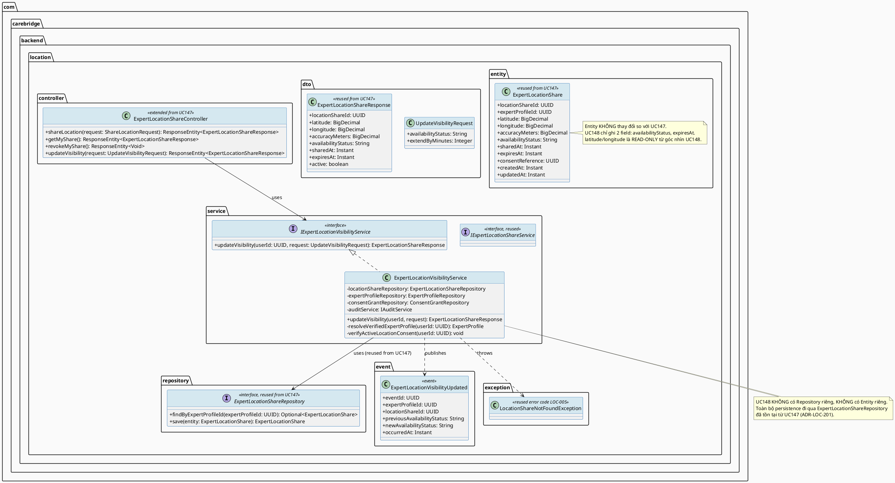
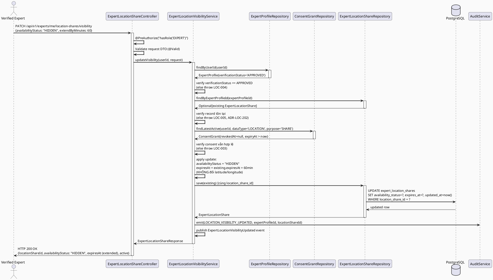
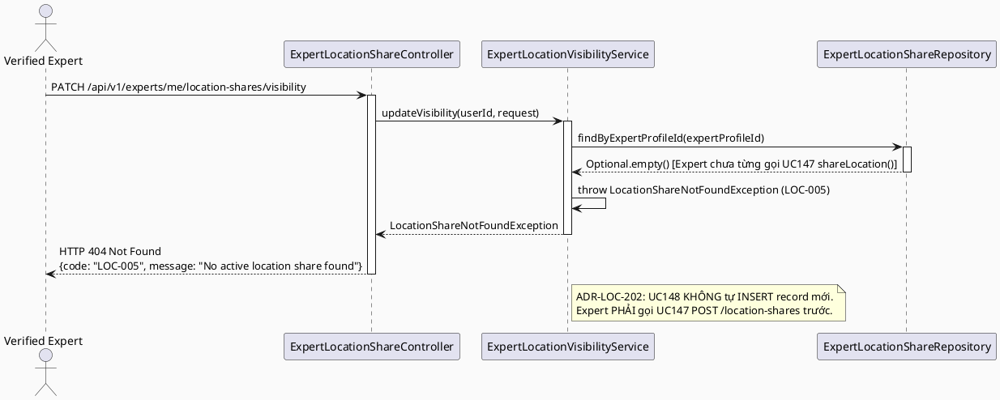
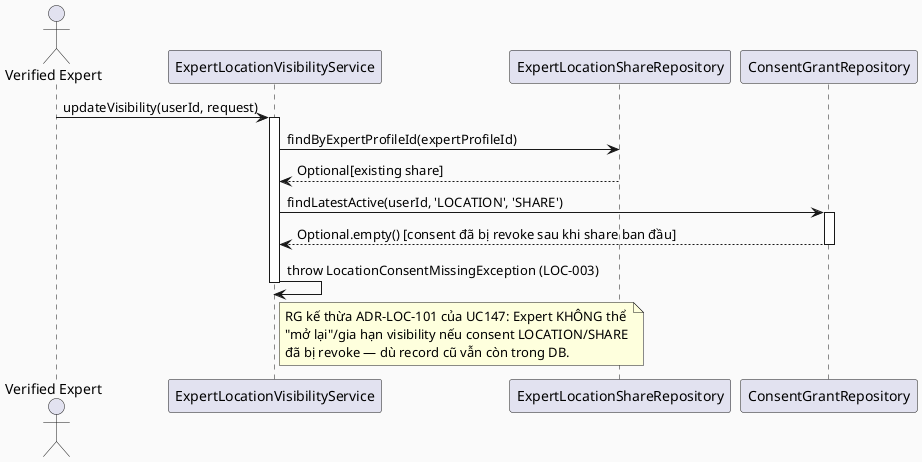
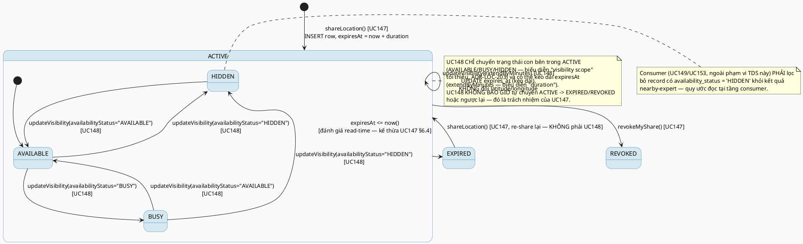

# ENGINEERING DOCUMENTATION STANDARD (EDS) v2.0
# UC148 — Manage Location Visibility

| Field | Value |
|-------|-------|
| **Document ID** | `CB-LOC-IMP-148` |
| **Version** | `1.0` |
| **Date** | `2026-07-02` |
| **Status** | `Draft` |
| **Document Owner** | `TV4 - Lâm` |
| **Author** | `AI Agent — Tech Lead` |
| **Reviewed by** | `[ ] Pending` |
| **DPO Sign-off** | `[ ] Pending` *(module sửa đổi visibility scope của toạ độ Expert — Location PII, xem §16)* |
| **Approved by** | `[ ] Pending` |
| **Last Review** | `2026-07-02` |
| **Based on EDS** | `v2.0` |

---

## CHANGELOG

| Ngày | Người thực hiện | Nội dung thay đổi |
|------|-----------------|-------------------|
| 2026-07-02 | AI Agent — Tech Lead | Tạo tài liệu lần đầu — TDS cho quản lý visibility scope/duration/display-condition của `expert_location_shares` (extend UC147's write-side ownership) |

---

## MỤC LỤC

1. [Tổng quan Module](#1-tổng-quan-module)
2. [Ma trận Truy vết (Traceability Matrix)](#2-ma-trận-truy-vết-traceability-matrix)
3. [Architecture Decision Records (ADR)](#3-architecture-decision-records-adr)
4. [Non-Functional Requirements & SLA](#4-non-functional-requirements--sla)
5. [Static Modeling (Mô hình Tĩnh)](#5-static-modeling-mô-hình-tĩnh)
6. [Dynamic Modeling (Mô hình Động)](#6-dynamic-modeling-mô-hình-động)
7. [Domain Event Catalog](#7-domain-event-catalog)
8. [Interface Specification (Đặc tả Giao diện)](#8-interface-specification-đặc-tả-giao-diện)
9. [API Specification](#9-api-specification)
10. [Bảng mã lỗi (Error Codes)](#10-bảng-mã-lỗi-error-codes)
11. [Quy trình Triển khai (Step-by-Step)](#11-quy-trình-triển-khai-step-by-step)
12. [Rollback & Incident Runbook](#12-rollback--incident-runbook)
13. [Kịch bản Kiểm thử Chi tiết](#13-kịch-bản-kiểm-thử-chi-tiết)
14. [Phương pháp Xác minh](#14-phương-pháp-xác-minh)
15. [Mẫu thử thực tế (API Verification Samples)](#15-mẫu-thử-thực-tế-api-verification-samples)
16. [Bảng tổng hợp phân quyền (Authorization Matrix)](#16-bảng-tổng-hợp-phân-quyền-authorization-matrix)
17. [AI Prompt Constraints (CASE 2.0)](#17-ai-prompt-constraints-case-20)

---

## 1. Tổng quan Module

> **RG-1:** UC148 (SRS §3.3.6.2, dòng 3680-3697) — Primary Actor **Verified Expert**, Secondary Actor **TrackAsia Map Service**. Platform: **Expert App**. Priority: **Medium**. Mô tả gốc: *"Manages location visibility scope, duration, and display conditions."* Giống UC147, SRS dùng Normal Flow/Alternative/Exception **template chung** (không có business logic cụ thể riêng) — TDS này suy luận behavior cụ thể từ (a) mô tả UC, (b) schema `expert_location_shares` (đã có write-side owner là UC147 — TDS này **không** tạo entity/table mới, chỉ mở rộng tập field ghi được), và (c) generic BR-RBAC + safety/consent mandate của `CLAUDE.md`.

| Field | Value |
|-------|-------|
| **Module Name** | `Manage Location Visibility` |
| **Bounded Context** | `location` (package `com.carebridge.backend.location` — **tái sử dụng package đã tồn tại từ UC147**, dưới ownership TV4-Lâm, theo `function-spec-task-allocation.md` dòng 24, 586-587, 740-741) |
| **Data Classification** | `Sensitive-PII` — sửa đổi visibility scope/duration/display conditions của toạ độ (`latitude`/`longitude`) Location PII trực tiếp của Verified Expert |
| **Compliance Scope** | `PDPA / Luật 91/2025` — cùng consent mechanism với UC147 (`consent_grants.data_type = 'LOCATION'`) |
| **Upstream Dependencies** | `UC147 ExpertLocationShareService`/`ExpertLocationShareRepository` (record chủ sở hữu bởi UC147 — UC148 **CHỈ update record đã tồn tại, KHÔNG tự INSERT**), `expert_profiles` (ownership resolution, TV4), `consent_grants` (TV1, đọc để re-verify consent còn hiệu lực trước khi update visibility) |
| **Downstream Consumers** | UC149/UC153 (Nearby Discovery — đọc `expert_location_shares` đã được UC148 cập nhật `availability_status`/`expires_at`/tương lai `visibility_scope`), UC150-152 (đọc gián tiếp qua expert vị trí hiện tại) — **các UC này KHÔNG được TDS này chỉnh sửa, chỉ ghi nhận là contract consumer, giống UC147 §1** |

---

## 2. Ma trận Truy vết (Traceability Matrix)

| Requirement ID | Loại (BR/ADR/US) | Mô tả yêu cầu | Thành phần Code | Compliance Target | ADR liên quan |
|----------------|------------------|---------------|-----------------|-------------------|---------------|
| SRS-3.3.6.2 (UC-148) | User Story | Verified Expert quản lý visibility scope, duration, và display conditions cho vị trí đã share | `ExpertLocationShareController.PATCH /api/v1/experts/me/location-shares/visibility`, `ExpertLocationVisibilityService.updateVisibility()` | — | ADR-LOC-201, ADR-LOC-202, ADR-LOC-203 |
| SRS-3.3.6.2 §Business Rules | Business Rule | BR-RBAC: chỉ actor có quyền hợp lệ (Verified Expert) mới truy cập chức năng | `@PreAuthorize("hasRole('EXPERT')")` + ownership check trong Service (tái sử dụng pattern ADR-LOC-105 của UC147) | BR-RBAC | ADR-LOC-105 (kế thừa từ UC147) |
| CLAUDE.md §Delivery Rules | Project Rule | "For health, location, ... workflows: enforce existing RBAC, consent scope/expiry, and audit requirements" | `ExpertLocationVisibilityService` (consent re-verify + audit enforcement) | PDPA | ADR-LOC-201, ADR-LOC-204 |
| SRS-3.3.6.2 §Preconditions PRE-4 | Precondition | "Required reference data exists when the use case ... updates ... an existing record" | Service throw `LOC-005` (No active location share found) nếu Expert chưa từng share (không có record để manage) | — | ADR-LOC-202 |
| `expert_location_shares` schema (V1, dòng 828-840) | Data Contract | Bảng đã tồn tại — cột `availability_status` (varchar(20)) và `expires_at` (timestamptz) là 2 cột ghi được duy nhất map trực tiếp tới "visibility scope"/"duration" hiện có trong schema | `ExpertLocationShare` entity (tái sử dụng entity của UC147, không tạo entity mới) | — | ADR-LOC-201 |
| RG-6 "display conditions" | Open Requirement | SRS không định nghĩa cụ thể "display conditions" là gì (giờ hành chính? bán kính km? role Mother/Family?) — schema V1 **không có cột nào** lưu điều kiện hiển thị dạng cấu trúc (business-hours, radius, role-filter) | *(không có thành phần code — xem ADR-LOC-203, đánh dấu Open)* | — | ADR-LOC-203 |
| ADR-LOC-201 | Decision | UC148 **KHÔNG tạo entity/table mới** — tái sử dụng 100% `ExpertLocationShare` entity của UC147; "manage visibility" = cập nhật `availability_status` (scope hiển thị dạng status) + `expires_at` (duration) trên record đã tồn tại | `ExpertLocationVisibilityService.updateVisibility()`, `ExpertLocationShareRepository.findByExpertProfileId()` (tái sử dụng từ UC147) | — | — |
| ADR-LOC-202 | Decision | UC148 chỉ **UPDATE** record đã tồn tại (không INSERT) — nếu Expert chưa từng gọi UC147 `shareLocation()`, UC148 trả lỗi `LOC-005`, không tự tạo record rỗng | `ExpertLocationVisibilityService.updateVisibility()` | BR-SAFETY | — |
| ADR-LOC-203 | Decision | "Display conditions" trong SRS mô tả **KHÔNG có cột schema tương ứng** — coi `availability_status` (free-text, đã có) là biểu diễn tối thiểu hiện tại cho "display condition" (vd: Expert set `'AVAILABLE'`/`'BUSY'`/`'HIDDEN'` để kiểm soát việc có hiển thị trên map layer hay không); mọi điều kiện phức tạp hơn (business hours, bán kính, role-based) là **Open**, cần Product Owner xác nhận + migration mới nếu approved | `ExpertLocationVisibilityService` (chỉ chấp nhận enum `availability_status` giới hạn) | — | — |
| ADR-LOC-204 | Decision | Mọi lần update visibility ghi `audit_logs` action `LOCATION_VISIBILITY_UPDATED` — literal này **đã được UC147's migration `V20260705140000` đăng ký sẵn** (xem ADR-LOC-103 của UC147 §5.2) — UC148 **tái sử dụng cùng migration**, không tạo migration audit mới | `AuditService` | PDPA, CLAUDE.md audit mandate | — (kế thừa ADR-LOC-103 của UC147) |
| ADR-LOC-205 | Decision | Authorization: tái sử dụng chính xác pattern `hasRole('EXPERT')` + ownership qua `findByUserId` từ ADR-LOC-105 của UC147 — Expert chỉ quản lý visibility của record của chính mình | `ExpertLocationShareController`, `ExpertLocationVisibilityService` | BR-RBAC | ADR-LOC-105 |

> **RG-3 (bắt buộc): Delineation UC147 vs UC148.** UC147 = **create/refresh** một location share (thiết lập toạ độ mới + thời hạn khi Expert bắt đầu chia sẻ, hoặc "heartbeat" lại vị trí). UC148 = **manage/update** visibility properties của một share **đã tồn tại**, KHÔNG đổi toạ độ (`latitude`/`longitude`) — chỉ đổi (1) `availability_status` (scope/display condition hiện có trong schema), (2) `expires_at` (kéo dài/rút ngắn duration mà KHÔNG cần gửi lại toạ độ GPS mới). Ranh giới cụ thể: nếu request có `latitude`/`longitude` → đó là UC147 (`POST .../location-shares`); nếu request CHỈ đổi `availabilityStatus`/`durationMinutes`/`extendByMinutes` mà KHÔNG có toạ độ → đó là UC148 (`PATCH .../location-shares/visibility`). Hai UC dùng chung 1 row `expert_location_shares` (1:1 theo Expert, theo ADR-LOC-102 của UC147), KHÔNG có bảng/entity riêng cho UC148 — đây là **complementary write paths trên cùng aggregate**, không phải duplicate.

> **Open (RG-2, kế thừa từ UC147 §2):** SRS §3.3.6.2 không có Business Rule cụ thể nào khác ngoài BR-RBAC generic — **không có BR-PRIVACY tường minh trong SRS text** (đã kiểm tra kỹ dòng 3680-3697, không tìm thấy literal "BR-PRIVACY" hay bất kỳ Business Rule ID nào khác ngoài BR-RBAC). Prompt yêu cầu xác minh "BR-RBAC (+ BR-PRIVACY — verify from SRS)" — kết quả xác minh: **BR-PRIVACY KHÔNG xuất hiện trong SRS §3.3.6.2**, chỉ có BR-RBAC. TDS này áp dụng PDPA/consent theo mandate của `CLAUDE.md` (tương tự UC147) như một suy luận có căn cứ, KHÔNG coi đây là "BR-PRIVACY" chính thức có nguồn SRS — đánh dấu **Open** để Product Owner/TV4-Lâm xác nhận.

---

## 3. Architecture Decision Records (ADR)

### ADR-LOC-201 — Không tạo entity/table mới: tái sử dụng `ExpertLocationShare` của UC147

| Field | Value |
|-------|-------|
| **Status** | `Proposed` |
| **Deciders** | `AI Agent — Tech Lead` (chờ TV4-Lâm confirm) |
| **Date** | `2026-07-02` |
| **Supersedes** | `—` |

#### Bối cảnh (Context)
SRS mô tả UC148 "Manages location visibility scope, duration, and display conditions" — đọc riêng lẻ, mô tả này *có thể* gợi ý một "visibility settings" resource riêng biệt (vd: bảng `expert_location_visibility_settings`). Tuy nhiên UC147's TDS (`CB-LOC-IMP-147`) đã xác lập rõ: UC147 là **write-side owner chính thức duy nhất** của `expert_location_shares` (xem UC147 §1 "Downstream Consumers": *"UC148 (Manage Location Visibility — cùng cặp, sửa đổi cùng record)"*). Việc UC148 tạo bảng/entity riêng sẽ vi phạm nguyên tắc "1 nguồn sự thật cho vị trí hiện tại của 1 Expert" (đã thiết lập ở ADR-LOC-102 của UC147) và tạo ra 2 write path độc lập cho cùng khái niệm nghiệp vụ ("vị trí Expert đang hiển thị công khai hay không"), dẫn đến rủi ro dữ liệu không đồng bộ (vd: `expert_location_shares.expires_at` nói còn hạn nhưng bảng visibility riêng nói đã ẩn).

#### Các phương án đã xem xét (Options Considered)

| Phương án | Mô tả | Ưu điểm | Nhược điểm |
|-----------|-------|----------|------------|
| A | Tạo bảng mới `expert_location_visibility_settings` (1-1 với `expert_location_shares`) chứa `visibility_scope`, `display_conditions_json`, v.v. | Tách biệt rõ "toạ độ" (UC147) khỏi "cấu hình hiển thị" (UC148); dễ mở rộng display conditions phức tạp sau này | Vi phạm CLAUDE.md ("Do not introduce ... new infrastructure ... without approval" — bảng mới cần approval); 2 write path cho cùng 1 khái niệm nghiệp vụ dễ desync; UC147 TDS đã tuyên bố rõ UC148 "sửa đổi cùng record", không phải record khác |
| B | UC148 chỉ update 2 cột đã có sẵn trên `expert_location_shares` (`availability_status`, `expires_at`) — không có entity/bảng mới | Nhất quán với tuyên bố của UC147 TDS; không cần migration tạo bảng; đơn giản, đúng tinh thần "smallest scoped change" (CLAUDE.md Delivery Rules) | Biểu diễn "display conditions" bị giới hạn ở mức free-text `availability_status` (varchar(20)) — không hỗ trợ điều kiện phức tạp (business hours, bán kính, role-filter) nếu Product Owner cần trong tương lai |

#### Quyết định (Decision)
Chọn **Phương án B**. `ExpertLocationVisibilityService.updateVisibility()` thao tác trực tiếp trên `ExpertLocationShareRepository` (entity/repository **đã tồn tại từ UC147**, không tạo class mới cho entity). UC148 thêm 1 **Service mới** (`ExpertLocationVisibilityService`, tách biệt khỏi `ExpertLocationShareService` của UC147 theo Single Responsibility — UC147 lo "share/create toạ độ mới", UC148 lo "manage visibility của share đã có") nhưng **cùng package `location`, cùng entity, cùng repository**.

#### Hệ quả (Consequences)

**Tích cực:** Không tạo bảng mới (0 migration tạo table); đảm bảo 1 nguồn sự thật; nhất quán với tuyên bố "downstream/cùng record" đã ghi trong UC147 TDS.

**Tiêu cực / Trade-offs:** "Display conditions" phức tạp (RG-6) không có chỗ lưu structured — giới hạn ở `availability_status` free-text. Đây là **Open Item** cần Product Owner xác nhận có chấp nhận được cho Sprint 3/4 hay cần schema mở rộng (ngoài phạm vi Draft).

**Compliance Impact:** Không tăng thêm bề mặt lưu trữ PII mới — giảm thiểu rủi ro theo PDPA minimum necessary.

---

### ADR-LOC-202 — UC148 chỉ UPDATE, không bao giờ INSERT

| Field | Value |
|-------|-------|
| **Status** | `Proposed` |
| **Deciders** | `AI Agent — Tech Lead` |
| **Date** | `2026-07-02` |
| **Supersedes** | `—` |

#### Bối cảnh (Context)
Vì UC148 tái sử dụng record của UC147 (ADR-LOC-201), câu hỏi kiến trúc: Nếu Expert gọi `PATCH .../location-shares/visibility` mà **chưa từng** gọi UC147's `POST .../location-shares` (chưa có record `expert_location_shares` nào), UC148 nên làm gì?

#### Các phương án đã xem xét (Options Considered)

| Phương án | Mô tả | Ưu điểm | Nhược điểm |
|-----------|-------|----------|------------|
| A | UC148 tự INSERT 1 record mới với toạ độ mặc định/null nếu chưa tồn tại | UX "tiện" hơn — Expert không cần gọi UC147 trước | Vi phạm invariant "toạ độ luôn do Expert App gửi qua GPS" (ADR-LOC-104 của UC147) — không có toạ độ hợp lệ để INSERT; PRE-4 của SRS ("Required reference data exists when ... updates ... an existing record") ngụ ý UC148 là thao tác **update-only** trên record đã tồn tại |
| B | UC148 throw lỗi `LOC-005` (No active location share found — tái sử dụng đúng error code đã định nghĩa trong UC147 §10) nếu chưa có record | Đúng tinh thần PRE-4 SRS; nhất quán với `GET`/`DELETE` endpoint hiện có của UC147 (đã dùng LOC-005 cho "not found"); không có invalid/incomplete record nào được tạo | Expert phải gọi UC147 share trước — UX yêu cầu 2 bước, nhưng đây là luồng hợp lý (share trước, manage visibility sau) |

#### Quyết định (Decision)
Chọn **Phương án B**. `ExpertLocationVisibilityService.updateVisibility()`: gọi `locationShareRepository.findByExpertProfileId(expertProfileId)`; nếu `Optional.empty()` → throw `LocationShareNotFoundException` (tái sử dụng mã lỗi `LOC-005`, HTTP 404, đã định nghĩa trong UC147 TDS §10 — **không tạo mã lỗi trùng lặp**); nếu tồn tại → UPDATE các field cho phép (§8.1).

#### Hệ quả (Consequences)

**Tích cực:** Không có record "rỗng"/không hợp lệ (thiếu toạ độ) được tạo ra; nhất quán với PRE-4 của SRS; tái sử dụng error code đã có, không phình bảng mã lỗi.

**Tiêu cực / Trade-offs:** Expert phải thực hiện UC147 trước UC148 — chấp nhận được vì đúng thứ tự nghiệp vụ tự nhiên (share trước, tinh chỉnh cách hiển thị sau).

**Compliance Impact:** Không có.

---

### ADR-LOC-203 — "Display Conditions": giới hạn ở `availability_status`, đánh dấu Open cho điều kiện phức tạp

| Field | Value |
|-------|-------|
| **Status** | `Proposed` |
| **Deciders** | `AI Agent — Tech Lead` |
| **Date** | `2026-07-02` |
| **Supersedes** | `—` |

#### Bối cảnh (Context)
**RG-6 (bắt buộc theo yêu cầu):** SRS §3.3.6.2 (dòng 3687) chỉ ghi "display conditions" không kèm định nghĩa cụ thể — không có bảng phụ, không có ví dụ, không có Business Rule liệt kê điều kiện gì (giờ hành chính? bán kính km giới hạn? chỉ hiển thị cho role Mother đã verified? chỉ hiển thị khi Expert đang trong ca trực?). Đã đọc toàn bộ khối UC148 (dòng 3682-3699) trong `3_Functional_Specification.md` — **xác nhận không có thông tin bổ sung nào khác** ngoài cụm từ chung "display conditions" trong Description. Route MF-19 "Location & Nearby Support" cũng không có phụ lục định nghĩa riêng cho khái niệm này trong phần đã đọc.

#### Các phương án đã xem xét (Options Considered)

| Phương án | Mô tả | Ưu điểm | Nhược điểm |
|-----------|-------|----------|------------|
| A | Tự suy đoán 1 hệ thống display-condition cụ thể (vd: business-hours JSON, radius_km column) và implement ngay | Có vẻ "đầy đủ tính năng" hơn theo mô tả SRS | Vi phạm CLAUDE.md ("Do not introduce ... new infrastructure ... without approval", "smallest scoped change") — bịa ra business rule không có nguồn; rủi ro cao là sai với ý định thật của Product Owner/HuyND (người viết SRS) |
| B | Ánh xạ "display conditions" vào cột **đã tồn tại** `availability_status` (free-text varchar(20), không có CHECK enum trong V1) — Expert set giá trị như `'AVAILABLE'`, `'BUSY'`, `'HIDDEN'` để kiểm soát việc hiển thị; đánh dấu **Open** rằng đây là interpretation tối thiểu, chưa phải "điều kiện" theo đúng nghĩa (thời gian/không gian/role-based filter) | Không bịa thêm cột/bảng; tận dụng schema hiện có; đúng nguyên tắc "verify from SRS, mark Open if underspecified rather than inventing a condition system" (yêu cầu RG-6 rõ ràng) | Không đáp ứng đầy đủ nghĩa "display conditions" nếu Product Owner thực sự muốn điều kiện phức tạp — cần xác nhận thêm |

#### Quyết định (Decision)
Chọn **Phương án B**. `ExpertLocationVisibilityService.updateVisibility()` cho phép Expert set `availabilityStatus` (một trong tập giá trị đề xuất ở tầng ứng dụng: `AVAILABLE` | `BUSY` | `HIDDEN` — **Open, đề xuất mới, KHÔNG có CHECK constraint DB tương ứng, KHÔNG có nguồn BR liệt kê chính xác các giá trị này**). `HIDDEN` đóng vai trò "display condition" tối thiểu: khi set `HIDDEN`, consumer (UC149/UC153, ngoài phạm vi TDS này) PHẢI lọc bỏ record khỏi kết quả nearby-expert (quy ước đọc, filter tại tầng consumer — UC148 không tự xoá record). Business-hours/radius/role-based display conditions **KHÔNG được implement trong Draft này** — ghi nhận **Open**, cần Product Owner/TV4-Lâm xác nhận trước khi mở rộng schema.

#### Hệ quả (Consequences)

**Tích cực:** Không bịa business rule; giao được 1 "visibility scope" tối thiểu nhưng hoạt động thật (`HIDDEN` filter); tuân thủ RG-6 yêu cầu explicit của prompt ("mark Open if underspecified").

**Tiêu cực / Trade-offs:** UC148 trong Draft này **không** thực sự implement "duration" theo nghĩa multi-window (vd: "chỉ hiển thị 8h-17h") hay "scope" theo nghĩa bán kính địa lý — chỉ có on/off + TTL đơn giản (kế thừa `expires_at` của UC147).

**Compliance Impact:** Giảm rủi ro over-engineering một consent/display model không có nguồn — an toàn hơn về mặt audit (không tạo cấu trúc dữ liệu PII mới không cần thiết).

> **Open Item (RG-6 — bắt buộc xác nhận trước Approve):** Nội dung "display conditions" trong SRS §3.3.6.2 là **underspecified** — TDS này KHÔNG bịa ra một hệ thống điều kiện hiển thị (business hours/radius/role-filter). Đề xuất tạm thời: dùng `availability_status ∈ {AVAILABLE, BUSY, HIDDEN}` làm biểu diễn tối thiểu. Cần Product Owner/HuyND (tác giả SRS gốc) xác nhận ý định thật của "display conditions" trước khi chuyển Status sang `Approved`.

---

### ADR-LOC-204 — Audit: tái sử dụng `LOCATION_VISIBILITY_UPDATED` (đã đăng ký bởi migration của UC147)

| Field | Value |
|-------|-------|
| **Status** | `Proposed` |
| **Deciders** | `AI Agent — Tech Lead` |
| **Date** | `2026-07-02` |
| **Supersedes** | `—` |

#### Bối cảnh (Context)
UC147's ADR-LOC-103 đã đề xuất migration `V20260705140000__extend_audit_logs_action_for_location.sql` mở rộng `audit_logs.action` CHECK constraint với 4 literal, bao gồm **`'LOCATION_VISIBILITY_UPDATED'`** — literal này được UC147 đặt tên sẵn cho chính use case UC148 (xem UC147 TDS §5.2 dòng migration, liệt kê rõ 4 giá trị). Do đó UC148 **không cần** migration audit riêng.

#### Các phương án đã xem xét (Options Considered)

| Phương án | Mô tả | Ưu điểm | Nhược điểm |
|-----------|-------|----------|------------|
| A | UC148 tạo migration audit riêng, thêm literal khác (vd: `'LOCATION_VISIBILITY_CHANGED'`) | Độc lập với UC147 | Trùng lặp mục đích với literal đã có sẵn `LOCATION_VISIBILITY_UPDATED`; 2 migration ALTER cùng 1 CHECK constraint trên bảng chung `audit_logs` (rủi ro race/conflict nếu cả 2 batch chạy song song) |
| B | UC148 tái sử dụng đúng literal `LOCATION_VISIBILITY_UPDATED` đã được UC147's migration `V20260705140000` đăng ký | Không migration trùng lặp; đúng tinh thần "reuse UC147's event, or note if genuinely new" (yêu cầu prompt); tên literal đã khớp chính xác ngữ nghĩa UC148 | Phụ thuộc cứng vào việc migration `V20260705140000` của UC147 được Approve và chạy trước — nếu UC147 bị reject/đổi tên literal, UC148 cũng bị ảnh hưởng (coupling giữa 2 UC, nhưng đây là coupling **hợp lý** vì cùng 1 bounded context/entity) |

#### Quyết định (Decision)
Chọn **Phương án B**. `ExpertLocationVisibilityService.updateVisibility()` gọi `auditService.emit(action="LOCATION_VISIBILITY_UPDATED", entityType="expert_location_shares", entityId=locationShareId, actorUserId=userId)` — **KHÔNG tạo migration audit mới**. Domain event tương ứng: `ExpertLocationVisibilityUpdated` (Java record mới, §7 — vì UC147 TDS **không** định nghĩa sẵn Java event class này, chỉ tên audit `action` string; UC147 chỉ có `ExpertLocationShared`/`ExpertLocationShareExpired` domain event, không có domain event cho "visibility updated" — đây là gap thực sự cần UC148 lấp, không phải trùng lặp).

#### Hệ quả (Consequences)

**Tích cực:** 0 migration mới trong UC148; nhất quán 100% với action literal UC147 đã chuẩn bị sẵn; giảm rủi ro CHECK constraint conflict.

**Tiêu cực / Trade-offs:** UC148's Prerequisites (§11.1) phụ thuộc cứng vào UC147's migration `V20260705140000` được deploy trước — ghi rõ trong Entry Criteria (Test-Spec §6).

**Compliance Impact:** Đảm bảo audit trail đầy đủ cho thay đổi visibility — đúng CLAUDE.md mandate.

---

### ADR-LOC-205 — Authorization: kế thừa nguyên vẹn `hasRole('EXPERT')` + ownership pattern của ADR-LOC-105

| Field | Value |
|-------|-------|
| **Status** | `Proposed` |
| **Deciders** | `AI Agent — Tech Lead` |
| **Date** | `2026-07-02` |
| **Supersedes** | `—` |

#### Bối cảnh (Context)
UC148 có cùng Primary Actor ("Verified Expert") và cùng resource ownership model như UC147. Không có lý do kiến trúc để dùng pattern khác.

#### Quyết định (Decision)
`ExpertLocationShareController` (endpoint mới `PATCH /visibility` thêm vào **cùng Controller đã tồn tại từ UC147**, không tạo Controller riêng — vì cùng resource `/api/v1/experts/me/location-shares`) áp dụng `@PreAuthorize("hasRole('EXPERT')")`. `ExpertLocationVisibilityService` PHẢI tự resolve `expert_profile_id` từ `SecurityContext` qua `expertProfileRepository.findByUserId(userId)` (tái sử dụng chính xác helper `resolveVerifiedExpertProfile()` đã có trong `ExpertLocationShareService` — đề xuất extract thành shared helper hoặc gọi chéo qua interface, xem §11.3). Điều kiện `verificationStatus == 'APPROVED'` áp dụng như UC147.

#### Hệ quả (Consequences)

**Tích cực:** 0 pattern mới cần học; nhất quán tuyệt đối với UC147.

**Tiêu cực / Trade-offs:** Không có.

**Compliance Impact:** Không có rủi ro mới.

---

## 4. Non-Functional Requirements & SLA

### 4.1. Performance & Availability

| Category | Requirement | Target SLA | Measurement Method | Compliance Basis |
|----------|-------------|------------|---------------------|------------------|
| Latency | `PATCH /api/v1/experts/me/location-shares/visibility` (p99) | `< 300ms` *(Open — đề xuất mới; write path không gọi external service, nhanh hơn UC147's 500ms vì không cần validate toạ độ đầy đủ)* | k6 / JUnit timing assertion | — |
| Availability | Uptime | `99.9%` *(kế thừa baseline UC147 §4.1 — Open)* | Uptime monitor | — |
| Throughput | Concurrent visibility-update requests | `30 req/s` *(Open — ước lượng thấp hơn UC147 vì tần suất đổi visibility thấp hơn tần suất share GPS)* | Load test | — |

### 4.2. Data Integrity & Retention

| Category | Requirement | Target | Verification Method | Compliance Basis |
|----------|-------------|--------|---------------------|------------------|
| Update-only invariant | UC148 KHÔNG BAO GIỜ tạo record mới (ADR-LOC-202) | 0 INSERT từ `ExpertLocationVisibilityService` | Code review + integration test | ADR-LOC-202 |
| Toạ độ bất biến | UC148 KHÔNG được sửa `latitude`/`longitude` (chỉ UC147 mới có quyền đó) | 0 test case nào cho phép UC148 thay đổi toạ độ | Integration test | RG-3 delineation |
| Consent linkage | Trước khi update visibility, PHẢI re-verify consent LOCATION/SHARE còn hiệu lực (không cho "mở lại" hiển thị nếu consent đã bị revoke) | 100% write có consent hợp lệ tại thời điểm update | Integration test | PDPA, ADR-LOC-101 (kế thừa từ UC147) |
| Audit trail | Mọi update visibility ghi `audit_logs` action `LOCATION_VISIBILITY_UPDATED` | 100% coverage | DB query + log audit | ADR-LOC-204 |

### 4.3. Security

| Category | Requirement | Target | Verification Method | Compliance Basis |
|----------|-------------|--------|---------------------|------------------|
| Encryption in transit | API endpoint | TLS 1.3+ | SSL Labs scan | PDPA |
| Authorization | Chỉ Verified Expert được sửa visibility của chính mình | 403 cho mọi request không đủ điều kiện | E2E role matrix test | BR-RBAC, ADR-LOC-205 |
| IDOR protection | `expertProfileId` không nhận từ request body | 100% resolve qua SecurityContext | Security test | ADR-LOC-205 (kế thừa C3 của UC147) |

### 4.4. Scalability & Capacity Planning

> Tải phụ thuộc số lượng Verified Expert active — cùng baseline với UC147 §4.4. Update-only semantics (ADR-LOC-202) đảm bảo UC148 không làm tăng kích thước bảng `expert_location_shares` (chỉ UPDATE, không INSERT).

---

## 5. Static Modeling (Mô hình Tĩnh)

### 5.1. Class Diagram (PlantUML)



### 5.2. Data Structure (Flyway SQL Migration)

> **KHÔNG cần migration mới cho schema chính.** UC148 tái sử dụng 100% cột đã tồn tại trong `expert_location_shares` (V1, dòng 828-840 — xác nhận đọc trực tiếp, giống UC147 §5.2). Xác nhận qua tìm kiếm toàn bộ `05_Development/CareBridgeAPI/src/main/resources/db/migration/`: không có migration nào (V1 → V20260629000002, cộng thêm V10) chỉnh sửa `expert_location_shares` hoặc `audit_logs` ngoài migration **được đề xuất bởi UC147** (`V20260705140000`, hiện vẫn ở trạng thái **Proposed/Open**, chưa phải file thật trên đĩa).

**Cột UC148 được phép ghi (subset của schema UC147 đã liệt kê đầy đủ ở CB-LOC-IMP-147 §5.2):**

```sql
-- Đã tồn tại trong V1__init_schema.sql (dòng 828-840) — không lặp lại toàn bộ CREATE TABLE,
-- xem CB-LOC-IMP-147 §5.2 cho định nghĩa đầy đủ. UC148 chỉ ghi 2 cột:
--   availability_status  varchar(20)   -- "visibility scope" tối thiểu (ADR-LOC-203)
--   expires_at            timestamptz   -- "duration" (kéo dài/rút ngắn qua extendByMinutes)
-- UC148 KHÔNG BAO GIỜ ghi: latitude, longitude, accuracy_meters (thuộc sở hữu UC147)
```

> **Migration audit — KHÔNG migration mới, tái sử dụng của UC147 (ADR-LOC-204):**

```sql
-- File: V20260705140000__extend_audit_logs_action_for_location.sql
-- (Sở hữu bởi UC147 — xem CB-LOC-IMP-147 §5.2 cho nội dung đầy đủ)
-- Literal 'LOCATION_VISIBILITY_UPDATED' ĐÃ được đăng ký sẵn trong migration này,
-- dành riêng cho UC148. UC148 KHÔNG tạo migration audit riêng.
```

> **Version tiếp theo khả dụng nếu UC148 cần migration trong tương lai (RG-6 display conditions mở rộng):** `V20260705141000` (theo hướng dẫn — sub-range trong batch `140000` của UC147, tăng `00100`). **KHÔNG dùng trong Draft này** vì không có genuine schema gap được xác nhận cho scope hiện tại (chỉ có Open Item RG-6 chưa được Product Owner confirm cần cột mới hay không).

---

## 6. Dynamic Modeling (Mô hình Động)

### 6.1. Sequence Diagram — Happy Path: Update Visibility (PlantUML)



### 6.2. Sequence Diagram — Error Path: No Existing Share (PlantUML)



### 6.3. Sequence Diagram — Error Path: Consent Revoked (PlantUML)



### 6.4. State Machine (mở rộng State Machine của UC147 §6.4)



> **⚠️ Invariant bất biến:** (1) UC148 KHÔNG BAO GIỜ ghi `latitude`/`longitude`/`accuracy_meters` — các field này chỉ thuộc quyền ghi của UC147 (RG-3 delineation). (2) UC148 KHÔNG BAO GIỜ tự INSERT record mới (ADR-LOC-202) — nếu chưa có record, throw `LOC-005`. (3) UC148 PHẢI re-verify consent LOCATION/SHARE còn hợp lệ trước mỗi lần update (không cho phép "mở lại" visibility nếu consent đã bị revoke).

---

## 7. Domain Event Catalog

### 7.1. Events Published (Phát ra)

| Event Name | Trigger | Publisher | Subscriber(s) | Payload Schema | Async? |
|------------|---------|-----------|---------------|----------------|--------|
| `ExpertLocationVisibilityUpdated` | Expert cập nhật `availabilityStatus`/`expiresAt` qua `updateVisibility()` — **event mới, UC147 KHÔNG định nghĩa sẵn class này** (chỉ chuẩn bị sẵn audit action string `LOCATION_VISIBILITY_UPDATED`, xem ADR-LOC-204) | `ExpertLocationVisibilityService` | UC149/UC153 (Nearby Discovery — refresh cache khi Expert set `HIDDEN`, loại khỏi map) *(Open — sibling UC chưa xác nhận subscriber thực tế, giống UC147 §7.1)* | `ExpertLocationVisibilityUpdated.java` (§7.3) | Yes (Spring `ApplicationEventPublisher`, in-process — nhất quán với UC147, KHÔNG dùng message queue mới) |

### 7.2. Events Consumed (Tiêu thụ)

_Không có — UC148 không tiêu thụ event từ module khác trong phạm vi Draft này._

### 7.3. Payload Schema

```java
// ExpertLocationVisibilityUpdated.java
// Package: com.carebridge.backend.location.event
public record ExpertLocationVisibilityUpdated(
    UUID    eventId,          // UUID.randomUUID()
    String  eventType,        // "ExpertLocationVisibilityUpdated"
    Instant occurredAt,       // Instant.now()
    String  version,          // "1.0"
    Payload payload,
    Metadata metadata
) {
    public record Payload(
        UUID   locationShareId,
        UUID   expertProfileId,
        String previousAvailabilityStatus,  // nullable — có thể null nếu chưa từng set trước đó
        String newAvailabilityStatus,
        Instant expiresAt                   // giá trị sau khi update (có thể đã extend)
    ) {}

    public record Metadata(
        UUID   correlationId,
        String causedBy   // userId của Expert
    ) {}
}
```

---

## 8. Interface Specification (Đặc tả Giao diện)

### 8.1. Service Interface

```java
// UpdateVisibilityRequest.java — Input DTO
// @version 1.0
public class UpdateVisibilityRequest {
    @Pattern(regexp = "AVAILABLE|BUSY|HIDDEN")
    private String availabilityStatus;      // optional — nếu null, giữ nguyên giá trị hiện có
                                             // (Open — 3 giá trị đề xuất mới, KHÔNG có nguồn BR
                                             // liệt kê chính xác, xem ADR-LOC-203)

    @Min(1) @Max(1440)
    private Integer extendByMinutes;        // optional — nếu có, expiresAt += extendByMinutes
                                             // (relative extend, KHÔNG phải absolute set — tránh
                                             // client gửi timestamp sai timezone)

    // Bắt buộc: ít nhất 1 trong 2 field PHẢI có giá trị (@AssertTrue cross-field validation)
    // getters / setters
}

// ExpertLocationShareResponse.java — Output DTO (TÁI SỬ DỤNG nguyên vẹn từ UC147 §8.1,
// KHÔNG tạo DTO response riêng cho UC148 — cùng resource, cùng shape)

// IExpertLocationVisibilityService.java — Service Contract
// @version 1.0
public interface IExpertLocationVisibilityService {
    /**
     * Expert cập nhật visibility scope (availabilityStatus) và/hoặc duration (extendByMinutes)
     * của location share ĐÃ TỒN TẠI. KHÔNG BAO GIỜ tạo record mới (ADR-LOC-202) và
     * KHÔNG BAO GIỜ sửa latitude/longitude (RG-3 — thuộc quyền UC147 ExpertLocationShareService).
     * @throws LocationShareNotFoundException (LOC-005) nếu Expert chưa từng gọi shareLocation()
     * @throws LocationConsentMissingException (LOC-003) nếu consent LOCATION/SHARE không còn hợp lệ
     * @throws ExpertNotVerifiedException (LOC-004) nếu expert.verificationStatus != APPROVED
     */
    ExpertLocationShareResponse updateVisibility(UUID userId, UpdateVisibilityRequest request);
}
```

### 8.2. Repository Interface

> **Không có repository mới.** UC148 tái sử dụng nguyên vẹn `ExpertLocationShareRepository` đã định nghĩa trong UC147 TDS §8.2 (`findByExpertProfileId(UUID)`, `save(entity)`).

---

## 9. API Specification

### 9.1. Endpoints Table

| Method | Path | Auth Level | Required Roles | Rate Limit | Idempotent? |
|--------|------|------------|----------------|------------|-------------|
| `PATCH` | `/api/v1/experts/me/location-shares/visibility` | JWT Bearer | `EXPERT` (verified) | 30/min *(Open — đề xuất mới, nhất quán với UC147's POST rate limit)* | Yes (UPDATE-only, cùng input → cùng output state) |

> **Lưu ý route:** Endpoint mới được thêm vào **cùng resource path** `/api/v1/experts/me/location-shares` đã tồn tại từ UC147 (thêm subpath `/visibility`) — KHÔNG tạo resource path riêng, phản ánh đúng việc 2 UC cùng thao tác trên 1 record.

### 9.2. Request / Response Schemas

#### `PATCH /api/v1/experts/me/location-shares/visibility` — Update visibility scope/duration

**Request Body (đổi status):**
```json
{
  "availabilityStatus": "HIDDEN"
}
```

**Request Body (gia hạn duration):**
```json
{
  "extendByMinutes": 60
}
```

**Request Body (cả hai):**
```json
{
  "availabilityStatus": "AVAILABLE",
  "extendByMinutes": 30
}
```

**Response — 200 OK:**
```json
{
  "locationShareId": "550e8400-e29b-41d4-a716-446655440000",
  "latitude": 10.7769,
  "longitude": 106.7009,
  "accuracyMeters": 15.5,
  "availabilityStatus": "HIDDEN",
  "sharedAt": "2026-07-02T08:00:00.000Z",
  "expiresAt": "2026-07-02T11:00:00.000Z",
  "active": true
}
```

**Response — 400 Bad Request (Validation Error — thiếu cả 2 field):**
```json
{
  "error": {
    "code": "LOC-001",
    "message": "Validation failed",
    "details": [
      { "field": "request", "message": "At least one of availabilityStatus or extendByMinutes is required" }
    ]
  }
}
```

**Response — 404 Not Found (chưa từng share):**
```json
{
  "error": {
    "code": "LOC-005",
    "message": "No active location share found"
  }
}
```

**Response — 403 Forbidden (consent đã bị revoke):**
```json
{
  "error": {
    "code": "LOC-003",
    "message": "Location sharing consent required before sharing location"
  }
}
```

---

## 10. Bảng mã lỗi (Error Codes)

> **Không thêm mã lỗi mới.** UC148 tái sử dụng nguyên vẹn bảng mã lỗi `LOC-xxx` đã định nghĩa trong UC147 TDS §10 (`CB-LOC-IMP-147`) — cùng module `location`, cùng tiền tố. Tổng hợp các mã lỗi áp dụng cho UC148:

| Code | HTTP Status | Message (EN) | Message (VI) | Trigger Condition (trong bối cảnh UC148) |
|------|-------------|--------------|--------------|-------------------|
| `LOC-001` | 400 | Validation failed | Dữ liệu không hợp lệ | `availabilityStatus` không thuộc `{AVAILABLE,BUSY,HIDDEN}`, `extendByMinutes` ngoài `[1,1440]`, hoặc cả 2 field đều rỗng |
| `LOC-003` | 403 | Location sharing consent required | Cần có sự đồng ý chia sẻ vị trí | Consent LOCATION/SHARE đã bị revoke/hết hạn kể từ lần share ban đầu (ADR-LOC-101 kế thừa) |
| `LOC-004` | 403 | Only verified experts may share location | Chỉ Expert đã xác minh mới được chia sẻ vị trí | `expertProfile.verificationStatus != 'APPROVED'` |
| `LOC-005` | 404 | No active location share found | Không có vị trí đang được chia sẻ | Expert chưa từng gọi UC147 `shareLocation()` (ADR-LOC-202) |
| `LOC-006` | 403 | Insufficient permissions | Không đủ quyền | Role khác `EXPERT` gọi endpoint |

---

## 11. Quy trình Triển khai (Step-by-Step)

### 11.1. Prerequisites

- [ ] ADR-LOC-201 → 205 được Accepted (hiện `Proposed`)
- [ ] **Phụ thuộc cứng vào UC147:** migration `V20260705140000` (audit enum, sở hữu bởi UC147's ADR-LOC-103) PHẢI được TV1 approve và chạy trước — nếu chưa, audit assertion của UC148 (`LOC-TC-004` tương ứng bên Test-Spec) BỊ BLOCKED
- [ ] Xác nhận với Product Owner (RG-6, ADR-LOC-203): tập giá trị `{AVAILABLE, BUSY, HIDDEN}` cho `availabilityStatus` có đủ cho "display conditions" hay cần mở rộng schema

### 11.2. Pre-Migration Checklist

- [ ] **Không có migration mới trong Draft này** — chỉ phụ thuộc migration đã có của UC147
- [ ] Nếu Product Owner approve mở rộng "display conditions" (Open, ADR-LOC-203) → migration mới `V20260705141000` sẽ cần Pre-Migration Checklist riêng (ngoài phạm vi Draft hiện tại)

### 11.3. Implementation Steps

#### Chặng 1 — Bổ sung file vào package `location` đã tồn tại từ UC147

```
com.carebridge.backend.location/
├── controller/
│   └── ExpertLocationShareController.java     (MODIFY — thêm method updateVisibility())
├── service/
│   ├── IExpertLocationVisibilityService.java  (NEW)
│   └── impl/ExpertLocationVisibilityService.java (NEW)
├── dto/
│   ├── request/UpdateVisibilityRequest.java   (NEW)
│   └── response/ExpertLocationShareResponse.java (REUSED — không đổi)
├── event/
│   └── ExpertLocationVisibilityUpdated.java   (NEW)
└── exception/
    └── LocationShareNotFoundException.java    (REUSED nếu UC147 đã tạo cho mã LOC-005;
                                                  nếu UC147 chưa tạo exception class riêng cho
                                                  LOC-005 — GET/DELETE của UC147 cũng dùng
                                                  cùng exception — tạo 1 lần dùng chung)
```

> **Lưu ý:** KHÔNG tạo `entity/`, `repository/` mới — tái sử dụng 100% từ UC147 (ADR-LOC-201).

#### Chặng 2 — Implement `ExpertLocationVisibilityService`

```java
// Chi tiết code thực tế viết ở implementation phase, không thuộc phạm vi TDS.
// Constraint bắt buộc: findByExpertProfileId() PHẢI chạy trước mọi update (ADR-LOC-202);
// verifyActiveLocationConsent() PHẢI chạy TRƯỚC KHI save() (kế thừa ADR-LOC-101).
```

#### Chặng 3 — Thêm route vào `ExpertLocationShareController` đã tồn tại

```java
// PATCH /api/v1/experts/me/location-shares/visibility -> service.updateVisibility(userId, request)
```

### 11.4. Deployment Checklist

- [ ] `PATCH /location-shares/visibility` update đúng `availabilityStatus`/`expiresAt`, KHÔNG đổi `latitude`/`longitude`
- [ ] `PATCH /location-shares/visibility` trả 404 `LOC-005` khi Expert chưa từng share (UC147)
- [ ] `PATCH /location-shares/visibility` trả 403 `LOC-003` khi consent đã bị revoke sau khi share ban đầu
- [ ] Audit log `LOCATION_VISIBILITY_UPDATED` sinh đúng format (phụ thuộc UC147's migration đã chạy)
- [ ] `HIDDEN` status được consumer tương lai (UC149/UC153) tôn trọng khi filter — ghi nhận contract, không tự test consumer trong Draft này

---

## 12. Rollback & Incident Runbook

### 12.1. Điều kiện kích hoạt Rollback

| Điều kiện | Ngưỡng | Người quyết định |
|-----------|--------|------------------|
| UC148 vô tình ghi đè `latitude`/`longitude` (vi phạm RG-3 delineation) | Bất kỳ case nào phát hiện | Tech Lead + DPO |
| UC148 tự INSERT record mới thay vì UPDATE (vi phạm ADR-LOC-202) | Bất kỳ case nào | Tech Lead |
| Update visibility thành công dù consent đã bị revoke (vi phạm §4.2) | Bất kỳ case nào phát hiện | Tech Lead + DPO |

### 12.2. Rollback Procedure

```bash
# UC148 không có migration riêng — rollback chỉ cần revert code deploy
kubectl rollout undo deployment/carebridge-api
kubectl rollout status deployment/carebridge-api

# Nếu migration V20260705140000 (sở hữu UC147) cần rollback — xem CB-LOC-IMP-147 §12.2
```

### 12.3. Notification Protocol

| Thời điểm | Người nhận | Kênh | Template |
|-----------|------------|------|----------|
| Ngay khi phát hiện | On-call team | Slack `#incident` | "UC148 Manage Location Visibility incident: [mô tả]" |
| Trong 30 phút | DPO | Email | *(Bắt buộc nếu Location PII bị ảnh hưởng, vd: latitude/longitude bị ghi đè sai)* |

### 12.4. Post-Incident Review (PIR)

- **Timeline, Root Cause (5 Whys), Impact, Remediation, Prevention** — theo template chung (kế thừa UC147 §12.4).

---

## 13. Kịch bản Kiểm thử Chi tiết

> Chi tiết đầy đủ nằm trong `UC148_ManageLocationVisibility_Test-Spec.md`.

| TDS Concern | Test-Spec Condition Ref |
|-------------|--------------------------|
| ADR-LOC-201 (chỉ update 2 cột được phép, không đổi toạ độ) | `TC-COND-101, 102` |
| ADR-LOC-202 (update-only, throw LOC-005 nếu chưa có record) | `TC-COND-103` |
| ADR-LOC-203 (availabilityStatus enum tối thiểu) | `TC-COND-104` |
| ADR-LOC-204 (audit log emission — LOCATION_VISIBILITY_UPDATED) | `TC-COND-105` |
| ADR-LOC-205 (authorization — verified expert only, ownership) | `TC-COND-106, 107` |
| Consent re-verification trước update | `TC-COND-108` |
| Validation (availabilityStatus enum, extendByMinutes range, at-least-one-field) | `TC-COND-109` |
| RG-3 delineation (UC148 không ghi latitude/longitude) | `TC-COND-110` |

---

## 14. Phương pháp Xác minh

### 14.1. Database Inspection

```sql
-- Verify visibility update áp dụng đúng, toạ độ KHÔNG đổi
SELECT location_share_id, expert_profile_id, latitude, longitude, availability_status, expires_at, updated_at
FROM public.expert_location_shares
WHERE expert_profile_id = '[uuid]';

-- Verify UC148 KHÔNG BAO GIỜ tạo record mới (so sánh COUNT trước/sau update)
SELECT expert_profile_id, COUNT(*)
FROM public.expert_location_shares
WHERE expert_profile_id = '[uuid]'
GROUP BY expert_profile_id;
-- Expected: luôn = 1 (không tăng sau updateVisibility call)

-- Verify audit log ghi đúng action
SELECT action, entity_type, entity_id, actor_user_id
FROM public.audit_logs
WHERE action = 'LOCATION_VISIBILITY_UPDATED'
ORDER BY created_at DESC LIMIT 5;
```

### 14.2. Log / Audit Verification

```bash
kubectl logs -l app=carebridge-api | grep -i "location-shares/visibility" | grep -i "consent\|verified\|updated"
```

### 14.3. Tool-based Verification

```bash
./mvnw test -Dtest=ExpertLocationVisibilityServiceTest
./mvnw test -Dtest=ExpertLocationShareControllerTest
```

---

## 15. Mẫu thử thực tế (API Verification Samples)

### 15.1. Happy Path

```bash
curl -X PATCH https://[host]/api/v1/experts/me/location-shares/visibility \
  -H "Authorization: Bearer [EXPERT_JWT_TOKEN]" \
  -H "Content-Type: application/json" \
  -H "X-Correlation-Id: $(uuidgen)" \
  -d '{
    "availabilityStatus": "HIDDEN",
    "extendByMinutes": 60
  }'
```

**Expected Response (200):**
```json
{
  "locationShareId": "550e8400-e29b-41d4-a716-446655440000",
  "availabilityStatus": "HIDDEN",
  "expiresAt": "2026-07-02T11:00:00.000Z",
  "active": true
}
```

### 15.2. Error Paths

```bash
# Chưa từng share (UC147) → 404 LOC-005
curl -X PATCH https://[host]/api/v1/experts/me/location-shares/visibility \
  -H "Authorization: Bearer [EXPERT_JWT_TOKEN_NEVER_SHARED]" \
  -H "Content-Type: application/json" \
  -d '{"availabilityStatus": "HIDDEN"}'
```

**Expected Response (404):**
```json
{
  "error": { "code": "LOC-005", "message": "No active location share found" }
}
```

```bash
# Không có JWT → 401
curl -X PATCH https://[host]/api/v1/experts/me/location-shares/visibility
```

**Expected Response (401):**
```json
{ "error": { "code": "IAM-001", "message": "Authentication required" } }
```

---

## 16. Bảng tổng hợp phân quyền (Authorization Matrix)

| Endpoint | `GUEST` | `MOTHER` | `FAMILY` | `EXPERT` (unverified) | `EXPERT` (verified) | `SYSTEM_ADMIN` |
|----------|---------|----------|----------|------------------------|----------------------|----------------|
| `PATCH /api/v1/experts/me/location-shares/visibility` | ❌ | ❌ | ❌ | ❌ (403 LOC-004) | ✅ Own only | ❌ *(admin không thay mặt Expert quản lý visibility — ngoài phạm vi, nhất quán với UC147 §16)* |

**Chú thích:**
- ✅ = Được phép; ❌ = Bị từ chối (401/403); `Own` = Chỉ resource của chính Expert đăng nhập.
- **CASE 2.0 constraint:** Bảng này bổ sung 1 dòng vào Authorization Matrix của UC147 (`CB-LOC-IMP-147 §16`) — cùng resource `location-shares`, không tạo ma trận phân quyền riêng biệt.

---

## 17. AI Prompt Constraints (CASE 2.0)

### 17.1 Constraint Summary Table

| # | Constraint | Source (ADR/BR) | Last Verified |
|---|-----------|-----------------|---------------|
| C1 | `updateVisibility()` PHẢI tìm record đã tồn tại qua `findByExpertProfileId()` TRƯỚC — nếu không tồn tại, throw `LocationShareNotFoundException` (LOC-005), KHÔNG BAO GIỜ tự INSERT record mới | `ADR-LOC-202` | `2026-07-02` |
| C2 | `updateVisibility()` CHỈ được phép ghi 2 field: `availabilityStatus`, `expiresAt` — TUYỆT ĐỐI KHÔNG ghi `latitude`/`longitude`/`accuracyMeters` (các field đó chỉ thuộc quyền `ExpertLocationShareService` của UC147) | `ADR-LOC-201`, RG-3 delineation | `2026-07-02` |
| C3 | `updateVisibility()` PHẢI re-verify `consent_grants` hợp lệ (`data_type='LOCATION'`, `purpose='SHARE'`, chưa revoke, chưa hết hạn) TRƯỚC KHI update — nếu không hợp lệ, throw `LocationConsentMissingException` (LOC-003) | `ADR-LOC-101` (kế thừa từ UC147), PDPA | `2026-07-02` |
| C4 | `expertProfileId` PHẢI được resolve từ `SecurityContext`/JWT `userId` qua `expertProfileRepository.findByUserId()` — KHÔNG BAO GIỜ nhận `expertProfileId` như field ghi được từ request body | `ADR-LOC-205` (kế thừa ADR-LOC-105 của UC147), BR-RBAC | `2026-07-02` |
| C5 | Chỉ Expert có `verificationStatus == 'APPROVED'` mới được `updateVisibility()` — else throw `ExpertNotVerifiedException` (LOC-004) | `ADR-LOC-205`, SRS-3.3.6.2 (Primary Actor "Verified Expert") | `2026-07-02` |
| C6 | Mọi lần update visibility PHẢI ghi `audit_logs` với action `LOCATION_VISIBILITY_UPDATED` (literal đã được migration `V20260705140000` của UC147 đăng ký sẵn — KHÔNG tạo migration audit mới) | `ADR-LOC-204` | `2026-07-02` |
| C7 | `availabilityStatus` (nếu có trong request) PHẢI thuộc tập `{AVAILABLE, BUSY, HIDDEN}` — đây là biểu diễn tối thiểu cho "display conditions", KHÔNG tự implement business-hours/radius/role-filter chưa có nguồn SRS xác nhận | `ADR-LOC-203` (Open — RG-6) | `2026-07-02` |

### 17.2 Constraint Injection Block (Copy-Paste vào AI Prompt)

```
[CONSTRAINT BLOCK — Module: Manage Location Visibility — CB-LOC-IMP-148]
Theo TDS CB-LOC-IMP-148 và các ADR liên quan (kế thừa từ CB-LOC-IMP-147):

1. updateVisibility() PHẢI tìm record qua findByExpertProfileId() TRƯỚC — nếu không tồn tại,
   throw LocationShareNotFoundException (LOC-005), KHÔNG tự INSERT record mới (ADR-LOC-202)
2. updateVisibility() CHỈ ghi availabilityStatus + expiresAt — TUYỆT ĐỐI KHÔNG ghi
   latitude/longitude/accuracyMeters (ADR-LOC-201, thuộc quyền UC147)
3. PHẢI re-verify consent_grants hợp lệ (data_type='LOCATION', purpose='SHARE', chưa revoke,
   chưa hết hạn) TRƯỚC KHI update — nếu thiếu, throw LocationConsentMissingException (LOC-003)
   (ADR-LOC-101, kế thừa UC147)
4. expertProfileId PHẢI resolve từ SecurityContext qua findByUserId(userId) — KHÔNG nhận từ
   request body (ADR-LOC-205, BR-RBAC)
5. Chỉ Expert verificationStatus == 'APPROVED' được update — else ExpertNotVerifiedException
   (LOC-004) (ADR-LOC-205)
6. Mọi update PHẢI ghi audit_logs action LOCATION_VISIBILITY_UPDATED — literal đã có sẵn từ
   migration V20260705140000 của UC147, KHÔNG tạo migration mới (ADR-LOC-204)
7. availabilityStatus (nếu có) PHẢI thuộc {AVAILABLE, BUSY, HIDDEN} — KHÔNG tự bịa thêm
   display-condition system phức tạp hơn (ADR-LOC-203, Open RG-6)

[CONTEXT BLOCK]
- Bounded Context: location (package ĐÃ TỒN TẠI — com.carebridge.backend.location, chia sẻ với UC147)
- Data Classification: Sensitive-PII (visibility scope của toạ độ Expert)
- Compliance: PDPA / Luật 91/2025
- Existing interfaces: §8 Service Interface (tái sử dụng Repository/Entity của UC147 — KHÔNG import lại contract không tồn tại)
- Error codes: §10 Error Codes Table (tái sử dụng LOC-001 → LOC-006 của UC147, không tạo mã mới)
- Auth matrix: §16 (EXPERT verified only, own resource)

[TASK BLOCK]
Implement ExpertLocationVisibilityService.updateVisibility() thỏa mãn constraints trên.
Output phải tuân thủ §8 Interface Specification. KHÔNG được sửa ExpertLocationShareService
của UC147 (chỉ thêm route mới vào Controller đã tồn tại).
Tests phải cover §13 Test Scenarios (xem Test-Spec).
```

### 17.3 Constraint Quality Checklist

- [x] Mỗi constraint traceable về ADR hoặc BR cụ thể
- [x] Không có constraint generic
- [x] Mỗi constraint có `Last Verified` date ≤ 2 sprints
- [x] Constraint block có ≥ 3 constraints cụ thể (có 7)
- [x] Constraint block reference §8 Interface
- [x] Constraint block reference §16 Auth Matrix

### 17.4 Anti-Pattern Detection

| AP-ID | Anti-Pattern | Dấu hiệu | Hành động |
|-------|-------------|-----------|----------|
| AP-AI-001 | Unconstrained Gen | Code update `latitude`/`longitude` trong `ExpertLocationVisibilityService` | Reject — enforce C2 |
| AP-AI-002 | Green-from-Birth | Test PASS ngay cả khi Service chỉ throw `UnsupportedOperationException` | Reject — rewrite theo Red Gate Protocol |
| AP-AI-003 | Implicit Decision | Code tự INSERT record mới khi chưa tồn tại thay vì throw LOC-005 | Reject — enforce C1 |
| AP-AI-005 | Hallucinated Contract | Code tạo Entity/Repository/Table mới cho "visibility settings" thay vì tái sử dụng `ExpertLocationShare` | Reject — enforce ADR-LOC-201 |
| AP-AI-006 | Duplicate Contract | Code tạo mã lỗi `VIS-xxx` mới thay vì tái sử dụng `LOC-003`/`LOC-004`/`LOC-005` đã có | Reject — enforce §10 |
| AP-AI-007 | Scope Creep | Code tự implement business-hours/radius display condition system không có nguồn SRS | Reject — enforce C7, ADR-LOC-203 |

---

## PHỤ LỤC

### A. Glossary

| Thuật ngữ | Định nghĩa |
|-----------|------------|
| Visibility Scope | Trong TDS này: giá trị `availability_status` (`AVAILABLE`/`BUSY`/`HIDDEN`) kiểm soát việc 1 location share có được coi là "hiển thị được" cho consumer hay không (biểu diễn tối thiểu, xem ADR-LOC-203) |
| Display Condition | Thuật ngữ SRS gốc, underspecified — TDS này ánh xạ tối thiểu vào `availability_status`; điều kiện phức tạp hơn (thời gian/không gian/role) là Open Item |
| Duration (UC148 context) | Khả năng gia hạn `expires_at` của 1 share đã tồn tại qua `extendByMinutes`, KHÔNG phải khởi tạo thời hạn mới (đó là UC147) |
| Update-only | UC148 chỉ UPDATE record đã tồn tại, không bao giờ INSERT (ADR-LOC-202) |

### B. Tài liệu tham chiếu

| Document | Link / Path |
|----------|-------------|
| SRS UC-148 | `02_Requirements/SRS/3_Functional_Specification.md §3.3.6.2` (dòng 3680-3699) |
| UC147 Share Expert Location (write-side owner, entity/consent/upsert convention) | `04_Implement/UC147_ShareExpertLocation/UC147_ShareExpertLocation_TDS.md` (`CB-LOC-IMP-147`) |
| Task Allocation (TV4-Lâm ownership) | `04_Implement/implement_artifacts/function-spec-task-allocation.md` (dòng 24, 586-587, 740-741) |
| UC129 Calculate Distance/Route/ETA (map/location convention — `IMapProviderService`, không dùng trực tiếp trong UC148 write path, cùng lý do ADR-LOC-104 của UC147) | `04_Implement/UC129_CalculateDistanceRouteAndETA/UC129_CalculateDistanceRouteAndETA_TDS.md` |
| DB Schema Source of Truth | `05_Development/CareBridgeAPI/src/main/resources/db/migration/V1__init_schema.sql` (dòng 828-840 `expert_location_shares`, dòng 164-180 `consent_grants`, dòng 31-42 `audit_logs`) |
| EDS v2.0 Template | `08_References/Template/PHASE-3_TDS.md` |
| CLAUDE.md — kiến trúc & delivery rules | `CLAUDE.md` (root) |

---

*EDS v2.0 — Draft. Chưa Approved. Open Items cần xác nhận trước khi chuyển Status sang `Approved`: (1) RG-6 "display conditions" — `{AVAILABLE,BUSY,HIDDEN}` có đủ hay cần cột/hệ thống điều kiện phức tạp hơn (business hours/radius/role-filter), cần Product Owner/HuyND xác nhận ý định gốc của SRS; (2) BR-PRIVACY — xác nhận qua đọc SRS §3.3.6.2 rằng KHÔNG có literal này trong nguồn, chỉ có BR-RBAC — nếu Product Owner có nguồn khác (vd: tài liệu nội bộ chưa đưa vào SRS chính thức), cần bổ sung; (3) **Phụ thuộc cứng vào UC147's migration `V20260705140000`** được Approve trước khi UC148 có thể chạy audit-related tests; (4) `extendByMinutes` max=1440 và giá trị enum `availabilityStatus` là đề xuất mới, chưa có nguồn BR chính thức.*
