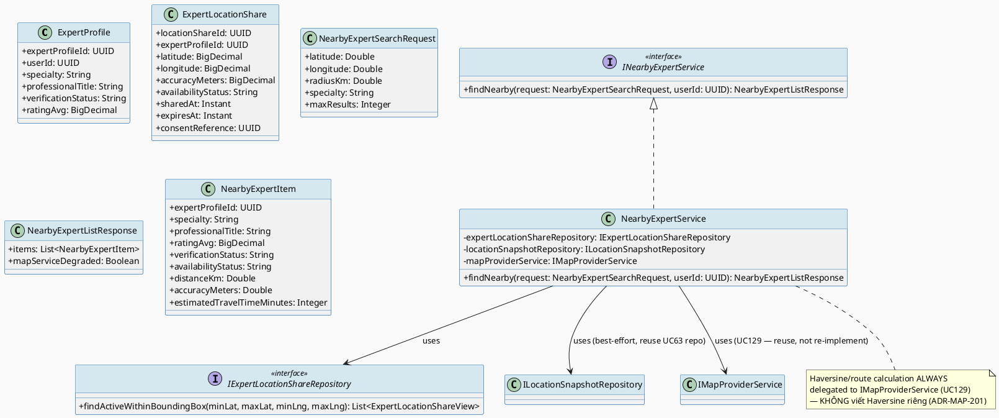
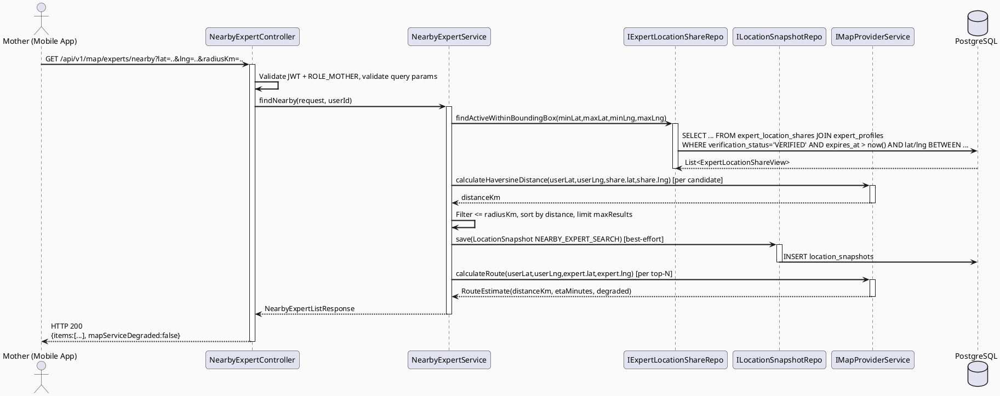
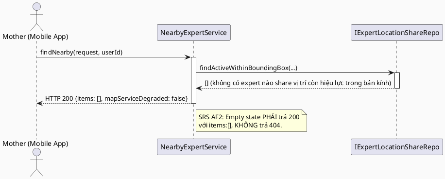
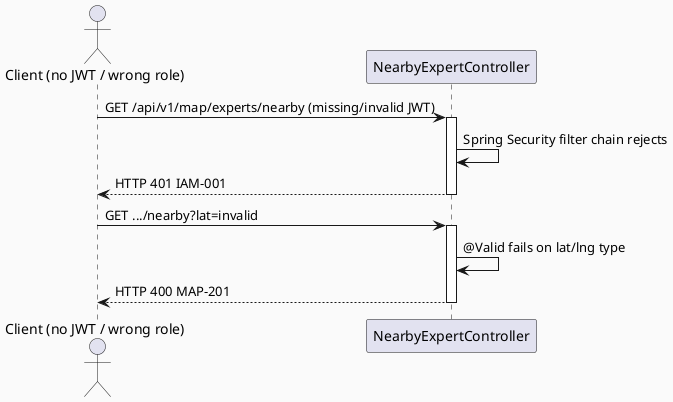

# ENGINEERING DOCUMENTATION STANDARD (EDS) v2.0
# UC149 — Find Nearby Available Experts

| Field | Value |
|-------|-------|
| **Document ID** | `CB-MAP-IMP-005` |
| **Version** | `1.0` |
| **Date** | `2026-07-02` |
| **Status** | `Draft` |
| **Document Owner** | `TV4 - Lâm` |
| **Author** | `AI Agent — Tech Lead` |
| **Reviewed by** | `[ ] Pending` |
| **DPO Sign-off** | `[ ] Pending` *(module đọc `expert_location_shares` — location PII của Expert — bắt buộc)* |
| **Approved by** | `[ ] Pending` |
| **Last Review** | `2026-07-02` |
| **Based on EDS** | `v2.0` |

---

## CHANGELOG

| Ngày | Người thực hiện | Nội dung thay đổi |
|------|-----------------|-------------------|
| 2026-07-02 | AI Agent — Tech Lead | Tạo tài liệu lần đầu — TDS cho UC149 Find Nearby Available Experts |

---

## MỤC LỤC

1. [Tổng quan Module](#1-tổng-quan-module)
2. [Ma trận Truy vết (Traceability Matrix)](#2-ma-trận-truy-vết-traceability-matrix)
3. [Architecture Decision Records (ADR)](#3-architecture-decision-records-adr)
4. [Non-Functional Requirements & SLA](#4-non-functional-requirements--sla)
5. [Static Modeling (Mô hình Tĩnh)](#5-static-modeling-mô-hình-tĩnh)
6. [Dynamic Modeling (Mô hình Động)](#6-dynamic-modeling-mô-hình-động)
7. [Domain Event Catalog](#7-domain-event-catalog)
8. [Interface Specification (Đặc tả Giao diện)](#8-interface-specification-đặc-tả-giao-diện)
9. [API Specification](#9-api-specification)
10. [Bảng mã lỗi (Error Codes)](#10-bảng-mã-lỗi-error-codes)
11. [Quy trình Triển khai (Step-by-Step)](#11-quy-trình-triển-khai-step-by-step)
12. [Rollback & Incident Runbook](#12-rollback--incident-runbook)
13. [Kịch bản Kiểm thử Chi tiết](#13-kịch-bản-kiểm-thử-chi-tiết)
14. [Phương pháp Xác minh](#14-phương-pháp-xác-minh)
15. [Mẫu thử thực tế (API Verification Samples)](#15-mẫu-thử-thực-tế-api-verification-samples)
16. [Bảng tổng hợp phân quyền (Authorization Matrix)](#16-bảng-tổng-hợp-phân-quyền-authorization-matrix)
17. [AI Prompt Constraints (CASE 2.0)](#17-ai-prompt-constraints-case-20)

---

## 1. Tổng quan Module

> UC149 cho phép Mother tìm các Expert đã được xác minh (`verification_status = 'VERIFIED'`), đã opt-in chia sẻ vị trí (`expert_location_shares` chưa hết hạn), và đang ở gần vị trí hiện tại của Mother. Đây là read-only query tương tự UC63 (Find Nearby Care Facility) nhưng nguồn dữ liệu là `expert_location_shares` JOIN `expert_profiles` thay vì `care_facilities`. UC149 nằm trong nhóm MF-19 Emergency Map & Nearby Care Support nên **không được có AI-mediated delay** khi hiển thị kết quả tìm kiếm, kế thừa nguyên tắc đã thiết lập ở UC63/UC129.

| Field | Value |
|-------|-------|
| **Module Name** | `Find Nearby Available Experts` |
| **Bounded Context** | `map` (mở rộng bounded context `map` đã có từ UC63/UC129 — theo phân công TV4-Lâm "Location/map/nearby care domain + expert location visibility", xem `function-spec-task-allocation.md`) |
| **Data Classification** | `Sensitive-PII` *(vị trí hiện tại của Mother = location PII; vị trí Expert trong `expert_location_shares` = location PII của Expert)* |
| **Compliance Scope** | `PDPA / Luật 91/2025` |
| **Upstream Dependencies** | `IAM (JWT ROLE_MOTHER)`, `IMapProviderService` (UC129, `CB-MAP-IMP-000`), `expert_profiles`/`expert_location_shares` (đã có sẵn trong `V1__init_schema.sql`), **UC147 Share Expert Location / UC148 Manage Location Visibility (sibling, write-path owner của `expert_location_shares` — xem Open Item §2)** |
| **Downstream Consumers** | `UC153 Contact Nearby Expert` (chọn 1 expert từ kết quả UC149 để liên hệ), `UC155 View Nearby Experts on Map` (hiển thị dạng marker), Mobile `nearbyExpert`/`emergencyMap` feature |

---

## 2. Ma trận Truy vết (Traceability Matrix)

| Requirement ID | Loại (BR/ADR/US) | Mô tả yêu cầu | Thành phần Code | Compliance Target | ADR liên quan |
|----------------|------------------|---------------|-----------------|-------------------|---------------|
| SRS-3.3.7.1 (UC-149) | User Story | Mother tìm expert đã verify, đã opt-in chia sẻ vị trí, gần vị trí hiện tại | `NearbyExpertController.GET /api/v1/map/experts/nearby` | — | ADR-MAP-201 |
| SRS-3.1.3.1 (UC-129) | User Story | Cung cấp khả năng tính khoảng cách/route/ETA dùng chung | `IMapProviderService` (đã formal hoá ở UC129) | — | ADR-MAP-201 |
| BR-RBAC | Business Rule | Chỉ ROLE_MOTHER (đã auth) được gọi endpoint tìm expert gần | `NearbyExpertController` | BR-RBAC | ADR-MAP-204 |
| BR-SAFETY | Business Rule | Không được delay/chặn kết quả tìm kiếm bởi AI hoặc external service — kế thừa nguyên tắc "no AI/location delay cho emergency-adjacent flow" | `NearbyExpertService` | BR-SAFETY | ADR-MAP-203 |
| BR-PRIVACY | Business Rule | Chỉ hiển thị expert có `expert_location_shares` chưa hết hạn (`expires_at > now()`) và có `consent_reference` hợp lệ — minimum-necessary access | `NearbyExpertService`, `expert_location_shares` | PDPA | ADR-MAP-202 |
| E1/E2/E3 (SRS Exceptions) | Exception | Access denied / invalid params / external service failure xử lý an toàn, không duplicate/unsafe action | `NearbyExpertController`, `NearbyExpertService` | BR-SAFETY | ADR-MAP-203 |
| ADR-MAP-201 | Decision | Search chính dùng bounding-box + Haversine trên `expert_location_shares.latitude/longitude` JOIN `expert_profiles` WHERE `verification_status='VERIFIED'` AND share chưa hết hạn — mirror ADR-MAP-001 (UC63), tái sử dụng `IMapProviderService.calculateHaversineDistance()` (UC129) thay vì viết Haversine riêng | `NearbyExpertService` | — | — |
| ADR-MAP-202 | Decision | Vị trí Expert hiển thị cho Mother theo độ chính xác đã lưu trong `expert_location_shares.accuracy_meters` — KHÔNG tự ý làm tròn/fuzz thêm ở tầng UC149 (xem Open Item §2) | `NearbyExpertService` | PDPA | — |
| ADR-MAP-203 | Decision | `IMapProviderService.calculateRoute()` timeout/fallback kế thừa nguyên vẹn từ UC129 (3000ms + 1 retry, Haversine fallback) — không định nghĩa lại timeout mới | `NearbyExpertService` | BR-SAFETY | — |
| ADR-MAP-204 | Decision | Endpoint yêu cầu JWT + ROLE_MOTHER; `userId` lấy từ SecurityContext, dùng để ghi `location_snapshots` (context_type=`NEARBY_EXPERT_SEARCH`), không dùng để lọc kết quả | `NearbyExpertController` | BR-RBAC | — |

> **Open (RG-2):** SRS §3.3.7.1 là văn bản template chung (không có số cụ thể cho bán kính tìm kiếm, số lượng kết quả tối đa, định nghĩa "available"). Các giá trị số trong TDS này (bán kính mặc định, giới hạn kết quả) là **đề xuất kỹ thuật hợp lý** dựa trên baseline đã "Proposed" ở UC63 (`CB-MAP-IMP-001` §2) — KHÔNG có nguồn BR/AC cụ thể riêng cho UC149. Đánh dấu **Open** — cần Product Owner / TV4-Lâm xác nhận trước khi Approve.
>
> **Open (RG-6 — phụ thuộc UC147/UC148, không xác nhận được trong batch này):** UC147 (Share Expert Location) và UC148 (Manage Location Visibility) là các UC anh em đang được viết đồng thời, sở hữu write-path và consent/visibility semantics của `expert_location_shares`. TDS này đọc `expert_location_shares` như một **read-only consumer** dựa hoàn toàn vào cấu trúc cột đã có trong `V1__init_schema.sql` (`consent_reference`, `expires_at`, `availability_status`) — KHÔNG giả định tên method Java cụ thể nào từ UC147/UC148. Điều chưa xác nhận được: (a) độ chính xác vị trí hiển thị cho Mother có bị "fuzz" thêm theo consent scope của UC147/UC148 hay không (§3 ADR-MAP-202 hiện giả định hiển thị nguyên `accuracy_meters` đã lưu — có thể cần điều chỉnh khi UC147/UC148 xác định rõ scope), và (b) `availability_status` có giá trị enum cố định nào (`AVAILABLE`/`BUSY`/`OFFLINE`?) — schema chỉ khai báo `varchar(20)` không có CHECK constraint. **Phải review lại TDS này sau khi UC147/UC148 hoàn tất** trước khi chuyển Approved.

---

## 3. Architecture Decision Records (ADR)

### ADR-MAP-201 — Chiến lược tìm kiếm expert gần: DB bounding-box + Haversine qua `IMapProviderService`, tái sử dụng UC129

| Field | Value |
|-------|-------|
| **Status** | `Proposed` |
| **Deciders** | `AI Agent — Tech Lead` (chờ TV4-Lâm confirm) |
| **Date** | `2026-07-02` |
| **Supersedes** | `—` |

#### Bối cảnh (Context)
UC63 (`CB-MAP-IMP-001` ADR-MAP-001) đã thiết lập pattern "search chính dựa trên DB, TrackAsia chỉ hỗ trợ ETA" cho `care_facilities`. UC129 (`CB-MAP-IMP-000`) đã formal hoá `IMapProviderService.calculateHaversineDistance()` làm hàm dùng chung, tránh trùng lặp Haversine ở nhiều service. `expert_location_shares` đã tồn tại trong `V1__init_schema.sql` (dòng 828-840) với `expert_profile_id`, `latitude`, `longitude`, `accuracy_meters`, `availability_status`, `expires_at`, `consent_reference`.

#### Các phương án đã xem xét (Options Considered)

| Phương án | Mô tả | Ưu điểm | Nhược điểm |
|-----------|-------|----------|------------|
| A | Query `expert_location_shares` JOIN `expert_profiles` bằng bounding-box (lat/lng range) trong DB, sau đó dùng `IMapProviderService.calculateHaversineDistance()` (UC129) để tính khoảng cách chính xác trong application layer, sort by distance | Nhất quán với ADR-MAP-001 (UC63) và tái sử dụng UC129 thay vì viết lại Haversine — tránh trùng lặp code (đúng tinh thần ADR-MAP-101 của UC129) | Chỉ tìm được expert đã share vị trí trong `expert_location_shares` (phụ thuộc write-path của UC147/148) |
| B | Query toàn bộ `expert_profiles` VERIFIED rồi tính khoảng cách cho tất cả (không lọc bounding-box trước) | Đơn giản hơn về code | Không scale khi số lượng expert lớn — quét toàn bảng thay vì lọc trước bằng index |

#### Quyết định (Decision)
Chọn **Phương án A** — bounding-box filter trước trên `expert_location_shares.latitude/longitude`, JOIN `expert_profiles` lọc `verification_status='VERIFIED'`, sau đó gọi `IMapProviderService.calculateHaversineDistance()` (đã formal hoá ở UC129 §8.1, KHÔNG viết Haversine riêng trong `NearbyExpertService`) để tính khoảng cách chính xác và sort. Optional: gọi `IMapProviderService.calculateRoute()` cho top-N kết quả để lấy ETA, kế thừa hành vi fallback-safe từ UC129 (ADR-MAP-103).

#### Hệ quả (Consequences)

**Tích cực:**
- Nhất quán kiến trúc với UC63 (bounding-box strategy) và tái sử dụng đúng UC129 (không viết Haversine trùng lặp) — tuân thủ khuyến nghị "cân nhắc refactor UC63 gọi calculateHaversineDistance()" mà UC129 đã ghi Open, UC149 áp dụng ngay từ đầu.
- Latency thấp cho search chính, không phụ thuộc TrackAsia trên critical path.

**Tiêu cực / Trade-offs:**
- Danh sách expert giới hạn theo những ai đã opt-in `expert_location_shares` còn hiệu lực — phụ thuộc hoàn toàn vào UC147 (Share Expert Location). Ghi nhận **Open** — ngoài phạm vi TDS này.

**Compliance Impact:**
- Không phát sinh rủi ro PII mới ngoài việc đọc `expert_location_shares` (đã có `consent_reference` sẵn trong schema — UC149 chỉ đọc, không tạo/sửa consent).

---

### ADR-MAP-202 — Độ chính xác vị trí Expert hiển thị cho Mother: dùng nguyên `accuracy_meters` đã lưu, không tự fuzz thêm

| Field | Value |
|-------|-------|
| **Status** | `Proposed` |
| **Deciders** | `AI Agent — Tech Lead` |
| **Date** | `2026-07-02` |
| **Supersedes** | `—` |

#### Bối cảnh (Context)
BR-PRIVACY (nguyên tắc minimum-necessary access, PDPA) yêu cầu chỉ hiển thị mức độ chi tiết vị trí cần thiết. `expert_location_shares.accuracy_meters` đã tồn tại trong schema — ngụ ý rằng độ chính xác/fuzz đã được xử lý ở write-path (UC147 Share Expert Location) khi Expert chọn mức độ chia sẻ vị trí của họ. UC149 KHÔNG nhìn thấy thiết kế UC147/UC148 (đang viết đồng thời), nên không thể xác nhận UC147 có tự fuzz toạ độ trước khi lưu (persist toạ độ approximate) hay lưu toạ độ chính xác kèm cờ hiển thị riêng.

#### Các phương án đã xem xét (Options Considered)

| Phương án | Mô tả | Ưu điểm | Nhược điểm |
|-----------|-------|----------|------------|
| A | UC149 hiển thị nguyên `latitude`/`longitude`/`accuracy_meters` đã đọc được từ `expert_location_shares`, giả định UC147 đã xử lý fuzz/precision tại thời điểm ghi (nếu có) | Đơn giản, không phát sinh logic fuzz trùng lặp ở tầng đọc; tôn trọng nguyên tắc "UC147/148 own write-path và consent/visibility semantics" theo đúng phạm vi công việc được giao | Nếu UC147/UC148 KHÔNG fuzz ở write-path (lưu toạ độ chính xác tuyệt đối), UC149 sẽ vô tình lộ vị trí chính xác của Expert cho Mother — rủi ro PDPA |
| B | UC149 tự làm tròn toạ độ Expert xuống độ chính xác thấp hơn (vd: 3 chữ số thập phân, ~111m) trước khi trả cho Mother, bất kể `accuracy_meters` đã lưu là gì | Đảm bảo minimum-necessary bất kể UC147/148 làm gì | Có thể fuzz 2 lần (double-fuzzing) nếu UC147 đã fuzz sẵn — làm giảm chất lượng UX không cần thiết; UC149 tự quyết định precision policy vốn thuộc phạm vi UC147/148 |

#### Quyết định (Decision)
Chọn **Phương án A có điều kiện** — UC149 hiển thị dữ liệu đã lưu trong `expert_location_shares` nguyên trạng (bao gồm `accuracy_meters` trả kèm trong response để client tự hiển thị mức độ chính xác, ví dụ vẽ vòng tròn bán kính thay vì marker chính xác nếu `accuracy_meters` lớn). **KHÔNG** tự thêm lớp fuzz mới ở UC149. Quyết định này **PHẢI được xác nhận lại** khi UC147/UC148 hoàn tất TDS của họ — nếu UC147/UC148 xác định rằng UC149 (bên đọc) phải chịu trách nhiệm fuzz theo consent scope thay vì UC147 (bên ghi), ADR này cần Supersede.

#### Hệ quả (Consequences)

**Tích cực:**
- Không duplicate logic precision giữa write-path (UC147) và read-path (UC149) — single responsibility.
- Response trả `accuracy_meters` minh bạch cho client, hỗ trợ UI hiển thị đúng mức độ tin cậy vị trí.

**Tiêu cực / Trade-offs:**
- Rủi ro nếu giả định "UC147 đã fuzz" sai — cần xác nhận chéo sau khi sibling batch hoàn tất.

**Compliance Impact:**
- **Open — cần DPO xác nhận sau khi UC147/UC148 TDS available.** Đây là Open Item RG-6 chính của batch này, đã báo cáo rõ ở §2.

---

### ADR-MAP-203 — TrackAsia/ETA: kế thừa nguyên vẹn timeout/fallback từ UC129, không định nghĩa lại

| Field | Value |
|-------|-------|
| **Status** | `Proposed` |
| **Deciders** | `AI Agent — Tech Lead` |
| **Date** | `2026-07-02` |
| **Supersedes** | `—` |

#### Bối cảnh (Context)
UC129 (`CB-MAP-IMP-000` ADR-MAP-102/103) đã formal hoá timeout 3000ms + 1 retry và Haversine fallback cho `IMapProviderService.calculateRoute()`. UC149 là consumer mới của interface này (giống UC63/UC64).

#### Quyết định (Decision)
`NearbyExpertService` gọi `IMapProviderService.calculateRoute()` (KHÔNG gọi trực tiếp `TrackAsiaMapClient`) cho top-N kết quả expert để lấy ETA bổ sung. Nếu `calculateRoute()` trả `degraded=true` (theo hợp đồng UC129 §8.1), response vẫn trả 200 OK với toàn bộ danh sách expert, `estimatedTravelTimeMinutes: null` cho các item degraded, kèm field `mapServiceDegraded: true` — mirror chính xác pattern UC63 §9.2 (`mapServiceDegraded`) để nhất quán JSON contract giữa UC63 và UC149.

#### Hệ quả (Consequences)

**Tích cực:** Không tạo ra 2 nguồn sự thật khác nhau về timeout/retry giữa các consumer của `IMapProviderService`; tuân thủ CLAUDE.md "never delay emergency-adjacent routing".

**Tiêu cực / Trade-offs:** Không có thêm ngoài những gì UC129 đã ghi nhận.

**Compliance Impact:** Không có.

---

### ADR-MAP-204 — Authorization: ROLE_MOTHER only, userId từ JWT, ghi location_snapshots best-effort

| Field | Value |
|-------|-------|
| **Status** | `Proposed` |
| **Deciders** | `AI Agent — Tech Lead` |
| **Date** | `2026-07-02` |
| **Supersedes** | `—` |

#### Quyết định (Decision)
Endpoint `GET /api/v1/map/experts/nearby` yêu cầu JWT hợp lệ với `ROLE_MOTHER` (mirror `@PreAuthorize("hasRole('MOTHER')")` — pattern giống UC63 ADR-MAP-004). `userId` dùng để ghi `location_snapshots.user_id` với `context_type = 'NEARBY_EXPERT_SEARCH'` (best-effort, mirror ADR-MAP-002 của UC63 — lỗi ghi snapshot KHÔNG chặn response), KHÔNG dùng để lọc kết quả expert trả về.

---

## 4. Non-Functional Requirements & SLA

### 4.1. Performance & Availability

| Category | Requirement | Target SLA | Measurement Method | Compliance Basis |
|----------|-------------|------------|---------------------|------------------|
| Latency | API response (p99), DB-only path (cache hit hoặc không cần ETA) | `< 500ms` *(Open — kế thừa nguyên văn từ UC63 §4.1, chưa có BR/AC nguồn riêng UC149)* | k6 load test | `CB-MAP-IMP-001` §4.1 |
| Latency | API response khi cần gọi `IMapProviderService.calculateRoute()` cho top-N expert | `< 1500ms` *(Open — kế thừa UC63 §4.1)* | k6 load test | `CB-MAP-IMP-001` §4.1 |
| Availability | Uptime (monthly) | `99.9%` *(Open — theo baseline chung dự án)* | Uptime monitor | — |
| Throughput | Concurrent requests | `50 req/s` *(Open — kế thừa UC63/UC129 §4.1)* | Load test | — |

### 4.2. Data Integrity & Retention

| Category | Requirement | Target | Verification Method | Compliance Basis |
|----------|-------------|--------|---------------------|------------------|
| Retention | `location_snapshots` cho NEARBY_EXPERT_SEARCH | `expires_at = created_at + 1h` *(mirror UC63 ADR-MAP-002)* | Query kiểm tra `expires_at` | PDPA (minimum necessary) |
| Filtering correctness | Chỉ trả expert có `verification_status='VERIFIED'` AND `expert_location_shares.expires_at > now()` | 100% | Unit test | ADR-MAP-201 |
| Consistency | Expert đã hết hạn share (`expires_at <= now()`) KHÔNG xuất hiện trong kết quả | 100% | Integration test | ADR-MAP-201, PDPA |

### 4.3. Security

| Category | Requirement | Target | Verification Method | Compliance Basis |
|----------|-------------|--------|---------------------|------------------|
| Encryption in transit | Endpoint + `IMapProviderService` call | TLS 1.3+ | SSL Labs scan | PDPA |
| Access control | ROLE_MOTHER only | Least privilege | Auth Matrix (§16) | BR-RBAC |
| No PII leak in logs | Toạ độ Expert KHÔNG log ở mức INFO | Log audit | PDPA |

### 4.4. Scalability & Capacity Planning

> Tải dự kiến thấp/trung bình (tính năng phụ trợ, không phải core booking flow) — tương tự UC63 §4.4. Horizontal scale theo cấu hình chung Spring Boot hiện có. Không cần cơ chế riêng.

---

## 5. Static Modeling (Mô hình Tĩnh)

### 5.1. Class Diagram (PlantUML)



### 5.2. Data Structure (Flyway SQL Migration)

> **Không cần migration mới.** `expert_profiles` (dòng 786-800) và `expert_location_shares` (dòng 828-840) đã tồn tại đầy đủ trong `V1__init_schema.sql`. PK tại dòng 1404-1405 (`expert_profiles_pkey`), 1413-1414 (`expert_location_shares_pkey`); FK tại dòng 1811-1812 (`expert_location_shares_expert_profile_id_fkey`); index có sẵn: `idx_expert_profiles_verification_status` (dòng 1631). Không phát hiện thay đổi cấu trúc bảng nào bắt buộc cho UC149.

**Xác nhận cấu trúc hiện có (nguồn: `V1__init_schema.sql`):**

```sql
-- Đã tồn tại — KHÔNG tạo lại, chỉ tham chiếu
-- expert_profiles: expert_profile_id (PK), user_id (FK -> users, UNIQUE), specialty,
--                   professional_title, experience_years, workplace, consultation_scope,
--                   verification_status (varchar(30) DEFAULT 'PENDING'), verified_at, verified_by,
--                   rating_avg, created_at, updated_at
-- Index có sẵn: idx_expert_profiles_verification_status
--
-- expert_location_shares: location_share_id (PK), expert_profile_id (FK -> expert_profiles),
--                          latitude, longitude, accuracy_meters, availability_status (varchar(20)),
--                          shared_at, expires_at, consent_reference, created_at, updated_at
-- Index hiện có: CHỈ có PK (location_share_id) + FK index ngầm định trên expert_profile_id.
--                KHÔNG có index riêng trên (latitude, longitude) hoặc (expires_at).
```

**Đề xuất index bổ sung (Open — cần đánh giá hiệu năng thực tế trước khi approve, mirror UC63 §5.2 Open note):**

Bounding-box query trên `expert_location_shares.latitude/longitude` kết hợp filter `expires_at > now()` sẽ full-scan nếu số lượng expert lớn. Đề xuất migration mới `V20260705150000__add_expert_location_shares_geo_index.sql` với composite index `(latitude, longitude)` và index riêng trên `(expires_at)` để tăng tốc filter share còn hiệu lực. **Chưa tạo migration này trong Draft** — chỉ ghi nhận Open, vì (a) chưa có dữ liệu thực tế để đánh giá cardinality (giống UC63's lý do), và (b) migration này có thể xung đột với migration mà UC147/UC148 (sibling, đang viết đồng thời, sở hữu write-path của cùng bảng) có thể cần tạo cho `expert_location_shares` — cần đồng bộ version trước khi bất kỳ agent nào tạo migration thật cho bảng này. Version đề xuất `V20260705150000` (theo range được cấp phát cho batch này, tránh các range `090000`/`100000`/`110000`/`120000`/`130000`/`140000`/`160000` đã reserved cho 7 sibling agents khác).

---

## 6. Dynamic Modeling (Mô hình Động)

### 6.1. Sequence Diagram — Happy Path (PlantUML)



### 6.2. Sequence Diagram — Empty State / No Active Share (AF2) (PlantUML)



### 6.3. Sequence Diagram — Error Path (Unauthorized / Invalid Params) (PlantUML)



> Không có state machine cho UC149 — read-only query, expert không đổi trạng thái do việc search (khác với `expert_location_shares.availability_status` vốn được quản lý bởi UC147/UC148, ngoài phạm vi UC149).

---

## 7. Domain Event Catalog

> UC149 là read-only query — **không phát ra domain event nào**. Ghi `location_snapshots` là side-effect trực tiếp qua repository (best-effort), không qua event bus — mirror UC63 §7.

### 7.1. Events Published (Phát ra)

_Không có._

### 7.2. Events Consumed (Tiêu thụ)

_Không có._

---

## 8. Interface Specification (Đặc tả Giao diện)

### 8.1. Service Interface

```java
// NearbyExpertSearchRequest.java — Input DTO
// @version 1.0
public class NearbyExpertSearchRequest {
    @NotNull
    @DecimalMin("-90.0") @DecimalMax("90.0")
    private Double latitude;

    @NotNull
    @DecimalMin("-180.0") @DecimalMax("180.0")
    private Double longitude;

    @DecimalMin("0.1") @DecimalMax("50.0")
    private Double radiusKm = 5.0;          // default — Open: chưa có BR nguồn cho giá trị mặc định (mirror UC63)

    private String specialty;                 // optional filter: tham chiếu expert_profiles.specialty (free text trong schema hiện tại)

    @Min(1) @Max(50)
    private Integer maxResults = 20;         // default — Open

    // getters / setters
}

// NearbyExpertListResponse.java — Output DTO
public class NearbyExpertListResponse {
    private List<NearbyExpertItem> items;
    private Boolean mapServiceDegraded;      // true nếu IMapProviderService.calculateRoute() degraded (ADR-MAP-203)
    // getters / setters
}

public class NearbyExpertItem {
    private UUID expertProfileId;
    private String specialty;
    private String professionalTitle;
    private BigDecimal ratingAvg;
    private String verificationStatus;       // luôn 'VERIFIED' theo filter ADR-MAP-201, trả kèm để client hiển thị badge
    private String availabilityStatus;       // từ expert_location_shares.availability_status — pass-through, không diễn giải enum (Open, xem §2)
    private Double distanceKm;               // Haversine — luôn có, từ IMapProviderService.calculateHaversineDistance()
    private Double accuracyMeters;           // pass-through từ expert_location_shares.accuracy_meters (ADR-MAP-202)
    private Integer estimatedTravelTimeMinutes; // nullable nếu mapServiceDegraded=true
    // getters / setters
}

// INearbyExpertService.java — Service Contract
// @version 1.0
public interface INearbyExpertService {
    /**
     * Tìm expert_location_shares còn hiệu lực JOIN expert_profiles VERIFIED
     * trong bán kính radiusKm quanh (latitude, longitude).
     * Không phụ thuộc IMapProviderService cho kết quả chính (ADR-MAP-201).
     * IMapProviderService lỗi/timeout không làm fail request (ADR-MAP-203, kế thừa UC129).
     * @throws AccessDeniedException (MAP-204) nếu không có ROLE_MOTHER
     */
    NearbyExpertListResponse findNearby(NearbyExpertSearchRequest request, UUID userId);
}
```

### 8.2. Repository Interface

```java
// IExpertLocationShareRepository.java
// @version 1.0
public interface IExpertLocationShareRepository extends JpaRepository<ExpertLocationShare, UUID> {

    @Query("SELECT s FROM ExpertLocationShare s JOIN ExpertProfile p ON s.expertProfileId = p.expertProfileId " +
           "WHERE p.verificationStatus = 'VERIFIED' " +
           "AND s.expiresAt > CURRENT_TIMESTAMP " +
           "AND s.latitude BETWEEN :minLat AND :maxLat " +
           "AND s.longitude BETWEEN :minLng AND :maxLng " +
           "AND (:specialty IS NULL OR p.specialty = :specialty)")
    List<ExpertLocationShareProjection> findActiveWithinBoundingBox(
        @Param("minLat") BigDecimal minLat, @Param("maxLat") BigDecimal maxLat,
        @Param("minLng") BigDecimal minLng, @Param("maxLng") BigDecimal maxLng,
        @Param("specialty") String specialty);
}

// ILocationSnapshotRepository.java — TÁI SỬ DỤNG nguyên trạng từ UC63 (CB-MAP-IMP-001 §8.2)
// KHÔNG tạo lại — kiểm tra package com.carebridge.backend.map.repository khi implement,
// nếu UC63 đã implement trước thì import trực tiếp, không tạo file trùng tên.
```

### 8.3. External Service Interface (tái sử dụng UC129, KHÔNG tạo mới)

```java
// IMapProviderService — formal owner: UC129 (CB-MAP-IMP-000 §8.1)
// UC149 CHỈ inject và gọi, KHÔNG định nghĩa lại interface này.
// RouteEstimate calculateRoute(double originLat, double originLng, double destLat, double destLng);
// double calculateHaversineDistance(double originLat, double originLng, double destLat, double destLng);
```

---

## 9. API Specification

### 9.1. Endpoints Table

| Method | Path | Auth Level | Required Roles | Rate Limit | Idempotent? |
|--------|------|------------|----------------|------------|-------------|
| `GET` | `/api/v1/map/experts/nearby` | JWT Bearer | `ROLE_MOTHER` | 30/min *(Open — kế thừa đề xuất UC63)* | Yes |

### 9.2. Request / Response Schemas

#### `GET /api/v1/map/experts/nearby?latitude=10.7769&longitude=106.7009&radiusKm=5&specialty=Pediatrics&maxResults=20`

**Response — 200 OK (Happy Path):**
```json
{
  "items": [
    {
      "expertProfileId": "uuid-v4",
      "specialty": "Pediatrics",
      "professionalTitle": "BS. Nguyễn Văn A",
      "ratingAvg": 4.8,
      "verificationStatus": "VERIFIED",
      "availabilityStatus": "AVAILABLE",
      "distanceKm": 1.2,
      "accuracyMeters": 50.0,
      "estimatedTravelTimeMinutes": 6
    }
  ],
  "mapServiceDegraded": false
}
```

**Response — 200 OK (mapServiceDegraded — ADR-MAP-203):**
```json
{
  "items": [
    {
      "expertProfileId": "uuid-v4",
      "specialty": "Pediatrics",
      "professionalTitle": "BS. Nguyễn Văn A",
      "ratingAvg": 4.8,
      "verificationStatus": "VERIFIED",
      "availabilityStatus": "AVAILABLE",
      "distanceKm": 1.2,
      "accuracyMeters": 50.0,
      "estimatedTravelTimeMinutes": null
    }
  ],
  "mapServiceDegraded": true
}
```

**Response — 200 OK (Empty state — AF2):**
```json
{
  "items": [],
  "mapServiceDegraded": false
}
```

**Response — 400 Bad Request:**
```json
{
  "error": {
    "code": "MAP-201",
    "message": "latitude and longitude are required and must be valid coordinates",
    "details": [{ "field": "latitude", "message": "must be between -90 and 90" }]
  }
}
```

**Response — 401 Unauthorized:**
```json
{
  "error": { "code": "IAM-001", "message": "Authentication required" }
}
```

**Response — 403 Forbidden:**
```json
{
  "error": { "code": "MAP-204", "message": "Insufficient permissions" }
}
```

---

## 10. Bảng mã lỗi (Error Codes)

| Code | HTTP Status | Message (EN) | Message (VI) | Trigger Condition |
|------|-------------|--------------|--------------|-------------------|
| `MAP-201` | 400 | Validation failed | Dữ liệu không hợp lệ | latitude/longitude thiếu hoặc ngoài phạm vi hợp lệ |
| `MAP-202` | 200 (không phải lỗi cứng) | Map service degraded | Dịch vụ bản đồ tạm thời không khả dụng | `IMapProviderService.calculateRoute()` trả `degraded=true` (ADR-MAP-203) — vẫn trả 200 kèm `mapServiceDegraded:true` |
| `MAP-203` | N/A | No expert reference data | Không có expert nào chia sẻ vị trí | `expert_location_shares` rỗng trong bounding-box hoặc tất cả đã hết hạn (AF2 empty state — trả 200 với `items: []`, KHÔNG phải 404) |
| `MAP-204` | 403 | Insufficient permissions | Không đủ quyền | User không có ROLE_MOTHER |
| `MAP-205` | 503 | Map expert service unavailable | Dịch vụ tìm expert không khả dụng | DB (`expert_location_shares`/`expert_profiles`) không truy vấn được |

> **Lưu ý:** `MAP-203` liệt kê cho đầy đủ bảng mã lỗi theo template nhưng KHÔNG áp dụng làm HTTP thực tế — theo SRS AF2 "empty state" phải trả 200 với danh sách rỗng (mirror UC63 §10 lưu ý tương tự).

---

## 11. Quy trình Triển khai (Step-by-Step)

### 11.1. Prerequisites

- [ ] ADR-MAP-201 → 204 được Accepted (hiện tại `Proposed` — cần TV4-Lâm + Tech Lead review)
- [ ] DPO sign-off cho việc đọc `expert_location_shares` (location PII của Expert)
- [ ] UC129 (`IMapProviderService`) đã implement và deploy — UC149 là consumer, không tự triển khai lại
- [ ] **Xác nhận với UC147/UC148 owner** về ADR-MAP-202 (precision display policy) trước khi Approve — xem Open Item §2

### 11.2. Pre-Migration Checklist

- [ ] Không cần migration mới bắt buộc (§5.2) cho Draft này
- [ ] Nếu cần composite geo-index cho `expert_location_shares`, PHẢI đồng bộ với UC147/UC148 owner trước khi tạo migration thật (tránh 2 agent cùng tạo migration cho cùng bảng)

### 11.3. Implementation Steps

#### Chặng 1 — Mở rộng package `map` đã có (mirror UC63 convention, KHÔNG tạo package mới)

```
com.carebridge.backend.map/
├── controller/NearbyExpertController.java          (MỚI)
├── dto/request/NearbyExpertSearchRequest.java       (MỚI)
├── dto/response/NearbyExpertListResponse.java       (MỚI)
├── dto/response/NearbyExpertItem.java               (MỚI)
├── entity/ExpertLocationShare.java                  (MỚI — map tới bảng đã có; kiểm tra trùng lặp nếu UC147/148 đã tạo trước)
├── entity/ExpertProfile.java                        (MỚI hoặc tái sử dụng nếu module expert đã có entity này)
├── repository/IExpertLocationShareRepository.java   (MỚI)
├── service/INearbyExpertService.java                (MỚI)
├── service/impl/NearbyExpertService.java            (MỚI)
└── mapper/NearbyExpertMapper.java                   (MỚI)
```

> **Lưu ý quan trọng khi implement song song với UC147/UC148:** Nếu UC147 hoặc UC148 được implement TRƯỚC UC149 và đã tự tạo entity `ExpertLocationShare` trong package khác (ví dụ `com.carebridge.backend.expert.entity`), UC149 implementation PHẢI **tái sử dụng** entity đã tồn tại, KHÔNG tạo entity trùng ánh xạ cùng bảng gây conflict Hibernate. Kiểm tra codebase thực tế trước khi tạo file mới.

#### Chặng 2 — Implement Repository query (bounding-box + JOIN verification_status + expires_at filter)

```java
// Repository query dùng JPQL join — xem §8.2. Kiểm tra tên entity ExpertProfile
// đã tồn tại chưa (từ module expert khác) trước khi tạo mới.
```

#### Chặng 3 — Implement Service — gọi `IMapProviderService` (UC129), KHÔNG viết Haversine riêng

```java
// NearbyExpertService inject IMapProviderService (bean đã có từ UC129)
// KHÔNG import TrackAsiaMapClient trực tiếp (ADR-MAP-201/203)
```

#### Chặng 4 — Implement Controller + Security config

```java
// @PreAuthorize("hasRole('MOTHER')") — mirror NearbyFacilityController (UC63) pattern
```

#### Chặng 5 — Mobile: implement `nearbyExpert` feature (mới) hoặc mở rộng `emergencyMap` (UC63) nếu team quyết định gộp UI

```
lib/features/nearbyExpert/
├── models/nearby_expert_model.dart
├── repositories/nearby_expert_repository.dart
├── services/nearby_expert_api_service.dart
├── screens/nearby_expert_list_screen.dart
└── widgets/expert_list_item.dart
```

### 11.4. Deployment Checklist

- [ ] Endpoint trả 200 với dữ liệu seed `expert_profiles` (VERIFIED) + `expert_location_shares` (chưa hết hạn)
- [ ] Xác nhận expert đã hết hạn share KHÔNG xuất hiện trong response
- [ ] Xác nhận expert PENDING/REJECTED verification KHÔNG xuất hiện trong response
- [ ] p99 latency đạt target §4.1 (nếu đã confirm — hiện Open)

---

## 12. Rollback & Incident Runbook

### 12.1. Điều kiện kích hoạt Rollback

| Điều kiện | Ngưỡng | Người quyết định |
|-----------|--------|------------------|
| Error rate tăng đột biến | > 5% trong 5 phút | On-call Engineer |
| Vị trí Expert bị lộ sai Mother (nếu phát hiện leak trong log/response không đúng filter) | Bất kỳ case nào | Tech Lead + DPO |
| Expert chưa VERIFIED xuất hiện trong kết quả (filter lỗi) | Bất kỳ case nào | Tech Lead |

### 12.2. Rollback Procedure

```bash
# Không có migration mới để rollback (§5.2) — chỉ cần revert code deploy
kubectl rollout undo deployment/carebridge-api
kubectl rollout status deployment/carebridge-api
```

### 12.3. Notification Protocol

| Thời điểm | Người nhận | Kênh | Template |
|-----------|------------|------|----------|
| Ngay khi phát hiện | On-call team | Slack `#incident` | "Nearby Expert search degraded/down: [mô tả]" |
| Trong 30 phút (nếu PII liên quan) | DPO | Email | Bắt buộc nếu location PII của Expert bị ảnh hưởng |

### 12.4. Post-Incident Review (PIR)

- **Timeline:** Diễn biến từng bước
- **Root Cause:** 5 Whys
- **Impact:** Có Mother nào không tìm được expert gần trong tình huống cần thiết? Có Expert nào bị lộ vị trí sai scope?
- **Remediation + Prevention**

---

## 13. Kịch bản Kiểm thử Chi tiết

> Chi tiết đầy đủ nằm trong `UC149_FindNearbyAvailableExperts_Test-Spec.md`. Bảng dưới đây tóm tắt liên kết điều kiện kiểm thử chính.

| TDS Concern | Test-Spec Condition Ref |
|-------------|--------------------------|
| ADR-MAP-201 (bounding-box + Haversine via IMapProviderService, verification_status filter) | `TC-COND-001, 002, 003` |
| ADR-MAP-202 (accuracy_meters pass-through) | `TC-COND-004` |
| ADR-MAP-203 (IMapProviderService degraded handling) | `TC-COND-005` |
| ADR-MAP-204 (RBAC + best-effort snapshot) | `TC-COND-006, 007` |
| SRS AF2 (empty state) | `TC-COND-008` |
| SRS E2 (invalid params) | `TC-COND-009` |
| Expired share exclusion (PDPA minimum-necessary) | `TC-COND-010` |

---

## 14. Phương pháp Xác minh

### 14.1. Database Inspection

```sql
-- Verify expert_location_shares data returned matches bounding box + filters
SELECT s.location_share_id, s.expert_profile_id, s.latitude, s.longitude, s.expires_at,
       p.verification_status
FROM expert_location_shares s
JOIN expert_profiles p ON s.expert_profile_id = p.expert_profile_id
WHERE p.verification_status = 'VERIFIED'
  AND s.expires_at > now()
  AND s.latitude BETWEEN :minLat AND :maxLat
  AND s.longitude BETWEEN :minLng AND :maxLng;

-- Verify location_snapshots TTL respected
SELECT location_snapshot_id, user_id, context_type, expires_at
FROM location_snapshots
WHERE context_type = 'NEARBY_EXPERT_SEARCH'
ORDER BY captured_at DESC LIMIT 5;
```

### 14.2. Log / Audit Verification

```bash
kubectl logs -l app=carebridge-api | grep "GET /api/v1/map/experts/nearby" | tail -20
kubectl logs -l app=carebridge-api | grep -i "nearbyexpert" | grep -i "error"
```

### 14.3. Tool-based Verification

```bash
curl -X GET "https://$HOST/api/v1/map/experts/nearby?latitude=10.7769&longitude=106.7009&radiusKm=5" \
  -H "Authorization: Bearer $MOTHER_JWT"
```

---

## 15. Mẫu thử thực tế (API Verification Samples)

### 15.1. Happy Path

```bash
curl -X GET "https://$HOST/api/v1/map/experts/nearby?latitude=10.7769&longitude=106.7009&radiusKm=5&specialty=Pediatrics&maxResults=10" \
  -H "Authorization: Bearer $MOTHER_JWT" \
  -H "X-Correlation-Id: $(uuidgen)"
```

### 15.2. Error Paths

```bash
# Thiếu latitude/longitude → 400 MAP-201
curl -X GET "https://$HOST/api/v1/map/experts/nearby" \
  -H "Authorization: Bearer $MOTHER_JWT"

# Không có JWT → 401
curl -X GET "https://$HOST/api/v1/map/experts/nearby?latitude=10.77&longitude=106.70"
```

---

## 16. Bảng tổng hợp phân quyền (Authorization Matrix)

| Endpoint | `GUEST` | `ROLE_MOTHER` | `ROLE_PARTNER` | `ROLE_EXPERT` | `ROLE_ADMIN` |
|----------|---------|---------------|----------------|---------------|--------------|
| `GET /api/v1/map/experts/nearby` | ❌ | ✅ | ❌ | ❌ | ❌ |

**Chú thích:** Expert location share là dữ liệu đã opt-in công khai trong phạm vi hệ thống cho Mother tìm kiếm — quyền truy cập giới hạn theo Role (Mother), không theo ownership của record.

> **Open:** SRS không xác nhận rõ liệu ROLE_FAMILY có được phép gọi tính năng này thay mặt Mother hay không (giống Open Item đã ghi ở UC63 §16). TDS này giữ nguyên phạm vi hẹp nhất theo SRS Primary Actor = Mother; mở rộng role cần quyết định bổ sung của Product Owner.

---

## 17. AI Prompt Constraints (CASE 2.0)

### 17.1 Constraint Summary Table

| # | Constraint | Source (ADR/BR) | Last Verified |
|---|-----------|-----------------|---------------|
| C1 | Search chính PHẢI dựa trên `expert_location_shares` JOIN `expert_profiles` trong DB (bounding-box), lọc `verification_status='VERIFIED'` AND `expires_at > now()` | `ADR-MAP-201` | `2026-07-02` |
| C2 | Tính khoảng cách/route PHẢI gọi `IMapProviderService` (UC129) — KHÔNG viết Haversine riêng, KHÔNG gọi `TrackAsiaMapClient` trực tiếp | `ADR-MAP-201`, `ADR-MAP-203` | `2026-07-02` |
| C3 | Vị trí Expert hiển thị PHẢI dùng nguyên `accuracy_meters` đã lưu — KHÔNG tự thêm lớp fuzz mới ở tầng đọc (chờ xác nhận từ UC147/UC148) | `ADR-MAP-202` | `2026-07-02` |
| C4 | `userId` PHẢI lấy từ JWT SecurityContext — KHÔNG từ query param | `ADR-MAP-204` | `2026-07-02` |
| C5 | Danh sách rỗng (AF2) PHẢI trả HTTP 200 với `items: []`, KHÔNG trả 404 | `SRS AF2` | `2026-07-02` |

### 17.2 Constraint Injection Block (Copy-Paste vào AI Prompt)

```
[CONSTRAINT BLOCK — Module: Find Nearby Available Experts — CB-MAP-IMP-005]
Theo TDS CB-MAP-IMP-005 và các ADR liên quan:

1. Search chính dựa trên expert_location_shares JOIN expert_profiles, lọc verification_status='VERIFIED' AND expires_at > now() (ADR-MAP-201)
2. Tính khoảng cách/route PHẢI gọi IMapProviderService (UC129) — KHÔNG viết Haversine riêng (ADR-MAP-201/203)
3. Vị trí Expert dùng nguyên accuracy_meters đã lưu — KHÔNG tự fuzz thêm (ADR-MAP-202, Open — chờ UC147/148)
4. userId từ JWT SecurityContext — KHÔNG từ query param (ADR-MAP-204)
5. Danh sách rỗng → HTTP 200 với items:[], KHÔNG 404 (SRS AF2)

[CONTEXT BLOCK]
- Bounded Context: map
- Data Classification: Sensitive-PII (vị trí Mother + vị trí Expert)
- Compliance: PDPA / Luật 91/2025
- Existing interfaces: §8 Service Interface + §8.2 Repository Interface + §8.3 IMapProviderService (reuse UC129)
- Error codes: §10 Error Codes Table
- Auth matrix: §16 Authorization Matrix

[TASK BLOCK]
Implement NearbyExpertService.findNearby() thỏa mãn constraints trên.
Output phải tuân thủ §8 Interface Specification.
Tests phải cover §13 Test Scenarios (xem Test-Spec).
```

### 17.3 Constraint Quality Checklist

- [x] Mỗi constraint traceable về ADR hoặc BR cụ thể
- [x] Không có constraint generic
- [x] Mỗi constraint có `Last Verified` date ≤ 2 sprints
- [x] Constraint block có ≥ 3 constraints cụ thể (có 5)
- [x] Constraint block reference §8 Interface
- [x] Constraint block reference §16 Auth Matrix

### 17.4 Anti-Pattern Detection

| AP-ID | Anti-Pattern | Dấu hiệu | Hành động |
|-------|-------------|-----------|----------|
| AP-AI-001 | Unconstrained Gen | Code viết Haversine riêng thay vì gọi `IMapProviderService`, hoặc gọi `TrackAsiaMapClient` trực tiếp | Reject — enforce C2 |
| AP-AI-003 | Implicit Decision | Code tự thêm logic fuzz toạ độ mà không có ADR xác nhận (vi phạm C3 giả định hiện tại) | Reject — cần xác nhận ADR-MAP-202 trước |
| AP-AI-005 | Hallucinated Contract | Code import repository/entity không có trong §8, hoặc tạo trùng entity `ExpertLocationShare` nếu UC147/148 đã có | Reject — verify contract existence trong codebase trước khi tạo file mới |

---

## PHỤ LỤC

### A. Glossary

| Thuật ngữ | Định nghĩa |
|-----------|------------|
| Expert Location Share | Bản ghi vị trí Expert đã opt-in chia sẻ, có TTL (`expires_at`) và tham chiếu consent (`consent_reference`) trong bảng `expert_location_shares` |
| Bounding Box | Vùng hình chữ nhật lat/lng dùng để lọc sơ bộ trước khi tính khoảng cách chính xác |
| Verification Status | Trạng thái xác minh Expert (`expert_profiles.verification_status`) — chỉ `VERIFIED` được hiển thị trong UC149 |
| mapServiceDegraded | Cờ báo hiệu `IMapProviderService` không khả dụng, kết quả vẫn trả về nhưng thiếu ETA chính xác |
| Minimum Necessary | Nguyên tắc PDPA — chỉ hiển thị mức độ chi tiết dữ liệu vị trí cần thiết cho mục đích tìm kiếm |

### B. Tài liệu tham chiếu

| Document | Link / Path |
|----------|-------------|
| SRS UC-149 | `02_Requirements/SRS/3_Functional_Specification.md §3.3.7.1` (dòng 3745-3763) |
| SRS UC-129 (Calculate Distance/Route/ETA — shared map capability) | `02_Requirements/SRS/3_Functional_Specification.md §3.1.3.1` |
| Task Allocation (TV4-Lâm ownership) | `04_Implement/implement_artifacts/function-spec-task-allocation.md` |
| DB Schema Source of Truth | `05_Development/CareBridgeAPI/src/main/resources/db/migration/V1__init_schema.sql` (dòng 786-840 expert tables) |
| UC63 Find Nearby Care Facility TDS (structural pattern reference) | `04_Implement/UC63_FindNearbyCareFacility/UC63_FindNearbyCareFacility_TDS.md` |
| UC129 Calculate Distance/Route/ETA TDS (`IMapProviderService` owner) | `04_Implement/UC129_CalculateDistanceRouteAndETA/UC129_CalculateDistanceRouteAndETA_TDS.md` |
| UC154 Establish Realtime Communication Session TDS (external service ADR pattern, consultation bounded context reference) | `04_Implement/UC154_EstablishRealtimeCommunicationSession/UC154_EstablishRealtimeCommunicationSession_TDS.md` |
| UC153 Contact Nearby Expert TDS (downstream consumer of UC149 results) | `04_Implement/UC153_ContactNearbyExpert/UC153_ContactNearbyExpert_TDS.md` |
| UC147/UC148 (sibling — write-path owner of `expert_location_shares`, NOT visible in this batch) | *(pending — cross-check required before Approve)* |
| EDS v2.0 Template | `08_References/Template/PHASE-3_TDS.md` |

---

*EDS v2.0 — Draft. Chưa Approved. Xem §2, §3 ADR-MAP-202, §4, §16 cho danh sách Open Items cần Product Owner / TV4-Lâm / DPO xác nhận trước khi chuyển Status sang `Approved`. Đặc biệt: ADR-MAP-202 (precision display) PHẢI review lại sau khi UC147/UC148 hoàn tất TDS của họ.*
