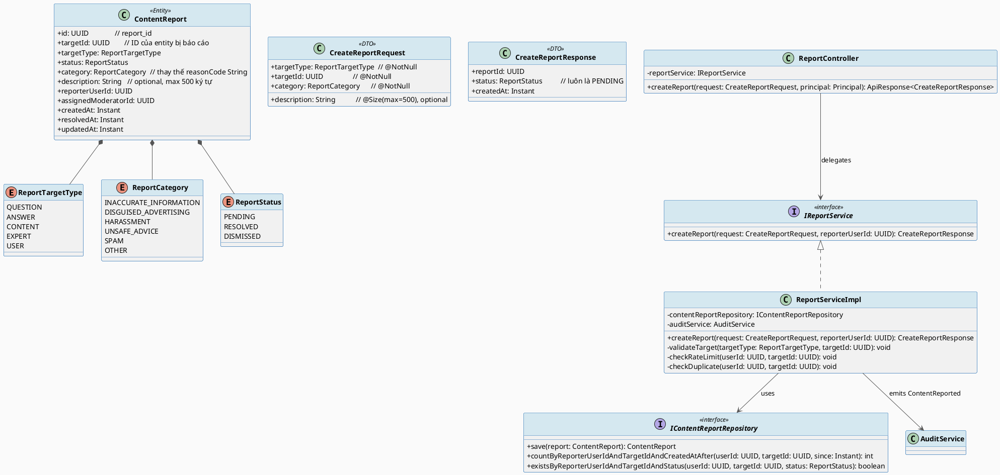
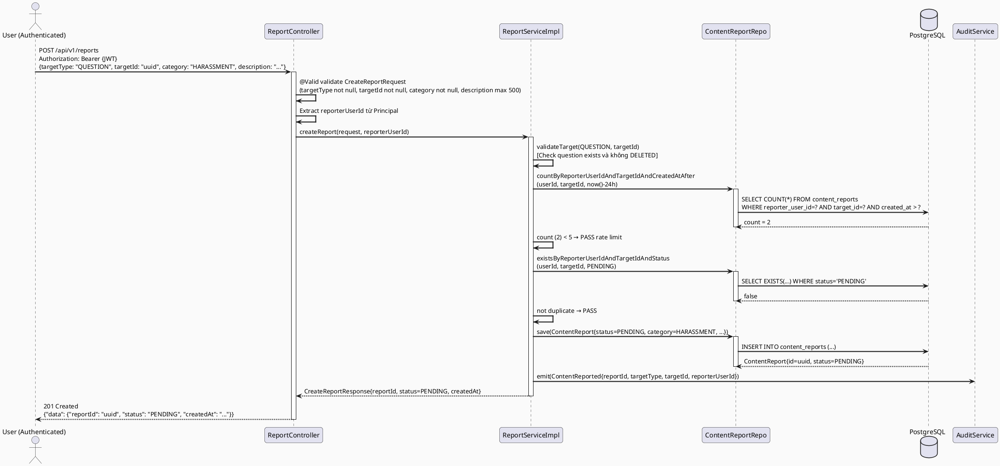
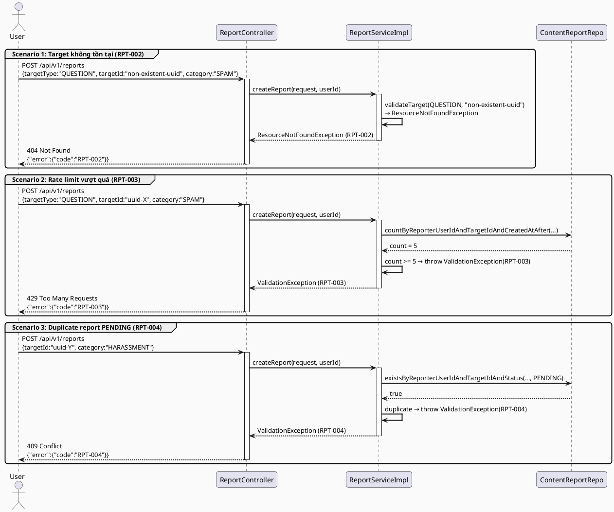
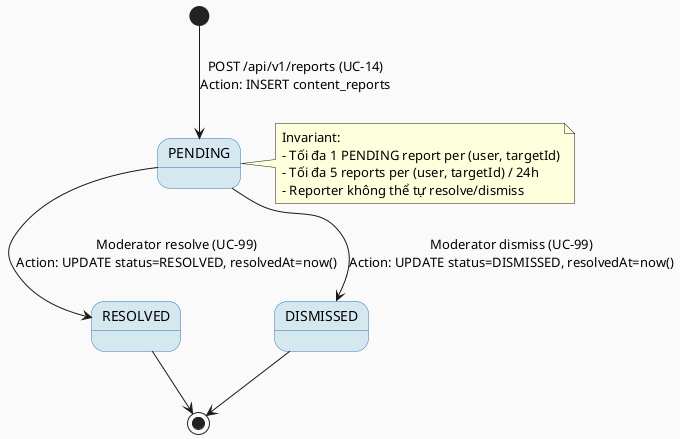

# ENGINEERING DOCUMENTATION STANDARD (EDS) v2.0
# Technical Design Specification — UC-14 Report Content or Account

| Field              | Value                             |
| ------------------ | --------------------------------- |
| **Document ID**    | `CB-MOD-IMP-014`                  |
| **Version**        | `1.0`                             |
| **Date**           | `2026-06-26`                      |
| **Status**         | `Draft`                           |
| **Document Owner** | `PhuongNT`                        |
| **Author**         | `AI Agent`                        |
| **Reviewed by**    | `[Tech Lead]`                     |
| **DPO Sign-off**   | `[ ] Pending`                     |
| **Approved by**    | `[Principal Architect]`           |
| **Last Review**    | `2026-06-26`                      |
| **Based on EDS**   | `v2.0`                            |

---

## CHANGELOG

> **Policy 4.4 — Immutable History:** Không bao giờ xóa thông tin cũ. Mọi thay đổi phải ghi vào bảng này.

| Ngày       | Người thực hiện | Nội dung thay đổi                                             |
| ---------- | --------------- | ------------------------------------------------------------- |
| 2026-06-26 | AI Agent        | Tạo tài liệu lần đầu cho UC-14 Report Content or Account     |

---

## MỤC LỤC

1. [Tổng quan Module](#1-tổng-quan-module)
2. [Ma trận Truy vết (Traceability Matrix)](#2-ma-trận-truy-vết-traceability-matrix)
3. [Architecture Decision Records (ADR)](#3-architecture-decision-records-adr)
4. [Non-Functional Requirements & SLA](#4-non-functional-requirements--sla)
5. [Static Modeling (Mô hình Tĩnh)](#5-static-modeling-mô-hình-tĩnh)
6. [Dynamic Modeling (Mô hình Động)](#6-dynamic-modeling-mô-hình-động)
7. [Domain Event Catalog](#7-domain-event-catalog)
8. [Interface Specification (Đặc tả Giao diện)](#8-interface-specification-đặc-tả-giao-diện)
9. [API Specification](#9-api-specification)
10. [Bảng mã lỗi (Error Codes)](#10-bảng-mã-lỗi-error-codes)
11. [Quy trình Triển khai (Step-by-Step)](#11-quy-trình-triển-khai-step-by-step)
12. [Rollback & Incident Runbook](#12-rollback--incident-runbook)
13. [Kịch bản Kiểm thử Chi tiết](#13-kịch-bản-kiểm-thử-chi-tiết)
14. [Phương pháp Xác minh](#14-phương-pháp-xác-minh)
15. [Mẫu thử thực tế (API Verification Samples)](#15-mẫu-thử-thực-tế-api-verification-samples)
16. [Bảng tổng hợp phân quyền (Authorization Matrix)](#16-bảng-tổng-hợp-phân-quyền-authorization-matrix)
17. [AI Prompt Constraints (CASE 2.0)](#17-ai-prompt-constraints-case-20)

---

## 1. Tổng quan Module

> UC-14 cho phép người dùng đã xác thực gửi báo cáo về nội dung vi phạm, tài khoản đáng ngờ, hoặc hành vi không phù hợp trên nền tảng CareBridge. Mỗi báo cáo được tạo với trạng thái PENDING và đưa vào hàng đợi kiểm duyệt (UC99). Entity `ContentReport` đã tồn tại trong package `content`. UC-14 mở rộng enum `ReportTargetType` (thêm EXPERT, USER) và thêm `ReportCategory` enum thay thế field `reasonCode`. Có anti-abuse: tối đa 5 report/user/24h trên cùng target, và không cho phép duplicate report đang PENDING.

| Field                     | Value                                                                              |
| ------------------------- | ---------------------------------------------------------------------------------- |
| **Module Name**           | `Report Content or Account`                                                        |
| **Bounded Context**       | `content` (existing — nơi `ContentReport` entity sinh sống)                       |
| **UC ID**                 | `UC-14`                                                                            |
| **SRS Reference**         | `3.1.1.14`                                                                         |
| **Platform**              | `Mobile App (Flutter) + Web App (React)`                                           |
| **Data Classification**   | `Internal`                                                                         |
| **Compliance Scope**      | `N/A` *(báo cáo không chứa PII của reporter trong payload — chỉ userId internal)* |
| **Upstream Dependencies** | `security (JWT Auth)`, `identity (User entity)`, `audit (AuditService)`           |
| **Downstream Consumers**  | `moderation (UC99 — ViewModerationQueue)`, `notification (alert moderators)`      |

---

## 2. Ma trận Truy vết (Traceability Matrix)

| Requirement ID    | Loại          | Mô tả yêu cầu                                                                   | Thành phần Code                                                       | Compliance Target | ADR liên quan |
| ----------------- | ------------- | -------------------------------------------------------------------------------- | --------------------------------------------------------------------- | ----------------- | ------------- |
| UC-14             | User Story    | Người dùng gửi báo cáo vi phạm về nội dung hoặc tài khoản                      | `ReportController.createReport()`                                     | —                 | ADR-001       |
| BR-RPT-AUTH       | Business Rule | Chỉ người dùng đã xác thực mới được gửi báo cáo                                 | `@PreAuthorize("isAuthenticated()")`                                  | —                 | —             |
| BR-RPT-TARGET     | Business Rule | targetType phải thuộc QUESTION, ANSWER, CONTENT, EXPERT, USER                   | `ReportTargetType` enum (mở rộng)                                     | —                 | ADR-001       |
| BR-RPT-CATEGORY   | Business Rule | category phải thuộc: INACCURATE_INFORMATION, DISGUISED_ADVERTISING, HARASSMENT, UNSAFE_ADVICE, SPAM, OTHER | `ReportCategory` enum (mới) | —              | ADR-001       |
| BR-RPT-TARGET-EXISTS | Business Rule | targetId phải tương ứng với entity thực sự tồn tại trong DB                  | `ReportServiceImpl.validateTarget()`                                  | —                 | —             |
| BR-RPT-RATE-LIMIT | Business Rule | Tối đa 5 report/user/24h trên cùng target                                       | `ReportServiceImpl.checkRateLimit()`                                  | —                 | ADR-002       |
| BR-RPT-DUPLICATE  | Business Rule | Không tạo report mới nếu user đã có report PENDING trên cùng targetId           | `ReportServiceImpl.checkDuplicate()`                                  | —                 | ADR-002       |
| BR-RPT-STATUS     | Business Rule | Report mới luôn có status PENDING                                                | `ContentReport.status = ReportStatus.PENDING`                         | —                 | —             |
| BR-RPT-AUDIT      | Business Rule | Mỗi report tạo thành công phải ghi vào audit log `ContentReported`              | `ReportServiceImpl` → `AuditService.emit(ContentReported)`            | —                 | —             |
| SRS-3.1.1.14      | Functional    | description tùy chọn, tối đa 500 ký tự                                          | `CreateReportRequest.description` — `@Size(max=500)`                  | —                 | —             |

---

## 3. Architecture Decision Records (ADR)

### ADR-001 — Mở rộng ReportTargetType và thêm ReportCategory enum

| Field        | Value                          |
| ------------ | ------------------------------ |
| **Status**   | `Accepted`                     |
| **Deciders** | `PhuongNT — Tech Lead`         |
| **Date**     | `2026-06-26`                   |
| **Supersedes** | `—`                          |

#### Bối cảnh (Context)
`ContentReport` entity hiện tại có `ReportTargetType` chỉ gồm QUESTION, ANSWER, CONTENT — thiếu EXPERT và USER. UC-14 yêu cầu báo cáo cả chuyên gia và tài khoản người dùng. Ngoài ra, field `reasonCode` là String tự do — không an toàn và không thể validate. UC-14 thay bằng enum `ReportCategory` có giá trị cố định.

#### Các phương án đã xem xét (Options Considered)

| Phương án | Mô tả                                                               | Ưu điểm                                      | Nhược điểm                                         |
| --------- | ------------------------------------------------------------------- | -------------------------------------------- | -------------------------------------------------- |
| A         | Mở rộng `ReportTargetType` thêm EXPERT, USER; thêm `ReportCategory` enum | Type-safe; backward compatible nếu thêm value | Cần Flyway migration để update CHECK constraint  |
| B         | Tạo entity mới `AccountReport` tách khỏi `ContentReport`            | Tách biệt rõ ràng                             | Duplicate logic; phức tạp hơn                      |

#### Quyết định (Decision)
Chọn **Phương án A**: mở rộng `ReportTargetType` thêm `EXPERT`, `USER`; thêm `ReportCategory` enum thay thế `reasonCode` String. Field `reasonCode` trong DB đổi tên thành `category` với kiểu VARCHAR(50). Migration cần cập nhật CHECK constraint (nếu có) hoặc cột.

#### Hệ quả (Consequences)

**Tích cực:**
- Type-safe category — không nhận garbage input.
- Dùng lại `ContentReport` entity — không cần schema mới phức tạp.

**Tiêu cực / Trade-offs:**
- Nếu `reasonCode` đã có dữ liệu trên production → migration phải handle null/existing values.
- CHECK constraint cần update theo enum mới.

**Compliance Impact:** N/A.

---

### ADR-002 — Rate Limit và Anti-Duplicate bằng DB Query

| Field        | Value                          |
| ------------ | ------------------------------ |
| **Status**   | `Accepted`                     |
| **Deciders** | `PhuongNT — Tech Lead`         |
| **Date**     | `2026-06-26`                   |

#### Bối cảnh (Context)
UC-14 yêu cầu anti-abuse: max 5 reports/user/24h trên cùng target, và không duplicate report PENDING. Có thể implement bằng DB query (đơn giản, không cần Redis).

#### Các phương án đã xem xét (Options Considered)

| Phương án | Mô tả                                                        | Ưu điểm              | Nhược điểm                       |
| --------- | ------------------------------------------------------------ | -------------------- | -------------------------------- |
| A         | Đếm report trong 24h bằng DB COUNT query                     | Không cần Redis      | Có thể chậm hơn nếu nhiều report |
| B         | Redis rate limit với sliding window                          | Fast                 | Ngoài stack được approve         |

#### Quyết định (Decision)
Chọn **Phương án A**: dùng `ContentReportRepository.countByReporterUserIdAndTargetIdAndCreatedAtAfter(userId, targetId, oneDayAgo)` để check rate limit, và `ContentReportRepository.existsByReporterUserIdAndTargetIdAndStatus(userId, targetId, PENDING)` để check duplicate.

#### Hệ quả (Consequences)

**Tích cực:** Không cần infrastructure mới (không có Redis trong stack).

**Tiêu cực / Trade-offs:**
- Dưới high concurrency, race condition có thể cho phép vượt quá 5 reports — chấp nhận được ở M3 Alpha vì tần suất thấp. M4 có thể thêm DB-level constraint.

---

## 4. Non-Functional Requirements & SLA

### 4.1. Performance & Availability

| Category     | Requirement              | Target SLA  | Measurement Method | Compliance Basis |
| ------------ | ------------------------ | ----------- | ------------------- | ---------------- |
| Latency      | API response (p99)       | `< 300ms`   | k6 load test        | —                |
| Availability | Uptime (monthly)         | `99.9%`     | Uptime monitor      | —                |
| Throughput   | Concurrent reports/s     | `50 req/s`  | Load test           | —                |

### 4.2. Data Integrity & Retention

| Category    | Requirement                          | Target  | Verification Method       | Compliance Basis |
| ----------- | ------------------------------------ | ------- | ------------------------- | ---------------- |
| Durability  | Không mất report khi tạo            | RPO = 0 | Transaction log           | —                |
| Retention   | Audit log ContentReported            | 7 năm   | DB backup policy          | —                |
| Consistency | Report ↔ Audit trong cùng TX        | 100%    | `@Transactional` rollback | —                |

### 4.3. Security

| Category              | Requirement         | Target     | Verification Method  | Compliance Basis |
| --------------------- | ------------------- | ---------- | -------------------- | ---------------- |
| Encryption in transit | Tất cả endpoint     | TLS 1.3+   | SSL Labs scan        | —                |
| Access control        | Authenticated only  | Reject 401 | Auth Matrix (§16)    | —                |
| Anti-abuse            | Rate limit 5/24h    | DB check   | Integration test     | —                |

### 4.4. Scalability & Capacity Planning

> Dự kiến: 10,000 users, 100 reports/day. Index trên `(reporter_user_id, target_id, created_at)` và `(reporter_user_id, target_id, status)` để đảm bảo rate limit query nhanh.

---

## 5. Static Modeling (Mô hình Tĩnh)

### 5.1. Class Diagram (PlantUML)



### 5.2. Data Structure (Flyway SQL Migration)

> `ContentReport` entity đã tồn tại. Migration cần: (1) thêm EXPERT, USER vào ReportTargetType; (2) đổi `reason_code` → `category` với enum value; (3) thêm index composite.

```sql
-- === UC-14 REPORT MIGRATION ===
-- File: V{n}__extend_content_reports_for_uc14.sql

-- Bước 1: Đổi tên column reason_code → category và thay đổi constraint
-- (Giả sử reason_code chưa có CHECK constraint nghiêm ngặt)
ALTER TABLE content_reports
    RENAME COLUMN reason_code TO category;

ALTER TABLE content_reports
    ALTER COLUMN category TYPE VARCHAR(50);

-- Bước 2: Thêm các value mới vào target_type
-- (PostgreSQL enum: nếu target_type là VARCHAR thì không cần migrate)
-- Nếu là CHECK CONSTRAINT:
ALTER TABLE content_reports
    DROP CONSTRAINT IF EXISTS chk_target_type;

ALTER TABLE content_reports
    ADD CONSTRAINT chk_target_type
        CHECK (target_type IN ('QUESTION','ANSWER','CONTENT','EXPERT','USER'));

-- Bước 3: Thêm CHECK CONSTRAINT cho category
ALTER TABLE content_reports
    ADD CONSTRAINT chk_category
        CHECK (category IN (
            'INACCURATE_INFORMATION','DISGUISED_ADVERTISING','HARASSMENT',
            'UNSAFE_ADVICE','SPAM','OTHER'
        ));

-- Bước 4: Thêm composite indexes cho rate limit và duplicate check
CREATE INDEX IF NOT EXISTS idx_content_reports_rate_limit
    ON content_reports (reporter_user_id, target_id, created_at DESC);

CREATE INDEX IF NOT EXISTS idx_content_reports_duplicate
    ON content_reports (reporter_user_id, target_id, status)
    WHERE status = 'PENDING';

-- Bước 5: Index cho moderator queue
CREATE INDEX IF NOT EXISTS idx_content_reports_status_created
    ON content_reports (status, created_at DESC)
    WHERE status = 'PENDING';
```

---

## 6. Dynamic Modeling (Mô hình Động)

### 6.1. Sequence Diagram — Happy Path (PlantUML)



### 6.2. Sequence Diagram — Error Path (PlantUML)



### 6.3. State Machine — ContentReport Status



> **Invariant bất biến:**
> - Một user chỉ có tối đa 1 report PENDING trên cùng một targetId.
> - Tổng report của 1 user trên cùng targetId trong 24h không vượt quá 5.
> - Status chỉ chuyển: PENDING → RESOLVED hoặc PENDING → DISMISSED (bởi moderator).
> - Audit log `ContentReported` không bao giờ bị DELETE.

---

## 7. Domain Event Catalog

### 7.1. Events Published (Phát ra)

| Event Name         | Trigger                           | Publisher          | Subscriber(s)                       | Payload Schema             | Async? |
|--------------------|-----------------------------------|--------------------|-------------------------------------|----------------------------|--------|
| `ContentReported`  | Report tạo thành công             | `ReportServiceImpl`| `AuditService`, `ModerationService` | `ContentReportedEvent.java`| No     |

### 7.2. Events Consumed (Tiêu thụ)

| Event Name | Source | Handler | Action thực hiện |
|------------|--------|---------|------------------|
| _(Không có)_ | — | — | — |

### 7.3. Payload Schema

```java
// ContentReportedEvent.java
// @version 1.0
// Package: com.carebridge.backend.content.event
public record ContentReportedEvent(
    String  eventId,        // UUID.randomUUID()
    String  eventType,      // "ContentReported"
    Instant occurredAt,     // Instant.now()
    String  version,        // "1.0"
    Payload payload,
    Metadata metadata
) {
    public record Payload(
        UUID             reportId,      // ID của ContentReport vừa tạo
        ReportTargetType targetType,    // QUESTION/ANSWER/CONTENT/EXPERT/USER
        UUID             targetId,      // ID của entity bị báo cáo
        ReportCategory   category,      // HARASSMENT/SPAM/...
        UUID             reporterUserId // Người gửi báo cáo
        // KHÔNG bao gồm description để tránh log sensitive content
    ) {}

    public record Metadata(
        String correlationId, // Request trace ID
        String causedBy       // reporterUserId (dạng string)
    ) {}
}
```

---

## 8. Interface Specification (Đặc tả Giao diện)

### 8.1. Service Interface

```java
// CreateReportRequest.java — Input DTO
// Package: com.carebridge.backend.content.dto.request
// @version 1.0
public class CreateReportRequest {

    @NotNull(message = "Loại đối tượng báo cáo không được rỗng")
    private ReportTargetType targetType;

    @NotNull(message = "ID đối tượng báo cáo không được rỗng")
    private UUID targetId;

    @NotNull(message = "Danh mục báo cáo không được rỗng")
    private ReportCategory category;

    @Size(max = 500, message = "Mô tả không được vượt quá 500 ký tự")
    private String description;  // optional
}

// CreateReportResponse.java — Output DTO
// @version 1.0
public class CreateReportResponse {
    private UUID         reportId;
    private ReportStatus status;    // luôn là PENDING
    private Instant      createdAt;
}

// IReportService.java — Service Contract
// @version 1.0
// Package: com.carebridge.backend.content.service
public interface IReportService {

    /**
     * Tạo báo cáo vi phạm mới.
     * @param request        Dữ liệu báo cáo đã validated
     * @param reporterUserId ID người báo cáo từ JWT (không từ request body)
     * @return CreateReportResponse  Report ID và status PENDING
     * @throws ValidationException         [RPT-001] Khi request data không hợp lệ
     * @throws ResourceNotFoundException   [RPT-002] Khi targetId không tồn tại
     * @throws ValidationException         [RPT-003] Khi vượt rate limit 5/24h
     * @throws ValidationException         [RPT-004] Khi đã có report PENDING trên cùng target
     */
    CreateReportResponse createReport(CreateReportRequest request, UUID reporterUserId);
}
```

### 8.2. Repository Interface

```java
// IContentReportRepository.java (mở rộng từ existing ContentReportRepository)
// @version 1.0
// Package: com.carebridge.backend.content.repository
public interface IContentReportRepository extends JpaRepository<ContentReport, UUID> {

    /**
     * Đếm số reports của user trên target trong 24h — dùng cho rate limit check.
     * @param userId    ID người báo cáo
     * @param targetId  ID entity bị báo cáo
     * @param since     Mốc thời gian (now - 24h)
     */
    int countByReporterUserIdAndTargetIdAndCreatedAtAfter(UUID userId, UUID targetId, Instant since);

    /**
     * Kiểm tra duplicate — đã có report PENDING chưa.
     */
    boolean existsByReporterUserIdAndTargetIdAndStatus(UUID userId, UUID targetId, ReportStatus status);

    // Không có delete() — records lưu vĩnh viễn cho mục đích audit.
}
```

---

## 9. API Specification

### 9.1. Endpoints Table

| Method  | Path               | Auth Level  | Required Roles                                | Rate Limit | Idempotent? |
|---------|--------------------|-------------|-----------------------------------------------|------------|-------------|
| `POST`  | `/api/v1/reports`  | JWT Bearer  | `ROLE_MOTHER`, `ROLE_EXPERT`, `ROLE_ADMIN`   | 20/min     | No          |

### 9.2. Request / Response Schemas

#### `POST /api/v1/reports` — Tạo báo cáo mới

**Request Headers:**
```
Authorization: Bearer {JWT_TOKEN}
Content-Type: application/json
X-Correlation-Id: {uuid}
```

**Request Body:**
```json
{
  "targetType": "QUESTION",
  "targetId": "550e8400-e29b-41d4-a716-446655440001",
  "category": "HARASSMENT",
  "description": "Câu hỏi này chứa thông tin sai lệch về thuốc và có thể gây nguy hiểm."
}
```

**Validation Rules:**
- `targetType`: bắt buộc; phải thuộc `{QUESTION, ANSWER, CONTENT, EXPERT, USER}`
- `targetId`: bắt buộc; UUID hợp lệ; entity phải tồn tại trong DB
- `category`: bắt buộc; phải thuộc `{INACCURATE_INFORMATION, DISGUISED_ADVERTISING, HARASSMENT, UNSAFE_ADVICE, SPAM, OTHER}`
- `description`: không bắt buộc; tối đa 500 ký tự; plain text (không lưu HTML)

**Response — 201 Created (Happy Path):**
```json
{
  "data": {
    "reportId": "660e8400-e29b-41d4-a716-446655440099",
    "status": "PENDING",
    "createdAt": "2026-06-26T10:00:00.000Z"
  },
  "message": "Báo cáo đã được gửi thành công và đang chờ kiểm duyệt",
  "timestamp": "2026-06-26T10:00:00.000Z"
}
```

**Response — 404 Not Found (RPT-002):**
```json
{
  "error": {
    "code": "RPT-002",
    "message": "Không tìm thấy đối tượng bị báo cáo"
  }
}
```

**Response — 429 Too Many Requests (RPT-003):**
```json
{
  "error": {
    "code": "RPT-003",
    "message": "Bạn đã gửi quá nhiều báo cáo về nội dung này trong 24 giờ qua. Vui lòng thử lại sau."
  }
}
```

**Response — 409 Conflict (RPT-004):**
```json
{
  "error": {
    "code": "RPT-004",
    "message": "Bạn đã có báo cáo đang chờ xử lý cho nội dung này"
  }
}
```

---

## 10. Bảng mã lỗi (Error Codes)

> Tiền tố mã lỗi: `RPT-` cho Report module.

| Code      | HTTP Status | Message (EN)                             | Message (VI)                                                        | Trigger Condition                                        |
| --------- | ----------- | ---------------------------------------- | ------------------------------------------------------------------- | -------------------------------------------------------- |
| `RPT-001` | 400         | Validation failed                        | Dữ liệu báo cáo không hợp lệ                                        | targetType/category null hoặc không hợp lệ; description > 500 |
| `RPT-002` | 404         | Target not found                         | Không tìm thấy đối tượng bị báo cáo                                 | targetId không tương ứng với entity nào trong DB         |
| `RPT-003` | 429         | Rate limit exceeded                      | Bạn đã gửi quá nhiều báo cáo trong 24 giờ qua                       | Count reports của user trên cùng target trong 24h >= 5  |
| `RPT-004` | 409         | Duplicate pending report                 | Bạn đã có báo cáo đang chờ xử lý cho nội dung này                   | existsByReporterUserIdAndTargetIdAndStatus == true       |
| `RPT-005` | 401         | Authentication required                  | Yêu cầu đăng nhập                                                   | Không có JWT hoặc JWT hết hạn                            |
| `RPT-006` | 500         | Internal error                           | Lỗi hệ thống                                                        | DB error, audit service exception                        |

---

## 11. Quy trình Triển khai (Step-by-Step)

### 11.1. Prerequisites

- [ ] ADR-001 và ADR-002 đã được Accepted (xem §3)
- [ ] Blueprint đã được Principal Architect approve
- [ ] Môi trường staging đã sẵn sàng
- [ ] `ContentReport` entity đã tồn tại và migration V1 đã applied

### 11.2. Pre-Migration Checklist

- [ ] Đã backup DB: `pg_dump -h [host] -U [user] carebridge > backup_20260626.sql`
- [ ] Migration `V{n}__extend_content_reports_for_uc14.sql` đã chạy thành công trên staging ≥ 24 giờ
- [ ] Kiểm tra existing data trong `content_reports.reason_code` trước khi rename column
- [ ] Rollback script đã được test trên staging

### 11.3. Implementation Steps

#### Chặng 1 — Flyway Migration

```sql
-- File: src/main/resources/db/migration/V{n}__extend_content_reports_for_uc14.sql
-- Xem DDL đầy đủ tại §5.2
ALTER TABLE content_reports RENAME COLUMN reason_code TO category;
ALTER TABLE content_reports ADD CONSTRAINT chk_target_type ...;
CREATE INDEX IF NOT EXISTS idx_content_reports_rate_limit ...;
```

```bash
./mvnw flyway:migrate
```

#### Chặng 2 — Cập nhật Enum và Entity

```java
// Bước 1: Mở rộng ReportTargetType.java (thêm EXPERT, USER)
// File: com/carebridge/backend/content/entity/ReportTargetType.java

// Bước 2: Tạo ReportCategory.java (enum mới)
// File: com/carebridge/backend/content/entity/ReportCategory.java
public enum ReportCategory {
    INACCURATE_INFORMATION,
    DISGUISED_ADVERTISING,
    HARASSMENT,
    UNSAFE_ADVICE,
    SPAM,
    OTHER
}

// Bước 3: Cập nhật ContentReport.java — đổi field reasonCode → category
// @Column(name = "category") private ReportCategory category;
```

#### Chặng 3 — DTO, Service, Controller

```java
// Tạo các file theo thứ tự:
// 1. dto/request/CreateReportRequest.java
// 2. dto/response/CreateReportResponse.java
// 3. service/IReportService.java (§8.1)
// 4. service/impl/ReportServiceImpl.java
// 5. controller/ReportController.java
// 6. event/ContentReportedEvent.java (§7.3)
```

#### Chặng 4 — Thêm Repository Methods

```java
// Thêm vào ContentReportRepository.java:
int countByReporterUserIdAndTargetIdAndCreatedAtAfter(UUID userId, UUID targetId, Instant since);
boolean existsByReporterUserIdAndTargetIdAndStatus(UUID userId, UUID targetId, ReportStatus status);
```

#### Chặng 5 — Verification sau deploy

```bash
curl -X POST https://[host]/api/v1/reports \
  -H "Authorization: Bearer [JWT]" \
  -H "Content-Type: application/json" \
  -d '{"targetType":"QUESTION","targetId":"[uuid]","category":"SPAM"}'
# Expected: 201 Created
```

### 11.4. Deployment Checklist

- [ ] Migration chạy thành công — `category` column tồn tại
- [ ] Health check 200
- [ ] POST `/api/v1/reports` với data hợp lệ → 201 Created
- [ ] POST với targetId không tồn tại → 404 + `RPT-002`
- [ ] POST lần 6 trên cùng target trong 24h → 429 + `RPT-003`
- [ ] POST duplicate PENDING → 409 + `RPT-004`
- [ ] POST không có JWT → 401
- [ ] Audit log có `ContentReported` event sau khi tạo thành công

---

## 12. Rollback & Incident Runbook

### 12.1. Điều kiện kích hoạt Rollback

| Điều kiện                         | Ngưỡng              | Người quyết định        |
| --------------------------------- | ------------------- | ----------------------- |
| Error rate tăng đột biến          | > 5% trong 5 phút   | On-call Engineer        |
| Rate limit không hoạt động        | Reports > 5/24h     | Tech Lead               |
| Migration fail (column rename)     | Bất kỳ lỗi          | Tech Lead               |
| Duplicate report được tạo         | Bất kỳ case nào     | Tech Lead               |

### 12.2. Rollback Procedure

```bash
# Bước 1: Revert column rename
psql -h $DB_HOST -U $DB_USER -d $DB_NAME \
  -c "ALTER TABLE content_reports RENAME COLUMN category TO reason_code;"
psql -h $DB_HOST -U $DB_USER -d $DB_NAME \
  -c "DROP INDEX IF EXISTS idx_content_reports_rate_limit;"
psql -h $DB_HOST -U $DB_USER -d $DB_NAME \
  -c "DROP INDEX IF EXISTS idx_content_reports_duplicate;"
psql -h $DB_HOST -U $DB_USER -d $DB_NAME \
  -c "DELETE FROM flyway_schema_history WHERE version = '{n}';"

# Bước 2: Re-deploy phiên bản cũ
kubectl rollout undo deployment/carebridge-api

# Bước 3: Verify
curl -X GET https://[host]/api/v1/health
```

### 12.3. Notification Protocol

| Thời điểm          | Người nhận    | Kênh              | Template                                               |
| ------------------ | ------------- | ----------------- | ------------------------------------------------------ |
| Ngay khi phát hiện | On-call team  | Slack `#incident` | "RPT UC-14 incident detected: [mô tả]"                |
| Trong 30 phút      | Tech Lead     | Email/Slack       | Báo cáo và action plan                                 |

### 12.4. Post-Incident Review (PIR)

> Bắt buộc hoàn thành PIR trong vòng **48 giờ** sau khi incident resolve.
- **Timeline, Root Cause, Impact, Remediation, Prevention** (xem template §12.4 TDS template).

---

## 13. Kịch bản Kiểm thử Chi tiết

> **Policy:** Mọi test dùng dữ liệu `SYNTHETIC`.

### 13.1. Unit Tests

#### TC-UNIT-001 — Tạo báo cáo hợp lệ (Happy Path)

```gherkin
Feature: Report Content or Account
  Background:
    Given test data classification: SYNTHETIC
    And user "reporter-001" đã xác thực với JWT hợp lệ
    And DB có question "question-001" đang ACTIVE

  Scenario: Tạo báo cáo về câu hỏi thành công
    Given request: targetType=QUESTION, targetId="question-001", category=HARASSMENT, description="Nội dung xúc phạm"
    When ReportServiceImpl.createReport(request, "reporter-001") được gọi
    Then ContentReport mới được INSERT vào DB với status=PENDING
    And response.status = PENDING
    And AuditService.emit(ContentReported) được gọi 1 lần
```

#### TC-UNIT-002 — Rate limit vượt quá (RPT-003)

```gherkin
  Scenario: Báo cáo lần thứ 6 trong 24h
    Given user "reporter-001" đã gửi 5 reports về "question-001" trong 24h qua
    When ReportServiceImpl.createReport(request{targetId:"question-001"}, "reporter-001") được gọi
    Then ValidationException được ném với code "RPT-003"
    And không có INSERT mới vào content_reports
```

#### TC-UNIT-003 — Duplicate report PENDING (RPT-004)

```gherkin
  Scenario: Đã có report PENDING trên cùng target
    Given user "reporter-001" đã có report PENDING trên "question-001"
    When ReportServiceImpl.createReport(request{targetId:"question-001"}, "reporter-001") được gọi
    Then ValidationException được ném với code "RPT-004"
```

#### TC-UNIT-004 — Target không tồn tại (RPT-002)

```gherkin
  Scenario: targetId không tồn tại trong DB
    Given request: targetType=QUESTION, targetId="non-existent-uuid"
    When ReportServiceImpl.createReport(request, "reporter-001") được gọi
    Then ResourceNotFoundException được ném với code "RPT-002"
```

### 13.2. Integration Tests

#### TC-INT-001 — Service + Repository phối hợp đúng

```gherkin
  Scenario: Report được lưu đúng vào DB
    Given test data classification: SYNTHETIC
    And PostgreSQL container running
    And seed: user "reporter-int-001" và question "question-int-001"
    When ReportServiceImpl.createReport(validRequest, "reporter-int-001") được gọi
    Then contentReportRepository.save() được gọi 1 lần
    And DB có record với reporter_user_id="reporter-int-001", target_id="question-int-001", status="PENDING"
    And DB không có record thứ 2 (không duplicate)
```

### 13.3. E2E / Security Tests

#### TC-E2E-001 — Luồng hoàn chỉnh qua API

```gherkin
  Scenario: POST /api/v1/reports thành công
    Given user đã đăng nhập với JWT hợp lệ role ROLE_MOTHER
    When POST /api/v1/reports với {targetType:"QUESTION", targetId:"[uuid]", category:"SPAM"}
    Then response status là 201
    And response.data.status = "PENDING"
    And response.data.reportId là UUID hợp lệ

  Scenario: Không có JWT → 401
    When POST /api/v1/reports được gọi không có Authorization
    Then response status là 401

  Scenario: description quá 500 ký tự → 400
    Given description = "A" * 501
    When POST /api/v1/reports được gọi
    Then response status là 400
    And response.error.code = "RPT-001"

  Scenario: XSS trong description
    Given description = "<script>alert(1)</script>nội dung xấu"
    When POST /api/v1/reports được gọi
    Then response status là 201 (description được lưu nhưng sanitized hoặc stored as-is trong DB — không render về client)
    And DB không expose script trong API response
```

---

## 14. Phương pháp Xác minh

### 14.1. Database Inspection

```sql
-- Verify report được tạo đúng
SELECT report_id, target_id, target_type, category, status, reporter_user_id, created_at
FROM content_reports
WHERE reporter_user_id = '{userId}'
ORDER BY created_at DESC
LIMIT 5;

-- Verify rate limit (count trong 24h)
SELECT COUNT(*) FROM content_reports
WHERE reporter_user_id = '{userId}'
  AND target_id = '{targetId}'
  AND created_at > NOW() - INTERVAL '24 hours';

-- Verify không có duplicate PENDING
SELECT COUNT(*) FROM content_reports
WHERE reporter_user_id = '{userId}'
  AND target_id = '{targetId}'
  AND status = 'PENDING';
-- Expected: 0 hoặc 1

-- Verify audit log
SELECT * FROM audit_logs
WHERE entity_type = 'ContentReport'
ORDER BY created_at DESC LIMIT 5;
```

### 14.2. Log / Audit Verification

```bash
# Verify ContentReported event trong logs
kubectl logs -l app=carebridge-api | grep '"eventType":"ContentReported"' | tail -5

# Verify không có PII trong audit payload
kubectl logs -l app=carebridge-api | grep "ContentReported" | jq 'select(.eventType=="ContentReported") | .payload'
# Expected: không có description trong payload (theo §7.3 spec)
```

### 14.3. Tool-based Verification

```bash
# Verify TLS 1.3
openssl s_client -connect [host]:443 -tls1_3 2>&1 | grep "Protocol"
```

---

## 15. Mẫu thử thực tế (API Verification Samples)

### 15.1. Happy Path

```bash
TOKEN=$(curl -s -X POST https://[host]/api/v1/auth/login \
  -H "Content-Type: application/json" \
  -d '{"email":"test@example.com","password":"TestPass123!"}' | jq -r '.data.accessToken')

curl -X POST https://[host]/api/v1/reports \
  -H "Authorization: Bearer $TOKEN" \
  -H "Content-Type: application/json" \
  -H "X-Correlation-Id: $(uuidgen)" \
  -d '{
    "targetType": "QUESTION",
    "targetId": "550e8400-e29b-41d4-a716-446655440001",
    "category": "HARASSMENT",
    "description": "Câu hỏi chứa thông tin gây hại"
  }'
```

**Expected Response (201):**
```json
{
  "data": {
    "reportId": "660e8400-e29b-41d4-a716-446655440099",
    "status": "PENDING",
    "createdAt": "2026-06-26T10:00:00.000Z"
  },
  "message": "Báo cáo đã được gửi thành công"
}
```

### 15.2. Error Paths

```bash
# Rate limit exceeded → 429
for i in {1..6}; do
  curl -X POST https://[host]/api/v1/reports \
    -H "Authorization: Bearer $TOKEN" \
    -H "Content-Type: application/json" \
    -d '{"targetType":"QUESTION","targetId":"[same-uuid]","category":"SPAM"}'
done
# Lần thứ 6 Expected: 429 + RPT-003

# Không có JWT → 401
curl -X POST https://[host]/api/v1/reports \
  -H "Content-Type: application/json" \
  -d '{"targetType":"QUESTION","targetId":"[uuid]","category":"SPAM"}'
```

---

## 16. Bảng tổng hợp phân quyền (Authorization Matrix)

| Endpoint                | `GUEST` | `ROLE_MOTHER` | `ROLE_EXPERT` | `ROLE_ADMIN` | `ROLE_MODERATOR` | `ROLE_SYSTEM` |
| ----------------------- | ------- | ------------- | ------------- | ------------ | ---------------- | ------------- |
| `POST /api/v1/reports`  | ❌      | ✅            | ✅            | ✅           | ✅               | ✅            |

**Chú thích:**
- ✅ = Được phép tạo report về nội dung/tài khoản khác
- ❌ = 401 Unauthorized
- ROLE_MODERATOR xử lý report qua UC99 (không phải UC14)

---

## 17. AI Prompt Constraints (CASE 2.0)

### 17.1 Constraint Summary Table

| # | Constraint | Source (ADR/BR) | Last Verified |
| - | ---------- | --------------- | ------------- |
| C1 | `reporterUserId` PHẢI lấy từ JWT Principal — KHÔNG từ request body | `BR-RPT-AUTH` | `2026-06-26` |
| C2 | Trước khi save, PHẢI check rate limit: `countBy...AndCreatedAtAfter(..., now()-24h) >= 5` → throw RPT-003 | `ADR-002; BR-RPT-RATE-LIMIT` | `2026-06-26` |
| C3 | Trước khi save, PHẢI check duplicate: `existsBy...AndStatus(PENDING)` == true → throw RPT-004 | `ADR-002; BR-RPT-DUPLICATE` | `2026-06-26` |
| C4 | `targetId` PHẢI được validate tồn tại trong DB theo `targetType` — không bỏ qua bước này | `BR-RPT-TARGET-EXISTS` | `2026-06-26` |
| C5 | `ContentReport.status` PHẢI là `ReportStatus.PENDING` khi tạo mới — không nhận status từ client | `BR-RPT-STATUS` | `2026-06-26` |
| C6 | `AuditService.emit(ContentReported)` PHẢI gọi trong cùng `@Transactional` với save | `BR-RPT-AUDIT` | `2026-06-26` |
| C7 | Controller chỉ validate DTO và delegate — không có business logic | `CLAUDE.md §Architecture` | `2026-06-26` |
| C8 | Không dùng Redis cho rate limit — dùng DB query COUNT với index `idx_content_reports_rate_limit` | `ADR-002; CLAUDE.md §Stack` | `2026-06-26` |

### 17.2 Constraint Injection Block

```
[CONSTRAINT BLOCK — Module: Report — UC-14 Report Content or Account]
Theo TDS CB-MOD-IMP-014 và các ADR liên quan:

1. (C1) reporterUserId PHẢI lấy từ JWT Principal. KHÔNG nhận từ request body hay path param.
2. (C2) Rate limit: TRƯỚC KHI save, COUNT reports của user trên cùng targetId trong 24h. Nếu >= 5 → throw ValidationException("RPT-003"). Dùng repository method countByReporterUserIdAndTargetIdAndCreatedAtAfter().
3. (C3) Anti-duplicate: TRƯỚC KHI save, check existsByReporterUserIdAndTargetIdAndStatus(userId, targetId, PENDING). Nếu true → throw ValidationException("RPT-004").
4. (C4) Validate target: Kiểm tra targetId tồn tại trong bảng tương ứng với targetType. Nếu không → throw ResourceNotFoundException("RPT-002").
5. (C5) status PHẢI là ReportStatus.PENDING khi tạo. KHÔNG đọc status từ request.
6. (C6) AuditService.emit(ContentReportedEvent) trong cùng @Transactional với repository.save().
7. (C7) Controller: chỉ @Valid, extract principal, delegate sang IReportService.
8. (C8) Rate limit dùng DB query — KHÔNG dùng Redis hay in-memory counter.

[CONTEXT BLOCK]
- Bounded Context: content
- Data Classification: Internal
- Existing entity: ContentReport tại com.carebridge.backend.content.entity
- Existing enums: ReportStatus, ReportTargetType (cần thêm EXPERT, USER)
- Error codes: §10 (prefix RPT-)
- Auth matrix: §16

[TASK BLOCK]
Implement UC-14 thỏa mãn constraints C1–C8.
Output phải tuân thủ §8 Interface Specification.
Tests phải cover §13 Test Scenarios.
```

### 17.3 Constraint Quality Checklist

- [x] Mỗi constraint traceable về ADR hoặc BR
- [x] Không có constraint generic
- [x] Mỗi constraint có `Last Verified` ≤ 2 sprints
- [x] Constraint block có ≥ 3 constraints (có 8)
- [x] Reference §8 Interface và §16 Auth Matrix

### 17.4 Anti-Pattern Detection

| AP-ID     | Anti-Pattern          | Dấu hiệu                                             | Hành động                                  |
| --------- | --------------------- | ---------------------------------------------------- | ------------------------------------------ |
| AP-AI-001 | Unconstrained Gen     | Code không match C1-C8                               | Reject — inject lại constraints            |
| AP-AI-003 | Implicit Decision     | Dùng Redis rate limit không có trong ADR             | Reject — ADR-002 đã quyết định DB query   |
| AP-AI-005 | Hallucinated Contract | Import ReportService không match §8.1 interface      | Reject — verify contract                   |

---

## PHỤ LỤC

### A. Glossary

| Thuật ngữ           | Định nghĩa                                                                |
| ------------------- | ------------------------------------------------------------------------- |
| Rate limit          | Giới hạn số report tối đa trong khoảng thời gian nhất định (5/24h)       |
| Anti-duplicate      | Kiểm tra không tạo report trùng khi đã có PENDING report trên cùng target|
| ReportCategory      | Enum phân loại lý do báo cáo — thay thế reasonCode String tự do          |
| ContentReported     | Domain event phát ra khi report được tạo thành công                       |
| Moderation Queue    | Hàng đợi báo cáo chờ moderator xử lý (UC99)                              |

### B. Tài liệu tham chiếu

| Document | Link / Path |
| -------- | ----------- |
| SRS UC-14 | `01_Requirements/SRS.md §3.1.1.14` |
| ContentReport entity | `05_Development/CareBridgeAPI/src/main/java/com/carebridge/backend/content/entity/ContentReport.java` |
| ReportStatus enum | `05_Development/CareBridgeAPI/src/main/java/com/carebridge/backend/content/entity/ReportStatus.java` |
| ReportTargetType enum | `05_Development/CareBridgeAPI/src/main/java/com/carebridge/backend/content/entity/ReportTargetType.java` |
| OWASP A03:2021 | https://owasp.org/Top10/A03_2021-Injection/ |
