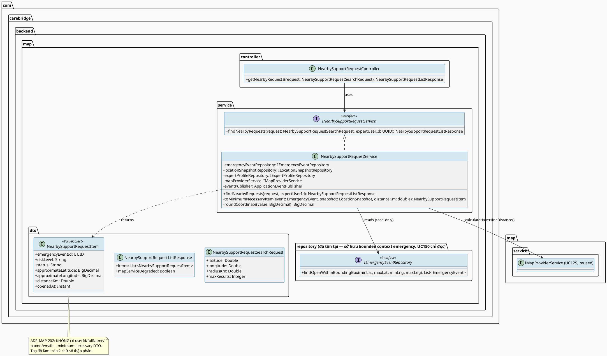
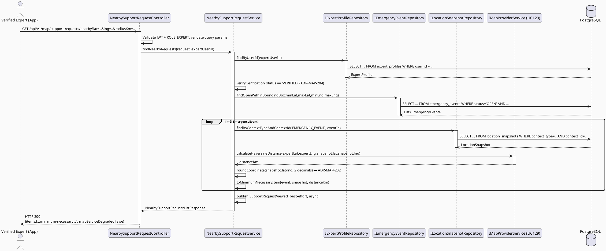
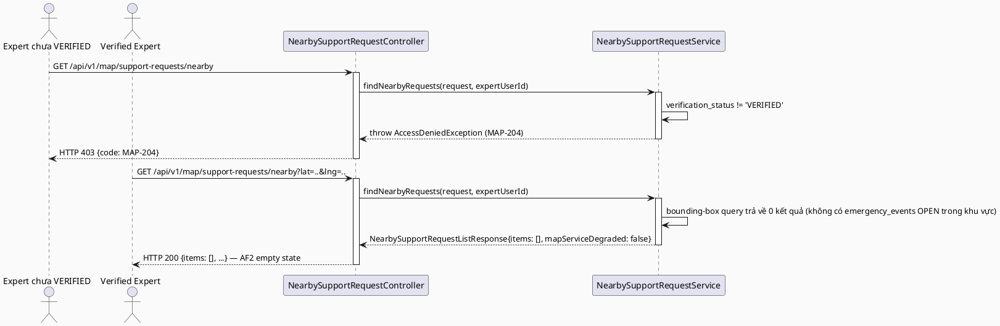
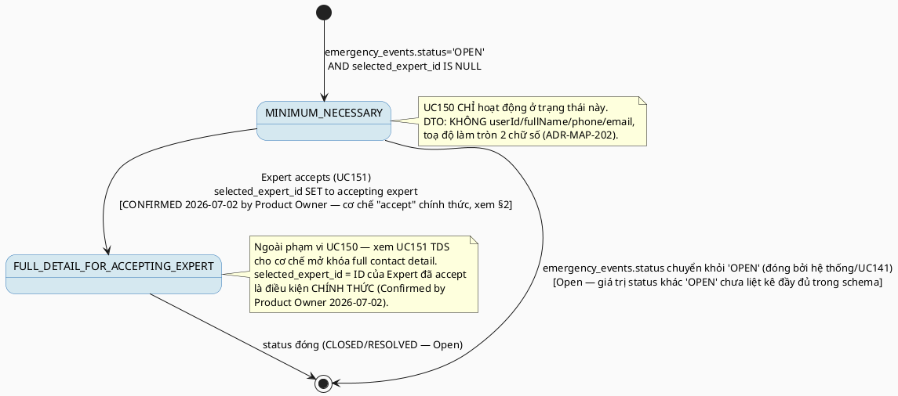

# ENGINEERING DOCUMENTATION STANDARD (EDS) v2.0
# UC150 — View Nearby Support Requests

| Field | Value |
|-------|-------|
| **Document ID** | `CB-MAP-IMP-003` |
| **Version** | `1.0` |
| **Date** | `2026-07-02` |
| **Status** | `Draft` |
| **Document Owner** | `TV4 - Lâm` |
| **Author** | `AI Agent — Tech Lead` |
| **Reviewed by** | `[ ] Pending` |
| **DPO Sign-off** | `[ ] Pending` *(module đọc location + emergency PII của Mother, bắt buộc DPO review trước Approve)* |
| **Approved by** | `[ ] Pending` |
| **Last Review** | `2026-07-02` |
| **Based on EDS** | `v2.0` |

---

## CHANGELOG

| Ngày | Người thực hiện | Nội dung thay đổi |
|------|-----------------|-------------------|
| 2026-07-02 | AI Agent — Tech Lead | Tạo tài liệu lần đầu — TDS cho UC150 View Nearby Support Requests, mở đầu chuỗi expert-side nearby-support workflow (UC150 → UC151 → UC152) |
| 2026-07-02 | AI Agent — Tech Lead | **Đóng Open Item (RG-6 — gating mechanism):** Product Owner đã CONFIRMED cơ chế "accept" — `selected_expert_id IS NULL AND status='OPEN'` = chưa accept, `selected_expert_id = <currentExpertId>` = đã accept bởi Expert này. Quyết định dựa trên schema hiện có (`V1__init_schema.sql`) và tính hội tụ độc lập giữa UC150/UC151/UC152. Không cần migration/bảng mới. Cập nhật §2, §3 ADR-MAP-201, §6.3, §17 tương ứng — status ngôn ngữ chuyển từ "Open/suy luận" sang "Confirmed/Accepted". Các Open Item khác (radius/maxResults mặc định, `context_type` convention với UC141, v.v.) KHÔNG thay đổi. |

---

## MỤC LỤC

1. [Tổng quan Module](#1-tổng-quan-module)
2. [Ma trận Truy vết (Traceability Matrix)](#2-ma-trận-truy-vết-traceability-matrix)
3. [Architecture Decision Records (ADR)](#3-architecture-decision-records-adr)
4. [Non-Functional Requirements & SLA](#4-non-functional-requirements--sla)
5. [Static Modeling (Mô hình Tĩnh)](#5-static-modeling-mô-hình-tĩnh)
6. [Dynamic Modeling (Mô hình Động)](#6-dynamic-modeling-mô-hình-động)
7. [Domain Event Catalog](#7-domain-event-catalog)
8. [Interface Specification (Đặc tả Giao diện)](#8-interface-specification-đặc-tả-giao-diện)
9. [API Specification](#9-api-specification)
10. [Bảng mã lỗi (Error Codes)](#10-bảng-mã-lỗi-error-codes)
11. [Quy trình Triển khai (Step-by-Step)](#11-quy-trình-triển-khai-step-by-step)
12. [Rollback & Incident Runbook](#12-rollback--incident-runbook)
13. [Kịch bản Kiểm thử Chi tiết](#13-kịch-bản-kiểm-thử-chi-tiết)
14. [Phương pháp Xác minh](#14-phương-pháp-xác-minh)
15. [Mẫu thử thực tế (API Verification Samples)](#15-mẫu-thử-thực-tế-api-verification-samples)
16. [Bảng tổng hợp phân quyền (Authorization Matrix)](#16-bảng-tổng-hợp-phân-quyền-authorization-matrix)
17. [AI Prompt Constraints (CASE 2.0)](#17-ai-prompt-constraints-case-20)

---

## 1. Tổng quan Module

> UC150 cho phép **Verified Expert** xem danh sách các "nearby support request" đang chờ hỗ trợ — hiển thị dạng list hoặc map marker — với **dữ liệu tối thiểu cần thiết (minimum-necessary)**, KHÔNG lộ danh tính đầy đủ (full PII) của Mother cho đến khi Expert **accept** request đó (xem UC151). Đây là bước đầu tiên trong chuỗi 3 use case tuần tự: **UC150 (xem) → UC151 (liên hệ sau khi accept) → UC152 (điều hướng đến vị trí)**.
>
> **RG-3 xác nhận (nguồn dữ liệu):** UC150 là **read-only consumer** trực tiếp của 2 bảng đã tồn tại trong `V1__init_schema.sql`: `emergency_events` (bảng nearby-support-request chính — có `status`, `risk_level`, `selected_expert_id`) và `location_snapshots` (toạ độ liên kết qua `context_id`/`context_type`). UC150 **KHÔNG** gọi bất kỳ Java service method nào của UC141 (Open Emergency Support from Safety Alert — đang được 1 agent song song soạn thảo, chưa có TDS tồn tại tại thời điểm viết tài liệu này) — UC150 chỉ đọc trực tiếp từ schema, tự chủ hoàn toàn về tầng đọc dữ liệu. Nếu UC141 sau này thêm cột/bảng mới liên quan đến "support request", UC150 cần được đồng bộ lại (ghi nhận **Open**).

| Field | Value |
|-------|-------|
| **Module Name** | `View Nearby Support Requests` |
| **Bounded Context** | `map` (mở rộng bounded context `map` đã có từ UC63/UC64/UC129 — theo phân công TV4-Lâm "nearby support" trong `function-spec-task-allocation.md` §3.3.6 MF-19 Location & Nearby Support) |
| **Data Classification** | `Sensitive-PII` *(vị trí + tình trạng khẩn cấp của Mother — dữ liệu nhạy cảm sức khỏe/an toàn gián tiếp qua `emergency_events.risk_level`)* |
| **Compliance Scope** | `PDPA / Luật 91/2025` — nguyên tắc **minimum-necessary** áp dụng nghiêm ngặt (BR-PRIVACY tinh thần, dù SRS UC150 chỉ liệt kê BR-RBAC — xem §2 Open) |
| **Upstream Dependencies** | `emergency_events` (bảng — nguồn "nearby support request", sở hữu bởi bounded context `emergency`, UC150 chỉ đọc KHÔNG modify), `location_snapshots` (bảng — toạ độ), `expert_profiles` (xác thực `verification_status = 'VERIFIED'`), `IAM (JWT ROLE_EXPERT)` |
| **Downstream Consumers** | `UC151 Contact Nearby User` (Expert chọn 1 request từ danh sách UC150 để accept + contact), `UC152 Navigate to Support Location` (Expert dùng toạ độ hiển thị ở UC150 để tính route) |

---

## 2. Ma trận Truy vết (Traceability Matrix)

| Requirement ID | Loại (BR/ADR/US) | Mô tả yêu cầu | Thành phần Code | Compliance Target | ADR liên quan |
|----------------|------------------|---------------|-----------------|-------------------|---------------|
| SRS-3.3.6.3 (UC-150) | User Story | Verified Expert xem danh sách nearby support request dạng list/map marker với dữ liệu tối thiểu | `NearbySupportRequestController.GET /api/v1/map/support-requests/nearby` | — | ADR-MAP-201 |
| SRS-3.3.6.3 §Business Rules | Business Rule | BR-RBAC: chỉ actor có quyền hợp lệ (Verified Expert) mới truy cập | `NearbySupportRequestController` | BR-RBAC | ADR-MAP-204 |
| SRS-3.3.6.3 §Description | Description | "Displays nearby support requests ... with minimum necessary data" | `NearbySupportRequestItem` DTO (không có full Mother identity) | PDPA (minimum necessary) | ADR-MAP-202 |
| SRS-3.3.6.3 §Postconditions POST-3 | Postcondition | Sensitive actions được ghi audit khi cần | `NearbySupportRequestService` (view access — best-effort log, xem ADR-MAP-203) | PDPA | ADR-MAP-203 |
| SRS §Exceptions E3 | Exception | External service/network/server failure → retry guidance, không có duplicate/unsafe action | `IMapProviderService` (tái sử dụng UC129, cho ETA bổ sung optional) | BR-SAFETY | — |
| `CB-MAP-IMP-000` (UC129) §8.1 | Interface Reuse | `IMapProviderService.calculateRoute()`/`calculateHaversineDistance()` dùng để tính khoảng cách hiển thị trên list/map marker | `IMapProviderService` | — | ADR-MAP-205 |
| `CB-MAP-IMP-001` (UC63) §5.1 | Pattern Reuse | Pattern "minimum-necessary display" + bounding-box/Haversine search đã dùng cho `care_facilities`, tái sử dụng cấu trúc tương tự cho `emergency_events` | `NearbySupportRequestService` | PDPA | ADR-MAP-201 |
| ADR-MAP-201 | Decision | Query `emergency_events` bằng bounding-box + Haversine (tái dùng pattern ADR-MAP-001 của UC63), lọc `status = 'OPEN'` | `NearbySupportRequestService` | — | — |
| ADR-MAP-202 | Decision | DTO trả về chỉ gồm minimum-necessary fields (xem §8.1) — KHÔNG bao gồm `users.full_name`, `users.phone`, `users.email` của Mother cho đến khi Expert accept (UC151) | `NearbySupportRequestItem` | PDPA (minimum necessary) | — |
| ADR-MAP-203 | Decision | Ghi audit log tối thiểu (best-effort) khi Expert xem danh sách — KHÔNG chặn response nếu ghi log lỗi | `NearbySupportRequestService` | PDPA (POST-3) | — |
| ADR-MAP-204 | Decision | Endpoint yêu cầu JWT + `ROLE_EXPERT` + `expert_profiles.verification_status = 'VERIFIED'` | `NearbySupportRequestController` | BR-RBAC | — |
| ADR-MAP-205 | Decision | Tái sử dụng `IMapProviderService.calculateHaversineDistance()` (UC129) để tính `distanceKm` hiển thị — KHÔNG viết lại Haversine formula riêng | `NearbySupportRequestService` | — | — |

> **Open (RG-2):** SRS §3.3.6.3 dùng template chung (không có số liệu cụ thể: bán kính tìm kiếm, giới hạn kết quả, tần suất refresh cho map marker). Các giá trị trong TDS này là **đề xuất kỹ thuật kế thừa** từ UC63 (radius mặc định, maxResults) — đánh dấu **Open**, cần Product Owner/TV4-Lâm xác nhận trước khi Approve.
>
> **Open (RG-6 — CRITICAL, theo yêu cầu brief):** SRS §3.3.6.3 Business Rules chỉ liệt kê `BR-RBAC` (KHÔNG có `BR-PRIVACY` minh thị, khác với UC152 vốn có `BR-PRIVACY` rõ ràng trong SRS). Tuy nhiên §Description "with minimum necessary data" ngụ ý nguyên tắc minimum-necessary tinh thần của BR-PRIVACY vẫn áp dụng. TDS này **suy luận và áp dụng BR-PRIVACY tinh thần** (không phải trích dẫn trực tiếp từ Business Rules field của SRS UC150) cho ADR-MAP-202 — ghi nhận rõ đây là suy luận kỹ thuật, không phải BR đã được SRS liệt kê minh thị cho riêng UC150.
>
> **[RESOLVED 2026-07-02 — Confirmed by Product Owner] Gating mechanism (trước đây RG-6 — CRITICAL, Open):** Schema hiện tại (`V1__init_schema.sql`) KHÔNG có cột/bảng riêng nào đánh dấu rõ ràng "support request đã được 1 Expert accept" theo nghĩa transactional (không có bảng `support_request_acceptances` hay cột `accepted_by`/`accepted_at` trên `emergency_events`). Cột gần nhất về mặt ngữ nghĩa là `emergency_events.selected_expert_id` (nullable UUID, FK → `expert_profiles`) kết hợp `emergency_events.status` (`OPEN`/khác — theo `DEFAULT 'OPEN'`, không có CHECK constraint liệt kê đầy đủ enum values trong `V1__init_schema.sql`). Product Owner đã **CONFIRMED (2026-07-02)** dùng `selected_expert_id IS NULL AND status = 'OPEN'` làm điều kiện "chưa accept" (hiển thị minimum-necessary ở UC150) và `selected_expert_id = <currentExpertId>` làm điều kiện "đã accept bởi Expert này" (mở khóa full contact detail ở UC151) — quyết định này dựa trên schema sẵn có và được củng cố bởi việc 3 TDS author (UC150/UC151/UC152) độc lập suy luận ra cùng một cơ chế, là bằng chứng hội tụ mạnh. Không cần migration mới, không cần bảng mới. Đây là cơ chế CHÍNH THỨC — không còn là suy luận kỹ thuật chờ xác nhận.

---

## 3. Architecture Decision Records (ADR)

### ADR-MAP-201 — Nguồn dữ liệu: đọc trực tiếp `emergency_events` + `location_snapshots`, bounding-box + Haversine

| Field | Value |
|-------|-------|
| **Status** | `Proposed` |
| **Deciders** | `AI Agent — Tech Lead` (chờ TV4-Lâm confirm) |
| **Date** | `2026-07-02` |
| **Supersedes** | `—` |

#### Bối cảnh (Context)
"Nearby support request" trong SRS §3.3.6.3 không định nghĩa rõ nguồn dữ liệu là bảng nào. Theo brief nhiệm vụ và cấu trúc schema hiện có, `emergency_events` (dòng 1081-1095, `V1__init_schema.sql`) là bảng phù hợp nhất về mặt ngữ nghĩa — có `user_id` (Mother), `risk_level`, `status`, `selected_expert_id`, `selected_facility_id`. `location_snapshots` (dòng 1097-1108) cung cấp toạ độ qua liên kết `context_type`/`context_id` (không có FK cứng — quan hệ theo quy ước, giống cách `safety_alerts.location_snapshot_id` liên kết tường minh, nhưng `emergency_events` không có cột `location_snapshot_id` trực tiếp).

**Phát hiện quan trọng (Open):** `emergency_events` KHÔNG có cột `location_snapshot_id` hay `latitude`/`longitude` trực tiếp. Việc lấy toạ độ của 1 `emergency_events` record phải qua `location_snapshots` bằng `context_type = 'EMERGENCY_EVENT'` (giá trị đề xuất, chưa xác nhận) và `context_id = emergency_events.emergency_event_id`. Đây là suy luận dựa trên naming convention `context_type`/`context_id` đã thấy ở UC63 (`NEARBY_FACILITY_SEARCH`), KHÔNG có ràng buộc DB (FK/CHECK) nào ép buộc giá trị `context_type` này — rủi ro data-integrity nếu UC141 dùng giá trị `context_type` khác.

#### Các phương án đã xem xét (Options Considered)

| Phương án | Mô tả | Ưu điểm | Nhược điểm |
|-----------|-------|----------|------------|
| A | Query `emergency_events` JOIN `location_snapshots` bằng `context_type='EMERGENCY_EVENT' AND context_id = emergency_event_id`, tính Haversine trong application layer | Không cần migration mới; tái sử dụng bảng có sẵn; nhất quán pattern UC63 (bounding-box + Haversine) | Phụ thuộc quy ước `context_type` string chưa được ràng buộc DB — rủi ro nếu UC141 đặt tên khác |
| B | Thêm cột `latitude`/`longitude` trực tiếp vào `emergency_events` qua migration mới | Không cần JOIN, đơn giản hóa query | Trùng lặp dữ liệu vị trí (denormalization); UC141 có thể đã có kế hoạch khác cho việc lưu toạ độ — rủi ro xung đột migration với sibling agent đang soạn UC141 song song |

#### Quyết định (Decision)
Chọn **Phương án A** — KHÔNG thêm migration mới, đọc qua JOIN quy ước `context_type`/`context_id`. Nếu tại thời điểm implement phát hiện `emergency_events` không có `location_snapshots` liên kết (dữ liệu thực tế dùng convention khác do UC141 định nghĩa), team PHẢI đồng bộ lại `context_type` value với UC141 owner trước khi merge — đây là **Open Item liên UC** quan trọng nhất của tài liệu này.

#### Hệ quả (Consequences)

**Tích cực:** Không thêm migration, tránh xung đột với UC141 đang phát triển song song; tái sử dụng pattern kiểm chứng đã có ở UC63.

**Tiêu cực / Trade-offs:** Coupling ngầm (implicit coupling) qua string convention `context_type` thay vì FK tường minh — rủi ro lỗi runtime nếu 2 team dùng giá trị khác nhau.

**Compliance Impact:** Không phát sinh thêm bảng lưu PII mới.

---

### ADR-MAP-202 — Minimum-Necessary DTO: KHÔNG lộ full Mother identity trước khi Accept

| Field | Value |
|-------|-------|
| **Status** | `Proposed` |
| **Deciders** | `AI Agent — Tech Lead` |
| **Date** | `2026-07-02` |
| **Supersedes** | `—` |

#### Bối cảnh (Context)
SRS §3.3.6.3 Description: "Displays nearby support requests as a list or map markers with **minimum necessary data**." Đây là yêu cầu minh thị duy nhất về phạm vi dữ liệu. CLAUDE.md: "For health, location, ... expert, ... safety workflows: enforce existing RBAC, consent scope/expiry, and audit requirements."

#### Các phương án đã xem xét (Options Considered)

| Phương án | Mô tả | Ưu điểm | Nhược điểm |
|-----------|-------|----------|------------|
| A | DTO chỉ chứa: `emergencyEventId`, `riskLevel`, `distanceKm`, `approximateLatitude`/`approximateLongitude` (làm tròn 2 chữ số thập phân ~1.1km, KHÔNG toạ độ chính xác), `openedAt`, `status` — KHÔNG có `userId`, `fullName`, `phone`, `email` | Tuân thủ minimum-necessary nghiêm ngặt; ngăn Expert xác định chính xác vị trí/danh tính Mother trước khi cam kết hỗ trợ | Map marker sẽ có sai số vị trí (~1.1km) — chấp nhận được vì mục đích chỉ là "biết khu vực có request", không phải điều hướng chính xác (điều hướng chính xác thuộc UC152, sau khi Accept) |
| B | DTO chứa toạ độ chính xác nhưng ẩn `fullName`/`phone`/`email` | Map marker chính xác hơn cho UX | Vi phạm minimum-necessary vì toạ độ chính xác + risk_level đã đủ để suy luận danh tính/tình trạng trong khu vực dân cư thưa — rủi ro PDPA cao hơn Phương án A |

#### Quyết định (Decision)
Chọn **Phương án A** — làm tròn toạ độ 2 chữ số thập phân (~1.1km sai số) cho map marker TRƯỚC khi Accept, ẩn hoàn toàn `userId`/`fullName`/`phone`/`email`. Sau khi Expert accept (UC151), toạ độ chính xác + contact info được mở khóa (xem UC151 TDS §3 ADR-MAP-207 cho cơ chế mở khóa).

#### Hệ quả (Consequences)

**Tích cực:** Giảm thiểu rủi ro rò rỉ vị trí/danh tính Mother cho Expert chưa cam kết hỗ trợ — đúng tinh thần PDPA minimum-necessary.

**Tiêu cực / Trade-offs:** Expert không thể đánh giá chính xác khoảng cách thực tế trước khi accept (chỉ có ước lượng ~1.1km sai số) — chấp nhận được vì đây là trade-off có chủ đích giữa privacy và UX.

**Compliance Impact:** Giảm rủi ro PDPA so với việc lộ toạ độ chính xác/danh tính sớm.

> **Open Item:** Giá trị "2 chữ số thập phân" là đề xuất kỹ thuật mới (chưa có BR/AC nguồn cụ thể) — cần Product Owner xác nhận mức độ làm tròn phù hợp trước khi Approve.

---

### ADR-MAP-203 — Audit Log: ghi nhận view access tối thiểu, best-effort

| Field | Value |
|-------|-------|
| **Status** | `Proposed` |
| **Deciders** | `AI Agent — Tech Lead` |
| **Date** | `2026-07-02` |
| **Supersedes** | `—` |

#### Bối cảnh (Context)
SRS Postcondition POST-3: "Sensitive actions are recorded for audit, safety, or privacy review where required." Việc Expert xem danh sách support request (dù chỉ minimum-necessary data) là hành động nhạy cảm liên quan tới an toàn — cần audit trail phục vụ compliance review (ai đã xem request nào, khi nào).

#### Quyết định (Decision)
Ghi domain event `SupportRequestViewed` (xem §7) mỗi khi Expert gọi endpoint danh sách — payload chỉ gồm `expertProfileId`, `emergencyEventIds` (danh sách ID trả về), `viewedAt`. Việc publish event là **best-effort** — lỗi publish KHÔNG được chặn response trả về danh sách (nhất quán nguyên tắc "AI/location xử lý không được delay hoặc chặn hành trình chính" đã áp dụng ở UC63 ADR-MAP-002).

#### Hệ quả (Consequences)

**Tích cực:** Có audit trail phục vụ compliance mà không ảnh hưởng latency đường găng.

**Tiêu cực / Trade-offs:** Nếu event bus lỗi, một số lượt view không được ghi log — chấp nhận được vì đây không phải nguồn dữ liệu quyết định nghiệp vụ chính.

**Compliance Impact:** Hỗ trợ PDPA accountability principle.

---

### ADR-MAP-204 — Authorization: `ROLE_EXPERT` + `verification_status = 'VERIFIED'`

| Field | Value |
|-------|-------|
| **Status** | `Proposed` |
| **Deciders** | `AI Agent — Tech Lead` |
| **Date** | `2026-07-02` |
| **Supersedes** | `—` |

#### Bối cảnh (Context)
SRS Primary Actor = "Verified Expert" (không phải "Expert" chung chung) — khác biệt so với UC63/UC64 dùng "Mother". `expert_profiles.verification_status` (varchar(30), `DEFAULT 'PENDING'`) là cột xác thực trạng thái verified có sẵn trong schema.

#### Quyết định (Decision)
Endpoint yêu cầu JWT `ROLE_EXPERT` VÀ `expert_profiles.verification_status = 'VERIFIED'` (kiểm tra tại Service layer sau khi Controller xác thực role — vì `verification_status` không nằm trong JWT claims theo pattern hiện có của dự án, cần query `expert_profiles` bằng `userId` từ SecurityContext). Nếu Expert chưa verified: trả `403 Forbidden` với error code riêng (xem §10 `MAP-204`).

#### Hệ quả (Consequences)

**Tích cực:** Ngăn Expert chưa qua kiểm duyệt xem dữ liệu nhạy cảm của Mother — bảo vệ an toàn.

**Tiêu cực / Trade-offs:** Thêm 1 query `expert_profiles` mỗi request (có thể cache ngắn hạn nếu cần tối ưu — Open, ngoài phạm vi Draft này).

**Compliance Impact:** Củng cố BR-RBAC theo đúng Primary Actor "Verified Expert" của SRS.

---

### ADR-MAP-205 — Tái sử dụng `IMapProviderService` cho tính khoảng cách, KHÔNG viết Haversine riêng

| Field | Value |
|-------|-------|
| **Status** | `Proposed` |
| **Deciders** | `AI Agent — Tech Lead` |
| **Date** | `2026-07-02` |
| **Supersedes** | `—` |

#### Bối cảnh (Context)
UC129 (`CB-MAP-IMP-000`) đã formal hoá `IMapProviderService.calculateHaversineDistance(originLat, originLng, destLat, destLng): double` làm capability dùng chung. UC63 tự viết Haversine riêng trong `NearbyFacilityService` (dùng để sort DB), nhưng UC129 §3 ADR-MAP-101 ghi nhận đây là 2 use case tách biệt không xung đột.

#### Quyết định (Decision)
`NearbySupportRequestService` **PHẢI** gọi `IMapProviderService.calculateHaversineDistance()` (UC129) để tính `distanceKm` hiển thị trong `NearbySupportRequestItem`, KHÔNG viết lại công thức Haversine riêng trong package `map` mới. Nếu cần ETA thực tế (không chỉ khoảng cách chim bay) cho hiển thị, có thể gọi `calculateRoute()` — nhưng đây là **optional enhancement**, KHÔNG bắt buộc cho UC150 MVP (map marker chỉ cần `distanceKm`, ETA chi tiết thuộc phạm vi UC152).

#### Hệ quả (Consequences)

**Tích cực:** Tránh trùng lặp code Haversine lần thứ 3 (sau UC63, UC129); nhất quán công thức tính khoảng cách toàn hệ thống `map`.

**Tiêu cực / Trade-offs:** Phụ thuộc cứng vào UC129 phải được implement trước hoặc song song — nếu `IMapProviderService` chưa tồn tại khi implement UC150, cần coordinate thứ tự triển khai.

**Compliance Impact:** Không có.

---

## 4. Non-Functional Requirements & SLA

### 4.1. Performance & Availability

| Category | Requirement | Target SLA | Measurement Method | Compliance Basis |
|----------|-------------|------------|---------------------|------------------|
| Latency | API response (p99), DB-only path (không gọi `IMapProviderService.calculateRoute()`, chỉ Haversine local) | `< 500ms` *(Open — kế thừa đề xuất từ UC63 §4.1, chưa có BR/AC nguồn riêng)* | k6 load test | `CB-MAP-IMP-001` §4.1 (tham chiếu tương tự) |
| Latency | Refresh interval cho map marker (client polling, nếu không dùng WebSocket) | `30s` *(Open — đề xuất mới, chưa có nguồn)* | Manual/instrumented UI test | — |
| Availability | Uptime (monthly) | `99.9%` *(Open — theo baseline chung dự án)* | Uptime monitor | — |
| Throughput | Concurrent requests | `50 req/s` *(Open — kế thừa từ UC63 §4.1)* | Load test | `CB-MAP-IMP-001` §4.1 |

### 4.2. Data Integrity & Retention

| Category | Requirement | Target | Verification Method | Compliance Basis |
|----------|-------------|--------|---------------------|------------------|
| Data minimization | DTO KHÔNG chứa `userId`/`fullName`/`phone`/`email` của Mother trước khi Accept | 0 field PII định danh trực tiếp trong `NearbySupportRequestItem` | Code review + schema/DTO review | PDPA (minimum necessary), ADR-MAP-202 |
| Coordinate rounding | Toạ độ hiển thị trước Accept làm tròn 2 chữ số thập phân | 100% requests trước Accept | Unit test kiểm tra rounding logic | ADR-MAP-202 |
| No new persistence | UC150 KHÔNG ghi bảng mới (chỉ đọc `emergency_events`/`location_snapshots`, publish event `SupportRequestViewed` best-effort) | 0 bảng DB mới | Migration review | §5.2 |

### 4.3. Security

| Category | Requirement | Target | Verification Method | Compliance Basis |
|----------|-------------|--------|---------------------|------------------|
| Encryption in transit | Endpoint | TLS 1.3+ | SSL Labs scan | PDPA |
| Access control | `ROLE_EXPERT` + `VERIFIED` only | Least privilege | Auth Matrix (§16) | BR-RBAC, ADR-MAP-204 |
| No PII in logs | Log request KHÔNG chứa toạ độ chính xác/`userId` Mother ở mức INFO | Log audit | Grep kiểm tra | PDPA |

### 4.4. Scalability & Capacity Planning

> Tải phụ thuộc số lượng `emergency_events` đang `OPEN` trong khu vực — dự kiến thấp/trung bình ở giai đoạn MVP. Không cần cơ chế scale riêng ngoài cấu hình chung Spring Boot hiện có.

---

## 5. Static Modeling (Mô hình Tĩnh)

### 5.1. Class Diagram (PlantUML)



### 5.2. Data Structure (Flyway SQL Migration)

> **Không cần migration mới.** UC150 là **read-only consumer** của `emergency_events` (dòng 1081-1095) và `location_snapshots` (dòng 1097-1108) đã tồn tại trong `V1__init_schema.sql`. Đã kiểm tra toàn bộ `05_Development/CareBridgeAPI/src/main/resources/db/migration/` (từ `V1` đến `V20260629000002__create_community_answer_likes.sql`) — không có bảng nào tên `support_requests`, `nearby_support_requests`, hay tương tự.
>
> **Bảng liên quan đã tồn tại (tham chiếu, KHÔNG sở hữu bởi UC150):**
>
> ```sql
> -- Đã tồn tại trong V1__init_schema.sql (dòng 1081-1095) — module `emergency` sở hữu, UC150 KHÔNG modify
> -- emergency_events: emergency_event_id (PK), user_id (FK -> users), source_type, source_reference_id,
> --                    risk_level, action_type, selected_facility_id (FK -> care_facilities),
> --                    selected_expert_id (FK -> expert_profiles, nullable), status (default 'OPEN'),
> --                    opened_at, closed_at, created_at, updated_at
> -- Index có sẵn: idx_emergency_events_user_id, idx_emergency_events_status
> --
> -- Đã tồn tại trong V1__init_schema.sql (dòng 1097-1108) — module `map` (UC63) sở hữu, UC150 KHÔNG modify
> -- location_snapshots: location_snapshot_id (PK), user_id (FK -> users), context_type, context_id,
> --                      latitude, longitude, accuracy_meters, captured_at, expires_at, consent_status
> -- Index có sẵn: idx_location_snapshots_user_id, idx_location_snapshots_expires_at
> ```
>
> **Open Item — CRITICAL (xem §2, §3 ADR-MAP-201):** Không có FK ràng buộc `emergency_events` ↔ `location_snapshots`. Liên kết dựa trên quy ước `location_snapshots.context_type`/`context_id` — giá trị `context_type` cụ thể cho `emergency_events` (đề xuất `'EMERGENCY_EVENT'`) **chưa được xác nhận** bởi UC141 (nguồn tạo `emergency_events`, đang được soạn thảo song song). Nếu UC141 dùng giá trị khác hoặc lưu toạ độ theo cách khác, UC150 cần cập nhật lại truy vấn JOIN.
>
> **Đề xuất index bổ sung (Open — không tạo migration trong Draft này):** Nếu bounding-box query trên `location_snapshots.latitude/longitude` với `context_type='EMERGENCY_EVENT'` chậm khi dữ liệu lớn, cân nhắc composite index `(context_type, latitude, longitude)`. Version tiếp theo khả dụng: **`V20260705160000`** trở đi (theo phân bổ namespace tránh trùng với 7 batch song song khác — xem chỉ thị nhiệm vụ). **Chưa tạo migration này trong Draft**, chỉ ghi nhận Open.

---

## 6. Dynamic Modeling (Mô hình Động)

### 6.1. Sequence Diagram — Happy Path (PlantUML)



### 6.2. Sequence Diagram — Empty State (AF2) & Unverified Expert (Error Path)



### 6.3. State Machine — Visibility Gating (Minimum-Necessary → Full Detail)



> **⚠️ Invariant:** UC150 KHÔNG BAO GIỜ trả về `FULL_DETAIL` cho bất kỳ Expert nào chưa phải là `selected_expert_id` của record đó — kể cả sau khi accept, các Expert khác vẫn chỉ thấy `MINIMUM_NECESSARY` (hoặc request biến mất khỏi danh sách nếu đã accept bởi người khác — xem §17 C2).

---

## 7. Domain Event Catalog

### 7.1. Events Published (Phát ra)

| Event Name | Trigger | Publisher | Subscriber(s) | Payload Schema | Async? |
|------------|---------|-----------|---------------|----------------|--------|
| `SupportRequestViewed` | Expert gọi thành công `findNearbyRequests()` | `NearbySupportRequestService` | Audit/compliance log consumer (Open — chưa có subscriber cụ thể trong repo, ghi nhận best-effort) | `SupportRequestViewed.java` (xem §7.3) | Yes (best-effort, ADR-MAP-203) |

### 7.2. Events Consumed (Tiêu thụ)

_Không có._ UC150 không tiêu thụ event nào — đọc trực tiếp DB theo pull model (ADR-MAP-201).

### 7.3. Payload Schema

```java
// SupportRequestViewed.java
// Package: com.carebridge.backend.map.event
public record SupportRequestViewed(
    UUID    eventId,          // UUID.randomUUID()
    String  eventType,        // "SupportRequestViewed"
    Instant occurredAt,       // Instant.now()
    String  version,          // "1.0"
    Payload payload,
    Metadata metadata
) {

    public record Payload(
        UUID       expertProfileId,       // Expert đã xem danh sách
        List<UUID> emergencyEventIds,     // Danh sách ID trả về trong response
        Integer    resultCount            // items.size()
    ) {}

    public record Metadata(
        UUID   correlationId,
        String causedBy       // expertProfileId dạng String
    ) {}
}
```

---

## 8. Interface Specification (Đặc tả Giao diện)

### 8.1. Service Interface

```java
// NearbySupportRequestSearchRequest.java — Input DTO
// @version 1.0
public class NearbySupportRequestSearchRequest {
    @NotNull
    @DecimalMin("-90.0") @DecimalMax("90.0")
    private Double latitude;

    @NotNull
    @DecimalMin("-180.0") @DecimalMax("180.0")
    private Double longitude;

    @DecimalMin("0.1") @DecimalMax("50.0")
    private Double radiusKm = 5.0;          // default — Open, kế thừa đề xuất UC63 §8.1

    @Min(1) @Max(50)
    private Integer maxResults = 20;         // default — Open, kế thừa đề xuất UC63 §8.1

    // getters / setters
}

// NearbySupportRequestListResponse.java — Output DTO
public class NearbySupportRequestListResponse {
    private List<NearbySupportRequestItem> items;
    private Boolean mapServiceDegraded;      // true nếu tính distanceKm qua IMapProviderService fallback degraded
    // getters / setters
}

// NearbySupportRequestItem.java — MINIMUM-NECESSARY DTO (ADR-MAP-202)
// KHÔNG BAO GIỜ thêm userId/fullName/phone/email vào record này.
public class NearbySupportRequestItem {
    private UUID    emergencyEventId;
    private String  riskLevel;               // từ emergency_events.risk_level
    private String  status;                  // luôn 'OPEN' trong context UC150
    private BigDecimal approximateLatitude;  // làm tròn 2 chữ số thập phân (ADR-MAP-202)
    private BigDecimal approximateLongitude; // làm tròn 2 chữ số thập phân
    private Double  distanceKm;              // từ IMapProviderService.calculateHaversineDistance()
    private Instant openedAt;                // emergency_events.opened_at
    // getters / setters — KHÔNG có setter cho userId (field không tồn tại trong class)
}

// INearbySupportRequestService.java — Service Contract
// @version 1.0
public interface INearbySupportRequestService {
    /**
     * Tìm emergency_events đang OPEN trong bán kính radiusKm từ vị trí Expert.
     * Trả về DTO minimum-necessary — KHÔNG bao giờ include Mother PII định danh trực tiếp.
     * @throws AccessDeniedException (MAP-204) nếu không có ROLE_EXPERT hoặc chưa VERIFIED
     */
    NearbySupportRequestListResponse findNearbyRequests(
        NearbySupportRequestSearchRequest request, UUID expertUserId);
}
```

### 8.2. Repository Interface

```java
// IEmergencyEventRepository.java (mở rộng interface — nếu UC141 đã tạo repository này trước,
// UC150 PHẢI tái sử dụng, chỉ thêm method mới, KHÔNG tạo file trùng lặp)
// @version 1.0
public interface IEmergencyEventRepository extends JpaRepository<EmergencyEvent, UUID> {

    @Query("SELECT e FROM EmergencyEvent e WHERE e.status = 'OPEN' " +
           "AND e.selectedExpertId IS NULL")
    List<EmergencyEvent> findOpenUnassigned();
    // Bounding-box filter thực hiện ở application layer sau khi JOIN location_snapshots
    // (vì emergency_events không có cột lat/lng trực tiếp — xem ADR-MAP-201 Open Item)
}

// ILocationSnapshotRepository.java (đã tồn tại từ UC63 — TÁI SỬ DỤNG, không tạo trùng)
// @version 1.0 (kế thừa nguyên trạng từ CB-MAP-IMP-001 §8.2)
public interface ILocationSnapshotRepository extends JpaRepository<LocationSnapshot, UUID> {
    Optional<LocationSnapshot> findTopByContextTypeAndContextIdOrderByCapturedAtDesc(
        String contextType, UUID contextId);
}
```

### 8.3. Reused Interface (KHÔNG viết lại — tham chiếu UC129)

```java
// IMapProviderService.java — đã formal hoá tại UC129 (CB-MAP-IMP-000 §8.1)
// UC150 CHỈ inject và gọi calculateHaversineDistance(), KHÔNG reimplement.
public interface IMapProviderService {
    RouteEstimate calculateRoute(double originLat, double originLng, double destLat, double destLng);
    double calculateHaversineDistance(double originLat, double originLng, double destLat, double destLng);
}
```

---

## 9. API Specification

### 9.1. Endpoints Table

| Method | Path | Auth Level | Required Roles | Rate Limit | Idempotent? |
|--------|------|------------|----------------|------------|-------------|
| `GET` | `/api/v1/map/support-requests/nearby` | JWT Bearer | `ROLE_EXPERT` (+ `verification_status='VERIFIED'`) | 30/min *(Open — kế thừa đề xuất UC63)* | Yes |

### 9.2. Request / Response Schemas

#### `GET /api/v1/map/support-requests/nearby?latitude=10.7769&longitude=106.7009&radiusKm=5&maxResults=20`

**Response — 200 OK (Happy Path):**
```json
{
  "items": [
    {
      "emergencyEventId": "uuid-v4",
      "riskLevel": "HIGH",
      "status": "OPEN",
      "approximateLatitude": 10.78,
      "approximateLongitude": 106.70,
      "distanceKm": 1.8,
      "openedAt": "2026-07-02T08:00:00.000Z"
    }
  ],
  "mapServiceDegraded": false
}
```

**Response — 200 OK (Empty state — AF2):**
```json
{
  "items": [],
  "mapServiceDegraded": false
}
```

**Response — 400 Bad Request:**
```json
{
  "error": {
    "code": "MAP-201",
    "message": "latitude and longitude are required and must be valid coordinates",
    "details": [{ "field": "latitude", "message": "must be between -90 and 90" }]
  }
}
```

**Response — 401 Unauthorized:**
```json
{
  "error": { "code": "IAM-001", "message": "Authentication required" }
}
```

**Response — 403 Forbidden (chưa VERIFIED):**
```json
{
  "error": { "code": "MAP-204", "message": "Expert verification required" }
}
```

---

## 10. Bảng mã lỗi (Error Codes)

| Code | HTTP Status | Message (EN) | Message (VI) | Trigger Condition |
|------|-------------|--------------|--------------|-------------------|
| `MAP-201` | 400 | Validation failed | Dữ liệu không hợp lệ | latitude/longitude thiếu hoặc ngoài phạm vi hợp lệ |
| `MAP-202` | 200 (không phải lỗi cứng) | Map service degraded | Dịch vụ bản đồ tạm thời không khả dụng | `IMapProviderService.calculateHaversineDistance()` là pure computation, hiếm khi lỗi — cờ này chủ yếu reserved cho trường hợp tương lai cần `calculateRoute()`; hiện tại luôn `false` cho endpoint list (Open) |
| `MAP-203` | 404 (không áp dụng làm lỗi cứng) | No support request reference data | *(Reserved — không dùng)* | Danh sách rỗng trả 200 với `items:[]`, KHÔNG phải 404 (nhất quán AF2, giống UC63 MAP-003) |
| `MAP-204` | 403 | Expert verification required / Insufficient permissions | Yêu cầu Expert đã xác thực / Không đủ quyền | User không có `ROLE_EXPERT`, hoặc có role nhưng `expert_profiles.verification_status != 'VERIFIED'` |
| `MAP-205` | 503 | Nearby support request service unavailable | Dịch vụ tìm request không khả dụng | DB (`emergency_events`/`location_snapshots`) không truy vấn được |

---

## 11. Quy trình Triển khai (Step-by-Step)

### 11.1. Prerequisites

- [ ] ADR-MAP-201 → 205 được Accepted (hiện tại `Proposed` — đặc biệt ADR-MAP-201 cần xác nhận `context_type` convention với UC141 owner)
- [ ] DPO sign-off cho việc đọc `emergency_events`/`location_snapshots` (location + risk PII)
- [ ] `IMapProviderService` (UC129) đã implement hoặc implement song song — xác nhận thứ tự triển khai với TV4-Lâm
- [ ] Xác nhận với UC141 owner: giá trị `location_snapshots.context_type` dùng cho `emergency_events` là gì (đề xuất `'EMERGENCY_EVENT'`, chưa confirm)

### 11.2. Pre-Migration Checklist

- [ ] Không cần migration mới (§5.2) — N/A cho UC150
- [ ] Nếu cần composite index sau này, dùng version `V20260705160000` trở đi

### 11.3. Implementation Steps

#### Chặng 1 — Mở rộng package `map` (mirror pattern UC63/UC64/UC129)

```
com.carebridge.backend.map/
├── controller/NearbySupportRequestController.java
├── dto/request/NearbySupportRequestSearchRequest.java
├── dto/response/NearbySupportRequestListResponse.java
├── dto/response/NearbySupportRequestItem.java
├── service/INearbySupportRequestService.java
├── service/impl/NearbySupportRequestService.java
├── event/SupportRequestViewed.java
└── repository/ (tái sử dụng IEmergencyEventRepository nếu UC141 đã tạo — KHÔNG tạo trùng)
```

> **Lưu ý quan trọng khi implement song song với UC141:** Nếu UC141 (Open Emergency Support from Safety Alert) đã tạo `EmergencyEvent` entity/`IEmergencyEventRepository` trước UC150, PHẢI tái sử dụng, chỉ thêm method query mới nếu cần, KHÔNG tạo file trùng gây conflict compile. Kiểm tra thư mục thực tế trước khi tạo file mới.

#### Chặng 2 — Implement Service với minimum-necessary mapping + Haversine reuse

```java
// Gọi IMapProviderService.calculateHaversineDistance() (UC129) — KHÔNG viết Haversine riêng.
// toMinimumNecessaryItem() PHẢI làm tròn toạ độ 2 chữ số thập phân trước khi set vào DTO.
```

#### Chặng 3 — Implement Controller + Security config

```java
// @PreAuthorize("hasRole('EXPERT')") + kiểm tra verification_status trong Service layer
```

### 11.4. Deployment Checklist

- [ ] Endpoint trả 200 với dữ liệu seed `emergency_events` (status='OPEN')
- [ ] Xác nhận DTO response KHÔNG chứa bất kỳ field PII định danh nào (code review + integration test)
- [ ] Unauthenticated/unverified Expert nhận 401/403 đúng

---

## 12. Rollback & Incident Runbook

### 12.1. Điều kiện kích hoạt Rollback

| Điều kiện | Ngưỡng | Người quyết định |
|-----------|--------|------------------|
| DTO response lộ PII định danh (userId/fullName/phone/email) | Bất kỳ case nào phát hiện | Tech Lead + DPO (khẩn cấp) |
| Error rate tăng đột biến | > 5% trong 5 phút | On-call Engineer |

### 12.2. Rollback Procedure

```bash
# Không có migration mới để rollback (§5.2) — chỉ cần revert code deploy
kubectl rollout undo deployment/carebridge-api
kubectl rollout status deployment/carebridge-api
```

### 12.3. Notification Protocol

| Thời điểm | Người nhận | Kênh | Template |
|-----------|------------|------|----------|
| Ngay khi phát hiện | On-call team | Slack `#incident` | "Nearby Support Request view degraded/down: [mô tả]" |
| Trong 30 phút (nếu PII leak) | DPO | Email | Bắt buộc nếu phát hiện DTO lộ PII định danh |

### 12.4. Post-Incident Review (PIR)

- **Timeline, Root Cause (5 Whys), Impact, Remediation, Prevention** — theo template chung.

---

## 13. Kịch bản Kiểm thử Chi tiết

> Chi tiết đầy đủ nằm trong `UC150_ViewNearbySupportRequests_Test-Spec.md`.

| TDS Concern | Test-Spec Condition Ref |
|-------------|--------------------------|
| ADR-MAP-201 (nguồn dữ liệu, bounding-box) | `TC-COND-001, 002` |
| ADR-MAP-202 (minimum-necessary DTO — CRITICAL privacy) | `TC-COND-003, 004, 005` |
| ADR-MAP-203 (audit log best-effort) | `TC-COND-006` |
| ADR-MAP-204 (RBAC + VERIFIED) | `TC-COND-007, 008` |
| ADR-MAP-205 (Haversine reuse UC129) | `TC-COND-009` |
| SRS AF2 (empty state) | `TC-COND-010` |
| State transition (visibility gating, Open mechanism) | `TC-COND-011` |

---

## 14. Phương pháp Xác minh

### 14.1. Database Inspection

```sql
-- Verify emergency_events OPEN trong bounding box
SELECT emergency_event_id, risk_level, status, selected_expert_id, opened_at
FROM emergency_events
WHERE status = 'OPEN' AND selected_expert_id IS NULL;

-- Verify location_snapshots liên kết
SELECT location_snapshot_id, context_type, context_id, latitude, longitude
FROM location_snapshots
WHERE context_type = 'EMERGENCY_EVENT'
ORDER BY captured_at DESC LIMIT 10;
```

### 14.2. Log / Audit Verification

```bash
kubectl logs -l app=carebridge-api | grep "GET /api/v1/map/support-requests/nearby"
kubectl logs -l app=carebridge-api | grep -iE "fullName|phone|email" | grep -i "support-requests"
# Expected: No output — không lộ PII định danh trong log liên quan endpoint này
```

### 14.3. Tool-based Verification

```bash
curl -X GET "https://$HOST/api/v1/map/support-requests/nearby?latitude=10.7769&longitude=106.7009&radiusKm=5" \
  -H "Authorization: Bearer $EXPERT_JWT"
```

---

## 15. Mẫu thử thực tế (API Verification Samples)

### 15.1. Happy Path

```bash
curl -X GET "https://$HOST/api/v1/map/support-requests/nearby?latitude=10.7769&longitude=106.7009&radiusKm=5&maxResults=10" \
  -H "Authorization: Bearer $VERIFIED_EXPERT_JWT" \
  -H "X-Correlation-Id: $(uuidgen)"
```

### 15.2. Error Paths

```bash
# Expert chưa VERIFIED → 403 MAP-204
curl -X GET "https://$HOST/api/v1/map/support-requests/nearby?latitude=10.77&longitude=106.70" \
  -H "Authorization: Bearer $UNVERIFIED_EXPERT_JWT"

# Không có JWT → 401
curl -X GET "https://$HOST/api/v1/map/support-requests/nearby?latitude=10.77&longitude=106.70"
```

---

## 16. Bảng tổng hợp phân quyền (Authorization Matrix)

| Endpoint | `GUEST` | `ROLE_MOTHER` | `ROLE_EXPERT` (unverified) | `ROLE_EXPERT` (VERIFIED) | `ROLE_ADMIN` |
|----------|---------|---------------|----------------------------|---------------------------|--------------|
| `GET /api/v1/map/support-requests/nearby` | ❌ | ❌ | ❌ (403 MAP-204) | ✅ | ❌ *(Open — chưa có GET riêng cho ADMIN audit review, ngoài phạm vi Draft)* |

> **Open:** SRS không xác nhận rõ liệu ROLE_ADMIN có cần quyền xem toàn bộ nearby support requests cho mục đích compliance review — nếu cần, đây là bổ sung ngoài phạm vi Draft này.

---

## 17. AI Prompt Constraints (CASE 2.0)

### 17.1 Constraint Summary Table

| # | Constraint | Source (ADR/BR) | Last Verified |
|---|-----------|-----------------|---------------|
| C1 | DTO trả về (`NearbySupportRequestItem`) TUYỆT ĐỐI KHÔNG chứa `userId`/`fullName`/`phone`/`email` của Mother | `ADR-MAP-202 / SRS §3.3.6.3 Description` | `2026-07-02` |
| C2 | Toạ độ hiển thị trong danh sách PHẢI làm tròn 2 chữ số thập phân (~1.1km sai số) trước khi Accept | `ADR-MAP-202` | `2026-07-02` |
| C3 | PHẢI gọi `IMapProviderService.calculateHaversineDistance()` (UC129) — KHÔNG viết lại Haversine formula | `ADR-MAP-205` | `2026-07-02` |
| C4 | Endpoint yêu cầu `ROLE_EXPERT` VÀ `expert_profiles.verification_status = 'VERIFIED'` — kiểm tra ở Service layer | `ADR-MAP-204` | `2026-07-02` |
| C5 | Danh sách rỗng (AF2) PHẢI trả HTTP 200 với `items: []`, KHÔNG trả 404 | `SRS AF2` | `2026-07-02` |
| C6 | Publish `SupportRequestViewed` là best-effort — lỗi publish KHÔNG được chặn response | `ADR-MAP-203` | `2026-07-02` |

### 17.2 Constraint Injection Block (Copy-Paste vào AI Prompt)

```
[CONSTRAINT BLOCK — Module: View Nearby Support Requests — CB-MAP-IMP-003]
Theo TDS CB-MAP-IMP-003 và các ADR liên quan:

1. DTO trả về TUYỆT ĐỐI KHÔNG chứa userId/fullName/phone/email của Mother (ADR-MAP-202)
2. Toạ độ hiển thị PHẢI làm tròn 2 chữ số thập phân trước khi Accept (ADR-MAP-202)
3. PHẢI gọi IMapProviderService.calculateHaversineDistance() (UC129) — KHÔNG viết lại Haversine (ADR-MAP-205)
4. Endpoint yêu cầu ROLE_EXPERT VÀ verification_status='VERIFIED' (ADR-MAP-204)
5. Danh sách rỗng → HTTP 200 với items:[], KHÔNG 404 (SRS AF2)
6. Publish SupportRequestViewed là best-effort, KHÔNG chặn response (ADR-MAP-203)

[CONTEXT BLOCK]
- Bounded Context: map
- Data Classification: Sensitive-PII (vị trí + risk_level Mother)
- Compliance: PDPA / Luật 91/2025 — minimum-necessary nghiêm ngặt
- Existing interfaces: §8 Service Interface + §8.2 Repository Interface + §8.3 IMapProviderService (UC129, reused)
- Error codes: §10 Error Codes Table
- Auth matrix: §16 Authorization Matrix

[TASK BLOCK]
Implement NearbySupportRequestService.findNearbyRequests() thỏa mãn constraints trên.
Output phải tuân thủ §8 Interface Specification.
Tests phải cover §13 Test Scenarios (xem Test-Spec) — đặc biệt TC-COND-003/004/005 (minimum-necessary boundary).
```

### 17.3 Constraint Quality Checklist

- [x] Mỗi constraint traceable về ADR hoặc BR cụ thể
- [x] Không có constraint generic
- [x] Mỗi constraint có `Last Verified` date ≤ 2 sprints
- [x] Constraint block có ≥ 3 constraints cụ thể (có 6)
- [x] Constraint block reference §8 Interface
- [x] Constraint block reference §16 Auth Matrix

### 17.4 Anti-Pattern Detection

| AP-ID | Anti-Pattern | Dấu hiệu | Hành động |
|-------|-------------|-----------|----------|
| AP-AI-001 | Unconstrained Gen | Code thêm field `fullName`/`phone`/`email`/`userId` vào `NearbySupportRequestItem` | Reject — enforce C1 |
| AP-AI-003 | Implicit Decision | Code viết lại Haversine formula riêng thay vì gọi `IMapProviderService` | Reject — enforce C3 |
| AP-AI-005 | Hallucinated Contract | Code import service/entity không có trong §8 (vd: tự bịa `SupportRequestService` từ UC141 chưa tồn tại) | Reject — verify contract existence |

---

## PHỤ LỤC

### A. Glossary

| Thuật ngữ | Định nghĩa |
|-----------|------------|
| Nearby Support Request | Yêu cầu hỗ trợ khẩn cấp/an toàn từ Mother, hiển thị cho Expert gần đó — nguồn dữ liệu là `emergency_events` |
| Minimum-Necessary | Nguyên tắc PDPA: chỉ hiển thị dữ liệu tối thiểu cần thiết cho mục đích cụ thể (ở đây: giúp Expert quyết định có accept hay không, KHÔNG cần danh tính đầy đủ) |
| Visibility Gating | Cơ chế chuyển đổi giữa hiển thị minimum-necessary và full contact detail sau khi Expert accept |
| Verified Expert | Expert có `expert_profiles.verification_status = 'VERIFIED'` |

### B. Tài liệu tham chiếu

| Document | Link / Path |
|----------|-------------|
| SRS UC-150 | `02_Requirements/SRS/3_Functional_Specification.md §3.3.6.3` |
| UC129 Calculate Distance/Route/ETA TDS (IMapProviderService reuse) | `04_Implement/UC129_CalculateDistanceRouteAndETA/UC129_CalculateDistanceRouteAndETA_TDS.md` |
| UC63 Find Nearby Care Facility TDS (search/minimum-necessary pattern reference) | `04_Implement/UC63_FindNearbyCareFacility/UC63_FindNearbyCareFacility_TDS.md` |
| UC64 Quick Call or Navigate TDS (navigation/call pattern reference) | `04_Implement/UC64_QuickCallOrNavigate/UC64_QuickCallOrNavigate_TDS.md` |
| UC151 Contact Nearby User TDS (downstream — visibility unlock) | `04_Implement/UC151_ContactNearbyUser/UC151_ContactNearbyUser_TDS.md` |
| UC152 Navigate to Support Location TDS (downstream — route/ETA) | `04_Implement/UC152_NavigateToSupportLocation/UC152_NavigateToSupportLocation_TDS.md` |
| Task Allocation (TV4-Lâm ownership) | `04_Implement/implement_artifacts/function-spec-task-allocation.md` |
| DB Schema Source of Truth | `05_Development/CareBridgeAPI/src/main/resources/db/migration/V1__init_schema.sql` |
| EDS v2.0 Template | `08_References/Template/PHASE-3_TDS.md` |

---

*EDS v2.0 — Draft. Chưa Approved. Visibility-gating mechanism đã RESOLVED (Confirmed by Product Owner 2026-07-02 — xem §2). Xem §2 (Open còn lại — context_type convention với UC141), §3 ADR-MAP-201/202, §16 cho danh sách Open Items còn lại cần Product Owner / TV4-Lâm / UC141 owner xác nhận trước khi chuyển Status sang `Approved`.*
