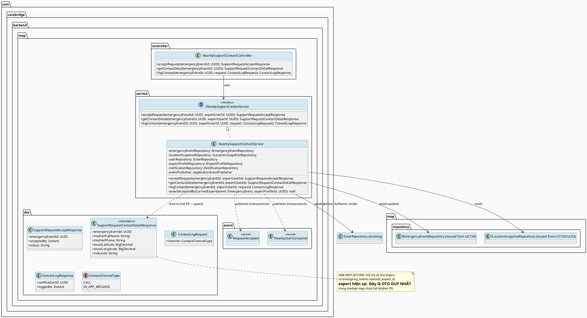
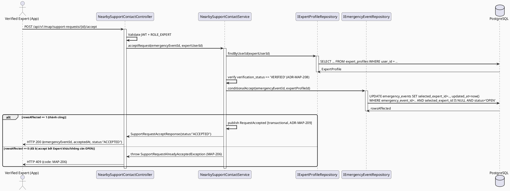
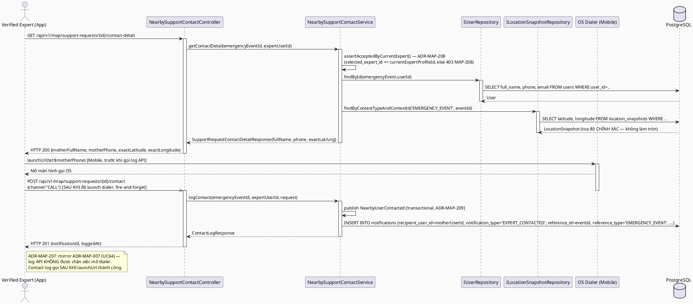
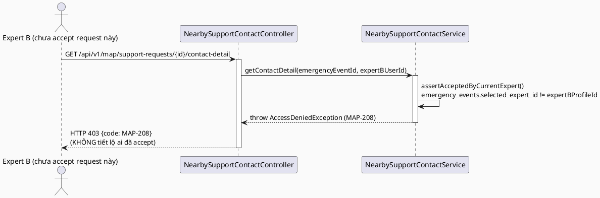
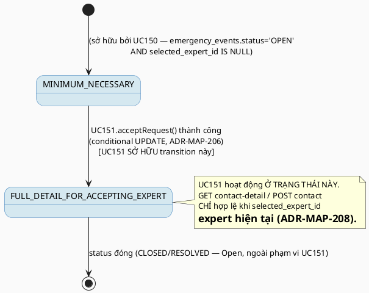

# ENGINEERING DOCUMENTATION STANDARD (EDS) v2.0
# UC151 — Contact Nearby User

| Field | Value |
|-------|-------|
| **Document ID** | `CB-MAP-IMP-004` |
| **Version** | `1.0` |
| **Date** | `2026-07-02` |
| **Status** | `Draft` |
| **Document Owner** | `TV4 - Lâm` |
| **Author** | `AI Agent — Tech Lead` |
| **Reviewed by** | `[ ] Pending` |
| **DPO Sign-off** | `[ ] Pending` *(module mở khóa full contact PII của Mother cho Expert, bắt buộc DPO review trước Approve)* |
| **Approved by** | `[ ] Pending` |
| **Last Review** | `2026-07-02` |
| **Based on EDS** | `v2.0` |

---

## CHANGELOG

| Ngày | Người thực hiện | Nội dung thay đổi |
|------|-----------------|-------------------|
| 2026-07-02 | AI Agent — Tech Lead | Tạo tài liệu lần đầu — TDS cho UC151 Contact Nearby User, bước thứ 2 trong chuỗi expert-side nearby-support workflow (UC150 → UC151 → UC152) |
| 2026-07-02 | AI Agent — Tech Lead | **Đóng Open Item (RG-6 — gating/accept mechanism, chung với UC150/UC152):** Product Owner đã CONFIRMED cơ chế "accept" — `selected_expert_id IS NULL AND status='OPEN'` = chưa accept, `selected_expert_id = <currentExpertProfileId>` = đã accept bởi Expert này. Cập nhật §1, §2, §3 ADR-MAP-206/208, §6.4, §17 tương ứng — ngôn ngữ chuyển từ "suy luận/Open" sang "Confirmed/Accepted". Open Item khác (RG-2 UX flow accept/contact tách biệt, BR-CONSULTATION mapping) KHÔNG thay đổi. |

---

## MỤC LỤC

1. [Tổng quan Module](#1-tổng-quan-module)
2. [Ma trận Truy vết (Traceability Matrix)](#2-ma-trận-truy-vết-traceability-matrix)
3. [Architecture Decision Records (ADR)](#3-architecture-decision-records-adr)
4. [Non-Functional Requirements & SLA](#4-non-functional-requirements--sla)
5. [Static Modeling (Mô hình Tĩnh)](#5-static-modeling-mô-hình-tĩnh)
6. [Dynamic Modeling (Mô hình Động)](#6-dynamic-modeling-mô-hình-động)
7. [Domain Event Catalog](#7-domain-event-catalog)
8. [Interface Specification (Đặc tả Giao diện)](#8-interface-specification-đặc-tả-giao-diện)
9. [API Specification](#9-api-specification)
10. [Bảng mã lỗi (Error Codes)](#10-bảng-mã-lỗi-error-codes)
11. [Quy trình Triển khai (Step-by-Step)](#11-quy-trình-triển-khai-step-by-step)
12. [Rollback & Incident Runbook](#12-rollback--incident-runbook)
13. [Kịch bản Kiểm thử Chi tiết](#13-kịch-bản-kiểm-thử-chi-tiết)
14. [Phương pháp Xác minh](#14-phương-pháp-xác-minh)
15. [Mẫu thử thực tế (API Verification Samples)](#15-mẫu-thử-thực-tế-api-verification-samples)
16. [Bảng tổng hợp phân quyền (Authorization Matrix)](#16-bảng-tổng-hợp-phân-quyền-authorization-matrix)
17. [AI Prompt Constraints (CASE 2.0)](#17-ai-prompt-constraints-case-20)

---

## 1. Tổng quan Module

> UC151 cho phép **Verified Expert** liên hệ với Mother **sau khi đã accept** một nearby support request đang hiển thị ở UC150. Đây là bước thứ 2 trong chuỗi 3 use case tuần tự: **UC150 (xem, minimum-necessary) → UC151 (accept + liên hệ, full detail mở khóa) → UC152 (điều hướng đến vị trí)**. UC151 sở hữu (own) hành động "accept" — đây là điểm mà state transition `MINIMUM_NECESSARY → FULL_DETAIL_FOR_ACCEPTING_EXPERT` (mô tả ở UC150 TDS §6.3) thực sự xảy ra.
>
> **[RESOLVED 2026-07-02 — Confirmed by Product Owner] RG-6 (kế thừa nguyên trạng từ UC150, KHÔNG tự quyết định lại):** UC150 TDS (`CB-MAP-IMP-003` §2, §3 ADR-MAP-201) đã ghi nhận cơ chế: schema hiện tại (`V1__init_schema.sql`) KHÔNG có bảng/cột riêng đánh dấu "support request đã được accept" theo nghĩa transactional (không có `support_request_acceptances`, không có `accepted_by`/`accepted_at`). Cột gần nhất về ngữ nghĩa là `emergency_events.selected_expert_id` (nullable UUID FK → `expert_profiles`) + `emergency_events.status`. UC151 **tái sử dụng nguyên văn cơ chế này** (KHÔNG tự quyết định cơ chế khác): hành động "Accept" của UC151 = `UPDATE emergency_events SET selected_expert_id = :expertProfileId WHERE emergency_event_id = :id AND selected_expert_id IS NULL AND status = 'OPEN'` (optimistic conditional update — điều kiện `selected_expert_id IS NULL` đảm bảo chỉ 1 Expert accept thành công, tránh race condition 2 Expert cùng accept 1 request). Product Owner đã **CONFIRMED (2026-07-02)** đây là cơ chế chính thức — quyết định dựa trên schema sẵn có, củng cố bởi việc UC150/UC151/UC152 độc lập suy luận ra cùng cơ chế (bằng chứng hội tụ mạnh). Không còn là suy luận kỹ thuật chờ xác nhận — **đây là Open Item chung giữa UC150/UC151/UC152, đã được resolve đồng thời cho cả 3 TDS.**
>
> **RG-3 xác nhận (contact channel):** SRS §3.3.5.6 Description: "Contacts the user after accepting a nearby support request." Không có chi tiết kỹ thuật cụ thể về kênh liên hệ. TDS này áp dụng pattern đã có ở UC64 (`CB-MAP-IMP-002` ADR-MAP-005 — native `tel:` dialer cho gọi điện) làm cơ chế **gọi điện** (Expert gọi Mother qua `users.phone` sau khi accept — KHÔNG dùng ZegoCloud, vì ZegoCloud trong repo chỉ phục vụ `consultation_sessions` đã CONFIRMED giữa Mother-Expert qua booking flow, không phải nearby-support ad-hoc contact — xem UC64 TDS §2 Open item cùng lý luận). Ngoài ra, UC151 ghi 1 bản ghi `notifications` (bảng có sẵn, `reference_type='EMERGENCY_EVENT'`) để Mother nhận thông báo "Expert đã accept và đang liên hệ" trong app — đây là kênh liên hệ **thứ hai, in-app**, bổ sung cho native call, KHÔNG thay thế.

| Field | Value |
|-------|-------|
| **Module Name** | `Contact Nearby User` |
| **Bounded Context** | `map` (mở rộng bounded context `map` đã có từ UC63/UC64/UC129/UC150 — theo phân công TV4-Lâm "nearby support" trong `function-spec-task-allocation.md` §3.3.6 MF-19 Location & Nearby Support) |
| **Data Classification** | `Sensitive-PII` *(full contact info: `users.phone`, `users.full_name`, `users.email`, chính xác toạ độ Mother)* |
| **Compliance Scope** | `PDPA / Luật 91/2025` — mở khóa PII có kiểm soát (gating), audit bắt buộc cho hành động accept + contact |
| **Upstream Dependencies** | `emergency_events` (UC150/UC141 sở hữu — UC151 UPDATE có điều kiện cột `selected_expert_id`), `location_snapshots` (toạ độ), `users` (contact info Mother — `phone`, `full_name`, `email`), `expert_profiles` (xác thực VERIFIED), `notifications` (bảng có sẵn — ghi thông báo cho Mother), `IAM (JWT ROLE_EXPERT)`, `UC64 QuickCallOrNavigate` (tái sử dụng pattern `tel:` native dialer — KHÔNG tái sử dụng code trực tiếp vì UC64's `QuickActionService` gắn với `care_facilities`, UC151 cần biến thể riêng cho `emergency_events`/Mother contact, xem ADR-MAP-207) |
| **Downstream Consumers** | `UC152 Navigate to Support Location` (dùng cùng `emergency_event_id` đã accept để tính route — UC152 yêu cầu Expert đã accept, tái sử dụng cùng gating check với UC151) |

---

## 2. Ma trận Truy vết (Traceability Matrix)

| Requirement ID | Loại (BR/ADR/US) | Mô tả yêu cầu | Thành phần Code | Compliance Target | ADR liên quan |
|----------------|------------------|---------------|-----------------|-------------------|---------------|
| SRS-3.3.5.6 (UC-151) | User Story | Verified Expert liên hệ Mother sau khi accept nearby support request | `NearbySupportContactController.POST /api/v1/map/support-requests/{id}/accept`, `.../contact` | — | ADR-MAP-206, ADR-MAP-207 |
| SRS-3.3.5.6 §Business Rules | Business Rule | BR-RBAC: chỉ actor có quyền hợp lệ (Verified Expert) mới truy cập | `NearbySupportContactController` | BR-RBAC | ADR-MAP-208 |
| SRS-3.3.5.6 §Business Rules | Business Rule | BR-CONSULTATION: booking, payment, dispute, refund, pricing actions phải giữ trạng thái auditable lifecycle | *(N/A trực tiếp — UC151 không có booking/payment/refund; áp dụng tinh thần "auditable lifecycle" cho accept/contact action, xem ADR-MAP-206 Open)* | BR-CONSULTATION (tinh thần) | ADR-MAP-209 |
| SRS-3.3.5.6 §Description | Description | "Contacts the user after accepting a nearby support request" | `NearbySupportContactService.acceptRequest()` + `.contactUser()` | — | ADR-MAP-206, ADR-MAP-207 |
| SRS §Postconditions POST-2 | Postcondition | Related records/statuses/notifications được cập nhật | `emergency_events.selected_expert_id` (UPDATE), `notifications` (INSERT) | — | ADR-MAP-206 |
| SRS §Postconditions POST-3 | Postcondition | Sensitive actions được ghi audit | `RequestAccepted`, `NearbyUserContacted` domain events (§7) | PDPA | ADR-MAP-209 |
| SRS §Exceptions E2 | Exception | Dữ liệu conflict (2 Expert cùng accept) bị reject với message rõ ràng | `NearbySupportContactService.acceptRequest()` — optimistic conditional UPDATE | BR-SAFETY | ADR-MAP-206 |
| SRS §Exceptions E3 | Exception | External service/network/server failure → retry guidance, không duplicate/unsafe action | `NearbySupportContactController` | BR-SAFETY | — |
| `CB-MAP-IMP-003` (UC150) §2, §6.3 | Reuse — gating mechanism | `selected_expert_id IS NULL AND status='OPEN'` = chưa accept; `selected_expert_id = <expertId>` = đã accept bởi Expert này — UC151 SỞ HỮU việc set giá trị này, UC150 chỉ đọc | `NearbySupportContactService` | PDPA | ADR-MAP-206 |
| `CB-MAP-IMP-002` (UC64) §3 ADR-MAP-005 | Pattern Reuse | Native `tel:` dialer, KHÔNG dùng ZegoCloud cho cuộc gọi ngoài booking flow | Mobile: `ContactNearbyUserService.call()` (biến thể riêng, KHÔNG sửa `QuickActionService` của UC64) | — | ADR-MAP-207 |
| ADR-MAP-206 | Decision | Accept dùng optimistic conditional `UPDATE ... WHERE selected_expert_id IS NULL` — atomic, tránh race condition 2 Expert cùng accept | `NearbySupportContactService.acceptRequest()` | BR-SAFETY | — |
| ADR-MAP-207 | Decision | Contact = (a) mở khóa full detail DTO (`phone`, `fullName`, toạ độ chính xác) + (b) native `tel:` dialer ở Mobile + (c) ghi `notifications` cho Mother | `NearbySupportContactService`, Mobile `ContactNearbyUserService` | PDPA (gating) | — |
| ADR-MAP-208 | Decision | Endpoint yêu cầu JWT + `ROLE_EXPERT` + `verification_status='VERIFIED'` (mirror UC150 ADR-MAP-204) | `NearbySupportContactController` | BR-RBAC | — |
| ADR-MAP-209 | Decision | Ghi domain event `RequestAccepted` + `NearbyUserContacted` cho mọi accept/contact — KHÔNG best-effort (khác UC150's view log) vì đây là **state-changing** action, không phải read-only view | `NearbySupportContactService` | PDPA (POST-3), BR-CONSULTATION (tinh thần auditable lifecycle) | — |

> **[RESOLVED 2026-07-02 — Confirmed by Product Owner] RG-6 (kế thừa nguyên trạng từ UC150, KHÔNG tự quyết định lại):** Xem §1 — cơ chế "accept" dựa trên `emergency_events.selected_expert_id`/`status` đã được Product Owner CONFIRMED là cơ chế chính thức (2026-07-02), kế thừa nguyên trạng từ UC150 TDS. UC141 (Open Emergency Support from Safety Alert) đã được kiểm tra và KHÔNG định nghĩa cơ chế cạnh tranh nào cho `emergency_events` — không có xung đột cần đồng bộ. **Đây là Open Item chung giữa UC150, UC151 và UC152 — đã được resolve đồng thời cho cả 3 TDS.**
>
> **Open (RG-2):** SRS §3.3.5.6 dùng template chung (không có Normal Flow cụ thể về UI/UX của "accept" — vd: có cần xác nhận 2 bước (confirm dialog) trước khi accept hay accept ngay khi tap?). TDS này đề xuất **accept là hành động tường minh, riêng biệt** (API `POST .../accept`) tách khỏi `contact` (API `POST .../contact`) — vì SRS Description dùng thứ tự "after accepting ... contacts" ngụ ý 2 bước tách biệt. Đánh dấu **Open** — cần Product Owner/TV4-Lâm xác nhận UX flow (2 API riêng hay 1 API gộp `acceptAndContact`).
>
> **Open (BR-CONSULTATION mapping):** SRS liệt kê `BR-CONSULTATION` cho UC151 nhưng nội dung BR-CONSULTATION ("booking, payment, dispute, refund, and pricing actions must keep an auditable lifecycle state") không khớp trực tiếp với UC151 (không có booking/payment trong nearby-support contact flow). TDS này áp dụng **tinh thần** "auditable lifecycle" (ADR-MAP-209 ghi event bắt buộc, không best-effort) thay vì áp dụng nghĩa đen (booking/payment). Đánh dấu **Open — cần Product Owner xác nhận liệu SRS liệt kê BR-CONSULTATION ở đây có phải copy nhầm từ use case khác (tương tự Open item ZegoCloud của UC64) hay có ý nghĩa cụ thể khác chưa được làm rõ.**

---

## 3. Architecture Decision Records (ADR)

### ADR-MAP-206 — Accept Mechanism: Optimistic Conditional UPDATE trên `emergency_events.selected_expert_id`

| Field | Value |
|-------|-------|
| **Status** | `Accepted` |
| **Deciders** | `Product Owner` (confirmed 2026-07-02), `AI Agent — Tech Lead` |
| **Date** | `2026-07-02` |
| **Supersedes** | `—` |

> **Confirmed by Product Owner 2026-07-02** — schema-supported (`emergency_events.selected_expert_id`/`status`, `V1__init_schema.sql`), độc lập hội tụ across UC150/UC151/UC152.

#### Bối cảnh (Context)
UC150 TDS đã đề xuất dùng `selected_expert_id IS NULL AND status='OPEN'` làm điều kiện "chưa accept" — cơ chế này đã được Product Owner CONFIRMED (2026-07-02). UC151 là nơi thực sự **ghi** giá trị này lần đầu. Rủi ro chính: 2 Verified Expert cùng lúc tap "Accept" trên cùng 1 `emergency_event_id` — cần đảm bảo chỉ 1 người thắng (atomic), người còn lại nhận lỗi rõ ràng (E2 — "Invalid, missing, expired, or conflicting data is rejected").

#### Các phương án đã xem xét (Options Considered)

| Phương án | Mô tả | Ưu điểm | Nhược điểm |
|-----------|-------|----------|------------|
| A | `UPDATE emergency_events SET selected_expert_id = :id, updated_at = now() WHERE emergency_event_id = :eventId AND selected_expert_id IS NULL AND status = 'OPEN'` — kiểm tra `rowsAffected == 1`, nếu `0` → throw conflict exception | Atomic ở tầng DB (không cần lock riêng, không cần SELECT FOR UPDATE); đơn giản, dùng ngay repository method có sẵn dạng `@Modifying @Query` | Không có bảng lịch sử "ai đã cố accept nhưng thua" — chấp nhận được vì không phải yêu cầu nghiệp vụ |
| B | `SELECT ... FOR UPDATE` rồi `UPDATE` riêng trong transaction | Kiểm soát chi tiết hơn, có thể mở rộng logic phức tạp sau này | Cần transaction lock lâu hơn, phức tạp hơn không cần thiết cho use case đơn giản này |

#### Quyết định (Decision)
Chọn **Phương án A** — single atomic conditional UPDATE, kiểm tra `rowsAffected`. Nếu `0` → ném `SupportRequestAlreadyAcceptedException` (mã lỗi `MAP-206`, xem §10) — Expert nhận thông báo "request đã được Expert khác accept" và UI nên refresh danh sách UC150 (loại bỏ request đã accept khỏi list — vì UC150 query `selected_expert_id IS NULL`).

#### Hệ quả (Consequences)

**Tích cực:** Tránh race condition mà không cần thêm bảng mới hay cơ chế lock phức tạp; tái sử dụng đúng suy luận UC150 đã đề xuất.

**Tiêu cực / Trade-offs:** Phụ thuộc vào cơ chế cột `selected_expert_id` — đã được Product Owner CONFIRMED (2026-07-02) là cơ chế chính thức, rủi ro thay đổi trong tương lai nay thấp.

**Compliance Impact:** Không phát sinh bảng PII mới; hành động accept được ghi domain event bắt buộc (ADR-MAP-209).

---

### ADR-MAP-207 — Contact Mechanism: Mở khóa Full Detail DTO + Native Dialer + In-app Notification

| Field | Value |
|-------|-------|
| **Status** | `Proposed` |
| **Deciders** | `AI Agent — Tech Lead` |
| **Date** | `2026-07-02` |
| **Supersedes** | `—` |

#### Bối cảnh (Context)
SRS Description: "Contacts the user after accepting a nearby support request." UC64 (`CB-MAP-IMP-002` ADR-MAP-005) đã thiết lập tiền lệ: gọi điện tới số điện thoại thật (PSTN) dùng native `tel:` dialer, KHÔNG dùng ZegoCloud (ZegoCloud chỉ cho `consultation_sessions` đã CONFIRMED qua booking). UC151's "contact" tương tự về bản chất (gọi tới `users.phone` của Mother — không phải qua booking flow) nên áp dụng cùng quyết định kỹ thuật.

#### Các phương án đã xem xét (Options Considered)

| Phương án | Mô tả | Ưu điểm | Nhược điểm |
|-----------|-------|----------|------------|
| A | Backend trả full-detail DTO (`phone`, `fullName`, toạ độ chính xác) khi Expert gọi `GET .../{id}/contact-detail` (chỉ sau khi accept) → Mobile dùng `tel:` dialer (pattern UC64) để gọi + ghi 1 `notifications` record cho Mother báo "Expert đã liên hệ" | Nhất quán pattern UC64 đã có; tách biệt rõ "mở khóa dữ liệu" (backend) và "hành động gọi" (client, không phụ thuộc network) | Cần API riêng cho "unlock detail" — thêm 1 endpoint |
| B | Gộp "accept" và "contact" thành 1 API duy nhất trả về full detail ngay lập tức | Ít endpoint hơn | Không tách được rõ ràng giữa "Expert đã cam kết hỗ trợ" (accept) và "Expert đã thực sự liên hệ" (contact) — 2 sự kiện nghiệp vụ khác nhau về mặt audit; SRS Description dùng thứ tự "after accepting ... contacts" ngụ ý 2 bước |

#### Quyết định (Decision)
Chọn **Phương án A có điều chỉnh** — 3 endpoint tách biệt (xem §9): `POST .../accept` (ADR-MAP-206), `GET .../contact-detail` (mở khóa full DTO, CHỈ cho phép nếu `selected_expert_id = currentExpertId`), `POST .../contact` (ghi log + `notifications` cho Mother, gọi SAU KHI Mobile đã launch `tel:` dialer — fire-and-forget, mirror ADR-MAP-007 của UC64, KHÔNG chặn hành động gọi). Mobile: dùng `url_launcher` (đã có trong `pubspec.yaml`, xác nhận từ UC64 §11.1) với `tel:$phone`.

#### Hệ quả (Consequences)

**Tích cực:** Tách bạch rõ 3 sự kiện nghiệp vụ (accept / xem chi tiết / đã liên hệ) — audit trail chi tiết hơn; tái sử dụng đúng pattern `tel:` đã kiểm chứng ở UC64, không phát minh lại cơ chế gọi mới.

**Tiêu cực / Trade-offs:** 3 API round-trip thay vì 1 — chấp nhận được vì đây không phải luồng có yêu cầu latency cực thấp như UC64 (UC64 là hành động tức thời từ danh sách đã có sẵn; UC151 có bước "accept" là quyết định nghiệp vụ cần xác nhận trước).

**Compliance Impact:** `GET .../contact-detail` là điểm duy nhất trả `phone`/`fullName`/toạ độ chính xác — dễ audit, dễ kiểm soát truy cập (chỉ Expert đã accept).

---

### ADR-MAP-208 — Authorization: `ROLE_EXPERT` + `VERIFIED` + đã accept (cho endpoint contact-detail/contact)

| Field | Value |
|-------|-------|
| **Status** | `Proposed` |
| **Deciders** | `AI Agent — Tech Lead` |
| **Date** | `2026-07-02` |
| **Supersedes** | `—` |

#### Bối cảnh (Context)
Mirror UC150 ADR-MAP-204 cho phần RBAC cơ bản (`ROLE_EXPERT` + `VERIFIED`). UC151 bổ sung thêm điều kiện thứ 3: chỉ Expert **đã accept chính request đó** (`emergency_events.selected_expert_id = currentExpertProfileId`) mới được gọi `GET .../contact-detail` và `POST .../contact` — đây là invariant quan trọng nhất của UC151 (ngăn Expert A xem full detail của request mà Expert B đã accept).

#### Quyết định (Decision)
- `POST .../accept`: yêu cầu `ROLE_EXPERT` + `VERIFIED` + `emergency_events.status='OPEN'` + `selected_expert_id IS NULL` (điều kiện UPDATE, xem ADR-MAP-206).
- `GET .../contact-detail`, `POST .../contact`: yêu cầu `ROLE_EXPERT` + `VERIFIED` + `emergency_events.selected_expert_id = currentExpertProfileId` (Service layer check, sau khi Controller xác thực role) — nếu không khớp, trả `403 Forbidden` (mã `MAP-208`, xem §10), **kể cả khi request đã accept bởi Expert khác** (KHÔNG lộ thông tin "đã bị accept bởi ai" cho Expert không liên quan).

#### Hệ quả (Consequences)

**Tích cực:** Ngăn tuyệt đối việc Expert chưa accept xem được full contact PII của Mother — đúng invariant đã ghi ở UC150 TDS §6.3 ("UC150 KHÔNG BAO GIỜ trả về FULL_DETAIL cho bất kỳ Expert nào chưa phải là selected_expert_id").

**Tiêu cực / Trade-offs:** Thêm 1 query kiểm tra `emergency_events` mỗi lần gọi `contact-detail`/`contact` — chấp nhận được (tải thấp).

**Compliance Impact:** Củng cố BR-RBAC + PDPA minimum-necessary/gating theo đúng chuỗi UC150→UC151.

---

### ADR-MAP-209 — Audit: Domain Event bắt buộc (KHÔNG best-effort) cho Accept/Contact

| Field | Value |
|-------|-------|
| **Status** | `Proposed` |
| **Deciders** | `AI Agent — Tech Lead` |
| **Date** | `2026-07-02` |
| **Supersedes** | `—` |

#### Bối cảnh (Context)
UC150 ADR-MAP-203 chọn "best-effort" cho việc ghi log xem danh sách (read-only, không quan trọng bằng state-changing action). UC151's "accept" và "contact" là **state-changing actions** làm thay đổi `emergency_events.selected_expert_id` (dữ liệu nghiệp vụ quan trọng, ảnh hưởng đến Expert khác không còn thấy request này) — mức độ quan trọng cao hơn, cần đảm bảo audit trail đầy đủ hơn.

#### Quyết định (Decision)
`RequestAccepted` và `NearbyUserContacted` (xem §7) PHẢI được publish **trong cùng transaction** với UPDATE `emergency_events` (Spring `@TransactionalEventListener` hoặc publish trực tiếp trong `@Transactional` method — KHÔNG async fire-and-forget như `SupportRequestViewed` của UC150). Nếu event publish thất bại, transaction PHẢI rollback (đảm bảo state DB và audit trail luôn nhất quán) — khác biệt có chủ đích so với ADR-MAP-203/ADR-MAP-007 (vốn áp dụng cho read-only/client-terminal actions).

#### Hệ quả (Consequences)

**Tích cực:** Đảm bảo mọi lần accept đều có audit trail — quan trọng cho compliance review khi có khiếu nại/tranh chấp về việc "ai đã accept request nào, khi nào".

**Tiêu cực / Trade-offs:** Nếu event bus tạm thời lỗi, accept action sẽ fail toàn bộ (rollback) thay vì chấp nhận silent — Expert cần retry. Trade-off chấp nhận được vì tính toàn vẹn dữ liệu quan trọng hơn UX mượt trong trường hợp lỗi hạ tầng hiếm gặp.

**Compliance Impact:** Củng cố PDPA accountability (POST-3) + BR-CONSULTATION tinh thần "auditable lifecycle" (dù áp dụng cho accept/contact thay vì booking/payment — xem Open Item §2).

---

## 4. Non-Functional Requirements & SLA

### 4.1. Performance & Availability

| Category | Requirement | Target SLA | Measurement Method | Compliance Basis |
|----------|-------------|------------|---------------------|------------------|
| Latency | `POST .../accept` (p99) | `< 500ms` *(Open — kế thừa đề xuất từ UC150 §4.1)* | k6 load test | `CB-MAP-IMP-003` §4.1 (tham chiếu tương tự) |
| Latency | `GET .../contact-detail` (p99) | `< 300ms` *(Open — đề xuất mới)* | k6 load test | — |
| Latency | `POST .../contact` (fire-and-forget từ Mobile, sau `tel:` launch) | `< 500ms`, KHÔNG chặn UI (mirror ADR-MAP-007 UC64) | Manual/instrumented UI test | `CB-MAP-IMP-002` §4.1 |
| Availability | Uptime (monthly) | `99.9%` *(Open — theo baseline chung dự án)* | Uptime monitor | — |
| Concurrency | 2 Expert cùng accept 1 request | Chỉ 1 thành công (atomic), người thua nhận `409`-tương-đương trong `< 1s` | Concurrency test (2 thread cùng gọi) | ADR-MAP-206 |

### 4.2. Data Integrity & Retention

| Category | Requirement | Target | Verification Method | Compliance Basis |
|----------|-------------|--------|---------------------|------------------|
| Race condition safety | Không có 2 `emergency_events` record nào có cùng `emergency_event_id` bị 2 `selected_expert_id` khác nhau ghi đè | 0 xảy ra trong concurrency test | Integration test (Testcontainers, 2 thread) | ADR-MAP-206 |
| Gating enforcement | `GET .../contact-detail` chỉ trả dữ liệu cho đúng Expert đã accept | 100% test case reject Expert khác | Unit + integration test | ADR-MAP-208 |
| Audit completeness | Mọi accept/contact thành công đều có domain event tương ứng trong cùng transaction | 100% | Integration test kiểm tra event publish | ADR-MAP-209 |
| No new persistence | UC151 KHÔNG tạo bảng mới — chỉ UPDATE `emergency_events`, INSERT `notifications` (bảng có sẵn) | 0 bảng DB mới | Migration review | §5.2 |

### 4.3. Security

| Category | Requirement | Target | Verification Method | Compliance Basis |
|----------|-------------|--------|---------------------|------------------|
| Encryption in transit | Endpoint | TLS 1.3+ | SSL Labs scan | PDPA |
| Access control | `ROLE_EXPERT` + `VERIFIED` + (đã accept, cho `contact-detail`/`contact`) | Least privilege | Auth Matrix (§16) | BR-RBAC, ADR-MAP-208 |
| No PII in logs | Log request KHÔNG chứa `phone`/`fullName`/toạ độ chính xác ở mức INFO | Log audit | Grep kiểm tra | PDPA |
| PII exposure boundary | `phone`/`fullName`/toạ độ chính xác CHỈ xuất hiện trong response body của `GET .../contact-detail`, KHÔNG ở bất kỳ endpoint nào khác trong module `map` | Code review + response schema audit | ADR-MAP-207 |

### 4.4. Scalability & Capacity Planning

> Tải phụ thuộc số lượng accept action — dự kiến thấp hơn số lượng view (UC150), vì chỉ 1 trong N Expert xem danh sách sẽ accept. Không cần cơ chế scale riêng ngoài cấu hình chung Spring Boot hiện có.

---

## 5. Static Modeling (Mô hình Tĩnh)

### 5.1. Class Diagram (PlantUML)



### 5.2. Data Structure (Flyway SQL Migration)

> **Không cần migration mới.** UC151 là **read + conditional-update consumer** của `emergency_events` (dòng 1081-1095, `V1__init_schema.sql`) — chỉ UPDATE cột `selected_expert_id`/`updated_at` đã tồn tại sẵn, KHÔNG thêm cột mới. UC151 INSERT vào `notifications` (dòng 311-324, đã tồn tại, có đủ cột `recipient_user_id`, `notification_type`, `reference_id`, `reference_type`, `title`, `body`). Đã kiểm tra toàn bộ `05_Development/CareBridgeAPI/src/main/resources/db/migration/` — không có bảng `support_request_acceptances`/`contact_logs` nào tồn tại; UC151 KHÔNG tạo bảng mới cho những khái niệm này (accept/contact log được biểu diễn qua domain event + `emergency_events` UPDATE + `notifications` INSERT).
>
> **Cột UPDATE bởi UC151 (đã tồn tại, KHÔNG cột mới):**
>
> ```sql
> -- emergency_events.selected_expert_id (uuid, nullable, đã tồn tại V1 dòng 1089)
> -- emergency_events.updated_at (timestamptz, đã tồn tại V1 dòng 1094)
> -- UC151.acceptRequest() thực hiện:
> -- UPDATE emergency_events
> -- SET selected_expert_id = :expertProfileId, updated_at = now()
> -- WHERE emergency_event_id = :eventId AND selected_expert_id IS NULL AND status = 'OPEN'
> ```
>
> **Bảng liên quan đã tồn tại (tham chiếu, KHÔNG sở hữu bởi UC151):**
>
> ```sql
> -- users (dòng 532-544) — module `iam` sở hữu, UC151 chỉ ĐỌC phone/full_name/email
> -- notifications (dòng 311-324) — module chung, UC151 chỉ INSERT (không tạo bảng mới)
> -- location_snapshots (dòng 1097-1108) — module `map` (UC63/UC150) sở hữu, UC151 chỉ ĐỌC
> -- expert_profiles (dòng 786-800) — module `expert` sở hữu, UC151 chỉ ĐỌC verification_status
> ```
>
> **Open Item — CRITICAL (kế thừa từ UC150 §5.2):** Cùng rủi ro `context_type` convention (`'EMERGENCY_EVENT'`) chưa xác nhận với UC141 owner — UC151's `GET .../contact-detail` cũng JOIN `location_snapshots` theo cùng convention để lấy toạ độ chính xác (KHÔNG làm tròn, khác UC150).
>
> **Version tiếp theo khả dụng nếu cần migration sau này:** `V20260705161000` trở đi (sub-range trong `160000` đã dùng bởi UC150, tránh trùng các batch song song khác `090000`-`150000`). **Chưa tạo migration này trong Draft**, chỉ ghi nhận Open (hiện tại không cần).

---

## 6. Dynamic Modeling (Mô hình Động)

### 6.1. Sequence Diagram — Happy Path: Accept (PlantUML)



### 6.2. Sequence Diagram — Happy Path: Contact Detail + Log Contact (PlantUML)



### 6.3. Sequence Diagram — Error Path: Unaccepted Expert Attempts Contact Detail



### 6.4. State Machine — Kế thừa nguyên trạng từ UC150 §6.3, bổ sung sở hữu transition



> **⚠️ Invariant (kế thừa từ UC150, UC151 là nơi thực thi):** Một khi `selected_expert_id` đã được set bởi UC151.acceptRequest(), KHÔNG Expert nào khác có thể accept lại (conditional UPDATE trả `rowsAffected=0`) và KHÔNG Expert nào khác có thể xem `contact-detail` của request đó.

---

## 7. Domain Event Catalog

### 7.1. Events Published (Phát ra)

| Event Name | Trigger | Publisher | Subscriber(s) | Payload Schema | Async? |
|------------|---------|-----------|---------------|----------------|--------|
| `RequestAccepted` | `acceptRequest()` thành công (`rowsAffected == 1`) | `NearbySupportContactService` | Audit/compliance log consumer; tương lai: notification-fanout để loại bỏ request khỏi danh sách UC150 của các Expert khác (Open — chưa có subscriber cụ thể) | `RequestAccepted.java` (xem §7.3) | **No** — transactional (ADR-MAP-209, khác UC150's best-effort) |
| `NearbyUserContacted` | `logContact()` được gọi thành công sau khi Mobile đã launch `tel:`/in-app message | `NearbySupportContactService` | Audit/compliance log consumer | `NearbyUserContacted.java` (xem §7.3) | **No** — transactional (ADR-MAP-209) |

### 7.2. Events Consumed (Tiêu thụ)

_Không có._ UC151 không tiêu thụ event nào từ module khác.

### 7.3. Payload Schema

```java
// RequestAccepted.java
// Package: com.carebridge.backend.map.event
public record RequestAccepted(
    UUID    eventId,          // UUID.randomUUID()
    String  eventType,        // "RequestAccepted"
    Instant occurredAt,       // Instant.now()
    String  version,          // "1.0"
    Payload payload,
    Metadata metadata
) {

    public record Payload(
        UUID    emergencyEventId,   // emergency_events.emergency_event_id
        UUID    expertProfileId,    // Expert đã accept
        UUID    motherUserId,       // emergency_events.user_id
        Instant acceptedAt
    ) {}

    public record Metadata(
        UUID   correlationId,
        String causedBy       // expertProfileId dạng String
    ) {}
}

// NearbyUserContacted.java
// Package: com.carebridge.backend.map.event
public record NearbyUserContacted(
    UUID    eventId,
    String  eventType,        // "NearbyUserContacted"
    Instant occurredAt,
    String  version,          // "1.0"
    Payload payload,
    Metadata metadata
) {

    public record Payload(
        UUID   emergencyEventId,
        UUID   expertProfileId,
        UUID   motherUserId,
        String channel        // "CALL" | "IN_APP_MESSAGE" — từ ContactChannelType
    ) {}

    public record Metadata(
        UUID   correlationId,
        String causedBy
    ) {}
}
```

---

## 8. Interface Specification (Đặc tả Giao diện)

### 8.1. Service Interface

```java
// SupportRequestAcceptResponse.java — Output DTO cho accept
// @version 1.0
public class SupportRequestAcceptResponse {
    private UUID    emergencyEventId;
    private Instant acceptedAt;
    private String  status;      // luôn "ACCEPTED" khi trả 200
    // getters / setters
}

// SupportRequestContactDetailResponse.java — Output DTO cho contact-detail
// DUY NHẤT DTO trong module map chứa full Mother PII (ADR-MAP-207).
// @version 1.0
public class SupportRequestContactDetailResponse {
    private UUID       emergencyEventId;
    private String     motherFullName;    // users.full_name
    private String     motherPhone;       // users.phone
    private BigDecimal exactLatitude;     // location_snapshots.latitude — KHÔNG làm tròn (khác UC150)
    private BigDecimal exactLongitude;    // location_snapshots.longitude — KHÔNG làm tròn
    private String     riskLevel;         // emergency_events.risk_level
    // getters / setters
}

// ContactLogRequest.java — Input DTO cho log contact
// @version 1.0
public class ContactLogRequest {
    @NotNull
    private ContactChannelType channel;  // CALL | IN_APP_MESSAGE
    // getters / setters
}

public enum ContactChannelType { CALL, IN_APP_MESSAGE }

// ContactLogResponse.java — Output DTO
public class ContactLogResponse {
    private UUID    notificationId;
    private Instant loggedAt;
    // getters / setters
}

// INearbySupportContactService.java — Service Contract
// @version 1.0
public interface INearbySupportContactService {
    /**
     * Accept 1 nearby support request — optimistic conditional UPDATE (ADR-MAP-206).
     * @throws AccessDeniedException (MAP-208) nếu không VERIFIED
     * @throws SupportRequestAlreadyAcceptedException (MAP-206) nếu đã bị accept/không còn OPEN
     */
    SupportRequestAcceptResponse acceptRequest(UUID emergencyEventId, UUID expertUserId);

    /**
     * Trả full contact detail — CHỈ cho Expert đã accept chính request đó (ADR-MAP-208).
     * @throws AccessDeniedException (MAP-208) nếu Expert chưa accept request này
     */
    SupportRequestContactDetailResponse getContactDetail(UUID emergencyEventId, UUID expertUserId);

    /**
     * Ghi log việc đã liên hệ (fire-and-forget từ phía Mobile) + notify Mother.
     * @throws AccessDeniedException (MAP-208) nếu Expert chưa accept request này
     */
    ContactLogResponse logContact(UUID emergencyEventId, UUID expertUserId, ContactLogRequest request);
}
```

### 8.2. Repository Interface

```java
// IEmergencyEventRepository.java (mở rộng — TÁI SỬ DỤNG interface đã khai báo ở UC150 §8.2,
// KHÔNG tạo file trùng lặp. Thêm method mới nếu UC150 implementation chưa có sẵn.)
// @version 1.1
public interface IEmergencyEventRepository extends JpaRepository<EmergencyEvent, UUID> {

    @Modifying
    @Query("UPDATE EmergencyEvent e SET e.selectedExpertId = :expertProfileId, e.updatedAt = CURRENT_TIMESTAMP " +
           "WHERE e.emergencyEventId = :eventId AND e.selectedExpertId IS NULL AND e.status = 'OPEN'")
    int conditionalAccept(@Param("eventId") UUID eventId, @Param("expertProfileId") UUID expertProfileId);
    // rowsAffected == 0 -> đã bị accept bởi Expert khác hoặc không còn OPEN (ADR-MAP-206)
}

// INotificationRepository.java (TÁI SỬ DỤNG nếu đã tồn tại từ module notification chung của dự án;
// nếu chưa có, tạo interface JPA chuẩn trỏ vào bảng notifications đã tồn tại — KHÔNG migration mới)
// @version 1.0
public interface INotificationRepository extends JpaRepository<Notification, UUID> {
    // save() kế thừa từ JpaRepository — dùng để INSERT notification cho Mother
}

// IUserRepository.java — TÁI SỬ DỤNG interface IAM có sẵn (module iam sở hữu),
// UC151 chỉ dùng findById() để đọc phone/fullName/email — KHÔNG tạo repository trùng.
```

### 8.3. Reused Interface (KHÔNG viết lại — tham chiếu UC150/UC64)

```java
// ILocationSnapshotRepository.java — TÁI SỬ DỤNG nguyên trạng từ UC63/UC150 (CB-MAP-IMP-003 §8.2)
public interface ILocationSnapshotRepository extends JpaRepository<LocationSnapshot, UUID> {
    Optional<LocationSnapshot> findTopByContextTypeAndContextIdOrderByCapturedAtDesc(
        String contextType, UUID contextId);
}
```

```dart
// contact_nearby_user_service.dart — Mobile, biến thể riêng của pattern UC64
// (KHÔNG sửa/tái sử dụng trực tiếp QuickActionService của UC64 — facility-scoped, khác entity)
// Package: lib/features/nearbySupport/services/
abstract class ContactNearbyUserService {
  /// Mở native dialer với số điện thoại Mother (đã mở khóa qua contact-detail).
  /// KHÔNG dùng ZegoCloud (mirror ADR-MAP-005 của UC64).
  Future<bool> call(String phoneNumber);

  /// Gọi backend log API SAU KHI đã launch dialer — fire-and-forget (ADR-MAP-207).
  void logContactFireAndForget({
    required String emergencyEventId,
    required String channel, // 'CALL' | 'IN_APP_MESSAGE'
  });
}
```

---

## 9. API Specification

### 9.1. Endpoints Table

| Method | Path | Auth Level | Required Roles | Rate Limit | Idempotent? |
|--------|------|------------|----------------|------------|-------------|
| `POST` | `/api/v1/map/support-requests/{emergencyEventId}/accept` | JWT Bearer | `ROLE_EXPERT` (+ `VERIFIED`) | 20/min *(Open — đề xuất)* | No *(conditional — chỉ 1 lần thành công, các lần sau trả 409)* |
| `GET` | `/api/v1/map/support-requests/{emergencyEventId}/contact-detail` | JWT Bearer | `ROLE_EXPERT` (+ `VERIFIED` + đã accept) | 60/min *(Open)* | Yes |
| `POST` | `/api/v1/map/support-requests/{emergencyEventId}/contact` | JWT Bearer | `ROLE_EXPERT` (+ `VERIFIED` + đã accept) | 60/min *(Open)* | No *(mỗi lần tạo 1 notification/log record mới, mirror UC64 MAP-102)* |

### 9.2. Request / Response Schemas

#### `POST /api/v1/map/support-requests/{emergencyEventId}/accept`

**Response — 200 OK (Happy Path):**
```json
{
  "emergencyEventId": "uuid-v4",
  "acceptedAt": "2026-07-02T09:00:00.000Z",
  "status": "ACCEPTED"
}
```

**Response — 409 Conflict (đã bị accept bởi Expert khác):**
```json
{
  "error": { "code": "MAP-206", "message": "This support request has already been accepted by another expert" }
}
```

**Response — 403 Forbidden (chưa VERIFIED):**
```json
{
  "error": { "code": "MAP-208", "message": "Expert verification required" }
}
```

#### `GET /api/v1/map/support-requests/{emergencyEventId}/contact-detail`

**Response — 200 OK (Happy Path — CHỈ cho Expert đã accept):**
```json
{
  "emergencyEventId": "uuid-v4",
  "motherFullName": "Nguyễn Thị A",
  "motherPhone": "+84901234567",
  "exactLatitude": 10.776889,
  "exactLongitude": 106.700912,
  "riskLevel": "HIGH"
}
```

**Response — 403 Forbidden (Expert chưa accept request này — KHÔNG tiết lộ ai đã accept):**
```json
{
  "error": { "code": "MAP-208", "message": "You have not accepted this support request" }
}
```

#### `POST /api/v1/map/support-requests/{emergencyEventId}/contact`

**Request Body:**
```json
{ "channel": "CALL" }
```

**Response — 201 Created:**
```json
{
  "notificationId": "uuid-v4",
  "loggedAt": "2026-07-02T09:05:00.000Z"
}
```

**Response — 401 Unauthorized:**
```json
{
  "error": { "code": "IAM-001", "message": "Authentication required" }
}
```

---

## 10. Bảng mã lỗi (Error Codes)

| Code | HTTP Status | Message (EN) | Message (VI) | Trigger Condition |
|------|-------------|--------------|--------------|-------------------|
| `MAP-206` | 409 | Support request already accepted | Yêu cầu hỗ trợ đã được Expert khác accept | Conditional UPDATE trả `rowsAffected == 0` khi `acceptRequest()` (ADR-MAP-206) |
| `MAP-207` | 400 | Validation failed | Dữ liệu không hợp lệ | `channel` thiếu hoặc không phải CALL/IN_APP_MESSAGE trong `POST .../contact` |
| `MAP-208` | 403 | Expert verification required / Not the accepting expert | Yêu cầu Expert đã xác thực / Không phải Expert đã accept | (a) User không có `ROLE_EXPERT` hoặc chưa `VERIFIED`; (b) Expert gọi `contact-detail`/`contact` nhưng `selected_expert_id != currentExpertProfileId` (ADR-MAP-208) |
| `MAP-209` | 404 | Support request not found | Không tìm thấy yêu cầu hỗ trợ | `emergencyEventId` không tồn tại trong `emergency_events` |
| `MAP-210` | 503 | Contact service unavailable | Dịch vụ liên hệ không khả dụng | DB (`emergency_events`/`users`/`notifications`) không truy vấn được |

---

## 11. Quy trình Triển khai (Step-by-Step)

### 11.1. Prerequisites

- [ ] ADR-MAP-207 → 209 được Accepted (hiện tại `Proposed`); ADR-MAP-206 đã **Accepted** (Confirmed by Product Owner 2026-07-02 — cơ chế "accept", xem §2)
- [ ] DPO sign-off cho việc mở khóa full contact PII (`phone`, `fullName`, toạ độ chính xác) của Mother
- [ ] UC150 (`CB-MAP-IMP-003`) đã implement hoặc implement song song — `IEmergencyEventRepository`/`ILocationSnapshotRepository` là dependency trực tiếp, PHẢI tái sử dụng, KHÔNG tạo trùng
- [ ] `url_launcher` package xác nhận có sẵn (đã xác nhận từ UC64 §11.1)
- [ ] Xác nhận với UC141 owner: giá trị `location_snapshots.context_type` dùng cho `emergency_events` (đề xuất `'EMERGENCY_EVENT'`, kế thừa UC150 Open item)

### 11.2. Pre-Migration Checklist

- [ ] Không cần migration mới (§5.2) — N/A cho UC151
- [ ] Nếu cần bảng `contact_logs` riêng sau này (thay vì dùng `notifications` chung), dùng version `V20260705161000` trở đi

### 11.3. Implementation Steps

#### Chặng 1 — Mở rộng package `map` (mirror UC150, tái sử dụng repository)

```
com.carebridge.backend.map/
├── controller/NearbySupportContactController.java
├── dto/response/SupportRequestAcceptResponse.java
├── dto/response/SupportRequestContactDetailResponse.java
├── dto/request/ContactLogRequest.java
├── dto/response/ContactLogResponse.java
├── dto/ContactChannelType.java (enum)
├── service/INearbySupportContactService.java
├── service/impl/NearbySupportContactService.java
├── event/RequestAccepted.java
├── event/NearbyUserContacted.java
└── repository/ (TÁI SỬ DỤNG IEmergencyEventRepository/ILocationSnapshotRepository từ UC150 — KHÔNG tạo trùng, chỉ thêm method conditionalAccept())
```

> **Lưu ý quan trọng khi implement:** Nếu UC150 đã implement TRƯỚC UC151 và đã tạo `IEmergencyEventRepository`, UC151 PHẢI thêm method `conditionalAccept()` vào file đã tồn tại đó, KHÔNG tạo repository interface trùng tên.

#### Chặng 2 — Implement Service với accept (transactional) + gating check

```java
// acceptRequest() PHẢI @Transactional, publish RequestAccepted TRONG transaction (ADR-MAP-209).
// getContactDetail()/logContact() PHẢI gọi assertAcceptedByCurrentExpert() TRƯỚC bất kỳ query PII nào.
```

#### Chặng 3 — Implement Controller + Security config

```java
// @PreAuthorize("hasRole('EXPERT')") + kiểm tra verification_status + accepted-by-self trong Service layer
```

#### Chặng 4 — Mobile: `ContactNearbyUserService` (biến thể riêng UC64 pattern)

```
lib/features/nearbySupport/services/contact_nearby_user_service.dart
lib/features/nearbySupport/services/contact_nearby_user_service_impl.dart
```

### 11.4. Deployment Checklist

- [ ] `POST .../accept` trả 200 lần đầu, 409 lần thứ 2 (cùng request, 2 Expert khác nhau)
- [ ] `GET .../contact-detail` trả 403 cho Expert không phải người đã accept
- [ ] Xác nhận response body của mọi endpoint khác trong module `map` (UC63/UC64/UC129/UC150) KHÔNG có field PII định danh Mother
- [ ] Unauthenticated/unverified Expert nhận 401/403 đúng

---

## 12. Rollback & Incident Runbook

### 12.1. Điều kiện kích hoạt Rollback

| Điều kiện | Ngưỡng | Người quyết định |
|-----------|--------|------------------|
| `contact-detail` lộ PII cho Expert chưa accept | Bất kỳ case nào phát hiện | Tech Lead + DPO (khẩn cấp) |
| Race condition cho phép 2 Expert cùng accept 1 request | Bất kỳ case nào phát hiện | Tech Lead (khẩn cấp) |
| Error rate tăng đột biến | > 5% trong 5 phút | On-call Engineer |

### 12.2. Rollback Procedure

```bash
# Không có migration mới để rollback (§5.2) — chỉ cần revert code deploy.
# Nếu emergency_events bị ghi sai selected_expert_id do bug, cần thủ công:
psql -h $DB_HOST -U $DB_USER -d carebridge \
  -c "UPDATE emergency_events SET selected_expert_id = NULL WHERE emergency_event_id = '<affected-id>';"
# CHỈ thực hiện sau khi xác nhận với Tech Lead — có thể ảnh hưởng workflow đang chạy của Expert.

kubectl rollout undo deployment/carebridge-api
kubectl rollout status deployment/carebridge-api
```

### 12.3. Notification Protocol

| Thời điểm | Người nhận | Kênh | Template |
|-----------|------------|------|----------|
| Ngay khi phát hiện | On-call team | Slack `#incident` | "Contact Nearby User gating bug detected: [mô tả]" |
| Trong 30 phút (nếu PII leak) | DPO | Email | Bắt buộc nếu phát hiện `contact-detail` lộ PII cho Expert sai |

### 12.4. Post-Incident Review (PIR)

- **Timeline, Root Cause (5 Whys), Impact, Remediation, Prevention** — theo template chung.

---

## 13. Kịch bản Kiểm thử Chi tiết

> Chi tiết đầy đủ nằm trong `UC151_ContactNearbyUser_Test-Spec.md`.

| TDS Concern | Test-Spec Condition Ref |
|-------------|--------------------------|
| ADR-MAP-206 (accept atomic, race condition) | `TC-COND-001, 002, 003` |
| ADR-MAP-207 (contact mechanism, full detail gating) | `TC-COND-004, 005, 006` |
| ADR-MAP-208 (RBAC + VERIFIED + accepted-by-self gating — CRITICAL) | `TC-COND-007, 008, 009` |
| ADR-MAP-209 (audit — transactional, không best-effort) | `TC-COND-010` |
| SRS E2 (conflict — double accept) | `TC-COND-001` |
| SRS E3 (external/DB failure) | `TC-COND-011` |

---

## 14. Phương pháp Xác minh

### 14.1. Database Inspection

```sql
-- Verify accept ghi đúng
SELECT emergency_event_id, selected_expert_id, status, updated_at
FROM emergency_events
WHERE emergency_event_id = '<uuid>';

-- Verify không có 2 accept cùng lúc thành công (concurrency test)
SELECT emergency_event_id, count(DISTINCT selected_expert_id)
FROM emergency_events
WHERE emergency_event_id = '<uuid>'
GROUP BY emergency_event_id
HAVING count(DISTINCT selected_expert_id) > 1;
-- Expected: 0 rows

-- Verify notification ghi đúng cho Mother
SELECT notification_id, recipient_user_id, notification_type, reference_id, reference_type
FROM notifications
WHERE reference_id = '<emergency_event_id>' AND reference_type = 'EMERGENCY_EVENT'
ORDER BY created_at DESC LIMIT 5;
```

### 14.2. Log / Audit Verification

```bash
kubectl logs -l app=carebridge-api | grep "POST /api/v1/map/support-requests/.*accept"
kubectl logs -l app=carebridge-api | grep -iE "motherPhone|motherFullName|exactLatitude" 
# Expected: No output ở mức INFO — PII chỉ nằm trong response body (HTTPS), KHÔNG log
```

### 14.3. Tool-based Verification

```bash
time curl -X POST "https://$HOST/api/v1/map/support-requests/<id>/accept" \
  -H "Authorization: Bearer $EXPERT_JWT"
```

---

## 15. Mẫu thử thực tế (API Verification Samples)

### 15.1. Happy Path

```bash
# Bước 1: Accept
curl -X POST "https://$HOST/api/v1/map/support-requests/550e8400-e29b-41d4-a716-446655440000/accept" \
  -H "Authorization: Bearer $VERIFIED_EXPERT_JWT" \
  -H "X-Correlation-Id: $(uuidgen)"

# Bước 2: Lấy contact detail (chỉ hoạt động sau bước 1 thành công, cùng Expert)
curl -X GET "https://$HOST/api/v1/map/support-requests/550e8400-e29b-41d4-a716-446655440000/contact-detail" \
  -H "Authorization: Bearer $VERIFIED_EXPERT_JWT"

# Bước 3: Log contact
curl -X POST "https://$HOST/api/v1/map/support-requests/550e8400-e29b-41d4-a716-446655440000/contact" \
  -H "Authorization: Bearer $VERIFIED_EXPERT_JWT" \
  -H "Content-Type: application/json" \
  -d '{"channel": "CALL"}'
```

### 15.2. Error Paths

```bash
# Accept lần 2 (đã bị accept) → 409
curl -X POST "https://$HOST/api/v1/map/support-requests/550e8400-e29b-41d4-a716-446655440000/accept" \
  -H "Authorization: Bearer $ANOTHER_VERIFIED_EXPERT_JWT"

# contact-detail khi chưa accept → 403 MAP-208
curl -X GET "https://$HOST/api/v1/map/support-requests/<not-accepted-by-me>/contact-detail" \
  -H "Authorization: Bearer $VERIFIED_EXPERT_JWT"

# Không có JWT → 401
curl -X POST "https://$HOST/api/v1/map/support-requests/<id>/accept"
```

---

## 16. Bảng tổng hợp phân quyền (Authorization Matrix)

| Endpoint | `GUEST` | `ROLE_MOTHER` | `ROLE_EXPERT` (unverified) | `ROLE_EXPERT` (VERIFIED, chưa accept) | `ROLE_EXPERT` (VERIFIED, đã accept) | `ROLE_ADMIN` |
|----------|---------|---------------|----------------------------|-----------------------------------------|----------------------------------------|--------------|
| `POST /api/v1/map/support-requests/{id}/accept` | ❌ | ❌ | ❌ (403 MAP-208) | ✅ (nếu vẫn OPEN — first-wins) | ❌ (409 MAP-206, đã accept rồi) | ❌ *(Open)* |
| `GET /api/v1/map/support-requests/{id}/contact-detail` | ❌ | ❌ | ❌ (403 MAP-208) | ❌ (403 MAP-208 — chưa accept) | ✅ Own | ❌ *(Open)* |
| `POST /api/v1/map/support-requests/{id}/contact` | ❌ | ❌ | ❌ (403 MAP-208) | ❌ (403 MAP-208 — chưa accept) | ✅ Own | ❌ *(Open)* |

> **Open:** SRS không xác nhận rõ liệu ROLE_ADMIN có cần quyền xem toàn bộ accept/contact log cho mục đích compliance review — nếu cần, đây là bổ sung ngoài phạm vi Draft này (mirror Open item của UC150 §16).

---

## 17. AI Prompt Constraints (CASE 2.0)

### 17.1 Constraint Summary Table

| # | Constraint | Source (ADR/BR) | Last Verified |
|---|-----------|-----------------|---------------|
| C1 | `acceptRequest()` PHẢI dùng optimistic conditional `UPDATE ... WHERE selected_expert_id IS NULL` — KHÔNG dùng SELECT-then-UPDATE riêng biệt (race condition risk) | `ADR-MAP-206` | `2026-07-02` |
| C2 | `getContactDetail()`/`logContact()` PHẢI kiểm tra `emergency_events.selected_expert_id == currentExpertProfileId` TRƯỚC khi trả bất kỳ PII nào — KHÔNG được trả PII cho Expert khác | `ADR-MAP-208` | `2026-07-02` |
| C3 | "Gọi điện" PHẢI dùng native `tel:` dialer (mirror UC64 ADR-MAP-005) — KHÔNG dùng ZegoCloud | `ADR-MAP-207` | `2026-07-02` |
| C4 | `RequestAccepted`/`NearbyUserContacted` PHẢI publish TRONG transaction (KHÔNG async/best-effort như UC150's `SupportRequestViewed`) | `ADR-MAP-209` | `2026-07-02` |
| C5 | `expertUserId`/`expertProfileId` PHẢI lấy từ JWT SecurityContext — KHÔNG từ request body | `ADR-MAP-208` | `2026-07-02` |
| C6 | Response 403 khi Expert chưa accept KHÔNG được tiết lộ danh tính Expert đã accept (message generic) | `ADR-MAP-208` | `2026-07-02` |

### 17.2 Constraint Injection Block (Copy-Paste vào AI Prompt)

```
[CONSTRAINT BLOCK — Module: Contact Nearby User — CB-MAP-IMP-004]
Theo TDS CB-MAP-IMP-004 và các ADR liên quan:

1. acceptRequest() PHẢI dùng optimistic conditional UPDATE ... WHERE selected_expert_id IS NULL (ADR-MAP-206)
2. getContactDetail()/logContact() PHẢI kiểm tra selected_expert_id == currentExpertProfileId TRƯỚC khi trả PII (ADR-MAP-208)
3. "Gọi điện" dùng native tel: dialer — KHÔNG ZegoCloud (ADR-MAP-207, mirror ADR-MAP-005 UC64)
4. RequestAccepted/NearbyUserContacted publish TRONG transaction — KHÔNG best-effort (ADR-MAP-209)
5. expertUserId từ JWT SecurityContext — KHÔNG từ request body (ADR-MAP-208)
6. Response 403 KHÔNG tiết lộ Expert nào đã accept (ADR-MAP-208)

[CONTEXT BLOCK]
- Bounded Context: map
- Data Classification: Sensitive-PII (full Mother contact info)
- Compliance: PDPA / Luật 91/2025 — gating nghiêm ngặt
- Existing interfaces: §8 Service Interface + §8.2 Repository Interface (TÁI SỬ DỤNG IEmergencyEventRepository/ILocationSnapshotRepository từ UC150)
- Error codes: §10 Error Codes Table
- Auth matrix: §16 Authorization Matrix

[TASK BLOCK]
Implement NearbySupportContactService.acceptRequest()/.getContactDetail()/.logContact() thỏa mãn constraints trên.
Output phải tuân thủ §8 Interface Specification.
Tests phải cover §13 Test Scenarios (xem Test-Spec) — đặc biệt TC-COND-001-003 (race condition) và TC-COND-007-009 (gating).
```

### 17.3 Constraint Quality Checklist

- [x] Mỗi constraint traceable về ADR hoặc BR cụ thể
- [x] Không có constraint generic
- [x] Mỗi constraint có `Last Verified` date ≤ 2 sprints
- [x] Constraint block có ≥ 3 constraints cụ thể (có 6)
- [x] Constraint block reference §8 Interface
- [x] Constraint block reference §16 Auth Matrix

### 17.4 Anti-Pattern Detection

| AP-ID | Anti-Pattern | Dấu hiệu | Hành động |
|-------|-------------|-----------|----------|
| AP-AI-001 | Unconstrained Gen | Code thêm field PII vào bất kỳ DTO nào ngoài `SupportRequestContactDetailResponse` | Reject — enforce C2 |
| AP-AI-002 | Race Condition Blindness | Code dùng SELECT rồi UPDATE riêng (2 câu lệnh) thay vì 1 conditional UPDATE | Reject — enforce C1 |
| AP-AI-003 | Implicit Decision | Code implement gọi điện qua ZegoCloud thay vì `tel:` | Reject — enforce C3 |
| AP-AI-005 | Hallucinated Contract | Code import service/entity không có trong §8 (vd: tự bịa `SupportRequestAcceptanceRepository` không tồn tại) | Reject — verify contract existence |

---

## PHỤ LỤC

### A. Glossary

| Thuật ngữ | Định nghĩa |
|-----------|------------|
| Accept | Hành động Expert cam kết hỗ trợ 1 nearby support request — ghi `selected_expert_id` trên `emergency_events` |
| Contact Detail | Full PII (tên, SĐT, toạ độ chính xác) của Mother — CHỈ mở khóa sau khi accept |
| Gating | Cơ chế kiểm soát truy cập dữ liệu dựa trên trạng thái (đã accept hay chưa) |
| Optimistic Conditional Update | Kỹ thuật UPDATE có điều kiện WHERE để đảm bảo atomicity mà không cần lock tường minh |

### B. Tài liệu tham chiếu

| Document | Link / Path |
|----------|-------------|
| SRS UC-151 | `02_Requirements/SRS/3_Functional_Specification.md §3.3.5.6` |
| UC150 View Nearby Support Requests TDS (upstream — gating mechanism, minimum-necessary DTO) | `04_Implement/UC150_ViewNearbySupportRequests/UC150_ViewNearbySupportRequests_TDS.md` |
| UC64 Quick Call or Navigate TDS (native dialer pattern reference) | `04_Implement/UC64_QuickCallOrNavigate/UC64_QuickCallOrNavigate_TDS.md` |
| UC129 Calculate Distance/Route/ETA TDS (downstream consumer — UC152 reuses this, not UC151) | `04_Implement/UC129_CalculateDistanceRouteAndETA/UC129_CalculateDistanceRouteAndETA_TDS.md` |
| UC152 Navigate to Support Location TDS (downstream — route/ETA after accept) | `04_Implement/UC152_NavigateToSupportLocation/UC152_NavigateToSupportLocation_TDS.md` |
| Task Allocation (TV4-Lâm ownership) | `04_Implement/implement_artifacts/function-spec-task-allocation.md` |
| DB Schema Source of Truth | `05_Development/CareBridgeAPI/src/main/resources/db/migration/V1__init_schema.sql` |
| EDS v2.0 Template | `08_References/Template/PHASE-3_TDS.md` |

---

*EDS v2.0 — Draft. Chưa Approved. Accept mechanism (kế thừa UC150) đã RESOLVED (Confirmed by Product Owner 2026-07-02 — xem §1, §2). Xem §2 (Open còn lại — RG-2 UX flow accept/contact tách biệt, BR-CONSULTATION mapping không khớp trực tiếp), §16 cho danh sách Open Items còn lại cần Product Owner / TV4-Lâm / UC141 owner xác nhận trước khi chuyển Status sang `Approved`.*
