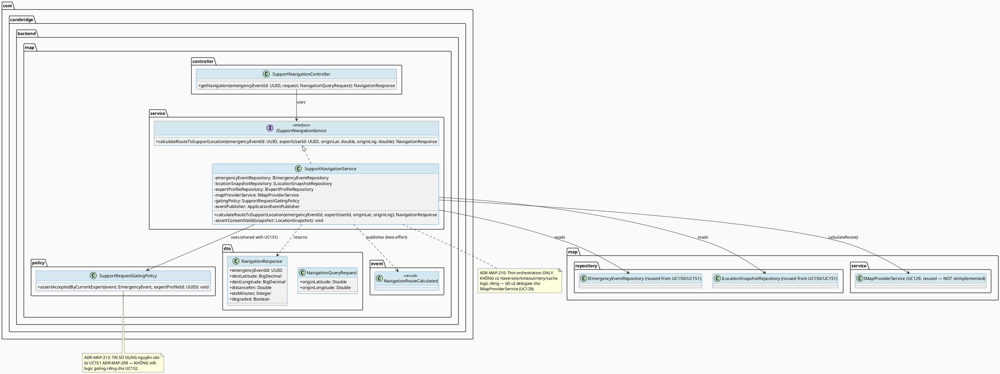
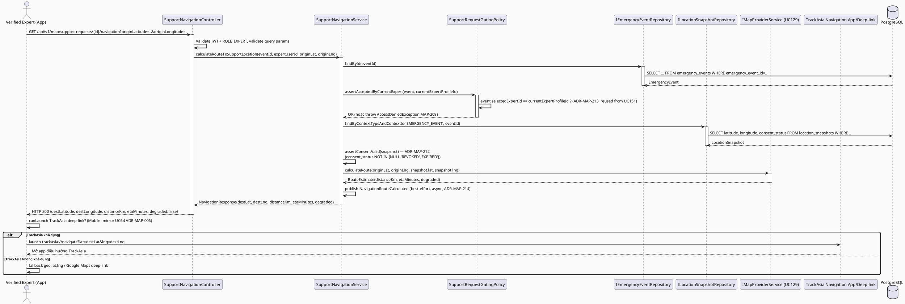
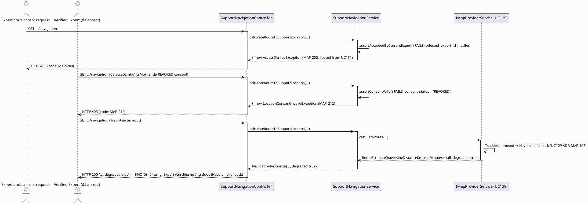

# ENGINEERING DOCUMENTATION STANDARD (EDS) v2.0
# UC152 — Navigate to Support Location

| Field | Value |
|-------|-------|
| **Document ID** | `CB-MAP-IMP-005` |
| **Version** | `1.0` |
| **Date** | `2026-07-02` |
| **Status** | `Draft` |
| **Document Owner** | `TV4 - Lâm` |
| **Author** | `AI Agent — Tech Lead` |
| **Reviewed by** | `[ ] Pending` |
| **DPO Sign-off** | `[ ] Pending` *(module xử lý toạ độ chính xác của Mother, mở khóa qua UC151 — bắt buộc DPO review trước Approve)* |
| **Approved by** | `[ ] Pending` |
| **Last Review** | `2026-07-02` |
| **Based on EDS** | `v2.0` |

---

## CHANGELOG

| Ngày | Người thực hiện | Nội dung thay đổi |
|------|-----------------|-------------------|
| 2026-07-02 | AI Agent — Tech Lead | Tạo tài liệu lần đầu — TDS cho UC152 Navigate to Support Location, bước thứ 3 (cuối) trong chuỗi expert-side nearby-support workflow (UC150 → UC151 → UC152) |
| 2026-07-02 | AI Agent — Tech Lead | **Đóng Open Item (RG-6 — gating mechanism, chung với UC150/UC151):** Product Owner đã CONFIRMED cơ chế "accept" — `selected_expert_id = <currentExpertProfileId>` = đã accept bởi Expert này (điều kiện gating cho navigation). Cập nhật §1, §2, §3 ADR-MAP-213, §17 tương ứng — ngôn ngữ chuyển từ "suy luận/Open" sang "Confirmed/Accepted". Open Item khác (RG-2 `consent_status` enum values, nguồn toạ độ Expert) KHÔNG thay đổi. |

---

## MỤC LỤC

1. [Tổng quan Module](#1-tổng-quan-module)
2. [Ma trận Truy vết (Traceability Matrix)](#2-ma-trận-truy-vết-traceability-matrix)
3. [Architecture Decision Records (ADR)](#3-architecture-decision-records-adr)
4. [Non-Functional Requirements & SLA](#4-non-functional-requirements--sla)
5. [Static Modeling (Mô hình Tĩnh)](#5-static-modeling-mô-hình-tĩnh)
6. [Dynamic Modeling (Mô hình Động)](#6-dynamic-modeling-mô-hình-động)
7. [Domain Event Catalog](#7-domain-event-catalog)
8. [Interface Specification (Đặc tả Giao diện)](#8-interface-specification-đặc-tả-giao-diện)
9. [API Specification](#9-api-specification)
10. [Bảng mã lỗi (Error Codes)](#10-bảng-mã-lỗi-error-codes)
11. [Quy trình Triển khai (Step-by-Step)](#11-quy-trình-triển-khai-step-by-step)
12. [Rollback & Incident Runbook](#12-rollback--incident-runbook)
13. [Kịch bản Kiểm thử Chi tiết](#13-kịch-bản-kiểm-thử-chi-tiết)
14. [Phương pháp Xác minh](#14-phương-pháp-xác-minh)
15. [Mẫu thử thực tế (API Verification Samples)](#15-mẫu-thử-thực-tế-api-verification-samples)
16. [Bảng tổng hợp phân quyền (Authorization Matrix)](#16-bảng-tổng-hợp-phân-quyền-authorization-matrix)
17. [AI Prompt Constraints (CASE 2.0)](#17-ai-prompt-constraints-case-20)

---

## 1. Tổng quan Module

> UC152 cho phép **Verified Expert**, sau khi đã accept một nearby support request (UC151), dùng **TrackAsia** (qua `IMapProviderService`, đã formal hoá tại UC129) để tính route/ETA đến vị trí hỗ trợ đã được đồng ý (consented) và mở điều hướng thực tế trên thiết bị. Đây là bước cuối cùng trong chuỗi 3 use case tuần tự: **UC150 (xem, minimum-necessary) → UC151 (accept + liên hệ, full detail mở khóa) → UC152 (điều hướng)**.
>
> **RG-3 xác nhận (thin orchestration, KHÔNG viết lại route/ETA logic):** UC152 **KHÔNG tự tính toán route/ETA** — toàn bộ logic tính khoảng cách/route/ETA, cache, timeout/retry, và Haversine fallback đã được **formal hoá tại UC129** (`CB-MAP-IMP-000`, `IMapProviderService.calculateRoute()`). UC152 là **thin orchestration layer**: (a) verify Expert đã accept request (tái sử dụng gating từ UC151), (b) lấy toạ độ hiện tại của Expert (tham số truyền vào từ client — KHÔNG lưu trữ) + toạ độ đích chính xác của Mother (qua `location_snapshots`, cùng nguồn dữ liệu UC151 đã dùng cho `contact-detail`), (c) gọi `IMapProviderService.calculateRoute()`, (d) trả kết quả cho client để mở app điều hướng (mirror pattern UC64 ADR-MAP-006 — TrackAsia deep-link ưu tiên, fallback map app mặc định thiết bị).
>
> **[RESOLVED 2026-07-02 — Confirmed by Product Owner] RG-6 (kế thừa nguyên trạng gating từ UC151, KHÔNG tự quyết định lại):** UC152 **tái sử dụng nguyên văn** điều kiện gating đã thiết lập ở UC151 ADR-MAP-208: chỉ Expert có `emergency_events.selected_expert_id = currentExpertProfileId` mới được gọi `calculateRouteToSupportLocation()`. Đây là **Open Item chung với UC150/UC151**, đã được Product Owner CONFIRMED (2026-07-02) là cơ chế chính thức — cơ chế "accept" dựa trên cột `selected_expert_id` (schema `V1__init_schema.sql`), củng cố bởi việc UC150/UC151/UC152 độc lập suy luận ra cùng cơ chế. UC152 KHÔNG resolve lại độc lập, chỉ kế thừa kết quả đã resolve đồng thời cho cả 3 TDS.
>
> **BR-PRIVACY xác nhận (khác UC150/UC151 — SRS liệt kê minh thị cho UC152):** SRS §3.3.6.4 Business Rules liệt kê `BR-RBAC` VÀ `BR-PRIVACY` ("health and family data must follow consent, purpose, and minimum-necessary access rules") — đây là BR-PRIVACY DUY NHẤT được liệt kê minh thị trong toàn chuỗi UC150-151-152 (UC150 chỉ có BR-RBAC, TDS UC150 phải suy luận tinh thần BR-PRIVACY; UC151 có BR-CONSULTATION không khớp trực tiếp). TDS này áp dụng BR-PRIVACY theo đúng nghĩa đen SRS: route/ETA CHỈ được tính đến vị trí đã "consented" — tức là toạ độ trong `location_snapshots` với `consent_status` hợp lệ (không rỗng/không revoked). Nếu `consent_status` không hợp lệ, UC152 PHẢI từ chối tính route (xem ADR-MAP-212).

| Field | Value |
|-------|-------|
| **Module Name** | `Navigate to Support Location` |
| **Bounded Context** | `map` (mở rộng bounded context `map` đã có từ UC63/UC64/UC129/UC150/UC151 — theo phân công TV4-Lâm "nearby support" trong `function-spec-task-allocation.md` §3.3.6 MF-19 Location & Nearby Support) |
| **Data Classification** | `Sensitive-PII` *(toạ độ chính xác của Mother — cùng mức nhạy cảm như UC151's contact detail)* |
| **Compliance Scope** | `PDPA / Luật 91/2025` — BR-PRIVACY minh thị (consent-gated route calculation) |
| **Upstream Dependencies** | `UC151 Contact Nearby User` (gating: chỉ Expert đã accept mới gọi được), `UC129 Calculate Distance/Route/ETA` (`IMapProviderService.calculateRoute()` — TÁI SỬ DỤNG, KHÔNG viết lại), `emergency_events` (đọc, không modify), `location_snapshots` (đọc toạ độ + `consent_status`), `expert_profiles` (xác thực VERIFIED), `IAM (JWT ROLE_EXPERT)` |
| **Downstream Consumers** | Không có consumer trực tiếp trong repo — hành động terminal (mở app điều hướng trên thiết bị Expert), mirror UC64's terminal client-side action |

---

## 2. Ma trận Truy vết (Traceability Matrix)

| Requirement ID | Loại (BR/ADR/US) | Mô tả yêu cầu | Thành phần Code | Compliance Target | ADR liên quan |
|----------------|------------------|---------------|-----------------|-------------------|---------------|
| SRS-3.3.6.4 (UC-152) | User Story | Verified Expert dùng TrackAsia tính route/ETA đến vị trí hỗ trợ đã consented | `SupportNavigationController.GET /api/v1/map/support-requests/{id}/navigation` | — | ADR-MAP-210, ADR-MAP-211 |
| SRS-3.3.6.4 §Business Rules | Business Rule | BR-RBAC: chỉ actor có quyền hợp lệ mới truy cập | `SupportNavigationController` | BR-RBAC | ADR-MAP-213 |
| SRS-3.3.6.4 §Business Rules | Business Rule | BR-PRIVACY: dữ liệu sức khỏe/gia đình phải theo consent, purpose, minimum-necessary — route CHỈ tính khi vị trí đã consented | `SupportNavigationService.calculateRouteToSupportLocation()` | PDPA (consent) | ADR-MAP-212 |
| SRS-3.3.6.4 §Description | Description | "Uses TrackAsia to calculate route and ETA to the consented support location" | `SupportNavigationService` → `IMapProviderService.calculateRoute()` | — | ADR-MAP-210 |
| SRS §Postconditions POST-3 | Postcondition | Sensitive actions được ghi audit | `NavigationRouteCalculated` domain event (§7) | PDPA | ADR-MAP-214 |
| SRS §Exceptions E3 | Exception | External service/network/server failure → retry guidance, không duplicate/unsafe action | `IMapProviderService` (đã có fallback Haversine ở UC129 ADR-MAP-103) | BR-SAFETY | — |
| `CB-MAP-IMP-000` (UC129) §8.1 | Interface Reuse — BẮT BUỘC | `IMapProviderService.calculateRoute(originLat, originLng, destLat, destLng): RouteEstimate` — UC152 gọi TRỰC TIẾP, KHÔNG viết lại logic route/ETA/fallback | `SupportNavigationService` | — | ADR-MAP-210 |
| `CB-MAP-IMP-004` (UC151) §3 ADR-MAP-208 | Reuse — gating mechanism | Chỉ Expert có `emergency_events.selected_expert_id = currentExpertProfileId` mới được gọi navigation endpoint — TÁI SỬ DỤNG nguyên văn check, KHÔNG viết lại logic gating riêng | `SupportNavigationService` | PDPA, BR-RBAC | ADR-MAP-213 |
| `CB-MAP-IMP-002` (UC64) §3 ADR-MAP-006 | Pattern Reuse | TrackAsia deep-link ưu tiên, fallback map app mặc định thiết bị — client-side, backend không tham gia critical path mở app | Mobile: `SupportNavigationMobileService.navigate()` | — | ADR-MAP-211 |
| ADR-MAP-210 | Decision | `SupportNavigationService` là thin wrapper gọi `IMapProviderService.calculateRoute()` — KHÔNG tính Haversine/route riêng, KHÔNG tự implement timeout/retry/cache (đã có ở UC129) | `SupportNavigationService` | — | — |
| ADR-MAP-211 | Decision | Backend trả toạ độ đích (`destLat`/`destLng`) + `RouteEstimate` cho client; việc mở app điều hướng thực tế (TrackAsia deep-link/fallback) xảy ra hoàn toàn ở Mobile client, mirror UC64 | `SupportNavigationController`, Mobile `SupportNavigationMobileService` | — | — |
| ADR-MAP-212 | Decision | Route CHỈ được tính nếu `location_snapshots.consent_status` hợp lệ (không NULL, không `'REVOKED'`/`'EXPIRED'`) — nếu không, từ chối với lỗi rõ ràng (BR-PRIVACY) | `SupportNavigationService` | PDPA (BR-PRIVACY minh thị) | — |
| ADR-MAP-213 | Decision | Endpoint yêu cầu JWT + `ROLE_EXPERT` + `verification_status='VERIFIED'` + `emergency_events.selected_expert_id = currentExpertProfileId` (TÁI SỬ DỤNG check từ UC151 ADR-MAP-208, KHÔNG viết lại) | `SupportNavigationController` | BR-RBAC | — |
| ADR-MAP-214 | Decision | Ghi domain event `NavigationRouteCalculated` mỗi khi tính route thành công — best-effort (giống UC150's view log, KHÔNG transactional-bắt-buộc như UC151's accept, vì đây là read-only computation không thay đổi state nghiệp vụ) | `SupportNavigationService` | PDPA (POST-3) | — |

> **[RESOLVED 2026-07-02 — Confirmed by Product Owner] RG-6 (kế thừa nguyên trạng từ UC150/UC151, KHÔNG tự quyết định lại):** Cơ chế "accept" (`selected_expert_id`) đã ghi ở UC150 TDS §2 và UC151 TDS §2 — UC152 phụ thuộc trực tiếp vào cùng cơ chế này để gating. Đã **resolve đồng thời cho cả 3 TDS (UC150, UC151, UC152)** — không resolve riêng lẻ, theo đúng yêu cầu ban đầu.
>
> **Open (RG-2 — consent_status enum values):** `location_snapshots.consent_status` (varchar(20)) trong `V1__init_schema.sql` KHÔNG có `CHECK` constraint liệt kê đầy đủ giá trị hợp lệ — TDS này **đề xuất** coi `NULL`, `'REVOKED'`, `'EXPIRED'` là "không hợp lệ" (từ chối route) và bất kỳ giá trị khác (vd: `'GRANTED'`, `'ACTIVE'`) là "hợp lệ" — đây là **suy luận kỹ thuật, chưa xác nhận enum values chính thức**. Đánh dấu **Open — cần Product Owner/TV4-Lâm và UC141/UC63 owner (nơi đầu tiên dùng cột này) xác nhận danh sách enum values đầy đủ trước khi Approve.**
>
> **Open (Expert's own location — không lưu trữ):** SRS không xác nhận rõ nguồn toạ độ **hiện tại của Expert** (origin cho route calculation) — có thể là: (a) tham số query truyền trực tiếp từ client mỗi lần gọi (KHÔNG lưu), hoặc (b) đọc từ `expert_location_shares` (bảng đã tồn tại, dùng cho UC147 Share Expert Location — nhưng đó là chia sẻ công khai cho Mother tìm kiếm, mục đích khác). TDS này chọn **Phương án (a)** — xem ADR-MAP-210 — vì đơn giản hơn và không phụ thuộc UC147 phải hoàn thành trước; đánh dấu **Open — cần xác nhận UX thực tế (Expert có nhập tay toạ độ hay dùng GPS thiết bị tự động) nằm ngoài phạm vi backend TDS này.**

---

## 3. Architecture Decision Records (ADR)

### ADR-MAP-210 — Thin Orchestration: `SupportNavigationService` chỉ gọi `IMapProviderService.calculateRoute()`, KHÔNG viết lại logic route

| Field | Value |
|-------|-------|
| **Status** | `Proposed` |
| **Deciders** | `AI Agent — Tech Lead` (chờ TV4-Lâm confirm) |
| **Date** | `2026-07-02` |
| **Supersedes** | `—` |

#### Bối cảnh (Context)
UC129 (`CB-MAP-IMP-000`) đã formal hoá toàn bộ logic route/ETA: timeout 3000ms + 1 retry (ADR-MAP-102), Haversine fallback khi TrackAsia lỗi (ADR-MAP-103), cache Caffeine 10 phút (ADR-MAP-104). UC152's SRS Description "Uses TrackAsia to calculate route and ETA" mô tả đúng chức năng `IMapProviderService.calculateRoute()` đã có sẵn — không có lý do kỹ thuật nào để UC152 viết lại logic này.

#### Các phương án đã xem xét (Options Considered)

| Phương án | Mô tả | Ưu điểm | Nhược điểm |
|-----------|-------|----------|------------|
| A | `SupportNavigationService` inject `IMapProviderService`, gọi `calculateRoute(expertLat, expertLng, motherLat, motherLng)` trực tiếp — KHÔNG có logic route/timeout/cache riêng | Tránh trùng lặp code lần thứ 4 (sau UC63, UC64, UC150); tận dụng toàn bộ NFR đã kiểm chứng ở UC129 (cache, fallback, timeout) | Phụ thuộc cứng vào UC129 phải implement trước hoặc song song |
| B | UC152 tự gọi TrackAsia API trực tiếp (bỏ qua `IMapProviderService`) | Không phụ thuộc UC129 | Trùng lặp hoàn toàn logic đã có; vi phạm nguyên tắc DRY; rủi ro inconsistent behavior giữa các module cùng gọi TrackAsia |

#### Quyết định (Decision)
Chọn **Phương án A** — `SupportNavigationService` là **thin wrapper**: (1) verify gating (ADR-MAP-213), (2) verify consent (ADR-MAP-212), (3) lấy toạ độ đích từ `location_snapshots`, (4) gọi `mapProviderService.calculateRoute(originLat, originLng, destLat, destLng)`, (5) map `RouteEstimate` sang response DTO. KHÔNG có logic Haversine/timeout/retry/cache riêng trong package của UC152.

#### Hệ quả (Consequences)

**Tích cực:** Code UC152 cực kỳ mỏng (thin orchestration) — dễ test, dễ maintain; mọi cải tiến NFR ở UC129 (vd: đổi cache TTL) tự động áp dụng cho UC152 mà không cần sửa code UC152.

**Tiêu cực / Trade-offs:** Nếu `IMapProviderService` chưa implement khi UC152 implement, cần coordinate thứ tự triển khai (giống Open item đã ghi ở UC150 §11.1).

**Compliance Impact:** Không có — kế thừa toàn bộ compliance posture đã xác lập ở UC129 (không log toạ độ chính xác ở mức INFO, TLS, v.v.).

---

### ADR-MAP-211 — Client-side Navigation Launch: mirror UC64 (TrackAsia ưu tiên, fallback map app mặc định)

| Field | Value |
|-------|-------|
| **Status** | `Proposed` |
| **Deciders** | `AI Agent — Tech Lead` |
| **Date** | `2026-07-02` |
| **Supersedes** | `—` |

#### Bối cảnh (Context)
UC64 ADR-MAP-006 đã thiết lập tiền lệ: việc mở app điều hướng thực tế (TrackAsia deep-link hoặc fallback `geo:`/Google Maps) xảy ra hoàn toàn ở **client (Mobile)**, backend chỉ cung cấp toạ độ đích. UC152's "mở điều hướng" có cùng bản chất — không có lý do để backend tham gia vào việc launch app bên ngoài.

#### Các phương án đã xem xét (Options Considered)

| Phương án | Mô tả | Ưu điểm | Nhược điểm |
|-----------|-------|----------|------------|
| A | Backend trả `RouteEstimate` (distance/ETA) + toạ độ đích chính xác; Mobile tự quyết định mở TrackAsia app/deep-link hay fallback map app (tái sử dụng `NavigationLaunchHelper` nếu UC64 đã tạo, hoặc viết biến thể riêng nếu entity khác) | Nhất quán hoàn toàn với UC64; backend không cần biết gì về deep-link scheme cụ thể | Cần đảm bảo Mobile code họ tái sử dụng đúng phần chung (nếu có) từ UC64, tránh trùng lặp logic deep-link 2 lần |
| B | Backend tự tạo TrackAsia deep-link URL string và trả về cho client | Client đơn giản hơn (chỉ cần mở URL) | Backend phải biết chi tiết URL scheme của TrackAsia — vi phạm phân tách trách nhiệm (backend lo dữ liệu, client lo UI/launch); nếu TrackAsia đổi scheme, phải sửa backend thay vì chỉ sửa client |

#### Quyết định (Decision)
Chọn **Phương án A** — Backend endpoint (`GET .../navigation`) trả `RouteEstimate` (distanceKm, etaMinutes, degraded) + toạ độ đích (`destLatitude`, `destLongitude`). Mobile `SupportNavigationMobileService.navigate()` dùng **cùng logic** đã kiểm chứng ở UC64 (`canLaunch` TrackAsia deep-link → fallback `geo:`/Google Maps) — khuyến nghị tái sử dụng helper function nếu UC64 Mobile code đã factor ra 1 hàm dùng chung (`launchNavigationDeepLink(lat, lng)`); nếu chưa, viết biến thể riêng trong `nearbySupport/` package, KHÔNG sửa `emergencyMap/` package của UC64.

#### Hệ quả (Consequences)

**Tích cực:** Backend giữ nguyên tắc "không tham gia critical path mở app ngoài" nhất quán với UC64; dễ tái sử dụng UI/UX pattern đã có.

**Tiêu cực / Trade-offs:** Nếu UC64 Mobile code chưa factor deep-link logic thành helper dùng chung, UC152 sẽ viết lại 1 phiên bản tương tự (chấp nhận được — ưu tiên "smallest scoped change", không refactor UC64 code hiện có).

**Compliance Impact:** Không có.

---

### ADR-MAP-212 — Consent Gate: Route CHỈ tính khi `location_snapshots.consent_status` hợp lệ (BR-PRIVACY)

| Field | Value |
|-------|-------|
| **Status** | `Proposed` |
| **Deciders** | `AI Agent — Tech Lead` |
| **Date** | `2026-07-02` |
| **Supersedes** | `—` |

#### Bối cảnh (Context)
SRS §3.3.6.4 Business Rules liệt kê minh thị `BR-PRIVACY`: "health and family data must follow consent, purpose, and minimum-necessary access rules." Đây là BR duy nhất trong chuỗi UC150-151-152 xác nhận yêu cầu **consent** rõ ràng bằng văn bản SRS (khác UC150/UC151 phải suy luận tinh thần). `location_snapshots` đã có cột `consent_status` (varchar(20), không NOT NULL) sẵn sàng để enforce điều này.

#### Các phương án đã xem xét (Options Considered)

| Phương án | Mô tả | Ưu điểm | Nhược điểm |
|-----------|-------|----------|------------|
| A | Trước khi gọi `calculateRoute()`, kiểm tra `location_snapshots.consent_status` KHÔNG thuộc tập `{NULL, 'REVOKED', 'EXPIRED'}` — nếu vi phạm, từ chối với lỗi `MAP-212` (403), KHÔNG tính route | Enforce đúng nghĩa đen BR-PRIVACY minh thị của SRS; ngăn Expert điều hướng đến vị trí Mother đã thu hồi consent | Cần định nghĩa rõ enum values hợp lệ/không hợp lệ (Open item, xem §2) |
| B | Bỏ qua kiểm tra consent ở UC152 (giả định UC151's accept flow đã đủ) | Đơn giản hơn | Vi phạm trực tiếp BR-PRIVACY minh thị của SRS — accept (UC151) không đồng nghĩa với consent cho navigation cụ thể; đây là 2 khái niệm khác nhau (accept = Expert cam kết hỗ trợ, consent = Mother đồng ý chia sẻ vị trí chính xác cho mục đích điều hướng) |

#### Quyết định (Decision)
Chọn **Phương án A** — `SupportNavigationService.calculateRouteToSupportLocation()` PHẢI kiểm tra `consent_status` TRƯỚC khi gọi `IMapProviderService.calculateRoute()`. Nếu không hợp lệ, ném `LocationConsentInvalidException` (mã `MAP-212`, HTTP 403) — Expert nhận thông báo rõ ràng "vị trí hỗ trợ chưa được đồng ý chia sẻ cho điều hướng", KHÔNG lộ toạ độ hay lý do chi tiết hơn.

#### Hệ quả (Consequences)

**Tích cực:** Enforce đúng BR-PRIVACY minh thị duy nhất trong toàn chuỗi 3 use case — tránh vi phạm PDPA nếu Mother thu hồi đồng ý chia sẻ vị trí sau khi request đã được accept nhưng trước khi Expert điều hướng.

**Tiêu cực / Trade-offs:** Thêm 1 điều kiện fail có thể khiến Expert đã accept nhưng không điều hướng được — trade-off chấp nhận được vì đây là yêu cầu compliance minh thị, không phải tối ưu UX.

**Compliance Impact:** Củng cố PDPA/Luật 91/2025 theo đúng BR-PRIVACY minh thị của SRS UC152 — module PII-sensitive nhất trong chuỗi 3 UC (toạ độ chính xác + gating + consent, 3 lớp bảo vệ).

---

### ADR-MAP-213 — Authorization: Tái sử dụng nguyên văn gating từ UC151 (`ROLE_EXPERT` + `VERIFIED` + đã accept)

| Field | Value |
|-------|-------|
| **Status** | `Accepted` |
| **Deciders** | `Product Owner` (confirmed 2026-07-02), `AI Agent — Tech Lead` |
| **Date** | `2026-07-02` |
| **Supersedes** | `—` |

> **Confirmed by Product Owner 2026-07-02** — gating mechanism (`selected_expert_id`) schema-supported, độc lập hội tụ across UC150/UC151/UC152.

#### Bối cảnh (Context)
UC151 ADR-MAP-208 đã thiết lập invariant: chỉ Expert có `emergency_events.selected_expert_id = currentExpertProfileId` mới được truy cập PII/toạ độ chính xác của request đó. UC152's navigation endpoint truy cập cùng mức độ nhạy cảm dữ liệu (toạ độ chính xác) — PHẢI áp dụng cùng điều kiện gating, KHÔNG viết logic kiểm tra riêng có thể lệch pha với UC151.

#### Quyết định (Decision)
`SupportNavigationController`/`SupportNavigationService` tái sử dụng **cùng phương thức kiểm tra gating** đã định nghĩa ở UC151 (`assertAcceptedByCurrentExpert()` — khuyến nghị extract thành shared utility/method trong 1 class dùng chung nếu 2 use case implement gần nhau về thời gian, vd: `SupportRequestGatingPolicy` trong package `map.policy`, theo đúng CLAUDE.md package convention "Policy: reusable domain rules"). Nếu UC151 đã implement TRƯỚC UC152, UC152 PHẢI gọi lại đúng method/policy đó, KHÔNG viết lại logic kiểm tra `selected_expert_id` riêng.

#### Hệ quả (Consequences)

**Tích cực:** Đảm bảo tính nhất quán tuyệt đối giữa gating của UC151 (contact detail) và UC152 (navigation) — cả 2 đều bảo vệ cùng mức độ PII nhạy cảm, không có khoảng hở nếu 1 trong 2 sửa logic mà quên đồng bộ.

**Tiêu cực / Trade-offs:** Tạo dependency giữa UC151 và UC152 implementation — cần coordinate thứ tự (khuyến nghị implement UC151 trước, hoặc cả 2 cùng lúc bởi cùng developer/agent).

**Compliance Impact:** Củng cố BR-RBAC + PDPA nhất quán trong toàn chuỗi UC150-151-152.

---

### ADR-MAP-214 — Audit: Best-effort domain event cho route calculation (read-only, không state-changing)

| Field | Value |
|-------|-------|
| **Status** | `Proposed` |
| **Deciders** | `AI Agent — Tech Lead` |
| **Date** | `2026-07-02` |
| **Supersedes** | `—` |

#### Bối cảnh (Context)
Khác UC151 (accept/contact là state-changing action, ghi `RequestAccepted`/`NearbyUserContacted` transactional theo ADR-MAP-209), UC152's `calculateRouteToSupportLocation()` là **read-only computation** — không thay đổi bất kỳ state DB nào (giống UC150's view action). Mức độ quan trọng của audit trail tương đương UC150 (biết Expert nào đã xem route đến đâu, khi nào) hơn là UC151 (đổi state nghiệp vụ).

#### Quyết định (Decision)
`NavigationRouteCalculated` (xem §7) publish theo mô hình **best-effort** (mirror UC150's `SupportRequestViewed`, ADR-MAP-203) — lỗi publish KHÔNG được chặn response trả `RouteEstimate` cho Expert (nguyên tắc "AI/location xử lý không được delay hoặc chặn hành trình chính" đã áp dụng nhất quán từ UC63).

#### Hệ quả (Consequences)

**Tích cực:** Có audit trail phục vụ compliance (biết ai đã tính route đến vị trí nào) mà không ảnh hưởng latency đường găng của tính năng điều hướng (vốn đã có thể chậm do gọi TrackAsia qua UC129).

**Tiêu cực / Trade-offs:** Nếu event bus lỗi, một số lượt tính route không được ghi log — chấp nhận được, nhất quán UC150.

**Compliance Impact:** Hỗ trợ PDPA accountability principle (POST-3), mức độ nhất quán với UC150 (read-only action).

---

## 4. Non-Functional Requirements & SLA

### 4.1. Performance & Availability

| Category | Requirement | Target SLA | Measurement Method | Compliance Basis |
|----------|-------------|------------|---------------------|------------------|
| Latency | `GET .../navigation` khi `IMapProviderService.calculateRoute()` cache miss, TrackAsia thành công | `< 1600ms` (= UC129's `<1500ms` + ~100ms overhead gating/consent check) *(tính toán từ UC129 §4.1, không phải giá trị mới bịa)* | k6 load test | `CB-MAP-IMP-000` §4.1 |
| Latency | `GET .../navigation` khi cache hit (UC129 Caffeine) | `< 150ms` *(Open — đề xuất mới, = UC129's <50ms + overhead)* | k6 load test | ADR-MAP-104 (UC129) |
| Latency | `GET .../navigation` khi fallback (TrackAsia lỗi) | `< 3700ms` (= UC129's `<3600ms` fallback + ~100ms overhead) | k6 load test với WireMock simulate timeout | `CB-MAP-IMP-000` §4.1 |
| Availability | Uptime (monthly) | `99.9%` *(Open — theo baseline chung dự án, kế thừa UC150)* | Uptime monitor | — |
| Throughput | Concurrent requests | `50 req/s` *(Open — kế thừa từ UC63/UC129/UC150 §4.1)* | Load test | `CB-MAP-IMP-000` §4.1 |

### 4.2. Data Integrity & Retention

| Category | Requirement | Target | Verification Method | Compliance Basis |
|----------|-------------|--------|---------------------|------------------|
| No new persistence | UC152 KHÔNG ghi bảng mới, KHÔNG lưu toạ độ Expert (origin truyền vào làm tham số, không persist) | 0 bảng DB mới, 0 cột lưu origin Expert location | Migration review + code review | §5.2 |
| Consent enforcement | 100% request tới `IMapProviderService.calculateRoute()` PHẢI đi qua consent check trước (ADR-MAP-212) | 100% | Unit test kiểm tra thứ tự gọi (consent check trước map service call) | ADR-MAP-212 |
| Gating consistency | Gating check của UC152 PHẢI cho kết quả giống hệt UC151 cho cùng input (Expert, request) | 100% test case đồng nhất | Integration test chạy chung fixture với UC151 | ADR-MAP-213 |

### 4.3. Security

| Category | Requirement | Target | Verification Method | Compliance Basis |
|----------|-------------|--------|---------------------|------------------|
| Encryption in transit | Endpoint | TLS 1.3+ | SSL Labs scan | PDPA |
| Access control | `ROLE_EXPERT` + `VERIFIED` + đã accept (mirror UC151) | Least privilege | Auth Matrix (§16) | BR-RBAC, ADR-MAP-213 |
| No PII in logs | Log request KHÔNG chứa toạ độ chính xác của Mother/Expert ở mức INFO | Log audit | Grep kiểm tra | PDPA, kế thừa UC129 §4.3 |
| Consent boundary | Response CHỈ trả `RouteEstimate` + toạ độ đích nếu consent hợp lệ — KHÔNG có "partial" response khi consent invalid | Code review | ADR-MAP-212 |

### 4.4. Scalability & Capacity Planning

> Tải phụ thuộc số lượng Expert đã accept đang điều hướng — thấp hơn UC150 (view) và tương đương UC151 (contact). Không cần cơ chế scale riêng ngoài cấu hình chung Spring Boot + Caffeine cache đã có ở UC129.

---

## 5. Static Modeling (Mô hình Tĩnh)

### 5.1. Class Diagram (PlantUML)



### 5.2. Data Structure (Flyway SQL Migration)

> **Không cần migration mới.** UC152 là **read-only orchestration** — không có entity/bảng riêng, không lưu toạ độ Expert (origin truyền vào làm tham số Java, không persist — mirror UC129's statelessness). Đã kiểm tra toàn bộ `05_Development/CareBridgeAPI/src/main/resources/db/migration/` (đến `V20260629000002__create_community_answer_likes.sql`, cộng các `V202606*` khác) — không có bảng nào tên `navigation_requests`/`route_history` hay tương tự.
>
> **Bảng liên quan đã tồn tại (tham chiếu, KHÔNG sở hữu bởi UC152):**
>
> ```sql
> -- Đã tồn tại trong V1__init_schema.sql (dòng 1081-1095) — module `emergency` sở hữu, UC152 KHÔNG modify
> -- emergency_events: ... selected_expert_id (FK -> expert_profiles, nullable), status ...
> --
> -- Đã tồn tại trong V1__init_schema.sql (dòng 1097-1108) — module `map` (UC63/UC150/UC151) sở hữu, UC152 KHÔNG modify
> -- location_snapshots: ... latitude, longitude, consent_status (varchar(20), nullable — enum values chưa xác nhận, xem §2 Open)
> --
> -- Đã tồn tại trong V1__init_schema.sql (dòng 828-840) — module `expert` sở hữu, UC152 KHÔNG modify, KHÔNG dùng cho origin Expert (xem §2 Open — Expert location là tham số query, không đọc từ bảng này trong MVP)
> -- expert_location_shares: location_share_id (PK), expert_profile_id (FK), latitude, longitude, ...
> ```
>
> **Open Item — CRITICAL (kế thừa từ UC150/UC151 §5.2):** Cùng rủi ro `context_type` convention (`'EMERGENCY_EVENT'`) chưa xác nhận với UC141 owner khi JOIN `location_snapshots`.
>
> **Version tiếp theo khả dụng nếu cần migration sau này** (vd: nếu Product Owner yêu cầu lưu route history cho compliance): `V20260705161000` trở đi (cùng sub-range đã pre-assign cho UC150/UC151, tránh trùng các batch song song `090000`-`150000`). **Chưa tạo migration này trong Draft**, chỉ ghi nhận Open (hiện tại không cần).

---

## 6. Dynamic Modeling (Mô hình Động)

### 6.1. Sequence Diagram — Happy Path (PlantUML)



### 6.2. Sequence Diagram — Error Path: Consent Invalid / Not Accepted / TrackAsia Degraded



### 6.3. State Machine

> UC152 không có entity trạng thái riêng — `NavigationResponse` là value object bất biến (tương tự UC129's `RouteEstimate`). Trạng thái gating (`MINIMUM_NECESSARY`/`FULL_DETAIL_FOR_ACCEPTING_EXPERT`) đã được mô tả đầy đủ ở UC150 TDS §6.3 và UC151 TDS §6.4 — UC152 chỉ **đọc** trạng thái đó (qua `SupportRequestGatingPolicy`), không sở hữu transition nào. Bỏ qua state machine riêng theo template (không cần lặp lại).

---

## 7. Domain Event Catalog

### 7.1. Events Published (Phát ra)

| Event Name | Trigger | Publisher | Subscriber(s) | Payload Schema | Async? |
|------------|---------|-----------|---------------|----------------|--------|
| `NavigationRouteCalculated` | Expert gọi thành công `calculateRouteToSupportLocation()` (sau khi qua gating + consent check) | `SupportNavigationService` | Audit/compliance log consumer (Open — chưa có subscriber cụ thể, ghi nhận best-effort mirror UC150) | `NavigationRouteCalculated.java` (xem §7.3) | Yes (best-effort, ADR-MAP-214) |

### 7.2. Events Consumed (Tiêu thụ)

_Không có._ UC152 không tiêu thụ event nào từ module khác — đọc trực tiếp DB + gọi `IMapProviderService` theo pull model.

### 7.3. Payload Schema

```java
// NavigationRouteCalculated.java
// Package: com.carebridge.backend.map.event
public record NavigationRouteCalculated(
    UUID    eventId,          // UUID.randomUUID()
    String  eventType,        // "NavigationRouteCalculated"
    Instant occurredAt,       // Instant.now()
    String  version,          // "1.0"
    Payload payload,
    Metadata metadata
) {

    public record Payload(
        UUID    emergencyEventId,   // emergency_events.emergency_event_id
        UUID    expertProfileId,    // Expert đã tính route
        Double  distanceKm,         // từ RouteEstimate
        Boolean degraded            // true nếu TrackAsia lỗi/fallback Haversine (UC129 ADR-MAP-103)
    ) {}

    public record Metadata(
        UUID   correlationId,
        String causedBy       // expertProfileId dạng String
    ) {}
}
```

---

## 8. Interface Specification (Đặc tả Giao diện)

### 8.1. Service Interface

```java
// NavigationQueryRequest.java — Input DTO (query params)
// @version 1.0
public class NavigationQueryRequest {
    @NotNull
    @DecimalMin("-90.0") @DecimalMax("90.0")
    private Double originLatitude;    // toạ độ HIỆN TẠI của Expert — tham số, KHÔNG lưu trữ (Open item §2)

    @NotNull
    @DecimalMin("-180.0") @DecimalMax("180.0")
    private Double originLongitude;

    // getters / setters
}

// NavigationResponse.java — Output DTO
// @version 1.0
public class NavigationResponse {
    private UUID       emergencyEventId;
    private BigDecimal destLatitude;    // location_snapshots.latitude — CHÍNH XÁC (khác UC150's rounding), mirror UC151's exactLatitude
    private BigDecimal destLongitude;
    private Double      distanceKm;      // từ IMapProviderService.calculateRoute() — RouteEstimate.distanceKm
    private Integer     etaMinutes;      // RouteEstimate.etaMinutes — null nếu degraded=true
    private Boolean     degraded;        // RouteEstimate.degraded — true nếu TrackAsia lỗi, Haversine fallback (UC129 ADR-MAP-103)
    // getters / setters
}

// ISupportNavigationService.java — Service Contract
// @version 1.0
public interface ISupportNavigationService {
    /**
     * Tính route/ETA từ vị trí hiện tại của Expert đến vị trí hỗ trợ đã accept + consented.
     * KHÔNG tự tính Haversine/gọi TrackAsia trực tiếp — delegate 100% cho IMapProviderService (UC129).
     * @throws AccessDeniedException (MAP-208) nếu Expert chưa accept request này (tái sử dụng gating UC151)
     * @throws LocationConsentInvalidException (MAP-212) nếu consent_status không hợp lệ (BR-PRIVACY)
     * @throws EntityNotFoundException (MAP-209) nếu emergencyEventId không tồn tại
     */
    NavigationResponse calculateRouteToSupportLocation(
        UUID emergencyEventId, UUID expertUserId, double originLatitude, double originLongitude);
}
```

### 8.2. Repository Interface (TÁI SỬ DỤNG — KHÔNG tạo trùng)

```java
// IEmergencyEventRepository.java — TÁI SỬ DỤNG nguyên trạng từ UC150 (§8.2) / UC151 (§8.2, có thêm conditionalAccept())
// KHÔNG thêm method mới cho UC152 — chỉ cần findById() đã có sẵn từ JpaRepository.

// ILocationSnapshotRepository.java — TÁI SỬ DỤNG nguyên trạng từ UC63/UC150/UC151
public interface ILocationSnapshotRepository extends JpaRepository<LocationSnapshot, UUID> {
    Optional<LocationSnapshot> findTopByContextTypeAndContextIdOrderByCapturedAtDesc(
        String contextType, UUID contextId);
}
```

### 8.3. Reused Interface (KHÔNG viết lại — tham chiếu UC129/UC151)

```java
// IMapProviderService.java — đã formal hoá tại UC129 (CB-MAP-IMP-000 §8.1)
// UC152 CHỈ inject và gọi calculateRoute(), KHÔNG reimplement Haversine/timeout/cache/fallback.
public interface IMapProviderService {
    RouteEstimate calculateRoute(double originLat, double originLng, double destLat, double destLng);
    double calculateHaversineDistance(double originLat, double originLng, double destLat, double destLng);
}

// SupportRequestGatingPolicy.java — khuyến nghị extract từ UC151 implementation (package com.carebridge.backend.map.policy,
// theo CLAUDE.md "Policy: reusable domain rules"). Nếu UC151 chưa factor ra policy riêng (logic nằm trực tiếp trong
// NearbySupportContactService), UC152 implementation PHẢI refactor NHẸ để extract shared method, KHÔNG viết logic
// kiểm tra selected_expert_id trùng lặp lần thứ 2 trong codebase.
// @version 1.0
public interface SupportRequestGatingPolicy {
    /**
     * @throws AccessDeniedException (MAP-208) nếu event.selectedExpertId != expertProfileId
     */
    void assertAcceptedByCurrentExpert(EmergencyEvent event, UUID expertProfileId);
}
```

```dart
// support_navigation_service.dart — Mobile, biến thể riêng dùng lại pattern UC64 ADR-MAP-006
// Package: lib/features/nearbySupport/services/
abstract class SupportNavigationMobileService {
  /// Mở TrackAsia deep-link nếu khả dụng, fallback map app mặc định nếu không (mirror UC64 ADR-MAP-006).
  Future<bool> navigate({
    required double destLatitude,
    required double destLongitude,
    String? label,
  });
}
```

---

## 9. API Specification

### 9.1. Endpoints Table

| Method | Path | Auth Level | Required Roles | Rate Limit | Idempotent? |
|--------|------|------------|----------------|------------|-------------|
| `GET` | `/api/v1/map/support-requests/{emergencyEventId}/navigation` | JWT Bearer | `ROLE_EXPERT` (+ `VERIFIED` + đã accept request này) | 60/min *(Open — kế thừa đề xuất UC150/UC129)* | Yes |

### 9.2. Request / Response Schemas

#### `GET /api/v1/map/support-requests/{emergencyEventId}/navigation?originLatitude=10.7700&originLongitude=106.6950`

**Response — 200 OK (Happy Path, TrackAsia thành công):**
```json
{
  "emergencyEventId": "550e8400-e29b-41d4-a716-446655440000",
  "destLatitude": 10.776889,
  "destLongitude": 106.700912,
  "distanceKm": 1.8,
  "etaMinutes": 7,
  "degraded": false
}
```

**Response — 200 OK (TrackAsia degraded — Haversine fallback, mirror UC129 §9.2):**
```json
{
  "emergencyEventId": "550e8400-e29b-41d4-a716-446655440000",
  "destLatitude": 10.776889,
  "destLongitude": 106.700912,
  "distanceKm": 1.6,
  "etaMinutes": null,
  "degraded": true
}
```

**Response — 400 Bad Request:**
```json
{
  "error": {
    "code": "MAP-211",
    "message": "originLatitude and originLongitude are required and must be valid coordinates",
    "details": [{ "field": "originLatitude", "message": "must be between -90 and 90" }]
  }
}
```

**Response — 403 Forbidden (chưa accept request này):**
```json
{
  "error": { "code": "MAP-208", "message": "You have not accepted this support request" }
}
```

**Response — 403 Forbidden (consent không hợp lệ — BR-PRIVACY):**
```json
{
  "error": { "code": "MAP-212", "message": "Support location is not consented for navigation" }
}
```

**Response — 404 Not Found:**
```json
{
  "error": { "code": "MAP-209", "message": "Support request not found" }
}
```

---

## 10. Bảng mã lỗi (Error Codes)

| Code | HTTP Status | Message (EN) | Message (VI) | Trigger Condition |
|------|-------------|--------------|--------------|-------------------|
| `MAP-208` | 403 | Not the accepting expert | Không phải Expert đã accept | `emergency_events.selected_expert_id != currentExpertProfileId` (TÁI SỬ DỤNG mã lỗi từ UC151 ADR-MAP-208, cùng ý nghĩa) |
| `MAP-209` | 404 | Support request not found | Không tìm thấy yêu cầu hỗ trợ | `emergencyEventId` không tồn tại (TÁI SỬ DỤNG mã lỗi từ UC151) |
| `MAP-211` | 400 | Validation failed | Dữ liệu không hợp lệ | `originLatitude`/`originLongitude` thiếu hoặc ngoài phạm vi hợp lệ |
| `MAP-212` | 403 | Location not consented for navigation | Vị trí chưa được đồng ý cho điều hướng | `location_snapshots.consent_status` thuộc `{NULL, 'REVOKED', 'EXPIRED'}` (ADR-MAP-212, BR-PRIVACY) |
| `MAP-213` | 503 | Navigation service unavailable | Dịch vụ điều hướng không khả dụng | DB (`emergency_events`/`location_snapshots`) không truy vấn được — LƯU Ý: lỗi TrackAsia riêng KHÔNG trả mã này vì đã có Haversine fallback ở UC129 (luôn trả 200 với `degraded:true`) |

---

## 11. Quy trình Triển khai (Step-by-Step)

### 11.1. Prerequisites

- [ ] ADR-MAP-210, 211, 212, 214 được Accepted (hiện tại `Proposed` — đặc biệt ADR-MAP-212 cần xác nhận enum values `consent_status` với Product Owner/UC141/UC63 owner); ADR-MAP-213 đã **Accepted** (Confirmed by Product Owner 2026-07-02 — gating mechanism, xem §2)
- [ ] DPO sign-off cho việc mở khóa toạ độ chính xác qua navigation endpoint
- [ ] UC129 (`CB-MAP-IMP-000`) đã implement — `IMapProviderService` là dependency BẮT BUỘC, KHÔNG thể implement UC152 nếu chưa có
- [ ] UC151 (`CB-MAP-IMP-004`) đã implement hoặc implement song song — gating logic (`SupportRequestGatingPolicy`) PHẢI tái sử dụng, khuyến nghị extract thành shared class nếu chưa có
- [ ] Xác nhận với UC141 owner: giá trị `location_snapshots.context_type` dùng cho `emergency_events` (kế thừa Open item UC150/UC151)

### 11.2. Pre-Migration Checklist

- [ ] Không cần migration mới (§5.2) — N/A cho UC152

### 11.3. Implementation Steps

#### Chặng 1 — Mở rộng package `map` (tái sử dụng repository UC150/UC151, gọi `IMapProviderService` UC129)

```
com.carebridge.backend.map/
├── controller/SupportNavigationController.java
├── dto/request/NavigationQueryRequest.java
├── dto/response/NavigationResponse.java
├── service/ISupportNavigationService.java
├── service/impl/SupportNavigationService.java
├── policy/SupportRequestGatingPolicy.java (MỚI nếu UC151 chưa extract — nếu đã có, TÁI SỬ DỤNG)
├── event/NavigationRouteCalculated.java
└── exception/LocationConsentInvalidException.java
```

> **Lưu ý quan trọng khi implement song song với UC151:** Nếu UC151 đã implement gating logic trực tiếp trong `NearbySupportContactService` (chưa extract policy riêng), UC152 implementer PHẢI refactor NHẸ để tạo `SupportRequestGatingPolicy` dùng chung — đây là refactor nhỏ, có mục đích rõ ràng (tránh trùng lặp logic bảo mật quan trọng), phù hợp nguyên tắc CLAUDE.md "Policy: reusable domain rules." KHÔNG refactor các phần khác của UC151 ngoài việc extract này.

#### Chặng 2 — Implement Service: gating → consent check → gọi `IMapProviderService`

```java
// Thứ tự BẮT BUỘC: assertAcceptedByCurrentExpert() TRƯỚC, assertConsentValid() SAU,
// mapProviderService.calculateRoute() CUỐI CÙNG. KHÔNG đảo thứ tự (đảm bảo fail-fast
// trước khi tốn chi phí gọi external TrackAsia API).
```

#### Chặng 3 — Implement Controller + Security config

```java
// @PreAuthorize("hasRole('EXPERT')") + kiểm tra verification_status + gating trong Service layer
```

#### Chặng 4 — Mobile: `SupportNavigationMobileService` (biến thể riêng UC64 pattern)

```
lib/features/nearbySupport/services/support_navigation_service.dart
lib/features/nearbySupport/services/support_navigation_service_impl.dart
```

### 11.4. Deployment Checklist

- [ ] `GET .../navigation` trả 200 với `RouteEstimate` hợp lệ cho Expert đã accept + consent hợp lệ
- [ ] Expert chưa accept nhận 403 MAP-208 đúng
- [ ] Request với `consent_status='REVOKED'` nhận 403 MAP-212 đúng
- [ ] TrackAsia timeout vẫn trả 200 với `degraded:true` (Haversine fallback từ UC129 hoạt động đúng qua UC152)
- [ ] Xác nhận response KHÔNG có field PII khác ngoài toạ độ đích (không có `motherFullName`/`motherPhone` — những field đó CHỈ thuộc UC151's `contact-detail`)

---

## 12. Rollback & Incident Runbook

### 12.1. Điều kiện kích hoạt Rollback

| Điều kiện | Ngưỡng | Người quyết định |
|-----------|--------|------------------|
| Navigation endpoint trả toạ độ cho Expert chưa accept | Bất kỳ case nào phát hiện | Tech Lead + DPO (khẩn cấp) |
| Route được tính dù `consent_status` invalid (vi phạm BR-PRIVACY) | Bất kỳ case nào phát hiện | Tech Lead + DPO (khẩn cấp) |
| Error rate tăng đột biến | > 5% trong 5 phút | On-call Engineer |

### 12.2. Rollback Procedure

```bash
# Không có migration mới để rollback (§5.2) — chỉ cần revert code deploy.
kubectl rollout undo deployment/carebridge-api
kubectl rollout status deployment/carebridge-api
```

### 12.3. Notification Protocol

| Thời điểm | Người nhận | Kênh | Template |
|-----------|------------|------|----------|
| Ngay khi phát hiện | On-call team | Slack `#incident` | "Navigate to Support Location gating/consent bug detected: [mô tả]" |
| Trong 30 phút (nếu PII leak hoặc BR-PRIVACY vi phạm) | DPO | Email | Bắt buộc nếu phát hiện gating/consent bypass |

### 12.4. Post-Incident Review (PIR)

- **Timeline, Root Cause (5 Whys), Impact, Remediation, Prevention** — theo template chung.

---

## 13. Kịch bản Kiểm thử Chi tiết

> Chi tiết đầy đủ nằm trong `UC152_NavigateToSupportLocation_Test-Spec.md`.

| TDS Concern | Test-Spec Condition Ref |
|-------------|--------------------------|
| ADR-MAP-210 (thin orchestration — gọi IMapProviderService, không viết lại) | `TC-COND-001, 002` |
| ADR-MAP-211 (client-side navigation launch — Mobile) | `TC-COND-003` |
| ADR-MAP-212 (consent gate — BR-PRIVACY, CRITICAL) | `TC-COND-004, 005, 006` |
| ADR-MAP-213 (gating tái sử dụng UC151 — CRITICAL) | `TC-COND-007, 008` |
| ADR-MAP-214 (audit best-effort) | `TC-COND-009` |
| UC129 fallback propagation (degraded=true qua UC152) | `TC-COND-010` |
| SRS E3 (external/DB failure) | `TC-COND-011` |

---

## 14. Phương pháp Xác minh

### 14.1. Database Inspection

```sql
-- Verify emergency_events đã accept đúng expert trước khi test navigation
SELECT emergency_event_id, selected_expert_id, status
FROM emergency_events
WHERE emergency_event_id = '<uuid>';

-- Verify consent_status của location_snapshots liên quan
SELECT location_snapshot_id, context_type, context_id, consent_status
FROM location_snapshots
WHERE context_type = 'EMERGENCY_EVENT' AND context_id = '<emergency_event_id>';
```

### 14.2. Log / Audit Verification

```bash
kubectl logs -l app=carebridge-api | grep "GET /api/v1/map/support-requests/.*navigation"
kubectl logs -l app=carebridge-api | grep -iE "destLatitude|destLongitude|originLatitude"
# Expected: No output ở mức INFO — toạ độ chính xác KHÔNG được log
```

### 14.3. Tool-based Verification

```bash
curl -X GET "https://$HOST/api/v1/map/support-requests/<id>/navigation?originLatitude=10.77&originLongitude=106.695" \
  -H "Authorization: Bearer $ACCEPTING_EXPERT_JWT"
```

---

## 15. Mẫu thử thực tế (API Verification Samples)

### 15.1. Happy Path

```bash
curl -X GET "https://$HOST/api/v1/map/support-requests/550e8400-e29b-41d4-a716-446655440000/navigation?originLatitude=10.7700&originLongitude=106.6950" \
  -H "Authorization: Bearer $ACCEPTING_EXPERT_JWT" \
  -H "X-Correlation-Id: $(uuidgen)"
```

### 15.2. Error Paths

```bash
# Expert chưa accept request này → 403 MAP-208
curl -X GET "https://$HOST/api/v1/map/support-requests/<not-accepted-by-me>/navigation?originLatitude=10.77&originLongitude=106.70" \
  -H "Authorization: Bearer $VERIFIED_EXPERT_JWT"

# Consent invalid → 403 MAP-212
curl -X GET "https://$HOST/api/v1/map/support-requests/<revoked-consent-id>/navigation?originLatitude=10.77&originLongitude=106.70" \
  -H "Authorization: Bearer $ACCEPTING_EXPERT_JWT"

# Toạ độ không hợp lệ → 400 MAP-211
curl -X GET "https://$HOST/api/v1/map/support-requests/<id>/navigation?originLatitude=999&originLongitude=106.70" \
  -H "Authorization: Bearer $ACCEPTING_EXPERT_JWT"

# Không có JWT → 401
curl -X GET "https://$HOST/api/v1/map/support-requests/<id>/navigation?originLatitude=10.77&originLongitude=106.70"
```

---

## 16. Bảng tổng hợp phân quyền (Authorization Matrix)

| Endpoint | `GUEST` | `ROLE_MOTHER` | `ROLE_EXPERT` (unverified) | `ROLE_EXPERT` (VERIFIED, chưa accept) | `ROLE_EXPERT` (VERIFIED, đã accept, consent invalid) | `ROLE_EXPERT` (VERIFIED, đã accept, consent hợp lệ) | `ROLE_ADMIN` |
|----------|---------|---------------|----------------------------|-----------------------------------------|----------------------------------------------------------|--------------------------------------------------------|--------------|
| `GET /api/v1/map/support-requests/{id}/navigation` | ❌ | ❌ | ❌ (403 MAP-208) | ❌ (403 MAP-208) | ❌ (403 MAP-212) | ✅ Own | ❌ *(Open, mirror UC150/UC151 §16)* |

> **Open:** SRS không xác nhận rõ liệu ROLE_ADMIN có cần quyền compliance review cho navigation history — nếu cần, đây là bổ sung ngoài phạm vi Draft này (mirror Open item của UC150/UC151).

---

## 17. AI Prompt Constraints (CASE 2.0)

### 17.1 Constraint Summary Table

| # | Constraint | Source (ADR/BR) | Last Verified |
|---|-----------|-----------------|---------------|
| C1 | `SupportNavigationService` PHẢI gọi `IMapProviderService.calculateRoute()` (UC129) cho MỌI tính toán route/ETA — TUYỆT ĐỐI KHÔNG viết lại Haversine/timeout/retry/cache logic riêng | `ADR-MAP-210` | `2026-07-02` |
| C2 | Gating check (`selected_expert_id == currentExpertProfileId`) PHẢI chạy TRƯỚC bất kỳ query PII hay gọi `IMapProviderService` nào — TÁI SỬ DỤNG policy từ UC151, KHÔNG viết logic gating thứ 2 | `ADR-MAP-213` | `2026-07-02` |
| C3 | Consent check (`consent_status` hợp lệ) PHẢI chạy SAU gating nhưng TRƯỚC khi gọi `IMapProviderService` — fail-fast, tránh gọi external API không cần thiết khi consent invalid | `ADR-MAP-212` | `2026-07-02` |
| C4 | Response DTO (`NavigationResponse`) CHỈ chứa toạ độ đích + `RouteEstimate` fields — TUYỆT ĐỐI KHÔNG thêm `motherFullName`/`motherPhone` (những field đó CHỈ thuộc UC151's `contact-detail`) | `ADR-MAP-211`, PDPA | `2026-07-02` |
| C5 | Mobile launch app điều hướng (TrackAsia/fallback) xảy ra HOÀN TOÀN ở client — Backend KHÔNG tạo deep-link URL string | `ADR-MAP-211` | `2026-07-02` |
| C6 | `expertUserId` PHẢI lấy từ JWT SecurityContext — KHÔNG từ request body/query param | `ADR-MAP-213` | `2026-07-02` |

### 17.2 Constraint Injection Block (Copy-Paste vào AI Prompt)

```
[CONSTRAINT BLOCK — Module: Navigate to Support Location — CB-MAP-IMP-005]
Theo TDS CB-MAP-IMP-005 và các ADR liên quan:

1. PHẢI gọi IMapProviderService.calculateRoute() (UC129) cho mọi route/ETA — KHÔNG viết lại Haversine/timeout/cache (ADR-MAP-210)
2. Gating check (selected_expert_id == currentExpertProfileId) PHẢI chạy TRƯỚC mọi thứ khác — tái sử dụng policy UC151 (ADR-MAP-213)
3. Consent check (consent_status hợp lệ) PHẢI chạy TRƯỚC khi gọi IMapProviderService — fail-fast (ADR-MAP-212)
4. Response DTO CHỈ chứa toạ độ đích + RouteEstimate — KHÔNG có motherFullName/motherPhone (ADR-MAP-211, PDPA)
5. Mobile launch app điều hướng hoàn toàn ở client — Backend không tạo deep-link URL (ADR-MAP-211)
6. expertUserId từ JWT SecurityContext — KHÔNG từ request body/query (ADR-MAP-213)

[CONTEXT BLOCK]
- Bounded Context: map
- Data Classification: Sensitive-PII (toạ độ chính xác)
- Compliance: PDPA / Luật 91/2025 — BR-PRIVACY minh thị (consent-gated)
- Existing interfaces: §8 Service Interface + §8.2 Repository (TÁI SỬ DỤNG UC150/UC151) + §8.3 IMapProviderService (UC129, TÁI SỬ DỤNG)
- Error codes: §10 Error Codes Table
- Auth matrix: §16 Authorization Matrix

[TASK BLOCK]
Implement SupportNavigationService.calculateRouteToSupportLocation() thỏa mãn constraints trên.
Output phải tuân thủ §8 Interface Specification.
Tests phải cover §13 Test Scenarios (xem Test-Spec) — đặc biệt TC-COND-004-008 (consent + gating CRITICAL).
```

### 17.3 Constraint Quality Checklist

- [x] Mỗi constraint traceable về ADR hoặc BR cụ thể
- [x] Không có constraint generic
- [x] Mỗi constraint có `Last Verified` date ≤ 2 sprints
- [x] Constraint block có ≥ 3 constraints cụ thể (có 6)
- [x] Constraint block reference §8 Interface
- [x] Constraint block reference §16 Auth Matrix

### 17.4 Anti-Pattern Detection

| AP-ID | Anti-Pattern | Dấu hiệu | Hành động |
|-------|-------------|-----------|----------|
| AP-AI-001 | Unconstrained Gen | Code thêm field `motherFullName`/`motherPhone` vào `NavigationResponse` | Reject — enforce C4 |
| AP-AI-002 | Reimplementation | Code viết lại Haversine formula hoặc TrackAsia HTTP call riêng thay vì gọi `IMapProviderService` | Reject — enforce C1 |
| AP-AI-003 | Implicit Decision | Code bỏ qua consent check hoặc đảo thứ tự gating/consent | Reject — enforce C2/C3 |
| AP-AI-005 | Hallucinated Contract | Code import service/entity không có trong §8 (vd: tự bịa `ExpertLocationTrackingService` không tồn tại) | Reject — verify contract existence |

---

## PHỤ LỤC

### A. Glossary

| Thuật ngữ | Định nghĩa |
|-----------|------------|
| Thin Orchestration | Service layer chỉ điều phối gọi các capability đã có sẵn (UC129), không tự implement logic nghiệp vụ cốt lõi |
| Consent Gate | Điểm kiểm tra bắt buộc xác nhận `consent_status` hợp lệ trước khi xử lý dữ liệu vị trí nhạy cảm |
| Origin/Destination | Origin = vị trí hiện tại Expert (tham số, không lưu); Destination = vị trí Mother (từ `location_snapshots`) |
| Degraded | Cờ đánh dấu route được tính bằng Haversine fallback (TrackAsia lỗi) thay vì route thực tế — kế thừa UC129 |

### B. Tài liệu tham chiếu

| Document | Link / Path |
|----------|-------------|
| SRS UC-152 | `02_Requirements/SRS/3_Functional_Specification.md §3.3.6.4` |
| UC129 Calculate Distance/Route/ETA TDS (`IMapProviderService` — BẮT BUỘC tái sử dụng) | `04_Implement/UC129_CalculateDistanceRouteAndETA/UC129_CalculateDistanceRouteAndETA_TDS.md` |
| UC150 View Nearby Support Requests TDS (upstream — data model, gating origin) | `04_Implement/UC150_ViewNearbySupportRequests/UC150_ViewNearbySupportRequests_TDS.md` |
| UC151 Contact Nearby User TDS (upstream — gating mechanism BẮT BUỘC tái sử dụng) | `04_Implement/UC151_ContactNearbyUser/UC151_ContactNearbyUser_TDS.md` |
| UC64 Quick Call or Navigate TDS (client-side navigation launch pattern reference) | `04_Implement/UC64_QuickCallOrNavigate/UC64_QuickCallOrNavigate_TDS.md` |
| Task Allocation (TV4-Lâm ownership) | `04_Implement/implement_artifacts/function-spec-task-allocation.md` |
| DB Schema Source of Truth | `05_Development/CareBridgeAPI/src/main/resources/db/migration/V1__init_schema.sql` |
| EDS v2.0 Template | `08_References/Template/PHASE-3_TDS.md` |

---

*EDS v2.0 — Draft. Chưa Approved. Gating mechanism (kế thừa UC150/UC151) đã RESOLVED (Confirmed by Product Owner 2026-07-02 — xem §1, §2). Xem §2 (Open còn lại — `consent_status` enum values chưa xác nhận, nguồn toạ độ Expert), §16 cho danh sách Open Items còn lại cần Product Owner / TV4-Lâm / UC141 owner xác nhận trước khi chuyển Status sang `Approved`.*
