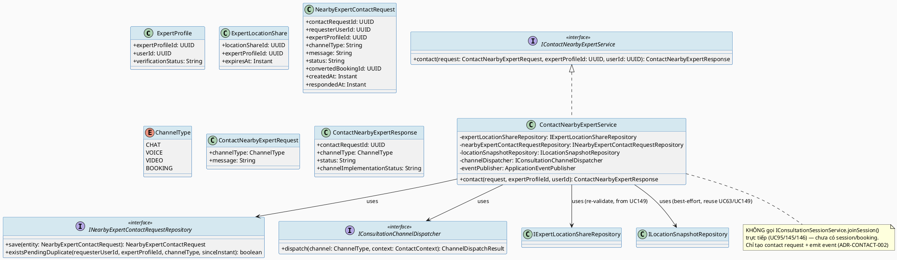
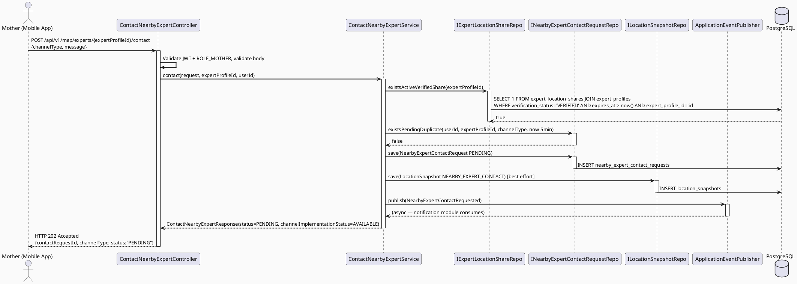
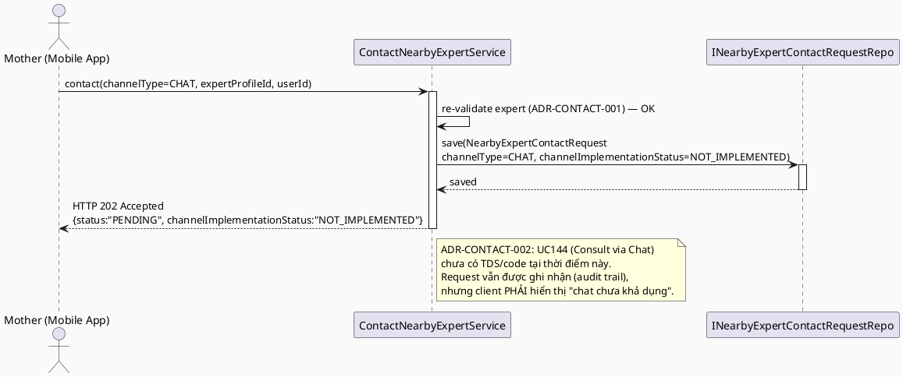
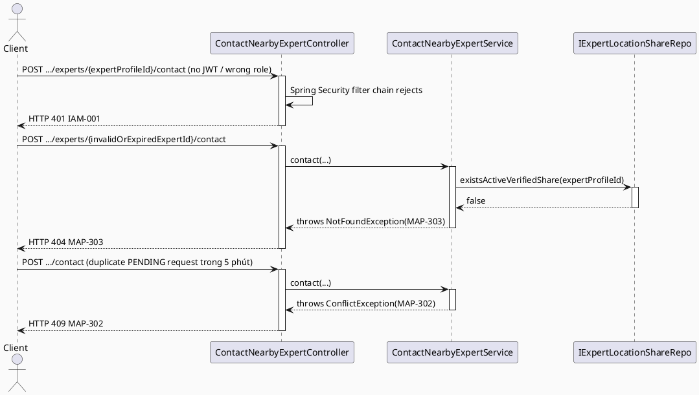

# ENGINEERING DOCUMENTATION STANDARD (EDS) v2.0
# UC153 — Contact Nearby Expert

| Field | Value |
|-------|-------|
| **Document ID** | `CB-MAP-IMP-006` |
| **Version** | `1.0` |
| **Date** | `2026-07-02` |
| **Status** | `Draft` |
| **Document Owner** | `TV4 - Lâm` |
| **Author** | `AI Agent — Tech Lead` |
| **Reviewed by** | `[ ] Pending` |
| **DPO Sign-off** | `[ ] Pending` *(module đọc `expert_location_shares`, ghi `location_snapshots` — location PII của cả Mother và Expert)* |
| **Approved by** | `[ ] Pending` |
| **Last Review** | `2026-07-02` |
| **Based on EDS** | `v2.0` |

---

## CHANGELOG

| Ngày | Người thực hiện | Nội dung thay đổi |
|------|-----------------|-------------------|
| 2026-07-02 | AI Agent — Tech Lead | Tạo tài liệu lần đầu — TDS cho UC153 Contact Nearby Expert |

---

## MỤC LỤC

1. [Tổng quan Module](#1-tổng-quan-module)
2. [Ma trận Truy vết (Traceability Matrix)](#2-ma-trận-truy-vết-traceability-matrix)
3. [Architecture Decision Records (ADR)](#3-architecture-decision-records-adr)
4. [Non-Functional Requirements & SLA](#4-non-functional-requirements--sla)
5. [Static Modeling (Mô hình Tĩnh)](#5-static-modeling-mô-hình-tĩnh)
6. [Dynamic Modeling (Mô hình Động)](#6-dynamic-modeling-mô-hình-động)
7. [Domain Event Catalog](#7-domain-event-catalog)
8. [Interface Specification (Đặc tả Giao diện)](#8-interface-specification-đặc-tả-giao-diện)
9. [API Specification](#9-api-specification)
10. [Bảng mã lỗi (Error Codes)](#10-bảng-mã-lỗi-error-codes)
11. [Quy trình Triển khai (Step-by-Step)](#11-quy-trình-triển-khai-step-by-step)
12. [Rollback & Incident Runbook](#12-rollback--incident-runbook)
13. [Kịch bản Kiểm thử Chi tiết](#13-kịch-bản-kiểm-thử-chi-tiết)
14. [Phương pháp Xác minh](#14-phương-pháp-xác-minh)
15. [Mẫu thử thực tế (API Verification Samples)](#15-mẫu-thử-thực-tế-api-verification-samples)
16. [Bảng tổng hợp phân quyền (Authorization Matrix)](#16-bảng-tổng-hợp-phân-quyền-authorization-matrix)
17. [AI Prompt Constraints (CASE 2.0)](#17-ai-prompt-constraints-case-20)
18. [Open Items / Research Gate](#18-open-items--research-gate)

---

## 1. Tổng quan Module

> UC153 cho phép Mother, sau khi tìm được danh sách expert gần vị trí hiện tại qua **UC149 (Find Nearby Available Experts)**, chọn MỘT expert cụ thể trong danh sách đó và khởi tạo liên hệ qua một trong bốn kênh: **chat, voice call, video call, hoặc booking request**. UC153 **KHÔNG tự triển khai lại** bất kỳ kênh giao tiếp nào — nó là một **orchestration/dispatch layer mỏng**: validate rằng expert được chọn thực sự nằm trong kết quả "nearby" hợp lệ (không cho phép Mother bỏ qua bước tìm kiếm UC149 và tự ý contact expert bất kỳ), sau đó **route** request sang service/contract của kênh tương ứng.

| Field | Value |
|-------|-------|
| **Module Name** | `Contact Nearby Expert` |
| **Bounded Context** | `map` (orchestration entry point) + gọi sang `consultation` (chat/voice/video/booking channel contracts) — mở rộng bounded context `map` đã có từ UC63/UC129/UC149, theo phân công TV4-Lâm "Location/map/nearby care domain + expert location visibility" (xem `function-spec-task-allocation.md` dòng 24, 590-591) |
| **Data Classification** | `Sensitive-PII` *(vị trí Mother dùng để xác thực "nearby"; vị trí Expert từ `expert_location_shares`; nội dung liên hệ có thể chứa health context)* |
| **Compliance Scope** | `PDPA / Luật 91/2025`, `BR-RBAC`, `BR-SAFETY` |
| **Upstream Dependencies** | `IAM (JWT ROLE_MOTHER)`, **`UC149 Find Nearby Available Experts`** (`CB-MAP-IMP-005` — nguồn danh sách expert hợp lệ để chọn, tái sử dụng `IExpertLocationShareRepository`/bounding-box+radius logic), `expert_profiles`/`expert_location_shares` (đã có sẵn trong `V1__init_schema.sql`), `ILocationSnapshotRepository` (tái sử dụng từ UC63/UC149) |
| **Downstream Consumers (channel dispatch targets)** | `UC144 Consult via Chat` *(KHÔNG tồn tại tại thời điểm viết TDS này — xem §3 ADR-CONTACT-002, §18 RG-3)*, `UC145 Consult via Voice Call` (`CB-CONSULTATION-IMP-145`, Draft — tồn tại), `UC146 Consult via Video Call` (Draft — tồn tại), booking-request channel: **KHÔNG có UC-153-cụ-thể cho "tạo booking từ nearby expert"** — dispatch tới generic `consultation_bookings` write-path do UC75 (Book Private Consultation) sở hữu, hiện **CHƯA implement** (xem §3 ADR-CONTACT-003, §18 RG-6) |

---

## 2. Ma trận Truy vết (Traceability Matrix)

| Requirement ID | Loại (BR/ADR/US) | Mô tả yêu cầu | Thành phần Code | Compliance Target | ADR liên quan |
|----------------|------------------|---------------|-----------------|-------------------|---------------|
| SRS-3.3.7.2 (UC-153) | User Story | Mother gửi chat/voice/video/booking request tới 1 expert gần đã chọn | `ContactNearbyExpertController.POST /api/v1/map/experts/{expertProfileId}/contact` | — | ADR-CONTACT-001 |
| SRS-3.3.7.1 (UC-149) | User Story (upstream) | Danh sách expert hợp lệ để chọn phải đến từ kết quả tìm kiếm nearby (verified + đã opt-in share + còn hiệu lực) | `ContactNearbyExpertService` gọi lại `IExpertLocationShareRepository` (UC149) để re-validate | — | ADR-CONTACT-001 |
| BR-RBAC | Business Rule | Chỉ ROLE_MOTHER (đã auth) được gọi endpoint contact expert gần | `ContactNearbyExpertController` | BR-RBAC | ADR-CONTACT-004 |
| BR-SAFETY | Business Rule | AI guidance không được diagnose/prescribe/delay emergency routing — áp dụng nếu message chat có nội dung AI-mediated (ngoài phạm vi UC153, thuộc UC144 khi UC144 tồn tại) | `ContactNearbyExpertService` (không áp dụng AI) | BR-SAFETY | — |
| E1/E2/E3 (SRS Exceptions) | Exception | Access denied / invalid expert / external service failure xử lý an toàn, không duplicate contact request | `ContactNearbyExpertController`, `ContactNearbyExpertService` | BR-SAFETY | ADR-CONTACT-003 |
| ADR-CONTACT-001 | Decision | UC153 KHÔNG tự tìm expert — chỉ nhận `expertProfileId` đã chọn từ kết quả UC149 và RE-VALIDATE bằng chính query của UC149 (`verification_status='VERIFIED'` AND active `expert_location_shares` share) trước khi cho phép contact | `ContactNearbyExpertService` | BR-PRIVACY | — |
| ADR-CONTACT-002 | Decision | Channel dispatch (`CHAT`/`VOICE`/`VIDEO`) route sang contract của UC144/UC145/UC146 tương ứng qua interface chung `IConsultationChannelDispatcher`; KHÔNG triển khai lại logic chat/call. Với `CHAT` (UC144 chưa tồn tại), dispatch method throw `UnsupportedOperationException` có kiểm soát → trả `MAP-304 Not Implemented` | `ContactNearbyExpertService`, `IConsultationChannelDispatcher` | — | — |
| ADR-CONTACT-003 | Decision | Channel `BOOKING` KHÔNG tự tạo `consultation_bookings` row (bảng này có `NOT NULL availability_id`? — thực ra `availability_id` nullable, nhưng `expert_price_id NOT NULL`, `scheduled_start/end NOT NULL` — UC153 không có các giá trị này). UC153 chỉ tạo một **bản ghi ý định liên hệ** (`nearby_expert_contact_requests`, mới) với `channel_type='BOOKING'` và emit thông báo cho Expert; việc tạo `consultation_bookings` thật thuộc phạm vi UC75 (Book Private Consultation — CHƯA implement) | `ContactNearbyExpertService`, `nearby_expert_contact_requests` | BR-CONSULTATION | — |
| ADR-CONTACT-004 | Decision | Endpoint yêu cầu JWT + ROLE_MOTHER; `userId` lấy từ SecurityContext; ghi `location_snapshots` (context_type=`NEARBY_EXPERT_CONTACT`) best-effort, mirror UC149 ADR-MAP-204 | `ContactNearbyExpertController` | BR-RBAC | — |

> **Open (RG-3 — kênh dispatch, xem §18):** Tại thời điểm viết TDS này, `UC144 Consult via Chat` **không tồn tại** trong `04_Implement/`. `UC145 Consult via Voice Call` và `UC146 Consult via Video Call` **đã tồn tại** (Draft, `CB-CONSULTATION-IMP-145`/`146`) và xác nhận rằng chúng là **thin variant của `UC95 ManageConsultationSession.joinSession()`** — nghĩa là cả voice/video **đều giả định một `consultation_sessions` row (và do đó một `consultation_bookings` đã CONFIRMED) đã tồn tại trước khi join**. UC153 (contact một expert **chưa có** booking/session nào) do đó **KHÔNG THỂ** dispatch trực tiếp sang `joinSession()` của UC95 cho voice/video — không có `sessionId` để join. Đây là một **mismatch kiến trúc** giữa "contact nearby expert" (khởi tạo liên hệ lần đầu, chưa có booking) và "join consultation session" (đã có booking CONFIRMED). TDS này ghi nhận rõ: **UC153 tạo "contact request" (ý định liên hệ), KHÔNG tạo/join một `consultation_sessions` thật.** Việc chuyển từ "contact request" → "consultation session" thực sự (qua UC75 booking → UC77 join → UC95/145/146 session) là một quy trình riêng NGOÀI phạm vi UC153. Xem ADR-CONTACT-002/003 và §18.

---

## 3. Architecture Decision Records (ADR)

### ADR-CONTACT-001 — Chọn expert PHẢI đến từ tập kết quả UC149, re-validate tại thời điểm contact

| Field | Value |
|-------|-------|
| **Status** | `Proposed` |
| **Deciders** | `AI Agent — Tech Lead` (chờ TV4-Lâm confirm) |
| **Date** | `2026-07-02` |
| **Supersedes** | `—` |

#### Bối cảnh (Context)
SRS UC-153 mô tả "Mother selects or initiates Contact Nearby Expert" — tiền đề ngầm định là Mother đã thấy expert đó trong danh sách nearby (UC149) hoặc trên bản đồ (UC155, chưa viết TDS). Giữa thời điểm Mother xem danh sách (UC149 response) và thời điểm bấm "Contact" có thể có độ trễ (vài giây tới vài phút) — trong khoảng đó, `expert_location_shares.expires_at` của expert có thể đã hết hạn, hoặc verification status expert có thể bị revoke (UC104 Revoke Expert Badge). Nếu UC153 tin tưởng mù quáng `expertProfileId` từ client mà không re-check, Mother có thể contact một expert đã hết hạn share vị trí hoặc đã bị revoke — vi phạm PDPA minimum-necessary và BR-RBAC.

#### Các phương án đã xem xét (Options Considered)

| Phương án | Mô tả | Ưu điểm | Nhược điểm |
|-----------|-------|----------|------------|
| A | UC153 nhận `expertProfileId` + toạ độ hiện tại của Mother, RE-QUERY `IExpertLocationShareRepository.findActiveWithinBoundingBox()` (contract có sẵn từ UC149 §8.2) hoặc một method hẹp hơn `existsActiveVerifiedShare(expertProfileId)` để xác nhận expert vẫn `VERIFIED` + share còn hiệu lực TẠI THỜI ĐIỂM contact | Đảm bảo tính nhất quán "nearby + verified + opted-in" tại thời điểm hành động thực sự xảy ra (không tin dữ liệu cũ từ client); tái sử dụng contract UC149 đã formal hoá | Thêm 1 query DB mỗi lần contact (chi phí thấp, có index) |
| B | Tin tưởng `expertProfileId` client gửi lên, không re-validate | Đơn giản, ít code | Rủi ro contact expert đã hết hạn share/bị revoke — vi phạm PDPA + BR-RBAC; không đúng tinh thần "UC153 phụ thuộc UC149" |

#### Quyết định (Decision)
Chọn **Phương án A**. Bổ sung method hẹp `IExpertLocationShareRepository.existsActiveVerifiedShare(UUID expertProfileId)` (mở rộng repository interface của UC149, KHÔNG tạo repository mới trùng lặp) trả `boolean`. Nếu `false` → 404 `MAP-303` (expert không còn khả dụng để contact qua kênh nearby). Toạ độ Mother không bắt buộc phải trùng khớp bán kính cũ — chỉ cần verification + share còn hiệu lực (không re-check khoảng cách, vì Mother đã di chuyển tới gần expert có thể nằm ngoài bán kính ban đầu — xem ADR-CONTACT-005 Open).

#### Hệ quả (Consequences)

**Tích cực:** Không cho phép contact expert đã revoke/hết hạn share — nhất quán bảo mật dữ liệu vị trí.

**Tiêu cực / Trade-offs:** Thêm độ trễ nhỏ (1 query) so với tin tưởng client hoàn toàn.

**Compliance Impact:** Giảm rủi ro PDPA (không cho phép truy cập vượt phạm vi consent hiện tại của Expert).

---

### ADR-CONTACT-002 — Channel dispatch qua `IConsultationChannelDispatcher`, CHAT trả Not Implemented khi UC144 chưa tồn tại

| Field | Value |
|-------|-------|
| **Status** | `Proposed` |
| **Deciders** | `AI Agent — Tech Lead` |
| **Date** | `2026-07-02` |
| **Supersedes** | `—` |

#### Bối cảnh (Context)
SRS mô tả 4 kênh: chat, voice call, video call, booking request. Trong batch nghiên cứu hiện tại: `UC145` (Voice) và `UC146` (Video) đã có TDS Draft và xác nhận là **thin variant của `UC95.joinSession()`** — tức đòi hỏi một `consultation_sessions` đã tồn tại. `UC144` (Chat) **chưa có TDS**. Nếu UC153 cứng-code gọi trực tiếp `IConsultationSessionService.joinSession()` cho voice/video, sẽ **fail runtime** vì không có `sessionId` hợp lệ (chưa có booking/session nào được tạo — xem Open Item §2). Do đó UC153 KHÔNG thể "dispatch" theo nghĩa gọi thẳng interface join-session của UC95/145/146; nó chỉ có thể tạo một **yêu cầu liên hệ** (contact request) mang `channel_type` mong muốn, để phía Expert/hệ thống xử lý bước tiếp theo (chấp nhận → tạo booking → join session) — quy trình đó nằm ngoài phạm vi UC153.

#### Các phương án đã xem xét (Options Considered)

| Phương án | Mô tả | Ưu điểm | Nhược điểm |
|-----------|-------|----------|------------|
| A | UC153 định nghĩa interface orchestration `IConsultationChannelDispatcher` với 1 method `NearbyExpertContactResult dispatch(ChannelType channel, ContactContext ctx)`. Với `VOICE`/`VIDEO`: implementation ghi nhận `nearby_expert_contact_requests` row (status=`PENDING`) và emit `NearbyExpertContactRequested` event — KHÔNG gọi `joinSession()` (vì chưa có session). Với `CHAT`: cùng cơ chế ghi request, nhưng response trả thêm cảnh báo `channelImplementationStatus: "NOT_IMPLEMENTED"` vì UC144 chưa có TDS/code — client vẫn nhận 202 Accepted (request đã lưu) nhưng UI phải hiển thị "chat sẽ khả dụng sau" | Không block toàn bộ UC153 chỉ vì 1 sibling UC (UC144) chưa xong; giữ đúng nguyên tắc orchestration — UC153 không sở hữu logic chat/voice/video, chỉil ghi nhận & route "ý định" | Thêm 1 bảng mới `nearby_expert_contact_requests` (xem ADR-CONTACT-003) |
| B | UC153 gọi trực tiếp `IConsultationSessionService.joinSession()` giả định UC95/145/146 xử lý được trường hợp "chưa có booking" | Ít code hơn nếu giả định đúng | SAI kiến trúc — `joinSession()` (UC95 ADR-SESSION-001/002) yêu cầu `sessionId` của 1 session đã `CONFIRMED`; gọi với dữ liệu không tồn tại sẽ ném `NotFoundException`; đây là **misuse của một contract không được thiết kế cho use case này** |
| C | Trì hoãn toàn bộ TDS này tới khi UC144 hoàn tất | An toàn tuyệt đối | Vi phạm yêu cầu batch — phải tạo TDS ngay, đánh dấu Open thay vì block |

#### Quyết định (Decision)
Chọn **Phương án A**. UC153 KHÔNG gọi `joinSession()` trực tiếp cho bất kỳ kênh nào. Tất cả 4 kênh (`CHAT`/`VOICE`/`VIDEO`/`BOOKING`) đều tạo một `nearby_expert_contact_requests` row + emit `NearbyExpertContactRequested` domain event mang `channelType`. Downstream consumer (notification module gửi cho Expert; UC144/145/146/UC75 khi Expert phản hồi/accept) chịu trách nhiệm biến "contact request" thành session/booking thật — **ngoài phạm vi UC153**. Với `CHAT`, response API thêm field `channelImplementationStatus` (`AVAILABLE`|`NOT_IMPLEMENTED`) để client xử lý UI phù hợp — tránh giả vờ chat hoạt động khi UC144 chưa code.

#### Hệ quả (Consequences)

**Tích cực:** UC153 độc lập hoàn toàn với trạng thái implement của UC144/145/146 — không bị block, không misuse contract của sibling UC. Tất cả 4 kênh xử lý đồng nhất qua 1 bảng.

**Tiêu cực / Trade-offs:** UC153 KHÔNG thực sự "mở chat/gọi thoại/gọi video ngay lập tức" như văn phong SRS gợi ý ("Sends a chat, voice call, video call... request") — nó chỉ **gửi request liên hệ**, đúng với chữ "request" trong câu mô tả SRS ("Sends a ... request to a selected nearby expert"). Đây là cách đọc chữ nghĩa SRS chính xác nhất có thể trong điều kiện UC144 chưa tồn tại và UC145/146 đòi hỏi session đã CONFIRMED.

**Compliance Impact:** Không phát sinh — request chỉ ghi nhận ý định, không tự động mở kênh giao tiếp có chứa health data.

---

### ADR-CONTACT-003 — `nearby_expert_contact_requests`: bảng mới, KHÔNG tạo `consultation_bookings` row

| Field | Value |
|-------|-------|
| **Status** | `Proposed` |
| **Deciders** | `AI Agent — Tech Lead` |
| **Date** | `2026-07-02` |
| **Supersedes** | `—` |

#### Bối cảnh (Context)
`consultation_bookings` (đã có trong `V1__init_schema.sql` dòng 876-896) yêu cầu `expert_price_id NOT NULL`, `scheduled_start`/`scheduled_end NOT NULL`, `duration_minutes NOT NULL` — dữ liệu mà một "contact request" từ bản đồ nearby-expert **không có** (Mother chưa chọn giờ, chưa xem giá cụ thể cho kênh nearby-support này). Ép tạo `consultation_bookings` với giá trị giả (`scheduled_start = now()`, `duration_minutes = 0`) sẽ tạo dữ liệu rác, làm sai lệch báo cáo doanh thu/hoa hồng (UC97/UC127) và có thể kích hoạt luồng thanh toán VNPay ngoài ý muốn.

#### Các phương án đã xem xét (Options Considered)

| Phương án | Mô tả | Ưu điểm | Nhược điểm |
|-----------|-------|----------|------------|
| A | Bảng mới `nearby_expert_contact_requests` (tương tự pattern `consultation_suggestions` mà UC93 đã thiết lập — ADR-EXP-093-01) với `converted_booking_id` nullable FK để liên kết khi/nếu sau này Expert accept và một booking thật được tạo (qua UC75, chưa implement) | Nhất quán với pattern đã thiết lập ở UC93 cho "yêu cầu chưa cam kết"; không đụng chạm schema `consultation_bookings` hiện có; tách biệt rõ "ý định liên hệ nearby" khỏi "booking đã lên lịch" | Bảng mới = migration mới (hợp lý, rủi ro thấp) |
| B | Tái sử dụng `consultation_bookings` với status mới `NEARBY_CONTACT_REQUESTED` và nullable hoá các cột NOT NULL hiện có | Không tạo bảng mới | Phải ALTER bảng đã có dữ liệu thật (nullable hoá `expert_price_id`/`scheduled_start/end`) — vi phạm nguyên tắc "Never modify an applied migration" tinh thần rộng hơn (đổi constraint của bảng đang dùng bởi UC75/76/77/95/97/127); rủi ro cao |

#### Quyết định (Decision)
Chọn **Phương án A**, mirror chính xác quyết định ADR-EXP-093-01 của UC93 (cùng pattern "lightweight request table, không đụng `consultation_bookings`"). Migration mới `V20260705150100__create_nearby_expert_contact_requests.sql` (trong range đã cấp cho batch này, `150000 + 00100` tăng dần từ UC149's `150000`).

#### Hệ quả (Consequences)

**Tích cực:** Zero regression risk cho `consultation_bookings`/thanh toán/hoa hồng. Nhất quán pattern với UC93.

**Tiêu cực / Trade-offs:** Một UC tương lai (UC75 hoặc một UC "Accept Nearby Contact Request" chưa được đặt tên trong SRS) phải biết đọc `nearby_expert_contact_requests.converted_booking_id` để liên kết — ghi nhận Open, ngoài phạm vi UC153.

**Compliance Impact:** Không phát sinh.

---

### ADR-CONTACT-004 — Authorization: ROLE_MOTHER only, userId từ JWT, ghi location_snapshots best-effort

| Field | Value |
|-------|-------|
| **Status** | `Proposed` |
| **Deciders** | `AI Agent — Tech Lead` |
| **Date** | `2026-07-02` |
| **Supersedes** | `—` |

#### Quyết định (Decision)
Endpoint `POST /api/v1/map/experts/{expertProfileId}/contact` yêu cầu JWT hợp lệ với `ROLE_MOTHER` (mirror `@PreAuthorize("hasRole('MOTHER')")`, pattern giống UC63/UC149). `userId` dùng để: (a) ghi `nearby_expert_contact_requests.requester_user_id`, (b) ghi `location_snapshots.user_id` với `context_type='NEARBY_EXPERT_CONTACT'` (best-effort, mirror ADR-MAP-204 của UC149 — lỗi ghi snapshot KHÔNG chặn response).

---

### ADR-CONTACT-005 — KHÔNG re-check bán kính khoảng cách tại thời điểm contact (Open)

| Field | Value |
|-------|-------|
| **Status** | `Proposed` |
| **Deciders** | `AI Agent — Tech Lead` |
| **Date** | `2026-07-02` |
| **Supersedes** | `—` |

#### Quyết định (Decision)
UC153 chỉ re-validate `verification_status='VERIFIED'` + share còn hiệu lực (ADR-CONTACT-001), **KHÔNG** re-tính khoảng cách Mother-Expert tại thời điểm contact (Mother có thể đã di chuyển ra khỏi bán kính tìm kiếm ban đầu giữa lúc search và lúc contact — đây là hành vi UX bình thường, không phải lỗi bảo mật). **Open** — cần Product Owner xác nhận có cần giới hạn "chỉ được contact nếu vẫn còn trong X km" hay không; SRS không có con số cụ thể.

---

## 4. Non-Functional Requirements & SLA

### 4.1. Performance & Availability

| Category | Requirement | Target SLA | Measurement Method | Compliance Basis |
|----------|-------------|------------|---------------------|------------------|
| Latency | API response (p99) — chỉ ghi `nearby_expert_contact_requests` + emit event, không gọi external service trên critical path | `< 500ms` *(Open — kế thừa baseline UC63/UC149 §4.1, chưa có BR/AC nguồn riêng UC153)* | k6 load test | `CB-MAP-IMP-001` §4.1 |
| Availability | Uptime (monthly) | `99.9%` *(Open — baseline chung dự án)* | Uptime monitor | — |
| Throughput | Concurrent requests | `30 req/s` *(Open — kế thừa UC149 §4.1)* | Load test | — |

### 4.2. Data Integrity & Retention

| Category | Requirement | Target | Verification Method | Compliance Basis |
|----------|-------------|--------|---------------------|------------------|
| Retention | `location_snapshots` cho NEARBY_EXPERT_CONTACT | `expires_at = created_at + 1h` (mirror UC63/UC149 ADR-MAP-002/204) | Query kiểm tra `expires_at` | PDPA (minimum necessary) |
| Idempotency | Không tạo trùng `nearby_expert_contact_requests` PENDING cho cùng (`requester_user_id`, `expert_profile_id`, `channel_type`) trong 5 phút | 100% | Unit + integration test | ADR-CONTACT-003 |
| Consistency | Contact request tới expert KHÔNG còn `VERIFIED`/share hết hạn PHẢI bị từ chối | 100% | Integration test | ADR-CONTACT-001, PDPA |

### 4.3. Security

| Category | Requirement | Target | Verification Method | Compliance Basis |
|----------|-------------|--------|---------------------|------------------|
| Encryption in transit | Endpoint | TLS 1.3+ | SSL Labs scan | PDPA |
| Access control | ROLE_MOTHER only | Least privilege | Auth Matrix (§16) | BR-RBAC |
| No PII leak in logs | Toạ độ Mother/Expert, nội dung `message` KHÔNG log ở mức INFO | Log audit | PDPA |

### 4.4. Scalability & Capacity Planning

> Tải dự kiến thấp (tính năng phụ trợ nearby-support, không phải core booking flow chính thức) — tương tự UC149 §4.4. Không cần cơ chế riêng.

---

## 5. Static Modeling (Mô hình Tĩnh)

### 5.1. Class Diagram (PlantUML)



### 5.2. Data Structure (Flyway SQL Migration)

> Migration MỚI cần thiết cho `nearby_expert_contact_requests` (ADR-CONTACT-003). KHÔNG có thay đổi nào với `expert_profiles`, `expert_location_shares`, `consultation_bookings`, `consultation_sessions` — các bảng này giữ nguyên schema hiện có trong `V1__init_schema.sql`.

**Migration mới (Draft — chưa apply, chờ Approve):** `V20260705150100__create_nearby_expert_contact_requests.sql`

```sql
-- === NEARBY EXPERT CONTACT REQUEST SCHEMA (UC153) ===
-- Lightweight "contact intent" record — mirror ADR-EXP-093-01 pattern (UC93 consultation_suggestions).
-- KHÔNG phải consultation_bookings — không có scheduled_start/end, không kích hoạt payment.

CREATE TABLE public.nearby_expert_contact_requests (
    contact_request_id     uuid        NOT NULL DEFAULT gen_random_uuid(),
    requester_user_id      uuid        NOT NULL,               -- Mother (JWT SecurityContext, ADR-CONTACT-004)
    expert_profile_id      uuid        NOT NULL,                -- FK -> expert_profiles
    channel_type           varchar(20) NOT NULL,                -- CHAT | VOICE | VIDEO | BOOKING (ADR-CONTACT-002)
    message                text,                                -- optional free-text từ Mother
    status                 varchar(20) NOT NULL DEFAULT 'PENDING', -- PENDING | ACCEPTED | DECLINED | EXPIRED
    channel_implementation_status varchar(20) NOT NULL DEFAULT 'AVAILABLE', -- AVAILABLE | NOT_IMPLEMENTED (ADR-CONTACT-002)
    converted_booking_id   uuid,                                -- nullable FK -> consultation_bookings, set khi Expert accept qua UC75 (tương lai, ngoài phạm vi UC153)
    created_at             timestamptz NOT NULL DEFAULT now(),
    responded_at           timestamptz,
    updated_at             timestamptz NOT NULL DEFAULT now(),

    CONSTRAINT nearby_expert_contact_requests_pkey PRIMARY KEY (contact_request_id),
    CONSTRAINT fk_nearby_contact_requester FOREIGN KEY (requester_user_id) REFERENCES public.users(id),
    CONSTRAINT fk_nearby_contact_expert FOREIGN KEY (expert_profile_id) REFERENCES public.expert_profiles(expert_profile_id),
    CONSTRAINT fk_nearby_contact_booking FOREIGN KEY (converted_booking_id) REFERENCES public.consultation_bookings(booking_id),
    CONSTRAINT chk_nearby_contact_channel_type CHECK (channel_type IN ('CHAT','VOICE','VIDEO','BOOKING')),
    CONSTRAINT chk_nearby_contact_status CHECK (status IN ('PENDING','ACCEPTED','DECLINED','EXPIRED'))
);

CREATE INDEX idx_nearby_contact_requester ON public.nearby_expert_contact_requests(requester_user_id);
CREATE INDEX idx_nearby_contact_expert ON public.nearby_expert_contact_requests(expert_profile_id);
CREATE INDEX idx_nearby_contact_dedup ON public.nearby_expert_contact_requests(requester_user_id, expert_profile_id, channel_type, created_at);
```

> **Xác nhận cấu trúc hiện có, KHÔNG thay đổi (nguồn: `V1__init_schema.sql`):**
> - `expert_profiles` (dòng 786-800), `expert_location_shares` (dòng 828-840) — đọc read-only, giống UC149.
> - `consultation_bookings` (dòng 876-896) — CHỈ tham chiếu qua FK `converted_booking_id`, KHÔNG insert/update trực tiếp từ UC153.
> - `location_snapshots` (dòng 1097-1108) — tái sử dụng `ILocationSnapshotRepository` từ UC63/UC149, KHÔNG tạo lại.
> - `notifications` (dòng 311-324) — dùng để thông báo cho Expert khi có `NearbyExpertContactRequested` (best-effort qua notification module, TV1 contract).

**Lưu ý migration:** Version `V20260705150100` nằm trong sub-range `150000` đã cấp cho batch UC149/UC153 (TV4-Lâm map/nearby cluster), tăng dần `00100` từ `V20260705150000` (UC149's proposed index migration, cũng CHƯA apply). Nếu UC149's `V20260705150000` được approve trước, UC153's migration PHẢI review lại numbering để tránh trùng.

---

## 6. Dynamic Modeling (Mô hình Động)

### 6.1. Sequence Diagram — Happy Path, channel=VOICE/VIDEO/BOOKING (PlantUML)



### 6.2. Sequence Diagram — channel=CHAT, UC144 chưa tồn tại (PlantUML)



### 6.3. Sequence Diagram — Error Path (Expert không hợp lệ / Unauthorized / Duplicate) (PlantUML)



> Không có state machine phức tạp cho UC153 — `nearby_expert_contact_requests.status` có state đơn giản `PENDING → ACCEPTED/DECLINED/EXPIRED`, nhưng transitions từ `PENDING` sang các trạng thái khác thuộc trách nhiệm của UC ngoài phạm vi (Expert phản hồi — chưa có UC tên cụ thể trong SRS, xem §18 RG-3). UC153 chỉ tạo `PENDING`.

---

## 7. Domain Event Catalog

### 7.1. Events Published (Phát ra)

| Event Name | Trigger | Publisher | Subscriber(s) | Payload Schema | Async? |
|------------|---------|-----------|---------------|----------------|--------|
| `NearbyExpertContactRequested` | Mother tạo contact request thành công (mọi channel) | `ContactNearbyExpertService` | Notification module (TV1 contract, gửi thông báo cho Expert), tương lai: UC144/145/146/UC75 khi Expert accept | `NearbyExpertContactRequested.java` | Yes |

### 7.2. Events Consumed (Tiêu thụ)

_Không có — UC153 không tiêu thụ event nào từ module khác._

### 7.3. Payload Schema

```java
// NearbyExpertContactRequested.java
public record NearbyExpertContactRequested(
    UUID    eventId,
    String  eventType,        // "NearbyExpertContactRequested"
    Instant occurredAt,
    String  version,          // "1.0"
    Payload payload,
    Metadata metadata
) implements ApplicationEvent {

    public record Payload(
        UUID   contactRequestId,
        UUID   requesterUserId,   // Mother
        UUID   expertProfileId,
        String channelType,       // CHAT | VOICE | VIDEO | BOOKING
        String message            // nullable, truncated in logs (PII/health-context caution)
    ) {}

    public record Metadata(
        UUID   correlationId,
        String causedBy           // requesterUserId as string
    ) {}
}
```

---

## 8. Interface Specification (Đặc tả Giao diện)

### 8.1. Service Interface

```java
// ContactNearbyExpertRequest.java — Input DTO
// @version 1.0
public class ContactNearbyExpertRequest {
    @NotNull
    private ChannelType channelType;   // CHAT | VOICE | VIDEO | BOOKING

    @Size(max = 1000)
    private String message;            // optional — free text từ Mother

    // getters / setters
}

// ContactNearbyExpertResponse.java — Output DTO
public class ContactNearbyExpertResponse {
    private UUID contactRequestId;
    private ChannelType channelType;
    private String status;                       // luôn "PENDING" khi tạo mới
    private String channelImplementationStatus;   // AVAILABLE | NOT_IMPLEMENTED (ADR-CONTACT-002)
    // getters / setters
}

public enum ChannelType { CHAT, VOICE, VIDEO, BOOKING }

// IContactNearbyExpertService.java — Service Contract
// @version 1.0
public interface IContactNearbyExpertService {
    /**
     * Tạo một contact request tới expert đã chọn (phải nằm trong tập hợp lệ của UC149:
     * verification_status='VERIFIED' AND expert_location_shares còn hiệu lực — ADR-CONTACT-001).
     * KHÔNG tự tạo consultation_bookings hoặc join consultation_sessions (ADR-CONTACT-002/003).
     * @throws NotFoundException (MAP-303) nếu expert không tồn tại/không còn hợp lệ để contact
     * @throws ConflictException (MAP-302) nếu có PENDING request trùng trong 5 phút gần nhất
     * @throws AccessDeniedException (MAP-204) nếu không có ROLE_MOTHER
     */
    ContactNearbyExpertResponse contact(ContactNearbyExpertRequest request, UUID expertProfileId, UUID userId);
}
```

### 8.2. Repository Interface

```java
// INearbyExpertContactRequestRepository.java
// @version 1.0
public interface INearbyExpertContactRequestRepository extends JpaRepository<NearbyExpertContactRequest, UUID> {

    @Query("SELECT COUNT(r) > 0 FROM NearbyExpertContactRequest r " +
           "WHERE r.requesterUserId = :userId AND r.expertProfileId = :expertProfileId " +
           "AND r.channelType = :channelType AND r.status = 'PENDING' " +
           "AND r.createdAt > :sinceInstant")
    boolean existsPendingDuplicate(@Param("userId") UUID userId,
                                    @Param("expertProfileId") UUID expertProfileId,
                                    @Param("channelType") String channelType,
                                    @Param("sinceInstant") Instant sinceInstant);
}

// IExpertLocationShareRepository.java — MỞ RỘNG contract có sẵn từ UC149 (CB-MAP-IMP-005 §8.2)
// KHÔNG tạo repository mới trùng lặp — thêm 1 method vào interface đã tồn tại khi implement.
public interface IExpertLocationShareRepository extends JpaRepository<ExpertLocationShare, UUID> {

    // ... method findActiveWithinBoundingBox() đã có từ UC149, giữ nguyên ...

    @Query("SELECT COUNT(s) > 0 FROM ExpertLocationShare s JOIN ExpertProfile p ON s.expertProfileId = p.expertProfileId " +
           "WHERE p.expertProfileId = :expertProfileId " +
           "AND p.verificationStatus = 'VERIFIED' " +
           "AND s.expiresAt > CURRENT_TIMESTAMP")
    boolean existsActiveVerifiedShare(@Param("expertProfileId") UUID expertProfileId);
}

// ILocationSnapshotRepository.java — TÁI SỬ DỤNG nguyên trạng từ UC63/UC149
// KHÔNG tạo lại — import trực tiếp từ package com.carebridge.backend.map.repository.
```

### 8.3. Channel Dispatcher Interface (orchestration boundary — KHÔNG chứa business logic của UC144/145/146)

```java
// IConsultationChannelDispatcher.java
// @version 1.0
// Interface orchestration MỎNG — không sở hữu logic chat/voice/video/booking thật.
// Implementation hiện tại chỉ ghi nhận request + xác định channelImplementationStatus.
// KHI UC144/UC75 hoàn tất, implementation của interface này có thể mở rộng để
// tự động trigger notification/preview sang UC144/UC145/UC146/UC75 — NGOÀI PHẠM VI UC153 Draft này.
public interface IConsultationChannelDispatcher {
    /**
     * @return channelImplementationStatus cho response — KHÔNG throw nếu channel chưa implement,
     *         chỉ đánh dấu NOT_IMPLEMENTED để client xử lý UI (ADR-CONTACT-002).
     */
    String resolveImplementationStatus(ChannelType channelType);
}

// Default/known implementation status map — nguồn: xác nhận thủ công tình trạng các sibling UC
// tại thời điểm viết TDS này (2026-07-02). PHẢI cập nhật khi UC144 có TDS/code.
// CHAT  -> NOT_IMPLEMENTED  (UC144 không tồn tại trong 04_Implement/ tại thời điểm này)
// VOICE -> AVAILABLE        (UC145 CB-CONSULTATION-IMP-145 tồn tại — nhưng vẫn đòi hỏi
//                             booking/session CONFIRMED trước khi thực sự "join" được; xem Open §18 RG-3)
// VIDEO -> AVAILABLE        (UC146 tồn tại — cùng caveat như VOICE)
// BOOKING -> AVAILABLE      (ghi nhận request; conversion sang consultation_bookings thật
//                             thuộc UC75, CHƯA implement — xem ADR-CONTACT-003)
```

---

## 9. API Specification

### 9.1. Endpoints Table

| Method | Path | Auth Level | Required Roles | Rate Limit | Idempotent? |
|--------|------|------------|----------------|------------|-------------|
| `POST` | `/api/v1/map/experts/{expertProfileId}/contact` | JWT Bearer | `ROLE_MOTHER` | 10/min *(Open — đề xuất thấp hơn UC149 search vì đây là write action có thể lạm dụng)* | No *(mỗi lần gọi tạo 1 request mới, trừ khi trùng trong cửa sổ dedup 5 phút → 409)* |

### 9.2. Request / Response Schemas

#### `POST /api/v1/map/experts/{expertProfileId}/contact`

**Request Body:**
```json
{
  "channelType": "VOICE",
  "message": "Con em bị sốt nhẹ 2 ngày nay, em muốn hỏi ý kiến bác sĩ gần đây."
}
```

**Response — 202 Accepted (Happy Path, kênh AVAILABLE):**
```json
{
  "contactRequestId": "uuid-v4",
  "channelType": "VOICE",
  "status": "PENDING",
  "channelImplementationStatus": "AVAILABLE"
}
```

**Response — 202 Accepted (kênh CHAT — UC144 chưa implement, ADR-CONTACT-002):**
```json
{
  "contactRequestId": "uuid-v4",
  "channelType": "CHAT",
  "status": "PENDING",
  "channelImplementationStatus": "NOT_IMPLEMENTED"
}
```

**Response — 400 Bad Request:**
```json
{
  "error": {
    "code": "MAP-301",
    "message": "channelType is required and must be one of CHAT, VOICE, VIDEO, BOOKING",
    "details": [{ "field": "channelType", "message": "must not be null" }]
  }
}
```

**Response — 401 Unauthorized:**
```json
{
  "error": { "code": "IAM-001", "message": "Authentication required" }
}
```

**Response — 403 Forbidden:**
```json
{
  "error": { "code": "MAP-204", "message": "Insufficient permissions" }
}
```

**Response — 404 Not Found (expert không hợp lệ để contact):**
```json
{
  "error": { "code": "MAP-303", "message": "Expert is not available for nearby contact (not verified or location share expired)" }
}
```

**Response — 409 Conflict (duplicate request):**
```json
{
  "error": { "code": "MAP-302", "message": "A pending contact request to this expert via this channel already exists" }
}
```

---

## 10. Bảng mã lỗi (Error Codes)

| Code | HTTP Status | Message (EN) | Message (VI) | Trigger Condition |
|------|-------------|--------------|--------------|-------------------|
| `MAP-301` | 400 | Validation failed | Dữ liệu không hợp lệ | `channelType` thiếu/không hợp lệ, hoặc `message` vượt quá 1000 ký tự |
| `MAP-302` | 409 | Duplicate contact request | Đã có yêu cầu liên hệ đang chờ | `existsPendingDuplicate()` trả `true` trong cửa sổ 5 phút |
| `MAP-303` | 404 | Expert not available for contact | Expert không khả dụng để liên hệ | `existsActiveVerifiedShare()` trả `false` (chưa/không còn VERIFIED, hoặc share đã hết hạn) — ADR-CONTACT-001 |
| `MAP-204` | 403 | Insufficient permissions | Không đủ quyền | User không có ROLE_MOTHER (tái sử dụng mã lỗi từ UC149) |
| `MAP-304` | *(N/A — không dùng làm HTTP status thực tế)* | Channel not implemented | Kênh liên hệ chưa được triển khai | Ghi nhận qua `channelImplementationStatus: "NOT_IMPLEMENTED"` trong response 202, KHÔNG trả như lỗi cứng (ADR-CONTACT-002) — liệt kê ở đây để đầy đủ bảng mã theo template |
| `MAP-305` | 503 | Nearby expert contact service unavailable | Dịch vụ liên hệ expert không khả dụng | DB (`expert_location_shares`/`nearby_expert_contact_requests`) không truy vấn được |

---

## 11. Quy trình Triển khai (Step-by-Step)

### 11.1. Prerequisites

- [ ] ADR-CONTACT-001 → 005 được Accepted (hiện tại `Proposed` — cần TV4-Lâm + Tech Lead review)
- [ ] DPO sign-off cho việc ghi `nearby_expert_contact_requests` (chứa `message` có thể mang health context) + `location_snapshots`
- [ ] UC149 (`IExpertLocationShareRepository`) đã implement và deploy — UC153 mở rộng contract này, không tự triển khai lại
- [ ] **Xác nhận trạng thái UC144 trước khi Approve** — nếu UC144 đã có TDS/code tại thời điểm implement, `channelImplementationStatus` cho CHAT cần review lại (có thể chuyển AVAILABLE) — xem §18 RG-3

### 11.2. Pre-Migration Checklist

- [ ] Backup DB trước khi chạy `V20260705150100__create_nearby_expert_contact_requests.sql`
- [ ] Đồng bộ numbering với UC149's `V20260705150000` (nếu UC149's migration được approve trước) trước khi chạy migration thật
- [ ] Rollback script đã test trên staging

### 11.3. Implementation Steps

#### Chặng 1 — Mở rộng package `map` đã có (mirror UC63/UC149 convention, KHÔNG tạo package mới)

```
com.carebridge.backend.map/
├── controller/ContactNearbyExpertController.java         (MỚI)
├── dto/request/ContactNearbyExpertRequest.java            (MỚI)
├── dto/response/ContactNearbyExpertResponse.java          (MỚI)
├── entity/NearbyExpertContactRequest.java                 (MỚI)
├── repository/INearbyExpertContactRequestRepository.java  (MỚI)
├── repository/IExpertLocationShareRepository.java         (MỞ RỘNG — thêm existsActiveVerifiedShare(), file đã tồn tại từ UC149)
├── service/IContactNearbyExpertService.java                (MỚI)
├── service/impl/ContactNearbyExpertService.java             (MỚI)
├── service/IConsultationChannelDispatcher.java              (MỚI — orchestration boundary, §8.3)
└── event/NearbyExpertContactRequested.java                  (MỚI)
```

> **Lưu ý quan trọng khi implement song song với UC149:** Nếu UC149 đã implement `IExpertLocationShareRepository` trước, UC153 PHẢI **mở rộng file đã tồn tại** (thêm method `existsActiveVerifiedShare`), KHÔNG tạo file/interface trùng tên trong package khác.

#### Chặng 2 — Implement Flyway migration `nearby_expert_contact_requests`

```sql
-- Xem §5.2 cho schema đầy đủ. Chạy: ./mvnw flyway:migrate
```

#### Chặng 3 — Implement Service — re-validate + dedup + persist + publish event

```java
// ContactNearbyExpertService.contact():
// 1. shareRepo.existsActiveVerifiedShare(expertProfileId) — false → MAP-303
// 2. contactRepo.existsPendingDuplicate(userId, expertProfileId, channelType, now-5min) — true → MAP-302
// 3. save NearbyExpertContactRequest(status=PENDING, channelImplementationStatus=dispatcher.resolveImplementationStatus(channelType))
// 4. best-effort: snapshotRepo.save(...) — lỗi KHÔNG chặn response
// 5. eventPublisher.publishEvent(NearbyExpertContactRequested)
```

#### Chặng 4 — Implement Controller + Security config

```java
// @PreAuthorize("hasRole('MOTHER')") — mirror NearbyExpertController (UC149) pattern
```

#### Chặng 5 — Mobile: mở rộng feature `nearbyExpert` (UC149) với action "Contact"

```
lib/features/nearbyExpert/
├── models/nearby_expert_contact_request_model.dart   (MỚI)
├── repositories/nearby_expert_repository.dart         (MỞ RỘNG — thêm contactExpert())
├── services/nearby_expert_api_service.dart            (MỞ RỘNG)
├── screens/nearby_expert_contact_screen.dart          (MỚI — chọn channel + message)
└── widgets/channel_selector_widget.dart               (MỚI — hiển thị 4 nút CHAT/VOICE/VIDEO/BOOKING,
                                                          disable/label "Coming soon" nếu channelImplementationStatus=NOT_IMPLEMENTED)
```

### 11.4. Deployment Checklist

- [ ] Endpoint trả 202 khi contact expert VERIFIED + share hợp lệ
- [ ] Xác nhận contact expert đã hết hạn share/không VERIFIED → 404 MAP-303
- [ ] Xác nhận duplicate PENDING trong 5 phút → 409 MAP-302
- [ ] Xác nhận `channelType=CHAT` trả `channelImplementationStatus=NOT_IMPLEMENTED` (đến khi UC144 tồn tại)
- [ ] Xác nhận event `NearbyExpertContactRequested` được publish và notification module nhận được

---

## 12. Rollback & Incident Runbook

### 12.1. Điều kiện kích hoạt Rollback

| Điều kiện | Ngưỡng | Người quyết định |
|-----------|--------|------------------|
| Error rate tăng đột biến | > 5% trong 5 phút | On-call Engineer |
| Contact request tạo được cho expert KHÔNG VERIFIED/hết hạn share (bypass ADR-CONTACT-001) | Bất kỳ case nào | Tech Lead + DPO |
| `consultation_bookings` bị insert trực tiếp từ UC153 (vi phạm ADR-CONTACT-003) | Bất kỳ case nào | Tech Lead |

### 12.2. Rollback Procedure

```bash
# Rollback migration (dev/staging only)
psql -h $DB_HOST -U $DB_USER -d $DB_NAME \
  -c "DROP TABLE IF EXISTS nearby_expert_contact_requests CASCADE;"
psql -h $DB_HOST -U $DB_USER -d $DB_NAME \
  -c "DELETE FROM flyway_schema_history WHERE version = '20260705150100';"

kubectl rollout undo deployment/carebridge-api
kubectl rollout status deployment/carebridge-api
```

### 12.3. Notification Protocol

| Thời điểm | Người nhận | Kênh | Template |
|-----------|------------|------|----------|
| Ngay khi phát hiện | On-call team | Slack `#incident` | "Contact Nearby Expert degraded/down: [mô tả]" |
| Trong 30 phút (nếu PII/health-context liên quan) | DPO | Email | Bắt buộc nếu `message` field bị lộ sai phạm vi |

### 12.4. Post-Incident Review (PIR)

- **Timeline / Root Cause / Impact / Remediation + Prevention** — theo template chung §12.4 của EDS v2.0.

---

## 13. Kịch bản Kiểm thử Chi tiết

> Chi tiết đầy đủ nằm trong `UC153_ContactNearbyExpert_Test-Spec.md`.

| TDS Concern | Test-Spec Condition Ref |
|-------------|--------------------------|
| ADR-CONTACT-001 (re-validate expert VERIFIED + share active) | `TC-COND-001, 002` |
| ADR-CONTACT-002 (channel dispatch — CHAT NOT_IMPLEMENTED, VOICE/VIDEO/BOOKING AVAILABLE) | `TC-COND-003, 004, 005, 006` |
| ADR-CONTACT-003 (KHÔNG tạo consultation_bookings row) | `TC-COND-007` |
| ADR-CONTACT-004 (RBAC + best-effort snapshot) | `TC-COND-008, 009` |
| Duplicate dedup (MAP-302) | `TC-COND-010` |
| SRS E1/E2/E3 (unauthorized / invalid params / service failure) | `TC-COND-011, 012` |

---

## 14. Phương pháp Xác minh

### 14.1. Database Inspection

```sql
-- Verify contact request created correctly
SELECT contact_request_id, requester_user_id, expert_profile_id, channel_type,
       status, channel_implementation_status, converted_booking_id
FROM nearby_expert_contact_requests
ORDER BY created_at DESC LIMIT 5;

-- Verify NO direct consultation_bookings insert originated from UC153 (ADR-CONTACT-003)
-- (manual review: consultation_bookings rows should only be inserted by UC75's write-path,
--  never directly correlate 1:1 with a nearby_expert_contact_requests.created_at without
--  going through a booking acceptance flow)
SELECT b.booking_id, b.created_at
FROM consultation_bookings b
WHERE NOT EXISTS (
  SELECT 1 FROM nearby_expert_contact_requests r WHERE r.converted_booking_id = b.booking_id
) OR TRUE; -- sanity query, adjust per actual UC75 implementation when available

-- Verify location_snapshots TTL respected
SELECT location_snapshot_id, user_id, context_type, expires_at
FROM location_snapshots
WHERE context_type = 'NEARBY_EXPERT_CONTACT'
ORDER BY captured_at DESC LIMIT 5;
```

### 14.2. Log / Audit Verification

```bash
kubectl logs -l app=carebridge-api | grep "POST /api/v1/map/experts/.*\/contact" | tail -20
kubectl logs -l app=carebridge-api | grep -i "contactnearbyexpert" | grep -i "error"
```

### 14.3. Tool-based Verification

```bash
curl -X POST "https://$HOST/api/v1/map/experts/$EXPERT_PROFILE_ID/contact" \
  -H "Authorization: Bearer $MOTHER_JWT" \
  -H "Content-Type: application/json" \
  -d '{"channelType": "VOICE", "message": "Cần tư vấn gấp"}'
```

---

## 15. Mẫu thử thực tế (API Verification Samples)

### 15.1. Happy Path

```bash
curl -X POST "https://$HOST/api/v1/map/experts/$EXPERT_PROFILE_ID/contact" \
  -H "Authorization: Bearer $MOTHER_JWT" \
  -H "Content-Type: application/json" \
  -H "X-Correlation-Id: $(uuidgen)" \
  -d '{"channelType": "BOOKING", "message": "Muốn đặt lịch tư vấn trong ngày"}'
```

### 15.2. Error Paths

```bash
# Expert không VERIFIED/share hết hạn → 404 MAP-303
curl -X POST "https://$HOST/api/v1/map/experts/$EXPIRED_EXPERT_ID/contact" \
  -H "Authorization: Bearer $MOTHER_JWT" \
  -H "Content-Type: application/json" \
  -d '{"channelType": "CHAT"}'

# Duplicate trong 5 phút → 409 MAP-302
curl -X POST "https://$HOST/api/v1/map/experts/$EXPERT_PROFILE_ID/contact" \
  -H "Authorization: Bearer $MOTHER_JWT" \
  -H "Content-Type: application/json" \
  -d '{"channelType": "VOICE"}'
# (gọi lại lần 2 ngay sau đó cùng expert + channel)

# Không có JWT → 401
curl -X POST "https://$HOST/api/v1/map/experts/$EXPERT_PROFILE_ID/contact" \
  -H "Content-Type: application/json" \
  -d '{"channelType": "VOICE"}'
```

---

## 16. Bảng tổng hợp phân quyền (Authorization Matrix)

| Endpoint | `GUEST` | `ROLE_MOTHER` | `ROLE_PARTNER` | `ROLE_EXPERT` | `ROLE_ADMIN` |
|----------|---------|---------------|----------------|---------------|--------------|
| `POST /api/v1/map/experts/{expertProfileId}/contact` | ❌ | ✅ | ❌ | ❌ | ❌ |

**Chú thích:** Chỉ Mother (Primary Actor theo SRS) được khởi tạo contact request. Expert nhận thông báo qua notification module (downstream, không phải endpoint này). Việc Expert phản hồi (accept/decline) contact request là một khả năng tương lai chưa có UC/endpoint riêng trong SRS — xem §18.

> **Open:** Giống UC63/UC149 Open Item, SRS không xác nhận ROLE_FAMILY có được contact thay mặt Mother hay không. TDS này giữ phạm vi hẹp nhất theo SRS Primary Actor = Mother.

---

## 17. AI Prompt Constraints (CASE 2.0)

### 17.1 Constraint Summary Table

| # | Constraint | Source (ADR/BR) | Last Verified |
|---|-----------|-----------------|---------------|
| C1 | Expert được chọn PHẢI re-validate `verification_status='VERIFIED'` AND `expert_location_shares.expires_at > now()` tại thời điểm contact — KHÔNG tin dữ liệu cũ từ client | `ADR-CONTACT-001` | `2026-07-02` |
| C2 | KHÔNG gọi `IConsultationSessionService.joinSession()` (UC95/145/146) trực tiếp — chưa có session/booking tồn tại. Chỉ tạo `nearby_expert_contact_requests` row + emit event | `ADR-CONTACT-002` | `2026-07-02` |
| C3 | KHÔNG tự insert `consultation_bookings` — dùng bảng mới `nearby_expert_contact_requests` với `converted_booking_id` nullable FK | `ADR-CONTACT-003` | `2026-07-02` |
| C4 | `userId` PHẢI lấy từ JWT SecurityContext — KHÔNG từ query/body param | `ADR-CONTACT-004` | `2026-07-02` |
| C5 | Channel `CHAT` PHẢI trả `channelImplementationStatus: "NOT_IMPLEMENTED"` cho tới khi UC144 có TDS/code xác nhận — KHÔNG giả vờ chat hoạt động | `ADR-CONTACT-002` | `2026-07-02` |
| C6 | Duplicate PENDING request (cùng requester+expert+channel trong 5 phút) PHẢI trả 409 MAP-302 — KHÔNG tạo row trùng | `§4.2 Data Integrity` | `2026-07-02` |

### 17.2 Constraint Injection Block (Copy-Paste vào AI Prompt)

```
[CONSTRAINT BLOCK — Module: Contact Nearby Expert — CB-MAP-IMP-006]
Theo TDS CB-MAP-IMP-006 và các ADR liên quan:

1. Expert PHẢI re-validate VERIFIED + active share tại thời điểm contact, KHÔNG tin client (ADR-CONTACT-001)
2. KHÔNG gọi joinSession() của UC95/145/146 trực tiếp — chưa có session/booking (ADR-CONTACT-002)
3. KHÔNG insert consultation_bookings — dùng nearby_expert_contact_requests (ADR-CONTACT-003)
4. userId từ JWT SecurityContext — KHÔNG từ param (ADR-CONTACT-004)
5. Channel CHAT trả channelImplementationStatus=NOT_IMPLEMENTED (UC144 chưa tồn tại) (ADR-CONTACT-002)
6. Duplicate PENDING request trong 5 phút → 409 MAP-302, không tạo row trùng

[CONTEXT BLOCK]
- Bounded Context: map (orchestration) + tham chiếu consultation (channel targets)
- Data Classification: Sensitive-PII (vị trí + message có thể chứa health context)
- Compliance: PDPA / Luật 91/2025, BR-RBAC, BR-SAFETY
- Existing interfaces: §8 Service Interface + §8.2 Repository Interface + §8.3 Channel Dispatcher
- Error codes: §10 Error Codes Table
- Auth matrix: §16 Authorization Matrix

[TASK BLOCK]
Implement ContactNearbyExpertService.contact() thỏa mãn constraints trên.
Output phải tuân thủ §8 Interface Specification.
Tests phải cover §13 Test Scenarios (xem Test-Spec).
```

### 17.3 Constraint Quality Checklist

- [x] Mỗi constraint traceable về ADR hoặc BR cụ thể
- [x] Không có constraint generic
- [x] Mỗi constraint có `Last Verified` date ≤ 2 sprints
- [x] Constraint block có ≥ 3 constraints cụ thể (có 6)
- [x] Constraint block reference §8 Interface
- [x] Constraint block reference §16 Auth Matrix

### 17.4 Anti-Pattern Detection

| AP-ID | Anti-Pattern | Dấu hiệu | Hành động |
|-------|-------------|-----------|----------|
| AP-AI-001 | Unconstrained Gen | Code tự implement chat/voice/video logic thay vì delegate/ghi request (vi phạm C2) | Reject — enforce C2 |
| AP-AI-003 | Implicit Decision | Code tự insert `consultation_bookings` với giá trị giả (scheduled_start=now()) | Reject — cần ADR mới nếu muốn thay đổi ADR-CONTACT-003 |
| AP-AI-005 | Hallucinated Contract | Code import `IConsultationSessionService`/`IZegoCloudService` và gọi trực tiếp mà không qua orchestration boundary §8.3 | Reject — verify contract existence + boundary trước khi tạo file mới |
| AP-CB-201 | Duplicate Session Logic | Code tạo `VoiceCallController`/`ChatController` riêng thay vì dùng `IConsultationChannelDispatcher` (mirror UC145 §17.4 AP-CB-201) | Reject |

---

## 18. Open Items / Research Gate

> **RG-3 (kênh dispatch) — CHÍNH:** UC144 (Consult via Chat) không tồn tại tại thời điểm viết TDS này. UC145/UC146 tồn tại nhưng được thiết kế như "thin variant của UC95.joinSession()" — đòi hỏi một `consultation_sessions` đã CONFIRMED, điều mà một "contact request" nearby-expert (chưa có booking) không có. **Quyết định trong TDS này:** UC153 KHÔNG dispatch trực tiếp sang các contract đó; nó chỉ tạo `nearby_expert_contact_requests` (ý định liên hệ) + emit event. Việc biến "ý định" thành session/booking thật (UC75 booking → UC77 join → UC95/145/146 session, hoặc một UC "Accept Nearby Contact Request" chưa được đặt tên trong SRS) là **NGOÀI PHẠM VI UC153** — cần Product Owner xác nhận có cần một UC riêng cho "Expert phản hồi contact request" hay không. **PHẢI review lại TDS này khi UC144 hoàn tất** (xem ADR-CONTACT-002).
>
> **RG-6 (bypass booking/payment flow) — CHÍNH:** SRS §3.3.7.2 mô tả UC153 gửi "chat/voice call/video call/booking request" — không nói rõ liệu request này có bypass hoàn toàn luồng booking/payment chính thức (UC75 Book Private Consultation, UC76 Pay Consultation Fee — cả hai **CHƯA implement** tại thời điểm viết TDS này) hay không. TDS này đọc "request" theo nghĩa hẹp nhất: UC153 chỉ tạo một **bản ghi ý định liên hệ**, KHÔNG tự động kích hoạt thanh toán, KHÔNG tự tạo `consultation_bookings` (ADR-CONTACT-003) — tức là **có bypass tạm thời** luồng booking/payment chính thức theo nghĩa "chưa đụng tới chúng", nhưng **không bypass vĩnh viễn**: nếu contact request được Expert accept, việc chuyển đổi sang booking thật (và do đó payment) vẫn phải đi qua UC75/UC76 khi các UC đó được implement. Đây là điểm **Open quan trọng nhất** của TDS này — cần Product Owner + TV4-Lâm xác nhận: (a) UC153 có nên cho phép Mother contact "miễn phí" (không qua payment) trong ngữ cảnh "nearby support" (khác với "scheduled consultation" chính thức), hay (b) channel `BOOKING` cụ thể PHẢI redirect Mother sang luồng UC75 đầy đủ (bao gồm chọn giá, khung giờ, thanh toán) thay vì chỉ tạo 1 request đơn giản như 3 kênh còn lại. **Thiết kế hiện tại (Phương án A trong ADR-CONTACT-003) nghiêng về (a)** vì phù hợp với tinh thần "nearby support" (nhanh, không rào cản thanh toán, giống first-contact) khác với "scheduled paid consultation" — nhưng đây là **giả định kỹ thuật, không phải quyết định nghiệp vụ đã xác nhận**. Đánh dấu **Open — bắt buộc Product Owner sign-off trước khi Approve**.
>
> **RG-2 (tham số số học):** SRS §3.3.7.2 là văn bản template chung, không có số cụ thể cho rate limit, cửa sổ dedup (5 phút), hay TTL `location_snapshots`. Các giá trị trong TDS này là đề xuất kỹ thuật hợp lý dựa trên baseline UC63/UC149 — **Open**, cần Product Owner/TV4-Lâm xác nhận.
>
> **ADR-CONTACT-005 (bán kính re-check):** Xem §3 — Open, cần Product Owner xác nhận có giới hạn khoảng cách tại thời điểm contact hay không.

---

## PHỤ LỤC

### A. Glossary

| Thuật ngữ | Định nghĩa |
|-----------|------------|
| Contact Request | Bản ghi ý định liên hệ của Mother tới 1 Expert qua 1 trong 4 kênh, chưa phải là session/booking thật |
| Channel Implementation Status | Cờ đánh dấu kênh đã có code thật (`AVAILABLE`) hay chỉ ghi nhận ý định vì sibling UC chưa hoàn tất (`NOT_IMPLEMENTED`) |
| Orchestration Layer | Tầng điều phối không sở hữu business logic của các kênh — chỉ validate + route |
| Nearby Support | Ngữ cảnh liên hệ nhanh với expert gần vị trí, phân biệt với Scheduled Paid Consultation (UC75/76) |

### B. Tài liệu tham chiếu

| Document | Link / Path |
|----------|-------------|
| SRS UC-153 | `02_Requirements/SRS/3_Functional_Specification.md §3.3.7.2` (dòng 3766-3783) |
| SRS UC-149 (Find Nearby Available Experts — upstream) | `02_Requirements/SRS/3_Functional_Specification.md §3.3.7.1` |
| Task Allocation (TV4-Lâm ownership) | `04_Implement/implement_artifacts/function-spec-task-allocation.md` (dòng 590-591 "3.3.7.2 Contact Nearby Expert") |
| DB Schema Source of Truth | `05_Development/CareBridgeAPI/src/main/resources/db/migration/V1__init_schema.sql` (dòng 786-921 expert/consultation tables) |
| UC149 Find Nearby Available Experts TDS (`IExpertLocationShareRepository` owner, upstream) | `04_Implement/UC149_FindNearbyAvailableExperts/UC149_FindNearbyAvailableExperts_TDS.md` |
| UC145 Consult via Voice Call TDS (channel target, thin variant of UC95) | `04_Implement/UC145_ConsultViaVoiceCall/UC145_ConsultViaVoiceCall_TDS.md` |
| UC146 Consult via Video Call TDS (channel target) | `04_Implement/UC146_ConsultViaVideoCall/UC146_ConsultViaVideoCall_TDS.md` |
| UC154 Establish Realtime Communication Session TDS (`IZegoCloudService`, transitively reused by UC145/146) | `04_Implement/UC154_EstablishRealtimeCommunicationSession/UC154_EstablishRealtimeCommunicationSession_TDS.md` |
| UC93 Suggest Private Consultation TDS (pattern reference: lightweight request table, NOT `consultation_bookings`) | `04_Implement/UC93_SuggestPrivateConsultation/UC93_SuggestPrivateConsultation_TDS.md` |
| UC144 Consult via Chat | *(KHÔNG tồn tại tại thời điểm viết TDS này — xem §18 RG-3)* |
| UC63 Find Nearby Care Facility TDS (structural pattern reference) | `04_Implement/UC63_FindNearbyCareFacility/UC63_FindNearbyCareFacility_TDS.md` |
| EDS v2.0 Template | `08_References/Template/PHASE-3_TDS.md` |

---

*EDS v2.0 — Draft. Chưa Approved. Xem §2, §3 (ADR-CONTACT-002/003/005), §18 cho danh sách Open Items cần Product Owner / TV4-Lâm / DPO xác nhận trước khi chuyển Status sang `Approved`. Đặc biệt: RG-3 và RG-6 (§18) PHẢI review lại sau khi UC144 và UC75/76 hoàn tất TDS của họ.*
