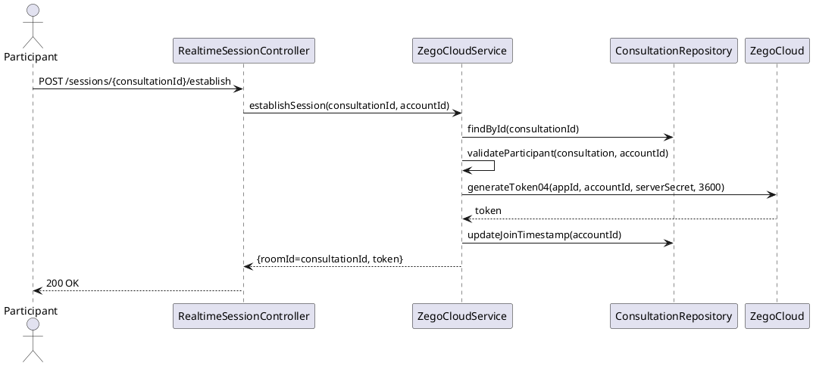

# ENGINEERING DOCUMENTATION STANDARD (EDS) v2.0
# UC-154 Establish Realtime Communication Session

| Field | Value |
|-------|-------|
| **Document ID** | `CB-CON-IMP-004` |
| **Version** | `1.0` |
| **Date** | `2026-06-26` |
| **Status** | `Draft` |
| **Author** | `AI Agent` |
| **Based on EDS** | `v2.0` |

---

## CHANGELOG

| Ngày | Người thực hiện | Nội dung thay đổi |
|------|-----------------|-------------------|
| 2026-06-26 | AI Agent | Khởi tạo TDS cho UC-154 |

---

## MỤC LỤC

1. [Tổng quan Module](#1-tổng-quan-module)
2. [Ma trận Truy vết](#2-ma-trận-truy-vết-traceability-matrix)
3. [Architecture Decision Records (ADR)](#3-architecture-decision-records-adr)
4. [Non-Functional Requirements & SLA](#4-non-functional-requirements--sla)
5. [Static Modeling](#5-static-modeling)
6. [Dynamic Modeling](#6-dynamic-modeling)
7. [Domain Event Catalog](#7-domain-event-catalog)
8. [Interface Specification](#8-interface-specification)
9. [API Specification](#9-api-specification)
10. [Bảng mã lỗi](#10-bảng-mã-lỗi)
11. [Quy trình Triển khai](#11-quy-trình-triển-khai-step-by-step)
12. [Rollback & Incident Runbook](#12-rollback--incident-runbook)
13. [Kịch bản Kiểm thử Chi tiết](#13-kịch-bản-kiểm-thử-chi-tiết)
14. [Phương pháp Xác minh](#14-phương-pháp-xác-minh)
15. [Mẫu thử thực tế](#15-mẫu-thử-thực-tế-api-verification-samples)
16. [Bảng tổng hợp phân quyền](#16-bảng-tổng-hợp-phân-quyền-authorization-matrix)
17. [AI Prompt Constraints](#17-ai-prompt-constraints-case-20)

---

## 1. Tổng quan Module

| Field | Value |
|-------|-------|
| **Module Name** | `EstablishRealtimeCommunicationSession` |
| **Bounded Context** | `consultation` |
| **Data Classification** | `Confidential` |
| **Upstream Dependencies** | `consultations (CONFIRMED), ZegoCloud SDK` |
| **Downstream Consumers** | `audit, zego_sessions` |

**Mô tả:** Tạo phòng (room) và token ZegoCloud cho phiên tư vấn đã được xác nhận. Duy trì trạng thái chat/voice/video. Endpoint được gọi khi UC-77 (JoinConsultationSession) được trigger. Chức năng này là supporting service cho session lifecycle.

---

## 2. Ma trận Truy vết (Traceability Matrix)

| Requirement ID | Loại | Mô tả | Thành phần Code | Compliance Target | ADR liên quan |
|----------------|------|-------|-----------------|-------------------|---------------|
| UC-154 | Use Case | Thiết lập phiên giao tiếp realtime qua ZegoCloud | `RealtimeSessionController`, `ZegoCloudService` | BR-RBAC | ADR-ZEGO-001 |
| BR-TOKEN-SERVER | Business Rule | Token generate server-side, không lưu DB | `ZegoCloudService` | BR-SECURITY | ADR-ZEGO-001 |
| BR-ROOM-ID | Business Rule | roomId = consultation UUID | `ZegoCloudService` | BR-CONSISTENCY | ADR-ZEGO-001 |
| BR-SESSION-TRACK | Business Rule | Track join/leave timestamps | `ZegoCloudService` | BR-AUDIT | ADR-ZEGO-002 |

---

## 3. Architecture Decision Records (ADR)

### ADR-ZEGO-001 — ZegoCloud room lifecycle management

| Field | Value |
|-------|-------|
| **Status** | `Accepted` |
| **Date** | `2026-06-26` |

#### Quyết định
- `roomId` = consultation UUID (string).
- Room created lazily on first join — no pre-create room API call.
- Token: generate using ZegoCloud Server SDK `generateToken04()` with user ID = accountId (UUID string).
- Token TTL: 3600 seconds (1 hour).
- When consultation ends (COMPLETED/CANCELLED): emit `SessionEnded` event; ZegoCloud room auto-expires.

### ADR-ZEGO-002 — Session state tracking

| Field | Value |
|-------|-------|
| **Status** | `Accepted` |
| **Date** | `2026-06-26` |

#### Quyết định
`zego_sessions` table tracks `mother_joined_at`, `expert_joined_at`, `ended_at`. Consultation transitions:
- First participant joins → `IN_SESSION`.
- `ended_at` set when consultation status → `COMPLETED` or expert calls end-session.
- Missing `expert_joined_at` after 15 min grace period → candidate for NO_SHOW.

---

## 4. Non-Functional Requirements & SLA

### 4.1. Performance & Availability

| Category | Requirement | Target SLA |
|----------|-------------|------------|
| Latency | Token generation (p99) | < 200ms |
| Availability | Uptime (monthly) | 99.9% |
| Token TTL | ZegoCloud token | 3600 seconds (1 hour) |

### 4.2. Security

| Category | Requirement | Target |
|----------|-------------|--------|
| Access control | Consultation participants only | Least privilege (§16) |
| Token storage | NOT persisted in DB | Ephemeral only |
| Secret management | appId, serverSecret from env | Never hardcoded |

---

## 5. Static Modeling

> Class diagram tham chiếu §8 Interface Specification.

### 5.1. Key Components

- `RealtimeSessionController` — API endpoint for session establishment
- `ZegoCloudService` — token generation, session lifecycle management
- `ConsultationRepository` — consultation status and participant verification

---

## 6. Dynamic Modeling

### 6.1. Establish Session Sequence



---

## 7. Domain Event Catalog

### 7.1. Events Published

| Event Name | Trigger | Publisher | Async? |
|------------|---------|-----------|--------|
| SessionEstablished | Realtime session created for consultation | ZegoCloudService | No |
| SessionEnded | Consultation completed/cancelled | ZegoCloudService | No |

### 7.2. Events Consumed

| Event Name | Source | Handler | Action |
|------------|--------|---------|--------|
| PaymentConfirmed | PaymentService | — | Consultation becomes eligible for session |

---

## 8. Interface Specification

```java
public interface IZegoCloudService {
    /**
     * Generates ZegoCloud token for a valid consultation participant.
     * @param consultationId  the consultation UUID (= roomId)
     * @param userId          caller's accountId as string
     * @param userName        display name for UI
     * @return ZegoToken with roomId and token string
     */
    ZegoTokenDto generateToken(String consultationId, String userId, String userName);

    /**
     * Records participant join event to zego_sessions.
     */
    void recordJoin(UUID consultationId, UUID accountId, boolean isMother);

    /**
     * Ends the session — updates zego_sessions.ended_at.
     */
    void endSession(UUID consultationId);
}
```

---

## 9. API Specification

| Method | Path | Auth | Notes |
|--------|------|------|-------|
| `POST` | `/api/v1/consultations/{id}/join` | JWT Bearer | Delegates to ZegoSessionService |
| `POST` | `/api/v1/consultations/{id}/end` | JWT Bearer | Expert or timeout |

**Token structure returned (part of JoinSessionResponse):**
```json
{
  "consultationId": "uuid",
  "roomId": "uuid",
  "zegoToken": "04AAAAAGxxxxxxxx...",
  "tokenExpiresAt": "2026-06-26T11:00:00Z",
  "zegoAppId": 12345678
}
```

---

## 10. Bảng mã lỗi

| Code | HTTP | Trigger |
|------|------|---------|
| `ZEGO-001` | 503 | ZegoCloud SDK call failed |
| `ZEGO-002` | 403 | Caller not a participant |
| `ZEGO-003` | 409 | Session already ended |

---

## 11. Quy trình Triển khai (Step-by-Step)

### 11.1. Prerequisites

- [ ] consultations table tồn tại (V31)
- [ ] ZEGO_APP_ID và ZEGO_SERVER_SECRET env vars đã set
- [ ] ZegoCloud server SDK dependency đã thêm

### 11.2. Pre-Migration Checklist

Không có migration mới — UC-154 dùng consultations table hiện tại.

### 11.3. Implementation Steps

#### Chặng 1 — Implement ZegoTokenService

```java
@Service
public class ZegoTokenService {
    @Value("${zego.app-id}") private long appId;       // from env only
    @Value("${zego.server-secret}") private String secret; // from env only

    public String generateToken(String roomId, String userId) {
        // ZegoCloud SDK token generation
        // Token TTL = 1 hour
        // Token NOT persisted to DB
        return TokenServerAssistant.generateToken04(appId, userId, secret, 3600, "");
    }
}
```

#### Chặng 2 — Implement join logic

```java
public JoinSessionResponse joinSession(UUID consultationId, UUID callerAccountId) {
    Consultation c = consultationRepo.findById(consultationId)
        .orElseThrow(() -> new NotFoundException("ZEGO-004"));
    if (!isParticipant(c, callerAccountId)) throw new ForbiddenException("ZEGO-002");
    if (c.getStatus() == ConsultationStatus.ENDED) throw new ConflictException("ZEGO-003");
    String roomId = consultationId.toString(); // ADR-ZEGO-001: roomId = consultationId
    try {
        String token = zegoTokenService.generateToken(roomId, callerAccountId.toString());
        // First joiner → IN_SESSION
        if (c.getStatus() == ConsultationStatus.CONFIRMED) {
            c.setStatus(ConsultationStatus.IN_SESSION);
            c.setMotherJoinedAt(Instant.now());
            consultationRepo.save(c);
        }
        return new JoinSessionResponse(consultationId, roomId, token, appId,
            Instant.now().plus(1, ChronoUnit.HOURS));
    } catch (Exception e) {
        throw new ServiceUnavailableException("ZEGO-001"); // status NOT changed
    }
}
```

### 11.4. Deployment Checklist

- [ ] ZEGO_APP_ID/ZEGO_SERVER_SECRET env vars set
- [ ] Test join → 200 với zegoToken
- [ ] Verify token NOT in DB
- [ ] Verify roomId == consultationId
- [ ] Test ZegoCloud failure → 503, status unchanged

---

## 12. Rollback & Incident Runbook

### 12.1. Điều kiện kích hoạt Rollback

| Điều kiện | Ngưỡng | Người quyết định |
|-----------|--------|------------------|
| Token persisted to DB | Bất kỳ | Tech Lead + DPO |
| Non-participant can join | Bất kỳ | Tech Lead |
| ZEGO credentials in code | Bất kỳ | Tech Lead |

### 12.2. Rollback Procedure

```bash
# Code-only rollback
kubectl rollout undo deployment/carebridge-api
```

---

## 13. Kịch bản Kiểm thử Chi tiết

```gherkin
Feature: Establish Realtime Communication Session
  Scenario: roomId = consultationId
    When joinSession(CON-001, MOTHER-001)
    Then response.roomId == CON-001.toString()

  Scenario: Token NOT in DB
    When joinSession() thành công
    Then verify zegoToken KHÔNG tồn tại trong bất kỳ DB table nào

  Scenario: mother_joined_at recorded
    When MOTHER-001 join session lần đầu
    Then consultation.mother_joined_at NOT NULL

  Scenario: First joiner → IN_SESSION
    Given consultation.status = CONFIRMED
    When joinSession()
    Then consultation.status = IN_SESSION

  Scenario: ZegoCloud SDK failure → 503
    Given zegoTokenService throws exception
    When joinSession()
    Then response 503 ZEGO-001
    And consultation.status KHÔNG thay đổi

  Scenario: Non-participant → 403
    Given ACC-OTHER không phải participant
    When joinSession(CON-001, ACC-OTHER)
    Then throws ForbiddenException ZEGO-002
```

---

## 14. Phương pháp Xác minh

```sql
-- Verify no token column in consultations
SELECT column_name FROM information_schema.columns
WHERE table_name = 'consultations' AND column_name LIKE '%token%';
-- Expected: 0 rows

-- Verify IN_SESSION status after join
SELECT id, status, mother_joined_at FROM consultations WHERE id = '<uuid>';
```

---

## 15. Mẫu thử thực tế (API Verification Samples)

```bash
curl -X POST https://[host]/api/v1/consultations/CON-UUID/join \
  -H "Authorization: Bearer <PARTICIPANT_JWT>"
# Expected 200:
# { "consultationId": "CON-UUID", "roomId": "CON-UUID",
#   "zegoToken": "04A...", "zegoAppId": 12345678,
#   "tokenExpiresAt": "2026-06-26T11:00:00Z" }
```

---

## 16. Bảng tổng hợp phân quyền (Authorization Matrix)

| Endpoint | `ROLE_MOTHER` | `ROLE_EXPERT` | `ROLE_ADMIN` |
|----------|---------------|---------------|--------------|
| `POST /consultations/{id}/join` | ✅ Participant | ✅ Participant | ✅ |
| `POST /consultations/{id}/end` | ❌ | ✅ Participant | ✅ |

---

## 17. AI Prompt Constraints (CASE 2.0)

### 17.1 Constraint Summary Table

| # | Constraint | Source |
|---|-----------|--------|
| C1 | ZEGO_APP_ID and ZEGO_SERVER_SECRET from environment only — never in code | ADR-ZEGO-001 |
| C2 | roomId = consultationId.toString() — do NOT generate separate room ID | ADR-ZEGO-001 |
| C3 | Token NOT stored in DB — stateless generation | ADR-CON-004 |
| C4 | On join: update consultation.status=IN_SESSION if first joiner | ADR-ZEGO-002 |
| C5 | ZegoCloud failure → HTTP 503 (SES-002); consultation status NOT changed | ADR-ZEGO-001 |

### 17.2 Constraint Injection Block

```
[CONSTRAINT BLOCK — Module: EstablishRealtimeCommunicationSession (CB-CON-IMP-004)]
1. (C1) ZEGO_APP_ID/ZEGO_SERVER_SECRET từ @Value env — KHÔNG hardcode.
2. (C2) roomId = consultationId.toString() — KHÔNG UUID.randomUUID().
3. (C3) zegoToken KHÔNG lưu DB — generate mỗi lần gọi, return trong response.
4. (C4) First joiner: status CONFIRMED → IN_SESSION + set mother_joined_at.
5. (C5) ZegoCloud exception → 503 ZEGO-001; KHÔNG thay đổi consultation status.
```

### 17.3 Constraint Quality Checklist

- [x] Mỗi constraint traceable về ADR
- [x] Constraint block có ≥ 5 constraints

### 17.4 Anti-Pattern Detection

| AP-ID | Anti-Pattern | Hành động |
|-------|-------------|----------|
| AP-AI-001 | Token saved to DB column | Reject — C3, privacy risk |
| AP-AI-003 | roomId = UUID.randomUUID() | Reject — C2, session mismatch |
| AP-AI-005 | Status changed before token generation succeeds | Reject — C5 |

---

## PHỤ LỤC

### A. Glossary

| Thuật ngữ | Định nghĩa |
|-----------|------------|
| ZegoCloud | Video/audio conferencing SDK |
| roomId | ZegoCloud room identifier = consultationId |
| Stateless token | Token generated mỗi lần gọi, không lưu trữ |
| IN_SESSION | Consultation status khi ít nhất 1 participant đã join |

### B. Tài liệu tham chiếu

| Document | Path |
|----------|------|
| ZegoCloud SDK | [link] |
| EDS v2.0 Template | `08_References/Template/PHASE-3_TDS.md` |

---

*EDS v2.1 — Tích hợp CASE 2.0 AI Prompt Constraints (§17).*
