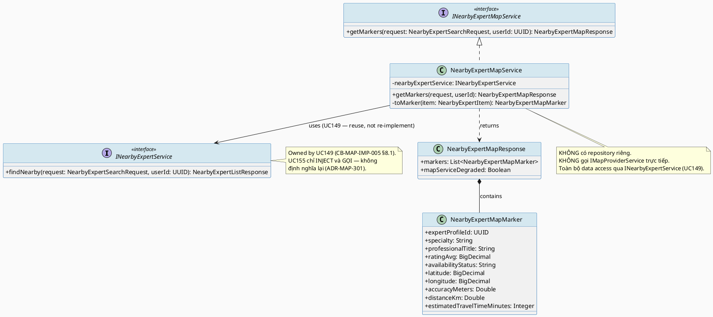
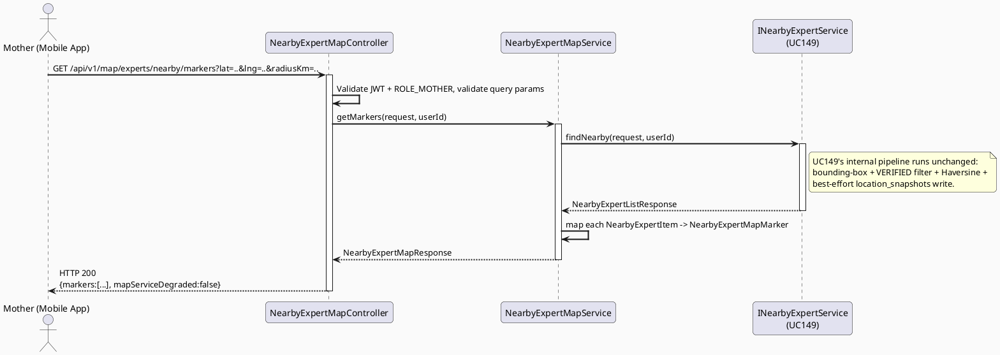
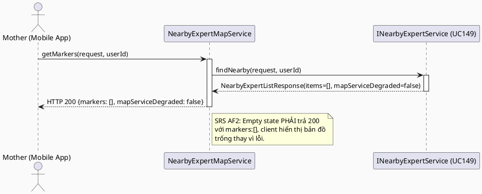
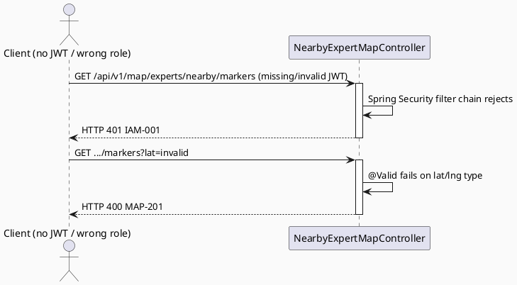

# ENGINEERING DOCUMENTATION STANDARD (EDS) v2.0
# UC155 — View Nearby Experts on Map

| Field | Value |
|-------|-------|
| **Document ID** | `CB-MAP-IMP-007` |
| **Version** | `1.0` |
| **Date** | `2026-07-03` |
| **Status** | `Draft` |
| **Document Owner** | `TV4 - Lâm` |
| **Author** | `AI Agent — Tech Lead` |
| **Reviewed by** | `[ ] Pending` |
| **DPO Sign-off** | `[ ] Pending` *(module hiển thị vị trí Expert dạng marker — location PII của Expert, đọc lại từ `expert_location_shares` giống UC149)* |
| **Approved by** | `[ ] Pending` |
| **Last Review** | `2026-07-03` |
| **Based on EDS** | `v2.0` |

---

## CHANGELOG

| Ngày | Người thực hiện | Nội dung thay đổi |
|------|-----------------|-------------------|
| 2026-07-03 | AI Agent — Tech Lead | Tạo tài liệu lần đầu — TDS cho UC155 View Nearby Experts on Map |

---

## MỤC LỤC

1. [Tổng quan Module](#1-tổng-quan-module)
2. [Ma trận Truy vết (Traceability Matrix)](#2-ma-trận-truy-vết-traceability-matrix)
3. [Architecture Decision Records (ADR)](#3-architecture-decision-records-adr)
4. [Non-Functional Requirements & SLA](#4-non-functional-requirements--sla)
5. [Static Modeling (Mô hình Tĩnh)](#5-static-modeling-mô-hình-tĩnh)
6. [Dynamic Modeling (Mô hình Động)](#6-dynamic-modeling-mô-hình-động)
7. [Domain Event Catalog](#7-domain-event-catalog)
8. [Interface Specification (Đặc tả Giao diện)](#8-interface-specification-đặc-tả-giao-diện)
9. [API Specification](#9-api-specification)
10. [Bảng mã lỗi (Error Codes)](#10-bảng-mã-lỗi-error-codes)
11. [Quy trình Triển khai (Step-by-Step)](#11-quy-trình-triển-khai-step-by-step)
12. [Rollback & Incident Runbook](#12-rollback--incident-runbook)
13. [Kịch bản Kiểm thử Chi tiết](#13-kịch-bản-kiểm-thử-chi-tiết)
14. [Phương pháp Xác minh](#14-phương-pháp-xác-minh)
15. [Mẫu thử thực tế (API Verification Samples)](#15-mẫu-thử-thực-tế-api-verification-samples)
16. [Bảng tổng hợp phân quyền (Authorization Matrix)](#16-bảng-tổng-hợp-phân-quyền-authorization-matrix)
17. [AI Prompt Constraints (CASE 2.0)](#17-ai-prompt-constraints-case-20)
18. [Open Items / Research Gate](#18-open-items--research-gate)

---

## 1. Tổng quan Module

> **RG-3 (Overlap resolution với UC149 — bắt buộc đọc trước khi implement):** UC149 (`CB-MAP-IMP-005`, Find Nearby Available Experts) đã formal hoá toàn bộ chuỗi tìm kiếm expert gần: bounding-box filter trên `expert_location_shares` JOIN `expert_profiles` (`verification_status='VERIFIED'` AND `expires_at > now()`), tính khoảng cách qua `IMapProviderService.calculateHaversineDistance()` (UC129), và trả `NearbyExpertListResponse` (`items: List<NearbyExpertItem>`, `mapServiceDegraded`). UC155 **KHÔNG tạo lại pipeline tìm kiếm này**. UC155 là **map/marker presentation layer của CÙNG một tập dữ liệu** mà UC149 đã trả về — sự khác biệt duy nhất là UC155 hiển thị kết quả dưới dạng marker/approximate-area trên bản đồ (TrackAsia Map Service ở client), trong khi UC149 hiển thị dưới dạng danh sách (list view). Quyết định kiến trúc (§3 ADR-MAP-301) là: UC155 **tái sử dụng trực tiếp `INearbyExpertService.findNearby()`** của UC149 làm data source; phần "mới" duy nhất của UC155 là (a) một DTO chiếu (projection) tối giản hoá cho marker rendering (`NearbyExpertMapMarker`, bớt field không cần cho map so với `NearbyExpertItem` list-view), và (b) cách client (Mobile App) vẽ marker/circle theo `accuracyMeters` lên TrackAsia SDK. Đây **không phải một use case trùng lặp** — nó là một "view" khác của cùng một domain query, giống cách UC63 (list) và (giả định) một "view on map" tương lai của care facility có thể chia sẻ cùng 1 service.
>
> UC155 SRS Description: "Displays opted-in experts as markers or approximate areas on the map." — "opted-in" ở đây tham chiếu chính xác tới cùng tập điều kiện mà UC149 đã lọc (Expert phải `VERIFIED` + có `expert_location_shares` active + có `consent_reference` hợp lệ, theo UC147 ADR-LOC-101). Không có tập điều kiện lọc mới nào phát sinh riêng cho UC155.

| Field | Value |
|-------|-------|
| **Module Name** | `View Nearby Experts on Map` |
| **Bounded Context** | `map` (mở rộng bounded context `map` đã có từ UC63/UC129/UC149/UC153 — theo phân công TV4-Lâm "Location/map/nearby care domain + expert location visibility", `function-spec-task-allocation.md` dòng 24, 845) |
| **Data Classification** | `Sensitive-PII` *(vị trí hiện tại của Mother = location PII; vị trí Expert từ `expert_location_shares` = location PII của Expert — giống UC149)* |
| **Compliance Scope** | `PDPA / Luật 91/2025` |
| **Upstream Dependencies** | `IAM (JWT ROLE_MOTHER)`, **`UC149 Find Nearby Available Experts`** (`CB-MAP-IMP-005` — `INearbyExpertService.findNearby()` là data source DUY NHẤT, KHÔNG viết lại query), `IMapProviderService` (UC129, gián tiếp qua UC149), TrackAsia Map Service (client-side SDK để vẽ marker — KHÔNG phải backend dependency mới) |
| **Downstream Consumers** | Mobile `emergencyMap`/`nearbyExpert` feature (marker rendering UI); không có downstream backend nào khác — UC155 là leaf node presentation |

---

## 2. Ma trận Truy vết (Traceability Matrix)

| Requirement ID | Loại (BR/ADR/US) | Mô tả yêu cầu | Thành phần Code | Compliance Target | ADR liên quan |
|----------------|------------------|---------------|-----------------|-------------------|---------------|
| SRS-3.3.7.3 (UC-155) | User Story | Hiển thị expert đã opt-in dưới dạng marker/approximate area trên bản đồ | `NearbyExpertMapController.GET /api/v1/map/experts/nearby/markers` | — | ADR-MAP-301 |
| SRS-3.3.7.1 (UC-149, upstream) | User Story | Nguồn dữ liệu "expert gần, đã verify, đã opt-in" — UC155 PHẢI dùng chung filter, KHÔNG định nghĩa lại | `NearbyExpertMapService` gọi `INearbyExpertService.findNearby()` (UC149) | — | ADR-MAP-301 |
| BR-RBAC | Business Rule | Chỉ ROLE_MOTHER (đã auth) được gọi endpoint marker map | `NearbyExpertMapController` | BR-RBAC | ADR-MAP-304 |
| BR-SAFETY | Business Rule | Không delay/chặn kết quả map bởi AI hoặc external service — kế thừa nguyên tắc UC63/UC129/UC149 | `NearbyExpertMapService` | BR-SAFETY | ADR-MAP-303 (kế thừa ADR-MAP-203 của UC149) |
| E1/E2/E3 (SRS Exceptions) | Exception | Access denied / invalid params / external service failure xử lý an toàn | `NearbyExpertMapController`, `NearbyExpertMapService` | BR-SAFETY | ADR-MAP-303 |
| ADR-MAP-301 | Decision | UC155 KHÔNG viết lại bounding-box/Haversine/verification query — **tái sử dụng trực tiếp** `INearbyExpertService.findNearby()` (UC149, `CB-MAP-IMP-005` §8.1) làm data source, chỉ chiếu (project) sang DTO marker tối giản | `NearbyExpertMapService` | — | — |
| ADR-MAP-302 | Decision | Marker payload trả `latitude`/`longitude`/`accuracyMeters` pass-through — client (TrackAsia SDK) tự quyết định vẽ marker chính xác hay circle xấp xỉ dựa trên `accuracyMeters`, kế thừa nguyên tắc "không tự fuzz thêm ở tầng đọc" của UC149 ADR-MAP-202 | `NearbyExpertMapMarker` DTO | PDPA | ADR-MAP-202 (kế thừa UC149) |
| ADR-MAP-303 | Decision | Không có ETA/route riêng cho marker view — `estimatedTravelTimeMinutes`/`mapServiceDegraded` field passthrough nguyên trạng từ `NearbyExpertListResponse` (UC149), KHÔNG gọi thêm `IMapProviderService.calculateRoute()` lần 2 | `NearbyExpertMapService` | BR-SAFETY | ADR-MAP-203 (kế thừa UC149) |
| ADR-MAP-304 | Decision | Endpoint yêu cầu JWT + ROLE_MOTHER; `userId` từ SecurityContext; KHÔNG ghi `location_snapshots` riêng (UC149 đã ghi 1 lần cho cùng query khi `findNearby()` được gọi nội bộ — tránh double-write cho cùng 1 hành động tìm kiếm hiển thị dưới 2 view) | `NearbyExpertMapController` | BR-RBAC | ADR-MAP-204 (kế thừa UC149, có điều chỉnh — xem §18 RG-8) |

> **Open (RG-2 — kế thừa từ UC149):** Toàn bộ threshold số (radiusKm default, maxResults default) đến từ UC149 `CB-MAP-IMP-005` §8.1 — UC155 KHÔNG bịa giá trị mới, dùng lại nguyên `NearbyExpertSearchRequest` của UC149 làm input contract.

---

## 3. Architecture Decision Records (ADR)

### ADR-MAP-301 — Data Source: tái sử dụng `INearbyExpertService.findNearby()` của UC149, KHÔNG viết lại query

| Field | Value |
|-------|-------|
| **Status** | `Proposed` |
| **Deciders** | `AI Agent — Tech Lead` (chờ TV4-Lâm confirm) |
| **Date** | `2026-07-03` |
| **Supersedes** | `—` |

#### Bối cảnh (Context)
UC149 (`CB-MAP-IMP-005`) đã formal hoá toàn bộ pipeline: `IExpertLocationShareRepository.findActiveWithinBoundingBox()` (bounding-box + JOIN `verification_status='VERIFIED'` + `expires_at > now()`) → `IMapProviderService.calculateHaversineDistance()` (post-filter theo `radiusKm`) → optional `calculateRoute()` cho ETA. UC155 SRS Description ("Displays opted-in experts as markers... on the map") mô tả **chính xác cùng tập dữ liệu** này, chỉ khác cách trình bày (marker thay vì list row). Không có business rule mới nào trong SRS §3.3.7.3 yêu cầu tập lọc khác (không có "chỉ hiện expert online", không có "bán kính khác mặc định UC149").

#### Các phương án đã xem xét (Options Considered)

| Phương án | Mô tả | Ưu điểm | Nhược điểm |
|-----------|-------|----------|------------|
| A | `NearbyExpertMapController` mới gọi thẳng `INearbyExpertService.findNearby()` (UC149, inject qua Spring DI) rồi map response sang `NearbyExpertMapMarker` DTO tối giản — KHÔNG có repository/service tính khoảng cách riêng | Zero duplication — đúng nguyên tắc "single source of truth" cho expert-nearby query; consistency tuyệt đối giữa list view (UC149) và map view (UC155) — 1 expert bị lọc ở UC149 thì cũng bị lọc ở UC155 tự động | Response marker phụ thuộc hoàn toàn vào contract UC149; nếu UC149 đổi field, UC155 phải đổi theo (chấp nhận được vì đây đúng là quan hệ dependency mong muốn) |
| B | Tạo lại 1 pipeline bounding-box/Haversine riêng cho map view, tối ưu hoá khác (ví dụ cluster marker ở backend) | Có thể tối ưu riêng cho nhu cầu hiển thị map (clustering, viewport-based query) | Trùng lặp 100% logic filter với UC149 — vi phạm chính yêu cầu RG-3 của batch này ("không được silently duplicate UC149's design"); rủi ro 2 filter lệch nhau theo thời gian (data leak nếu UC155 quên filter `expires_at`) |

#### Quyết định (Decision)
Chọn **Phương án A**. `NearbyExpertMapService.getMarkers(NearbyExpertSearchRequest request, UUID userId)` gọi trực tiếp `INearbyExpertService.findNearby(request, userId)` (UC149), sau đó map `List<NearbyExpertItem>` sang `List<NearbyExpertMapMarker>` (bớt field không cần cho marker: `ratingAvg`, `professionalTitle` giữ lại cho popup info, bỏ field trùng lặp). KHÔNG tạo `IExpertLocationShareRepository` mới, KHÔNG gọi lại `IMapProviderService.calculateHaversineDistance()` riêng.

**Client-side rendering (Mobile, ngoài phạm vi backend TDS này):** Với mỗi marker, nếu `accuracyMeters > threshold` (đề xuất kỹ thuật client-side, Open — không thuộc backend contract), vẽ circle xấp xỉ (TrackAsia SDK `Circle` overlay) thay vì `Marker` chính xác điểm — client tự quyết định, backend chỉ cung cấp dữ liệu thô đã có.

#### Hệ quả (Consequences)

**Tích cực:**
- Không có 2 nguồn sự thật khác nhau cho "expert nào được coi là nearby" giữa UC149 và UC155 — sửa 1 nơi (UC149), cả 2 view đều nhất quán.
- Implementation UC155 cực nhẹ: 1 Controller + 1 Service mỏng (thin service, delegate hoàn toàn) + 1 DTO mapper.

**Tiêu cực / Trade-offs:**
- UC155 phụ thuộc cứng vào UC149 đã implement/deploy trước — không thể tồn tại độc lập (chấp nhận được, đúng bản chất quan hệ).

**Compliance Impact:** Không phát sinh rủi ro PII mới — cùng dữ liệu, cùng filter, chỉ khác hình thức trình bày.

---

### ADR-MAP-302 — Marker Precision: pass-through `accuracyMeters`, không tự fuzz thêm (kế thừa UC149 ADR-MAP-202)

| Field | Value |
|-------|-------|
| **Status** | `Proposed` |
| **Deciders** | `AI Agent — Tech Lead` |
| **Date** | `2026-07-03` |
| **Supersedes** | `—` |

#### Bối cảnh (Context)
UC149 ADR-MAP-202 đã quyết định (Proposed, pending UC147/148 cross-check — hiện UC147/148 đã tồn tại và xác nhận write-path KHÔNG tự fuzz toạ độ, chỉ lưu nguyên GPS client gửi lên kèm `accuracy_meters` do thiết bị báo cáo). SRS UC155 nói rõ "markers **or approximate areas**" — ngụ ý UI phải có khả năng hiển thị vùng xấp xỉ, không phải luôn luôn marker điểm chính xác.

#### Quyết định (Decision)
Backend trả nguyên `accuracyMeters` (pass-through từ `NearbyExpertItem.accuracyMeters`, vốn đã pass-through từ `expert_location_shares.accuracy_meters` theo UC149). Quyết định "marker điểm" hay "circle xấp xỉ" là **client-side rendering logic**, KHÔNG phải backend business rule — backend không làm tròn/fuzz toạ độ theo bất kỳ ngưỡng nào. Điều này nhất quán với UC149 (đã Proposed) và tránh double-fuzzing.

#### Hệ quả (Consequences)

**Tích cực:** Nhất quán dữ liệu 100% giữa UC149 (list) và UC155 (map) — cùng 1 giá trị `accuracyMeters` cho cùng 1 expert dù xem qua view nào.

**Tiêu cực / Trade-offs:** Nếu UC149's ADR-MAP-202 sau này bị Supersede (ví dụ chuyển sang fuzz ở write-path hoặc read-path), UC155 tự động kế thừa thay đổi đó (không cần sửa riêng) — đây là hệ quả **mong muốn** của việc tái sử dụng 100% data source.

**Compliance Impact:** Kế thừa nguyên trạng risk profile của UC149 ADR-MAP-202 — không có risk mới.

---

### ADR-MAP-303 — Không gọi lại `IMapProviderService.calculateRoute()` lần 2 cho marker view

| Field | Value |
|-------|-------|
| **Status** | `Proposed` |
| **Deciders** | `AI Agent — Tech Lead` |
| **Date** | `2026-07-03` |
| **Supersedes** | `—` |

#### Bối cảnh (Context)
UC149 đã gọi `IMapProviderService.calculateRoute()` cho top-N kết quả để lấy `estimatedTravelTimeMinutes` (ADR-MAP-203 của UC149). Nếu UC155 gọi lại `findNearby()` của UC149 (ADR-MAP-301), nó tự động nhận `estimatedTravelTimeMinutes`/`mapServiceDegraded` đã tính sẵn — không cần tính toán route thêm cho việc chỉ vẽ marker (marker không cần hiển thị ETA chi tiết, chỉ cần vị trí).

#### Quyết định (Decision)
`NearbyExpertMapService` **không** tự gọi `IMapProviderService.calculateRoute()` — chỉ nhận kết quả đã có sẵn từ `findNearby()` (bao gồm `estimatedTravelTimeMinutes` nullable nếu degraded) và pass-through vào `NearbyExpertMapMarker` để client hiển thị trong popup khi bấm vào marker (tuỳ chọn UI, không bắt buộc). `mapServiceDegraded` ở cấp response cũng pass-through nguyên trạng.

#### Hệ quả (Consequences)

**Tích cực:** Không tăng thêm lượt gọi `IMapProviderService`/TrackAsia so với UC149 — không tăng chi phí/latency so với việc Mother chỉ xem list.

**Tiêu cực / Trade-offs:** Không có thêm ngoài những gì UC149 đã ghi nhận.

**Compliance Impact:** Không có.

---

### ADR-MAP-304 — Authorization & Audit: ROLE_MOTHER only, không double-write `location_snapshots`

| Field | Value |
|-------|-------|
| **Status** | `Proposed` |
| **Deciders** | `AI Agent — Tech Lead` |
| **Date** | `2026-07-03` |
| **Supersedes** | `—` |

#### Bối cảnh (Context)
UC149 ADR-MAP-204 đã ghi `location_snapshots` (context_type=`NEARBY_EXPERT_SEARCH`) best-effort mỗi lần `findNearby()` được gọi. Vì UC155 gọi lại chính method này (ADR-MAP-301), nếu không kiểm soát, mỗi lần Mother mở map view sẽ tạo thêm 1 `location_snapshots` row trùng lặp ý nghĩa với UC149 (cùng 1 hành động tìm kiếm được audit 2 lần dưới 2 context_type khác nhau dù cùng bán kính/toạ độ).

#### Các phương án đã xem xét (Options Considered)

| Phương án | Mô tả | Ưu điểm | Nhược điểm |
|-----------|-------|----------|------------|
| A | Giữ nguyên hành vi ghi `location_snapshots` của `findNearby()` (context_type=`NEARBY_EXPERT_SEARCH`, không đổi) — UC155 không thêm context_type mới, chấp nhận rằng mở map = 1 lượt search snapshot giống list view | Đơn giản nhất, không sửa UC149; đúng bản chất "map view = search + trực quan hoá" | Không phân biệt được (qua audit log) Mother xem qua list hay qua map — chấp nhận được vì mục đích snapshot là audit "khi nào Mother tra cứu vị trí", không phải phân tích UI channel |
| B | Thêm context_type mới `NEARBY_EXPERT_MAP_VIEW` để phân biệt kênh | Audit trail chi tiết hơn theo kênh UI | Yêu cầu sửa `location_snapshots.context_type` domain values (không có CHECK constraint cứng trong schema — cột là `varchar(50)` tự do) VÀ sửa `INearbyExpertService.findNearby()` để nhận thêm tham số context — vi phạm ADR-MAP-301 "không viết lại/không sửa UC149 signature" |

#### Quyết định (Decision)
Chọn **Phương án A** — UC155 không thêm audit context mới, kế thừa nguyên vẹn hành vi ghi `location_snapshots` từ bên trong `findNearby()` (UC149). Điều này cũng đồng nghĩa: nếu Mother gọi UC155 marker endpoint N lần trong phiên, sẽ có N bản ghi `location_snapshots` (mirror hành vi hiện có của UC149 — không phải hành vi mới do UC155 gây ra).

#### Hệ quả (Consequences)

**Tích cực:** Không sửa đổi UC149 (dependency ổn định), không thêm entropy vào `context_type` domain.

**Tiêu cực / Trade-offs:** Audit log không phân biệt map vs list channel — ghi nhận **Open** (§18 RG-8), có thể bổ sung sau nếu Product Owner cần phân tích UX theo kênh.

**Compliance Impact:** Không tăng rủi ro PII so với UC149 hiện có.

---

## 4. Non-Functional Requirements & SLA

### 4.1. Performance & Availability

| Category | Requirement | Target SLA | Measurement Method | Compliance Basis |
|----------|-------------|------------|---------------------|------------------|
| Latency | API response (p99) — bằng đúng latency của `findNearby()` (UC149) cộng overhead mapping DTO không đáng kể | `< 500ms` (DB-only path) / `< 1500ms` (cần ETA) *(kế thừa nguyên văn UC149 §4.1, KHÔNG có threshold riêng cho UC155)* | k6 load test | `CB-MAP-IMP-005` §4.1 |
| Availability | Uptime (monthly) | `99.9%` *(kế thừa baseline chung dự án)* | Uptime monitor | — |
| Throughput | Concurrent requests | `50 req/s` *(kế thừa UC63/UC129/UC149 §4.1)* | Load test | — |

### 4.2. Data Integrity & Retention

| Category | Requirement | Target | Verification Method | Compliance Basis |
|----------|-------------|--------|---------------------|------------------|
| Consistency | Marker list PHẢI khớp 100% với `NearbyExpertItem` list từ UC149 cho cùng request params (cùng lat/lng/radiusKm/specialty/maxResults) | 100% — không có expert nào xuất hiện ở UC155 mà không xuất hiện ở UC149 hoặc ngược lại | Integration test so sánh 2 endpoint | ADR-MAP-301 |
| Filtering correctness | Kế thừa nguyên vẹn từ UC149: chỉ `VERIFIED` + `expires_at > now()` | 100% | Integration test (mirror UC149's) | ADR-MAP-301 |

### 4.3. Security

| Category | Requirement | Target | Verification Method | Compliance Basis |
|----------|-------------|--------|---------------------|------------------|
| Encryption in transit | Endpoint | TLS 1.3+ | SSL Labs scan | PDPA |
| Access control | ROLE_MOTHER only | Least privilege | Auth Matrix (§16) | BR-RBAC |
| No PII leak in logs | Toạ độ Expert KHÔNG log ở mức INFO | Log audit | PDPA |

### 4.4. Scalability & Capacity Planning

> Tải phụ thuộc hoàn toàn vào tần suất Mother mở map view — không có tải độc lập ngoài những gì UC149 đã chịu. Không cần cơ chế scale riêng.

---

## 5. Static Modeling (Mô hình Tĩnh)

### 5.1. Class Diagram (PlantUML)



> **Lưu ý:** `NearbyExpertMapMarker` bổ sung `latitude`/`longitude` (cần thiết để vẽ marker trên bản đồ — `NearbyExpertItem` của UC149 KHÔNG có 2 field này vì list view không cần render map). Đây là field MỚI duy nhất do UC155 thêm — lấy trực tiếp từ `ExpertLocationShare.latitude/longitude` mà UC149's internal query đã đọc nhưng không expose ra `NearbyExpertItem`. Vì `INearbyExpertService.findNearby()` (UC149 §8.1) hiện KHÔNG trả `latitude`/`longitude` trong `NearbyExpertItem`, UC155 cần một trong hai cách tiếp cận — xem §18 RG-7 Open Item.

### 5.2. Data Structure (Flyway SQL Migration)

> **Không cần migration mới.** UC155 không sở hữu bảng nào — đọc hoàn toàn qua `INearbyExpertService.findNearby()` (UC149), vốn đã đọc `expert_location_shares`/`expert_profiles` có sẵn trong `V1__init_schema.sql` (dòng 786-840). Đã kiểm tra `05_Development/CareBridgeAPI/src/main/resources/db/migration/` — không có bảng `map_markers`/`expert_map_cache` nào cần tạo.

---

## 6. Dynamic Modeling (Mô hình Động)

### 6.1. Sequence Diagram — Happy Path (PlantUML)



### 6.2. Sequence Diagram — Empty State (AF2) (PlantUML)



### 6.3. Sequence Diagram — Error Path (Unauthorized / Invalid Params) (PlantUML)



> Không có state machine — read-only presentation layer, không có entity trạng thái riêng.

---

## 7. Domain Event Catalog

> UC155 là read-only query/presentation layer — **không phát ra domain event nào**. Side-effect (ghi `location_snapshots`) xảy ra bên trong `findNearby()` của UC149, KHÔNG phải trực tiếp trong UC155.

### 7.1. Events Published (Phát ra)

_Không có._

### 7.2. Events Consumed (Tiêu thụ)

_Không có._

---

## 8. Interface Specification (Đặc tả Giao diện)

### 8.1. Service Interface

```java
// NearbyExpertMapMarker.java — Output DTO (MỚI)
// @version 1.0
public class NearbyExpertMapMarker {
    private UUID expertProfileId;
    private String specialty;
    private String professionalTitle;
    private BigDecimal ratingAvg;
    private String availabilityStatus;   // pass-through — xem ADR-MAP-302
    private BigDecimal latitude;         // MỚI so với UC149's NearbyExpertItem — xem §18 RG-7
    private BigDecimal longitude;        // MỚI so với UC149's NearbyExpertItem — xem §18 RG-7
    private Double accuracyMeters;       // pass-through từ NearbyExpertItem (UC149 ADR-MAP-202)
    private Double distanceKm;           // pass-through từ NearbyExpertItem
    private Integer estimatedTravelTimeMinutes; // pass-through, nullable nếu degraded
    // getters / setters
}

// NearbyExpertMapResponse.java — Output DTO (MỚI)
// @version 1.0
public class NearbyExpertMapResponse {
    private List<NearbyExpertMapMarker> markers;
    private Boolean mapServiceDegraded;  // pass-through từ NearbyExpertListResponse.mapServiceDegraded
    // getters / setters
}

// INearbyExpertMapService.java — Service Contract (MỚI)
// @version 1.0
public interface INearbyExpertMapService {
    /**
     * Chiếu (project) kết quả của INearbyExpertService.findNearby() (UC149) sang
     * DTO marker tối giản cho map rendering. KHÔNG tự truy vấn DB, KHÔNG tự tính Haversine
     * (ADR-MAP-301) — mọi filter/tính toán uỷ quyền hoàn toàn cho UC149.
     * @throws AccessDeniedException (MAP-204) nếu không có ROLE_MOTHER (kế thừa từ UC149 caller-level check)
     */
    NearbyExpertMapResponse getMarkers(NearbyExpertSearchRequest request, UUID userId);
}

// NearbyExpertSearchRequest — TÁI SỬ DỤNG NGUYÊN VẸN từ UC149 (CB-MAP-IMP-005 §8.1)
// KHÔNG tạo request DTO mới — import trực tiếp com.carebridge.backend.map.dto.request.NearbyExpertSearchRequest
```

### 8.2. Repository Interface

> **Không có repository mới.** UC155 KHÔNG chứa bất kỳ `@Repository`/`JpaRepository` interface nào — mọi truy cập dữ liệu đi qua `INearbyExpertService` (UC149 §8.2 `IExpertLocationShareRepository`, không expose trực tiếp cho UC155).

### 8.3. External Service Interface (tái sử dụng UC149/UC129, KHÔNG tạo mới)

```java
// INearbyExpertService — formal owner: UC149 (CB-MAP-IMP-005 §8.1)
// UC155 CHỈ inject và gọi findNearby(), KHÔNG định nghĩa lại interface này.
// IMapProviderService — formal owner: UC129 (CB-MAP-IMP-000 §8.1) — UC155 KHÔNG inject trực tiếp.
```

---

## 9. API Specification

### 9.1. Endpoints Table

| Method | Path | Auth Level | Required Roles | Rate Limit | Idempotent? |
|--------|------|------------|----------------|------------|-------------|
| `GET` | `/api/v1/map/experts/nearby/markers` | JWT Bearer | `ROLE_MOTHER` | 30/min *(kế thừa đề xuất UC149)* | Yes |

### 9.2. Request / Response Schemas

#### `GET /api/v1/map/experts/nearby/markers?latitude=10.7769&longitude=106.7009&radiusKm=5&specialty=Pediatrics&maxResults=20`

**Response — 200 OK (Happy Path):**
```json
{
  "markers": [
    {
      "expertProfileId": "uuid-v4",
      "specialty": "Pediatrics",
      "professionalTitle": "BS. Nguyễn Văn A",
      "ratingAvg": 4.8,
      "availabilityStatus": "AVAILABLE",
      "latitude": 10.7769,
      "longitude": 106.7009,
      "accuracyMeters": 50.0,
      "distanceKm": 1.2,
      "estimatedTravelTimeMinutes": 6
    }
  ],
  "mapServiceDegraded": false
}
```

**Response — 200 OK (Empty state — AF2):**
```json
{
  "markers": [],
  "mapServiceDegraded": false
}
```

**Response — 400 Bad Request:**
```json
{
  "error": {
    "code": "MAP-201",
    "message": "latitude and longitude are required and must be valid coordinates",
    "details": [{ "field": "latitude", "message": "must be between -90 and 90" }]
  }
}
```

**Response — 401 Unauthorized:**
```json
{ "error": { "code": "IAM-001", "message": "Authentication required" } }
```

**Response — 403 Forbidden:**
```json
{ "error": { "code": "MAP-204", "message": "Insufficient permissions" } }
```

---

## 10. Bảng mã lỗi (Error Codes)

> UC155 tái sử dụng nguyên vẹn error codes của UC149 — KHÔNG định nghĩa mã lỗi mới, vì mọi lỗi (validation, auth, service degradation) đều bắt nguồn từ cùng pipeline (`findNearby()`).

| Code | HTTP Status | Message (EN) | Message (VI) | Trigger Condition |
|------|-------------|--------------|--------------|-------------------|
| `MAP-201` | 400 | Validation failed | Dữ liệu không hợp lệ | latitude/longitude thiếu hoặc ngoài phạm vi hợp lệ (kế thừa UC149) |
| `MAP-204` | 403 | Insufficient permissions | Không đủ quyền | User không có ROLE_MOTHER (kế thừa UC149) |
| `MAP-205` | 503 | Map expert service unavailable | Dịch vụ tìm expert không khả dụng | DB (`expert_location_shares`/`expert_profiles`) không truy vấn được (kế thừa UC149) |

---

## 11. Quy trình Triển khai (Step-by-Step)

### 11.1. Prerequisites

- [ ] ADR-MAP-301 → 304 được Accepted (hiện tại `Proposed` — cần TV4-Lâm + Tech Lead review)
- [ ] **UC149 (`INearbyExpertService`) đã implement và deploy** — UC155 là pure consumer, không thể implement độc lập trước UC149
- [ ] Xác nhận §18 RG-7 (bổ sung `latitude`/`longitude` vào `NearbyExpertItem` hoặc dùng cách khác) trước khi code

### 11.2. Pre-Migration Checklist

- [ ] Không cần migration mới (§5.2)

### 11.3. Implementation Steps

#### Chặng 1 — Mở rộng package `map` đã có (mirror UC149 convention, KHÔNG tạo package mới)

```
com.carebridge.backend.map/
├── controller/NearbyExpertMapController.java        (MỚI)
├── dto/response/NearbyExpertMapResponse.java         (MỚI)
├── dto/response/NearbyExpertMapMarker.java           (MỚI)
├── service/INearbyExpertMapService.java              (MỚI)
├── service/impl/NearbyExpertMapService.java          (MỚI — inject INearbyExpertService của UC149)
└── mapper/NearbyExpertMapMarkerMapper.java           (MỚI)
```

> **Lưu ý quan trọng khi implement song song với UC149:** Nếu UC149 chưa deploy, UC155 KHÔNG thể compile (dependency cứng vào `INearbyExpertService`). Implement UC155 SAU UC149, không song song.

#### Chặng 2 — Implement `NearbyExpertMapService` — chỉ gọi UC149, không tự query DB

```java
// NearbyExpertMapService inject INearbyExpertService (bean đã có từ UC149)
// KHÔNG import IExpertLocationShareRepository trực tiếp (ADR-MAP-301)
```

#### Chặng 3 — Implement Controller + Security config

```java
// @PreAuthorize("hasRole('MOTHER')") — mirror NearbyExpertController (UC149) pattern
```

#### Chặng 4 — Mobile: mở rộng `emergencyMap`/`nearbyExpert` feature với marker rendering

```
lib/features/nearbyExpert/
├── models/nearby_expert_map_marker_model.dart  (MỚI)
├── repositories/nearby_expert_map_repository.dart (MỚI)
├── services/nearby_expert_map_api_service.dart (MỚI)
├── screens/nearby_expert_map_screen.dart        (MỚI — TrackAsia SDK marker/circle rendering)
└── widgets/expert_marker_popup.dart             (MỚI)
```

### 11.4. Deployment Checklist

- [ ] Endpoint trả 200 với dữ liệu seed giống hệt test đã dùng cho UC149 (đảm bảo consistency)
- [ ] Xác nhận marker list khớp 1:1 với UC149's item list cho cùng request params
- [ ] p99 latency đạt target §4.1 (kế thừa UC149, nếu đã confirm)

---

## 12. Rollback & Incident Runbook

### 12.1. Điều kiện kích hoạt Rollback

| Điều kiện | Ngưỡng | Người quyết định |
|-----------|--------|------------------|
| Error rate tăng đột biến | > 5% trong 5 phút | On-call Engineer |
| Marker list KHÔNG khớp với UC149's list (data inconsistency giữa 2 view) | Bất kỳ case nào | Tech Lead |

### 12.2. Rollback Procedure

```bash
# Không có migration mới để rollback — chỉ cần revert code deploy
kubectl rollout undo deployment/carebridge-api
kubectl rollout status deployment/carebridge-api
```

### 12.3. Notification Protocol

| Thời điểm | Người nhận | Kênh | Template |
|-----------|------------|------|----------|
| Ngay khi phát hiện | On-call team | Slack `#incident` | "Nearby Expert Map (UC155) degraded/down: [mô tả]. List view (UC149) vẫn hoạt động." |

### 12.4. Post-Incident Review (PIR)

- **Timeline, Root Cause (5 Whys), Impact, Remediation, Prevention** — theo template chung.

---

## 13. Kịch bản Kiểm thử Chi tiết

> Chi tiết đầy đủ nằm trong `UC155_ViewNearbyExpertsOnMap_Test-Spec.md`.

| TDS Concern | Test-Spec Condition Ref |
|-------------|--------------------------|
| ADR-MAP-301 (delegate hoàn toàn sang UC149, KHÔNG viết lại query) | `TC-COND-001, 002` |
| ADR-MAP-302 (accuracyMeters pass-through) | `TC-COND-003` |
| ADR-MAP-303 (không gọi lại calculateRoute lần 2) | `TC-COND-004` |
| ADR-MAP-304 (RBAC, không double-audit) | `TC-COND-005, 006` |
| SRS AF2 (empty state) | `TC-COND-007` |
| Consistency giữa UC149 list và UC155 markers | `TC-COND-008` |

---

## 14. Phương pháp Xác minh

### 14.1. Database Inspection

```sql
-- UC155 không sở hữu bảng nào — verify chỉ đọc qua service UC149
SELECT s.location_share_id, s.expert_profile_id, s.latitude, s.longitude, s.expires_at, p.verification_status
FROM expert_location_shares s
JOIN expert_profiles p ON s.expert_profile_id = p.expert_profile_id
WHERE p.verification_status = 'VERIFIED' AND s.expires_at > now();
```

### 14.2. Log / Audit Verification

```bash
kubectl logs -l app=carebridge-api | grep "GET /api/v1/map/experts/nearby/markers" | tail -20
```

### 14.3. Tool-based Verification

```bash
curl -X GET "https://$HOST/api/v1/map/experts/nearby/markers?latitude=10.7769&longitude=106.7009&radiusKm=5" \
  -H "Authorization: Bearer $MOTHER_JWT"
```

---

## 15. Mẫu thử thực tế (API Verification Samples)

### 15.1. Happy Path

```bash
curl -X GET "https://$HOST/api/v1/map/experts/nearby/markers?latitude=10.7769&longitude=106.7009&radiusKm=5&specialty=Pediatrics&maxResults=10" \
  -H "Authorization: Bearer $MOTHER_JWT" \
  -H "X-Correlation-Id: $(uuidgen)"
```

### 15.2. Error Paths

```bash
# Thiếu latitude/longitude → 400 MAP-201
curl -X GET "https://$HOST/api/v1/map/experts/nearby/markers" \
  -H "Authorization: Bearer $MOTHER_JWT"

# Không có JWT → 401
curl -X GET "https://$HOST/api/v1/map/experts/nearby/markers?latitude=10.77&longitude=106.70"
```

---

## 16. Bảng tổng hợp phân quyền (Authorization Matrix)

| Endpoint | `GUEST` | `ROLE_MOTHER` | `ROLE_PARTNER` | `ROLE_EXPERT` | `ROLE_ADMIN` |
|----------|---------|---------------|----------------|---------------|--------------|
| `GET /api/v1/map/experts/nearby/markers` | ❌ | ✅ | ❌ | ❌ | ❌ |

**Chú thích:** Kế thừa nguyên vẹn từ UC149 §16 — cùng phạm vi role (Mother only), vì cùng dữ liệu.

---

## 17. AI Prompt Constraints (CASE 2.0)

### 17.1 Constraint Summary Table

| # | Constraint | Source (ADR/BR) | Last Verified |
|---|-----------|-----------------|---------------|
| C1 | UC155 KHÔNG được tự viết bounding-box/Haversine/verification query — PHẢI gọi `INearbyExpertService.findNearby()` (UC149) làm data source duy nhất | `ADR-MAP-301` | `2026-07-03` |
| C2 | `accuracyMeters`/`latitude`/`longitude` PHẢI pass-through nguyên trạng — KHÔNG tự fuzz thêm ở tầng UC155 | `ADR-MAP-302` | `2026-07-03` |
| C3 | KHÔNG gọi `IMapProviderService.calculateRoute()` trực tiếp trong UC155 — chỉ nhận `estimatedTravelTimeMinutes` đã tính sẵn từ UC149's response | `ADR-MAP-303` | `2026-07-03` |
| C4 | `userId` PHẢI lấy từ JWT SecurityContext — KHÔNG từ query param | `ADR-MAP-304` | `2026-07-03` |
| C5 | Danh sách rỗng (AF2) PHẢI trả HTTP 200 với `markers: []`, KHÔNG trả 404 | `SRS AF2` | `2026-07-03` |

### 17.2 Constraint Injection Block (Copy-Paste vào AI Prompt)

```
[CONSTRAINT BLOCK — Module: View Nearby Experts on Map — CB-MAP-IMP-007]
Theo TDS CB-MAP-IMP-007 và các ADR liên quan:

1. KHÔNG viết lại bounding-box/Haversine/verification query — PHẢI gọi INearbyExpertService.findNearby() (UC149) làm data source duy nhất (ADR-MAP-301)
2. accuracyMeters/latitude/longitude PHẢI pass-through nguyên trạng — KHÔNG tự fuzz (ADR-MAP-302)
3. KHÔNG gọi lại IMapProviderService.calculateRoute() — chỉ nhận estimatedTravelTimeMinutes có sẵn từ UC149 (ADR-MAP-303)
4. userId từ JWT SecurityContext — KHÔNG từ query param (ADR-MAP-304)
5. Danh sách rỗng → HTTP 200 với markers:[], KHÔNG 404 (SRS AF2)

[CONTEXT BLOCK]
- Bounded Context: map
- Data Classification: Sensitive-PII (vị trí Mother + vị trí Expert)
- Compliance: PDPA / Luật 91/2025
- Existing interfaces: §8 Service Interface (MỚI) + UC149 §8.1 INearbyExpertService (reuse, DO NOT redefine)
- Error codes: §10 Error Codes Table (reuse UC149's)
- Auth matrix: §16 Authorization Matrix

[TASK BLOCK]
Implement NearbyExpertMapService.getMarkers() thỏa mãn constraints trên.
Output phải tuân thủ §8 Interface Specification.
Tests phải cover §13 Test Scenarios (xem Test-Spec).
```

### 17.3 Constraint Quality Checklist

- [x] Mỗi constraint traceable về ADR hoặc BR cụ thể
- [x] Không có constraint generic
- [x] Mỗi constraint có `Last Verified` date ≤ 2 sprints
- [x] Constraint block có ≥ 3 constraints cụ thể (có 5)
- [x] Constraint block reference §8 Interface
- [x] Constraint block reference §16 Auth Matrix

### 17.4 Anti-Pattern Detection

| AP-ID | Anti-Pattern | Dấu hiệu | Hành động |
|-------|-------------|-----------|----------|
| AP-AI-001 | Unconstrained Gen | Code tự viết lại bounding-box/Haversine query thay vì gọi `INearbyExpertService` | Reject — enforce C1 |
| AP-AI-003 | Implicit Decision | Code thêm fuzz/rounding mới cho toạ độ không có ADR xác nhận | Reject — enforce C2 |
| AP-AI-005 | Hallucinated Contract | Code import repository trực tiếp (`IExpertLocationShareRepository`) thay vì qua `INearbyExpertService` | Reject — verify contract existence, enforce ADR-MAP-301 |
| AP-AI-006 | Duplicate Contract | Code tạo lại `NearbyExpertSearchRequest` mới thay vì tái sử dụng của UC149 | Reject — kiểm tra file tồn tại trước khi tạo |

---

## 18. Open Items / Research Gate

> **RG-7 (bắt buộc xác nhận trước khi implement):** `NearbyExpertItem` (UC149 `CB-MAP-IMP-005` §8.1) hiện KHÔNG có field `latitude`/`longitude` trong response — chỉ có `distanceKm`/`accuracyMeters`. Map marker rendering **BẮT BUỘC** cần toạ độ tuyệt đối để đặt marker lên bản đồ (không thể vẽ marker chỉ từ `distanceKm`). Có 2 phương án, TDS này chọn phương án A nhưng đánh dấu Open cần xác nhận với UC149 owner trước khi code:
>
> | Phương án | Mô tả | Ưu điểm | Nhược điểm |
> |-----------|-------|----------|------------|
> | **A (chọn)** | Mở rộng `NearbyExpertItem` (UC149) thêm 2 field `latitude`/`longitude` (backward-compatible, additive field — không breaking change vì chỉ thêm field mới vào DTO JSON) | UC155 chỉ cần map thêm 2 field có sẵn, không cần gọi thêm DB | Yêu cầu sửa file DTO của UC149 (dependency ngoài phạm vi hẹp của UC155) — cần xác nhận UC149 owner đồng ý |
> | B | UC155 tự gọi thêm `IExpertLocationShareRepository` (UC149 §8.2) để lấy toạ độ riêng, song song với gọi `findNearby()` | Không sửa UC149 | VI PHẠM ADR-MAP-301 (single data source) — 2 query cho cùng 1 tập expert, rủi ro race condition (share hết hạn giữa 2 lần query) |
>
> TDS này **chọn Phương án A** làm decision chính thức (ghi trong class diagram §5.1 note) nhưng liệt kê ở đây như Open Item vì nó đòi hỏi một thay đổi nhỏ, additive, backward-compatible vào contract của UC149 — cần xác nhận với TV4-Lâm/UC149 owner trước khi Approve TDS này, KHÔNG tự ý sửa UC149 TDS mà không có sign-off.
>
> **RG-8 (Open, không block):** Audit trail không phân biệt kênh list (UC149) vs map (UC155) — xem ADR-MAP-304 Phương án B bị từ chối. Nếu Product Owner cần phân tích UX theo kênh sau này, cần bổ sung `context_type` mới và migration (`location_snapshots.context_type` không có CHECK constraint, chỉ cần thêm literal mới ở tầng application — không cần migration DDL).

---

## PHỤ LỤC

### A. Glossary

| Thuật ngữ | Định nghĩa |
|-----------|------------|
| Marker | Biểu tượng điểm đơn trên bản đồ đại diện cho 1 expert |
| Approximate Area | Vùng hình tròn xấp xỉ (circle overlay) thay cho marker điểm khi `accuracyMeters` lớn |
| Presentation Layer | Tầng chỉ chiếu/định dạng lại dữ liệu đã có, không tự chứa business logic/filter mới |
| Single Source of Truth | Nguyên tắc chỉ có 1 nơi sở hữu logic nghiệp vụ (ở đây: UC149 sở hữu toàn bộ filter "expert nào là nearby") |

### B. Tài liệu tham chiếu

| Document | Link / Path |
|----------|-------------|
| SRS UC-155 | `02_Requirements/SRS/3_Functional_Specification.md §3.3.7.3` (dòng 3787-3806) |
| UC149 Find Nearby Available Experts TDS (data source owner — bắt buộc đọc) | `04_Implement/UC149_FindNearbyAvailableExperts/UC149_FindNearbyAvailableExperts_TDS.md` |
| UC129 Calculate Distance/Route/ETA TDS (`IMapProviderService` owner, gián tiếp qua UC149) | `04_Implement/UC129_CalculateDistanceRouteAndETA/UC129_CalculateDistanceRouteAndETA_TDS.md` |
| UC63 Find Nearby Care Facility TDS (list-view structural pattern reference) | `04_Implement/UC63_FindNearbyCareFacility/UC63_FindNearbyCareFacility_TDS.md` |
| UC153 Contact Nearby Expert TDS (sibling downstream consumer of UC149 results) | `04_Implement/UC153_ContactNearbyExpert/UC153_ContactNearbyExpert_TDS.md` |
| UC147/UC148 (write-path owner of `expert_location_shares`, consent pattern) | `04_Implement/UC147_ShareExpertLocation/UC147_ShareExpertLocation_TDS.md`, `04_Implement/UC148_ManageLocationVisibility/UC148_ManageLocationVisibility_TDS.md` |
| Task Allocation (TV4-Lâm ownership) | `04_Implement/implement_artifacts/function-spec-task-allocation.md` |
| DB Schema Source of Truth | `05_Development/CareBridgeAPI/src/main/resources/db/migration/V1__init_schema.sql` (dòng 786-840 expert tables) |
| EDS v2.0 Template | `08_References/Template/PHASE-3_TDS.md` |

---

*EDS v2.0 — Draft. Chưa Approved. Xem §18 RG-7 (bổ sung latitude/longitude vào NearbyExpertItem của UC149 — cần xác nhận UC149 owner trước khi Approve) và RG-8 (audit channel granularity, không block) trước khi chuyển Status sang `Approved`.*
