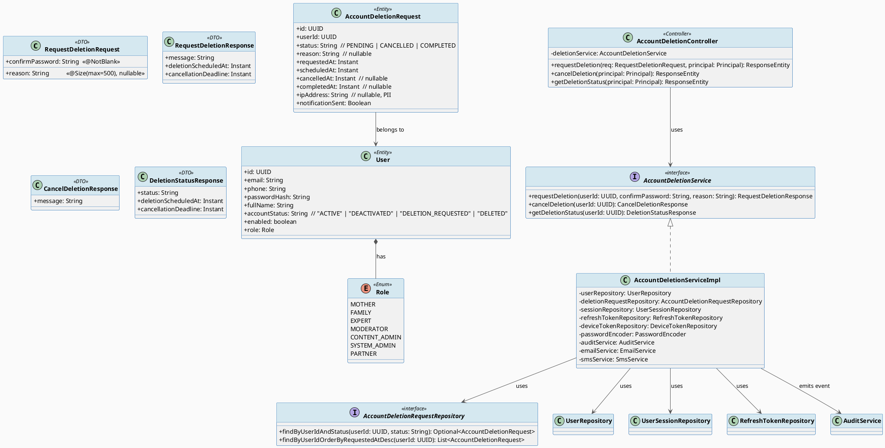
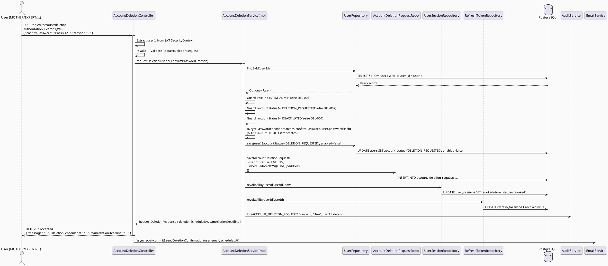
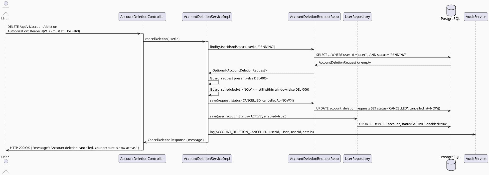
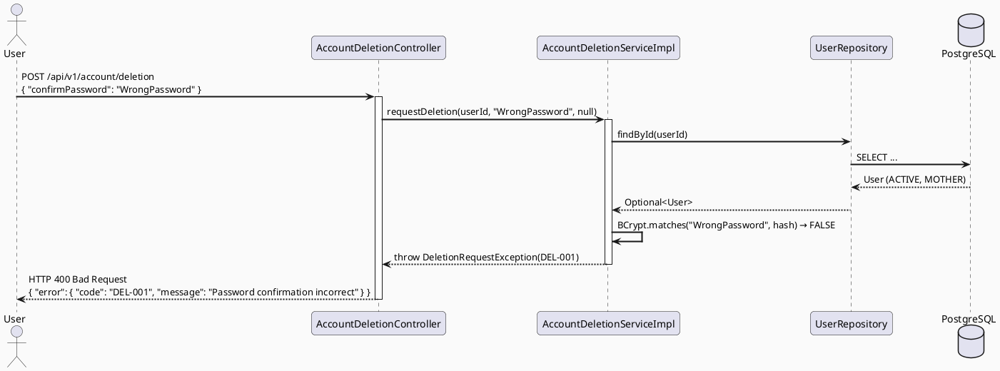
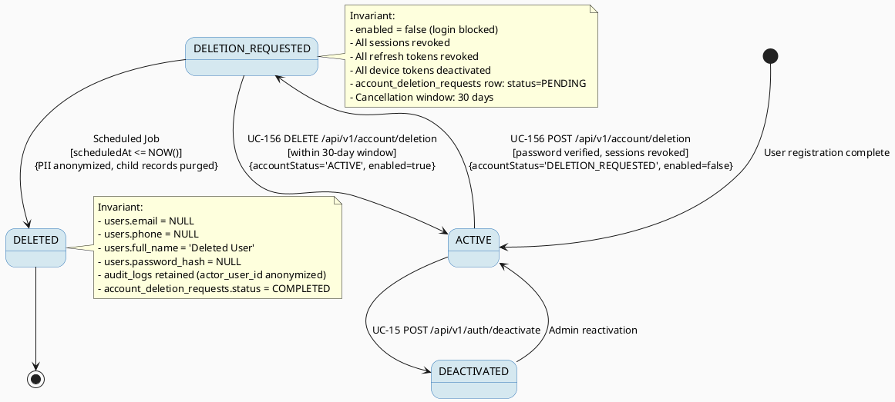

# ENGINEERING DOCUMENTATION STANDARD (EDS) v2.0
# UC156 — Delete Own Account

| Field | Value |
|-------|-------|
| **Document ID** | `CB-AUTH-IMP-156` |
| **Version** | `1.0` |
| **Date** | `2026-06-28` |
| **Status** | `Implemented` |
| **Document Owner** | `PhuongNT` |
| **Author** | `AI Agent` |
| **Reviewed by** | `[ ] Tech Lead — Pending` |
| **DPO Sign-off** | `[ ] Pending` |
| **Approved by** | `[ ] Principal Architect — Pending` |
| **Last Review** | `2026-06-28` |
| **Based on EDS** | `v2.0` |

---

## CHANGELOG

> **Policy 4.4 — Immutable History:** Never delete old entries. All changes must be appended.

| Date | Author | Change |
|------|--------|--------|
| `2026-06-28` | `AI Agent` | Initial creation — UC156 DeleteOwnAccount |

---

## TABLE OF CONTENTS

1. [Module Overview](#1-module-overview)
2. [Traceability Matrix](#2-traceability-matrix)
3. [Architecture Decision Records (ADR)](#3-architecture-decision-records-adr)
4. [Non-Functional Requirements & SLA](#4-non-functional-requirements--sla)
5. [Static Model](#5-static-model)
6. [Dynamic Model](#6-dynamic-model)
7. [Domain Event Catalog](#7-domain-event-catalog)
8. [Interface Specification](#8-interface-specification)
9. [API Specification](#9-api-specification)
10. [Error Codes Table](#10-error-codes-table)
11. [Deployment Steps](#11-deployment-steps)
12. [Rollback Runbook](#12-rollback-runbook)
13. [Test Scenarios](#13-test-scenarios)
14. [Verification Methods](#14-verification-methods)
15. [API Verification Samples](#15-api-verification-samples)
16. [Authorization Matrix](#16-authorization-matrix)
17. [AI Prompt Constraints (CASE 2.0)](#17-ai-prompt-constraints-case-20)

---

## 1. Module Overview

> UC-156: Any authenticated user (MOTHER, FAMILY, EXPERT, MODERATOR, CONTENT_ADMIN, PARTNER — but NOT SYSTEM_ADMIN) may request permanent deletion of their own account. The request enters a 30-day waiting period during which the user may cancel. After the waiting period, a scheduled job anonymizes/purges PII while retaining audit records per legal obligations. Immediate effects: all active sessions are revoked, all device tokens deactivated, a confirmation email/SMS is sent.

| Field | Value |
|-------|-------|
| **Function ID** | `3.1.1.22` |
| **Module Name** | `DeleteOwnAccount` |
| **Bounded Context** | `Security / Identity & Access Management` |
| **Package** | `com.carebridge.backend.security` |
| **Data Classification** | `PII — HIGH` |
| **Compliance Scope** | `PDPA — right-to-erasure, 30-day cancellation window, 7-year audit retention` |
| **Upstream Dependencies** | `IAM Module (JWT/Sessions), RefreshTokenRepository, UserSessionRepository, AuditService, NotificationService` |
| **Downstream Consumers** | `Scheduled Deletion/Anonymization Job (out of UC-156 scope), Admin Reactivation UC (out of UC-156 scope)` |

### 1.1 Relationship to UC-15 (Deactivate Own Account)

| Aspect | UC-15 Deactivate | UC-156 Delete |
|--------|-----------------|---------------|
| Intent | Temporarily disable login | Permanent removal of account and PII |
| Reversibility | Reversible via admin reactivation | Reversible only within 30-day cancellation window |
| DB action | `accountStatus = DEACTIVATED`, `enabled = false` | `accountStatus = DELETION_REQUESTED`, `deletion_requested_at = NOW()`, `deletion_scheduled_at = NOW() + 30d` |
| After waiting period | N/A | Anonymize PII in `users`, cascade-delete child records (scheduled job) |
| Token revocation | Immediate | Immediate |
| Legal basis | User preference | PDPA right-to-erasure |

---

## 2. Traceability Matrix

| Requirement ID | Type | Description | Code Component | Compliance Target | Related ADR |
|----------------|------|-------------|----------------|-------------------|-------------|
| BR-DEL-001 | Business Rule | Password re-confirmation required before submission | `AccountDeletionService.requestDeletion()` — BCrypt verify | Security best practice | ADR-156-002 |
| BR-DEL-002 | Business Rule | SYSTEM_ADMIN cannot self-delete via this endpoint | `AccountDeletionService.requestDeletion()` — role guard | Security | ADR-156-001 |
| BR-DEL-003 | Business Rule | Revoke all sessions and device tokens immediately on request | `UserSessionRepository.revokeAllByUserId()`, `DeviceTokenRepository.deactivateAllByUserId()` | Security | ADR-156-004 |
| BR-DEL-004 | Business Rule | 30-day waiting period before irreversible PII purge | `deletion_scheduled_at = NOW() + 30 days` | PDPA right-to-erasure | ADR-156-003 |
| BR-DEL-005 | Business Rule | User may cancel deletion within waiting period | `AccountDeletionService.cancelDeletion()` | PDPA user rights | ADR-156-003 |
| BR-DEL-006 | Business Rule | Confirmation notification sent on request and on cancel | `NotificationService` | PDPA transparency | ADR-156-005 |
| BR-DEL-007 | Business Rule | Audit record must survive PII purge — never deleted | `audit_logs` record kept; PII fields anonymized | 7-year retention policy | ADR-156-006 |
| BR-DEL-008 | Business Rule | Cannot request deletion if account already in DELETION_REQUESTED state | Guard in service | Idempotency | ADR-156-001 |
| SRS-§3.1.1.22 | User Story | User self-requests account deletion with mandatory waiting period | `AccountDeletionController`, `AccountDeletionService` | — | — |

---

## 3. Architecture Decision Records (ADR)

### ADR-156-001 — Separate AccountDeletionService (not merged into AuthService)

| Field | Value |
|-------|-------|
| **Status** | `Accepted` |
| **Deciders** | `PhuongNT — Backend Lead` |
| **Date** | `2026-06-28` |
| **Supersedes** | `N/A` |

#### Context
UC-15 (Deactivate) added `deactivate()` to `AuthService`. UC-156 (Delete) is significantly more complex: it adds a 30-day scheduled workflow, a cancellation endpoint, downstream job coordination, and PDPA PII purge obligations. Merging into `AuthService` would make it a god-class.

#### Options Considered

| Option | Description | Pros | Cons |
|--------|-------------|------|------|
| A | Add to `AuthService` | No new class | Bloated service, hard to test in isolation |
| B | Dedicated `AccountDeletionService` + `AccountDeletionController` | Single-responsibility, independently testable | One extra file pair |

#### Decision
**Option B** — Dedicated `AccountDeletionService` in package `com.carebridge.backend.security`. Controller mounted at `/api/v1/account/deletion`.

#### Consequences
- Positive: Clean separation; deletion lifecycle methods cohesive; no AuthService churn.
- Negative: One extra file. Accepted.
- Compliance: Isolation makes it easier to apply `@DPOReview` annotations per PDPA.

---

### ADR-156-002 — Separate `account_deletion_requests` table (not columns on `users`)

| Field | Value |
|-------|-------|
| **Status** | `Accepted` |
| **Deciders** | `PhuongNT — Backend Lead, DPO` |
| **Date** | `2026-06-28` |
| **Supersedes** | `N/A` |

#### Context
The prompt noted two design options:
1. Add `deletion_requested_at`, `deletion_scheduled_at`, `deletion_status` columns directly to `users` table.
2. Use a separate `account_deletion_requests` table.

The `users` table in V1 has no such columns. V7 added `account_status`. The account_status column (varchar 30) already exists and can carry `DELETION_REQUESTED` state, which is essential for login guards. However, storing deletion timestamps and reason on `users` bloats the core entity.

#### Options Considered

| Option | Description | Pros | Cons |
|--------|-------------|------|------|
| A | Add 3 columns to `users` | Simpler join path | Pollutes core entity; migration risk on a hot table |
| B | Separate `account_deletion_requests` table + update `account_status` on `users` | Clean separation; extensible; can store reason, channel, IP | Extra join required |

#### Decision
**Option B** — New table `account_deletion_requests`. `users.account_status` is updated to `DELETION_REQUESTED` / `ACTIVE` (on cancel). This requires **Flyway migration V20260628000001**.

#### Consequences
- Positive: `users` stays lean; cancellation history is auditable; PII purge only needs to touch `account_deletion_requests`.
- Negative: Extra join when checking deletion status — acceptable given low frequency.
- Compliance: Deletion request record itself must be retained (audit trail), but `ip_address` and `reason` fields should be treated as PII.

---

### ADR-156-003 — 30-day waiting period (not immediate deletion)

| Field | Value |
|-------|-------|
| **Status** | `Accepted` |
| **Deciders** | `PhuongNT — Backend Lead, DPO` |
| **Date** | `2026-06-28` |
| **Supersedes** | `N/A` |

#### Context
PDPA right-to-erasure must be fulfilled. However, deleting immediately on request removes the ability for the user to recover from an accidental or coerced request. Industry practice (GDPR, Apple, Google) mandates a cooling-off period.

#### Options Considered

| Option | Description |
|--------|-------------|
| A | Immediate deletion | Simplest; no waiting period |
| B | 30-day waiting period with cancellation | PDPA-aligned; user protection |
| C | 90-day waiting period (matching UC-15 deactivation) | Longer recovery window |

#### Decision
**Option B** — 30 days, consistent with GDPR common practice and CareBridge product requirements. UC-15 uses 90-day soft retention for deactivation (no user action required to cancel); UC-156 uses 30 days with explicit cancellation, which is more user-facing.

#### Consequences
- Positive: User can cancel within 30 days; meets PDPA.
- Negative: PII persists 30 days after request; mitigated by immediate session revocation and login block.
- Compliance: 30-day window documented in Privacy Policy.

---

### ADR-156-004 — Immediate session and device token revocation on request

| Field | Value |
|-------|-------|
| **Status** | `Accepted` |
| **Deciders** | `PhuongNT — Backend Lead` |
| **Date** | `2026-06-28` |
| **Supersedes** | `N/A` |

#### Context
Once a user requests account deletion, they should not remain logged in on other devices (security principle of least privilege).

#### Decision
Revoke all `user_sessions` (set `revoked = true`, `status = 'revoked'`) AND all `refresh_tokens` (set `revoked = true`) for the requesting user immediately within the same transaction as the deletion request. Device tokens (`device_tokens.active = false`) are also deactivated.

#### Consequences
- Positive: No active sessions can continue after deletion request.
- Negative: Current JWT still valid for up to 15 minutes (accepted trade-off — consistent with UC-15 decision ADR-015-004).
- Compliance: Reduces unauthorized access risk during the 30-day waiting period.

---

### ADR-156-005 — Confirmation notification via existing NotificationService

| Field | Value |
|-------|-------|
| **Status** | `Accepted` |
| **Deciders** | `PhuongNT — Backend Lead` |
| **Date** | `2026-06-28` |
| **Supersedes** | `N/A` |

#### Context
PDPA transparency requires the user receive confirmation that their deletion request was received and when their account will be deleted.

#### Decision
Use existing `NotificationService` (email/SMS via `EmailService`/`SmsService`) to send:
1. On request: "Your account will be deleted on [scheduled_date]. You may cancel within 30 days."
2. On cancellation: "Your account deletion has been cancelled. Your account is now active."
3. Notification is sent **after** the transaction commits (not inside the `@Transactional` boundary) to avoid rollback-on-send inconsistency.

#### Consequences
- Positive: Consistent with existing notification patterns; no new infrastructure.
- Negative: If notification fails, user may not receive confirmation — mitigated by audit log which is authoritative.

---

### ADR-156-006 — Audit log retained after PII purge

| Field | Value |
|-------|-------|
| **Status** | `Accepted` |
| **Deciders** | `PhuongNT — Backend Lead, DPO` |
| **Date** | `2026-06-28` |
| **Supersedes** | `N/A` |

#### Context
Internal policy requires 7-year retention of audit logs. PDPA right-to-erasure applies to personal data, not to audit records created for legal/compliance purposes.

#### Decision
The scheduled purge job (out of UC-156 scope) must:
1. Anonymize PII fields in `users` (set `email`, `phone`, `full_name`, `password_hash`, `avatar_url` to `null` or anonymized sentinel).
2. Delete child records per the cascade map (§5.3).
3. Update `audit_logs` entries: replace `actor_user_id` with a sentinel UUID (`00000000-0000-0000-0000-deleted00000`) — but retain the action, timestamp, and non-PII metadata.
4. Never `DELETE` from `audit_logs`.

#### Consequences
- Positive: Legal retention fulfilled; PDPA right-to-erasure fulfilled.
- Negative: Audit records point to deleted users — sentinel UUID handling required in Admin UI.

---

## 4. Non-Functional Requirements & SLA

### 4.1 Performance & Availability

| Category | Requirement | Target SLA | Measurement | Compliance Basis |
|----------|-------------|------------|-------------|-----------------|
| Latency (request deletion) | API p99 — BCrypt verify + DB writes + session revoke | `< 600ms` | k6 load test | ADR-156-002 |
| Latency (cancel deletion) | API p99 — DB read + status update + notification | `< 300ms` | k6 load test | — |
| Availability | Monthly uptime | `99.9%` | Uptime monitor | — |
| Throughput | Concurrent deletion requests | `20 req/s` (low-frequency feature) | Load test | — |

### 4.2 Data Integrity & Retention

| Category | Requirement | Target | Verification | Compliance Basis |
|----------|-------------|--------|--------------|-----------------|
| Atomicity | Deletion request + session revoke must be atomic | 100% — `@Transactional` | Transaction log | BR-DEL-003 |
| Waiting period | PII purge not before 30 days after request | Scheduled job checks `deletion_scheduled_at <= NOW()` | Scheduled job audit | ADR-156-003 |
| Audit retention | `audit_logs` records never deleted | 7 years | DB backup policy | ADR-156-006, Internal |
| PII purge | All PII fields anonymized after scheduled_at passes | 100% of fields listed in §5.3 | Integration test against purge job | PDPA |

### 4.3 Security

| Category | Requirement | Target | Verification | Compliance Basis |
|----------|-------------|--------|--------------|-----------------|
| Re-auth | Password confirmation required | BCrypt 12 rounds | TC-DEL-001 | ADR-156-002, BR-DEL-001 |
| Session revocation | All sessions revoked immediately | 100% | DB assertion | ADR-156-004, BR-DEL-003 |
| SYSTEM_ADMIN guard | SYSTEM_ADMIN cannot self-delete | 403 DEL-003 enforced | TC-DEL-005 | BR-DEL-002 |
| Login block | `DELETION_REQUESTED` account cannot log in | `enabled = false` checked by Spring Security | TC-DEL-010 | BR-DEL-004 |
| In-transit encryption | All endpoints | TLS 1.3+ | SSL Labs scan | PDPA |

### 4.4 Scalability

> Account deletion is ultra-low-frequency (< 50 requests/day expected). BCrypt verify is the latency bottleneck. No async required at MVP scale.

---

## 5. Static Model

### 5.1 Class Diagram (PlantUML)



### 5.2 Data Migration

> **New Flyway migration required: `V20260628000001__create_account_deletion_requests.sql`**
> (Next version after `V20260627100500__create_vaccination_reference.sql`)

```sql
-- V20260628000001__create_account_deletion_requests.sql
-- Purpose: Create account_deletion_requests table for UC-156 Delete Own Account.
-- Applied: 2026-06-28

CREATE TABLE public.account_deletion_requests (
    id               uuid         NOT NULL DEFAULT gen_random_uuid(),
    user_id          uuid         NOT NULL,
    status           varchar(20)  NOT NULL DEFAULT 'PENDING',
    reason           varchar(500),
    requested_at     timestamptz  NOT NULL DEFAULT now(),
    scheduled_at     timestamptz  NOT NULL,
    cancelled_at     timestamptz,
    completed_at     timestamptz,
    ip_address       varchar(80),
    notification_sent boolean     NOT NULL DEFAULT false,
    created_at       timestamptz  NOT NULL DEFAULT now(),
    updated_at       timestamptz  NOT NULL DEFAULT now(),
    CONSTRAINT account_deletion_requests_pkey PRIMARY KEY (id),
    CONSTRAINT account_deletion_requests_status_check
        CHECK (((status)::text = ANY ((ARRAY[
            'PENDING'::character varying,
            'CANCELLED'::character varying,
            'COMPLETED'::character varying
        ])::text[])))
);

ALTER TABLE ONLY public.account_deletion_requests
    ADD CONSTRAINT account_deletion_requests_user_id_fkey
        FOREIGN KEY (user_id) REFERENCES public.users(user_id) ON DELETE CASCADE;

-- One active (PENDING) deletion request per user at a time
CREATE UNIQUE INDEX uq_account_deletion_user_pending
    ON public.account_deletion_requests (user_id)
    WHERE (status = 'PENDING');

CREATE INDEX idx_account_deletion_user_id
    ON public.account_deletion_requests USING btree (user_id);

CREATE INDEX idx_account_deletion_scheduled_at
    ON public.account_deletion_requests USING btree (scheduled_at)
    WHERE (status = 'PENDING');

COMMENT ON TABLE public.account_deletion_requests IS
    'Tracks user-initiated account deletion requests. PII: ip_address, reason.';
```

> **Existing `users.account_status` column** (added in V7) already supports the `DELETION_REQUESTED` state.
> No additional migration is needed on `users` for the status transition — confirm `account_status` varchar(30) is large enough (it is: 30 > 18 chars for `DELETION_REQUESTED`).

### 5.3 PII Cascade Map (for Scheduled Purge Job — out of UC-156 scope, documented here for completeness)

| Table | Action | Columns anonymized |
|-------|--------|--------------------|
| `users` | Anonymize in-place | `email → NULL`, `phone → NULL`, `full_name → 'Deleted User'`, `password_hash → NULL`, `avatar_url → NULL` |
| `user_profiles` | DELETE | All rows where `user_id = :userId` |
| `user_sessions` | DELETE | All rows where `user_id = :userId` |
| `refresh_tokens` | DELETE | All rows where `user_id = :userId` |
| `device_tokens` | DELETE | All rows where `user_id = :userId` |
| `password_reset_tokens` | DELETE | All rows where `user_id = :userId` |
| `privacy_settings` | DELETE | All rows where `user_id = :userId` |
| `consent_grants` | DELETE | All rows where `user_id = :userId` |
| `notifications` | DELETE | All rows where `recipient_user_id = :userId` |
| `community_profiles` | DELETE | All rows where `user_id = :userId` |
| `community_questions` | Anonymize | `author_id → sentinel UUID` (if not already deleted by cascade) |
| `community_answers` | Anonymize | `author_id → sentinel UUID` |
| `audit_logs` | Anonymize | `actor_user_id → sentinel UUID (00000000-0000-0000-0000-deleted00000)` |
| `account_deletion_requests` | Anonymize | `ip_address → NULL`, `reason → '[PURGED]'` |

---

## 6. Dynamic Model

### 6.1 Sequence Diagram — Request Deletion (Happy Path)



### 6.2 Sequence Diagram — Cancel Deletion (Happy Path)



### 6.3 Sequence Diagram — Error Path (Wrong Password)



### 6.4 State Machine — Account Deletion Lifecycle



---

## 7. Domain Event Catalog

### 7.1 Events Published

| Event Name | Trigger | Publisher | Subscriber(s) | Payload Schema | Async? |
|------------|---------|-----------|---------------|----------------|--------|
| `ACCOUNT_DELETION_REQUESTED` | User requests account deletion | `AccountDeletionServiceImpl` | `AuditService` | See §7.3 | No (sync audit) |
| `ACCOUNT_DELETION_CANCELLED` | User cancels deletion request | `AccountDeletionServiceImpl` | `AuditService` | See §7.3 | No (sync audit) |

### 7.2 Events Consumed

| Event Name | Source | Handler | Action |
|------------|--------|---------|--------|
| _(UC-156 does not consume events at MVP)_ | — | — | — |

### 7.3 Audit Action (to be added to `AuditAction` enum)

```java
// Add to: com.carebridge.backend.audit.entity.AuditAction
ACCOUNT_DELETION_REQUESTED,
ACCOUNT_DELETION_CANCELLED
```

Audit `log()` call parameters:

```java
// On request:
auditService.log(
    AuditAction.ACCOUNT_DELETION_REQUESTED,
    userId,          // actor
    "User",          // resourceType
    userId.toString(),// resourceId
    Map.of(
        "scheduledAt", scheduledAt.toString(),
        "ipAddress",   ipAddress,   // captured from HttpServletRequest
        "reason",      reason != null ? "[REDACTED]" : "none" // never log raw reason
    )
);

// On cancel:
auditService.log(
    AuditAction.ACCOUNT_DELETION_CANCELLED,
    userId,
    "User",
    userId.toString(),
    Map.of("cancelledAt", Instant.now().toString())
);
```

---

## 8. Interface Specification

### 8.1 DTOs

```java
// RequestDeletionRequest.java
package com.carebridge.backend.security.dto.request;

import jakarta.validation.constraints.NotBlank;
import jakarta.validation.constraints.Size;

public class RequestDeletionRequest {

    @NotBlank(message = "Password confirmation is required")
    private String confirmPassword;

    @Size(max = 500, message = "Reason must not exceed 500 characters")
    private String reason; // nullable

    // Getters / Setters
    public String getConfirmPassword() { return confirmPassword; }
    public void setConfirmPassword(String v) { this.confirmPassword = v; }
    public String getReason() { return reason; }
    public void setReason(String v) { this.reason = v; }
}

// RequestDeletionResponse.java
package com.carebridge.backend.security.dto.response;

import java.time.Instant;

public class RequestDeletionResponse {
    private String message;
    private Instant deletionScheduledAt;
    private Instant cancellationDeadline;

    // Constructor
    public RequestDeletionResponse(String message, Instant deletionScheduledAt, Instant cancellationDeadline) {
        this.message = message;
        this.deletionScheduledAt = deletionScheduledAt;
        this.cancellationDeadline = cancellationDeadline;
    }
    // Getters omitted for brevity — use Lombok @Getter
}

// CancelDeletionResponse.java
package com.carebridge.backend.security.dto.response;

public class CancelDeletionResponse {
    private String message;

    public CancelDeletionResponse(String message) { this.message = message; }
    public String getMessage() { return message; }
}

// DeletionStatusResponse.java
package com.carebridge.backend.security.dto.response;

import java.time.Instant;

public class DeletionStatusResponse {
    private String status;                // "NONE" | "PENDING" | "CANCELLED" | "COMPLETED"
    private Instant deletionScheduledAt;  // null if status=NONE
    private Instant cancellationDeadline; // null if status != PENDING

    // All-args constructor + getters
}
```

### 8.2 Entity

```java
// AccountDeletionRequest.java
package com.carebridge.backend.security.entity;

import jakarta.persistence.*;
import lombok.*;
import org.hibernate.annotations.CreationTimestamp;
import org.hibernate.annotations.UpdateTimestamp;
import java.time.Instant;
import java.util.UUID;

@Entity
@Table(name = "account_deletion_requests")
@Getter
@Setter
@Builder
@NoArgsConstructor
@AllArgsConstructor
public class AccountDeletionRequest {

    @Id
    @GeneratedValue(strategy = GenerationType.UUID)
    @Column(name = "id", updatable = false, nullable = false)
    private UUID id;

    @Column(name = "user_id", nullable = false, updatable = false)
    private UUID userId;

    @Column(name = "status", length = 20, nullable = false)
    @Builder.Default
    private String status = "PENDING"; // PENDING | CANCELLED | COMPLETED

    @Column(name = "reason", length = 500)
    private String reason;

    @Column(name = "requested_at", nullable = false, updatable = false)
    private Instant requestedAt;

    @Column(name = "scheduled_at", nullable = false)
    private Instant scheduledAt;

    @Column(name = "cancelled_at")
    private Instant cancelledAt;

    @Column(name = "completed_at")
    private Instant completedAt;

    @Column(name = "ip_address", length = 80)
    private String ipAddress; // PII — anonymized on purge

    @Column(name = "notification_sent")
    @Builder.Default
    private Boolean notificationSent = false;

    @CreationTimestamp
    @Column(name = "created_at", nullable = false, updatable = false)
    private Instant createdAt;

    @UpdateTimestamp
    @Column(name = "updated_at")
    private Instant updatedAt;
}
```

### 8.3 Repository Interface

```java
// AccountDeletionRequestRepository.java
package com.carebridge.backend.security.repository;

import com.carebridge.backend.security.entity.AccountDeletionRequest;
import org.springframework.data.jpa.repository.JpaRepository;
import org.springframework.stereotype.Repository;
import java.util.List;
import java.util.Optional;
import java.util.UUID;

@Repository
public interface AccountDeletionRequestRepository extends JpaRepository<AccountDeletionRequest, UUID> {

    Optional<AccountDeletionRequest> findByUserIdAndStatus(UUID userId, String status);

    List<AccountDeletionRequest> findByUserIdOrderByRequestedAtDesc(UUID userId);
}
```

### 8.4 Service Interface

```java
// AccountDeletionService.java
package com.carebridge.backend.security.service;

import com.carebridge.backend.security.dto.request.RequestDeletionRequest;
import com.carebridge.backend.security.dto.response.CancelDeletionResponse;
import com.carebridge.backend.security.dto.response.DeletionStatusResponse;
import com.carebridge.backend.security.dto.response.RequestDeletionResponse;
import java.util.UUID;

public interface AccountDeletionService {

    /**
     * Initiates an account deletion request for the given user.
     * Verifies password, blocks login immediately, schedules deletion in 30 days.
     * Revokes all sessions and device tokens.
     *
     * @throws DeletionRequestException (DEL-001) if confirmPassword does not match
     * @throws DeletionRequestException (DEL-002) if already in DELETION_REQUESTED state
     * @throws DeletionRequestException (DEL-003) if caller role is SYSTEM_ADMIN
     * @throws DeletionRequestException (DEL-004) if account is already DEACTIVATED
     * @throws ResourceNotFoundException        if user not found (should not happen with valid JWT)
     */
    RequestDeletionResponse requestDeletion(UUID userId, String confirmPassword, String reason);

    /**
     * Cancels a pending deletion request within the 30-day window.
     * Restores login capability.
     *
     * @throws DeletionRequestException (DEL-005) if no PENDING deletion request found
     * @throws DeletionRequestException (DEL-006) if cancellation window has expired
     */
    CancelDeletionResponse cancelDeletion(UUID userId);

    /**
     * Returns the current deletion status for the user.
     * Returns DeletionStatusResponse with status="NONE" if no pending request exists.
     */
    DeletionStatusResponse getDeletionStatus(UUID userId);
}
```

### 8.5 UserSessionRepository — additional query needed

```java
// Add to existing UserSessionRepository.java
@Modifying
@Query("UPDATE UserSession us SET us.revoked = true, us.status = 'revoked', us.updatedAt = :now " +
       "WHERE us.userId = :userId AND us.revoked = false")
int revokeAllByUserId(@Param("userId") UUID userId, @Param("now") Instant now);
```

> Oracle: `UserSessionRepository` already has `revokeAllExceptSession()` pattern — this is the same idiom without the exclusion clause.

---

## 9. API Specification

### 9.1 Endpoints Table

| Method | Path | Auth Level | Roles Allowed | Rate Limit | Idempotent? |
|--------|------|------------|---------------|------------|-------------|
| `POST` | `/api/v1/account/deletion` | JWT Bearer | All except `SYSTEM_ADMIN` | 3/hour per user | No |
| `DELETE` | `/api/v1/account/deletion` | JWT Bearer | All (only own pending request) | 3/hour per user | Yes (idempotent within window) |
| `GET` | `/api/v1/account/deletion/status` | JWT Bearer | All | 30/hour per user | Yes |

### 9.2 Request / Response Schemas

#### `POST /api/v1/account/deletion` — Request account deletion

**Request Headers:**
```
Authorization: Bearer <JWT_TOKEN>
Content-Type: application/json
X-Correlation-Id: <UUID>  (optional but recommended for tracing)
```

**Request Body:**
```json
{
  "confirmPassword": "MyPassword@123",
  "reason": "I no longer need this account"
}
```

**Response — 202 Accepted (Happy Path):**
```json
{
  "message": "Account deletion scheduled. You may cancel within 30 days.",
  "deletionScheduledAt": "2026-07-28T00:00:00Z",
  "cancellationDeadline": "2026-07-28T00:00:00Z"
}
```

**Response — 400 Bad Request (DEL-001 — Wrong password):**
```json
{
  "error": {
    "code": "DEL-001",
    "message": "Password confirmation incorrect"
  }
}
```

**Response — 409 Conflict (DEL-002 — Already pending):**
```json
{
  "error": {
    "code": "DEL-002",
    "message": "Account deletion is already pending"
  }
}
```

**Response — 403 Forbidden (DEL-003 — SYSTEM_ADMIN):**
```json
{
  "error": {
    "code": "DEL-003",
    "message": "System administrators cannot delete their own account via this endpoint"
  }
}
```

**Response — 409 Conflict (DEL-004 — Account deactivated):**
```json
{
  "error": {
    "code": "DEL-004",
    "message": "Account is deactivated. Contact support to reactivate before requesting deletion."
  }
}
```

---

#### `DELETE /api/v1/account/deletion` — Cancel deletion request

**Request Headers:**
```
Authorization: Bearer <JWT_TOKEN>
```

**Response — 200 OK (Happy Path):**
```json
{
  "message": "Account deletion cancelled. Your account is now active."
}
```

**Response — 404 Not Found (DEL-005 — No pending request):**
```json
{
  "error": {
    "code": "DEL-005",
    "message": "No pending account deletion request found"
  }
}
```

**Response — 410 Gone (DEL-006 — Window expired):**
```json
{
  "error": {
    "code": "DEL-006",
    "message": "Cancellation window has expired. Account deletion cannot be cancelled."
  }
}
```

---

#### `GET /api/v1/account/deletion/status` — Get deletion status

**Response — 200 OK (No pending request):**
```json
{
  "status": "NONE",
  "deletionScheduledAt": null,
  "cancellationDeadline": null
}
```

**Response — 200 OK (Pending):**
```json
{
  "status": "PENDING",
  "deletionScheduledAt": "2026-07-28T00:00:00Z",
  "cancellationDeadline": "2026-07-28T00:00:00Z"
}
```

---

## 10. Error Codes Table

| Code | HTTP Status | Message (EN) | Trigger Condition |
|------|-------------|--------------|-------------------|
| `DEL-001` | `400 Bad Request` | Password confirmation incorrect | `confirmPassword` does not match `user.passwordHash` (BCrypt) |
| `DEL-002` | `409 Conflict` | Account deletion is already pending | `users.accountStatus == 'DELETION_REQUESTED'` |
| `DEL-003` | `403 Forbidden` | System administrators cannot delete their own account via this endpoint | `user.role == Role.SYSTEM_ADMIN` |
| `DEL-004` | `409 Conflict` | Account is deactivated. Contact support to reactivate before requesting deletion. | `users.accountStatus == 'DEACTIVATED'` |
| `DEL-005` | `404 Not Found` | No pending account deletion request found | No `account_deletion_requests` row with `status=PENDING` for user |
| `DEL-006` | `410 Gone` | Cancellation window has expired | `scheduledAt <= NOW()` — 30-day window passed |
| `IAM-001` | `401 Unauthorized` | Authentication required | No or invalid JWT Bearer token |

---

## 11. Deployment Steps

### 11.1 Prerequisites

- [ ] ADR-156-001 through ADR-156-006 accepted
- [ ] DPO sign-off on UC-156 (PII — account deletion and purge strategy)
- [ ] Flyway migration `V20260628000001__create_account_deletion_requests.sql` reviewed
- [ ] `AuditAction` enum updated with `ACCOUNT_DELETION_REQUESTED`, `ACCOUNT_DELETION_CANCELLED`
- [ ] `audit_logs` table constraint updated to allow new action values (see §11.2)
- [ ] Staging environment ready

### 11.2 Pre-Migration Checklist

```sql
-- 1. Verify users.account_status exists and has enough space
SELECT column_name, data_type, character_maximum_length
FROM information_schema.columns
WHERE table_name = 'users' AND column_name = 'account_status';
-- Expected: varchar(30) — sufficient for 'DELETION_REQUESTED' (18 chars)

-- 2. Check audit_logs action constraint before adding new actions
SELECT pg_get_constraintdef(oid)
FROM pg_constraint
WHERE conname = 'audit_logs_action_check';

-- 3. If constraint exists, update it to include new actions:
-- (Run only if constraint is present and DOES NOT already include these values)
ALTER TABLE public.audit_logs
    DROP CONSTRAINT IF EXISTS audit_logs_action_check;

ALTER TABLE public.audit_logs
    ADD CONSTRAINT audit_logs_action_check CHECK (
        (action::text = ANY (ARRAY[
            'LOGIN', 'LOGOUT', 'OTP_SENT', 'OTP_VERIFIED',
            'CONSENT_GRANTED', 'CONSENT_REVOKED',
            'CREATE_HEALTH_RECORD', 'VIEW_HEALTH_RECORD',
            'EXPERT_VERIFICATION', 'MODERATION_ACTION',
            'AI_TRIAGE', 'PAYMENT', 'SECURITY_EVENT',
            'VIEW_AUDIT_LOG',
            'ACCOUNT_DELETION_REQUESTED',
            'ACCOUNT_DELETION_CANCELLED'
        ]::text[]))
    );
```

> **Note:** The constraint update for `audit_logs` must be included as a separate migration (`V20260628000002__update_audit_logs_constraint.sql`) or added to V20260628000001. Either approach is valid; choose based on atomicity preference.

### 11.3 Implementation Steps

**Chặng 1 — Flyway migration**
```
File: 05_Development/CareBridgeAPI/src/main/resources/db/migration/
      V20260628000001__create_account_deletion_requests.sql
(SQL text in §5.2)
```

**Chặng 2 — Add AuditAction values**
```
File: src/main/java/com/carebridge/backend/audit/entity/AuditAction.java
Add: ACCOUNT_DELETION_REQUESTED, ACCOUNT_DELETION_CANCELLED
```

**Chặng 3 — Create AccountDeletionRequest entity**
```
File: src/main/java/com/carebridge/backend/security/entity/AccountDeletionRequest.java
(Java code in §8.2)
```

**Chặng 4 — Create AccountDeletionRequestRepository**
```
File: src/main/java/com/carebridge/backend/security/repository/AccountDeletionRequestRepository.java
(Java code in §8.3)
```

**Chặng 5 — Create DTOs**
```
Files: src/main/java/com/carebridge/backend/security/dto/request/RequestDeletionRequest.java
       src/main/java/com/carebridge/backend/security/dto/response/RequestDeletionResponse.java
       src/main/java/com/carebridge/backend/security/dto/response/CancelDeletionResponse.java
       src/main/java/com/carebridge/backend/security/dto/response/DeletionStatusResponse.java
(Java code in §8.1)
```

**Chặng 6 — Create AccountDeletionService interface**
```
File: src/main/java/com/carebridge/backend/security/service/AccountDeletionService.java
(Java code in §8.4)
```

**Chặng 7 — Implement AccountDeletionServiceImpl**
```
File: src/main/java/com/carebridge/backend/security/service/impl/AccountDeletionServiceImpl.java

Key implementation constraints (§17):
- C1: Check role != SYSTEM_ADMIN FIRST, before password verify
- C2: BCrypt verify BEFORE any DB write
- C3: Set BOTH accountStatus='DELETION_REQUESTED' AND enabled=false atomically
- C4: Revoke all sessions + refresh tokens inside @Transactional
- C5: emit ACCOUNT_DELETION_REQUESTED audit event after all DB writes
- C6: Send notification AFTER transaction commits (outside @Transactional or via @TransactionalEventListener)
```

**Chặng 8 — Create AccountDeletionController**
```
File: src/main/java/com/carebridge/backend/security/controller/AccountDeletionController.java
Mapping: @RequestMapping("/api/v1/account/deletion")
```

**Chặng 9 — Add revokeAllByUserId to UserSessionRepository**
```
File: src/main/java/com/carebridge/backend/identity/repository/UserSessionRepository.java
Add method: int revokeAllByUserId(UUID userId, Instant now)
(§8.5)
```

**Chặng 10 — Run tests**
```bash
./mvnw test -pl 05_Development/CareBridgeAPI \
  -Dtest="AccountDeletionServiceImplTest,AccountDeletionControllerTest"
```

### 11.4 Post-Deploy Verification

```bash
# Health check
curl -X GET https://[host]/api/v1/health
# Expected: {"status": "ok"}

# Verify migration applied
psql -c "SELECT COUNT(*) FROM information_schema.tables WHERE table_name = 'account_deletion_requests';"
# Expected: 1

# Monitor error rate for 10 minutes
kubectl logs -l app=carebridge-api --tail=100 | grep -E "DEL-00[1-6]"
```

---

## 12. Rollback Runbook

### 12.1 Rollback Trigger Conditions

| Condition | Threshold | Decision Maker |
|-----------|-----------|---------------|
| Accidental deletion requests (wrong users) | Any | Tech Lead + DPO |
| Error rate spike | > 5% in 5 minutes | On-call Engineer |
| Migration fails on production | Any Flyway error | On-call Engineer |

### 12.2 Rollback Procedure

```bash
# STEP 1: Revert code (no DB schema change affects users table)
git revert <commit-sha-of-UC156-implementation>

# STEP 2: If migration V20260628000001 was applied and needs rollback
# (Flyway does NOT support automatic rollback — manual SQL needed)
psql -h $DB_HOST -U $DB_USER -d $DB_NAME << 'EOF'
-- Drop the new table (safe — no FKs from other tables point to it)
DROP TABLE IF EXISTS public.account_deletion_requests;

-- Revert any users that got set to DELETION_REQUESTED
-- (Check audit_logs for ACCOUNT_DELETION_REQUESTED events first)
UPDATE public.users
SET account_status = 'ACTIVE', enabled = true
WHERE account_status = 'DELETION_REQUESTED';
EOF

# STEP 3: Re-deploy previous version
kubectl rollout undo deployment/carebridge-api

# STEP 4: Verify
kubectl rollout status deployment/carebridge-api
curl -X GET https://[host]/api/v1/health
```

### 12.3 Notification Protocol

| Time | Recipient | Channel | Template |
|------|-----------|---------|----------|
| Immediately on incident | On-call team | Slack `#incident` | "UC-156 Deletion incident: [description]" |
| Within 30 min | DPO | Email | Required — PII module (account deletion) |
| Within 72 hours | DPA | Email | Only if data breach involved |

---

## 13. Test Scenarios

> Full test cases in `04_Implement/UC156_DeleteOwnAccount/UC156_DeleteOwnAccount_Test-Spec.md`

### 13.1 Unit Test Summary

| Scenario | Expected |
|----------|----------|
| MOTHER user requests deletion with correct password | 202, deletion scheduled, sessions revoked |
| Request with wrong password | 400 DEL-001, no state change |
| Request when already `DELETION_REQUESTED` | 409 DEL-002 |
| SYSTEM_ADMIN requests deletion | 403 DEL-003 |
| Request when account is `DEACTIVATED` | 409 DEL-004 |
| Cancel deletion within 30-day window | 200, accountStatus=ACTIVE, enabled=true |
| Cancel with no pending request | 404 DEL-005 |
| Cancel after window expired | 410 DEL-006 |
| Get status — no request | 200, status=NONE |
| Get status — pending | 200, status=PENDING with dates |
| No JWT on any endpoint | 401 IAM-001 |

---

## 14. Verification Methods

### 14.1 Database Verification

```sql
-- After requesting deletion:
SELECT user_id, account_status, enabled, updated_at
FROM users
WHERE user_id = '00000000-0000-0000-0000-000000000156';
-- Expected: account_status='DELETION_REQUESTED', enabled=false

SELECT id, status, requested_at, scheduled_at, notification_sent
FROM account_deletion_requests
WHERE user_id = '00000000-0000-0000-0000-000000000156';
-- Expected: status='PENDING', scheduled_at = requested_at + 30 days

-- Sessions revoked:
SELECT COUNT(*) FROM user_sessions
WHERE user_id = '00000000-0000-0000-0000-000000000156' AND revoked = false;
-- Expected: 0

-- Refresh tokens revoked:
SELECT COUNT(*) FROM refresh_tokens
WHERE user_id = '00000000-0000-0000-0000-000000000156' AND revoked = false;
-- Expected: 0

-- After cancellation:
SELECT account_status, enabled FROM users
WHERE user_id = '00000000-0000-0000-0000-000000000156';
-- Expected: account_status='ACTIVE', enabled=true
```

### 14.2 Audit Log Verification

```bash
kubectl logs -l app=carebridge-api | grep 'ACCOUNT_DELETION_REQUESTED' | tail -5
kubectl logs -l app=carebridge-api | grep 'ACCOUNT_DELETION_CANCELLED' | tail -5

# Verify no raw password or PII in audit log
kubectl logs -l app=carebridge-api | grep -i 'password\|passwordHash\|confirmPassword'
# Expected: No output
```

---

## 15. API Verification Samples

### 15.1 Request Deletion

```bash
# Step 1: Get JWT
TOKEN=$(curl -s -X POST https://[host]/api/v1/auth/login-direct \
  -H "Content-Type: application/json" \
  -d '{"email": "test@example.com", "password": "MyPassword@123"}' \
  | jq -r '.accessToken')

# Step 2: Request deletion
curl -X POST https://[host]/api/v1/account/deletion \
  -H "Authorization: Bearer $TOKEN" \
  -H "Content-Type: application/json" \
  -H "X-Correlation-Id: $(uuidgen)" \
  -d '{
    "confirmPassword": "MyPassword@123",
    "reason": "Testing deletion flow"
  }'
```

**Expected (202):**
```json
{
  "message": "Account deletion scheduled. You may cancel within 30 days.",
  "deletionScheduledAt": "2026-07-28T00:00:00Z",
  "cancellationDeadline": "2026-07-28T00:00:00Z"
}
```

### 15.2 Cancel Deletion

```bash
# Use the same or a new valid JWT (if session was revoked, re-login is needed)
curl -X DELETE https://[host]/api/v1/account/deletion \
  -H "Authorization: Bearer $TOKEN"
```

**Expected (200):**
```json
{
  "message": "Account deletion cancelled. Your account is now active."
}
```

### 15.3 Error Paths

```bash
# Wrong password → 400
curl -X POST https://[host]/api/v1/account/deletion \
  -H "Authorization: Bearer $TOKEN" \
  -H "Content-Type: application/json" \
  -d '{"confirmPassword": "WrongPassword"}'

# Duplicate request → 409
# (submit same request twice)

# No JWT → 401
curl -X POST https://[host]/api/v1/account/deletion \
  -H "Content-Type: application/json" \
  -d '{"confirmPassword": "MyPassword@123"}'
```

---

## 16. Authorization Matrix

> **Principle of Least Privilege**: Only the account owner can delete their own account via this endpoint.

| Endpoint | `GUEST` | `MOTHER` | `FAMILY` | `EXPERT` | `MODERATOR` | `CONTENT_ADMIN` | `SYSTEM_ADMIN` | `PARTNER` |
|----------|---------|----------|----------|----------|-------------|-----------------|----------------|-----------|
| `POST /api/v1/account/deletion` | 401 | Own | Own | Own | Own | Own | 403 DEL-003 | Own |
| `DELETE /api/v1/account/deletion` | 401 | Own | Own | Own | Own | Own | 403 DEL-003 | Own |
| `GET /api/v1/account/deletion/status` | 401 | Own | Own | Own | Own | Own | 403 DEL-003 | Own |

**Notes:**
- Own = Can only operate on their own account (userId derived from JWT claim)
- GUEST = 401 IAM-001 (no valid JWT)
- SYSTEM_ADMIN = 403 DEL-003 — SYSTEM_ADMIN accounts must be deleted through an admin-specific lifecycle process (out of scope)
- A DEACTIVATED account user cannot call this endpoint because `enabled=false` blocks Spring Security login; they receive 401

---

## 17. AI Prompt Constraints (CASE 2.0)

### 17.1 Constraint Summary Table

| # | Constraint | Source | Last Verified |
|---|-----------|--------|---------------|
| C1 | Check `user.role == Role.SYSTEM_ADMIN` → throw `DeletionRequestException("DEL-003")` FIRST, before any password verify | BR-DEL-002 | `2026-06-28` |
| C2 | Verify `confirmPassword` via `BCryptPasswordEncoder.matches()` BEFORE any DB write | BR-DEL-001, ADR-156-002 | `2026-06-28` |
| C3 | Guard `accountStatus == 'DELETION_REQUESTED'` → throw `DeletionRequestException("DEL-002")` 409 | BR-DEL-008 | `2026-06-28` |
| C4 | Guard `accountStatus == 'DEACTIVATED'` → throw `DeletionRequestException("DEL-004")` 409 | BR-DEL-002 | `2026-06-28` |
| C5 | Set BOTH `accountStatus = 'DELETION_REQUESTED'` AND `enabled = false` in same `@Transactional` | BR-DEL-003 | `2026-06-28` |
| C6 | Revoke ALL sessions (`userSessionRepository.revokeAllByUserId()`) AND refresh tokens (`refreshTokenRepository.revokeAllByUserId()`) AND device tokens inside same `@Transactional` | ADR-156-004, BR-DEL-003 | `2026-06-28` |
| C7 | Create `AccountDeletionRequest` entity with `scheduledAt = requestedAt + 30 days` | ADR-156-003, BR-DEL-004 | `2026-06-28` |
| C8 | Emit `AuditAction.ACCOUNT_DELETION_REQUESTED` after all DB writes succeed | §7 Domain Event | `2026-06-28` |
| C9 | Send notification email/SMS AFTER transaction commits — use `@TransactionalEventListener(phase=AFTER_COMMIT)` or call notification outside `@Transactional` | ADR-156-005 | `2026-06-28` |
| C10 | `cancelDeletion()`: restore BOTH `accountStatus = 'ACTIVE'` AND `enabled = true` | BR-DEL-005 | `2026-06-28` |

### 17.2 Constraint Injection Block (Copy-Paste into AI Prompt)

```
[CONSTRAINT BLOCK — Module: DeleteOwnAccount UC-156]
Per TDS CB-AUTH-IMP-156 and referenced ADRs/BRs:

1. (C1) Guard: if user.role == SYSTEM_ADMIN → throw DeletionRequestException("DEL-003", 403) BEFORE password check.
2. (C2) Verify confirmPassword via BCryptPasswordEncoder.matches() BEFORE any DB write.
3. (C3) Guard: if accountStatus == 'DELETION_REQUESTED' → throw DeletionRequestException("DEL-002", 409).
4. (C4) Guard: if accountStatus == 'DEACTIVATED' → throw DeletionRequestException("DEL-004", 409).
5. (C5) Set BOTH accountStatus='DELETION_REQUESTED' AND enabled=false atomically in same @Transactional.
6. (C6) Inside same @Transactional: revokeAllByUserId for user_sessions, refresh_tokens, device_tokens.
7. (C7) Insert AccountDeletionRequest with scheduledAt = Instant.now() plus 30 days.
8. (C8) Emit AuditAction.ACCOUNT_DELETION_REQUESTED after all DB writes succeed.
9. (C9) Send email/SMS notification AFTER commit — do NOT send inside @Transactional boundary.
10. (C10) cancelDeletion(): restore accountStatus='ACTIVE' AND enabled=true in same @Transactional.

[CONTEXT BLOCK]
- Bounded Context: Security / IAM
- Package: com.carebridge.backend.security
- New entity: AccountDeletionRequest (table: account_deletion_requests — V20260628000001)
- Existing repos: UserRepository, RefreshTokenRepository, UserSessionRepository (add revokeAllByUserId per §8.5)
- New repo: AccountDeletionRequestRepository (§8.3)
- Error codes: DEL-001 through DEL-006, IAM-001 (§10)
- Auth matrix: §16 — All roles EXCEPT SYSTEM_ADMIN allowed; GUEST → 401
- Data classification: PII-HIGH — never log confirmPassword, full_name, email raw in audit

[TASK BLOCK]
Implement AccountDeletionServiceImpl satisfying constraints C1–C10.
Follow §8.4 Service Interface exactly.
Tests must cover §13.1 scenarios.
Migration V20260628000001 must be applied before running @DataJpaTest tests.
```

### 17.3 Constraint Quality Checklist

- [x] Each constraint traceable to a specific ADR or BR
- [x] No generic constraints
- [x] Each constraint has `Last Verified` date
- [x] Constraint block has 10 specific constraints (>= 3 required)
- [x] References §8 Interface Specification
- [x] References §16 Authorization Matrix

### 17.4 Anti-Pattern Detection

| AP-ID | Anti-Pattern | Signal | Action |
|-------|-------------|--------|--------|
| AP-AI-001 | Unconstrained Generation | Code does not guard SYSTEM_ADMIN (C1) or skips session revocation (C6) | Reject — inject C1 and C6 |
| AP-AI-002 | Silent Success on Duplicate | No 409 on duplicate deletion request — returns 202 again | Reject — enforce C3 |
| AP-AI-003 | PII in Logs | Code logs `confirmPassword` or `user.email` in audit or logger | Reject — remove PII from logs |
| AP-AI-004 | Notification Inside Transaction | `emailService.send()` called inside `@Transactional` — may send email even if transaction rolls back | Reject — enforce C9 |
| AP-AI-005 | Hallucinated Schema | Code references `users.deletion_requested_at` column (does not exist in V1–V9) | Reject — use `account_deletion_requests` table per ADR-156-002 |
| AP-AI-006 | Partial State | Only sets `accountStatus` but forgets `enabled=false` (or vice versa) | Reject — enforce C5 |

---

*EDS v2.0 — UC156 DeleteOwnAccount*
*Document ID: CB-AUTH-IMP-156 | Version: 1.0 | Date: 2026-06-28*
*Sections marked with a star are EDS v2.0 additions. Sections with two stars are CASE 2.0 additions.*
