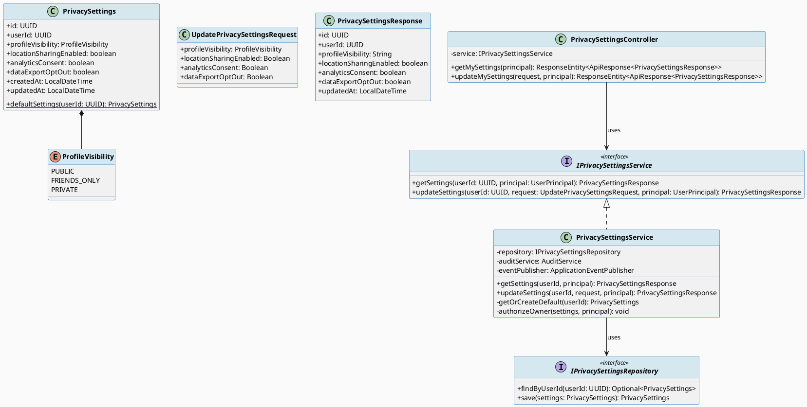
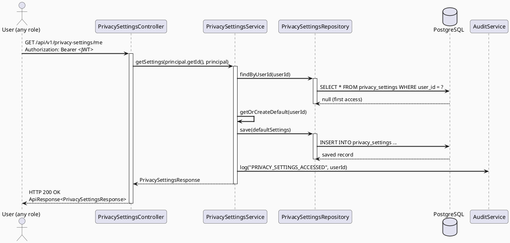
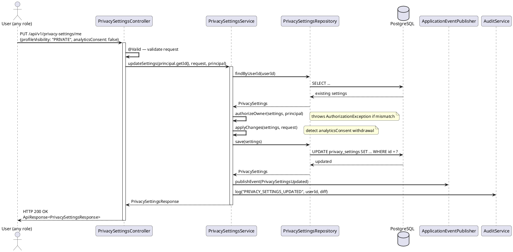
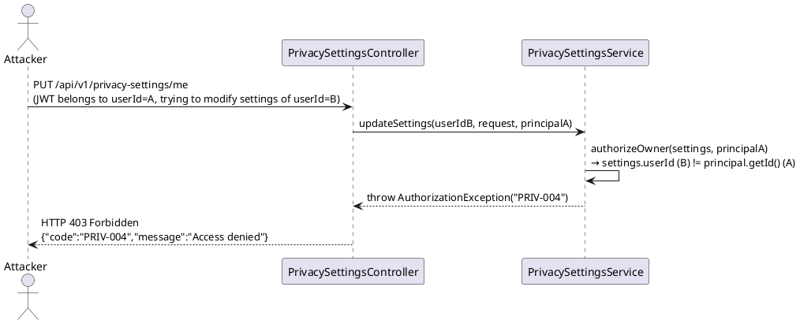
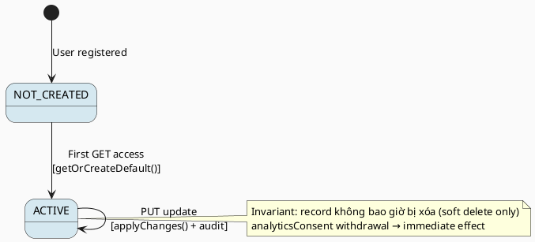

# ENGINEERING DOCUMENTATION STANDARD (EDS) v2.0
# Technical Design Specification — UC-157 Manage Privacy Settings

| Field              | Value                                  |
|--------------------|----------------------------------------|
| **Document ID**    | `CB-PRIV-IMP-001`                      |
| **Version**        | `1.0`                                  |
| **Date**           | `2026-06-26`                           |
| **Status**         | `Draft`                                |
| **Document Owner** | `PhuongNT`                             |
| **Author**         | `AI Agent`                             |
| **Reviewed by**    | `[Tech Lead]`                          |
| **DPO Sign-off**   | `[ ] Pending`                          |
| **Approved by**    | `[Principal Architect]`                |
| **Last Review**    | `2026-06-26`                           |
| **Based on EDS**   | `v2.0`                                 |

---

## CHANGELOG

| Ngày       | Người thực hiện | Nội dung thay đổi                                         |
|------------|-----------------|-----------------------------------------------------------|
| 2026-06-26 | AI Agent        | Tạo tài liệu lần đầu cho UC-157 Manage Privacy Settings  |

---

## MỤC LỤC

1. [Tổng quan Module](#1-tổng-quan-module)
2. [Ma trận Truy vết (Traceability Matrix)](#2-ma-trận-truy-vết-traceability-matrix)
3. [Architecture Decision Records (ADR)](#3-architecture-decision-records-adr)
4. [Non-Functional Requirements & SLA](#4-non-functional-requirements--sla)
5. [Static Modeling (Mô hình Tĩnh)](#5-static-modeling-mô-hình-tĩnh)
6. [Dynamic Modeling (Mô hình Động)](#6-dynamic-modeling-mô-hình-động)
7. [Domain Event Catalog](#7-domain-event-catalog)
8. [Interface Specification (Đặc tả Giao diện)](#8-interface-specification-đặc-tả-giao-diện)
9. [API Specification](#9-api-specification)
10. [Bảng mã lỗi (Error Codes)](#10-bảng-mã-lỗi-error-codes)
11. [Quy trình Triển khai (Step-by-Step)](#11-quy-trình-triển-khai-step-by-step)
12. [Rollback & Incident Runbook](#12-rollback--incident-runbook)
13. [Kịch bản Kiểm thử Chi tiết](#13-kịch-bản-kiểm-thử-chi-tiết)
14. [Phương pháp Xác minh](#14-phương-pháp-xác-minh)
15. [Mẫu thử thực tế (API Verification Samples)](#15-mẫu-thử-thực-tế-api-verification-samples)
16. [Bảng tổng hợp phân quyền (Authorization Matrix)](#16-bảng-tổng-hợp-phân-quyền-authorization-matrix)
17. [AI Prompt Constraints (CASE 2.0)](#17-ai-prompt-constraints-case-20)

---

## 1. Tổng quan Module

| Field                     | Value                                                                                       |
|---------------------------|---------------------------------------------------------------------------------------------|
| **Module Name**           | `ManagePrivacySettings`                                                                     |
| **Bounded Context**       | `privacy`                                                                                   |
| **UC ID**                 | `UC-157`                                                                                    |
| **SRS Reference**         | `3.1.4.1`                                                                                   |
| **Primary Actor**         | `Any authenticated user (ROLE_MOTHER, ROLE_EXPERT, ROLE_ADMIN, ROLE_FAMILY_MEMBER)`        |
| **Platform**              | `Mobile App (Flutter) / Web App`                                                            |
| **Data Classification**   | `Sensitive-PII`                                                                             |
| **Compliance Scope**      | `GDPR Art. 7, Art. 17, Art. 25`                                                            |
| **Upstream Dependencies** | `security (JWT auth), identity (User)`                                                      |
| **Downstream Consumers**  | `audit (AuditLog), analytics (ConsentService)`                                              |

**Mô tả:** Cho phép người dùng đã xác thực xem và cập nhật cài đặt riêng tư của họ bao gồm: ai có thể xem hồ sơ (`profileVisibility`), chia sẻ vị trí (`locationSharingEnabled`), xuất dữ liệu opt-out, và đồng ý phân tích (`analyticsConsent`). Cài đặt được tạo tự động (lazy) khi người dùng truy cập lần đầu với các giá trị mặc định an toàn. Mọi thay đổi được kiểm toán và phát ra domain event `PrivacySettingsUpdated`.

---

## 2. Ma trận Truy vết (Traceability Matrix)

| Requirement ID | Loại          | Mô tả yêu cầu                                         | Thành phần Code                                              | Compliance Target | ADR liên quan |
|----------------|---------------|-------------------------------------------------------|--------------------------------------------------------------|-------------------|---------------|
| UC-157         | Use Case      | Người dùng xem và cập nhật cài đặt riêng tư           | `PrivacySettingsController.getSettings()` / `updateSettings()` | GDPR Art. 7     | ADR-PRIV-001  |
| BR-PRIV-001    | Business Rule | Settings tạo lazy khi lần đầu truy cập với safe defaults | `PrivacySettingsService.getOrCreateDefault()`              | GDPR Art. 25      | ADR-PRIV-001  |
| BR-PRIV-002    | Business Rule | profileVisibility chỉ nhận PUBLIC, FRIENDS_ONLY, PRIVATE | `@Pattern` / `ProfileVisibility` enum                    | GDPR Art. 25      | —             |
| BR-PRIV-003    | Business Rule | Người dùng chỉ được sửa settings của chính họ         | `PrivacySettingsService.authorizeOwner(userId, principal)` | GDPR Art. 25      | ADR-PRIV-002  |
| BR-PRIV-004    | Business Rule | Rút lại analyticsConsent có hiệu lực ngay lập tức     | `PrivacySettingsService.withdrawAnalyticsConsent()`        | GDPR Art. 7.3     | ADR-PRIV-003  |
| BR-PRIV-005    | Business Rule | Mọi thay đổi phải được kiểm toán                     | `AuditService.log(PrivacySettingsUpdated)`                 | GDPR Art. 5.1(e)  | ADR-PRIV-001  |
| BR-PRIV-006    | Business Rule | locationSharingEnabled mặc định là false              | `PrivacySettings.defaultSettings()`                        | GDPR Art. 25      | —             |

---

## 3. Architecture Decision Records (ADR)

### ADR-PRIV-001 — Lazy Creation với Safe-by-Default Settings

| Field       | Value                                 |
|-------------|---------------------------------------|
| **Status**  | `Accepted`                            |
| **Deciders**| `PhuongNT, Tech Lead`                 |
| **Date**    | `2026-06-26`                          |
| **Supersedes** | `—`                                |

#### Bối cảnh (Context)
Không phải mọi người dùng đều cần cài đặt riêng tư ngay khi đăng ký. Tạo settings cho tất cả người dùng ngay khi onboard sẽ tốn tài nguyên không cần thiết. Tuy nhiên, khi người dùng truy cập lần đầu, hệ thống cần phản hồi nhất quán.

#### Các phương án đã xem xét (Options Considered)

| Phương án | Mô tả | Ưu điểm | Nhược điểm |
|-----------|-------|----------|------------|
| A | Tạo settings khi user đăng ký | Luôn sẵn sàng | Tốn storage, phức tạp migration |
| B | Lazy creation — tạo khi GET lần đầu | Tiết kiệm storage, đơn giản | Cần handle null case trong service |

#### Quyết định (Decision)
Chọn **Phương án B** — Lazy creation trong `PrivacySettingsService.getOrCreateDefault()`. Mỗi lần GET, nếu record chưa tồn tại thì tạo mới với safe defaults rồi trả về.

#### Hệ quả (Consequences)

**Tích cực:**
- Không cần migration dữ liệu cũ khi deploy lần đầu.
- Mặc định là privacy-first (GDPR Art. 25 — Privacy by Default).

**Tiêu cực / Trade-offs:**
- GET lần đầu có thể chậm hơn do ghi DB — được giảm thiểu bằng transaction.

**Compliance Impact:**
- GDPR Art. 25: Privacy by Default — mặc định locationSharing=false, analyticsConsent=false.

---

### ADR-PRIV-002 — Ownership Enforcement ở Service Layer

| Field       | Value            |
|-------------|------------------|
| **Status**  | `Accepted`       |
| **Deciders**| `PhuongNT`       |
| **Date**    | `2026-06-26`     |

#### Bối cảnh (Context)
Privacy settings là dữ liệu cá nhân — người dùng không được phép xem/sửa settings của người khác.

#### Quyết định (Decision)
Chọn kiểm tra quyền sở hữu trong Service layer bằng cách so sánh `userId` trong settings với `principal.getId()` từ JWT. Throw `AuthorizationException` nếu không khớp.

#### Hệ quả (Consequences)

**Tích cực:**
- Tập trung logic phân quyền tại một chỗ, dễ audit.

**Tiêu cực / Trade-offs:**
- Cần load settings trước khi kiểm tra quyền — 1 query extra.

---

### ADR-PRIV-003 — Immediate Effect cho Analytics Consent Withdrawal

| Field       | Value            |
|-------------|------------------|
| **Status**  | `Accepted`       |
| **Deciders**| `PhuongNT, DPO`  |
| **Date**    | `2026-06-26`     |

#### Quyết định (Decision)
Khi `analyticsConsent` được set từ `true` → `false`, domain event `PrivacySettingsUpdated` được phát ra với field `analyticsConsentWithdrawn: true`. Analytics service ngừng thu thập dữ liệu ngay lập tức khi nhận event này.

**Compliance Impact:**
- GDPR Art. 7.3: Người dùng có quyền rút lại consent bất kỳ lúc nào với hiệu lực tức thì.

---

## 4. Non-Functional Requirements & SLA

### 4.1. Performance & Availability

| Category     | Requirement              | Target SLA | Measurement Method | Compliance Basis |
|--------------|--------------------------|------------|--------------------|------------------|
| Latency      | GET /privacy-settings    | `< 200ms` (p99) | k6 load test | —          |
| Latency      | PUT /privacy-settings    | `< 300ms` (p99) | k6 load test | —          |
| Availability | Uptime monthly           | `99.9%`    | Uptime monitor     | —                |
| Throughput   | Concurrent requests      | `200 req/s`| Load test          | —                |

### 4.2. Data Integrity & Retention

| Category    | Requirement                    | Target  | Verification Method    | Compliance Basis     |
|-------------|--------------------------------|---------|------------------------|----------------------|
| Durability  | Zero record loss               | RPO = 0 | Transaction log        | GDPR Art. 5.1(f)     |
| Retention   | Audit log retention            | 7 năm   | DB backup policy       | GDPR Art. 5.1(e)     |
| Consistency | Settings ↔ Audit sync          | 100%    | Reconciliation job     | GDPR Art. 7.1        |

### 4.3. Security

| Category             | Requirement         | Target    | Verification Method   | Compliance Basis |
|----------------------|---------------------|-----------|-----------------------|------------------|
| Encryption at rest   | PII fields          | AES-256   | `openssl` CLI check   | GDPR Art. 32     |
| Encryption in transit| All endpoints       | TLS 1.3+  | SSL Labs scan         | GDPR Art. 32     |
| Access control       | Ownership check     | Own only  | Auth Matrix (§16)     | GDPR Art. 25     |

### 4.4. Scalability & Capacity Planning

Dự kiến: 10,000 users, ~500 settings reads/ngày. 1 record/user → bảng nhỏ. Index trên `user_id` đủ đáp ứng yêu cầu.

---

## 5. Static Modeling (Mô hình Tĩnh)

### 5.1. Class Diagram (PlantUML)



### 5.2. Data Structure (PostgreSQL DDL — Flyway)

```sql
-- V[N]__create_privacy_settings_table.sql

CREATE TYPE profile_visibility AS ENUM ('PUBLIC', 'FRIENDS_ONLY', 'PRIVATE');

CREATE TABLE privacy_settings (
    id                      UUID PRIMARY KEY DEFAULT gen_random_uuid(),
    user_id                 UUID NOT NULL UNIQUE,           -- FK to users.id
    profile_visibility      profile_visibility NOT NULL DEFAULT 'FRIENDS_ONLY',
    location_sharing_enabled BOOLEAN NOT NULL DEFAULT FALSE,
    analytics_consent       BOOLEAN NOT NULL DEFAULT FALSE,
    data_export_opt_out     BOOLEAN NOT NULL DEFAULT FALSE,
    created_at              TIMESTAMPTZ NOT NULL DEFAULT NOW(),
    updated_at              TIMESTAMPTZ NOT NULL DEFAULT NOW(),
    CONSTRAINT fk_privacy_settings_user FOREIGN KEY (user_id) REFERENCES users(id) ON DELETE CASCADE
);

CREATE INDEX idx_privacy_settings_user_id ON privacy_settings(user_id);

COMMENT ON TABLE privacy_settings IS 'Per-user privacy preferences. Created lazily on first access.';
COMMENT ON COLUMN privacy_settings.analytics_consent IS 'GDPR Art.7 — explicit consent for analytics. Default FALSE.';
COMMENT ON COLUMN privacy_settings.location_sharing_enabled IS 'GDPR Art.25 — privacy by default. Default FALSE.';
```

---

## 6. Dynamic Modeling (Mô hình Động)

### 6.1. Sequence Diagram — GET Privacy Settings (Happy Path)



### 6.2. Sequence Diagram — PUT Privacy Settings (Happy Path)



### 6.3. Sequence Diagram — Error Path (Unauthorized)



### 6.4. State Machine — Privacy Settings Lifecycle



---

## 7. Domain Event Catalog

### 7.1. Events Published (Phát ra)

| Event Name               | Trigger                         | Publisher                  | Subscriber(s)              | Payload Schema                   | Async? |
|--------------------------|---------------------------------|----------------------------|----------------------------|----------------------------------|--------|
| `PrivacySettingsUpdated` | Sau khi settings được cập nhật  | `PrivacySettingsService`   | `AnalyticsService`, `AuditService` | `PrivacySettingsUpdatedEvent` | No (Spring sync) |

### 7.2. Events Consumed (Tiêu thụ)

| Event Name   | Source        | Handler | Action thực hiện |
|--------------|---------------|---------|-----------------|
| _(none)_     | —             | —       | —               |

### 7.3. Payload Schema

```java
// PrivacySettingsUpdatedEvent.java
public record PrivacySettingsUpdatedEvent(
    String eventId,                    // UUID — deduplicate
    String eventType,                  // "PrivacySettingsUpdated"
    Instant occurredAt,                // Thời điểm phát sinh
    String version,                    // "1.0"
    UUID userId,                       // Chủ sở hữu settings
    ProfileVisibility oldProfileVisibility,
    ProfileVisibility newProfileVisibility,
    boolean analyticsConsentWithdrawn, // true nếu true→false
    boolean locationSharingChanged,
    String correlationId               // X-Correlation-Id từ request
) {}
```

---

## 8. Interface Specification (Đặc tả Giao diện)

### 8.1. Service Interface

```java
// IPrivacySettingsService.java
// @version 1.0
package com.carebridge.backend.privacy.service;

/**
 * Service contract cho module Privacy Settings.
 * @version 1.0
 */
public interface IPrivacySettingsService {

    /**
     * Lấy hoặc tạo mới privacy settings của người dùng hiện tại.
     * Nếu chưa có record, tạo với safe defaults và lưu DB.
     *
     * @param userId    ID của user cần lấy settings
     * @param principal Người dùng đang đăng nhập (từ JWT)
     * @return PrivacySettingsResponse
     * @throws AuthorizationException PRIV-004 nếu userId != principal.id
     */
    PrivacySettingsResponse getSettings(UUID userId, UserPrincipal principal);

    /**
     * Cập nhật privacy settings. Chỉ chủ sở hữu mới được phép.
     * Phát ra PrivacySettingsUpdated sau khi lưu thành công.
     *
     * @param userId    ID của user cần cập nhật
     * @param request   Dữ liệu mới (partial update — null fields giữ nguyên)
     * @param principal Người dùng đang đăng nhập
     * @return PrivacySettingsResponse cập nhật
     * @throws AuthorizationException PRIV-004 nếu userId != principal.id
     * @throws ValidationException    PRIV-001 nếu profileVisibility không hợp lệ
     */
    PrivacySettingsResponse updateSettings(
        UUID userId,
        UpdatePrivacySettingsRequest request,
        UserPrincipal principal
    );
}
```

### 8.2. Repository Interface

```java
// IPrivacySettingsRepository.java
// @version 1.0
package com.carebridge.backend.privacy.repository;

public interface IPrivacySettingsRepository extends JpaRepository<PrivacySettings, UUID> {

    /**
     * Tìm settings theo userId. Trả về empty nếu chưa tạo.
     */
    Optional<PrivacySettings> findByUserId(UUID userId);

    // Không có deleteByUserId() — soft delete only (GDPR compliance)
}
```

---

## 9. API Specification

### 9.1. Endpoints Table

| Method  | Path                           | Auth Level | Required Roles                               | Rate Limit | Idempotent? |
|---------|--------------------------------|------------|----------------------------------------------|------------|-------------|
| `GET`   | `/api/v1/privacy-settings/me`  | JWT Bearer | `ROLE_MOTHER, ROLE_EXPERT, ROLE_ADMIN, ROLE_FAMILY_MEMBER` | 100/min | Yes |
| `PUT`   | `/api/v1/privacy-settings/me`  | JWT Bearer | `ROLE_MOTHER, ROLE_EXPERT, ROLE_ADMIN, ROLE_FAMILY_MEMBER` | 30/min | Yes |

### 9.2. Request / Response Schemas

#### `GET /api/v1/privacy-settings/me` — Lấy settings

**Response — 200 OK:**
```json
{
  "success": true,
  "data": {
    "id": "550e8400-e29b-41d4-a716-446655440000",
    "userId": "user-uuid",
    "profileVisibility": "FRIENDS_ONLY",
    "locationSharingEnabled": false,
    "analyticsConsent": false,
    "dataExportOptOut": false,
    "updatedAt": "2026-06-26T00:00:00.000Z"
  }
}
```

#### `PUT /api/v1/privacy-settings/me` — Cập nhật settings

**Request Body:**
```json
{
  "profileVisibility": "PRIVATE",
  "locationSharingEnabled": false,
  "analyticsConsent": false,
  "dataExportOptOut": true
}
```

**Response — 200 OK:**
```json
{
  "success": true,
  "data": {
    "id": "550e8400-e29b-41d4-a716-446655440000",
    "userId": "user-uuid",
    "profileVisibility": "PRIVATE",
    "locationSharingEnabled": false,
    "analyticsConsent": false,
    "dataExportOptOut": true,
    "updatedAt": "2026-06-26T00:01:00.000Z"
  }
}
```

**Response — 400 Bad Request (Validation Error):**
```json
{
  "success": false,
  "error": {
    "code": "PRIV-001",
    "message": "Dữ liệu không hợp lệ",
    "details": [
      { "field": "profileVisibility", "message": "Must be one of: PUBLIC, FRIENDS_ONLY, PRIVATE" }
    ]
  }
}
```

**Response — 403 Forbidden:**
```json
{
  "success": false,
  "error": {
    "code": "PRIV-004",
    "message": "Bạn không có quyền truy cập cài đặt riêng tư này"
  }
}
```

---

## 10. Bảng mã lỗi (Error Codes)

| Code       | HTTP Status | Message (EN)                              | Message (VI)                                   | Trigger Condition                                |
|------------|-------------|-------------------------------------------|------------------------------------------------|--------------------------------------------------|
| `PRIV-001` | 400         | Validation failed                         | Dữ liệu không hợp lệ                          | profileVisibility không thuộc enum hợp lệ       |
| `PRIV-002` | 404         | Privacy settings not found                | Không tìm thấy cài đặt riêng tư               | Khi truy xuất theo ID không tồn tại             |
| `PRIV-003` | 409         | Conflict                                  | Xung đột dữ liệu                              | Race condition khi tạo settings (retry)          |
| `PRIV-004` | 403         | Access denied to privacy settings         | Bạn không có quyền truy cập cài đặt này       | userId trong path khác với principal.id          |
| `PRIV-005` | 500         | Internal error while saving settings      | Lỗi hệ thống khi lưu cài đặt riêng tư        | DB error trong quá trình save/update             |

---

## 11. Quy trình Triển khai (Step-by-Step)

### 11.1. Prerequisites

- [ ] ADR-PRIV-001, ADR-PRIV-002, ADR-PRIV-003 đã được Accepted
- [ ] DPO đã sign-off (Sensitive-PII module)
- [ ] Blueprint đã được Principal Architect approve
- [ ] Môi trường staging đã sẵn sàng

### 11.2. Pre-Migration Checklist

- [ ] Đã backup DB: `pg_dump -h [host] -U postgres carebridge > backup_20260626.sql`
- [ ] Migration chạy thành công trên staging ≥ 24 giờ
- [ ] Rollback script đã được test
- [ ] DPO đã sign-off migration thêm bảng PII mới

### 11.3. Implementation Steps

#### Chặng 1 — Database Migration

```bash
# Tạo file migration Flyway
# src/main/resources/db/migration/V[N]__create_privacy_settings.sql
# Chạy tự động khi ứng dụng start với Spring Boot + Flyway
./mvnw spring-boot:run
```

#### Chặng 2 — Backend Implementation

Thứ tự tạo file:
1. `privacy/entity/ProfileVisibility.java` — enum
2. `privacy/entity/PrivacySettings.java` — JPA entity
3. `privacy/repository/IPrivacySettingsRepository.java` — interface
4. `privacy/repository/PrivacySettingsRepository.java` — Spring Data impl
5. `privacy/dto/UpdatePrivacySettingsRequest.java` — request DTO với @Valid
6. `privacy/dto/PrivacySettingsResponse.java` — response DTO
7. `privacy/mapper/PrivacySettingsMapper.java` — entity ↔ DTO
8. `privacy/event/PrivacySettingsUpdatedEvent.java` — domain event record
9. `privacy/service/IPrivacySettingsService.java` — service interface
10. `privacy/service/PrivacySettingsService.java` — implementation
11. `privacy/controller/PrivacySettingsController.java` — REST controller

#### Chặng 3 — Verification sau deploy

```bash
# Health check
curl -X GET https://[host]/actuator/health

# Smoke test — lấy settings (tạo lazy)
curl -X GET https://[host]/api/v1/privacy-settings/me \
  -H "Authorization: Bearer [JWT_TOKEN]"
# Expected: 200 với safe defaults

# Kiểm tra audit log
kubectl logs -l app=carebridge-api | grep '"eventType":"PrivacySettingsUpdated"'
```

### 11.4. Deployment Checklist

- [ ] Migration `V[N]__create_privacy_settings.sql` chạy thành công
- [ ] Health check endpoint trả về 200
- [ ] GET /api/v1/privacy-settings/me trả về 200 với defaults
- [ ] Error rate < 1% trong 10 phút đầu
- [ ] Audit log đang sinh ra đúng format
- [ ] DPO được thông báo về deploy thay đổi PII processing

---

## 12. Rollback & Incident Runbook

### 12.1. Điều kiện kích hoạt Rollback

| Điều kiện                      | Ngưỡng                   | Người quyết định      |
|--------------------------------|--------------------------|-----------------------|
| Error rate tăng đột biến       | > 5% trong 5 phút        | On-call Engineer      |
| Latency p99 vượt ngưỡng        | > 2x baseline (600ms)    | On-call Engineer      |
| Dữ liệu không nhất quán        | Bất kỳ case nào          | Tech Lead + DPO       |
| PII data leak trong logs       | Bất kỳ case nào          | DPO + Tech Lead ngay lập tức |

### 12.2. Rollback Procedure

```bash
# Bước 1: Re-deploy phiên bản cũ
kubectl rollout undo deployment/carebridge-api

# Bước 2: Verify rollback
kubectl rollout status deployment/carebridge-api

# Bước 3: Revert migration nếu cần (NGUY HIỂM — chỉ khi bảng mới, không có data)
# psql -c "DROP TABLE IF EXISTS privacy_settings; DROP TYPE IF EXISTS profile_visibility;"

# Bước 4: Smoke test
curl -X GET https://[host]/actuator/health
```

### 12.3. Notification Protocol

| Thời điểm      | Người nhận    | Kênh         | Template                                           |
|----------------|---------------|--------------|---------------------------------------------------|
| Ngay khi phát hiện | On-call   | Slack `#incident` | "🚨 PRIVACY-MODULE incident: [mô tả]"        |
| Trong 30 phút  | DPO           | Email        | Bắt buộc nếu PII bị ảnh hưởng — GDPR Art. 33     |
| Trong 72 giờ   | DPA           | Email        | Nếu có data breach — GDPR Art. 33                 |

### 12.4. Post-Incident Review (PIR)

Hoàn thành PIR trong **48 giờ** sau khi incident resolve, bao gồm: Timeline, Root Cause (5 Whys), Impact (số users, PII exposure), Remediation, Prevention.

---

## 13. Kịch bản Kiểm thử Chi tiết

### 13.1. Unit Tests

#### TC-UNIT-PRIV-001 — GET trả về defaults khi chưa có record

```gherkin
Feature: Manage Privacy Settings
  Background:
    Given test data classification: SYNTHETIC
    And user "user-001" chưa có privacy settings trong DB

  Scenario: Lấy settings lần đầu → tạo với safe defaults
    Given user "user-001" đã đăng nhập với JWT hợp lệ
    When GET /api/v1/privacy-settings/me được gọi
    Then HTTP 200 được trả về
    And response.profileVisibility = "FRIENDS_ONLY"
    And response.locationSharingEnabled = false
    And response.analyticsConsent = false
    And một record mới được tạo trong DB với user_id = "user-001"
```

#### TC-UNIT-PRIV-002 — PUT cập nhật thành công

```gherkin
  Scenario: Cập nhật profileVisibility sang PRIVATE
    Given user "user-001" có settings với profileVisibility = "FRIENDS_ONLY"
    When PUT /api/v1/privacy-settings/me với body {profileVisibility: "PRIVATE"}
    Then HTTP 200 được trả về
    And response.profileVisibility = "PRIVATE"
    And domain event PrivacySettingsUpdated được phát ra
    And audit log chứa entry với userId = "user-001"
```

#### TC-UNIT-PRIV-003 — Validation lỗi profileVisibility không hợp lệ

```gherkin
  Scenario: Gửi profileVisibility không hợp lệ
    Given user "user-001" đã đăng nhập
    When PUT /api/v1/privacy-settings/me với body {profileVisibility: "VISIBLE_TO_ALL"}
    Then HTTP 400 được trả về
    And response.error.code = "PRIV-001"
    And không có thay đổi nào được lưu vào DB
```

### 13.2. Integration Tests

#### TC-INT-PRIV-001 — Luồng hoàn chỉnh GET → PUT → Verify DB

```gherkin
  Scenario: GET tạo defaults, PUT cập nhật, DB phản ánh đúng
    Given test data classification: SYNTHETIC
    And database không có privacy_settings cho user "user-002"
    When GET /api/v1/privacy-settings/me với JWT của "user-002"
    Then HTTP 200, record mới được tạo với safe defaults
    When PUT /api/v1/privacy-settings/me với {analyticsConsent: true}
    Then HTTP 200
    And SELECT analytics_consent FROM privacy_settings WHERE user_id = 'user-002'
    And result = true
    And audit_log chứa 2 entries: ACCESSED + UPDATED
```

### 13.3. Security Tests

#### TC-SEC-PRIV-001 — Unauthorized access vào settings của người khác

```gherkin
  Scenario: User A không thể sửa settings của User B
    Given user "user-A" đã đăng nhập với JWT của A
    And user "user-B" có privacy settings
    When PUT /api/v1/privacy-settings/me được gọi
    Note: /me endpoint luôn lấy userId từ principal → không thể spoof
    Then HTTP 200 chỉ cập nhật settings của user-A (ownership enforced by principal)

  Scenario: Không có JWT → 401
    When GET /api/v1/privacy-settings/me được gọi không có header Authorization
    Then HTTP 401 được trả về
```

---

## 14. Phương pháp Xác minh

### 14.1. Database Inspection

```sql
-- Verify lazy creation
SELECT id, user_id, profile_visibility, location_sharing_enabled, analytics_consent
FROM privacy_settings
WHERE user_id = 'user-uuid';

-- Verify không có PII leak trong log
SELECT query FROM pg_stat_activity
WHERE query ILIKE '%analytics_consent%'
  AND state = 'active';
```

### 14.2. Log / Audit Verification

```bash
# Verify audit log format
kubectl logs -l app=carebridge-api | grep 'PRIVACY_SETTINGS' | head -5

# Kiểm tra không có PII trong log
kubectl logs -l app=carebridge-api | grep -i "profileVisibility\|analyticsConsent" | grep -v '"eventType"'
# Expected: No output (không log raw PII)
```

### 14.3. Tool-based Verification

```bash
# Verify TLS
openssl s_client -connect [host]:443 -tls1_3 2>&1 | grep "Protocol"
# Expected: TLSv1.3

# Verify JWT claims
echo "[JWT]" | cut -d'.' -f2 | base64 -d | jq '.roles'
```

---

## 15. Mẫu thử thực tế (API Verification Samples)

### 15.1. Happy Path

```bash
# GET — Lấy settings (tạo lazy nếu chưa có)
curl -X GET https://[host]/api/v1/privacy-settings/me \
  -H "Authorization: Bearer [JWT_TOKEN]" \
  -H "X-Correlation-Id: $(uuidgen)"
# Expected: 200 với safe defaults

# PUT — Cập nhật settings
curl -X PUT https://[host]/api/v1/privacy-settings/me \
  -H "Authorization: Bearer [JWT_TOKEN]" \
  -H "Content-Type: application/json" \
  -H "X-Correlation-Id: $(uuidgen)" \
  -d '{"profileVisibility":"PRIVATE","analyticsConsent":false,"locationSharingEnabled":false,"dataExportOptOut":true}'
# Expected: 200 với settings mới
```

### 15.2. Error Paths

```bash
# PUT với giá trị enum sai → 400
curl -X PUT https://[host]/api/v1/privacy-settings/me \
  -H "Authorization: Bearer [JWT_TOKEN]" \
  -H "Content-Type: application/json" \
  -d '{"profileVisibility":"INVALID_VALUE"}'
# Expected: 400, code PRIV-001

# GET không có JWT → 401
curl -X GET https://[host]/api/v1/privacy-settings/me
# Expected: 401
```

---

## 16. Bảng tổng hợp phân quyền (Authorization Matrix)

| Endpoint                          | `GUEST` | `ROLE_MOTHER` | `ROLE_EXPERT` | `ROLE_ADMIN` | `ROLE_FAMILY_MEMBER` |
|-----------------------------------|---------|---------------|---------------|--------------|----------------------|
| `GET /api/v1/privacy-settings/me` | ❌       | ✅ Own         | ✅ Own         | ✅ Own        | ✅ Own               |
| `PUT /api/v1/privacy-settings/me` | ❌       | ✅ Own         | ✅ Own         | ✅ Own        | ✅ Own               |

**Chú thích:** `Own` = chỉ cài đặt của chính mình (enforced bởi `/me` endpoint lấy userId từ principal JWT).

---

## 17. AI Prompt Constraints (CASE 2.0)

### 17.1 Constraint Summary Table

| # | Constraint                                                                              | Source (ADR/BR)  | Last Verified |
|---|----------------------------------------------------------------------------------------|------------------|---------------|
| C1 | Service PHẢI gọi `getOrCreateDefault()` trước mọi read operation                    | `ADR-PRIV-001`   | `2026-06-26`  |
| C2 | Service PHẢI gọi `authorizeOwner()` trước mọi write operation; throw `AuthorizationException(PRIV-004)` nếu không khớp | `ADR-PRIV-002` | `2026-06-26` |
| C3 | Khi `analyticsConsent` thay đổi từ true→false, PHẢI phát `PrivacySettingsUpdatedEvent` với `analyticsConsentWithdrawn=true` | `ADR-PRIV-003` | `2026-06-26` |
| C4 | Controller KHÔNG chứa business logic; chỉ validate DTO và delegate sang `IPrivacySettingsService` | `CLAUDE.md`    | `2026-06-26`  |
| C5 | KHÔNG expose JPA entity trong API response; dùng `PrivacySettingsResponse` DTO và `PrivacySettingsMapper` | `CLAUDE.md`  | `2026-06-26`  |
| C6 | Default values: `profileVisibility=FRIENDS_ONLY`, `locationSharingEnabled=false`, `analyticsConsent=false` | `BR-PRIV-006` | `2026-06-26` |

### 17.2 Constraint Injection Block

```
[CONSTRAINT BLOCK — Module: ManagePrivacySettings]
Theo TDS CB-PRIV-IMP-001 và các ADR liên quan:

1. Service PHẢI gọi getOrCreateDefault() trước mọi read — ADR-PRIV-001
2. Service PHẢI gọi authorizeOwner() trước mọi write — throw AuthorizationException(PRIV-004) — ADR-PRIV-002
3. analyticsConsent withdrawal (true→false) PHẢI phát PrivacySettingsUpdatedEvent — ADR-PRIV-003
4. Controller chỉ validate + delegate — không business logic — CLAUDE.md
5. Không expose entity; dùng DTO + mapper — CLAUDE.md
6. Safe defaults: profileVisibility=FRIENDS_ONLY, location=false, analytics=false — BR-PRIV-006

[CONTEXT BLOCK]
- Bounded Context: privacy
- Data Classification: Sensitive-PII
- Compliance: GDPR Art. 7, 17, 25, 32
- Existing interfaces: §8 Service Interface + §8.2 Repository Interface
- Error codes: §10 Error Codes Table
- Auth matrix: §16 Authorization Matrix

[TASK BLOCK]
Implement ManagePrivacySettings thỏa mãn constraints trên.
Output phải tuân thủ §8 Interface Specification.
Tests phải cover §13 Test Scenarios.
```

### 17.3 Constraint Quality Checklist

- [x] Mỗi constraint traceable về ADR hoặc BR cụ thể
- [x] Không có constraint generic
- [x] Mỗi constraint có `Last Verified` date ≤ 2 sprints
- [x] Constraint block có ≥ 5 constraints cụ thể
- [x] Constraint block reference §8 Interface
- [x] Constraint block reference §16 Auth Matrix

### 17.4 Anti-Pattern Detection

| AP-ID     | Anti-Pattern          | Dấu hiệu                              | Hành động                          |
|-----------|-----------------------|---------------------------------------|------------------------------------|
| AP-AI-001 | Unconstrained Gen     | Code không match C1-C6                | Reject — inject lại constraints    |
| AP-AI-003 | Implicit Decision     | Code assume architecture không có ADR | Reject — viết ADR trước            |
| AP-AI-005 | Hallucinated Contract | Import service không có trong §8      | Reject — verify contract existence |

---

## PHỤ LỤC

### A. Glossary

| Thuật ngữ          | Định nghĩa                                                                 |
|--------------------|---------------------------------------------------------------------------|
| Lazy Creation      | Tạo record DB lần đầu khi được truy cập, không phải khi user đăng ký     |
| Safe Default       | Giá trị mặc định tuân thủ Privacy by Default (GDPR Art. 25)               |
| Analytics Consent  | Sự đồng ý rõ ràng của người dùng cho việc thu thập dữ liệu phân tích     |
| profileVisibility  | Enum kiểm soát ai có thể xem hồ sơ người dùng                             |
| Append-only        | Không DELETE record — chỉ UPDATE (audit trail)                             |

### B. Tài liệu tham chiếu

| Document               | Link / Path                                        |
|------------------------|----------------------------------------------------|
| GDPR Art. 7 (Consent)  | https://gdpr-info.eu/art-7-gdpr/                  |
| GDPR Art. 25 (Privacy by Default) | https://gdpr-info.eu/art-25-gdpr/      |
| CareBridge CLAUDE.md   | `d:\SEP490\CareBridge_SEP490_G79\CLAUDE.md`        |
| EDS Template           | `08_References/Template/PHASE-3_TDS.md`            |
