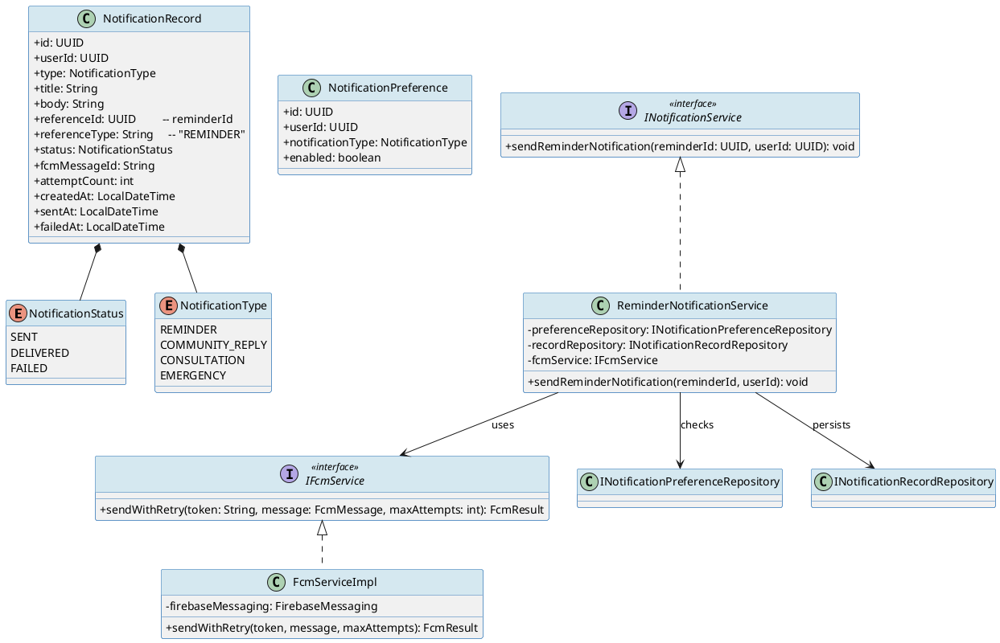
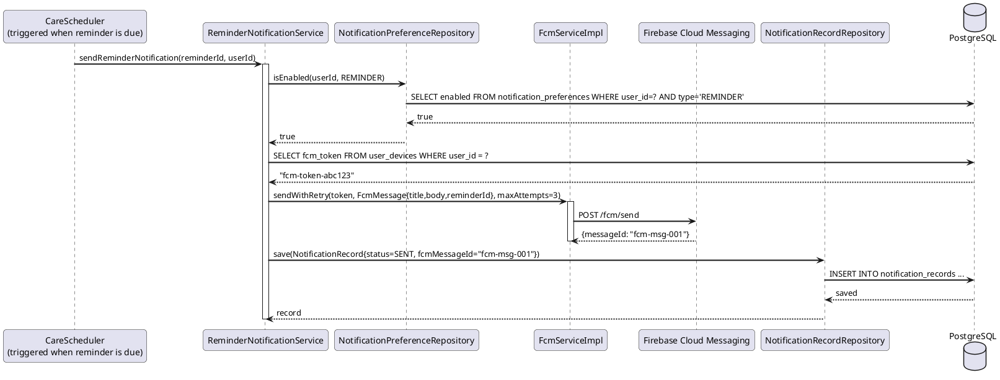
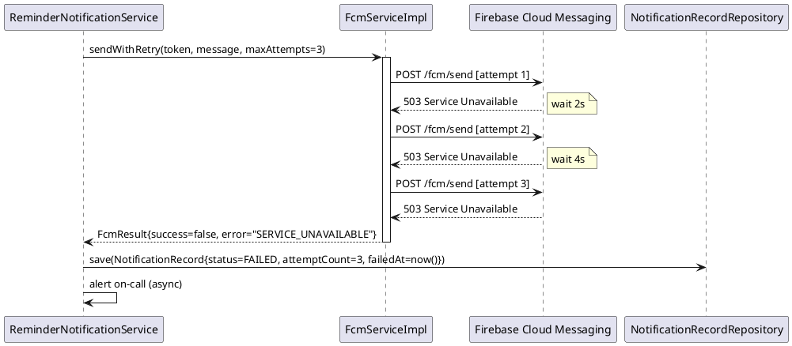
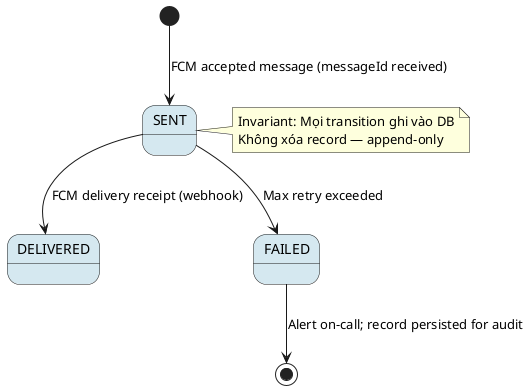

# ENGINEERING DOCUMENTATION STANDARD (EDS) v2.0
# Technical Design Specification — UC-158 Receive Reminder Notification

| Field              | Value                                     |
|--------------------|-------------------------------------------|
| **Document ID**    | `CB-NOTIF-IMP-001`                        |
| **Version**        | `1.0`                                     |
| **Date**           | `2026-06-26`                              |
| **Status**         | `Approved`                                |
| **Document Owner** | `PhuongNT`                                |
| **Author**         | `AI Agent`                                |
| **Reviewed by**    | `[Tech Lead]`                             |
| **DPO Sign-off**   | `[ ] Pending`                             |
| **Approved by**    | `[Principal Architect]`                   |
| **Last Review**    | `2026-06-26`                              |
| **Based on EDS**   | `v2.0`                                    |

---

## CHANGELOG

| Ngày       | Người thực hiện | Nội dung thay đổi                                            |
|------------|-----------------|--------------------------------------------------------------|
| 2026-06-26 | AI Agent        | Tạo tài liệu lần đầu cho UC-158 Receive Reminder Notification |

---

## MỤC LỤC

1. [Tổng quan Module](#1-tổng-quan-module)
2. [Ma trận Truy vết](#2-ma-trận-truy-vết-traceability-matrix)
3. [Architecture Decision Records (ADR)](#3-architecture-decision-records-adr)
4. [Non-Functional Requirements & SLA](#4-non-functional-requirements--sla)
5. [Static Modeling](#5-static-modeling-mô-hình-tĩnh)
6. [Dynamic Modeling](#6-dynamic-modeling-mô-hình-động)
7. [Domain Event Catalog](#7-domain-event-catalog)
8. [Interface Specification](#8-interface-specification-đặc-tả-giao-diện)
9. [API Specification](#9-api-specification)
10. [Bảng mã lỗi](#10-bảng-mã-lỗi-error-codes)
11. [Quy trình Triển khai](#11-quy-trình-triển-khai-step-by-step)
12. [Rollback & Incident Runbook](#12-rollback--incident-runbook)
13. [Kịch bản Kiểm thử Chi tiết](#13-kịch-bản-kiểm-thử-chi-tiết)
14. [Phương pháp Xác minh](#14-phương-pháp-xác-minh)
15. [Mẫu thử thực tế](#15-mẫu-thử-thực-tế-api-verification-samples)
16. [Bảng tổng hợp phân quyền](#16-bảng-tổng-hợp-phân-quyền-authorization-matrix)
17. [AI Prompt Constraints (CASE 2.0)](#17-ai-prompt-constraints-case-20)

---

## 1. Tổng quan Module

| Field                     | Value                                                                                  |
|---------------------------|----------------------------------------------------------------------------------------|
| **Module Name**           | `ReminderNotification`                                                                 |
| **Bounded Context**       | `notification`                                                                         |
| **UC ID**                 | `UC-158`                                                                               |
| **SRS Reference**         | `3.1.5.1`                                                                              |
| **Primary Actor**         | `User (passive recipient — ROLE_MOTHER)`                                               |
| **Secondary Actor**       | `Firebase Cloud Messaging (FCM)`                                                       |
| **Platform**              | `Mobile App (Flutter) — push notification`                                             |
| **Data Classification**   | `Internal`                                                                             |
| **Compliance Scope**      | `N/A`                                                                                  |
| **Upstream Dependencies** | `care (Reminder entity), identity (User FCM token), notification.preferences`         |
| **Downstream Consumers**  | `audit (AuditLog), notification.history`                                               |

**Mô tả:** Khi một care reminder đến hạn, hệ thống gửi push notification đến thiết bị người dùng qua Firebase Cloud Messaging. Notification chỉ được gửi nếu người dùng đã bật thông báo loại `REMINDER`. Khi FCM delivery thất bại, hệ thống retry tối đa 3 lần với exponential backoff. Mỗi notification được lưu với trạng thái `SENT | DELIVERED | FAILED`.

---

## 2. Ma trận Truy vết (Traceability Matrix)

| Requirement ID  | Loại          | Mô tả yêu cầu                                            | Thành phần Code                                        | Compliance Target | ADR liên quan  |
|-----------------|---------------|----------------------------------------------------------|--------------------------------------------------------|-------------------|----------------|
| UC-158          | Use Case      | Gửi push notification khi reminder đến hạn              | `ReminderNotificationService.sendReminderNotification()` | —               | ADR-NOTIF-001  |
| BR-NOTIF-001    | Business Rule | Chỉ gửi nếu user có notifications enabled cho REMINDER  | `NotificationPreferenceService.isEnabled(userId, REMINDER)` | —           | ADR-NOTIF-002  |
| BR-NOTIF-002    | Business Rule | FCM delivery failure → retry tối đa 3 lần exponential backoff | `FcmRetryService.sendWithRetry()`               | —                 | ADR-NOTIF-003  |
| BR-NOTIF-003    | Business Rule | Notification record lưu status: SENT/DELIVERED/FAILED   | `NotificationRecord.status`                           | —                 | —              |
| BR-NOTIF-004    | Business Rule | Mỗi notification reference reminderId                   | `NotificationRecord.referenceId = reminderId`         | —                 | —              |
| BR-NOTIF-005    | Business Rule | Không gửi notification nếu user không có FCM token      | `FcmService.validateToken()`                          | —                 | —              |

---

## 3. Architecture Decision Records (ADR)

### ADR-NOTIF-001 — FCM làm push notification provider

| Field       | Value                   |
|-------------|-------------------------|
| **Status**  | `Accepted`              |
| **Deciders**| `PhuongNT, Tech Lead`   |
| **Date**    | `2026-06-26`            |

#### Bối cảnh
CareBridge sử dụng Firebase ecosystem. FCM tích hợp native với Flutter SDK và hỗ trợ cả Android/iOS với một API duy nhất.

#### Các phương án đã xem xét

| Phương án | Mô tả                | Ưu điểm          | Nhược điểm           |
|-----------|----------------------|------------------|----------------------|
| A         | FCM (Firebase)       | Free tier, cross-platform, Flutter native | Phụ thuộc Google    |
| B         | OneSignal            | Phân tích tốt hơn | Tốn phí, vendor lock-in thêm |

#### Quyết định
Chọn **FCM** — tích hợp sẵn với Firebase ecosystem đã được dùng cho authentication.

---

### ADR-NOTIF-002 — Notification Preference Gate

| Field       | Value        |
|-------------|--------------|
| **Status**  | `Accepted`   |
| **Date**    | `2026-06-26` |

#### Quyết định
Trước khi gửi FCM, service PHẢI kiểm tra `notification_preferences` bảng để xác nhận user đã bật loại notification này. Nếu tắt → skip silently (không retry, không log error).

---

### ADR-NOTIF-003 — Exponential Backoff Retry (max 3 lần)

| Field       | Value        |
|-------------|--------------|
| **Status**  | `Accepted`   |
| **Date**    | `2026-06-26` |

#### Bối cảnh
FCM delivery có thể thất bại tạm thời. Cần retry strategy phù hợp tránh spam FCM endpoint.

#### Quyết định
Retry 3 lần với backoff: attempt 1 ngay lập tức, attempt 2 sau 2s, attempt 3 sau 4s. Dùng `@Retryable` từ Spring Retry hoặc custom `RetryTemplate`. Sau 3 lần thất bại → status = `FAILED`, alert on-call.

---

## 4. Non-Functional Requirements & SLA

### 4.1. Performance & Availability

| Category     | Requirement                     | Target SLA         | Measurement Method | Compliance Basis |
|--------------|---------------------------------|--------------------|--------------------|------------------|
| Delivery time| Notification sau reminder due   | `< 30s` p95        | System log timing  | —                |
| Availability | FCM delivery success rate       | `≥ 99%` (after retry) | FCM dashboard   | —                |
| Throughput   | Notifications/minute            | `1,000/min`        | Load test          | —                |

### 4.2. Data Integrity & Retention

| Category   | Requirement                        | Target  | Verification Method  | Compliance Basis |
|------------|------------------------------------|---------|----------------------|------------------|
| Durability | notification_records không mất     | RPO = 0 | Transaction          | —                |
| Retention  | Notification history               | 2 năm   | DB cleanup job       | —                |

### 4.3. Security

| Category            | Requirement              | Target      | Verification Method | Compliance Basis |
|---------------------|--------------------------|-------------|---------------------|------------------|
| FCM Service Account | Stored in env/vault only | Not in code | Secret scan CI      | —                |
| Token validation    | FCM token per user       | Validated   | Unit test           | —                |

---

## 5. Static Modeling (Mô hình Tĩnh)

### 5.1. Class Diagram (PlantUML)



### 5.2. Data Structure (PostgreSQL DDL — Flyway)

```sql
-- V[N]__create_notification_tables.sql

CREATE TYPE notification_status AS ENUM ('SENT', 'DELIVERED', 'FAILED');
CREATE TYPE notification_type AS ENUM ('REMINDER', 'COMMUNITY_REPLY', 'CONSULTATION', 'EMERGENCY');

CREATE TABLE notification_records (
    id               UUID PRIMARY KEY DEFAULT gen_random_uuid(),
    user_id          UUID NOT NULL,
    type             notification_type NOT NULL,
    title            VARCHAR(200) NOT NULL,
    body             TEXT NOT NULL,
    reference_id     UUID,                          -- reminderId / questionId / consultationId
    reference_type   VARCHAR(50),                   -- "REMINDER", "COMMUNITY_REPLY", etc.
    status           notification_status NOT NULL DEFAULT 'SENT',
    fcm_message_id   VARCHAR(200),
    attempt_count    INT NOT NULL DEFAULT 0,
    created_at       TIMESTAMPTZ NOT NULL DEFAULT NOW(),
    sent_at          TIMESTAMPTZ,
    failed_at        TIMESTAMPTZ,
    CONSTRAINT fk_notif_user FOREIGN KEY (user_id) REFERENCES users(id) ON DELETE CASCADE
);

CREATE TABLE notification_preferences (
    id                UUID PRIMARY KEY DEFAULT gen_random_uuid(),
    user_id           UUID NOT NULL,
    notification_type notification_type NOT NULL,
    enabled           BOOLEAN NOT NULL DEFAULT TRUE,
    updated_at        TIMESTAMPTZ NOT NULL DEFAULT NOW(),
    CONSTRAINT uq_notif_pref UNIQUE (user_id, notification_type),
    CONSTRAINT fk_notif_pref_user FOREIGN KEY (user_id) REFERENCES users(id) ON DELETE CASCADE
);

CREATE INDEX idx_notif_records_user_id ON notification_records(user_id);
CREATE INDEX idx_notif_records_status ON notification_records(status);
CREATE INDEX idx_notif_pref_user_type ON notification_preferences(user_id, notification_type);
```

---

## 6. Dynamic Modeling (Mô hình Động)

### 6.1. Sequence Diagram — Happy Path



### 6.2. Sequence Diagram — FCM Failure + Retry



### 6.3. State Machine — NotificationRecord Status



---

## 7. Domain Event Catalog

### 7.1. Events Published

| Event Name                  | Trigger                         | Publisher                      | Subscriber(s)    | Async? |
|-----------------------------|--------------------------------|--------------------------------|------------------|--------|
| `ReminderNotificationSent`  | FCM delivery thành công        | `ReminderNotificationService`  | `AuditService`   | No     |
| `ReminderNotificationFailed`| Max retry exceeded             | `ReminderNotificationService`  | `AlertService`, `AuditService` | No |

### 7.2. Events Consumed

| Event Name       | Source         | Handler                           | Action thực hiện          |
|------------------|----------------|-----------------------------------|---------------------------|
| `ReminderDue`    | `CareModule`   | `ReminderNotificationEventHandler`| Trigger sendReminderNotification() |

### 7.3. Payload Schema

```java
// ReminderNotificationSentEvent.java
public record ReminderNotificationSentEvent(
    String eventId,
    String eventType,         // "ReminderNotificationSent"
    Instant occurredAt,
    String version,           // "1.0"
    UUID userId,
    UUID reminderId,
    UUID notificationRecordId,
    String fcmMessageId,
    String correlationId
) {}
```

---

## 8. Interface Specification (Đặc tả Giao diện)

### 8.1. Service Interface

```java
// INotificationService.java
// @version 1.0
package com.carebridge.backend.notification.service;

/**
 * Contract cho Reminder Notification service.
 * Triggered internally by scheduler — no HTTP endpoint exposed.
 * @version 1.0
 */
public interface INotificationService {

    /**
     * Gửi push notification khi reminder đến hạn.
     * Kiểm tra preference trước khi gửi.
     * Retry tối đa 3 lần nếu FCM thất bại.
     * Lưu NotificationRecord với status phù hợp.
     *
     * @param reminderId UUID của reminder đến hạn
     * @param userId     UUID của user nhận notification
     * @throws NotificationException NOTIF-005 nếu lỗi hệ thống không recovery được
     */
    void sendReminderNotification(UUID reminderId, UUID userId);
}
```

### 8.2. FCM Service Interface

```java
// IFcmService.java
// @version 1.0
package com.carebridge.backend.notification.service;

public interface IFcmService {

    /**
     * Gửi FCM message với retry logic.
     * Backoff: 0s → 2s → 4s.
     *
     * @param fcmToken   Device FCM token của user
     * @param message    FcmMessage (title, body, data payload)
     * @param maxAttempts Số lần retry tối đa (3)
     * @return FcmResult{success, messageId, error}
     */
    FcmResult sendWithRetry(String fcmToken, FcmMessage message, int maxAttempts);
}
```

### 8.3. Repository Interfaces

```java
// INotificationRecordRepository.java
public interface INotificationRecordRepository extends JpaRepository<NotificationRecord, UUID> {
    List<NotificationRecord> findByUserIdAndType(UUID userId, NotificationType type);
    List<NotificationRecord> findByStatus(NotificationStatus status);
}

// INotificationPreferenceRepository.java
public interface INotificationPreferenceRepository extends JpaRepository<NotificationPreference, UUID> {
    Optional<NotificationPreference> findByUserIdAndNotificationType(UUID userId, NotificationType type);
}
```

---

## 9. API Specification

> UC-158 là **system-triggered** (scheduler → service). Không có external HTTP endpoint.
> API bên dưới là internal admin endpoint để kiểm tra notification history.

### 9.1. Endpoints Table

| Method | Path                                        | Auth Level | Required Roles    | Rate Limit | Idempotent? |
|--------|---------------------------------------------|------------|-------------------|------------|-------------|
| `GET`  | `/api/v1/notifications/me`                  | JWT Bearer | Tất cả roles      | 60/min     | Yes         |
| `PATCH`| `/api/v1/notifications/preferences`         | JWT Bearer | Tất cả roles      | 30/min     | Yes         |

### 9.2. Request / Response Schemas

#### `GET /api/v1/notifications/me` — Lấy lịch sử notifications

**Response — 200 OK:**
```json
{
  "success": true,
  "data": [
    {
      "id": "uuid",
      "type": "REMINDER",
      "title": "Nhắc uống vitamin",
      "body": "Đã đến giờ uống vitamin bổ sung của bạn",
      "status": "SENT",
      "createdAt": "2026-06-26T08:00:00Z"
    }
  ]
}
```

#### `PATCH /api/v1/notifications/preferences` — Cập nhật preference

**Request:**
```json
{
  "notificationType": "REMINDER",
  "enabled": false
}
```

**Response — 200 OK:**
```json
{
  "success": true,
  "data": {
    "notificationType": "REMINDER",
    "enabled": false,
    "updatedAt": "2026-06-26T00:00:00Z"
  }
}
```

---

## 10. Bảng mã lỗi (Error Codes)

| Code        | HTTP Status | Message (EN)                      | Message (VI)                              | Trigger Condition                               |
|-------------|-------------|-----------------------------------|-------------------------------------------|-------------------------------------------------|
| `NOTIF-001` | 400         | Invalid notification type         | Loại thông báo không hợp lệ              | notificationType không thuộc enum               |
| `NOTIF-002` | 404         | Notification record not found     | Không tìm thấy bản ghi thông báo         | ID notification không tồn tại                  |
| `NOTIF-003` | 404         | FCM token not found for user      | Thiết bị người dùng chưa đăng ký FCM     | user không có FCM token                         |
| `NOTIF-004` | 403         | Access denied                     | Không có quyền truy cập                  | User xem notification của người khác           |
| `NOTIF-005` | 500         | FCM delivery failed after retries | Gửi thông báo thất bại sau nhiều lần thử | Max 3 retry đều thất bại                        |
| `NOTIF-006` | 500         | Internal notification error       | Lỗi hệ thống thông báo                   | Unexpected exception trong service              |

---

## 11. Quy trình Triển khai (Step-by-Step)

### 11.1. Prerequisites

- [ ] ADR-NOTIF-001, 002, 003 đã Accepted
- [ ] Firebase project setup và Service Account JSON đã được lưu trong Vault/env
- [ ] `FIREBASE_SERVICE_ACCOUNT_JSON` env var được set trong CI/CD

### 11.2. Pre-Migration Checklist

- [ ] Backup DB production trước khi chạy migration
- [ ] Migration V[N]__create_notification_tables.sql đã test trên staging ≥ 24 giờ
- [ ] Firebase connectivity test từ staging environment thành công

### 11.3. Implementation Steps

#### Chặng 1 — Database Migration

```bash
# Flyway tự chạy khi start app
./mvnw spring-boot:run
# Verify: psql -c "\d notification_records"
```

#### Chặng 2 — Firebase SDK Setup

```xml
<!-- pom.xml -->
<dependency>
    <groupId>com.google.firebase</groupId>
    <artifactId>firebase-admin</artifactId>
    <version>9.x.x</version>
</dependency>
```

```java
// FirebaseConfig.java
@Configuration
public class FirebaseConfig {
    @Bean
    public FirebaseApp firebaseApp() throws IOException {
        FileInputStream serviceAccount = new FileInputStream(
            System.getenv("FIREBASE_SERVICE_ACCOUNT_PATH"));
        FirebaseOptions options = FirebaseOptions.builder()
            .setCredentials(GoogleCredentials.fromStream(serviceAccount))
            .build();
        return FirebaseApp.initializeApp(options);
    }
}
```

#### Chặng 3 — Implementation Order

1. `notification/entity/NotificationType.java` — enum
2. `notification/entity/NotificationStatus.java` — enum
3. `notification/entity/NotificationRecord.java`
4. `notification/entity/NotificationPreference.java`
5. `notification/repository/INotificationRecordRepository.java`
6. `notification/repository/INotificationPreferenceRepository.java`
7. `notification/dto/FcmMessage.java` / `FcmResult.java`
8. `notification/service/IFcmService.java` + `FcmServiceImpl.java`
9. `notification/service/INotificationService.java` + `ReminderNotificationService.java`
10. `notification/controller/NotificationController.java`

#### Chặng 4 — Scheduler Integration

```java
// Trong CareModule — khi reminder is due:
applicationEventPublisher.publishEvent(new ReminderDueEvent(reminderId, userId));
// Hoặc gọi trực tiếp:
notificationService.sendReminderNotification(reminderId, userId);
```

### 11.4. Deployment Checklist

- [ ] `FIREBASE_SERVICE_ACCOUNT_PATH` env var set
- [ ] Notification tables tạo thành công
- [ ] Test FCM connectivity từ staging
- [ ] Error rate < 1% sau 10 phút đầu

---

## 12. Rollback & Incident Runbook

### 12.1. Điều kiện kích hoạt Rollback

| Điều kiện                    | Ngưỡng                   | Người quyết định   |
|------------------------------|--------------------------|--------------------|
| FCM failure rate cao         | > 10% trong 5 phút       | On-call Engineer   |
| Notification spam (duplicate)| Bất kỳ duplicate nào     | Tech Lead          |
| DB write failure             | > 1% trong 5 phút        | On-call Engineer   |

### 12.2. Rollback Procedure

```bash
# Re-deploy phiên bản cũ
kubectl rollout undo deployment/carebridge-api

# Verify
kubectl rollout status deployment/carebridge-api

# Smoke test
curl -X GET https://[host]/actuator/health
```

### 12.3. Notification Protocol

| Thời điểm     | Người nhận  | Kênh              | Template                                          |
|---------------|-------------|-------------------|---------------------------------------------------|
| Ngay khi phát | On-call     | Slack `#incident` | "🚨 NOTIFICATION FCM failure rate: [X]%"         |
| Nếu data breach | DPO       | Email             | GDPR Art. 33 — trong 72 giờ                      |

---

## 13. Kịch bản Kiểm thử Chi tiết

### 13.1. Unit Tests

#### TC-UNIT-NOTIF-001 — Gửi thành công khi preference enabled

```gherkin
Feature: Reminder Notification
  Background:
    Given test data classification: SYNTHETIC

  Scenario: User có REMINDER preference enabled → FCM gửi thành công
    Given user "user-001" có notification preference REMINDER = enabled
    And user-001 có FCM token "device-token-abc"
    When sendReminderNotification(reminder-uuid, user-001-uuid) được gọi
    Then FcmService.sendWithRetry() được gọi 1 lần
    And NotificationRecord được lưu với status = SENT
    And NotificationRecord.referenceId = reminder-uuid
```

#### TC-UNIT-NOTIF-002 — Skip khi preference disabled

```gherkin
  Scenario: User tắt REMINDER notification → không gửi
    Given user "user-002" có notification preference REMINDER = disabled
    When sendReminderNotification(reminder-uuid, user-002-uuid) được gọi
    Then FcmService.sendWithRetry() KHÔNG được gọi
    And KHÔNG có NotificationRecord nào được lưu
```

#### TC-UNIT-NOTIF-003 — FCM retry 3 lần rồi FAILED

```gherkin
  Scenario: FCM thất bại 3 lần → status = FAILED
    Given FCM luôn trả về 503 cho tất cả attempts
    When sendReminderNotification() được gọi
    Then FcmService.sendWithRetry() được gọi với maxAttempts = 3
    And NotificationRecord được lưu với status = FAILED
    And NotificationRecord.attemptCount = 3
    And alert được trigger
```

### 13.2. Integration Tests

#### TC-INT-NOTIF-001 — End-to-end: scheduler → FCM → DB

```gherkin
  Scenario: Full flow với FCM mock
    Given PostgreSQL Testcontainer running
    And FCM mock server setup
    And user-001 có preference REMINDER = enabled và FCM token
    When sendReminderNotification() được gọi
    Then 1 row trong notification_records với status = 'SENT'
    And row.reference_id = reminderId
    And row.fcm_message_id != null
```

---

## 14. Phương pháp Xác minh

### 14.1. Database Inspection

```sql
-- Verify notification record được tạo
SELECT id, user_id, type, status, fcm_message_id, attempt_count
FROM notification_records
WHERE user_id = 'user-uuid'
ORDER BY created_at DESC LIMIT 5;

-- Verify preference check
SELECT enabled FROM notification_preferences
WHERE user_id = 'user-uuid' AND notification_type = 'REMINDER';
```

### 14.2. FCM Verification

```bash
# Kiểm tra FCM service account được load
kubectl logs -l app=carebridge-api | grep "FirebaseApp initialized"

# Kiểm tra FCM send log
kubectl logs -l app=carebridge-api | grep '"eventType":"ReminderNotificationSent"'
```

---

## 15. Mẫu thử thực tế (API Verification Samples)

```bash
# Lấy notification history
curl -X GET https://[host]/api/v1/notifications/me \
  -H "Authorization: Bearer [JWT_TOKEN]"
# Expected: 200 với list notifications

# Tắt REMINDER notification
curl -X PATCH https://[host]/api/v1/notifications/preferences \
  -H "Authorization: Bearer [JWT_TOKEN]" \
  -H "Content-Type: application/json" \
  -d '{"notificationType":"REMINDER","enabled":false}'
# Expected: 200

# Trigger notification manually (admin/test endpoint)
curl -X POST https://[host]/api/v1/internal/notifications/test-reminder \
  -H "Authorization: Bearer [ADMIN_JWT]" \
  -d '{"userId":"user-uuid","reminderId":"reminder-uuid"}'
```

---

## 16. Bảng tổng hợp phân quyền (Authorization Matrix)

| Endpoint                              | `GUEST` | `ROLE_MOTHER` | `ROLE_EXPERT` | `ROLE_ADMIN` | `SYSTEM` |
|---------------------------------------|---------|---------------|---------------|--------------|----------|
| `GET /api/v1/notifications/me`        | ❌       | ✅ Own         | ✅ Own         | ✅ All        | ✅ All   |
| `PATCH /api/v1/notifications/preferences` | ❌   | ✅ Own         | ✅ Own         | ✅ All        | ✅ All   |
| `sendReminderNotification()` (internal)| ❌      | ❌             | ❌             | ❌            | ✅       |

---

## 17. AI Prompt Constraints (CASE 2.0)

### 17.1 Constraint Summary Table

| # | Constraint                                                                                  | Source          | Last Verified |
|---|---------------------------------------------------------------------------------------------|-----------------|---------------|
| C1 | Service PHẢI kiểm tra `notification_preferences` trước khi gọi FCM — skip silently nếu disabled | `ADR-NOTIF-002` | `2026-06-26` |
| C2 | FCM sendWithRetry PHẢI dùng exponential backoff: 0s, 2s, 4s với maxAttempts = 3           | `ADR-NOTIF-003` | `2026-06-26` |
| C3 | Sau mỗi attempt (thành công hoặc thất bại), PHẢI lưu NotificationRecord với status đúng   | `BR-NOTIF-003`  | `2026-06-26` |
| C4 | Firebase Service Account KHÔNG được hardcode trong code — đọc từ env var                  | Security policy | `2026-06-26` |
| C5 | Controller chỉ expose notification history và preference — sendReminderNotification() là internal-only | `CLAUDE.md` | `2026-06-26` |

### 17.2 Constraint Injection Block

```
[CONSTRAINT BLOCK — Module: ReminderNotification]
Theo TDS CB-NOTIF-IMP-001 và ADR liên quan:

1. Kiểm tra notification_preferences TRƯỚC khi gọi FCM; skip nếu disabled — ADR-NOTIF-002
2. FCM retry: exponential backoff 0s/2s/4s, maxAttempts=3 — ADR-NOTIF-003
3. Luôn lưu NotificationRecord với status SENT/FAILED và attemptCount — BR-NOTIF-003
4. Firebase Service Account từ env var, KHÔNG hardcode — Security
5. sendReminderNotification() là internal method, không expose HTTP endpoint trực tiếp — CLAUDE.md

[CONTEXT BLOCK]
- Bounded Context: notification
- Data Classification: Internal
- Existing interfaces: §8 Service Interface + FCM Interface
- Error codes: §10
- Auth matrix: §16

[TASK BLOCK]
Implement ReminderNotificationService.sendReminderNotification() thỏa mãn constraints.
```

### 17.3 Constraint Quality Checklist

- [x] Mỗi constraint traceable về ADR hoặc BR
- [x] Không có constraint generic
- [x] Constraint block ≥ 5 constraints cụ thể
- [x] Reference §8 Interface và §16 Auth Matrix

### 17.4 Anti-Pattern Detection

| AP-ID | Anti-Pattern | Dấu hiệu | Hành động |
|-------|-------------|-----------|----------|
| AP-AI-001 | Unconstrained Gen | Code không match constraint C1-C5 | Reject — inject lại constraints |
| AP-AI-003 | Implicit Decision | Code assume architecture không có ADR | Reject — viết ADR trước |
| AP-AI-005 | Hallucinated Contract | Code import không có trong §8 | Reject — verify contract |

---

## PHỤ LỤC

### A. Glossary

| Thuật ngữ          | Định nghĩa                                                    |
|--------------------|---------------------------------------------------------------|
| FCM                | Firebase Cloud Messaging — dịch vụ push notification của Google |
| Exponential Backoff| Tăng thời gian chờ theo hàm mũ giữa các lần retry            |
| Notification Record| Bản ghi lịch sử mỗi notification đã được gửi/thất bại        |
| Preference Gate    | Kiểm tra preference trước khi gửi — tránh spam               |

### B. Tài liệu tham chiếu

| Document              | Link / Path                                  |
|-----------------------|----------------------------------------------|
| Firebase Admin SDK    | https://firebase.google.com/docs/admin/setup |
| FCM HTTP v1 API       | https://firebase.google.com/docs/cloud-messaging/send-message |
| Spring Retry          | https://docs.spring.io/spring-retry/docs/current/reference/ |
| CareBridge CLAUDE.md  | `d:\SEP490\CareBridge_SEP490_G79\CLAUDE.md`  |
