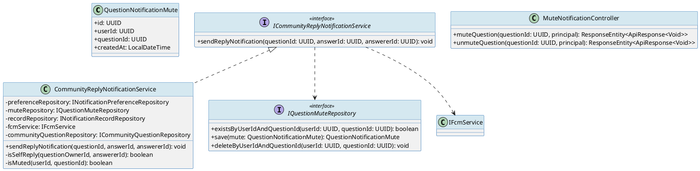
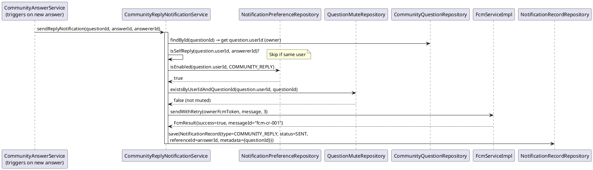
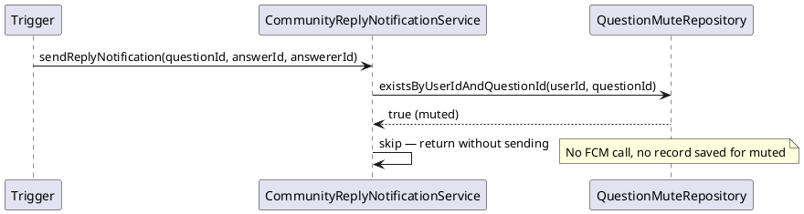

# ENGINEERING DOCUMENTATION STANDARD (EDS) v2.0
# Technical Design Specification — UC-159 Receive Community Reply Notification

| Field              | Value                                              |
|--------------------|----------------------------------------------------|
| **Document ID**    | `CB-NOTIF-IMP-002`                                 |
| **Version**        | `1.0`                                              |
| **Date**           | `2026-06-26`                                       |
| **Status**         | `Draft`                                            |
| **Document Owner** | `PhuongNT`                                         |
| **Author**         | `AI Agent`                                         |
| **Reviewed by**    | `[Tech Lead]`                                      |
| **DPO Sign-off**   | `[ ] Pending`                                      |
| **Approved by**    | `[Principal Architect]`                            |
| **Last Review**    | `2026-06-26`                                       |
| **Based on EDS**   | `v2.0`                                             |

---

## CHANGELOG

| Ngày       | Người thực hiện | Nội dung thay đổi                                                   |
|------------|-----------------|---------------------------------------------------------------------|
| 2026-06-26 | AI Agent        | Tạo tài liệu lần đầu cho UC-159 Receive Community Reply Notification |

---

## MỤC LỤC

1. [Tổng quan Module](#1-tổng-quan-module)
2. [Ma trận Truy vết](#2-ma-trận-truy-vết-traceability-matrix)
3. [Architecture Decision Records (ADR)](#3-architecture-decision-records-adr)
4. [Non-Functional Requirements & SLA](#4-non-functional-requirements--sla)
5. [Static Modeling](#5-static-modeling-mô-hình-tĩnh)
6. [Dynamic Modeling](#6-dynamic-modeling-mô-hình-động)
7. [Domain Event Catalog](#7-domain-event-catalog)
8. [Interface Specification](#8-interface-specification-đặc-tả-giao-diện)
9. [API Specification](#9-api-specification)
10. [Bảng mã lỗi](#10-bảng-mã-lỗi-error-codes)
11. [Quy trình Triển khai](#11-quy-trình-triển-khai-step-by-step)
12. [Rollback & Incident Runbook](#12-rollback--incident-runbook)
13. [Kịch bản Kiểm thử Chi tiết](#13-kịch-bản-kiểm-thử-chi-tiết)
14. [Phương pháp Xác minh](#14-phương-pháp-xác-minh)
15. [Mẫu thử thực tế](#15-mẫu-thử-thực-tế-api-verification-samples)
16. [Bảng tổng hợp phân quyền](#16-bảng-tổng-hợp-phân-quyền-authorization-matrix)
17. [AI Prompt Constraints (CASE 2.0)](#17-ai-prompt-constraints-case-20)

---

## 1. Tổng quan Module

| Field                     | Value                                                                                 |
|---------------------------|---------------------------------------------------------------------------------------|
| **Module Name**           | `CommunityReplyNotification`                                                          |
| **Bounded Context**       | `notification`                                                                        |
| **UC ID**                 | `UC-159`                                                                              |
| **SRS Reference**         | `3.1.5.2`                                                                             |
| **Primary Actor**         | `Người đăng câu hỏi (passive recipient — ROLE_MOTHER)`                               |
| **Secondary Actor**       | `Firebase Cloud Messaging (FCM)`                                                      |
| **Platform**              | `Mobile App (Flutter) — push notification`                                            |
| **Data Classification**   | `Internal`                                                                            |
| **Compliance Scope**      | `N/A`                                                                                 |
| **Upstream Dependencies** | `community (CommunityQuestion, CommunityAnswer), identity (User FCM token), notification.preferences` |
| **Downstream Consumers**  | `audit (AuditLog), notification.history`                                              |

**Mô tả:** Khi ai đó trả lời câu hỏi cộng đồng của người dùng, hệ thống gửi push notification đến thiết bị chủ câu hỏi qua FCM. Notification chỉ gửi nếu: (1) người dùng bật notification loại `COMMUNITY_REPLY`, và (2) người dùng không mute notification cho câu hỏi cụ thể đó. FCM delivery failure → retry 3 lần exponential backoff. Notification record lưu references đến cả `questionId` và `answerId`.

---

## 2. Ma trận Truy vết (Traceability Matrix)

| Requirement ID  | Loại          | Mô tả yêu cầu                                              | Thành phần Code                                                | Compliance Target | ADR liên quan    |
|-----------------|---------------|-------------------------------------------------------------|----------------------------------------------------------------|-------------------|------------------|
| UC-159          | Use Case      | Gửi notification khi câu hỏi nhận được reply               | `CommunityReplyNotificationService.sendReplyNotification()`   | —                 | ADR-NOTIF-001    |
| BR-NOTIF-CR-001 | Business Rule | Chỉ gửi nếu COMMUNITY_REPLY preference enabled             | `NotificationPreferenceService.isEnabled(userId, COMMUNITY_REPLY)` | —            | ADR-NOTIF-002    |
| BR-NOTIF-CR-002 | Business Rule | Chỉ gửi nếu user chưa mute notification cho questionId     | `QuestionMuteRepository.isMuted(userId, questionId)`          | —                 | ADR-NOTIF-CR-001 |
| BR-NOTIF-CR-003 | Business Rule | Notification reference cả questionId và answerId           | `NotificationRecord.referenceId = answerId`, `metadata.questionId` | —           | —                |
| BR-NOTIF-CR-004 | Business Rule | Không gửi notification cho chính người trả lời (self-reply)| `CommunityReplyNotificationService.isSelfReply()`             | —                 | —                |
| BR-NOTIF-CR-005 | Business Rule | Retry tối đa 3 lần với exponential backoff                 | `FcmServiceImpl.sendWithRetry()`                              | —                 | ADR-NOTIF-003    |

---

## 3. Architecture Decision Records (ADR)

### ADR-NOTIF-CR-001 — Per-Question Mute Feature

| Field       | Value                   |
|-------------|-------------------------|
| **Status**  | `Accepted`              |
| **Deciders**| `PhuongNT, Tech Lead`   |
| **Date**    | `2026-06-26`            |

#### Bối cảnh
Người dùng có thể đặt nhiều câu hỏi và nhận nhiều reply. Họ cần khả năng tắt notification cho một câu hỏi cụ thể mà không tắt toàn bộ COMMUNITY_REPLY notifications.

#### Các phương án đã xem xét

| Phương án | Mô tả                         | Ưu điểm                        | Nhược điểm                      |
|-----------|-------------------------------|--------------------------------|---------------------------------|
| A         | Mute per question             | Granular control               | Thêm bảng `question_mutes`      |
| B         | Global COMMUNITY_REPLY toggle | Đơn giản                       | Không đủ granular               |

#### Quyết định
Chọn **Phương án A** — thêm bảng `question_notification_mutes(userId, questionId)`. Khi reply event xảy ra, kiểm tra cả global preference VÀ per-question mute.

#### Hệ quả

**Tích cực:** Người dùng có control tốt hơn, giảm notification fatigue.
**Tiêu cực:** Thêm 1 query per notification send.

---

### ADR-NOTIF-CR-002 — No Self-Notification Rule

| Field       | Value        |
|-------------|--------------|
| **Status**  | `Accepted`   |
| **Date**    | `2026-06-26` |

#### Quyết định
Nếu người trả lời (answerer) là chủ câu hỏi (question.userId), không gửi notification. Check: `if (answer.userId == question.userId) → skip`.

---

## 4. Non-Functional Requirements & SLA

### 4.1. Performance & Availability

| Category      | Requirement                       | Target SLA    | Measurement Method  |
|---------------|-----------------------------------|---------------|---------------------|
| Delivery time | Notification sau reply được post  | `< 10s` p95   | System log timing   |
| Success rate  | FCM delivery (after retry)        | `≥ 99%`       | FCM dashboard       |

### 4.2. Data Integrity & Retention

| Category   | Requirement                | Target  | Verification   |
|------------|---------------------------|---------|----------------|
| Durability | No notification record loss | RPO=0  | Transaction    |
| Retention  | History                    | 2 năm   | Cleanup job    |

---

## 5. Static Modeling (Mô hình Tĩnh)

### 5.1. Class Diagram (PlantUML)



### 5.2. Data Structure (PostgreSQL DDL — Flyway)

```sql
-- Thêm vào V[N]__create_notification_tables.sql hoặc V[N+1]__add_question_mutes.sql

CREATE TABLE question_notification_mutes (
    id          UUID PRIMARY KEY DEFAULT gen_random_uuid(),
    user_id     UUID NOT NULL,
    question_id UUID NOT NULL,
    created_at  TIMESTAMPTZ NOT NULL DEFAULT NOW(),
    CONSTRAINT uq_question_mute UNIQUE (user_id, question_id),
    CONSTRAINT fk_mute_user FOREIGN KEY (user_id) REFERENCES users(id) ON DELETE CASCADE,
    CONSTRAINT fk_mute_question FOREIGN KEY (question_id) REFERENCES community_questions(id) ON DELETE CASCADE
);

CREATE INDEX idx_question_mutes_user_question ON question_notification_mutes(user_id, question_id);

-- NotificationRecord có thêm metadata JSON cho answerId + questionId
ALTER TABLE notification_records ADD COLUMN metadata JSONB;
-- metadata example: {"questionId": "uuid", "answerId": "uuid"}
```

---

## 6. Dynamic Modeling (Mô hình Động)

### 6.1. Sequence Diagram — Happy Path



### 6.2. Sequence Diagram — Muted Question



---

## 7. Domain Event Catalog

### 7.1. Events Published

| Event Name                   | Trigger                   | Publisher                            | Subscriber(s)  | Async? |
|------------------------------|---------------------------|--------------------------------------|----------------|--------|
| `CommunityReplyNotifSent`    | FCM delivery success      | `CommunityReplyNotificationService`  | `AuditService` | No     |
| `CommunityReplyNotifFailed`  | Max retry exceeded        | `CommunityReplyNotificationService`  | `AlertService` | No     |

### 7.2. Events Consumed

| Event Name        | Source          | Handler                                  | Action                               |
|-------------------|-----------------|------------------------------------------|--------------------------------------|
| `AnswerPosted`    | `CommunityModule`| `CommunityReplyNotifEventHandler`       | Trigger `sendReplyNotification()`    |

---

## 8. Interface Specification (Đặc tả Giao diện)

### 8.1. Service Interface

```java
// ICommunityReplyNotificationService.java
// @version 1.0
package com.carebridge.backend.notification.service;

/**
 * Gửi push notification khi câu hỏi cộng đồng nhận được reply.
 * @version 1.0
 */
public interface ICommunityReplyNotificationService {

    /**
     * Kiểm tra preference + mute, rồi gửi FCM notification đến chủ câu hỏi.
     * Skip nếu: preference disabled, question muted, hoặc self-reply.
     *
     * @param questionId UUID của câu hỏi nhận reply
     * @param answerId   UUID của câu trả lời mới
     * @param answererId UUID của người đăng câu trả lời
     */
    void sendReplyNotification(UUID questionId, UUID answerId, UUID answererId);

    /**
     * Mute notifications cho một câu hỏi cụ thể.
     *
     * @param questionId UUID câu hỏi cần mute
     * @param userId     UUID người dùng muốn mute
     */
    void muteQuestionNotification(UUID questionId, UUID userId);

    /**
     * Unmute notifications cho câu hỏi.
     *
     * @param questionId UUID câu hỏi cần unmute
     * @param userId     UUID người dùng
     */
    void unmuteQuestionNotification(UUID questionId, UUID userId);
}
```

### 8.2. Repository Interfaces

```java
// IQuestionMuteRepository.java
public interface IQuestionMuteRepository extends JpaRepository<QuestionNotificationMute, UUID> {
    boolean existsByUserIdAndQuestionId(UUID userId, UUID questionId);
    void deleteByUserIdAndQuestionId(UUID userId, UUID questionId);
}
```

---

## 9. API Specification

### 9.1. Endpoints Table

| Method   | Path                                               | Auth Level | Required Roles   | Rate Limit | Idempotent? |
|----------|----------------------------------------------------|------------|------------------|------------|-------------|
| `POST`   | `/api/v1/notifications/mute/questions/{questionId}` | JWT Bearer | Tất cả roles     | 60/min     | Yes         |
| `DELETE` | `/api/v1/notifications/mute/questions/{questionId}` | JWT Bearer | Tất cả roles     | 60/min     | Yes         |
| `GET`    | `/api/v1/notifications/me`                          | JWT Bearer | Tất cả roles     | 60/min     | Yes         |

### 9.2. Request / Response Schemas

#### `POST /api/v1/notifications/mute/questions/{questionId}` — Mute câu hỏi

**Response — 200 OK:**
```json
{
  "success": true,
  "data": { "message": "Notifications muted for this question" }
}
```

**Response — 404 Not Found:**
```json
{
  "success": false,
  "error": { "code": "NOTIF-007", "message": "Question not found" }
}
```

#### `DELETE /api/v1/notifications/mute/questions/{questionId}` — Unmute

**Response — 200 OK:**
```json
{
  "success": true,
  "data": { "message": "Notifications unmuted for this question" }
}
```

---

## 10. Bảng mã lỗi (Error Codes)

| Code        | HTTP Status | Message (EN)                   | Message (VI)                             | Trigger Condition                          |
|-------------|-------------|--------------------------------|------------------------------------------|--------------------------------------------|
| `NOTIF-001` | 400         | Invalid notification type      | Loại thông báo không hợp lệ             | notificationType không hợp lệ              |
| `NOTIF-003` | 404         | FCM token not found            | Thiết bị chưa đăng ký FCM               | User không có FCM token                   |
| `NOTIF-004` | 403         | Access denied                  | Không có quyền truy cập                 | Mute câu hỏi của người khác               |
| `NOTIF-005` | 500         | FCM delivery failed            | Gửi thông báo thất bại                  | Max retry exhausted                        |
| `NOTIF-007` | 404         | Question not found             | Câu hỏi không tồn tại                   | questionId không có trong DB              |
| `NOTIF-008` | 409         | Already muted                  | Câu hỏi đã được mute trước đó          | Duplicate mute request                     |

---

## 11. Quy trình Triển khai (Step-by-Step)

### 11.1. Prerequisites

- [ ] UC-158 infrastructure đã hoàn chỉnh (notification_records, notification_preferences)
- [ ] Community module (CommunityQuestion, CommunityAnswer entities) đã hoạt động
- [ ] ADR-NOTIF-CR-001, ADR-NOTIF-CR-002 Accepted

### 11.2. Implementation Steps

#### Chặng 1 — Database Migration (incremental)

```sql
-- V[N+1]__add_question_notification_mutes.sql
CREATE TABLE question_notification_mutes (...);
ALTER TABLE notification_records ADD COLUMN metadata JSONB;
```

#### Chặng 2 — Implementation Order

1. `notification/entity/QuestionNotificationMute.java`
2. `notification/repository/IQuestionMuteRepository.java` + impl
3. `notification/service/ICommunityReplyNotificationService.java`
4. `notification/service/CommunityReplyNotificationService.java`
5. `notification/controller/MuteNotificationController.java`
6. `community/event/AnswerPostedEventHandler.java` — trigger

#### Chặng 3 — Verification

```bash
# Test mute endpoint
curl -X POST https://[host]/api/v1/notifications/mute/questions/{questionId} \
  -H "Authorization: Bearer [JWT]"
# Expected: 200

# Verify DB
psql -c "SELECT * FROM question_notification_mutes WHERE user_id='user-uuid';"
```

### 11.3. Deployment Checklist

- [ ] `question_notification_mutes` table tạo thành công
- [ ] `notification_records.metadata` column added
- [ ] Self-reply guard hoạt động (test manually)
- [ ] Mute/unmute endpoints trả về 200

---

## 12. Rollback & Incident Runbook

### 12.1. Điều kiện kích hoạt Rollback

| Điều kiện             | Ngưỡng         | Người quyết định  |
|-----------------------|----------------|-------------------|
| FCM failure rate cao  | > 10% / 5 min  | On-call Engineer  |
| Duplicate notifications | Bất kỳ       | Tech Lead          |

### 12.2. Rollback Procedure

```bash
kubectl rollout undo deployment/carebridge-api
kubectl rollout status deployment/carebridge-api
# Revert migration nếu cần (chỉ staging)
psql -c "DROP TABLE IF EXISTS question_notification_mutes;"
```

---

## 13. Kịch bản Kiểm thử Chi tiết

### 13.1. Unit Tests

#### TC-UNIT-NOTIFCR-001 — Gửi thành công khi preference enabled và chưa mute

```gherkin
Feature: Community Reply Notification
  Scenario: Reply notification gửi thành công
    Given câu hỏi "q-001" thuộc user "owner-001"
    And user "owner-001" có COMMUNITY_REPLY preference = enabled
    And câu hỏi "q-001" chưa bị mute bởi owner-001
    And người trả lời là "answerer-002" (khác owner)
    When sendReplyNotification("q-001", "answer-001", "answerer-002")
    Then FCM được gọi 1 lần cho owner-001
    And NotificationRecord được lưu với referenceId = "answer-001"
    And metadata chứa questionId = "q-001"
```

#### TC-UNIT-NOTIFCR-002 — Skip khi câu hỏi bị mute

```gherkin
  Scenario: Câu hỏi bị mute → không gửi
    Given "owner-001" đã mute notifications cho question "q-001"
    When sendReplyNotification("q-001", "answer-002", "answerer-003")
    Then FCM KHÔNG được gọi
    And KHÔNG có NotificationRecord được tạo
```

#### TC-UNIT-NOTIFCR-003 — Skip self-reply

```gherkin
  Scenario: Chủ câu hỏi tự trả lời → không gửi
    Given câu hỏi "q-002" thuộc user "owner-002"
    When sendReplyNotification("q-002", "answer-003", "owner-002")
    Then FCM KHÔNG được gọi (self-reply)
```

### 13.2. Integration Tests

#### TC-INT-NOTIFCR-001 — Full flow: answer posted → notification record

```gherkin
  Scenario: Posting an answer triggers notification
    Given PostgreSQL Testcontainer
    And question "q-001" owner = user-001 (preference enabled, not muted)
    When CommunityAnswerService.postAnswer() được gọi bởi user-002
    Then notification_records có 1 row với type='COMMUNITY_REPLY'
    And row.metadata->'questionId' = "q-001"
    And row.metadata->'answerId' = answer-uuid
```

---

## 14. Phương pháp Xác minh

### 14.1. Database Inspection

```sql
-- Verify mute table
SELECT * FROM question_notification_mutes WHERE user_id = 'user-uuid';

-- Verify notification record với metadata
SELECT id, type, status, reference_id, metadata
FROM notification_records
WHERE metadata->>'questionId' = 'question-uuid';
```

---

## 15. Mẫu thử thực tế (API Verification Samples)

```bash
# Mute câu hỏi
curl -X POST https://[host]/api/v1/notifications/mute/questions/{questionId} \
  -H "Authorization: Bearer [JWT]"

# Unmute câu hỏi
curl -X DELETE https://[host]/api/v1/notifications/mute/questions/{questionId} \
  -H "Authorization: Bearer [JWT]"

# Lấy notification list
curl -X GET https://[host]/api/v1/notifications/me \
  -H "Authorization: Bearer [JWT]"
```

---

## 16. Bảng tổng hợp phân quyền (Authorization Matrix)

| Endpoint                                         | `GUEST` | `ROLE_MOTHER` | `ROLE_EXPERT` | `ROLE_ADMIN` |
|--------------------------------------------------|---------|---------------|---------------|--------------|
| `POST /notifications/mute/questions/{id}`        | ❌       | ✅ Own         | ✅ Own         | ✅ All        |
| `DELETE /notifications/mute/questions/{id}`      | ❌       | ✅ Own         | ✅ Own         | ✅ All        |
| `GET /notifications/me`                          | ❌       | ✅ Own         | ✅ Own         | ✅ All        |
| `sendReplyNotification()` (internal)             | ❌       | ❌             | ❌             | ❌ (SYSTEM)   |

---

## 17. AI Prompt Constraints (CASE 2.0)

### 17.1 Constraint Summary Table

| # | Constraint                                                                                      | Source             | Last Verified |
|---|-------------------------------------------------------------------------------------------------|--------------------|---------------|
| C1 | Service PHẢI kiểm tra COMMUNITY_REPLY preference VÀ question mute trước khi gửi FCM          | `ADR-NOTIF-002`, `ADR-NOTIF-CR-001` | `2026-06-26` |
| C2 | Service PHẢI skip nếu answererId == questionOwnerId (self-reply)                              | `ADR-NOTIF-CR-002` | `2026-06-26`  |
| C3 | NotificationRecord.metadata PHẢI chứa cả questionId và answerId                              | `BR-NOTIF-CR-003`  | `2026-06-26`  |
| C4 | Retry logic: exponential backoff 0s/2s/4s, maxAttempts=3 — tái sử dụng FcmServiceImpl       | `ADR-NOTIF-003`    | `2026-06-26`  |
| C5 | Mute/unmute endpoint chỉ cho phép owner của question (authorizeOwner check)                   | `ADR-NOTIF-CR-001` | `2026-06-26`  |

### 17.2 Constraint Injection Block

```
[CONSTRAINT BLOCK — Module: CommunityReplyNotification]
1. Kiểm tra COMMUNITY_REPLY preference VÀ question mute TRƯỚC FCM call — ADR-NOTIF-002, ADR-NOTIF-CR-001
2. Skip self-reply (answerer == questionOwner) — ADR-NOTIF-CR-002
3. NotificationRecord.metadata = {questionId, answerId} — BR-NOTIF-CR-003
4. Tái dùng FcmServiceImpl với maxAttempts=3, backoff 0/2/4s — ADR-NOTIF-003
5. Mute endpoint: check question owner trước khi mute — ADR-NOTIF-CR-001

[CONTEXT BLOCK]
- Bounded Context: notification (community reply sub-type)
- Upstream: community module, notification_preferences, question_notification_mutes
- Error codes: §10
- Auth matrix: §16
```

### 17.3 Constraint Quality Checklist

- [x] Mỗi constraint traceable về ADR hoặc BR cụ thể
- [x] Không có constraint generic
- [x] Constraint block có ≥ 3 constraints cụ thể

### 17.4 Anti-Pattern Detection

| AP-ID     | Anti-Pattern          | Dấu hiệu                        | Hành động              |
|-----------|-----------------------|---------------------------------|------------------------|
| AP-AI-001 | Unconstrained Gen     | Không kiểm tra mute table       | Reject + re-inject C1  |
| AP-AI-003 | Implicit Decision     | Self-reply check không có ADR   | Reject — viết ADR trước|
| AP-AI-005 | Hallucinated Contract | Code import không có trong §8 | Reject — verify contract |

---

## PHỤ LỤC

### A. Glossary

| Thuật ngữ      | Định nghĩa                                                        |
|----------------|-------------------------------------------------------------------|
| Self-reply     | Chủ câu hỏi tự trả lời câu hỏi của mình — không cần notification |
| Question Mute  | Tắt notification riêng cho một câu hỏi cụ thể                   |
| metadata JSONB | Cột JSON trong notification_records lưu context bổ sung          |

### B. Tài liệu tham chiếu

| Document             | Path                                              |
|----------------------|---------------------------------------------------|
| UC-158 TDS           | `04_Implement/UC158_ReceiveReminderNotification/` |
| CareBridge CLAUDE.md | `d:\SEP490\CareBridge_SEP490_G79\CLAUDE.md`       |
