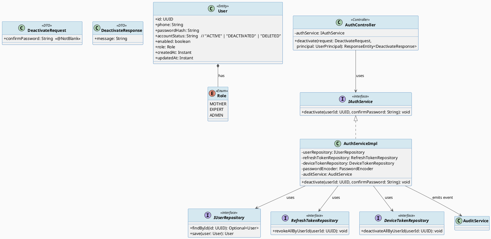
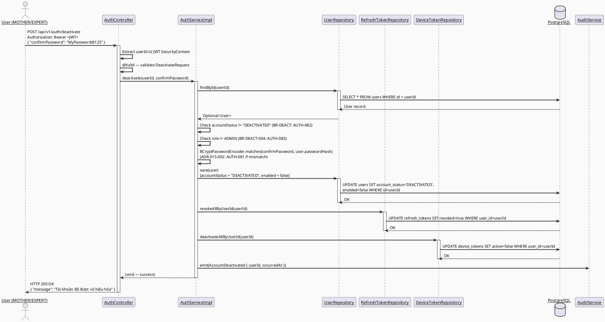
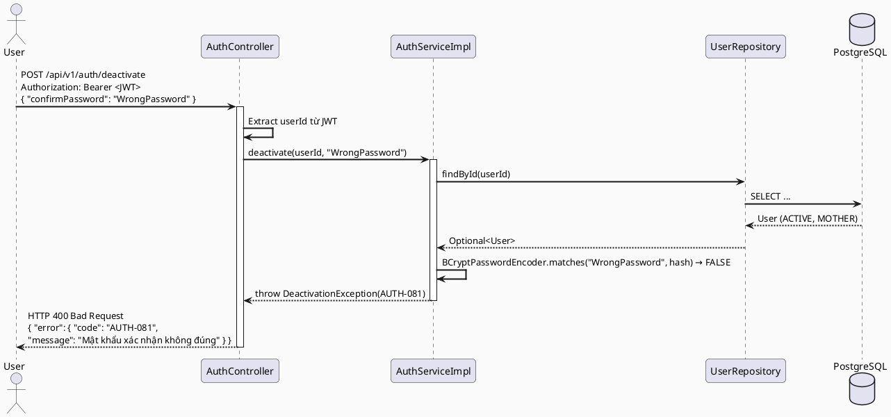
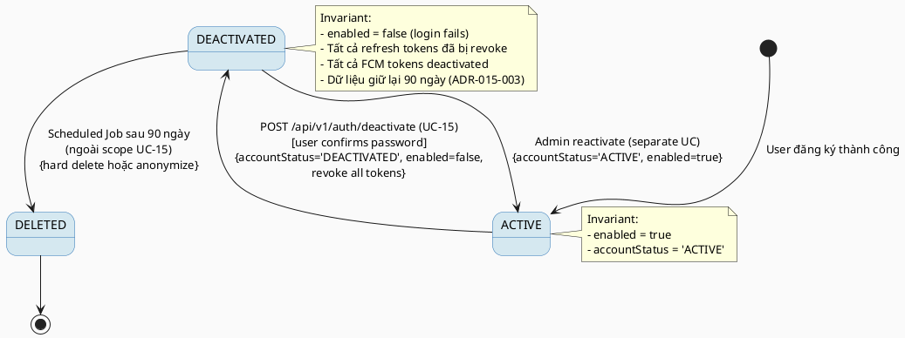

# ENGINEERING DOCUMENTATION STANDARD (EDS) v2.0
# UC15 — Vô hiệu hóa Tài khoản (Deactivate Own Account)

| Field | Value |
|-------|-------|
| **Document ID** | `CB-AUTH-IMP-015` |
| **Version** | `1.0` |
| **Date** | `2026-06-26` |
| **Status** | `Draft` |
| **Document Owner** | `PhuongNT` |
| **Author** | `AI Agent` |
| **Reviewed by** | `[ ] Tech Lead — Pending` |
| **DPO Sign-off** | `[ ] Pending` |
| **Approved by** | `[ ] Principal Architect — Pending` |
| **Last Review** | `2026-06-26` |
| **Based on EDS** | `v2.0` |

---

## CHANGELOG

> **Policy 4.4 — Immutable History:** Không bao giờ xóa thông tin cũ. Mọi thay đổi phải ghi vào bảng này.

| Ngày | Người thực hiện | Nội dung thay đổi |
|------|-----------------|-------------------|
| `2026-06-26` | `AI Agent` | Tạo tài liệu lần đầu — UC15 DeactivateOwnAccount |

---

## MỤC LỤC

1. [Tổng quan Module](#1-tổng-quan-module)
2. [Ma trận Truy vết (Traceability Matrix)](#2-ma-trận-truy-vết-traceability-matrix)
3. [Architecture Decision Records (ADR)](#3-architecture-decision-records-adr)
4. [Non-Functional Requirements & SLA](#4-non-functional-requirements--sla)
5. [Static Modeling (Mô hình Tĩnh)](#5-static-modeling-mô-hình-tĩnh)
6. [Dynamic Modeling (Mô hình Động)](#6-dynamic-modeling-mô-hình-động)
7. [Domain Event Catalog](#7-domain-event-catalog)
8. [Interface Specification (Đặc tả Giao diện)](#8-interface-specification-đặc-tả-giao-diện)
9. [API Specification](#9-api-specification)
10. [Bảng mã lỗi (Error Codes)](#10-bảng-mã-lỗi-error-codes)
11. [Quy trình Triển khai (Step-by-Step)](#11-quy-trình-triển-khai-step-by-step)
12. [Rollback & Incident Runbook](#12-rollback--incident-runbook)
13. [Kịch bản Kiểm thử Chi tiết](#13-kịch-bản-kiểm-thử-chi-tiết)
14. [Phương pháp Xác minh](#14-phương-pháp-xác-minh)
15. [Mẫu thử thực tế (API Verification Samples)](#15-mẫu-thử-thực-tế-api-verification-samples)
16. [Bảng tổng hợp phân quyền (Authorization Matrix)](#16-bảng-tổng-hợp-phân-quyền-authorization-matrix)
17. [AI Prompt Constraints (CASE 2.0)](#17-ai-prompt-constraints-case-20)

---

## 1. Tổng quan Module

> UC-15: User (ROLE_MOTHER hoặc ROLE_EXPERT) tự vô hiệu hóa tài khoản của mình (soft delete). Sau khi vô hiệu hóa, tài khoản sẽ được xóa vĩnh viễn sau 90 ngày bởi scheduled job (ngoài phạm vi UC-15).

| Field | Value |
|-------|-------|
| **Module Name** | `DeactivateOwnAccount` |
| **Bounded Context** | `Security / Identity & Access Management` |
| **Package** | `com.carebridge.backend.security` |
| **Data Classification** | `PII` |
| **Compliance Scope** | `PDPA — 90-day retention window` |
| **Upstream Dependencies** | `IAM Module (JWT), RefreshTokenRepository, DeviceTokenRepository, AuditService` |
| **Downstream Consumers** | `Scheduled Deletion Job (ngoài UC-15 scope), Admin Reactivation UC (ngoài UC-15 scope)` |

---

## 2. Ma trận Truy vết (Traceability Matrix)

> Ánh xạ trực tiếp: [Mã yêu cầu] → [Thành phần Code] → [Mục tiêu Tuân thủ].

| Requirement ID | Loại (BR/ADR/US) | Mô tả yêu cầu | Thành phần Code | Compliance Target | ADR liên quan |
|----------------|------------------|---------------|-----------------|-------------------|---------------|
| BR-DEACT-001 | Business Rule | Yêu cầu xác thực lại mật khẩu trước khi deactivate | `AuthServiceImpl.deactivate()` — BCrypt verify | Security best practice | ADR-015-002 |
| BR-DEACT-002 | Business Rule | Thu hồi tất cả refresh tokens và FCM tokens ngay lập tức | `RefreshTokenRepository.revokeAllByUserId()`, `DeviceTokenRepository.deactivateAllByUserId()` | Security | ADR-015-004 |
| BR-DEACT-003 | Business Rule | Dữ liệu được giữ lại 90 ngày trước khi xóa vĩnh viễn | `ScheduledDeletionJob` (ngoài scope UC-15) | PDPA compliance | ADR-015-003 |
| BR-DEACT-004 | Business Rule | Tài khoản ADMIN không thể tự deactivate qua endpoint này | `AuthServiceImpl.deactivate()` — role check | Security | ADR-015-001 |
| SRS-§3.1.1.15 | User Story | User self-deactivates account (soft delete) | `AuthController.deactivate()`, `AuthServiceImpl.deactivate()` | — | — |

---

## 3. Architecture Decision Records (ADR)

> ⭐ Ghi lại lý do đằng sau mỗi quyết định kiến trúc quan trọng.

### ADR-015-001 — POST method cho deactivation (không dùng DELETE)

| Field | Value |
|-------|-------|
| **Status** | `Accepted` |
| **Deciders** | `PhuongNT — Backend Lead` |
| **Date** | `2026-06-26` |
| **Supersedes** | `N/A` |

#### Bối cảnh (Context)
Cần chọn HTTP method phù hợp cho endpoint deactivation. DELETE có thể trực quan hơn nhưng mang ngữ nghĩa "xóa ngay lập tức" theo HTTP spec.

#### Các phương án đã xem xét (Options Considered)

| Phương án | Mô tả | Ưu điểm | Nhược điểm |
|-----------|-------|----------|------------|
| A | `DELETE /api/v1/auth/account` | Trực quan về mặt semantic HTTP | - Ngụ ý xóa ngay lập tức; - Không phù hợp với soft delete + 90-day retention; - Idempotency expectations khác |
| B | `POST /api/v1/auth/deactivate` | Rõ ràng là "action/command", không phải "resource deletion" | - Ít RESTful hơn theo convention |
| C | `PATCH /api/v1/auth/account` với `{ "status": "DEACTIVATED" }` | RESTful resource update | - Quá generic, không capture intent "deactivate"; - Cho phép arbitrary status change |

#### Quyết định (Decision)
Chọn **Phương án B** — `POST /api/v1/auth/deactivate` vì đây là state transition có side effects phức tạp (revoke tokens, FCM, emit event), không phải đơn giản xóa resource.

#### Hệ quả (Consequences)

**Tích cực:**
- Endpoint name rõ ràng intent
- Không gây nhầm lẫn về idempotency (POST không idempotent)
- Consistent với `POST /api/v1/auth/logout`, `POST /api/v1/auth/change-password`

**Tiêu cực / Trade-offs:**
- Ít RESTful hơn so với DELETE — trade-off được chấp nhận vì clarity > convention

**Compliance Impact:**
- Không ảnh hưởng PDPA — retention policy được handle ở scheduled job layer

---

### ADR-015-002 — Yêu cầu xác thực lại mật khẩu (Password Re-authentication)

| Field | Value |
|-------|-------|
| **Status** | `Accepted` |
| **Deciders** | `PhuongNT — Backend Lead` |
| **Date** | `2026-06-26` |
| **Supersedes** | `N/A` |

#### Bối cảnh (Context)
Deactivation là hành động không thể hoàn tác dễ dàng. Nếu JWT bị đánh cắp, kẻ tấn công có thể deactivate tài khoản nạn nhân.

#### Các phương án đã xem xét (Options Considered)

| Phương án | Mô tả | Ưu điểm | Nhược điểm |
|-----------|-------|----------|------------|
| A | Chỉ cần JWT hợp lệ | Đơn giản | Dễ bị tấn công nếu token bị đánh cắp |
| B | Yêu cầu `confirmPassword` trong request body | Defense-in-depth; consistent với change-password flow | Thêm 1 bước cho user; BCrypt có latency |

#### Quyết định (Decision)
Chọn **Phương án B** — yêu cầu `confirmPassword`, same reasoning as `ADR-AUTH-031` for change-password. Latency tăng nhưng chấp nhận được (< 500ms với BCrypt 12 rounds).

#### Hệ quả (Consequences)

**Tích cực:**
- Defense-in-depth: stolen token không đủ để deactivate
- Consistent với existing password change flow

**Tiêu cực / Trade-offs:**
- BCrypt verification tăng latency ~200-300ms — mitigate bằng SLA 500ms target

**Compliance Impact:**
- Reduces risk of unauthorized account termination

---

### ADR-015-003 — 90-day Retention Window trước khi xóa vĩnh viễn

| Field | Value |
|-------|-------|
| **Status** | `Accepted` |
| **Deciders** | `PhuongNT — Backend Lead, DPO` |
| **Date** | `2026-06-26` |
| **Supersedes** | `N/A` |

#### Bối cảnh (Context)
PDPA yêu cầu cân nhắc về quyền lợi người dùng và dữ liệu. User có thể muốn reactivate trong thời gian ngắn.

#### Các phương án đã xem xét (Options Considered)

| Phương án | Mô tả | Ưu điểm | Nhược điểm |
|-----------|-------|----------|------------|
| A | Xóa ngay lập tức | Đơn giản | Vi phạm PDPA recovery window; không thể reactivate |
| B | Soft delete với 30-day retention | Ngắn hơn | Có thể chưa đủ cho user hối hận |
| C | Soft delete với 90-day retention | PDPA compliance; thời gian hợp lý để reactivate | Giữ dữ liệu lâu hơn |

#### Quyết định (Decision)
Chọn **Phương án C** — 90-day retention window. Scheduled deletion job sẽ xóa vĩnh viễn sau 90 ngày.

#### Hệ quả (Consequences)

**Tích cực:**
- PDPA compliance
- User có thể liên hệ support để reactivate trong 90 ngày

**Tiêu cực / Trade-offs:**
- Cần scheduled job (ngoài scope UC-15)
- Data được giữ thêm 90 ngày sau deactivation

**Compliance Impact:**
- Aligns với PDPA right-to-erasure interpretation

---

### ADR-015-004 — Thu hồi tất cả tokens ngay lập tức khi deactivate

| Field | Value |
|-------|-------|
| **Status** | `Accepted` |
| **Deciders** | `PhuongNT — Backend Lead` |
| **Date** | `2026-06-26` |
| **Supersedes** | `N/A` |

#### Bối cảnh (Context)
Sau khi deactivate, user không nên có thể tiếp tục dùng ứng dụng với session cũ.

#### Các phương án đã xem xét (Options Considered)

| Phương án | Mô tả | Ưu điểm | Nhược điểm |
|-----------|-------|----------|------------|
| A | Chờ JWT tự expire (15 phút) | Không cần thêm code | Up to 15 phút user vẫn có thể dùng app |
| B | Revoke tất cả refresh tokens + FCM ngay lập tức | Immediate effect trên tất cả devices | Cần thêm DB write |

#### Quyết định (Decision)
Chọn **Phương án B** — revoke ngay lập tức. Security > convenience. Consistent với logout flow.

#### Hệ quả (Consequences)

**Tích cực:**
- Immediate security effect
- Consistent với logout behavior

**Tiêu cực / Trade-offs:**
- Current JWT vẫn valid đến expiry (15 phút) nếu không dùng token blacklist — acceptable trade-off

**Compliance Impact:**
- Reduces risk of continued access after deactivation

---

## 4. Non-Functional Requirements & SLA

### 4.1. Performance & Availability

| Category | Requirement | Target SLA | Measurement Method | Compliance Basis |
|----------|-------------|------------|---------------------|------------------|
| Latency | API response (p99) — BCrypt verify + DB write | `< 500ms` | k6 load test | ADR-015-002 |
| Availability | Uptime (monthly) | `99.9%` | Uptime monitor | — |
| Throughput | Concurrent deactivation requests | `50 req/s` | Load test (low frequency use case) | — |

### 4.2. Data Integrity & Retention

| Category | Requirement | Target | Verification Method | Compliance Basis |
|----------|-------------|--------|---------------------|------------------|
| Durability | Zero record loss on deactivation | RPO = 0 | Transaction log | PDPA |
| Retention | Deactivated user data | 90 ngày | Scheduled job audit | ADR-015-003 |
| Consistency | accountStatus ↔ enabled ↔ tokens sync | 100% atomic | `@Transactional` | BR-DEACT-002 |
| Audit Retention | ACCOUNT_DEACTIVATED event | 7 năm | DB backup policy | Internal policy |

### 4.3. Security

| Category | Requirement | Target | Verification Method | Compliance Basis |
|----------|-------------|--------|---------------------|------------------|
| Re-auth | Password confirmation | BCrypt 12 rounds | Test TC-DEACT-001 | ADR-015-002 |
| Token revocation | All refresh + FCM tokens | 100% revoked | DB assertion | ADR-015-004 |
| ADMIN protection | ADMIN cannot self-deactivate | 403 enforced | Test TC-DEACT-004 | BR-DEACT-004 |
| Encryption in transit | All endpoints | TLS 1.3+ | SSL Labs scan | PDPA |

### 4.4. Scalability & Capacity Planning

> Deactivation là low-frequency operation. Dự kiến < 100 deactivations/ngày. BCrypt latency là bottleneck — scale bằng async password verify nếu cần.

---

## 5. Static Modeling (Mô hình Tĩnh)

### 5.1. Class Diagram (PlantUML)



### 5.2. Data Structure

> **Không cần Flyway migration mới.** `users` table đã có `account_status` và `enabled` columns.

```sql
-- Verify: columns ĐÃ TỒN TẠI trong bảng users
-- Không tạo migration mới cho UC-15

-- Kiểm tra cấu trúc hiện tại:
SELECT column_name, data_type, is_nullable
FROM information_schema.columns
WHERE table_name = 'users'
  AND column_name IN ('account_status', 'enabled');

-- Expected output:
-- account_status | character varying | NO
-- enabled        | boolean           | NO
```

---

## 6. Dynamic Modeling (Mô hình Động)

### 6.1. Sequence Diagram — Happy Path (PlantUML)



### 6.2. Sequence Diagram — Error Path (PlantUML)



### 6.3. State Machine — Account Status



---

## 7. Domain Event Catalog

### 7.1. Events Published (Phát ra)

| Event Name | Trigger | Publisher | Subscriber(s) | Payload Schema | Async? |
|------------|---------|-----------|---------------|----------------|--------|
| `AccountDeactivated` | User deactivates own account | `AuthServiceImpl` | `AuditService` | `AccountDeactivated.java` | No (synchronous audit) |

### 7.2. Events Consumed (Tiêu thụ)

| Event Name | Source | Handler | Action thực hiện |
|------------|--------|---------|------------------|
| _(UC-15 không consume events)_ | — | — | — |

### 7.3. Payload Schema

```java
// AccountDeactivated.java
public record AccountDeactivated(
    UUID    eventId,          // UUID.randomUUID() — dùng để deduplicate
    String  eventType,        // "ACCOUNT_DEACTIVATED"
    Instant occurredAt,       // Instant.now()
    String  version,          // "1.0"
    Payload payload,
    Metadata metadata
) {
    public record Payload(
        UUID   userId,        // User bị deactivate
        String previousStatus // "ACTIVE" — trạng thái trước đó
    ) {}

    public record Metadata(
        UUID   correlationId, // Dùng để trace request
        String causedBy       // userId (self-deactivation)
    ) {}
}
```

---

## 8. Interface Specification (Đặc tả Giao diện)

### 8.1. Service Interface

```java
// DeactivateRequest.java — Input DTO
// @version 1.0
public class DeactivateRequest {
    @NotBlank(message = "Mật khẩu xác nhận không được để trống")
    private String confirmPassword;   // Mật khẩu hiện tại để xác thực lại

    // getters / setters
    public String getConfirmPassword() { return confirmPassword; }
    public void setConfirmPassword(String confirmPassword) {
        this.confirmPassword = confirmPassword;
    }
}

// DeactivateResponse.java — Output DTO
public class DeactivateResponse {
    private String message;  // "Tài khoản đã được vô hiệu hóa"

    public DeactivateResponse(String message) { this.message = message; }
    public String getMessage() { return message; }
}

// IAuthService.java — Service Contract (deactivate method)
// @version 1.0
public interface IAuthService {
    /**
     * Vô hiệu hóa tài khoản của người dùng hiện tại.
     * Thu hồi tất cả refresh tokens và FCM tokens ngay lập tức.
     * Emit audit event ACCOUNT_DEACTIVATED.
     *
     * @throws DeactivationException (AUTH-081) khi confirmPassword không khớp
     * @throws DeactivationException (AUTH-082) khi tài khoản đã DEACTIVATED
     * @throws DeactivationException (AUTH-083) khi role là ADMIN
     */
    void deactivate(UUID userId, String confirmPassword);
}
```

### 8.2. Repository Interface

```java
// IUserRepository.java — existing interface, add query if needed
// @version 1.0
public interface IUserRepository extends JpaRepository<User, UUID> {

    Optional<User> findById(UUID id);

    // Dùng @Modifying nếu cần direct update (optimize cho bulk)
    @Modifying
    @Query("UPDATE User u SET u.accountStatus = :status, u.enabled = :enabled WHERE u.id = :userId")
    void updateAccountStatusAndEnabled(
        @Param("userId") UUID userId,
        @Param("status") String status,
        @Param("enabled") boolean enabled
    );
}

// RefreshTokenRepository.java — existing, add method
public interface RefreshTokenRepository extends JpaRepository<RefreshToken, UUID> {
    @Modifying
    @Query("UPDATE RefreshToken rt SET rt.revoked = true WHERE rt.userId = :userId")
    void revokeAllByUserId(@Param("userId") UUID userId);
}

// DeviceTokenRepository.java — existing, add method
public interface DeviceTokenRepository extends JpaRepository<DeviceToken, UUID> {
    @Modifying
    @Query("UPDATE DeviceToken dt SET dt.active = false WHERE dt.userId = :userId")
    void deactivateAllByUserId(@Param("userId") UUID userId);
}
```

---

## 9. API Specification

### 9.1. Endpoints Table

| Method | Path | Auth Level | Required Roles | Rate Limit | Idempotent? |
|--------|------|------------|----------------|------------|-------------|
| `POST` | `/api/v1/auth/deactivate` | JWT Bearer | `ROLE_MOTHER, ROLE_EXPERT` | 3/hour | No |

### 9.2. Request / Response Schemas

#### `POST /api/v1/auth/deactivate` — Vô hiệu hóa tài khoản

**Request Headers:**
```
Authorization: Bearer <JWT_TOKEN>
Content-Type: application/json
```

**Request Body:**
```json
{
  "confirmPassword": "MyPassword@123"
}
```

**Response — 200 OK (Happy Path):**
```json
{
  "message": "Tài khoản đã được vô hiệu hóa"
}
```

**Response — 400 Bad Request (AUTH-081 — Wrong password):**
```json
{
  "error": {
    "code": "AUTH-081",
    "message": "Mật khẩu xác nhận không đúng"
  }
}
```

**Response — 400 Bad Request (AUTH-082 — Already deactivated):**
```json
{
  "error": {
    "code": "AUTH-082",
    "message": "Tài khoản đã bị vô hiệu hóa trước đó"
  }
}
```

**Response — 403 Forbidden (AUTH-083 — Admin cannot deactivate):**
```json
{
  "error": {
    "code": "AUTH-083",
    "message": "Tài khoản Admin không thể tự vô hiệu hóa qua endpoint này"
  }
}
```

**Response — 401 Unauthorized (No JWT):**
```json
{
  "error": {
    "code": "IAM-001",
    "message": "Authentication required"
  }
}
```

---

## 10. Bảng mã lỗi (Error Codes)

| Code | HTTP Status | Message (EN) | Message (VI) | Trigger Condition |
|------|-------------|--------------|--------------|-------------------|
| `AUTH-081` | 400 | Wrong password confirmation | Mật khẩu xác nhận không đúng | `confirmPassword` không khớp với `user.passwordHash` |
| `AUTH-082` | 400 | Account already deactivated | Tài khoản đã bị vô hiệu hóa trước đó | `user.accountStatus == "DEACTIVATED"` |
| `AUTH-083` | 403 | Admin accounts cannot self-deactivate | Tài khoản Admin không thể tự vô hiệu hóa | `user.role == Role.ADMIN` |
| `IAM-001` | 401 | Authentication required | Yêu cầu đăng nhập | Không có JWT Bearer token trong header |

---

## 11. Quy trình Triển khai (Step-by-Step)

### 11.1. Prerequisites

- [ ] ADR-015-001 through ADR-015-004 đã được Accepted
- [ ] DPO đã sign-off (module xử lý PII — account data)
- [ ] Xác nhận `users` table đã có `account_status` và `enabled` columns
- [ ] Môi trường staging đã sẵn sàng

### 11.2. Pre-Migration Checklist

> ⚠️ **Không có Flyway migration mới cho UC-15.** `users` table đã có đủ columns.
> Chỉ verify columns tồn tại trước khi implement.

- [ ] Verify `account_status` column tồn tại trong `users` table trên staging
- [ ] Verify `enabled` column tồn tại trong `users` table trên staging
- [ ] Verify `refresh_tokens` table và method `revokeAllByUserId` khả thi
- [ ] Verify `device_tokens` table và method `deactivateAllByUserId` khả thi

### 11.3. Implementation Steps

#### Chặng 1 — Tạo DTO classes

```java
// File: src/main/java/com/carebridge/backend/security/dto/DeactivateRequest.java
// File: src/main/java/com/carebridge/backend/security/dto/DeactivateResponse.java
// (Xem §8.1 cho implementation đầy đủ)
```

#### Chặng 2 — Thêm method vào IAuthService

```java
// File: src/main/java/com/carebridge/backend/security/service/IAuthService.java
// Thêm method signature: void deactivate(UUID userId, String confirmPassword);
```

#### Chặng 3 — Implement AuthServiceImpl.deactivate()

```java
// File: src/main/java/com/carebridge/backend/security/service/AuthServiceImpl.java

@Override
@Transactional
public void deactivate(UUID userId, String confirmPassword) {
    // Step 1: Load user
    User user = userRepository.findById(userId)
        .orElseThrow(() -> new EntityNotFoundException("User not found"));

    // Step 2: Check ADMIN role (AUTH-083)
    if (user.getRole() == Role.ADMIN) {
        throw new DeactivationException("AUTH-083", "Admin accounts cannot self-deactivate");
    }

    // Step 3: Check already deactivated (AUTH-082)
    if ("DEACTIVATED".equals(user.getAccountStatus())) {
        throw new DeactivationException("AUTH-082", "Account already deactivated");
    }

    // Step 4: Verify password (AUTH-081) — ADR-015-002
    if (!passwordEncoder.matches(confirmPassword, user.getPasswordHash())) {
        throw new DeactivationException("AUTH-081", "Wrong password confirmation");
    }

    // Step 5: Set BOTH fields atomically (C3 constraint)
    user.setAccountStatus("DEACTIVATED");
    user.setEnabled(false);
    userRepository.save(user);

    // Step 6: Revoke all tokens (ADR-015-004)
    refreshTokenRepository.revokeAllByUserId(userId);
    deviceTokenRepository.deactivateAllByUserId(userId);

    // Step 7: Emit audit event (C5 constraint)
    auditService.emit(new AccountDeactivated(
        UUID.randomUUID(),
        "ACCOUNT_DEACTIVATED",
        Instant.now(),
        "1.0",
        new AccountDeactivated.Payload(userId, "ACTIVE"),
        new AccountDeactivated.Metadata(UUID.randomUUID(), userId.toString())
    ));
}
```

#### Chặng 4 — Thêm endpoint vào AuthController

```java
// File: src/main/java/com/carebridge/backend/security/controller/AuthController.java

@PostMapping("/deactivate")
public ResponseEntity<DeactivateResponse> deactivate(
        @Valid @RequestBody DeactivateRequest request,
        @AuthenticationPrincipal UserPrincipal principal) {
    authService.deactivate(principal.getUserId(), request.getConfirmPassword());
    return ResponseEntity.ok(new DeactivateResponse("Tài khoản đã được vô hiệu hóa"));
}
```

#### Chặng 5 — Verification sau deploy

```bash
# Kiểm tra nhanh sau khi deploy
curl -X GET https://[host]/api/v1/health
# Expected: {"status": "ok"}
```

### 11.4. Deployment Checklist

- [ ] Không có Flyway migration mới — columns đã tồn tại
- [ ] Health check endpoint trả về 200
- [ ] Error rate < 1% trong 10 phút đầu
- [ ] Audit log đang sinh ra event `ACCOUNT_DEACTIVATED` đúng format
- [ ] DPO thông báo về deploy (module xử lý PII)

---

## 12. Rollback & Incident Runbook

### 12.1. Điều kiện kích hoạt Rollback

| Điều kiện | Ngưỡng | Người quyết định |
|-----------|--------|------------------|
| Error rate tăng đột biến | > 5% trong 5 phút | On-call Engineer |
| Latency p99 vượt ngưỡng | > 500ms (BCrypt baseline) liên tục | On-call Engineer |
| User bị deactivate sai | Bất kỳ case không hợp lệ | Tech Lead + DPO |
| Token không được revoke | Bất kỳ case deactivation | On-call Engineer |

### 12.2. Rollback Procedure

```bash
# UC-15 không tạo migration mới — rollback chỉ là revert code

# Bước 1: Revert implementation files
git checkout -- 05_Development/CareBridgeAPI/src/main/java/com/carebridge/backend/security/service/AuthServiceImpl.java
git checkout -- 05_Development/CareBridgeAPI/src/main/java/com/carebridge/backend/security/controller/AuthController.java
git checkout -- 05_Development/CareBridgeAPI/src/main/java/com/carebridge/backend/security/dto/

# Bước 2: Nếu user bị deactivate sai — reactivate thủ công
psql -h $DB_HOST -U $DB_USER -d $DB_NAME \
  -c "UPDATE users SET account_status='ACTIVE', enabled=true WHERE id='<userId>';"

# Bước 3: Restore revoked tokens (nếu cần — tùy case)
psql -h $DB_HOST -U $DB_USER -d $DB_NAME \
  -c "UPDATE refresh_tokens SET revoked=false WHERE user_id='<userId>';"

# Bước 4: Re-deploy phiên bản cũ
kubectl rollout undo deployment/carebridge-api

# Bước 5: Verify rollback
kubectl rollout status deployment/carebridge-api
curl -X GET https://[host]/api/v1/health
```

### 12.3. Notification Protocol

| Thời điểm | Người nhận | Kênh | Template |
|-----------|------------|------|----------|
| Ngay khi phát hiện | On-call team | Slack `#incident` | "🚨 UC-15 Deactivation incident: [mô tả]" |
| Trong 30 phút | DPO | Email | Bắt buộc — module xử lý PII (account data) |
| Trong 72 giờ | DPA | Email | Nếu có data breach liên quan |

### 12.4. Post-Incident Review (PIR)

- **Timeline:** Diễn biến từng bước
- **Root Cause:** 5 Whys analysis
- **Impact:** Số user bị ảnh hưởng, thời gian, PII exposure?
- **Remediation:** Reactivation steps đã thực hiện
- **Prevention:** Action items

---

## 13. Kịch bản Kiểm thử Chi tiết

### 13.1. Unit Tests

```gherkin
Feature: Deactivate Own Account
  Background:
    Given test data classification: SYNTHETIC
    And user MOTHER_USER với id="00000000-0000-0000-0000-000000000015"
    And user accountStatus="ACTIVE", enabled=true
    And user passwordHash = BCrypt(12).encode("MyPassword@123")

  Scenario: Happy path — MOTHER user deactivates với đúng password
    Given JWT userId = MOTHER_USER_ID
    When POST /api/v1/auth/deactivate với { "confirmPassword": "MyPassword@123" }
    Then HTTP 200 OK
    And response.message = "Tài khoản đã được vô hiệu hóa"
    And user.accountStatus = "DEACTIVATED"
    And user.enabled = false

  Scenario: Wrong password confirmation
    Given JWT userId = MOTHER_USER_ID
    When POST /api/v1/auth/deactivate với { "confirmPassword": "WrongPassword" }
    Then HTTP 400 Bad Request
    And response.error.code = "AUTH-081"
    And user.accountStatus vẫn là "ACTIVE" (không thay đổi)

  Scenario: Account already deactivated
    Given user.accountStatus = "DEACTIVATED"
    When POST /api/v1/auth/deactivate với { "confirmPassword": "MyPassword@123" }
    Then HTTP 400 Bad Request
    And response.error.code = "AUTH-082"

  Scenario: ADMIN tries to deactivate own account
    Given JWT userId = ADMIN_USER_ID, role = ADMIN
    When POST /api/v1/auth/deactivate với { "confirmPassword": "AdminPass@123" }
    Then HTTP 403 Forbidden
    And response.error.code = "AUTH-083"
```

**Hàm được test:** `AuthServiceImpl.deactivate(UUID userId, String confirmPassword)`
**Invariant kiểm tra:** Sau khi deactivate thành công, PHẢI có cả `accountStatus = DEACTIVATED` VÀ `enabled = false`

### 13.2. Integration Tests

```gherkin
  Scenario: Full flow — deactivation persisted in DB
    Given test data classification: SYNTHETIC
    And PostgreSQL Testcontainer đang chạy
    And user MOTHER_USER được insert vào DB
    When AuthServiceImpl.deactivate() được gọi với correct password
    Then DB: user.accountStatus = "DEACTIVATED"
    And DB: user.enabled = false
    And DB: tất cả refresh_tokens của user bị revoked
    And DB: tất cả device_tokens của user bị deactivated
```

**External dependencies:** PostgreSQL Testcontainer
**Mock strategy:** Chỉ mock AuditService; tất cả DB operations dùng Testcontainer thật

### 13.3. E2E Tests

```gherkin
  Scenario: Sau khi deactivate, login phải fail
    Given user MOTHER_USER đã deactivate thành công
    When POST /api/v1/auth/login với credentials của user đó
    Then HTTP 401 hoặc 400
    And response message chứa "Account deactivated"
```

---

## 14. Phương pháp Xác minh

### 14.1. Database Inspection

```sql
-- Verify deactivation thành công
SELECT id, account_status, enabled, updated_at
FROM users
WHERE id = '00000000-0000-0000-0000-000000000015';
-- Expected: account_status='DEACTIVATED', enabled=false

-- Verify tất cả refresh tokens bị revoke
SELECT COUNT(*) as active_tokens
FROM refresh_tokens
WHERE user_id = '00000000-0000-0000-0000-000000000015'
  AND revoked = false;
-- Expected: 0

-- Verify tất cả FCM device tokens bị deactivate
SELECT COUNT(*) as active_device_tokens
FROM device_tokens
WHERE user_id = '00000000-0000-0000-0000-000000000015'
  AND active = true;
-- Expected: 0
```

### 14.2. Log / Audit Verification

```bash
# Kiểm tra audit log có ACCOUNT_DEACTIVATED event
kubectl logs -l app=carebridge-api | grep '"eventType":"ACCOUNT_DEACTIVATED"' | head -5

# Verify payload có đủ fields
kubectl logs -l app=carebridge-api | jq 'select(.eventType == "ACCOUNT_DEACTIVATED") | {eventId, occurredAt, userId: .payload.userId}'

# Kiểm tra không có password hash trong log
kubectl logs -l app=carebridge-api | grep -i "password\|passwordHash"
# Expected: No output (trừ audit message không chứa hash)
```

### 14.3. Tool-based Verification

```bash
# Verify JWT sau deactivation bị reject (nếu dùng token blacklist)
curl -X GET https://[host]/api/v1/users/me \
  -H "Authorization: Bearer <OLD_JWT_OF_DEACTIVATED_USER>"
# Expected: 401 Unauthorized

# Verify login thất bại sau deactivation
curl -X POST https://[host]/api/v1/auth/login \
  -H "Content-Type: application/json" \
  -d '{ "phone": "+84901234515", "password": "MyPassword@123" }'
# Expected: 401 hoặc 400 với "Account deactivated" message
```

---

## 15. Mẫu thử thực tế (API Verification Samples)

### 15.1. Happy Path

```bash
# Lấy JWT token trước (login)
TOKEN=$(curl -s -X POST https://[host]/api/v1/auth/login \
  -H "Content-Type: application/json" \
  -d '{ "phone": "+84901234515", "password": "MyPassword@123" }' \
  | jq -r '.accessToken')

# Deactivate tài khoản
curl -X POST https://[host]/api/v1/auth/deactivate \
  -H "Authorization: Bearer $TOKEN" \
  -H "Content-Type: application/json" \
  -H "X-Correlation-Id: $(uuidgen)" \
  -d '{
    "confirmPassword": "MyPassword@123"
  }'
```

**Expected Response (200):**
```json
{
  "message": "Tài khoản đã được vô hiệu hóa"
}
```

### 15.2. Error Paths

```bash
# Wrong password → 400 AUTH-081
curl -X POST https://[host]/api/v1/auth/deactivate \
  -H "Authorization: Bearer $TOKEN" \
  -H "Content-Type: application/json" \
  -d '{ "confirmPassword": "WrongPassword" }'
```

**Expected Response (400):**
```json
{
  "error": {
    "code": "AUTH-081",
    "message": "Mật khẩu xác nhận không đúng"
  }
}
```

```bash
# Không có JWT → 401
curl -X POST https://[host]/api/v1/auth/deactivate \
  -H "Content-Type: application/json" \
  -d '{ "confirmPassword": "MyPassword@123" }'
```

**Expected Response (401):**
```json
{
  "error": {
    "code": "IAM-001",
    "message": "Authentication required"
  }
}
```

---

## 16. Bảng tổng hợp phân quyền (Authorization Matrix)

> Nguyên tắc **Least Privilege**: Chỉ owner của tài khoản mới có thể deactivate.

| Endpoint | `GUEST` | `ROLE_MOTHER` | `ROLE_EXPERT` | `ROLE_ADMIN` | `SYSTEM` |
|----------|---------|---------------|---------------|--------------|---------|
| `POST /api/v1/auth/deactivate` | ❌ | ✅ Own | ✅ Own | ❌ (AUTH-083) | N/A |

**Chú thích:**
- ✅ Own = Chỉ được phép deactivate tài khoản của chính mình (userId từ JWT)
- ❌ ADMIN = 403 AUTH-083 — Admin có flow riêng để deactivate user khác (separate UC)
- GUEST = 401 (Unauthorized — không có JWT)

---

## 17. AI Prompt Constraints (CASE 2.0)

> ⭐⭐ Đoạn text này được inject trực tiếp vào AI prompt khi implement module.

### 17.1 Constraint Summary Table

| # | Constraint | Source (ADR/BR) | Last Verified |
|---|-----------|-----------------|---------------|
| C1 | Verify `confirmPassword` bằng `BCryptPasswordEncoder.matches()` trước khi thực hiện bất kỳ state change nào | ADR-015-002, BR-DEACT-001 | `2026-06-26` |
| C2 | Check `user.getRole() == Role.ADMIN` → throw `DeactivationException("AUTH-083")` TRƯỚC khi verify password | BR-DEACT-004 | `2026-06-26` |
| C3 | PHẢI set ĐỒNG THỜI `accountStatus = "DEACTIVATED"` VÀ `enabled = false` trong cùng 1 `@Transactional` method | BR-DEACT-002 | `2026-06-26` |
| C4 | Revoke tất cả refresh tokens (`refreshTokenRepository.revokeAllByUserId()`) VÀ FCM tokens (`deviceTokenRepository.deactivateAllByUserId()`) sau khi persist user | ADR-015-004, BR-DEACT-002 | `2026-06-26` |
| C5 | Emit audit event `AccountDeactivated` với `eventType = "ACCOUNT_DEACTIVATED"` và `payload.userId` | §7 Domain Event | `2026-06-26` |
| C6 | Toàn bộ method `deactivate()` PHẢI có `@Transactional` để đảm bảo atomicity | BR-DEACT-002 | `2026-06-26` |

### 17.2 Constraint Injection Block (Copy-Paste vào AI Prompt)

```
[CONSTRAINT BLOCK — Module: DeactivateOwnAccount]
Theo TDS CB-AUTH-IMP-015 và các ADR liên quan:

1. (C1) Verify confirmPassword bằng BCryptPasswordEncoder.matches() TRƯỚC bất kỳ DB write nào — ADR-015-002.
2. (C2) Check role ADMIN → throw DeactivationException("AUTH-083") TRƯỚC khi verify password — BR-DEACT-004.
3. (C3) Set CẢ HAI fields: accountStatus="DEACTIVATED" VÀ enabled=false trong cùng @Transactional method — không chỉ set 1 field.
4. (C4) Sau khi save user, revoke TẤT CẢ refresh tokens (refreshTokenRepository.revokeAllByUserId) VÀ device tokens (deviceTokenRepository.deactivateAllByUserId) — ADR-015-004.
5. (C5) Emit AccountDeactivated event với eventType="ACCOUNT_DEACTIVATED" sau khi tất cả DB writes thành công.
6. (C6) @Transactional trên toàn bộ deactivate() method — để đảm bảo atomicity của user update + token revocation.

[CONTEXT BLOCK]
- Bounded Context: Security / Identity & Access Management
- Package: com.carebridge.backend.security
- Data Classification: PII
- Compliance: PDPA — 90-day retention (ADR-015-003), xử lý bởi scheduled job NGOÀI UC-15
- Existing interfaces: §8 Service Interface + §8.2 Repository Interface
- Error codes: AUTH-081, AUTH-082, AUTH-083 (§10)
- Auth matrix: §16 — MOTHER ✅, EXPERT ✅, ADMIN ❌ (403)

[TASK BLOCK]
Implement AuthServiceImpl.deactivate(UUID userId, String confirmPassword) thỏa mãn constraints trên.
Output phải tuân thủ §8 Interface Specification.
Tests phải cover §13 Test Scenarios.
KHÔNG tạo Flyway migration mới — users table đã có account_status và enabled columns.
```

### 17.3 Constraint Quality Checklist

- [x] Mỗi constraint traceable về ADR hoặc BR cụ thể
- [x] Không có constraint generic
- [x] Mỗi constraint có `Last Verified` date = 2026-06-26 (khởi tạo)
- [x] Constraint block có 6 constraints cụ thể (≥ 3 yêu cầu)
- [x] Constraint block reference §8 Interface
- [x] Constraint block reference §16 Auth Matrix

### 17.4 Anti-Pattern Detection

| AP-ID | Anti-Pattern | Dấu hiệu | Hành động |
|-------|-------------|-----------|----------|
| AP-AI-001 | Unconstrained Gen | Code không check ADMIN role (C2) hoặc không revoke tokens (C4) | Reject — inject lại C2 và C4 |
| AP-AI-003 | Implicit Decision | Code dùng DELETE endpoint thay vì POST — không có ADR | Reject — reference ADR-015-001 |
| AP-AI-005 | Hallucinated Contract | Code import non-existent `AccountDeactivationService` thay vì `AuthServiceImpl` | Reject — verify package structure |

---

*EDS v2.0 — UC15 DeactivateOwnAccount*
*Document ID: CB-AUTH-IMP-015 | Version: 1.0 | Date: 2026-06-26*
*Sections đánh dấu ⭐ là bổ sung EDS v2.0. Section đánh dấu ⭐⭐ là bổ sung CASE 2.0.*
