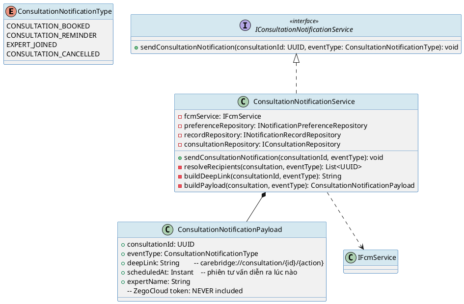
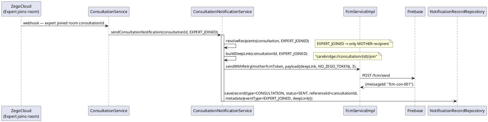
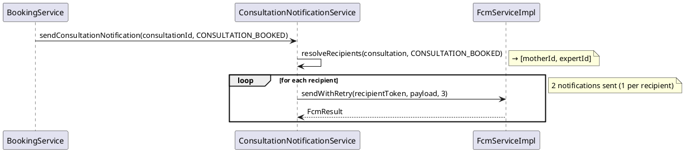

# ENGINEERING DOCUMENTATION STANDARD (EDS) v2.0
# Technical Design Specification — UC-160 Receive Consultation Notification

| Field              | Value                                              |
|--------------------|----------------------------------------------------|
| **Document ID**    | `CB-NOTIF-IMP-003`                                 |
| **Version**        | `1.1`                                              |
| **Date**           | `2026-06-26`                                       |
| **Status**         | `Implemented`                                      |
| **Document Owner** | `PhuongNT`                                         |
| **Author**         | `AI Agent`                                         |
| **Reviewed by**    | `[Tech Lead]`                                      |
| **DPO Sign-off**   | `[ ] Pending`                                      |
| **Approved by**    | `[Principal Architect]`                            |
| **Last Review**    | `2026-07-07`                                       |
| **Based on EDS**   | `v2.0`                                             |

---

## CHANGELOG

| Ngày       | Người thực hiện | Nội dung thay đổi                                                  |
|------------|-----------------|---------------------------------------------------------------------|
| 2026-06-26 | AI Agent        | Tạo tài liệu lần đầu cho UC-160 Receive Consultation Notification  |

---

## MỤC LỤC

1. [Tổng quan Module](#1-tổng-quan-module)
2. [Ma trận Truy vết](#2-ma-trận-truy-vết-traceability-matrix)
3. [Architecture Decision Records (ADR)](#3-architecture-decision-records-adr)
4. [Non-Functional Requirements & SLA](#4-non-functional-requirements--sla)
5. [Static Modeling](#5-static-modeling-mô-hình-tĩnh)
6. [Dynamic Modeling](#6-dynamic-modeling-mô-hình-động)
7. [Domain Event Catalog](#7-domain-event-catalog)
8. [Interface Specification](#8-interface-specification-đặc-tả-giao-diện)
9. [API Specification](#9-api-specification)
10. [Bảng mã lỗi](#10-bảng-mã-lỗi-error-codes)
11. [Quy trình Triển khai](#11-quy-trình-triển-khai-step-by-step)
12. [Rollback & Incident Runbook](#12-rollback--incident-runbook)
13. [Kịch bản Kiểm thử Chi tiết](#13-kịch-bản-kiểm-thử-chi-tiết)
14. [Phương pháp Xác minh](#14-phương-pháp-xác-minh)
15. [Mẫu thử thực tế](#15-mẫu-thử-thực-tế-api-verification-samples)
16. [Bảng tổng hợp phân quyền](#16-bảng-tổng-hợp-phân-quyền-authorization-matrix)
17. [AI Prompt Constraints (CASE 2.0)](#17-ai-prompt-constraints-case-20)

---

## 1. Tổng quan Module

| Field                     | Value                                                                                   |
|---------------------------|-----------------------------------------------------------------------------------------|
| **Module Name**           | `ConsultationNotification`                                                              |
| **Bounded Context**       | `notification`                                                                          |
| **UC ID**                 | `UC-160`                                                                                |
| **SRS Reference**         | `3.1.5.3`                                                                               |
| **Primary Actor**         | `ROLE_MOTHER (recipient), ROLE_EXPERT (recipient)`                                     |
| **Secondary Actor**       | `Firebase Cloud Messaging (FCM), ZegoCloud Realtime Service`                           |
| **Platform**              | `Mobile App (Flutter)`                                                                  |
| **Data Classification**   | `Internal`                                                                              |
| **Compliance Scope**      | `N/A`                                                                                   |
| **Upstream Dependencies** | `consultation (Consultation entity), identity (User FCM token), notification.preferences, zegocloud` |
| **Downstream Consumers**  | `audit (AuditLog), notification.history`                                                |

**Mô tả:** Hệ thống gửi push notification khi các sự kiện tư vấn xảy ra: đặt lịch xác nhận, nhắc trước phiên tư vấn, chuyên gia vào phòng, hủy lịch. Notification payload bao gồm deep link để điều hướng trong app. ZegoCloud room token **KHÔNG** được đưa vào notification payload — sẽ được fetch riêng khi người dùng mở app.

---

## 2. Ma trận Truy vết (Traceability Matrix)

| Requirement ID   | Loại          | Mô tả yêu cầu                                                | Thành phần Code                                          | Compliance Target | ADR liên quan      |
|------------------|---------------|--------------------------------------------------------------|----------------------------------------------------------|-------------------|--------------------|
| UC-160           | Use Case      | Gửi notification cho các consultation events                | `ConsultationNotificationService.send()`                 | —                 | ADR-NOTIF-001      |
| BR-NOTIF-CON-001 | Business Rule | Notification type enum: CONSULTATION_BOOKED, CONSULTATION_REMINDER, EXPERT_JOINED, CONSULTATION_CANCELLED | `ConsultationNotificationType` enum | — | — |
| BR-NOTIF-CON-002 | Business Rule | Payload chứa deep link cho app navigation                   | `NotificationPayload.deepLink`                           | —                 | ADR-NOTIF-CON-001  |
| BR-NOTIF-CON-003 | Business Rule | ZegoCloud room token KHÔNG được trong notification payload  | `ConsultationNotificationService.buildPayload()`         | Security          | ADR-NOTIF-CON-002  |
| BR-NOTIF-CON-004 | Business Rule | Retry 3 lần với exponential backoff khi FCM fail           | `FcmServiceImpl.sendWithRetry()`                         | —                 | ADR-NOTIF-003      |
| BR-NOTIF-CON-005 | Business Rule | Gửi cho cả MOTHER và EXPERT tùy theo event type            | `ConsultationNotificationService.resolveRecipients()`    | —                 | —                  |

---

## 3. Architecture Decision Records (ADR)

### ADR-NOTIF-CON-001 — Deep Link in Notification Payload

| Field       | Value            |
|-------------|------------------|
| **Status**  | `Accepted`       |
| **Deciders**| `PhuongNT`       |
| **Date**    | `2026-06-26`     |

#### Bối cảnh
Khi người dùng tap vào notification, Flutter app cần biết navigate đến màn hình nào (consultation detail, waiting room, etc.).

#### Quyết định
Deep link format: `carebridge://consultation/{consultationId}/{action}`. Example:
- `carebridge://consultation/uuid/detail` — CONSULTATION_BOOKED
- `carebridge://consultation/uuid/join` — EXPERT_JOINED

Deep link được đặt trong FCM `data` payload (không phải `notification`) để app xử lý khi foreground/background/terminated.

---

### ADR-NOTIF-CON-002 — ZegoCloud Token Exclusion

| Field       | Value              |
|-------------|---------------------|
| **Status**  | `Accepted`          |
| **Deciders**| `PhuongNT, DPO`     |
| **Date**    | `2026-06-26`        |

#### Bối cảnh
ZegoCloud room token là credential nhạy cảm có TTL ngắn. Nếu đưa vào FCM payload → có thể bị log bởi FCM infrastructure, không tuân thủ principle of least exposure.

#### Quyết định
ZegoCloud token KHÔNG được đưa vào FCM notification payload. Khi user tap notification và mở app, app gọi API riêng `/api/v1/consultations/{id}/zego-token` để lấy token. Token chỉ valid trong session của app.

**Compliance Impact:** Giảm attack surface — token không bị expose qua FCM log.

---

### ADR-NOTIF-CON-003 — Multi-Recipient Notification

| Field       | Value        |
|-------------|--------------|
| **Status**  | `Accepted`   |
| **Date**    | `2026-06-26` |

#### Quyết định
Một số events cần gửi cho nhiều recipients:
- `CONSULTATION_BOOKED` → gửi cho cả MOTHER (xác nhận) và EXPERT (thông báo có lịch mới)
- `EXPERT_JOINED` → chỉ gửi cho MOTHER
- `CONSULTATION_REMINDER` → gửi cho cả hai (15 phút trước)
- `CONSULTATION_CANCELLED` → gửi cho tất cả participants

Triển khai: `resolveRecipients(event, consultation)` → `List<UUID>` → loop gửi cho từng recipient.

---

## 4. Non-Functional Requirements & SLA

### 4.1. Performance & Availability

| Category      | Requirement                                 | Target SLA     | Measurement       |
|---------------|---------------------------------------------|----------------|-------------------|
| Delivery time | EXPERT_JOINED → notification nhận được     | `< 5s` p95     | System log        |
| Throughput    | Concurrent consultation notifications       | `500/min`      | Load test         |
| Reliability   | FCM delivery success (after retry)         | `≥ 99.5%`     | FCM dashboard     |

### 4.2. Security

| Category                 | Requirement                    | Target       | Verification       |
|--------------------------|--------------------------------|--------------|--------------------|
| ZegoCloud token          | KHÔNG trong FCM payload        | 0 occurrences | Code review + CI scan |
| Deep link validation     | App validates deep link scheme | carebridge:// | Unit test          |

---

## 5. Static Modeling (Mô hình Tĩnh)

### 5.1. Class Diagram (PlantUML)



### 5.2. Data Structure (PostgreSQL DDL)

```sql
-- Thêm vào notification_records: referenceType = 'CONSULTATION'
-- metadata JSONB đã có từ UC-159 migration

-- Thêm enum value vào notification_type nếu dùng enum:
ALTER TYPE notification_type ADD VALUE IF NOT EXISTS 'CONSULTATION';

-- Consultation notification không cần bảng riêng
-- Tái sử dụng notification_records + notification_preferences
-- metadata example:
-- {"consultationId": "uuid", "eventType": "EXPERT_JOINED", "deepLink": "carebridge://consultation/uuid/join"}
```

---

## 6. Dynamic Modeling (Mô hình Động)

### 6.1. Sequence Diagram — EXPERT_JOINED Event



### 6.2. Sequence Diagram — CONSULTATION_BOOKED (Multi-Recipient)



---

## 7. Domain Event Catalog

### 7.1. Events Published

| Event Name                      | Trigger                      | Publisher                         | Subscriber(s)  | Async? |
|---------------------------------|------------------------------|-----------------------------------|----------------|--------|
| `ConsultationNotifSent`         | FCM success                  | `ConsultationNotificationService` | `AuditService` | No     |
| `ConsultationNotifFailed`       | Max retry exceeded           | `ConsultationNotificationService` | `AlertService` | No     |

### 7.2. Events Consumed

| Event Name                | Source              | Handler                              | Action                                   |
|---------------------------|---------------------|--------------------------------------|------------------------------------------|
| `ConsultationBooked`      | `ConsultationModule`| `ConsultationNotifEventHandler`      | → `send(CONSULTATION_BOOKED)`           |
| `ConsultationReminder`    | `Scheduler`         | `ConsultationNotifEventHandler`      | → `send(CONSULTATION_REMINDER)`         |
| `ExpertJoinedConsultation`| `ZegoCloud webhook` | `ConsultationNotifEventHandler`      | → `send(EXPERT_JOINED)`                 |
| `ConsultationCancelled`   | `ConsultationModule`| `ConsultationNotifEventHandler`      | → `send(CONSULTATION_CANCELLED)`        |

---

## 8. Interface Specification (Đặc tả Giao diện)

### 8.1. Service Interface

```java
// IConsultationNotificationService.java
// @version 1.0
package com.carebridge.backend.notification.service;

/**
 * Gửi push notification cho consultation lifecycle events.
 * ZegoCloud token KHÔNG được đưa vào payload (ADR-NOTIF-CON-002).
 * @version 1.0
 */
public interface IConsultationNotificationService {

    /**
     * Gửi FCM notification cho consultation event.
     * Tự động resolve recipients dựa trên eventType.
     * Deep link được tính toán và đưa vào payload.
     *
     * @param consultationId UUID của consultation
     * @param eventType      Loại event (BOOKED/REMINDER/EXPERT_JOINED/CANCELLED)
     * @throws ResourceNotFoundException NOTIF-009 nếu consultation không tồn tại
     */
    void sendConsultationNotification(UUID consultationId, ConsultationNotificationType eventType);
}
```

---

## 9. API Specification

> UC-160 là system-triggered. Không có direct HTTP endpoint để trigger notification.
> Notification history xem qua `GET /api/v1/notifications/me` (UC-158 shared endpoint).

### 9.1. Endpoints Table

| Method | Path                          | Auth Level | Required Roles | Rate Limit | Idempotent? |
|--------|-------------------------------|------------|----------------|------------|-------------|
| `GET`  | `/api/v1/notifications/me`    | JWT Bearer | Tất cả roles   | 60/min     | Yes         |

### 9.2. FCM Payload Schema

FCM payload structure (không phải HTTP response):

```json
{
  "notification": {
    "title": "Chuyên gia đã vào phòng tư vấn",
    "body": "BS. Nguyễn Văn A đang chờ bạn trong phòng tư vấn"
  },
  "data": {
    "consultationId": "uuid",
    "eventType": "EXPERT_JOINED",
    "deepLink": "carebridge://consultation/uuid/join",
    "scheduledAt": "2026-06-26T10:00:00Z"
  },
  "android": { "priority": "HIGH" },
  "apns": { "headers": { "apns-priority": "10" } }
}
```

**Lưu ý:** `data.zegoToken` KHÔNG được có mặt trong payload (ADR-NOTIF-CON-002).

---

## 10. Bảng mã lỗi (Error Codes)

| Code        | HTTP Status | Message (EN)                         | Message (VI)                                | Trigger Condition                          |
|-------------|-------------|--------------------------------------|---------------------------------------------|--------------------------------------------|
| `NOTIF-001` | 400         | Invalid notification type            | Loại thông báo không hợp lệ               | eventType không thuộc enum                |
| `NOTIF-003` | 404         | FCM token not found                  | Thiết bị chưa đăng ký FCM                 | Recipient không có FCM token              |
| `NOTIF-005` | 500         | FCM delivery failed after retries    | Gửi thông báo thất bại                    | Max retry exhausted                        |
| `NOTIF-009` | 404         | Consultation not found               | Không tìm thấy lịch tư vấn               | consultationId không tồn tại              |
| `NOTIF-010` | 500         | Failed to resolve recipients         | Không xác định được người nhận            | Consultation thiếu motherId/expertId      |

---

## 11. Quy trình Triển khai (Step-by-Step)

### 11.1. Prerequisites

- [ ] UC-158 notification infrastructure sẵn sàng
- [ ] Consultation module đã hoàn chỉnh (Consultation entity có motherId, expertId)
- [ ] ZegoCloud webhook configured (không phải JWT auth — webhook secret)
- [ ] ADR-NOTIF-CON-001, 002, 003 Accepted

### 11.2. Implementation Steps

#### Chặng 1 — Enum Extension

```java
// ConsultationNotificationType.java
public enum ConsultationNotificationType {
    CONSULTATION_BOOKED,
    CONSULTATION_REMINDER,
    EXPERT_JOINED,
    CONSULTATION_CANCELLED
}
```

#### Chặng 2 — Service Implementation

1. `notification/dto/ConsultationNotificationPayload.java`
2. `notification/service/IConsultationNotificationService.java`
3. `notification/service/ConsultationNotificationService.java`
4. `notification/event/ConsultationNotifEventHandler.java`

#### Chặng 3 — ZegoCloud Webhook Integration

```java
// ZegoCloudWebhookController.java
@PostMapping("/webhooks/zegocloud")
public ResponseEntity<Void> handleZegoEvent(@RequestBody ZegoCloudEvent event,
    @RequestHeader("X-Zego-Signature") String signature) {
    // Verify webhook signature
    if (event.getType() == ROOM_STATE_CHANGED && event.getState() == EXPERT_JOINED) {
        consultationNotificationService.sendConsultationNotification(
            event.getConsultationId(), ConsultationNotificationType.EXPERT_JOINED);
    }
    return ResponseEntity.ok().build();
}
```

### 11.3. Deployment Checklist

- [ ] ZegoCloud webhook URL configured
- [ ] Deep link scheme `carebridge://` registered in Flutter app
- [ ] Security scan: no ZegoCloud token in FCM logs
- [ ] Test CONSULTATION_BOOKED và EXPERT_JOINED notifications end-to-end

---

## 12. Rollback & Incident Runbook

### 12.1. Điều kiện kích hoạt Rollback

| Điều kiện                     | Ngưỡng         | Người quyết định  |
|-------------------------------|----------------|-------------------|
| ZegoCloud token leak in FCM   | Bất kỳ 1 case  | DPO + Tech Lead ngay lập tức |
| Notification storm (duplicates) | > 5 duplicate/user/minute | On-call |
| Deep link broken (users can't join) | > 1% reports | On-call |

### 12.2. Notification Protocol

| Thời điểm    | Người nhận | Kênh              | Template                                    |
|--------------|------------|-------------------|---------------------------------------------|
| Ngay khi phát | On-call   | Slack `#incident` | "🚨 CONSULTATION-NOTIF incident: [mô tả]"  |
| ZegoCloud token leak | DPO | Email        | GDPR Art. 33 — trong 72 giờ (credential exposure) |

---

## 13. Kịch bản Kiểm thử Chi tiết

### 13.1. Unit Tests

#### TC-UNIT-CONNOTIF-001 — EXPERT_JOINED gửi đến MOTHER

```gherkin
Feature: Consultation Notification
  Scenario: EXPERT_JOINED → chỉ gửi cho MOTHER
    Given consultation c-001 với motherId=user-001, expertId=user-002
    When sendConsultationNotification(c-001, EXPERT_JOINED)
    Then FCM được gọi 1 lần cho motherId=user-001
    And FCM KHÔNG được gọi cho expertId=user-002
    And deepLink trong payload = "carebridge://consultation/c-001/join"
```

#### TC-UNIT-CONNOTIF-002 — CONSULTATION_BOOKED gửi cho cả MOTHER và EXPERT

```gherkin
  Scenario: CONSULTATION_BOOKED → gửi cho cả hai
    Given consultation c-002 với motherId=user-001, expertId=user-002
    When sendConsultationNotification(c-002, CONSULTATION_BOOKED)
    Then FCM được gọi 2 lần (một cho user-001, một cho user-002)
```

#### TC-UNIT-CONNOTIF-003 — ZegoCloud token KHÔNG trong payload

```gherkin
  Scenario: Payload không chứa ZegoCloud token
    When ConsultationNotificationService.buildPayload() được gọi với bất kỳ eventType
    Then payload.zegoToken = null
    And payload không có key nào chứa "zego" hoặc "token"
```

### 13.2. Integration Tests

#### TC-INT-CONNOTIF-001 — Webhook → notification record

```gherkin
  Scenario: ZegoCloud webhook EXPERT_JOINED → notification DB record
    Given PostgreSQL Testcontainer + FCM WireMock
    And consultation c-001 trong DB với motherId=user-001
    When ConsultationNotifEventHandler nhận EXPERT_JOINED event
    Then notification_records có 1 row với type='CONSULTATION', status='SENT'
    And metadata->>'eventType' = 'EXPERT_JOINED'
    And metadata->>'deepLink' chứa 'join'
    And metadata KHÔNG chứa 'zegoToken'
```

---

## 14. Phương pháp Xác minh

### 14.1. Security Verification — ZegoCloud Token

```bash
# Scan FCM logs cho ZegoCloud token leaks
kubectl logs -l app=carebridge-api | grep -i "zegoToken\|zego_token\|roomToken"
# Expected: No output

# Verify payload schema
kubectl logs -l app=carebridge-api | grep '"eventType":"EXPERT_JOINED"' | jq '.payload | has("zegoToken")'
# Expected: false
```

### 14.2. Database Inspection

```sql
-- Verify consultation notifications
SELECT id, type, status, metadata
FROM notification_records
WHERE metadata->>'eventType' = 'EXPERT_JOINED'
  AND metadata ? 'zegoToken' = false;  -- should return 0 rows with zegoToken
```

---

## 15. Mẫu thử thực tế (API Verification Samples)

```bash
# Trigger consultation notification (admin test)
curl -X POST https://[host]/api/v1/internal/notifications/consultation \
  -H "Authorization: Bearer [ADMIN_JWT]" \
  -d '{"consultationId":"uuid","eventType":"EXPERT_JOINED"}'

# Lấy notification history
curl -X GET https://[host]/api/v1/notifications/me \
  -H "Authorization: Bearer [JWT]"
```

**Expected notification record:**
```json
{
  "type": "CONSULTATION",
  "status": "SENT",
  "metadata": {
    "consultationId": "uuid",
    "eventType": "EXPERT_JOINED",
    "deepLink": "carebridge://consultation/uuid/join"
  }
}
```

---

## 16. Bảng tổng hợp phân quyền (Authorization Matrix)

| Action                                     | `GUEST` | `ROLE_MOTHER` | `ROLE_EXPERT` | `ROLE_ADMIN` | `SYSTEM` |
|--------------------------------------------|---------|---------------|---------------|--------------|----------|
| `GET /notifications/me`                    | ❌       | ✅ Own         | ✅ Own         | ✅ All        | ✅ All   |
| `sendConsultationNotification()` (internal)| ❌       | ❌             | ❌             | ❌            | ✅       |
| ZegoCloud webhook handler                  | ❌       | ❌             | ❌             | ❌            | ✅ (webhook secret) |

---

## 17. AI Prompt Constraints (CASE 2.0)

### 17.1 Constraint Summary Table

| # | Constraint                                                                                    | Source              | Last Verified |
|---|-----------------------------------------------------------------------------------------------|---------------------|---------------|
| C1 | `buildPayload()` PHẢI KHÔNG bao giờ include ZegoCloud token trong payload                  | `ADR-NOTIF-CON-002` | `2026-06-26`  |
| C2 | `resolveRecipients()` PHẢI resolve đúng recipients theo event type (ADR-NOTIF-CON-003)     | `ADR-NOTIF-CON-003` | `2026-06-26`  |
| C3 | Deep link PHẢI có format `carebridge://consultation/{id}/{action}`                           | `ADR-NOTIF-CON-001` | `2026-06-26`  |
| C4 | Retry: maxAttempts=3, backoff 0/2/4s — tái sử dụng `IFcmService.sendWithRetry()`          | `ADR-NOTIF-003`     | `2026-06-26`  |
| C5 | ZegoCloud webhook endpoint PHẢI verify signature trước khi xử lý                           | Security policy     | `2026-06-26`  |

### 17.2 Constraint Injection Block

```
[CONSTRAINT BLOCK — Module: ConsultationNotification]
1. buildPayload() KHÔNG include ZegoCloud token — ADR-NOTIF-CON-002
2. resolveRecipients() → BOOKED:[mother+expert], REMINDER:[both], EXPERT_JOINED:[mother], CANCELLED:[all] — ADR-NOTIF-CON-003
3. Deep link = "carebridge://consultation/{id}/{action}" — ADR-NOTIF-CON-001
4. Retry maxAttempts=3 backoff 0/2/4s via IFcmService.sendWithRetry() — ADR-NOTIF-003
5. Webhook: verify Zego signature before processing — Security

[CONTEXT BLOCK]
- Bounded Context: notification (consultation sub-type)
- Upstream: consultation module, zegocloud webhook
- Security: ZegoCloud token must never appear in FCM payload or logs
```

### 17.3 Constraint Quality Checklist

- [x] Mỗi constraint traceable về ADR hoặc BR cụ thể
- [x] Không có constraint generic
- [x] Constraint block có ≥ 3 constraints cụ thể

### 17.4 Anti-Pattern Detection

| AP-ID | Anti-Pattern | Dấu hiệu | Hành động |
|-------|-------------|-----------|----------|
| AP-AI-001 | Unconstrained Gen | Code không match constraint C1-C5 | Reject — inject lại constraints |
| AP-AI-003 | Implicit Decision | Code assume architecture không có ADR | Reject — viết ADR trước |
| AP-AI-005 | Hallucinated Contract | Code import không có trong §8 | Reject — verify contract |

---

## PHỤ LỤC

### A. Glossary

| Thuật ngữ               | Định nghĩa                                                               |
|-------------------------|--------------------------------------------------------------------------|
| Deep Link               | URI scheme cho phép app navigate đến màn hình cụ thể từ notification    |
| ZegoCloud               | Realtime communication SDK dùng cho video consultation                   |
| Multi-recipient         | Một notification event gửi cho nhiều users                              |
| Webhook                 | HTTP callback từ ZegoCloud khi có sự kiện phòng                         |

### B. Tài liệu tham chiếu

| Document             | Link / Path                                      |
|----------------------|--------------------------------------------------|
| ZegoCloud SDK Docs   | https://docs.zegocloud.com/article/1337          |
| FCM Data Messages    | https://firebase.google.com/docs/cloud-messaging/concept-options |
| UC-158 TDS           | `04_Implement/UC158_ReceiveReminderNotification/` |

### C. Implementation Evidence

| Field | Value |
|-------|-------|
| Implementation Date | `2026-07-07` |
| Code Evidence | `ConsultationNotificationService`, `ConsultationNotificationPayload`, `ConsultationNotificationEventType` |
| Test Evidence | `mvn test -Dtest=ReminderNotificationServiceTest,CommunityReplyNotificationServiceTest,ConsultationNotificationServiceTest,FamilyAlertServiceTest` |
| Result | `22 tests run, 0 failures, 0 errors` |
