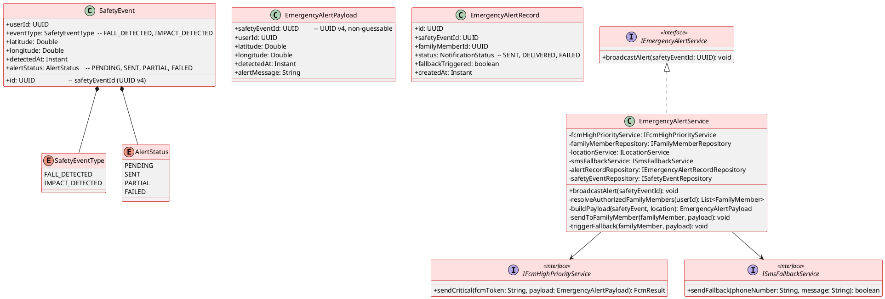
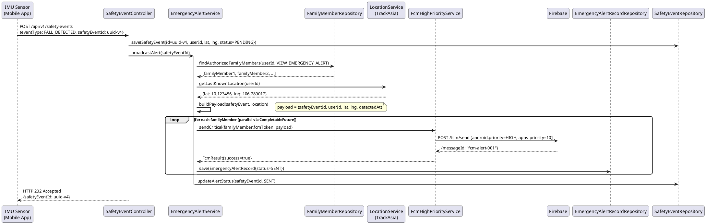
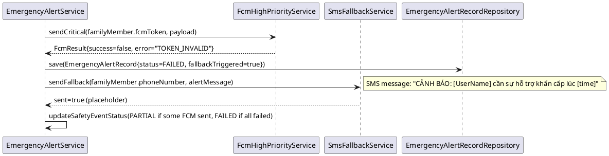
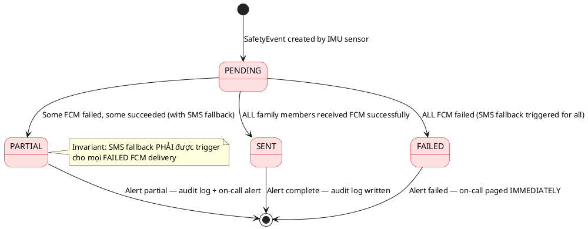

# ENGINEERING DOCUMENTATION STANDARD (EDS) v2.0
# Technical Design Specification — UC-161 Receive Emergency Alert

| Field              | Value                                          |
|--------------------|------------------------------------------------|
| **Document ID**    | `CB-NOTIF-IMP-004`                             |
| **Version**        | `1.1`                                          |
| **Date**           | `2026-06-26`                                   |
| **Status**         | `Implemented (service-level)`                  |
| **Document Owner** | `PhuongNT`                                     |
| **Author**         | `AI Agent`                                     |
| **Reviewed by**    | `[Tech Lead]`                                  |
| **DPO Sign-off**   | `[ ] Pending`                                  |
| **Approved by**    | `[Principal Architect]`                        |
| **Last Review**    | `2026-07-07`                                   |
| **Based on EDS**   | `v2.0`                                         |

> **PRIORITY:** 🔴 CRITICAL — Emergency alert involves user safety. This module requires Principal Architect and DPO sign-off before implementation.

---

## CHANGELOG

| Ngày       | Người thực hiện | Nội dung thay đổi                                             |
|------------|-----------------|---------------------------------------------------------------|
| 2026-06-26 | AI Agent        | Tạo tài liệu lần đầu cho UC-161 Receive Emergency Alert      |

---

## MỤC LỤC

1. [Tổng quan Module](#1-tổng-quan-module)
2. [Ma trận Truy vết](#2-ma-trận-truy-vết-traceability-matrix)
3. [Architecture Decision Records (ADR)](#3-architecture-decision-records-adr)
4. [Non-Functional Requirements & SLA](#4-non-functional-requirements--sla)
5. [Static Modeling](#5-static-modeling-mô-hình-tĩnh)
6. [Dynamic Modeling](#6-dynamic-modeling-mô-hình-động)
7. [Domain Event Catalog](#7-domain-event-catalog)
8. [Interface Specification](#8-interface-specification-đặc-tả-giao-diện)
9. [API Specification](#9-api-specification)
10. [Bảng mã lỗi](#10-bảng-mã-lỗi-error-codes)
11. [Quy trình Triển khai](#11-quy-trình-triển-khai-step-by-step)
12. [Rollback & Incident Runbook](#12-rollback--incident-runbook)
13. [Kịch bản Kiểm thử Chi tiết](#13-kịch-bản-kiểm-thử-chi-tiết)
14. [Phương pháp Xác minh](#14-phương-pháp-xác-minh)
15. [Mẫu thử thực tế](#15-mẫu-thử-thực-tế-api-verification-samples)
16. [Bảng tổng hợp phân quyền](#16-bảng-tổng-hợp-phân-quyền-authorization-matrix)
17. [AI Prompt Constraints (CASE 2.0)](#17-ai-prompt-constraints-case-20)

---

## 1. Tổng quan Module

| Field                     | Value                                                                                              |
|---------------------------|----------------------------------------------------------------------------------------------------|
| **Module Name**           | `EmergencyAlert`                                                                                   |
| **Bounded Context**       | `notification` (emergency sub-type)                                                                |
| **UC ID**                 | `UC-161`                                                                                           |
| **SRS Reference**         | `3.1.5.4`                                                                                          |
| **Primary Actor**         | `ROLE_FAMILY_MEMBER (recipients)`                                                                  |
| **Secondary Actor**       | `Firebase Cloud Messaging (FCM), TrackAsia Map Service, IMU Sensor (trigger)`                     |
| **Platform**              | `Mobile App (Flutter) — high-priority push notification`                                           |
| **Data Classification**   | `Sensitive-PII` (contains userId + location coordinates)                                           |
| **Compliance Scope**      | `GDPR Art. 6.1(d) — vital interests`                                                              |
| **Upstream Dependencies** | `safety (SafetyEvent, IMU data), identity (User, FamilyMember), location (TrackAsia), notification.preferences` |
| **Downstream Consumers**  | `audit (AuditLog), safety (SafetyEventStatus), sms-fallback (placeholder)`                        |

**Mô tả:** Khi cảm biến IMU phát hiện ngã/va đập mạnh, hệ thống phát cảnh báo khẩn cấp đến TẤT CẢ thành viên gia đình có quyền `VIEW_EMERGENCY_ALERT`. Alert dùng FCM high-priority (Android) và APNs critical alerts (iOS). Payload chứa: userId, tọa độ vị trí cuối cùng (từ TrackAsia), timestamp, safetyEventId (UUID v4). Nếu FCM delivery thất bại → fallback SMS (placeholder). SafetyEventId phải là UUID v4 duy nhất và không đoán được.

---

## 2. Ma trận Truy vết (Traceability Matrix)

| Requirement ID   | Loại          | Mô tả yêu cầu                                                           | Thành phần Code                                              | Compliance Target      | ADR liên quan      |
|------------------|---------------|-------------------------------------------------------------------------|--------------------------------------------------------------|------------------------|--------------------|
| UC-161           | Use Case      | Broadcast emergency alert khi IMU phát hiện ngã                         | `EmergencyAlertService.broadcastAlert()`                     | —                      | ADR-EMERG-001      |
| BR-EMERG-001     | Business Rule | FCM high-priority (Android) + APNs critical (iOS)                       | `FcmHighPriorityService.sendCritical()`                      | Safety compliance      | ADR-EMERG-001      |
| BR-EMERG-002     | Business Rule | Alert chứa: userId, lat/lng, timestamp, safetyEventId                   | `EmergencyAlertPayload`                                      | —                      | —                  |
| BR-EMERG-003     | Business Rule | Gửi cho TẤT CẢ family members có VIEW_EMERGENCY_ALERT permission        | `FamilyMemberRepository.findWithPermission(VIEW_EMERGENCY_ALERT)` | —               | ADR-EMERG-002      |
| BR-EMERG-004     | Business Rule | FCM failure → fallback SMS (placeholder)                                | `SmsFallbackService.sendFallback()`                          | Safety — best effort   | ADR-EMERG-003      |
| BR-EMERG-005     | Business Rule | safetyEventId PHẢI là UUID v4 (unique, non-guessable)                   | `UUID.randomUUID()`                                          | Security               | ADR-EMERG-004      |
| BR-EMERG-006     | Business Rule | Location data từ TrackAsia (cuối cùng đã biết)                          | `LocationService.getLastKnownLocation(userId)`               | GDPR Art. 6.1(d)       | ADR-EMERG-005      |
| BR-EMERG-007     | Business Rule | Alert delivery failure PHẢI trigger secondary fallback                   | `EmergencyAlertService.triggerFallback()`                    | Safety compliance      | ADR-EMERG-003      |

---

## 3. Architecture Decision Records (ADR)

### ADR-EMERG-001 — FCM High-Priority + APNs Critical Alerts

| Field       | Value                        |
|-------------|------------------------------|
| **Status**  | `Accepted`                   |
| **Deciders**| `PhuongNT, Tech Lead, DPO`   |
| **Date**    | `2026-06-26`                 |

#### Bối cảnh
Emergency alert phải đánh thức thiết bị ngay cả khi đang trong chế độ không làm phiền (Do Not Disturb). FCM/APNs có cơ chế riêng cho critical alerts.

#### Các phương án đã xem xét

| Phương án | Mô tả                    | Ưu điểm                              | Nhược điểm                         |
|-----------|--------------------------|--------------------------------------|-------------------------------------|
| A         | Standard FCM notification| Đơn giản                             | Bị block bởi DND — không phù hợp  |
| B         | FCM `priority: HIGH` + APNs `critical-alert` | Đánh thức DND | APNs critical cần Apple entitlement |

#### Quyết định
Chọn **Phương án B**. Android: FCM `android.priority = HIGH`. iOS: APNs `apns-priority: 10` + `content-available: 1` + `sound: default` (critical alert entitlement cần xin Apple approval riêng).

#### Hệ quả

**Tích cực:** Alert nhận được ngay cả khi DND.
**Tiêu cực:** APNs critical entitlement cần Apple review — fallback sang high-priority nếu chưa có entitlement.
**Compliance Impact:** GDPR Art. 6.1(d) — xử lý PII trong tình huống vital interests.

---

### ADR-EMERG-002 — Broadcast to ALL Family Members with Permission

| Field       | Value            |
|-------------|------------------|
| **Status**  | `Accepted`       |
| **Deciders**| `PhuongNT`       |
| **Date**    | `2026-06-26`     |

#### Quyết định
Query tất cả family members của userId có `permission = VIEW_EMERGENCY_ALERT`. Không lọc theo preference (emergency alert không thể tắt). Mỗi family member nhận 1 notification riêng.

**Compliance Impact:** GDPR Art. 6.1(d) — xử lý location PII là hợp pháp vì mục đích vital interest (an toàn người dùng).

---

### ADR-EMERG-003 — SMS Fallback Strategy

| Field       | Value            |
|-------------|------------------|
| **Status**  | `Accepted`       |
| **Date**    | `2026-06-26`     |

#### Quyết định
Nếu FCM delivery thất bại (sau max retry) cho bất kỳ family member nào → trigger `SmsFallbackService.sendFallback(phoneNumber, alertMessage)`. SMS provider là placeholder — chưa tích hợp thực tế. SMS chứa: tên user, thời gian, địa chỉ xấp xỉ (không tọa độ chính xác vì security).

---

### ADR-EMERG-004 — UUID v4 cho SafetyEventId

| Field       | Value            |
|-------------|------------------|
| **Status**  | `Accepted`       |
| **Date**    | `2026-06-26`     |

#### Quyết định
safetyEventId = `UUID.randomUUID()` (Java standard) — 128-bit random, không đoán được, unique theo probability. Đây là idempotency key để tránh duplicate alerts nếu IMU trigger nhiều lần cho cùng một sự kiện.

---

### ADR-EMERG-005 — TrackAsia Last-Known Location

| Field       | Value            |
|-------------|------------------|
| **Status**  | `Accepted`       |
| **Date**    | `2026-06-26`     |

#### Quyết định
Location trong alert là "cuối cùng đã biết" (last known) từ TrackAsia, không phải real-time (để tránh delay). App mobile cập nhật location định kỳ → server lưu `user_last_locations` → khi alert, fetch last known location. Nếu không có location → lat=null, lng=null trong payload.

**Compliance Impact:** Location là Sensitive-PII — chỉ được share với family members có permission (GDPR Art. 6.1(d)).

---

## 4. Non-Functional Requirements & SLA

### 4.1. Performance & Availability — CRITICAL

| Category      | Requirement                                 | Target SLA     | Measurement            |
|---------------|---------------------------------------------|----------------|------------------------|
| Delivery time | IMU trigger → FCM received by family member | `< 10s` p99    | End-to-end latency log |
| Availability  | Emergency alert service uptime              | `99.99%`       | Uptime monitor         |
| Throughput    | Concurrent emergency alerts                 | `100/min`      | Load test              |
| Fallback      | SMS fallback trigger after FCM failure      | `< 30s`        | System log             |

### 4.2. Data Integrity & Retention

| Category     | Requirement                       | Target   | Verification Method   | Compliance Basis    |
|--------------|-----------------------------------|----------|-----------------------|---------------------|
| Durability   | Zero alert loss                   | RPO = 0  | Transaction           | Safety compliance   |
| Uniqueness   | safetyEventId không trùng lặp     | 100%     | UUID v4 probability   | ADR-EMERG-004       |
| Retention    | EmergencyAlert records            | 7 năm    | DB backup             | GDPR Art. 5.1(e)    |

### 4.3. Security

| Category            | Requirement                          | Target     | Verification       | Compliance Basis |
|---------------------|--------------------------------------|------------|--------------------|------------------|
| Location PII        | Chỉ share với authorized family members | 0 leaks | Auth check + audit | GDPR Art. 6.1(d) |
| safetyEventId       | UUID v4 non-guessable               | 100%       | UUID format check  | ADR-EMERG-004    |
| SMS fallback        | Không include tọa độ chính xác      | 100%       | SMS content review | GDPR Art. 25     |

### 4.4. Scalability

Scenario: 1 user với 5 family members → 5 concurrent FCM sends. System MUST handle this without queue bottleneck. Triển khai: parallel FCM sends per family member (CompletableFuture).

---

## 5. Static Modeling (Mô hình Tĩnh)

### 5.1. Class Diagram (PlantUML)



### 5.2. Data Structure (PostgreSQL DDL — Flyway)

```sql
-- V[N]__create_safety_and_emergency_alert_tables.sql

CREATE TYPE safety_event_type AS ENUM ('FALL_DETECTED', 'IMPACT_DETECTED');
CREATE TYPE alert_status AS ENUM ('PENDING', 'SENT', 'PARTIAL', 'FAILED');

CREATE TABLE safety_events (
    id              UUID PRIMARY KEY DEFAULT gen_random_uuid(),  -- UUID v4 = safetyEventId
    user_id         UUID NOT NULL,
    event_type      safety_event_type NOT NULL,
    latitude        DECIMAL(10, 8),                              -- null nếu không có location
    longitude       DECIMAL(11, 8),
    detected_at     TIMESTAMPTZ NOT NULL DEFAULT NOW(),
    alert_status    alert_status NOT NULL DEFAULT 'PENDING',
    processed_at    TIMESTAMPTZ,
    CONSTRAINT fk_safety_event_user FOREIGN KEY (user_id) REFERENCES users(id) ON DELETE CASCADE
);

CREATE TABLE emergency_alert_records (
    id                  UUID PRIMARY KEY DEFAULT gen_random_uuid(),
    safety_event_id     UUID NOT NULL,
    family_member_id    UUID NOT NULL,
    status              notification_status NOT NULL DEFAULT 'SENT',
    fallback_triggered  BOOLEAN NOT NULL DEFAULT FALSE,
    fcm_message_id      VARCHAR(200),
    created_at          TIMESTAMPTZ NOT NULL DEFAULT NOW(),
    CONSTRAINT fk_alert_rec_event FOREIGN KEY (safety_event_id) REFERENCES safety_events(id),
    CONSTRAINT fk_alert_rec_family FOREIGN KEY (family_member_id) REFERENCES users(id)
);

CREATE TABLE user_last_locations (
    id          UUID PRIMARY KEY DEFAULT gen_random_uuid(),
    user_id     UUID NOT NULL UNIQUE,
    latitude    DECIMAL(10, 8) NOT NULL,
    longitude   DECIMAL(11, 8) NOT NULL,
    updated_at  TIMESTAMPTZ NOT NULL DEFAULT NOW(),
    CONSTRAINT fk_loc_user FOREIGN KEY (user_id) REFERENCES users(id) ON DELETE CASCADE
);

CREATE INDEX idx_safety_events_user_id ON safety_events(user_id);
CREATE INDEX idx_safety_events_alert_status ON safety_events(alert_status);
CREATE INDEX idx_emergency_alert_safety_event ON emergency_alert_records(safety_event_id);

COMMENT ON TABLE safety_events IS 'IMU-detected fall/impact events. safetyEventId = id (UUID v4).';
COMMENT ON COLUMN safety_events.latitude IS 'Sensitive-PII: last known location. GDPR Art. 6.1(d).';
```

---

## 6. Dynamic Modeling (Mô hình Động)

### 6.1. Sequence Diagram — Happy Path (FCM Success)



### 6.2. Sequence Diagram — FCM Failure → SMS Fallback



### 6.3. State Machine — SafetyEvent Alert Status



---

## 7. Domain Event Catalog

### 7.1. Events Published

| Event Name                  | Trigger                                | Publisher                | Subscriber(s)                   | Async? |
|-----------------------------|----------------------------------------|--------------------------|---------------------------------|--------|
| `EmergencyAlertBroadcast`   | Sau khi broadcast hoàn tất (tất cả)   | `EmergencyAlertService`  | `AuditService`, `SafetyModule`  | No     |
| `EmergencyAlertFailed`      | Tất cả FCM + SMS đều thất bại         | `EmergencyAlertService`  | `AlertService` (on-call)        | No     |

### 7.2. Events Consumed

| Event Name       | Source              | Handler                        | Action                         |
|------------------|---------------------|--------------------------------|--------------------------------|
| `FallDetected`   | `SafetyModule/IMU`  | `EmergencyAlertEventHandler`   | `broadcastAlert(safetyEventId)`|

### 7.3. Payload Schema

```java
// EmergencyAlertPayload.java
public record EmergencyAlertPayload(
    UUID safetyEventId,       // UUID v4 — non-guessable, idempotency key
    UUID userId,              // User who fell
    Double latitude,          // Last known latitude (nullable)
    Double longitude,         // Last known longitude (nullable)
    Instant detectedAt,       // When IMU detected event
    String alertMessage,      // "Phát hiện ngã/va chạm mạnh. Vui lòng kiểm tra."
    String deepLink           // carebridge://safety/safetyEventId/emergency
) {}
```

---

## 8. Interface Specification (Đặc tả Giao diện)

### 8.1. Service Interface

```java
// IEmergencyAlertService.java
// @version 1.0
package com.carebridge.backend.notification.service;

/**
 * Broadcast emergency alert đến tất cả family members khi phát hiện ngã/va đập.
 * CRITICAL: Failure phải trigger SMS fallback và on-call alert.
 * @version 1.0
 */
public interface IEmergencyAlertService {

    /**
     * Broadcast emergency alert đến tất cả family members có VIEW_EMERGENCY_ALERT permission.
     * Sử dụng FCM high-priority. Fallback sang SMS nếu FCM fail.
     *
     * @param safetyEventId UUID v4 của safety event (idempotency key)
     * @throws ResourceNotFoundException NOTIF-011 nếu safetyEvent không tồn tại
     */
    void broadcastAlert(UUID safetyEventId);
}
```

### 8.2. FCM High-Priority Service Interface

```java
// IFcmHighPriorityService.java
// @version 1.0
package com.carebridge.backend.notification.service;

public interface IFcmHighPriorityService {

    /**
     * Gửi FCM high-priority message.
     * Android: android.priority = HIGH
     * iOS: apns-priority = 10, content-available = 1
     *
     * @param fcmToken Device FCM token
     * @param payload  Emergency alert payload (contains location PII)
     * @return FcmResult{success, messageId, error}
     */
    FcmResult sendCritical(String fcmToken, EmergencyAlertPayload payload);
}
```

### 8.3. SMS Fallback Interface

```java
// ISmsFallbackService.java
// @version 1.0 — PLACEHOLDER (SMS provider not yet integrated)
package com.carebridge.backend.notification.service;

public interface ISmsFallbackService {

    /**
     * Gửi SMS khi FCM thất bại (fallback cho emergency).
     * PLACEHOLDER — SMS provider chưa được tích hợp.
     * Triển khai hiện tại: log only + mark as attempted.
     *
     * @param phoneNumber Số điện thoại family member
     * @param message     Nội dung SMS (không chứa tọa độ chính xác)
     * @return true nếu gửi được (hoặc logged)
     */
    boolean sendFallback(String phoneNumber, String message);
}
```

### 8.4. Repository Interfaces

```java
// IFamilyMemberRepository.java (thêm method)
List<FamilyMember> findByUserIdAndPermission(UUID userId, String permission);

// ISafetyEventRepository.java
Optional<SafetyEvent> findById(UUID id);
SafetyEvent save(SafetyEvent event);
void updateAlertStatus(UUID id, AlertStatus status);

// IEmergencyAlertRecordRepository.java
List<EmergencyAlertRecord> findBySafetyEventId(UUID safetyEventId);
EmergencyAlertRecord save(EmergencyAlertRecord record);
```

---

## 9. API Specification

### 9.1. Endpoints Table

| Method | Path                           | Auth Level     | Required Roles      | Rate Limit | Idempotent? |
|--------|--------------------------------|----------------|---------------------|------------|-------------|
| `POST` | `/api/v1/safety-events`        | JWT Bearer     | `ROLE_MOTHER`       | 10/min     | Yes (safetyEventId) |
| `GET`  | `/api/v1/safety-events/{id}`   | JWT Bearer     | `ROLE_FAMILY_MEMBER`, `ROLE_MOTHER`, `ROLE_ADMIN` | 60/min | Yes |
| `GET`  | `/api/v1/notifications/me`     | JWT Bearer     | Tất cả roles        | 60/min     | Yes         |

### 9.2. Request / Response Schemas

#### `POST /api/v1/safety-events` — Báo cáo sự kiện ngã (từ IMU sensor qua mobile app)

**Request Body:**
```json
{
  "safetyEventId": "550e8400-e29b-41d4-a716-446655440000",
  "eventType": "FALL_DETECTED",
  "latitude": 10.123456,
  "longitude": 106.789012,
  "detectedAt": "2026-06-26T10:00:00Z"
}
```

**Response — 202 Accepted:**
```json
{
  "success": true,
  "data": {
    "safetyEventId": "550e8400-e29b-41d4-a716-446655440000",
    "alertStatus": "PENDING",
    "message": "Emergency alert is being broadcast to your family members"
  }
}
```

**Response — 400 Bad Request (Invalid UUID):**
```json
{
  "success": false,
  "error": {
    "code": "NOTIF-012",
    "message": "safetyEventId phải là UUID v4 hợp lệ"
  }
}
```

**Response — 409 Conflict (Duplicate safetyEventId):**
```json
{
  "success": false,
  "error": {
    "code": "NOTIF-013",
    "message": "Safety event đã được xử lý trước đó (idempotency)"
  }
}
```

#### `GET /api/v1/safety-events/{id}` — Xem chi tiết safety event

**Response — 200 OK (ROLE_FAMILY_MEMBER):**
```json
{
  "success": true,
  "data": {
    "safetyEventId": "uuid",
    "eventType": "FALL_DETECTED",
    "latitude": 10.123456,
    "longitude": 106.789012,
    "detectedAt": "2026-06-26T10:00:00Z",
    "alertStatus": "SENT",
    "familyMembersAlerted": 3
  }
}
```

---

## 10. Bảng mã lỗi (Error Codes)

| Code        | HTTP Status | Message (EN)                              | Message (VI)                                    | Trigger Condition                              |
|-------------|-------------|-------------------------------------------|--------------------------------------------------|------------------------------------------------|
| `NOTIF-001` | 400         | Invalid notification type                 | Loại thông báo không hợp lệ                    | eventType sai                                  |
| `NOTIF-004` | 403         | Access denied                             | Không có quyền truy cập                        | Non-authorized family member access            |
| `NOTIF-005` | 500         | FCM delivery failed                       | Gửi cảnh báo FCM thất bại                     | FCM failure (SMS fallback triggered)           |
| `NOTIF-011` | 404         | Safety event not found                    | Không tìm thấy sự kiện an toàn               | safetyEventId không tồn tại                   |
| `NOTIF-012` | 400         | Invalid safetyEventId format              | safetyEventId phải là UUID v4                  | safetyEventId không phải UUID v4 format        |
| `NOTIF-013` | 409         | Duplicate safety event                    | Sự kiện đã được xử lý                         | safetyEventId đã tồn tại trong DB             |
| `NOTIF-014` | 404         | No authorized family members found       | Không có thành viên gia đình có quyền nhận alert | No family members with VIEW_EMERGENCY_ALERT  |
| `NOTIF-015` | 500         | Emergency alert completely failed         | Cảnh báo khẩn cấp thất bại hoàn toàn         | Cả FCM và SMS fallback đều thất bại           |

---

## 11. Quy trình Triển khai (Step-by-Step)

### 11.1. Prerequisites — CRITICAL

- [ ] **DPO sign-off TRƯỚC KHI implement** (Sensitive-PII module với location data)
- [ ] ADR-EMERG-001 đến ADR-EMERG-005 đã Accepted và Principal Architect approve
- [ ] APNs critical alert entitlement đã được Apple approve (hoặc fallback confirmed)
- [ ] TrackAsia API key configured trong env
- [ ] SMS provider integration plan được confirm (placeholder OK for now)
- [ ] Security review của payload structure hoàn chỉnh

### 11.2. Pre-Migration Checklist

- [ ] Backup DB production
- [ ] Migration test trên staging ≥ 48 giờ (vì CRITICAL priority)
- [ ] Rollback script đã test
- [ ] Load test: 5 family members × 100 concurrent alerts = 500 FCM/min

### 11.3. Implementation Steps

#### Chặng 1 — Database Migration

```bash
# V[N]__create_safety_and_emergency_alert_tables.sql
# Tự động qua Flyway khi start
./mvnw spring-boot:run
# Verify:
# psql -c "\d safety_events"
# psql -c "\d emergency_alert_records"
```

#### Chặng 2 — Implementation Order

1. `notification/entity/SafetyEventType.java` — enum
2. `notification/entity/AlertStatus.java` — enum
3. `notification/entity/SafetyEvent.java`
4. `notification/entity/EmergencyAlertRecord.java`
5. `notification/dto/EmergencyAlertPayload.java`
6. `notification/service/IFcmHighPriorityService.java` + `FcmHighPriorityServiceImpl.java`
7. `notification/service/ISmsFallbackService.java` + `SmsFallbackServiceImpl.java` (placeholder)
8. `notification/service/IEmergencyAlertService.java` + `EmergencyAlertService.java`
9. `notification/controller/SafetyEventController.java`

#### Chặng 3 — FCM Critical Config

```java
// FcmHighPriorityServiceImpl.java
Message message = Message.builder()
    .setToken(fcmToken)
    .setAndroidConfig(AndroidConfig.builder()
        .setPriority(AndroidConfig.Priority.HIGH)
        .build())
    .setApnsConfig(ApnsConfig.builder()
        .putHeader("apns-priority", "10")
        .putHeader("apns-push-type", "alert")
        .setAps(Aps.builder()
            .setContentAvailable(true)
            .setSound("default")
            .build())
        .build())
    .putAllData(payloadToMap(emergencyPayload))
    .build();
```

#### Chặng 4 — Parallel FCM Broadcast

```java
// EmergencyAlertService.java
List<CompletableFuture<Void>> futures = familyMembers.stream()
    .map(fm -> CompletableFuture.runAsync(() -> sendToFamilyMember(fm, payload)))
    .collect(Collectors.toList());
CompletableFuture.allOf(futures.toArray(new CompletableFuture[0])).join();
```

### 11.4. Deployment Checklist

- [ ] Safety events tables created
- [ ] FCM HIGH priority confirmed in staging
- [ ] Test alert broadcast to test family members
- [ ] SMS fallback log output verified
- [ ] Security scan: location data NOT in application logs
- [ ] On-call runbook updated với emergency alert failure procedures

---

## 12. Rollback & Incident Runbook

### 12.1. Điều kiện kích hoạt Rollback

| Điều kiện                              | Ngưỡng                    | Người quyết định                    |
|----------------------------------------|---------------------------|-------------------------------------|
| Emergency alert storm (duplicates)     | > 3 alerts/event          | On-call Engineer ngay lập tức       |
| Location PII leak trong logs           | Bất kỳ 1 case             | DPO + Tech Lead ngay lập tức        |
| Alert delivery completely failing      | > 50% failure rate        | On-call + Tech Lead                 |
| safetyEventId not unique               | Bất kỳ 1 duplicate        | Tech Lead                           |

### 12.2. Rollback Procedure

```bash
# Bước 1: Disable emergency alert endpoint (feature flag)
# SET FEATURE_EMERGENCY_ALERT=false trong env → restart

# Bước 2: Re-deploy phiên bản cũ
kubectl rollout undo deployment/carebridge-api

# Bước 3: Verify
kubectl rollout status deployment/carebridge-api
curl -X GET https://[host]/actuator/health

# Bước 4: Revert DB nếu cần (chỉ staging)
# psql -c "DROP TABLE IF EXISTS emergency_alert_records;"
# psql -c "DROP TABLE IF EXISTS safety_events;"
# psql -c "DROP TABLE IF EXISTS user_last_locations;"
```

### 12.3. Notification Protocol — EMERGENCY MODULE

| Thời điểm      | Người nhận          | Kênh              | Template                                                |
|----------------|---------------------|-------------------|---------------------------------------------------------|
| Ngay khi phát  | On-call Engineer    | PagerDuty + Slack | "🚨🚨 EMERGENCY-ALERT MODULE failure: [mô tả]"        |
| Nếu location leak | DPO             | Email (ưu tiên)   | GDPR Art. 33 — data breach report trong 72 giờ         |
| Nếu user safety affected | CEO, Tech Lead | Email    | Safety incident report                                  |

### 12.4. Post-Incident Review (PIR)

PIR bắt buộc trong **24 giờ** (không phải 48 giờ thông thường — vì CRITICAL priority) bao gồm: Timeline, Root Cause (5 Whys), số users bị ảnh hưởng, location data exposure (có/không), remediation, prevention.

---

## 13. Kịch bản Kiểm thử Chi tiết

### 13.1. Unit Tests

#### TC-UNIT-EMERG-001 — Broadcast thành công đến tất cả family members

```gherkin
Feature: Emergency Alert Broadcast
  Background:
    Given test data classification: SYNTHETIC

  Scenario: 3 family members đều nhận được alert
    Given user "mother-001" có 3 family members có VIEW_EMERGENCY_ALERT permission
    And tất cả có FCM tokens hợp lệ
    And FCM mock returns success
    When broadcastAlert(safetyEventId) được gọi
    Then FCM được gọi đúng 3 lần (1 per family member)
    And 3 EmergencyAlertRecords được lưu với status=SENT
    And SafetyEvent.alertStatus = SENT
```

#### TC-UNIT-EMERG-002 — FCM fail cho 1 member → SMS fallback trigger

```gherkin
  Scenario: FCM fail cho 1 trong 2 family members → SMS fallback
    Given 2 family members (fm-001, fm-002)
    And FCM succeeds for fm-001, fails for fm-002
    When broadcastAlert(safetyEventId)
    Then SmsFallbackService.sendFallback() được gọi cho fm-002
    And EmergencyAlertRecord[fm-002].fallbackTriggered = true
    And EmergencyAlertRecord[fm-002].status = FAILED
    And SafetyEvent.alertStatus = PARTIAL
```

#### TC-UNIT-EMERG-003 — safetyEventId phải là UUID v4

```gherkin
  Scenario: Input validation — safetyEventId không phải UUID v4
    When POST /api/v1/safety-events với safetyEventId = "NOT-A-UUID"
    Then HTTP 400
    And response.error.code = "NOTIF-012"
```

#### TC-UNIT-EMERG-004 — Duplicate safetyEventId → 409

```gherkin
  Scenario: Gửi cùng safetyEventId lần 2 → idempotency
    Given safety event uuid-v4-001 đã được xử lý
    When POST /api/v1/safety-events với safetyEventId = uuid-v4-001
    Then HTTP 409
    And response.error.code = "NOTIF-013"
    And KHÔNG có notification nào được gửi lần 2
```

#### TC-UNIT-EMERG-005 — FCM payload là HIGH-priority

```gherkin
  Scenario: FCM message có android.priority = HIGH
    When FcmHighPriorityService.sendCritical() được gọi
    Then FCM Message.androidConfig.priority = HIGH
    And FCM Message.apnsConfig.headers["apns-priority"] = "10"
```

### 13.2. Integration Tests

#### TC-INT-EMERG-001 — Full flow: POST safety-event → DB records

```gherkin
  Scenario: IMU sends safety event → alert broadcast → DB verify
    Given PostgreSQL Testcontainer
    And mother-001 có 2 family members trong DB với VIEW_EMERGENCY_ALERT
    And FCM WireMock returns success
    When POST /api/v1/safety-events với FALL_DETECTED event
    Then HTTP 202 Accepted
    And safety_events: 1 row với alertStatus='SENT'
    And emergency_alert_records: 2 rows (1 per family member) với status='SENT'
```

### 13.3. Security Tests

#### TC-SEC-EMERG-001 — Location PII không leak vào logs

```gherkin
  Scenario: Location coordinates không xuất hiện trong application logs
    When broadcastAlert() được gọi với latitude=10.123456, longitude=106.789012
    Then application logs KHÔNG chứa "10.123456" hoặc "106.789012"
    Note: Coordinates chỉ trong FCM payload và DB — không trong log
```

---

## 14. Phương pháp Xác minh

### 14.1. Database Inspection

```sql
-- Verify safety event created
SELECT id, user_id, event_type, latitude, longitude, alert_status
FROM safety_events WHERE id = 'safety-event-uuid';

-- Verify emergency alert records
SELECT family_member_id, status, fallback_triggered, fcm_message_id
FROM emergency_alert_records WHERE safety_event_id = 'safety-event-uuid';

-- Verify no duplicate processing
SELECT COUNT(*) FROM safety_events WHERE id = 'safety-event-uuid';
-- Expected: 1
```

### 14.2. Security Verification

```bash
# CRITICAL: Kiểm tra location PII không trong logs
kubectl logs -l app=carebridge-api | grep -E "10\.[0-9]{6}|106\.[0-9]{6}"
# Expected: No output

# Verify FCM high-priority config
kubectl logs -l app=carebridge-api | grep '"priority":"HIGH"' | head -3

# Verify safetyEventId format
kubectl logs -l app=carebridge-api | grep '"safetyEventId"' | jq '.safetyEventId' | head -3
# Expected: Valid UUID v4 format
```

---

## 15. Mẫu thử thực tế (API Verification Samples)

```bash
# Gửi safety event (simulating IMU detection)
curl -X POST https://[host]/api/v1/safety-events \
  -H "Authorization: Bearer [MOTHER_JWT]" \
  -H "Content-Type: application/json" \
  -H "X-Correlation-Id: $(uuidgen)" \
  -d '{
    "safetyEventId": "550e8400-e29b-41d4-a716-446655440000",
    "eventType": "FALL_DETECTED",
    "latitude": 10.123456,
    "longitude": 106.789012,
    "detectedAt": "2026-06-26T10:00:00Z"
  }'
# Expected: 202 Accepted

# Duplicate → 409
curl -X POST https://[host]/api/v1/safety-events \
  -H "Authorization: Bearer [MOTHER_JWT]" \
  -H "Content-Type: application/json" \
  -d '{"safetyEventId": "550e8400-e29b-41d4-a716-446655440000", ...}'
# Expected: 409, code NOTIF-013

# Family member xem alert
curl -X GET https://[host]/api/v1/safety-events/550e8400-e29b-41d4-a716-446655440000 \
  -H "Authorization: Bearer [FAMILY_MEMBER_JWT]"
# Expected: 200 với alert details
```

---

## 16. Bảng tổng hợp phân quyền (Authorization Matrix)

| Endpoint / Action                        | `GUEST` | `ROLE_MOTHER` | `ROLE_EXPERT` | `ROLE_ADMIN` | `ROLE_FAMILY_MEMBER` | `SYSTEM` |
|------------------------------------------|---------|---------------|---------------|--------------|----------------------|----------|
| `POST /api/v1/safety-events`             | ❌       | ✅ Own         | ❌             | ❌            | ❌                    | ✅        |
| `GET /api/v1/safety-events/{id}`         | ❌       | ✅ Own         | ❌             | ✅ All        | ✅ If authorized      | ✅        |
| Receive emergency alert (FCM)            | ❌       | ❌             | ❌             | ❌            | ✅ If VIEW_EMERGENCY_ALERT | ✅  |
| `broadcastAlert()` (internal)            | ❌       | ❌             | ❌             | ❌            | ❌                    | ✅        |

**Chú thích:** `VIEW_EMERGENCY_ALERT` là permission trên `family_member` relationship — không phải role-level permission.

---

## 17. AI Prompt Constraints (CASE 2.0)

### 17.1 Constraint Summary Table

| # | Constraint                                                                                              | Source            | Last Verified |
|---|---------------------------------------------------------------------------------------------------------|-------------------|---------------|
| C1 | `broadcastAlert()` PHẢI gửi cho TẤT CẢ family members có VIEW_EMERGENCY_ALERT — không có exception     | `ADR-EMERG-002`   | `2026-06-26`  |
| C2 | FCM PHẢI sử dụng HIGH priority (Android) và apns-priority=10 (iOS)                                    | `ADR-EMERG-001`   | `2026-06-26`  |
| C3 | FCM failure cho bất kỳ recipient nào → PHẢI trigger `SmsFallbackService.sendFallback()`              | `ADR-EMERG-003`   | `2026-06-26`  |
| C4 | safetyEventId PHẢI là UUID v4 từ `UUID.randomUUID()` — kiểm tra idempotency trước khi xử lý          | `ADR-EMERG-004`   | `2026-06-26`  |
| C5 | Location coordinates KHÔNG được xuất hiện trong application logs (chỉ trong DB và FCM payload)        | `ADR-EMERG-005`, GDPR Art. 25 | `2026-06-26` |
| C6 | `buildPayload()` PHẢI dùng `user_last_locations` từ TrackAsia — null-safe nếu không có location       | `ADR-EMERG-005`   | `2026-06-26`  |

### 17.2 Constraint Injection Block

```
[CONSTRAINT BLOCK — Module: EmergencyAlert — PRIORITY: CRITICAL]
Theo TDS CB-NOTIF-IMP-004 và ADR-EMERG-001 đến ADR-EMERG-005:

1. broadcastAlert() gửi cho TẤT CẢ family members có VIEW_EMERGENCY_ALERT — ADR-EMERG-002
2. FCM: android.priority=HIGH, apns-priority=10 — ADR-EMERG-001
3. FCM failure → SmsFallbackService.sendFallback() PHẢI được gọi — ADR-EMERG-003
4. safetyEventId = UUID.randomUUID(), kiểm tra idempotency trước xử lý — ADR-EMERG-004
5. Location coordinates KHÔNG được log (GDPR Art. 25) — ADR-EMERG-005
6. buildPayload() null-safe nếu không có last known location — ADR-EMERG-005

[CONTEXT BLOCK]
- Bounded Context: notification (emergency sub-type)
- Data Classification: Sensitive-PII (location data)
- Compliance: GDPR Art. 6.1(d) — vital interests
- Error codes: §10 (NOTIF-011 đến NOTIF-015)
- Auth matrix: §16 — VIEW_EMERGENCY_ALERT permission
- Security: No location coords in logs, FCM high-priority required

[TASK BLOCK]
Implement EmergencyAlertService.broadcastAlert() thỏa mãn tất cả 6 constraints.
CRITICAL: Đây là safety-critical module — failure phải fail-safe (SMS fallback), không fail-silent.
```

### 17.3 Constraint Quality Checklist

- [x] Mỗi constraint traceable về ADR hoặc BR
- [x] Không có constraint generic
- [x] Location PII protection có compliance reference
- [x] Reference §16 Auth Matrix (VIEW_EMERGENCY_ALERT permission)
- [x] Safety-critical failure mode được specify (SMS fallback)

### 17.4 Anti-Pattern Detection

| AP-ID     | Anti-Pattern          | Dấu hiệu                                      | Hành động                          |
|-----------|-----------------------|-----------------------------------------------|------------------------------------|
| AP-AI-001 | Unconstrained Gen     | Skip high-priority FCM headers                | Reject — C2 violated               |
| AP-AI-003 | Implicit Decision     | SMS fallback không có ADR reference           | Reject — ADR-EMERG-003 required    |
| AP-AI-005 | Hallucinated Contract | Import SmsFallbackService không phải placeholder | Reject — verify is placeholder  |

---

## PHỤ LỤC

### A. Glossary

| Thuật ngữ            | Định nghĩa                                                                    |
|----------------------|-------------------------------------------------------------------------------|
| IMU                  | Inertial Measurement Unit — cảm biến gia tốc/con quay trong điện thoại      |
| FCM High-Priority    | Cơ chế FCM đánh thức thiết bị ngay cả khi DND                               |
| APNs Critical Alert  | Cơ chế iOS vượt qua DND/Mute — cần Apple entitlement                        |
| safetyEventId        | UUID v4 dùng làm idempotency key — tránh duplicate alert                     |
| SMS Fallback         | Cơ chế dự phòng khi FCM thất bại — chỉ là placeholder hiện tại              |
| VIEW_EMERGENCY_ALERT | Permission của family member để nhận emergency alerts                         |
| TrackAsia            | Map service cung cấp location data trong CareBridge                           |
| Last Known Location  | Tọa độ cuối cùng được mobile app cập nhật lên server                        |

### B. Tài liệu tham chiếu

| Document                   | Link / Path                                         |
|----------------------------|-----------------------------------------------------|
| GDPR Art. 6.1(d) — Vital Interests | https://gdpr-info.eu/art-6-gdpr/          |
| FCM Android Priority       | https://firebase.google.com/docs/cloud-messaging/concept-options#setting-the-priority-of-a-message |
| APNs Critical Alerts       | https://developer.apple.com/documentation/usernotifications/setting_up_a_remote_notification_server/sending_notification_requests_to_apns |
| TrackAsia API              | https://maps.track-asia.com/                        |
| CareBridge CLAUDE.md       | `d:\SEP490\CareBridge_SEP490_G79\CLAUDE.md`         |
| UC-158 TDS                 | `04_Implement/UC158_ReceiveReminderNotification/`   |

### C. Implementation Evidence

| Field | Value |
|-------|-------|
| Implementation Date | `2026-07-07` |
| Code Evidence | `FamilyAlertService`, `SmsFallbackPort`, `SmsFallbackPortAdapter` |
| Test Evidence | `mvn test -Dtest=ReminderNotificationServiceTest,CommunityReplyNotificationServiceTest,ConsultationNotificationServiceTest,FamilyAlertServiceTest` |
| Result | `22 tests run, 0 failures, 0 errors` |
| Scope Note | Service-level UC161 emergency alert receive path is implemented via existing emergency family-alert flow; public safety-event endpoint/integration scope remains governed by DPO/Principal Architect sign-off. |
