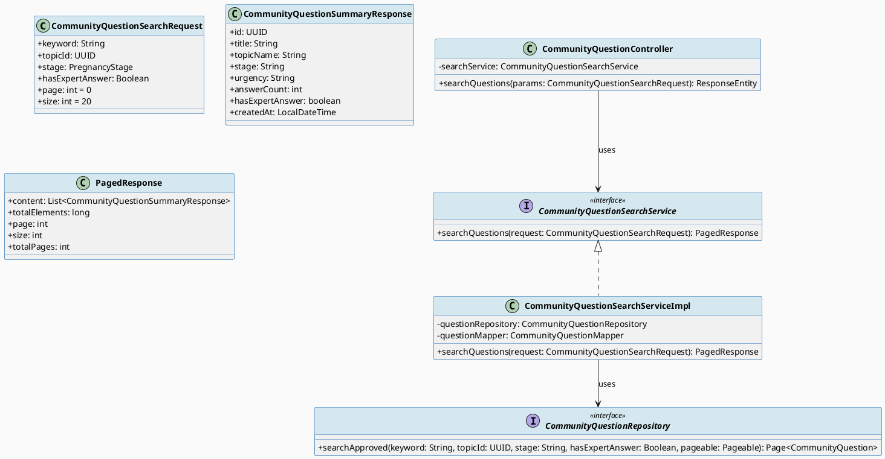
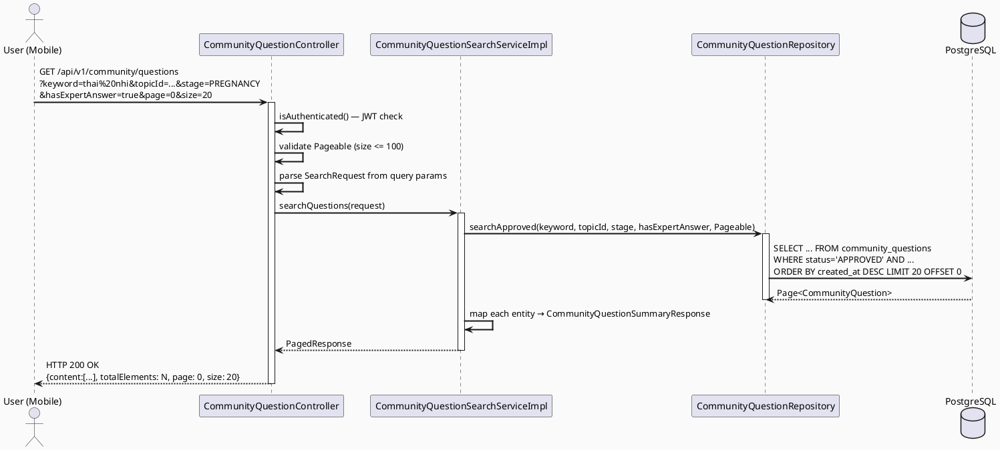
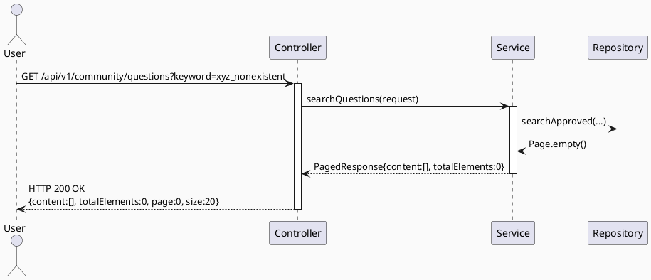

# ENGINEERING DOCUMENTATION STANDARD (EDS) v2.0
# Technical Design Specification — UC-162 Search Community Questions

| Field              | Value                                   |
| ------------------ | --------------------------------------- |
| **Document ID**    | `CB-COMMUNITY-IMP-003`                  |
| **Version**        | `1.0`                                   |
| **Date**           | `2026-06-23`                            |
| **Status**         | `Approved`                              |
| **Document Owner** | `HuyND`                                 |
| **Author**         | `AI Agent — Winston (System Architect)` |
| **Reviewed by**    | `[Tech Lead]`                           |
| **DPO Sign-off**   | `[ ] Pending`                           |
| **Approved by**    | `[Principal Architect]`                 |
| **Last Review**    | `2026-06-23`                            |
| **Based on EDS**   | `v2.0`                                  |

---

## CHANGELOG

| Ngày       | Người thực hiện    | Nội dung thay đổi                                                                                                                                                                         |
| ---------- | ------------------ | ----------------------------------------------------------------------------------------------------------------------------------------------------------------------------------------- |
| 2026-06-23 | AI Agent — Winston | Tạo tài liệu lần đầu cho UC-162 Search Community Questions                                                                                                                                |
| 2026-06-24 | AI Agent — HuyND   | Implement hoàn chỉnh: DTO request/response, CommunityQuestionSearchService interface, ServiceImpl (TDD RED→GREEN), JPQL searchApproved() query, controller GET endpoint, mapper extension |

---

## MỤC LỤC

1. [Tổng quan Module](#1-tổng-quan-module)
2. [Ma trận Truy vết](#2-ma-trận-truy-vết)
3. [Architecture Decision Records](#3-architecture-decision-records)
4. [Non-Functional Requirements & SLA](#4-non-functional-requirements--sla)
5. [Static Modeling](#5-static-modeling-mô-hình-tĩnh)
6. [Dynamic Modeling](#6-dynamic-modeling-mô-hình-động)
7. [Domain Event Catalog](#7-domain-event-catalog)
8. [Interface Specification](#8-interface-specification-đặc-tả-giao-diện)
9. [API Specification](#9-api-specification)
10. [Bảng mã lỗi](#10-bảng-mã-lỗi-error-codes)
11. [Quy trình Triển khai](#11-quy-trình-triển-khai-step-by-step)
12. [Rollback & Incident Runbook](#12-rollback--incident-runbook)
13. [Kịch bản Kiểm thử Chi tiết](#13-kịch-bản-kiểm-thử-chi-tiết)
14. [Phương pháp Xác minh](#14-phương-pháp-xác-minh)
15. [Mẫu thử thực tế](#15-mẫu-thử-thực-tế-api-verification-samples)
16. [Bảng tổng hợp phân quyền](#16-bảng-tổng-hợp-phân-quyền-authorization-matrix)
17. [AI Prompt Constraints](#17-ai-prompt-constraints-case-20)

---

## 1. Tổng quan Module

| Field                     | Value                                                                   |
| ------------------------- | ----------------------------------------------------------------------- |
| **Module Name**           | `SearchCommunityQuestions`                                              |
| **Bounded Context**       | `community`                                                             |
| **UC ID**                 | `UC-162`                                                                |
| **SRS Reference**         | `3.3.8.1`                                                               |
| **Primary Actor**         | `User (any authenticated role)`                                         |
| **Platform**              | `Mobile App (Flutter)`                                                  |
| **Data Classification**   | `Internal`                                                              |
| **Compliance Scope**      | `BR-RBAC`                                                               |
| **Upstream Dependencies** | `security (JWT), community.CommunityQuestion, community.CommunityTopic` |
| **Downstream Consumers**  | `Mobile App search result display`                                      |

**Mô tả:** Cho phép người dùng đã đăng nhập tìm kiếm câu hỏi cộng đồng theo từ khóa, giai đoạn thai kỳ, chủ đề, trạng thái có câu trả lời, và nhãn chuyên gia. Kết quả phải được phân trang. Chỉ trả về các câu hỏi có `status=APPROVED`.

---

## 2. Ma trận Truy vết (Traceability Matrix)

| Requirement ID | Loại          | Mô tả yêu cầu                                        | Thành phần Code                                 | Compliance Target | ADR liên quan |
| -------------- | ------------- | ---------------------------------------------------- | ----------------------------------------------- | ----------------- | ------------- |
| UC-162         | Use Case      | Tìm kiếm câu hỏi cộng đồng                           | `CommunityQuestionController.searchQuestions()` | BR-RBAC           | ADR-COM-007   |
| BR-RBAC        | Business Rule | Authenticated users only                             | `@PreAuthorize("isAuthenticated()")`            | RBAC              | ADR-COM-007   |
| BR-COM-009     | Business Rule | Chỉ trả về APPROVED questions                        | `CommunityQuestionRepository.searchApproved()`  | Moderation        | ADR-COM-007   |
| BR-COM-010     | Business Rule | Kết quả phân trang, mặc định page=0, size=20         | `Pageable`                                      | Performance       | ADR-COM-008   |
| BR-COM-011     | Business Rule | keyword search theo title và body (case-insensitive) | `ILIKE` query                                   | —                 | —             |

---

## 3. Architecture Decision Records (ADR)

### ADR-COM-007 — Chỉ APPROVED questions được trả về trong search

| Field      | Value        |
| ---------- | ------------ |
| **Status** | `Accepted`   |
| **Date**   | `2026-06-23` |

#### Quyết định (Decision)
Search API chỉ query `WHERE status = 'APPROVED'`. PENDING/HIDDEN/LOCKED questions không được hiện với người dùng thông thường (chỉ Moderator mới thấy được trong moderation dashboard — khác UC).

---

### ADR-COM-008 — Pagination mặc định: page=0, size=20, max size=100

| Field      | Value        |
| ---------- | ------------ |
| **Status** | `Accepted`   |
| **Date**   | `2026-06-23` |

#### Quyết định (Decision)
Spring `Pageable` với defaults: page=0, size=20. Max size=100 được enforce tại controller để tránh large result set attacks.

---

## 4. Non-Functional Requirements & SLA

### 4.1. Performance & Availability

| Category     | Requirement                | Target SLA  | Measurement Method |
| ------------ | -------------------------- | ----------- | ------------------ |
| Latency      | Search API response (p99)  | `< 500ms`   | k6 load test       |
| Availability | Uptime                     | `99.9%`     | Monitor            |
| Throughput   | Concurrent search requests | `500 req/s` | Load test          |

### 4.2. Scalability

Full-text search dùng PostgreSQL `ILIKE` cho MVP. Khi tải tăng, migrate sang PostgreSQL `tsvector` full-text search hoặc Elasticsearch.

---

## 5. Static Modeling (Mô hình Tĩnh)

### 5.1. Class Diagram (PlantUML)



### 5.2. Repository Query (Spring Data JPA)

```java
package com.carebridge.backend.community.repository;

import com.carebridge.backend.community.entity.CommunityQuestion;
import com.carebridge.backend.community.entity.QuestionStatus;
import org.springframework.data.domain.Page;
import org.springframework.data.domain.Pageable;
import org.springframework.data.jpa.repository.JpaRepository;
import org.springframework.data.jpa.repository.Query;
import org.springframework.data.repository.query.Param;
import org.springframework.stereotype.Repository;
import java.util.UUID;

@Repository
public interface CommunityQuestionRepository extends JpaRepository<CommunityQuestion, UUID> {

    @Query("""
        SELECT q FROM CommunityQuestion q
        JOIN CommunityTopic t ON q.topicId = t.id
        WHERE q.status = 'APPROVED'
          AND (:keyword IS NULL OR LOWER(q.title) LIKE LOWER(CONCAT('%', :keyword, '%'))
               OR LOWER(q.body) LIKE LOWER(CONCAT('%', :keyword, '%')))
          AND (:topicId IS NULL OR q.topicId = :topicId)
          AND (:stage IS NULL OR q.stage = :stage)
          AND (:hasExpertAnswer IS NULL OR
               (:hasExpertAnswer = true AND q.answerCount > 0 AND
                EXISTS (SELECT a FROM CommunityAnswer a WHERE a.questionId = q.id AND a.isExpertLabeled = true))
               OR (:hasExpertAnswer = false))
        ORDER BY q.createdAt DESC
        """)
    Page<CommunityQuestion> searchApproved(
        @Param("keyword") String keyword,
        @Param("topicId") UUID topicId,
        @Param("stage") String stage,
        @Param("hasExpertAnswer") Boolean hasExpertAnswer,
        Pageable pageable
    );
}
```

---

## 6. Dynamic Modeling (Mô hình Động)

### 6.1. Sequence Diagram — Happy Path (PlantUML)



### 6.2. Sequence Diagram — Empty Result



---

## 7. Domain Event Catalog

Search là read-only operation — không phát ra domain events.

---

## 8. Interface Specification (Đặc tả Giao diện)

### 8.1. Service Interface

```java
package com.carebridge.backend.community.service;

import com.carebridge.backend.community.dto.request.CommunityQuestionSearchRequest;
import com.carebridge.backend.community.dto.response.PagedResponse;

/**
 * @version 1.0
 */
public interface CommunityQuestionSearchService {

    /**
     * Searches community questions with filters. Only returns APPROVED questions.
     * @param request search parameters (keyword, topicId, stage, hasExpertAnswer, page, size)
     * @return PagedResponse with CommunityQuestionSummaryResponse items
     */
    PagedResponse<CommunityQuestionSummaryResponse> searchQuestions(CommunityQuestionSearchRequest request);
}
```

### 8.2. DTOs

```java
package com.carebridge.backend.community.dto.request;

import com.carebridge.backend.community.entity.PregnancyStage;
import jakarta.validation.constraints.Max;
import jakarta.validation.constraints.Min;
import lombok.Data;
import java.util.UUID;

@Data
public class CommunityQuestionSearchRequest {
    private String keyword;           // nullable — no filter if null
    private UUID topicId;             // nullable
    private PregnancyStage stage;     // nullable
    private Boolean hasExpertAnswer;  // nullable

    @Min(0) private int page = 0;
    @Min(1) @Max(100) private int size = 20;
}
```

```java
package com.carebridge.backend.community.dto.response;

import java.time.LocalDateTime;
import java.util.UUID;

public record CommunityQuestionSummaryResponse(
    UUID id,
    String title,
    String topicName,
    String stage,
    String urgency,
    int answerCount,
    boolean hasExpertAnswer,
    LocalDateTime createdAt
) {}
```

---

## 9. API Specification

### 9.1. Endpoints Table

| Method | Path                          | Auth Level | Required Roles    | Rate Limit | Idempotent? |
| ------ | ----------------------------- | ---------- | ----------------- | ---------- | ----------- |
| `GET`  | `/api/v1/community/questions` | JWT Bearer | Any authenticated | 300/min    | Yes         |

### 9.2. Request / Response Schemas

#### `GET /api/v1/community/questions`

**Query Parameters:**
- `keyword` (optional): string, search in title and body
- `topicId` (optional): UUID
- `stage` (optional): enum `PRE_PREGNANCY|PREGNANCY|POSTPARTUM|BABY_CARE`
- `hasExpertAnswer` (optional): boolean
- `page` (optional, default=0): integer >= 0
- `size` (optional, default=20, max=100): integer

**Request Headers:**
```
Authorization: Bearer <JWT_TOKEN>
```

**Response — 200 OK:**
```json
{
  "content": [
    {
      "id": "550e8400-e29b-41d4-a716-446655440000",
      "title": "Thai nhi 28 tuần đạp nhiều ban đêm có bình thường không?",
      "topicName": "Thai kỳ",
      "stage": "PREGNANCY",
      "urgency": "NORMAL",
      "answerCount": 5,
      "hasExpertAnswer": true,
      "createdAt": "2026-06-23T10:00:00.000Z"
    }
  ],
  "totalElements": 42,
  "page": 0,
  "size": 20,
  "totalPages": 3
}
```

**Response — 200 OK (Empty Result):**
```json
{
  "content": [],
  "totalElements": 0,
  "page": 0,
  "size": 20,
  "totalPages": 0
}
```

**Response — 401 (No JWT):**
```json
{
  "error": {
    "code": "IAM-001",
    "message": "Authentication required"
  }
}
```

---

## 10. Bảng mã lỗi (Error Codes)

| Code      | HTTP Status | Message (EN)            | Message (VI)         | Trigger Condition             |
| --------- | ----------- | ----------------------- | -------------------- | ----------------------------- |
| `COM-001` | 400         | Validation failed       | Dữ liệu không hợp lệ | size > 100 hoặc page < 0      |
| `COM-004` | 401         | Authentication required | Yêu cầu đăng nhập    | Không có JWT hoặc JWT hết hạn |
| `COM-005` | 500         | Internal server error   | Lỗi hệ thống         | DB query failed               |

---

## 11. Quy trình Triển khai (Step-by-Step)

### 11.1. Prerequisites

- [ ] ADR-COM-007, ADR-COM-008 đã Accepted
- [ ] community_questions table (UC-54) và community_topics table (UC-109) đã tồn tại

### 11.2. Implementation Steps

#### Chặng 1 — Thêm index cho full-text search

```sql
-- V004__add_community_search_indexes.sql
-- GIN index for full-text search (optional optimization, after MVP)
CREATE INDEX idx_community_questions_title_gin ON community_questions USING gin(to_tsvector('simple', title));
CREATE INDEX idx_community_questions_body_gin ON community_questions USING gin(to_tsvector('simple', body));
-- For MVP, ILIKE with existing indexes is sufficient
```

#### Chặng 2 — Backend Implementation

```
1. dto/request/CommunityQuestionSearchRequest.java
2. dto/response/CommunityQuestionSummaryResponse.java
3. repository/CommunityQuestionRepository.java — add searchApproved() @Query
4. service/CommunityQuestionSearchService.java (interface)
5. service/CommunityQuestionSearchServiceImpl.java
6. controller/CommunityQuestionController.java — add searchQuestions() GET endpoint
```

#### Chặng 3 — Verification

```bash
curl -X GET "https://[host]/api/v1/community/questions?keyword=thai+nhi&stage=PREGNANCY&page=0&size=10" \
  -H "Authorization: Bearer [USER_JWT]"
# Expected: 200 OK, content array, totalElements >= 0
```

---

## 12. Rollback & Incident Runbook

### 12.1. Điều kiện kích hoạt Rollback

| Điều kiện               | Ngưỡng | Người quyết định |
| ----------------------- | ------ | ---------------- |
| Search latency p99 > 2s | 5 phút | On-call Engineer |
| DB CPU spike > 90%      | 3 phút | On-call Engineer |

### 12.2. Rollback Procedure

```bash
kubectl rollout undo deployment/carebridge-api
# Search indexes rollback:
psql -h [host] -U carebridge carebridge_db -c "DROP INDEX IF EXISTS idx_community_questions_title_gin;"
```

---

## 13. Kịch bản Kiểm thử Chi tiết

### 13.1. Unit Tests

#### TC-UNIT-001 — Tìm kiếm theo keyword trả về APPROVED questions

```gherkin
Feature: UC-162 Search Community Questions
  Background:
    Given test data classification: SYNTHETIC

  Scenario: keyword="thai nhi" trả về matching APPROVED questions
    Given repository mock trả về 2 questions với title chứa "thai nhi", status=APPROVED
    When searchQuestions(keyword="thai nhi", page=0, size=20) được gọi
    Then response.content.size() = 2
    And mọi item trong content đều có status=APPROVED (không trả về field này nhưng test thông qua service)

  Scenario: Không có keyword — trả về tất cả APPROVED questions
    Given repository mock trả về 5 APPROVED questions
    When searchQuestions(keyword=null, page=0, size=20) được gọi
    Then response.content.size() = 5
    And response.totalElements = 5

  Scenario: size > 100 bị enforce về 100
    Given request có size=200
    When searchQuestions() được gọi
    Then Pageable.pageSize = 100 (max enforced)
```

### 13.2. Integration Tests

#### TC-INT-001 — End-to-end search với DB

```gherkin
  Scenario: Search với keyword khớp title — trả về kết quả đúng
    Given database có 3 APPROVED questions, 1 PENDING question
    And 2 trong 3 APPROVED có title chứa "thai nhi"
    When GET /api/v1/community/questions?keyword=thai+nhi
    Then response.content.size() = 2
    And response.totalElements = 2
    And PENDING question KHÔNG có trong kết quả

  Scenario: Filter theo stage=PREGNANCY
    Given 5 APPROVED questions: 3 stage=PREGNANCY, 2 stage=BABY_CARE
    When GET /api/v1/community/questions?stage=PREGNANCY
    Then response.content.size() = 3
    And tất cả items có stage = "PREGNANCY"

  Scenario: Filter theo hasExpertAnswer=true
    Given 2 questions có expert-labeled answer, 3 không có
    When GET /api/v1/community/questions?hasExpertAnswer=true
    Then response.content.size() = 2
    And tất cả items có hasExpertAnswer = true
```

### 13.3. Security Tests

#### TC-SEC-001 — Unauthenticated → 401

```gherkin
  Scenario: Request không có JWT
    Given không có Authorization header
    When GET /api/v1/community/questions?keyword=test
    Then response status = 401
```

#### TC-SEC-002 — SQL injection trong keyword

```gherkin
  Scenario: SQL injection attempt trong keyword parameter
    Given valid JWT
    When GET /api/v1/community/questions?keyword='; DROP TABLE community_questions; --
    Then response status = 200 (input sanitized, query parameterized)
    And community_questions table vẫn tồn tại và không bị xóa
```

---

## 14. Phương pháp Xác minh

### 14.1. Database Inspection

```sql
-- Verify chỉ APPROVED questions được trả về
SELECT DISTINCT status FROM community_questions WHERE title ILIKE '%thai nhi%';
-- Expected: only 'APPROVED'

-- Verify PENDING questions không xuất hiện
SELECT COUNT(*) FROM community_questions WHERE status = 'PENDING';
-- Compare with API totalElements — should differ
```

---

## 15. Mẫu thử thực tế (API Verification Samples)

### 15.1. Happy Path — Full filter search

```bash
curl -X GET "https://[host]/api/v1/community/questions?keyword=thai+nhi&topicId=3fa85f64-5717-4562-b3fc-2c963f66afa6&stage=PREGNANCY&hasExpertAnswer=true&page=0&size=10" \
  -H "Authorization: Bearer [USER_JWT]"
```

### 15.2. Pagination

```bash
# Page 2
curl -X GET "https://[host]/api/v1/community/questions?page=1&size=20" \
  -H "Authorization: Bearer [USER_JWT]"
```

### 15.3. Error Path

```bash
# Không có JWT → 401
curl -X GET "https://[host]/api/v1/community/questions"
```

---

## 16. Bảng tổng hợp phân quyền (Authorization Matrix)

| Endpoint                          | `UNAUTHENTICATED` | `MOTHER` | `EXPERT` | `MODERATOR` | `ADMIN` |
| --------------------------------- | ----------------- | -------- | -------- | ----------- | ------- |
| `GET /api/v1/community/questions` | ❌ (401)           | ✅        | ✅        | ✅           | ✅       |

---

## 17. AI Prompt Constraints (CASE 2.0)

### 17.1 Constraint Summary Table

| #   | Constraint                                                                                           | Source        | Last Verified |
| --- | ---------------------------------------------------------------------------------------------------- | ------------- | ------------- |
| C1  | `searchApproved()` PHẢI filter `status = 'APPROVED'` — KHÔNG bao giờ trả về PENDING/HIDDEN/LOCKED    | `ADR-COM-007` | `2026-06-23`  |
| C2  | `size` max = 100 được enforce tại controller/service — reject size > 100 hoặc cap về 100             | `ADR-COM-008` | `2026-06-23`  |
| C3  | keyword search phải dùng parameterized query — KHÔNG string concatenation (SQL injection prevention) | `OWASP A03`   | `2026-06-23`  |
| C4  | Empty result trả về `200 OK` với `content: []` — KHÔNG 404                                           | `BR-COM-010`  | `2026-06-23`  |
| C5  | `@PreAuthorize("isAuthenticated()")` tại controller                                                  | `BR-RBAC`     | `2026-06-23`  |

### 17.2 Constraint Injection Block

```
[CONSTRAINT BLOCK — Module: SearchCommunityQuestions]
1. searchApproved() query PHẢI include WHERE status = 'APPROVED'. Không exclude filter này.
2. Request.size > 100 PHẢI bị cap về 100 hoặc reject với COM-001.
3. Keyword search dùng :keyword JPA parameter — không String.format() hay concatenation.
4. Empty search result trả về 200 OK với content:[]. Không 404.
5. @PreAuthorize("isAuthenticated()") tại controller — bất kỳ authenticated role.
```

### 17.3 Anti-Pattern Detection

| AP-ID     | Anti-Pattern          | Dấu hiệu                                         | Hành động          |
| --------- | --------------------- | ------------------------------------------------ | ------------------ |
| AP-AI-001 | Unconstrained Gen     | Query không filter status=APPROVED               | Reject — inject C1 |
| AP-AI-003 | Implicit Decision     | Code return 404 khi empty                        | Reject — C4        |
| AP-AI-005 | Hallucinated Contract | Code dùng ElasticsearchService không có trong §8 | Reject             |

### 17.4 Anti-Pattern Detection

| AP-ID | Anti-Pattern | Dấu hiệu | Hành động |
|-------|-------------|-----------|----------|
| AP-AI-001 | Unconstrained Gen | Code không match constraint C1-C5 | Reject — inject lại constraints |
| AP-AI-003 | Implicit Decision | Code assume architecture không có ADR | Reject — viết ADR trước |
| AP-AI-005 | Hallucinated Contract | Code import không có trong §8 | Reject — verify contract |

---

## PHỤ LỤC

### A. Glossary (Thuật ngữ)

| Thuật ngữ | Định nghĩa |
|-----------|------------|
| ILIKE | PostgreSQL case-insensitive LIKE operator — dùng cho keyword search |
| GIN Index | Generalized Inverted Index — tối ưu full-text search trên PostgreSQL |
| hasExpertAnswer | Flag cho biết câu hỏi đã có câu trả lời được đánh dấu từ chuyên gia |

### B. Tài liệu tham chiếu

| Document | Path |
|----------|------|
| EDS v2.0 Template | `08_References/Template/PHASE-3_TDS.md` |

---

*EDS v2.1 — Tích hợp CASE 2.0 AI Prompt Constraints (§17).*
