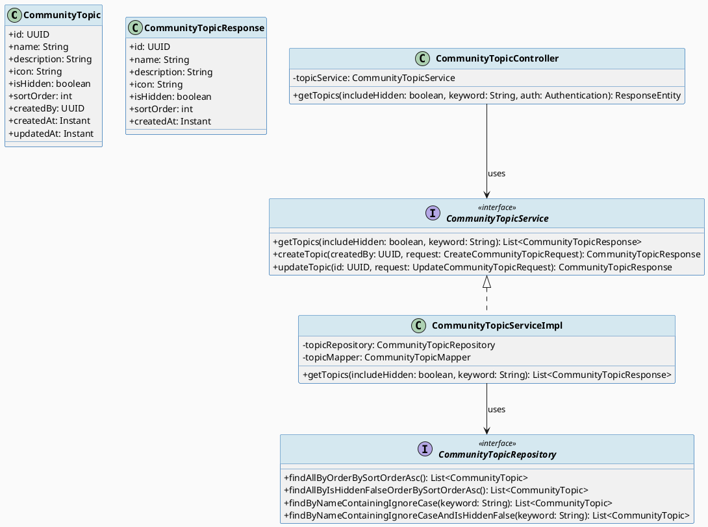
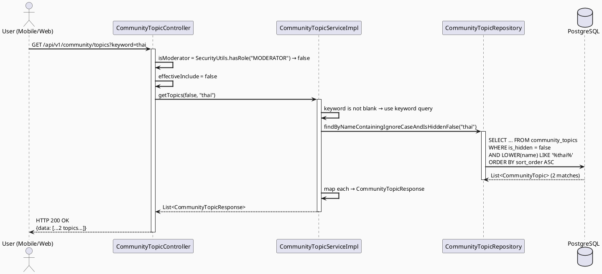
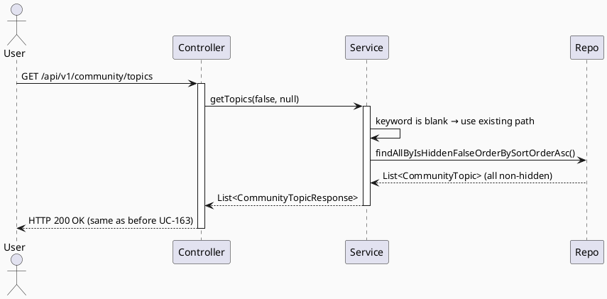

# ENGINEERING DOCUMENTATION STANDARD (EDS) v2.0
# Technical Design Specification — UC-163 Search Community Topics

| Field              | Value                             |
| ------------------ | --------------------------------- |
| **Document ID**    | `CB-COMMUNITY-IMP-009`            |
| **Version**        | `1.0`                             |
| **Date**           | `2026-06-29`                      |
| **Status**         | `Approved`                        |
| **Document Owner** | `HuyND`                           |
| **Author**         | `AI Agent`                        |
| **Reviewed by**    | `[Tech Lead]`                     |
| **DPO Sign-off**   | `[ ] Pending`                     |
| **Approved by**    | `[Principal Architect]`           |
| **Last Review**    | `2026-06-29`                      |
| **Based on EDS**   | `v2.0`                            |

---

## CHANGELOG

| Ngày       | Người thực hiện | Nội dung thay đổi                                                         |
| ---------- | --------------- | ------------------------------------------------------------------------- |
| 2026-06-29 | AI Agent        | Tạo tài liệu lần đầu cho UC-163 Search Community Topics — minimal change |
| 2026-06-29 | AI Agent — Amelia (Dev Agent) | Implemented searchByKeyword/searchByKeywordIncludingHidden JPQL queries, searchTopics in service, updated getTopics controller to accept keyword param; 6 tests passing | Implemented |
| 2026-07-03 | AI Agent — Claude (Audit Pass) | `searchTopics()`/`getTopics()` signatures gained a `currentUserId` param as part of the UC-171 follow-state hydration fix (see UC-171 TDS changelog for detail) — search behavior itself unchanged, only the response now carries real `isFollowed` per result. |

---

## MỤC LỤC

1. [Tổng quan Module](#1-tổng-quan-module)
2. [Ma trận Truy vết](#2-ma-trận-truy-vết)
3. [Architecture Decision Records](#3-architecture-decision-records)
4. [Non-Functional Requirements & SLA](#4-non-functional-requirements--sla)
5. [Static Modeling](#5-static-modeling-mô-hình-tĩnh)
6. [Dynamic Modeling](#6-dynamic-modeling-mô-hình-động)
7. [Domain Event Catalog](#7-domain-event-catalog)
8. [Interface Specification](#8-interface-specification-đặc-tả-giao-diện)
9. [API Specification](#9-api-specification)
10. [Bảng mã lỗi](#10-bảng-mã-lỗi-error-codes)
11. [Quy trình Triển khai](#11-quy-trình-triển-khai-step-by-step)
12. [Rollback & Incident Runbook](#12-rollback--incident-runbook)
13. [Kịch bản Kiểm thử Chi tiết](#13-kịch-bản-kiểm-thử-chi-tiết)
14. [Phương pháp Xác minh](#14-phương-pháp-xác-minh)
15. [Mẫu thử thực tế](#15-mẫu-thử-thực-tế-api-verification-samples)
16. [Bảng tổng hợp phân quyền](#16-bảng-tổng-hợp-phân-quyền-authorization-matrix)
17. [AI Prompt Constraints](#17-ai-prompt-constraints-case-20)

---

## 1. Tổng quan Module

| Field                     | Value                                                                  |
| ------------------------- | ---------------------------------------------------------------------- |
| **Module Name**           | `SearchCommunityTopics`                                                |
| **Bounded Context**       | `community`                                                            |
| **UC ID**                 | `UC-163`                                                               |
| **SRS Reference**         | `3.3.8.2`                                                              |
| **Primary Actor**         | `Any user (public endpoint, no auth required)`                         |
| **Platform**              | `Mobile App (Flutter) + Web`                                           |
| **Data Classification**   | `Public`                                                               |
| **Compliance Scope**      | `N/A`                                                                  |
| **Upstream Dependencies** | `community.CommunityTopic`                                             |
| **Downstream Consumers**  | `Mobile App topic picker, Web topic search dropdown`                   |

**Mô tả:** Cho phép người dùng tìm kiếm chủ đề cộng đồng (topics) theo từ khóa. Đây là **minimal change** — chỉ thêm tham số `keyword` vào endpoint `GET /api/v1/community/topics` đang tồn tại. Không có migration schema, không có entity mới. Khi `keyword` vắng mặt hoặc rỗng, hành vi hiện tại được bảo toàn hoàn toàn.

---

## 2. Ma trận Truy vết (Traceability Matrix)

| Requirement ID | Loại          | Mô tả yêu cầu                                    | Thành phần Code                                     | Compliance Target | ADR liên quan |
| -------------- | ------------- | ------------------------------------------------ | --------------------------------------------------- | ----------------- | ------------- |
| UC-163         | Use Case      | Tìm kiếm chủ đề cộng đồng theo từ khóa          | `CommunityTopicController.getTopics()`              | —                 | ADR-COM-009   |
| BR-COM-012     | Business Rule | keyword là optional; blank → trả về toàn bộ     | `CommunityTopicServiceImpl.getTopics()`             | —                 | ADR-COM-009   |
| BR-COM-013     | Business Rule | Tìm kiếm case-insensitive trên trường `name`     | `CommunityTopicRepository` JPQL query               | —                 | ADR-COM-009   |
| BR-COM-014     | Business Rule | Max keyword length = 100 chars                   | `@Size(max=100)` trên param hoặc service guard      | —                 | —             |
| BR-COM-004     | Business Rule | Kết quả sắp xếp theo `sortOrder ASC`             | JPQL `ORDER BY t.sortOrder ASC`                     | —                 | —             |
| BR-COM-015     | Business Rule | Non-moderator: chỉ non-hidden topics             | `isHidden=false` filter khi không phải MODERATOR    | RBAC              | ADR-COM-010   |
| BR-COM-016     | Business Rule | MODERATOR + includeHidden=true: cả hidden topics | Combined keyword + hidden filter                    | RBAC              | ADR-COM-010   |

---

## 3. Architecture Decision Records (ADR)

### ADR-COM-009 — Keyword search là minimal change trên endpoint hiện tại

| Field      | Value        |
| ---------- | ------------ |
| **Status** | `Accepted`   |
| **Date**   | `2026-06-29` |

#### Bối cảnh (Context)
UC-163 yêu cầu tìm kiếm topic theo tên. Endpoint `GET /api/v1/community/topics` đã tồn tại và phục vụ danh sách đầy đủ. Có hai lựa chọn: (A) thêm query param `keyword` vào endpoint hiện tại, hoặc (B) tạo endpoint mới `GET /api/v1/community/topics/search`.

#### Các phương án đã xem xét (Options Considered)

| Phương án | Mô tả                                           | Ưu điểm                                    | Nhược điểm                              |
| --------- | ----------------------------------------------- | ------------------------------------------ | --------------------------------------- |
| A         | Thêm `?keyword=` vào endpoint hiện tại          | Backward-compatible, không thay đổi URL    | Signature controller thay đổi nhẹ       |
| B         | Tạo endpoint mới `/topics/search`               | Tách biệt rõ ràng                          | Duplicate code, client phải update URL  |

#### Quyết định (Decision)
Chọn **Phương án A** vì: backward-compatible (client không truyền `keyword` = hành vi cũ), ít code thay đổi nhất, và phù hợp nguyên tắc "minimal change" của CareBridge.

#### Hệ quả (Consequences)

**Tích cực:**
- Không có breaking change với client hiện tại.
- Chỉ cần thêm 2 repository query methods và sửa 1 service method signature.

**Tiêu cực / Trade-offs:**
- Service interface `getTopics()` thay đổi signature (thêm `keyword` param) — client code phải compile lại.

---

### ADR-COM-010 — Security: includeHidden được enforce bởi MODERATOR role, không phải client

| Field      | Value        |
| ---------- | ------------ |
| **Status** | `Accepted`   |
| **Date**   | `2026-06-29` |

#### Quyết định (Decision)
Dù client gửi `includeHidden=true`, controller luôn kiểm tra `SecurityUtils.hasRole("MODERATOR")`. Nếu không phải MODERATOR, `effectiveInclude = false` bất kể input. Hành vi này đã có sẵn — cần giữ nguyên khi thêm `keyword`.

---

## 4. Non-Functional Requirements & SLA

### 4.1. Performance & Availability

| Category   | Requirement               | Target SLA  | Measurement Method |
| ---------- | ------------------------- | ----------- | ------------------ |
| Latency    | Topics search (p99)       | `< 200ms`   | k6 load test       |
| Availability | Uptime                  | `99.9%`     | Monitor            |
| Throughput | Concurrent search requests | `500 req/s` | Load test          |

### 4.2. Scalability

Topics là dataset nhỏ (< 100 records). ILIKE với `LOWER(name)` là đủ cho MVP. Index `idx_community_topics_name` có thể được thêm nếu cần.

---

## 5. Static Modeling (Mô hình Tĩnh)

### 5.1. Class Diagram (PlantUML)



### 5.2. Data Structure

**No new migration required.** UC-163 is a query-only change. The `community_topics` table already exists. Two new JPQL query methods are added to `CommunityTopicRepository`.

```java
// New methods added to CommunityTopicRepository:

@Query("SELECT t FROM CommunityTopic t WHERE LOWER(t.name) LIKE LOWER(CONCAT('%', :keyword, '%')) ORDER BY t.sortOrder ASC")
List<CommunityTopic> findByNameContainingIgnoreCase(@Param("keyword") String keyword);

@Query("SELECT t FROM CommunityTopic t WHERE t.isHidden = false AND LOWER(t.name) LIKE LOWER(CONCAT('%', :keyword, '%')) ORDER BY t.sortOrder ASC")
List<CommunityTopic> findByNameContainingIgnoreCaseAndIsHiddenFalse(@Param("keyword") String keyword);
```

---

## 6. Dynamic Modeling (Mô hình Động)

### 6.1. Sequence Diagram — Happy Path with keyword (PlantUML)



### 6.2. Sequence Diagram — No keyword (backward compat)



---

## 7. Domain Event Catalog

UC-163 is a read-only operation — no domain events are published or consumed.

---

## 8. Interface Specification (Đặc tả Giao diện)

### 8.1. Service Interface (updated signature)

```java
package com.carebridge.backend.community.service;

import com.carebridge.backend.community.dto.response.CommunityTopicResponse;
import java.util.List;

/**
 * @version 1.1
 * @breaking-change getTopics() signature extended with keyword param (backward-compat: pass null)
 */
public interface CommunityTopicService {

    /**
     * Returns community topics, optionally filtered by keyword (case-insensitive name match).
     * @param includeHidden if true AND caller has MODERATOR role, include hidden topics
     * @param keyword       optional search term; null or blank = return all
     * @return topics ordered by sortOrder ASC
     */
    List<CommunityTopicResponse> getTopics(boolean includeHidden, String keyword);

    CommunityTopicResponse createTopic(UUID createdBy, CreateCommunityTopicRequest request);

    CommunityTopicResponse updateTopic(UUID id, UpdateCommunityTopicRequest request);
}
```

### 8.2. Repository Interface (new query methods)

```java
package com.carebridge.backend.community.repository;

import com.carebridge.backend.community.entity.CommunityTopic;
import org.springframework.data.jpa.repository.JpaRepository;
import org.springframework.data.jpa.repository.Query;
import org.springframework.data.repository.query.Param;
import java.util.List;
import java.util.Optional;
import java.util.UUID;

public interface CommunityTopicRepository extends JpaRepository<CommunityTopic, UUID> {

    // Existing methods (unchanged):
    List<CommunityTopic> findAllByOrderBySortOrderAsc();
    List<CommunityTopic> findAllByIsHiddenFalseOrderBySortOrderAsc();
    boolean existsByNameIgnoreCase(String name);
    boolean existsByNameIgnoreCaseAndIdNot(String name, UUID id);
    Optional<CommunityTopic> findByIdAndIsHiddenFalse(UUID id);

    // New methods for UC-163:

    @Query("SELECT t FROM CommunityTopic t WHERE LOWER(t.name) LIKE LOWER(CONCAT('%', :keyword, '%')) ORDER BY t.sortOrder ASC")
    List<CommunityTopic> findByNameContainingIgnoreCase(@Param("keyword") String keyword);

    @Query("SELECT t FROM CommunityTopic t WHERE t.isHidden = false AND LOWER(t.name) LIKE LOWER(CONCAT('%', :keyword, '%')) ORDER BY t.sortOrder ASC")
    List<CommunityTopic> findByNameContainingIgnoreCaseAndIsHiddenFalse(@Param("keyword") String keyword);
}
```

### 8.3. Controller Method (updated signature)

```java
// In CommunityTopicController:

@GetMapping
public ResponseEntity<ApiResponse<List<CommunityTopicResponse>>> getTopics(
        @RequestParam(defaultValue = "false") boolean includeHidden,
        @RequestParam(required = false) @Size(max = 100) String keyword,
        Authentication authentication) {
    boolean isModerator = SecurityUtils.hasRole("MODERATOR");
    boolean effectiveInclude = includeHidden && isModerator;
    return ResponseEntity.ok(ApiResponse.success(topicService.getTopics(effectiveInclude, keyword)));
}
```

---

## 9. API Specification

### 9.1. Endpoints Table

| Method | Path                          | Auth Level | Required Roles  | Rate Limit | Idempotent? |
| ------ | ----------------------------- | ---------- | --------------- | ---------- | ----------- |
| `GET`  | `/api/v1/community/topics`    | None       | Public          | 300/min    | Yes         |

### 9.2. Request / Response Schemas

#### `GET /api/v1/community/topics`

**Query Parameters:**
- `keyword` (optional): string, max 100 chars — case-insensitive match on topic `name`
- `includeHidden` (optional, default=false): boolean — only effective for MODERATOR role

**Response — 200 OK (matches found):**
```json
{
  "data": [
    {
      "id": "3fa85f64-5717-4562-b3fc-2c963f66afa6",
      "name": "Thai kỳ",
      "description": "Chủ đề về thai kỳ",
      "icon": "pregnancy-icon",
      "isHidden": false,
      "sortOrder": 1,
      "createdAt": "2026-01-01T00:00:00.000Z"
    }
  ]
}
```

**Response — 200 OK (no matches):**
```json
{
  "data": []
}
```

**Response — 400 Bad Request (keyword too long):**
```json
{
  "error": {
    "code": "COM-001",
    "message": "Keyword must not exceed 100 characters"
  }
}
```

---

## 10. Bảng mã lỗi (Error Codes)

| Code      | HTTP Status | Message (EN)                        | Trigger Condition                               |
| --------- | ----------- | ----------------------------------- | ----------------------------------------------- |
| `COM-001` | 400         | Keyword must not exceed 100 characters | `keyword.length() > 100`                     |

> No new error codes are introduced. Empty keyword returns 200 with full list (C1).

---

## 11. Quy trình Triển khai (Step-by-Step)

### 11.1. Prerequisites

- [ ] ADR-COM-009 và ADR-COM-010 đã Accepted
- [ ] `community_topics` table tồn tại (UC-109 implemented)
- [ ] `CommunityTopicController`, `CommunityTopicService`, `CommunityTopicServiceImpl` đã tồn tại

### 11.2. Pre-Migration Checklist

> **No migration needed.** UC-163 introduces no schema changes.

### 11.3. Implementation Steps

> **This is a MINIMAL change** — only 3 files are modified; no new files are created.

#### Chặng 1 — Update `CommunityTopicRepository` (add 2 query methods)

Thêm hai `@Query` methods vào `CommunityTopicRepository.java` (xem §8.2).

#### Chặng 2 — Update `CommunityTopicService` interface

Thay đổi signature `getTopics(boolean includeHidden)` → `getTopics(boolean includeHidden, String keyword)`.

#### Chặng 3 — Update `CommunityTopicServiceImpl.getTopics()`

```java
@Override
public List<CommunityTopicResponse> getTopics(boolean includeHidden, String keyword) {
    List<CommunityTopic> topics;
    boolean hasKeyword = keyword != null && !keyword.isBlank();

    if (hasKeyword) {
        topics = includeHidden
            ? topicRepository.findByNameContainingIgnoreCase(keyword)
            : topicRepository.findByNameContainingIgnoreCaseAndIsHiddenFalse(keyword);
    } else {
        topics = includeHidden
            ? topicRepository.findAllByOrderBySortOrderAsc()
            : topicRepository.findAllByIsHiddenFalseOrderBySortOrderAsc();
    }

    return topics.stream().map(topicMapper::toResponse).toList();
}
```

#### Chặng 4 — Update `CommunityTopicController.getTopics()`

Thêm `@RequestParam(required = false) @Size(max = 100) String keyword` và pass vào service (xem §8.3).

#### Chặng 5 — Verification

```bash
# No keyword → same as before
curl -X GET "http://localhost:8080/api/v1/community/topics"

# Keyword search
curl -X GET "http://localhost:8080/api/v1/community/topics?keyword=thai"

# Moderator with hidden topics
curl -X GET "http://localhost:8080/api/v1/community/topics?keyword=thai&includeHidden=true" \
  -H "Authorization: Bearer [MODERATOR_JWT]"
```

### 11.4. Deployment Checklist

- [ ] No migration to apply
- [ ] Compile check: `./mvnw compile` với 0 errors
- [ ] Unit tests pass: `./mvnw test -pl 05_Development/CareBridgeAPI`
- [ ] Smoke test: GET /api/v1/community/topics?keyword=thai returns valid JSON

---

## 12. Rollback & Incident Runbook

### 12.1. Rollback Procedure

No migration to roll back. Revert the 3 modified files:

```bash
git revert HEAD -- src/main/java/com/carebridge/backend/community/repository/CommunityTopicRepository.java
git revert HEAD -- src/main/java/com/carebridge/backend/community/service/CommunityTopicService.java
git revert HEAD -- src/main/java/com/carebridge/backend/community/service/CommunityTopicServiceImpl.java
git revert HEAD -- src/main/java/com/carebridge/backend/community/controller/CommunityTopicController.java
kubectl rollout undo deployment/carebridge-api
```

---

## 13. Kịch bản Kiểm thử Chi tiết

### 13.1. Unit Tests

#### TC-UNIT-001 — keyword=null trả về toàn bộ non-hidden topics

```gherkin
Feature: UC-163 Search Community Topics
  Scenario: No keyword returns all non-hidden topics
    Given repository returns 3 non-hidden topics
    When getTopics(false, null) is called
    Then response contains 3 topics
    And existing behavior is preserved
```

#### TC-UNIT-002 — keyword matches case-insensitively

```gherkin
  Scenario: keyword "thai" matches topics with "Thai" or "THAI" in name
    Given repository mock for findByNameContainingIgnoreCaseAndIsHiddenFalse("thai")
    And mock returns 2 matching topics
    When getTopics(false, "thai") is called
    Then response contains 2 topics
```

#### TC-UNIT-003 — keyword case-insensitive (uppercase input)

```gherkin
  Scenario: Uppercase keyword "THAI" returns same result as "thai"
    Given repository mock for findByNameContainingIgnoreCaseAndIsHiddenFalse("THAI")
    And mock returns 2 matching topics
    When getTopics(false, "THAI") is called
    Then response contains 2 topics
```

#### TC-UNIT-004 — keyword with no matches returns empty list

```gherkin
  Scenario: keyword matches nothing
    Given repository mock returns empty list for keyword "xyz_no_match"
    When getTopics(false, "xyz_no_match") is called
    Then response is empty list (not exception, not 404)
```

#### TC-UNIT-005 — Non-moderator ignores includeHidden

```gherkin
  Scenario: Non-moderator sends includeHidden=true + keyword
    Given current user does NOT have MODERATOR role
    When getTopics(false, "thai") is called [effectiveInclude=false]
    Then repository.findByNameContainingIgnoreCaseAndIsHiddenFalse("thai") is used
    And hidden topics are NOT returned
```

#### TC-UNIT-006 — Moderator with includeHidden=true + keyword

```gherkin
  Scenario: Moderator sends includeHidden=true + keyword
    Given current user HAS MODERATOR role
    When getTopics(true, "thai") is called
    Then repository.findByNameContainingIgnoreCase("thai") is used (includes hidden)
    And matching hidden topics ARE returned
```

### 13.2. Integration Tests

#### TC-INT-001 — Full search flow with real DB

```gherkin
  Scenario: Save 3 topics, search by keyword, verify count
    Given 3 topics are saved: "Thai kỳ", "Thai sản", "Sơ sinh bé"
    And 1 topic does not match keyword "thai": "Sơ sinh bé"
    When GET /api/v1/community/topics?keyword=thai
    Then response.data.length = 2
    And both matched topics have names containing "thai" (case-insensitive)
```

---

## 14. Phương pháp Xác minh

### 14.1. Database Inspection

```sql
-- Verify keyword-matching topics
SELECT id, name, sort_order FROM community_topics
WHERE LOWER(name) LIKE '%thai%' AND is_hidden = false
ORDER BY sort_order ASC;

-- Verify hidden topics NOT returned to regular users
SELECT COUNT(*) FROM community_topics WHERE is_hidden = true;
-- Should NOT appear in regular GET /api/v1/community/topics?keyword=thai
```

---

## 15. Mẫu thử thực tế (API Verification Samples)

### 15.1. Keyword search (public)

```bash
curl -X GET "http://localhost:8080/api/v1/community/topics?keyword=thai"
# Expected: 200 OK, topics with "thai" in name, ordered by sortOrder
```

### 15.2. No keyword (backward compat)

```bash
curl -X GET "http://localhost:8080/api/v1/community/topics"
# Expected: 200 OK, all non-hidden topics (same as before UC-163)
```

### 15.3. Moderator includes hidden

```bash
curl -X GET "http://localhost:8080/api/v1/community/topics?keyword=thai&includeHidden=true" \
  -H "Authorization: Bearer [MODERATOR_JWT]"
# Expected: 200 OK, includes hidden topics matching "thai"
```

### 15.4. Keyword too long → 400

```bash
curl -X GET "http://localhost:8080/api/v1/community/topics?keyword=$(python3 -c "print('a'*101)")"
# Expected: 400, COM-001
```

---

## 16. Bảng tổng hợp phân quyền (Authorization Matrix)

| Endpoint                                       | `UNAUTHENTICATED` | `MOTHER` | `EXPERT` | `MODERATOR`         | `SYSTEM_ADMIN` |
| ---------------------------------------------- | ----------------- | -------- | -------- | ------------------- | -------------- |
| `GET /api/v1/community/topics`                 | ✅ (non-hidden)    | ✅        | ✅        | ✅                   | ✅              |
| `GET /api/v1/community/topics?keyword=X`       | ✅ (non-hidden)    | ✅        | ✅        | ✅                   | ✅              |
| `GET /api/v1/community/topics?includeHidden=true` | ❌ (ignored → non-hidden) | ❌ (ignored) | ❌ (ignored) | ✅ (sees hidden) | ✅ |

**Chú thích:**
- `includeHidden=true` is silently ignored for non-MODERATOR — never returns 403, simply shows non-hidden results.

---

## 17. AI Prompt Constraints (CASE 2.0)

### 17.1 Constraint Summary Table

| #   | Constraint                                                                                            | Source        | Last Verified |
| --- | ----------------------------------------------------------------------------------------------------- | ------------- | ------------- |
| C1  | keyword null or blank → return all topics (existing behavior preserved, no new query called)          | `ADR-COM-009` | `2026-06-29`  |
| C2  | keyword search is case-insensitive, matches on `name` field ONLY (not description)                    | `BR-COM-013`  | `2026-06-29`  |
| C3  | Max keyword length = 100 chars (matches CommunityTopic.name VARCHAR(100))                             | `BR-COM-014`  | `2026-06-29`  |
| C4  | Non-moderator: effectiveInclude = false regardless of client input — hidden topics never exposed      | `ADR-COM-010` | `2026-06-29`  |
| C5  | Results always ordered by `sortOrder ASC` — order must not change with or without keyword             | `BR-COM-004`  | `2026-06-29`  |
| C6  | Empty result → 200 OK with `data: []` — NEVER 404                                                    | `BR-COM-012`  | `2026-06-29`  |

### 17.2 Constraint Injection Block

```
[CONSTRAINT BLOCK — Module: SearchCommunityTopics]
Theo TDS CB-COMMUNITY-IMP-009:

1. (C1) keyword null/blank → MUST use existing repo methods (findAllByIsHiddenFalse... / findAllBy...), not new keyword methods.
2. (C2) keyword matching MUST use LOWER(name) LIKE LOWER('%keyword%') — name field only, not description.
3. (C3) keyword > 100 chars → reject with COM-001 before reaching service.
4. (C4) includeHidden=true is only honored when SecurityUtils.hasRole("MODERATOR") == true; otherwise effectiveInclude = false.
5. (C5) All repository queries MUST include ORDER BY t.sortOrder ASC.
6. (C6) Empty list MUST return HTTP 200 with data:[]. Never throw NotFoundException for no results.

[CONTEXT BLOCK]
- Bounded Context: community
- Data Classification: Public
- Existing interfaces: §8 Service Interface + §8.2 Repository Interface
- Error codes: §10 Error Codes Table
- Auth matrix: §16 Authorization Matrix
```

### 17.3 Constraint Quality Checklist

- [ ] Mỗi constraint traceable về ADR hoặc BR cụ thể
- [ ] Không có constraint generic
- [ ] Constraint block reference §8 Interface
- [ ] Constraint block reference §16 Auth Matrix

### 17.4 Anti-Pattern Detection

| AP-ID     | Anti-Pattern          | Dấu hiệu                                              | Hành động             |
| --------- | --------------------- | ----------------------------------------------------- | --------------------- |
| AP-AI-001 | Unconstrained Gen     | keyword search matches description field              | Reject — inject C2    |
| AP-AI-003 | Implicit Decision     | Hidden topics returned to non-moderator               | Reject — enforce C4   |
| AP-AI-005 | Hallucinated Contract | Code imports ElasticSearchService not in §8           | Reject                |

---

## PHỤ LỤC

### A. Glossary

| Thuật ngữ       | Định nghĩa                                                                   |
| --------------- | ---------------------------------------------------------------------------- |
| ILIKE           | PostgreSQL case-insensitive LIKE — used via JPQL `LOWER(name) LIKE LOWER(%)` |
| includeHidden   | Query param to reveal hidden topics; only effective with MODERATOR role       |
| Minimal change  | Only 3–4 files modified; no new entities, no migration, no new endpoints     |

### B. Tài liệu tham chiếu

| Document       | Path                                            |
| -------------- | ----------------------------------------------- |
| EDS v2.0 Template | `08_References/Template/PHASE-3_TDS.md`      |
| UC-109 TDS (ManageCommunityTopics) | `04_Implement/UC109_ManageCommunityTopics/` |

---

*EDS v2.1 — CB-COMMUNITY-IMP-009 — UC-163 Search Community Topics*
