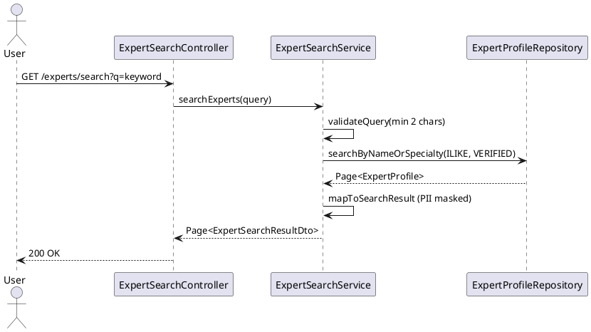

# ENGINEERING DOCUMENTATION STANDARD (EDS) v2.0
# UC-164 Search Expert

| Field | Value |
|-------|-------|
| **Document ID** | `CB-EXP-IMP-006` |
| **Version** | `1.0` |
| **Date** | `2026-06-26` |
| **Status** | `Draft` |
| **Author** | `AI Agent` |
| **Based on EDS** | `v2.0` |

---

## CHANGELOG

| Ngày | Người thực hiện | Nội dung thay đổi |
|------|-----------------|-------------------|
| 2026-06-26 | AI Agent | Khởi tạo TDS cho UC-164 |

---

## MỤC LỤC

1. [Tổng quan Module](#1-tổng-quan-module)
2. [Ma trận Truy vết](#2-ma-trận-truy-vết-traceability-matrix)
3. [Architecture Decision Records (ADR)](#3-architecture-decision-records-adr)
4. [Non-Functional Requirements & SLA](#4-non-functional-requirements--sla)
5. [Static Modeling](#5-static-modeling)
6. [Dynamic Modeling](#6-dynamic-modeling)
7. [Domain Event Catalog](#7-domain-event-catalog)
8. [Interface Specification](#8-interface-specification)
9. [API Specification](#9-api-specification)
10. [Bảng mã lỗi](#10-bảng-mã-lỗi)
11. [Quy trình Triển khai](#11-quy-trình-triển-khai-step-by-step)
12. [Rollback & Incident Runbook](#12-rollback--incident-runbook)
13. [Kịch bản Kiểm thử Chi tiết](#13-kịch-bản-kiểm-thử-chi-tiết)
14. [Phương pháp Xác minh](#14-phương-pháp-xác-minh)
15. [Mẫu thử thực tế](#15-mẫu-thử-thực-tế-api-verification-samples)
16. [Bảng tổng hợp phân quyền](#16-bảng-tổng-hợp-phân-quyền-authorization-matrix)
17. [AI Prompt Constraints](#17-ai-prompt-constraints-case-20)

---

## 1. Tổng quan Module

| Field | Value |
|-------|-------|
| **Module Name** | `SearchExpert` |
| **Bounded Context** | `expert` |
| **Data Classification** | `Public` |
| **Upstream Dependencies** | `expert_profiles` |
| **Downstream Consumers** | `expert directory, consultation booking` |

**Mô tả:** User tìm kiếm chuyên gia theo tên, chuyên môn, phạm vi hỗ trợ, huy hiệu xác minh, hoặc từ khoá. Full-text search trên `display_name` và `specialties`. Chỉ trả về expert `VERIFIED`.

---

## 2. Ma trận Truy vết (Traceability Matrix)

| Requirement ID | Loại | Mô tả | Thành phần Code | Compliance Target | ADR liên quan |
|----------------|------|-------|-----------------|-------------------|---------------|
| UC-164 | Use Case | Tìm kiếm chuyên gia theo từ khoá | `ExpertSearchController`, `ExpertSearchService` | BR-RBAC | ADR-EXP-008 |
| BR-VERIFIED-ONLY | Business Rule | Chỉ trả kết quả expert VERIFIED | `ExpertSearchService` | BR-SECURITY | ADR-EXP-008 |
| BR-MIN-CHARS | Business Rule | Query tối thiểu 2 ký tự | `ExpertSearchService` | BR-VALIDATION | ADR-EXP-008 |
| BR-ILIKE | Business Rule | PostgreSQL ILIKE cho case-insensitive search | `ExpertSearchService` | BR-PERFORMANCE | ADR-EXP-008 |

---

## 3. Architecture Decision Records (ADR)

### ADR-EXP-008 — Search implementation strategy

| Field | Value |
|-------|-------|
| **Status** | `Accepted` |
| **Date** | `2026-06-26` |

#### Quyết định
Dùng PostgreSQL `ILIKE` / `ANY(specialties)` cho MVP (không Elasticsearch). Search fields: `display_name ILIKE '%q%'` OR `q = ANY(specialties)`. Sort: relevance (exact match first) → rating desc. Max results per page: 50.

---

## 4. Non-Functional Requirements & SLA

### 4.1. Performance & Availability

| Category | Requirement | Target SLA |
|----------|-------------|------------|
| Latency | Search API response (p99) | < 300ms |
| Availability | Uptime (monthly) | 99.9% |
| Min query length | Minimum search characters | 2 |
| Max results | Per page | 50 |

### 4.2. Security

| Category | Requirement | Target |
|----------|-------------|--------|
| Access control | Authenticated users | Least privilege (§16) |
| PII masking | No accountId, email, phone in results | BR-PRIVACY |

---

## 5. Static Modeling

> Class diagram tham chiếu §8 Interface Specification.

### 5.1. Key DTOs

- `SearchExpertQuery` — search parameters (query, specialty, page, size)
- `ExpertSearchResultDto` — result item (displayName, specialties, averageRating, consultationFeeVnd)

---

## 6. Dynamic Modeling

### 6.1. Search Expert Sequence



---

## 7. Domain Event Catalog

### 7.1. Events Published

| Event Name | Trigger | Publisher | Async? |
|------------|---------|-----------|--------|
| — | Read-only search endpoint — no domain events | — | — |

### 7.2. Events Consumed

| Event Name | Source | Handler | Action |
|------------|--------|---------|--------|
| — | — | — | — |

---

## 8. Interface Specification

```java
public class SearchExpertQuery {
    private String q;           // keyword for name or specialty
    private String specialty;   // exact specialty filter
    private Integer page;       // default 0
    private Integer size;       // default 20, max 50
}

public interface IExpertSearchService {
    Page<ExpertSearchResultDto> searchExperts(SearchExpertQuery query);
}

public class ExpertSearchResultDto {
    private UUID expertProfileId;
    private String displayName;
    private List<String> specialties;
    private Double averageRating;
    private Long consultationFeeVnd;
    private Boolean isOnline;
}
```

---

## 9. API Specification

| Method | Path | Auth | Required Roles |
|--------|------|------|----------------|
| `GET` | `/api/v1/experts/search` | JWT Bearer | Any authenticated |

**Query params:** `q` (required, min 2 chars), `specialty`, `page`, `size`

**GET — 200 OK:**
```json
{
  "content": [
    { "expertProfileId": "uuid", "displayName": "Dr. A", "specialties": ["obstetrics"] }
  ],
  "totalElements": 5,
  "page": 0,
  "size": 20
}
```

---

## 10. Bảng mã lỗi

| Code | HTTP | Trigger |
|------|------|---------|
| `SRCH-001` | 400 | Query keyword `q` shorter than 2 characters |
| `SRCH-002` | 400 | Page size > 50 |

---

## 11. Quy trình Triển khai (Step-by-Step)

### 11.1. Prerequisites

- [ ] expert_profiles table tồn tại (V28) với index trên display_name, specialties

### 11.2. Pre-Migration Checklist

Không có migration mới — read-only search endpoint.

### 11.3. Implementation Steps

#### Chặng 1 — Implement search query (VERIFIED only, ILIKE)

```java
public Page<ExpertSearchResult> searchExperts(String q, Pageable pageable) {
    if (q.length() < 2) throw new ValidationException("SRCH-001");
    if (pageable.getPageSize() > 50) throw new ValidationException("SRCH-002");
    return profileRepo.searchByNameOrSpecialty(q, ExpertProfileStatus.VERIFIED, pageable);
}
```

#### Chặng 2 — Repository query

```java
@Query("SELECT p FROM ExpertProfile p WHERE p.status = :status " +
       "AND (LOWER(p.displayName) LIKE LOWER(CONCAT('%',:q,'%')) " +
       "OR :q = ANY(p.specialties))")
Page<ExpertProfile> searchByNameOrSpecialty(@Param("q") String q,
    @Param("status") ExpertProfileStatus status, Pageable pageable);
```

### 11.4. Deployment Checklist

- [ ] Test search "Dr" → only VERIFIED results
- [ ] Test q="A" (1 char) → 400 SRCH-001
- [ ] Verify no PII in response
- [ ] Test empty → 200 empty list (NOT 404)

---

## 12. Rollback & Incident Runbook

### 12.1. Điều kiện kích hoạt Rollback

| Điều kiện | Ngưỡng | Người quyết định |
|-----------|--------|------------------|
| PII trong search results | Bất kỳ case | Tech Lead + DPO |
| Non-VERIFIED experts trong results | Bất kỳ case | Tech Lead |

### 12.2. Rollback Procedure

```bash
kubectl rollout undo deployment/carebridge-api
```

---

## 13. Kịch bản Kiểm thử Chi tiết

```gherkin
Feature: Search Expert
  Scenario: Search by name → results
    Given EXPERT-001 VERIFIED displayName="Dr. Nguyen"
    When searchExperts("Nguyen", page=0, size=20)
    Then response chứa EXPERT-001

  Scenario: Search by specialty
    When searchExperts("Cardiology", ...)
    Then response chứa experts với specialty Cardiology

  Scenario: q < 2 chars → 400 SRCH-001
    When searchExperts("A") → throws SRCH-001

  Scenario: Non-VERIFIED not in results
    Given EXPERT-002 status=PENDING
    When searchExperts("Dr") → EXPERT-002 KHÔNG trong response

  Scenario: Empty → 200 not 404
    When searchExperts("NONEXISTENT") → 200, experts=[]

  Scenario: No PII
    When searchExperts("Dr") → response KHÔNG chứa accountId, email, phone
```

---

## 14. Phương pháp Xác minh

```sql
SELECT COUNT(*) FROM expert_profiles WHERE status = 'VERIFIED';
SELECT id, display_name FROM expert_profiles
WHERE status = 'VERIFIED' AND display_name ILIKE '%Nguyen%';
```

---

## 15. Mẫu thử thực tế (API Verification Samples)

```bash
curl -X GET "https://[host]/api/v1/experts/search?q=Nguyen&page=0&size=20" \
  -H "Authorization: Bearer <JWT>"
# Expected 200: { "experts": [...], "totalElements": N }
```

---

## 16. Bảng tổng hợp phân quyền (Authorization Matrix)

| Endpoint | `GUEST` | `ROLE_MOTHER` | `ROLE_EXPERT` | `ROLE_ADMIN` |
|----------|---------|---------------|---------------|--------------|
| `GET /experts/search` | ❌ | ✅ | ✅ | ✅ |

---

## 17. AI Prompt Constraints (CASE 2.0)

### 17.1 Constraint Summary Table

| # | Constraint | Source |
|---|-----------|--------|
| C1 | Only search within status=VERIFIED expert profiles | ADR-EXP-006 |
| C2 | q must be at least 2 characters; reject SRCH-001 otherwise | ADR-EXP-008 |
| C3 | Response MUST NOT include email, phone, accountId | BR-PRIVACY |
| C4 | Use ILIKE '%q%' on display_name OR q = ANY(specialties) | ADR-EXP-008 |
| C5 | Enforce max page size 50 server-side | ADR-EXP-008 |

### 17.2 Constraint Injection Block

```
[CONSTRAINT BLOCK — Module: SearchExpert (CB-EXP-IMP-006)]
1. (C1) WHERE status = 'VERIFIED' trong query — không filter Java-side.
2. (C2) q.length() < 2 → throw SRCH-001 TRƯỚC query.
3. (C3) Mapper loại bỏ accountId, email, phone.
4. (C4) ILIKE '%q%' trên display_name HOẶC q = ANY(specialties).
5. (C5) pageable.getPageSize() > 50 → throw SRCH-002.
```

### 17.3 Constraint Quality Checklist

- [x] Mỗi constraint traceable về ADR hoặc BR
- [x] Constraint block có ≥ 5 constraints cụ thể

### 17.4 Anti-Pattern Detection

| AP-ID | Anti-Pattern | Hành động |
|-------|-------------|----------|
| AP-AI-001 | Load all profiles rồi filter Java stream | Reject — C1, performance |
| AP-AI-003 | Return 404 cho empty results | Reject — phải 200 empty |

---

## PHỤ LỤC

### A. Glossary

| Thuật ngữ | Định nghĩa |
|-----------|------------|
| ILIKE | PostgreSQL case-insensitive LIKE |
| VERIFIED | Expert đã xác minh — mới xuất hiện trong search |

### B. Tài liệu tham chiếu

| Document | Path |
|----------|------|
| EDS v2.0 Template | `08_References/Template/PHASE-3_TDS.md` |

---

*EDS v2.1 — Tích hợp CASE 2.0 AI Prompt Constraints (§17).*
