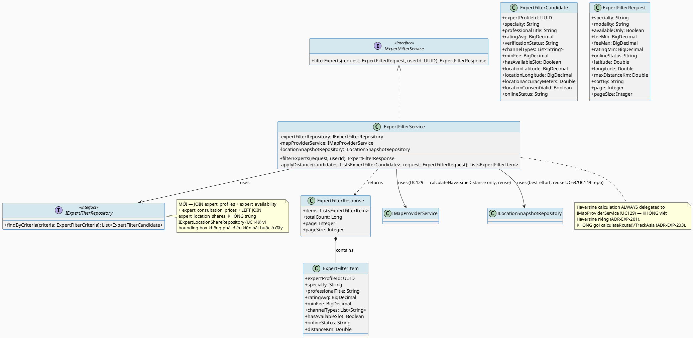
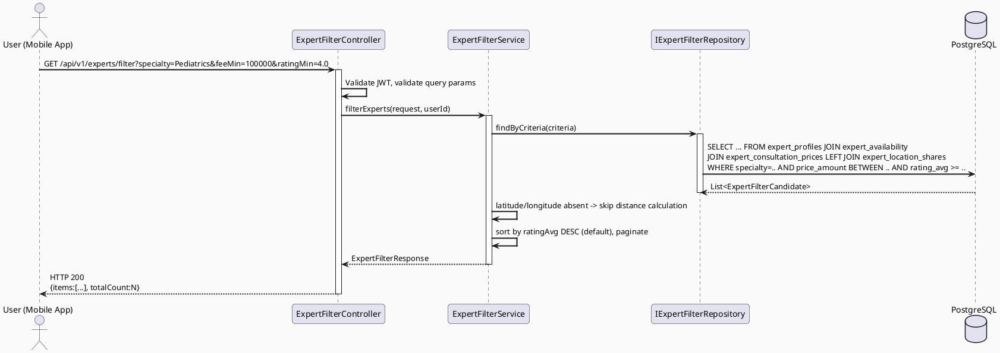
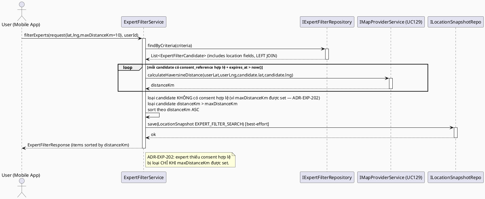
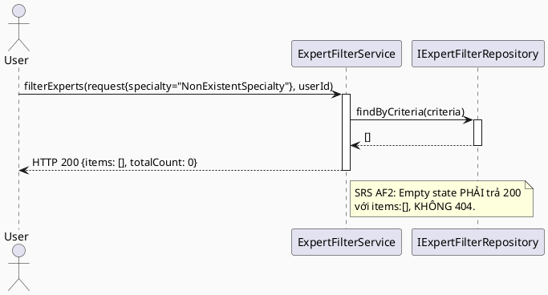
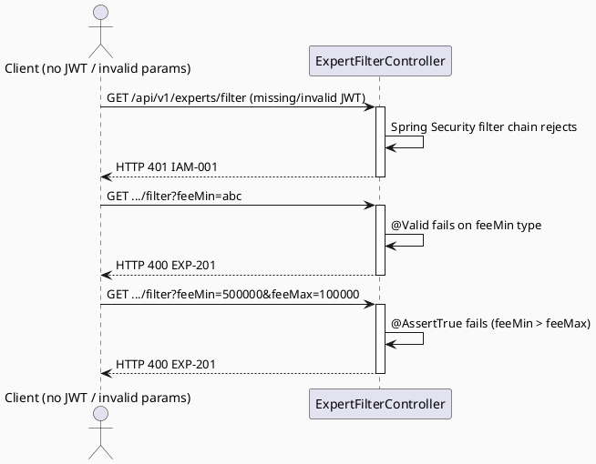

# ENGINEERING DOCUMENTATION STANDARD (EDS) v2.0
# UC165 — Filter Expert

| Field | Value |
|-------|-------|
| **Document ID** | `CB-EXP-IMP-002` |
| **Version** | `1.0` |
| **Date** | `2026-07-03` |
| **Status** | `Draft` |
| **Document Owner** | `TV4 - Lâm` |
| **Author** | `AI Agent — Tech Lead` |
| **Reviewed by** | `[ ] Pending` |
| **DPO Sign-off** | `[ ] Pending` *(distance filter đọc `expert_location_shares` — location PII của Expert — bắt buộc, kế thừa scope UC149)* |
| **Approved by** | `[ ] Pending` |
| **Last Review** | `2026-07-03` |
| **Based on EDS** | `v2.0` |

---

## CHANGELOG

| Ngày | Người thực hiện | Nội dung thay đổi |
|------|-----------------|-------------------|
| 2026-07-03 | AI Agent — Tech Lead | Tạo tài liệu lần đầu — TDS cho UC165 Filter Expert |

---

## MỤC LỤC

1. [Tổng quan Module](#1-tổng-quan-module)
2. [Ma trận Truy vết (Traceability Matrix)](#2-ma-trận-truy-vết-traceability-matrix)
3. [Architecture Decision Records (ADR)](#3-architecture-decision-records-adr)
4. [Non-Functional Requirements & SLA](#4-non-functional-requirements--sla)
5. [Static Modeling (Mô hình Tĩnh)](#5-static-modeling-mô-hình-tĩnh)
6. [Dynamic Modeling (Mô hình Động)](#6-dynamic-modeling-mô-hình-động)
7. [Domain Event Catalog](#7-domain-event-catalog)
8. [Interface Specification (Đặc tả Giao diện)](#8-interface-specification-đặc-tả-giao-diện)
9. [API Specification](#9-api-specification)
10. [Bảng mã lỗi (Error Codes)](#10-bảng-mã-lỗi-error-codes)
11. [Quy trình Triển khai (Step-by-Step)](#11-quy-trình-triển-khai-step-by-step)
12. [Rollback & Incident Runbook](#12-rollback--incident-runbook)
13. [Kịch bản Kiểm thử Chi tiết](#13-kịch-bản-kiểm-thử-chi-tiết)
14. [Phương pháp Xác minh](#14-phương-pháp-xác-minh)
15. [Mẫu thử thực tế (API Verification Samples)](#15-mẫu-thử-thực-tế-api-verification-samples)
16. [Bảng tổng hợp phân quyền (Authorization Matrix)](#16-bảng-tổng-hợp-phân-quyền-authorization-matrix)
17. [AI Prompt Constraints (CASE 2.0)](#17-ai-prompt-constraints-case-20)
18. [Open Items / Research Gate](#18-open-items--research-gate)

---

## 1. Tổng quan Module

> **RG-3 (Reuse resolution — bắt buộc đọc trước khi implement):** UC165 KHÔNG phải một use case tìm-kiếm-mới độc lập. SRS §3.3.9.2 mô tả "Filters experts by specialty, consultation modality, availability, fee, rating, online status, and distance when consent exists" — đây là một **structured multi-criteria filter trên cùng domain "expert directory"** mà UC164 (Search Expert, keyword-based) đã phục vụ, cộng thêm **tiêu chí khoảng cách (distance)** vốn thuộc domain `map` đã được UC63/UC129/UC149/UC155 formal hoá. TDS này xác định rõ:
> - **Specialty / modality (channel_type) / availability / fee / rating / online status** → đọc trực tiếp từ `expert_profiles` JOIN `expert_availability` JOIN `expert_consultation_prices` JOIN `expert_location_shares` (cho `availability_status` = "online status") — **KHÔNG có UC-nào khác sở hữu filter này**, đây là phần **MỚI** của UC165.
> - **Distance filter (khi có consent)** → **tái sử dụng trực tiếp** `IExpertLocationShareRepository`-tương đương filter pattern (bounding-box) và `IMapProviderService.calculateHaversineDistance()` đã formal hoá ở UC129 (`CB-MAP-IMP-000`) và đã được UC149 (`CB-MAP-IMP-005`) áp dụng cho cùng bảng `expert_location_shares`. UC165 **KHÔNG viết lại Haversine**, và tái sử dụng đúng nguyên tắc "chỉ hiển thị expert có `expert_location_shares.expires_at > now()` + `consent_reference` hợp lệ" mà UC149 ADR-MAP-201/202 đã thiết lập.
> - UC165 là **domain mới** (`expert` bounded context, không phải `map`) vì phần lớn tiêu chí lọc (specialty/modality/fee/rating/availability) không liên quan đến vị trí — distance chỉ là 1 trong 7 tiêu chí, được **gate qua consent** giống pattern UC147/148/152 (`consent_reference` non-null + chưa hết hạn thì mới cho phép lọc/sort theo khoảng cách, nếu không có consent thì field distance trả `null` và tiêu chí distance bị bỏ qua thay vì reject toàn bộ request).
>
> UC165 KHÔNG trùng lặp UC164 (Search Expert — free-text keyword search theo tên/specialty/support scope/verified badge). UC165 là **structured filter form** (dropdown/slider trên UI) chứ không phải free-text search — hai UC có thể kết hợp ở tầng UI (Mobile) nhưng backend contract tách biệt theo đúng SRS (2 bảng riêng, 2 UC riêng).

| Field | Value |
|-------|-------|
| **Module Name** | `Filter Expert` |
| **Bounded Context** | `expert` (bounded context MỚI cho phần filter-by-criteria, tái sử dụng `map` bounded context's `IMapProviderService`/`expert_location_shares` pattern cho tiêu chí distance — theo phân công TV4-Lâm "Verified Expert Network + Location/map/nearby domain", `function-spec-task-allocation.md`) |
| **Data Classification** | `Sensitive-PII` *(distance filter đọc `expert_location_shares` = location PII của Expert, khi Mother bật tiêu chí "gần tôi"; các tiêu chí còn lại là dữ liệu công khai/nghiệp vụ — `Internal`)* |
| **Compliance Scope** | `PDPA / Luật 91/2025` |
| **Upstream Dependencies** | `IAM (JWT — mọi role đã auth, xem §16)`, `expert_profiles`/`expert_availability`/`expert_consultation_prices`/`expert_reviews`/`expert_location_shares` (đã có sẵn trong `V1__init_schema.sql`), **`IMapProviderService`** (UC129, `CB-MAP-IMP-000`, tái sử dụng `calculateHaversineDistance()`), **UC149 Find Nearby Available Experts** (`CB-MAP-IMP-005`, tham chiếu pattern consent-gated distance filter — KHÔNG gọi trực tiếp `INearbyExpertService.findNearby()` vì UC165 cần kết hợp nhiều tiêu chí phi-vị-trí trong CÙNG 1 query, khác với UC149 chỉ lọc theo vị trí — xem ADR-EXP-201), `VNPay Payment Gateway` (secondary actor theo SRS — xem §18 RG cho phạm vi thực tế) |
| **Downstream Consumers** | Mobile `expertDirectory`/`expertFilter` feature (filter form UI), UC153 Contact Nearby Expert (có thể nhận kết quả đã filter làm input), tương lai: UC-booking flow (chọn expert từ danh sách đã filter) |

---

## 2. Ma trận Truy vết (Traceability Matrix)

| Requirement ID | Loại (BR/ADR/US) | Mô tả yêu cầu | Thành phần Code | Compliance Target | ADR liên quan |
|----------------|------------------|---------------|-----------------|-------------------|---------------|
| SRS-3.3.9.2 (UC-165) | User Story | Lọc expert theo specialty, modality, availability, fee, rating, online status, distance (khi có consent) | `ExpertFilterController.GET /api/v1/experts/filter` | — | ADR-EXP-201 |
| BR-RBAC | Business Rule | Chỉ actor đã authenticate (mọi role hợp lệ) mới gọi được endpoint filter | `ExpertFilterController` | BR-RBAC | ADR-EXP-204 |
| BR-PRIVACY | Business Rule | Tiêu chí distance CHỈ áp dụng khi Expert có `expert_location_shares.consent_reference` hợp lệ + `expires_at > now()` — nếu không có consent, field distance trả `null`, KHÔNG loại expert khỏi kết quả chỉ vì thiếu consent (trừ khi Mother chủ động lọc theo distance) | `ExpertFilterService` | PDPA | ADR-EXP-202 |
| BR-SAFETY | Business Rule | Không delay/chặn kết quả filter bởi AI hoặc external service — kế thừa nguyên tắc UC63/UC129/UC149/UC155 | `ExpertFilterService` | BR-SAFETY | ADR-EXP-203 |
| BR-CONSULTATION | Business Rule | Tiêu chí `fee`/`priceRange` PHẢI đọc từ `expert_consultation_prices.status='ACTIVE'` (giá đang hiệu lực) — không dùng giá đã `effective_to < now()` | `ExpertFilterService` | BR-CONSULTATION | ADR-EXP-201 |
| E1/E2/E3 (SRS Exceptions) | Exception | Access denied / invalid filter params / external service (map) failure xử lý an toàn | `ExpertFilterController`, `ExpertFilterService` | BR-SAFETY | ADR-EXP-203 |
| ADR-EXP-201 | Decision | Single combined SQL query cho 6 tiêu chí phi-vị-trí (specialty/modality/availability/fee/rating/online status), distance tính ở application layer qua `IMapProviderService.calculateHaversineDistance()` sau khi DB query trả candidate set — mirror ADR-MAP-201 (UC149) cho phần Haversine, KHÔNG viết lại | `ExpertFilterService` | — | — |
| ADR-EXP-202 | Decision | Distance filter là **consent-gated optional layer**: nếu Mother không gửi `latitude`/`longitude`, bỏ qua hoàn toàn distance; nếu có gửi, chỉ Expert có consent hợp lệ được tính/sort theo distance, Expert không có consent giữ nguyên trong kết quả với `distanceKm=null` (trừ khi `maxDistanceKm` được set — khi đó Expert thiếu consent bị loại vì không thể xác minh nằm trong bán kính) | `ExpertFilterService` | PDPA | — |
| ADR-EXP-203 | Decision | `IMapProviderService` không phải TrackAsia call trực tiếp cho phần distance filter cơ bản (chỉ Haversine, không cần route/ETA) — không có external service dependency mới trên critical path | `ExpertFilterService` | BR-SAFETY | — |
| ADR-EXP-204 | Decision | Endpoint yêu cầu JWT hợp lệ (mọi role — SRS Primary Actor = "User" cho UC164 nhưng "User" + batch instruction xác nhận Mobile/Mother cho UC165/166); `userId` từ SecurityContext dùng cho `location_snapshots` best-effort khi distance filter được dùng | `ExpertFilterController` | BR-RBAC | — |

> **Open (RG-2):** SRS §3.3.9.2 là văn bản template chung — không có số cụ thể cho default page size, default sort order, hay danh sách giá trị enum hợp lệ cho `modality`/`onlineStatus`. Giá trị đề xuất trong TDS này dựa trên schema thực tế (`expert_availability.channel_type`, `expert_location_shares.availability_status` — cả 2 đều là `varchar` tự do, KHÔNG có CHECK constraint) — đánh dấu **Open**, cần Product Owner/TV4-Lâm xác nhận danh sách enum chính thức trước khi Approve.
>
> **Open (RG-6 — VNPay secondary actor):** SRS liệt kê `VNPay Payment Gateway` là Secondary Actor cho UC165 nhưng Normal Flow/Description không đề cập giao dịch thanh toán nào — UC165 là **read-only filter/browse**, không có booking/payment action. Diễn giải hợp lý nhất: VNPay xuất hiện vì filter `fee`/`priceRange` hiển thị giá **đã snapshot từ `expert_consultation_prices`** (nguồn giá dùng cho thanh toán VNPay ở UC-booking flow tương lai), KHÔNG phải vì UC165 tự gọi VNPay API. TDS này **không tích hợp VNPay trực tiếp** — ghi nhận Open, cần Product Owner xác nhận diễn giải này trước khi Approve.

---

## 3. Architecture Decision Records (ADR)

### ADR-EXP-201 — Chiến lược lọc: Single combined query cho 6 tiêu chí phi-vị-trí, Haversine post-filter cho distance (tái sử dụng UC129)

| Field | Value |
|-------|-------|
| **Status** | `Proposed` |
| **Deciders** | `AI Agent — Tech Lead` (chờ TV4-Lâm confirm) |
| **Date** | `2026-07-03` |
| **Supersedes** | `—` |

#### Bối cảnh (Context)
UC165 SRS mô tả 7 tiêu chí lọc: specialty, modality, availability, fee, rating, online status, distance. 6 tiêu chí đầu (không tính distance) đều là cột/JOIN có sẵn trong `expert_profiles`/`expert_availability`/`expert_consultation_prices`/`expert_reviews` (dùng `expert_profiles.rating_avg` đã pre-aggregate, KHÔNG cần JOIN `expert_reviews` runtime). Tiêu chí thứ 7 (distance) đòi hỏi đọc `expert_location_shares` — bảng đã được UC149 (`CB-MAP-IMP-005`) formal hoá pattern truy vấn (bounding-box + Haversine qua `IMapProviderService`, UC129).

**RG-6 quyết định kiến trúc (câu hỏi bắt buộc từ batch):** UC165 có nên gọi thẳng `INearbyExpertService.findNearby()` (UC149) rồi tự filter thêm 6 tiêu chí phi-vị-trí ở application layer, hay tự viết 1 query kết hợp cả 7 tiêu chí trong 1 lượt DB call?

#### Các phương án đã xem xét (Options Considered)

| Phương án | Mô tả | Ưu điểm | Nhược điểm |
|-----------|-------|----------|------------|
| A | UC165 gọi `INearbyExpertService.findNearby()` (UC149) trước để lấy candidate set đã lọc theo distance, sau đó filter thêm 6 tiêu chí còn lại ở application layer (in-memory) | Tái sử dụng 100% pipeline distance của UC149, không viết lại Haversine/bounding-box | (a) `findNearby()` **BẮT BUỘC** phải có `latitude`/`longitude` làm input — không hỗ trợ trường hợp Mother chỉ muốn lọc theo specialty/fee mà KHÔNG cung cấp vị trí (rất phổ biến — đa số user filter theo specialty trước); (b) `NearbyExpertSearchRequest` (UC149) không có field cho `feeMin/feeMax`/`ratingMin`/`onlineStatus` — phải mở rộng contract UC149 hoặc filter in-memory sau khi nhận kết quả đã giới hạn `maxResults` (rủi ro: expert đúng tiêu chí bị cắt mất vì đã bị `maxResults` của UC149 giới hạn trước khi lọc tiếp) |
| B | UC165 sở hữu 1 query kết hợp riêng: JOIN `expert_profiles`+`expert_availability`+`expert_consultation_prices`+`expert_location_shares` (LEFT JOIN cho location — vì distance là optional), áp WHERE cho 6 tiêu chí phi-vị-trí trong DB, sau đó (nếu Mother gửi `latitude`/`longitude`) tính Haversine ở application layer qua `IMapProviderService.calculateHaversineDistance()` (UC129, tái sử dụng — KHÔNG viết Haversine riêng) chỉ cho candidate set đã lọc | Hỗ trợ đúng use case chính (filter không cần vị trí vẫn hoạt động đầy đủ); không bị giới hạn `maxResults` của 1 query khác trước khi áp filter tiếp; vẫn tái sử dụng `IMapProviderService.calculateHaversineDistance()` — không trùng lặp Haversine | Không tái sử dụng `IExpertLocationShareRepository.findActiveWithinBoundingBox()` (bounding-box optimization) của UC149 — nếu tập kết quả sau 6 filter đầu lớn, tính Haversine cho toàn bộ candidate set kém hiệu quả hơn bounding-box trước (chấp nhận được vì 6 filter đầu thường đã thu hẹp tập candidate xuống rất nhỏ trước khi tính distance) |

#### Quyết định (Decision)
Chọn **Phương án B**. `ExpertFilterService.filterExperts(ExpertFilterRequest request, UUID userId)` thực hiện:
1. Build 1 JPQL/Criteria query kết hợp WHERE cho `specialty`, `channelType` (modality), `availabilityStatus` (từ `expert_availability` — "còn slot AVAILABLE trong khung giờ tới"), `feeMin/feeMax` (từ `expert_consultation_prices.price_amount WHERE status='ACTIVE'`), `ratingMin` (từ `expert_profiles.rating_avg`), `onlineStatus` (từ `expert_location_shares.availability_status`, LEFT JOIN vì không phải Expert nào cũng share vị trí).
2. Nếu request có `latitude`/`longitude`: với mỗi candidate có `expert_location_shares` hợp lệ (`consent_reference IS NOT NULL AND expires_at > now()`), gọi `IMapProviderService.calculateHaversineDistance()` (UC129 §8.1, **tái sử dụng, KHÔNG viết lại**) để tính `distanceKm`; nếu `maxDistanceKm` được set, loại candidate không có vị trí hợp lệ HOẶC nằm ngoài bán kính (ADR-EXP-202).
3. Sort theo `sortBy` (mặc định `ratingAvg DESC`, hoặc `distanceKm ASC` nếu có vị trí).

**KHÔNG** gọi `INearbyExpertService.findNearby()` (UC149) trực tiếp — lý do: UC149's request contract không đủ field cho 6 tiêu chí phi-vị-trí và tối ưu cho use case khác (luôn có vị trí, luôn cần distance). UC165 tái sử dụng đúng **hàm tính toán cấp thấp** (`IMapProviderService.calculateHaversineDistance()`, UC129) chứ không tái sử dụng **service cấp cao** (`INearbyExpertService`, UC149) vì contract không khớp.

#### Hệ quả (Consequences)

**Tích cực:**
- Hỗ trợ đầy đủ use case "filter không cần vị trí" (phổ biến nhất) mà không bị ràng buộc bởi contract của UC149.
- Vẫn tái sử dụng đúng tầng tính toán chung (`IMapProviderService`), tránh trùng lặp Haversine — nhất quán công thức khoảng cách giữa UC149/UC155/UC165/UC166.
- Consent-gating pattern (`consent_reference`/`expires_at`) đồng nhất 100% với UC149 ADR-MAP-201/202 — không phát sinh rule PII mới.

**Tiêu cực / Trade-offs:**
- Không tái sử dụng bounding-box pre-filter của UC149's `IExpertLocationShareRepository` — chấp nhận được vì 6 filter đầu (đặc biệt specialty) thường đã giới hạn candidate set nhỏ trước khi cần tính Haversine.
- 2 code path tính "expert nào gần" tồn tại song song (UC149's bounding-box-first, UC165's filter-first) — đây là 2 **usage pattern khác nhau** (nearby-only vs multi-criteria-with-optional-distance), không phải trùng lặp logic (Haversine formula vẫn 1 nơi duy nhất — UC129).

**Compliance Impact:** Không phát sinh rủi ro PII mới — cùng bảng `expert_location_shares`, cùng điều kiện consent/expiry đã thiết lập ở UC149.

---

### ADR-EXP-202 — Consent-gated distance: optional criterion, không reject toàn bộ request vì thiếu consent

| Field | Value |
|-------|-------|
| **Status** | `Proposed` |
| **Deciders** | `AI Agent — Tech Lead` |
| **Date** | `2026-07-03` |
| **Supersedes** | `—` |

#### Bối cảnh (Context)
SRS UC165 Description: "...and distance **when consent exists**" — ngôn ngữ này xác nhận rõ ràng distance là tiêu chí **có điều kiện**, khác biệt với 6 tiêu chí còn lại (luôn áp dụng được). Điều này khớp với pattern consent-gating đã thiết lập ở UC147 (Share Expert Location)/UC148 (Manage Location Visibility)/UC152 (Navigate to Support Location) — batch trước đã xác lập rằng `expert_location_shares.consent_reference` là nguồn sự thật duy nhất cho việc Expert có đồng ý lộ vị trí hay không.

#### Các phương án đã xem xét (Options Considered)

| Phương án | Mô tả | Ưu điểm | Nhược điểm |
|-----------|-------|----------|------------|
| A | Nếu Mother gửi `latitude`/`longitude` nhưng KHÔNG set `maxDistanceKm`: mọi expert (kể cả không có consent) vẫn xuất hiện trong kết quả, chỉ khác là `distanceKm=null` cho expert không có consent hợp lệ. Nếu Mother SET `maxDistanceKm` (tức chủ động muốn lọc theo bán kính): expert không có consent hợp lệ bị loại khỏi kết quả (vì hệ thống không thể xác minh họ trong bán kính hay không) | Tôn trọng nguyên tắc "distance là optional enrichment", không âm thầm loại expert hợp lệ theo 6 tiêu chí khác chỉ vì thiếu dữ liệu vị trí; khi Mother chủ động đòi hỏi bán kính cụ thể, loại expert không xác minh được là hành vi đúng đắn (an toàn hơn là đoán) | Cần 2 nhánh logic (có `maxDistanceKm` vs không) — thêm độ phức tạp code nhỏ |
| B | Luôn loại bỏ expert không có consent hợp lệ khỏi kết quả filter (kể cả khi Mother không quan tâm distance) | Đơn giản hóa code (1 nhánh logic) | Vi phạm nguyên tắc minimum-necessary/không-liên-quan — loại expert hợp lệ theo specialty/rating/fee chỉ vì lý do không liên quan (họ chưa share vị trí) là hành vi UX tệ và không có cơ sở trong SRS |

#### Quyết định (Decision)
Chọn **Phương án A**. `ExpertFilterService` phân biệt 2 nhánh: `latitude`/`longitude` present nhưng `maxDistanceKm` null → distance là "nice-to-have" (enrichment field, có thể null); `maxDistanceKm` present → distance là "hard filter" (expert thiếu consent hợp lệ bị loại). Trong cả 2 trường hợp, việc đọc `expert_location_shares` PHẢI kiểm tra `consent_reference IS NOT NULL AND expires_at > now()` trước khi tính/hiển thị bất kỳ toạ độ nào — mirror chính xác UC149 ADR-MAP-201.

#### Hệ quả (Consequences)

**Tích cực:** Hành vi filter nhất quán, dễ giải thích cho Mother (UI có thể hiển thị "một số expert không hiển thị khoảng cách vì chưa chia sẻ vị trí" thay vì biến mất khỏi danh sách không rõ lý do).

**Tiêu cực / Trade-offs:** Không có thêm ngoài độ phức tạp code đã ghi nhận.

**Compliance Impact:** Đúng tinh thần PDPA minimum-necessary — chỉ dùng location PII khi Mother chủ động yêu cầu lọc theo bán kính; nếu không, expert thiếu consent vẫn được đối xử công bằng theo 6 tiêu chí khác.

---

### ADR-EXP-203 — Không có external service call bổ sung cho distance filter cơ bản (chỉ Haversine, không ETA)

| Field | Value |
|-------|-------|
| **Status** | `Proposed` |
| **Deciders** | `AI Agent — Tech Lead` |
| **Date** | `2026-07-03` |
| **Supersedes** | `—` |

#### Bối cảnh (Context)
UC149/UC155 gọi `IMapProviderService.calculateRoute()` (TrackAsia, có timeout/fallback) cho top-N kết quả để lấy ETA. UC165 là filter/browse (không phải "tìm expert khẩn cấp gần nhất" như UC149), rating/fee/specialty quan trọng hơn ETA chính xác trong ngữ cảnh filter thông thường.

#### Quyết định (Decision)
`ExpertFilterService` **chỉ** gọi `IMapProviderService.calculateHaversineDistance()` (pure computation, không network call) — **KHÔNG** gọi `calculateRoute()` (TrackAsia network call). Điều này loại bỏ hoàn toàn external service dependency khỏi UC165's critical path — không cần retry/timeout/fallback logic riêng, vì Haversine luôn tính được ngay lập tức (offline formula).

#### Hệ quả (Consequences)

**Tích cực:** UC165 không có failure mode liên quan tới TrackAsia — đơn giản hoá đáng kể so với UC63/UC149/UC155 (không cần `mapServiceDegraded` field). Latency thấp và ổn định.

**Tiêu cực / Trade-offs:** `distanceKm` trả về là khoảng cách đường chim bay (Haversine), không phải khoảng cách đường bộ thực tế — chấp nhận được cho mục đích filter/sort (không phải điều hướng thực tế, đó là phạm vi UC152).

**Compliance Impact:** Không có.

---

### ADR-EXP-204 — Authorization: mọi role đã authenticate, không giới hạn Mother-only

| Field | Value |
|-------|-------|
| **Status** | `Proposed` |
| **Deciders** | `AI Agent — Tech Lead` |
| **Date** | `2026-07-03` |
| **Supersedes** | `—` |

#### Bối cảnh (Context)
SRS UC164 (Search Expert, sibling cùng nhóm 3.3.9) ghi Primary Actor = "User" (không giới hạn Mother). UC165 cũng ghi Primary Actor = "User" trong bảng SRS gốc, nhưng batch instruction của tác vụ này xác nhận rõ **Primary Actor = Mother, Platform = Mobile App** cho cả UC165/UC166. Đây là hai nguồn khác nhau — batch instruction (từ Product Owner/task assignment) override SRS's generic "User" placeholder.

#### Quyết định (Decision)
Endpoint yêu cầu JWT hợp lệ, **không giới hạn role cụ thể** (khác với UC63/UC149/UC155 vốn `ROLE_MOTHER`-only) — vì "Filter Expert"/"Search Expert" là chức năng duyệt danh mục chung, hợp lý để Family/Partner cũng xem được (không có bằng chứng SRS nào giới hạn chỉ Mother). Tuy nhiên theo batch instruction, UI/UX chính thức nhắm tới Mother trên Mobile App — Auth Matrix (§16) đánh dấu Mother là role chính, các role khác **Open** cho Product Owner xác nhận.

#### Hệ quả (Consequences)

**Tích cực:** Linh hoạt, không chặn nhầm các role hợp lệ khác nếu Product Owner mở rộng phạm vi sau này.

**Tiêu cực / Trade-offs:** Cần Product Owner xác nhận rõ danh sách role cuối cùng trước khi Approve — ghi Open Item.

**Compliance Impact:** Không ảnh hưởng — filter/browse là read-only, không tăng rủi ro theo role.

---

## 4. Non-Functional Requirements & SLA

### 4.1. Performance & Availability

| Category | Requirement | Target SLA | Measurement Method | Compliance Basis |
|----------|-------------|------------|---------------------|------------------|
| Latency | API response (p99), không có distance filter | `< 400ms` *(Open — đề xuất, nhẹ hơn UC63/UC149 vì không gọi external service)* | k6 load test | ADR-EXP-201 |
| Latency | API response (p99), có distance filter (Haversine post-filter, không TrackAsia) | `< 600ms` *(Open)* | k6 load test | ADR-EXP-201, ADR-EXP-203 |
| Availability | Uptime (monthly) | `99.9%` *(kế thừa baseline chung dự án)* | Uptime monitor | — |
| Throughput | Concurrent requests | `50 req/s` *(kế thừa UC63/UC149 §4.1)* | Load test | — |

### 4.2. Data Integrity & Retention

| Category | Requirement | Target | Verification Method | Compliance Basis |
|----------|-------------|--------|---------------------|------------------|
| Filtering correctness | Chỉ trả giá đang `status='ACTIVE'` từ `expert_consultation_prices` | 100% | Unit test | BR-CONSULTATION |
| Consent correctness | Distance chỉ hiển thị/lọc khi `consent_reference IS NOT NULL AND expires_at > now()` | 100% | Integration test (mirror UC149) | ADR-EXP-202, PDPA |
| Consistency | `ratingMin` filter dùng `expert_profiles.rating_avg` (pre-aggregated) — không tính lại từ `expert_reviews` runtime | 100% | Unit test | ADR-EXP-201 |

### 4.3. Security

| Category | Requirement | Target | Verification Method | Compliance Basis |
|----------|-------------|--------|---------------------|------------------|
| Encryption in transit | Endpoint | TLS 1.3+ | SSL Labs scan | PDPA |
| Access control | JWT required, mọi role hợp lệ (xem ADR-EXP-204) | Least privilege | Auth Matrix (§16) | BR-RBAC |
| No PII leak in logs | Toạ độ Expert KHÔNG log ở mức INFO | Log audit | PDPA |

### 4.4. Scalability & Capacity Planning

> Tải phụ thuộc vào lượt Mother/User duyệt danh mục expert — dự kiến cao hơn UC149/UC155 (filter là entry point phổ biến hơn "nearby"). Composite index đề xuất trên `expert_profiles(specialty, verification_status)` nếu cardinality lớn — xem §5.2 Open.

---

## 5. Static Modeling (Mô hình Tĩnh)

### 5.1. Class Diagram (PlantUML)



### 5.2. Data Structure (Flyway SQL Migration)

> **Không cần migration mới.** UC165 không sở hữu bảng nào — đọc `expert_profiles`, `expert_availability`, `expert_consultation_prices`, `expert_reviews` (chỉ dùng `rating_avg` đã pre-aggregate trên `expert_profiles`, không JOIN trực tiếp), `expert_location_shares` — toàn bộ đã tồn tại trong `V1__init_schema.sql` (dòng 786-975). Đã kiểm tra toàn bộ `05_Development/CareBridgeAPI/src/main/resources/db/migration/` (V1 đến V20260629000002 + V2-V10) — không có bảng `expert_filter_*` nào cần tạo.

**Xác nhận cấu trúc hiện có (nguồn: `V1__init_schema.sql`):**

```sql
-- Đã tồn tại — KHÔNG tạo lại, chỉ tham chiếu
-- expert_profiles (dòng 786-800): expert_profile_id (PK), user_id, specialty (varchar(100)),
--   professional_title, experience_years, workplace, consultation_scope, verification_status,
--   verified_at, verified_by, rating_avg (numeric), created_at, updated_at
-- expert_availability (dòng 817-826): availability_id (PK), expert_profile_id (FK), start_at, end_at,
--   channel_type (varchar(30) — dùng làm "modality"), status (varchar(20) DEFAULT 'AVAILABLE')
--   Index có sẵn: idx_expert_availability_expert_profile_id, idx_expert_availability_status,
--                 idx_expert_availability_start_at
-- expert_consultation_prices (dòng 859-874): expert_price_id (PK), expert_profile_id (FK),
--   price_band_id (FK), channel_type, duration_minutes, price_amount (numeric), currency,
--   status (varchar(20) DEFAULT 'ACTIVE'), effective_from, effective_to
-- expert_reviews (dòng 957-966): review_id (PK), expert_profile_id (FK), rating (smallint),
--   moderation_status — KHÔNG JOIN runtime, dùng expert_profiles.rating_avg đã pre-aggregate
-- expert_location_shares (dòng 828-840): đã dùng ở UC149 §5.2 — latitude, longitude,
--   accuracy_meters, availability_status, expires_at, consent_reference
```

**Đề xuất index bổ sung (Open — cần đánh giá hiệu năng thực tế trước khi approve):**

Nếu số lượng expert lớn, `WHERE specialty = ? AND verification_status = 'VERIFIED'` (điều kiện lọc phổ biến nhất) sẽ hưởng lợi từ composite index `(specialty, verification_status)` trên `expert_profiles` — hiện chỉ có `idx_expert_profiles_verification_status` đơn cột. **Chưa tạo migration này trong Draft** — chỉ ghi nhận Open, cần dữ liệu thực tế để đánh giá cardinality (mirror lý do UC63/UC149 §5.2). Version tiếp theo khả dụng nếu cần: `V20260706101000` (theo range được cấp phát cho batch này, sub-range của `100000` — tránh trùng UC149's đã đề xuất `V20260705150000` và các range `090000`/`110000`/`120000`/`130000` reserved cho sibling batches khác).

---

## 6. Dynamic Modeling (Mô hình Động)

### 6.1. Sequence Diagram — Happy Path (không distance) (PlantUML)



### 6.2. Sequence Diagram — Happy Path (với distance, consent hợp lệ) (PlantUML)



### 6.3. Sequence Diagram — Empty State (AF2) (PlantUML)



### 6.4. Sequence Diagram — Error Path (Invalid Params) (PlantUML)



> Không có state machine — read-only presentation/query layer, không có entity trạng thái riêng.

---

## 7. Domain Event Catalog

> UC165 là read-only query layer — **không phát ra domain event nào**. Side-effect duy nhất (ghi `location_snapshots`, best-effort) chỉ xảy ra khi distance filter được dùng, mirror UC63/UC149.

### 7.1. Events Published (Phát ra)

_Không có._

### 7.2. Events Consumed (Tiêu thụ)

_Không có._

---

## 8. Interface Specification (Đặc tả Giao diện)

### 8.1. Service Interface

```java
// ExpertFilterRequest.java — Input DTO (MỚI)
// @version 1.0
public class ExpertFilterRequest {
    private String specialty;                 // optional — exact match trên expert_profiles.specialty

    private String modality;                   // optional — match trên expert_availability.channel_type

    private Boolean availableOnly;              // optional — true: chỉ expert có >=1 expert_availability.status='AVAILABLE' && start_at > now()

    @DecimalMin("0")
    private BigDecimal feeMin;                  // optional — expert_consultation_prices.price_amount >=

    @DecimalMin("0")
    private BigDecimal feeMax;                  // optional — expert_consultation_prices.price_amount <=
    // @AssertTrue: feeMin <= feeMax nếu cả 2 đều set

    @DecimalMin("0") @DecimalMax("5")
    private BigDecimal ratingMin;                // optional — expert_profiles.rating_avg >=

    private String onlineStatus;                 // optional — match trên expert_location_shares.availability_status

    @DecimalMin("-90.0") @DecimalMax("90.0")
    private Double latitude;                      // optional — bắt buộc nếu maxDistanceKm được set

    @DecimalMin("-180.0") @DecimalMax("180.0")
    private Double longitude;                     // optional — bắt buộc nếu maxDistanceKm được set

    @DecimalMin("0.1") @DecimalMax("100.0")
    private Double maxDistanceKm;                 // optional — nếu set, distance trở thành hard filter (ADR-EXP-202)

    private String sortBy = "RATING_DESC";        // enum: RATING_DESC / FEE_ASC / DISTANCE_ASC (chỉ hợp lệ nếu có lat/lng)

    @Min(0)
    private Integer page = 0;

    @Min(1) @Max(50)
    private Integer pageSize = 20;

    // getters / setters / @Valid / @AssertTrue annotations
}

// ExpertFilterResponse.java — Output DTO (MỚI)
// @version 1.0
public class ExpertFilterResponse {
    private List<ExpertFilterItem> items;
    private Long totalCount;
    private Integer page;
    private Integer pageSize;
    // getters / setters
}

// ExpertFilterItem.java — Output DTO (MỚI)
// @version 1.0
public class ExpertFilterItem {
    private UUID expertProfileId;
    private String specialty;
    private String professionalTitle;
    private BigDecimal ratingAvg;
    private BigDecimal minFee;                    // giá thấp nhất trong các expert_consultation_prices ACTIVE
    private List<String> channelTypes;             // distinct channel_type từ expert_availability
    private Boolean hasAvailableSlot;
    private String onlineStatus;                   // nullable nếu Expert chưa share vị trí
    private Double distanceKm;                      // nullable — xem ADR-EXP-202
    // getters / setters
}

// IExpertFilterService.java — Service Contract (MỚI)
// @version 1.0
public interface IExpertFilterService {
    /**
     * Lọc expert theo tối đa 7 tiêu chí kết hợp (specialty, modality, availability,
     * fee range, rating, online status, distance khi có consent).
     * Distance là consent-gated (ADR-EXP-202) — KHÔNG tự viết lại Haversine
     * (ADR-EXP-201, tái sử dụng IMapProviderService.calculateHaversineDistance() của UC129).
     */
    ExpertFilterResponse filterExperts(ExpertFilterRequest request, UUID userId);
}
```

### 8.2. Repository Interface

```java
// IExpertFilterRepository.java — MỚI
// @version 1.0
public interface IExpertFilterRepository {
    /**
     * Combined query — JOIN expert_profiles + expert_availability + expert_consultation_prices,
     * LEFT JOIN expert_location_shares (vì distance là optional). Trả về candidate set đã áp
     * WHERE cho 6 tiêu chí phi-vị-trí; distance được tính riêng ở Service layer (ADR-EXP-201).
     */
    List<ExpertFilterCandidate> findByCriteria(ExpertFilterCriteria criteria);

    long countByCriteria(ExpertFilterCriteria criteria);
}

// ExpertFilterCriteria.java — internal query criteria value object (MỚI)
// @version 1.0
public record ExpertFilterCriteria(
    String specialty, String modality, Boolean availableOnly,
    BigDecimal feeMin, BigDecimal feeMax, BigDecimal ratingMin, String onlineStatus,
    int page, int pageSize
) {}
```

### 8.3. External Service Interface (tái sử dụng UC129, KHÔNG tạo mới)

```java
// IMapProviderService — formal owner: UC129 (CB-MAP-IMP-000 §8.1)
// UC165 CHỈ gọi calculateHaversineDistance() — KHÔNG gọi calculateRoute() (ADR-EXP-203).
// KHÔNG định nghĩa lại interface này.
```

---

## 9. API Specification

### 9.1. Endpoints Table

| Method | Path | Auth Level | Required Roles | Rate Limit | Idempotent? |
|--------|------|------------|----------------|------------|-------------|
| `GET` | `/api/v1/experts/filter` | JWT Bearer | Mọi role đã auth (đề xuất chính: `ROLE_MOTHER`, xem §18 RG) | 60/min *(Open — đề xuất)* | Yes |

### 9.2. Request / Response Schemas

#### `GET /api/v1/experts/filter?specialty=Pediatrics&modality=VIDEO&feeMin=100000&feeMax=500000&ratingMin=4.0&onlineStatus=AVAILABLE&latitude=10.7769&longitude=106.7009&maxDistanceKm=10&sortBy=DISTANCE_ASC&page=0&pageSize=20`

**Response — 200 OK (Happy Path):**
```json
{
  "items": [
    {
      "expertProfileId": "uuid-v4",
      "specialty": "Pediatrics",
      "professionalTitle": "BS. Nguyễn Văn A",
      "ratingAvg": 4.8,
      "minFee": 150000,
      "channelTypes": ["VIDEO", "CHAT"],
      "hasAvailableSlot": true,
      "onlineStatus": "AVAILABLE",
      "distanceKm": 1.2
    }
  ],
  "totalCount": 1,
  "page": 0,
  "pageSize": 20
}
```

**Response — 200 OK (Empty state — AF2):**
```json
{ "items": [], "totalCount": 0, "page": 0, "pageSize": 20 }
```

**Response — 400 Bad Request:**
```json
{
  "error": {
    "code": "EXP-201",
    "message": "Invalid filter parameters",
    "details": [{ "field": "feeMin", "message": "feeMin must be <= feeMax" }]
  }
}
```

**Response — 401 Unauthorized:**
```json
{ "error": { "code": "IAM-001", "message": "Authentication required" } }
```

---

## 10. Bảng mã lỗi (Error Codes)

| Code | HTTP Status | Message (EN) | Message (VI) | Trigger Condition |
|------|-------------|--------------|--------------|-------------------|
| `EXP-201` | 400 | Validation failed | Dữ liệu không hợp lệ | Filter params sai kiểu, `feeMin > feeMax`, `maxDistanceKm` set nhưng thiếu `latitude`/`longitude` |
| `EXP-202` | 401 | Authentication required | Yêu cầu đăng nhập | Thiếu/không hợp lệ JWT |
| `EXP-203` | 403 | Insufficient permissions | Không đủ quyền | Role không được phép (nếu Product Owner giới hạn role — xem §18) |
| `EXP-204` | 503 | Expert filter service unavailable | Dịch vụ lọc chuyên gia không khả dụng | DB (`expert_profiles`/liên quan) không truy vấn được |

> **Lưu ý:** UC165 KHÔNG có mã lỗi cho "TrackAsia unavailable" vì không gọi TrackAsia (ADR-EXP-203) — khác với UC63/UC149.

---

## 11. Quy trình Triển khai (Step-by-Step)

### 11.1. Prerequisites

- [ ] ADR-EXP-201 → 204 được Accepted (hiện tại `Proposed` — cần TV4-Lâm + Tech Lead review)
- [ ] UC129 (`IMapProviderService`) đã implement và deploy — UC165 phụ thuộc `calculateHaversineDistance()`
- [ ] Xác nhận §18 RG (danh sách role được phép, enum `modality`/`onlineStatus` chính thức) trước khi code

### 11.2. Pre-Migration Checklist

- [ ] Không cần migration mới (§5.2)

### 11.3. Implementation Steps

#### Chặng 1 — Tạo package `expert` (mirror convention `map` package của UC63/UC149)

```
com.carebridge.backend.expert/
├── controller/ExpertFilterController.java           (MỚI)
├── dto/request/ExpertFilterRequest.java              (MỚI)
├── dto/response/ExpertFilterResponse.java             (MỚI)
├── dto/response/ExpertFilterItem.java                  (MỚI)
├── dto/internal/ExpertFilterCandidate.java              (MỚI)
├── dto/internal/ExpertFilterCriteria.java                (MỚI)
├── repository/IExpertFilterRepository.java                (MỚI)
├── repository/impl/ExpertFilterRepositoryImpl.java          (MỚI — Criteria API hoặc native @Query)
├── service/IExpertFilterService.java                          (MỚI)
├── service/impl/ExpertFilterService.java                       (MỚI — inject IMapProviderService của UC129)
└── mapper/ExpertFilterMapper.java                                (MỚI)
```

> **Lưu ý:** Nếu package `com.carebridge.backend.expert` đã tồn tại (từ UC164 Search Expert hoặc các UC expert khác đã implement trước), tái sử dụng cấu trúc thư mục đã có, KHÔNG tạo package trùng.

#### Chặng 2 — Implement `IExpertFilterRepository` với Criteria API (dynamic WHERE)

```java
// Dùng JPA Criteria API hoặc QueryDSL (kiểm tra pom.xml xem project đã có QueryDSL chưa
// trước khi thêm dependency mới — CLAUDE.md "no new dependencies without approval").
// Nếu chưa có, dùng JPA Criteria API thuần (đã có sẵn trong spring-boot-starter-data-jpa).
```

#### Chặng 3 — Implement `ExpertFilterService` — distance chỉ qua `IMapProviderService.calculateHaversineDistance()`

```java
// KHÔNG import IExpertLocationShareRepository (UC149) trực tiếp — tự JOIN expert_location_shares
// trong IExpertFilterRepository (LEFT JOIN, khác bounding-box query của UC149).
```

#### Chặng 4 — Implement Controller + Security config

```java
// @PreAuthorize tuỳ theo quyết định §18 RG — mặc định cho phép mọi role đã auth (ADR-EXP-204)
```

#### Chặng 5 — Mobile: implement `expertDirectory`/`expertFilter` feature

```
lib/features/expertDirectory/
├── models/expert_filter_item_model.dart       (MỚI)
├── repositories/expert_filter_repository.dart  (MỚI)
├── services/expert_filter_api_service.dart      (MỚI)
├── screens/expert_filter_screen.dart              (MỚI — filter form: specialty dropdown, fee slider, distance toggle)
└── widgets/expert_filter_card.dart                  (MỚI)
```

### 11.4. Deployment Checklist

- [ ] Endpoint trả 200 với dữ liệu seed `expert_profiles`/`expert_availability`/`expert_consultation_prices`
- [ ] Xác nhận distance filter tôn trọng consent-gating (ADR-EXP-202) qua integration test
- [ ] p99 latency đạt target §4.1

---

## 12. Rollback & Incident Runbook

### 12.1. Điều kiện kích hoạt Rollback

| Điều kiện | Ngưỡng | Người quyết định |
|-----------|--------|------------------|
| Error rate tăng đột biến | > 5% trong 5 phút | On-call Engineer |
| Distance filter lộ vị trí Expert thiếu consent (data leak) | Bất kỳ case nào | Tech Lead + DPO |

### 12.2. Rollback Procedure

```bash
# Không có migration mới để rollback — chỉ cần revert code deploy
kubectl rollout undo deployment/carebridge-api
kubectl rollout status deployment/carebridge-api
```

### 12.3. Notification Protocol

| Thời điểm | Người nhận | Kênh | Template |
|-----------|------------|------|----------|
| Ngay khi phát hiện | On-call team | Slack `#incident` | "Filter Expert (UC165) degraded/down: [mô tả]" |
| Trong 30 phút (nếu PII liên quan) | DPO | Email | Bắt buộc nếu location PII của Expert bị lộ sai consent |

### 12.4. Post-Incident Review (PIR)

- **Timeline, Root Cause (5 Whys), Impact, Remediation, Prevention** — theo template chung.

---

## 13. Kịch bản Kiểm thử Chi tiết

> Chi tiết đầy đủ nằm trong `UC165_FilterExpert_Test-Spec.md`.

| TDS Concern | Test-Spec Condition Ref |
|-------------|--------------------------|
| ADR-EXP-201 (combined query, Haversine reuse) | `TC-COND-001, 002, 003` |
| ADR-EXP-202 (consent-gated distance, hard vs soft filter) | `TC-COND-004, 005, 006` |
| ADR-EXP-203 (no TrackAsia call) | `TC-COND-007` |
| ADR-EXP-204 (RBAC) | `TC-COND-008` |
| Filter combination boundary cases (feeMin=feeMax, ratingMin=5, maxDistanceKm boundary) | `TC-COND-009, 010, 011` |
| SRS AF2 (empty state) | `TC-COND-012` |
| SRS E2 (invalid params) | `TC-COND-013` |

---

## 14. Phương pháp Xác minh

### 14.1. Database Inspection

```sql
-- Verify filter kết hợp specialty + fee range + rating
SELECT p.expert_profile_id, p.specialty, p.rating_avg, ep.price_amount
FROM expert_profiles p
JOIN expert_consultation_prices ep ON ep.expert_profile_id = p.expert_profile_id AND ep.status = 'ACTIVE'
WHERE p.specialty = 'Pediatrics' AND p.rating_avg >= 4.0
  AND ep.price_amount BETWEEN 100000 AND 500000;

-- Verify consent-gated distance
SELECT s.expert_profile_id, s.latitude, s.longitude, s.expires_at, s.consent_reference
FROM expert_location_shares s
WHERE s.consent_reference IS NOT NULL AND s.expires_at > now();
```

### 14.2. Log / Audit Verification

```bash
kubectl logs -l app=carebridge-api | grep "GET /api/v1/experts/filter" | tail -20
```

### 14.3. Tool-based Verification

```bash
curl -X GET "https://$HOST/api/v1/experts/filter?specialty=Pediatrics&ratingMin=4.0" \
  -H "Authorization: Bearer $MOTHER_JWT"
```

---

## 15. Mẫu thử thực tế (API Verification Samples)

### 15.1. Happy Path

```bash
curl -X GET "https://$HOST/api/v1/experts/filter?specialty=Pediatrics&modality=VIDEO&feeMin=100000&feeMax=500000&ratingMin=4.0&latitude=10.7769&longitude=106.7009&maxDistanceKm=10&sortBy=DISTANCE_ASC" \
  -H "Authorization: Bearer $MOTHER_JWT" \
  -H "X-Correlation-Id: $(uuidgen)"
```

### 15.2. Error Paths

```bash
# feeMin > feeMax → 400 EXP-201
curl -X GET "https://$HOST/api/v1/experts/filter?feeMin=500000&feeMax=100000" \
  -H "Authorization: Bearer $MOTHER_JWT"

# maxDistanceKm set nhưng thiếu latitude/longitude → 400 EXP-201
curl -X GET "https://$HOST/api/v1/experts/filter?maxDistanceKm=10" \
  -H "Authorization: Bearer $MOTHER_JWT"

# Không có JWT → 401
curl -X GET "https://$HOST/api/v1/experts/filter?specialty=Pediatrics"
```

---

## 16. Bảng tổng hợp phân quyền (Authorization Matrix)

| Endpoint | `GUEST` | `ROLE_MOTHER` | `ROLE_FAMILY` | `ROLE_PARTNER` | `ROLE_EXPERT` | `ROLE_ADMIN` |
|----------|---------|---------------|----------------|----------------|---------------|--------------|
| `GET /api/v1/experts/filter` | ❌ | ✅ | ✅ *(Open)* | ❌ *(Open)* | ❌ *(Open)* | ✅ |

**Chú thích:** Theo ADR-EXP-204, phạm vi role mặc định là "mọi role đã auth" nhưng đánh dấu **Open** cho Family/Partner/Expert — cần Product Owner xác nhận trước khi Approve (batch instruction chỉ xác nhận Mother là Primary Actor chính thức).

---

## 17. AI Prompt Constraints (CASE 2.0)

### 17.1 Constraint Summary Table

| # | Constraint | Source (ADR/BR) | Last Verified |
|---|-----------|-----------------|---------------|
| C1 | Distance PHẢI tính qua `IMapProviderService.calculateHaversineDistance()` (UC129) — KHÔNG viết lại công thức Haversine | `ADR-EXP-201` | `2026-07-03` |
| C2 | Nếu `maxDistanceKm` KHÔNG set: expert thiếu consent hợp lệ vẫn xuất hiện trong kết quả với `distanceKm=null`. Nếu `maxDistanceKm` SET: expert thiếu consent hợp lệ PHẢI bị loại | `ADR-EXP-202` | `2026-07-03` |
| C3 | KHÔNG gọi `IMapProviderService.calculateRoute()`/TrackAsia trong UC165 — chỉ dùng Haversine offline | `ADR-EXP-203` | `2026-07-03` |
| C4 | `userId` PHẢI lấy từ JWT SecurityContext — KHÔNG từ query param | `ADR-EXP-204` | `2026-07-03` |
| C5 | Danh sách rỗng (AF2) PHẢI trả HTTP 200 với `items: []`, KHÔNG trả 404 | `SRS AF2` | `2026-07-03` |

### 17.2 Constraint Injection Block (Copy-Paste vào AI Prompt)

```
[CONSTRAINT BLOCK — Module: Filter Expert — CB-EXP-IMP-002]
Theo TDS CB-EXP-IMP-002 và các ADR liên quan:

1. Distance PHẢI qua IMapProviderService.calculateHaversineDistance() (UC129) — KHÔNG viết lại Haversine (ADR-EXP-201)
2. maxDistanceKm không set -> expert thiếu consent vẫn hiện, distanceKm=null. maxDistanceKm set -> loại expert thiếu consent (ADR-EXP-202)
3. KHÔNG gọi calculateRoute()/TrackAsia trong UC165 (ADR-EXP-203)
4. userId từ JWT SecurityContext — KHÔNG từ query param (ADR-EXP-204)
5. Danh sách rỗng → HTTP 200 với items:[], KHÔNG 404 (SRS AF2)

[CONTEXT BLOCK]
- Bounded Context: expert
- Data Classification: Sensitive-PII (khi distance filter được dùng)
- Compliance: PDPA / Luật 91/2025
- Existing interfaces: §8 Service Interface (MỚI) + UC129 §8.1 IMapProviderService (reuse, DO NOT redefine)
- Error codes: §10 Error Codes Table
- Auth matrix: §16 Authorization Matrix

[TASK BLOCK]
Implement ExpertFilterService.filterExperts() thỏa mãn constraints trên.
Output phải tuân thủ §8 Interface Specification.
Tests phải cover §13 Test Scenarios (xem Test-Spec).
```

### 17.3 Constraint Quality Checklist

- [x] Mỗi constraint traceable về ADR hoặc BR cụ thể
- [x] Không có constraint generic
- [x] Mỗi constraint có `Last Verified` date ≤ 2 sprints
- [x] Constraint block có ≥ 3 constraints cụ thể (có 5)
- [x] Constraint block reference §8 Interface
- [x] Constraint block reference §16 Auth Matrix

### 17.4 Anti-Pattern Detection

| AP-ID | Anti-Pattern | Dấu hiệu | Hành động |
|-------|-------------|-----------|----------|
| AP-AI-001 | Unconstrained Gen | Code tự viết lại công thức Haversine thay vì gọi `IMapProviderService` | Reject — enforce C1 |
| AP-AI-003 | Implicit Decision | Code loại expert thiếu consent ngay cả khi `maxDistanceKm` không set | Reject — enforce C2 |
| AP-AI-005 | Hallucinated Contract | Code gọi `IMapProviderService.calculateRoute()` hoặc import `TrackAsiaMapClient` trực tiếp | Reject — verify contract existence, enforce ADR-EXP-203 |
| AP-AI-006 | Duplicate Contract | Code tạo lại `NearbyExpertSearchRequest` (UC149) thay vì `ExpertFilterRequest` riêng | Reject — kiểm tra contract UC165 khác UC149 |

---

## 18. Open Items / Research Gate

> **RG-1 (Open, cần Product Owner xác nhận trước Approve):** Phạm vi role được phép gọi endpoint — SRS ghi Primary Actor "User" (generic) nhưng batch instruction xác nhận Mother/Mobile. TDS này mở rộng cho mọi role đã auth (ADR-EXP-204) nhưng đánh dấu Family/Partner/Expert là Open trong Auth Matrix (§16).
>
> **RG-2 (Open):** Danh sách giá trị enum hợp lệ cho `modality` (map tới `expert_availability.channel_type`) và `onlineStatus` (map tới `expert_location_shares.availability_status`) — cả 2 cột đều là `varchar` tự do trong schema, không có CHECK constraint. Cần Product Owner cung cấp danh sách chính thức (ví dụ `VIDEO`/`CHAT`/`VOICE` cho modality, `AVAILABLE`/`BUSY`/`OFFLINE` cho onlineStatus) trước khi Approve.
>
> **RG-6 (Open, VNPay secondary actor):** Xem §2 — TDS này diễn giải VNPay's presence trong SRS là do `fee`/`priceRange` hiển thị dữ liệu nguồn cho thanh toán tương lai, KHÔNG phải UC165 tự tích hợp VNPay. Cần Product Owner xác nhận diễn giải này.
>
> **RG-8 (Open, không block):** Nếu UC164 (Search Expert) đã có package `com.carebridge.backend.expert` với entity/repository riêng khi UC165 được implement, cần kiểm tra tái sử dụng entity `ExpertProfile`/`ExpertAvailability`/`ExpertConsultationPrice` đã có thay vì tạo entity trùng lặp.

---

## PHỤ LỤC

### A. Glossary

| Thuật ngữ | Định nghĩa |
|-----------|------------|
| Modality | Hình thức tư vấn (video/chat/voice call) — map tới `expert_availability.channel_type` |
| Online Status | Trạng thái sẵn sàng hiện tại của Expert — map tới `expert_location_shares.availability_status` |
| Consent-gated Filter | Tiêu chí lọc chỉ áp dụng được khi có sự đồng ý PII hợp lệ (ở đây: chia sẻ vị trí) |
| Hard Filter | Tiêu chí loại bỏ hẳn record không thoả điều kiện khỏi kết quả |
| Soft Filter (Enrichment) | Tiêu chí bổ sung thông tin nhưng không loại bỏ record nếu thiếu dữ liệu |

### B. Tài liệu tham chiếu

| Document | Link / Path |
|----------|-------------|
| SRS UC-165 | `02_Requirements/SRS/3_Functional_Specification.md §3.3.9.2` |
| UC149 Find Nearby Available Experts TDS (consent-gated distance pattern reference) | `04_Implement/UC149_FindNearbyAvailableExperts/UC149_FindNearbyAvailableExperts_TDS.md` |
| UC129 Calculate Distance/Route/ETA TDS (`IMapProviderService` owner) | `04_Implement/UC129_CalculateDistanceRouteAndETA/UC129_CalculateDistanceRouteAndETA_TDS.md` |
| UC155 View Nearby Experts on Map TDS (sibling — map/marker view, reuse pattern reference) | `04_Implement/UC155_ViewNearbyExpertsOnMap/UC155_ViewNearbyExpertsOnMap_TDS.md` |
| UC63 Find Nearby Care Facility TDS (bounding-box structural pattern) | `04_Implement/UC63_FindNearbyCareFacility/UC63_FindNearbyCareFacility_TDS.md` |
| UC147/UC148/UC152 (consent/visibility semantics of `expert_location_shares`) | `04_Implement/UC147_ShareExpertLocation/`, `04_Implement/UC148_ManageLocationVisibility/`, `04_Implement/UC152_NavigateToSupportLocation/` |
| Task Allocation (TV4-Lâm ownership) | `04_Implement/implement_artifacts/function-spec-task-allocation.md` |
| DB Schema Source of Truth | `05_Development/CareBridgeAPI/src/main/resources/db/migration/V1__init_schema.sql` (dòng 786-975 expert tables) |
| EDS v2.0 Template | `08_References/Template/PHASE-3_TDS.md` |

---

*EDS v2.0 — Draft. Chưa Approved. Xem §18 Open Items (RG-1, RG-2, RG-6, RG-8) trước khi chuyển Status sang `Approved`.*
