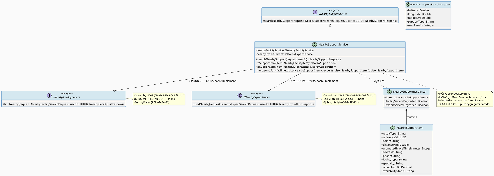
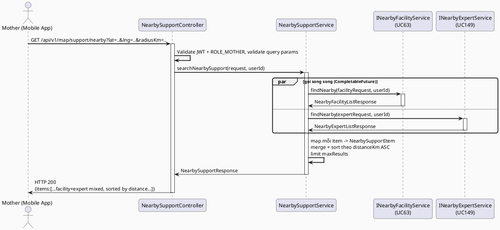
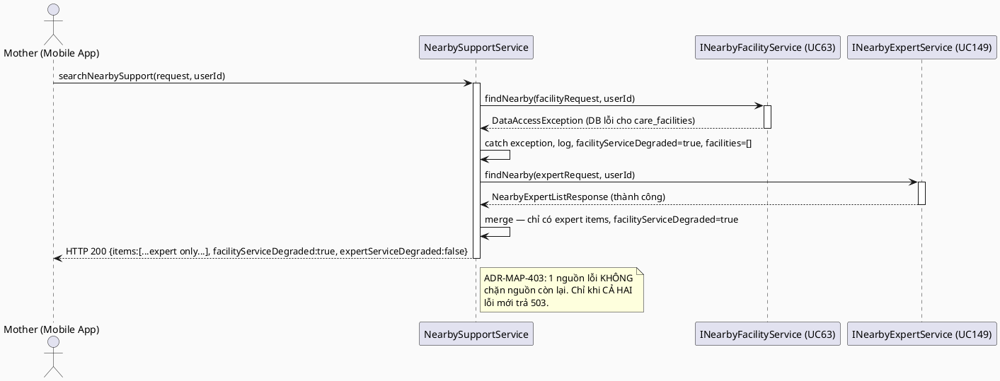
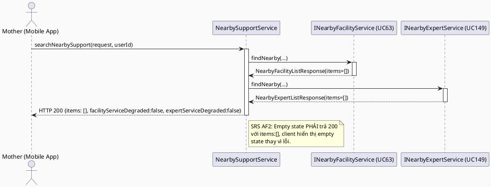
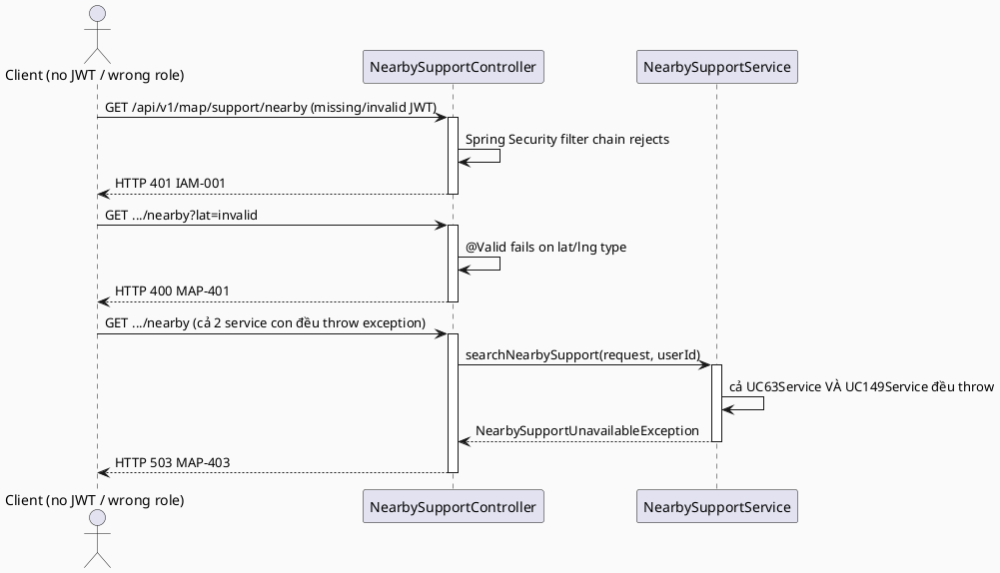

# ENGINEERING DOCUMENTATION STANDARD (EDS) v2.0
# UC166 — Search Nearby Support

| Field | Value |
|-------|-------|
| **Document ID** | `CB-MAP-IMP-008` |
| **Version** | `1.0` |
| **Date** | `2026-07-03` |
| **Status** | `Draft` |
| **Document Owner** | `TV4 - Lâm` |
| **Author** | `AI Agent — Tech Lead` |
| **Reviewed by** | `[ ] Pending` |
| **DPO Sign-off** | `[ ] Pending` *(kết hợp kết quả có location PII của Expert từ `expert_location_shares`, mirror UC149/UC155)* |
| **Approved by** | `[ ] Pending` |
| **Last Review** | `2026-07-03` |
| **Based on EDS** | `v2.0` |

---

## CHANGELOG

| Ngày | Người thực hiện | Nội dung thay đổi |
|------|-----------------|-------------------|
| 2026-07-03 | AI Agent — Tech Lead | Tạo tài liệu lần đầu — TDS cho UC166 Search Nearby Support |

---

## MỤC LỤC

1. [Tổng quan Module](#1-tổng-quan-module)
2. [Ma trận Truy vết (Traceability Matrix)](#2-ma-trận-truy-vết-traceability-matrix)
3. [Architecture Decision Records (ADR)](#3-architecture-decision-records-adr)
4. [Non-Functional Requirements & SLA](#4-non-functional-requirements--sla)
5. [Static Modeling (Mô hình Tĩnh)](#5-static-modeling-mô-hình-tĩnh)
6. [Dynamic Modeling (Mô hình Động)](#6-dynamic-modeling-mô-hình-động)
7. [Domain Event Catalog](#7-domain-event-catalog)
8. [Interface Specification (Đặc tả Giao diện)](#8-interface-specification-đặc-tả-giao-diện)
9. [API Specification](#9-api-specification)
10. [Bảng mã lỗi (Error Codes)](#10-bảng-mã-lỗi-error-codes)
11. [Quy trình Triển khai (Step-by-Step)](#11-quy-trình-triển-khai-step-by-step)
12. [Rollback & Incident Runbook](#12-rollback--incident-runbook)
13. [Kịch bản Kiểm thử Chi tiết](#13-kịch-bản-kiểm-thử-chi-tiết)
14. [Phương pháp Xác minh](#14-phương-pháp-xác-minh)
15. [Mẫu thử thực tế (API Verification Samples)](#15-mẫu-thử-thực-tế-api-verification-samples)
16. [Bảng tổng hợp phân quyền (Authorization Matrix)](#16-bảng-tổng-hợp-phân-quyền-authorization-matrix)
17. [AI Prompt Constraints (CASE 2.0)](#17-ai-prompt-constraints-case-20)
18. [Open Items / Research Gate](#18-open-items--research-gate)

---

## 1. Tổng quan Module

> **RG-3 (Overlap resolution với UC63/UC149/UC155 — bắt buộc đọc trước khi implement):** SRS §3.3.7.4 mô tả UC166: "Finds nearby care facilities **or** available experts using TrackAsia map and location capability." Từ khoá **"or"** (không phải "and kết hợp thành 1 danh sách duy nhất") cùng với việc 2 nguồn dữ liệu (`care_facilities` — public reference data, KHÔNG có PII; `expert_location_shares` — Sensitive-PII, consent-gated) có **compliance profile hoàn toàn khác nhau**, dẫn tới quyết định kiến trúc cốt lõi của TDS này (xem ADR-MAP-401 đầy đủ ở §3):
>
> **UC166 là 1 aggregator/facade endpoint gọi CẢ HAI service đã tồn tại — KHÔNG viết lại query nào:**
> - Phần "care facilities" → gọi trực tiếp `INearbyFacilityService.findNearby()` (UC63, `CB-MAP-IMP-001` §8.1) — **tái sử dụng 100%**, không viết lại bounding-box/Haversine cho facility.
> - Phần "available experts" → gọi trực tiếp `INearbyExpertService.findNearby()` (UC149, `CB-MAP-IMP-005` §8.1) — **tái sử dụng 100%**, không viết lại bounding-box/Haversine/consent-check cho expert.
> - UC166 **KHÔNG** phải một UNION SQL query ở tầng DB (2 bảng `care_facilities` và `expert_location_shares` không có schema tương thích để UNION trực tiếp — khác PK, khác cột, khác compliance classification) — đây là **UNION ở tầng ứng dụng (application-level aggregation)**: gọi song song (hoặc tuần tự) 2 service đã có, rồi merge 2 danh sách kết quả thành 1 response thống nhất theo 1 discriminator field (`resultType: FACILITY | EXPERT`).
> - Quyết định này **tận dụng trực tiếp** UC155's đã xác lập nguyên tắc "reuse existing service làm data source thay vì viết lại pipeline" (ADR-MAP-301 của UC155) — áp dụng nguyên tắc đó cho CẢ HAI nguồn dữ liệu cùng lúc.

| Field | Value |
|-------|-------|
| **Module Name** | `Search Nearby Support` |
| **Bounded Context** | `map` (mở rộng bounded context `map` đã có từ UC63/UC129/UC149/UC155 — theo phân công TV4-Lâm "Location/map/nearby care domain + expert location visibility") |
| **Data Classification** | `Sensitive-PII` *(vị trí hiện tại của Mother = location PII; phần kết quả Expert chứa location PII của Expert qua `expert_location_shares`; phần kết quả Facility là `Public`/`Internal` — response tổng hợp thừa hưởng mức phân loại cao nhất)* |
| **Compliance Scope** | `PDPA / Luật 91/2025` |
| **Upstream Dependencies** | `IAM (JWT ROLE_MOTHER)`, **`UC63 Find Nearby Care Facility`** (`CB-MAP-IMP-001` — `INearbyFacilityService.findNearby()`, data source cho phần facility, KHÔNG viết lại), **`UC149 Find Nearby Available Experts`** (`CB-MAP-IMP-005` — `INearbyExpertService.findNearby()`, data source cho phần expert, KHÔNG viết lại), `IMapProviderService` (UC129, gián tiếp qua UC63/UC149), TrackAsia Map Service (gián tiếp qua UC63/UC149 — KHÔNG gọi trực tiếp từ UC166) |
| **Downstream Consumers** | Mobile `emergencyMap`/`nearbySupport` feature (combined list/map UI); UC155 (View Nearby Experts on Map, sibling — hiển thị marker riêng cho phần expert nếu Mobile chọn hiển thị map thay vì list) |

---

## 2. Ma trận Truy vết (Traceability Matrix)

| Requirement ID | Loại (BR/ADR/US) | Mô tả yêu cầu | Thành phần Code | Compliance Target | ADR liên quan |
|----------------|------------------|---------------|-----------------|-------------------|---------------|
| SRS-3.3.7.4 (UC-166) | User Story | Tìm cơ sở y tế gần HOẶC expert khả dụng gần, dùng TrackAsia map/location | `NearbySupportController.GET /api/v1/map/support/nearby` | — | ADR-MAP-401 |
| SRS-3.3.1.40 (UC-63, upstream) | User Story | Nguồn dữ liệu "facility gần" — UC166 PHẢI dùng chung, KHÔNG định nghĩa lại | `NearbySupportService` gọi `INearbyFacilityService.findNearby()` (UC63) | — | ADR-MAP-401 |
| SRS-3.3.7.1 (UC-149, upstream) | User Story | Nguồn dữ liệu "expert gần, đã verify, đã opt-in" — UC166 PHẢI dùng chung, KHÔNG định nghĩa lại | `NearbySupportService` gọi `INearbyExpertService.findNearby()` (UC149) | — | ADR-MAP-401 |
| BR-RBAC | Business Rule | Chỉ ROLE_MOTHER (đã auth) được gọi endpoint search nearby support | `NearbySupportController` | BR-RBAC | ADR-MAP-404 |
| BR-SAFETY | Business Rule | Không delay/chặn kết quả bởi AI hoặc external service; nếu 1 trong 2 nguồn lỗi, nguồn còn lại vẫn trả về (partial success, không fail toàn bộ) | `NearbySupportService` | BR-SAFETY | ADR-MAP-403 |
| BR-PRIVACY | Business Rule | Phần expert trong kết quả kế thừa nguyên vẹn consent-gating của UC149 (`consent_reference`/`expires_at`) — UC166 không nới lỏng điều kiện | `NearbySupportService` | PDPA | ADR-MAP-401 |
| E1/E2/E3 (SRS Exceptions) | Exception | Access denied / invalid params / external service (1 hoặc cả 2 nguồn) failure xử lý an toàn | `NearbySupportController`, `NearbySupportService` | BR-SAFETY | ADR-MAP-403 |
| ADR-MAP-401 | Decision | UC166 KHÔNG viết lại bounding-box/Haversine/consent-check cho facility hoặc expert — **tái sử dụng song song** `INearbyFacilityService.findNearby()` (UC63) VÀ `INearbyExpertService.findNearby()` (UC149), merge kết quả ở application layer bằng discriminator field `resultType` | `NearbySupportService` | — | — |
| ADR-MAP-402 | Decision | Merge/sort strategy: kết quả tổng hợp sort theo `distanceKm` tăng dần xuyên suốt CẢ HAI loại (không tách 2 danh sách riêng theo mặc định) — hỗ trợ `supportType` param để lọc chỉ facility, chỉ expert, hoặc cả hai | `NearbySupportService`, `NearbySupportItem` | — | ADR-MAP-401 |
| ADR-MAP-403 | Decision | Partial-degradation: nếu 1 trong 2 nguồn lỗi (DB hoặc TrackAsia degraded ở tầng con), nguồn còn lại vẫn trả về đầy đủ, kèm cờ `facilityServiceDegraded`/`expertServiceDegraded` riêng biệt — KHÔNG fail toàn bộ response chỉ vì 1 nguồn lỗi | `NearbySupportService` | BR-SAFETY | ADR-MAP-103 (kế thừa UC129), ADR-MAP-003 (kế thừa UC63) |
| ADR-MAP-404 | Decision | Endpoint yêu cầu JWT + ROLE_MOTHER; `userId` từ SecurityContext; KHÔNG ghi `location_snapshots` riêng cho UC166 — 2 lần ghi snapshot (`NEARBY_FACILITY_SEARCH` từ UC63, `NEARBY_EXPERT_SEARCH` từ UC149) đã xảy ra bên trong các service con, UC166 không thêm context_type mới | `NearbySupportController` | BR-RBAC | ADR-MAP-304 (kế thừa UC155) |

> **Open (RG-2 — kế thừa từ UC63/UC149):** Toàn bộ threshold số (radiusKm default, maxResults default cho từng nguồn) đến từ UC63/UC149 §8.1 — UC166 KHÔNG bịa giá trị mới, dùng lại nguyên `NearbyFacilitySearchRequest`/`NearbyExpertSearchRequest` làm input contract cho từng nguồn con, chỉ thêm 1 field `supportType` mới ở tầng aggregator.

---

## 3. Architecture Decision Records (ADR)

### ADR-MAP-401 — Aggregation Strategy: gọi song song `INearbyFacilityService` (UC63) + `INearbyExpertService` (UC149), merge ở application layer

| Field | Value |
|-------|-------|
| **Status** | `Proposed` |
| **Deciders** | `AI Agent — Tech Lead` (chờ TV4-Lâm confirm) |
| **Date** | `2026-07-03` |
| **Supersedes** | `—` |

#### Bối cảnh (Context)
UC63 (`CB-MAP-IMP-001`) đã formal hoá toàn bộ pipeline tìm `care_facilities` gần (bounding-box + Haversine, public data, không PII). UC149 (`CB-MAP-IMP-005`) đã formal hoá pipeline tìm expert gần đã verify + đã opt-in (bounding-box + Haversine qua `IMapProviderService`, consent-gated PII). UC166 SRS Description ("Finds nearby care facilities **or** available experts") mô tả một **UNION kết quả ở mức khái niệm sản phẩm** (Mother tìm kiếm "hỗ trợ gần" bất kể loại hình), không phải một domain query mới với business rule filter khác biệt.

**RG-6 quyết định kiến trúc (câu hỏi bắt buộc từ batch):** UC166 có phải một UNION SQL literal của UC63 + UC155(UC149), hay một combined query hoàn toàn mới?

#### Các phương án đã xem xét (Options Considered)

| Phương án | Mô tả | Ưu điểm | Nhược điểm |
|-----------|-------|----------|------------|
| A | `NearbySupportService` gọi cả `INearbyFacilityService.findNearby()` (UC63) và `INearbyExpertService.findNearby()` (UC149) với cùng toạ độ/radius đầu vào, sau đó map từng kết quả sang 1 DTO chung (`NearbySupportItem` với `resultType` discriminator), merge + sort theo distance | Zero duplication — không viết lại bất kỳ bounding-box/Haversine/consent-check nào; consistency tuyệt đối với UC63/UC149 (nếu 1 expert bị lọc ở UC149 thì cũng bị lọc ở UC166); mỗi service con tự chịu trách nhiệm domain rule của riêng nó (facility: verification_status; expert: verification_status + consent) | 2 lượt DB query độc lập (không phải 1 query tối ưu duy nhất) — chấp nhận được vì đây đúng bản chất 2 domain khác nhau, không nên ép vào 1 query |
| B | Viết 1 SQL UNION ALL literal giữa `care_facilities` và `expert_location_shares` JOIN `expert_profiles`, tự lọc verification/consent trong 1 query | Có thể tối ưu 1 round-trip DB duy nhất | Trùng lặp 100% logic filter của UC63 VÀ UC149 — vi phạm trực tiếp yêu cầu RG-3 của batch ("không được silently duplicate"); 2 bảng khác cấu trúc PK/cột hoàn toàn (`care_facilities.facility_id` vs `expert_location_shares.location_share_id`) khiến UNION SQL cực kỳ khó bảo trì và dễ lệch consent logic theo thời gian (rủi ro PII leak nếu quên đồng bộ điều kiện `expires_at`/`consent_reference` khi UC149 sửa) |

#### Quyết định (Decision)
Chọn **Phương án A**. `NearbySupportService.searchNearbySupport(NearbySupportSearchRequest request, UUID userId)`:
1. Nếu `supportType` bao gồm `FACILITY` (hoặc không set — mặc định cả hai): gọi `INearbyFacilityService.findNearby(facilityRequest, userId)` (UC63, **tái sử dụng, KHÔNG viết lại**).
2. Nếu `supportType` bao gồm `EXPERT` (hoặc không set): gọi `INearbyExpertService.findNearby(expertRequest, userId)` (UC149, **tái sử dụng, KHÔNG viết lại**).
3. Map từng `NearbyFacilityItem`/`NearbyExpertItem` sang `NearbySupportItem` (discriminator `resultType: FACILITY | EXPERT`), merge 2 danh sách, sort theo `distanceKm` tăng dần, giới hạn `maxResults` tổng hợp.

**KHÔNG** tạo `ICareFacilityRepository`/`IExpertLocationShareRepository` mới trong UC166, **KHÔNG** gọi lại `IMapProviderService.calculateHaversineDistance()` riêng (distance đã có sẵn từ 2 service con).

#### Hệ quả (Consequences)

**Tích cực:**
- Không có 2 nguồn sự thật khác nhau cho "facility/expert nào được coi là nearby" — sửa 1 nơi (UC63 hoặc UC149), UC166 tự động nhất quán theo.
- Implementation UC166 nhẹ: 1 Controller + 1 Service mỏng (aggregator, delegate hoàn toàn cho 2 service con) + 1 mapper.
- Consent/PII logic của phần expert **hoàn toàn không đổi** so với UC149 — không có rủi ro "quên" áp dụng consent-check khi viết code UNION riêng.

**Tiêu cực / Trade-offs:**
- 2 round-trip DB (facility + expert) thay vì 1 — chấp nhận được vì tải dự kiến thấp/trung bình (mirror UC63/UC149 §4.4), và 2 query có thể chạy song song (CompletableFuture) để giảm latency tổng.
- UC166 phụ thuộc cứng vào UC63 VÀ UC149 đã implement/deploy trước — không thể tồn tại độc lập (chấp nhận được, đúng bản chất aggregator).

**Compliance Impact:** Không phát sinh rủi ro PII mới — cùng dữ liệu, cùng filter/consent-check của 2 service con, chỉ khác cách trình bày tổng hợp.

---

### ADR-MAP-402 — Merge/Sort Strategy: kết quả tổng hợp sort theo distance, hỗ trợ `supportType` filter

| Field | Value |
|-------|-------|
| **Status** | `Proposed` |
| **Deciders** | `AI Agent — Tech Lead` |
| **Date** | `2026-07-03` |
| **Supersedes** | `—` |

#### Bối cảnh (Context)
SRS UC166 không quy định rõ thứ tự hiển thị (facility trước hay expert trước, hay xen kẽ theo khoảng cách). Ngữ cảnh sản phẩm ("nearby support" — Mother cần hỗ trợ gần nhất bất kể loại hình) gợi ý sort theo khoảng cách là hợp lý nhất, phù hợp tinh thần "emergency-adjacent, không delay quyết định của Mother".

#### Quyết định (Decision)
Mặc định (`supportType` không set): trả 1 danh sách `items` duy nhất chứa CẢ facility VÀ expert, **sort theo `distanceKm` tăng dần xuyên suốt** (không nhóm riêng theo loại). Field `resultType` (`FACILITY`/`EXPERT`) cho phép client tự nhóm/hiển thị icon khác nhau nếu muốn. Nếu Mother chỉ muốn 1 loại, `supportType=FACILITY` hoặc `supportType=EXPERT` giới hạn aggregator chỉ gọi 1 trong 2 service con (tối ưu — không gọi service không cần thiết).

#### Hệ quả (Consequences)

**Tích cực:** UX đơn giản, nhất quán với tinh thần "tìm hỗ trợ gần nhất trước" của SRS; tối ưu hoá khi Mother chỉ cần 1 loại (giảm 1 round-trip DB không cần thiết).

**Tiêu cực / Trade-offs:** Client cần tự phân biệt UI rendering (facility card khác expert card) dựa trên `resultType` — field mapping khác nhau (`NearbySupportItem` phải là superset đủ field cho cả 2 loại, một số field null tuỳ `resultType`).

**Compliance Impact:** Không có.

---

### ADR-MAP-403 — Partial Degradation: 1 nguồn lỗi không chặn nguồn còn lại

| Field | Value |
|-------|-------|
| **Status** | `Proposed` |
| **Deciders** | `AI Agent — Tech Lead` |
| **Date** | `2026-07-03` |
| **Supersedes** | `—` |

#### Bối cảnh (Context)
UC63 ADR-MAP-003 và UC149 ADR-MAP-203 đã thiết lập nguyên tắc "TrackAsia lỗi không chặn response, trả kết quả kèm cờ degraded". UC166 gọi CẢ HAI service — cần định nghĩa rõ hành vi khi 1 trong 2 nguồn (không phải TrackAsia, mà chính bản thân `findNearby()` của UC63/UC149) throw exception (ví dụ DB down cho riêng bảng `expert_location_shares` trong khi `care_facilities` vẫn hoạt động).

#### Quyết định (Decision)
`NearbySupportService` gọi 2 service con trong try-catch độc lập (hoặc `CompletableFuture` với exception handling riêng từng future). Nếu `INearbyFacilityService.findNearby()` throw exception: log lỗi, set `facilityServiceDegraded=true`, `items` vẫn chứa kết quả expert (nếu có). Tương tự cho `INearbyExpertService.findNearby()` lỗi → `expertServiceDegraded=true`. Response luôn trả **200 OK** trừ khi **CẢ HAI** nguồn đều lỗi (khi đó trả `503 MAP-403` — không thể phục vụ bất kỳ dữ liệu nào). `mapServiceDegraded` (field kế thừa nghĩa từ UC63/UC149's TrackAsia-degraded) tiếp tục pass-through riêng biệt bên trong từng item nếu service con đã set.

#### Hệ quả (Consequences)

**Tích cực:** Resilience tốt hơn — Mother vẫn nhận được 1 phần kết quả hữu ích thay vì lỗi toàn bộ; tuân thủ CLAUDE.md "never delay emergency-adjacent routing".

**Tiêu cực / Trade-offs:** Thêm độ phức tạp code (partial failure handling) so với UC63/UC149 (vốn chỉ gọi 1 nguồn).

**Compliance Impact:** Không có — hành vi degraded chỉ ảnh hưởng đến tính đầy đủ dữ liệu, không ảnh hưởng đến tính đúng đắn của consent/PII filter (mỗi service con tự đảm bảo compliance của chính nó).

---

### ADR-MAP-404 — Authorization & Audit: ROLE_MOTHER only, không double-write `location_snapshots`

| Field | Value |
|-------|-------|
| **Status** | `Proposed` |
| **Deciders** | `AI Agent — Tech Lead` |
| **Date** | `2026-07-03` |
| **Supersedes** | `—` |

#### Bối cảnh (Context)
UC63 ADR-MAP-002 và UC149 ADR-MAP-204 đều đã ghi `location_snapshots` (context_type khác nhau: `NEARBY_FACILITY_SEARCH`/`NEARBY_EXPERT_SEARCH`) best-effort bên trong `findNearby()` của chính họ. Vì UC166 gọi cả 2 method này (ADR-MAP-401), 1 lượt gọi UC166 sẽ tự động sinh ra **2 bản ghi `location_snapshots`** (1 từ mỗi service con) — đây là hành vi kế thừa tự nhiên, KHÔNG phải hành vi mới UC166 phải tự implement, mirror chính xác cách UC155 đã xử lý vấn đề tương tự (ADR-MAP-304 của UC155).

#### Quyết định (Decision)
UC166 **không** tự ghi thêm `location_snapshots` nào — kế thừa nguyên vẹn hành vi ghi snapshot từ bên trong 2 service con. Nếu `supportType=FACILITY` (chỉ gọi UC63), chỉ có 1 snapshot `NEARBY_FACILITY_SEARCH` được ghi; nếu `supportType=EXPERT`, chỉ có 1 snapshot `NEARBY_EXPERT_SEARCH`; nếu không set `supportType` (gọi cả hai), có 2 snapshot cho cùng 1 lượt search của Mother — chấp nhận được, mirror hành vi hiện có, không phát sinh audit context mới.

#### Hệ quả (Consequences)

**Tích cực:** Không sửa đổi UC63/UC149 (dependency ổn định), không thêm entropy vào `context_type` domain.

**Tiêu cực / Trade-offs:** Audit log không có 1 context_type riêng biệt cho "combined search" — ghi nhận **Open** (§18), có thể bổ sung sau nếu Product Owner cần phân tích UX theo kênh combined-search riêng.

**Compliance Impact:** Không tăng rủi ro PII so với UC63/UC149 hiện có.

---

## 4. Non-Functional Requirements & SLA

### 4.1. Performance & Availability

| Category | Requirement | Target SLA | Measurement Method | Compliance Basis |
|----------|-------------|------------|---------------------|------------------|
| Latency | API response (p99) khi cả 2 nguồn thành công, gọi song song (CompletableFuture) | `< 1500ms` (= max(UC63's 1500ms, UC149's 1500ms) khi chạy song song, không cộng dồn) *(kế thừa/tính toán từ UC63 §4.1, UC149 §4.1)* | k6 load test | `CB-MAP-IMP-001` §4.1, `CB-MAP-IMP-005` §4.1 |
| Latency | API response (p99) khi chỉ 1 nguồn được gọi (`supportType` filter) | `< 1500ms` (= latency của 1 nguồn đơn) | k6 load test | ADR-MAP-402 |
| Availability | Uptime (monthly) | `99.9%` *(kế thừa baseline chung dự án)* | Uptime monitor | — |
| Throughput | Concurrent requests | `50 req/s` *(kế thừa UC63/UC129/UC149 §4.1)* | Load test | — |

### 4.2. Data Integrity & Retention

| Category | Requirement | Target | Verification Method | Compliance Basis |
|----------|-------------|--------|---------------------|------------------|
| Consistency | `items` (facility phần) PHẢI khớp 100% với `NearbyFacilityItem` list từ UC63 cho cùng request params | 100% | Integration test so sánh 2 endpoint | ADR-MAP-401 |
| Consistency | `items` (expert phần) PHẢI khớp 100% với `NearbyExpertItem` list từ UC149 cho cùng request params | 100% | Integration test so sánh 2 endpoint | ADR-MAP-401 |
| Partial degradation correctness | Khi 1 nguồn lỗi, nguồn còn lại vẫn đầy đủ, cờ degraded set đúng | 100% | Integration test (mock 1 service con throw exception) | ADR-MAP-403 |

### 4.3. Security

| Category | Requirement | Target | Verification Method | Compliance Basis |
|----------|-------------|--------|---------------------|------------------|
| Encryption in transit | Endpoint | TLS 1.3+ | SSL Labs scan | PDPA |
| Access control | ROLE_MOTHER only | Least privilege | Auth Matrix (§16) | BR-RBAC |
| No PII leak in logs | Toạ độ Expert KHÔNG log ở mức INFO (kế thừa UC149) | Log audit | PDPA |

### 4.4. Scalability & Capacity Planning

> Tải phụ thuộc hoàn toàn vào tần suất Mother tìm "hỗ trợ gần" kết hợp — không có tải độc lập ngoài những gì UC63/UC149 đã chịu, cộng thêm overhead gọi song song 2 service (chấp nhận được, giảm thiểu bằng `CompletableFuture.allOf()`).

---

## 5. Static Modeling (Mô hình Tĩnh)

### 5.1. Class Diagram (PlantUML)



### 5.2. Data Structure (Flyway SQL Migration)

> **Không cần migration mới.** UC166 không sở hữu bảng nào — đọc hoàn toàn qua `INearbyFacilityService.findNearby()` (UC63, đọc `care_facilities`/`location_snapshots`) và `INearbyExpertService.findNearby()` (UC149, đọc `expert_location_shares`/`expert_profiles`/`location_snapshots`), tất cả đã có sẵn trong `V1__init_schema.sql`. Đã kiểm tra `05_Development/CareBridgeAPI/src/main/resources/db/migration/` — không có bảng `nearby_support_cache`/`support_search_results` nào cần tạo.

---

## 6. Dynamic Modeling (Mô hình Động)

### 6.1. Sequence Diagram — Happy Path: cả 2 nguồn (PlantUML)



### 6.2. Sequence Diagram — Partial Degradation (1 nguồn lỗi) (PlantUML)



### 6.3. Sequence Diagram — Empty State (AF2) (PlantUML)



### 6.4. Sequence Diagram — Error Path (Total Failure / Unauthorized) (PlantUML)



> Không có state machine — read-only aggregator/presentation layer, không có entity trạng thái riêng.

---

## 7. Domain Event Catalog

> UC166 là read-only aggregator query layer — **không phát ra domain event nào**. Side-effect (ghi `location_snapshots`) xảy ra bên trong `findNearby()` của UC63 và UC149, KHÔNG phải trực tiếp trong UC166.

### 7.1. Events Published (Phát ra)

_Không có._

### 7.2. Events Consumed (Tiêu thụ)

_Không có._

---

## 8. Interface Specification (Đặc tả Giao diện)

### 8.1. Service Interface

```java
// NearbySupportSearchRequest.java — Input DTO (MỚI)
// @version 1.0
public class NearbySupportSearchRequest {
    @NotNull
    @DecimalMin("-90.0") @DecimalMax("90.0")
    private Double latitude;

    @NotNull
    @DecimalMin("-180.0") @DecimalMax("180.0")
    private Double longitude;

    @DecimalMin("0.1") @DecimalMax("50.0")
    private Double radiusKm = 5.0;              // default — mirror UC63/UC149 default

    private String supportType;                  // optional enum: FACILITY / EXPERT / null (= cả hai)

    @Min(1) @Max(50)
    private Integer maxResults = 20;              // default — giới hạn TỔNG (facility + expert combined)

    // getters / setters
}

// NearbySupportResponse.java — Output DTO (MỚI)
// @version 1.0
public class NearbySupportResponse {
    private List<NearbySupportItem> items;
    private Boolean facilityServiceDegraded;       // true nếu UC63's findNearby() throw hoặc mapServiceDegraded
    private Boolean expertServiceDegraded;          // true nếu UC149's findNearby() throw hoặc mapServiceDegraded
    // getters / setters
}

// NearbySupportItem.java — Output DTO (MỚI, superset field cho cả 2 loại)
// @version 1.0
public class NearbySupportItem {
    private String resultType;                       // "FACILITY" hoặc "EXPERT" — discriminator
    private UUID referenceId;                          // facilityId hoặc expertProfileId tuỳ resultType
    private String name;                                 // facility.name hoặc expert.professionalTitle
    private Double distanceKm;                            // pass-through từ service con
    private Integer estimatedTravelTimeMinutes;             // pass-through, nullable nếu degraded
    // --- Facility-only fields (null nếu resultType=EXPERT) ---
    private String address;
    private String phone;
    private String facilityType;
    // --- Expert-only fields (null nếu resultType=FACILITY) ---
    private String specialty;
    private BigDecimal ratingAvg;
    private String availabilityStatus;
    // getters / setters
}

// INearbySupportService.java — Service Contract (MỚI)
// @version 1.0
public interface INearbySupportService {
    /**
     * Tổng hợp kết quả từ INearbyFacilityService (UC63) VÀ INearbyExpertService (UC149)
     * thành 1 danh sách merge sort theo distanceKm. KHÔNG tự truy vấn DB, KHÔNG tự tính
     * Haversine (ADR-MAP-401) — mọi filter/tính toán uỷ quyền hoàn toàn cho 2 service con.
     * @throws NearbySupportUnavailableException (MAP-403) nếu CẢ HAI nguồn đều lỗi
     * @throws AccessDeniedException nếu không có ROLE_MOTHER
     */
    NearbySupportResponse searchNearbySupport(NearbySupportSearchRequest request, UUID userId);
}

// NearbyFacilitySearchRequest — TÁI SỬ DỤNG NGUYÊN VẸN từ UC63 (CB-MAP-IMP-001 §8.1)
// NearbyExpertSearchRequest — TÁI SỬ DỤNG NGUYÊN VẸN từ UC149 (CB-MAP-IMP-005 §8.1)
// KHÔNG tạo request DTO mới cho phần con — chỉ map NearbySupportSearchRequest sang 2 request này ở Service layer.
```

### 8.2. Repository Interface

> **Không có repository mới.** UC166 KHÔNG chứa bất kỳ `@Repository`/`JpaRepository` interface nào — mọi truy cập dữ liệu đi qua `INearbyFacilityService` (UC63) và `INearbyExpertService` (UC149).

### 8.3. External Service Interface (tái sử dụng UC63/UC129/UC149, KHÔNG tạo mới)

```java
// INearbyFacilityService — formal owner: UC63 (CB-MAP-IMP-001 §8.1)
// INearbyExpertService — formal owner: UC149 (CB-MAP-IMP-005 §8.1)
// UC166 CHỈ inject và gọi findNearby() của cả hai, KHÔNG định nghĩa lại interface nào.
// IMapProviderService — formal owner: UC129 — UC166 KHÔNG inject trực tiếp.
```

---

## 9. API Specification

### 9.1. Endpoints Table

| Method | Path | Auth Level | Required Roles | Rate Limit | Idempotent? |
|--------|------|------------|----------------|------------|-------------|
| `GET` | `/api/v1/map/support/nearby` | JWT Bearer | `ROLE_MOTHER` | 30/min *(kế thừa đề xuất UC63/UC149)* | Yes |

### 9.2. Request / Response Schemas

#### `GET /api/v1/map/support/nearby?latitude=10.7769&longitude=106.7009&radiusKm=5&supportType=BOTH&maxResults=20`

**Response — 200 OK (Happy Path, cả 2 nguồn):**
```json
{
  "items": [
    {
      "resultType": "FACILITY",
      "referenceId": "uuid-facility-1",
      "name": "Bệnh viện Từ Dũ",
      "distanceKm": 0.9,
      "estimatedTravelTimeMinutes": 4,
      "address": "284 Cống Quỳnh, Q1, TP.HCM",
      "phone": "+842854042829",
      "facilityType": "HOSPITAL",
      "specialty": null,
      "ratingAvg": null,
      "availabilityStatus": null
    },
    {
      "resultType": "EXPERT",
      "referenceId": "uuid-expert-1",
      "name": "BS. Nguyễn Văn A",
      "distanceKm": 1.2,
      "estimatedTravelTimeMinutes": 6,
      "address": null,
      "phone": null,
      "facilityType": null,
      "specialty": "Pediatrics",
      "ratingAvg": 4.8,
      "availabilityStatus": "AVAILABLE"
    }
  ],
  "facilityServiceDegraded": false,
  "expertServiceDegraded": false
}
```

**Response — 200 OK (Partial degradation — ADR-MAP-403):**
```json
{
  "items": [
    { "resultType": "EXPERT", "referenceId": "uuid-expert-1", "name": "BS. Nguyễn Văn A", "distanceKm": 1.2, "specialty": "Pediatrics", "ratingAvg": 4.8, "availabilityStatus": "AVAILABLE" }
  ],
  "facilityServiceDegraded": true,
  "expertServiceDegraded": false
}
```

**Response — 200 OK (Empty state — AF2):**
```json
{ "items": [], "facilityServiceDegraded": false, "expertServiceDegraded": false }
```

**Response — 400 Bad Request:**
```json
{
  "error": {
    "code": "MAP-401",
    "message": "latitude and longitude are required and must be valid coordinates",
    "details": [{ "field": "latitude", "message": "must be between -90 and 90" }]
  }
}
```

**Response — 401 Unauthorized:**
```json
{ "error": { "code": "IAM-001", "message": "Authentication required" } }
```

**Response — 403 Forbidden:**
```json
{ "error": { "code": "MAP-404", "message": "Insufficient permissions" } }
```

**Response — 503 Service Unavailable (cả 2 nguồn lỗi):**
```json
{ "error": { "code": "MAP-403", "message": "Nearby support service unavailable" } }
```

---

## 10. Bảng mã lỗi (Error Codes)

| Code | HTTP Status | Message (EN) | Message (VI) | Trigger Condition |
|------|-------------|--------------|--------------|-------------------|
| `MAP-401` | 400 | Validation failed | Dữ liệu không hợp lệ | latitude/longitude thiếu hoặc ngoài phạm vi hợp lệ, `supportType` không hợp lệ (kế thừa pattern UC63 MAP-001) |
| `MAP-402` | 200 (không phải lỗi cứng) | Partial support service degraded | Một phần dịch vụ hỗ trợ tạm thời không khả dụng | 1 trong 2 nguồn (`facilityServiceDegraded`/`expertServiceDegraded`) = true — vẫn trả 200, KHÔNG dùng mã lỗi HTTP riêng (ADR-MAP-403) |
| `MAP-403` | 503 | Nearby support service unavailable | Dịch vụ tìm hỗ trợ gần không khả dụng | CẢ HAI nguồn (facility VÀ expert) đều lỗi |
| `MAP-404` | 403 | Insufficient permissions | Không đủ quyền | User không có ROLE_MOTHER |

> **Lưu ý:** `MAP-402` liệt kê cho đầy đủ bảng nhưng KHÔNG áp dụng làm HTTP error thực tế — theo ADR-MAP-403, partial degradation vẫn trả 200 kèm cờ, tương tự cách UC63's `MAP-002` đã xử lý `mapServiceDegraded`.

---

## 11. Quy trình Triển khai (Step-by-Step)

### 11.1. Prerequisites

- [ ] ADR-MAP-401 → 404 được Accepted (hiện tại `Proposed` — cần TV4-Lâm + Tech Lead review)
- [ ] **UC63 (`INearbyFacilityService`) VÀ UC149 (`INearbyExpertService`) đã implement và deploy** — UC166 là pure consumer của cả hai, không thể implement độc lập trước
- [ ] Xác nhận §18 Open Items (danh sách `supportType` enum, giá trị mặc định `maxResults` tổng hợp) trước khi code

### 11.2. Pre-Migration Checklist

- [ ] Không cần migration mới (§5.2)

### 11.3. Implementation Steps

#### Chặng 1 — Mở rộng package `map` đã có (mirror UC63/UC149/UC155 convention, KHÔNG tạo package mới)

```
com.carebridge.backend.map/
├── controller/NearbySupportController.java          (MỚI)
├── dto/request/NearbySupportSearchRequest.java        (MỚI)
├── dto/response/NearbySupportResponse.java              (MỚI)
├── dto/response/NearbySupportItem.java                    (MỚI)
├── service/INearbySupportService.java                       (MỚI)
├── service/impl/NearbySupportService.java                     (MỚI — inject INearbyFacilityService của UC63 VÀ INearbyExpertService của UC149)
├── exception/NearbySupportUnavailableException.java             (MỚI)
└── mapper/NearbySupportMapper.java                                 (MỚI)
```

> **Lưu ý quan trọng khi implement song song với UC63/UC149:** Nếu UC63 hoặc UC149 chưa deploy, UC166 KHÔNG thể compile (dependency cứng vào cả hai interface). Implement UC166 SAU UC63 VÀ UC149, không song song.

#### Chặng 2 — Implement `NearbySupportService` — gọi song song 2 service con qua `CompletableFuture`

```java
// NearbySupportService inject INearbyFacilityService + INearbyExpertService (bean đã có từ UC63/UC149)
// Dùng CompletableFuture.supplyAsync() cho mỗi lời gọi, CompletableFuture.allOf() để chờ cả 2,
// mỗi future có exceptionally() riêng để implement partial degradation (ADR-MAP-403).
// KHÔNG import ICareFacilityRepository/IExpertLocationShareRepository trực tiếp (ADR-MAP-401)
```

#### Chặng 3 — Implement Controller + Security config

```java
// @PreAuthorize("hasRole('MOTHER')") — mirror NearbyFacilityController/NearbyExpertController pattern
```

#### Chặng 4 — Mobile: mở rộng `emergencyMap`/`nearbySupport` feature với combined list rendering

```
lib/features/nearbySupport/
├── models/nearby_support_item_model.dart       (MỚI)
├── repositories/nearby_support_repository.dart  (MỚI)
├── services/nearby_support_api_service.dart      (MỚI)
├── screens/nearby_support_screen.dart              (MỚI — combined list, filter chip FACILITY/EXPERT/BOTH)
└── widgets/nearby_support_item_card.dart             (MỚI — render khác nhau tuỳ resultType)
```

### 11.4. Deployment Checklist

- [ ] Endpoint trả 200 với dữ liệu seed giống hệt test đã dùng cho UC63 + UC149 (đảm bảo consistency)
- [ ] Xác nhận merged list khớp 1:1 với union của UC63's item list + UC149's item list cho cùng request params
- [ ] Partial degradation test: mock 1 service con throw exception, xác nhận response vẫn 200 với cờ đúng
- [ ] p99 latency đạt target §4.1 (gọi song song, không cộng dồn latency)

---

## 12. Rollback & Incident Runbook

### 12.1. Điều kiện kích hoạt Rollback

| Điều kiện | Ngưỡng | Người quyết định |
|-----------|--------|------------------|
| Error rate tăng đột biến | > 5% trong 5 phút | On-call Engineer |
| Merged list KHÔNG khớp với UC63/UC149's list riêng (data inconsistency) | Bất kỳ case nào | Tech Lead |
| Cả 2 nguồn cùng lỗi kéo dài | > 15 phút liên tục | Tech Lead |

### 12.2. Rollback Procedure

```bash
# Không có migration mới để rollback — chỉ cần revert code deploy
kubectl rollout undo deployment/carebridge-api
kubectl rollout status deployment/carebridge-api
```

### 12.3. Notification Protocol

| Thời điểm | Người nhận | Kênh | Template |
|-----------|------------|------|----------|
| Ngay khi phát hiện | On-call team | Slack `#incident` | "Search Nearby Support (UC166) degraded/down: [mô tả]. UC63/UC149 riêng lẻ vẫn hoạt động." |

### 12.4. Post-Incident Review (PIR)

- **Timeline, Root Cause (5 Whys), Impact, Remediation, Prevention** — theo template chung.

---

## 13. Kịch bản Kiểm thử Chi tiết

> Chi tiết đầy đủ nằm trong `UC166_SearchNearbySupport_Test-Spec.md`.

| TDS Concern | Test-Spec Condition Ref |
|-------------|--------------------------|
| ADR-MAP-401 (aggregate, KHÔNG viết lại query) | `TC-COND-001, 002, 003` |
| ADR-MAP-402 (merge/sort/supportType filter) | `TC-COND-004, 005, 006` |
| ADR-MAP-403 (partial degradation) | `TC-COND-007, 008, 009` |
| ADR-MAP-404 (RBAC, không double-audit context mới) | `TC-COND-010` |
| SRS AF2 (empty state) | `TC-COND-011` |
| Consistency giữa UC63/UC149 riêng lẻ và UC166 tổng hợp | `TC-COND-012, 013` |

---

## 14. Phương pháp Xác minh

### 14.1. Database Inspection

```sql
-- UC166 không sở hữu bảng nào — verify chỉ đọc qua service UC63 + UC149
SELECT facility_id, name, latitude, longitude, verification_status
FROM care_facilities
WHERE latitude BETWEEN :minLat AND :maxLat AND longitude BETWEEN :minLng AND :maxLng;

SELECT s.location_share_id, s.expert_profile_id, s.latitude, s.longitude, s.expires_at, p.verification_status
FROM expert_location_shares s
JOIN expert_profiles p ON s.expert_profile_id = p.expert_profile_id
WHERE p.verification_status = 'VERIFIED' AND s.expires_at > now();
```

### 14.2. Log / Audit Verification

```bash
kubectl logs -l app=carebridge-api | grep "GET /api/v1/map/support/nearby" | tail -20
```

### 14.3. Tool-based Verification

```bash
curl -X GET "https://$HOST/api/v1/map/support/nearby?latitude=10.7769&longitude=106.7009&radiusKm=5" \
  -H "Authorization: Bearer $MOTHER_JWT"
```

---

## 15. Mẫu thử thực tế (API Verification Samples)

### 15.1. Happy Path

```bash
curl -X GET "https://$HOST/api/v1/map/support/nearby?latitude=10.7769&longitude=106.7009&radiusKm=5&supportType=BOTH&maxResults=20" \
  -H "Authorization: Bearer $MOTHER_JWT" \
  -H "X-Correlation-Id: $(uuidgen)"
```

### 15.2. Error Paths

```bash
# Thiếu latitude/longitude → 400 MAP-401
curl -X GET "https://$HOST/api/v1/map/support/nearby" \
  -H "Authorization: Bearer $MOTHER_JWT"

# Không có JWT → 401
curl -X GET "https://$HOST/api/v1/map/support/nearby?latitude=10.77&longitude=106.70"

# Chỉ facility
curl -X GET "https://$HOST/api/v1/map/support/nearby?latitude=10.77&longitude=106.70&supportType=FACILITY" \
  -H "Authorization: Bearer $MOTHER_JWT"
```

---

## 16. Bảng tổng hợp phân quyền (Authorization Matrix)

| Endpoint | `GUEST` | `ROLE_MOTHER` | `ROLE_PARTNER` | `ROLE_EXPERT` | `ROLE_ADMIN` |
|----------|---------|---------------|----------------|---------------|--------------|
| `GET /api/v1/map/support/nearby` | ❌ | ✅ | ❌ | ❌ | ❌ |

**Chú thích:** Kế thừa nguyên vẹn từ UC63/UC149 §16 — cùng phạm vi role (Mother only), vì cùng dữ liệu tổng hợp từ 2 nguồn đó.

---

## 17. AI Prompt Constraints (CASE 2.0)

### 17.1 Constraint Summary Table

| # | Constraint | Source (ADR/BR) | Last Verified |
|---|-----------|-----------------|---------------|
| C1 | UC166 KHÔNG được tự viết bounding-box/Haversine/consent-check cho facility hoặc expert — PHẢI gọi `INearbyFacilityService.findNearby()` (UC63) VÀ `INearbyExpertService.findNearby()` (UC149) làm data source duy nhất | `ADR-MAP-401` | `2026-07-03` |
| C2 | Kết quả tổng hợp PHẢI sort theo `distanceKm` tăng dần xuyên suốt cả 2 loại (không nhóm riêng theo mặc định) trừ khi `supportType` giới hạn 1 loại | `ADR-MAP-402` | `2026-07-03` |
| C3 | Nếu 1 trong 2 nguồn lỗi, nguồn còn lại PHẢI vẫn trả về đầy đủ kèm cờ degraded riêng — chỉ trả lỗi 503 khi CẢ HAI đều lỗi | `ADR-MAP-403` | `2026-07-03` |
| C4 | `userId` PHẢI lấy từ JWT SecurityContext — KHÔNG từ query param; KHÔNG ghi `location_snapshots` mới trong UC166 (đã ghi bên trong 2 service con) | `ADR-MAP-404` | `2026-07-03` |
| C5 | Danh sách rỗng (AF2) PHẢI trả HTTP 200 với `items: []`, KHÔNG trả 404 | `SRS AF2` | `2026-07-03` |

### 17.2 Constraint Injection Block (Copy-Paste vào AI Prompt)

```
[CONSTRAINT BLOCK — Module: Search Nearby Support — CB-MAP-IMP-008]
Theo TDS CB-MAP-IMP-008 và các ADR liên quan:

1. KHÔNG viết lại bounding-box/Haversine/consent-check — PHẢI gọi INearbyFacilityService.findNearby() (UC63) VÀ INearbyExpertService.findNearby() (UC149) làm data source duy nhất (ADR-MAP-401)
2. Kết quả tổng hợp sort theo distanceKm tăng dần xuyên suốt cả 2 loại, trừ khi supportType giới hạn 1 loại (ADR-MAP-402)
3. 1 nguồn lỗi -> nguồn còn lại vẫn trả về đầy đủ kèm cờ degraded riêng; chỉ 503 khi CẢ HAI lỗi (ADR-MAP-403)
4. userId từ JWT SecurityContext — KHÔNG ghi location_snapshots mới trong UC166 (ADR-MAP-404)
5. Danh sách rỗng → HTTP 200 với items:[], KHÔNG 404 (SRS AF2)

[CONTEXT BLOCK]
- Bounded Context: map
- Data Classification: Sensitive-PII (kết quả expert chứa location PII; kết quả facility là Public/Internal)
- Compliance: PDPA / Luật 91/2025
- Existing interfaces: §8 Service Interface (MỚI) + UC63 §8.1 INearbyFacilityService + UC149 §8.1 INearbyExpertService (reuse, DO NOT redefine)
- Error codes: §10 Error Codes Table
- Auth matrix: §16 Authorization Matrix

[TASK BLOCK]
Implement NearbySupportService.searchNearbySupport() thỏa mãn constraints trên.
Output phải tuân thủ §8 Interface Specification.
Tests phải cover §13 Test Scenarios (xem Test-Spec).
```

### 17.3 Constraint Quality Checklist

- [x] Mỗi constraint traceable về ADR hoặc BR cụ thể
- [x] Không có constraint generic
- [x] Mỗi constraint có `Last Verified` date ≤ 2 sprints
- [x] Constraint block có ≥ 3 constraints cụ thể (có 5)
- [x] Constraint block reference §8 Interface
- [x] Constraint block reference §16 Auth Matrix

### 17.4 Anti-Pattern Detection

| AP-ID | Anti-Pattern | Dấu hiệu | Hành động |
|-------|-------------|-----------|----------|
| AP-AI-001 | Unconstrained Gen | Code tự viết lại bounding-box/Haversine/UNION SQL thay vì gọi 2 service con | Reject — enforce C1 |
| AP-AI-003 | Implicit Decision | Code tự thêm sort/group logic khác §8 mà không có ADR | Reject — enforce C2 |
| AP-AI-005 | Hallucinated Contract | Code import `ICareFacilityRepository`/`IExpertLocationShareRepository` trực tiếp thay vì qua service con | Reject — verify contract existence, enforce ADR-MAP-401 |
| AP-AI-006 | Duplicate Contract | Code tạo lại `NearbyFacilitySearchRequest`/`NearbyExpertSearchRequest` mới thay vì tái sử dụng của UC63/UC149 | Reject — kiểm tra file tồn tại trước khi tạo |

---

## 18. Open Items / Research Gate

> **RG-7 (Open, không block):** Danh sách giá trị enum hợp lệ cho `supportType` (`FACILITY`/`EXPERT`/`BOTH` hay để `null` = cả hai) chưa có xác nhận chính thức từ Product Owner — TDS này đề xuất `null`/không set = cả hai (mặc định), `FACILITY`/`EXPERT` = giới hạn 1 loại. Cần xác nhận trước khi Approve.
>
> **RG-8 (Open, không block, kế thừa UC155):** Audit trail không có 1 context_type riêng biệt cho "combined nearby support search" — 2 snapshot riêng (`NEARBY_FACILITY_SEARCH`/`NEARBY_EXPERT_SEARCH`) được ghi độc lập bởi 2 service con. Nếu Product Owner cần phân tích UX theo kênh "combined search" riêng sau này, cần bổ sung `context_type` mới (không cần migration DDL vì cột không có CHECK constraint).
>
> **RG-9 (Open):** `maxResults` tổng hợp (mặc định 20) — chưa rõ có nên chia đều (10 facility + 10 expert) hay áp dụng sau khi merge (top 20 theo distance bất kể loại). TDS này chọn phương án sau (áp dụng sau merge) vì đơn giản và đúng tinh thần "gần nhất trước" — cần Product Owner xác nhận.

---

## PHỤ LỤC

### A. Glossary

| Thuật ngữ | Định nghĩa |
|-----------|------------|
| Aggregator / Facade Service | Service tổng hợp kết quả từ nhiều service con mà không tự chứa business logic riêng |
| Partial Degradation | Trạng thái 1 phần hệ thống lỗi nhưng phần còn lại vẫn phục vụ được, tránh fail toàn bộ |
| Discriminator Field | Trường phân biệt loại dữ liệu trong 1 danh sách hỗn hợp (ở đây: `resultType`) |
| Application-level Union | Kết hợp 2 tập kết quả ở tầng code (Java List merge) thay vì SQL UNION ở tầng DB |

### B. Tài liệu tham chiếu

| Document | Link / Path |
|----------|-------------|
| SRS UC-166 | `02_Requirements/SRS/3_Functional_Specification.md §3.3.7.4` |
| UC63 Find Nearby Care Facility TDS (data source owner — facility, bắt buộc đọc) | `04_Implement/UC63_FindNearbyCareFacility/UC63_FindNearbyCareFacility_TDS.md` |
| UC149 Find Nearby Available Experts TDS (data source owner — expert, bắt buộc đọc) | `04_Implement/UC149_FindNearbyAvailableExperts/UC149_FindNearbyAvailableExperts_TDS.md` |
| UC155 View Nearby Experts on Map TDS (sibling — reuse-not-rewrite pattern reference, ADR-MAP-304 mirrored ở ADR-MAP-404) | `04_Implement/UC155_ViewNearbyExpertsOnMap/UC155_ViewNearbyExpertsOnMap_TDS.md` |
| UC129 Calculate Distance/Route/ETA TDS (`IMapProviderService` owner, gián tiếp qua UC63/UC149) | `04_Implement/UC129_CalculateDistanceRouteAndETA/UC129_CalculateDistanceRouteAndETA_TDS.md` |
| Task Allocation (TV4-Lâm ownership) | `04_Implement/implement_artifacts/function-spec-task-allocation.md` |
| DB Schema Source of Truth | `05_Development/CareBridgeAPI/src/main/resources/db/migration/V1__init_schema.sql` |
| EDS v2.0 Template | `08_References/Template/PHASE-3_TDS.md` |

---

*EDS v2.0 — Draft. Chưa Approved. Xem §18 Open Items (RG-7, RG-8, RG-9) trước khi chuyển Status sang `Approved`.*
