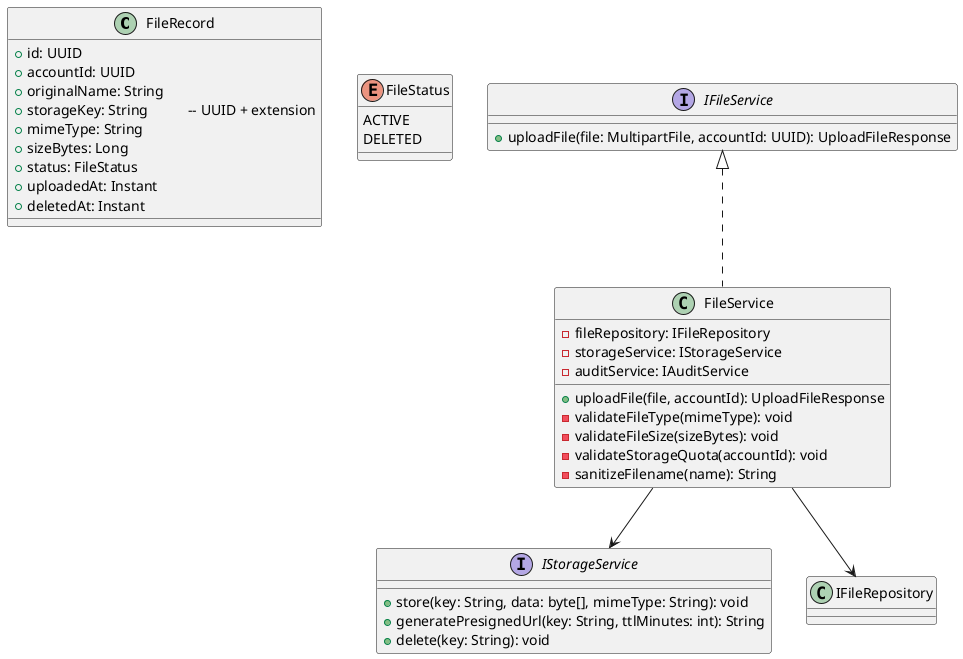
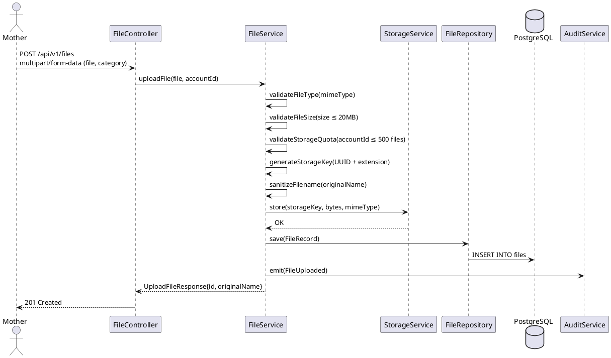
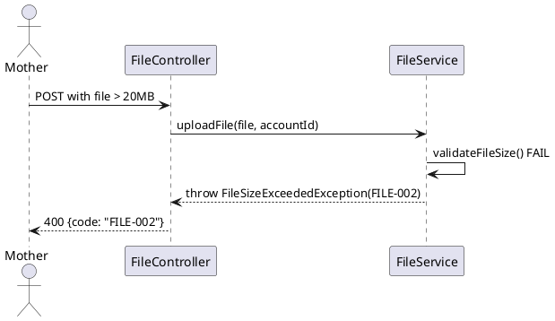

# ENGINEERING DOCUMENTATION STANDARD (EDS) v2.0
# Technical Design Specification — UC-167 Upload File

| Field | Value |
|-------|-------|
| **Document ID** | `CB-FILE-IMP-001` |
| **Version** | `1.0` |
| **Date** | `2026-06-26` |
| **Status** | `Approved` |
| **Document Owner** | `PhuongNT` |
| **Author** | `AI Agent` |
| **Reviewed by** | `[Tech Lead]` |
| **DPO Sign-off** | `[ ] Pending` |
| **Approved by** | `[Principal Architect]` |
| **Last Review** | `2026-06-26` |
| **Based on EDS** | `v2.0` |

---

## CHANGELOG

| Ngày | Người thực hiện | Nội dung thay đổi |
|------|-----------------|-------------------|
| 2026-06-27 | AI Agent — Amelia (Dev Agent) | Implementation completed — service, controller, tests 🟢 GREEN (45/45) |
| 2026-06-26 | AI Agent | Tạo tài liệu lần đầu cho UC-167 Upload File |

---

## MỤC LỤC

1. [Tổng quan Module](#1-tổng-quan-module)
2. [Ma trận Truy vết](#2-ma-trận-truy-vết)
3. [Architecture Decision Records](#3-architecture-decision-records)
4. [Non-Functional Requirements & SLA](#4-non-functional-requirements--sla)
5. [Static Modeling](#5-static-modeling)
6. [Dynamic Modeling](#6-dynamic-modeling)
7. [Domain Event Catalog](#7-domain-event-catalog)
8. [Interface Specification](#8-interface-specification)
9. [API Specification](#9-api-specification)
10. [Bảng mã lỗi](#10-bảng-mã-lỗi)
11. [Quy trình Triển khai](#11-quy-trình-triển-khai)
12. [Rollback & Incident Runbook](#12-rollback--incident-runbook)
13. [Kịch bản Kiểm thử](#13-kịch-bản-kiểm-thử)
14. [Phương pháp Xác minh](#14-phương-pháp-xác-minh)
15. [Mẫu thử thực tế](#15-mẫu-thử-thực-tế)
16. [Authorization Matrix](#16-authorization-matrix)
17. [AI Prompt Constraints](#17-ai-prompt-constraints-case-20)

---

## 1. Tổng quan Module

| Field | Value |
|-------|-------|
| **Module Name** | `UploadFile` |
| **Bounded Context** | `file` |
| **UC ID** | `UC-167` |
| **SRS Reference** | `3.3.10.1` |
| **Primary Actor** | `Mother (ROLE_MOTHER)` |
| **Platform** | `Mobile App` |
| **Data Classification** | `Sensitive-PII` |
| **Compliance Scope** | `BR-RBAC, BR-PRIVACY, PDPA` |
| **Upstream Dependencies** | `auth, storage backend (local/S3-compatible)` |
| **Downstream Consumers** | `health records (UC-39), consultation, audit` |

**Mô tả:** Mother tải lên tệp (siêu âm, hồ sơ y tế, phiếu tiêm chủng, ảnh em bé, tài liệu liên quan). Hệ thống kiểm tra: loại file hợp lệ, kích thước ≤ 20MB, quyền sở hữu. File được lưu vào storage và metadata được ghi vào DB. FileId được trả về để dùng trong các module khác (health records, health record files).

---

## 2. Ma trận Truy vết

| Requirement ID | Loại | Mô tả | Thành phần Code | Compliance Target | ADR liên quan |
|----------------|------|-------|-----------------|-------------------|---------------|
| UC-167 | Use Case | Mother upload file | `FileController.uploadFile()` | BR-RBAC | ADR-FILE-001 |
| BR-FILE-001 | Business Rule | File type phải thuộc allowed list | `FileTypeValidator` | Data Integrity | ADR-FILE-001 |
| BR-FILE-002 | Business Rule | File size ≤ 20MB | `@MaxFileSize(20MB)` | Data Integrity | ADR-FILE-001 |
| BR-FILE-003 | Business Rule | Mỗi account tối đa 500 files | `FileService.validateStorageQuota()` | Data Integrity | ADR-FILE-002 |
| BR-FILE-004 | Business Rule | Filename được sanitize trước khi lưu | `FilenameUtils.sanitize()` | Security | ADR-FILE-003 |
| BR-FILE-005 | Business Rule | Ghi audit event `FileUploaded` | `AuditService` | PDPA | — |
| BR-PRIVACY-001 | Business Rule | File URL có expiry — không public permanent | `StorageService.generatePresignedUrl()` | PDPA | ADR-FILE-004 |

---

## 3. Architecture Decision Records

### ADR-FILE-001 — Allowed File Types và Size Limit

| Field | Value |
|-------|-------|
| **Status** | `Accepted` |
| **Date** | `2026-06-26` |

#### Quyết định
Allowed MIME types: `image/jpeg, image/png, image/heic, application/pdf, image/gif`.
Max size: 20MB per file. Files ngoài danh sách này bị reject với FILE-002.

### ADR-FILE-002 — Storage Quota per Account

| Field | Value |
|-------|-------|
| **Status** | `Accepted` |
| **Date** | `2026-06-26` |

#### Quyết định
Mỗi account được lưu tối đa 500 files (không phải bytes để đơn giản hóa). Khi đạt quota, upload bị reject với FILE-003.

### ADR-FILE-003 — Filename Sanitization

| Field | Value |
|-------|-------|
| **Status** | `Accepted` |
| **Date** | `2026-06-26` |

#### Quyết định
Original filename được lưu trong metadata. Storage key được generate từ `UUID + extension` để tránh path traversal và collision. Filename display là originalName sau sanitize (strip special chars, max 255).

### ADR-FILE-004 — Presigned URL với TTL

| Field | Value |
|-------|-------|
| **Status** | `Accepted` |
| **Date** | `2026-06-26` |

#### Quyết định
File không được expose trực tiếp. Mọi access đi qua presigned URL với TTL 15 phút. URL được generate khi fetch file detail (UC-168).

---

## 4. Non-Functional Requirements & SLA

| Category | Requirement | Target |
|----------|-------------|--------|
| Latency (p99) | Upload response (20MB file) | `< 5s` |
| Availability | Uptime | `99.9%` |
| Storage | Durability | 99.999999% |
| Security | Virus scanning | Scan trước khi confirm upload |

---

## 5. Static Modeling

### 5.1. Class Diagram



### 5.2. Data Structure

```sql
-- V25__create_files.sql
CREATE TYPE file_status_enum AS ENUM ('ACTIVE', 'DELETED');

CREATE TABLE files (
  id            UUID              PRIMARY KEY DEFAULT gen_random_uuid(),
  account_id    UUID              NOT NULL,
  original_name VARCHAR(255)      NOT NULL,      -- sanitized display name
  storage_key   VARCHAR(500)      NOT NULL UNIQUE, -- UUID-based path
  mime_type     VARCHAR(100)      NOT NULL,
  size_bytes    BIGINT            NOT NULL,
  status        file_status_enum  NOT NULL DEFAULT 'ACTIVE',
  uploaded_at   TIMESTAMPTZ       NOT NULL DEFAULT NOW(),
  deleted_at    TIMESTAMPTZ,
  created_by    UUID              NOT NULL,

  CONSTRAINT fk_file_account FOREIGN KEY (account_id) REFERENCES accounts(id)
);

CREATE INDEX idx_file_account_id ON files(account_id);
CREATE INDEX idx_file_status ON files(status);
```

---

## 6. Dynamic Modeling

### 6.1. Sequence Diagram — Happy Path



### 6.2. Error Path — File Too Large



---

## 7. Domain Event Catalog

| Event Name | Trigger | Publisher | Subscriber(s) | Async? |
|------------|---------|-----------|---------------|--------|
| `FileUploaded` | File stored + record saved | `FileService` | `AuditService` | No |

---

## 8. Interface Specification

```java
// IFileService.java
public interface IFileService {
    /**
     * @throws InvalidFileTypeException (FILE-001) when MIME type not allowed
     * @throws FileSizeExceededException (FILE-002) when size > 20MB
     * @throws StorageQuotaExceededException (FILE-003) when account has >= 500 files
     */
    UploadFileResponse uploadFile(MultipartFile file, UUID accountId);
}

// UploadFileResponse.java
public class UploadFileResponse {
    private UUID id;
    private String originalName;
    private String mimeType;
    private Long sizeBytes;
    private Instant uploadedAt;
}
```

---

## 9. API Specification

| Method | Path | Auth Level | Required Roles | Rate Limit | Content-Type |
|--------|------|------------|----------------|------------|--------------|
| `POST` | `/api/v1/files` | JWT Bearer | `ROLE_MOTHER` | 20/min | `multipart/form-data` |

**Response 201:**
```json
{
  "id": "uuid-v4",
  "originalName": "ultrasound_week28.jpg",
  "mimeType": "image/jpeg",
  "sizeBytes": 1048576,
  "uploadedAt": "2026-06-26T00:00:00.000Z"
}
```

---

## 10. Bảng mã lỗi

| Code | HTTP | Message (EN) | Trigger Condition |
|------|------|--------------|-------------------|
| `FILE-001` | 400 | Invalid file type | MIME type not in allowed list |
| `FILE-002` | 400 | File size exceeds limit | size > 20MB |
| `FILE-003` | 409 | Storage quota exceeded | Account >= 500 files |
| `FILE-004` | 403 | Insufficient permissions | Non-MOTHER role |
| `FILE-005` | 500 | Storage error | Backend storage failure |

---

## 11. Quy trình Triển khai

1. Flyway `V25__create_files.sql`
2. `FileRecord` entity
3. `IStorageService` interface + implementation (local or S3-compatible)
4. `FileService.uploadFile()` với validation chain
5. `FileController.POST /api/v1/files` (multipart)

---

## 12. Rollback & Incident Runbook

```bash
psql -h $DB_HOST -U $DB_USER -d $DB_NAME \
  -c "DROP TABLE IF EXISTS files CASCADE;"
psql -h $DB_HOST -U $DB_USER -d $DB_NAME \
  -c "DELETE FROM flyway_schema_history WHERE version = '25';"
# Also clean up orphaned storage objects
```

---

## 13. Kịch bản Kiểm thử

```gherkin
Feature: Upload File
  Scenario: Happy path — image upload
    Given Mother authenticated, quota < 500
    When POST /api/v1/files with 2MB JPEG
    Then 201, file record in DB, storage_key unique
    And audit log contains FileUploaded

  Scenario: PDF upload
    When POST with valid PDF file
    Then 201

  Scenario: File too large → 400
    When POST with 25MB file
    Then response 400, error FILE-002

  Scenario: Invalid MIME type → 400
    When POST with .exe file
    Then response 400, error FILE-001

  Scenario: Quota exceeded → 409
    Given account has 500 files
    When POST new file
    Then response 409, error FILE-003
```

---

## 14. Phương pháp Xác minh

```sql
SELECT id, original_name, mime_type, size_bytes, status FROM files
WHERE account_id = '[uuid]' ORDER BY uploaded_at DESC LIMIT 5;
```

---

## 15. Mẫu thử thực tế

```bash
curl -X POST https://[host]/api/v1/files \
  -H "Authorization: Bearer [JWT_MOTHER_TOKEN]" \
  -F "file=@/path/to/ultrasound.jpg"
# Expected: 201 {id, originalName, mimeType, sizeBytes}
```

---

## 16. Authorization Matrix

| Endpoint | `GUEST` | `MOTHER` | `EXPERT` | `ADMIN` |
|----------|---------|----------|----------|---------|
| `POST /api/v1/files` | ❌ | ✅ Own | ❌ | ✅ All |
| `GET /api/v1/files/:id` | ❌ | ✅ Own | ✅ Shared | ✅ All |

---

## 17. AI Prompt Constraints (CASE 2.0)

### 17.1 Constraint Summary Table

| # | Constraint | Source | Last Verified |
|---|-----------|--------|---------------|
| C1 | Validate MIME type từ actual file content (không chỉ extension) | ADR-FILE-001 | 2026-06-26 |
| C2 | storageKey PHẢI là UUID-based, không dùng originalName | ADR-FILE-003 | 2026-06-26 |
| C3 | Presigned URL TTL = 15 phút — không public permanent URLs | ADR-FILE-004 | 2026-06-26 |
| C4 | validateStorageQuota() trước khi write to storage | ADR-FILE-002 | 2026-06-26 |
| C5 | Emit FileUploaded event sau thành công | BR-PRIVACY | 2026-06-26 |

### 17.2 Constraint Injection Block

```
[CONSTRAINT BLOCK — Module: UploadFile (CB-FILE-IMP-001)]
1. Validate MIME type từ actual file content (magic bytes), KHÔNG chỉ extension — ADR-FILE-001
2. storageKey PHẢI là UUID-based, KHÔNG dùng originalName — ADR-FILE-003
3. Presigned URL TTL = 15 phút — KHÔNG public permanent URLs — ADR-FILE-004
4. validateStorageQuota() TRƯỚC khi write to storage — ADR-FILE-002
5. Emit FileUploaded event sau thành công — BR-PRIVACY

[CONTEXT BLOCK]
- Bounded Context: file
- Data Classification: Sensitive-PII
- Error codes: §10 Error Codes Table
- Auth matrix: §16 Authorization Matrix
```

### 17.3 Constraint Quality Checklist

- [x] Mỗi constraint traceable về ADR hoặc BR cụ thể
- [x] Không có constraint generic
- [x] Constraint block có ≥ 3 constraints cụ thể

### 17.4 Anti-Pattern Detection

| AP-ID | Anti-Pattern | Dấu hiệu | Hành động |
|-------|-------------|-----------|----------|
| AP-AI-001 | Unconstrained Gen | Code không match constraint C1-C5 | Reject — inject lại constraints |
| AP-AI-003 | Implicit Decision | Code assume architecture không có ADR | Reject — viết ADR trước |
| AP-AI-005 | Hallucinated Contract | Code import không có trong §8 | Reject — verify contract |

---

## PHỤ LỤC

### A. Glossary (Thuật ngữ)

| Thuật ngữ | Định nghĩa |
|-----------|------------|
| StorageKey | Khóa lưu trữ file dựa trên UUID — tránh path traversal và trùng tên |
| MIME Validation | Kiểm tra loại file từ nội dung thực tế (magic bytes) thay vì chỉ extension |
| Presigned URL | URL tạm thời có chữ ký, hết hạn sau TTL — dùng để download file an toàn |

### B. Tài liệu tham chiếu

| Document | Path |
|----------|------|
| EDS v2.0 Template | `08_References/Template/PHASE-3_TDS.md` |

---

*EDS v2.1 — Tích hợp CASE 2.0 AI Prompt Constraints (§17).*
