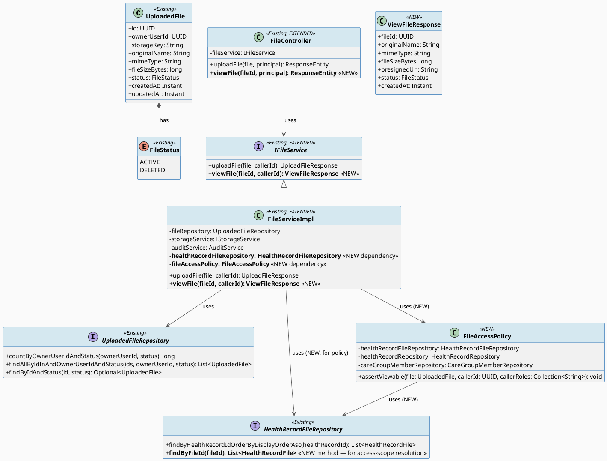
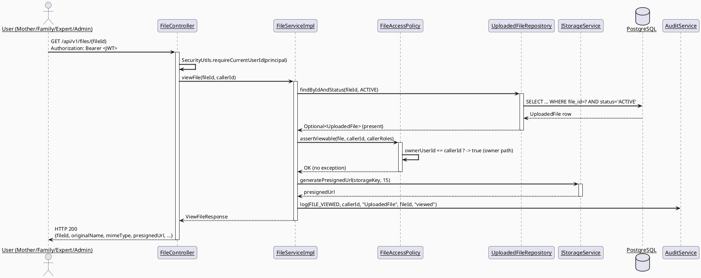
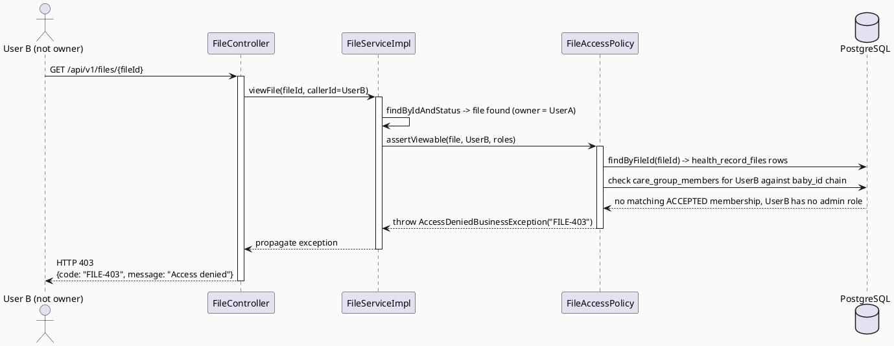
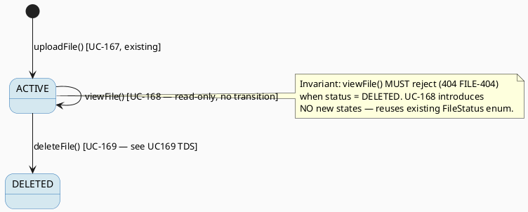

# ENGINEERING DOCUMENTATION STANDARD (EDS) v2.0
# Technical Design Specification — UC168 View File

| Field | Value |
|-------|-------|
| **Document ID** | `CB-FILE-IMP-168` |
| **Version** | `1.0` |
| **Date** | `2026-07-03` |
| **Status** | `Draft` |
| **Document Owner** | `TV2-Bách` |
| **Author** | `AI Agent` |
| **Reviewed by** | `[Pending — Tech Lead]` |
| **DPO Sign-off** | `[ ] Pending` *(PII module — health/baby files)* |
| **Approved by** | `[Pending — Principal Architect]` |
| **Last Review** | `2026-07-03` |
| **Based on EDS** | `v2.0` |

---

## CHANGELOG

| Ngày | Người thực hiện | Nội dung thay đổi |
|------|-----------------|-------------------|
| 2026-07-03 | AI Agent | Tạo tài liệu lần đầu — TDS cho UC168 View File |

---

## MỤC LỤC

1. [Tổng quan Module](#1-tổng-quan-module)
2. [Ma trận Truy vết (Traceability Matrix)](#2-ma-trận-truy-vết-traceability-matrix)
3. [Architecture Decision Records (ADR)](#3-architecture-decision-records-adr)
4. [Non-Functional Requirements & SLA](#4-non-functional-requirements--sla)
5. [Static Modeling](#5-static-modeling-mô-hình-tĩnh)
6. [Dynamic Modeling](#6-dynamic-modeling-mô-hình-động)
7. [Domain Event Catalog](#7-domain-event-catalog)
8. [Interface Specification](#8-interface-specification-đặc-tả-giao-diện)
9. [API Specification](#9-api-specification)
10. [Bảng mã lỗi (Error Codes)](#10-bảng-mã-lỗi-error-codes)
11. [Quy trình Triển khai](#11-quy-trình-triển-khai-step-by-step)
12. [Rollback & Incident Runbook](#12-rollback--incident-runbook)
13. [Kịch bản Kiểm thử Chi tiết](#13-kịch-bản-kiểm-thử-chi-tiết)
14. [Phương pháp Xác minh](#14-phương-pháp-xác-minh)
15. [Mẫu thử thực tế](#15-mẫu-thử-thực-tế-api-verification-samples)
16. [Bảng tổng hợp phân quyền](#16-bảng-tổng-hợp-phân-quyền-authorization-matrix)
17. [AI Prompt Constraints (CASE 2.0)](#17-ai-prompt-constraints-case-20)

---

## 1. Tổng quan Module

| Field | Value |
|-------|-------|
| **Module Name** | File Management — View File (UC-168) |
| **Bounded Context** | `file` (extends existing `com.carebridge.backend.file` package created for UC-167 Upload File) |
| **Data Classification** | `PII` / `Sensitive-PII` (medical documents, ultrasound images, baby photos) |
| **Compliance Scope** | `PDPA` |
| **Upstream Dependencies** | `UploadedFileRepository`, `HealthRecordFileRepository`, `IStorageService` (existing), `care_group_members` (existing schema, family-sharing scope) |
| **Downstream Consumers** | Mobile App (baby logs, health records screens), Web Portal (future), Health Record module (`FileAttachmentDto`) |

**SRS Reference:** §3.3.10.2 "View File" (`02_Requirements/SRS/3_Functional_Specification.md` lines 3982-4001), Table 207.
**Description (SRS):** "Previews or downloads files within valid access scope and sharing period."
**Primary Actor:** User (any authenticated role — not limited to Mother; Secondary Actors: None).
**Platform (SRS §Other Information):** `App/Web`. NOTE: SRS §3.3.10.2 "Other Information" row also states `Source group: Mobile App - File Management`, which conflicts with the platform value in the same row (`App/Web`). Per §RG-2 Conflict Resolution, the explicit `Platform: App/Web` field takes precedence over the inherited/templated `Source group` label (the latter is a copy-paste artifact shared verbatim across all of §3.3.10, including UC-167 which is genuinely Mobile-only). **Decision: UC168 backend API is platform-agnostic (consumed by both Mobile App and future Web Portal clients); this TDS specifies the backend contract only.**
**Priority:** High. **Frequency of Use:** Frequent. **Business Rule:** BR-RBAC only (no BR-PRIVACY tag in SRS row, but PDPA minimum-necessary-access still applies per CLAUDE.md Delivery Rules for health data).

---

## 2. Ma trận Truy vết (Traceability Matrix)

| Requirement ID | Loại | Mô tả yêu cầu | Thành phần Code | Compliance Target | ADR liên quan |
|----------------|------|---------------|-----------------|--------------------|---------------|
| UC-168 (SRS §3.3.10.2) | User Story | Preview/download file within valid access scope and sharing period | `FileController.viewFile()` (NEW), `FileServiceImpl.viewFile()` (NEW) | — | ADR-FILE-005, ADR-FILE-006 |
| BR-RBAC | Business Rule | Users may access only functions allowed by role/permission scope | `FileController.viewFile()` `@PreAuthorize`, `FileAccessPolicy.assertViewable()` (NEW) | PDPA minimum-necessary | ADR-FILE-005 |
| PDPA (CLAUDE.md) | Compliance | Health/family data must follow consent, purpose, minimum-necessary access | `FileAccessPolicy` (NEW) | PDPA | ADR-FILE-005 |
| ADR-FILE-003 (UC-167, existing) | Decision | `storageKey` is UUID-based, never derived from `originalName` | `FileServiceImpl.uploadFile()` (existing — reused, no change) | — | — |
| ADR-FILE-004 (UC-167, existing) | Decision | Presigned URL TTL = 15 minutes | `IStorageService.generatePresignedUrl()` (existing — reused as-is for "sharing period") | PDPA | ADR-FILE-004, ADR-FILE-006 |

---

## 3. Architecture Decision Records (ADR)

### ADR-FILE-005 — Access scope resolution for View File (ownership + care-group sharing + health-record linkage)

| Field | Value |
|-------|-------|
| **Status** | `Proposed` |
| **Deciders** | `AI Agent (Technical Architect role)`, pending Tech Lead review |
| **Date** | `2026-07-03` |
| **Supersedes** | — |

#### Bối cảnh (Context)
UC-168 requires files to be viewable "within valid access scope." `UploadedFile` (from UC-167) only carries `owner_user_id` — there is no existing `shared_with`/ACL table on `uploaded_files`. However, two existing linkage mechanisms already model "who else may see this data":
1. `health_record_files` (join table, UC-39/UC-167) links a `file_id` to a `health_record_id`.
2. `health_records.owner_user_id` / `health_records.baby_id` combined with `care_groups.baby_id` / `care_group_members.user_id` (`V1__init_schema.sql` lines 679-693, 730-751) already model family/caregiver sharing scope for a baby's records — this is the exact mechanism UC-39 (Add Health Record) and UC-40-family-view use cases already rely on for "who can see this baby's health data."

There is no `expert_shared_files` or per-file grant table in the current schema; `consent_grants.data_type` includes `EXPERT_SHARED_DATA` as an enum value (`V1__init_schema.sql` line 178) but no code path currently issues per-file consent grants for UC-168's scope (this is out of scope — see Open Item OI-168-1).

#### Các phương án đã xem xét (Options Considered)

| Phương án | Mô tả | Ưu điểm | Nhược điểm |
|-----------|-------|----------|------------|
| A | New `file_shares` ACL table (file_id, shared_with_user_id, expiry) | Explicit, most flexible | New migration, new domain concept, over-engineered for current known callers (only health-record attachments exist today) |
| B | Reuse existing `owner_user_id` + `health_record_files` → `health_records` → `care_group_members` chain; no schema change | No migration needed; matches CLAUDE.md "smallest scoped change"; consistent with how UC-39/health-record family sharing already works | Access scope is implicit via health-record linkage only — a file with zero `health_record_files` rows is owner-only (acceptable: matches UC-167's current usage, files are always uploaded standalone then attached) |
| C | Grant-based via `consent_grants` (`EXPERT_SHARED_DATA`) | Reuses existing audited consent model | No existing service wires `consent_grants` to file access yet; would require new consent-issuance flow, out of scope for this TDS (see OI-168-1) |

#### Quyết định (Decision)
Chọn **Phương án B**. `FileAccessPolicy.assertViewable(file, callerId)` returns allowed when ANY of:
1. `file.ownerUserId == callerId` (owner), OR
2. `callerId` has `ACTIVE`/`ACCEPTED` membership (`care_group_members.invitation_status = 'ACCEPTED'`) in a `care_group` whose `baby_id` matches the `baby_id` of a `health_record` that the file is attached to via `health_record_files` (family/caregiver sharing), OR
3. caller has role `MODERATOR`, `CONTENT_ADMIN`, or `SYSTEM_ADMIN` (platform admin oversight, audited).

If no `health_record_files` row references the file, only rule 1 and 3 apply (owner + admin only) — this is the "sharing period"-free default state.

#### Hệ quả (Consequences)

**Tích cực:**
- Zero new migration; reuses existing, already-tested schema relationships.
- Consistent access model with how health records are already shared with family members.

**Tiêu cực / Trade-offs:**
- No per-file, per-recipient time-bounded "sharing period" grant exists yet (see ADR-FILE-006 for how "sharing period" is interpreted instead). If CareBridge later needs true time-boxed sharing (e.g., "share this file with Expert X for 7 days"), a new `file_shares` table (Option A) will be required — flagged as **OI-168-1 (Open)**.

**Compliance Impact:**
- PDPA minimum-necessary: care-group scope is already consent-gated at `care_group_members.invitation_status` (a member must accept an invite); this TDS does not weaken or bypass that existing gate.

---

### ADR-FILE-006 — "Sharing period" interpreted as presigned URL TTL, not a persisted expiry

| Field | Value |
|-------|-------|
| **Status** | `Proposed` |
| **Deciders** | `AI Agent`, pending Tech Lead review |
| **Date** | `2026-07-03` |

#### Bối cảnh (Context)
SRS §3.3.10.2 says View File operates "within valid access scope **and sharing period**." No `expires_at`/`shared_until` column exists on `uploaded_files` (confirmed by reading `V20260627100000__create_uploaded_files.sql` — columns are exactly `file_id, owner_user_id, storage_key, original_name, mime_type, file_size_bytes, status, created_at, updated_at`). UC-167's `uploadFile()` already issues a presigned URL with a **hard-coded 15-minute TTL** (ADR-FILE-004, `IStorageService.generatePresignedUrl(key, 15)`), which is CareBridge's one existing "time-bounded access" primitive for files.

#### Các phương án đã xem xét (Options Considered)

| Phương án | Mô tả | Ưu điểm | Nhược điểm |
|-----------|-------|----------|------------|
| A | Add `expires_at` column via new migration; reject view after expiry | Matches SRS wording literally | New migration; no product requirement defines what the expiry duration/policy should be (30 days? 1 year? forever until delete?); risk of inventing an undocumented business rule |
| B | Interpret "sharing period" = the presigned URL's 15-minute validity window (ADR-FILE-004), reused unchanged for `viewFile()` | No schema change; consistent with the only existing "period" concept in the file domain; smallest scoped change per CLAUDE.md | Does not model a longer-lived "this file is shared for 7 days" concept — acceptable because no such requirement is defined anywhere in SRS/migrations today |

#### Quyết định (Decision)
Chọn **Phương án B**. `viewFile()` generates a new presigned URL via the existing `IStorageService.generatePresignedUrl(storageKey, 15)` on every call — the "sharing period" is the 15-minute presigned URL window, identical to upload's ADR-FILE-004. No new column, no new migration.

#### Hệ quả (Consequences)
**Tích cực:** Zero schema risk; matches existing PDPA-driven 15-minute TTL cap already asserted by `IStorageService` javadoc ("PDPA: max 15").
**Tiêu cực / Trade-offs:** If product later defines an explicit multi-day "sharing period" business rule, this ADR must be revisited (superseded) and a migration added then — not now, since no such rule currently exists (marked **OI-168-2, Open**).
**Compliance Impact:** None negative — this is at least as strict as any longer period would be.

---

## 4. Non-Functional Requirements & SLA

### 4.1. Performance & Availability

| Category | Requirement | Target SLA | Measurement Method | Compliance Basis |
|----------|-------------|------------|---------------------|-------------------|
| Latency | `GET /api/v1/files/{fileId}` (p99) | < 300ms | Manual timing / future k6 | — |
| Availability | Depends on existing `IStorageService` backing store | Same as UC-167 | — | — |

### 4.2. Data Integrity & Retention

| Category | Requirement | Target | Verification Method | Compliance Basis |
|----------|-------------|--------|----------------------|-------------------|
| Consistency | View never returns a `DELETED`-status file | 100% | `findByIdAndStatus(id, ACTIVE)` (existing repo method, reused) | PDPA |
| Audit | Every successful view is logged | 100% | `AuditAction.FILE_VIEWED` (NEW enum value) via `AuditService.log()` | PDPA / SRS POST-3 |

### 4.3. Security

| Category | Requirement | Target | Verification Method | Compliance Basis |
|----------|-------------|--------|----------------------|-------------------|
| Access control | Owner, care-group-sharing, or admin only | Least privilege | `FileAccessPolicy.assertViewable()` (NEW) + Auth Matrix §16 | PDPA, BR-RBAC |
| URL exposure | Presigned URL TTL ≤ 15 min | 15 min hard cap | Reuses `IStorageService.generatePresignedUrl(key, 15)` (existing) | ADR-FILE-004/006 |
| IDOR prevention | `fileId` not guessable / not sufficient alone to view | 403 for non-owner/non-shared caller | Test §13 IDOR cases | OWASP A01:2021 |

### 4.4. Scalability & Capacity Planning
No new capacity concerns — read path only, reuses existing indexes (`idx_uploaded_files_owner`, `idx_uploaded_files_status`, `idx_hrf_file_id`).

---

## 5. Static Modeling (Mô hình Tĩnh)

### 5.1. Class Diagram (PlantUML)



### 5.2. Data Structure (Flyway SQL Migration)

> **No new migration required for UC-168.** Confirmed by reading `V20260627100000__create_uploaded_files.sql` and `V20260627100100__create_health_record_files.sql` in full: all columns/FKs needed for the access-scope resolution (ADR-FILE-005) and the "sharing period" interpretation (ADR-FILE-006) already exist. No `ALTER TABLE` needed.

If a future explicit per-file, time-boxed sharing grant is approved (OI-168-1), the reserved next migration version for this feature family would be `V20260706110000__create_file_shares.sql` (per orchestration instruction: use `V20260706110000`+, avoid `090000`/`100000`/`120000`/`130000` ranges reserved for parallel agents). **Not created in this pass — Open item only.**

---

## 6. Dynamic Modeling (Mô hình Động)

### 6.1. Sequence Diagram — Happy Path (Owner views own file)



### 6.2. Sequence Diagram — Error Path (Non-owner, no sharing scope → 403)



### 6.3. State Machine — File status (existing, unchanged by UC-168)



> **Invariant bất biến:** `viewFile()` never transitions `FileStatus`; it is a pure read operation. `findByIdAndStatus(id, ACTIVE)` (existing repo method) is the sole state guard — a `DELETED` file returns `Optional.empty()`, which the service maps to `ResourceNotFoundException` (FILE-404), not to a distinct "file was deleted" message (avoids leaking existence of soft-deleted files to non-owners — see IDOR test cases §13).

---

## 7. Domain Event Catalog

### 7.1. Events Published (Phát ra)

| Event Name | Trigger | Publisher | Subscriber(s) | Payload Schema | Async? |
|------------|---------|-----------|----------------|------------------|--------|
| `FileViewed` | Successful `viewFile()` call passing access-scope check | `FileServiceImpl` | `AuditService` (via `AuditAction.FILE_VIEWED`) | `FileViewed.java` | No (synchronous `AuditService.log()`, matches existing `FILE_UPLOADED` pattern) |

### 7.2. Events Consumed (Tiêu thụ)
None — UC-168 does not consume events from other modules.

### 7.3. Payload Schema

```java
// Conceptual payload passed to AuditService.log(AuditAction.FILE_VIEWED, callerId, "UploadedFile", fileId.toString(), details)
// Matches existing AuditService.log(...) signature — no new event bus/record type introduced.
// "details" argument (Object, per existing AuditService contract):
public record FileViewedDetails(
    String accessPath   // "OWNER" | "CARE_GROUP_SHARED" | "ADMIN_OVERSIGHT" — which ADR-FILE-005 rule granted access
) {}
```

---

## 8. Interface Specification (Đặc tả Giao diện)

### 8.1. Service Interface — EXTENDS existing `IFileService`

```java
// File: src/main/java/com/carebridge/backend/file/service/IFileService.java (EXISTING FILE — add one method)
// @version 1.1 — adds viewFile(); uploadFile() signature UNCHANGED
public interface IFileService {

    /** @throws BusinessException (FILE-002/413) if > 20MB */
    UploadFileResponse uploadFile(MultipartFile file, UUID callerId);   // EXISTING — unchanged

    /**
     * UC-168: Preview/download a file within valid access scope and sharing period.
     * @throws ResourceNotFoundException (FILE-404) if file does not exist or is soft-deleted
     * @throws AccessDeniedBusinessException (FILE-403) if callerId is not the owner,
     *         not in a care-group sharing the file's linked health record's baby, and not an admin role
     */
    ViewFileResponse viewFile(UUID fileId, UUID callerId);   // NEW
}
```

```java
// File: src/main/java/com/carebridge/backend/file/dto/ViewFileResponse.java (NEW FILE)
// @version 1.0
package com.carebridge.backend.file.dto;

import com.carebridge.backend.file.entity.FileStatus;
import lombok.Builder;
import lombok.Data;

import java.time.Instant;
import java.util.UUID;

@Data
@Builder
public class ViewFileResponse {
    private UUID fileId;
    private String originalName;
    private String mimeType;
    private long fileSizeBytes;
    private String presignedUrl;   // TTL 15 min, per ADR-FILE-006
    private FileStatus status;
    private Instant createdAt;
}
```

### 8.2. Policy Interface (NEW)

```java
// File: src/main/java/com/carebridge/backend/file/policy/FileAccessPolicy.java (NEW FILE)
// @version 1.0
package com.carebridge.backend.file.policy;

import com.carebridge.backend.file.entity.UploadedFile;
import java.util.Collection;
import java.util.UUID;

public interface FileAccessPolicy {
    /**
     * @throws com.carebridge.backend.common.exception.AccessDeniedBusinessException (FILE-403)
     *         when callerId cannot view this file per ADR-FILE-005 rules 1-3.
     */
    void assertViewable(UploadedFile file, UUID callerId, Collection<String> callerAuthorities);
}
```

### 8.3. Repository Interface — EXTENDS existing `HealthRecordFileRepository`

```java
// File: src/main/java/com/carebridge/backend/health/repository/HealthRecordFileRepository.java (EXISTING FILE — add one method)
// @version 1.1
public interface HealthRecordFileRepository extends JpaRepository<HealthRecordFile, UUID> {

    List<HealthRecordFile> findByHealthRecordIdOrderByDisplayOrderAsc(UUID healthRecordId);   // EXISTING — unchanged

    List<HealthRecordFile> findByFileId(UUID fileId);   // NEW — used by FileAccessPolicy to resolve which health_record(s) a file is attached to
}
```

> `UploadedFileRepository` (existing) requires **no new method** — `findByIdAndStatus(id, ACTIVE)` (existing) is reused as-is for `viewFile()`'s lookup.

---

## 9. API Specification

### 9.1. Endpoints Table

| Method | Path | Auth Level | Required Roles | Rate Limit | Idempotent? |
|--------|------|------------|-----------------|------------|-------------|
| `POST` | `/api/v1/files` | JWT Bearer | `MOTHER` | — | No | *(existing, UC-167, unchanged)* |
| `GET` | `/api/v1/files/{fileId}` | JWT Bearer | `MOTHER, FAMILY, EXPERT, MODERATOR, CONTENT_ADMIN, SYSTEM_ADMIN` (any authenticated role — scope enforced in service, not `@PreAuthorize`, since SRS Primary Actor = "User" not role-restricted) | 300/min (read) | Yes | **NEW** |

### 9.2. Request / Response Schemas

#### `GET /api/v1/files/{fileId}` — View/preview a file

**Path Param:** `fileId` (UUID)

**Response — 200 OK (Happy Path):**
```json
{
  "success": true,
  "data": {
    "fileId": "550e8400-e29b-41d4-a716-446655440000",
    "originalName": "ultrasound-week12.jpg",
    "mimeType": "image/jpeg",
    "fileSizeBytes": 204800,
    "presignedUrl": "https://storage.carebridge.dev/files/....jpg?X-Amz-Expires=900&...",
    "status": "ACTIVE",
    "createdAt": "2026-06-27T10:00:00Z"
  },
  "message": "File retrieved successfully",
  "timestamp": "2026-07-03T09:00:00Z"
}
```

**Response — 403 Forbidden (Out of access scope):**
```json
{
  "error": { "code": "FILE-403", "message": "You do not have access to this file" }
}
```

**Response — 404 Not Found (file missing or soft-deleted):**
```json
{
  "error": { "code": "FILE-404", "message": "File not found" }
}
```

---

## 10. Bảng mã lỗi (Error Codes)

| Code | HTTP Status | Message (EN) | Message (VI) | Trigger Condition |
|------|-------------|---------------|----------------|---------------------|
| `FILE-403` | 403 | Access denied | Không đủ quyền truy cập tệp | Caller is not owner, not in a sharing care-group, not admin (ADR-FILE-005) |
| `FILE-404` | 404 | File not found | Không tìm thấy tệp | `fileId` does not exist OR `status = DELETED` |

> Reuses existing `FILE-001..FILE-004` (upload-only codes, unchanged) from UC-167. `FILE-403`/`FILE-404` are new, module-scoped, non-overlapping.

---

## 11. Quy trình Triển khai (Step-by-Step)

### 11.1. Prerequisites
- [ ] ADR-FILE-005, ADR-FILE-006 Accepted (§3)
- [ ] DPO sign-off (PII — file previews of medical/baby images)
- [ ] No migration required (§5.2)

### 11.2. Pre-Migration Checklist
N/A — no migration for UC-168.

### 11.3. Implementation Steps

#### Chặng 1 — Extend `HealthRecordFileRepository`
Add `findByFileId(UUID fileId)` to existing file `05_Development/CareBridgeAPI/src/main/java/com/carebridge/backend/health/repository/HealthRecordFileRepository.java`.

#### Chặng 2 — New `FileAccessPolicy` + impl
Create `05_Development/CareBridgeAPI/src/main/java/com/carebridge/backend/file/policy/FileAccessPolicy.java` (interface) and `FileAccessPolicyImpl.java` under `.../file/policy/impl/` (package-per-domain, `policy` layer per CLAUDE.md).

#### Chặng 3 — Extend `IFileService` / `FileServiceImpl`
Add `viewFile(UUID fileId, UUID callerId)` to existing `IFileService.java` and `FileServiceImpl.java`. Add `ViewFileResponse` DTO.

#### Chặng 4 — Extend `FileController`
Add `GET /{fileId}` handler to existing `FileController.java` — validation/mapping only, delegates entirely to `fileService.viewFile()`.

#### Chặng 5 — Add `AuditAction.FILE_VIEWED`
Add one enum value to existing `AuditAction.java`.

### 11.4. Deployment Checklist
- [ ] `./mvnw compile` clean
- [ ] `./mvnw test` green (existing `FileServiceImplTest` + new tests per Test-Spec)
- [ ] No business logic added to `FileController` (validation/mapping only, per CLAUDE.md)

---

## 12. Rollback & Incident Runbook

### 12.1. Trigger Conditions
| Điều kiện | Ngưỡng | Người quyết định |
|-----------|--------|---------------------|
| IDOR reported (non-owner views file) | Any occurrence | Tech Lead + DPO — treat as security incident |
| Error rate on `GET /files/{id}` | > 5% in 5 min | On-call Engineer |

### 12.2. Rollback Procedure
```bash
# No migration to revert — code-only rollback
git revert <commit-hash-for-UC168-viewFile>
./mvnw clean package
# Re-deploy previous artifact
```

### 12.3. Notification Protocol
Standard — DPO notified within 30 min if any IDOR/unauthorized-view incident (PII exposure).

### 12.4. Post-Incident Review (PIR)
Standard EDS template, §12.4 of PHASE-3_TDS.md.

---

## 13. Kịch bản Kiểm thử Chi tiết

See companion document: `04_Implement/UC168_ViewFile/UC168_ViewFile_Test-Spec.md`.

---

## 14. Phương pháp Xác minh

### 14.1. Database Inspection
```sql
-- Verify a viewed file's status guard (never returns DELETED)
SELECT file_id, status FROM uploaded_files WHERE file_id = '<uuid>';

-- Verify access-scope chain for a shared file
SELECT hrf.file_id, hr.owner_user_id, hr.baby_id, cgm.user_id, cgm.invitation_status
FROM health_record_files hrf
JOIN health_records hr ON hr.health_record_id = hrf.health_record_id
JOIN care_groups cg ON cg.baby_id = hr.baby_id
JOIN care_group_members cgm ON cgm.care_group_id = cg.care_group_id
WHERE hrf.file_id = '<uuid>';
```

### 14.2. Log / Audit Verification
```bash
# Verify FILE_VIEWED audit entries are being written
grep '"action":"FILE_VIEWED"' logs/carebridge-api.log | head -5
```

---

## 15. Mẫu thử thực tế (API Verification Samples)

### 15.1. Happy Path
```bash
curl -X GET https://localhost:8080/api/v1/files/550e8400-e29b-41d4-a716-446655440000 \
  -H "Authorization: Bearer <JWT_OWNER>"
```
**Expected Response (200):** see §9.2.

### 15.2. Error Paths
```bash
# Non-owner, non-shared, non-admin -> 403
curl -X GET https://localhost:8080/api/v1/files/550e8400-e29b-41d4-a716-446655440000 \
  -H "Authorization: Bearer <JWT_STRANGER>"
# Expected: 403 FILE-403

# Soft-deleted file -> 404
curl -X GET https://localhost:8080/api/v1/files/<deleted-file-id> \
  -H "Authorization: Bearer <JWT_OWNER>"
# Expected: 404 FILE-404

# No JWT -> 401
curl -X GET https://localhost:8080/api/v1/files/550e8400-e29b-41d4-a716-446655440000
# Expected: 401 IAM-001
```

---

## 16. Bảng tổng hợp phân quyền (Authorization Matrix)

| Endpoint | `MOTHER` (owner) | `MOTHER` (non-owner) | `FAMILY` (in shared care-group) | `FAMILY` (not shared) | `EXPERT` | `MODERATOR/CONTENT_ADMIN/SYSTEM_ADMIN` | Unauthenticated |
|----------|:---:|:---:|:---:|:---:|:---:|:---:|:---:|
| `GET /api/v1/files/{fileId}` | ✅ Own | ❌ 403 | ✅ Shared | ❌ 403 | ❌ 403 (unless shared, same rule as FAMILY) | ✅ All (oversight, audited) | ❌ 401 |

**Chú thích:**
- `EXPERT` access is NOT role-granted by default in this TDS — an Expert only sees a file if included in a `care_group` sharing the linked baby (same rule 2 as FAMILY), since no expert-specific consent-grant wiring exists yet (OI-168-1). This is intentionally conservative (least privilege) pending product decision on `EXPERT_SHARED_DATA` consent wiring.
- Admin roles bypass owner/sharing checks entirely (audited via `FILE_VIEWED` with `accessPath=ADMIN_OVERSIGHT`).

---

## 17. AI Prompt Constraints (CASE 2.0)

### 17.1 Constraint Summary Table

| # | Constraint | Source (ADR/BR) | Last Verified |
|---|-----------|--------------------|------------------|
| C1 | MUST extend existing `IFileService`/`FileServiceImpl`/`FileController`/`UploadedFileRepository`/`HealthRecordFileRepository` — do NOT create a parallel `FileController`/`FileService`/`UploadedFile`-like entity | CLAUDE.md "smallest scoped change" | 2026-07-03 |
| C2 | Access scope MUST use `FileAccessPolicy.assertViewable()` (owner OR care-group-shared-via-health-record OR admin) — no ad-hoc checks inline in controller/service | ADR-FILE-005 | 2026-07-03 |
| C3 | "Sharing period" = reuse `IStorageService.generatePresignedUrl(key, 15)` unchanged — do NOT invent a new expiry column/migration | ADR-FILE-006 | 2026-07-03 |
| C4 | `callerId` MUST come from `SecurityUtils.requireCurrentUserId(principal)` in controller, never trusted from request body | Existing pattern, `FileController.uploadFile()` | 2026-07-03 |
| C5 | Controller = validation/mapping only; all authorization + business logic lives in `FileServiceImpl`/`FileAccessPolicy` | CLAUDE.md Architecture rules | 2026-07-03 |

### 17.2 Constraint Injection Block

```
[CONSTRAINT BLOCK — Module: File Management / View File (UC-168)]
Theo TDS CB-FILE-IMP-168 và các ADR liên quan:

1. Extend existing IFileService/FileServiceImpl/FileController/HealthRecordFileRepository — KHÔNG tạo file/class song song.
2. Access scope check bắt buộc qua FileAccessPolicy.assertViewable() (owner OR care-group sharing chain OR admin role).
3. "Sharing period" = presigned URL TTL 15 phút (IStorageService.generatePresignedUrl(key, 15)) — KHÔNG thêm cột expiry mới.
4. callerId lấy từ SecurityUtils.requireCurrentUserId(principal) trong Controller.
5. Controller chỉ validation/mapping; toàn bộ business logic + authorization nằm ở Service/Policy layer.

[CONTEXT BLOCK]
- Bounded Context: file
- Data Classification: PII / Sensitive-PII
- Compliance: PDPA
- Existing interfaces: §8 Service Interface + §8.2/§8.3 Policy/Repository Interface
- Error codes: §10 (FILE-403, FILE-404)
- Auth matrix: §16

[TASK BLOCK]
Implement viewFile() thỏa mãn constraints trên. Output phải tuân thủ §8/§9.
Tests phải cover §13 (companion Test-Spec).
```

### 17.3 Constraint Quality Checklist
- [x] Mỗi constraint traceable về ADR/BR cụ thể
- [x] Không có constraint generic
- [x] Constraint block ≥ 3 constraints
- [x] Reference §8 Interface
- [x] Reference §16 Auth Matrix

### 17.4 Anti-Pattern Detection

| AP-ID | Anti-Pattern | Dấu hiệu | Hành động |
|-------|--------------|-----------|-----------|
| AP-AI-001 | Unconstrained Gen | Code không match C1-C5 | Reject |
| AP-AI-003 | Implicit Decision | Code assumes new `file_shares` table without ADR update | Reject — ADR-FILE-005 explicitly rejects this for now (Option A) |
| AP-AI-005 | Hallucinated Contract | Code imports a `FileShareRepository` that does not exist | Reject |

---

## PHỤ LỤC

### A. Glossary
| Thuật ngữ | Định nghĩa |
|-----------|------------|
| Access scope | Set of users permitted to view a file: owner, care-group members sharing the linked baby's health record, and platform admins |
| Sharing period | The presigned URL's 15-minute validity window (ADR-FILE-006) |
| Care-group sharing chain | `uploaded_files` → `health_record_files` → `health_records.baby_id` → `care_groups.baby_id` → `care_group_members` |

### B. Open Items

| ID | Description | Status |
|----|--------------|--------|
| OI-168-1 | No per-file, per-recipient explicit consent-grant/ACL exists (e.g., `EXPERT_SHARED_DATA` consent type in `consent_grants` is not wired to file access). Current access is admin/owner/care-group-only. | **Open** — requires product decision before Expert-specific file sharing can be implemented |
| OI-168-2 | "Sharing period" interpreted as the existing 15-min presigned URL TTL, not a distinct persisted expiry. If product defines a different multi-day sharing window, ADR-FILE-006 must be revisited and a migration added. | **Open** — no current requirement defines this duration |

### C. Tài liệu tham chiếu
| Document | Path |
|----------|------|
| SRS §3.3.10.2 View File | `02_Requirements/SRS/3_Functional_Specification.md` (lines 3982-4001) |
| `FileController` (existing) | `05_Development/CareBridgeAPI/src/main/java/com/carebridge/backend/file/controller/FileController.java` |
| `FileServiceImpl` (existing) | `05_Development/CareBridgeAPI/src/main/java/com/carebridge/backend/file/service/impl/FileServiceImpl.java` |
| `UploadedFile` entity (existing) | `05_Development/CareBridgeAPI/src/main/java/com/carebridge/backend/file/entity/UploadedFile.java` |
| `V20260627100000__create_uploaded_files.sql` | `05_Development/CareBridgeAPI/src/main/resources/db/migration/V20260627100000__create_uploaded_files.sql` |
| `V20260627100100__create_health_record_files.sql` | `05_Development/CareBridgeAPI/src/main/resources/db/migration/V20260627100100__create_health_record_files.sql` |

---

*TDS for UC168 View File — Status: Draft. Awaiting Tech Lead + DPO review before Approved.*
