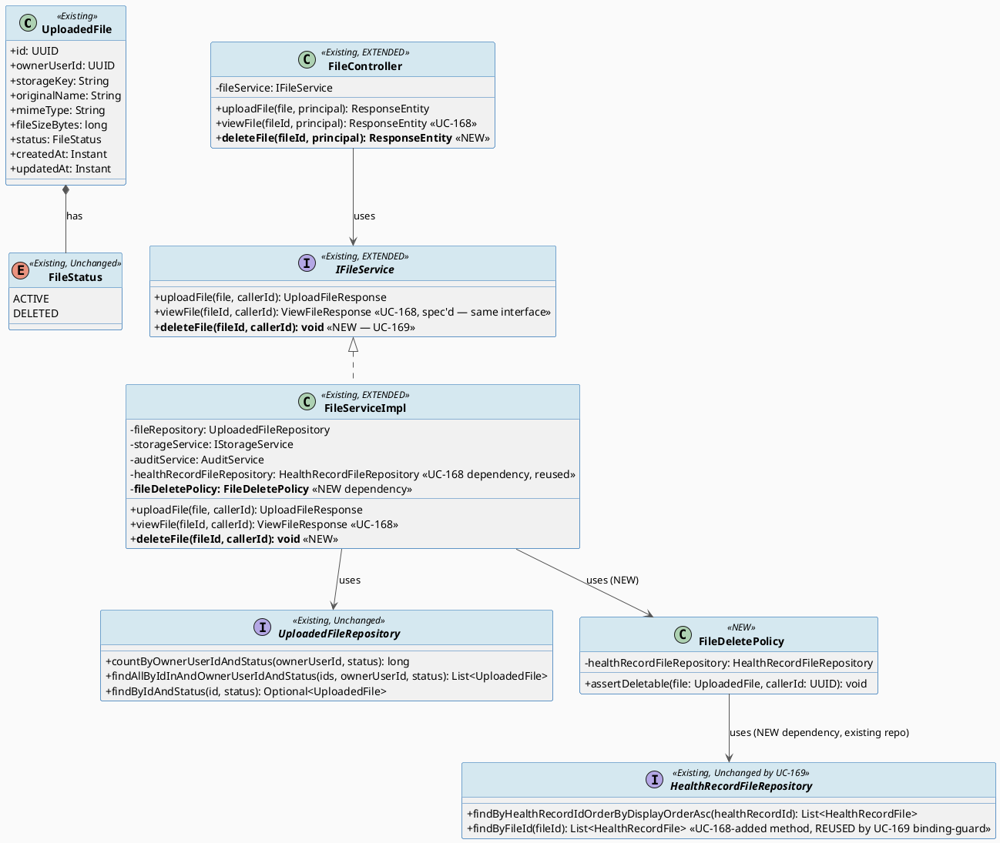
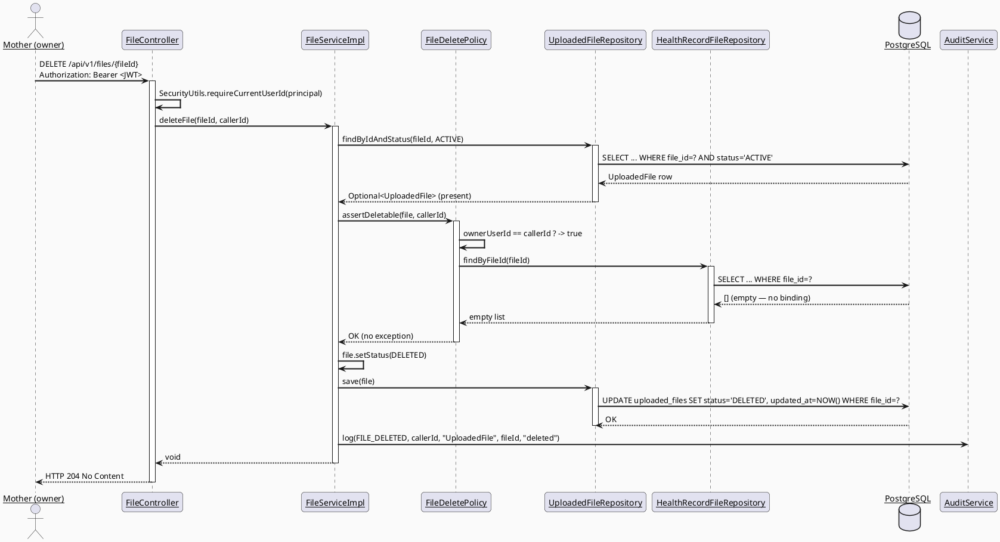
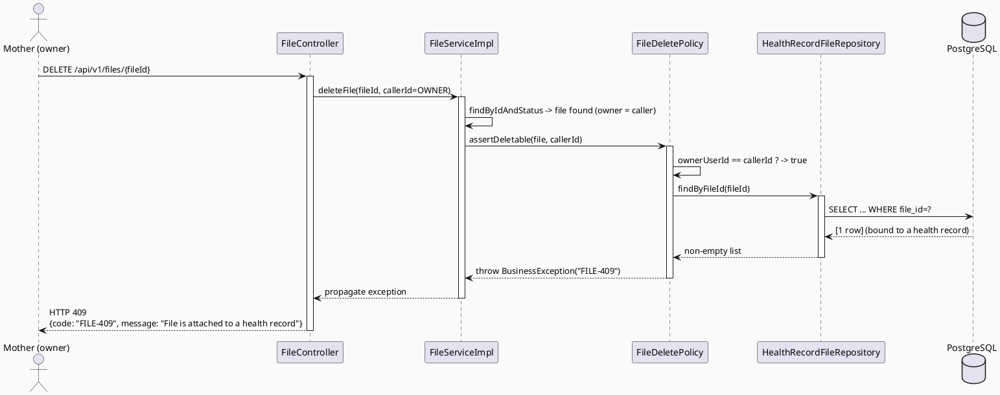
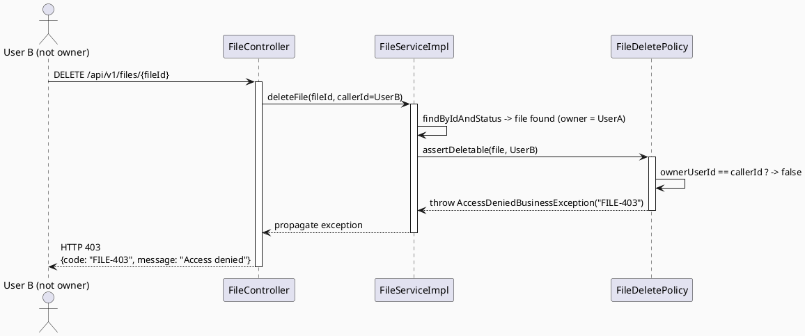
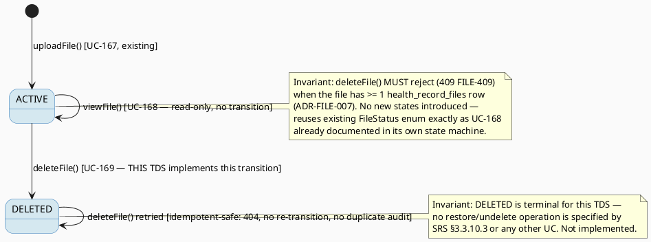

# ENGINEERING DOCUMENTATION STANDARD (EDS) v2.0
# Technical Design Specification — UC169 Delete File

| Field | Value |
|-------|-------|
| **Document ID** | `CB-FILE-IMP-169` |
| **Version** | `1.0` |
| **Date** | `2026-07-03` |
| **Status** | `Implemented` |
| **Document Owner** | `TV2-Bách` |
| **Author** | `AI Agent` |
| **Reviewed by** | `[Pending — Tech Lead]` |
| **DPO Sign-off** | `[ ] Pending` *(PII module — health/baby files)* |
| **Approved by** | `[Pending — Principal Architect]` |
| **Last Review** | `2026-07-03` |
| **Based on EDS** | `v2.0` |

---

## CHANGELOG

| Ngày | Người thực hiện | Nội dung thay đổi |
|------|-----------------|-------------------|
| 2026-07-06 | AI Agent — Amelia (Dev Agent) | Implemented — FileDeletePolicyImpl, IFileService.deleteFile(), FileController DELETE /{fileId} (MOTHER-only), FILE_DELETED audit, soft-delete only (ADR-FILE-008); 31 unit tests GREEN |
| 2026-07-03 | AI Agent | Tạo tài liệu lần đầu — TDS cho UC169 Delete File |

---

## MỤC LỤC

1. [Tổng quan Module](#1-tổng-quan-module)
2. [Ma trận Truy vết (Traceability Matrix)](#2-ma-trận-truy-vết-traceability-matrix)
3. [Architecture Decision Records (ADR)](#3-architecture-decision-records-adr)
4. [Non-Functional Requirements & SLA](#4-non-functional-requirements--sla)
5. [Static Modeling](#5-static-modeling-mô-hình-tĩnh)
6. [Dynamic Modeling](#6-dynamic-modeling-mô-hình-động)
7. [Domain Event Catalog](#7-domain-event-catalog)
8. [Interface Specification](#8-interface-specification-đặc-tả-giao-diện)
9. [API Specification](#9-api-specification)
10. [Bảng mã lỗi (Error Codes)](#10-bảng-mã-lỗi-error-codes)
11. [Quy trình Triển khai](#11-quy-trình-triển-khai-step-by-step)
12. [Rollback & Incident Runbook](#12-rollback--incident-runbook)
13. [Kịch bản Kiểm thử Chi tiết](#13-kịch-bản-kiểm-thử-chi-tiết)
14. [Phương pháp Xác minh](#14-phương-pháp-xác-minh)
15. [Mẫu thử thực tế](#15-mẫu-thử-thực-tế-api-verification-samples)
16. [Bảng tổng hợp phân quyền](#16-bảng-tổng-hợp-phân-quyền-authorization-matrix)
17. [AI Prompt Constraints (CASE 2.0)](#17-ai-prompt-constraints-case-20)

---

## 1. Tổng quan Module

| Field | Value |
|-------|-------|
| **Module Name** | File Management — Delete File (UC-169) |
| **Bounded Context** | `file` (extends the same `com.carebridge.backend.file` package established by UC-167 Upload File and UC-168 View File) |
| **Data Classification** | `PII` / `Sensitive-PII` (medical documents, ultrasound images, baby photos) |
| **Compliance Scope** | `PDPA` |
| **Upstream Dependencies** | `UploadedFileRepository` (existing), `HealthRecordFileRepository` (existing, extended by UC-168), `IStorageService` (existing — `delete()` NOT invoked, see ADR-FILE-008), `AuditService` (existing) |
| **Downstream Consumers** | Mobile App (baby logs, health records screens) — files removed from listing/detail views after soft-delete |

**SRS Reference:** §3.3.10.3 "Delete File" (`02_Requirements/SRS/3_Functional_Specification.md` lines 4003-4020), Table 208.
**Description (SRS):** "Soft-deletes an uploaded file when it is not bound by records, consultations, or retention policy."
**Primary Actor:** Mother (Secondary Actors: None).
**Platform (SRS §Other Information):** `Mobile App`; `Source group: Mobile App - File Management` (consistent for this row — no App/Web conflict here, unlike UC-168's row).
**Priority:** High. **Frequency of Use:** Occasional. **Business Rules:** `BR-RBAC` (role/permission scope), `BR-PRIVACY` (health/family data consent, purpose, minimum-necessary access), `BR-CONSULTATION` (booking/payment/dispute/refund/pricing actions must keep an auditable lifecycle state — interpreted below in ADR-FILE-007 since UC-169 itself performs no booking/payment action).

---

## 2. Ma trận Truy vết (Traceability Matrix)

| Requirement ID | Loại | Mô tả yêu cầu | Thành phần Code | Compliance Target | ADR liên quan |
|----------------|------|---------------|-----------------|--------------------|---------------|
| UC-169 (SRS §3.3.10.3) | User Story | Soft-delete an uploaded file when not bound by records/consultations/retention policy | `FileController.deleteFile()` (NEW), `FileServiceImpl.deleteFile()` (NEW) | — | ADR-FILE-007, ADR-FILE-008 |
| BR-RBAC | Business Rule | Users may access only functions allowed by role/permission scope | `FileController.deleteFile()` `@PreAuthorize("hasRole('MOTHER')")`, `FileDeletePolicy.assertDeletable()` (NEW) | PDPA minimum-necessary | ADR-FILE-007 |
| BR-PRIVACY | Business Rule | Health/family data must follow consent, purpose, minimum-necessary access | `FileDeletePolicy` (NEW) — ownership check | PDPA | ADR-FILE-007 |
| BR-CONSULTATION | Business Rule | Booking/payment/dispute/refund/pricing actions must keep auditable lifecycle state | N/A — no `consultation_bookings` ↔ `uploaded_files` linkage exists in schema (confirmed, §3 ADR-FILE-007); interpreted as "do not delete a file whose removal would break an auditable record" — covered by the `health_record_files` binding-guard, since health records feed consultation context | ADR-FILE-007 (Option chosen) |
| ADR-FILE-003 (UC-167, existing) | Decision | `storageKey` is UUID-based, never derived from `originalName` | `FileServiceImpl.uploadFile()` (existing — reused, no change) | — | — |
| ADR-FILE-005 (UC-168) | Decision | Access-scope resolution model (owner / care-group-sharing / admin) — reused conceptually for the ownership check, but UC-169 restricts to STRICT OWNER ONLY (Mother is Primary Actor, no sharing-based delete grant per SRS) | `FileDeletePolicy.assertDeletable()` (NEW) | PDPA | ADR-FILE-007 |
| ADR-FILE-006 (UC-168) | Decision | `FileStatus` enum (`ACTIVE`/`DELETED`) reused unchanged as the soft-delete state machine | `FileServiceImpl.deleteFile()` (NEW), reuses existing `FileStatus.DELETED` | — | ADR-FILE-008 |

---

## 3. Architecture Decision Records (ADR)

### ADR-FILE-007 — Deletion-binding guard: "not bound by records/consultations/retention policy"

| Field | Value |
|-------|-------|
| **Status** | `Proposed` |
| **Deciders** | `AI Agent (Technical Architect role)`, pending Tech Lead review |
| **Date** | `2026-07-03` |
| **Supersedes** | — |

#### Bối cảnh (Context)
SRS §3.3.10.3 requires a file to be soft-deletable only "when it is not bound by records, consultations, or retention policy." This is the same "binding" question UC-168's ADR-FILE-005 partially investigated for *access scope* (not deletion). Reading the schema directly (`V1__init_schema.sql` full-text search for `file_id` FKs, and both file-domain migrations `V20260627100000__create_uploaded_files.sql` / `V20260627100100__create_health_record_files.sql`):

1. **Records binding:** `health_record_files` (`fk_hrf_file FOREIGN KEY (file_id) REFERENCES uploaded_files(file_id)`, no `ON DELETE CASCADE`/`SET NULL` clause — the FK exists purely as a referential link at the application layer since `uploaded_files` rows are never hard-deleted by application code) is the ONLY existing table with a `file_id` FK into `uploaded_files`. This is the "records" binding.
2. **Consultations binding:** No column or join table anywhere in `V1__init_schema.sql` or any Flyway migration references `uploaded_files.file_id` from `consultation_bookings`, `consultation_sessions`, or any consultation-domain table (verified: full-text search for `file_id` across all migrations returns only `health_record_files`). There is currently **no code path that attaches a file to a consultation.** BR-CONSULTATION's auditable-lifecycle-state requirement is therefore satisfied vacuously today — there is nothing to break.
3. **Retention policy binding:** No `retention_policy`/`retention_until`/`legal_hold` column exists on `uploaded_files` or anywhere in the schema. No product-defined retention duration exists for files (mirrors UC-168's OI-168-2 finding for "sharing period" — no persisted expiry concept exists in this domain yet).

#### Các phương án đã xem xét (Options Considered)

| Phương án | Mô tả | Ưu điểm | Nhược điểm |
|-----------|-------|----------|------------|
| A | Block deletion only if `health_record_files` has ≥ 1 row referencing the file (records-binding only); ignore consultations/retention since no schema linkage exists for them | Matches actual schema; no invented rule; smallest scoped change | Does not literally implement "consultations" or "retention" guard text — but there is nothing in the schema to guard against today |
| B | Block deletion if referenced by `health_record_files` OR add a new `consultation_files`/`retention` check by inventing new tables/columns | Would literally satisfy every noun in the SRS sentence | Invents undocumented business rules and schema (violates CLAUDE.md "smallest scoped change" and Research Gate RG-6 — no product decision defines retention duration or consultation-file linkage); over-engineered for zero known callers |
| C | Allow deletion unconditionally (ignore "not bound by" clause entirely) | Simplest | Directly contradicts SRS description — file could be deleted while referenced by a health record, breaking family/expert-viewed history; rejected |

#### Quyết định (Decision)
Chọn **Phương án A**. `FileDeletePolicy.assertDeletable(file, callerId)` returns allowed (no exception) only when ALL of:
1. `file.ownerUserId == callerId` (strict ownership — Mother deletes only her own files; no admin/family override for delete, unlike UC-168's view-scope which allows admin/family read access), AND
2. `healthRecordFileRepository.findByFileId(file.getId())` returns an **empty list** (the "records" binding guard — file not attached to any health record), AND
3. (Consultations guard: vacuously satisfied — no schema linkage exists to check; explicitly logged as **OI-169-1, Open**, consistent in framing with UC-168's OI-168-1 unresolved consent/ACL question), AND
4. (Retention guard: vacuously satisfied — no retention column/policy exists; explicitly logged as **OI-169-2, Open**, consistent in framing with UC-168's OI-168-2 unresolved "sharing period" duration question).

If condition 2 fails, throw `BusinessException` mapped to `FILE-409` ("file is attached to a health record, remove the attachment first"). If condition 1 fails, throw `AccessDeniedBusinessException` mapped to `FILE-403`.

#### Hệ quả (Consequences)

**Tích cực:**
- Zero new migration; reuses the exact same `health_record_files` linkage table UC-168 already reads for its access-scope chain.
- Deletion cannot silently break a health record's file history (main real risk in the current schema).
- Consistent, non-contradictory Open-item framing with UC-168 (both leave "no per-file grant/retention model exists yet" as an explicit unresolved product question, not silently invented).

**Tiêu cực / Trade-offs:**
- Does not literally enforce a "consultation" or "retention" guard because no such schema/business rule currently exists to enforce — flagged as OI-169-1 and OI-169-2 (Open) rather than silently resolved. If product later defines consultation-file attachment or a retention-duration rule, `FileDeletePolicy` MUST be revisited (this ADR superseded) and a migration added then.
- Unlike UC-168 (which allows care-group-shared FAMILY/EXPERT/admin roles to *view*), UC-169 restricts *delete* to the file's owner only — no role bypass. This asymmetry is intentional: SRS §3.3.10.3 Primary Actor is explicitly "Mother" (not generic "User" as in View File), and irreversible-by-app-users soft-delete of PII should not be extendable to non-owners without an explicit product decision.

**Compliance Impact:**
- PDPA minimum-necessary: deletion is a data-subject-initiated action on the subject's own data; no new sharing/exposure risk introduced.
- BR-PRIVACY: satisfied — only the owner (Mother) can trigger deletion of her own file.

---

### ADR-FILE-008 — Soft-delete semantics reuse the existing `FileStatus.DELETED` enum value; no hard delete

| Field | Value |
|-------|-------|
| **Status** | `Proposed` |
| **Deciders** | `AI Agent`, pending Tech Lead review |
| **Date** | `2026-07-03` |

#### Bối cảnh (Context)
`FileStatus` enum (`com.carebridge.backend.file.entity.FileStatus`) already has exactly two values: `ACTIVE`, `DELETED` (confirmed by reading the file directly — unchanged since UC-167). UC-168's TDS state machine (§6.3 of `UC168_ViewFile_TDS.md`) already documents the transition `ACTIVE --> DELETED : deleteFile() [UC-169 — see UC169 TDS]` as a forward-reference to this exact TDS, confirming both UCs were designed against the **same** `FileStatus` enum, not a parallel one. `IStorageService.delete(String key)` (existing method on the same interface used for `store()`/`generatePresignedUrl()`) performs a **permanent** object-storage delete and is currently unused by any caller.

#### Các phương án đã xem xét (Options Considered)

| Phương án | Mô tả | Ưu điểm | Nhược điểm |
|-----------|-------|----------|------------|
| A | Soft-delete only: `UPDATE uploaded_files SET status='DELETED'` via JPA save; row and storage object both preserved | Reversible (data-recovery / audit-friendly); matches SRS wording "Soft-deletes"; matches CLAUDE.md "never expose... never hard-delete for PII without explicit instruction"; zero storage-layer risk | Storage bytes remain until a separate retention/purge job exists (out of scope — OI-169-2) |
| B | Soft-delete DB row AND call `IStorageService.delete(storageKey)` to remove the physical object immediately | Frees storage space immediately | Irreversible — contradicts "soft-delete"; a `viewFile()` call racing before storage delete could 500 rather than 404; no product requirement asks for immediate physical purge |
| C | Hard-delete the `uploaded_files` row (`repository.delete(file)`) | Simplest | Directly violates SRS "Soft-deletes"; would break the `fk_hrf_file` FK if any stale reference existed; irreversible; rejected outright |

#### Quyết định (Decision)
Chọn **Phương án A**. `deleteFile()` sets `file.setStatus(FileStatus.DELETED)` and saves via the existing `UploadedFileRepository` (standard JPA `save()`, no new repository method required for the write path since `JpaRepository.save()` is already inherited). **`IStorageService.delete()` is explicitly NOT called** by this use case — physical storage purge is out of scope (flagged **OI-169-3, Open** — a future retention/purge job, consistent with the vacuous retention-guard finding in ADR-FILE-007).

#### Hệ quả (Consequences)

**Tích cực:**
- Zero schema risk, zero new enum value; reuses exactly the state machine UC-168 already documented and expects.
- `viewFile()` (UC-168, once implemented) automatically stops returning a deleted file via its existing `findByIdAndStatus(id, ACTIVE)` guard — no cross-UC coordination needed beyond the shared enum.
- Reversible at the DB layer if a future "restore file" feature is ever approved (not promised by this TDS — just a side-benefit of not hard-deleting).

**Tiêu cực / Trade-offs:**
- Storage bytes are not freed until a separate purge/retention job exists (OI-169-3, Open).

**Compliance Impact:**
- PDPA: soft-delete satisfies "right to erasure"-adjacent UX (file disappears from all user-facing views) without prematurely destroying an audit trail that DPO/Moderator oversight may still need — consistent with SRS POST-3 ("sensitive actions are recorded for audit").

---

## 4. Non-Functional Requirements & SLA

### 4.1. Performance & Availability

| Category | Requirement | Target SLA | Measurement Method | Compliance Basis |
|----------|-------------|------------|---------------------|-------------------|
| Latency | `DELETE /api/v1/files/{fileId}` (p99) | < 300ms | Manual timing / future k6 | — |
| Availability | Depends on existing PostgreSQL only (no storage-layer call, per ADR-FILE-008) | Same as UC-167/168 | — | — |

### 4.2. Data Integrity & Retention

| Category | Requirement | Target | Verification Method | Compliance Basis |
|----------|-------------|--------|----------------------|-------------------|
| Consistency | Delete never succeeds for a file with ≥ 1 `health_record_files` row | 100% | `FileDeletePolicy.assertDeletable()` (NEW) | SRS §3.3.10.3, ADR-FILE-007 |
| Consistency | Delete is idempotent-safe: deleting an already-`DELETED` file returns 404, not a duplicate audit entry | 100% | `findByIdAndStatus(id, ACTIVE)` (existing repo method, reused) | PDPA |
| Audit | Every successful delete is logged | 100% | `AuditAction.FILE_DELETED` (NEW enum value) via `AuditService.log()` | PDPA / SRS POST-3 |
| Data preservation | Row is never hard-deleted; `storageKey`/`originalName`/etc. remain intact post-delete | 100% | DB inspection query §14.1 | ADR-FILE-008 |

### 4.3. Security

| Category | Requirement | Target | Verification Method | Compliance Basis |
|----------|-------------|--------|----------------------|-------------------|
| Access control | Owner-only (strict — no care-group/admin bypass for delete) | Least privilege | `FileDeletePolicy.assertDeletable()` (NEW) + Auth Matrix §16 | PDPA, BR-RBAC, BR-PRIVACY |
| IDOR prevention | `fileId` not guessable / not sufficient alone to delete another user's file | 403 for non-owner caller | Test §13 IDOR cases | OWASP A01:2021 |
| Binding-guard bypass prevention | No code path may delete a file while `health_record_files` still references it | 100% enforced at service layer, not merely UI-level | Test §13 CRITICAL binding-guard cases | SRS §3.3.10.3 |

### 4.4. Scalability & Capacity Planning
No new capacity concerns — write path only touches one row (`uploaded_files.status`) plus one read (`health_record_files` existence check via existing index `idx_hrf_file_id`). Reuses existing indexes (`idx_uploaded_files_owner`, `idx_uploaded_files_status`, `idx_hrf_file_id`).

---

## 5. Static Modeling (Mô hình Tĩnh)

### 5.1. Class Diagram (PlantUML)



### 5.2. Data Structure (Flyway SQL Migration)

> **No new migration required for UC-169.** Confirmed by reading `V20260627100000__create_uploaded_files.sql` (defines `status` column, already supports `DELETED`) and `V20260627100100__create_health_record_files.sql` (defines `fk_hrf_file` FK used as the binding-guard) in full: all columns/FKs needed for ADR-FILE-007 (binding guard) and ADR-FILE-008 (soft-delete semantics) already exist. No `ALTER TABLE` needed.

Consistent with UC168's documented Open items: if a future explicit consultation-file linkage (OI-169-1) or retention-policy column (OI-169-2) is approved, the reserved next migration version for this feature family is `V20260706111000`+ (a sub-range within the `110000` range UC-168 already reserved via `V20260706110000__create_file_shares.sql` for its own Open item OI-168-1 — this TDS uses a distinct, non-colliding sub-version `V20260706111000` to avoid any future collision with UC-168's reserved version). **Not created in this pass — Open item only.**

---

## 6. Dynamic Modeling (Mô hình Động)

### 6.1. Sequence Diagram — Happy Path (Owner deletes own unbound file)



### 6.2. Sequence Diagram — Error Path A (File bound to a health record → 409)



### 6.3. Sequence Diagram — Error Path B (Non-owner attempts delete → 403)



### 6.4. State Machine — File status (extends UC-168's diagram; UC-169 implements the transition)



> **Invariant bất biến:** `deleteFile()` is the ONLY operation across UC-167/168/169 that transitions `FileStatus` from `ACTIVE` to `DELETED`. The transition is guarded by `findByIdAndStatus(id, ACTIVE)` (existing repo method, reused — an already-`DELETED` or non-existent file both surface as `Optional.empty()`, mapped uniformly to `FILE-404`, avoiding an existence-leak to non-owners exactly as UC-168's `viewFile()` already does for the same reason).

---

## 7. Domain Event Catalog

### 7.1. Events Published (Phát ra)

| Event Name | Trigger | Publisher | Subscriber(s) | Payload Schema | Async? |
|------------|---------|-----------|----------------|------------------|--------|
| `FileDeleted` | Successful `deleteFile()` call passing ownership + binding-guard checks | `FileServiceImpl` | `AuditService` (via `AuditAction.FILE_DELETED`) | `FileDeleted.java` | No (synchronous `AuditService.log()`, matches existing `FILE_UPLOADED`/`FILE_VIEWED` pattern) |

### 7.2. Events Consumed (Tiêu thụ)
None — UC-169 does not consume events from other modules.

### 7.3. Payload Schema

```java
// Conceptual payload passed to AuditService.log(AuditAction.FILE_DELETED, callerId, "UploadedFile", fileId.toString(), details)
// Matches existing AuditService.log(...) signature — no new event bus/record type introduced.
// "details" argument (Object, per existing AuditService contract):
public record FileDeletedDetails(
    String originalName,   // preserved for audit trail readability (row itself is not hard-deleted, but kept here for log clarity)
    String previousStatus  // always "ACTIVE" — the pre-transition value, for audit completeness
) {}
```

---

## 8. Interface Specification (Đặc tả Giao diện)

### 8.1. Service Interface — EXTENDS existing `IFileService`

```java
// File: src/main/java/com/carebridge/backend/file/service/IFileService.java (EXISTING FILE — add one method)
// @version 1.2 — adds deleteFile(); uploadFile()/viewFile() signatures UNCHANGED
public interface IFileService {

    /** @throws BusinessException (FILE-002/413) if > 20MB */
    UploadFileResponse uploadFile(MultipartFile file, UUID callerId);   // EXISTING — unchanged

    /**
     * UC-168: Preview/download a file within valid access scope and sharing period.
     * @throws ResourceNotFoundException (FILE-404) if file does not exist or is soft-deleted
     * @throws AccessDeniedBusinessException (FILE-403) if callerId is not the owner,
     *         not in a care-group sharing the file's linked health record's baby, and not an admin role
     */
    ViewFileResponse viewFile(UUID fileId, UUID callerId);   // UC-168 — spec'd, same interface (unchanged by UC-169)

    /**
     * UC-169: Soft-delete a file when not bound by records/consultations/retention policy.
     * @throws ResourceNotFoundException (FILE-404) if file does not exist or is already soft-deleted
     * @throws AccessDeniedBusinessException (FILE-403) if callerId is not the file's owner
     * @throws BusinessException (FILE-409) if the file is referenced by >= 1 health_record_files row
     */
    void deleteFile(UUID fileId, UUID callerId);   // NEW
}
```

### 8.2. Policy Interface (NEW)

```java
// File: src/main/java/com/carebridge/backend/file/policy/FileDeletePolicy.java (NEW FILE)
// @version 1.0
package com.carebridge.backend.file.policy;

import com.carebridge.backend.file.entity.UploadedFile;
import java.util.UUID;

public interface FileDeletePolicy {
    /**
     * @throws com.carebridge.backend.common.exception.AccessDeniedBusinessException (FILE-403)
     *         when callerId is not file.ownerUserId (strict owner-only — no sharing/admin bypass, ADR-FILE-007).
     * @throws com.carebridge.backend.common.exception.BusinessException (FILE-409)
     *         when the file is referenced by >= 1 row in health_record_files (ADR-FILE-007 binding guard).
     */
    void assertDeletable(UploadedFile file, UUID callerId);
}
```

### 8.3. Repository Interface — NO changes required

```java
// File: src/main/java/com/carebridge/backend/file/repository/UploadedFileRepository.java (EXISTING — UNCHANGED)
// findByIdAndStatus(id, ACTIVE) (existing) is reused as-is for deleteFile()'s lookup.
// Inherited JpaRepository.save(entity) (existing, from Spring Data) is reused as-is for the status UPDATE — no new @Modifying/@Query method needed.

// File: src/main/java/com/carebridge/backend/health/repository/HealthRecordFileRepository.java (EXISTING — UNCHANGED by UC-169)
// findByFileId(UUID fileId) — added by UC-168, REUSED here by FileDeletePolicy as the binding-guard read.
```

> **RG-3 Explicit Method Inventory (no duplication):**
> - `IFileService`: EXISTING `uploadFile()` (UC-167); UC-168-spec'd `viewFile()` (unchanged by this TDS); **NEW** `deleteFile()` (this TDS).
> - `FileServiceImpl`: same three methods, `deleteFile()` is the only NEW implementation added here.
> - `FileController`: EXISTING `POST /` (`uploadFile`); UC-168-spec'd `GET /{fileId}` (`viewFile`, unchanged); **NEW** `DELETE /{fileId}` (`deleteFile`).
> - `UploadedFileRepository`: **NO new method** — reuses existing `findByIdAndStatus()` + inherited `save()`.
> - `HealthRecordFileRepository`: **NO new method** — reuses UC-168's already-added `findByFileId()`.
> - `FileDeletePolicy`: entirely **NEW** interface/impl (parallel to UC-168's `FileAccessPolicy`, same `policy` package layer, no overlap — `FileAccessPolicy` governs *view* scope, `FileDeletePolicy` governs *delete* eligibility; they are deliberately separate policies since their rules differ, per CLAUDE.md "Policy: reusable domain rules").

---

## 9. API Specification

### 9.1. Endpoints Table

| Method | Path | Auth Level | Required Roles | Rate Limit | Idempotent? |
|--------|------|------------|-----------------|------------|-------------|
| `POST` | `/api/v1/files` | JWT Bearer | `MOTHER` | — | No | *(existing, UC-167, unchanged)* |
| `GET` | `/api/v1/files/{fileId}` | JWT Bearer | Any authenticated role (scope enforced in service) | 300/min | Yes | *(UC-168, spec'd, unchanged by this TDS)* |
| `DELETE` | `/api/v1/files/{fileId}` | JWT Bearer | `MOTHER` (ownership additionally enforced in service — `@PreAuthorize` role gate is necessary but not sufficient) | 60/min | Yes | **NEW** |

### 9.2. Request / Response Schemas

#### `DELETE /api/v1/files/{fileId}` — Soft-delete a file

**Path Param:** `fileId` (UUID)

**Response — 204 No Content (Happy Path):**
```
(empty body)
```

**Response — 403 Forbidden (Not the owner):**
```json
{
  "error": { "code": "FILE-403", "message": "You do not have access to this file" }
}
```

**Response — 404 Not Found (file missing or already soft-deleted):**
```json
{
  "error": { "code": "FILE-404", "message": "File not found" }
}
```

**Response — 409 Conflict (bound by a health record):**
```json
{
  "error": { "code": "FILE-409", "message": "File is attached to a health record and cannot be deleted" }
}
```

---

## 10. Bảng mã lỗi (Error Codes)

| Code | HTTP Status | Message (EN) | Message (VI) | Trigger Condition |
|------|-------------|---------------|----------------|---------------------|
| `FILE-403` | 403 | Access denied | Không đủ quyền truy cập tệp | Caller is not `file.ownerUserId` (ADR-FILE-007 rule 1) — reused code from UC-168, same semantic meaning |
| `FILE-404` | 404 | File not found | Không tìm thấy tệp | `fileId` does not exist OR `status = DELETED` (reused code from UC-168, same guard) |
| `FILE-409` | 409 | File is attached to a health record and cannot be deleted | Tệp đang được đính kèm vào hồ sơ sức khỏe, không thể xóa | `health_record_files` has ≥ 1 row referencing `fileId` (ADR-FILE-007 rule 2) — **NEW code, this TDS** |

> Reuses existing `FILE-001..FILE-004` (upload-only codes, unchanged) from UC-167 and `FILE-403`/`FILE-404` (unchanged semantics) from UC-168. `FILE-409` is new, module-scoped, non-overlapping.

---

## 11. Quy trình Triển khai (Step-by-Step)

### 11.1. Prerequisites
- [ ] ADR-FILE-007, ADR-FILE-008 Accepted (§3)
- [ ] DPO sign-off (PII — deletion of medical/baby images)
- [ ] No migration required (§5.2)
- [ ] UC-168's `HealthRecordFileRepository.findByFileId()` method exists (either already implemented by UC-168, or implemented alongside this TDS if UC-168 has not yet landed in code — see Open Item OI-169-4)

### 11.2. Pre-Migration Checklist
N/A — no migration for UC-169.

### 11.3. Implementation Steps

#### Chặng 1 — New `FileDeletePolicy` + impl
Create `05_Development/CareBridgeAPI/src/main/java/com/carebridge/backend/file/policy/FileDeletePolicy.java` (interface) and `FileDeletePolicyImpl.java` under `.../file/policy/impl/` (package-per-domain, `policy` layer per CLAUDE.md — same layer as UC-168's `FileAccessPolicy`, separate class).

#### Chặng 2 — Extend `IFileService` / `FileServiceImpl`
Add `deleteFile(UUID fileId, UUID callerId)` to existing `IFileService.java` and `FileServiceImpl.java`.

#### Chặng 3 — Extend `FileController`
Add `DELETE /{fileId}` handler to existing `FileController.java` — validation/mapping only, delegates entirely to `fileService.deleteFile()`.

#### Chặng 4 — Add `AuditAction.FILE_DELETED`
Add one enum value to existing `AuditAction.java` (alongside `FILE_UPLOADED`).

### 11.4. Deployment Checklist
- [ ] `./mvnw compile` clean
- [ ] `./mvnw test` green (existing `FileServiceImplTest` + new tests per Test-Spec)
- [ ] No business logic added to `FileController` (validation/mapping only, per CLAUDE.md)
- [ ] Confirm `FILE-409` binding-guard cannot be bypassed by any alternate code path (manual review)

---

## 12. Rollback & Incident Runbook

### 12.1. Trigger Conditions
| Điều kiện | Ngưỡng | Người quyết định |
|-----------|--------|---------------------|
| A file bound to a health record was deleted (guard bypassed) | Any occurrence | Tech Lead + DPO — treat as data-integrity incident |
| Non-owner successfully deleted another user's file (IDOR) | Any occurrence | Tech Lead + DPO — treat as security incident |
| Error rate on `DELETE /files/{id}` | > 5% in 5 min | On-call Engineer |

### 12.2. Rollback Procedure
```bash
# No migration to revert — code-only rollback
git revert <commit-hash-for-UC169-deleteFile>
./mvnw clean package
# Re-deploy previous artifact
```

### 12.3. Notification Protocol
Standard — DPO notified within 30 min if any binding-guard-bypass or IDOR-delete incident (PII integrity/exposure).

### 12.4. Post-Incident Review (PIR)
Standard EDS template, §12.4 of PHASE-3_TDS.md.

---

## 13. Kịch bản Kiểm thử Chi tiết

See companion document: `04_Implement/UC169_DeleteFile/UC169_DeleteFile_Test-Spec.md`.

---

## 14. Phương pháp Xác minh

### 14.1. Database Inspection
```sql
-- Verify a deleted file's status transition (soft-delete only, row preserved)
SELECT file_id, status, original_name, storage_key, updated_at
FROM uploaded_files WHERE file_id = '<uuid>';
-- Expected: status = 'DELETED', row still present, storage_key unchanged

-- Verify the binding-guard would have blocked deletion for a bound file
SELECT hrf.file_id, hrf.health_record_id
FROM health_record_files hrf
WHERE hrf.file_id = '<uuid>';
-- Expected: >= 1 row => deleteFile() must have thrown FILE-409, status must still be 'ACTIVE'
```

### 14.2. Log / Audit Verification
```bash
# Verify FILE_DELETED audit entries are being written
grep '"action":"FILE_DELETED"' logs/carebridge-api.log | head -5
```

---

## 15. Mẫu thử thực tế (API Verification Samples)

### 15.1. Happy Path
```bash
curl -X DELETE https://localhost:8080/api/v1/files/550e8400-e29b-41d4-a716-446655440000 \
  -H "Authorization: Bearer <JWT_OWNER>"
```
**Expected Response (204):** empty body, see §9.2.

### 15.2. Error Paths
```bash
# Non-owner -> 403
curl -X DELETE https://localhost:8080/api/v1/files/550e8400-e29b-41d4-a716-446655440000 \
  -H "Authorization: Bearer <JWT_STRANGER>"
# Expected: 403 FILE-403

# File bound to a health record -> 409
curl -X DELETE https://localhost:8080/api/v1/files/<bound-file-id> \
  -H "Authorization: Bearer <JWT_OWNER>"
# Expected: 409 FILE-409

# Already-deleted file -> 404
curl -X DELETE https://localhost:8080/api/v1/files/<already-deleted-file-id> \
  -H "Authorization: Bearer <JWT_OWNER>"
# Expected: 404 FILE-404

# No JWT -> 401
curl -X DELETE https://localhost:8080/api/v1/files/550e8400-e29b-41d4-a716-446655440000
# Expected: 401 IAM-001

# Non-MOTHER role (e.g. FAMILY) -> 403 at @PreAuthorize gate
curl -X DELETE https://localhost:8080/api/v1/files/550e8400-e29b-41d4-a716-446655440000 \
  -H "Authorization: Bearer <JWT_FAMILY_ROLE>"
# Expected: 403 (Spring Security @PreAuthorize denial, before service layer is reached)
```

---

## 16. Bảng tổng hợp phân quyền (Authorization Matrix)

| Endpoint | `MOTHER` (owner) | `MOTHER` (non-owner) | `FAMILY` (any, incl. shared care-group) | `EXPERT` | `MODERATOR/CONTENT_ADMIN/SYSTEM_ADMIN` | Unauthenticated |
|----------|:---:|:---:|:---:|:---:|:---:|:---:|
| `DELETE /api/v1/files/{fileId}` | ✅ Own (if unbound) | ❌ 403 | ❌ 403 (role gate — not `MOTHER`) | ❌ 403 (role gate) | ❌ 403 (role gate — no admin override for delete, unlike UC-168's view scope) | ❌ 401 |

**Chú thích:**
- Unlike UC-168's `viewFile()` (which grants admin roles oversight bypass and family/shared-care-group read access), `deleteFile()` grants **no role-based bypass whatsoever**. This is an intentional asymmetry: SRS §3.3.10.3's Primary Actor is explicitly "Mother" (not generic "User"), and irreversible-by-app-users soft-delete of PII should not be extendable to admin/family roles without an explicit, separately-approved product decision (flagged as **OI-169-5, Open** — "should MODERATOR/SYSTEM_ADMIN have an override delete capability for moderation/legal-hold purposes?" — out of scope for this TDS since SRS does not request it).
- `@PreAuthorize("hasRole('MOTHER')")` at the controller layer is the FIRST gate (role-based); `FileDeletePolicy.assertDeletable()` at the service layer is the SECOND gate (ownership-based) — both must pass. A `MOTHER` who does not own the file still receives 403 from the second gate.

---

## 17. AI Prompt Constraints (CASE 2.0)

### 17.1 Constraint Summary Table

| # | Constraint | Source (ADR/BR) | Last Verified |
|---|-----------|--------------------|------------------|
| C1 | MUST extend existing `IFileService`/`FileServiceImpl`/`FileController`/`UploadedFileRepository`/`HealthRecordFileRepository` — do NOT create a parallel `FileController`/`FileService`/`UploadedFile`-like entity | CLAUDE.md "smallest scoped change" | 2026-07-03 |
| C2 | Deletion eligibility MUST use `FileDeletePolicy.assertDeletable()` (strict owner-only AND zero `health_record_files` rows) — no ad-hoc checks inline in controller/service | ADR-FILE-007 | 2026-07-03 |
| C3 | Deletion MUST be a soft-delete (`status = DELETED` via existing `FileStatus` enum) — do NOT call `IStorageService.delete()`, do NOT hard-delete the row | ADR-FILE-008 | 2026-07-03 |
| C4 | `callerId` MUST come from `SecurityUtils.requireCurrentUserId(principal)` in controller, never trusted from request body | Existing pattern, `FileController.uploadFile()` | 2026-07-03 |
| C5 | Controller = validation/mapping only; all authorization + business logic lives in `FileServiceImpl`/`FileDeletePolicy` | CLAUDE.md Architecture rules | 2026-07-03 |
| C6 | `@PreAuthorize("hasRole('MOTHER')")` MUST be present on the controller endpoint (role gate) in addition to the service-layer ownership check (defense in depth) | ADR-FILE-007, §16 Auth Matrix | 2026-07-03 |

### 17.2 Constraint Injection Block

```
[CONSTRAINT BLOCK — Module: File Management / Delete File (UC-169)]
Theo TDS CB-FILE-IMP-169 và các ADR liên quan:

1. Extend existing IFileService/FileServiceImpl/FileController — KHÔNG tạo file/class song song.
2. Deletion eligibility bắt buộc qua FileDeletePolicy.assertDeletable() (strict owner-only AND health_record_files phải rỗng).
3. Soft-delete only: set status=DELETED trên UploadedFile hiện có — KHÔNG gọi IStorageService.delete(), KHÔNG hard-delete row.
4. callerId lấy từ SecurityUtils.requireCurrentUserId(principal) trong Controller.
5. Controller chỉ validation/mapping; toàn bộ business logic + authorization nằm ở Service/Policy layer.
6. @PreAuthorize("hasRole('MOTHER')") bắt buộc trên endpoint, cộng thêm ownership check ở service layer.

[CONTEXT BLOCK]
- Bounded Context: file
- Data Classification: PII / Sensitive-PII
- Compliance: PDPA
- Existing interfaces: §8 Service Interface + §8.2 Policy Interface
- Error codes: §10 (FILE-403, FILE-404, FILE-409)
- Auth matrix: §16

[TASK BLOCK]
Implement deleteFile() thỏa mãn constraints trên. Output phải tuân thủ §8/§9.
Tests phải cover §13 (companion Test-Spec).
```

### 17.3 Constraint Quality Checklist
- [x] Mỗi constraint traceable về ADR/BR cụ thể
- [x] Không có constraint generic
- [x] Constraint block ≥ 3 constraints
- [x] Reference §8 Interface
- [x] Reference §16 Auth Matrix

### 17.4 Anti-Pattern Detection

| AP-ID | Anti-Pattern | Dấu hiệu | Hành động |
|-------|--------------|-----------|-----------|
| AP-AI-001 | Unconstrained Gen | Code không match C1-C6 | Reject |
| AP-AI-003 | Implicit Decision | Code assumes a new `consultation_files`/`retention_policy` table without ADR update | Reject — ADR-FILE-007 explicitly rejects this for now (Option A) |
| AP-AI-005 | Hallucinated Contract | Code imports a `FileRetentionRepository`/`ConsultationFileRepository` that does not exist | Reject |
| AP-AI-006 (custom, this TDS) | Hard-delete substitution | Code calls `fileRepository.delete(file)` or `IStorageService.delete()` instead of soft-delete | Reject — ADR-FILE-008 explicitly rejects this |

---

## PHỤ LỤC

### A. Glossary
| Thuật ngữ | Định nghĩa |
|-----------|------------|
| Binding guard | The check that a file has zero `health_record_files` rows before deletion is permitted (ADR-FILE-007) |
| Soft-delete | Setting `FileStatus.DELETED` on the existing row; the row and its storage object are both preserved (ADR-FILE-008) |
| Deletion eligibility | The combined ownership + binding-guard check performed by `FileDeletePolicy.assertDeletable()` |

### B. Open Items

| ID | Description | Status |
|----|--------------|--------|
| OI-169-1 | "Consultations" binding-guard cannot be enforced because no schema linkage between `uploaded_files` and any consultation-domain table exists today (verified: no `file_id` FK on `consultation_bookings`/`consultation_sessions`). Vacuously satisfied for now. | **Open** — requires product decision if/when files are ever attached to consultations |
| OI-169-2 | "Retention policy" binding-guard cannot be enforced because no `retention_until`/`legal_hold` column or table exists anywhere in the schema (consistent with UC-168's OI-168-2 finding that no persisted expiry concept exists in the file domain). Vacuously satisfied for now. | **Open** — requires product decision on a retention-duration policy |
| OI-169-3 | Physical storage object (`storageKey` bytes in `IStorageService`) is never purged by this TDS — only the DB row's `status` flips. No retention/purge job exists yet. | **Open** — future scheduled job, out of scope for UC-169 |
| OI-169-4 | This TDS assumes `HealthRecordFileRepository.findByFileId()` (added by UC-168) exists in code by the time UC-169 is implemented. If UC-168 has not yet been implemented, this method must be added as a prerequisite step (see §11.1) — it is NOT to be re-added if UC-168 already added it (avoid duplication). | **Open** — sequencing dependency on UC-168's implementation status |
| OI-169-5 | No admin/moderator override-delete capability is specified for legal-hold or moderation-driven file removal (e.g. CSAM-adjacent content). SRS §3.3.10.3 Primary Actor is Mother-only; this TDS does not invent an admin bypass. | **Open** — requires explicit product/compliance decision, likely tied to UC-107 (HideOrDeleteContent) or a future moderation UC |

### C. Tài liệu tham chiếu
| Document | Path |
|----------|------|
| SRS §3.3.10.3 Delete File | `02_Requirements/SRS/3_Functional_Specification.md` (lines 4003-4020) |
| UC168 View File TDS (sibling, baseline reused) | `04_Implement/UC168_ViewFile/UC168_ViewFile_TDS.md` |
| `FileController` (existing) | `05_Development/CareBridgeAPI/src/main/java/com/carebridge/backend/file/controller/FileController.java` |
| `FileServiceImpl` (existing) | `05_Development/CareBridgeAPI/src/main/java/com/carebridge/backend/file/service/impl/FileServiceImpl.java` |
| `IFileService` (existing) | `05_Development/CareBridgeAPI/src/main/java/com/carebridge/backend/file/service/IFileService.java` |
| `UploadedFileRepository` (existing) | `05_Development/CareBridgeAPI/src/main/java/com/carebridge/backend/file/repository/UploadedFileRepository.java` |
| `UploadedFile` entity (existing) | `05_Development/CareBridgeAPI/src/main/java/com/carebridge/backend/file/entity/UploadedFile.java` |
| `FileStatus` enum (existing) | `05_Development/CareBridgeAPI/src/main/java/com/carebridge/backend/file/entity/FileStatus.java` |
| `IStorageService` (existing) | `05_Development/CareBridgeAPI/src/main/java/com/carebridge/backend/file/service/IStorageService.java` |
| `AuditAction` enum (existing) | `05_Development/CareBridgeAPI/src/main/java/com/carebridge/backend/audit/entity/AuditAction.java` |
| `V20260627100000__create_uploaded_files.sql` | `05_Development/CareBridgeAPI/src/main/resources/db/migration/V20260627100000__create_uploaded_files.sql` |
| `V20260627100100__create_health_record_files.sql` | `05_Development/CareBridgeAPI/src/main/resources/db/migration/V20260627100100__create_health_record_files.sql` |

---

*TDS for UC169 Delete File — Status: Draft. Awaiting Tech Lead + DPO review before Approved.*
